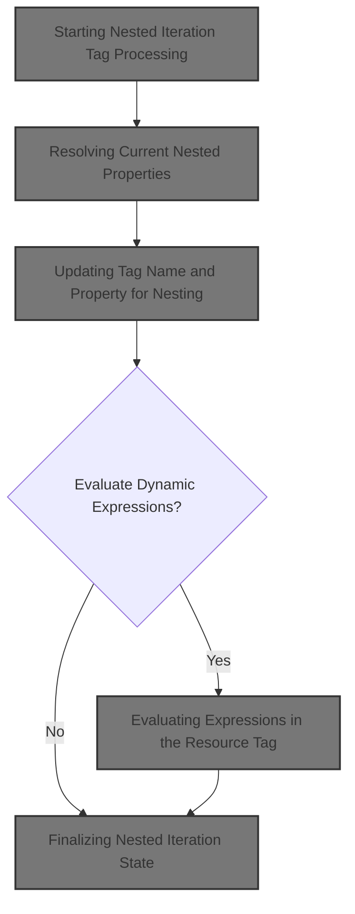
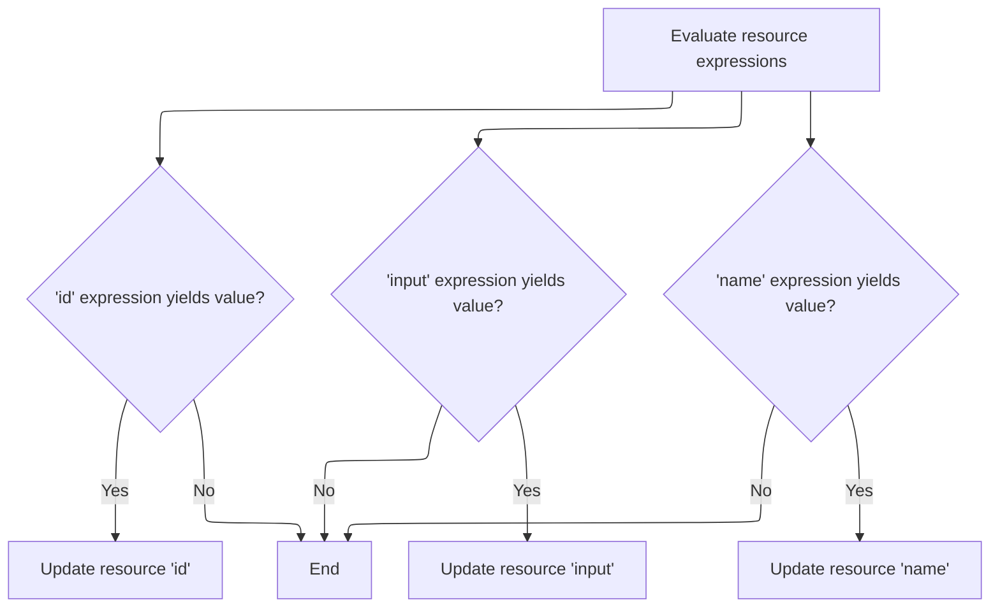

This document describes how nested iteration tags are processed to enable iteration over complex, nested data structures in JSP pages. The flow updates the tag's state to reflect the correct property path and context for each iteration, supporting accurate data binding in web applications.



# Starting Nested Iteration Tag Processing

```mermaid
%%{init: {"flowchart": {"defaultRenderer": "elk"}} }%%
flowchart TD
  node1["Start preparing for nested iteration"]
  click node1 openCode "taglib/src/main/java/org/apache/struts/taglib/nested/logic/NestedIterateTag.java:60:62"
  node1 --> node2["Determine iteration ID (use provided or
property)"]
  click node2 openCode "taglib/src/main/java/org/apache/struts/taglib/nested/logic/NestedIterateTag.java:66:68"
  node2 --> node3["Accessing the Servlet Request from the Action Context"]
  
  node3 --> node4["Get original nesting details"]
  click node4 openCode "taglib/src/main/java/org/apache/struts/taglib/nested/logic/NestedIterateTag.java:74:77"
  node4 --> node5{"Is bean name provided?"}
  click node5 openCode "taglib/src/main/java/org/apache/struts/taglib/nested/logic/NestedIterateTag.java:81:88"
  node5 -->|"No"| node6["Building the Adjusted Nested Property Path"]
  
  node5 -->|"Yes"| node7["Use provided property"]
  click node7 openCode "taglib/src/main/java/org/apache/struts/taglib/nested/logic/NestedIterateTag.java:87:87"
  node6 --> node8["Calculating the Relative Property Path"]
  
  node7 --> node8
  node8 --> node9["Updating Tag Name and Property for Nesting"]
  
  node9 --> node10["Evaluating Expressions in the Resource Tag"]
  
  node10 --> node11["Update context for next iteration"]
  click node11 openCode "taglib/src/main/java/org/apache/struts/taglib/nested/logic/NestedIterateTag.java:96:101"

classDef HeadingStyle fill:#777777,stroke:#333,stroke-width:2px;
click node3 goToHeading "Accessing the Servlet Request from the Action Context"
node3:::HeadingStyle
click node6 goToHeading "Building the Adjusted Nested Property Path"
node6:::HeadingStyle
click node8 goToHeading "Calculating the Relative Property Path"
node8:::HeadingStyle
click node9 goToHeading "Updating Tag Name and Property for Nesting"
node9:::HeadingStyle
click node10 goToHeading "Evaluating Expressions in the Resource Tag"
node10:::HeadingStyle

%% Swimm:
%% %%{init: {"flowchart": {"defaultRenderer": "elk"}} }%%
%% flowchart TD
%%   node1["Start preparing for nested iteration"]
%%   click node1 openCode "<SwmPath>[taglib/…/logic/NestedIterateTag.java](taglib/src/main/java/org/apache/struts/taglib/nested/logic/NestedIterateTag.java)</SwmPath>:60:62"
%%   node1 --> node2["Determine iteration ID (use provided or
%% property)"]
%%   click node2 openCode "<SwmPath>[taglib/…/logic/NestedIterateTag.java](taglib/src/main/java/org/apache/struts/taglib/nested/logic/NestedIterateTag.java)</SwmPath>:66:68"
%%   node2 --> node3["Accessing the Servlet Request from the Action Context"]
%%   
%%   node3 --> node4["Get original nesting details"]
%%   click node4 openCode "<SwmPath>[taglib/…/logic/NestedIterateTag.java](taglib/src/main/java/org/apache/struts/taglib/nested/logic/NestedIterateTag.java)</SwmPath>:74:77"
%%   node4 --> node5{"Is bean name provided?"}
%%   click node5 openCode "<SwmPath>[taglib/…/logic/NestedIterateTag.java](taglib/src/main/java/org/apache/struts/taglib/nested/logic/NestedIterateTag.java)</SwmPath>:81:88"
%%   node5 -->|"No"| node6["Building the Adjusted Nested Property Path"]
%%   
%%   node5 -->|"Yes"| node7["Use provided property"]
%%   click node7 openCode "<SwmPath>[taglib/…/logic/NestedIterateTag.java](taglib/src/main/java/org/apache/struts/taglib/nested/logic/NestedIterateTag.java)</SwmPath>:87:87"
%%   node6 --> node8["Calculating the Relative Property Path"]
%%   
%%   node7 --> node8
%%   node8 --> node9["Updating Tag Name and Property for Nesting"]
%%   
%%   node9 --> node10["Evaluating Expressions in the Resource Tag"]
%%   
%%   node10 --> node11["Update context for next iteration"]
%%   click node11 openCode "<SwmPath>[taglib/…/logic/NestedIterateTag.java](taglib/src/main/java/org/apache/struts/taglib/nested/logic/NestedIterateTag.java)</SwmPath>:96:101"
%% 
%% classDef HeadingStyle fill:#777777,stroke:#333,stroke-width:2px;
%% click node3 goToHeading "Accessing the Servlet Request from the Action Context"
%% node3:::HeadingStyle
%% click node6 goToHeading "Building the Adjusted Nested Property Path"
%% node6:::HeadingStyle
%% click node8 goToHeading "Calculating the Relative Property Path"
%% node8:::HeadingStyle
%% click node9 goToHeading "Updating Tag Name and Property for Nesting"
%% node9:::HeadingStyle
%% click node10 goToHeading "Evaluating Expressions in the Resource Tag"
%% node10:::HeadingStyle
```



<SwmSnippet path="/taglib/src/main/java/org/apache/struts/taglib/nested/logic/NestedIterateTag.java" line="60">

---

In <SwmToken path="taglib/src/main/java/org/apache/struts/taglib/nested/logic/NestedIterateTag.java" pos="60:5:5" line-data="    public int doStartTag() throws JspException {">`doStartTag`</SwmToken>, we're capturing the original tag state and prepping the id for downstream logic. We grab the <SwmToken path="taglib/src/main/java/org/apache/struts/taglib/nested/logic/NestedIterateTag.java" pos="71:1:1" line-data="        HttpServletRequest request =">`HttpServletRequest`</SwmToken> so we can access request-scoped attributes for nested property resolution. Next, we need to call into <SwmToken path="core/src/main/java/org/apache/struts/chain/contexts/ServletActionContext.java" pos="39:4:4" line-data="public class ServletActionContext extends WebActionContext {">`ServletActionContext`</SwmToken> to consistently retrieve the request in a chain-aware way.

```java
    public int doStartTag() throws JspException {
        // original values
        originalName = getName();
        originalProperty = getProperty();

        // set the ID to make the super tag happy
        if ((id == null) || (id.trim().length() == 0)) {
            id = property;
        }

        // the request object
        HttpServletRequest request =
            (HttpServletRequest) pageContext.getRequest();

```

---

</SwmSnippet>

## Accessing the Servlet Request from the Action Context

<SwmSnippet path="/core/src/main/java/org/apache/struts/chain/contexts/ServletActionContext.java" line="94">

---

<SwmToken path="core/src/main/java/org/apache/struts/chain/contexts/ServletActionContext.java" pos="94:5:5" line-data="    public HttpServletRequest getRequest() {">`getRequest`</SwmToken> just delegates to <SwmToken path="core/src/main/java/org/apache/struts/chain/contexts/ServletActionContext.java" pos="95:3:9" line-data="        return servletWebContext().getRequest();">`servletWebContext().getRequest()`</SwmToken>, abstracting how the request is fetched. This lets the framework swap out context implementations without changing tag logic.

```java
    public HttpServletRequest getRequest() {
        return servletWebContext().getRequest();
    }
```

---

</SwmSnippet>

<SwmSnippet path="/core/src/main/java/org/apache/struts/chain/contexts/ServletActionContext.java" line="67">

---

<SwmToken path="core/src/main/java/org/apache/struts/chain/contexts/ServletActionContext.java" pos="67:5:5" line-data="    protected ServletWebContext servletWebContext() {">`servletWebContext`</SwmToken> casts the base context to <SwmToken path="core/src/main/java/org/apache/struts/chain/contexts/ServletActionContext.java" pos="67:3:3" line-data="    protected ServletWebContext servletWebContext() {">`ServletWebContext`</SwmToken>, assuming it's always the right type. This is a shortcut—if the context isn't what we expect, things break at runtime.

```java
    protected ServletWebContext servletWebContext() {
        return (ServletWebContext) this.getBaseContext();
    }
```

---

</SwmSnippet>

## Resolving Current Nested Properties

<SwmSnippet path="/taglib/src/main/java/org/apache/struts/taglib/nested/logic/NestedIterateTag.java" line="74">

---

Back in `NestedIterateTag.doStartTag`, after getting the request, we grab the current nested property and name using <SwmToken path="taglib/src/main/java/org/apache/struts/taglib/nested/logic/NestedIterateTag.java" pos="75:5:5" line-data="        originalNesting = NestedPropertyHelper.getCurrentProperty(request);">`NestedPropertyHelper`</SwmToken>. This sets up the context for property resolution in nested tags. Next, we call into <SwmToken path="taglib/src/main/java/org/apache/struts/taglib/nested/logic/NestedIterateTag.java" pos="75:5:5" line-data="        originalNesting = NestedPropertyHelper.getCurrentProperty(request);">`NestedPropertyHelper`</SwmToken> to get the adjusted property string for this tag.

```java
        // original nesting details
        originalNesting = NestedPropertyHelper.getCurrentProperty(request);
        originalNestingName =
            NestedPropertyHelper.getCurrentName(request, this);

```

---

</SwmSnippet>

<SwmSnippet path="/taglib/src/main/java/org/apache/struts/taglib/nested/NestedPropertyHelper.java" line="81">

---

<SwmToken path="taglib/src/main/java/org/apache/struts/taglib/nested/NestedPropertyHelper.java" pos="81:9:9" line-data="    public static final String getCurrentName(HttpServletRequest request,">`getCurrentName`</SwmToken> checks for a <SwmToken path="taglib/src/main/java/org/apache/struts/taglib/nested/NestedPropertyHelper.java" pos="84:1:1" line-data="        NestedReference nr =">`NestedReference`</SwmToken> attribute in the request to get the current bean name. If that's missing, it walks up the tag hierarchy to find a <SwmToken path="taglib/src/main/java/org/apache/struts/taglib/nested/NestedPropertyHelper.java" pos="99:18:18" line-data="                if ((tag != null) &amp;&amp; tag instanceof FormTag) {">`FormTag`</SwmToken> and uses its bean name. This fallback ensures we always get some context for nested property resolution.

```java
    public static final String getCurrentName(HttpServletRequest request,
        NestedNameSupport nested) {
        // get the old one if any
        NestedReference nr =
            (NestedReference) request.getAttribute(NESTED_INCLUDES_KEY);

        // return null or the property
        if (nr != null) {
            return nr.getBeanName();
        } else {
            // need to look for a form tag...
            Tag tag = (Tag) nested;
            Tag formTag = null;

            // loop all parent tags until we get one that can be nested against
            do {
                tag = tag.getParent();

                if ((tag != null) && tag instanceof FormTag) {
                    formTag = tag;
                }
            } while ((formTag == null) && (tag != null));
```

---

</SwmSnippet>

<SwmSnippet path="/taglib/src/main/java/org/apache/struts/taglib/nested/logic/NestedIterateTag.java" line="79">

---

Back in `NestedIterateTag.doStartTag`, after restoring the nesting context, we decide whether to adjust the property path. If there's no bean name, we call <SwmToken path="taglib/src/main/java/org/apache/struts/taglib/nested/logic/NestedIterateTag.java" pos="84:1:1" line-data="                NestedPropertyHelper.getAdjustedProperty(request, getProperty());">`NestedPropertyHelper`</SwmToken> to build the full nested property string. Otherwise, we just use the property directly.

```java
        // set the bean if it's been provided
        // (the bean that's been provided! get it!?... nevermind)
        if (getName() == null) {
            // the qualified nesting value
            nesting =
                NestedPropertyHelper.getAdjustedProperty(request, getProperty());
        } else {
            // it's just the property
            nesting = getProperty();
        }

```

---

</SwmSnippet>

## Building the Adjusted Nested Property Path

<SwmSnippet path="/taglib/src/main/java/org/apache/struts/taglib/nested/NestedPropertyHelper.java" line="121">

---

<SwmToken path="taglib/src/main/java/org/apache/struts/taglib/nested/NestedPropertyHelper.java" pos="121:9:9" line-data="    public static final String getAdjustedProperty(HttpServletRequest request,">`getAdjustedProperty`</SwmToken> grabs the current parent property from the request and passes it, along with the property, to <SwmToken path="taglib/src/main/java/org/apache/struts/taglib/nested/NestedPropertyHelper.java" pos="126:3:3" line-data="        return calculateRelativeProperty(property, parent);">`calculateRelativeProperty`</SwmToken>. This step computes the correct property path for the nested context.

```java
    public static final String getAdjustedProperty(HttpServletRequest request,
        String property) {
        // get the old one if any
        String parent = getCurrentProperty(request);

        return calculateRelativeProperty(property, parent);
    }
```

---

</SwmSnippet>

## Calculating the Relative Property Path

<SwmSnippet path="/taglib/src/main/java/org/apache/struts/taglib/nested/NestedPropertyHelper.java" line="232">

---

In <SwmToken path="taglib/src/main/java/org/apache/struts/taglib/nested/NestedPropertyHelper.java" pos="232:7:7" line-data="    private static String calculateRelativeProperty(String property,">`calculateRelativeProperty`</SwmToken>, we handle special cases for './' and 'this/', then split the property and parent strings using different separators. The function figures out how much of the parent path to keep, then appends the property, building the correct nested path. Next, we tokenize the strings, similar to how ValidWhenLexer does token parsing.

```java
    private static String calculateRelativeProperty(String property,
        String parent) {
        if (parent == null) {
            parent = "";
        }

        if (property == null) {
            property = "";
        }

        /* Special case... reference my parent's nested property.
        Otherwise impossible for things like indexed properties */
        if ("./".equals(property) || "this/".equals(property)) {
            return parent;
        }

        /* remove the stepping from the property */
        String stepping;

        /* isolate a parent reference */
        if (property.endsWith("/")) {
            stepping = property;
            property = "";
        } else {
            stepping = property.substring(0, property.lastIndexOf('/') + 1);

            /* isolate the property */
            property =
                property.substring(property.lastIndexOf('/') + 1,
                    property.length());
        }

        if (stepping.startsWith("/")) {
            /* return from root */
            return property;
        } else {
            /* tokenize the nested property */
            StringTokenizer proT = new StringTokenizer(parent, ".");
            int propCount = proT.countTokens();

            /* tokenize the stepping */
            StringTokenizer strT = new StringTokenizer(stepping, "/");
            int count = strT.countTokens();

            if (count >= propCount) {
                /* return from root */
                return property;
            } else {
                /* append the tokens up to the token difference */
                count = propCount - count;

                StringBuffer result = new StringBuffer();

                for (int i = 0; i < count; i++) {
                    result.append(proT.nextToken());
                    result.append('.');
                }

```

---

</SwmSnippet>

### Tokenizing Property Path Segments

See <SwmLink doc-title="Tokenization of Validation Rules">[Tokenization of Validation Rules](/.swm/tokenization-of-validation-rules.kzm0jqab.sw.md)</SwmLink>

### Finalizing the Relative Property String

<SwmSnippet path="/taglib/src/main/java/org/apache/struts/taglib/nested/NestedPropertyHelper.java" line="290">

---

Back in <SwmToken path="taglib/src/main/java/org/apache/struts/taglib/nested/NestedPropertyHelper.java" pos="126:3:3" line-data="        return calculateRelativeProperty(property, parent);">`calculateRelativeProperty`</SwmToken>, after tokenizing, we append the property to the parent path and clean up any trailing dot. This gives us a valid property string for the nested context.

```java
                result.append(property);

                /* parent reference will have a dot on the end. Leave it off */
                if (result.charAt(result.length() - 1) == '.') {
                    return result.substring(0, result.length() - 1);
                } else {
                    return result.toString();
                }
            }
        }
    }
```

---

</SwmSnippet>

## Setting Nested Properties on the Tag

<SwmSnippet path="/taglib/src/main/java/org/apache/struts/taglib/nested/logic/NestedIterateTag.java" line="90">

---

Back in `NestedIterateTag.doStartTag`, after adjusting the property, we call <SwmToken path="taglib/src/main/java/org/apache/struts/taglib/nested/logic/NestedIterateTag.java" pos="91:3:3" line-data="        NestedPropertyHelper.setNestedProperties(request, this);">`setNestedProperties`</SwmToken> to update the tag's name and property fields based on the current request context. This syncs the tag state with the nesting hierarchy.

```java
        // set the properties
        NestedPropertyHelper.setNestedProperties(request, this);

```

---

</SwmSnippet>

## Updating Tag Name and Property for Nesting

```mermaid
%%{init: {"flowchart": {"defaultRenderer": "elk"}} }%%
flowchart TD
  node1{"Does tag support nested naming?"}
  click node1 openCode "taglib/src/main/java/org/apache/struts/taglib/nested/NestedPropertyHelper.java:180:189"
  node1 -->|"Yes"| node2{"Is tag name missing or default?"}
  node1 -->|"No"| node4{"Should property be updated for nested
context?"}
  node2 -->|"Yes"| node3["Set tag name from request context"]
  click node3 openCode "taglib/src/main/java/org/apache/struts/taglib/nested/NestedPropertyHelper.java:185:185"
  node2 -->|"No"| node4
  node3 --> node4
  node4{"Should property be updated for nested
context?"}
  click node4 openCode "taglib/src/main/java/org/apache/struts/taglib/nested/NestedPropertyHelper.java:194:196"
  node4 -->|"Yes"| node5["Update property for nested context"]
  click node5 openCode "taglib/src/main/java/org/apache/struts/taglib/nested/NestedPropertyHelper.java:195:195"
  node4 -->|"No"| node6["Set property on tag"]
  click node6 openCode "taglib/src/main/java/org/apache/struts/taglib/nested/NestedPropertyHelper.java:198:198"
  node5 --> node6
  
classDef HeadingStyle fill:#777777,stroke:#333,stroke-width:2px;

%% Swimm:
%% %%{init: {"flowchart": {"defaultRenderer": "elk"}} }%%
%% flowchart TD
%%   node1{"Does tag support nested naming?"}
%%   click node1 openCode "<SwmPath>[taglib/…/nested/NestedPropertyHelper.java](taglib/src/main/java/org/apache/struts/taglib/nested/NestedPropertyHelper.java)</SwmPath>:180:189"
%%   node1 -->|"Yes"| node2{"Is tag name missing or default?"}
%%   node1 -->|"No"| node4{"Should property be updated for nested
%% context?"}
%%   node2 -->|"Yes"| node3["Set tag name from request context"]
%%   click node3 openCode "<SwmPath>[taglib/…/nested/NestedPropertyHelper.java](taglib/src/main/java/org/apache/struts/taglib/nested/NestedPropertyHelper.java)</SwmPath>:185:185"
%%   node2 -->|"No"| node4
%%   node3 --> node4
%%   node4{"Should property be updated for nested
%% context?"}
%%   click node4 openCode "<SwmPath>[taglib/…/nested/NestedPropertyHelper.java](taglib/src/main/java/org/apache/struts/taglib/nested/NestedPropertyHelper.java)</SwmPath>:194:196"
%%   node4 -->|"Yes"| node5["Update property for nested context"]
%%   click node5 openCode "<SwmPath>[taglib/…/nested/NestedPropertyHelper.java](taglib/src/main/java/org/apache/struts/taglib/nested/NestedPropertyHelper.java)</SwmPath>:195:195"
%%   node4 -->|"No"| node6["Set property on tag"]
%%   click node6 openCode "<SwmPath>[taglib/…/nested/NestedPropertyHelper.java](taglib/src/main/java/org/apache/struts/taglib/nested/NestedPropertyHelper.java)</SwmPath>:198:198"
%%   node5 --> node6
%%   
%% classDef HeadingStyle fill:#777777,stroke:#333,stroke-width:2px;
```



<SwmSnippet path="/taglib/src/main/java/org/apache/struts/taglib/nested/NestedPropertyHelper.java" line="175">

---

In <SwmToken path="taglib/src/main/java/org/apache/struts/taglib/nested/NestedPropertyHelper.java" pos="175:7:7" line-data="    public static void setNestedProperties(HttpServletRequest request,">`setNestedProperties`</SwmToken>, we check if the tag supports nested naming. If the name is missing or set to <SwmToken path="taglib/src/main/java/org/apache/struts/taglib/nested/NestedPropertyHelper.java" pos="184:5:5" line-data="                || Constants.BEAN_KEY.equals(nameTag.getName())) {">`BEAN_KEY`</SwmToken>, we update it from the request context. Otherwise, we skip property adjustment. Next, we handle property adjustment if needed.

```java
    public static void setNestedProperties(HttpServletRequest request,
        NestedPropertySupport tag) {
        boolean adjustProperty = true;

        /* if the tag implements NestedNameSupport, set the name for the tag also */
        if (tag instanceof NestedNameSupport) {
            NestedNameSupport nameTag = (NestedNameSupport) tag;

            if ((nameTag.getName() == null)
                || Constants.BEAN_KEY.equals(nameTag.getName())) {
                nameTag.setName(getCurrentName(request, (NestedNameSupport) tag));
            } else {
                adjustProperty = false;
            }
        }

```

---

</SwmSnippet>

<SwmSnippet path="/taglib/src/main/java/org/apache/struts/taglib/nested/NestedPropertyHelper.java" line="191">

---

Back in <SwmToken path="taglib/src/main/java/org/apache/struts/taglib/nested/logic/NestedIterateTag.java" pos="91:3:3" line-data="        NestedPropertyHelper.setNestedProperties(request, this);">`setNestedProperties`</SwmToken>, if property adjustment is enabled, we recalculate the property string using <SwmToken path="taglib/src/main/java/org/apache/struts/taglib/nested/NestedPropertyHelper.java" pos="195:5:5" line-data="            property = getAdjustedProperty(request, property);">`getAdjustedProperty`</SwmToken>. This ensures the tag's property matches the current nested context.

```java
        /* get and set the relative property, adjust if required */
        String property = tag.getProperty();

        if (adjustProperty) {
            property = getAdjustedProperty(request, property);
        }

```

---

</SwmSnippet>

<SwmSnippet path="/taglib/src/main/java/org/apache/struts/taglib/nested/NestedPropertyHelper.java" line="198">

---

Back in <SwmToken path="taglib/src/main/java/org/apache/struts/taglib/nested/logic/NestedIterateTag.java" pos="91:3:3" line-data="        NestedPropertyHelper.setNestedProperties(request, this);">`setNestedProperties`</SwmToken>, after adjusting, we set the final property value on the tag. This syncs the tag's state with the resolved nested property path.

```java
        tag.setProperty(property);
    }
```

---

</SwmSnippet>

## Delegating to Super Tag Logic

<SwmSnippet path="/taglib/src/main/java/org/apache/struts/taglib/nested/logic/NestedIterateTag.java" line="93">

---

Back in `NestedIterateTag.doStartTag`, after updating the tag state, we call the superclass's <SwmToken path="taglib/src/main/java/org/apache/struts/taglib/nested/logic/NestedIterateTag.java" pos="94:9:9" line-data="        int temp = super.doStartTag();">`doStartTag`</SwmToken> to run the main iteration logic. Next, we move into <SwmToken path="el/src/main/java/org/apache/strutsel/taglib/bean/ELResourceTag.java" pos="38:4:4" line-data="public class ELResourceTag extends ResourceTag {">`ELResourceTag`</SwmToken> to handle any expression language evaluation.

```java
        // get the original result
        int temp = super.doStartTag();

```

---

</SwmSnippet>

## Evaluating Expressions in the Resource Tag

<SwmSnippet path="/el/src/main/java/org/apache/strutsel/taglib/bean/ELResourceTag.java" line="120">

---

<SwmToken path="el/src/main/java/org/apache/strutsel/taglib/bean/ELResourceTag.java" pos="120:5:5" line-data="    public int doStartTag() throws JspException {">`doStartTag`</SwmToken> in <SwmToken path="el/src/main/java/org/apache/strutsel/taglib/bean/ELResourceTag.java" pos="38:4:4" line-data="public class ELResourceTag extends ResourceTag {">`ELResourceTag`</SwmToken> evaluates any EL expressions for tag attributes, then delegates to the superclass for the main tag logic. This ensures all dynamic values are set up first.

```java
    public int doStartTag() throws JspException {
        evaluateExpressions();

        return (super.doStartTag());
    }
```

---

</SwmSnippet>

## Resolving EL Attribute Values



<SwmSnippet path="/el/src/main/java/org/apache/strutsel/taglib/bean/ELResourceTag.java" line="132">

---

In <SwmToken path="el/src/main/java/org/apache/strutsel/taglib/bean/ELResourceTag.java" pos="132:5:5" line-data="    private void evaluateExpressions()">`evaluateExpressions`</SwmToken>, we resolve EL expressions for id and input attributes using <SwmToken path="el/src/main/java/org/apache/strutsel/taglib/bean/ELResourceTag.java" pos="137:1:1" line-data="                EvalHelper.evalString(&quot;id&quot;, getIdExpr(), this, pageContext)) != null) {">`EvalHelper`</SwmToken>. Next, we evaluate the name expression, which may depend on action configuration or other context.

```java
    private void evaluateExpressions()
        throws JspException {
        String string = null;

        if ((string =
                EvalHelper.evalString("id", getIdExpr(), this, pageContext)) != null) {
            setId(string);
        }

        if ((string =
                EvalHelper.evalString("input", getInputExpr(), this, pageContext)) != null) {
            setInput(string);
        }

```

---

</SwmSnippet>

<SwmSnippet path="/el/src/main/java/org/apache/strutsel/taglib/bean/ELResourceTag.java" line="146">

---

Back in <SwmToken path="el/src/main/java/org/apache/strutsel/taglib/bean/ELResourceTag.java" pos="121:1:1" line-data="        evaluateExpressions();">`evaluateExpressions`</SwmToken>, we finish by resolving and setting the name attribute. This ensures all tag attributes are ready for use by the rest of the tag logic.

```java
        if ((string =
                EvalHelper.evalString("name", getNameExpr(), this, pageContext)) != null) {
            setName(string);
        }
    }
```

---

</SwmSnippet>

## Finalizing Nested Iteration State

```mermaid
%%{init: {"flowchart": {"defaultRenderer": "elk"}} }%%
flowchart TD
    node1["Set reference name for current item in
iteration"]
    click node1 openCode "taglib/src/main/java/org/apache/struts/taglib/nested/logic/NestedIterateTag.java:97:97"
    node1 --> node2{"Is current item a Map.Entry?"}
    click node2 openCode "taglib/src/main/java/org/apache/struts/taglib/nested/logic/NestedIterateTag.java:112:115"
    node2 -->|"Yes"| node3["Derive property path as (key)"]
    click node3 openCode "taglib/src/main/java/org/apache/struts/taglib/nested/logic/NestedIterateTag.java:113:113"
    node2 -->|"No"| node4[Derive property path as [index]]
    click node4 openCode "taglib/src/main/java/org/apache/struts/taglib/nested/logic/NestedIterateTag.java:115:115"
    node3 --> node5["Set property path for current item"]
    click node5 openCode "taglib/src/main/java/org/apache/struts/taglib/nested/logic/NestedIterateTag.java:98:98"
    node4 --> node5
    node5 --> node6["Ready for next iteration"]
    click node6 openCode "taglib/src/main/java/org/apache/struts/taglib/nested/logic/NestedIterateTag.java:101:101"

classDef HeadingStyle fill:#777777,stroke:#333,stroke-width:2px;

%% Swimm:
%% %%{init: {"flowchart": {"defaultRenderer": "elk"}} }%%
%% flowchart TD
%%     node1["Set reference name for current item in
%% iteration"]
%%     click node1 openCode "<SwmPath>[taglib/…/logic/NestedIterateTag.java](taglib/src/main/java/org/apache/struts/taglib/nested/logic/NestedIterateTag.java)</SwmPath>:97:97"
%%     node1 --> node2{"Is current item a <SwmToken path="taglib/src/main/java/org/apache/struts/taglib/nested/logic/NestedIterateTag.java" pos="112:8:10" line-data="        if (idObj instanceof Map.Entry) {">`Map.Entry`</SwmToken>?"}
%%     click node2 openCode "<SwmPath>[taglib/…/logic/NestedIterateTag.java](taglib/src/main/java/org/apache/struts/taglib/nested/logic/NestedIterateTag.java)</SwmPath>:112:115"
%%     node2 -->|"Yes"| node3["Derive property path as (key)"]
%%     click node3 openCode "<SwmPath>[taglib/…/logic/NestedIterateTag.java](taglib/src/main/java/org/apache/struts/taglib/nested/logic/NestedIterateTag.java)</SwmPath>:113:113"
%%     node2 -->|"No"| node4[Derive property path as [index]]
%%     click node4 openCode "<SwmPath>[taglib/…/logic/NestedIterateTag.java](taglib/src/main/java/org/apache/struts/taglib/nested/logic/NestedIterateTag.java)</SwmPath>:115:115"
%%     node3 --> node5["Set property path for current item"]
%%     click node5 openCode "<SwmPath>[taglib/…/logic/NestedIterateTag.java](taglib/src/main/java/org/apache/struts/taglib/nested/logic/NestedIterateTag.java)</SwmPath>:98:98"
%%     node4 --> node5
%%     node5 --> node6["Ready for next iteration"]
%%     click node6 openCode "<SwmPath>[taglib/…/logic/NestedIterateTag.java](taglib/src/main/java/org/apache/struts/taglib/nested/logic/NestedIterateTag.java)</SwmPath>:101:101"
%% 
%% classDef HeadingStyle fill:#777777,stroke:#333,stroke-width:2px;
```

<SwmSnippet path="/taglib/src/main/java/org/apache/struts/taglib/nested/logic/NestedIterateTag.java" line="96">

---

Back in `NestedIterateTag.doStartTag`, after running the superclass logic, we update the request with the new name and property references. We call <SwmToken path="taglib/src/main/java/org/apache/struts/taglib/nested/logic/NestedIterateTag.java" pos="98:8:8" line-data="        NestedPropertyHelper.setProperty(request, deriveNestedProperty());">`deriveNestedProperty`</SwmToken> to compute the correct property string for the current iteration.

```java
        // set the new reference (including the index etc)
        NestedPropertyHelper.setName(request, getName());
        NestedPropertyHelper.setProperty(request, deriveNestedProperty());

        // return the result
        return temp;
    }
```

---

</SwmSnippet>

<SwmSnippet path="/taglib/src/main/java/org/apache/struts/taglib/nested/logic/NestedIterateTag.java" line="109">

---

<SwmToken path="taglib/src/main/java/org/apache/struts/taglib/nested/logic/NestedIterateTag.java" pos="109:5:5" line-data="    private String deriveNestedProperty() {">`deriveNestedProperty`</SwmToken> checks if the id object in <SwmToken path="taglib/src/main/java/org/apache/struts/taglib/nested/logic/NestedIterateTag.java" pos="110:7:7" line-data="        Object idObj = pageContext.getAttribute(id);">`pageContext`</SwmToken> is a <SwmToken path="taglib/src/main/java/org/apache/struts/taglib/nested/logic/NestedIterateTag.java" pos="112:8:10" line-data="        if (idObj instanceof Map.Entry) {">`Map.Entry`</SwmToken>. If so, it builds the property string using the entry's key; otherwise, it uses the current index. This lets the tag support both map and list iteration for nested properties.

```java
    private String deriveNestedProperty() {
        Object idObj = pageContext.getAttribute(id);

        if (idObj instanceof Map.Entry) {
            return nesting + "(" + ((Map.Entry) idObj).getKey() + ")";
        } else {
            return nesting + "[" + this.getIndex() + "]";
        }
    }
```

---

</SwmSnippet>

&nbsp;

*This is an auto-generated document by Swimm 🌊 and has not yet been verified by a human*

<SwmMeta version="3.0.0" repo-id="Z2l0aHViJTNBJTNBc3RydXRzMSUzQSUzQVN3aW1tLURlbW8=" repo-name="struts1"><sup>Powered by [Swimm](https://app.swimm.io/)</sup></SwmMeta>
