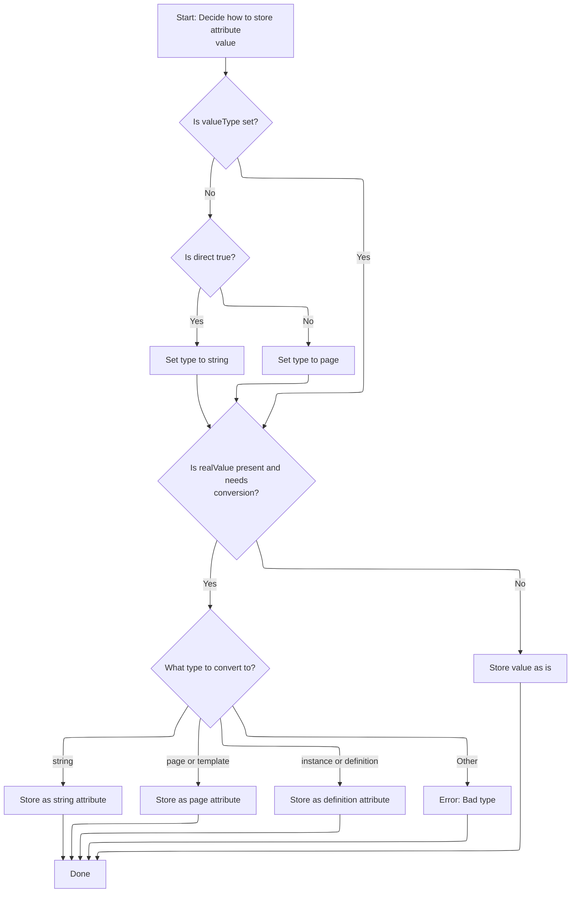

This document describes how nested tag values are processed and integrated into a parent structure for dynamic and role-based templating. The flow resolves the value from the nested tag, applies the correct type, assigns a role if specified, and adds the value to the parent structure.

# Handling Nested Tag Values and Roles

<SwmSnippet path="/tiles/src/main/java/org/apache/struts/tiles/taglib/PutListTag.java" line="155">

---

In <SwmToken path="tiles/src/main/java/org/apache/struts/tiles/taglib/PutListTag.java" pos="155:5:5" line-data="    public void processNestedTag(AddTag nestedTag) throws JspException {">`processNestedTag`</SwmToken>, we're grabbing the computed value from the nested tag, not just its raw value. This is needed because the nested tag might have logic to resolve its actual content. We call <SwmToken path="tiles/src/main/java/org/apache/struts/tiles/taglib/PutListTag.java" pos="159:9:9" line-data="        Object attributeValue = nestedTag.getRealValue();">`getRealValue`</SwmToken> next to make sure we're working with the final, processed value before handling roles or adding it to the parent.

```java
    public void processNestedTag(AddTag nestedTag) throws JspException {
        // Get real value and check role
        // If role is set, add it in attribute definition if any.
        // If no attribute definition, create untyped one, and set role.
        Object attributeValue = nestedTag.getRealValue();
```

---

</SwmSnippet>

## Resolving Actual Tag Values

<SwmSnippet path="/tiles/src/main/java/org/apache/struts/tiles/taglib/PutTag.java" line="308">

---

<SwmToken path="tiles/src/main/java/org/apache/struts/tiles/taglib/PutTag.java" pos="308:5:5" line-data="    public Object getRealValue() throws JspException {">`getRealValue`</SwmToken> checks if the value is already computed. If not, it runs the logic to figure it out, so we always get the actual resolved value, not just whatever was set initially.

```java
    public Object getRealValue() throws JspException {
        if (realValue == null) {
            computeRealValue();
        }

        return realValue;
    }
```

---

</SwmSnippet>

## Computing and Typing Tag Values

<SwmSnippet path="/tiles/src/main/java/org/apache/struts/tiles/taglib/PutTag.java" line="320">

---

In <SwmToken path="tiles/src/main/java/org/apache/struts/tiles/taglib/PutTag.java" pos="320:5:5" line-data="    protected void computeRealValue() throws JspException {">`computeRealValue`</SwmToken>, we're figuring out the actual value for the tag by checking value, body, or <SwmToken path="tiles/src/main/java/org/apache/struts/tiles/taglib/PutTag.java" pos="325:12:12" line-data="        if (value == null &amp;&amp; beanName == null) {">`beanName`</SwmToken>. If <SwmToken path="tiles/src/main/java/org/apache/struts/tiles/taglib/PutTag.java" pos="325:12:12" line-data="        if (value == null &amp;&amp; beanName == null) {">`beanName`</SwmToken> is set and nothing else worked, we call <SwmToken path="tiles/src/main/java/org/apache/struts/tiles/taglib/PutTag.java" pos="336:1:1" line-data="            getRealValueFromBean();">`getRealValueFromBean`</SwmToken> to pull the value from a bean. This sets us up for the next step, where we type the value based on tag attributes.

```java
    protected void computeRealValue() throws JspException {
        // Compute real value from attributes set.
        realValue = value;

        // If realValue is not set, value must come from body
        if (value == null && beanName == null) {
            // Test body content in case of empty body.
            if (body != null) {
                realValue = body;
            } else {
                realValue = "";
            }
        }

        // Does value comes from a bean ?
        if (realValue == null && beanName != null) {
            getRealValueFromBean();
            return;
        }

```

---

</SwmSnippet>

### Fetching Values from Beans

See <SwmLink doc-title="Retrieving a Value from a Bean">[Retrieving a Value from a Bean](/.swm/retrieving-a-value-from-a-bean.e7v6cy5c.sw.md)</SwmLink>

### Typing and Wrapping Computed Values



<SwmSnippet path="/tiles/src/main/java/org/apache/struts/tiles/taglib/PutTag.java" line="340">

---

Back in <SwmToken path="tiles/src/main/java/org/apache/struts/tiles/taglib/PutTag.java" pos="310:1:1" line-data="            computeRealValue();">`computeRealValue`</SwmToken>, after pulling from a bean if needed, we check the 'direct' attribute and set <SwmToken path="tiles/src/main/java/org/apache/struts/tiles/taglib/PutTag.java" pos="341:22:22" line-data="        // First check direct attribute, and translate it to a valueType.">`valueType`</SwmToken>. Then, depending on <SwmToken path="tiles/src/main/java/org/apache/struts/tiles/taglib/PutTag.java" pos="341:22:22" line-data="        // First check direct attribute, and translate it to a valueType.">`valueType`</SwmToken>, we wrap the value in the right attribute class (like <SwmToken path="tiles/src/main/java/org/apache/struts/tiles/taglib/PutTag.java" pos="358:7:7" line-data="                realValue = new DirectStringAttribute(strValue);">`DirectStringAttribute`</SwmToken> or <SwmToken path="tiles/src/main/java/org/apache/struts/tiles/taglib/PutTag.java" pos="361:7:7" line-data="                realValue = new PathAttribute(strValue);">`PathAttribute`</SwmToken>). If <SwmToken path="tiles/src/main/java/org/apache/struts/tiles/taglib/PutTag.java" pos="341:22:22" line-data="        // First check direct attribute, and translate it to a valueType.">`valueType`</SwmToken> isn't recognized, we throw an exception. This makes sure the value is ready for whatever comes next in the tag flow.

```java
        // Is there a type set ?
        // First check direct attribute, and translate it to a valueType.
        // Then, evaluate valueType, and create requested typed attribute.
        // If valueType is not set, use the value "as is".
        if (valueType == null && direct != null) {
            if (Boolean.valueOf(direct).booleanValue() == true) {
                valueType = "string";
            } else {
                valueType = "page";
            }
        }

        if (realValue != null
            && valueType != null
            && !(value instanceof AttributeDefinition)) {

            String strValue = realValue.toString();
            if (valueType.equalsIgnoreCase("string")) {
                realValue = new DirectStringAttribute(strValue);

            } else if (valueType.equalsIgnoreCase("page")) {
                realValue = new PathAttribute(strValue);

            } else if (valueType.equalsIgnoreCase("template")) {
                realValue = new PathAttribute(strValue);

            } else if (valueType.equalsIgnoreCase("instance")) {
                realValue = new DefinitionNameAttribute(strValue);

            } else if (valueType.equalsIgnoreCase("definition")) {
                realValue = new DefinitionNameAttribute(strValue);

            } else { // bad type
                throw new JspException(
                    "Warning - Tag put : Bad type '" + valueType + "'.");
            }
        }

    }
```

---

</SwmSnippet>

## Role Assignment and Integration

<SwmSnippet path="/tiles/src/main/java/org/apache/struts/tiles/taglib/PutListTag.java" line="160">

---

Back in <SwmToken path="tiles/src/main/java/org/apache/struts/tiles/taglib/PutListTag.java" pos="155:5:5" line-data="    public void processNestedTag(AddTag nestedTag) throws JspException {">`processNestedTag`</SwmToken>, after getting the processed value from <SwmToken path="tiles/src/main/java/org/apache/struts/tiles/taglib/PutTag.java" pos="66:4:4" line-data="public class PutTag extends BodyTagSupport implements ComponentConstants {">`PutTag`</SwmToken>, we check if the nested tag has a role. If so, we make sure the value is an <SwmToken path="tiles/src/main/java/org/apache/struts/tiles/taglib/PutListTag.java" pos="160:1:1" line-data="        AttributeDefinition def;">`AttributeDefinition`</SwmToken> (casting or wrapping as needed), set the role, and then add it to the parent. This ensures the attribute is ready for role-based handling and integration.

```java
        AttributeDefinition def;

        if (nestedTag.getRole() != null) {
            try {
                def = ((AttributeDefinition) attributeValue);
            } catch (ClassCastException ex) {
                def = new UntypedAttribute(attributeValue);
            }
            def.setRole(nestedTag.getRole());
            attributeValue = def;
        }

        // now add attribute to enclosing parent (i.e. : this object)
        addElement(attributeValue);
    }
```

---

</SwmSnippet>

&nbsp;

*This is an auto-generated document by Swimm 🌊 and has not yet been verified by a human*

<SwmMeta version="3.0.0" repo-id="Z2l0aHViJTNBJTNBc3RydXRzMSUzQSUzQVN3aW1tLURlbW8=" repo-name="struts1"><sup>Powered by [Swimm](https://app.swimm.io/)</sup></SwmMeta>
