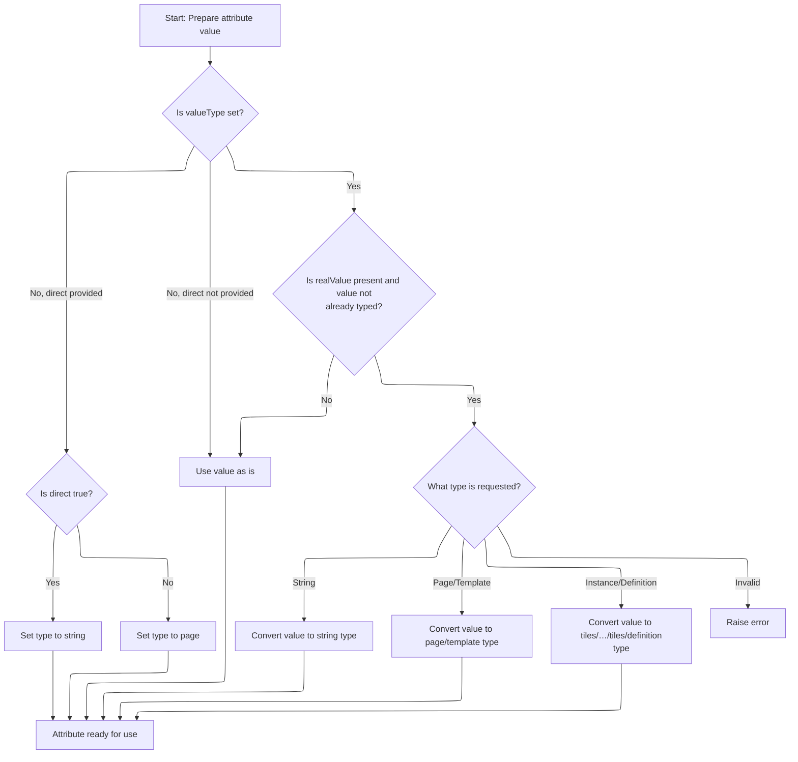

This document explains how the system processes a nested tag by verifying user permissions and preparing the attribute value for dynamic content rendering. The flow checks the user's role, resolves the attribute value, and ensures it is correctly typed for use in templating.

# Checking User Role and Preparing Nested Tag Processing

<SwmSnippet path="/tiles/src/main/java/org/apache/struts/tiles/taglib/InsertTag.java" line="325">

---

In <SwmToken path="tiles/src/main/java/org/apache/struts/tiles/taglib/InsertTag.java" pos="325:5:5" line-data="    public void processNestedTag(PutTag nestedTag) throws JspException {">`processNestedTag`</SwmToken>, we grab the <SwmToken path="tiles/src/main/java/org/apache/struts/tiles/taglib/InsertTag.java" pos="327:1:1" line-data="        HttpServletRequest request =">`HttpServletRequest`</SwmToken> from the page context so we can check if the user has the required role before doing anything with the nested tag. If the user isn't allowed, we bail out early and skip setting the attribute. Next, we need to call into <SwmToken path="core/src/main/java/org/apache/struts/chain/contexts/ServletActionContext.java" pos="39:4:4" line-data="public class ServletActionContext extends WebActionContext {">`ServletActionContext`</SwmToken> to get the actual request object for this check.

```java
    public void processNestedTag(PutTag nestedTag) throws JspException {
        // Check role
        HttpServletRequest request =
            (HttpServletRequest) pageContext.getRequest();
```

---

</SwmSnippet>

## Retrieving the HTTP Request from the Context

<SwmSnippet path="/core/src/main/java/org/apache/struts/chain/contexts/ServletActionContext.java" line="94">

---

<SwmToken path="core/src/main/java/org/apache/struts/chain/contexts/ServletActionContext.java" pos="94:5:5" line-data="    public HttpServletRequest getRequest() {">`getRequest`</SwmToken> just delegates to <SwmToken path="core/src/main/java/org/apache/struts/chain/contexts/ServletActionContext.java" pos="95:3:9" line-data="        return servletWebContext().getRequest();">`servletWebContext().getRequest()`</SwmToken> to pull the current <SwmToken path="core/src/main/java/org/apache/struts/chain/contexts/ServletActionContext.java" pos="94:3:3" line-data="    public HttpServletRequest getRequest() {">`HttpServletRequest`</SwmToken> from the context. We need this to check user roles in the tag logic.

```java
    public HttpServletRequest getRequest() {
        return servletWebContext().getRequest();
    }
```

---

</SwmSnippet>

<SwmSnippet path="/core/src/main/java/org/apache/struts/chain/contexts/ServletActionContext.java" line="67">

---

<SwmToken path="core/src/main/java/org/apache/struts/chain/contexts/ServletActionContext.java" pos="67:5:5" line-data="    protected ServletWebContext servletWebContext() {">`servletWebContext`</SwmToken> casts the base context to <SwmToken path="core/src/main/java/org/apache/struts/chain/contexts/ServletActionContext.java" pos="67:3:3" line-data="    protected ServletWebContext servletWebContext() {">`ServletWebContext`</SwmToken> so we can access servlet-specific methods like <SwmToken path="tiles/src/main/java/org/apache/struts/tiles/taglib/InsertTag.java" pos="328:7:7" line-data="            (HttpServletRequest) pageContext.getRequest();">`getRequest`</SwmToken>. This cast assumes the context is always servlet-based here.

```java
    protected ServletWebContext servletWebContext() {
        return (ServletWebContext) this.getBaseContext();
    }
```

---

</SwmSnippet>

## Role Check and Attribute Assignment

<SwmSnippet path="/tiles/src/main/java/org/apache/struts/tiles/taglib/InsertTag.java" line="329">

---

Back in <SwmToken path="tiles/src/main/java/org/apache/struts/tiles/taglib/InsertTag.java" pos="325:5:5" line-data="    public void processNestedTag(PutTag nestedTag) throws JspException {">`processNestedTag`</SwmToken>, after getting the request, we check the user's role. If the user isn't allowed, we just return and skip everything else. If the check passes, we call <SwmToken path="tiles/src/main/java/org/apache/struts/tiles/taglib/InsertTag.java" pos="335:1:1" line-data="        putAttribute(nestedTag.getName(), nestedTag.getRealValue());">`putAttribute`</SwmToken> with the nested tag's name and its real value, which means we need to resolve that value next by calling into <SwmToken path="tiles/src/main/java/org/apache/struts/tiles/taglib/InsertTag.java" pos="325:7:7" line-data="    public void processNestedTag(PutTag nestedTag) throws JspException {">`PutTag`</SwmToken>.

```java
        String role = nestedTag.getRole();
        if (role != null && !request.isUserInRole(role)) {
            // not allowed : skip attribute
            return;
        }

        putAttribute(nestedTag.getName(), nestedTag.getRealValue());
    }
```

---

</SwmSnippet>

# Resolving the Actual Value for the Attribute

<SwmSnippet path="/tiles/src/main/java/org/apache/struts/tiles/taglib/PutTag.java" line="308">

---

<SwmToken path="tiles/src/main/java/org/apache/struts/tiles/taglib/PutTag.java" pos="308:5:5" line-data="    public Object getRealValue() throws JspException {">`getRealValue`</SwmToken> checks if the real value is already computed; if not, it triggers <SwmToken path="tiles/src/main/java/org/apache/struts/tiles/taglib/PutTag.java" pos="310:1:1" line-data="            computeRealValue();">`computeRealValue`</SwmToken>. We need this to make sure the attribute value is up-to-date before assigning it.

```java
    public Object getRealValue() throws JspException {
        if (realValue == null) {
            computeRealValue();
        }

        return realValue;
    }
```

---

</SwmSnippet>

# Computing the Attribute Value from Tag State

<SwmSnippet path="/tiles/src/main/java/org/apache/struts/tiles/taglib/PutTag.java" line="320">

---

In <SwmToken path="tiles/src/main/java/org/apache/struts/tiles/taglib/PutTag.java" pos="320:5:5" line-data="    protected void computeRealValue() throws JspException {">`computeRealValue`</SwmToken>, we figure out what the real value should be based on the tag's attributes. If both value and <SwmToken path="tiles/src/main/java/org/apache/struts/tiles/taglib/PutTag.java" pos="325:12:12" line-data="        if (value == null &amp;&amp; beanName == null) {">`beanName`</SwmToken> are missing, we fall back to the body or an empty string. If we still don't have a value but <SwmToken path="tiles/src/main/java/org/apache/struts/tiles/taglib/PutTag.java" pos="325:12:12" line-data="        if (value == null &amp;&amp; beanName == null) {">`beanName`</SwmToken> is set, we need to fetch it from a bean, so we call <SwmToken path="tiles/src/main/java/org/apache/struts/tiles/taglib/PutTag.java" pos="336:1:1" line-data="            getRealValueFromBean();">`getRealValueFromBean`</SwmToken> next.

```java
    protected void computeRealValue() throws JspException {
        // Compute real value from attributes set.
        realValue = value;

        // If realValue is not set, value must come from body
        if (value == null && beanName == null) {
            // Test body content in case of empty body.
            if (body != null) {
                realValue = body;
            } else {
                realValue = "";
            }
        }

        // Does value comes from a bean ?
        if (realValue == null && beanName != null) {
            getRealValueFromBean();
            return;
        }

```

---

</SwmSnippet>

## Fetching the Value from a Bean

<SwmSnippet path="/tiles/src/main/java/org/apache/struts/tiles/taglib/PutTag.java" line="384">

---

In <SwmToken path="tiles/src/main/java/org/apache/struts/tiles/taglib/PutTag.java" pos="384:5:5" line-data="    protected void getRealValueFromBean() throws JspException {">`getRealValueFromBean`</SwmToken>, we try to grab the bean instance using <SwmToken path="tiles/src/main/java/org/apache/struts/tiles/taglib/PutTag.java" pos="386:7:7" line-data="            Object bean = TagUtils.retrieveBean(beanName, beanScope, pageContext);">`TagUtils`</SwmToken>. We need to call into <SwmToken path="tiles/src/main/java/org/apache/struts/tiles/taglib/PutTag.java" pos="386:7:7" line-data="            Object bean = TagUtils.retrieveBean(beanName, beanScope, pageContext);">`TagUtils`</SwmToken> to actually fetch the bean from the right scope.

```java
    protected void getRealValueFromBean() throws JspException {
        try {
            Object bean = TagUtils.retrieveBean(beanName, beanScope, pageContext);
```

---

</SwmSnippet>

### Locating the Bean Instance

See <SwmLink doc-title="Retrieving a Bean by Name">[Retrieving a Bean by Name](/.swm/retrieving-a-bean-by-name.zgim9gk5.sw.md)</SwmLink>

### Extracting the Property or Bean Value

<SwmSnippet path="/tiles/src/main/java/org/apache/struts/tiles/taglib/PutTag.java" line="387">

---

Just got back from <SwmToken path="tiles/src/main/java/org/apache/struts/tiles/taglib/PutTag.java" pos="386:7:7" line-data="            Object bean = TagUtils.retrieveBean(beanName, beanScope, pageContext);">`TagUtils`</SwmToken>, so now in <SwmToken path="tiles/src/main/java/org/apache/struts/tiles/taglib/PutTag.java" pos="336:1:1" line-data="            getRealValueFromBean();">`getRealValueFromBean`</SwmToken>, if the bean and property are both set, we use <SwmToken path="tiles/src/main/java/org/apache/struts/tiles/taglib/PutTag.java" pos="388:5:5" line-data="                realValue = PropertyUtils.getProperty(bean, beanProperty);">`PropertyUtils`</SwmToken> to pull the property value; otherwise, we just use the bean itself as the value. If anything goes wrong, we throw a <SwmToken path="tiles/src/main/java/org/apache/struts/tiles/taglib/PutTag.java" pos="394:5:5" line-data="            throw new JspException(">`JspException`</SwmToken>.

```java
            if (bean != null && beanProperty != null) {
                realValue = PropertyUtils.getProperty(bean, beanProperty);
            } else {
                realValue = bean; // value can be null
            }

        } catch (NoSuchMethodException ex) {
            throw new JspException(
                "Error - component.PutAttributeTag : Error while retrieving value from bean '"
                    + beanName
                    + "' with property '"
                    + beanProperty
                    + "' in scope '"
                    + beanScope
                    + "'. (exception : "
                    + ex.getMessage(), ex);

        } catch (InvocationTargetException ex) {
            throw new JspException(
                "Error - component.PutAttributeTag : Error while retrieving value from bean '"
                    + beanName
                    + "' with property '"
                    + beanProperty
                    + "' in scope '"
                    + beanScope
                    + "'. (exception : "
                    + ex.getMessage(), ex);

        } catch (IllegalAccessException ex) {
            throw new JspException(
                "Error - component.PutAttributeTag : Error while retrieving value from bean '"
                    + beanName
                    + "' with property '"
                    + beanProperty
                    + "' in scope '"
                    + beanScope
                    + "'. (exception : "
                    + ex.getMessage(), ex);
        }
    }
```

---

</SwmSnippet>

## Wrapping the Value in the Correct Attribute Type



<SwmSnippet path="/tiles/src/main/java/org/apache/struts/tiles/taglib/PutTag.java" line="340">

---

Just returned from <SwmToken path="tiles/src/main/java/org/apache/struts/tiles/taglib/PutTag.java" pos="336:1:1" line-data="            getRealValueFromBean();">`getRealValueFromBean`</SwmToken>, so now in <SwmToken path="tiles/src/main/java/org/apache/struts/tiles/taglib/PutTag.java" pos="310:1:1" line-data="            computeRealValue();">`computeRealValue`</SwmToken>, we check if <SwmToken path="tiles/src/main/java/org/apache/struts/tiles/taglib/PutTag.java" pos="341:22:22" line-data="        // First check direct attribute, and translate it to a valueType.">`valueType`</SwmToken> needs to be set based on the direct attribute. Then, if both <SwmToken path="tiles/src/main/java/org/apache/struts/tiles/taglib/PutTag.java" pos="352:4:4" line-data="        if (realValue != null">`realValue`</SwmToken> and <SwmToken path="tiles/src/main/java/org/apache/struts/tiles/taglib/PutTag.java" pos="341:22:22" line-data="        // First check direct attribute, and translate it to a valueType.">`valueType`</SwmToken> are set and the value isn't already an <SwmToken path="tiles/src/main/java/org/apache/struts/tiles/taglib/PutTag.java" pos="354:9:9" line-data="            &amp;&amp; !(value instanceof AttributeDefinition)) {">`AttributeDefinition`</SwmToken>, we wrap the value in the right Attribute class (like <SwmToken path="tiles/src/main/java/org/apache/struts/tiles/taglib/PutTag.java" pos="358:7:7" line-data="                realValue = new DirectStringAttribute(strValue);">`DirectStringAttribute`</SwmToken> or <SwmToken path="tiles/src/main/java/org/apache/struts/tiles/taglib/PutTag.java" pos="361:7:7" line-data="                realValue = new PathAttribute(strValue);">`PathAttribute`</SwmToken>) depending on <SwmToken path="tiles/src/main/java/org/apache/struts/tiles/taglib/PutTag.java" pos="341:22:22" line-data="        // First check direct attribute, and translate it to a valueType.">`valueType`</SwmToken>. If the type is unknown, we throw.

```java
        // Is there a type set ?
        // First check direct attribute, and translate it to a valueType.
        // Then, evaluate valueType, and create requested typed attribute.
        // If valueType is not set, use the value "as is".
        if (valueType == null && direct != null) {
            if (Boolean.valueOf(direct).booleanValue() == true) {
                valueType = "string";
            } else {
                valueType = "page";
            }
        }

        if (realValue != null
            && valueType != null
            && !(value instanceof AttributeDefinition)) {

            String strValue = realValue.toString();
            if (valueType.equalsIgnoreCase("string")) {
                realValue = new DirectStringAttribute(strValue);

            } else if (valueType.equalsIgnoreCase("page")) {
                realValue = new PathAttribute(strValue);

            } else if (valueType.equalsIgnoreCase("template")) {
                realValue = new PathAttribute(strValue);

            } else if (valueType.equalsIgnoreCase("instance")) {
                realValue = new DefinitionNameAttribute(strValue);

            } else if (valueType.equalsIgnoreCase("definition")) {
                realValue = new DefinitionNameAttribute(strValue);

            } else { // bad type
                throw new JspException(
                    "Warning - Tag put : Bad type '" + valueType + "'.");
            }
        }

    }
```

---

</SwmSnippet>

&nbsp;

*This is an auto-generated document by Swimm 🌊 and has not yet been verified by a human*

<SwmMeta version="3.0.0" repo-id="Z2l0aHViJTNBJTNBc3RydXRzMSUzQSUzQVN3aW1tLURlbW8=" repo-name="struts1"><sup>Powered by [Swimm](https://app.swimm.io/)</sup></SwmMeta>
