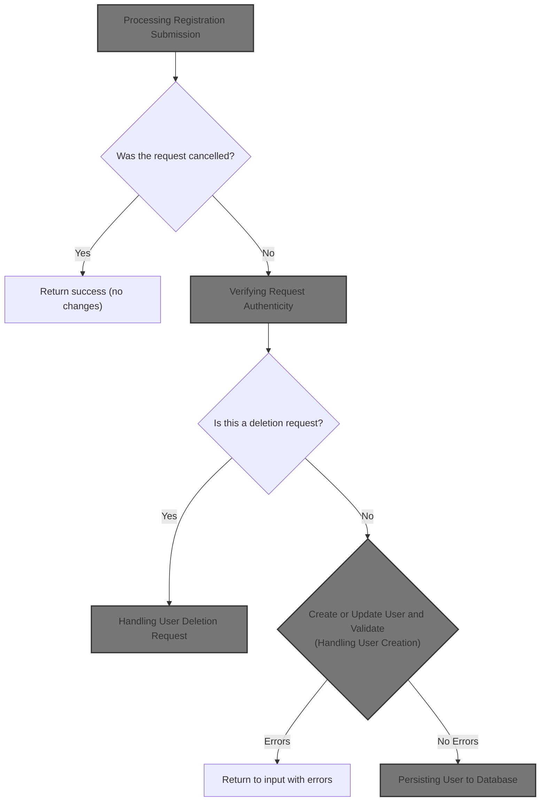
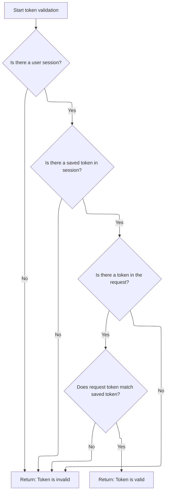
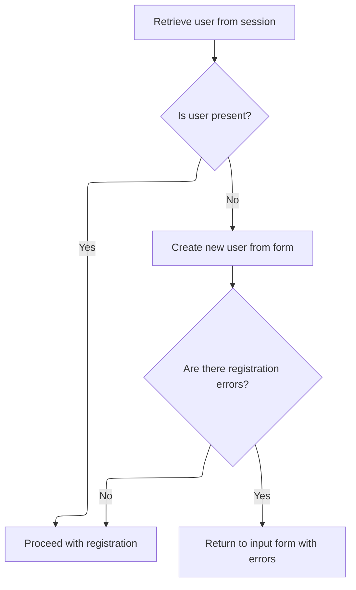
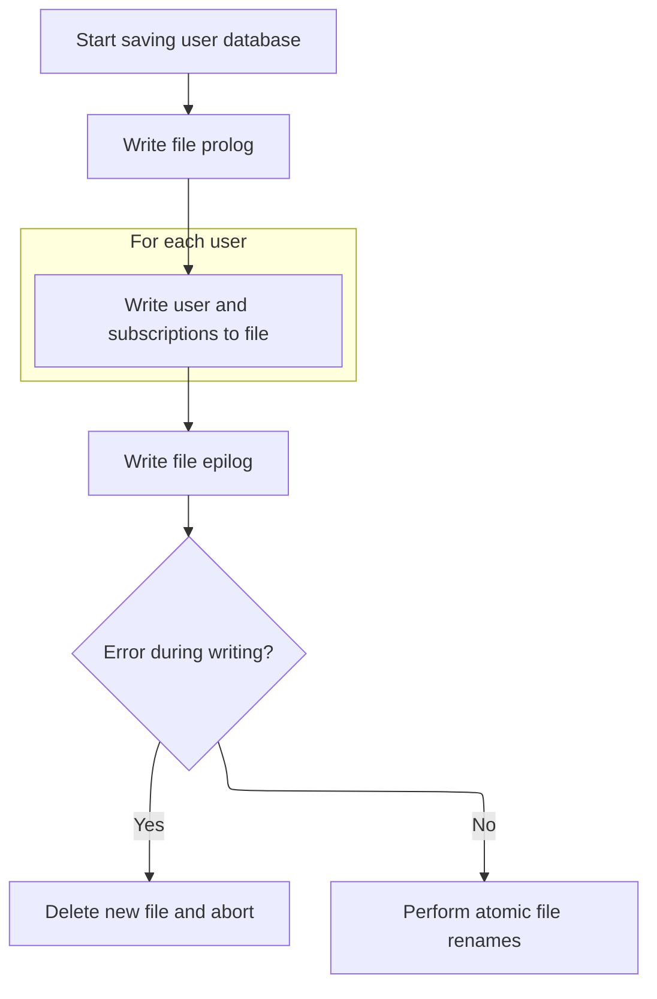
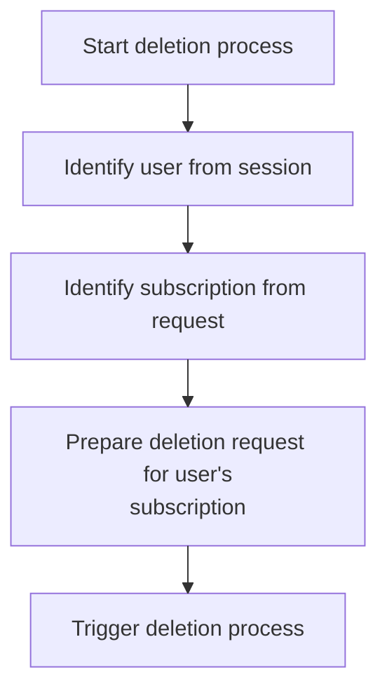
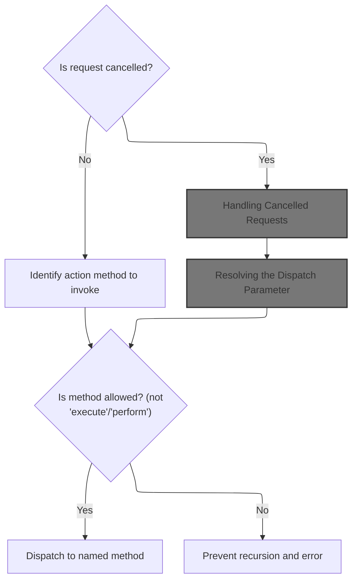
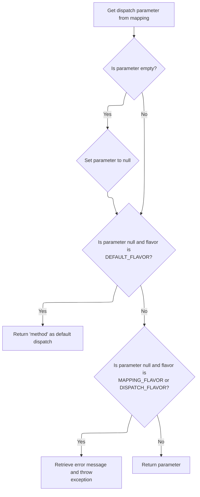

This document describes how user registration and deletion requests are processed. The system checks for cancellation, validates the request, and either creates/updates or deletes the user. Valid changes are saved to the user database and the user interface is kept up to date.



# Processing Registration Submission

```mermaid
%%{init: {"flowchart": {"defaultRenderer": "elk"}} }%%
flowchart TD
    node1["Start registration save process"] --> node2{"Was registration cancelled?"}
    click node1 openCode "apps/mailreader/src/main/java/org/apache/struts/apps/mailreader/actions/RegistrationAction.java:326:340"
    click node2 openCode "apps/mailreader/src/main/java/org/apache/struts/apps/mailreader/actions/RegistrationAction.java:337:340"
    node2 -->|"Yes"| node3["Cancel and return success"]
    click node3 openCode "apps/mailreader/src/main/java/org/apache/struts/apps/mailreader/actions/RegistrationAction.java:338:340"
    node2 -->|"No"| node4{"Is request valid?"}
    
    node4 -->|"No"| node5["Return to input with errors"]
    click node5 openCode "apps/mailreader/src/main/java/org/apache/struts/apps/mailreader/actions/RegistrationAction.java:346:347"
    node4 -->|"Yes"| node6{"Does user exist?"}
    click node6 openCode "apps/mailreader/src/main/java/org/apache/struts/apps/mailreader/actions/RegistrationAction.java:349:355"
    node6 -->|"No"| node7["Validating and Creating User"]
    
    node7 --> node8{"Any errors after creation?"}
    click node8 openCode "apps/mailreader/src/main/java/org/apache/struts/apps/mailreader/actions/RegistrationAction.java:352:354"
    node8 -->|"Yes"| node5
    node8 -->|"No"| node9["Syncing Form with User"]
    
    node6 -->|"Yes"| node9
classDef HeadingStyle fill:#777777,stroke:#333,stroke-width:2px;
click node4 goToHeading "Verifying Request Authenticity"
node4:::HeadingStyle
click node7 goToHeading "Validating and Creating User"
node7:::HeadingStyle
click node9 goToHeading "Syncing Form with User"
node9:::HeadingStyle

%% Swimm:
%% %%{init: {"flowchart": {"defaultRenderer": "elk"}} }%%
%% flowchart TD
%%     node1["Start registration save process"] --> node2{"Was registration cancelled?"}
%%     click node1 openCode "<SwmPath>[apps/…/actions/RegistrationAction.java](apps/mailreader/src/main/java/org/apache/struts/apps/mailreader/actions/RegistrationAction.java)</SwmPath>:326:340"
%%     click node2 openCode "<SwmPath>[apps/…/actions/RegistrationAction.java](apps/mailreader/src/main/java/org/apache/struts/apps/mailreader/actions/RegistrationAction.java)</SwmPath>:337:340"
%%     node2 -->|"Yes"| node3["Cancel and return success"]
%%     click node3 openCode "<SwmPath>[apps/…/actions/RegistrationAction.java](apps/mailreader/src/main/java/org/apache/struts/apps/mailreader/actions/RegistrationAction.java)</SwmPath>:338:340"
%%     node2 -->|"No"| node4{"Is request valid?"}
%%     
%%     node4 -->|"No"| node5["Return to input with errors"]
%%     click node5 openCode "<SwmPath>[apps/…/actions/RegistrationAction.java](apps/mailreader/src/main/java/org/apache/struts/apps/mailreader/actions/RegistrationAction.java)</SwmPath>:346:347"
%%     node4 -->|"Yes"| node6{"Does user exist?"}
%%     click node6 openCode "<SwmPath>[apps/…/actions/RegistrationAction.java](apps/mailreader/src/main/java/org/apache/struts/apps/mailreader/actions/RegistrationAction.java)</SwmPath>:349:355"
%%     node6 -->|"No"| node7["Validating and Creating User"]
%%     
%%     node7 --> node8{"Any errors after creation?"}
%%     click node8 openCode "<SwmPath>[apps/…/actions/RegistrationAction.java](apps/mailreader/src/main/java/org/apache/struts/apps/mailreader/actions/RegistrationAction.java)</SwmPath>:352:354"
%%     node8 -->|"Yes"| node5
%%     node8 -->|"No"| node9["Syncing Form with User"]
%%     
%%     node6 -->|"Yes"| node9
%% classDef HeadingStyle fill:#777777,stroke:#333,stroke-width:2px;
%% click node4 goToHeading "Verifying Request Authenticity"
%% node4:::HeadingStyle
%% click node7 goToHeading "Validating and Creating User"
%% node7:::HeadingStyle
%% click node9 goToHeading "Syncing Form with User"
%% node9:::HeadingStyle
```



<SwmSnippet path="/apps/mailreader/src/main/java/org/apache/struts/apps/mailreader/actions/RegistrationAction.java" line="326">

---

In <SwmToken path="apps/mailreader/src/main/java/org/apache/struts/apps/mailreader/actions/RegistrationAction.java" pos="326:5:5" line-data="    public ActionForward Save(">`Save`</SwmToken>, we log the process, check for cancellation, and prep error handling. We call <SwmToken path="apps/mailreader/src/main/java/org/apache/struts/apps/mailreader/actions/RegistrationAction.java" pos="343:1:1" line-data="        doValidateToken(request, errors);">`doValidateToken`</SwmToken> next to make sure the request is legit before moving forward. If token validation fails, we bail out early and return to input.

```java
    public ActionForward Save(
            ActionMapping mapping,
            ActionForm form,
            HttpServletRequest request,
            HttpServletResponse response)
            throws Exception {

        final String method = Constants.SAVE;
        doLogProcess(mapping, method);

        HttpSession session = request.getSession();
        if (isCancelled(request)) {
            doCancel(session, method, Constants.SUBSCRIPTION_KEY);
            return doFindSuccess(mapping);
        }

        ActionMessages errors = new ActionMessages();
        doValidateToken(request, errors);

        if (!errors.isEmpty()) {
            return doInputForward(mapping, request, errors);
        }

```

---

</SwmSnippet>

## Verifying Request Authenticity

<SwmSnippet path="/apps/mailreader/src/main/java/org/apache/struts/apps/mailreader/actions/RegistrationAction.java" line="258">

---

In <SwmToken path="apps/mailreader/src/main/java/org/apache/struts/apps/mailreader/actions/RegistrationAction.java" pos="258:5:5" line-data="    private void doValidateToken(HttpServletRequest request,">`doValidateToken`</SwmToken>, we trace the token check and use <SwmToken path="apps/mailreader/src/main/java/org/apache/struts/apps/mailreader/actions/RegistrationAction.java" pos="265:5:5" line-data="        if (!isTokenValid(request)) {">`isTokenValid`</SwmToken> from Action to see if the request matches the session token. If it doesn't, we add a global error message. Next, we need to call Action's token validation to actually check the token.

```java
    private void doValidateToken(HttpServletRequest request,
                                 ActionMessages errors) {

        if (log.isTraceEnabled()) {
            log.trace(Constants.LOG_TOKEN_CHECK);
        }

        if (!isTokenValid(request)) {
            errors.add(
                    ActionMessages.GLOBAL_MESSAGE,
                    new ActionMessage(Constants.MSG_TRANSACTION_TOKEN));
        }

```

---

</SwmSnippet>

### Delegating Token Validation

<SwmSnippet path="/core/src/main/java/org/apache/struts/action/Action.java" line="429">

---

<SwmToken path="core/src/main/java/org/apache/struts/action/Action.java" pos="429:5:5" line-data="    protected boolean isTokenValid(HttpServletRequest request) {">`isTokenValid`</SwmToken> just hands off the token check to <SwmToken path="core/src/main/java/org/apache/struts/action/Action.java" pos="28:10:10" line-data="import org.apache.struts.util.TokenProcessor;">`TokenProcessor`</SwmToken>, keeping the validation logic centralized. Next, <SwmToken path="core/src/main/java/org/apache/struts/action/Action.java" pos="28:10:10" line-data="import org.apache.struts.util.TokenProcessor;">`TokenProcessor`</SwmToken> does the actual comparison between session and request tokens.

```java
    protected boolean isTokenValid(HttpServletRequest request) {
        return token.isTokenValid(request, false);
    }
```

---

</SwmSnippet>

### Comparing Session and Request Tokens



<SwmSnippet path="/core/src/main/java/org/apache/struts/util/TokenProcessor.java" line="111">

---

<SwmToken path="core/src/main/java/org/apache/struts/util/TokenProcessor.java" pos="111:7:7" line-data="    public synchronized boolean isTokenValid(HttpServletRequest request,">`isTokenValid`</SwmToken> in <SwmToken path="core/src/main/java/org/apache/struts/action/Action.java" pos="28:10:10" line-data="import org.apache.struts.util.TokenProcessor;">`TokenProcessor`</SwmToken> grabs the session token and the token from the request parameters, then checks if they match. We use MultipartRequestWrapper next to handle parameter extraction, especially for multipart forms.

```java
    public synchronized boolean isTokenValid(HttpServletRequest request,
        boolean reset) {
        // Retrieve the current session for this request
        HttpSession session = request.getSession(false);

        if (session == null) {
            return false;
        }

        // Retrieve the transaction token from this session, and
        // reset it if requested
        String saved =
            (String) session.getAttribute(Globals.TRANSACTION_TOKEN_KEY);

        if (saved == null) {
            return false;
        }

        if (reset) {
            this.resetToken(request);
        }

        // Retrieve the transaction token included in this request
        String token = request.getParameter(Globals.TOKEN_KEY);

        if (token == null) {
            return false;
        }

        return saved.equals(token);
    }
```

---

</SwmSnippet>

### Extracting Token from Request

See <SwmLink doc-title="Retrieving Parameter Values from User Requests">[Retrieving Parameter Values from User Requests](/.swm/retrieving-parameter-values-from-user-requests.829eu574.sw.md)</SwmLink>

### Resetting Token After Validation

<SwmSnippet path="/apps/mailreader/src/main/java/org/apache/struts/apps/mailreader/actions/RegistrationAction.java" line="271">

---

Back in <SwmToken path="apps/mailreader/src/main/java/org/apache/struts/apps/mailreader/actions/RegistrationAction.java" pos="258:5:5" line-data="    private void doValidateToken(HttpServletRequest request,">`doValidateToken`</SwmToken>, after checking the token via Action, we reset it to make sure it can't be reused. This keeps things secure for future requests.

```java
        resetToken(request);
    }
```

---

</SwmSnippet>

## Handling User Creation



<SwmSnippet path="/apps/mailreader/src/main/java/org/apache/struts/apps/mailreader/actions/RegistrationAction.java" line="349">

---

Back in <SwmToken path="apps/mailreader/src/main/java/org/apache/struts/apps/mailreader/actions/RegistrationAction.java" pos="326:5:5" line-data="    public ActionForward Save(">`Save`</SwmToken>, after token validation, we check if there's a user in session. If not, we call <SwmToken path="apps/mailreader/src/main/java/org/apache/struts/apps/mailreader/actions/RegistrationAction.java" pos="351:5:5" line-data="            user = doCreateUser(form, request, errors);">`doCreateUser`</SwmToken> to make one. If errors pop up during creation, we return to input.

```java
        User user = doGetUser(session);
        if (user == null) {
            user = doCreateUser(form, request, errors);
            if (!errors.isEmpty()) {
                return doInputForward(mapping, request, errors);
            }
        }

```

---

</SwmSnippet>

## Validating and Creating User

```mermaid
%%{init: {"flowchart": {"defaultRenderer": "elk"}} }%%
flowchart TD
    node1["Start user registration"] --> node2{"Is username unique?"}
    click node1 openCode "apps/mailreader/src/main/java/org/apache/struts/apps/mailreader/actions/RegistrationAction.java:118:127"
    node2 -->|"No"| node3["Add error: Username taken"]
    click node2 openCode "apps/mailreader/src/main/java/org/apache/struts/apps/mailreader/actions/RegistrationAction.java:130:133"
    node2 -->|"Exception: Expired password"| node12["Add error: Username taken and expired
password"]
    click node12 openCode "apps/mailreader/src/main/java/org/apache/struts/apps/mailreader/actions/RegistrationAction.java:134:137"
    node2 -->|"Yes"| node4{"Is password provided?"}
    click node3 openCode "apps/mailreader/src/main/java/org/apache/struts/apps/mailreader/actions/RegistrationAction.java:131:132"
    node4 -->|"No"| node5["Add error: Password required"]
    click node4 openCode "apps/mailreader/src/main/java/org/apache/struts/apps/mailreader/actions/RegistrationAction.java:139:142"
    node4 -->|"Yes"| node6{"Are there any errors?"}
    click node5 openCode "apps/mailreader/src/main/java/org/apache/struts/apps/mailreader/actions/RegistrationAction.java:141:148"
    node5 --> node7{"Is password confirmation provided?"}
    node7 -->|"No"| node8["Add error: Password confirmation
required"]
    click node7 openCode "apps/mailreader/src/main/java/org/apache/struts/apps/mailreader/actions/RegistrationAction.java:143:148"
    node8 --> node6
    node7 -->|"Yes"| node6
    node3 --> node6
    node12 --> node6
    node6 -->|"Yes"| node9["Stop: Registration failed"]
    click node6 openCode "apps/mailreader/src/main/java/org/apache/struts/apps/mailreader/actions/RegistrationAction.java:151:153"
    node6 -->|"No"| node10["Create user account and log in"]
    click node10 openCode "apps/mailreader/src/main/java/org/apache/struts/apps/mailreader/actions/RegistrationAction.java:155:168"
    node10 --> node11["Registration successful"]
    click node11 openCode "apps/mailreader/src/main/java/org/apache/struts/apps/mailreader/actions/RegistrationAction.java:168:169"
classDef HeadingStyle fill:#777777,stroke:#333,stroke-width:2px;

%% Swimm:
%% %%{init: {"flowchart": {"defaultRenderer": "elk"}} }%%
%% flowchart TD
%%     node1["Start user registration"] --> node2{"Is username unique?"}
%%     click node1 openCode "<SwmPath>[apps/…/actions/RegistrationAction.java](apps/mailreader/src/main/java/org/apache/struts/apps/mailreader/actions/RegistrationAction.java)</SwmPath>:118:127"
%%     node2 -->|"No"| node3["Add error: Username taken"]
%%     click node2 openCode "<SwmPath>[apps/…/actions/RegistrationAction.java](apps/mailreader/src/main/java/org/apache/struts/apps/mailreader/actions/RegistrationAction.java)</SwmPath>:130:133"
%%     node2 -->|"Exception: Expired password"| node12["Add error: Username taken and expired
%% password"]
%%     click node12 openCode "<SwmPath>[apps/…/actions/RegistrationAction.java](apps/mailreader/src/main/java/org/apache/struts/apps/mailreader/actions/RegistrationAction.java)</SwmPath>:134:137"
%%     node2 -->|"Yes"| node4{"Is password provided?"}
%%     click node3 openCode "<SwmPath>[apps/…/actions/RegistrationAction.java](apps/mailreader/src/main/java/org/apache/struts/apps/mailreader/actions/RegistrationAction.java)</SwmPath>:131:132"
%%     node4 -->|"No"| node5["Add error: Password required"]
%%     click node4 openCode "<SwmPath>[apps/…/actions/RegistrationAction.java](apps/mailreader/src/main/java/org/apache/struts/apps/mailreader/actions/RegistrationAction.java)</SwmPath>:139:142"
%%     node4 -->|"Yes"| node6{"Are there any errors?"}
%%     click node5 openCode "<SwmPath>[apps/…/actions/RegistrationAction.java](apps/mailreader/src/main/java/org/apache/struts/apps/mailreader/actions/RegistrationAction.java)</SwmPath>:141:148"
%%     node5 --> node7{"Is password confirmation provided?"}
%%     node7 -->|"No"| node8["Add error: Password confirmation
%% required"]
%%     click node7 openCode "<SwmPath>[apps/…/actions/RegistrationAction.java](apps/mailreader/src/main/java/org/apache/struts/apps/mailreader/actions/RegistrationAction.java)</SwmPath>:143:148"
%%     node8 --> node6
%%     node7 -->|"Yes"| node6
%%     node3 --> node6
%%     node12 --> node6
%%     node6 -->|"Yes"| node9["Stop: Registration failed"]
%%     click node6 openCode "<SwmPath>[apps/…/actions/RegistrationAction.java](apps/mailreader/src/main/java/org/apache/struts/apps/mailreader/actions/RegistrationAction.java)</SwmPath>:151:153"
%%     node6 -->|"No"| node10["Create user account and log in"]
%%     click node10 openCode "<SwmPath>[apps/…/actions/RegistrationAction.java](apps/mailreader/src/main/java/org/apache/struts/apps/mailreader/actions/RegistrationAction.java)</SwmPath>:155:168"
%%     node10 --> node11["Registration successful"]
%%     click node11 openCode "<SwmPath>[apps/…/actions/RegistrationAction.java](apps/mailreader/src/main/java/org/apache/struts/apps/mailreader/actions/RegistrationAction.java)</SwmPath>:168:169"
%% classDef HeadingStyle fill:#777777,stroke:#333,stroke-width:2px;
```



<SwmSnippet path="/apps/mailreader/src/main/java/org/apache/struts/apps/mailreader/actions/RegistrationAction.java" line="118">

---

In <SwmToken path="apps/mailreader/src/main/java/org/apache/struts/apps/mailreader/actions/RegistrationAction.java" pos="118:5:5" line-data="    private User doCreateUser(">`doCreateUser`</SwmToken>, we validate username and password fields, checking for uniqueness and required values. We use <SwmToken path="apps/mailreader/src/main/java/org/apache/struts/apps/mailreader/actions/RegistrationAction.java" pos="128:7:7" line-data="        String username = doGet(form, USERNAME);">`doGet`</SwmToken> from <SwmToken path="apps/mailreader/src/main/java/org/apache/struts/apps/mailreader/actions/RegistrationAction.java" pos="49:10:10" line-data="public final class RegistrationAction extends BaseAction {">`BaseAction`</SwmToken> to fetch and sanitize form properties before validation.

```java
    private User doCreateUser(
            ActionForm form,
            HttpServletRequest request,
            ActionMessages errors) {

        if (log.isTraceEnabled()) {
            log.trace(" Perform additional validations on Create");
        }

        UserDatabase database = doGetUserDatabase();
        String username = doGet(form, USERNAME);
        try {
            if (database.findUser(username) != null) {
                errorUsernameUnique(username, errors);
            }
        }
        catch (ExpiredPasswordException e) {
            errorUsernameUnique(username, errors);
            errors.add("errors.literal", new ActionMessage(e.getMessage()));
        }

        String password = doGet(form, PASSWORD);
        if ((password == null) || (password.length() < 1)) {
            errors.add(PASSWORD, new ActionMessage("error.password.required"));

            String password2 = doGet(form, PASSWORD2);
            if ((password2 == null) || (password2.length() < 1)) {
                errors.add(
                        PASSWORD2,
                        new ActionMessage("error.password2.required"));
            }
        }

        if (!errors.isEmpty()) {
            return null;
        }

```

---

</SwmSnippet>

<SwmSnippet path="/apps/mailreader/src/main/java/org/apache/struts/apps/mailreader/actions/BaseAction.java" line="198">

---

<SwmToken path="apps/mailreader/src/main/java/org/apache/struts/apps/mailreader/actions/BaseAction.java" pos="198:5:5" line-data="    protected String doGet(ActionForm form, String property) {">`doGet`</SwmToken> grabs a property from the form, trims it, and returns null if it's empty. It expects the property to be a String and sanitizes input by treating blanks as null.

```java
    protected String doGet(ActionForm form, String property) {
        String initial;
        try {
            initial = (String) PropertyUtils.getSimpleProperty(form, property);
        } catch (Throwable t) {
            initial = null;
        }
        String value = null;
        if ((initial != null) && (initial.length() > 0)) {
            value = initial.trim();
            if (value.length() == 0) {
                value = null;
            }
        }
        return value;
    }
```

---

</SwmSnippet>

<SwmSnippet path="/apps/mailreader/src/main/java/org/apache/struts/apps/mailreader/actions/RegistrationAction.java" line="155">

---

Back in <SwmToken path="apps/mailreader/src/main/java/org/apache/struts/apps/mailreader/actions/RegistrationAction.java" pos="118:5:5" line-data="    private User doCreateUser(">`doCreateUser`</SwmToken>, after getting sanitized values from <SwmToken path="apps/mailreader/src/main/java/org/apache/struts/apps/mailreader/actions/RegistrationAction.java" pos="49:10:10" line-data="public final class RegistrationAction extends BaseAction {">`BaseAction`</SwmToken>, we create the user, log them in by setting them in session, and trace the login. If everything checks out, we return the user.

```java
        User user = database.createUser(username);

        // Log the user in
        HttpSession session = request.getSession();
        session.setAttribute(Constants.USER_KEY, user);
        if (log.isTraceEnabled()) {
            log.trace(
                    " User: '"
                            + user.getUsername()
                            + "' logged on in session: "
                            + session.getId());
        }

        return user;
    }
```

---

</SwmSnippet>

## Populating User Data

<SwmSnippet path="/apps/mailreader/src/main/java/org/apache/struts/apps/mailreader/actions/RegistrationAction.java" line="357">

---

Back in <SwmToken path="apps/mailreader/src/main/java/org/apache/struts/apps/mailreader/actions/RegistrationAction.java" pos="326:5:5" line-data="    public ActionForward Save(">`Save`</SwmToken>, after creating the user, we call <SwmToken path="apps/mailreader/src/main/java/org/apache/struts/apps/mailreader/actions/RegistrationAction.java" pos="357:1:1" line-data="        doPopulate(user, form);">`doPopulate`</SwmToken> to sync the form with the user's data. This keeps the UI up-to-date for the next steps.

```java
        doPopulate(user, form);
```

---

</SwmSnippet>

## Syncing Form with User

<SwmSnippet path="/apps/mailreader/src/main/java/org/apache/struts/apps/mailreader/actions/RegistrationAction.java" line="180">

---

In <SwmToken path="apps/mailreader/src/main/java/org/apache/struts/apps/mailreader/actions/RegistrationAction.java" pos="180:5:5" line-data="    private void doPopulate(ActionForm form, User user)">`doPopulate`</SwmToken>, we copy all user properties to the form using <SwmToken path="apps/mailreader/src/main/java/org/apache/struts/apps/mailreader/actions/RegistrationAction.java" pos="190:1:1" line-data="            PropertyUtils.copyProperties(form, user);">`PropertyUtils`</SwmToken>. Constants like EDIT, TASK, PASSWORD, and <SwmToken path="apps/mailreader/src/main/java/org/apache/struts/apps/mailreader/actions/RegistrationAction.java" pos="143:12:12" line-data="            String password2 = doGet(form, PASSWORD2);">`PASSWORD2`</SwmToken> are used to set up the form for editing. Next, we need <SwmToken path="core/src/main/java/org/apache/struts/config/BaseConfig.java" pos="34:6:6" line-data="public abstract class BaseConfig implements Serializable {">`BaseConfig`</SwmToken> for property handling.

```java
    private void doPopulate(ActionForm form, User user)
            throws ServletException {

        final String title = Constants.EDIT;

        if (log.isTraceEnabled()) {
            log.trace(Constants.LOG_POPULATE_FORM + user);
        }

        try {
            PropertyUtils.copyProperties(form, user);
```

---

</SwmSnippet>

### Copying and Setting Properties

<SwmSnippet path="/core/src/main/java/org/apache/struts/config/BaseConfig.java" line="155">

---

<SwmToken path="core/src/main/java/org/apache/struts/config/BaseConfig.java" pos="155:5:5" line-data="    protected Properties copyProperties() {">`copyProperties`</SwmToken> loops through all property keys and copies their values. Next, we call <SwmToken path="core/src/main/java/org/apache/struts/config/BaseConfig.java" pos="163:3:3" line-data="            copy.setProperty(key, properties.getProperty(key));">`setProperty`</SwmToken> to actually assign each property to the new object.

```java
    protected Properties copyProperties() {
        Properties copy = new Properties();

        Enumeration keys = properties.propertyNames();

        while (keys.hasMoreElements()) {
            String key = (String) keys.nextElement();

            copy.setProperty(key, properties.getProperty(key));
        }

        return copy;
    }
```

---

</SwmSnippet>

<SwmSnippet path="/core/src/main/java/org/apache/struts/config/BaseConfig.java" line="88">

---

<SwmToken path="core/src/main/java/org/apache/struts/config/BaseConfig.java" pos="88:5:5" line-data="    public void setProperty(String key, String value) {">`setProperty`</SwmToken> checks if configuration is locked before setting the property. If it's allowed, it assigns the value using <SwmToken path="core/src/main/java/org/apache/struts/config/BaseConfig.java" pos="88:5:5" line-data="    public void setProperty(String key, String value) {">`setProperty`</SwmToken>.

```java
    public void setProperty(String key, String value) {
        throwIfConfigured();
        properties.setProperty(key, value);
    }
```

---

</SwmSnippet>

### Preparing Form for Editing

<SwmSnippet path="/apps/mailreader/src/main/java/org/apache/struts/apps/mailreader/actions/RegistrationAction.java" line="191">

---

Back in <SwmToken path="apps/mailreader/src/main/java/org/apache/struts/apps/mailreader/actions/RegistrationAction.java" pos="180:5:5" line-data="    private void doPopulate(ActionForm form, User user)">`doPopulate`</SwmToken>, after copying properties, we cast the form to <SwmToken path="apps/mailreader/src/main/java/org/apache/struts/apps/mailreader/actions/RegistrationAction.java" pos="191:1:1" line-data="            DynaActionForm dyna = (DynaActionForm) form;">`DynaActionForm`</SwmToken> and set TASK to EDIT, and clear PASSWORD fields. This preps the form for editing without exposing passwords. The method assumes the form is a <SwmToken path="apps/mailreader/src/main/java/org/apache/struts/apps/mailreader/actions/RegistrationAction.java" pos="191:1:1" line-data="            DynaActionForm dyna = (DynaActionForm) form;">`DynaActionForm`</SwmToken>.

```java
            DynaActionForm dyna = (DynaActionForm) form;
            dyna.set(TASK, title);
            dyna.set(PASSWORD, null);
            dyna.set(PASSWORD2, null);
        } catch (InvocationTargetException e) {
            Throwable t = e.getTargetException();
            if (t == null) {
                t = e;
            }
            log.error(LOG_REGISTRATION_POPULATE, t);
            throw new ServletException(LOG_REGISTRATION_POPULATE, t);
        } catch (Throwable t) {
            log.error(LOG_REGISTRATION_POPULATE, t);
            throw new ServletException(LOG_REGISTRATION_POPULATE, t);
        }
    }
```

---

</SwmSnippet>

## Saving User Data

<SwmSnippet path="/apps/mailreader/src/main/java/org/apache/struts/apps/mailreader/actions/RegistrationAction.java" line="358">

---

Back in <SwmToken path="apps/mailreader/src/main/java/org/apache/struts/apps/mailreader/actions/RegistrationAction.java" pos="326:5:5" line-data="    public ActionForward Save(">`Save`</SwmToken>, after populating the form, we call <SwmToken path="apps/mailreader/src/main/java/org/apache/struts/apps/mailreader/actions/RegistrationAction.java" pos="358:1:1" line-data="        doSaveUser(user);">`doSaveUser`</SwmToken> to persist the user data. Then we return success. Next, <SwmToken path="apps/mailreader/src/main/java/org/apache/struts/apps/mailreader/actions/RegistrationAction.java" pos="49:10:10" line-data="public final class RegistrationAction extends BaseAction {">`BaseAction`</SwmToken> handles the actual save operation.

```java
        doSaveUser(user);

        return doFindSuccess(mapping);
    }
```

---

</SwmSnippet>

# Persisting User to Database

<SwmSnippet path="/apps/mailreader/src/main/java/org/apache/struts/apps/mailreader/actions/BaseAction.java" line="405">

---

<SwmToken path="apps/mailreader/src/main/java/org/apache/struts/apps/mailreader/actions/BaseAction.java" pos="405:5:5" line-data="    protected void doSaveUser(User user) throws ServletException {">`doSaveUser`</SwmToken> grabs the <SwmToken path="apps/mailreader/src/main/java/org/apache/struts/apps/mailreader/actions/BaseAction.java" pos="411:1:1" line-data="            UserDatabase database = doGetUserDatabase();">`UserDatabase`</SwmToken> and calls save. It doesn't pass the user directly, so the database must already know which user to persist. Next, <SwmToken path="apps/faces-example1/src/main/java/org/apache/struts/webapp/example/memory/MemoryUserDatabase.java" pos="53:6:6" line-data="public final class MemoryUserDatabase implements UserDatabase {">`MemoryUserDatabase`</SwmToken> handles the actual file write.

```java
    protected void doSaveUser(User user) throws ServletException {

        final String LOG_DATABASE_SAVE_ERROR =
                " Unexpected error when saving User: ";

        try {
            UserDatabase database = doGetUserDatabase();
            database.save();
        } catch (Exception e) {
            String message = LOG_DATABASE_SAVE_ERROR + user.getUsername();
            log.error(message, e);
            throw new ServletException(message, e);
        }
    }
```

---

</SwmSnippet>

# Writing User Data to File



<SwmSnippet path="/apps/faces-example1/src/main/java/org/apache/struts/webapp/example/memory/MemoryUserDatabase.java" line="257">

---

In <SwmToken path="apps/faces-example1/src/main/java/org/apache/struts/webapp/example/memory/MemoryUserDatabase.java" pos="257:5:5" line-data="    public void save() throws Exception {">`save`</SwmToken>, we write all users and their subscriptions to an XML file. It assumes <SwmToken path="apps/faces-example1/src/main/java/org/apache/struts/webapp/example/memory/MemoryUserDatabase.java" pos="277:9:9" line-data="            User users[] = findUsers();">`findUsers`</SwmToken> and <SwmToken path="apps/faces-example1/src/main/java/org/apache/struts/webapp/example/memory/MemoryUserDatabase.java" pos="282:6:6" line-data="                    users[i].getSubscriptions();">`getSubscriptions`</SwmToken> return valid arrays, and relies on <SwmToken path="apps/faces-example1/src/main/java/org/apache/struts/webapp/example/RegistrationBacking.java" pos="117:8:8" line-data="        forward(context, url.toString());">`toString`</SwmToken> for XML output.

```java
    public void save() throws Exception {

        if (log.isDebugEnabled()) {
            log.debug("Saving database to '" + pathname + "'");
        }
        File fileNew = new File(pathnameNew);
        PrintWriter writer = null;

        try {

            // Configure our PrintWriter
            FileOutputStream fos = new FileOutputStream(fileNew);
            OutputStreamWriter osw = new OutputStreamWriter(fos);
            writer = new PrintWriter(osw);

            // Print the file prolog
            writer.println("<?xml version='1.0'?>");
            writer.println("<database>");

            // Print entries for each defined user and associated subscriptions
            User users[] = findUsers();
            for (int i = 0; i < users.length; i++) {
                writer.print("  ");
                writer.println(users[i]);
                Subscription subscriptions[] =
                    users[i].getSubscriptions();
                for (int j = 0; j < subscriptions.length; j++) {
                    writer.print("    ");
                    writer.println(subscriptions[j]);
                    writer.print("    ");
                    writer.println("</subscription>");
                }
                writer.print("  ");
                writer.println("</user>");
            }
```

---

</SwmSnippet>

<SwmSnippet path="/apps/faces-example1/src/main/java/org/apache/struts/webapp/example/memory/MemoryUserDatabase.java" line="293">

---

After writing user and subscription data, we finish the XML file and check for errors. If there's a problem, we handle cleanup and error reporting next.

```java
            // Print the file epilog
            writer.println("</database>");

            // Check for errors that occurred while printing
            if (writer.checkError()) {
                writer.close();
```

---

</SwmSnippet>

<SwmSnippet path="/apps/faces-example1/src/main/java/org/apache/struts/webapp/example/memory/MemoryUserDatabase.java" line="106">

---

<SwmToken path="apps/faces-example1/src/main/java/org/apache/struts/webapp/example/memory/MemoryUserDatabase.java" pos="106:5:5" line-data="    public void close() throws Exception {">`close`</SwmToken> just calls <SwmToken path="apps/faces-example1/src/main/java/org/apache/struts/webapp/example/memory/MemoryUserDatabase.java" pos="108:1:1" line-data="        save();">`save`</SwmToken> to persist everything before shutting down. If there's an error, we handle it in the next step.

```java
    public void close() throws Exception {

        save();

    }
```

---

</SwmSnippet>

<SwmSnippet path="/apps/faces-example1/src/main/java/org/apache/struts/webapp/example/memory/MemoryUserDatabase.java" line="299">

---

After returning from <SwmToken path="apps/faces-example1/src/main/java/org/apache/struts/webapp/example/memory/MemoryUserDatabase.java" pos="53:6:6" line-data="public final class MemoryUserDatabase implements UserDatabase {">`MemoryUserDatabase`</SwmToken>, if saving fails, we delete the new file and throw an error. Next, <SwmToken path="apps/faces-example1/src/main/java/org/apache/struts/webapp/example/RegistrationBacking.java" pos="36:4:4" line-data="public class RegistrationBacking extends AbstractBacking {">`RegistrationBacking`</SwmToken> handles user-facing actions.

```java
                fileNew.delete();
                throw new IOException
                    ("Saving database to '" + pathname + "'");
            }
```

---

</SwmSnippet>

## Handling User Deletion Request

<SwmSnippet path="/apps/faces-example1/src/main/java/org/apache/struts/webapp/example/RegistrationBacking.java" line="101">

---

In <SwmToken path="apps/faces-example1/src/main/java/org/apache/struts/webapp/example/RegistrationBacking.java" pos="101:5:5" line-data="    public String delete() {">`delete`</SwmToken>, we prep the delete action by building a URL with '?action=Delete'. The function always returns null, so it's just about forwarding. Next, <SwmToken path="apps/faces-example1/src/main/java/org/apache/struts/webapp/example/RegistrationBacking.java" pos="36:8:8" line-data="public class RegistrationBacking extends AbstractBacking {">`AbstractBacking`</SwmToken> builds the subscription URL.

```java
    public String delete() {

        if (log.isDebugEnabled()) {
            log.debug("delete()");
        }
        FacesContext context = FacesContext.getCurrentInstance();
        StringBuffer url = subscription(context);
```

---

</SwmSnippet>

### Building Subscription Action URL

<SwmSnippet path="/apps/faces-example1/src/main/java/org/apache/struts/webapp/example/AbstractBacking.java" line="124">

---

<SwmToken path="apps/faces-example1/src/main/java/org/apache/struts/webapp/example/AbstractBacking.java" pos="124:5:5" line-data="    protected StringBuffer subscription(FacesContext context) {">`subscription`</SwmToken> just calls <SwmToken path="apps/faces-example1/src/main/java/org/apache/struts/webapp/example/AbstractBacking.java" pos="126:4:4" line-data="        return (action(context, &quot;/editSubscription&quot;));">`action`</SwmToken> with <SwmToken path="apps/faces-example1/src/main/java/org/apache/struts/webapp/example/AbstractBacking.java" pos="126:10:11" line-data="        return (action(context, &quot;/editSubscription&quot;));">`/editSubscription`</SwmToken> to build the base URL. Next, <SwmToken path="apps/faces-example1/src/main/java/org/apache/struts/webapp/example/AbstractBacking.java" pos="126:4:4" line-data="        return (action(context, &quot;/editSubscription&quot;));">`action`</SwmToken> appends the Struts extension.

```java
    protected StringBuffer subscription(FacesContext context) {

        return (action(context, "/editSubscription"));

    }
```

---

</SwmSnippet>

<SwmSnippet path="/apps/faces-example1/src/main/java/org/apache/struts/webapp/example/AbstractBacking.java" line="47">

---

<SwmToken path="apps/faces-example1/src/main/java/org/apache/struts/webapp/example/AbstractBacking.java" pos="47:5:5" line-data="    protected StringBuffer action(FacesContext context, String action) {">`action`</SwmToken> appends '.do' to the action string, assuming Struts extension mapping. It expects the action doesn't already have '.do', which is a hidden assumption.

```java
    protected StringBuffer action(FacesContext context, String action) {

        // FIXME - assumes extension mapping for Struts
        StringBuffer sb = new StringBuffer(action);
        sb.append(".do");
        return (sb);

    }
```

---

</SwmSnippet>

### Building and Forwarding the Delete URL



<SwmSnippet path="/apps/faces-example1/src/main/java/org/apache/struts/webapp/example/RegistrationBacking.java" line="108">

---

Back in RegistrationBacking.delete, after building the delete URL with the user's username and subscription's host, we forward the request using <SwmToken path="apps/faces-example1/src/main/java/org/apache/struts/webapp/example/RegistrationBacking.java" pos="36:8:8" line-data="public class RegistrationBacking extends AbstractBacking {">`AbstractBacking`</SwmToken>. The function always returns null, so navigation is handled by the forward, not by the return value. The method assumes 'user' and 'subscription' are present in the session/request maps and doesn't check for nulls. The hardcoded '?action=Delete' query parameter triggers the delete logic downstream.

```java
        url.append("?action=Delete");
        url.append("&username=");
        User user = (User)
            context.getExternalContext().getSessionMap().get("user");
        url.append(user.getUsername());
        url.append("&host=");
        Subscription subscription = (Subscription)
            context.getExternalContext().getRequestMap().get("subscription");
        url.append(subscription.getHost());
        forward(context, url.toString());
        return (null);

    }
```

---

</SwmSnippet>

## Dispatching the Forwarded Request

<SwmSnippet path="/apps/faces-example1/src/main/java/org/apache/struts/webapp/example/AbstractBacking.java" line="66">

---

Forward in <SwmToken path="apps/faces-example1/src/main/java/org/apache/struts/webapp/example/RegistrationBacking.java" pos="36:8:8" line-data="public class RegistrationBacking extends AbstractBacking {">`AbstractBacking`</SwmToken> sends the request to the constructed URL using <SwmToken path="apps/faces-example1/src/main/java/org/apache/struts/webapp/example/AbstractBacking.java" pos="66:7:7" line-data="    protected void forward(FacesContext context, String url) {">`FacesContext`</SwmToken>'s dispatch. This hands off control to the servlet layer, which means the next step is handled by <SwmToken path="extras/src/main/java/org/apache/struts/actions/ActionDispatcher.java" pos="56:5:5" line-data=" *       protected ActionDispatcher dispatcher">`ActionDispatcher`</SwmToken>, where the actual action logic gets triggered based on the forwarded URL.

```java
    protected void forward(FacesContext context, String url) {

        try {
            context.getExternalContext().dispatch(url);
        } catch (IOException e) {
            throw new FacesException(e);
        } finally {
            context.responseComplete();
        }

    }
```

---

</SwmSnippet>

## Routing the Dispatched Action

<SwmSnippet path="/extras/src/main/java/org/apache/struts/actions/ActionDispatcher.java" line="507">

---

In dispatch, <SwmToken path="extras/src/main/java/org/apache/struts/actions/ActionDispatcher.java" pos="56:5:5" line-data=" *       protected ActionDispatcher dispatcher">`ActionDispatcher`</SwmToken> casts the context to <SwmToken path="extras/src/main/java/org/apache/struts/actions/ActionDispatcher.java" pos="508:1:1" line-data="        ServletActionContext servletContext = (ServletActionContext) context;">`ServletActionContext`</SwmToken> and prepares to call execute with the action mapping, form, request, and response. To get the response object, it calls ServletActionContext.getResponse, which is why we need to jump into that class next.

```java
    public Object dispatch(ActionContext context) throws Exception {
        ServletActionContext servletContext = (ServletActionContext) context;
        return execute((ActionMapping) context.getActionConfig(), context.getActionForm(),
            servletContext.getRequest(), servletContext.getResponse());
```

---

</SwmSnippet>

<SwmSnippet path="/extras/src/main/java/org/apache/struts/actions/ActionDispatcher.java" line="509">

---

Back in ActionDispatcher.dispatch, after grabbing the response from <SwmToken path="extras/src/main/java/org/apache/struts/actions/ActionDispatcher.java" pos="508:1:1" line-data="        ServletActionContext servletContext = (ServletActionContext) context;">`ServletActionContext`</SwmToken>, we immediately call execute to run the mapped action. The response object is needed for the action logic, so that's why we had to fetch it first.

```java
        return execute((ActionMapping) context.getActionConfig(), context.getActionForm(),
            servletContext.getRequest(), servletContext.getResponse());
```

---

</SwmSnippet>

<SwmSnippet path="/core/src/main/java/org/apache/struts/chain/contexts/ServletActionContext.java" line="103">

---

GetResponse in <SwmToken path="extras/src/main/java/org/apache/struts/actions/ActionDispatcher.java" pos="508:1:1" line-data="        ServletActionContext servletContext = (ServletActionContext) context;">`ServletActionContext`</SwmToken> just returns the current <SwmToken path="core/src/main/java/org/apache/struts/chain/contexts/ServletActionContext.java" pos="103:3:3" line-data="    public HttpServletResponse getResponse() {">`HttpServletResponse`</SwmToken> from the servlet context. This is needed so the dispatcher can write to the response when executing the action.

```java
    public HttpServletResponse getResponse() {
        return servletWebContext().getResponse();
    }
```

---

</SwmSnippet>

<SwmSnippet path="/extras/src/main/java/org/apache/struts/actions/ActionDispatcher.java" line="509">

---

Back in ActionDispatcher.dispatch, with the response in hand, we call execute to actually process the action. This is where the main action logic kicks in, using all the context objects we've gathered.

```java
        return execute((ActionMapping) context.getActionConfig(), context.getActionForm(),
            servletContext.getRequest(), servletContext.getResponse());
    }
```

---

</SwmSnippet>

## Executing the Action Logic



<SwmSnippet path="/extras/src/main/java/org/apache/struts/actions/ActionDispatcher.java" line="197">

---

In execute, <SwmToken path="extras/src/main/java/org/apache/struts/actions/ActionDispatcher.java" pos="56:5:5" line-data=" *       protected ActionDispatcher dispatcher">`ActionDispatcher`</SwmToken> checks if the request was cancelled and, if so, calls cancelled to handle that case. If not, it continues to parameter resolution. We need to call cancelled next to see if the action should be short-circuited.

```java
    public ActionForward execute(ActionMapping mapping, ActionForm form,
        HttpServletRequest request, HttpServletResponse response)
        throws Exception {
        // Process "cancelled"
        if (isCancelled(request)) {
            ActionForward af = cancelled(mapping, form, request, response);

            if (af != null) {
                return af;
            }
        }

```

---

</SwmSnippet>

### Handling Cancelled Requests

See <SwmLink doc-title="Handling Cancelled Actions">[Handling Cancelled Actions](/.swm/handling-cancelled-actions.8cl5jm5g.sw.md)</SwmLink>

### Resolving the Action Method

<SwmSnippet path="/extras/src/main/java/org/apache/struts/actions/ActionDispatcher.java" line="209">

---

Back in ActionDispatcher.execute, after checking for cancellation, we grab the dispatch parameter to figure out which method to invoke. This sets up the next step, which is resolving the method name for the action.

```java
        // Identify the request parameter containing the method name
        String parameter = getParameter(mapping, form, request, response);

```

---

</SwmSnippet>

### Resolving the Dispatch Parameter



<SwmSnippet path="/extras/src/main/java/org/apache/struts/actions/ActionDispatcher.java" line="435">

---

GetParameter in <SwmToken path="extras/src/main/java/org/apache/struts/actions/ActionDispatcher.java" pos="56:5:5" line-data=" *       protected ActionDispatcher dispatcher">`ActionDispatcher`</SwmToken> figures out which request parameter to use for dispatching. It handles empty strings, nulls, and uses the 'flavor' variable to decide what to do. If the parameter is missing and flavor is <SwmToken path="extras/src/main/java/org/apache/struts/actions/ActionDispatcher.java" pos="444:19:19" line-data="        if ((parameter == null) &amp;&amp; (flavor == DEFAULT_FLAVOR)) {">`DEFAULT_FLAVOR`</SwmToken>, it returns 'method'; otherwise, it might throw an error. If an error message is needed, it calls MessageResources.getMessage next to build the error string.

```java
    protected String getParameter(ActionMapping mapping, ActionForm form,
        HttpServletRequest request, HttpServletResponse response)
        throws Exception {
        String parameter = mapping.getParameter();

        if ("".equals(parameter)) {
            parameter = null;
        }

        if ((parameter == null) && (flavor == DEFAULT_FLAVOR)) {
            // use "method" for DEFAULT_FLAVOR if no parameter was provided
            return "method";
        }

        if ((parameter == null)
            && ((flavor == MAPPING_FLAVOR) || (flavor == DISPATCH_FLAVOR))) {
            String message =
                messages.getMessage("dispatch.handler", mapping.getPath());

            log.error(message);

            throw new ServletException(message);
        }

        return parameter;
    }
```

---

</SwmSnippet>

<SwmSnippet path="/core/src/main/java/org/apache/struts/util/MessageResources.java" line="218">

---

GetMessage in <SwmToken path="core/src/main/java/org/apache/struts/action/Action.java" pos="25:10:10" line-data="import org.apache.struts.util.MessageResources;">`MessageResources`</SwmToken> builds the error message string for logging or exceptions. This is used by <SwmToken path="extras/src/main/java/org/apache/struts/actions/ActionDispatcher.java" pos="56:5:5" line-data=" *       protected ActionDispatcher dispatcher">`ActionDispatcher`</SwmToken> to report missing or invalid dispatch parameters.

```java
    public String getMessage(String key, Object arg0) {
        return this.getMessage((Locale) null, key, arg0);
    }
```

---

</SwmSnippet>

### Determining the Method to Invoke

<SwmSnippet path="/extras/src/main/java/org/apache/struts/actions/ActionDispatcher.java" line="212">

---

Back in ActionDispatcher.execute, after resolving the parameter, we need to get the actual method name to call. That's where <SwmToken path="extras/src/main/java/org/apache/struts/actions/ActionDispatcher.java" pos="214:1:1" line-data="            getMethodName(mapping, form, request, response, parameter);">`getMethodName`</SwmToken> comes in next.

```java
        // Get the method's name. This could be overridden in subclasses.
        String name =
            getMethodName(mapping, form, request, response, parameter);

```

---

</SwmSnippet>

<SwmSnippet path="/extras/src/main/java/org/apache/struts/actions/ActionDispatcher.java" line="474">

---

GetMethodName in <SwmToken path="extras/src/main/java/org/apache/struts/actions/ActionDispatcher.java" pos="56:5:5" line-data=" *       protected ActionDispatcher dispatcher">`ActionDispatcher`</SwmToken> decides which method to call based on the 'flavor' variable. If flavor is <SwmToken path="extras/src/main/java/org/apache/struts/actions/ActionDispatcher.java" pos="478:8:8" line-data="        if (flavor == MAPPING_FLAVOR) {">`MAPPING_FLAVOR`</SwmToken>, it just returns the parameter; otherwise, it looks up the method name in the request parameters. This branching controls how the dispatcher figures out what to invoke next.

```java
    protected String getMethodName(ActionMapping mapping, ActionForm form,
        HttpServletRequest request, HttpServletResponse response,
        String parameter) throws Exception {
        // "Mapping" flavor, defaults to "method"
        if (flavor == MAPPING_FLAVOR) {
            return parameter;
        }

        // default behaviour
        return request.getParameter(parameter);
    }
```

---

</SwmSnippet>

<SwmSnippet path="/extras/src/main/java/org/apache/struts/actions/ActionDispatcher.java" line="216">

---

Back in ActionDispatcher.execute, after getting the method name, we check for recursion (like 'execute' or 'perform'). If recursion is detected, we log an error and throw an exception using a message from <SwmToken path="core/src/main/java/org/apache/struts/action/Action.java" pos="25:10:10" line-data="import org.apache.struts.util.MessageResources;">`MessageResources`</SwmToken>. That's why we need to call <SwmToken path="extras/src/main/java/org/apache/struts/actions/ActionDispatcher.java" pos="219:3:3" line-data="                messages.getMessage(&quot;dispatch.recursive&quot;, mapping.getPath());">`getMessage`</SwmToken> next.

```java
        // Prevent recursive calls
        if ("execute".equals(name) || "perform".equals(name)) {
            String message =
                messages.getMessage("dispatch.recursive", mapping.getPath());

            log.error(message);
            throw new ServletException(message);
        }

```

---

</SwmSnippet>

<SwmSnippet path="/extras/src/main/java/org/apache/struts/actions/ActionDispatcher.java" line="225">

---

Back in ActionDispatcher.execute, after checking for recursion, we finally dispatch to the resolved method using <SwmToken path="extras/src/main/java/org/apache/struts/actions/ActionDispatcher.java" pos="226:3:3" line-data="        return dispatchMethod(mapping, form, request, response, name);">`dispatchMethod`</SwmToken>. This is where the actual action method gets called.

```java
        // Invoke the named method, and return the result
        return dispatchMethod(mapping, form, request, response, name);
    }
```

---

</SwmSnippet>

## Invoking the Target Action Method

<SwmSnippet path="/extras/src/main/java/org/apache/struts/actions/ActionDispatcher.java" line="313">

---

In <SwmToken path="extras/src/main/java/org/apache/struts/actions/ActionDispatcher.java" pos="313:5:5" line-data="    protected ActionForward dispatchMethod(ActionMapping mapping,">`dispatchMethod`</SwmToken>, <SwmToken path="extras/src/main/java/org/apache/struts/actions/ActionDispatcher.java" pos="56:5:5" line-data=" *       protected ActionDispatcher dispatcher">`ActionDispatcher`</SwmToken> checks if the method name is null. If it is, it calls unspecified to handle the case where no method was provided. We need to call unspecified next to see if there's a fallback method.

```java
    protected ActionForward dispatchMethod(ActionMapping mapping,
        ActionForm form, HttpServletRequest request,
        HttpServletResponse response, String name)
        throws Exception {
        // Make sure we have a valid method name to call.
        // This may be null if the user hacks the query string.
        if (name == null) {
            return this.unspecified(mapping, form, request, response);
        }

```

---

</SwmSnippet>

### Fallback for Unspecified Method

<SwmSnippet path="/extras/src/main/java/org/apache/struts/actions/ActionDispatcher.java" line="245">

---

In unspecified, <SwmToken path="extras/src/main/java/org/apache/struts/actions/ActionDispatcher.java" pos="56:5:5" line-data=" *       protected ActionDispatcher dispatcher">`ActionDispatcher`</SwmToken> tries to find a method named 'unspecified' to call as a fallback. If it can't find it, it builds an error message and throws an exception. We need to check for the method and handle errors next.

```java
    protected ActionForward unspecified(ActionMapping mapping, ActionForm form,
        HttpServletRequest request, HttpServletResponse response)
        throws Exception {
        // Identify if there is an "unspecified" method to be dispatched to
        String name = "unspecified";
        Method method = null;

        try {
            method = getMethod(name);
```

---

</SwmSnippet>

<SwmSnippet path="/extras/src/main/java/org/apache/struts/actions/ActionDispatcher.java" line="254">

---

Back in unspecified, if the 'unspecified' method isn't found, we build an error message and throw a <SwmToken path="apps/mailreader/src/main/java/org/apache/struts/apps/mailreader/actions/RegistrationAction.java" pos="181:3:3" line-data="            throws ServletException {">`ServletException`</SwmToken>. The error message is built using <SwmToken path="core/src/main/java/org/apache/struts/action/Action.java" pos="25:10:10" line-data="import org.apache.struts.util.MessageResources;">`MessageResources`</SwmToken>, so that's the next call.

```java
        } catch (NoSuchMethodException e) {
            String message =
                messages.getMessage("dispatch.parameter", mapping.getPath(),
                    mapping.getParameter());
```

---

</SwmSnippet>

<SwmSnippet path="/extras/src/main/java/org/apache/struts/actions/ActionDispatcher.java" line="256">

---

Back in unspecified, after building the error message with <SwmToken path="core/src/main/java/org/apache/struts/action/Action.java" pos="25:10:10" line-data="import org.apache.struts.util.MessageResources;">`MessageResources`</SwmToken>, we log the error and throw the exception. This is the last step before the error is surfaced.

```java
                messages.getMessage("dispatch.parameter", mapping.getPath(),
                    mapping.getParameter());

            log.error(message);

            throw new ServletException(message, e);
        }

```

---

</SwmSnippet>

<SwmSnippet path="/extras/src/main/java/org/apache/struts/actions/ActionDispatcher.java" line="264">

---

Back in unspecified, if the 'unspecified' method exists, we call <SwmToken path="extras/src/main/java/org/apache/struts/actions/ActionDispatcher.java" pos="264:3:3" line-data="        return dispatchMethod(mapping, form, request, response, name, method);">`dispatchMethod`</SwmToken> again with the method reference. This is where the fallback action actually gets invoked.

```java
        return dispatchMethod(mapping, form, request, response, name, method);
    }
```

---

</SwmSnippet>

### Dispatching the Fallback Method

<SwmSnippet path="/extras/src/main/java/org/apache/struts/actions/ActionDispatcher.java" line="323">

---

Back in <SwmToken path="extras/src/main/java/org/apache/struts/actions/ActionDispatcher.java" pos="226:3:3" line-data="        return dispatchMethod(mapping, form, request, response, name);">`dispatchMethod`</SwmToken>, after resolving the method (either the named one or 'unspecified'), we try to get the Method object. If it's not found, we build another error message with <SwmToken path="core/src/main/java/org/apache/struts/action/Action.java" pos="25:10:10" line-data="import org.apache.struts.util.MessageResources;">`MessageResources`</SwmToken> and throw. Otherwise, we invoke the method.

```java
        // Identify the method object to be dispatched to
        Method method = null;

        try {
            method = getMethod(name);
```

---

</SwmSnippet>

<SwmSnippet path="/extras/src/main/java/org/apache/struts/actions/ActionDispatcher.java" line="328">

---

Back in <SwmToken path="extras/src/main/java/org/apache/struts/actions/ActionDispatcher.java" pos="226:3:3" line-data="        return dispatchMethod(mapping, form, request, response, name);">`dispatchMethod`</SwmToken>, if the method isn't found, we use <SwmToken path="core/src/main/java/org/apache/struts/action/Action.java" pos="25:10:10" line-data="import org.apache.struts.util.MessageResources;">`MessageResources`</SwmToken> to build a user-facing error message and throw a <SwmToken path="extras/src/main/java/org/apache/struts/actions/ActionDispatcher.java" pos="328:6:6" line-data="        } catch (NoSuchMethodException e) {">`NoSuchMethodException`</SwmToken>. This is the last error handling step before giving up.

```java
        } catch (NoSuchMethodException e) {
            String message =
                messages.getMessage("dispatch.method", mapping.getPath(), name);

            log.error(message, e);

```

---

</SwmSnippet>

<SwmSnippet path="/extras/src/main/java/org/apache/struts/actions/ActionDispatcher.java" line="334">

---

Back in <SwmToken path="extras/src/main/java/org/apache/struts/actions/ActionDispatcher.java" pos="341:3:3" line-data="        return dispatchMethod(mapping, form, request, response, name, method);">`dispatchMethod`</SwmToken>, after building the user error message, we throw the exception. If the method exists, we finally call it and return the result. This is the last step in the dispatch chain.

```java
            String userMsg =
                messages.getMessage("dispatch.method.user", mapping.getPath());
            NoSuchMethodException e2 = new NoSuchMethodException(userMsg);
            e2.initCause(e);
            throw e2;
        }

        return dispatchMethod(mapping, form, request, response, name, method);
    }
```

---

</SwmSnippet>

## Committing Changes to the User Database

```mermaid
%%{init: {"flowchart": {"defaultRenderer": "elk"}} }%%
flowchart TD
  node1["Attempt to write new user data to
temporary file"]
  click node1 openCode "apps/faces-example1/src/main/java/org/apache/struts/webapp/example/memory/MemoryUserDatabase.java:303:305"
  node1 --> node2{"Did writing succeed?"}
  click node2 openCode "apps/faces-example1/src/main/java/org/apache/struts/webapp/example/memory/MemoryUserDatabase.java:306:312"
  node2 -->|"No"| node3["Delete temporary file, report failure"]
  click node3 openCode "apps/faces-example1/src/main/java/org/apache/struts/webapp/example/memory/MemoryUserDatabase.java:311:312"
  node2 -->|"Yes"| node4{"Does original file exist?"}
  click node4 openCode "apps/faces-example1/src/main/java/org/apache/struts/webapp/example/memory/MemoryUserDatabase.java:320:326"
  node4 -->|"Yes"| node5["Delete old backup, rename original to
backup"]
  click node5 openCode "apps/faces-example1/src/main/java/org/apache/struts/webapp/example/memory/MemoryUserDatabase.java:321:325"
  node4 -->|"No"| node6["Proceed to replace original"]
  click node6 openCode "apps/faces-example1/src/main/java/org/apache/struts/webapp/example/memory/MemoryUserDatabase.java:327:334"
  node5 --> node7{"Rename new file to original succeeds?"}
  node6 --> node7
  click node7 openCode "apps/faces-example1/src/main/java/org/apache/struts/webapp/example/memory/MemoryUserDatabase.java:327:333"
  node7 -->|"Yes"| node8["Delete backup, save complete"]
  click node8 openCode "apps/faces-example1/src/main/java/org/apache/struts/webapp/example/memory/MemoryUserDatabase.java:334:336"
  node7 -->|"No"| node9["Restore backup as original, report
failure"]
  click node9 openCode "apps/faces-example1/src/main/java/org/apache/struts/webapp/example/memory/MemoryUserDatabase.java:328:333"

classDef HeadingStyle fill:#777777,stroke:#333,stroke-width:2px;

%% Swimm:
%% %%{init: {"flowchart": {"defaultRenderer": "elk"}} }%%
%% flowchart TD
%%   node1["Attempt to write new user data to
%% temporary file"]
%%   click node1 openCode "<SwmPath>[apps/…/memory/MemoryUserDatabase.java](apps/faces-example1/src/main/java/org/apache/struts/webapp/example/memory/MemoryUserDatabase.java)</SwmPath>:303:305"
%%   node1 --> node2{"Did writing succeed?"}
%%   click node2 openCode "<SwmPath>[apps/…/memory/MemoryUserDatabase.java](apps/faces-example1/src/main/java/org/apache/struts/webapp/example/memory/MemoryUserDatabase.java)</SwmPath>:306:312"
%%   node2 -->|"No"| node3["Delete temporary file, report failure"]
%%   click node3 openCode "<SwmPath>[apps/…/memory/MemoryUserDatabase.java](apps/faces-example1/src/main/java/org/apache/struts/webapp/example/memory/MemoryUserDatabase.java)</SwmPath>:311:312"
%%   node2 -->|"Yes"| node4{"Does original file exist?"}
%%   click node4 openCode "<SwmPath>[apps/…/memory/MemoryUserDatabase.java](apps/faces-example1/src/main/java/org/apache/struts/webapp/example/memory/MemoryUserDatabase.java)</SwmPath>:320:326"
%%   node4 -->|"Yes"| node5["Delete old backup, rename original to
%% backup"]
%%   click node5 openCode "<SwmPath>[apps/…/memory/MemoryUserDatabase.java](apps/faces-example1/src/main/java/org/apache/struts/webapp/example/memory/MemoryUserDatabase.java)</SwmPath>:321:325"
%%   node4 -->|"No"| node6["Proceed to replace original"]
%%   click node6 openCode "<SwmPath>[apps/…/memory/MemoryUserDatabase.java](apps/faces-example1/src/main/java/org/apache/struts/webapp/example/memory/MemoryUserDatabase.java)</SwmPath>:327:334"
%%   node5 --> node7{"Rename new file to original succeeds?"}
%%   node6 --> node7
%%   click node7 openCode "<SwmPath>[apps/…/memory/MemoryUserDatabase.java](apps/faces-example1/src/main/java/org/apache/struts/webapp/example/memory/MemoryUserDatabase.java)</SwmPath>:327:333"
%%   node7 -->|"Yes"| node8["Delete backup, save complete"]
%%   click node8 openCode "<SwmPath>[apps/…/memory/MemoryUserDatabase.java](apps/faces-example1/src/main/java/org/apache/struts/webapp/example/memory/MemoryUserDatabase.java)</SwmPath>:334:336"
%%   node7 -->|"No"| node9["Restore backup as original, report
%% failure"]
%%   click node9 openCode "<SwmPath>[apps/…/memory/MemoryUserDatabase.java](apps/faces-example1/src/main/java/org/apache/struts/webapp/example/memory/MemoryUserDatabase.java)</SwmPath>:328:333"
%% 
%% classDef HeadingStyle fill:#777777,stroke:#333,stroke-width:2px;
```



<SwmSnippet path="/apps/faces-example1/src/main/java/org/apache/struts/webapp/example/memory/MemoryUserDatabase.java" line="303">

---

After returning from RegistrationBacking.delete, we move to MemoryUserDatabase.save to actually write the changes to disk. This is where the file operations and atomic renames happen to make sure the user database stays consistent.

```java
            writer.close();
            writer = null;

        } catch (IOException e) {

            if (writer != null) {
                writer.close();
            }
```

---

</SwmSnippet>

<SwmSnippet path="/apps/faces-example1/src/main/java/org/apache/struts/webapp/example/memory/MemoryUserDatabase.java" line="311">

---

After MemoryUserDatabase.save, the atomic file renaming ensures the user database is either fully updated or rolled back if something fails. If any step fails, we clean up temp files and restore the backup. Once that's done, we return to <SwmToken path="apps/faces-example1/src/main/java/org/apache/struts/webapp/example/RegistrationBacking.java" pos="36:4:4" line-data="public class RegistrationBacking extends AbstractBacking {">`RegistrationBacking`</SwmToken> to continue the flow.

```java
            fileNew.delete();
            throw e;

        }


        // Perform the required renames to permanently save this file
        File fileOrig = new File(pathname);
        File fileOld = new File(pathnameOld);
        if (fileOrig.exists()) {
            fileOld.delete();
            if (!fileOrig.renameTo(fileOld)) {
                throw new IOException
                    ("Renaming '" + pathname + "' to '" + pathnameOld + "'");
            }
        }
        if (!fileNew.renameTo(fileOrig)) {
            if (fileOld.exists()) {
                fileOld.renameTo(fileOrig);
            }
            throw new IOException
                ("Renaming '" + pathnameNew + "' to '" + pathname + "'");
        }
        fileOld.delete();

    }
```

---

</SwmSnippet>

&nbsp;

*This is an auto-generated document by Swimm 🌊 and has not yet been verified by a human*

<SwmMeta version="3.0.0" repo-id="Z2l0aHViJTNBJTNBc3RydXRzMSUzQSUzQVN3aW1tLURlbW8=" repo-name="struts1"><sup>Powered by [Swimm](https://app.swimm.io/)</sup></SwmMeta>
