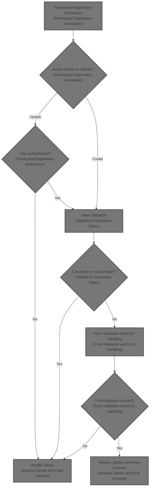
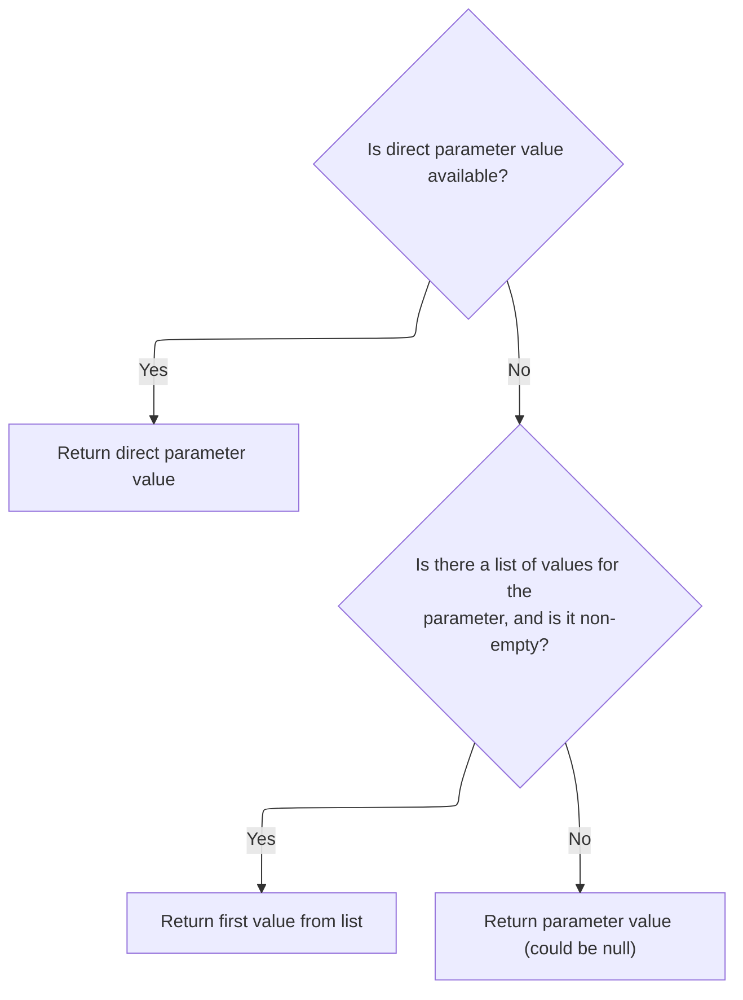
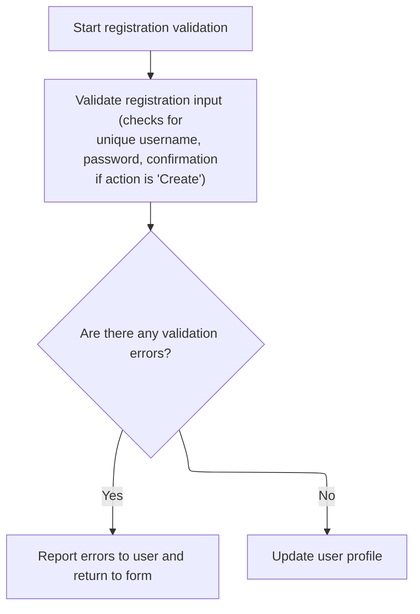
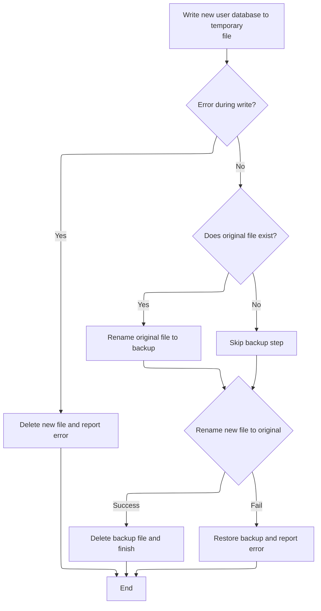
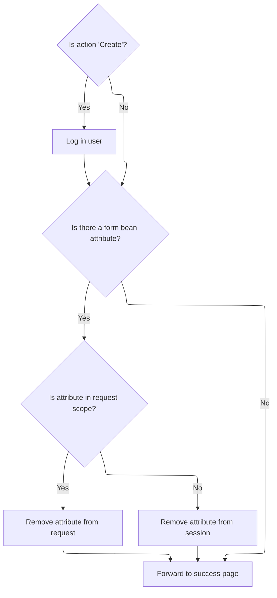

This document describes how registration submissions are processed as part of user management. When a user submits a registration form, the system determines whether to create a new account or update an existing one, validates the submission, saves the user data, and logs in the user if newly registered. If validation fails, the user is returned to the form with errors.



# Processing Registration Submission

```mermaid
%%{init: {"flowchart": {"defaultRenderer": "elk"}} }%%
flowchart TD
  node1["Start registration save process"]
  click node1 openCode "apps/faces-example1/src/main/java/org/apache/struts/webapp/example/SaveRegistrationAction.java:84:104"
  node1 --> node2{"Is action 'Create'?"}
  click node2 openCode "apps/faces-example1/src/main/java/org/apache/struts/webapp/example/SaveRegistrationAction.java:93:96"
  node2 -->|"No"| node3{"Is user logged in?"}
  click node3 openCode "apps/faces-example1/src/main/java/org/apache/struts/webapp/example/SaveRegistrationAction.java:105:112"
  node2 -->|"Yes"| node4["Form Validation and Error Handling"]
  
  node3 -->|"No"| node5["Forward to logon page"]
  click node5 openCode "apps/faces-example1/src/main/java/org/apache/struts/webapp/example/SaveRegistrationAction.java:111:112"
  node3 -->|"Yes"| node4
  node4 --> node6{"Was transaction cancelled?"}
  
  node6 -->|"Yes"| node7["Forward to failure page"]
  click node7 openCode "apps/faces-example1/src/main/java/org/apache/struts/webapp/example/SaveRegistrationAction.java:120:122"
  node6 -->|"No"| node8{"Is token valid?"}
  
  node8 -->|"No"| node9["Form Validation and Error Handling"]
  
  node8 -->|"Yes"| node10["Form Validation and Error Handling"]
  
  node9 --> node10
  node10 --> node11{"Are there validation errors?"}
  click node11 openCode "apps/faces-example1/src/main/java/org/apache/struts/webapp/example/SaveRegistrationAction.java:161:165"
  node11 -->|"Yes"| node12["Return to input form"]
  click node12 openCode "apps/faces-example1/src/main/java/org/apache/struts/webapp/example/SaveRegistrationAction.java:162:164"
  node11 -->|"No"| node13["Cloning Configuration Properties"]
  
  node13 --> node14["Persisting Database Changes"]
  
  node14 --> node15{"Is action 'Create'?"}
  click node15 openCode "apps/faces-example1/src/main/java/org/apache/struts/webapp/example/SaveRegistrationAction.java:197:203"
  node15 -->|"Yes"| node16["Log in new user"]
  click node16 openCode "apps/faces-example1/src/main/java/org/apache/struts/webapp/example/SaveRegistrationAction.java:198:203"
  node15 -->|"No"| node17["Skip login"]
  click node17 openCode "apps/faces-example1/src/main/java/org/apache/struts/webapp/example/SaveRegistrationAction.java:204:204"
  node16 --> node18["Remove obsolete form bean"]
  click node18 openCode "apps/faces-example1/src/main/java/org/apache/struts/webapp/example/SaveRegistrationAction.java:206:211"
  node17 --> node18
  node18 --> node19["Forward to success page"]
  click node19 openCode "apps/faces-example1/src/main/java/org/apache/struts/webapp/example/SaveRegistrationAction.java:217:217"

classDef HeadingStyle fill:#777777,stroke:#333,stroke-width:2px;
click node4 goToHeading "Form Validation and Error Handling"
node4:::HeadingStyle
click node6 goToHeading "Form Validation and Error Handling"
node6:::HeadingStyle
click node8 goToHeading "Validating Transaction Token"
node8:::HeadingStyle
click node9 goToHeading "Form Validation and Error Handling"
node9:::HeadingStyle
click node10 goToHeading "Form Validation and Error Handling"
node10:::HeadingStyle
click node13 goToHeading "Cloning Configuration Properties"
node13:::HeadingStyle
click node14 goToHeading "Persisting Database Changes"
node14:::HeadingStyle

%% Swimm:
%% %%{init: {"flowchart": {"defaultRenderer": "elk"}} }%%
%% flowchart TD
%%   node1["Start registration save process"]
%%   click node1 openCode "<SwmPath>[apps/…/example/SaveRegistrationAction.java](apps/faces-example1/src/main/java/org/apache/struts/webapp/example/SaveRegistrationAction.java)</SwmPath>:84:104"
%%   node1 --> node2{"Is action 'Create'?"}
%%   click node2 openCode "<SwmPath>[apps/…/example/SaveRegistrationAction.java](apps/faces-example1/src/main/java/org/apache/struts/webapp/example/SaveRegistrationAction.java)</SwmPath>:93:96"
%%   node2 -->|"No"| node3{"Is user logged in?"}
%%   click node3 openCode "<SwmPath>[apps/…/example/SaveRegistrationAction.java](apps/faces-example1/src/main/java/org/apache/struts/webapp/example/SaveRegistrationAction.java)</SwmPath>:105:112"
%%   node2 -->|"Yes"| node4["Form Validation and Error Handling"]
%%   
%%   node3 -->|"No"| node5["Forward to logon page"]
%%   click node5 openCode "<SwmPath>[apps/…/example/SaveRegistrationAction.java](apps/faces-example1/src/main/java/org/apache/struts/webapp/example/SaveRegistrationAction.java)</SwmPath>:111:112"
%%   node3 -->|"Yes"| node4
%%   node4 --> node6{"Was transaction cancelled?"}
%%   
%%   node6 -->|"Yes"| node7["Forward to failure page"]
%%   click node7 openCode "<SwmPath>[apps/…/example/SaveRegistrationAction.java](apps/faces-example1/src/main/java/org/apache/struts/webapp/example/SaveRegistrationAction.java)</SwmPath>:120:122"
%%   node6 -->|"No"| node8{"Is token valid?"}
%%   
%%   node8 -->|"No"| node9["Form Validation and Error Handling"]
%%   
%%   node8 -->|"Yes"| node10["Form Validation and Error Handling"]
%%   
%%   node9 --> node10
%%   node10 --> node11{"Are there validation errors?"}
%%   click node11 openCode "<SwmPath>[apps/…/example/SaveRegistrationAction.java](apps/faces-example1/src/main/java/org/apache/struts/webapp/example/SaveRegistrationAction.java)</SwmPath>:161:165"
%%   node11 -->|"Yes"| node12["Return to input form"]
%%   click node12 openCode "<SwmPath>[apps/…/example/SaveRegistrationAction.java](apps/faces-example1/src/main/java/org/apache/struts/webapp/example/SaveRegistrationAction.java)</SwmPath>:162:164"
%%   node11 -->|"No"| node13["Cloning Configuration Properties"]
%%   
%%   node13 --> node14["Persisting Database Changes"]
%%   
%%   node14 --> node15{"Is action 'Create'?"}
%%   click node15 openCode "<SwmPath>[apps/…/example/SaveRegistrationAction.java](apps/faces-example1/src/main/java/org/apache/struts/webapp/example/SaveRegistrationAction.java)</SwmPath>:197:203"
%%   node15 -->|"Yes"| node16["Log in new user"]
%%   click node16 openCode "<SwmPath>[apps/…/example/SaveRegistrationAction.java](apps/faces-example1/src/main/java/org/apache/struts/webapp/example/SaveRegistrationAction.java)</SwmPath>:198:203"
%%   node15 -->|"No"| node17["Skip login"]
%%   click node17 openCode "<SwmPath>[apps/…/example/SaveRegistrationAction.java](apps/faces-example1/src/main/java/org/apache/struts/webapp/example/SaveRegistrationAction.java)</SwmPath>:204:204"
%%   node16 --> node18["Remove obsolete form bean"]
%%   click node18 openCode "<SwmPath>[apps/…/example/SaveRegistrationAction.java](apps/faces-example1/src/main/java/org/apache/struts/webapp/example/SaveRegistrationAction.java)</SwmPath>:206:211"
%%   node17 --> node18
%%   node18 --> node19["Forward to success page"]
%%   click node19 openCode "<SwmPath>[apps/…/example/SaveRegistrationAction.java](apps/faces-example1/src/main/java/org/apache/struts/webapp/example/SaveRegistrationAction.java)</SwmPath>:217:217"
%% 
%% classDef HeadingStyle fill:#777777,stroke:#333,stroke-width:2px;
%% click node4 goToHeading "Form Validation and Error Handling"
%% node4:::HeadingStyle
%% click node6 goToHeading "Form Validation and Error Handling"
%% node6:::HeadingStyle
%% click node8 goToHeading "Validating Transaction Token"
%% node8:::HeadingStyle
%% click node9 goToHeading "Form Validation and Error Handling"
%% node9:::HeadingStyle
%% click node10 goToHeading "Form Validation and Error Handling"
%% node10:::HeadingStyle
%% click node13 goToHeading "Cloning Configuration Properties"
%% node13:::HeadingStyle
%% click node14 goToHeading "Persisting Database Changes"
%% node14:::HeadingStyle
```



<SwmSnippet path="/apps/faces-example1/src/main/java/org/apache/struts/webapp/example/SaveRegistrationAction.java" line="84">

---

In `SaveRegistrationAction.execute`, we grab the session, cast the form to <SwmToken path="apps/faces-example1/src/main/java/org/apache/struts/webapp/example/SaveRegistrationAction.java" pos="92:1:1" line-data="    RegistrationForm regform = (RegistrationForm) form;">`RegistrationForm`</SwmToken> (assuming that's always true), and pull the action string to decide if we're creating or updating a user. If the action is missing, we treat it as a new registration. We also check if the user is logged in (unless creating), handle cancellation, and start validating the transaction token. Next, we call Action.isTokenValid to make sure the request isn't a duplicate or forged, which is a standard check before processing sensitive operations.

```java
    public ActionForward execute(ActionMapping mapping,
                 ActionForm form,
                 HttpServletRequest request,
                 HttpServletResponse response)
    throws Exception {

    // Extract attributes and parameters we will need
    HttpSession session = request.getSession();
    RegistrationForm regform = (RegistrationForm) form;
    String action = regform.getAction();
    if (action == null) {
        action = "Create";
        }
        UserDatabase database = (UserDatabase)
      servlet.getServletContext().getAttribute(Constants.DATABASE_KEY);
        if (log.isDebugEnabled()) {
            log.debug("SaveRegistrationAction:  Processing " + action +
                      " action");
        }

    // Is there a currently logged on user (unless creating)?
    User user = (User) session.getAttribute(Constants.USER_KEY);
    if (!"Create".equals(action) && (user == null)) {
            if (log.isTraceEnabled()) {
                log.trace(" User is not logged on in session "
                          + session.getId());
            }
        return (mapping.findForward("logon"));
        }

    // Was this transaction cancelled?
    if (isCancelled(request)) {
            if (log.isTraceEnabled()) {
                log.trace(" Transaction '" + action +
                          "' was cancelled");
            }
        session.removeAttribute(Constants.SUBSCRIPTION_KEY);
        return (mapping.findForward("failure"));
    }

        // Validate the transactional control token
    ActionMessages errors = new ActionMessages();
        if (log.isTraceEnabled()) {
            log.trace(" Checking transactional control token");
        }
        if (!isTokenValid(request)) {
            errors.add(ActionMessages.GLOBAL_MESSAGE,
                       new ActionMessage("error.transaction.token"));
        }
```

---

</SwmSnippet>

## Validating Transaction Token

<SwmSnippet path="/core/src/main/java/org/apache/struts/action/Action.java" line="429">

---

<SwmToken path="core/src/main/java/org/apache/struts/action/Action.java" pos="429:5:5" line-data="    protected boolean isTokenValid(HttpServletRequest request) {">`isTokenValid`</SwmToken> just passes the request to <SwmToken path="core/src/main/java/org/apache/struts/action/Action.java" pos="28:10:10" line-data="import org.apache.struts.util.TokenProcessor;">`TokenProcessor`</SwmToken>'s <SwmToken path="core/src/main/java/org/apache/struts/action/Action.java" pos="429:5:5" line-data="    protected boolean isTokenValid(HttpServletRequest request) {">`isTokenValid`</SwmToken> method. This keeps the token logic in one place, so if we need to change how tokens are checked, we only do it in <SwmToken path="core/src/main/java/org/apache/struts/action/Action.java" pos="28:10:10" line-data="import org.apache.struts.util.TokenProcessor;">`TokenProcessor`</SwmToken>. Next, we call TokenProcessor.isTokenValid to actually check the token.

```java
    protected boolean isTokenValid(HttpServletRequest request) {
        return token.isTokenValid(request, false);
    }
```

---

</SwmSnippet>

## Checking Session and Request Tokens

```mermaid
%%{init: {"flowchart": {"defaultRenderer": "elk"}} }%%
flowchart TD
    node1["Start token validation"] --> node2{"Is there an active session?"}
    click node1 openCode "core/src/main/java/org/apache/struts/util/TokenProcessor.java:111:114"
    node2 -->|"No"| node6["Reject request"]
    click node2 openCode "core/src/main/java/org/apache/struts/util/TokenProcessor.java:114:118"
    node2 -->|"Yes"| node3{"Is there a saved token in session?"}
    click node3 openCode "core/src/main/java/org/apache/struts/util/TokenProcessor.java:122:127"
    node3 -->|"No"| node6
    node3 -->|"Yes"| node4{"Reset flag is true?"}
    click node4 openCode "core/src/main/java/org/apache/struts/util/TokenProcessor.java:129:131"
    node4 -->|"Yes"| node5["Reset the token (optional)"]
    click node5 openCode "core/src/main/java/org/apache/struts/util/TokenProcessor.java:130:131"
    node4 -->|"No"| node8
    node5 --> node8
    node8{"Is there a token in the request?"}
    click node8 openCode "core/src/main/java/org/apache/struts/util/TokenProcessor.java:134:138"
    node8 -->|"No"| node6
    node8 -->|"Yes"| node9{"Does provided token match saved token?"}
    click node9 openCode "core/src/main/java/org/apache/struts/util/TokenProcessor.java:140:140"
    node9 -->|"Yes"| node10["Allow request"]
    click node10 openCode "core/src/main/java/org/apache/struts/util/TokenProcessor.java:140:141"
    node9 -->|"No"| node6
    click node6 openCode "core/src/main/java/org/apache/struts/util/TokenProcessor.java:117:138"

classDef HeadingStyle fill:#777777,stroke:#333,stroke-width:2px;

%% Swimm:
%% %%{init: {"flowchart": {"defaultRenderer": "elk"}} }%%
%% flowchart TD
%%     node1["Start token validation"] --> node2{"Is there an active session?"}
%%     click node1 openCode "<SwmPath>[core/…/util/TokenProcessor.java](core/src/main/java/org/apache/struts/util/TokenProcessor.java)</SwmPath>:111:114"
%%     node2 -->|"No"| node6["Reject request"]
%%     click node2 openCode "<SwmPath>[core/…/util/TokenProcessor.java](core/src/main/java/org/apache/struts/util/TokenProcessor.java)</SwmPath>:114:118"
%%     node2 -->|"Yes"| node3{"Is there a saved token in session?"}
%%     click node3 openCode "<SwmPath>[core/…/util/TokenProcessor.java](core/src/main/java/org/apache/struts/util/TokenProcessor.java)</SwmPath>:122:127"
%%     node3 -->|"No"| node6
%%     node3 -->|"Yes"| node4{"Reset flag is true?"}
%%     click node4 openCode "<SwmPath>[core/…/util/TokenProcessor.java](core/src/main/java/org/apache/struts/util/TokenProcessor.java)</SwmPath>:129:131"
%%     node4 -->|"Yes"| node5["Reset the token (optional)"]
%%     click node5 openCode "<SwmPath>[core/…/util/TokenProcessor.java](core/src/main/java/org/apache/struts/util/TokenProcessor.java)</SwmPath>:130:131"
%%     node4 -->|"No"| node8
%%     node5 --> node8
%%     node8{"Is there a token in the request?"}
%%     click node8 openCode "<SwmPath>[core/…/util/TokenProcessor.java](core/src/main/java/org/apache/struts/util/TokenProcessor.java)</SwmPath>:134:138"
%%     node8 -->|"No"| node6
%%     node8 -->|"Yes"| node9{"Does provided token match saved token?"}
%%     click node9 openCode "<SwmPath>[core/…/util/TokenProcessor.java](core/src/main/java/org/apache/struts/util/TokenProcessor.java)</SwmPath>:140:140"
%%     node9 -->|"Yes"| node10["Allow request"]
%%     click node10 openCode "<SwmPath>[core/…/util/TokenProcessor.java](core/src/main/java/org/apache/struts/util/TokenProcessor.java)</SwmPath>:140:141"
%%     node9 -->|"No"| node6
%%     click node6 openCode "<SwmPath>[core/…/util/TokenProcessor.java](core/src/main/java/org/apache/struts/util/TokenProcessor.java)</SwmPath>:117:138"
%% 
%% classDef HeadingStyle fill:#777777,stroke:#333,stroke-width:2px;
```



<SwmSnippet path="/core/src/main/java/org/apache/struts/util/TokenProcessor.java" line="111">

---

<SwmToken path="core/src/main/java/org/apache/struts/util/TokenProcessor.java" pos="111:7:7" line-data="    public synchronized boolean isTokenValid(HttpServletRequest request,">`isTokenValid`</SwmToken> in <SwmToken path="core/src/main/java/org/apache/struts/action/Action.java" pos="28:10:10" line-data="import org.apache.struts.util.TokenProcessor;">`TokenProcessor`</SwmToken> grabs the session, checks for a stored token, and compares it to the token in the request. If anything's missing or doesn't match, it's invalid. To get the token from the request, we call <SwmToken path="core/src/main/java/org/apache/struts/util/TokenProcessor.java" pos="134:9:9" line-data="        String token = request.getParameter(Globals.TOKEN_KEY);">`getParameter`</SwmToken>, which might be wrapped by <SwmToken path="core/src/main/java/org/apache/struts/upload/MultipartRequestWrapper.java" pos="38:4:4" line-data="public class MultipartRequestWrapper extends HttpServletRequestWrapper {">`MultipartRequestWrapper`</SwmToken> if the request is multipart.

```java
    public synchronized boolean isTokenValid(HttpServletRequest request,
        boolean reset) {
        // Retrieve the current session for this request
        HttpSession session = request.getSession(false);

        if (session == null) {
            return false;
        }

        // Retrieve the transaction token from this session, and
        // reset it if requested
        String saved =
            (String) session.getAttribute(Globals.TRANSACTION_TOKEN_KEY);

        if (saved == null) {
            return false;
        }

        if (reset) {
            this.resetToken(request);
        }

        // Retrieve the transaction token included in this request
        String token = request.getParameter(Globals.TOKEN_KEY);

        if (token == null) {
            return false;
        }

        return saved.equals(token);
    }
```

---

</SwmSnippet>

## Resolving Request Parameters

<SwmSnippet path="/core/src/main/java/org/apache/struts/upload/MultipartRequestWrapper.java" line="75">

---

In <SwmToken path="core/src/main/java/org/apache/struts/upload/MultipartRequestWrapper.java" pos="75:5:5" line-data="    public String getParameter(String name) {">`getParameter`</SwmToken>, we first try to get the parameter from the wrapped request. If it's not there, we check our own parameters map (which handles multipart form data). To get the parameter from the wrapped request, we call ServletActionContext.getRequest next.

```java
    public String getParameter(String name) {
        String value = getRequest().getParameter(name);

```

---

</SwmSnippet>

### Accessing the Underlying Servlet Request

<SwmSnippet path="/core/src/main/java/org/apache/struts/chain/contexts/ServletActionContext.java" line="94">

---

<SwmToken path="core/src/main/java/org/apache/struts/chain/contexts/ServletActionContext.java" pos="94:5:5" line-data="    public HttpServletRequest getRequest() {">`getRequest`</SwmToken> just calls <SwmToken path="core/src/main/java/org/apache/struts/chain/contexts/ServletActionContext.java" pos="95:3:5" line-data="        return servletWebContext().getRequest();">`servletWebContext()`</SwmToken><SwmToken path="core/src/main/java/org/apache/struts/chain/contexts/ServletActionContext.java" pos="95:6:9" line-data="        return servletWebContext().getRequest();">`.getRequest()`</SwmToken> to get the real <SwmToken path="core/src/main/java/org/apache/struts/chain/contexts/ServletActionContext.java" pos="94:3:3" line-data="    public HttpServletRequest getRequest() {">`HttpServletRequest`</SwmToken>. Next, we need to resolve what <SwmToken path="core/src/main/java/org/apache/struts/chain/contexts/ServletActionContext.java" pos="95:3:5" line-data="        return servletWebContext().getRequest();">`servletWebContext()`</SwmToken> actually returns, so we call that function.

```java
    public HttpServletRequest getRequest() {
        return servletWebContext().getRequest();
    }
```

---

</SwmSnippet>

<SwmSnippet path="/core/src/main/java/org/apache/struts/chain/contexts/ServletActionContext.java" line="67">

---

<SwmToken path="core/src/main/java/org/apache/struts/chain/contexts/ServletActionContext.java" pos="67:5:5" line-data="    protected ServletWebContext servletWebContext() {">`servletWebContext`</SwmToken> just casts the base context to <SwmToken path="core/src/main/java/org/apache/struts/chain/contexts/ServletActionContext.java" pos="67:3:3" line-data="    protected ServletWebContext servletWebContext() {">`ServletWebContext`</SwmToken>. If that's not what it is, things break. This is a shortcut for performance, but it assumes the context is always set up right.

```java
    protected ServletWebContext servletWebContext() {
        return (ServletWebContext) this.getBaseContext();
    }
```

---

</SwmSnippet>

### Fallback Parameter Lookup



<SwmSnippet path="/core/src/main/java/org/apache/struts/upload/MultipartRequestWrapper.java" line="78">

---

Back in `MultipartRequestWrapper.getParameter`, if the wrapped request didn't have the parameter (from <SwmToken path="core/src/main/java/org/apache/struts/chain/contexts/ServletActionContext.java" pos="39:4:4" line-data="public class ServletActionContext extends WebActionContext {">`ServletActionContext`</SwmToken>), we check our own parameters map. If it's there and not empty, we return the first value. This covers cases where multipart form data isn't in the standard request.

```java
        if (value == null) {
            String[] mValue = (String[]) parameters.get(name);

            if ((mValue != null) && (mValue.length > 0)) {
                value = mValue[0];
            }
        }

        return value;
    }
```

---

</SwmSnippet>

## Form Validation and Error Handling



<SwmSnippet path="/apps/faces-example1/src/main/java/org/apache/struts/webapp/example/SaveRegistrationAction.java" line="133">

---

Back in `SaveRegistrationAction.execute`, after token validation, we reset the token, validate the form fields (like username uniqueness and password presence for new users), and if there are errors, we save them and call <SwmToken path="apps/faces-example1/src/main/java/org/apache/struts/webapp/example/SaveRegistrationAction.java" pos="164:4:6" line-data="            return (mapping.getInputForward());">`mapping.getInputForward`</SwmToken> to send the user back to the form. Next, we call ActionMapping.getInputForward to figure out where to send the user.

```java
        resetToken(request);

    // Validate the request parameters specified by the user
        if (log.isTraceEnabled()) {
            log.trace(" Performing extra validations");
        }
    String value = null;
    value = regform.getUsername();
    if (("Create".equals(action)) &&
            (database.findUser(value) != null)) {
            errors.add("username",
                       new ActionMessage("error.username.unique",
                                       regform.getUsername()));
        }
    if ("Create".equals(action)) {
        value = regform.getPassword();
        if ((value == null) || (value.length() <1)) {
                errors.add("password",
                           new ActionMessage("error.password.required"));
            }
        value = regform.getPassword2();
        if ((value == null) || (value.length() < 1)) {
                errors.add("password2",
                           new ActionMessage("error.password2.required"));
            }
    }

    // Report any errors we have discovered back to the original form
    if (!errors.isEmpty()) {
        saveErrors(request, errors);
            saveToken(request);
            return (mapping.getInputForward());
    }

```

---

</SwmSnippet>

<SwmSnippet path="/core/src/main/java/org/apache/struts/action/ActionMapping.java" line="139">

---

<SwmToken path="core/src/main/java/org/apache/struts/action/ActionMapping.java" pos="139:5:5" line-data="    public ActionForward getInputForward() {">`getInputForward`</SwmToken> figures out where to send the user if there's a validation error. It checks config flags to decide if it should use a named forward or just return a new <SwmToken path="core/src/main/java/org/apache/struts/action/ActionMapping.java" pos="139:3:3" line-data="    public ActionForward getInputForward() {">`ActionForward`</SwmToken> with the input path. This lets the framework handle input errors flexibly.

```java
    public ActionForward getInputForward() {
        String input = getInput();
        if (getModuleConfig().getControllerConfig().getInputForward()) {
            if (input != null) {
                return findForward(input);
            }
            return findForward(Action.INPUT);
        }
        return (new ActionForward(input));
    }
```

---

</SwmSnippet>

<SwmSnippet path="/apps/faces-example1/src/main/java/org/apache/struts/webapp/example/SaveRegistrationAction.java" line="167">

---

Back in `SaveRegistrationAction.execute`, after handling validation errors, we either create a new user or update the existing one, then copy all the form properties to the user object. Next, we call BaseConfig.copyProperties to handle the property copying logic.

```java
    // Update the user's persistent profile information
        try {
            if ("Create".equals(action)) {
                user = database.createUser(regform.getUsername());
            }
            String oldPassword = user.getPassword();
            PropertyUtils.copyProperties(user, regform);
```

---

</SwmSnippet>

## Cloning Configuration Properties

<SwmSnippet path="/core/src/main/java/org/apache/struts/config/BaseConfig.java" line="155">

---

<SwmToken path="core/src/main/java/org/apache/struts/config/BaseConfig.java" pos="155:5:5" line-data="    protected Properties copyProperties() {">`copyProperties`</SwmToken> makes a new Properties object and copies all key-value pairs from the original. This is used to avoid messing with the original config. Next, we call <SwmToken path="core/src/main/java/org/apache/struts/config/BaseConfig.java" pos="163:3:3" line-data="            copy.setProperty(key, properties.getProperty(key));">`setProperty`</SwmToken> to update individual properties safely.

```java
    protected Properties copyProperties() {
        Properties copy = new Properties();

        Enumeration keys = properties.propertyNames();

        while (keys.hasMoreElements()) {
            String key = (String) keys.nextElement();

            copy.setProperty(key, properties.getProperty(key));
        }

        return copy;
    }
```

---

</SwmSnippet>

## Setting a Configuration Property

<SwmSnippet path="/core/src/main/java/org/apache/struts/config/BaseConfig.java" line="88">

---

<SwmToken path="core/src/main/java/org/apache/struts/config/BaseConfig.java" pos="88:5:5" line-data="    public void setProperty(String key, String value) {">`setProperty`</SwmToken> checks if the config is locked before updating a property. If it's safe, it sets the property. Next, we call NestedPropertyHelper.setProperty to handle nested property updates tied to the request.

```java
    public void setProperty(String key, String value) {
        throwIfConfigured();
        properties.setProperty(key, value);
    }
```

---

</SwmSnippet>

## Managing Nested Property State

<SwmSnippet path="/taglib/src/main/java/org/apache/struts/taglib/nested/NestedPropertyHelper.java" line="136">

---

In <SwmToken path="taglib/src/main/java/org/apache/struts/taglib/nested/NestedPropertyHelper.java" pos="136:9:9" line-data="    public static final void setProperty(HttpServletRequest request,">`setProperty`</SwmToken>, we grab or create a <SwmToken path="taglib/src/main/java/org/apache/struts/taglib/nested/NestedPropertyHelper.java" pos="139:1:1" line-data="        NestedReference nr = referenceInstance(request);">`NestedReference`</SwmToken> from the request attributes. This keeps nested property state tied to the current request. Next, we call <SwmToken path="taglib/src/main/java/org/apache/struts/taglib/nested/NestedPropertyHelper.java" pos="139:7:7" line-data="        NestedReference nr = referenceInstance(request);">`referenceInstance`</SwmToken> to get or make that reference.

```java
    public static final void setProperty(HttpServletRequest request,
        String property) {
        // get the old one if any
        NestedReference nr = referenceInstance(request);

```

---

</SwmSnippet>

<SwmSnippet path="/taglib/src/main/java/org/apache/struts/taglib/nested/NestedPropertyHelper.java" line="208">

---

<SwmToken path="taglib/src/main/java/org/apache/struts/taglib/nested/NestedPropertyHelper.java" pos="208:9:9" line-data="    private static final NestedReference referenceInstance(">`referenceInstance`</SwmToken> checks if there's already a <SwmToken path="taglib/src/main/java/org/apache/struts/taglib/nested/NestedPropertyHelper.java" pos="208:7:7" line-data="    private static final NestedReference referenceInstance(">`NestedReference`</SwmToken> in the request. If not, it creates one and stores it with a constant key. This way, we only have one per request and don't waste memory.

```java
    private static final NestedReference referenceInstance(
        HttpServletRequest request) {
        /* get the old one if any */
        NestedReference nr =
            (NestedReference) request.getAttribute(NESTED_INCLUDES_KEY);

        // make a new one if required
        if (nr == null) {
            nr = new NestedReference();
            request.setAttribute(NESTED_INCLUDES_KEY, nr);
        }

        // return the reference
        return nr;
    }
```

---

</SwmSnippet>

<SwmSnippet path="/taglib/src/main/java/org/apache/struts/taglib/nested/NestedPropertyHelper.java" line="141">

---

Back in `NestedPropertyHelper.setProperty`, after getting the <SwmToken path="taglib/src/main/java/org/apache/struts/taglib/nested/NestedPropertyHelper.java" pos="139:1:1" line-data="        NestedReference nr = referenceInstance(request);">`NestedReference`</SwmToken>, we set the nested property on it. This updates the state for the rest of the request.

```java
        nr.setNestedProperty(property);
    }
```

---

</SwmSnippet>

## Saving User Data

<SwmSnippet path="/apps/faces-example1/src/main/java/org/apache/struts/webapp/example/SaveRegistrationAction.java" line="174">

---

Back in `SaveRegistrationAction.execute`, after copying properties, we check if the password is missing and restore the old one if needed. Then we call <SwmToken path="apps/faces-example1/src/main/java/org/apache/struts/webapp/example/SaveRegistrationAction.java" pos="191:1:3" line-data="            database.save();">`database.save`</SwmToken> to persist the user data. Next, we call MemoryUserDatabase.save to handle the actual file write.

```java
            if ((regform.getPassword() == null) ||
                (regform.getPassword().length() < 1)) {
                user.setPassword(oldPassword);
            }
        } catch (InvocationTargetException e) {
            Throwable t = e.getTargetException();
            if (t == null) {
                t = e;
            }
            log.error("Registration.populate", t);
            throw new ServletException("Registration.populate", t);
        } catch (Throwable t) {
            log.error("Registration.populate", t);
            throw new ServletException("Subscription.populate", t);
        }

        try {
            database.save();
        } catch (Exception e) {
            log.error("Database save", e);
        }

```

---

</SwmSnippet>

## Persisting Database Changes

<SwmSnippet path="/apps/faces-example1/src/main/java/org/apache/struts/webapp/example/memory/MemoryUserDatabase.java" line="257">

---

In `MemoryUserDatabase.save`, we write all users and their subscriptions as XML to a temp file. We use <SwmToken path="core/src/main/java/org/apache/struts/util/TokenProcessor.java" pos="204:16:16" line-data="            byte[] now = new Long(current).toString().getBytes();">`toString`</SwmToken> for XML output, and only swap files if everything writes cleanly. Next, we call <SwmToken path="apps/faces-example1/src/main/java/org/apache/struts/webapp/example/memory/MemoryUserDatabase.java" pos="297:6:6" line-data="            if (writer.checkError()) {">`checkError`</SwmToken> to make sure the write worked.

```java
    public void save() throws Exception {

        if (log.isDebugEnabled()) {
            log.debug("Saving database to '" + pathname + "'");
        }
        File fileNew = new File(pathnameNew);
        PrintWriter writer = null;

        try {

            // Configure our PrintWriter
            FileOutputStream fos = new FileOutputStream(fileNew);
            OutputStreamWriter osw = new OutputStreamWriter(fos);
            writer = new PrintWriter(osw);

            // Print the file prolog
            writer.println("<?xml version='1.0'?>");
            writer.println("<database>");

            // Print entries for each defined user and associated subscriptions
            User users[] = findUsers();
            for (int i = 0; i < users.length; i++) {
                writer.print("  ");
                writer.println(users[i]);
                Subscription subscriptions[] =
                    users[i].getSubscriptions();
                for (int j = 0; j < subscriptions.length; j++) {
                    writer.print("    ");
                    writer.println(subscriptions[j]);
                    writer.print("    ");
                    writer.println("</subscription>");
                }
                writer.print("  ");
                writer.println("</user>");
            }
```

---

</SwmSnippet>

<SwmSnippet path="/apps/faces-example1/src/main/java/org/apache/struts/webapp/example/memory/MemoryUserDatabase.java" line="293">

---

After writing the XML, we call <SwmToken path="apps/faces-example1/src/main/java/org/apache/struts/webapp/example/memory/MemoryUserDatabase.java" pos="297:4:6" line-data="            if (writer.checkError()) {">`writer.checkError`</SwmToken> to catch any print or IO errors before we touch the real database file. Next, we call ServletContextWriter.checkError to do the actual check and flush.

```java
            // Print the file epilog
            writer.println("</database>");

            // Check for errors that occurred while printing
            if (writer.checkError()) {
```

---

</SwmSnippet>

<SwmSnippet path="/core/src/main/java/org/apache/struts/util/ServletContextWriter.java" line="77">

---

<SwmToken path="core/src/main/java/org/apache/struts/util/ServletContextWriter.java" pos="77:5:5" line-data="    public boolean checkError() {">`checkError`</SwmToken> flushes the writer before returning the error flag. This makes sure we're not missing any errors that only show up when the buffer is written out.

```java
    public boolean checkError() {
        flush();

        return (error);
    }
```

---

</SwmSnippet>

<SwmSnippet path="/apps/faces-example1/src/main/java/org/apache/struts/webapp/example/memory/MemoryUserDatabase.java" line="298">

---

Back in `MemoryUserDatabase.save`, after checking for errors, we close the writer to clean up resources. If there was an error, we delete the temp file and throw. Next, we call MemoryUserDatabase.close to wrap up the file operations.

```java
                writer.close();
```

---

</SwmSnippet>

<SwmSnippet path="/apps/faces-example1/src/main/java/org/apache/struts/webapp/example/memory/MemoryUserDatabase.java" line="106">

---

<SwmToken path="apps/faces-example1/src/main/java/org/apache/struts/webapp/example/memory/MemoryUserDatabase.java" pos="106:5:5" line-data="    public void close() throws Exception {">`close`</SwmToken> just calls save again. It's a last-chance write, but in this flow, it's probably not needed since we already saved. Next, we handle any cleanup or error handling after closing.

```java
    public void close() throws Exception {

        save();

    }
```

---

</SwmSnippet>

<SwmSnippet path="/apps/faces-example1/src/main/java/org/apache/struts/webapp/example/memory/MemoryUserDatabase.java" line="299">

---

Back in `MemoryUserDatabase.save`, if there was an error, we delete the temp file to keep things clean. Next, we call RegistrationBacking.delete to handle any related cleanup for the registration process.

```java
                fileNew.delete();
                throw new IOException
                    ("Saving database to '" + pathname + "'");
            }
```

---

</SwmSnippet>

### Cleaning Up Registration State

See <SwmLink doc-title="Deleting a Subscription">[Deleting a Subscription](/.swm/deleting-a-subscription.acxm8obz.sw.md)</SwmLink>

### Finalizing Database Save



<SwmSnippet path="/apps/faces-example1/src/main/java/org/apache/struts/webapp/example/memory/MemoryUserDatabase.java" line="303">

---

Back in `MemoryUserDatabase.save`, if there's an <SwmToken path="apps/faces-example1/src/main/java/org/apache/struts/webapp/example/memory/MemoryUserDatabase.java" pos="306:6:6" line-data="        } catch (IOException e) {">`IOException`</SwmToken>, we close the writer in the catch block to avoid leaking resources. After that, we handle file cleanup and rethrow the error if needed.

```java
            writer.close();
            writer = null;

        } catch (IOException e) {

            if (writer != null) {
                writer.close();
            }
```

---

</SwmSnippet>

<SwmSnippet path="/apps/faces-example1/src/main/java/org/apache/struts/webapp/example/memory/MemoryUserDatabase.java" line="311">

---

Back in `MemoryUserDatabase.save`, after writing and cleanup, we rename the temp file to the real database file. If anything fails, we try to restore the backup. This keeps the database consistent. Next, we call RegistrationBacking to finish up any registration-related tasks.

```java
            fileNew.delete();
            throw e;

        }


        // Perform the required renames to permanently save this file
        File fileOrig = new File(pathname);
        File fileOld = new File(pathnameOld);
        if (fileOrig.exists()) {
            fileOld.delete();
            if (!fileOrig.renameTo(fileOld)) {
                throw new IOException
                    ("Renaming '" + pathname + "' to '" + pathnameOld + "'");
            }
        }
        if (!fileNew.renameTo(fileOrig)) {
            if (fileOld.exists()) {
                fileOld.renameTo(fileOrig);
            }
            throw new IOException
                ("Renaming '" + pathnameNew + "' to '" + pathname + "'");
        }
        fileOld.delete();

    }
```

---

</SwmSnippet>

## Session Update and Final Forward



<SwmSnippet path="/apps/faces-example1/src/main/java/org/apache/struts/webapp/example/SaveRegistrationAction.java" line="196">

---

Back in `SaveRegistrationAction.execute`, after saving the user, we log them in if they just registered, clean up the form bean, and forward to the success page. This wraps up the whole registration or update process.

```java
        // Log the user in if appropriate
    if ("Create".equals(action)) {
        session.setAttribute(Constants.USER_KEY, user);
            if (log.isTraceEnabled()) {
                log.trace(" User '" + user.getUsername() +
                          "' logged on in session " + session.getId());
            }
    }

    // Remove the obsolete form bean
    if (mapping.getAttribute() != null) {
            if ("request".equals(mapping.getScope()))
                request.removeAttribute(mapping.getAttribute());
            else
                session.removeAttribute(mapping.getAttribute());
        }

    // Forward control to the specified success URI
        if (log.isTraceEnabled()) {
            log.trace(" Forwarding to success page");
        }
    return (mapping.findForward("success"));

    }
```

---

</SwmSnippet>

&nbsp;

*This is an auto-generated document by Swimm 🌊 and has not yet been verified by a human*

<SwmMeta version="3.0.0" repo-id="Z2l0aHViJTNBJTNBc3RydXRzMSUzQSUzQVN3aW1tLURlbW8=" repo-name="struts1"><sup>Powered by [Swimm](https://app.swimm.io/)</sup></SwmMeta>
