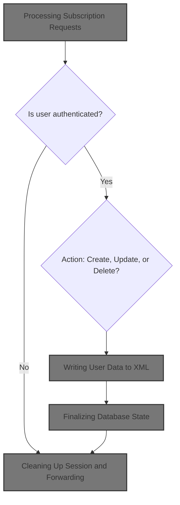
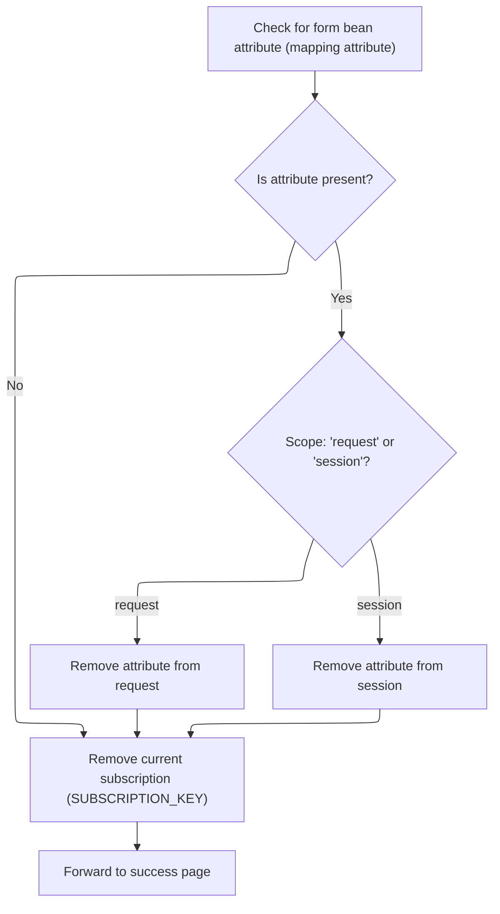

When a user requests to create, update, or delete a subscription, the system updates the user's subscription data, saves the changes, and forwards the user to a success page.



# Processing Subscription Requests

<SwmSnippet path="/apps/faces-example1/src/main/java/org/apache/struts/webapp/example/SaveSubscriptionAction.java" line="82">

---

In `SaveSubscriptionAction.execute`, we start by grabbing the form and session objects, assuming the form is a <SwmToken path="apps/faces-example1/src/main/java/org/apache/struts/webapp/example/SaveSubscriptionAction.java" pos="91:1:1" line-data="    SubscriptionForm subform = (SubscriptionForm) form;">`SubscriptionForm`</SwmToken> and the session has a User and Subscription. The code checks the action type ('Create', 'Delete', etc.), handles user authentication, transaction cancellation, and subscription creation/deletion. After updating or deleting a subscription, we need to call MemoryUserDatabase.save to persist these changes, so the next step is saving the updated <SwmToken path="mailreader-dao/src/main/java/org/apache/struts/apps/mailreader/dao/impl/memory/MemoryUserDatabase.java" pos="175:5:7" line-data="                (&quot;database/user/subscription&quot;,">`user/subscription`</SwmToken> data to the database.

```java
    public ActionForward execute(ActionMapping mapping,
                 ActionForm form,
                 HttpServletRequest request,
                 HttpServletResponse response)
    throws Exception {

    // Extract attributes and parameters we will need
    MessageResources messages = getResources(request);
    HttpSession session = request.getSession();
    SubscriptionForm subform = (SubscriptionForm) form;
    String action = subform.getAction();
    if (action == null) {
        action = "?";
        }
        if (log.isDebugEnabled()) {
            log.debug("SaveSubscriptionAction:  Processing " + action +
                      " action");
        }

    // Is there a currently logged on user?
    User user = (User) session.getAttribute(Constants.USER_KEY);
    if (user == null) {
            if (log.isTraceEnabled()) {
                log.trace(" User is not logged on in session "
                          + session.getId());
            }
        return (mapping.findForward("logon"));
        }

    // Was this transaction cancelled?
    if (isCancelled(request)) {
            if (log.isTraceEnabled()) {
                log.trace(" Transaction '" + action +
                          "' was cancelled");
            }
            session.removeAttribute(Constants.SUBSCRIPTION_KEY);
        return (mapping.findForward("success"));
    }

    // Is there a related Subscription object?
    Subscription subscription =
      (Subscription) session.getAttribute(Constants.SUBSCRIPTION_KEY);
        if ("Create".equals(action)) {
            if (log.isTraceEnabled()) {
                log.trace(" Creating subscription for mail server '" +
                          subform.getHost() + "'");
            }
            subscription =
                user.createSubscription(subform.getHost());
        }
    if (subscription == null) {
            if (log.isTraceEnabled()) {
                log.trace(" Missing subscription for user '" +
                          user.getUsername() + "'");
            }
        response.sendError(HttpServletResponse.SC_BAD_REQUEST,
                           messages.getMessage("error.noSubscription"));
        return (null);
    }

    // Was this transaction a Delete?
    if (action.equals("Delete")) {
            if (log.isTraceEnabled()) {
                log.trace(" Deleting mail server '" +
                          subscription.getHost() + "' for user '" +
                          user.getUsername() + "'");
            }
            user.removeSubscription(subscription);
        session.removeAttribute(Constants.SUBSCRIPTION_KEY);
            try {
                UserDatabase database = (UserDatabase)
                    servlet.getServletContext().
                    getAttribute(Constants.DATABASE_KEY);
                database.save();
            } catch (Exception e) {
                log.error("Database save", e);
            }
        return (mapping.findForward("success"));
    }

    // All required validations were done by the form itself

    // Update the persistent subscription information
        if (log.isTraceEnabled()) {
            log.trace(" Populating database from form bean");
        }
        try {
            PropertyUtils.copyProperties(subscription, subform);
        } catch (InvocationTargetException e) {
            Throwable t = e.getTargetException();
            if (t == null)
                t = e;
            log.error("Subscription.populate", t);
            throw new ServletException("Subscription.populate", t);
        } catch (Throwable t) {
            log.error("Subscription.populate", t);
            throw new ServletException("Subscription.populate", t);
        }

        try {
            UserDatabase database = (UserDatabase)
                servlet.getServletContext().
                getAttribute(Constants.DATABASE_KEY);
            database.save();
        } catch (Exception e) {
            log.error("Database save", e);
        }

```

---

</SwmSnippet>

## Writing User Data to XML

<SwmSnippet path="/mailreader-dao/src/main/java/org/apache/struts/apps/mailreader/dao/impl/memory/MemoryUserDatabase.java" line="225">

---

In `MemoryUserDatabase.save`, we loop through all users and their subscriptions, writing their XML representations (via <SwmToken path="apps/faces-example1/src/main/java/org/apache/struts/webapp/example/RegistrationBacking.java" pos="117:8:10" line-data="        forward(context, url.toString());">`toString()`</SwmToken>) to a temporary file. The XML structure and indentation are hardcoded. This prepares the data for atomic file operations, so the next step is to finalize the XML and handle file renaming.

```java
    public void save() throws Exception {

        if (log.isDebugEnabled()) {
            log.debug("Saving database to '" + pathname + "'");
        }
        File fileNew = new File(pathnameNew);
        PrintWriter writer = null;

        try {

            // Configure our PrintWriter
            FileOutputStream fos = new FileOutputStream(fileNew);
            OutputStreamWriter osw = new OutputStreamWriter(fos);
            writer = new PrintWriter(osw);

            // Print the file prolog
            writer.println("<?xml version='1.0'?>");
            writer.println("<database>");

            // Print entries for each defined user and associated subscriptions
            User yusers[] = findUsers();
            for (int i = 0; i < yusers.length; i++) {
                writer.print("  ");
                writer.println(yusers[i]);
                Subscription subscriptions[] =
                    yusers[i].getSubscriptions();
                for (int j = 0; j < subscriptions.length; j++) {
                    writer.print("    ");
                    writer.println(subscriptions[j]);
                    writer.print("    ");
                    writer.println("</subscription>");
                }
                writer.print("  ");
                writer.println("</user>");
            }
```

---

</SwmSnippet>

<SwmSnippet path="/mailreader-dao/src/main/java/org/apache/struts/apps/mailreader/dao/impl/memory/MemoryUserDatabase.java" line="261">

---

Here we finish writing the XML by closing the root element. This sets up the file for error checking and atomic renaming, so we need to call the next part of <SwmToken path="mailreader-dao/src/main/java/org/apache/struts/apps/mailreader/dao/impl/memory/MemoryUserDatabase.java" pos="51:4:4" line-data="public class MemoryUserDatabase implements UserDatabase {">`MemoryUserDatabase`</SwmToken> to handle file errors and cleanup.

```java
            // Print the file epilog
            writer.println("</database>");

            // Check for errors that occurred while printing
            if (writer.checkError()) {
                writer.close();
```

---

</SwmSnippet>

### Finalizing Database State

<SwmSnippet path="/mailreader-dao/src/main/java/org/apache/struts/apps/mailreader/dao/impl/memory/MemoryUserDatabase.java" line="102">

---

In `MemoryUserDatabase.close`, we call save() to persist any changes, then mark the database as closed. Next, we need to handle the state after closing, so we return to <SwmToken path="mailreader-dao/src/main/java/org/apache/struts/apps/mailreader/dao/impl/memory/MemoryUserDatabase.java" pos="51:4:4" line-data="public class MemoryUserDatabase implements UserDatabase {">`MemoryUserDatabase`</SwmToken> for cleanup.

```java
    public void close() throws Exception {

        save();
```

---

</SwmSnippet>

<SwmSnippet path="/mailreader-dao/src/main/java/org/apache/struts/apps/mailreader/dao/impl/memory/MemoryUserDatabase.java" line="105">

---

Back in MemoryUserDatabase.close, after saving, we set the open flag to false. This signals that the database is no longer available for operations until reopened.

```java
        this.open = false;

    }
```

---

</SwmSnippet>

### Error Handling During Save

```mermaid
%%{init: {"flowchart": {"defaultRenderer": "elk"}} }%%
flowchart TD
    node1["Start save: Write new user data file (temporary)"] --> node2{"Was write successful?"}
    click node1 openCode "mailreader-dao/src/main/java/org/apache/struts/apps/mailreader/dao/impl/memory/MemoryUserDatabase.java:267:270"
    click node2 openCode "mailreader-dao/src/main/java/org/apache/struts/apps/mailreader/dao/impl/memory/MemoryUserDatabase.java:267:270"
    node2 -->|"No"| node3["Abort and report failure"]
    click node3 openCode "mailreader-dao/src/main/java/org/apache/struts/apps/mailreader/dao/impl/memory/MemoryUserDatabase.java:267:270"
    node2 -->|"Yes"| node4{"Does main file exist?"}
    click node4 openCode "mailreader-dao/src/main/java/org/apache/struts/apps/mailreader/dao/impl/memory/MemoryUserDatabase.java:288:294"
    node4 -->|"Yes"| node5["Backup main file"]
    click node5 openCode "mailreader-dao/src/main/java/org/apache/struts/apps/mailreader/dao/impl/memory/MemoryUserDatabase.java:289:293"
    node4 -->|"No"| node6["Replace main file with new file"]
    click node6 openCode "mailreader-dao/src/main/java/org/apache/struts/apps/mailreader/dao/impl/memory/MemoryUserDatabase.java:295:301"
    node5 --> node6
    node6 --> node7{"Was replacement successful?"}
    click node7 openCode "mailreader-dao/src/main/java/org/apache/struts/apps/mailreader/dao/impl/memory/MemoryUserDatabase.java:295:301"
    node7 -->|"Yes"| node8["Save complete"]
    click node8 openCode "mailreader-dao/src/main/java/org/apache/struts/apps/mailreader/dao/impl/memory/MemoryUserDatabase.java:302:304"
    node7 -->|"No"| node9{"Backup exists?"}
    click node9 openCode "mailreader-dao/src/main/java/org/apache/struts/apps/mailreader/dao/impl/memory/MemoryUserDatabase.java:296:298"
    node9 -->|"Yes"| node10["Restore backup as main file"]
    click node10 openCode "mailreader-dao/src/main/java/org/apache/struts/apps/mailreader/dao/impl/memory/MemoryUserDatabase.java:297:298"
    node9 -->|"No"| node3
    node10 --> node3

classDef HeadingStyle fill:#777777,stroke:#333,stroke-width:2px;

%% Swimm:
%% %%{init: {"flowchart": {"defaultRenderer": "elk"}} }%%
%% flowchart TD
%%     node1["Start save: Write new user data file (temporary)"] --> node2{"Was write successful?"}
%%     click node1 openCode "<SwmPath>[mailreader-dao/…/memory/MemoryUserDatabase.java](mailreader-dao/src/main/java/org/apache/struts/apps/mailreader/dao/impl/memory/MemoryUserDatabase.java)</SwmPath>:267:270"
%%     click node2 openCode "<SwmPath>[mailreader-dao/…/memory/MemoryUserDatabase.java](mailreader-dao/src/main/java/org/apache/struts/apps/mailreader/dao/impl/memory/MemoryUserDatabase.java)</SwmPath>:267:270"
%%     node2 -->|"No"| node3["Abort and report failure"]
%%     click node3 openCode "<SwmPath>[mailreader-dao/…/memory/MemoryUserDatabase.java](mailreader-dao/src/main/java/org/apache/struts/apps/mailreader/dao/impl/memory/MemoryUserDatabase.java)</SwmPath>:267:270"
%%     node2 -->|"Yes"| node4{"Does main file exist?"}
%%     click node4 openCode "<SwmPath>[mailreader-dao/…/memory/MemoryUserDatabase.java](mailreader-dao/src/main/java/org/apache/struts/apps/mailreader/dao/impl/memory/MemoryUserDatabase.java)</SwmPath>:288:294"
%%     node4 -->|"Yes"| node5["Backup main file"]
%%     click node5 openCode "<SwmPath>[mailreader-dao/…/memory/MemoryUserDatabase.java](mailreader-dao/src/main/java/org/apache/struts/apps/mailreader/dao/impl/memory/MemoryUserDatabase.java)</SwmPath>:289:293"
%%     node4 -->|"No"| node6["Replace main file with new file"]
%%     click node6 openCode "<SwmPath>[mailreader-dao/…/memory/MemoryUserDatabase.java](mailreader-dao/src/main/java/org/apache/struts/apps/mailreader/dao/impl/memory/MemoryUserDatabase.java)</SwmPath>:295:301"
%%     node5 --> node6
%%     node6 --> node7{"Was replacement successful?"}
%%     click node7 openCode "<SwmPath>[mailreader-dao/…/memory/MemoryUserDatabase.java](mailreader-dao/src/main/java/org/apache/struts/apps/mailreader/dao/impl/memory/MemoryUserDatabase.java)</SwmPath>:295:301"
%%     node7 -->|"Yes"| node8["Save complete"]
%%     click node8 openCode "<SwmPath>[mailreader-dao/…/memory/MemoryUserDatabase.java](mailreader-dao/src/main/java/org/apache/struts/apps/mailreader/dao/impl/memory/MemoryUserDatabase.java)</SwmPath>:302:304"
%%     node7 -->|"No"| node9{"Backup exists?"}
%%     click node9 openCode "<SwmPath>[mailreader-dao/…/memory/MemoryUserDatabase.java](mailreader-dao/src/main/java/org/apache/struts/apps/mailreader/dao/impl/memory/MemoryUserDatabase.java)</SwmPath>:296:298"
%%     node9 -->|"Yes"| node10["Restore backup as main file"]
%%     click node10 openCode "<SwmPath>[mailreader-dao/…/memory/MemoryUserDatabase.java](mailreader-dao/src/main/java/org/apache/struts/apps/mailreader/dao/impl/memory/MemoryUserDatabase.java)</SwmPath>:297:298"
%%     node9 -->|"No"| node3
%%     node10 --> node3
%% 
%% classDef HeadingStyle fill:#777777,stroke:#333,stroke-width:2px;
```



<SwmSnippet path="/mailreader-dao/src/main/java/org/apache/struts/apps/mailreader/dao/impl/memory/MemoryUserDatabase.java" line="267">

---

After returning from MemoryUserDatabase.save, we check for errors in writing the XML file. If there's a problem, we delete the temp file and throw an exception. Next, we need to trigger <SwmToken path="apps/faces-example1/src/main/java/org/apache/struts/webapp/example/RegistrationBacking.java" pos="36:4:4" line-data="public class RegistrationBacking extends AbstractBacking {">`RegistrationBacking`</SwmToken> to handle user-facing actions like delete requests.

```java
                fileNew.delete();
                throw new IOException
                    ("Saving database to '" + pathname + "'");
            }
```

---

</SwmSnippet>

<SwmSnippet path="/apps/faces-example1/src/main/java/org/apache/struts/webapp/example/RegistrationBacking.java" line="101">

---

`RegistrationBacking.delete` builds a URL with delete action and <SwmToken path="mailreader-dao/src/main/java/org/apache/struts/apps/mailreader/dao/impl/memory/MemoryUserDatabase.java" pos="175:5:7" line-data="                (&quot;database/user/subscription&quot;,">`user/subscription`</SwmToken> info, then forwards the request. The function always returns null, relying on JSF to handle navigation. This sets up the next step, which is saving changes in <SwmToken path="mailreader-dao/src/main/java/org/apache/struts/apps/mailreader/dao/impl/memory/MemoryUserDatabase.java" pos="51:4:4" line-data="public class MemoryUserDatabase implements UserDatabase {">`MemoryUserDatabase`</SwmToken>.

```java
    public String delete() {

        if (log.isDebugEnabled()) {
            log.debug("delete()");
        }
        FacesContext context = FacesContext.getCurrentInstance();
        StringBuffer url = subscription(context);
        url.append("?action=Delete");
        url.append("&username=");
        User user = (User)
            context.getExternalContext().getSessionMap().get("user");
        url.append(user.getUsername());
        url.append("&host=");
        Subscription subscription = (Subscription)
            context.getExternalContext().getRequestMap().get("subscription");
        url.append(subscription.getHost());
        forward(context, url.toString());
        return (null);

    }
```

---

</SwmSnippet>

<SwmSnippet path="/mailreader-dao/src/main/java/org/apache/struts/apps/mailreader/dao/impl/memory/MemoryUserDatabase.java" line="271">

---

After returning from RegistrationBacking.delete, we handle exceptions and cleanup in MemoryUserDatabase.save. If there's an error, we close the writer and delete the temp file. Next, we need to finalize the file save and renaming in <SwmToken path="mailreader-dao/src/main/java/org/apache/struts/apps/mailreader/dao/impl/memory/MemoryUserDatabase.java" pos="51:4:4" line-data="public class MemoryUserDatabase implements UserDatabase {">`MemoryUserDatabase`</SwmToken>.

```java
            writer.close();
            writer = null;

        } catch (IOException e) {

            if (writer != null) {
                writer.close();
            }
```

---

</SwmSnippet>

<SwmSnippet path="/mailreader-dao/src/main/java/org/apache/struts/apps/mailreader/dao/impl/memory/MemoryUserDatabase.java" line="279">

---

After returning from MemoryUserDatabase.save, we finish the atomic file save by renaming files and cleaning up backups. This ensures the database is consistent. Next, <SwmToken path="apps/faces-example1/src/main/java/org/apache/struts/webapp/example/RegistrationBacking.java" pos="36:4:4" line-data="public class RegistrationBacking extends AbstractBacking {">`RegistrationBacking`</SwmToken> can trigger further user actions if needed.

```java
            fileNew.delete();
            throw e;

        }


        // Perform the required renames to permanently save this file
        File fileOrig = new File(pathname);
        File fileOld = new File(pathnameOld);
        if (fileOrig.exists()) {
            fileOld.delete();
            if (!fileOrig.renameTo(fileOld)) {
                throw new IOException
                    ("Renaming '" + pathname + "' to '" + pathnameOld + "'");
            }
        }
        if (!fileNew.renameTo(fileOrig)) {
            if (fileOld.exists()) {
                fileOld.renameTo(fileOrig);
            }
            throw new IOException
                ("Renaming '" + pathnameNew + "' to '" + pathname + "'");
        }
        fileOld.delete();

    }
```

---

</SwmSnippet>

## Cleaning Up Session and Forwarding



<SwmSnippet path="/apps/faces-example1/src/main/java/org/apache/struts/webapp/example/SaveSubscriptionAction.java" line="190">

---

After returning from MemoryUserDatabase.save, SaveSubscriptionAction.execute removes session attributes and forwards to the success page. This wraps up the subscription handling flow and ensures the session is clean for the next request.

```java
    // Remove the obsolete form bean and current subscription
    if (mapping.getAttribute() != null) {
            if ("request".equals(mapping.getScope()))
                request.removeAttribute(mapping.getAttribute());
            else
                session.removeAttribute(mapping.getAttribute());
        }
    session.removeAttribute(Constants.SUBSCRIPTION_KEY);

    // Forward control to the specified success URI
        if (log.isTraceEnabled()) {
            log.trace(" Forwarding to success page");
        }
    return (mapping.findForward("success"));

    }
```

---

</SwmSnippet>

&nbsp;

*This is an auto-generated document by Swimm 🌊 and has not yet been verified by a human*

<SwmMeta version="3.0.0" repo-id="Z2l0aHViJTNBJTNBc3RydXRzMSUzQSUzQVN3aW1tLURlbW8=" repo-name="struts1"><sup>Powered by [Swimm](https://app.swimm.io/)</sup></SwmMeta>
