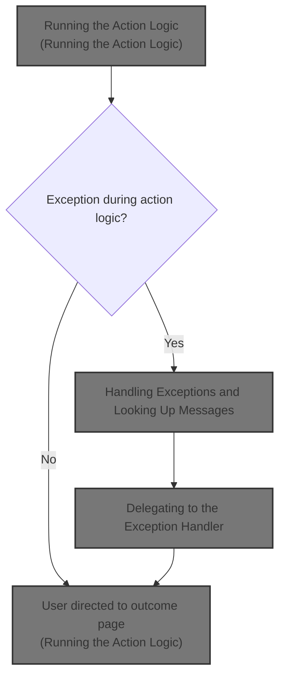
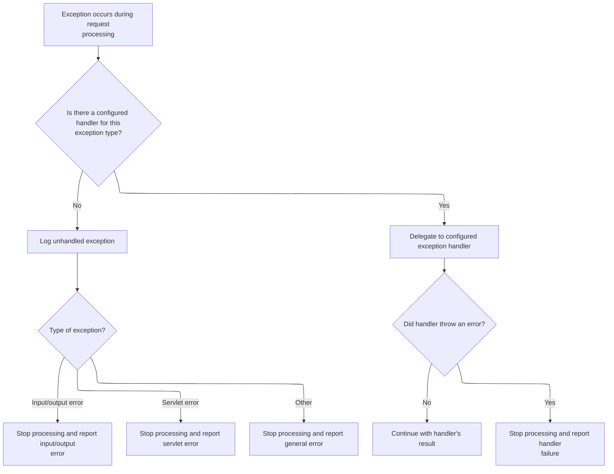
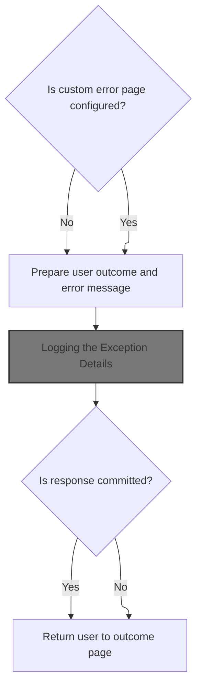
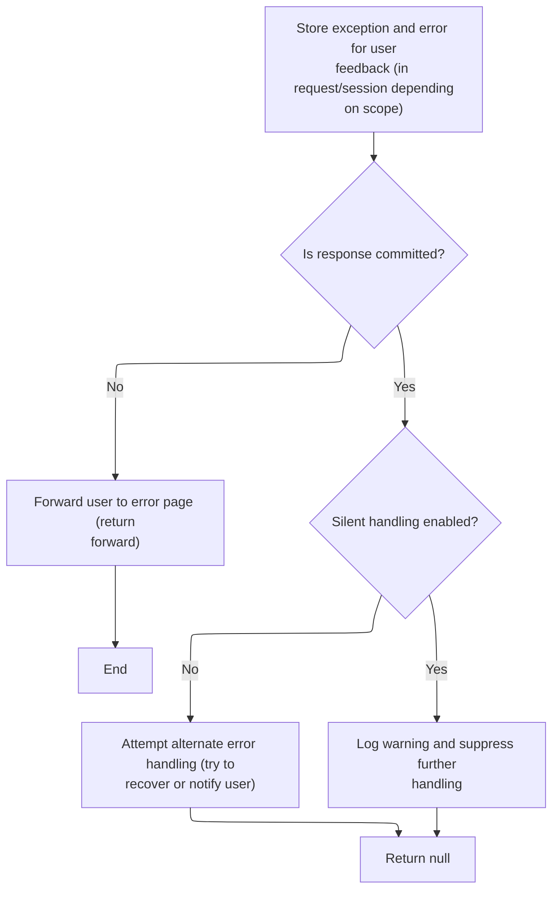

This document describes how a user request is processed by executing business logic and determining the next page or outcome. The flow covers both successful processing and handling of errors, ensuring the user is directed to the appropriate page or receives feedback.



# Where is this flow used?

This flow is used multiple times in the codebase as represented in the following diagram:

```mermaid
graph TD;
      1f3af44bfff9bae4b8af237be5302e37d202c99867273a09e77b9f6144dee63a(core/…/action/RequestProcessor.java::RequestProcessor.process) --> 14082164618534a94af15808b47dfcd643ed0875becf02fd0b0ca89f243f1553(core/…/action/RequestProcessor.java::RequestProcessor.processActionPerform)

294cd284fa406b4fe4f160157c73b79eaa7835613a545efd883ce1f14dd1ca7e(core/…/action/ActionServlet.java::ActionServlet.process) --> 1f3af44bfff9bae4b8af237be5302e37d202c99867273a09e77b9f6144dee63a(core/…/action/RequestProcessor.java::RequestProcessor.process)

dde35d78060f1afca84b5e9dedc002fc37669b07142e9d5a1f656107cc900aa0(core/…/action/ActionServlet.java::ActionServlet.doGet) --> 294cd284fa406b4fe4f160157c73b79eaa7835613a545efd883ce1f14dd1ca7e(core/…/action/ActionServlet.java::ActionServlet.process)

ec52fb7c28a6afaae4fd5937965ca776c6c12441d8a10e0b92b387b05c5c5cf5(core/…/action/ActionServlet.java::ActionServlet.doPost) --> 294cd284fa406b4fe4f160157c73b79eaa7835613a545efd883ce1f14dd1ca7e(core/…/action/ActionServlet.java::ActionServlet.process)

8a621e29539d7ec8103485c1826ea7ac430c2b3deba2e4e21eb89aae3dfd0db1(faces/…/application/ActionListenerImpl.java::ActionListenerImpl.processAction) --> 1f3af44bfff9bae4b8af237be5302e37d202c99867273a09e77b9f6144dee63a(core/…/action/RequestProcessor.java::RequestProcessor.process)

8a621e29539d7ec8103485c1826ea7ac430c2b3deba2e4e21eb89aae3dfd0db1(faces/…/application/ActionListenerImpl.java::ActionListenerImpl.processAction) --> 8a621e29539d7ec8103485c1826ea7ac430c2b3deba2e4e21eb89aae3dfd0db1(faces/…/application/ActionListenerImpl.java::ActionListenerImpl.processAction)

53533e50b64a112c29fb382f66ec6ca94d17eac0a90818829fbfbe36500f9677(faces/…/application/FacesRequestProcessor.java::FacesRequestProcessor.processActionPerform) --> 14082164618534a94af15808b47dfcd643ed0875becf02fd0b0ca89f243f1553(core/…/action/RequestProcessor.java::RequestProcessor.processActionPerform)

ccc9d121010fce67cf275828075852a5f19a397cb8b4323bd60116e9c546d50d(faces/…/application/FacesTilesRequestProcessor.java::FacesTilesRequestProcessor.processActionPerform) --> 14082164618534a94af15808b47dfcd643ed0875becf02fd0b0ca89f243f1553(core/…/action/RequestProcessor.java::RequestProcessor.processActionPerform)


classDef mainFlowStyle color:#000000,fill:#7CB9F4
classDef rootsStyle color:#000000,fill:#00FFF4
classDef Style1 color:#000000,fill:#00FFAA
classDef Style2 color:#000000,fill:#FFFF00
classDef Style3 color:#000000,fill:#AA7CB9

%% Swimm:
%% graph TD;
%%       1f3af44bfff9bae4b8af237be5302e37d202c99867273a09e77b9f6144dee63a(<SwmPath>[core/…/action/RequestProcessor.java](core/src/main/java/org/apache/struts/action/RequestProcessor.java)</SwmPath>::RequestProcessor.process) --> 14082164618534a94af15808b47dfcd643ed0875becf02fd0b0ca89f243f1553(<SwmPath>[core/…/action/RequestProcessor.java](core/src/main/java/org/apache/struts/action/RequestProcessor.java)</SwmPath>::RequestProcessor.processActionPerform)
%% 
%% 294cd284fa406b4fe4f160157c73b79eaa7835613a545efd883ce1f14dd1ca7e(<SwmPath>[core/…/action/ActionServlet.java](core/src/main/java/org/apache/struts/action/ActionServlet.java)</SwmPath>::ActionServlet.process) --> 1f3af44bfff9bae4b8af237be5302e37d202c99867273a09e77b9f6144dee63a(<SwmPath>[core/…/action/RequestProcessor.java](core/src/main/java/org/apache/struts/action/RequestProcessor.java)</SwmPath>::RequestProcessor.process)
%% 
%% dde35d78060f1afca84b5e9dedc002fc37669b07142e9d5a1f656107cc900aa0(<SwmPath>[core/…/action/ActionServlet.java](core/src/main/java/org/apache/struts/action/ActionServlet.java)</SwmPath>::ActionServlet.doGet) --> 294cd284fa406b4fe4f160157c73b79eaa7835613a545efd883ce1f14dd1ca7e(<SwmPath>[core/…/action/ActionServlet.java](core/src/main/java/org/apache/struts/action/ActionServlet.java)</SwmPath>::ActionServlet.process)
%% 
%% ec52fb7c28a6afaae4fd5937965ca776c6c12441d8a10e0b92b387b05c5c5cf5(<SwmPath>[core/…/action/ActionServlet.java](core/src/main/java/org/apache/struts/action/ActionServlet.java)</SwmPath>::ActionServlet.doPost) --> 294cd284fa406b4fe4f160157c73b79eaa7835613a545efd883ce1f14dd1ca7e(<SwmPath>[core/…/action/ActionServlet.java](core/src/main/java/org/apache/struts/action/ActionServlet.java)</SwmPath>::ActionServlet.process)
%% 
%% 8a621e29539d7ec8103485c1826ea7ac430c2b3deba2e4e21eb89aae3dfd0db1(<SwmPath>[faces/…/application/ActionListenerImpl.java](faces/src/main/java/org/apache/struts/faces/application/ActionListenerImpl.java)</SwmPath>::ActionListenerImpl.processAction) --> 1f3af44bfff9bae4b8af237be5302e37d202c99867273a09e77b9f6144dee63a(<SwmPath>[core/…/action/RequestProcessor.java](core/src/main/java/org/apache/struts/action/RequestProcessor.java)</SwmPath>::RequestProcessor.process)
%% 
%% 8a621e29539d7ec8103485c1826ea7ac430c2b3deba2e4e21eb89aae3dfd0db1(<SwmPath>[faces/…/application/ActionListenerImpl.java](faces/src/main/java/org/apache/struts/faces/application/ActionListenerImpl.java)</SwmPath>::ActionListenerImpl.processAction) --> 8a621e29539d7ec8103485c1826ea7ac430c2b3deba2e4e21eb89aae3dfd0db1(<SwmPath>[faces/…/application/ActionListenerImpl.java](faces/src/main/java/org/apache/struts/faces/application/ActionListenerImpl.java)</SwmPath>::ActionListenerImpl.processAction)
%% 
%% 53533e50b64a112c29fb382f66ec6ca94d17eac0a90818829fbfbe36500f9677(<SwmPath>[faces/…/application/FacesRequestProcessor.java](faces/src/main/java/org/apache/struts/faces/application/FacesRequestProcessor.java)</SwmPath>::FacesRequestProcessor.processActionPerform) --> 14082164618534a94af15808b47dfcd643ed0875becf02fd0b0ca89f243f1553(<SwmPath>[core/…/action/RequestProcessor.java](core/src/main/java/org/apache/struts/action/RequestProcessor.java)</SwmPath>::RequestProcessor.processActionPerform)
%% 
%% ccc9d121010fce67cf275828075852a5f19a397cb8b4323bd60116e9c546d50d(<SwmPath>[faces/…/application/FacesTilesRequestProcessor.java](faces/src/main/java/org/apache/struts/faces/application/FacesTilesRequestProcessor.java)</SwmPath>::FacesTilesRequestProcessor.processActionPerform) --> 14082164618534a94af15808b47dfcd643ed0875becf02fd0b0ca89f243f1553(<SwmPath>[core/…/action/RequestProcessor.java](core/src/main/java/org/apache/struts/action/RequestProcessor.java)</SwmPath>::RequestProcessor.processActionPerform)
%% 
%% 
%% classDef mainFlowStyle color:#000000,fill:#7CB9F4
%% classDef rootsStyle color:#000000,fill:#00FFF4
%% classDef Style1 color:#000000,fill:#00FFAA
%% classDef Style2 color:#000000,fill:#FFFF00
%% classDef Style3 color:#000000,fill:#AA7CB9
```



# Running the Action Logic

<SwmSnippet path="/core/src/main/java/org/apache/struts/action/RequestProcessor.java" line="420">

---

In <SwmToken path="core/src/main/java/org/apache/struts/action/RequestProcessor.java" pos="420:5:5" line-data="    protected ActionForward processActionPerform(HttpServletRequest request,">`processActionPerform`</SwmToken>, we're at the point where the framework delegates to the action's execute method. This is where the user-defined logic for handling the request actually runs. The result from execute (an <SwmToken path="core/src/main/java/org/apache/struts/action/RequestProcessor.java" pos="420:3:3" line-data="    protected ActionForward processActionPerform(HttpServletRequest request,">`ActionForward`</SwmToken>) tells Struts what to do next, like which page to show or where to redirect. We call <SwmToken path="core/src/main/java/org/apache/struts/action/RequestProcessor.java" pos="400:9:11" line-data="    // :FIXME: if Action.execute throws Exception, and Action.process has been">`Action.execute`</SwmToken> next because that's where the application-specific processing happens.

```java
    protected ActionForward processActionPerform(HttpServletRequest request,
        HttpServletResponse response, Action action, ActionForm form,
        ActionMapping mapping)
        throws IOException, ServletException {
        try {
            return (action.execute(mapping, form, request, response));
```

---

</SwmSnippet>

<SwmSnippet path="/core/src/main/java/org/apache/struts/action/Action.java" line="202">

---

Execute here is just a stub—it returns null and doesn't do anything with the parameters. Normally, you'd override this in your own Action class to handle the request and return an <SwmToken path="core/src/main/java/org/apache/struts/action/Action.java" pos="202:3:3" line-data="    public ActionForward execute(ActionMapping mapping, ActionForm form,">`ActionForward`</SwmToken>. Returning null is just a placeholder and not how you'd use this in a real app.

```java
    public ActionForward execute(ActionMapping mapping, ActionForm form,
        HttpServletRequest request, HttpServletResponse response)
        throws Exception {
        return null;
    }
```

---

</SwmSnippet>

<SwmSnippet path="/core/src/main/java/org/apache/struts/action/RequestProcessor.java" line="426">

---

We just got back from execute in <SwmPath>[core/…/action/Action.java](core/src/main/java/org/apache/struts/action/Action.java)</SwmPath>. If an exception was thrown during the action logic, <SwmToken path="core/src/main/java/org/apache/struts/action/RequestProcessor.java" pos="420:5:5" line-data="    protected ActionForward processActionPerform(HttpServletRequest request,">`processActionPerform`</SwmToken> catches it here and hands off to <SwmToken path="core/src/main/java/org/apache/struts/action/RequestProcessor.java" pos="427:4:4" line-data="            return (processException(request, response, e, form, mapping));">`processException`</SwmToken>. This centralizes error handling so the framework can decide how to respond to different types of failures.

```java
        } catch (Exception e) {
            return (processException(request, response, e, form, mapping));
        }
    }
```

---

</SwmSnippet>

# Handling Exceptions and Looking Up Messages



<SwmSnippet path="/core/src/main/java/org/apache/struts/action/RequestProcessor.java" line="504">

---

In <SwmToken path="core/src/main/java/org/apache/struts/action/RequestProcessor.java" pos="504:5:5" line-data="    protected ActionForward processException(HttpServletRequest request,">`processException`</SwmToken>, we're checking if there's a configured handler for the exception type. If not, we log a warning using a message from <SwmToken path="core/src/main/java/org/apache/struts/util/PropertyMessageResources.java" pos="82:8:8" line-data=" * Configure &lt;code&gt;PropertyMessageResources&lt;/code&gt; to operate in this mode by">`PropertyMessageResources`</SwmToken>. We call <SwmToken path="core/src/main/java/org/apache/struts/action/RequestProcessor.java" pos="512:9:9" line-data="            log.warn(getInternal().getMessage(&quot;unhandledException&quot;,">`getMessage`</SwmToken> next to fetch the right log message, possibly localized, for the exception class.

```java
    protected ActionForward processException(HttpServletRequest request,
        HttpServletResponse response, Exception exception, ActionForm form,
        ActionMapping mapping)
        throws IOException, ServletException {
        // Is there a defined handler for this exception?
        ExceptionConfig config = mapping.findException(exception.getClass());

        if (config == null) {
            log.warn(getInternal().getMessage("unhandledException",
                    exception.getClass()));

```

---

</SwmSnippet>

<SwmSnippet path="/core/src/main/java/org/apache/struts/util/PropertyMessageResources.java" line="227">

---

GetMessage here looks up a message string for the given locale and key. It tries the requested locale first, then falls back to the default locale or properties file depending on the mode. If nothing is found, it returns null or a placeholder string. The mode variable controls how aggressive the fallback is.

```java
    public String getMessage(Locale locale, String key) {
        if (log.isDebugEnabled()) {
            log.debug("getMessage(" + locale + "," + key + ")");
        }

        // Initialize variables we will require
        String localeKey = localeKey(locale);
        String originalKey = messageKey(localeKey, key);
        String message = null;

        // Search the specified Locale
        message = findMessage(locale, key, originalKey);
        if (message != null) {
            return message;
        }

        // JSTL Compatibility - JSTL doesn't use the default locale
        if (mode == MODE_JSTL) {

           // do nothing (i.e. don't use default Locale)

        // PropertyResourcesBundle - searches through the hierarchy
        // for the default Locale (e.g. first en_US then en)
        } else if (mode == MODE_RESOURCE_BUNDLE) {

            if (!defaultLocale.equals(locale)) {
                message = findMessage(defaultLocale, key, originalKey);
            }

        // Default (backwards) Compatibility - just searches the
        // specified Locale (e.g. just en_US)
        } else {

            if (!defaultLocale.equals(locale)) {
                localeKey = localeKey(defaultLocale);
                message = findMessage(localeKey, key, originalKey);
            }

        }
        if (message != null) {
            return message;
        }

        // Find the message in the default properties file
        message = findMessage("", key, originalKey);
        if (message != null) {
            return message;
        }

        // Return an appropriate error indication
        if (returnNull) {
            return (null);
        } else {
            return ("???" + messageKey(locale, key) + "???");
        }
    }
```

---

</SwmSnippet>

<SwmSnippet path="/core/src/main/java/org/apache/struts/action/RequestProcessor.java" line="515">

---

We just got back from <SwmToken path="core/src/main/java/org/apache/struts/action/RequestProcessor.java" pos="512:9:9" line-data="            log.warn(getInternal().getMessage(&quot;unhandledException&quot;,">`getMessage`</SwmToken> in <SwmToken path="core/src/main/java/org/apache/struts/util/PropertyMessageResources.java" pos="82:8:8" line-data=" * Configure &lt;code&gt;PropertyMessageResources&lt;/code&gt; to operate in this mode by">`PropertyMessageResources`</SwmToken>. Now, <SwmToken path="core/src/main/java/org/apache/struts/action/RequestProcessor.java" pos="427:4:4" line-data="            return (processException(request, response, e, form, mapping));">`processException`</SwmToken> either throws the exception directly if it's an <SwmToken path="core/src/main/java/org/apache/struts/action/RequestProcessor.java" pos="515:8:8" line-data="            if (exception instanceof IOException) {">`IOException`</SwmToken> or <SwmToken path="core/src/main/java/org/apache/struts/action/RequestProcessor.java" pos="517:12:12" line-data="            } else if (exception instanceof ServletException) {">`ServletException`</SwmToken>, or it uses the configured <SwmToken path="core/src/main/java/org/apache/struts/action/RequestProcessor.java" pos="526:1:1" line-data="            ExceptionHandler handler =">`ExceptionHandler`</SwmToken> to handle everything else. This lets the app customize how exceptions are processed and what the user sees.

```java
            if (exception instanceof IOException) {
                throw (IOException) exception;
            } else if (exception instanceof ServletException) {
                throw (ServletException) exception;
            } else {
                throw new ServletException(exception);
            }
        }

        // Use the configured exception handling
        try {
            ExceptionHandler handler =
                (ExceptionHandler) RequestUtils.applicationInstance(config
                    .getHandler());

            return (handler.execute(exception, config, mapping, form, request,
                response));
        } catch (Exception e) {
            throw new ServletException(e);
        }
    }
```

---

</SwmSnippet>

# Delegating to the Exception Handler



<SwmSnippet path="/core/src/main/java/org/apache/struts/action/ExceptionHandler.java" line="124">

---

Execute in <SwmToken path="core/src/main/java/org/apache/struts/action/ExceptionHandler.java" pos="128:6:6" line-data="        LOG.debug(&quot;ExceptionHandler executing for exception &quot; + ex);">`ExceptionHandler`</SwmToken> figures out where to forward after an exception by checking the <SwmToken path="core/src/main/java/org/apache/struts/action/ExceptionHandler.java" pos="124:12:12" line-data="    public ActionForward execute(Exception ex, ExceptionConfig ae,">`ExceptionConfig`</SwmToken>. It also builds an error message and property for the error, then logs the exception. Next, we call <SwmToken path="core/src/main/java/org/apache/struts/action/ExceptionHandler.java" pos="157:3:3" line-data="        this.logException(ex);">`logException`</SwmToken> to actually write the error to the logs.

```java
    public ActionForward execute(Exception ex, ExceptionConfig ae,
        ActionMapping mapping, ActionForm formInstance,
        HttpServletRequest request, HttpServletResponse response)
        throws ServletException {
        LOG.debug("ExceptionHandler executing for exception " + ex);

        ActionForward forward;
        ActionMessage error;
        String property;

        // Build the forward from the exception mapping if it exists
        // or from the form input
        if (ae.getPath() != null) {
            forward = new ActionForward(ae.getPath());
        } else {
            forward = mapping.getInputForward();
        }

        // Figure out the error
        if (ex instanceof ModuleException) {
            error = ((ModuleException) ex).getActionMessage();
            property = ((ModuleException) ex).getProperty();
        } else {
            // STR-2924
            if (ae.getKey() != null) {
                error = new ActionMessage(ae.getKey(), ex.getMessage());
                property = error.getKey();
            } else {
                error = null;
                property = null;
            }
        }

        this.logException(ex);

```

---

</SwmSnippet>

## Logging the Exception Details

<SwmSnippet path="/core/src/main/java/org/apache/struts/action/ExceptionHandler.java" line="274">

---

LogException writes the exception details to the log. It fetches the log message text from <SwmToken path="core/src/main/java/org/apache/struts/action/RequestProcessor.java" pos="31:10:10" line-data="import org.apache.struts.util.MessageResources;">`MessageResources`</SwmToken>, which means the log entry can be localized or customized. We call <SwmToken path="core/src/main/java/org/apache/struts/action/ExceptionHandler.java" pos="275:7:7" line-data="        LOG.debug(messages.getMessage(&quot;exception.LOG&quot;), e);">`getMessage`</SwmToken> next to get the actual log message string.

```java
    protected void logException(Exception e) {
        LOG.debug(messages.getMessage("exception.LOG"), e);
    }
```

---

</SwmSnippet>

## Fetching the Log Message String

<SwmSnippet path="/core/src/main/java/org/apache/struts/util/MessageResources.java" line="196">

---

GetMessage here is just a shortcut. It calls the more detailed version of <SwmToken path="core/src/main/java/org/apache/struts/util/MessageResources.java" pos="196:5:5" line-data="    public String getMessage(String key) {">`getMessage`</SwmToken> with null for locale and arguments. This keeps the API simple for basic lookups. Next, we call the overload that takes locale, key, and a single argument.

```java
    public String getMessage(String key) {
        return this.getMessage((Locale) null, key, null);
    }
```

---

</SwmSnippet>

## Formatting the Log Message

```mermaid
%%{init: {"flowchart": {"defaultRenderer": "elk"}} }%%
flowchart TD
    node1["Receive locale, key, and arguments"] --> node2{"Is locale specified?"}
    click node1 openCode "core/src/main/java/org/apache/struts/util/MessageResources.java:324:326"
    node2 -->|"Yes"| node3["Select specified locale"]
    click node2 openCode "core/src/main/java/org/apache/struts/util/MessageResources.java:288:290"
    node2 -->|"No"| node4["Select default locale"]
    click node4 openCode "core/src/main/java/org/apache/struts/util/MessageResources.java:288:290"
    node3 --> node5["Retrieve or create message format for
key and locale"]
    click node3 openCode "core/src/main/java/org/apache/struts/util/MessageResources.java:292:308"
    node4 --> node5
    node5 --> node6{"Is message template found?"}
    click node5 openCode "core/src/main/java/org/apache/struts/util/MessageResources.java:299:303"
    node6 -->|"Yes"| node7["Format message with arguments"]
    click node6 openCode "core/src/main/java/org/apache/struts/util/MessageResources.java:311:312"
    node6 -->|"No"| node8{"Should return null?"}
    click node8 openCode "core/src/main/java/org/apache/struts/util/MessageResources.java:302:303"
    node8 -->|"Yes"| node9["Return null"]
    click node9 openCode "core/src/main/java/org/apache/struts/util/MessageResources.java:302:303"
    node8 -->|"No"| node10["Return placeholder message (???key???)"]
    click node10 openCode "core/src/main/java/org/apache/struts/util/MessageResources.java:302:303"
    node7 --> node11["Return formatted message"]
    click node11 openCode "core/src/main/java/org/apache/struts/util/MessageResources.java:311:312"
    node9 --> node11
    node10 --> node11
classDef HeadingStyle fill:#777777,stroke:#333,stroke-width:2px;

%% Swimm:
%% %%{init: {"flowchart": {"defaultRenderer": "elk"}} }%%
%% flowchart TD
%%     node1["Receive locale, key, and arguments"] --> node2{"Is locale specified?"}
%%     click node1 openCode "<SwmPath>[core/…/util/MessageResources.java](core/src/main/java/org/apache/struts/util/MessageResources.java)</SwmPath>:324:326"
%%     node2 -->|"Yes"| node3["Select specified locale"]
%%     click node2 openCode "<SwmPath>[core/…/util/MessageResources.java](core/src/main/java/org/apache/struts/util/MessageResources.java)</SwmPath>:288:290"
%%     node2 -->|"No"| node4["Select default locale"]
%%     click node4 openCode "<SwmPath>[core/…/util/MessageResources.java](core/src/main/java/org/apache/struts/util/MessageResources.java)</SwmPath>:288:290"
%%     node3 --> node5["Retrieve or create message format for
%% key and locale"]
%%     click node3 openCode "<SwmPath>[core/…/util/MessageResources.java](core/src/main/java/org/apache/struts/util/MessageResources.java)</SwmPath>:292:308"
%%     node4 --> node5
%%     node5 --> node6{"Is message template found?"}
%%     click node5 openCode "<SwmPath>[core/…/util/MessageResources.java](core/src/main/java/org/apache/struts/util/MessageResources.java)</SwmPath>:299:303"
%%     node6 -->|"Yes"| node7["Format message with arguments"]
%%     click node6 openCode "<SwmPath>[core/…/util/MessageResources.java](core/src/main/java/org/apache/struts/util/MessageResources.java)</SwmPath>:311:312"
%%     node6 -->|"No"| node8{"Should return null?"}
%%     click node8 openCode "<SwmPath>[core/…/util/MessageResources.java](core/src/main/java/org/apache/struts/util/MessageResources.java)</SwmPath>:302:303"
%%     node8 -->|"Yes"| node9["Return null"]
%%     click node9 openCode "<SwmPath>[core/…/util/MessageResources.java](core/src/main/java/org/apache/struts/util/MessageResources.java)</SwmPath>:302:303"
%%     node8 -->|"No"| node10["Return placeholder message (???key???)"]
%%     click node10 openCode "<SwmPath>[core/…/util/MessageResources.java](core/src/main/java/org/apache/struts/util/MessageResources.java)</SwmPath>:302:303"
%%     node7 --> node11["Return formatted message"]
%%     click node11 openCode "<SwmPath>[core/…/util/MessageResources.java](core/src/main/java/org/apache/struts/util/MessageResources.java)</SwmPath>:311:312"
%%     node9 --> node11
%%     node10 --> node11
%% classDef HeadingStyle fill:#777777,stroke:#333,stroke-width:2px;
```



<SwmSnippet path="/core/src/main/java/org/apache/struts/util/MessageResources.java" line="324">

---

GetMessage here takes a locale, key, and one argument, wraps the argument in an array, and calls the main <SwmToken path="core/src/main/java/org/apache/struts/util/MessageResources.java" pos="324:5:5" line-data="    public String getMessage(Locale locale, String key, Object arg0) {">`getMessage`</SwmToken> method. This way, the main logic always deals with an array of arguments. Next, we call the version that handles arrays.

```java
    public String getMessage(Locale locale, String key, Object arg0) {
        return this.getMessage(locale, key, new Object[] { arg0 });
    }
```

---

</SwmSnippet>

<SwmSnippet path="/core/src/main/java/org/apache/struts/util/MessageResources.java" line="286">

---

GetMessage here does the heavy lifting. It caches <SwmToken path="core/src/main/java/org/apache/struts/util/MessageResources.java" pos="287:5:5" line-data="        // Cache MessageFormat instances as they are accessed">`MessageFormat`</SwmToken> objects per locale and key for performance, handles null locales by using a default, and returns either the formatted message, null, or a placeholder if the message is missing. The escape method is used before creating the <SwmToken path="core/src/main/java/org/apache/struts/util/MessageResources.java" pos="287:5:5" line-data="        // Cache MessageFormat instances as they are accessed">`MessageFormat`</SwmToken>, probably to handle special characters.

```java
    public String getMessage(Locale locale, String key, Object[] args) {
        // Cache MessageFormat instances as they are accessed
        if (locale == null) {
            locale = defaultLocale;
        }

        MessageFormat format = null;
        String formatKey = messageKey(locale, key);

        synchronized (formats) {
            format = (MessageFormat) formats.get(formatKey);

            if (format == null) {
                String formatString = getMessage(locale, key);

                if (formatString == null) {
                    return returnNull ? null : ("???" + formatKey + "???");
                }

                format = new MessageFormat(escape(formatString));
                format.setLocale(locale);
                formats.put(formatKey, format);
            }
        }

        return format.format(args);
    }
```

---

</SwmSnippet>

## Storing Exception Details and Forwarding



<SwmSnippet path="/core/src/main/java/org/apache/struts/action/ExceptionHandler.java" line="159">

---

After logging, ExceptionHandler.execute stores the exception and error messages in the request or session, then checks if the response is still open. If it is, it returns the forward; otherwise, it needs to handle the committed response differently. Next, we call <SwmToken path="core/src/main/java/org/apache/struts/action/ExceptionHandler.java" pos="161:3:3" line-data="        this.storeException(request, property, error, forward, ae.getScope());">`storeException`</SwmToken> to actually stash the error details.

```java
        // Store the exception
        request.setAttribute(Globals.EXCEPTION_KEY, ex);
        this.storeException(request, property, error, forward, ae.getScope());

        if (!response.isCommitted()) {
            return forward;
        }

```

---

</SwmSnippet>

<SwmSnippet path="/core/src/main/java/org/apache/struts/action/ExceptionHandler.java" line="296">

---

StoreException puts the error messages into either the request or session, depending on the scope. It wraps the error in an <SwmToken path="core/src/main/java/org/apache/struts/action/ExceptionHandler.java" pos="300:1:1" line-data="            ActionMessages errors = new ActionMessages();">`ActionMessages`</SwmToken> container and uses <SwmToken path="core/src/main/java/org/apache/struts/action/ExceptionHandler.java" pos="304:5:7" line-data="                request.setAttribute(Globals.ERROR_KEY, errors);">`Globals.ERROR_KEY`</SwmToken> as the attribute name. This is how Struts makes errors available to the next page or view.

```java
    protected void storeException(HttpServletRequest request, String property,
        ActionMessage error, ActionForward forward, String scope) {
        
        if (error != null) {
            ActionMessages errors = new ActionMessages();
            errors.add(property, error);
    
            if ("request".equals(scope)) {
                request.setAttribute(Globals.ERROR_KEY, errors);
            } else {
                request.getSession().setAttribute(Globals.ERROR_KEY, errors);
            }
        }
    }
```

---

</SwmSnippet>

<SwmSnippet path="/core/src/main/java/org/apache/struts/action/ExceptionHandler.java" line="167">

---

After <SwmToken path="core/src/main/java/org/apache/struts/action/ExceptionHandler.java" pos="161:3:3" line-data="        this.storeException(request, property, error, forward, ae.getScope());">`storeException`</SwmToken>, if the response is already committed, ExceptionHandler.execute can't forward. It either tries an alternate handling method or just logs a warning, depending on the silent flag in the config. This is the last chance to deal with the error before returning control.

```java
        LOG.debug("Response is already committed, so forwarding will not work."
            + " Attempt alternate handling.");

        if (!silent(ae)) {
            handleCommittedResponse(ex, ae, mapping, formInstance, request,
                response, forward);
        } else {
            LOG.warn("ExceptionHandler configured with " + SILENT_IF_COMMITTED
                + " and response is committed.", ex);
        }

        return null;
    }
```

---

</SwmSnippet>

&nbsp;

*This is an auto-generated document by Swimm 🌊 and has not yet been verified by a human*

<SwmMeta version="3.0.0" repo-id="Z2l0aHViJTNBJTNBc3RydXRzMSUzQSUzQVN3aW1tLURlbW8=" repo-name="struts1"><sup>Powered by [Swimm](https://app.swimm.io/)</sup></SwmMeta>
