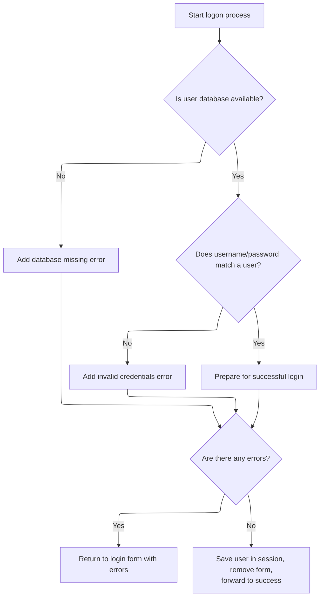

This document describes the flow for processing a user login attempt. When a user submits their credentials, the system checks for database availability, verifies the username and password, and manages the session state. Successful logins result in the user being saved in the session and redirected to a success page, while errors return the user to the login form with feedback.

# Processing logon and handling user/session state



<SwmSnippet path="/apps/faces-example2/src/main/java/org/apache/struts/webapp/example2/LogonAction.java" line="78">

---

In `LogonAction.execute`, we're grabbing the username and password from the form, checking if the database is available, and then calling <SwmToken path="apps/faces-example2/src/main/java/org/apache/struts/webapp/example2/LogonAction.java" pos="99:5:5" line-data="        user = getUser(database, username);">`getUser`</SwmToken> to handle user lookup and any special-case usernames. This sets up error handling for missing database or invalid credentials before moving forward.

```java
    public ActionForward execute(ActionMapping mapping,
                 ActionForm form,
                 HttpServletRequest request,
                 HttpServletResponse response)
    throws Exception {

    // Extract attributes we will need
    User user = null;

    // Validate the request parameters specified by the user
    ActionErrors errors = new ActionErrors();
    String username = (String)
            PropertyUtils.getSimpleProperty(form, "username");
        String password = (String)
            PropertyUtils.getSimpleProperty(form, "password");
    UserDatabase database = (UserDatabase)
      servlet.getServletContext().getAttribute(Constants.DATABASE_KEY);
    if (database == null)
            errors.add(ActionErrors.GLOBAL_MESSAGE,
                       new ActionMessage("error.database.missing"));
    else {
        user = getUser(database, username);
        if ((user != null) && !user.getPassword().equals(password))
        user = null;
        if (user == null)
                errors.add(ActionErrors.GLOBAL_MESSAGE,
                           new ActionMessage("error.password.mismatch"));
    }

```

---

</SwmSnippet>

<SwmSnippet path="/apps/faces-example2/src/main/java/org/apache/struts/webapp/example2/LogonAction.java" line="147">

---

<SwmToken path="apps/faces-example2/src/main/java/org/apache/struts/webapp/example2/LogonAction.java" pos="147:5:5" line-data="    public User getUser(UserDatabase database, String username)">`getUser`</SwmToken> checks for 'arithmetic' and 'expired' usernames and throws exceptions for those cases, otherwise it just looks up the user in the database. This lets the flow handle custom error scenarios beyond normal user retrieval.

```java
    public User getUser(UserDatabase database, String username)
        throws ModuleException {

        // Force an ArithmeticException which can be handled explicitly
        if ("arithmetic".equals(username)) {
            throw new ArithmeticException();
        }

        // Force an application-specific exception which can be handled
        if ("expired".equals(username)) {
            throw new ExpiredPasswordException(username);
        }

        // Look up and return the specified user
        return (database.findUser(username));

    }
```

---

</SwmSnippet>

<SwmSnippet path="/apps/faces-example2/src/main/java/org/apache/struts/webapp/example2/LogonAction.java" line="107">

---

Back in LogonAction.execute, after <SwmToken path="apps/faces-example2/src/main/java/org/apache/struts/webapp/example2/LogonAction.java" pos="99:5:5" line-data="        user = getUser(database, username);">`getUser`</SwmToken> returns, we check for errors and if any exist, we save them and use <SwmToken path="apps/faces-example2/src/main/java/org/apache/struts/webapp/example2/LogonAction.java" pos="110:4:8" line-data="            return (mapping.getInputForward());">`mapping.getInputForward()`</SwmToken> to send the user back to the input form based on framework config. This keeps error handling flexible.

```java
    // Report any errors we have discovered back to the original form
    if (!errors.isEmpty()) {
        saveErrors(request, errors);
            return (mapping.getInputForward());
    }

```

---

</SwmSnippet>

<SwmSnippet path="/core/src/main/java/org/apache/struts/action/ActionMapping.java" line="139">

---

<SwmToken path="core/src/main/java/org/apache/struts/action/ActionMapping.java" pos="139:5:5" line-data="    public ActionForward getInputForward() {">`getInputForward`</SwmToken> checks config flags to decide if it should look up a named forward or create a new one using the input string. This lets the framework control where the user is sent after an error, based on setup.

```java
    public ActionForward getInputForward() {
        String input = getInput();
        if (getModuleConfig().getControllerConfig().getInputForward()) {
            if (input != null) {
                return findForward(input);
            }
            return findForward(Action.INPUT);
        }
        return (new ActionForward(input));
    }
```

---

</SwmSnippet>

<SwmSnippet path="/apps/faces-example2/src/main/java/org/apache/struts/webapp/example2/LogonAction.java" line="113">

---

After returning from <SwmToken path="apps/faces-example2/src/main/java/org/apache/struts/webapp/example2/LogonAction.java" pos="78:7:7" line-data="    public ActionForward execute(ActionMapping mapping,">`ActionMapping`</SwmToken>, LogonAction.execute saves the user in session, logs debug info, and removes the obsolete form bean using <SwmToken path="apps/faces-example2/src/main/java/org/apache/struts/webapp/example2/LogonAction.java" pos="122:4:8" line-data="    if (mapping.getAttribute() != null) {">`mapping.getAttribute()`</SwmToken> to figure out which attribute to clean up. This keeps session/request tidy before forwarding to success.

```java
    // Save our logged-in user in the session
    HttpSession session = request.getSession();
    session.setAttribute(Constants.USER_KEY, user);
        if (log.isDebugEnabled()) {
            log.debug("LogonAction: User '" + user.getUsername() +
                      "' logged on in session " + session.getId());
        }

        // Remove the obsolete form bean
    if (mapping.getAttribute() != null) {
            if ("request".equals(mapping.getScope()))
                request.removeAttribute(mapping.getAttribute());
            else
                session.removeAttribute(mapping.getAttribute());
        }

    // Forward control to the specified success URI
    return (mapping.findForward("success"));

    }
```

---

</SwmSnippet>

<SwmSnippet path="/core/src/main/java/org/apache/struts/config/ActionConfig.java" line="321">

---

<SwmToken path="core/src/main/java/org/apache/struts/config/ActionConfig.java" pos="321:5:5" line-data="    public String getAttribute() {">`getAttribute`</SwmToken> checks if attribute is null and falls back to returning name, so there's always something to use for session/request cleanup. This avoids errors when attribute isn't set.

```java
    public String getAttribute() {
        if (this.attribute == null) {
            return (this.name);
        } else {
            return (this.attribute);
        }
    }
```

---

</SwmSnippet>

&nbsp;

*This is an auto-generated document by Swimm 🌊 and has not yet been verified by a human*

<SwmMeta version="3.0.0" repo-id="Z2l0aHViJTNBJTNBc3RydXRzMSUzQSUzQVN3aW1tLURlbW8=" repo-name="struts1"><sup>Powered by [Swimm](https://app.swimm.io/)</sup></SwmMeta>
