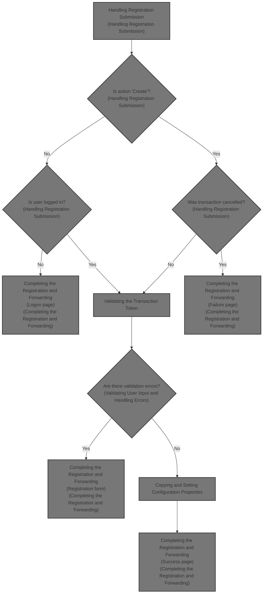
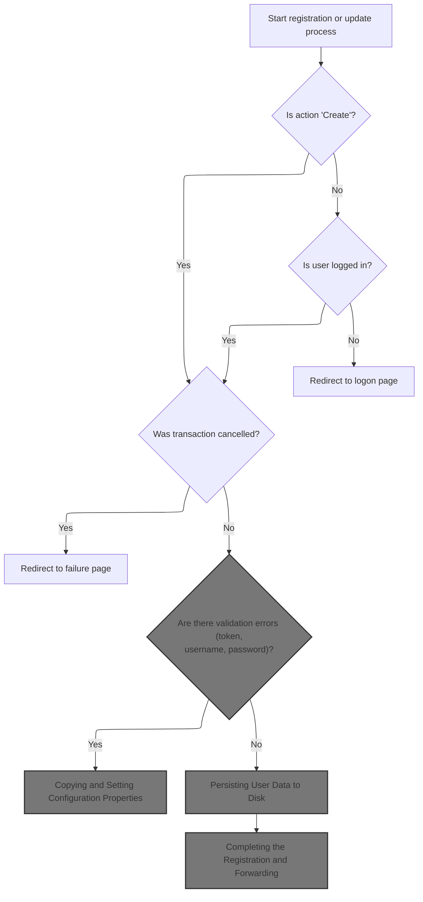
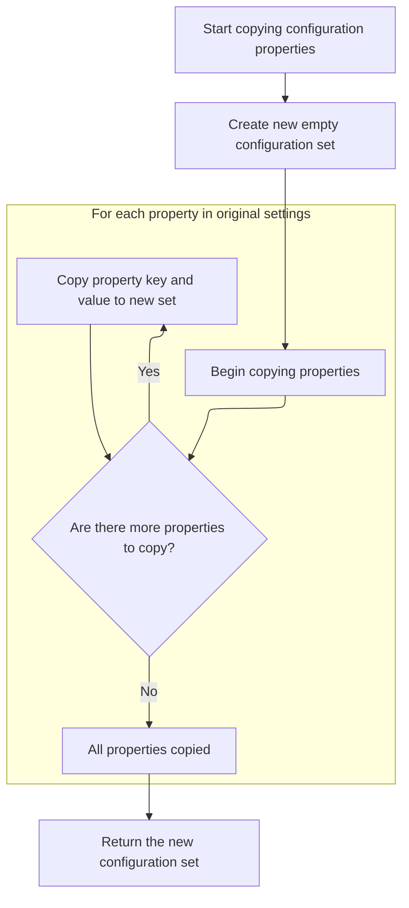
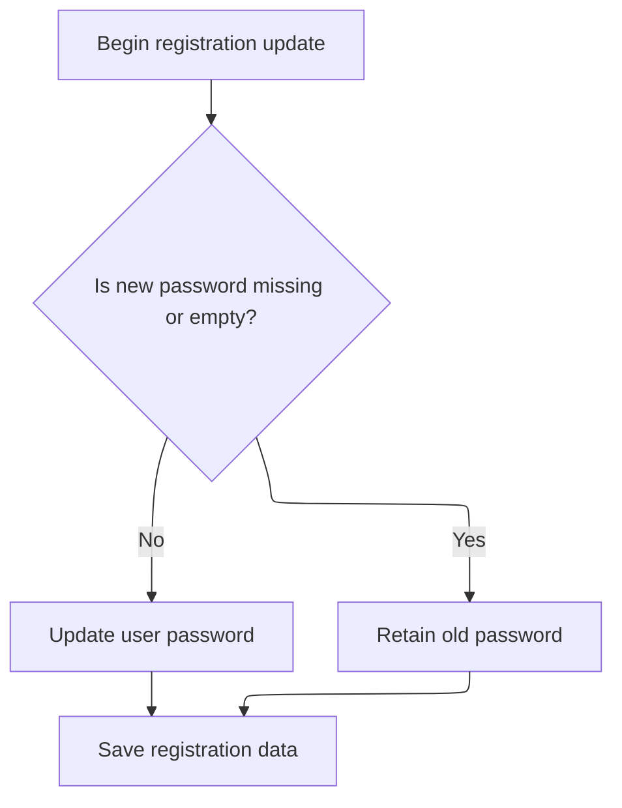
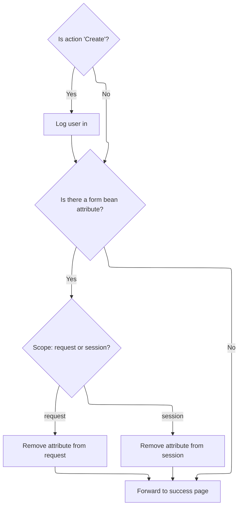

This document describes how the application processes user registration and profile updates. When a user submits a registration form, the flow validates the submission, checks user input, updates or creates the user profile, saves the information, and navigates the user to the appropriate page. The flow receives registration form data and outputs an updated user profile and navigation to a success, logon, or failure page.



# Handling Registration Submission



<SwmSnippet path="/apps/faces-example2/src/main/java/org/apache/struts/webapp/example2/SaveRegistrationAction.java" line="82">

---

In `SaveRegistrationAction.execute`, we extract the session, form, and action, check if the user is logged in (unless creating), handle cancellation, and validate the transaction token. Next, we call `Action.isTokenValid` to verify the request's authenticity before processing further. This check is needed to prevent duplicate submissions and ensure the request is legitimate.

```java
    public ActionForward execute(ActionMapping mapping,
                 ActionForm form,
                 HttpServletRequest request,
                 HttpServletResponse response)
    throws Exception {

    // Extract attributes and parameters we will need
    HttpSession session = request.getSession();
    RegistrationForm regform = (RegistrationForm) form;
    String action = regform.getAction();
    if (action == null) {
        action = "Create";
        }
        UserDatabase database = (UserDatabase)
      servlet.getServletContext().getAttribute(Constants.DATABASE_KEY);
        if (log.isDebugEnabled()) {
            log.debug("SaveRegistrationAction:  Processing " + action +
                      " action");
        }

    // Is there a currently logged on user (unless creating)?
    User user = (User) session.getAttribute(Constants.USER_KEY);
    if (!"Create".equals(action) && (user == null)) {
            if (log.isTraceEnabled()) {
                log.trace(" User is not logged on in session "
                          + session.getId());
            }
        return (mapping.findForward("logon"));
        }

    // Was this transaction cancelled?
    if (isCancelled(request)) {
            if (log.isTraceEnabled()) {
                log.trace(" Transaction '" + action +
                          "' was cancelled");
            }
        session.removeAttribute(Constants.SUBSCRIPTION_KEY);
        return (mapping.findForward("failure"));
    }

        // Validate the transactional control token
    ActionErrors errors = new ActionErrors();
        if (log.isTraceEnabled()) {
            log.trace(" Checking transactional control token");
        }
        if (!isTokenValid(request)) {
            errors.add(ActionErrors.GLOBAL_MESSAGE,
                       new ActionMessage("error.transaction.token"));
        }
```

---

</SwmSnippet>

## Validating the Transaction Token

<SwmSnippet path="/core/src/main/java/org/apache/struts/action/Action.java" line="429">

---

<SwmToken path="core/src/main/java/org/apache/struts/action/Action.java" pos="429:5:5" line-data="    protected boolean isTokenValid(HttpServletRequest request) {">`isTokenValid`</SwmToken> in Action just delegates the token validation to <SwmToken path="core/src/main/java/org/apache/struts/action/Action.java" pos="28:10:10" line-data="import org.apache.struts.util.TokenProcessor;">`TokenProcessor`</SwmToken>. We call <SwmToken path="core/src/main/java/org/apache/struts/action/Action.java" pos="28:10:10" line-data="import org.apache.struts.util.TokenProcessor;">`TokenProcessor`</SwmToken> next because that's where the actual logic for checking the token against the session is implemented.

```java
    protected boolean isTokenValid(HttpServletRequest request) {
        return token.isTokenValid(request, false);
    }
```

---

</SwmSnippet>

## Checking Session and Request Tokens

```mermaid
%%{init: {"flowchart": {"defaultRenderer": "elk"}} }%%
flowchart TD
  node1["Start token validation"] --> node2{"Is there a session?"}
  click node1 openCode "core/src/main/java/org/apache/struts/util/TokenProcessor.java:111:114"
  node2 -->|"No"| node6["Return invalid (no session or token)"]
  click node2 openCode "core/src/main/java/org/apache/struts/util/TokenProcessor.java:116:118"
  node2 -->|"Yes"| node3{"Is there a saved token in session?"}
  click node3 openCode "core/src/main/java/org/apache/struts/util/TokenProcessor.java:125:127"
  node3 -->|"No"| node6
  node3 -->|"Yes"| node4{"Should reset token?"}
  click node4 openCode "core/src/main/java/org/apache/struts/util/TokenProcessor.java:129:131"
  node4 -->|"Yes"| node5["Reset token (side effect)"]
  click node5 openCode "core/src/main/java/org/apache/struts/util/TokenProcessor.java:130:131"
  node5 --> node7{"Is there a token in request?"}
  node4 -->|"No"| node7{"Is there a token in request?"}
  click node7 openCode "core/src/main/java/org/apache/struts/util/TokenProcessor.java:136:138"
  node7 -->|"No"| node6
  node7 -->|"Yes"| node8{"Does provided token match saved token?"}
  click node8 openCode "core/src/main/java/org/apache/struts/util/TokenProcessor.java:140:140"
  node8 -->|"Yes"| node9["Return valid (token accepted)"]
  click node9 openCode "core/src/main/java/org/apache/struts/util/TokenProcessor.java:140:141"
  node8 -->|"No"| node6
  click node6 openCode "core/src/main/java/org/apache/struts/util/TokenProcessor.java:117:138"
classDef HeadingStyle fill:#777777,stroke:#333,stroke-width:2px;

%% Swimm:
%% %%{init: {"flowchart": {"defaultRenderer": "elk"}} }%%
%% flowchart TD
%%   node1["Start token validation"] --> node2{"Is there a session?"}
%%   click node1 openCode "<SwmPath>[core/…/util/TokenProcessor.java](core/src/main/java/org/apache/struts/util/TokenProcessor.java)</SwmPath>:111:114"
%%   node2 -->|"No"| node6["Return invalid (no session or token)"]
%%   click node2 openCode "<SwmPath>[core/…/util/TokenProcessor.java](core/src/main/java/org/apache/struts/util/TokenProcessor.java)</SwmPath>:116:118"
%%   node2 -->|"Yes"| node3{"Is there a saved token in session?"}
%%   click node3 openCode "<SwmPath>[core/…/util/TokenProcessor.java](core/src/main/java/org/apache/struts/util/TokenProcessor.java)</SwmPath>:125:127"
%%   node3 -->|"No"| node6
%%   node3 -->|"Yes"| node4{"Should reset token?"}
%%   click node4 openCode "<SwmPath>[core/…/util/TokenProcessor.java](core/src/main/java/org/apache/struts/util/TokenProcessor.java)</SwmPath>:129:131"
%%   node4 -->|"Yes"| node5["Reset token (side effect)"]
%%   click node5 openCode "<SwmPath>[core/…/util/TokenProcessor.java](core/src/main/java/org/apache/struts/util/TokenProcessor.java)</SwmPath>:130:131"
%%   node5 --> node7{"Is there a token in request?"}
%%   node4 -->|"No"| node7{"Is there a token in request?"}
%%   click node7 openCode "<SwmPath>[core/…/util/TokenProcessor.java](core/src/main/java/org/apache/struts/util/TokenProcessor.java)</SwmPath>:136:138"
%%   node7 -->|"No"| node6
%%   node7 -->|"Yes"| node8{"Does provided token match saved token?"}
%%   click node8 openCode "<SwmPath>[core/…/util/TokenProcessor.java](core/src/main/java/org/apache/struts/util/TokenProcessor.java)</SwmPath>:140:140"
%%   node8 -->|"Yes"| node9["Return valid (token accepted)"]
%%   click node9 openCode "<SwmPath>[core/…/util/TokenProcessor.java](core/src/main/java/org/apache/struts/util/TokenProcessor.java)</SwmPath>:140:141"
%%   node8 -->|"No"| node6
%%   click node6 openCode "<SwmPath>[core/…/util/TokenProcessor.java](core/src/main/java/org/apache/struts/util/TokenProcessor.java)</SwmPath>:117:138"
%% classDef HeadingStyle fill:#777777,stroke:#333,stroke-width:2px;
```



<SwmSnippet path="/core/src/main/java/org/apache/struts/util/TokenProcessor.java" line="111">

---

<SwmToken path="core/src/main/java/org/apache/struts/util/TokenProcessor.java" pos="111:7:7" line-data="    public synchronized boolean isTokenValid(HttpServletRequest request,">`isTokenValid`</SwmToken> in <SwmToken path="core/src/main/java/org/apache/struts/action/Action.java" pos="28:10:10" line-data="import org.apache.struts.util.TokenProcessor;">`TokenProcessor`</SwmToken> checks the session for a saved token and compares it to the token in the request. We call <SwmToken path="core/src/main/java/org/apache/struts/upload/MultipartRequestWrapper.java" pos="38:4:4" line-data="public class MultipartRequestWrapper extends HttpServletRequestWrapper {">`MultipartRequestWrapper`</SwmToken> next because <SwmToken path="core/src/main/java/org/apache/struts/util/TokenProcessor.java" pos="134:7:9" line-data="        String token = request.getParameter(Globals.TOKEN_KEY);">`request.getParameter`</SwmToken> might need to handle multipart form data, which isn't handled by the standard request object.

```java
    public synchronized boolean isTokenValid(HttpServletRequest request,
        boolean reset) {
        // Retrieve the current session for this request
        HttpSession session = request.getSession(false);

        if (session == null) {
            return false;
        }

        // Retrieve the transaction token from this session, and
        // reset it if requested
        String saved =
            (String) session.getAttribute(Globals.TRANSACTION_TOKEN_KEY);

        if (saved == null) {
            return false;
        }

        if (reset) {
            this.resetToken(request);
        }

        // Retrieve the transaction token included in this request
        String token = request.getParameter(Globals.TOKEN_KEY);

        if (token == null) {
            return false;
        }

        return saved.equals(token);
    }
```

---

</SwmSnippet>

## Extracting Parameters from Multipart Requests

<SwmSnippet path="/core/src/main/java/org/apache/struts/upload/MultipartRequestWrapper.java" line="75">

---

In <SwmToken path="core/src/main/java/org/apache/struts/upload/MultipartRequestWrapper.java" pos="75:5:5" line-data="    public String getParameter(String name) {">`getParameter`</SwmToken>, we first try to get the parameter from the wrapped request. If that's not available (common with multipart forms), we fall back to our internal parameters map. Next, we call <SwmToken path="core/src/main/java/org/apache/struts/chain/contexts/ServletActionContext.java" pos="39:4:4" line-data="public class ServletActionContext extends WebActionContext {">`ServletActionContext`</SwmToken> to access the underlying request object.

```java
    public String getParameter(String name) {
        String value = getRequest().getParameter(name);

```

---

</SwmSnippet>

### Accessing the Underlying Servlet Request

<SwmSnippet path="/core/src/main/java/org/apache/struts/chain/contexts/ServletActionContext.java" line="94">

---

<SwmToken path="core/src/main/java/org/apache/struts/chain/contexts/ServletActionContext.java" pos="94:5:5" line-data="    public HttpServletRequest getRequest() {">`getRequest`</SwmToken> in <SwmToken path="core/src/main/java/org/apache/struts/chain/contexts/ServletActionContext.java" pos="39:4:4" line-data="public class ServletActionContext extends WebActionContext {">`ServletActionContext`</SwmToken> returns the request from the underlying <SwmToken path="core/src/main/java/org/apache/struts/chain/contexts/ServletActionContext.java" pos="67:3:3" line-data="    protected ServletWebContext servletWebContext() {">`ServletWebContext`</SwmToken>. We call <SwmToken path="core/src/main/java/org/apache/struts/chain/contexts/ServletActionContext.java" pos="95:3:5" line-data="        return servletWebContext().getRequest();">`servletWebContext()`</SwmToken> next to get the properly typed context, since <SwmToken path="core/src/main/java/org/apache/struts/chain/contexts/ServletActionContext.java" pos="68:9:11" line-data="        return (ServletWebContext) this.getBaseContext();">`getBaseContext()`</SwmToken> is generic and we need servlet-specific access.

```java
    public HttpServletRequest getRequest() {
        return servletWebContext().getRequest();
    }
```

---

</SwmSnippet>

<SwmSnippet path="/core/src/main/java/org/apache/struts/chain/contexts/ServletActionContext.java" line="67">

---

<SwmToken path="core/src/main/java/org/apache/struts/chain/contexts/ServletActionContext.java" pos="67:5:5" line-data="    protected ServletWebContext servletWebContext() {">`servletWebContext`</SwmToken> casts the base context to <SwmToken path="core/src/main/java/org/apache/struts/chain/contexts/ServletActionContext.java" pos="67:3:3" line-data="    protected ServletWebContext servletWebContext() {">`ServletWebContext`</SwmToken>, letting us access servlet-specific methods. This is a standard pattern for narrowing context types in frameworks.

```java
    protected ServletWebContext servletWebContext() {
        return (ServletWebContext) this.getBaseContext();
    }
```

---

</SwmSnippet>

### Fallback Parameter Retrieval in Multipart Requests

<SwmSnippet path="/core/src/main/java/org/apache/struts/upload/MultipartRequestWrapper.java" line="78">

---

Back in `MultipartRequestWrapper.getParameter`, after returning from <SwmToken path="core/src/main/java/org/apache/struts/chain/contexts/ServletActionContext.java" pos="39:4:4" line-data="public class ServletActionContext extends WebActionContext {">`ServletActionContext`</SwmToken>, if <SwmToken path="core/src/main/java/org/apache/struts/upload/MultipartRequestWrapper.java" pos="76:7:9" line-data="        String value = getRequest().getParameter(name);">`getRequest()`</SwmToken><SwmToken path="core/src/main/java/org/apache/struts/util/TokenProcessor.java" pos="134:8:9" line-data="        String token = request.getParameter(Globals.TOKEN_KEY);">`.getParameter`</SwmToken>(name) is still null, we look up the parameter in our internal map. If found, we return the first value from the array. This fallback is needed for multipart forms where standard parameter retrieval doesn't work.

```java
        if (value == null) {
            String[] mValue = (String[]) parameters.get(name);

            if ((mValue != null) && (mValue.length > 0)) {
                value = mValue[0];
            }
        }

        return value;
    }
```

---

</SwmSnippet>

## Validating User Input and Handling Errors

```mermaid
%%{init: {"flowchart": {"defaultRenderer": "elk"}} }%%
flowchart TD
    node1{"Is action 'Create'?"}
    click node1 openCode "apps/faces-example2/src/main/java/org/apache/struts/webapp/example2/SaveRegistrationAction.java:145:146"
    node1 -->|"Yes"| node2{"Does username already exist?"}
    click node2 openCode "apps/faces-example2/src/main/java/org/apache/struts/webapp/example2/SaveRegistrationAction.java:139:140"
    node2 -->|"Yes"| node3["Add username uniqueness error"]
    click node3 openCode "apps/faces-example2/src/main/java/org/apache/struts/webapp/example2/SaveRegistrationAction.java:141:143"
    node2 -->|"No"| node4{"Is password provided?"}
    click node4 openCode "apps/faces-example2/src/main/java/org/apache/struts/webapp/example2/SaveRegistrationAction.java:146:147"
    node4 -->|"No"| node5["Add password required error"]
    click node5 openCode "apps/faces-example2/src/main/java/org/apache/struts/webapp/example2/SaveRegistrationAction.java:148:149"
    node4 -->|"Yes"| node6{"Is password2 provided?"}
    click node6 openCode "apps/faces-example2/src/main/java/org/apache/struts/webapp/example2/SaveRegistrationAction.java:151:152"
    node6 -->|"No"| node7["Add password2 required error"]
    click node7 openCode "apps/faces-example2/src/main/java/org/apache/struts/webapp/example2/SaveRegistrationAction.java:153:154"
    node6 -->|"Yes"| node8["Validation complete"]
    click node8 openCode "apps/faces-example2/src/main/java/org/apache/struts/webapp/example2/SaveRegistrationAction.java:156:157"
    node3 --> node9{"Are there any errors?"}
    node5 --> node9
    node7 --> node9
    node8 --> node9
    click node9 openCode "apps/faces-example2/src/main/java/org/apache/struts/webapp/example2/SaveRegistrationAction.java:159:160"
    node1 -->|"No"| node8
    node9 -->|"Yes"| node10["Report errors and return to registration
form"]
    click node10 openCode "apps/faces-example2/src/main/java/org/apache/struts/webapp/example2/SaveRegistrationAction.java:160:162"
    node9 -->|"No"| node11["Create user profile"]
    click node11 openCode "apps/faces-example2/src/main/java/org/apache/struts/webapp/example2/SaveRegistrationAction.java:168:169"
    node11 --> node12["Copy registration properties to user"]
    click node12 openCode "apps/faces-example2/src/main/java/org/apache/struts/webapp/example2/SaveRegistrationAction.java:171:171"

classDef HeadingStyle fill:#777777,stroke:#333,stroke-width:2px;

%% Swimm:
%% %%{init: {"flowchart": {"defaultRenderer": "elk"}} }%%
%% flowchart TD
%%     node1{"Is action 'Create'?"}
%%     click node1 openCode "<SwmPath>[apps/…/example2/SaveRegistrationAction.java](apps/faces-example2/src/main/java/org/apache/struts/webapp/example2/SaveRegistrationAction.java)</SwmPath>:145:146"
%%     node1 -->|"Yes"| node2{"Does username already exist?"}
%%     click node2 openCode "<SwmPath>[apps/…/example2/SaveRegistrationAction.java](apps/faces-example2/src/main/java/org/apache/struts/webapp/example2/SaveRegistrationAction.java)</SwmPath>:139:140"
%%     node2 -->|"Yes"| node3["Add username uniqueness error"]
%%     click node3 openCode "<SwmPath>[apps/…/example2/SaveRegistrationAction.java](apps/faces-example2/src/main/java/org/apache/struts/webapp/example2/SaveRegistrationAction.java)</SwmPath>:141:143"
%%     node2 -->|"No"| node4{"Is password provided?"}
%%     click node4 openCode "<SwmPath>[apps/…/example2/SaveRegistrationAction.java](apps/faces-example2/src/main/java/org/apache/struts/webapp/example2/SaveRegistrationAction.java)</SwmPath>:146:147"
%%     node4 -->|"No"| node5["Add password required error"]
%%     click node5 openCode "<SwmPath>[apps/…/example2/SaveRegistrationAction.java](apps/faces-example2/src/main/java/org/apache/struts/webapp/example2/SaveRegistrationAction.java)</SwmPath>:148:149"
%%     node4 -->|"Yes"| node6{"Is <SwmToken path="apps/faces-example2/src/main/java/org/apache/struts/webapp/example2/SaveRegistrationAction.java" pos="153:6:6" line-data="                errors.add(&quot;password2&quot;,">`password2`</SwmToken> provided?"}
%%     click node6 openCode "<SwmPath>[apps/…/example2/SaveRegistrationAction.java](apps/faces-example2/src/main/java/org/apache/struts/webapp/example2/SaveRegistrationAction.java)</SwmPath>:151:152"
%%     node6 -->|"No"| node7["Add <SwmToken path="apps/faces-example2/src/main/java/org/apache/struts/webapp/example2/SaveRegistrationAction.java" pos="153:6:6" line-data="                errors.add(&quot;password2&quot;,">`password2`</SwmToken> required error"]
%%     click node7 openCode "<SwmPath>[apps/…/example2/SaveRegistrationAction.java](apps/faces-example2/src/main/java/org/apache/struts/webapp/example2/SaveRegistrationAction.java)</SwmPath>:153:154"
%%     node6 -->|"Yes"| node8["Validation complete"]
%%     click node8 openCode "<SwmPath>[apps/…/example2/SaveRegistrationAction.java](apps/faces-example2/src/main/java/org/apache/struts/webapp/example2/SaveRegistrationAction.java)</SwmPath>:156:157"
%%     node3 --> node9{"Are there any errors?"}
%%     node5 --> node9
%%     node7 --> node9
%%     node8 --> node9
%%     click node9 openCode "<SwmPath>[apps/…/example2/SaveRegistrationAction.java](apps/faces-example2/src/main/java/org/apache/struts/webapp/example2/SaveRegistrationAction.java)</SwmPath>:159:160"
%%     node1 -->|"No"| node8
%%     node9 -->|"Yes"| node10["Report errors and return to registration
%% form"]
%%     click node10 openCode "<SwmPath>[apps/…/example2/SaveRegistrationAction.java](apps/faces-example2/src/main/java/org/apache/struts/webapp/example2/SaveRegistrationAction.java)</SwmPath>:160:162"
%%     node9 -->|"No"| node11["Create user profile"]
%%     click node11 openCode "<SwmPath>[apps/…/example2/SaveRegistrationAction.java](apps/faces-example2/src/main/java/org/apache/struts/webapp/example2/SaveRegistrationAction.java)</SwmPath>:168:169"
%%     node11 --> node12["Copy registration properties to user"]
%%     click node12 openCode "<SwmPath>[apps/…/example2/SaveRegistrationAction.java](apps/faces-example2/src/main/java/org/apache/struts/webapp/example2/SaveRegistrationAction.java)</SwmPath>:171:171"
%% 
%% classDef HeadingStyle fill:#777777,stroke:#333,stroke-width:2px;
```



<SwmSnippet path="/apps/faces-example2/src/main/java/org/apache/struts/webapp/example2/SaveRegistrationAction.java" line="131">

---

Back in `SaveRegistrationAction.execute`, after token validation, we run extra checks on the user input (like unique username and password requirements). If there are errors, we save them and use <SwmToken path="apps/faces-example2/src/main/java/org/apache/struts/webapp/example2/SaveRegistrationAction.java" pos="162:4:8" line-data="            return (mapping.getInputForward());">`mapping.getInputForward()`</SwmToken> to send the user back to the form. Next, we call <SwmToken path="apps/faces-example2/src/main/java/org/apache/struts/webapp/example2/SaveRegistrationAction.java" pos="82:7:7" line-data="    public ActionForward execute(ActionMapping mapping,">`ActionMapping`</SwmToken> to figure out where to forward the user.

```java
        resetToken(request);

    // Validate the request parameters specified by the user
        if (log.isTraceEnabled()) {
            log.trace(" Performing extra validations");
        }
    String value = null;
    value = regform.getUsername();
    if (("Create".equals(action)) &&
            (database.findUser(value) != null)) {
            errors.add("username",
                       new ActionMessage("error.username.unique",
                                       regform.getUsername()));
        }
    if ("Create".equals(action)) {
        value = regform.getPassword();
        if ((value == null) || (value.length() <1)) {
                errors.add("password",
                           new ActionMessage("error.password.required"));
            }
        value = regform.getPassword2();
        if ((value == null) || (value.length() < 1)) {
                errors.add("password2",
                           new ActionMessage("error.password2.required"));
            }
    }

    // Report any errors we have discovered back to the original form
    if (!errors.isEmpty()) {
        saveErrors(request, errors);
            saveToken(request);
            return (mapping.getInputForward());
    }

```

---

</SwmSnippet>

<SwmSnippet path="/core/src/main/java/org/apache/struts/action/ActionMapping.java" line="139">

---

<SwmToken path="core/src/main/java/org/apache/struts/action/ActionMapping.java" pos="139:5:5" line-data="    public ActionForward getInputForward() {">`getInputForward`</SwmToken> in <SwmToken path="apps/faces-example2/src/main/java/org/apache/struts/webapp/example2/SaveRegistrationAction.java" pos="82:7:7" line-data="    public ActionForward execute(ActionMapping mapping,">`ActionMapping`</SwmToken> decides where to send the user if input validation fails. It checks config flags to either find a named forward or create a new one using the input string. This lets the framework handle navigation flexibly based on setup.

```java
    public ActionForward getInputForward() {
        String input = getInput();
        if (getModuleConfig().getControllerConfig().getInputForward()) {
            if (input != null) {
                return findForward(input);
            }
            return findForward(Action.INPUT);
        }
        return (new ActionForward(input));
    }
```

---

</SwmSnippet>

<SwmSnippet path="/apps/faces-example2/src/main/java/org/apache/struts/webapp/example2/SaveRegistrationAction.java" line="165">

---

Back in `SaveRegistrationAction.execute`, after handling errors, we move on to updating the user's profile. If the action is 'Create', we call the user database to create a new user. Next, we call <SwmToken path="apps/faces-example1/src/main/java/org/apache/struts/webapp/example/memory/MemoryUserDatabase.java" pos="53:6:6" line-data="public final class MemoryUserDatabase implements UserDatabase {">`MemoryUserDatabase`</SwmToken> to actually add the user.

```java
    // Update the user's persistent profile information
        try {
            if ("Create".equals(action)) {
                user = database.createUser(regform.getUsername());
            }
```

---

</SwmSnippet>

<SwmSnippet path="/apps/faces-example1/src/main/java/org/apache/struts/webapp/example/memory/MemoryUserDatabase.java" line="122">

---

<SwmToken path="apps/faces-example1/src/main/java/org/apache/struts/webapp/example/memory/MemoryUserDatabase.java" pos="122:5:5" line-data="    public User createUser(String username) {">`createUser`</SwmToken> in <SwmToken path="apps/faces-example1/src/main/java/org/apache/struts/webapp/example/memory/MemoryUserDatabase.java" pos="53:6:6" line-data="public final class MemoryUserDatabase implements UserDatabase {">`MemoryUserDatabase`</SwmToken> checks for duplicate usernames and adds a new user in a synchronized block to avoid race conditions. The nested synchronization is a bit odd but doesn't change the outcome. After user creation, we return to <SwmToken path="apps/faces-example2/src/main/java/org/apache/struts/webapp/example2/SaveRegistrationAction.java" pos="98:6:6" line-data="            log.debug(&quot;SaveRegistrationAction:  Processing &quot; + action +">`SaveRegistrationAction`</SwmToken> to update user properties.

```java
    public User createUser(String username) {

        synchronized (users) {
            if (users.get(username) != null) {
                throw new IllegalArgumentException("Duplicate user '" +
                                                   username + "'");
            }
            if (log.isTraceEnabled()) {
                log.trace("Creating user '" + username + "'");
            }
            MemoryUser user = new MemoryUser(this, username);
            synchronized (users) {
                users.put(username, user);
            }
            return (user);
        }

    }
```

---

</SwmSnippet>

<SwmSnippet path="/apps/faces-example2/src/main/java/org/apache/struts/webapp/example2/SaveRegistrationAction.java" line="170">

---

Back in `SaveRegistrationAction.execute`, after creating the user, we copy properties from the form to the user object. If the password is empty, we restore the old password. Next, we call <SwmToken path="core/src/main/java/org/apache/struts/config/BaseConfig.java" pos="34:6:6" line-data="public abstract class BaseConfig implements Serializable {">`BaseConfig`</SwmToken> to handle property copying.

```java
            String oldPassword = user.getPassword();
            PropertyUtils.copyProperties(user, regform);
```

---

</SwmSnippet>

## Copying and Setting Configuration Properties



<SwmSnippet path="/core/src/main/java/org/apache/struts/config/BaseConfig.java" line="155">

---

<SwmToken path="core/src/main/java/org/apache/struts/config/BaseConfig.java" pos="155:5:5" line-data="    protected Properties copyProperties() {">`copyProperties`</SwmToken> in <SwmToken path="core/src/main/java/org/apache/struts/config/BaseConfig.java" pos="34:6:6" line-data="public abstract class BaseConfig implements Serializable {">`BaseConfig`</SwmToken> creates a new Properties object and copies all key-value pairs from the original. We call <SwmToken path="core/src/main/java/org/apache/struts/config/BaseConfig.java" pos="163:3:3" line-data="            copy.setProperty(key, properties.getProperty(key));">`setProperty`</SwmToken> next to update individual properties safely.

```java
    protected Properties copyProperties() {
        Properties copy = new Properties();

        Enumeration keys = properties.propertyNames();

        while (keys.hasMoreElements()) {
            String key = (String) keys.nextElement();

            copy.setProperty(key, properties.getProperty(key));
        }

        return copy;
    }
```

---

</SwmSnippet>

<SwmSnippet path="/core/src/main/java/org/apache/struts/config/BaseConfig.java" line="88">

---

<SwmToken path="core/src/main/java/org/apache/struts/config/BaseConfig.java" pos="88:5:5" line-data="    public void setProperty(String key, String value) {">`setProperty`</SwmToken> in <SwmToken path="core/src/main/java/org/apache/struts/config/BaseConfig.java" pos="34:6:6" line-data="public abstract class BaseConfig implements Serializable {">`BaseConfig`</SwmToken> updates a property only if the configuration isn't locked. The guard method <SwmToken path="core/src/main/java/org/apache/struts/config/BaseConfig.java" pos="89:1:1" line-data="        throwIfConfigured();">`throwIfConfigured`</SwmToken> enforces this, so properties can't be changed after setup.

```java
    public void setProperty(String key, String value) {
        throwIfConfigured();
        properties.setProperty(key, value);
    }
```

---

</SwmSnippet>

## Finalizing User Profile and Saving Data



<SwmSnippet path="/apps/faces-example2/src/main/java/org/apache/struts/webapp/example2/SaveRegistrationAction.java" line="172">

---

Back in `SaveRegistrationAction.execute`, after updating the user object, we call <SwmToken path="apps/faces-example2/src/main/java/org/apache/struts/webapp/example2/SaveRegistrationAction.java" pos="189:1:5" line-data="            database.save();">`database.save()`</SwmToken> to persist the changes. If saving fails, we log the error but don't throw, so the flow continues. Next, we go to <SwmToken path="apps/faces-example1/src/main/java/org/apache/struts/webapp/example/memory/MemoryUserDatabase.java" pos="53:6:6" line-data="public final class MemoryUserDatabase implements UserDatabase {">`MemoryUserDatabase`</SwmToken> to handle the actual save.

```java
            if ((regform.getPassword() == null) ||
                (regform.getPassword().length() < 1)) {
                user.setPassword(oldPassword);
            }
        } catch (InvocationTargetException e) {
            Throwable t = e.getTargetException();
            if (t == null) {
                t = e;
            }
            log.error("Registration.populate", t);
            throw new ServletException("Registration.populate", t);
        } catch (Throwable t) {
            log.error("Registration.populate", t);
            throw new ServletException("Subscription.populate", t);
        }

        try {
            database.save();
        } catch (Exception e) {
            log.error("Database save", e);
        }

```

---

</SwmSnippet>

## Persisting User Data to Disk

<SwmSnippet path="/apps/faces-example1/src/main/java/org/apache/struts/webapp/example/memory/MemoryUserDatabase.java" line="257">

---

In <SwmToken path="apps/faces-example1/src/main/java/org/apache/struts/webapp/example/memory/MemoryUserDatabase.java" pos="257:5:5" line-data="    public void save() throws Exception {">`save`</SwmToken>, we write all users and their subscriptions to a temp XML file, then rename files to make the save atomic. This prevents data loss if something fails during the write. We rely on <SwmToken path="core/src/main/java/org/apache/struts/util/TokenProcessor.java" pos="204:16:18" line-data="            byte[] now = new Long(current).toString().getBytes();">`toString()`</SwmToken> for XML output, assuming it's valid.

```java
    public void save() throws Exception {

        if (log.isDebugEnabled()) {
            log.debug("Saving database to '" + pathname + "'");
        }
        File fileNew = new File(pathnameNew);
        PrintWriter writer = null;

        try {

            // Configure our PrintWriter
            FileOutputStream fos = new FileOutputStream(fileNew);
            OutputStreamWriter osw = new OutputStreamWriter(fos);
            writer = new PrintWriter(osw);

            // Print the file prolog
            writer.println("<?xml version='1.0'?>");
            writer.println("<database>");

            // Print entries for each defined user and associated subscriptions
            User users[] = findUsers();
            for (int i = 0; i < users.length; i++) {
                writer.print("  ");
                writer.println(users[i]);
                Subscription subscriptions[] =
                    users[i].getSubscriptions();
                for (int j = 0; j < subscriptions.length; j++) {
                    writer.print("    ");
                    writer.println(subscriptions[j]);
                    writer.print("    ");
                    writer.println("</subscription>");
                }
                writer.print("  ");
                writer.println("</user>");
            }
```

---

</SwmSnippet>

<SwmSnippet path="/apps/faces-example1/src/main/java/org/apache/struts/webapp/example/memory/MemoryUserDatabase.java" line="293">

---

Here, after writing the closing XML tag, we check for writer errors. If there's a problem, we clean up and throw, stopping the save before any file renames. Next, we continue with cleanup and renaming in <SwmToken path="apps/faces-example1/src/main/java/org/apache/struts/webapp/example/memory/MemoryUserDatabase.java" pos="53:6:6" line-data="public final class MemoryUserDatabase implements UserDatabase {">`MemoryUserDatabase`</SwmToken>.

```java
            // Print the file epilog
            writer.println("</database>");

            // Check for errors that occurred while printing
            if (writer.checkError()) {
                writer.close();
```

---

</SwmSnippet>

<SwmSnippet path="/apps/faces-example1/src/main/java/org/apache/struts/webapp/example/memory/MemoryUserDatabase.java" line="106">

---

<SwmToken path="apps/faces-example1/src/main/java/org/apache/struts/webapp/example/memory/MemoryUserDatabase.java" pos="106:5:5" line-data="    public void close() throws Exception {">`close`</SwmToken> in <SwmToken path="apps/faces-example1/src/main/java/org/apache/struts/webapp/example/memory/MemoryUserDatabase.java" pos="53:6:6" line-data="public final class MemoryUserDatabase implements UserDatabase {">`MemoryUserDatabase`</SwmToken> just calls save to make sure all changes are written out before closing. After this, we handle any cleanup or error handling as needed.

```java
    public void close() throws Exception {

        save();

    }
```

---

</SwmSnippet>

<SwmSnippet path="/apps/faces-example1/src/main/java/org/apache/struts/webapp/example/memory/MemoryUserDatabase.java" line="299">

---

Back from `MemoryUserDatabase.save`, if writing failed, we delete the temp file and throw an <SwmToken path="apps/faces-example1/src/main/java/org/apache/struts/webapp/example/memory/MemoryUserDatabase.java" pos="300:5:5" line-data="                throw new IOException">`IOException`</SwmToken>. Next, we might need to clean up related resources or notify other components, so we call RegistrationBacking.

```java
                fileNew.delete();
                throw new IOException
                    ("Saving database to '" + pathname + "'");
            }
```

---

</SwmSnippet>

### Cleaning Up Registration State

See <SwmLink doc-title="Deleting a Subscription">[Deleting a Subscription](/.swm/deleting-a-subscription.9h45ud8i.sw.md)</SwmLink>

### Finalizing the Save Operation

```mermaid
%%{init: {"flowchart": {"defaultRenderer": "elk"}} }%%
flowchart TD
  node1["Attempt to write new user database file"]
  click node1 openCode "apps/faces-example1/src/main/java/org/apache/struts/webapp/example/memory/MemoryUserDatabase.java:303:306"
  node1 --> node2{"Did an error occur during writing?"}
  click node2 openCode "apps/faces-example1/src/main/java/org/apache/struts/webapp/example/memory/MemoryUserDatabase.java:306:314"
  node2 -->|"Yes"| node3["Delete new file and report error"]
  click node3 openCode "apps/faces-example1/src/main/java/org/apache/struts/webapp/example/memory/MemoryUserDatabase.java:311:312"
  node2 -->|"No"| node4{"Does original file exist?"}
  click node4 openCode "apps/faces-example1/src/main/java/org/apache/struts/webapp/example/memory/MemoryUserDatabase.java:320:326"
  node4 -->|"Yes"| node5["Rename original file to backup"]
  click node5 openCode "apps/faces-example1/src/main/java/org/apache/struts/webapp/example/memory/MemoryUserDatabase.java:321:325"
  node4 -->|"No"| node6["Proceed without backup"]
  click node6 openCode "apps/faces-example1/src/main/java/org/apache/struts/webapp/example/memory/MemoryUserDatabase.java:327:334"
  node5 --> node7{"Rename new file to original"}
  node6 --> node7
  click node7 openCode "apps/faces-example1/src/main/java/org/apache/struts/webapp/example/memory/MemoryUserDatabase.java:327:334"
  node7 -->|"Success"| node8["Delete backup and finish"]
  click node8 openCode "apps/faces-example1/src/main/java/org/apache/struts/webapp/example/memory/MemoryUserDatabase.java:334:336"
  node7 -->|"Fail"| node9{"Does backup exist?"}
  click node9 openCode "apps/faces-example1/src/main/java/org/apache/struts/webapp/example/memory/MemoryUserDatabase.java:328:332"
  node9 -->|"Yes"| node10["Restore backup and report error"]
  click node10 openCode "apps/faces-example1/src/main/java/org/apache/struts/webapp/example/memory/MemoryUserDatabase.java:329:332"
  node9 -->|"No"| node11["Report error"]
  click node11 openCode "apps/faces-example1/src/main/java/org/apache/struts/webapp/example/memory/MemoryUserDatabase.java:331:332"

classDef HeadingStyle fill:#777777,stroke:#333,stroke-width:2px;

%% Swimm:
%% %%{init: {"flowchart": {"defaultRenderer": "elk"}} }%%
%% flowchart TD
%%   node1["Attempt to write new user database file"]
%%   click node1 openCode "<SwmPath>[apps/…/memory/MemoryUserDatabase.java](apps/faces-example1/src/main/java/org/apache/struts/webapp/example/memory/MemoryUserDatabase.java)</SwmPath>:303:306"
%%   node1 --> node2{"Did an error occur during writing?"}
%%   click node2 openCode "<SwmPath>[apps/…/memory/MemoryUserDatabase.java](apps/faces-example1/src/main/java/org/apache/struts/webapp/example/memory/MemoryUserDatabase.java)</SwmPath>:306:314"
%%   node2 -->|"Yes"| node3["Delete new file and report error"]
%%   click node3 openCode "<SwmPath>[apps/…/memory/MemoryUserDatabase.java](apps/faces-example1/src/main/java/org/apache/struts/webapp/example/memory/MemoryUserDatabase.java)</SwmPath>:311:312"
%%   node2 -->|"No"| node4{"Does original file exist?"}
%%   click node4 openCode "<SwmPath>[apps/…/memory/MemoryUserDatabase.java](apps/faces-example1/src/main/java/org/apache/struts/webapp/example/memory/MemoryUserDatabase.java)</SwmPath>:320:326"
%%   node4 -->|"Yes"| node5["Rename original file to backup"]
%%   click node5 openCode "<SwmPath>[apps/…/memory/MemoryUserDatabase.java](apps/faces-example1/src/main/java/org/apache/struts/webapp/example/memory/MemoryUserDatabase.java)</SwmPath>:321:325"
%%   node4 -->|"No"| node6["Proceed without backup"]
%%   click node6 openCode "<SwmPath>[apps/…/memory/MemoryUserDatabase.java](apps/faces-example1/src/main/java/org/apache/struts/webapp/example/memory/MemoryUserDatabase.java)</SwmPath>:327:334"
%%   node5 --> node7{"Rename new file to original"}
%%   node6 --> node7
%%   click node7 openCode "<SwmPath>[apps/…/memory/MemoryUserDatabase.java](apps/faces-example1/src/main/java/org/apache/struts/webapp/example/memory/MemoryUserDatabase.java)</SwmPath>:327:334"
%%   node7 -->|"Success"| node8["Delete backup and finish"]
%%   click node8 openCode "<SwmPath>[apps/…/memory/MemoryUserDatabase.java](apps/faces-example1/src/main/java/org/apache/struts/webapp/example/memory/MemoryUserDatabase.java)</SwmPath>:334:336"
%%   node7 -->|"Fail"| node9{"Does backup exist?"}
%%   click node9 openCode "<SwmPath>[apps/…/memory/MemoryUserDatabase.java](apps/faces-example1/src/main/java/org/apache/struts/webapp/example/memory/MemoryUserDatabase.java)</SwmPath>:328:332"
%%   node9 -->|"Yes"| node10["Restore backup and report error"]
%%   click node10 openCode "<SwmPath>[apps/…/memory/MemoryUserDatabase.java](apps/faces-example1/src/main/java/org/apache/struts/webapp/example/memory/MemoryUserDatabase.java)</SwmPath>:329:332"
%%   node9 -->|"No"| node11["Report error"]
%%   click node11 openCode "<SwmPath>[apps/…/memory/MemoryUserDatabase.java](apps/faces-example1/src/main/java/org/apache/struts/webapp/example/memory/MemoryUserDatabase.java)</SwmPath>:331:332"
%% 
%% classDef HeadingStyle fill:#777777,stroke:#333,stroke-width:2px;
```



<SwmSnippet path="/apps/faces-example1/src/main/java/org/apache/struts/webapp/example/memory/MemoryUserDatabase.java" line="303">

---

Back from `RegistrationBacking.delete`, we close the writer in MemoryUserDatabase.save, even if there was an error. This prevents resource leaks. Next, we finish the file renaming and cleanup in <SwmToken path="apps/faces-example1/src/main/java/org/apache/struts/webapp/example/memory/MemoryUserDatabase.java" pos="53:6:6" line-data="public final class MemoryUserDatabase implements UserDatabase {">`MemoryUserDatabase`</SwmToken>.

```java
            writer.close();
            writer = null;

        } catch (IOException e) {

            if (writer != null) {
                writer.close();
            }
```

---

</SwmSnippet>

<SwmSnippet path="/apps/faces-example1/src/main/java/org/apache/struts/webapp/example/memory/MemoryUserDatabase.java" line="311">

---

Back from `MemoryUserDatabase.save`, we finish by renaming the temp file to the main file, and the old file as a backup. If anything fails, we try to restore the previous state. Next, we might notify RegistrationBacking or update related state.

```java
            fileNew.delete();
            throw e;

        }


        // Perform the required renames to permanently save this file
        File fileOrig = new File(pathname);
        File fileOld = new File(pathnameOld);
        if (fileOrig.exists()) {
            fileOld.delete();
            if (!fileOrig.renameTo(fileOld)) {
                throw new IOException
                    ("Renaming '" + pathname + "' to '" + pathnameOld + "'");
            }
        }
        if (!fileNew.renameTo(fileOrig)) {
            if (fileOld.exists()) {
                fileOld.renameTo(fileOrig);
            }
            throw new IOException
                ("Renaming '" + pathnameNew + "' to '" + pathname + "'");
        }
        fileOld.delete();

    }
```

---

</SwmSnippet>

## Completing the Registration and Forwarding



<SwmSnippet path="/apps/faces-example2/src/main/java/org/apache/struts/webapp/example2/SaveRegistrationAction.java" line="194">

---

Back in `SaveRegistrationAction.execute`, after saving the user, we log them in if needed, clean up the form bean, and forward to the success page using <SwmToken path="apps/faces-example2/src/main/java/org/apache/struts/webapp/example2/SaveRegistrationAction.java" pos="215:4:6" line-data="    return (mapping.findForward(&quot;success&quot;));">`mapping.findForward`</SwmToken>('success'). Next, we call <SwmToken path="core/src/main/java/org/apache/struts/chain/contexts/ServletActionContext.java" pos="28:10:10" line-data="import org.apache.struts.config.ActionConfig;">`ActionConfig`</SwmToken> to get the attribute name for cleanup.

```java
        // Log the user in if appropriate
    if ("Create".equals(action)) {
        session.setAttribute(Constants.USER_KEY, user);
            if (log.isTraceEnabled()) {
                log.trace(" User '" + user.getUsername() +
                          "' logged on in session " + session.getId());
            }
    }

    // Remove the obsolete form bean
    if (mapping.getAttribute() != null) {
            if ("request".equals(mapping.getScope()))
                request.removeAttribute(mapping.getAttribute());
            else
                session.removeAttribute(mapping.getAttribute());
        }

    // Forward control to the specified success URI
        if (log.isTraceEnabled()) {
            log.trace(" Forwarding to success page");
        }
    return (mapping.findForward("success"));

    }
```

---

</SwmSnippet>

<SwmSnippet path="/core/src/main/java/org/apache/struts/config/ActionConfig.java" line="321">

---

<SwmToken path="core/src/main/java/org/apache/struts/config/ActionConfig.java" pos="321:5:5" line-data="    public String getAttribute() {">`getAttribute`</SwmToken> in <SwmToken path="core/src/main/java/org/apache/struts/chain/contexts/ServletActionContext.java" pos="28:10:10" line-data="import org.apache.struts.config.ActionConfig;">`ActionConfig`</SwmToken> returns the attribute name if set, or falls back to the action name. This lets the framework clean up the right form bean without extra config.

```java
    public String getAttribute() {
        if (this.attribute == null) {
            return (this.name);
        } else {
            return (this.attribute);
        }
    }
```

---

</SwmSnippet>

&nbsp;

*This is an auto-generated document by Swimm 🌊 and has not yet been verified by a human*

<SwmMeta version="3.0.0" repo-id="Z2l0aHViJTNBJTNBc3RydXRzMSUzQSUzQVN3aW1tLURlbW8=" repo-name="struts1"><sup>Powered by [Swimm](https://app.swimm.io/)</sup></SwmMeta>
