To support modular request handling, the system ensures each module has a dedicated request processor. When a processor is requested, it is either retrieved from storage or created and initialized with the module's configuration, then registered for future use.

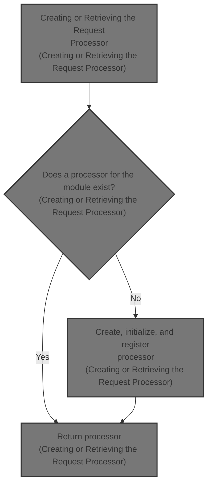

# Where is this flow used?

This flow is used multiple times in the codebase as represented in the following diagram:

```mermaid
graph TD;
      294cd284fa406b4fe4f160157c73b79eaa7835613a545efd883ce1f14dd1ca7e(core/…/action/ActionServlet.java::ActionServlet.process) --> 8021481ad2e61cbffbd4896e05edd9e89db84071d125277e9a801c0e7ae658c3(core/…/action/ActionServlet.java::ActionServlet.getRequestProcessor)

dde35d78060f1afca84b5e9dedc002fc37669b07142e9d5a1f656107cc900aa0(core/…/action/ActionServlet.java::ActionServlet.doGet) --> 294cd284fa406b4fe4f160157c73b79eaa7835613a545efd883ce1f14dd1ca7e(core/…/action/ActionServlet.java::ActionServlet.process)

ec52fb7c28a6afaae4fd5937965ca776c6c12441d8a10e0b92b387b05c5c5cf5(core/…/action/ActionServlet.java::ActionServlet.doPost) --> 294cd284fa406b4fe4f160157c73b79eaa7835613a545efd883ce1f14dd1ca7e(core/…/action/ActionServlet.java::ActionServlet.process)

f42b5fa1bea56d8ff671c6affb9d85867c0cd9c866b2e87d4e79e1160c4ffca1(tiles/…/tiles/RedeployableActionServlet.java::RedeployableActionServlet.getRequestProcessor) --> 8021481ad2e61cbffbd4896e05edd9e89db84071d125277e9a801c0e7ae658c3(core/…/action/ActionServlet.java::ActionServlet.getRequestProcessor)

dddf0d96694fd2e68165f2dd8b7e18080f18dd95805f51cb8f454b28c8cb9f2e(tiles/…/tiles/RedeployableActionServlet.java::RedeployableActionServlet.getRequestProcessor) --> 8021481ad2e61cbffbd4896e05edd9e89db84071d125277e9a801c0e7ae658c3(core/…/action/ActionServlet.java::ActionServlet.getRequestProcessor)


classDef mainFlowStyle color:#000000,fill:#7CB9F4
classDef rootsStyle color:#000000,fill:#00FFF4
classDef Style1 color:#000000,fill:#00FFAA
classDef Style2 color:#000000,fill:#FFFF00
classDef Style3 color:#000000,fill:#AA7CB9

%% Swimm:
%% graph TD;
%%       294cd284fa406b4fe4f160157c73b79eaa7835613a545efd883ce1f14dd1ca7e(<SwmPath>[core/…/action/ActionServlet.java](core/src/main/java/org/apache/struts/action/ActionServlet.java)</SwmPath>::ActionServlet.process) --> 8021481ad2e61cbffbd4896e05edd9e89db84071d125277e9a801c0e7ae658c3(<SwmPath>[core/…/action/ActionServlet.java](core/src/main/java/org/apache/struts/action/ActionServlet.java)</SwmPath>::ActionServlet.getRequestProcessor)
%% 
%% dde35d78060f1afca84b5e9dedc002fc37669b07142e9d5a1f656107cc900aa0(<SwmPath>[core/…/action/ActionServlet.java](core/src/main/java/org/apache/struts/action/ActionServlet.java)</SwmPath>::ActionServlet.doGet) --> 294cd284fa406b4fe4f160157c73b79eaa7835613a545efd883ce1f14dd1ca7e(<SwmPath>[core/…/action/ActionServlet.java](core/src/main/java/org/apache/struts/action/ActionServlet.java)</SwmPath>::ActionServlet.process)
%% 
%% ec52fb7c28a6afaae4fd5937965ca776c6c12441d8a10e0b92b387b05c5c5cf5(<SwmPath>[core/…/action/ActionServlet.java](core/src/main/java/org/apache/struts/action/ActionServlet.java)</SwmPath>::ActionServlet.doPost) --> 294cd284fa406b4fe4f160157c73b79eaa7835613a545efd883ce1f14dd1ca7e(<SwmPath>[core/…/action/ActionServlet.java](core/src/main/java/org/apache/struts/action/ActionServlet.java)</SwmPath>::ActionServlet.process)
%% 
%% f42b5fa1bea56d8ff671c6affb9d85867c0cd9c866b2e87d4e79e1160c4ffca1(<SwmPath>[tiles/…/tiles/RedeployableActionServlet.java](tiles/src/main/java/org/apache/struts/tiles/RedeployableActionServlet.java)</SwmPath>::RedeployableActionServlet.getRequestProcessor) --> 8021481ad2e61cbffbd4896e05edd9e89db84071d125277e9a801c0e7ae658c3(<SwmPath>[core/…/action/ActionServlet.java](core/src/main/java/org/apache/struts/action/ActionServlet.java)</SwmPath>::ActionServlet.getRequestProcessor)
%% 
%% dddf0d96694fd2e68165f2dd8b7e18080f18dd95805f51cb8f454b28c8cb9f2e(<SwmPath>[tiles/…/tiles/RedeployableActionServlet.java](tiles/src/main/java/org/apache/struts/tiles/RedeployableActionServlet.java)</SwmPath>::RedeployableActionServlet.getRequestProcessor) --> 8021481ad2e61cbffbd4896e05edd9e89db84071d125277e9a801c0e7ae658c3(<SwmPath>[core/…/action/ActionServlet.java](core/src/main/java/org/apache/struts/action/ActionServlet.java)</SwmPath>::ActionServlet.getRequestProcessor)
%% 
%% 
%% classDef mainFlowStyle color:#000000,fill:#7CB9F4
%% classDef rootsStyle color:#000000,fill:#00FFF4
%% classDef Style1 color:#000000,fill:#00FFAA
%% classDef Style2 color:#000000,fill:#FFFF00
%% classDef Style3 color:#000000,fill:#AA7CB9
```

# Creating or Retrieving the Request Processor

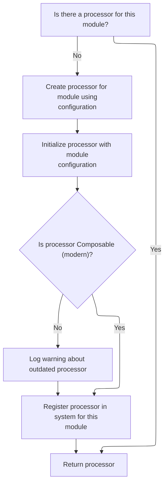

<SwmSnippet path="/core/src/main/java/org/apache/struts/action/ActionServlet.java" line="608">

---

<SwmToken path="core/src/main/java/org/apache/struts/action/ActionServlet.java" pos="608:7:7" line-data="    protected synchronized RequestProcessor getRequestProcessor(">`getRequestProcessor`</SwmToken> checks if a <SwmToken path="core/src/main/java/org/apache/struts/action/ActionServlet.java" pos="608:5:5" line-data="    protected synchronized RequestProcessor getRequestProcessor(">`RequestProcessor`</SwmToken> for the given module config already exists, creates and initializes one if not, and stores it in the <SwmToken path="core/src/main/java/org/apache/struts/action/ActionServlet.java" pos="418:7:7" line-data="    protected void initModulePrefixes(ServletContext context) {">`ServletContext`</SwmToken> for reuse. The call to <SwmToken path="core/src/main/java/org/apache/struts/action/ActionServlet.java" pos="634:1:9" line-data="            processor.init(this, config);">`processor.init(this, config)`</SwmToken> is needed to wire up the processor with the servlet and its configuration, so it can handle requests properly. After this, the flow continues with servlet initialization to ensure all dependencies and configs are set up before the processor is used.

```java
    protected synchronized RequestProcessor getRequestProcessor(
        ModuleConfig config) throws ServletException {
        RequestProcessor processor = this.getProcessorForModule(config);

        if (processor == null) {
            try {
                processor =
                    (RequestProcessor) RequestUtils.applicationInstance(config.getControllerConfig()
                                                                              .getProcessorClass());
            } catch (Exception e) {
            	UnavailableException e2 = new UnavailableException(
                    "Cannot initialize RequestProcessor of class "
                    + config.getControllerConfig().getProcessorClass());
                e2.initCause(e);
                throw e2;
            }
            
            // Emit a warning to the log if the classic RequestProcessor is 
            // being used without composition. Hopefully developers will 
            // heed this message and make the upgrade.
            if (!(processor instanceof ComposableRequestProcessor)) {
                log.warn("Use of the classic RequestProcessor is not recommended. " +
                        "Please upgrade to the ComposableRequestProcessor to " +
                        "receive the advantage of modern enhancements and fixes.");
            }

            processor.init(this, config);

            String key = Globals.REQUEST_PROCESSOR_KEY + config.getPrefix();

            getServletContext().setAttribute(key, processor);
        }

        return (processor);
    }
```

---

</SwmSnippet>

# Servlet Initialization and Config Parameter Handling

```mermaid
%%{init: {"flowchart": {"defaultRenderer": "elk"}} }%%
flowchart TD
    node1["Start ActionServlet initialization"]
    click node1 openCode "core/src/main/java/org/apache/struts/action/ActionServlet.java:339:346"
    node1 --> node2["Loading Internal Message Resources"]
    
    node2 --> node3["Resolving the Message Resource Factory"]
    
    node3 --> node4["Instantiating the Message Resource Factory Class"]
    
    node4 --> node5["Creating a New Dynamic Form Instance"]
    
    node5 --> node6["Resolving Initial Property Values"]
    
    node6 --> node7["Initialize other resources"]
    click node7 openCode "core/src/main/java/org/apache/struts/action/ActionServlet.java:348:348"
    node7 --> node8["Handling User Registration Action"]
    
    node8 --> node9["Forwarding the Request to a New URL"]
    
    node9 --> node10["Dispatching the Action to the Servlet Context"]
    
    node10 --> node11["Dispatching the Action Method"]
    
    node11 --> node12["Invoking the Resolved Action Method"]
    
    node12 --> node14["Initialize servlet-specific resources"]
    click node14 openCode "core/src/main/java/org/apache/struts/action/ActionServlet.java:349:349"
    node14 --> node15["Scanning and Registering Servlet Mappings"]
    
    node15 --> node16["Initialize processing chain"]
    click node16 openCode "core/src/main/java/org/apache/struts/action/ActionServlet.java:350:350"
    node16 --> node17["Parsing Chain Configuration Files"]
    
    node17 --> node18["Set servlet context attribute"]
    click node18 openCode "core/src/main/java/org/apache/struts/action/ActionServlet.java:352:353"
    node18 --> node19["Configuring the ModuleConfig Factory"]
    
    node19 --> node20["Prepare to initialize default module"]
    click node20 openCode "core/src/main/java/org/apache/struts/action/ActionServlet.java:355:356"
    node20 --> node21["Creating ModuleConfig Instances"]
    
    node21 --> node22["Finding Message Resource Configurations"]
    
    node22 --> node23["Instantiating and Configuring Plug-In Instances"]
    
    node23 --> node24["Initializing Form Bean Configurations"]
    
    node24 --> node25["Initializing Forward Configurations"]
    
    node25 --> node26["Initializing Exception Configurations"]
    
    node26 --> node27["Initializing Action Configurations"]
    
    node27 --> node28["Plug-In Post-Processing for Module Config"]
    
    node28 --> node29["Making Module Config Immutable"]
    
    node29 --> node30{"Are there additional module configs with
configPrefix?"}
    click node30 openCode "core/src/main/java/org/apache/struts/action/ActionServlet.java:367:389"
    node30 -->|"Yes"| loop1
    node30 -->|"No"| node39["Registering Module Prefixes"]
    
    node39 --> node40["Destroy config digester and finish"]
    click node40 openCode "core/src/main/java/org/apache/struts/action/ActionServlet.java:393:408"
    node40 --> node41["End initialization"]
    click node41 openCode "core/src/main/java/org/apache/struts/action/ActionServlet.java:408:408"
    subgraph loop1["For each additional module config
(parameter starts with configPrefix)"]
        loop1a["Creating ModuleConfig Instances"]
        
        loop1a --> loop1b["Finding Message Resource Configurations"]
        
        loop1b --> loop1c["Instantiating and Configuring Plug-In Instances"]
        
        loop1c --> loop1d["Initializing Form Bean Configurations"]
        
        loop1d --> loop1e["Initializing Forward Configurations"]
        
        loop1e --> loop1f["Initializing Exception Configurations"]
        
        loop1f --> loop1g["Initializing Action Configurations"]
        
        loop1g --> loop1h["Plug-In Post-Processing for Module Config"]
        
        loop1h --> loop1i["Making Module Config Immutable"]
        
    end
    node30 -->|"Initialization fails"| node42["Mark servlet as unavailable and log
error"]
    click node42 openCode "core/src/main/java/org/apache/struts/action/ActionServlet.java:394:407"
    node42 --> node41
classDef HeadingStyle fill:#777777,stroke:#333,stroke-width:2px;
click node2 goToHeading "Loading Internal Message Resources"
node2:::HeadingStyle
click node3 goToHeading "Resolving the Message Resource Factory"
node3:::HeadingStyle
click node4 goToHeading "Instantiating the Message Resource Factory Class"
node4:::HeadingStyle
click node5 goToHeading "Creating a New Dynamic Form Instance"
node5:::HeadingStyle
click node6 goToHeading "Resolving Initial Property Values"
node6:::HeadingStyle
click node8 goToHeading "Handling User Registration Action"
node8:::HeadingStyle
click node9 goToHeading "Forwarding the Request to a New URL"
node9:::HeadingStyle
click node10 goToHeading "Dispatching the Action to the Servlet Context"
node10:::HeadingStyle
click node11 goToHeading "Dispatching the Action Method"
node11:::HeadingStyle
click node12 goToHeading "Invoking the Resolved Action Method"
node12:::HeadingStyle
click node15 goToHeading "Scanning and Registering Servlet Mappings"
node15:::HeadingStyle
click node17 goToHeading "Parsing Chain Configuration Files"
node17:::HeadingStyle
click node19 goToHeading "Configuring the ModuleConfig Factory"
node19:::HeadingStyle
click node21 goToHeading "Creating ModuleConfig Instances"
node21:::HeadingStyle
click node22 goToHeading "Finding Message Resource Configurations"
node22:::HeadingStyle
click node23 goToHeading "Instantiating and Configuring Plug-In Instances"
node23:::HeadingStyle
click node24 goToHeading "Initializing Form Bean Configurations"
node24:::HeadingStyle
click node25 goToHeading "Initializing Forward Configurations"
node25:::HeadingStyle
click node26 goToHeading "Initializing Exception Configurations"
node26:::HeadingStyle
click node27 goToHeading "Initializing Action Configurations"
node27:::HeadingStyle
click node28 goToHeading "Plug-In Post-Processing for Module Config"
node28:::HeadingStyle
click node29 goToHeading "Making Module Config Immutable"
node29:::HeadingStyle
click node39 goToHeading "Registering Module Prefixes"
node39:::HeadingStyle
click loop1a goToHeading "Creating ModuleConfig Instances"
loop1a:::HeadingStyle
click loop1b goToHeading "Finding Message Resource Configurations"
loop1b:::HeadingStyle
click loop1c goToHeading "Instantiating and Configuring Plug-In Instances"
loop1c:::HeadingStyle
click loop1d goToHeading "Initializing Form Bean Configurations"
loop1d:::HeadingStyle
click loop1e goToHeading "Initializing Forward Configurations"
loop1e:::HeadingStyle
click loop1f goToHeading "Initializing Exception Configurations"
loop1f:::HeadingStyle
click loop1g goToHeading "Initializing Action Configurations"
loop1g:::HeadingStyle
click loop1h goToHeading "Plug-In Post-Processing for Module Config"
loop1h:::HeadingStyle
click loop1i goToHeading "Making Module Config Immutable"
loop1i:::HeadingStyle

%% Swimm:
%% %%{init: {"flowchart": {"defaultRenderer": "elk"}} }%%
%% flowchart TD
%%     node1["Start <SwmToken path="core/src/main/java/org/apache/struts/action/ActionServlet.java" pos="400:14:14" line-data="            log.error(&quot;Unable to initialize Struts ActionServlet due to an &quot;">`ActionServlet`</SwmToken> initialization"]
%%     click node1 openCode "<SwmPath>[core/…/action/ActionServlet.java](core/src/main/java/org/apache/struts/action/ActionServlet.java)</SwmPath>:339:346"
%%     node1 --> node2["Loading Internal Message Resources"]
%%     
%%     node2 --> node3["Resolving the Message Resource Factory"]
%%     
%%     node3 --> node4["Instantiating the Message Resource Factory Class"]
%%     
%%     node4 --> node5["Creating a New Dynamic Form Instance"]
%%     
%%     node5 --> node6["Resolving Initial Property Values"]
%%     
%%     node6 --> node7["Initialize other resources"]
%%     click node7 openCode "<SwmPath>[core/…/action/ActionServlet.java](core/src/main/java/org/apache/struts/action/ActionServlet.java)</SwmPath>:348:348"
%%     node7 --> node8["Handling User Registration Action"]
%%     
%%     node8 --> node9["Forwarding the Request to a New URL"]
%%     
%%     node9 --> node10["Dispatching the Action to the Servlet Context"]
%%     
%%     node10 --> node11["Dispatching the Action Method"]
%%     
%%     node11 --> node12["Invoking the Resolved Action Method"]
%%     
%%     node12 --> node14["Initialize servlet-specific resources"]
%%     click node14 openCode "<SwmPath>[core/…/action/ActionServlet.java](core/src/main/java/org/apache/struts/action/ActionServlet.java)</SwmPath>:349:349"
%%     node14 --> node15["Scanning and Registering Servlet Mappings"]
%%     
%%     node15 --> node16["Initialize processing chain"]
%%     click node16 openCode "<SwmPath>[core/…/action/ActionServlet.java](core/src/main/java/org/apache/struts/action/ActionServlet.java)</SwmPath>:350:350"
%%     node16 --> node17["Parsing Chain Configuration Files"]
%%     
%%     node17 --> node18["Set servlet context attribute"]
%%     click node18 openCode "<SwmPath>[core/…/action/ActionServlet.java](core/src/main/java/org/apache/struts/action/ActionServlet.java)</SwmPath>:352:353"
%%     node18 --> node19["Configuring the <SwmToken path="core/src/main/java/org/apache/struts/action/ActionServlet.java" pos="356:1:1" line-data="            ModuleConfig moduleConfig = initModuleConfig(&quot;&quot;, config);">`ModuleConfig`</SwmToken> Factory"]
%%     
%%     node19 --> node20["Prepare to initialize default module"]
%%     click node20 openCode "<SwmPath>[core/…/action/ActionServlet.java](core/src/main/java/org/apache/struts/action/ActionServlet.java)</SwmPath>:355:356"
%%     node20 --> node21["Creating <SwmToken path="core/src/main/java/org/apache/struts/action/ActionServlet.java" pos="356:1:1" line-data="            ModuleConfig moduleConfig = initModuleConfig(&quot;&quot;, config);">`ModuleConfig`</SwmToken> Instances"]
%%     
%%     node21 --> node22["Finding Message Resource Configurations"]
%%     
%%     node22 --> node23["Instantiating and Configuring Plug-In Instances"]
%%     
%%     node23 --> node24["Initializing Form Bean Configurations"]
%%     
%%     node24 --> node25["Initializing Forward Configurations"]
%%     
%%     node25 --> node26["Initializing Exception Configurations"]
%%     
%%     node26 --> node27["Initializing Action Configurations"]
%%     
%%     node27 --> node28["Plug-In Post-Processing for Module Config"]
%%     
%%     node28 --> node29["Making Module Config Immutable"]
%%     
%%     node29 --> node30{"Are there additional module configs with
%% <SwmToken path="core/src/main/java/org/apache/struts/action/ActionServlet.java" pos="340:5:5" line-data="        final String configPrefix = &quot;config/&quot;;">`configPrefix`</SwmToken>?"}
%%     click node30 openCode "<SwmPath>[core/…/action/ActionServlet.java](core/src/main/java/org/apache/struts/action/ActionServlet.java)</SwmPath>:367:389"
%%     node30 -->|"Yes"| loop1
%%     node30 -->|"No"| node39["Registering Module Prefixes"]
%%     
%%     node39 --> node40["Destroy config digester and finish"]
%%     click node40 openCode "<SwmPath>[core/…/action/ActionServlet.java](core/src/main/java/org/apache/struts/action/ActionServlet.java)</SwmPath>:393:408"
%%     node40 --> node41["End initialization"]
%%     click node41 openCode "<SwmPath>[core/…/action/ActionServlet.java](core/src/main/java/org/apache/struts/action/ActionServlet.java)</SwmPath>:408:408"
%%     subgraph loop1["For each additional module config
%% (parameter starts with <SwmToken path="core/src/main/java/org/apache/struts/action/ActionServlet.java" pos="340:5:5" line-data="        final String configPrefix = &quot;config/&quot;;">`configPrefix`</SwmToken>)"]
%%         loop1a["Creating <SwmToken path="core/src/main/java/org/apache/struts/action/ActionServlet.java" pos="356:1:1" line-data="            ModuleConfig moduleConfig = initModuleConfig(&quot;&quot;, config);">`ModuleConfig`</SwmToken> Instances"]
%%         
%%         loop1a --> loop1b["Finding Message Resource Configurations"]
%%         
%%         loop1b --> loop1c["Instantiating and Configuring Plug-In Instances"]
%%         
%%         loop1c --> loop1d["Initializing Form Bean Configurations"]
%%         
%%         loop1d --> loop1e["Initializing Forward Configurations"]
%%         
%%         loop1e --> loop1f["Initializing Exception Configurations"]
%%         
%%         loop1f --> loop1g["Initializing Action Configurations"]
%%         
%%         loop1g --> loop1h["Plug-In Post-Processing for Module Config"]
%%         
%%         loop1h --> loop1i["Making Module Config Immutable"]
%%         
%%     end
%%     node30 -->|"Initialization fails"| node42["Mark servlet as unavailable and log
%% error"]
%%     click node42 openCode "<SwmPath>[core/…/action/ActionServlet.java](core/src/main/java/org/apache/struts/action/ActionServlet.java)</SwmPath>:394:407"
%%     node42 --> node41
%% classDef HeadingStyle fill:#777777,stroke:#333,stroke-width:2px;
%% click node2 goToHeading "Loading Internal Message Resources"
%% node2:::HeadingStyle
%% click node3 goToHeading "Resolving the Message Resource Factory"
%% node3:::HeadingStyle
%% click node4 goToHeading "Instantiating the Message Resource Factory Class"
%% node4:::HeadingStyle
%% click node5 goToHeading "Creating a New Dynamic Form Instance"
%% node5:::HeadingStyle
%% click node6 goToHeading "Resolving Initial Property Values"
%% node6:::HeadingStyle
%% click node8 goToHeading "Handling User Registration Action"
%% node8:::HeadingStyle
%% click node9 goToHeading "Forwarding the Request to a New URL"
%% node9:::HeadingStyle
%% click node10 goToHeading "Dispatching the Action to the Servlet Context"
%% node10:::HeadingStyle
%% click node11 goToHeading "Dispatching the Action Method"
%% node11:::HeadingStyle
%% click node12 goToHeading "Invoking the Resolved Action Method"
%% node12:::HeadingStyle
%% click node15 goToHeading "Scanning and Registering Servlet Mappings"
%% node15:::HeadingStyle
%% click node17 goToHeading "Parsing Chain Configuration Files"
%% node17:::HeadingStyle
%% click node19 goToHeading "Configuring the <SwmToken path="core/src/main/java/org/apache/struts/action/ActionServlet.java" pos="356:1:1" line-data="            ModuleConfig moduleConfig = initModuleConfig(&quot;&quot;, config);">`ModuleConfig`</SwmToken> Factory"
%% node19:::HeadingStyle
%% click node21 goToHeading "Creating <SwmToken path="core/src/main/java/org/apache/struts/action/ActionServlet.java" pos="356:1:1" line-data="            ModuleConfig moduleConfig = initModuleConfig(&quot;&quot;, config);">`ModuleConfig`</SwmToken> Instances"
%% node21:::HeadingStyle
%% click node22 goToHeading "Finding Message Resource Configurations"
%% node22:::HeadingStyle
%% click node23 goToHeading "Instantiating and Configuring Plug-In Instances"
%% node23:::HeadingStyle
%% click node24 goToHeading "Initializing Form Bean Configurations"
%% node24:::HeadingStyle
%% click node25 goToHeading "Initializing Forward Configurations"
%% node25:::HeadingStyle
%% click node26 goToHeading "Initializing Exception Configurations"
%% node26:::HeadingStyle
%% click node27 goToHeading "Initializing Action Configurations"
%% node27:::HeadingStyle
%% click node28 goToHeading "Plug-In Post-Processing for Module Config"
%% node28:::HeadingStyle
%% click node29 goToHeading "Making Module Config Immutable"
%% node29:::HeadingStyle
%% click node39 goToHeading "Registering Module Prefixes"
%% node39:::HeadingStyle
%% click loop1a goToHeading "Creating <SwmToken path="core/src/main/java/org/apache/struts/action/ActionServlet.java" pos="356:1:1" line-data="            ModuleConfig moduleConfig = initModuleConfig(&quot;&quot;, config);">`ModuleConfig`</SwmToken> Instances"
%% loop1a:::HeadingStyle
%% click loop1b goToHeading "Finding Message Resource Configurations"
%% loop1b:::HeadingStyle
%% click loop1c goToHeading "Instantiating and Configuring Plug-In Instances"
%% loop1c:::HeadingStyle
%% click loop1d goToHeading "Initializing Form Bean Configurations"
%% loop1d:::HeadingStyle
%% click loop1e goToHeading "Initializing Forward Configurations"
%% loop1e:::HeadingStyle
%% click loop1f goToHeading "Initializing Exception Configurations"
%% loop1f:::HeadingStyle
%% click loop1g goToHeading "Initializing Action Configurations"
%% loop1g:::HeadingStyle
%% click loop1h goToHeading "Plug-In Post-Processing for Module Config"
%% loop1h:::HeadingStyle
%% click loop1i goToHeading "Making Module Config Immutable"
%% loop1i:::HeadingStyle
```

<SwmSnippet path="/core/src/main/java/org/apache/struts/action/ActionServlet.java" line="339">

---

In <SwmToken path="core/src/main/java/org/apache/struts/action/ActionServlet.java" pos="339:5:5" line-data="    public void init() throws ServletException {">`init`</SwmToken>, the servlet sets up for initialization by defining the <SwmPath>[core/…/struts/config/](core/src/main/java/org/apache/struts/config/)</SwmPath> prefix to filter relevant init parameters for module configs. The length calculation is used to extract the actual module prefix from parameter names. The next step is calling <SwmToken path="core/src/main/java/org/apache/struts/action/ActionServlet.java" pos="347:1:1" line-data="            initInternal();">`initInternal`</SwmToken> to load internal resources and continue the setup.

```java
    public void init() throws ServletException {
        final String configPrefix = "config/";
        final int configPrefixLength = configPrefix.length() - 1;

        // Wraps the entire initialization in a try/catch to better handle
        // unexpected exceptions and errors to provide better feedback
        // to the developer
        try {
            initInternal();
```

---

</SwmSnippet>

## Loading Internal Message Resources

<SwmSnippet path="/core/src/main/java/org/apache/struts/action/ActionServlet.java" line="1698">

---

<SwmToken path="core/src/main/java/org/apache/struts/action/ActionServlet.java" pos="1698:5:5" line-data="    protected void initInternal()">`initInternal`</SwmToken> loads the framework's internal message resources using <SwmToken path="core/src/main/java/org/apache/struts/action/ActionServlet.java" pos="1701:5:7" line-data="            internal = MessageResources.getMessageResources(internalName);">`MessageResources.getMessageResources`</SwmToken>. If loading fails, it logs the error and throws an exception to stop initialization. The next step is to resolve the actual resource bundle via <SwmToken path="core/src/main/java/org/apache/struts/action/ActionServlet.java" pos="1701:5:5" line-data="            internal = MessageResources.getMessageResources(internalName);">`MessageResources`</SwmToken>.

```java
    protected void initInternal()
        throws ServletException {
        try {
            internal = MessageResources.getMessageResources(internalName);
        } catch (MissingResourceException e) {
            log.error("Cannot load internal resources from '" + internalName
                + "'", e);
            UnavailableException e2 = new UnavailableException(
                "Cannot load internal resources from '" + internalName + "'");
            e2.initCause(e);
            throw e2;
        }
    }
```

---

</SwmSnippet>

## Resolving the Message Resource Factory

<SwmSnippet path="/core/src/main/java/org/apache/struts/util/MessageResources.java" line="482">

---

<SwmToken path="core/src/main/java/org/apache/struts/util/MessageResources.java" pos="482:9:9" line-data="    public synchronized static MessageResources getMessageResources(">`getMessageResources`</SwmToken> checks if the default factory exists, creates it if not, and then uses it to get the actual message resources. The next call to <SwmToken path="core/src/main/java/org/apache/struts/util/MessageResources.java" pos="485:5:7" line-data="            defaultFactory = MessageResourcesFactory.createFactory();">`MessageResourcesFactory.createFactory`</SwmToken> handles the instantiation of the factory itself.

```java
    public synchronized static MessageResources getMessageResources(
        String config) {
        if (defaultFactory == null) {
            defaultFactory = MessageResourcesFactory.createFactory();
        }

        return defaultFactory.createResources(config);
    }
```

---

</SwmSnippet>

## Instantiating the Message Resource Factory Class

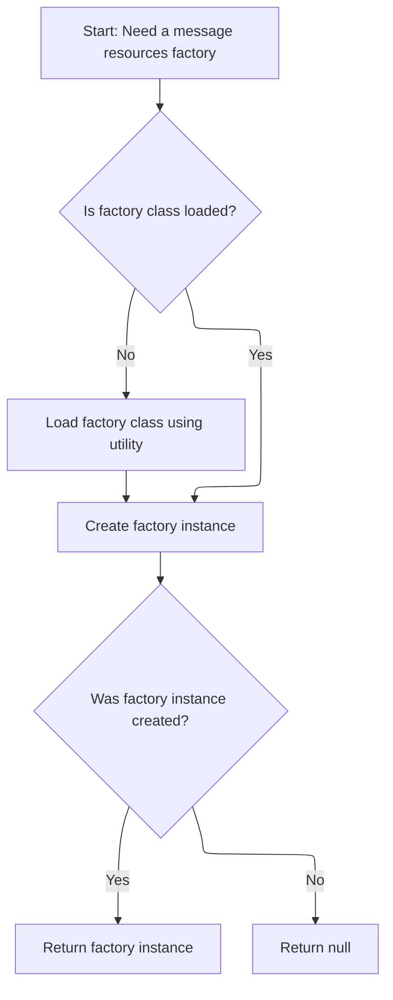

<SwmSnippet path="/core/src/main/java/org/apache/struts/util/MessageResourcesFactory.java" line="163">

---

<SwmToken path="core/src/main/java/org/apache/struts/util/MessageResourcesFactory.java" pos="163:7:7" line-data="    public static MessageResourcesFactory createFactory() {">`createFactory`</SwmToken> loads the factory class (if not already loaded) using the class name in the static variable, then creates a new instance via reflection. This allows swapping out the factory implementation. The next step is to use this factory for dynamic form bean instantiation, which is handled in <SwmToken path="core/src/main/java/org/apache/struts/action/ActionServlet.java" pos="953:13:13" line-data="            // Force creation and registration of DynaActionFormClass instances">`DynaActionFormClass`</SwmToken>.

```java
    public static MessageResourcesFactory createFactory() {
        // Construct a new instance of the specified factory class
        try {
            if (clazz == null) {
                clazz = RequestUtils.applicationClass(factoryClass);
            }

            MessageResourcesFactory factory =
                (MessageResourcesFactory) clazz.newInstance();

            return (factory);
        } catch (Throwable t) {
            LOG.error("MessageResourcesFactory.createFactory", t);

            return (null);
        }
    }
```

---

</SwmSnippet>

## Creating a New Dynamic Form Instance

<SwmSnippet path="/core/src/main/java/org/apache/struts/action/DynaActionFormClass.java" line="158">

---

In <SwmToken path="core/src/main/java/org/apache/struts/action/DynaActionFormClass.java" pos="158:5:5" line-data="    public DynaBean newInstance()">`newInstance`</SwmToken>, a new <SwmToken path="core/src/main/java/org/apache/struts/action/DynaActionFormClass.java" pos="160:1:1" line-data="        DynaActionForm dynaBean = (DynaActionForm) getBeanClass().newInstance();">`DynaActionForm`</SwmToken> is created using reflection based on the class returned by <SwmToken path="core/src/main/java/org/apache/struts/action/DynaActionFormClass.java" pos="160:11:11" line-data="        DynaActionForm dynaBean = (DynaActionForm) getBeanClass().newInstance();">`getBeanClass`</SwmToken>. This supports dynamic form types. The next step is to resolve the actual class via <SwmToken path="core/src/main/java/org/apache/struts/action/DynaActionFormClass.java" pos="160:11:11" line-data="        DynaActionForm dynaBean = (DynaActionForm) getBeanClass().newInstance();">`getBeanClass`</SwmToken>.

```java
    public DynaBean newInstance()
        throws IllegalAccessException, InstantiationException {
        DynaActionForm dynaBean = (DynaActionForm) getBeanClass().newInstance();

```

---

</SwmSnippet>

### Resolving the Bean Class for Dynamic Forms

<SwmSnippet path="/core/src/main/java/org/apache/struts/action/DynaActionFormClass.java" line="227">

---

<SwmToken path="core/src/main/java/org/apache/struts/action/DynaActionFormClass.java" pos="227:5:5" line-data="    protected Class getBeanClass() {">`getBeanClass`</SwmToken> checks if the bean class is already loaded, and if not, calls <SwmToken path="core/src/main/java/org/apache/struts/action/DynaActionFormClass.java" pos="229:1:1" line-data="            introspect(config);">`introspect`</SwmToken> to load it and set up property definitions. The next step is to introspect the config for property and type info.

```java
    protected Class getBeanClass() {
        if (beanClass == null) {
            introspect(config);
        }

        return (beanClass);
    }
```

---

</SwmSnippet>

### Analyzing Form Bean Properties and Types

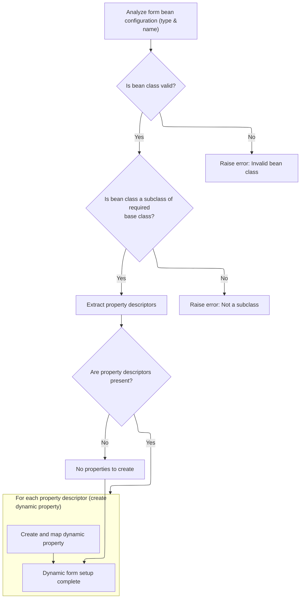

<SwmSnippet path="/core/src/main/java/org/apache/struts/action/DynaActionFormClass.java" line="246">

---

<SwmToken path="core/src/main/java/org/apache/struts/action/DynaActionFormClass.java" pos="246:5:5" line-data="    protected void introspect(FormBeanConfig config) {">`introspect`</SwmToken> loads the bean class from config, checks it's a <SwmToken path="core/src/main/java/org/apache/struts/action/DynaActionFormClass.java" pos="260:5:5" line-data="        if (!DynaActionForm.class.isAssignableFrom(beanClass)) {">`DynaActionForm`</SwmToken>, and builds up property definitions from the property configs. For each property, it uses <SwmToken path="core/src/main/java/org/apache/struts/action/DynaActionFormClass.java" pos="282:6:6" line-data="                    descriptors[i].getTypeClass());">`getTypeClass`</SwmToken> to resolve the Java type, which is handled next in <SwmToken path="core/src/main/java/org/apache/struts/action/DynaActionFormClass.java" pos="270:1:1" line-data="        FormPropertyConfig[] descriptors = config.findFormPropertyConfigs();">`FormPropertyConfig`</SwmToken>.

```java
    protected void introspect(FormBeanConfig config) {
        this.config = config;

        // Validate the ActionFormBean implementation class
        try {
            beanClass = RequestUtils.applicationClass(config.getType());
        } catch (Throwable t) {
        	IllegalArgumentException t2 = new IllegalArgumentException(
                "Cannot instantiate ActionFormBean class '" + config.getType()
                + "'");
        	t2.initCause(t);
        	throw t2;
        }

        if (!DynaActionForm.class.isAssignableFrom(beanClass)) {
            throw new IllegalArgumentException("Class '" + config.getType()
                + "' is not a subclass of "
                + "'org.apache.struts.action.DynaActionForm'");
        }

        // Set the name we will know ourselves by from the form bean name
        this.name = config.getName();

        // Look up the property descriptors for this bean class
        FormPropertyConfig[] descriptors = config.findFormPropertyConfigs();

        if (descriptors == null) {
            descriptors = new FormPropertyConfig[0];
        }

        // Create corresponding dynamic property definitions
        properties = new DynaProperty[descriptors.length];

        for (int i = 0; i < descriptors.length; i++) {
            properties[i] =
                new DynaProperty(descriptors[i].getName(),
                    descriptors[i].getTypeClass());
            propertiesMap.put(properties[i].getName(), properties[i]);
        }
    }
```

---

</SwmSnippet>

<SwmSnippet path="/core/src/main/java/org/apache/struts/config/FormPropertyConfig.java" line="221">

---

<SwmToken path="core/src/main/java/org/apache/struts/config/FormPropertyConfig.java" pos="221:5:5" line-data="    public Class getTypeClass() {">`getTypeClass`</SwmToken> figures out the Java Class for a property, handling primitives, arrays, and regular types. It uses the type string from config, checks for arrays, and loads the class accordingly. The next step is to use this type info for property initialization in <SwmToken path="core/src/main/java/org/apache/struts/action/ActionServlet.java" pos="953:13:13" line-data="            // Force creation and registration of DynaActionFormClass instances">`DynaActionFormClass`</SwmToken>.

```java
    public Class getTypeClass() {
        // Identify the base class (in case an array was specified)
        String baseType = getType();
        boolean indexed = false;

        if (baseType.endsWith("[]")) {
            baseType = baseType.substring(0, baseType.length() - 2);
            indexed = true;
        }

        // Construct an appropriate Class instance for the base class
        Class baseClass = null;

        if ("boolean".equals(baseType)) {
            baseClass = Boolean.TYPE;
        } else if ("byte".equals(baseType)) {
            baseClass = Byte.TYPE;
        } else if ("char".equals(baseType)) {
            baseClass = Character.TYPE;
        } else if ("double".equals(baseType)) {
            baseClass = Double.TYPE;
        } else if ("float".equals(baseType)) {
            baseClass = Float.TYPE;
        } else if ("int".equals(baseType)) {
            baseClass = Integer.TYPE;
        } else if ("long".equals(baseType)) {
            baseClass = Long.TYPE;
        } else if ("short".equals(baseType)) {
            baseClass = Short.TYPE;
        } else {
            ClassLoader classLoader =
                Thread.currentThread().getContextClassLoader();

            if (classLoader == null) {
                classLoader = this.getClass().getClassLoader();
            }

            try {
                baseClass = classLoader.loadClass(baseType);
            } catch (ClassNotFoundException ex) {
                log.error("Class '" + baseType +
                          "' not found for property '" + name + "'");
                baseClass = null;
            }
        }

        // Return the base class or an array appropriately
        if (indexed) {
            return (Array.newInstance(baseClass, 0).getClass());
        } else {
            return (baseClass);
        }
    }
```

---

</SwmSnippet>

### Setting Up the New Dynamic Form Instance

<SwmSnippet path="/core/src/main/java/org/apache/struts/action/DynaActionFormClass.java" line="162">

---

Back in `DynaActionFormClass.newInstance`, after creating the form instance, it sets up a reference to its class config and initializes each property using the initial value from the property config. The next step is to resolve these initial values, which is handled in <SwmToken path="core/src/main/java/org/apache/struts/action/DynaActionFormClass.java" pos="164:1:1" line-data="        FormPropertyConfig[] props = config.findFormPropertyConfigs();">`FormPropertyConfig`</SwmToken>.

```java
        dynaBean.setDynaActionFormClass(this);

        FormPropertyConfig[] props = config.findFormPropertyConfigs();

        for (int i = 0; i < props.length; i++) {
            dynaBean.set(props[i].getName(), props[i].initial());
        }

        return (dynaBean);
    }
```

---

</SwmSnippet>

## Resolving Initial Property Values

```mermaid
%%{init: {"flowchart": {"defaultRenderer": "elk"}} }%%
flowchart TD
    node1["Start: Determine property type"] --> node2{"Is property type an array?"}
    click node1 openCode "core/src/main/java/org/apache/struts/config/FormPropertyConfig.java:318:322"
    node2 -->|"Yes"| node3{"Is initial value provided?"}
    click node2 openCode "core/src/main/java/org/apache/struts/config/FormPropertyConfig.java:324:325"
    node3 -->|"Yes"| node4["Convert initial value to array type"]
    click node4 openCode "core/src/main/java/org/apache/struts/config/FormPropertyConfig.java:326:326"
    node4 --> node10["Return initial value"]
    node3 -->|"No"| node5["Create new array of required size (size)"]
    click node5 openCode "core/src/main/java/org/apache/struts/config/FormPropertyConfig.java:328:329"
    node5 --> node6{"Is element type primitive?"}
    click node6 openCode "core/src/main/java/org/apache/struts/config/FormPropertyConfig.java:331:331"
    node6 -->|"No"| loop1["For each element, create new instance"]
    click loop1 openCode "core/src/main/java/org/apache/struts/config/FormPropertyConfig.java:332:344"
    loop1 --> node10["Return initial value"]
    node6 -->|"Yes"| node10["Return initial value"]
    node2 -->|"No"| node7{"Is initial value provided?"}
    click node7 openCode "core/src/main/java/org/apache/struts/config/FormPropertyConfig.java:348:349"
    node7 -->|"Yes"| node8["Convert initial value to property type"]
    click node8 openCode "core/src/main/java/org/apache/struts/config/FormPropertyConfig.java:349:349"
    node8 --> node10["Return initial value"]
    node7 -->|"No"| node9["Create new instance of property type"]
    click node9 openCode "core/src/main/java/org/apache/struts/config/FormPropertyConfig.java:351:351"
    node9 --> node10["Return initial value"]
    node10["Return initial value"]
    click node10 openCode "core/src/main/java/org/apache/struts/config/FormPropertyConfig.java:358:359"

    subgraph loop1["For each element in array (if not
primitive)"]
        direction TB
    end
classDef HeadingStyle fill:#777777,stroke:#333,stroke-width:2px;

%% Swimm:
%% %%{init: {"flowchart": {"defaultRenderer": "elk"}} }%%
%% flowchart TD
%%     node1["Start: Determine property type"] --> node2{"Is property type an array?"}
%%     click node1 openCode "<SwmPath>[core/…/config/FormPropertyConfig.java](core/src/main/java/org/apache/struts/config/FormPropertyConfig.java)</SwmPath>:318:322"
%%     node2 -->|"Yes"| node3{"Is initial value provided?"}
%%     click node2 openCode "<SwmPath>[core/…/config/FormPropertyConfig.java](core/src/main/java/org/apache/struts/config/FormPropertyConfig.java)</SwmPath>:324:325"
%%     node3 -->|"Yes"| node4["Convert initial value to array type"]
%%     click node4 openCode "<SwmPath>[core/…/config/FormPropertyConfig.java](core/src/main/java/org/apache/struts/config/FormPropertyConfig.java)</SwmPath>:326:326"
%%     node4 --> node10["Return initial value"]
%%     node3 -->|"No"| node5["Create new array of required size (size)"]
%%     click node5 openCode "<SwmPath>[core/…/config/FormPropertyConfig.java](core/src/main/java/org/apache/struts/config/FormPropertyConfig.java)</SwmPath>:328:329"
%%     node5 --> node6{"Is element type primitive?"}
%%     click node6 openCode "<SwmPath>[core/…/config/FormPropertyConfig.java](core/src/main/java/org/apache/struts/config/FormPropertyConfig.java)</SwmPath>:331:331"
%%     node6 -->|"No"| loop1["For each element, create new instance"]
%%     click loop1 openCode "<SwmPath>[core/…/config/FormPropertyConfig.java](core/src/main/java/org/apache/struts/config/FormPropertyConfig.java)</SwmPath>:332:344"
%%     loop1 --> node10["Return initial value"]
%%     node6 -->|"Yes"| node10["Return initial value"]
%%     node2 -->|"No"| node7{"Is initial value provided?"}
%%     click node7 openCode "<SwmPath>[core/…/config/FormPropertyConfig.java](core/src/main/java/org/apache/struts/config/FormPropertyConfig.java)</SwmPath>:348:349"
%%     node7 -->|"Yes"| node8["Convert initial value to property type"]
%%     click node8 openCode "<SwmPath>[core/…/config/FormPropertyConfig.java](core/src/main/java/org/apache/struts/config/FormPropertyConfig.java)</SwmPath>:349:349"
%%     node8 --> node10["Return initial value"]
%%     node7 -->|"No"| node9["Create new instance of property type"]
%%     click node9 openCode "<SwmPath>[core/…/config/FormPropertyConfig.java](core/src/main/java/org/apache/struts/config/FormPropertyConfig.java)</SwmPath>:351:351"
%%     node9 --> node10["Return initial value"]
%%     node10["Return initial value"]
%%     click node10 openCode "<SwmPath>[core/…/config/FormPropertyConfig.java](core/src/main/java/org/apache/struts/config/FormPropertyConfig.java)</SwmPath>:358:359"
%% 
%%     subgraph loop1["For each element in array (if not
%% primitive)"]
%%         direction TB
%%     end
%% classDef HeadingStyle fill:#777777,stroke:#333,stroke-width:2px;
```

<SwmSnippet path="/core/src/main/java/org/apache/struts/config/FormPropertyConfig.java" line="318">

---

In <SwmToken path="core/src/main/java/org/apache/struts/config/FormPropertyConfig.java" pos="318:5:5" line-data="    public Object initial() {">`initial`</SwmToken>, the function figures out the initial value for a property by checking its type and whether it's an array. If an initial value is set, it converts it; otherwise, it creates a new instance or array. The next step is to handle array and non-array types differently.

```java
    public Object initial() {
        Object initialValue = null;

        try {
            Class clazz = getTypeClass();

```

---

</SwmSnippet>

<SwmSnippet path="/core/src/main/java/org/apache/struts/config/FormPropertyConfig.java" line="324">

---

Just returned from `FormPropertyConfig.initial`, the function now handles array and non-array types: for arrays, it either converts the initial value or creates a new array and fills it with new instances if needed; for non-arrays, it converts or instantiates as needed. <SwmToken path="core/src/main/java/org/apache/struts/config/FormPropertyConfig.java" pos="326:5:5" line-data="                    initialValue = ConvertUtils.convert(initial, clazz);">`ConvertUtils`</SwmToken> is used for type conversion. This ensures all property values are set up correctly for the form.

```java
            if (clazz.isArray()) {
                if (initial != null) {
                    initialValue = ConvertUtils.convert(initial, clazz);
                } else {
                    initialValue =
                        Array.newInstance(clazz.getComponentType(), size);

                    if (!(clazz.getComponentType().isPrimitive())) {
                        for (int i = 0; i < size; i++) {
                            try {
                                Array.set(initialValue, i,
                                    clazz.getComponentType().newInstance());
                            } catch (Throwable t) {
                                log.error("Unable to create instance of "
                                    + clazz.getName() + " for property=" + name
                                    + ", type=" + type + ", initial=" + initial
                                    + ", size=" + size + ".");

                                //FIXME: Should we just dump the entire application/module ?
                            }
                        }
```

---

</SwmSnippet>

<SwmSnippet path="/core/src/main/java/org/apache/struts/config/FormPropertyConfig.java" line="348">

---

Finishing up in `FormPropertyConfig.initial`, the function finalizes the initial value for each property, handling arrays and non-arrays with <SwmToken path="core/src/main/java/org/apache/struts/config/FormPropertyConfig.java" pos="349:5:5" line-data="                    initialValue = ConvertUtils.convert(initial, clazz);">`ConvertUtils`</SwmToken>. Now, back in <SwmToken path="core/src/main/java/org/apache/struts/action/ActionServlet.java" pos="953:13:13" line-data="            // Force creation and registration of DynaActionFormClass instances">`DynaActionFormClass`</SwmToken>, these values are assigned to the new form instance, completing its setup.

```java
                if (initial != null) {
                    initialValue = ConvertUtils.convert(initial, clazz);
                } else {
                    initialValue = clazz.newInstance();
                }
            }
        } catch (Throwable t) {
            initialValue = null;
        }

        return (initialValue);
    }
```

---

</SwmSnippet>

## Finalizing Servlet Initialization

<SwmSnippet path="/core/src/main/java/org/apache/struts/action/ActionServlet.java" line="348">

---

Just returned from `ActionServlet.initInternal`, the next step in <SwmToken path="core/src/main/java/org/apache/struts/action/ActionServlet.java" pos="339:5:5" line-data="    public void init() throws ServletException {">`init`</SwmToken> is to call <SwmToken path="core/src/main/java/org/apache/struts/action/ActionServlet.java" pos="348:1:1" line-data="            initOther();">`initOther`</SwmToken> to handle extra servlet parameters and set up type conversion for form beans. This wraps up the servlet's initialization.

```java
            initOther();
```

---

</SwmSnippet>

## Handling Extra Servlet Parameters and Type Conversion

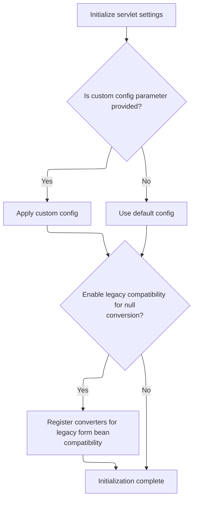

<SwmSnippet path="/core/src/main/java/org/apache/struts/action/ActionServlet.java" line="1753">

---

<SwmToken path="core/src/main/java/org/apache/struts/action/ActionServlet.java" pos="1753:5:5" line-data="    protected void initOther()">`initOther`</SwmToken> reads extra servlet parameters like 'config' and <SwmToken path="core/src/main/java/org/apache/struts/action/ActionServlet.java" pos="1765:12:12" line-data="        value = getServletConfig().getInitParameter(&quot;convertNull&quot;);">`convertNull`</SwmToken>. If <SwmToken path="core/src/main/java/org/apache/struts/action/ActionServlet.java" pos="1765:12:12" line-data="        value = getServletConfig().getInitParameter(&quot;convertNull&quot;);">`convertNull`</SwmToken> is set, it swaps out the default converters so form beans can have null values instead of default primitives. Next, the flow moves to application-specific logic, like handling registration in <SwmToken path="apps/faces-example2/src/main/java/org/apache/struts/webapp/example2/LoggedOff.java" pos="37:4:4" line-data="public class LoggedOff {">`LoggedOff`</SwmToken>.

```java
    protected void initOther()
        throws ServletException {
        String value;

        value = getServletConfig().getInitParameter("config");

        if (value != null) {
            config = value;
        }

        // Backwards compatibility for form beans of Java wrapper classes
        // Set to true for strict Struts 1.0 compatibility
        value = getServletConfig().getInitParameter("convertNull");

        if ("true".equalsIgnoreCase(value) || "yes".equalsIgnoreCase(value)
            || "on".equalsIgnoreCase(value) || "y".equalsIgnoreCase(value)
            || "1".equalsIgnoreCase(value)) {
            convertNull = true;
        }

        if (convertNull) {
            ConvertUtils.deregister();
            ConvertUtils.register(new BigDecimalConverter(null),
                BigDecimal.class);
            ConvertUtils.register(new BigIntegerConverter(null),
                BigInteger.class);
            ConvertUtils.register(new BooleanConverter(null), Boolean.class);
            ConvertUtils.register(new ByteConverter(null), Byte.class);
            ConvertUtils.register(new CharacterConverter(null), Character.class);
            ConvertUtils.register(new DoubleConverter(null), Double.class);
            ConvertUtils.register(new FloatConverter(null), Float.class);
            ConvertUtils.register(new IntegerConverter(null), Integer.class);
            ConvertUtils.register(new LongConverter(null), Long.class);
            ConvertUtils.register(new ShortConverter(null), Short.class);
        }
    }
```

---

</SwmSnippet>

## Handling User Registration Action

<SwmSnippet path="/apps/faces-example2/src/main/java/org/apache/struts/webapp/example2/LoggedOff.java" line="52">

---

<SwmToken path="apps/faces-example2/src/main/java/org/apache/struts/webapp/example2/LoggedOff.java" pos="52:5:5" line-data="    public String register() {">`register`</SwmToken> in <SwmToken path="apps/faces-example2/src/main/java/org/apache/struts/webapp/example2/LoggedOff.java" pos="37:4:4" line-data="public class LoggedOff {">`LoggedOff`</SwmToken> gets the current <SwmToken path="apps/faces-example2/src/main/java/org/apache/struts/webapp/example2/LoggedOff.java" pos="54:1:1" line-data="        FacesContext context = FacesContext.getCurrentInstance();">`FacesContext`</SwmToken>, logs the action, and forwards the request to '<SwmToken path="apps/faces-example2/src/main/java/org/apache/struts/webapp/example2/LoggedOff.java" pos="58:7:10" line-data="        forward(context, &quot;/editRegistration.do?action=Create&quot;);">`/editRegistration.do`</SwmToken>?action=Create'. Returning null means navigation is handled programmatically. The next step is the actual forwarding logic.

```java
    public String register() {

        FacesContext context = FacesContext.getCurrentInstance();
        if (log.isDebugEnabled()) {
            log.debug("register(" + context + ")");
        }
        forward(context, "/editRegistration.do?action=Create");
        return (null);

    }
```

---

</SwmSnippet>

## Forwarding the Request to a New URL

<SwmSnippet path="/apps/faces-example2/src/main/java/org/apache/struts/webapp/example2/LoggedOff.java" line="91">

---

<SwmToken path="apps/faces-example2/src/main/java/org/apache/struts/webapp/example2/LoggedOff.java" pos="91:5:5" line-data="    private void forward(FacesContext context, String url) {">`forward`</SwmToken> uses the JSF ExternalContext to dispatch the request to the given URL and marks the response as complete. If dispatch fails, it throws a <SwmToken path="apps/faces-example2/src/main/java/org/apache/struts/webapp/example2/LoggedOff.java" pos="96:5:5" line-data="            throw new FacesException(e);">`FacesException`</SwmToken>. The next step is the action dispatcher handling the forwarded request.

```java
    private void forward(FacesContext context, String url) {

        try {
            context.getExternalContext().dispatch(url);
        } catch (IOException e) {
            throw new FacesException(e);
        } finally {
            context.responseComplete();
        }

    }
```

---

</SwmSnippet>

## Dispatching the Action to the Servlet Context

<SwmSnippet path="/extras/src/main/java/org/apache/struts/actions/ActionDispatcher.java" line="507">

---

In <SwmToken path="extras/src/main/java/org/apache/struts/actions/ActionDispatcher.java" pos="507:5:5" line-data="    public Object dispatch(ActionContext context) throws Exception {">`dispatch`</SwmToken>, the <SwmToken path="extras/src/main/java/org/apache/struts/actions/ActionDispatcher.java" pos="507:7:7" line-data="    public Object dispatch(ActionContext context) throws Exception {">`ActionContext`</SwmToken> is cast to <SwmToken path="extras/src/main/java/org/apache/struts/actions/ActionDispatcher.java" pos="508:1:1" line-data="        ServletActionContext servletContext = (ServletActionContext) context;">`ServletActionContext`</SwmToken> to get access to the HTTP request and response. The next step is to retrieve these objects from the context for action execution.

```java
    public Object dispatch(ActionContext context) throws Exception {
        ServletActionContext servletContext = (ServletActionContext) context;
        return execute((ActionMapping) context.getActionConfig(), context.getActionForm(),
            servletContext.getRequest(), servletContext.getResponse());
```

---

</SwmSnippet>

### Accessing the HTTP Request from the Context

<SwmSnippet path="/core/src/main/java/org/apache/struts/chain/contexts/ServletActionContext.java" line="94">

---

<SwmToken path="core/src/main/java/org/apache/struts/chain/contexts/ServletActionContext.java" pos="94:5:5" line-data="    public HttpServletRequest getRequest() {">`getRequest`</SwmToken> gets the HTTP request by delegating to <SwmToken path="core/src/main/java/org/apache/struts/chain/contexts/ServletActionContext.java" pos="95:3:3" line-data="        return servletWebContext().getRequest();">`servletWebContext`</SwmToken>, which wraps the real request object. The next step is to resolve the <SwmToken path="core/src/main/java/org/apache/struts/chain/contexts/ServletActionContext.java" pos="95:3:3" line-data="        return servletWebContext().getRequest();">`servletWebContext`</SwmToken> from the base context.

```java
    public HttpServletRequest getRequest() {
        return servletWebContext().getRequest();
    }
```

---

</SwmSnippet>

<SwmSnippet path="/core/src/main/java/org/apache/struts/chain/contexts/ServletActionContext.java" line="67">

---

<SwmToken path="core/src/main/java/org/apache/struts/chain/contexts/ServletActionContext.java" pos="67:5:5" line-data="    protected ServletWebContext servletWebContext() {">`servletWebContext`</SwmToken> just casts the base context to <SwmToken path="core/src/main/java/org/apache/struts/chain/contexts/ServletActionContext.java" pos="67:3:3" line-data="    protected ServletWebContext servletWebContext() {">`ServletWebContext`</SwmToken> without checking. If the type is wrong, you'll get a <SwmToken path="extras/src/main/java/org/apache/struts/actions/ActionDispatcher.java" pos="368:6:6" line-data="        } catch (ClassCastException e) {">`ClassCastException`</SwmToken>. This pattern assumes the context is always set up correctly. Next, the flow continues with action execution using the request and response.

```java
    protected ServletWebContext servletWebContext() {
        return (ServletWebContext) this.getBaseContext();
    }
```

---

</SwmSnippet>

### Executing the Action with HTTP Request and Response

<SwmSnippet path="/extras/src/main/java/org/apache/struts/actions/ActionDispatcher.java" line="509">

---

Just returned from <SwmToken path="extras/src/main/java/org/apache/struts/actions/ActionDispatcher.java" pos="508:1:1" line-data="        ServletActionContext servletContext = (ServletActionContext) context;">`ServletActionContext`</SwmToken>, now `ActionDispatcher.dispatch` passes both the request and response to <SwmToken path="extras/src/main/java/org/apache/struts/actions/ActionDispatcher.java" pos="509:3:3" line-data="        return execute((ActionMapping) context.getActionConfig(), context.getActionForm(),">`execute`</SwmToken> for the actual action logic. The next step is to get the response object from the context.

```java
        return execute((ActionMapping) context.getActionConfig(), context.getActionForm(),
            servletContext.getRequest(), servletContext.getResponse());
```

---

</SwmSnippet>

<SwmSnippet path="/core/src/main/java/org/apache/struts/chain/contexts/ServletActionContext.java" line="103">

---

<SwmToken path="core/src/main/java/org/apache/struts/chain/contexts/ServletActionContext.java" pos="103:5:5" line-data="    public HttpServletResponse getResponse() {">`getResponse`</SwmToken> gets the HTTP response by delegating to <SwmToken path="core/src/main/java/org/apache/struts/chain/contexts/ServletActionContext.java" pos="104:3:3" line-data="        return servletWebContext().getResponse();">`servletWebContext`</SwmToken>, just like with the request. The next step is to use both objects in the action execution.

```java
    public HttpServletResponse getResponse() {
        return servletWebContext().getResponse();
    }
```

---

</SwmSnippet>

<SwmSnippet path="/extras/src/main/java/org/apache/struts/actions/ActionDispatcher.java" line="509">

---

Just returned from <SwmToken path="extras/src/main/java/org/apache/struts/actions/ActionDispatcher.java" pos="508:1:1" line-data="        ServletActionContext servletContext = (ServletActionContext) context;">`ServletActionContext`</SwmToken>, now `ActionDispatcher.dispatch` finishes by returning the result of <SwmToken path="extras/src/main/java/org/apache/struts/actions/ActionDispatcher.java" pos="509:3:3" line-data="        return execute((ActionMapping) context.getActionConfig(), context.getActionForm(),">`execute`</SwmToken>, which determines what happens next in the action flow (like which page to show or what data to send back).

```java
        return execute((ActionMapping) context.getActionConfig(), context.getActionForm(),
            servletContext.getRequest(), servletContext.getResponse());
    }
```

---

</SwmSnippet>

## Dispatching the Action Method

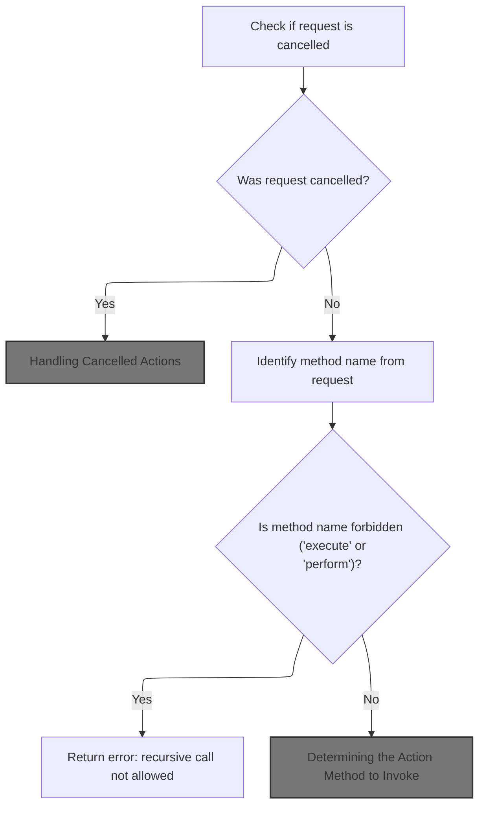

<SwmSnippet path="/extras/src/main/java/org/apache/struts/actions/ActionDispatcher.java" line="197">

---

In <SwmToken path="extras/src/main/java/org/apache/struts/actions/ActionDispatcher.java" pos="197:5:5" line-data="    public ActionForward execute(ActionMapping mapping, ActionForm form,">`execute`</SwmToken>, the dispatcher checks if the request was cancelled and, if so, tries to handle it via the <SwmToken path="extras/src/main/java/org/apache/struts/actions/ActionDispatcher.java" pos="200:6:6" line-data="        // Process &quot;cancelled&quot;">`cancelled`</SwmToken> method. If that method returns a forward, it exits early. Otherwise, it continues to figure out which action method to call next.

```java
    public ActionForward execute(ActionMapping mapping, ActionForm form,
        HttpServletRequest request, HttpServletResponse response)
        throws Exception {
        // Process "cancelled"
        if (isCancelled(request)) {
            ActionForward af = cancelled(mapping, form, request, response);

            if (af != null) {
                return af;
            }
        }

```

---

</SwmSnippet>

### Handling Cancelled Actions

<SwmSnippet path="/extras/src/main/java/org/apache/struts/actions/ActionDispatcher.java" line="282">

---

<SwmToken path="extras/src/main/java/org/apache/struts/actions/ActionDispatcher.java" pos="282:5:5" line-data="    protected ActionForward cancelled(ActionMapping mapping, ActionForm form,">`cancelled`</SwmToken> tries to find and call a method named 'cancelled' on the action. If it exists, it dispatches to it; if not, it returns null and lets the flow continue.

```java
    protected ActionForward cancelled(ActionMapping mapping, ActionForm form,
        HttpServletRequest request, HttpServletResponse response)
        throws Exception {
        // Identify if there is an "cancelled" method to be dispatched to
        String name = "cancelled";
        Method method = null;

        try {
            method = getMethod(name);
        } catch (NoSuchMethodException e) {
            return null;
        }

        return dispatchMethod(mapping, form, request, response, name, method);
    }
```

---

</SwmSnippet>

### Caching and Resolving Action Methods

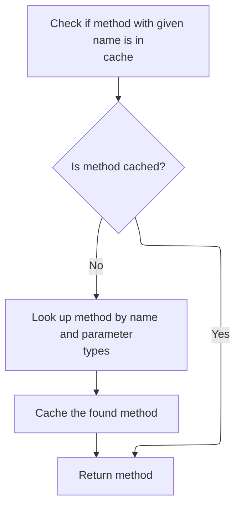

<SwmSnippet path="/extras/src/main/java/org/apache/struts/actions/ActionDispatcher.java" line="410">

---

<SwmToken path="extras/src/main/java/org/apache/struts/actions/ActionDispatcher.java" pos="410:5:5" line-data="    protected Method getMethod(String name)">`getMethod`</SwmToken> grabs the method from the cache if possible, otherwise uses reflection to find it and caches it for next time. This keeps method dispatch fast and thread-safe, and avoids repeated reflection. Next, we call <SwmToken path="core/src/main/java/org/apache/struts/dispatcher/AbstractDispatcher.java" pos="43:6:6" line-data="public abstract class AbstractDispatcher implements Dispatcher, Serializable {">`AbstractDispatcher`</SwmToken> to handle context-aware method resolution.

```java
    protected Method getMethod(String name)
        throws NoSuchMethodException {
        synchronized (methods) {
            Method method = (Method) methods.get(name);

            if (method == null) {
                method = clazz.getMethod(name, types);
                methods.put(name, method);
            }

            return (method);
        }
    }
```

---

</SwmSnippet>

### Resolving Methods with Context-Aware Caching

<SwmSnippet path="/core/src/main/java/org/apache/struts/dispatcher/AbstractDispatcher.java" line="203">

---

<SwmToken path="core/src/main/java/org/apache/struts/dispatcher/AbstractDispatcher.java" pos="203:7:7" line-data="    protected final Method getMethod(ActionContext context, String methodName) throws NoSuchMethodException {">`getMethod`</SwmToken> builds a cache key from the action class and method name, checks the cache, and if not found, resolves the method and caches it. This ensures the right method is found for each action instance.

```java
    protected final Method getMethod(ActionContext context, String methodName) throws NoSuchMethodException {
        synchronized (methods) {
            // Key the method based on the class-method combination
            StringBuffer keyBuf = new StringBuffer(100);
            keyBuf.append(context.getAction().getClass().getName());
            keyBuf.append(":");
            keyBuf.append(methodName);
            String key = keyBuf.toString();

            Method method = (Method) methods.get(key);

            if (method == null) {
                method = resolveMethod(context, methodName);
                methods.put(key, method);
            }

            return method;
        }
    }
```

---

</SwmSnippet>

### Delegating Method Resolution

<SwmSnippet path="/core/src/main/java/org/apache/struts/dispatcher/AbstractDispatcher.java" line="288">

---

<SwmToken path="core/src/main/java/org/apache/struts/dispatcher/AbstractDispatcher.java" pos="288:3:3" line-data="    Method resolveMethod(ActionContext context, String methodName) throws NoSuchMethodException {">`resolveMethod`</SwmToken> delegates to the method resolver, which tries several strategies to find the right method for the action, depending on the context type.

```java
    Method resolveMethod(ActionContext context, String methodName) throws NoSuchMethodException {
        return methodResolver.resolveMethod(context, methodName);
    }
```

---

</SwmSnippet>

### Finding the Action Method by Context and Signature

```mermaid
%%{init: {"flowchart": {"defaultRenderer": "elk"}} }%%
flowchart TD
    node1["Attempt to resolve method using
superclass"] --> node2{"Did superclass resolve method?"}
    click node1 openCode "core/src/main/java/org/apache/struts/dispatcher/servlet/ServletMethodResolver.java:112:114"
    node2 -->|"Yes"| node3["Return resolved method"]
    click node2 openCode "core/src/main/java/org/apache/struts/dispatcher/servlet/ServletMethodResolver.java:113:113"
    node2 -->|"No"| node4{"Is context a ServletActionContext?"}
    click node4 openCode "core/src/main/java/org/apache/struts/dispatcher/servlet/ServletMethodResolver.java:119:119"
    node4 -->|"Yes"| node5["Attempt to resolve method with
ServletActionContext parameter"]
    click node5 openCode "core/src/main/java/org/apache/struts/dispatcher/servlet/ServletMethodResolver.java:121:122"
    node5 --> node6{"Did this resolve method?"}
    click node6 openCode "core/src/main/java/org/apache/struts/dispatcher/servlet/ServletMethodResolver.java:122:122"
    node6 -->|"Yes"| node3
    node6 -->|"No"| node7["Attempt classic method resolution"]
    click node7 openCode "core/src/main/java/org/apache/struts/dispatcher/servlet/ServletMethodResolver.java:129:129"
    node4 -->|"No"| node7
    node7 --> node3["Return resolved method"]
    click node3 openCode "core/src/main/java/org/apache/struts/dispatcher/servlet/ServletMethodResolver.java:113:129"
classDef HeadingStyle fill:#777777,stroke:#333,stroke-width:2px;

%% Swimm:
%% %%{init: {"flowchart": {"defaultRenderer": "elk"}} }%%
%% flowchart TD
%%     node1["Attempt to resolve method using
%% superclass"] --> node2{"Did superclass resolve method?"}
%%     click node1 openCode "<SwmPath>[core/…/servlet/ServletMethodResolver.java](core/src/main/java/org/apache/struts/dispatcher/servlet/ServletMethodResolver.java)</SwmPath>:112:114"
%%     node2 -->|"Yes"| node3["Return resolved method"]
%%     click node2 openCode "<SwmPath>[core/…/servlet/ServletMethodResolver.java](core/src/main/java/org/apache/struts/dispatcher/servlet/ServletMethodResolver.java)</SwmPath>:113:113"
%%     node2 -->|"No"| node4{"Is context a <SwmToken path="extras/src/main/java/org/apache/struts/actions/ActionDispatcher.java" pos="508:1:1" line-data="        ServletActionContext servletContext = (ServletActionContext) context;">`ServletActionContext`</SwmToken>?"}
%%     click node4 openCode "<SwmPath>[core/…/servlet/ServletMethodResolver.java](core/src/main/java/org/apache/struts/dispatcher/servlet/ServletMethodResolver.java)</SwmPath>:119:119"
%%     node4 -->|"Yes"| node5["Attempt to resolve method with
%% <SwmToken path="extras/src/main/java/org/apache/struts/actions/ActionDispatcher.java" pos="508:1:1" line-data="        ServletActionContext servletContext = (ServletActionContext) context;">`ServletActionContext`</SwmToken> parameter"]
%%     click node5 openCode "<SwmPath>[core/…/servlet/ServletMethodResolver.java](core/src/main/java/org/apache/struts/dispatcher/servlet/ServletMethodResolver.java)</SwmPath>:121:122"
%%     node5 --> node6{"Did this resolve method?"}
%%     click node6 openCode "<SwmPath>[core/…/servlet/ServletMethodResolver.java](core/src/main/java/org/apache/struts/dispatcher/servlet/ServletMethodResolver.java)</SwmPath>:122:122"
%%     node6 -->|"Yes"| node3
%%     node6 -->|"No"| node7["Attempt classic method resolution"]
%%     click node7 openCode "<SwmPath>[core/…/servlet/ServletMethodResolver.java](core/src/main/java/org/apache/struts/dispatcher/servlet/ServletMethodResolver.java)</SwmPath>:129:129"
%%     node4 -->|"No"| node7
%%     node7 --> node3["Return resolved method"]
%%     click node3 openCode "<SwmPath>[core/…/servlet/ServletMethodResolver.java](core/src/main/java/org/apache/struts/dispatcher/servlet/ServletMethodResolver.java)</SwmPath>:113:129"
%% classDef HeadingStyle fill:#777777,stroke:#333,stroke-width:2px;
```

<SwmSnippet path="/core/src/main/java/org/apache/struts/dispatcher/servlet/ServletMethodResolver.java" line="110">

---

In <SwmToken path="core/src/main/java/org/apache/struts/dispatcher/servlet/ServletMethodResolver.java" pos="110:5:5" line-data="    public Method resolveMethod(ActionContext context, String methodName) throws NoSuchMethodException {">`resolveMethod`</SwmToken>, the resolver first tries the superclass logic, then checks for methods that accept <SwmToken path="extras/src/main/java/org/apache/struts/actions/ActionDispatcher.java" pos="508:1:1" line-data="        ServletActionContext servletContext = (ServletActionContext) context;">`ServletActionContext`</SwmToken>, and finally falls back to classic signatures. This covers all action method variants.

```java
    public Method resolveMethod(ActionContext context, String methodName) throws NoSuchMethodException {
        // First try to resolve anything the superclass supports
        try {
            return super.resolveMethod(context, methodName);
        } catch (NoSuchMethodException e) {
            // continue
        }

```

---

</SwmSnippet>

<SwmSnippet path="/core/src/main/java/org/apache/struts/dispatcher/servlet/ServletMethodResolver.java" line="118">

---

Just returned from <SwmToken path="core/src/main/java/org/apache/struts/dispatcher/AbstractDispatcher.java" pos="43:6:6" line-data="public abstract class AbstractDispatcher implements Dispatcher, Serializable {">`AbstractDispatcher`</SwmToken>, now <SwmToken path="core/src/main/java/org/apache/struts/dispatcher/AbstractDispatcher.java" pos="215:5:5" line-data="                method = resolveMethod(context, methodName);">`resolveMethod`</SwmToken> in <SwmToken path="core/src/main/java/org/apache/struts/dispatcher/servlet/ServletMethodResolver.java" pos="49:4:4" line-data="public class ServletMethodResolver extends AbstractMethodResolver {">`ServletMethodResolver`</SwmToken> checks if the context is a <SwmToken path="core/src/main/java/org/apache/struts/dispatcher/servlet/ServletMethodResolver.java" pos="119:8:8" line-data="        if (context instanceof ServletActionContext) {">`ServletActionContext`</SwmToken> and tries to find a matching method signature. If not found, it keeps looking using classic signatures.

```java
        // Can the method accept the servlet action context?
        if (context instanceof ServletActionContext) {
            try {
                Class actionClass = context.getAction().getClass();
                return actionClass.getMethod(methodName, new Class[] { ServletActionContext.class });
            } catch (NoSuchMethodException e) {
                // continue
            }
        }

```

---

</SwmSnippet>

<SwmSnippet path="/core/src/main/java/org/apache/struts/dispatcher/servlet/ServletMethodResolver.java" line="128">

---

Just returned from <SwmToken path="core/src/main/java/org/apache/struts/dispatcher/AbstractDispatcher.java" pos="43:6:6" line-data="public abstract class AbstractDispatcher implements Dispatcher, Serializable {">`AbstractDispatcher`</SwmToken>, now <SwmToken path="core/src/main/java/org/apache/struts/dispatcher/AbstractDispatcher.java" pos="215:5:5" line-data="                method = resolveMethod(context, methodName);">`resolveMethod`</SwmToken> in <SwmToken path="core/src/main/java/org/apache/struts/dispatcher/servlet/ServletMethodResolver.java" pos="49:4:4" line-data="public class ServletMethodResolver extends AbstractMethodResolver {">`ServletMethodResolver`</SwmToken> falls back to classic method resolution if nothing else worked. This covers all possible method signatures for actions.

```java
        // Lastly, try the classical argument listing
        return resolveClassicMethod(context, methodName);
    }
```

---

</SwmSnippet>

<SwmSnippet path="/core/src/main/java/org/apache/struts/dispatcher/servlet/ServletMethodResolver.java" line="105">

---

<SwmToken path="core/src/main/java/org/apache/struts/dispatcher/servlet/ServletMethodResolver.java" pos="105:7:7" line-data="    protected final Method resolveClassicMethod(ActionContext context, String methodName) throws NoSuchMethodException {">`resolveClassicMethod`</SwmToken> looks for the method with the classic signature in the action class. If not found, it throws, so this is the last fallback for legacy actions.

```java
    protected final Method resolveClassicMethod(ActionContext context, String methodName) throws NoSuchMethodException {
        Class actionClass = context.getAction().getClass();
        return actionClass.getMethod(methodName, CLASSIC_EXECUTE_SIGNATURE);
    }
```

---

</SwmSnippet>

### Determining the Action Method to Invoke

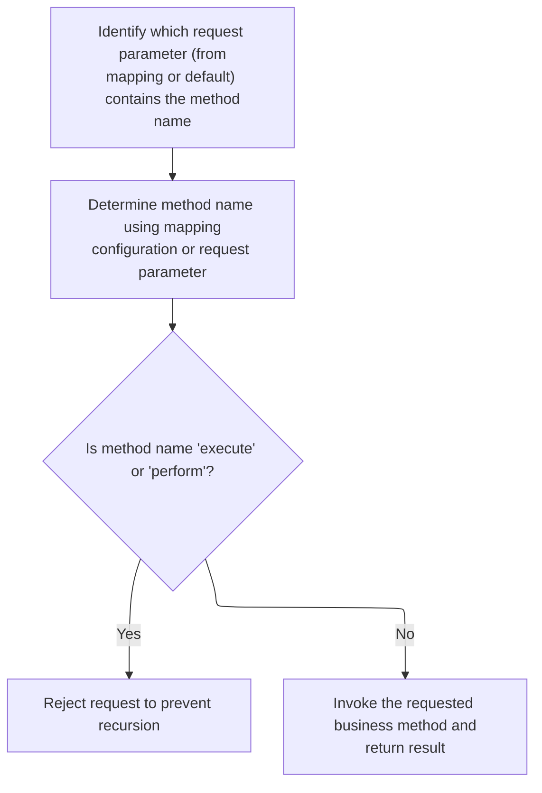

<SwmSnippet path="/extras/src/main/java/org/apache/struts/actions/ActionDispatcher.java" line="209">

---

Just returned from <SwmToken path="extras/src/main/java/org/apache/struts/actions/ActionDispatcher.java" pos="200:6:6" line-data="        // Process &quot;cancelled&quot;">`cancelled`</SwmToken>, now <SwmToken path="extras/src/main/java/org/apache/struts/actions/ActionDispatcher.java" pos="197:5:5" line-data="    public ActionForward execute(ActionMapping mapping, ActionForm form,">`execute`</SwmToken> grabs the method parameter from the mapping or request to figure out which action method to call next.

```java
        // Identify the request parameter containing the method name
        String parameter = getParameter(mapping, form, request, response);

```

---

</SwmSnippet>

<SwmSnippet path="/extras/src/main/java/org/apache/struts/actions/ActionDispatcher.java" line="435">

---

<SwmToken path="extras/src/main/java/org/apache/struts/actions/ActionDispatcher.java" pos="435:5:5" line-data="    protected String getParameter(ActionMapping mapping, ActionForm form,">`getParameter`</SwmToken> figures out which request parameter to use for method dispatch, using the flavor field to decide defaults or throw errors if missing.

```java
    protected String getParameter(ActionMapping mapping, ActionForm form,
        HttpServletRequest request, HttpServletResponse response)
        throws Exception {
        String parameter = mapping.getParameter();

        if ("".equals(parameter)) {
            parameter = null;
        }

        if ((parameter == null) && (flavor == DEFAULT_FLAVOR)) {
            // use "method" for DEFAULT_FLAVOR if no parameter was provided
            return "method";
        }

        if ((parameter == null)
            && ((flavor == MAPPING_FLAVOR) || (flavor == DISPATCH_FLAVOR))) {
            String message =
                messages.getMessage("dispatch.handler", mapping.getPath());

            log.error(message);

            throw new ServletException(message);
        }

        return parameter;
    }
```

---

</SwmSnippet>

<SwmSnippet path="/extras/src/main/java/org/apache/struts/actions/ActionDispatcher.java" line="212">

---

Just returned from <SwmToken path="core/src/main/java/org/apache/struts/action/ActionServlet.java" pos="1557:9:9" line-data="                || (mrcs[i].getParameter() == null)) {">`getParameter`</SwmToken>, now <SwmToken path="extras/src/main/java/org/apache/struts/actions/ActionDispatcher.java" pos="197:5:5" line-data="    public ActionForward execute(ActionMapping mapping, ActionForm form,">`execute`</SwmToken> uses <SwmToken path="extras/src/main/java/org/apache/struts/actions/ActionDispatcher.java" pos="214:1:1" line-data="            getMethodName(mapping, form, request, response, parameter);">`getMethodName`</SwmToken> to resolve the actual method name to call, which could be overridden in subclasses.

```java
        // Get the method's name. This could be overridden in subclasses.
        String name =
            getMethodName(mapping, form, request, response, parameter);

```

---

</SwmSnippet>

<SwmSnippet path="/extras/src/main/java/org/apache/struts/actions/ActionDispatcher.java" line="474">

---

<SwmToken path="extras/src/main/java/org/apache/struts/actions/ActionDispatcher.java" pos="474:5:5" line-data="    protected String getMethodName(ActionMapping mapping, ActionForm form,">`getMethodName`</SwmToken> returns the method name to dispatch to, either from the mapping or the request, depending on the flavor. This lets actions be triggered in different ways.

```java
    protected String getMethodName(ActionMapping mapping, ActionForm form,
        HttpServletRequest request, HttpServletResponse response,
        String parameter) throws Exception {
        // "Mapping" flavor, defaults to "method"
        if (flavor == MAPPING_FLAVOR) {
            return parameter;
        }

        // default behaviour
        return request.getParameter(parameter);
    }
```

---

</SwmSnippet>

<SwmSnippet path="/extras/src/main/java/org/apache/struts/actions/ActionDispatcher.java" line="216">

---

Just returned from <SwmToken path="extras/src/main/java/org/apache/struts/actions/ActionDispatcher.java" pos="214:1:1" line-data="            getMethodName(mapping, form, request, response, parameter);">`getMethodName`</SwmToken>, now <SwmToken path="extras/src/main/java/org/apache/struts/actions/ActionDispatcher.java" pos="217:5:5" line-data="        if (&quot;execute&quot;.equals(name) || &quot;perform&quot;.equals(name)) {">`execute`</SwmToken> checks for recursion and then calls <SwmToken path="extras/src/main/java/org/apache/struts/actions/ActionDispatcher.java" pos="226:3:3" line-data="        return dispatchMethod(mapping, form, request, response, name);">`dispatchMethod`</SwmToken> to actually invoke the resolved method.

```java
        // Prevent recursive calls
        if ("execute".equals(name) || "perform".equals(name)) {
            String message =
                messages.getMessage("dispatch.recursive", mapping.getPath());

            log.error(message);
            throw new ServletException(message);
        }

        // Invoke the named method, and return the result
        return dispatchMethod(mapping, form, request, response, name);
    }
```

---

</SwmSnippet>

## Invoking the Resolved Action Method

<SwmSnippet path="/extras/src/main/java/org/apache/struts/actions/ActionDispatcher.java" line="313">

---

In <SwmToken path="extras/src/main/java/org/apache/struts/actions/ActionDispatcher.java" pos="313:5:5" line-data="    protected ActionForward dispatchMethod(ActionMapping mapping,">`dispatchMethod`</SwmToken>, if the method name is null, it calls <SwmToken path="extras/src/main/java/org/apache/struts/actions/ActionDispatcher.java" pos="320:5:5" line-data="            return this.unspecified(mapping, form, request, response);">`unspecified`</SwmToken> to handle missing method cases, otherwise it continues to resolve and invoke the method.

```java
    protected ActionForward dispatchMethod(ActionMapping mapping,
        ActionForm form, HttpServletRequest request,
        HttpServletResponse response, String name)
        throws Exception {
        // Make sure we have a valid method name to call.
        // This may be null if the user hacks the query string.
        if (name == null) {
            return this.unspecified(mapping, form, request, response);
        }

```

---

</SwmSnippet>

### Handling Unspecified Action Methods

<SwmSnippet path="/extras/src/main/java/org/apache/struts/actions/ActionDispatcher.java" line="245">

---

<SwmToken path="extras/src/main/java/org/apache/struts/actions/ActionDispatcher.java" pos="245:5:5" line-data="    protected ActionForward unspecified(ActionMapping mapping, ActionForm form,">`unspecified`</SwmToken> tries to find and call a method named 'unspecified' on the action. If not found, it logs and throws, so this is the error path for missing methods.

```java
    protected ActionForward unspecified(ActionMapping mapping, ActionForm form,
        HttpServletRequest request, HttpServletResponse response)
        throws Exception {
        // Identify if there is an "unspecified" method to be dispatched to
        String name = "unspecified";
        Method method = null;

        try {
            method = getMethod(name);
```

---

</SwmSnippet>

<SwmSnippet path="/extras/src/main/java/org/apache/struts/actions/ActionDispatcher.java" line="254">

---

Just returned from <SwmToken path="extras/src/main/java/org/apache/struts/actions/ActionDispatcher.java" pos="245:5:5" line-data="    protected ActionForward unspecified(ActionMapping mapping, ActionForm form,">`unspecified`</SwmToken>, now the dispatcher logs the error and throws if the method isn't found, otherwise it dispatches to the resolved method.

```java
        } catch (NoSuchMethodException e) {
            String message =
                messages.getMessage("dispatch.parameter", mapping.getPath(),
                    mapping.getParameter());

            log.error(message);

            throw new ServletException(message, e);
        }

        return dispatchMethod(mapping, form, request, response, name, method);
    }
```

---

</SwmSnippet>

### Resolving and Dispatching the Action Method

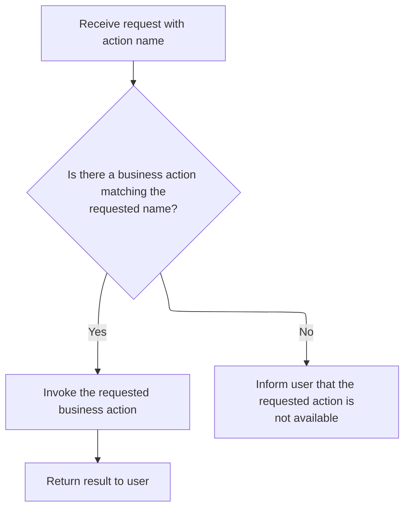

<SwmSnippet path="/extras/src/main/java/org/apache/struts/actions/ActionDispatcher.java" line="323">

---

Just returned from <SwmToken path="extras/src/main/java/org/apache/struts/actions/ActionDispatcher.java" pos="245:5:5" line-data="    protected ActionForward unspecified(ActionMapping mapping, ActionForm form,">`unspecified`</SwmToken>, now <SwmToken path="extras/src/main/java/org/apache/struts/actions/ActionDispatcher.java" pos="226:3:3" line-data="        return dispatchMethod(mapping, form, request, response, name);">`dispatchMethod`</SwmToken> tries to resolve the method object by name, catching errors if not found.

```java
        // Identify the method object to be dispatched to
        Method method = null;

        try {
            method = getMethod(name);
```

---

</SwmSnippet>

<SwmSnippet path="/extras/src/main/java/org/apache/struts/actions/ActionDispatcher.java" line="328">

---

Just returned from <SwmToken path="extras/src/main/java/org/apache/struts/actions/ActionDispatcher.java" pos="341:3:3" line-data="        return dispatchMethod(mapping, form, request, response, name, method);">`dispatchMethod`</SwmToken>, now the dispatcher logs and throws if the method isn't found, or dispatches to the resolved method if successful.

```java
        } catch (NoSuchMethodException e) {
            String message =
                messages.getMessage("dispatch.method", mapping.getPath(), name);

            log.error(message, e);

            String userMsg =
                messages.getMessage("dispatch.method.user", mapping.getPath());
            NoSuchMethodException e2 = new NoSuchMethodException(userMsg);
            e2.initCause(e);
            throw e2;
        }

        return dispatchMethod(mapping, form, request, response, name, method);
    }
```

---

</SwmSnippet>

## Completing Servlet Initialization

<SwmSnippet path="/core/src/main/java/org/apache/struts/action/ActionServlet.java" line="349">

---

Just returned from <SwmToken path="core/src/main/java/org/apache/struts/action/ActionServlet.java" pos="348:1:1" line-data="            initOther();">`initOther`</SwmToken>, now <SwmToken path="core/src/main/java/org/apache/struts/action/ActionServlet.java" pos="339:5:5" line-data="    public void init() throws ServletException {">`init`</SwmToken> calls <SwmToken path="core/src/main/java/org/apache/struts/action/ActionServlet.java" pos="349:1:1" line-data="            initServlet();">`initServlet`</SwmToken> to finish servlet setup, including scanning <SwmPath>[apps/…/WEB-INF/web.xml](apps/blank/src/main/webapp/WEB-INF/web.xml)</SwmPath> and configuring mappings.

```java
            initServlet();
```

---

</SwmSnippet>

## Scanning and Registering Servlet Mappings

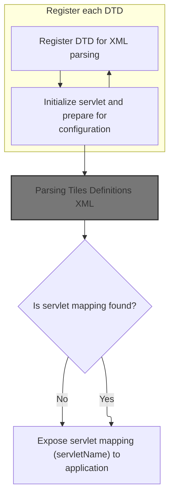

<SwmSnippet path="/core/src/main/java/org/apache/struts/action/ActionServlet.java" line="1797">

---

In <SwmToken path="core/src/main/java/org/apache/struts/action/ActionServlet.java" pos="1797:5:5" line-data="    protected void initServlet()">`initServlet`</SwmToken>, the servlet uses Digester to scan <SwmPath>[apps/…/WEB-INF/web.xml](apps/blank/src/main/webapp/WEB-INF/web.xml)</SwmPath> and register servlet mappings, prepping for further setup and integration.

```java
    protected void initServlet()
        throws ServletException {
        // Remember our servlet name
        this.servletName = getServletConfig().getServletName();

        // Prepare a Digester to scan the web application deployment descriptor
        Digester digester = new Digester();

        digester.push(this);
        digester.setNamespaceAware(true);
        digester.setValidating(false);

        // Register our local copy of the DTDs that we can find
        for (int i = 0; i < registrations.length; i += 2) {
            URL url = this.getClass().getResource(registrations[i + 1]);

            if (url != null) {
                digester.register(registrations[i], url.toString());
            }
        }

```

---

</SwmSnippet>

<SwmSnippet path="/core/src/main/java/org/apache/struts/action/ActionServlet.java" line="1818">

---

Just returned from <SwmToken path="apps/faces-example2/src/main/java/org/apache/struts/webapp/example2/LoggedOff.java" pos="37:4:4" line-data="public class LoggedOff {">`LoggedOff`</SwmToken>, now <SwmToken path="core/src/main/java/org/apache/struts/action/ActionServlet.java" pos="349:1:1" line-data="            initServlet();">`initServlet`</SwmToken> configures Digester rules and parses <SwmPath>[apps/…/WEB-INF/web.xml](apps/blank/src/main/webapp/WEB-INF/web.xml)</SwmPath>, prepping for Tiles XML parsing next.

```java
        // Configure the processing rules that we need
        digester.addCallMethod("web-app/servlet-mapping", "addServletMapping", 2);
        digester.addCallParam("web-app/servlet-mapping/servlet-name", 0);
        digester.addCallParam("web-app/servlet-mapping/url-pattern", 1);

        // Process the web application deployment descriptor
        if (log.isDebugEnabled()) {
            log.debug("Scanning web.xml for controller servlet mapping");
        }

        InputStream input =
            getServletContext().getResourceAsStream("/WEB-INF/web.xml");

        if (input == null) {
            log.error(internal.getMessage("configWebXml"));
            throw new ServletException(internal.getMessage("configWebXml"));
        }

        try {
            digester.parse(input);
```

---

</SwmSnippet>

### Parsing Tiles Definitions XML

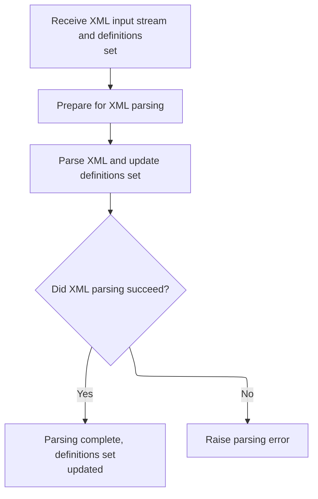

<SwmSnippet path="/tiles/src/main/java/org/apache/struts/tiles/xmlDefinition/XmlParser.java" line="275">

---

<SwmToken path="tiles/src/main/java/org/apache/struts/tiles/xmlDefinition/XmlParser.java" pos="275:5:5" line-data="  public void parse( InputStream in, XmlDefinitionsSet definitions ) throws IOException, SAXException">`parse`</SwmToken> in <SwmToken path="tiles/src/main/java/org/apache/struts/tiles/xmlDefinition/XmlParser.java" pos="36:4:4" line-data="public class XmlParser">`XmlParser`</SwmToken> pushes the definitions set onto the Digester stack and parses the input stream, prepping for user database operations next.

```java
  public void parse( InputStream in, XmlDefinitionsSet definitions ) throws IOException, SAXException
  {
    try
    {
      // set first object in stack
    //digester.clear();
    digester.push(definitions);
      // parse
      digester.parse(in);
      in.close();
      }
  catch (SAXException e)
    {
      //throw new ServletException( "Error while parsing " + mappingConfig, e);
    throw e;
      }

  }
```

---

</SwmSnippet>

### Saving User Data on Close

<SwmSnippet path="/apps/faces-example1/src/main/java/org/apache/struts/webapp/example/memory/MemoryUserDatabase.java" line="106">

---

<SwmToken path="apps/faces-example1/src/main/java/org/apache/struts/webapp/example/memory/MemoryUserDatabase.java" pos="106:5:5" line-data="    public void close() throws Exception {">`close`</SwmToken> in <SwmToken path="apps/faces-example1/src/main/java/org/apache/struts/webapp/example/memory/MemoryUserDatabase.java" pos="53:6:6" line-data="public final class MemoryUserDatabase implements UserDatabase {">`MemoryUserDatabase`</SwmToken> just calls <SwmToken path="apps/faces-example1/src/main/java/org/apache/struts/webapp/example/memory/MemoryUserDatabase.java" pos="108:1:1" line-data="        save();">`save`</SwmToken>, so closing here means persisting user data, not releasing resources.

```java
    public void close() throws Exception {

        save();

    }
```

---

</SwmSnippet>

### Persisting User Data and Error Checking

See <SwmLink doc-title="Saving Users and Subscriptions">[Saving Users and Subscriptions](/.swm/saving-users-and-subscriptions.g2r96ll6.sw.md)</SwmLink>

### Handling Servlet Mapping and Cleanup

```mermaid
%%{init: {"flowchart": {"defaultRenderer": "elk"}} }%%
flowchart TD
    node1["Finalize servlet initialization"]
    click node1 openCode "core/src/main/java/org/apache/struts/action/ActionServlet.java:1838:1853"
    node1 --> node2{"Is debug logging enabled?"}
    click node2 openCode "core/src/main/java/org/apache/struts/action/ActionServlet.java:1854:1857"
    node2 -->|"Yes"| node3["Log servlet mapping for servlet
servletName = servletMapping"]
    click node3 openCode "core/src/main/java/org/apache/struts/action/ActionServlet.java:1854:1857"
    node2 -->|"No"| node4
    node3 --> node4
    node4 --> node5{"Is servletMapping present?"}
    click node5 openCode "core/src/main/java/org/apache/struts/action/ActionServlet.java:1859:1861"
    node5 -->|"Yes"| node6["Record servletMapping in application
context"]
    click node6 openCode "core/src/main/java/org/apache/struts/action/ActionServlet.java:1860:1860"
    node5 -->|"No"| node7["End"]
    click node7 openCode "core/src/main/java/org/apache/struts/action/ActionServlet.java:1862:1862"

classDef HeadingStyle fill:#777777,stroke:#333,stroke-width:2px;

%% Swimm:
%% %%{init: {"flowchart": {"defaultRenderer": "elk"}} }%%
%% flowchart TD
%%     node1["Finalize servlet initialization"]
%%     click node1 openCode "<SwmPath>[core/…/action/ActionServlet.java](core/src/main/java/org/apache/struts/action/ActionServlet.java)</SwmPath>:1838:1853"
%%     node1 --> node2{"Is debug logging enabled?"}
%%     click node2 openCode "<SwmPath>[core/…/action/ActionServlet.java](core/src/main/java/org/apache/struts/action/ActionServlet.java)</SwmPath>:1854:1857"
%%     node2 -->|"Yes"| node3["Log servlet mapping for servlet
%% <SwmToken path="core/src/main/java/org/apache/struts/action/ActionServlet.java" pos="1800:3:3" line-data="        this.servletName = getServletConfig().getServletName();">`servletName`</SwmToken> = <SwmToken path="core/src/main/java/org/apache/struts/action/ActionServlet.java" pos="1856:3:3" line-data="                + servletMapping + &quot;&#39;&quot;);">`servletMapping`</SwmToken>"]
%%     click node3 openCode "<SwmPath>[core/…/action/ActionServlet.java](core/src/main/java/org/apache/struts/action/ActionServlet.java)</SwmPath>:1854:1857"
%%     node2 -->|"No"| node4
%%     node3 --> node4
%%     node4 --> node5{"Is <SwmToken path="core/src/main/java/org/apache/struts/action/ActionServlet.java" pos="1856:3:3" line-data="                + servletMapping + &quot;&#39;&quot;);">`servletMapping`</SwmToken> present?"}
%%     click node5 openCode "<SwmPath>[core/…/action/ActionServlet.java](core/src/main/java/org/apache/struts/action/ActionServlet.java)</SwmPath>:1859:1861"
%%     node5 -->|"Yes"| node6["Record <SwmToken path="core/src/main/java/org/apache/struts/action/ActionServlet.java" pos="1856:3:3" line-data="                + servletMapping + &quot;&#39;&quot;);">`servletMapping`</SwmToken> in application
%% context"]
%%     click node6 openCode "<SwmPath>[core/…/action/ActionServlet.java](core/src/main/java/org/apache/struts/action/ActionServlet.java)</SwmPath>:1860:1860"
%%     node5 -->|"No"| node7["End"]
%%     click node7 openCode "<SwmPath>[core/…/action/ActionServlet.java](core/src/main/java/org/apache/struts/action/ActionServlet.java)</SwmPath>:1862:1862"
%% 
%% classDef HeadingStyle fill:#777777,stroke:#333,stroke-width:2px;
```

<SwmSnippet path="/core/src/main/java/org/apache/struts/action/ActionServlet.java" line="1838">

---

After returning from XmlParser.parse, ActionServlet.initServlet wraps up XML parsing by closing the input stream in a finally block, logging errors if closing fails, and then logs servlet mapping details if debug is enabled. This cleanup is needed before moving on to user database operations, which require a consistent servlet context state.

```java
        } catch (IOException e) {
            log.error(internal.getMessage("configWebXml"), e);
            throw new ServletException(e);
        } catch (SAXException e) {
            log.error(internal.getMessage("configWebXml"), e);
            throw new ServletException(e);
        } finally {
            try {
                input.close();
            } catch (IOException e) {
                log.error(internal.getMessage("configWebXml"), e);
                throw new ServletException(e);
            }
        }

        // Record a servlet context attribute (if appropriate)
        if (log.isDebugEnabled()) {
            log.debug("Mapping for servlet '" + servletName + "' = '"
                + servletMapping + "'");
        }

```

---

</SwmSnippet>

<SwmSnippet path="/core/src/main/java/org/apache/struts/action/ActionServlet.java" line="1859">

---

After MemoryUserDatabase.close, ActionServlet.initServlet stores the servlet mapping in the context if it's available. This lets other components reference the mapping for request routing or integration.

```java
        if (servletMapping != null) {
            getServletContext().setAttribute(Globals.SERVLET_KEY, servletMapping);
        }
    }
```

---

</SwmSnippet>

## Initializing the Action Chain

<SwmSnippet path="/core/src/main/java/org/apache/struts/action/ActionServlet.java" line="350">

---

Just returned from <SwmToken path="core/src/main/java/org/apache/struts/action/ActionServlet.java" pos="349:1:1" line-data="            initServlet();">`initServlet`</SwmToken>, ActionServlet.init calls <SwmToken path="core/src/main/java/org/apache/struts/action/ActionServlet.java" pos="350:1:1" line-data="            initChain();">`initChain`</SwmToken> to load and parse chain configuration files. This sets up the request processing chains needed for handling incoming requests.

```java
            initChain();

```

---

</SwmSnippet>

## Parsing Chain Configuration Files

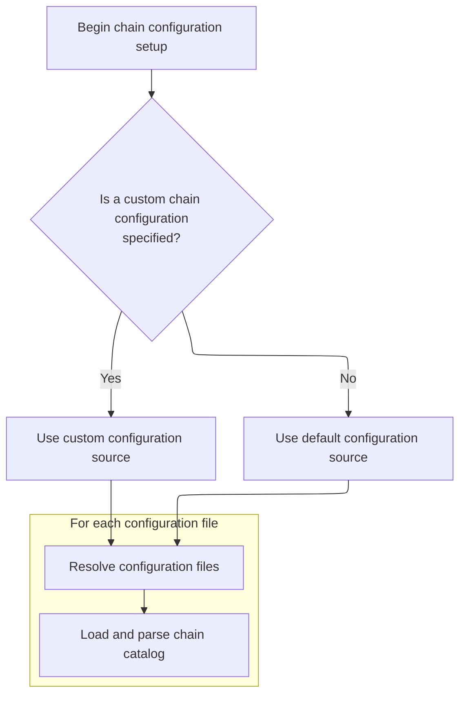

<SwmSnippet path="/core/src/main/java/org/apache/struts/action/ActionServlet.java" line="1720">

---

In <SwmToken path="core/src/main/java/org/apache/struts/action/ActionServlet.java" pos="1720:5:5" line-data="    protected void initChain()">`initChain`</SwmToken>, the servlet grabs <SwmToken path="core/src/main/java/org/apache/struts/action/ActionServlet.java" pos="1726:12:12" line-data="            value = getServletConfig().getInitParameter(&quot;chainConfig&quot;);">`chainConfig`</SwmToken>, resolves paths, and uses <SwmToken path="core/src/main/java/org/apache/struts/action/ActionServlet.java" pos="1732:1:1" line-data="            ConfigParser parser = new ConfigParser();">`ConfigParser`</SwmToken> to parse each chain configuration file. This sets up the processing chains, and parsing is needed before moving on to Tiles XML parsing for layout definitions.

```java
    protected void initChain()
        throws ServletException {
        // Parse the configuration file specified by path or resource
        try {
            String value;

            value = getServletConfig().getInitParameter("chainConfig");

            if (value != null) {
                chainConfig = value;
            }

            ConfigParser parser = new ConfigParser();
            List urls = splitAndResolvePaths(chainConfig);
            URL resource;

            for (Iterator i = urls.iterator(); i.hasNext();) {
                resource = (URL) i.next();
                log.info("Loading chain catalog from " + resource);
                parser.parse(resource);
            }
```

---

</SwmSnippet>

<SwmSnippet path="/core/src/main/java/org/apache/struts/action/ActionServlet.java" line="1741">

---

After parsing chain configs, <SwmToken path="core/src/main/java/org/apache/struts/action/ActionServlet.java" pos="350:1:1" line-data="            initChain();">`initChain`</SwmToken> catches any exceptions, logs them, and throws a <SwmToken path="core/src/main/java/org/apache/struts/action/ActionServlet.java" pos="1743:5:5" line-data="            throw new ServletException(e);">`ServletException`</SwmToken> if something goes wrong. This prevents the servlet from continuing with a broken chain setup.

```java
        } catch (Exception e) {
            log.error("Exception loading resources", e);
            throw new ServletException(e);
        }
    }
```

---

</SwmSnippet>

## Registering the <SwmToken path="core/src/main/java/org/apache/struts/action/ActionServlet.java" pos="400:14:14" line-data="            log.error(&quot;Unable to initialize Struts ActionServlet due to an &quot;">`ActionServlet`</SwmToken> and Module Config Factory

<SwmSnippet path="/core/src/main/java/org/apache/struts/action/ActionServlet.java" line="352">

---

Just returned from <SwmToken path="core/src/main/java/org/apache/struts/action/ActionServlet.java" pos="350:1:1" line-data="            initChain();">`initChain`</SwmToken>, ActionServlet.init stores itself in the servlet context and calls <SwmToken path="core/src/main/java/org/apache/struts/action/ActionServlet.java" pos="353:1:1" line-data="            initModuleConfigFactory();">`initModuleConfigFactory`</SwmToken> to set up the factory class for module configuration. This enables modular initialization based on config prefixes.

```java
            getServletContext().setAttribute(Globals.ACTION_SERVLET_KEY, this);
            initModuleConfigFactory();

```

---

</SwmSnippet>

## Configuring the <SwmToken path="core/src/main/java/org/apache/struts/action/ActionServlet.java" pos="356:1:1" line-data="            ModuleConfig moduleConfig = initModuleConfig(&quot;&quot;, config);">`ModuleConfig`</SwmToken> Factory

<SwmSnippet path="/core/src/main/java/org/apache/struts/action/ActionServlet.java" line="663">

---

InitModuleConfigFactory checks for a <SwmToken path="core/src/main/java/org/apache/struts/action/ActionServlet.java" pos="664:3:3" line-data="        String configFactory =">`configFactory`</SwmToken> parameter and sets the factory class if present. This lets the servlet use a custom implementation for module configuration.

```java
    protected void initModuleConfigFactory() {
        String configFactory =
            getServletConfig().getInitParameter("configFactory");

        if (configFactory != null) {
            ModuleConfigFactory.setFactoryClass(configFactory);
        }
    }
```

---

</SwmSnippet>

<SwmSnippet path="/core/src/main/java/org/apache/struts/config/ModuleConfigFactory.java" line="81">

---

SetFactoryClass just assigns the <SwmToken path="core/src/main/java/org/apache/struts/config/ModuleConfigFactory.java" pos="81:11:11" line-data="    public static void setFactoryClass(String factoryClass) {">`factoryClass`</SwmToken> string and resets clazz to null. This clears any cached class reference so the new factory class is loaded on demand.

```java
    public static void setFactoryClass(String factoryClass) {
        ModuleConfigFactory.factoryClass = factoryClass;
        ModuleConfigFactory.clazz = null;
    }
```

---

</SwmSnippet>

## Initializing Module Configurations

<SwmSnippet path="/core/src/main/java/org/apache/struts/action/ActionServlet.java" line="355">

---

Just returned from <SwmToken path="core/src/main/java/org/apache/struts/action/ActionServlet.java" pos="353:1:1" line-data="            initModuleConfigFactory();">`initModuleConfigFactory`</SwmToken>, ActionServlet.init calls <SwmToken path="core/src/main/java/org/apache/struts/action/ActionServlet.java" pos="356:7:7" line-data="            ModuleConfig moduleConfig = initModuleConfig(&quot;&quot;, config);">`initModuleConfig`</SwmToken> for each module prefix found in the servlet init parameters. This sets up separate configurations for each module, supporting modular initialization.

```java
            // Initialize modules as needed
            ModuleConfig moduleConfig = initModuleConfig("", config);

```

---

</SwmSnippet>

## Creating <SwmToken path="core/src/main/java/org/apache/struts/action/ActionServlet.java" pos="356:1:1" line-data="            ModuleConfig moduleConfig = initModuleConfig(&quot;&quot;, config);">`ModuleConfig`</SwmToken> Instances

<SwmSnippet path="/core/src/main/java/org/apache/struts/action/ActionServlet.java" line="683">

---

In <SwmToken path="core/src/main/java/org/apache/struts/action/ActionServlet.java" pos="683:5:5" line-data="    protected ModuleConfig initModuleConfig(String prefix, String paths)">`initModuleConfig`</SwmToken>, the servlet uses <SwmToken path="core/src/main/java/org/apache/struts/action/ActionServlet.java" pos="691:7:9" line-data="        ModuleConfigFactory factoryObject = ModuleConfigFactory.createFactory();">`ModuleConfigFactory.createFactory`</SwmToken> to get a factory instance for creating module configs. This lets the servlet support custom module setups.

```java
    protected ModuleConfig initModuleConfig(String prefix, String paths)
        throws ServletException {
        if (log.isDebugEnabled()) {
            log.debug("Initializing module path '" + prefix
                + "' configuration from '" + paths + "'");
        }

        // Parse the configuration for this module
        ModuleConfigFactory factoryObject = ModuleConfigFactory.createFactory();
```

---

</SwmSnippet>

<SwmSnippet path="/core/src/main/java/org/apache/struts/config/ModuleConfigFactory.java" line="94">

---

CreateFactory checks if clazz is set, loads it using <SwmToken path="core/src/main/java/org/apache/struts/config/ModuleConfigFactory.java" pos="99:9:9" line-data="                clazz = RequestUtils.applicationClass(factoryClass);">`factoryClass`</SwmToken> if not, and instantiates the factory via reflection. This lets the servlet dynamically create the factory instance for module configs.

```java
    public static ModuleConfigFactory createFactory() {
        ModuleConfigFactory factory = null;

        try {
            if (clazz == null) {
                clazz = RequestUtils.applicationClass(factoryClass);
            }

            factory = (ModuleConfigFactory) clazz.newInstance();
        } catch (ClassNotFoundException e) {
            LOG.error("ModuleConfigFactory.createFactory()", e);
        } catch (InstantiationException e) {
            LOG.error("ModuleConfigFactory.createFactory()", e);
        } catch (IllegalAccessException e) {
            LOG.error("ModuleConfigFactory.createFactory()", e);
        }

        return factory;
    }
```

---

</SwmSnippet>

<SwmSnippet path="/core/src/main/java/org/apache/struts/action/ActionServlet.java" line="692">

---

Just returned from <SwmToken path="core/src/main/java/org/apache/struts/action/ActionServlet.java" pos="691:9:9" line-data="        ModuleConfigFactory factoryObject = ModuleConfigFactory.createFactory();">`createFactory`</SwmToken>, ActionServlet.initModuleConfig calls <SwmToken path="core/src/main/java/org/apache/struts/action/ActionServlet.java" pos="692:9:9" line-data="        ModuleConfig config = factoryObject.createModuleConfig(prefix);">`createModuleConfig`</SwmToken> to get the config object, then sets up a Digester instance for parsing module config files.

```java
        ModuleConfig config = factoryObject.createModuleConfig(prefix);

        // Configure the Digester instance we will use
        Digester digester = initConfigDigester();

```

---

</SwmSnippet>

### Configuring the Digester for Module Parsing

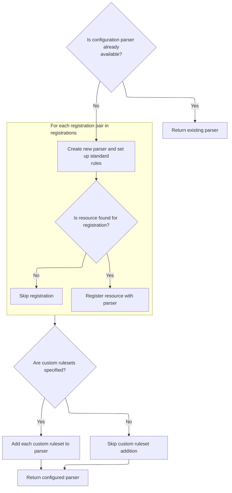

<SwmSnippet path="/core/src/main/java/org/apache/struts/action/ActionServlet.java" line="1599">

---

In <SwmToken path="core/src/main/java/org/apache/struts/action/ActionServlet.java" pos="1599:5:5" line-data="    protected Digester initConfigDigester()">`initConfigDigester`</SwmToken>, the servlet checks for an existing Digester, creates one if needed, sets namespace awareness, validation, context class loader, adds <SwmToken path="core/src/main/java/org/apache/struts/action/ActionServlet.java" pos="1612:7:7" line-data="        configDigester.addRuleSet(new ConfigRuleSet());">`ConfigRuleSet`</SwmToken>, registers <SwmToken path="core/src/main/java/org/apache/struts/action/ActionServlet.java" pos="1793:13:13" line-data="     * tag to generate correct destination URLs for form submissions.&lt;/p&gt;">`URLs`</SwmToken> from the registrations array, and preps for adding more rule sets. This configures XML parsing for module setup.

```java
    protected Digester initConfigDigester()
        throws ServletException {
        // :FIXME: Where can ServletException be thrown?
        // Do we have an existing instance?
        if (configDigester != null) {
            return (configDigester);
        }

        // Create a new Digester instance with standard capabilities
        configDigester = new Digester();
        configDigester.setNamespaceAware(true);
        configDigester.setValidating(this.isValidating());
        configDigester.setUseContextClassLoader(true);
        configDigester.addRuleSet(new ConfigRuleSet());

        for (int i = 0; i < registrations.length; i += 2) {
            URL url = this.getClass().getResource(registrations[i + 1]);

            if (url != null) {
                configDigester.register(registrations[i], url.toString());
            }
        }

```

---

</SwmSnippet>

<SwmSnippet path="/core/src/main/java/org/apache/struts/action/ActionServlet.java" line="1622">

---

After setting up the Digester, <SwmToken path="core/src/main/java/org/apache/struts/action/ActionServlet.java" pos="695:7:7" line-data="        Digester digester = initConfigDigester();">`initConfigDigester`</SwmToken> calls <SwmToken path="core/src/main/java/org/apache/struts/action/ActionServlet.java" pos="1622:3:3" line-data="        this.addRuleSets();">`addRuleSets`</SwmToken> to add any custom rule sets. This extends the parsing logic for Struts XML configs before returning the Digester.

```java
        this.addRuleSets();

        // Return the completely configured Digester instance
        return (configDigester);
    }
```

---

</SwmSnippet>

<SwmSnippet path="/core/src/main/java/org/apache/struts/action/ActionServlet.java" line="1634">

---

AddRuleSets reads the 'rulesets' init parameter, parses class names, instantiates each <SwmToken path="core/src/main/java/org/apache/struts/action/ActionServlet.java" pos="1663:1:1" line-data="                RuleSet instance =">`RuleSet`</SwmToken>, and adds them to the Digester. This lets the servlet handle custom XML parsing rules.

```java
    private void addRuleSets()
        throws ServletException {
        String rulesets = getServletConfig().getInitParameter("rulesets");

        if (rulesets == null) {
            rulesets = "";
        }

        rulesets = rulesets.trim();

        String ruleset;

        while (rulesets.length() > 0) {
            int comma = rulesets.indexOf(",");

            if (comma < 0) {
                ruleset = rulesets.trim();
                rulesets = "";
            } else {
                ruleset = rulesets.substring(0, comma).trim();
                rulesets = rulesets.substring(comma + 1).trim();
            }

            if (log.isDebugEnabled()) {
                log.debug("Configuring custom Digester Ruleset of type "
                    + ruleset);
            }

            try {
                RuleSet instance =
                    (RuleSet) RequestUtils.applicationInstance(ruleset);

                this.configDigester.addRuleSet(instance);
            } catch (Exception e) {
                log.error("Exception configuring custom Digester RuleSet", e);
                throw new ServletException(e);
            }
        }
```

---

</SwmSnippet>

### Parsing Module Configuration Files

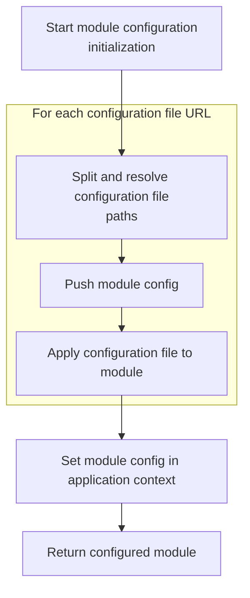

<SwmSnippet path="/core/src/main/java/org/apache/struts/action/ActionServlet.java" line="697">

---

Just returned from <SwmToken path="core/src/main/java/org/apache/struts/action/ActionServlet.java" pos="695:7:7" line-data="        Digester digester = initConfigDigester();">`initConfigDigester`</SwmToken>, ActionServlet.initModuleConfig resolves config file <SwmToken path="core/src/main/java/org/apache/struts/action/ActionServlet.java" pos="1793:13:13" line-data="     * tag to generate correct destination URLs for form submissions.&lt;/p&gt;">`URLs`</SwmToken>, pushes the config onto the Digester stack, and parses each file. This lets the servlet handle multiple config sources for modular setup.

```java
        List urls = splitAndResolvePaths(paths);
        URL url;

        for (Iterator i = urls.iterator(); i.hasNext();) {
            url = (URL) i.next();
            digester.push(config);
            this.parseModuleConfigFile(digester, url);
        }

```

---

</SwmSnippet>

<SwmSnippet path="/core/src/main/java/org/apache/struts/action/ActionServlet.java" line="750">

---

ParseModuleConfigFile calls <SwmToken path="core/src/main/java/org/apache/struts/action/ActionServlet.java" pos="754:1:3" line-data="            digester.parse(url);">`digester.parse`</SwmToken> on each config file URL, updating the module config object. Errors are handled and logged, prepping for Tiles XML parsing if needed.

```java
    protected void parseModuleConfigFile(Digester digester, URL url)
        throws UnavailableException {

        try {
            digester.parse(url);
        } catch (IOException e) {
            handleConfigException(url.toString(), e);
        } catch (SAXException e) {
            handleConfigException(url.toString(), e);
        }
    }
```

---

</SwmSnippet>

<SwmSnippet path="/core/src/main/java/org/apache/struts/action/ActionServlet.java" line="706">

---

After parsing config files, <SwmToken path="core/src/main/java/org/apache/struts/action/ActionServlet.java" pos="356:7:7" line-data="            ModuleConfig moduleConfig = initModuleConfig(&quot;&quot;, config);">`initModuleConfig`</SwmToken> stores the module config in the servlet context for access by other components, then returns it.

```java
        getServletContext().setAttribute(Globals.MODULE_KEY
            + config.getPrefix(), config);

        return config;
    }
```

---

</SwmSnippet>

## Initializing Module Message Resources

<SwmSnippet path="/core/src/main/java/org/apache/struts/action/ActionServlet.java" line="358">

---

Just returned from <SwmToken path="core/src/main/java/org/apache/struts/action/ActionServlet.java" pos="356:7:7" line-data="            ModuleConfig moduleConfig = initModuleConfig(&quot;&quot;, config);">`initModuleConfig`</SwmToken>, ActionServlet.init calls <SwmToken path="core/src/main/java/org/apache/struts/action/ActionServlet.java" pos="358:1:1" line-data="            initModuleMessageResources(moduleConfig);">`initModuleMessageResources`</SwmToken> to set up message resources for the module. This follows Struts' initialization sequence before freezing the config.

```java
            initModuleMessageResources(moduleConfig);
```

---

</SwmSnippet>

## Finding Message Resource Configurations

<SwmSnippet path="/core/src/main/java/org/apache/struts/action/ActionServlet.java" line="1551">

---

In <SwmToken path="core/src/main/java/org/apache/struts/action/ActionServlet.java" pos="1551:5:5" line-data="    protected void initModuleMessageResources(ModuleConfig config)">`initModuleMessageResources`</SwmToken>, the servlet calls <SwmToken path="core/src/main/java/org/apache/struts/action/ActionServlet.java" pos="1553:11:11" line-data="        MessageResourcesConfig[] mrcs = config.findMessageResourcesConfigs();">`findMessageResourcesConfigs`</SwmToken> to get all message resource configs for the module, prepping them for initialization.

```java
    protected void initModuleMessageResources(ModuleConfig config)
        throws ServletException {
        MessageResourcesConfig[] mrcs = config.findMessageResourcesConfigs();

```

---

</SwmSnippet>

<SwmSnippet path="/core/src/main/java/org/apache/struts/config/impl/ModuleConfigImpl.java" line="590">

---

FindMessageResourcesConfigs converts the <SwmToken path="core/src/main/java/org/apache/struts/config/impl/ModuleConfigImpl.java" pos="592:5:5" line-data="            new MessageResourcesConfig[messageResources.size()];">`messageResources`</SwmToken> collection to a <SwmToken path="core/src/main/java/org/apache/struts/config/impl/ModuleConfigImpl.java" pos="590:3:3" line-data="    public MessageResourcesConfig[] findMessageResourcesConfigs() {">`MessageResourcesConfig`</SwmToken> array. The cast assumes all values are of the right type.

```java
    public MessageResourcesConfig[] findMessageResourcesConfigs() {
        MessageResourcesConfig[] results =
            new MessageResourcesConfig[messageResources.size()];

        return ((MessageResourcesConfig[]) messageResources.values().toArray(results));
    }
```

---

</SwmSnippet>

<SwmSnippet path="/core/src/main/java/org/apache/struts/action/ActionServlet.java" line="1555">

---

Just returned from <SwmToken path="core/src/main/java/org/apache/struts/action/ActionServlet.java" pos="1553:11:11" line-data="        MessageResourcesConfig[] mrcs = config.findMessageResourcesConfigs();">`findMessageResourcesConfigs`</SwmToken>, <SwmToken path="core/src/main/java/org/apache/struts/action/ActionServlet.java" pos="358:1:1" line-data="            initModuleMessageResources(moduleConfig);">`initModuleMessageResources`</SwmToken> loops through each config, skips incomplete ones, and calls <SwmToken path="core/src/main/java/org/apache/struts/action/ActionServlet.java" pos="1561:1:1" line-data="            postProcessConfig(mrcs[i], config, true);">`postProcessConfig`</SwmToken> for plugin processing before initializing resources.

```java
        for (int i = 0; i < mrcs.length; i++) {
            if ((mrcs[i].getFactory() == null)
                || (mrcs[i].getParameter() == null)) {
                continue;
            }

            postProcessConfig(mrcs[i], config, true);
            if (log.isDebugEnabled()) {
                log.debug("Initializing module path '" + config.getPrefix()
                    + "' message resources from '" + mrcs[i].getParameter()
                    + "'");
            }

```

---

</SwmSnippet>

### Processing Module PlugIns

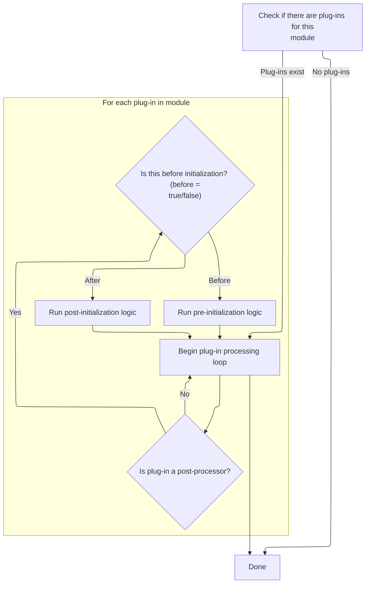

<SwmSnippet path="/core/src/main/java/org/apache/struts/action/ActionServlet.java" line="1992">

---

In <SwmToken path="core/src/main/java/org/apache/struts/action/ActionServlet.java" pos="1992:5:5" line-data="    private void postProcessConfig(BaseConfig config, ModuleConfig moduleConfig, ">`postProcessConfig`</SwmToken>, the servlet grabs module plugins for the given config so they can process it before or after initialization.

```java
    private void postProcessConfig(BaseConfig config, ModuleConfig moduleConfig, 
            boolean before) {
        PlugIn[] plugIns = getModulePlugIns(moduleConfig);
        if ((plugIns == null) || (plugIns.length == 0)) {
            return;
        }

```

---

</SwmSnippet>

<SwmSnippet path="/core/src/main/java/org/apache/struts/action/ActionServlet.java" line="1974">

---

GetModulePlugIns builds a key from the module prefix, fetches the plugin array from the servlet context, and returns it. <SwmToken path="core/src/main/java/org/apache/struts/action/ActionServlet.java" pos="1978:6:6" line-data="        } catch (NullPointerException e) {">`NullPointerException`</SwmToken> is caught and returns null if needed.

```java
    private PlugIn[] getModulePlugIns(ModuleConfig moduleConfig) {
        try {
            String plugInKey = Globals.PLUG_INS_KEY + moduleConfig.getPrefix(); 
            return (PlugIn[]) getServletContext().getAttribute(plugInKey);
        } catch (NullPointerException e) {
            return null;
        }
    }
```

---

</SwmSnippet>

<SwmSnippet path="/core/src/main/java/org/apache/struts/action/ActionServlet.java" line="1999">

---

After getting plugins, <SwmToken path="core/src/main/java/org/apache/struts/action/ActionServlet.java" pos="364:1:1" line-data="            postProcessConfig(moduleConfig);">`postProcessConfig`</SwmToken> loops through them, and if they're <SwmToken path="core/src/main/java/org/apache/struts/action/ActionServlet.java" pos="2001:8:8" line-data="            if (plugIn instanceof ModuleConfigPostProcessor) {">`ModuleConfigPostProcessor`</SwmToken>, calls their before/after methods as needed.

```java
        for (int i = 0; i < plugIns.length; i++) {
            PlugIn plugIn = plugIns[i];
            if (plugIn instanceof ModuleConfigPostProcessor) {
                ModuleConfigPostProcessor p = (ModuleConfigPostProcessor) plugIn;
                if (before) {
                    p.postProcessBeforeInitialization(config, moduleConfig);
                } else {
                    p.postProcessAfterInitialization(config, moduleConfig);
                }
            }
        }
```

---

</SwmSnippet>

### Creating and Registering Message Resources

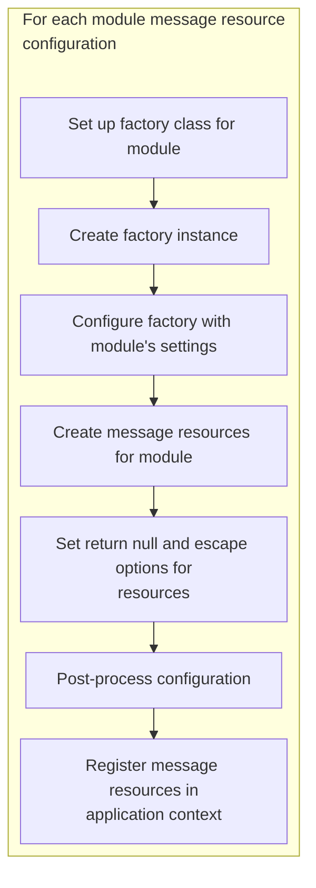

<SwmSnippet path="/core/src/main/java/org/apache/struts/action/ActionServlet.java" line="1568">

---

Just returned from <SwmToken path="core/src/main/java/org/apache/struts/action/ActionServlet.java" pos="364:1:1" line-data="            postProcessConfig(moduleConfig);">`postProcessConfig`</SwmToken>, <SwmToken path="core/src/main/java/org/apache/struts/action/ActionServlet.java" pos="358:1:1" line-data="            initModuleMessageResources(moduleConfig);">`initModuleMessageResources`</SwmToken> sets the factory class for each config, creates the factory, and preps for resource instantiation.

```java
            String factory = mrcs[i].getFactory();

            MessageResourcesFactory.setFactoryClass(factory);

            MessageResourcesFactory factoryObject =
                MessageResourcesFactory.createFactory();

```

---

</SwmSnippet>

<SwmSnippet path="/core/src/main/java/org/apache/struts/action/ActionServlet.java" line="1575">

---

After creating and configuring resources, <SwmToken path="core/src/main/java/org/apache/struts/action/ActionServlet.java" pos="358:1:1" line-data="            initModuleMessageResources(moduleConfig);">`initModuleMessageResources`</SwmToken> calls <SwmToken path="core/src/main/java/org/apache/struts/action/ActionServlet.java" pos="1583:1:1" line-data="            postProcessConfig(mrcs[i], config, false);">`postProcessConfig`</SwmToken> again for plugin processing, then registers the resources in the servlet context.

```java
            factoryObject.setConfig(mrcs[i]);

            MessageResources resources =
                factoryObject.createResources(mrcs[i].getParameter());

            resources.setReturnNull(mrcs[i].getNull());
            resources.setEscape(mrcs[i].isEscape());

            postProcessConfig(mrcs[i], config, false);
            getServletContext().setAttribute(mrcs[i].getKey()
                + config.getPrefix(), resources);
        }
    }
```

---

</SwmSnippet>

## Plug-In Initialization for the Module

<SwmSnippet path="/core/src/main/java/org/apache/struts/action/ActionServlet.java" line="359">

---

Just returned from ActionServlet.initModuleMessageResources, now ActionServlet.init calls <SwmToken path="core/src/main/java/org/apache/struts/action/ActionServlet.java" pos="359:1:1" line-data="            initModulePlugIns(moduleConfig);">`initModulePlugIns`</SwmToken> to set up plug-ins for the module. Plug-ins are initialized here because they might need access to message resources or other module configs. This step ensures plug-ins are ready and registered in the servlet context before moving on.

```java
            initModulePlugIns(moduleConfig);
```

---

</SwmSnippet>

## Instantiating and Configuring Plug-In Instances

<SwmSnippet path="/core/src/main/java/org/apache/struts/action/ActionServlet.java" line="847">

---

In <SwmToken path="core/src/main/java/org/apache/struts/action/ActionServlet.java" pos="847:5:5" line-data="    protected void initModulePlugIns(ModuleConfig config)">`initModulePlugIns`</SwmToken>, the servlet grabs <SwmToken path="core/src/main/java/org/apache/struts/config/impl/ModuleConfigImpl.java" pos="111:14:16" line-data="     * &lt;p&gt;The set of configured plug-in Actions for this module, if any, in">`plug-in`</SwmToken> configs from the module, creates an array for <SwmToken path="core/src/main/java/org/apache/struts/config/impl/ModuleConfigImpl.java" pos="111:14:16" line-data="     * &lt;p&gt;The set of configured plug-in Actions for this module, if any, in">`plug-in`</SwmToken> instances, and stores it in the servlet context. For each <SwmToken path="core/src/main/java/org/apache/struts/config/impl/ModuleConfigImpl.java" pos="111:14:16" line-data="     * &lt;p&gt;The set of configured plug-in Actions for this module, if any, in">`plug-in`</SwmToken> config, it uses <SwmToken path="core/src/main/java/org/apache/struts/action/ActionServlet.java" pos="863:5:7" line-data="                    (PlugIn) RequestUtils.applicationInstance(plugInConfigs[i]">`RequestUtils.applicationInstance`</SwmToken> to instantiate the <SwmToken path="core/src/main/java/org/apache/struts/config/impl/ModuleConfigImpl.java" pos="111:14:16" line-data="     * &lt;p&gt;The set of configured plug-in Actions for this module, if any, in">`plug-in`</SwmToken> class by name, then <SwmToken path="core/src/main/java/org/apache/struts/action/ActionServlet.java" pos="865:1:3" line-data="                BeanUtils.populate(plugIns[i], plugInConfigs[i].getProperties());">`BeanUtils.populate`</SwmToken> to set properties from the config. This lets the framework handle plug-ins flexibly and apply config properties dynamically. Next, we call <SwmToken path="core/src/main/java/org/apache/struts/action/ActionServlet.java" pos="863:5:5" line-data="                    (PlugIn) RequestUtils.applicationInstance(plugInConfigs[i]">`RequestUtils`</SwmToken> to handle the instantiation and property setup.

```java
    protected void initModulePlugIns(ModuleConfig config)
        throws ServletException {
        if (log.isDebugEnabled()) {
            log.debug("Initializing module path '" + config.getPrefix()
                + "' plug ins");
        }

        PlugInConfig[] plugInConfigs = config.findPlugInConfigs();
        PlugIn[] plugIns = new PlugIn[plugInConfigs.length];

        getServletContext().setAttribute(Globals.PLUG_INS_KEY
            + config.getPrefix(), plugIns);

        for (int i = 0; i < plugIns.length; i++) {
            try {
                plugIns[i] =
                    (PlugIn) RequestUtils.applicationInstance(plugInConfigs[i]
                        .getClassName());
                BeanUtils.populate(plugIns[i], plugInConfigs[i].getProperties());

```

---

</SwmSnippet>

### Populating Plug-In Properties

See <SwmLink doc-title="Populating Redirects with Request Parameters">[Populating Redirects with Request Parameters](/.swm/populating-redirects-with-request-parameters.1ejm4mfb.sw.md)</SwmLink>

### Passing Plug-In Config Objects

```mermaid
%%{init: {"flowchart": {"defaultRenderer": "elk"}} }%%
flowchart TD
    node1["Start plug-in initialization"]
    click node1 openCode "core/src/main/java/org/apache/struts/action/ActionServlet.java:867:867"
    subgraph loop1["For each plug-in"]
        node2{"Can plug-in receive configuration?"}
        click node2 openCode "core/src/main/java/org/apache/struts/action/ActionServlet.java:870:889"
        node2 -->|"Yes"| node3["Set configuration property with plug-in
configuration object"]
        click node3 openCode "core/src/main/java/org/apache/struts/action/ActionServlet.java:871:872"
        node2 -->|"No"| node4["Skip setting property"]
        click node4 openCode "core/src/main/java/org/apache/struts/action/ActionServlet.java:873:889"
        node3 --> node5["Initialize plug-in"]
        click node5 openCode "core/src/main/java/org/apache/struts/action/ActionServlet.java:891:891"
        node4 --> node5
    end
    node5 --> node6["All plug-ins initialized"]
    click node6 openCode "core/src/main/java/org/apache/struts/action/ActionServlet.java:892:905"

classDef HeadingStyle fill:#777777,stroke:#333,stroke-width:2px;

%% Swimm:
%% %%{init: {"flowchart": {"defaultRenderer": "elk"}} }%%
%% flowchart TD
%%     node1["Start <SwmToken path="core/src/main/java/org/apache/struts/config/impl/ModuleConfigImpl.java" pos="111:14:16" line-data="     * &lt;p&gt;The set of configured plug-in Actions for this module, if any, in">`plug-in`</SwmToken> initialization"]
%%     click node1 openCode "<SwmPath>[core/…/action/ActionServlet.java](core/src/main/java/org/apache/struts/action/ActionServlet.java)</SwmPath>:867:867"
%%     subgraph loop1["For each <SwmToken path="core/src/main/java/org/apache/struts/config/impl/ModuleConfigImpl.java" pos="111:14:16" line-data="     * &lt;p&gt;The set of configured plug-in Actions for this module, if any, in">`plug-in`</SwmToken>"]
%%         node2{"Can <SwmToken path="core/src/main/java/org/apache/struts/config/impl/ModuleConfigImpl.java" pos="111:14:16" line-data="     * &lt;p&gt;The set of configured plug-in Actions for this module, if any, in">`plug-in`</SwmToken> receive configuration?"}
%%         click node2 openCode "<SwmPath>[core/…/action/ActionServlet.java](core/src/main/java/org/apache/struts/action/ActionServlet.java)</SwmPath>:870:889"
%%         node2 -->|"Yes"| node3["Set configuration property with <SwmToken path="core/src/main/java/org/apache/struts/config/impl/ModuleConfigImpl.java" pos="111:14:16" line-data="     * &lt;p&gt;The set of configured plug-in Actions for this module, if any, in">`plug-in`</SwmToken>
%% configuration object"]
%%         click node3 openCode "<SwmPath>[core/…/action/ActionServlet.java](core/src/main/java/org/apache/struts/action/ActionServlet.java)</SwmPath>:871:872"
%%         node2 -->|"No"| node4["Skip setting property"]
%%         click node4 openCode "<SwmPath>[core/…/action/ActionServlet.java](core/src/main/java/org/apache/struts/action/ActionServlet.java)</SwmPath>:873:889"
%%         node3 --> node5["Initialize <SwmToken path="core/src/main/java/org/apache/struts/config/impl/ModuleConfigImpl.java" pos="111:14:16" line-data="     * &lt;p&gt;The set of configured plug-in Actions for this module, if any, in">`plug-in`</SwmToken>"]
%%         click node5 openCode "<SwmPath>[core/…/action/ActionServlet.java](core/src/main/java/org/apache/struts/action/ActionServlet.java)</SwmPath>:891:891"
%%         node4 --> node5
%%     end
%%     node5 --> node6["All plug-ins initialized"]
%%     click node6 openCode "<SwmPath>[core/…/action/ActionServlet.java](core/src/main/java/org/apache/struts/action/ActionServlet.java)</SwmPath>:892:905"
%% 
%% classDef HeadingStyle fill:#777777,stroke:#333,stroke-width:2px;
```

<SwmSnippet path="/core/src/main/java/org/apache/struts/action/ActionServlet.java" line="867">

---

Just returned from <SwmToken path="core/src/main/java/org/apache/struts/action/ActionServlet.java" pos="615:5:5" line-data="                    (RequestProcessor) RequestUtils.applicationInstance(config.getControllerConfig()">`RequestUtils`</SwmToken>, now <SwmToken path="core/src/main/java/org/apache/struts/action/ActionServlet.java" pos="359:1:1" line-data="            initModulePlugIns(moduleConfig);">`initModulePlugIns`</SwmToken> tries to set <SwmToken path="core/src/main/java/org/apache/struts/action/ActionServlet.java" pos="872:2:2" line-data="                        &quot;currentPlugInConfigObject&quot;, plugInConfigs[i]);">`currentPlugInConfigObject`</SwmToken> on each <SwmToken path="core/src/main/java/org/apache/struts/config/impl/ModuleConfigImpl.java" pos="111:14:16" line-data="     * &lt;p&gt;The set of configured plug-in Actions for this module, if any, in">`plug-in`</SwmToken> instance if the property exists. This is needed for plug-ins like Tiles that require access to their config object. Exceptions are caught and ignored here because some containers restrict property access, so the flow continues even if the property can't be set. After this, the <SwmToken path="core/src/main/java/org/apache/struts/config/impl/ModuleConfigImpl.java" pos="111:14:16" line-data="     * &lt;p&gt;The set of configured plug-in Actions for this module, if any, in">`plug-in`</SwmToken> is initialized with the servlet and module config.

```java
                // Pass the current plugIn config object to the PlugIn.
                // The property is set only if the plugin declares it.
                // This plugin config object is needed by Tiles
                try {
                    PropertyUtils.setProperty(plugIns[i],
                        "currentPlugInConfigObject", plugInConfigs[i]);
                } catch (Exception e) {
                    ;

                    // FIXME Whenever we fail silently, we must document a valid
                    // reason for doing so.  Why should we fail silently if a
                    // property can't be set on the plugin?

                    /**
                     * Between version 1.138-1.140 cedric made these changes.
                     * The exceptions are caught to deal with containers
                     * applying strict security. This was in response to bug
                     * #15736
                     *
                     * Recommend that we make the currentPlugInConfigObject part
                     * of the PlugIn Interface if we can, Rob
                     */
                }

                plugIns[i].init(this, config);
```

---

</SwmSnippet>

<SwmSnippet path="/core/src/main/java/org/apache/struts/action/ActionServlet.java" line="892">

---

Just returned from ActionServlet.init, now at the end of <SwmToken path="core/src/main/java/org/apache/struts/action/ActionServlet.java" pos="359:1:1" line-data="            initModulePlugIns(moduleConfig);">`initModulePlugIns`</SwmToken>, any exceptions during <SwmToken path="core/src/main/java/org/apache/struts/config/impl/ModuleConfigImpl.java" pos="111:14:16" line-data="     * &lt;p&gt;The set of configured plug-in Actions for this module, if any, in">`plug-in`</SwmToken> initialization are logged and wrapped in <SwmToken path="core/src/main/java/org/apache/struts/action/ActionServlet.java" pos="900:1:1" line-data="                UnavailableException e2 = new UnavailableException(errMsg);">`UnavailableException`</SwmToken>. If a <SwmToken path="core/src/main/java/org/apache/struts/config/impl/ModuleConfigImpl.java" pos="111:14:16" line-data="     * &lt;p&gt;The set of configured plug-in Actions for this module, if any, in">`plug-in`</SwmToken> fails, the servlet stops, so only fully initialized modules are available. This keeps the module setup consistent and avoids partial initialization.

```java
            } catch (ServletException e) {
                throw e;
            } catch (Exception e) {
                String errMsg =
                    internal.getMessage("plugIn.init",
                        plugInConfigs[i].getClassName());

                log(errMsg, e);
                UnavailableException e2 = new UnavailableException(errMsg);
                e2.initCause(e);
                throw e2;
            }
        }
    }
```

---

</SwmSnippet>

## Form Bean Setup for the Module

<SwmSnippet path="/core/src/main/java/org/apache/struts/action/ActionServlet.java" line="360">

---

Just returned from <SwmToken path="core/src/main/java/org/apache/struts/action/ActionServlet.java" pos="359:1:1" line-data="            initModulePlugIns(moduleConfig);">`initModulePlugIns`</SwmToken>, now ActionServlet.init calls <SwmToken path="core/src/main/java/org/apache/struts/action/ActionServlet.java" pos="360:1:1" line-data="            initModuleFormBeans(moduleConfig);">`initModuleFormBeans`</SwmToken> to set up form beans for the module. This step comes after plug-ins so any <SwmToken path="core/src/main/java/org/apache/struts/config/impl/ModuleConfigImpl.java" pos="111:14:16" line-data="     * &lt;p&gt;The set of configured plug-in Actions for this module, if any, in">`plug-in`</SwmToken> modifications are in place before form beans are processed.

```java
            initModuleFormBeans(moduleConfig);
```

---

</SwmSnippet>

## Initializing Form Bean Configurations

<SwmSnippet path="/core/src/main/java/org/apache/struts/action/ActionServlet.java" line="914">

---

In <SwmToken path="core/src/main/java/org/apache/struts/action/ActionServlet.java" pos="914:5:5" line-data="    protected void initModuleFormBeans(ModuleConfig config)">`initModuleFormBeans`</SwmToken>, the servlet loops through form bean configs and calls <SwmToken path="core/src/main/java/org/apache/struts/action/ActionServlet.java" pos="927:1:1" line-data="            postProcessConfig(beanConfig, config, true);">`postProcessConfig`</SwmToken> for each one. This lets plug-ins or extensions modify the config before any further setup. Next, <SwmToken path="core/src/main/java/org/apache/struts/action/ActionServlet.java" pos="928:1:1" line-data="            processFormBeanExtension(beanConfig, config);">`processFormBeanExtension`</SwmToken> is called to handle form bean inheritance or extension logic.

```java
    protected void initModuleFormBeans(ModuleConfig config)
        throws ServletException {
        if (log.isDebugEnabled()) {
            log.debug("Initializing module path '" + config.getPrefix()
                + "' form beans");
        }

        // Process form bean extensions.
        FormBeanConfig[] formBeans = config.findFormBeanConfigs();

        for (int i = 0; i < formBeans.length; i++) {
            FormBeanConfig beanConfig = formBeans[i];

            postProcessConfig(beanConfig, config, true);
```

---

</SwmSnippet>

<SwmSnippet path="/core/src/main/java/org/apache/struts/action/ActionServlet.java" line="928">

---

Just returned from <SwmToken path="core/src/main/java/org/apache/struts/action/ActionServlet.java" pos="364:1:1" line-data="            postProcessConfig(moduleConfig);">`postProcessConfig`</SwmToken>, now <SwmToken path="core/src/main/java/org/apache/struts/action/ActionServlet.java" pos="360:1:1" line-data="            initModuleFormBeans(moduleConfig);">`initModuleFormBeans`</SwmToken> calls <SwmToken path="core/src/main/java/org/apache/struts/action/ActionServlet.java" pos="928:1:1" line-data="            processFormBeanExtension(beanConfig, config);">`processFormBeanExtension`</SwmToken> for each form bean config. This handles inheritance or extension logic, letting form beans reuse or extend properties from others. After this, <SwmToken path="core/src/main/java/org/apache/struts/action/ActionServlet.java" pos="364:1:1" line-data="            postProcessConfig(moduleConfig);">`postProcessConfig`</SwmToken> is called again for final adjustments.

```java
            processFormBeanExtension(beanConfig, config);
```

---

</SwmSnippet>

### Applying Form Bean Inheritance

See <SwmLink doc-title="Form Bean Configuration Inheritance">[Form Bean Configuration Inheritance](/.swm/form-bean-configuration-inheritance.aob5sqvm.sw.md)</SwmLink>

### Validating and Registering Form Beans

```mermaid
%%{init: {"flowchart": {"defaultRenderer": "elk"}} }%%
flowchart TD
    node1["Start form bean initialization"]
    click node1 openCode "core/src/main/java/org/apache/struts/action/ActionServlet.java:929:930"
    
    subgraph loop1["For each form bean configuration"]
        node1 --> node2{"Is form bean type defined?"}
        click node2 openCode "core/src/main/java/org/apache/struts/action/ActionServlet.java:936:939"
        node2 -->|"No"| node3["Raise error: Form bean type required"]
        click node3 openCode "core/src/main/java/org/apache/struts/action/ActionServlet.java:937:939"
        node2 -->|"Yes"| node4["Validate properties"]
        click node4 openCode "core/src/main/java/org/apache/struts/action/ActionServlet.java:942:951"
        
        subgraph loop2["For each property in form bean"]
            node4 --> node5{"Is property type defined?"}
            click node5 openCode "core/src/main/java/org/apache/struts/action/ActionServlet.java:947:950"
            node5 -->|"No"| node6["Raise error: Property type required"]
            click node6 openCode "core/src/main/java/org/apache/struts/action/ActionServlet.java:948:950"
            node6 --> node5
            node5 -->|"Yes"| node4
        end
        node4 --> node7{"Is form bean dynamic?"}
        click node7 openCode "core/src/main/java/org/apache/struts/action/ActionServlet.java:955:957"
        node7 -->|"Yes"| node8["Register dynamic form bean"]
        click node8 openCode "core/src/main/java/org/apache/struts/action/ActionServlet.java:956:957"
        node8 --> node9["Next form bean"]
        click node9 openCode "core/src/main/java/org/apache/struts/action/ActionServlet.java:958:958"
        node7 -->|"No"| node9
    end
    node9 --> node10["End form bean initialization"]
    click node10 openCode "core/src/main/java/org/apache/struts/action/ActionServlet.java:959:959"

classDef HeadingStyle fill:#777777,stroke:#333,stroke-width:2px;

%% Swimm:
%% %%{init: {"flowchart": {"defaultRenderer": "elk"}} }%%
%% flowchart TD
%%     node1["Start form bean initialization"]
%%     click node1 openCode "<SwmPath>[core/…/action/ActionServlet.java](core/src/main/java/org/apache/struts/action/ActionServlet.java)</SwmPath>:929:930"
%%     
%%     subgraph loop1["For each form bean configuration"]
%%         node1 --> node2{"Is form bean type defined?"}
%%         click node2 openCode "<SwmPath>[core/…/action/ActionServlet.java](core/src/main/java/org/apache/struts/action/ActionServlet.java)</SwmPath>:936:939"
%%         node2 -->|"No"| node3["Raise error: Form bean type required"]
%%         click node3 openCode "<SwmPath>[core/…/action/ActionServlet.java](core/src/main/java/org/apache/struts/action/ActionServlet.java)</SwmPath>:937:939"
%%         node2 -->|"Yes"| node4["Validate properties"]
%%         click node4 openCode "<SwmPath>[core/…/action/ActionServlet.java](core/src/main/java/org/apache/struts/action/ActionServlet.java)</SwmPath>:942:951"
%%         
%%         subgraph loop2["For each property in form bean"]
%%             node4 --> node5{"Is property type defined?"}
%%             click node5 openCode "<SwmPath>[core/…/action/ActionServlet.java](core/src/main/java/org/apache/struts/action/ActionServlet.java)</SwmPath>:947:950"
%%             node5 -->|"No"| node6["Raise error: Property type required"]
%%             click node6 openCode "<SwmPath>[core/…/action/ActionServlet.java](core/src/main/java/org/apache/struts/action/ActionServlet.java)</SwmPath>:948:950"
%%             node6 --> node5
%%             node5 -->|"Yes"| node4
%%         end
%%         node4 --> node7{"Is form bean dynamic?"}
%%         click node7 openCode "<SwmPath>[core/…/action/ActionServlet.java](core/src/main/java/org/apache/struts/action/ActionServlet.java)</SwmPath>:955:957"
%%         node7 -->|"Yes"| node8["Register dynamic form bean"]
%%         click node8 openCode "<SwmPath>[core/…/action/ActionServlet.java](core/src/main/java/org/apache/struts/action/ActionServlet.java)</SwmPath>:956:957"
%%         node8 --> node9["Next form bean"]
%%         click node9 openCode "<SwmPath>[core/…/action/ActionServlet.java](core/src/main/java/org/apache/struts/action/ActionServlet.java)</SwmPath>:958:958"
%%         node7 -->|"No"| node9
%%     end
%%     node9 --> node10["End form bean initialization"]
%%     click node10 openCode "<SwmPath>[core/…/action/ActionServlet.java](core/src/main/java/org/apache/struts/action/ActionServlet.java)</SwmPath>:959:959"
%% 
%% classDef HeadingStyle fill:#777777,stroke:#333,stroke-width:2px;
```

<SwmSnippet path="/core/src/main/java/org/apache/struts/action/ActionServlet.java" line="929">

---

Just returned from <SwmToken path="core/src/main/java/org/apache/struts/action/ActionServlet.java" pos="928:1:1" line-data="            processFormBeanExtension(beanConfig, config);">`processFormBeanExtension`</SwmToken>, now <SwmToken path="core/src/main/java/org/apache/struts/action/ActionServlet.java" pos="360:1:1" line-data="            initModuleFormBeans(moduleConfig);">`initModuleFormBeans`</SwmToken> calls <SwmToken path="core/src/main/java/org/apache/struts/action/ActionServlet.java" pos="929:1:1" line-data="            postProcessConfig(beanConfig, config, false);">`postProcessConfig`</SwmToken> again for each form bean. This lets plug-ins or extensions apply changes after inheritance or extension logic is done.

```java
            postProcessConfig(beanConfig, config, false);
        }

```

---

</SwmSnippet>

<SwmSnippet path="/core/src/main/java/org/apache/struts/action/ActionServlet.java" line="932">

---

Just returned from <SwmToken path="core/src/main/java/org/apache/struts/action/ActionServlet.java" pos="364:1:1" line-data="            postProcessConfig(moduleConfig);">`postProcessConfig`</SwmToken>, now <SwmToken path="core/src/main/java/org/apache/struts/action/ActionServlet.java" pos="360:1:1" line-data="            initModuleFormBeans(moduleConfig);">`initModuleFormBeans`</SwmToken> checks required fields for each form bean and property, throws if missing, and forces registration of <SwmToken path="core/src/main/java/org/apache/struts/action/ActionServlet.java" pos="953:13:13" line-data="            // Force creation and registration of DynaActionFormClass instances">`DynaActionFormClass`</SwmToken> for dynamic forms. This makes sure all dynamic forms are set up and ready for runtime use.

```java
        for (int i = 0; i < formBeans.length; i++) {
            FormBeanConfig formBean = formBeans[i];

            // Verify that required fields are all present for the form config
            if (formBean.getType() == null) {
                handleValueRequiredException("type", formBean.getName(),
                    "form bean");
            }

            // ... and the property configs
            FormPropertyConfig[] fpcs = formBean.findFormPropertyConfigs();

            for (int j = 0; j < fpcs.length; j++) {
                FormPropertyConfig property = fpcs[j];

                if (property.getType() == null) {
                    handleValueRequiredException("type", property.getName(),
                        "form property");
                }
            }

            // Force creation and registration of DynaActionFormClass instances
            // for all dynamic form beans
            if (formBean.getDynamic()) {
                formBean.getDynaActionFormClass();
            }
        }
    }
```

---

</SwmSnippet>

<SwmSnippet path="/core/src/main/java/org/apache/struts/config/FormBeanConfig.java" line="117">

---

GetDynaActionFormClass checks if the form is dynamic, throws if not, then uses lazy initialization with synchronization to create the <SwmToken path="core/src/main/java/org/apache/struts/config/FormBeanConfig.java" pos="117:3:3" line-data="    public DynaActionFormClass getDynaActionFormClass() {">`DynaActionFormClass`</SwmToken> only when needed. This avoids unnecessary instantiation and keeps things thread-safe.

```java
    public DynaActionFormClass getDynaActionFormClass() {
        if (dynamic == false) {
            throw new IllegalArgumentException("ActionForm is not dynamic");
        }

        synchronized (lock) {
            if (dynaActionFormClass == null) {
                dynaActionFormClass = new DynaActionFormClass(this);
            }
        }

        return dynaActionFormClass;
    }
```

---

</SwmSnippet>

## Forward Configuration Setup for the Module

```mermaid
%%{init: {"flowchart": {"defaultRenderer": "elk"}} }%%
flowchart TD
    node1["Start ActionServlet initialization"]
    click node1 openCode "core/src/main/java/org/apache/struts/action/ActionServlet.java:361:361"
    node1 --> node2{"Is module configuration valid?"}
    click node2 openCode "core/src/main/java/org/apache/struts/action/ActionServlet.java:361:361"
    node2 -->|"Yes"| node3["Initialize module forwards"]
    click node3 openCode "core/src/main/java/org/apache/struts/action/ActionServlet.java:361:361"
    node3 --> node4["Application ready to handle requests"]
    click node4 openCode "core/src/main/java/org/apache/struts/action/ActionServlet.java:361:361"
    node2 -->|"No"| node5["Cannot initialize application"]
    click node5 openCode "core/src/main/java/org/apache/struts/action/ActionServlet.java:361:361"

classDef HeadingStyle fill:#777777,stroke:#333,stroke-width:2px;

%% Swimm:
%% %%{init: {"flowchart": {"defaultRenderer": "elk"}} }%%
%% flowchart TD
%%     node1["Start <SwmToken path="core/src/main/java/org/apache/struts/action/ActionServlet.java" pos="400:14:14" line-data="            log.error(&quot;Unable to initialize Struts ActionServlet due to an &quot;">`ActionServlet`</SwmToken> initialization"]
%%     click node1 openCode "<SwmPath>[core/…/action/ActionServlet.java](core/src/main/java/org/apache/struts/action/ActionServlet.java)</SwmPath>:361:361"
%%     node1 --> node2{"Is module configuration valid?"}
%%     click node2 openCode "<SwmPath>[core/…/action/ActionServlet.java](core/src/main/java/org/apache/struts/action/ActionServlet.java)</SwmPath>:361:361"
%%     node2 -->|"Yes"| node3["Initialize module forwards"]
%%     click node3 openCode "<SwmPath>[core/…/action/ActionServlet.java](core/src/main/java/org/apache/struts/action/ActionServlet.java)</SwmPath>:361:361"
%%     node3 --> node4["Application ready to handle requests"]
%%     click node4 openCode "<SwmPath>[core/…/action/ActionServlet.java](core/src/main/java/org/apache/struts/action/ActionServlet.java)</SwmPath>:361:361"
%%     node2 -->|"No"| node5["Cannot initialize application"]
%%     click node5 openCode "<SwmPath>[core/…/action/ActionServlet.java](core/src/main/java/org/apache/struts/action/ActionServlet.java)</SwmPath>:361:361"
%% 
%% classDef HeadingStyle fill:#777777,stroke:#333,stroke-width:2px;
```

<SwmSnippet path="/core/src/main/java/org/apache/struts/action/ActionServlet.java" line="361">

---

Just returned from <SwmToken path="core/src/main/java/org/apache/struts/action/ActionServlet.java" pos="360:1:1" line-data="            initModuleFormBeans(moduleConfig);">`initModuleFormBeans`</SwmToken>, now ActionServlet.init calls <SwmToken path="core/src/main/java/org/apache/struts/action/ActionServlet.java" pos="361:1:1" line-data="            initModuleForwards(moduleConfig);">`initModuleForwards`</SwmToken> to set up forward configs for the module. This comes after form beans so any dependencies are handled first.

```java
            initModuleForwards(moduleConfig);
```

---

</SwmSnippet>

## Initializing Forward Configurations

<SwmSnippet path="/core/src/main/java/org/apache/struts/action/ActionServlet.java" line="1062">

---

In <SwmToken path="core/src/main/java/org/apache/struts/action/ActionServlet.java" pos="1062:5:5" line-data="    protected void initModuleForwards(ModuleConfig config)">`initModuleForwards`</SwmToken>, the servlet loops through forward configs and calls <SwmToken path="core/src/main/java/org/apache/struts/action/ActionServlet.java" pos="1075:1:1" line-data="            postProcessConfig(forward, config, true);">`postProcessConfig`</SwmToken> for each one. This lets plug-ins or extensions modify the config before any further setup. Next, <SwmToken path="core/src/main/java/org/apache/struts/action/ActionServlet.java" pos="1076:1:1" line-data="            processForwardExtension(forward, config, null);">`processForwardExtension`</SwmToken> is called to handle extension logic.

```java
    protected void initModuleForwards(ModuleConfig config)
        throws ServletException {
        if (log.isDebugEnabled()) {
            log.debug("Initializing module path '" + config.getPrefix()
                + "' forwards");
        }

        // Process forwards extensions.
        ForwardConfig[] forwards = config.findForwardConfigs();

        for (int i = 0; i < forwards.length; i++) {
            ForwardConfig forward = forwards[i];

            postProcessConfig(forward, config, true);
```

---

</SwmSnippet>

<SwmSnippet path="/core/src/main/java/org/apache/struts/action/ActionServlet.java" line="1076">

---

Just returned from <SwmToken path="core/src/main/java/org/apache/struts/action/ActionServlet.java" pos="364:1:1" line-data="            postProcessConfig(moduleConfig);">`postProcessConfig`</SwmToken>, now <SwmToken path="core/src/main/java/org/apache/struts/action/ActionServlet.java" pos="361:1:1" line-data="            initModuleForwards(moduleConfig);">`initModuleForwards`</SwmToken> calls <SwmToken path="core/src/main/java/org/apache/struts/action/ActionServlet.java" pos="1076:1:1" line-data="            processForwardExtension(forward, config, null);">`processForwardExtension`</SwmToken> for each forward config. This handles inheritance or extension logic, letting forwards reuse or extend properties from others. After this, <SwmToken path="core/src/main/java/org/apache/struts/action/ActionServlet.java" pos="364:1:1" line-data="            postProcessConfig(moduleConfig);">`postProcessConfig`</SwmToken> is called again for final adjustments.

```java
            processForwardExtension(forward, config, null);
```

---

</SwmSnippet>

### Applying Forward Inheritance

See <SwmLink doc-title="Processing Forward Configuration Inheritance">[Processing Forward Configuration Inheritance](/.swm/processing-forward-configuration-inheritance.uik37zd2.sw.md)</SwmLink>

### Validating Forward Configurations

<SwmSnippet path="/core/src/main/java/org/apache/struts/action/ActionServlet.java" line="1077">

---

Just returned from <SwmToken path="core/src/main/java/org/apache/struts/action/ActionServlet.java" pos="1076:1:1" line-data="            processForwardExtension(forward, config, null);">`processForwardExtension`</SwmToken>, now <SwmToken path="core/src/main/java/org/apache/struts/action/ActionServlet.java" pos="361:1:1" line-data="            initModuleForwards(moduleConfig);">`initModuleForwards`</SwmToken> calls <SwmToken path="core/src/main/java/org/apache/struts/action/ActionServlet.java" pos="1077:1:1" line-data="            postProcessConfig(forward, config, false);">`postProcessConfig`</SwmToken> again for each forward. This lets plug-ins or extensions apply changes after inheritance or extension logic is done.

```java
            postProcessConfig(forward, config, false);
        }

```

---

</SwmSnippet>

<SwmSnippet path="/core/src/main/java/org/apache/struts/action/ActionServlet.java" line="1080">

---

Just returned from <SwmToken path="core/src/main/java/org/apache/struts/action/ActionServlet.java" pos="364:1:1" line-data="            postProcessConfig(moduleConfig);">`postProcessConfig`</SwmToken>, now <SwmToken path="core/src/main/java/org/apache/struts/action/ActionServlet.java" pos="361:1:1" line-data="            initModuleForwards(moduleConfig);">`initModuleForwards`</SwmToken> checks required fields for each forward, throws if missing. This makes sure all forwards are valid and ready for routing.

```java
        for (int i = 0; i < forwards.length; i++) {
            ForwardConfig forward = forwards[i];

            // Verify that required fields are all present for the forward
            if (forward.getPath() == null) {
                handleValueRequiredException("path", forward.getName(),
                    "global forward");
            }
        }
```

---

</SwmSnippet>

## Exception Configuration Setup for the Module

<SwmSnippet path="/core/src/main/java/org/apache/struts/action/ActionServlet.java" line="362">

---

Just returned from <SwmToken path="core/src/main/java/org/apache/struts/action/ActionServlet.java" pos="361:1:1" line-data="            initModuleForwards(moduleConfig);">`initModuleForwards`</SwmToken>, now ActionServlet.init calls <SwmToken path="core/src/main/java/org/apache/struts/action/ActionServlet.java" pos="362:1:1" line-data="            initModuleExceptionConfigs(moduleConfig);">`initModuleExceptionConfigs`</SwmToken> to set up exception configs for the module. This comes after forwards so any dependencies are handled first.

```java
            initModuleExceptionConfigs(moduleConfig);
```

---

</SwmSnippet>

## Initializing Exception Configurations

<SwmSnippet path="/core/src/main/java/org/apache/struts/action/ActionServlet.java" line="1213">

---

In <SwmToken path="core/src/main/java/org/apache/struts/action/ActionServlet.java" pos="1213:5:5" line-data="    protected void initModuleExceptionConfigs(ModuleConfig config)">`initModuleExceptionConfigs`</SwmToken>, the servlet loops through exception configs and calls <SwmToken path="core/src/main/java/org/apache/struts/action/ActionServlet.java" pos="1226:1:1" line-data="            postProcessConfig(exception, config, true);">`postProcessConfig`</SwmToken> for each one. This lets plug-ins or extensions modify the config before any further setup. Next, <SwmToken path="core/src/main/java/org/apache/struts/action/ActionServlet.java" pos="1227:1:1" line-data="            processExceptionExtension(exception, config, null);">`processExceptionExtension`</SwmToken> is called to handle extension logic.

```java
    protected void initModuleExceptionConfigs(ModuleConfig config)
        throws ServletException {
        if (log.isDebugEnabled()) {
            log.debug("Initializing module path '" + config.getPrefix()
                + "' forwards");
        }

        // Process exception config extensions.
        ExceptionConfig[] exceptions = config.findExceptionConfigs();

        for (int i = 0; i < exceptions.length; i++) {
            ExceptionConfig exception = exceptions[i];

            postProcessConfig(exception, config, true);
```

---

</SwmSnippet>

<SwmSnippet path="/core/src/main/java/org/apache/struts/action/ActionServlet.java" line="1227">

---

Just returned from <SwmToken path="core/src/main/java/org/apache/struts/action/ActionServlet.java" pos="364:1:1" line-data="            postProcessConfig(moduleConfig);">`postProcessConfig`</SwmToken>, now <SwmToken path="core/src/main/java/org/apache/struts/action/ActionServlet.java" pos="362:1:1" line-data="            initModuleExceptionConfigs(moduleConfig);">`initModuleExceptionConfigs`</SwmToken> calls <SwmToken path="core/src/main/java/org/apache/struts/action/ActionServlet.java" pos="1227:1:1" line-data="            processExceptionExtension(exception, config, null);">`processExceptionExtension`</SwmToken> for each exception config. This handles inheritance or extension logic, letting exception configs reuse or extend properties from others. After this, <SwmToken path="core/src/main/java/org/apache/struts/action/ActionServlet.java" pos="364:1:1" line-data="            postProcessConfig(moduleConfig);">`postProcessConfig`</SwmToken> is called again for final adjustments.

```java
            processExceptionExtension(exception, config, null);
```

---

</SwmSnippet>

### Applying Exception Inheritance

See <SwmLink doc-title="Exception Configuration Inheritance Flow">[Exception Configuration Inheritance Flow](/.swm/exception-configuration-inheritance-flow.sffqurd9.sw.md)</SwmLink>

### Validating Exception Configurations

<SwmSnippet path="/core/src/main/java/org/apache/struts/action/ActionServlet.java" line="1228">

---

Just returned from <SwmToken path="core/src/main/java/org/apache/struts/action/ActionServlet.java" pos="1227:1:1" line-data="            processExceptionExtension(exception, config, null);">`processExceptionExtension`</SwmToken>, now <SwmToken path="core/src/main/java/org/apache/struts/action/ActionServlet.java" pos="362:1:1" line-data="            initModuleExceptionConfigs(moduleConfig);">`initModuleExceptionConfigs`</SwmToken> calls <SwmToken path="core/src/main/java/org/apache/struts/action/ActionServlet.java" pos="1228:1:1" line-data="            postProcessConfig(exception, config, false);">`postProcessConfig`</SwmToken> again for each exception config. This lets plug-ins or extensions apply changes after inheritance or extension logic is done.

```java
            postProcessConfig(exception, config, false);
        }

```

---

</SwmSnippet>

<SwmSnippet path="/core/src/main/java/org/apache/struts/action/ActionServlet.java" line="1231">

---

Just returned from <SwmToken path="core/src/main/java/org/apache/struts/action/ActionServlet.java" pos="364:1:1" line-data="            postProcessConfig(moduleConfig);">`postProcessConfig`</SwmToken>, now <SwmToken path="core/src/main/java/org/apache/struts/action/ActionServlet.java" pos="362:1:1" line-data="            initModuleExceptionConfigs(moduleConfig);">`initModuleExceptionConfigs`</SwmToken> would check required fields for each exception config, throws if missing. This makes sure all exception configs are valid and ready for error handling. (Note: this block is commented out, probably due to <SwmToken path="core/src/main/java/org/apache/struts/action/ActionServlet.java" pos="1231:2:4" line-data="// STR-2924">`STR-2924`</SwmToken>.)

```java
// STR-2924
//        for (int i = 0; i < exceptions.length; i++) {
//            ExceptionConfig exception = exceptions[i];
//
//            // Verify that required fields are all present for the config
//            if (exception.getKey() == null) {
//                handleValueRequiredException("key", exception.getType(),
//                    "global exception config");
//            }
//        }
    }
```

---

</SwmSnippet>

## Action Configuration Setup for the Module

```mermaid
%%{init: {"flowchart": {"defaultRenderer": "elk"}} }%%
flowchart TD
    node1["Start module initialization"]
    click node1 openCode "core/src/main/java/org/apache/struts/action/ActionServlet.java:363:363"
    node1 --> node2{"Is module configuration available?"}
    click node2 openCode "core/src/main/java/org/apache/struts/action/ActionServlet.java:363:363"
    node2 -->|"Yes"| node3["Initialize actions for module"]
    click node3 openCode "core/src/main/java/org/apache/struts/action/ActionServlet.java:363:363"
    node2 -->|"No"| node4["Module not ready to handle actions"]
    click node4 openCode "core/src/main/java/org/apache/struts/action/ActionServlet.java:363:363"
    node3 --> node5["Module ready to handle actions"]
    click node5 openCode "core/src/main/java/org/apache/struts/action/ActionServlet.java:363:363"
    node4 --> node5
classDef HeadingStyle fill:#777777,stroke:#333,stroke-width:2px;

%% Swimm:
%% %%{init: {"flowchart": {"defaultRenderer": "elk"}} }%%
%% flowchart TD
%%     node1["Start module initialization"]
%%     click node1 openCode "<SwmPath>[core/…/action/ActionServlet.java](core/src/main/java/org/apache/struts/action/ActionServlet.java)</SwmPath>:363:363"
%%     node1 --> node2{"Is module configuration available?"}
%%     click node2 openCode "<SwmPath>[core/…/action/ActionServlet.java](core/src/main/java/org/apache/struts/action/ActionServlet.java)</SwmPath>:363:363"
%%     node2 -->|"Yes"| node3["Initialize actions for module"]
%%     click node3 openCode "<SwmPath>[core/…/action/ActionServlet.java](core/src/main/java/org/apache/struts/action/ActionServlet.java)</SwmPath>:363:363"
%%     node2 -->|"No"| node4["Module not ready to handle actions"]
%%     click node4 openCode "<SwmPath>[core/…/action/ActionServlet.java](core/src/main/java/org/apache/struts/action/ActionServlet.java)</SwmPath>:363:363"
%%     node3 --> node5["Module ready to handle actions"]
%%     click node5 openCode "<SwmPath>[core/…/action/ActionServlet.java](core/src/main/java/org/apache/struts/action/ActionServlet.java)</SwmPath>:363:363"
%%     node4 --> node5
%% classDef HeadingStyle fill:#777777,stroke:#333,stroke-width:2px;
```

<SwmSnippet path="/core/src/main/java/org/apache/struts/action/ActionServlet.java" line="363">

---

Just returned from <SwmToken path="core/src/main/java/org/apache/struts/action/ActionServlet.java" pos="362:1:1" line-data="            initModuleExceptionConfigs(moduleConfig);">`initModuleExceptionConfigs`</SwmToken>, now ActionServlet.init calls <SwmToken path="core/src/main/java/org/apache/struts/action/ActionServlet.java" pos="363:1:1" line-data="            initModuleActions(moduleConfig);">`initModuleActions`</SwmToken> to set up action configs for the module. This comes after exception configs so any dependencies are handled first.

```java
            initModuleActions(moduleConfig);
```

---

</SwmSnippet>

## Initializing Action Configurations

<SwmSnippet path="/core/src/main/java/org/apache/struts/action/ActionServlet.java" line="1363">

---

In <SwmToken path="core/src/main/java/org/apache/struts/action/ActionServlet.java" pos="1363:5:5" line-data="    protected void initModuleActions(ModuleConfig config)">`initModuleActions`</SwmToken>, the servlet loops through action configs and calls <SwmToken path="core/src/main/java/org/apache/struts/action/ActionServlet.java" pos="1376:1:1" line-data="            postProcessConfig(actionConfig, config, true);">`postProcessConfig`</SwmToken> for each one. This lets plug-ins or extensions modify the config before any further setup.

```java
    protected void initModuleActions(ModuleConfig config)
        throws ServletException {
        if (log.isDebugEnabled()) {
            log.debug("Initializing module path '" + config.getPrefix()
                + "' action configs");
        }

        // Process ActionConfig extensions.
        ActionConfig[] actionConfigs = config.findActionConfigs();

        for (int i = 0; i < actionConfigs.length; i++) {
            ActionConfig actionConfig = actionConfigs[i];

            postProcessConfig(actionConfig, config, true);
```

---

</SwmSnippet>

<SwmSnippet path="/core/src/main/java/org/apache/struts/action/ActionServlet.java" line="1377">

---

Just returned from <SwmToken path="core/src/main/java/org/apache/struts/action/ActionServlet.java" pos="364:1:1" line-data="            postProcessConfig(moduleConfig);">`postProcessConfig`</SwmToken>, now ActionServlet.initModuleActions calls <SwmToken path="core/src/main/java/org/apache/struts/action/ActionServlet.java" pos="1377:1:1" line-data="            processActionConfigExtension(actionConfig, config);">`processActionConfigExtension`</SwmToken>. This is where inheritance or extension logic is applied to action configs, so they can reuse or extend properties before final tweaks.

```java
            processActionConfigExtension(actionConfig, config);
```

---

</SwmSnippet>

### Applying Action Inheritance

See <SwmLink doc-title="Processing Action Configuration Extensions">[Processing Action Configuration Extensions](/.swm/processing-action-configuration-extensions.m2njwmmb.sw.md)</SwmLink>

### Finalizing and Validating Action Configs

```mermaid
%%{init: {"flowchart": {"defaultRenderer": "elk"}} }%%
flowchart TD
    node1["Post-process action configuration"]
    click node1 openCode "core/src/main/java/org/apache/struts/action/ActionServlet.java:1378:1378"
    
    subgraph loop1["For each action in actionConfigs"]
      node1 --> node2{"Is a form referenced?"}
      click node2 openCode "core/src/main/java/org/apache/struts/action/ActionServlet.java:1383:1384"
      node2 -->|"Yes"| node3{"Does the form exist?"}
      click node3 openCode "core/src/main/java/org/apache/struts/action/ActionServlet.java:1385:1386"
      node3 -->|"No"| node4["Warn about missing form"]
      click node4 openCode "core/src/main/java/org/apache/struts/action/ActionServlet.java:1387:1389"
      node4 --> node5["Validate forwards"]
      node3 -->|"Yes"| node5["Validate forwards"]
      node2 -->|"No"| node5["Validate forwards"]
      
      subgraph loop2["For each forward in forwards"]
        node5 --> node6{"Does forward have a path?"}
        click node6 openCode "core/src/main/java/org/apache/struts/action/ActionServlet.java:1403:1404"
        node6 -->|"No"| node7["Handle missing path"]
        click node7 openCode "core/src/main/java/org/apache/struts/action/ActionServlet.java:1404:1406"
        node6 -->|"Yes"| node8["Continue"]
        node7 --> node8
      end
    end

classDef HeadingStyle fill:#777777,stroke:#333,stroke-width:2px;

%% Swimm:
%% %%{init: {"flowchart": {"defaultRenderer": "elk"}} }%%
%% flowchart TD
%%     node1["Post-process action configuration"]
%%     click node1 openCode "<SwmPath>[core/…/action/ActionServlet.java](core/src/main/java/org/apache/struts/action/ActionServlet.java)</SwmPath>:1378:1378"
%%     
%%     subgraph loop1["For each action in <SwmToken path="core/src/main/java/org/apache/struts/action/ActionServlet.java" pos="1371:5:5" line-data="        ActionConfig[] actionConfigs = config.findActionConfigs();">`actionConfigs`</SwmToken>"]
%%       node1 --> node2{"Is a form referenced?"}
%%       click node2 openCode "<SwmPath>[core/…/action/ActionServlet.java](core/src/main/java/org/apache/struts/action/ActionServlet.java)</SwmPath>:1383:1384"
%%       node2 -->|"Yes"| node3{"Does the form exist?"}
%%       click node3 openCode "<SwmPath>[core/…/action/ActionServlet.java](core/src/main/java/org/apache/struts/action/ActionServlet.java)</SwmPath>:1385:1386"
%%       node3 -->|"No"| node4["Warn about missing form"]
%%       click node4 openCode "<SwmPath>[core/…/action/ActionServlet.java](core/src/main/java/org/apache/struts/action/ActionServlet.java)</SwmPath>:1387:1389"
%%       node4 --> node5["Validate forwards"]
%%       node3 -->|"Yes"| node5["Validate forwards"]
%%       node2 -->|"No"| node5["Validate forwards"]
%%       
%%       subgraph loop2["For each forward in forwards"]
%%         node5 --> node6{"Does forward have a path?"}
%%         click node6 openCode "<SwmPath>[core/…/action/ActionServlet.java](core/src/main/java/org/apache/struts/action/ActionServlet.java)</SwmPath>:1403:1404"
%%         node6 -->|"No"| node7["Handle missing path"]
%%         click node7 openCode "<SwmPath>[core/…/action/ActionServlet.java](core/src/main/java/org/apache/struts/action/ActionServlet.java)</SwmPath>:1404:1406"
%%         node6 -->|"Yes"| node8["Continue"]
%%         node7 --> node8
%%       end
%%     end
%% 
%% classDef HeadingStyle fill:#777777,stroke:#333,stroke-width:2px;
```

<SwmSnippet path="/core/src/main/java/org/apache/struts/action/ActionServlet.java" line="1378">

---

Just returned from <SwmToken path="core/src/main/java/org/apache/struts/action/ActionServlet.java" pos="1377:1:1" line-data="            processActionConfigExtension(actionConfig, config);">`processActionConfigExtension`</SwmToken>, now ActionServlet.initModuleActions calls <SwmToken path="core/src/main/java/org/apache/struts/action/ActionServlet.java" pos="1378:1:1" line-data="            postProcessConfig(actionConfig, config, false);">`postProcessConfig`</SwmToken> again. This lets plug-ins or extensions make final tweaks or validations to the action config after all extension logic has been applied.

```java
            postProcessConfig(actionConfig, config, false);

```

---

</SwmSnippet>

<SwmSnippet path="/core/src/main/java/org/apache/struts/action/ActionServlet.java" line="1380">

---

After <SwmToken path="core/src/main/java/org/apache/struts/action/ActionServlet.java" pos="364:1:1" line-data="            postProcessConfig(moduleConfig);">`postProcessConfig`</SwmToken>, ActionServlet.initModuleActions checks if each action config's form bean exists. If not, it logs a warning to help developers spot typos or missing beans before runtime.

```java
            // Verify the form, if specified, exists to help the developer
            // detect a possible typo. It is also possible the missing
            // reference is a dynamic runtime bean
            String formName = actionConfig.getName();
            if (formName != null) {
                FormBeanConfig formConfig = config.findFormBeanConfig(formName);
                if (formConfig == null) {
                    log.warn(getInternal().getMessage("actionFormUnknown", 
                            actionConfig.getPath(), formName));
                }
            }
        }

        for (int i = 0; i < actionConfigs.length; i++) {
            ActionConfig actionConfig = actionConfigs[i];

            // Verify that required fields are all present for the forward
            // configs
            ForwardConfig[] forwards = actionConfig.findForwardConfigs();

            for (int j = 0; j < forwards.length; j++) {
                ForwardConfig forward = forwards[j];

                if (forward.getPath() == null) {
                    handleValueRequiredException("path", forward.getName(),
                        "action forward");
                }
            }

// STR-2924
//            // ... and the exception configs
//            ExceptionConfig[] exceptions = actionConfig.findExceptionConfigs();
//
//            for (int j = 0; j < exceptions.length; j++) {
//                ExceptionConfig exception = exceptions[j];
//
//                if (exception.getKey() == null) {
//                    handleValueRequiredException("key", exception.getType(),
//                        "action exception config");
//                }
//            }
        }
```

---

</SwmSnippet>

## Finalizing Module Setup

<SwmSnippet path="/core/src/main/java/org/apache/struts/action/ActionServlet.java" line="364">

---

Just returned from <SwmToken path="core/src/main/java/org/apache/struts/action/ActionServlet.java" pos="363:1:1" line-data="            initModuleActions(moduleConfig);">`initModuleActions`</SwmToken>, now ActionServlet.init calls <SwmToken path="core/src/main/java/org/apache/struts/action/ActionServlet.java" pos="364:1:1" line-data="            postProcessConfig(moduleConfig);">`postProcessConfig`</SwmToken> on the module config. This is the last hook for plug-ins to adjust or validate the config before it's frozen.

```java
            postProcessConfig(moduleConfig);
```

---

</SwmSnippet>

## Plug-In Post-Processing for Module Config

```mermaid
%%{init: {"flowchart": {"defaultRenderer": "elk"}} }%%
flowchart TD
    node1["Check for plug-ins associated with the
module"]
    click node1 openCode "core/src/main/java/org/apache/struts/action/ActionServlet.java:2018:2019"
    node1 --> node2{"Are there any plug-ins?"}
    click node2 openCode "core/src/main/java/org/apache/struts/action/ActionServlet.java:2019:2021"
    node2 -->|"No"| node5["No post-processing needed"]
    click node5 openCode "core/src/main/java/org/apache/struts/action/ActionServlet.java:2020:2021"
    node2 -->|"Yes"| loop1
    
    subgraph loop1["For each plug-in in the module"]
        node3{"Is plug-in a module config
post-processor?"}
        click node3 openCode "core/src/main/java/org/apache/struts/action/ActionServlet.java:2025:2025"
        node3 -->|"Yes"| node4["Plug-in post-processes module
configuration"]
        click node4 openCode "core/src/main/java/org/apache/struts/action/ActionServlet.java:2026:2026"
        node3 -->|"No"| node3
        node4 --> node3
    end
    loop1 --> node6["All plug-ins processed"]
    click node6 openCode "core/src/main/java/org/apache/struts/action/ActionServlet.java:2028:2028"

classDef HeadingStyle fill:#777777,stroke:#333,stroke-width:2px;

%% Swimm:
%% %%{init: {"flowchart": {"defaultRenderer": "elk"}} }%%
%% flowchart TD
%%     node1["Check for plug-ins associated with the
%% module"]
%%     click node1 openCode "<SwmPath>[core/…/action/ActionServlet.java](core/src/main/java/org/apache/struts/action/ActionServlet.java)</SwmPath>:2018:2019"
%%     node1 --> node2{"Are there any plug-ins?"}
%%     click node2 openCode "<SwmPath>[core/…/action/ActionServlet.java](core/src/main/java/org/apache/struts/action/ActionServlet.java)</SwmPath>:2019:2021"
%%     node2 -->|"No"| node5["No post-processing needed"]
%%     click node5 openCode "<SwmPath>[core/…/action/ActionServlet.java](core/src/main/java/org/apache/struts/action/ActionServlet.java)</SwmPath>:2020:2021"
%%     node2 -->|"Yes"| loop1
%%     
%%     subgraph loop1["For each <SwmToken path="core/src/main/java/org/apache/struts/config/impl/ModuleConfigImpl.java" pos="111:14:16" line-data="     * &lt;p&gt;The set of configured plug-in Actions for this module, if any, in">`plug-in`</SwmToken> in the module"]
%%         node3{"Is <SwmToken path="core/src/main/java/org/apache/struts/config/impl/ModuleConfigImpl.java" pos="111:14:16" line-data="     * &lt;p&gt;The set of configured plug-in Actions for this module, if any, in">`plug-in`</SwmToken> a module config
%% post-processor?"}
%%         click node3 openCode "<SwmPath>[core/…/action/ActionServlet.java](core/src/main/java/org/apache/struts/action/ActionServlet.java)</SwmPath>:2025:2025"
%%         node3 -->|"Yes"| node4["Plug-in post-processes module
%% configuration"]
%%         click node4 openCode "<SwmPath>[core/…/action/ActionServlet.java](core/src/main/java/org/apache/struts/action/ActionServlet.java)</SwmPath>:2026:2026"
%%         node3 -->|"No"| node3
%%         node4 --> node3
%%     end
%%     loop1 --> node6["All plug-ins processed"]
%%     click node6 openCode "<SwmPath>[core/…/action/ActionServlet.java](core/src/main/java/org/apache/struts/action/ActionServlet.java)</SwmPath>:2028:2028"
%% 
%% classDef HeadingStyle fill:#777777,stroke:#333,stroke-width:2px;
```

<SwmSnippet path="/core/src/main/java/org/apache/struts/action/ActionServlet.java" line="2017">

---

In <SwmToken path="core/src/main/java/org/apache/struts/action/ActionServlet.java" pos="2017:5:5" line-data="    private void postProcessConfig(ModuleConfig moduleConfig) {">`postProcessConfig`</SwmToken>, we grab the plug-ins for the module config. If there are any, we give them a shot to run post-processing logic after all config is loaded.

```java
    private void postProcessConfig(ModuleConfig moduleConfig) {
        PlugIn[] plugIns = getModulePlugIns(moduleConfig);
        if ((plugIns == null) || (plugIns.length == 0)) {
            return;
        }
        
```

---

</SwmSnippet>

<SwmSnippet path="/core/src/main/java/org/apache/struts/action/ActionServlet.java" line="2023">

---

After getting the plug-ins, <SwmToken path="core/src/main/java/org/apache/struts/action/ActionServlet.java" pos="364:1:1" line-data="            postProcessConfig(moduleConfig);">`postProcessConfig`</SwmToken> loops through them and calls <SwmToken path="core/src/main/java/org/apache/struts/action/ActionServlet.java" pos="2026:9:9" line-data="                ((ModuleConfigPostProcessor) plugIn).postProcessAfterInitialization(moduleConfig);">`postProcessAfterInitialization`</SwmToken> for any <SwmToken path="core/src/main/java/org/apache/struts/action/ActionServlet.java" pos="2025:8:8" line-data="            if (plugIn instanceof ModuleConfigPostProcessor) {">`ModuleConfigPostProcessor`</SwmToken>. This is the last chance for those plug-ins to tweak the module config.

```java
        for (int i = 0; i < plugIns.length; i++) {
            PlugIn plugIn = plugIns[i];
            if (plugIn instanceof ModuleConfigPostProcessor) {
                ((ModuleConfigPostProcessor) plugIn).postProcessAfterInitialization(moduleConfig);
            }
        }
```

---

</SwmSnippet>

## Locking Module Configurations

<SwmSnippet path="/core/src/main/java/org/apache/struts/action/ActionServlet.java" line="365">

---

After <SwmToken path="core/src/main/java/org/apache/struts/action/ActionServlet.java" pos="364:1:1" line-data="            postProcessConfig(moduleConfig);">`postProcessConfig`</SwmToken>, ActionServlet.init freezes the module config. This locks it down so nothing can change at runtime—Struts does this to keep things stable and thread-safe.

```java
            moduleConfig.freeze();

```

---

</SwmSnippet>

## Making Module Config Immutable

<SwmSnippet path="/core/src/main/java/org/apache/struts/config/impl/ModuleConfigImpl.java" line="612">

---

In freeze, <SwmToken path="core/src/main/java/org/apache/struts/config/impl/ModuleConfigImpl.java" pos="58:4:4" line-data="public class ModuleConfigImpl extends BaseConfig implements Serializable,">`ModuleConfigImpl`</SwmToken> marks itself and all action configs as immutable, so no one can change them after startup.

```java
    public void freeze() {
        super.freeze();

        ActionConfig[] aconfigs = findActionConfigs();

        for (int i = 0; i < aconfigs.length; i++) {
            aconfigs[i].freeze();
        }
```

---

</SwmSnippet>

<SwmSnippet path="/core/src/main/java/org/apache/struts/config/impl/ModuleConfigImpl.java" line="621">

---

After freezing actions, <SwmToken path="core/src/main/java/org/apache/struts/config/impl/ModuleConfigImpl.java" pos="58:4:4" line-data="public class ModuleConfigImpl extends BaseConfig implements Serializable,">`ModuleConfigImpl`</SwmToken> sets up the <SwmToken path="core/src/main/java/org/apache/struts/config/impl/ModuleConfigImpl.java" pos="621:7:7" line-data="        matcher = new ActionConfigMatcher(aconfigs);">`ActionConfigMatcher`</SwmToken> for fast request matching and freezes the controller config to lock its settings.

```java
        matcher = new ActionConfigMatcher(aconfigs);

        getControllerConfig().freeze();

```

---

</SwmSnippet>

### Locking Action Configs

<SwmSnippet path="/core/src/main/java/org/apache/struts/config/ActionConfig.java" line="1158">

---

In freeze, <SwmToken path="core/src/main/java/org/apache/struts/action/ActionServlet.java" pos="1370:5:5" line-data="        // Process ActionConfig extensions.">`ActionConfig`</SwmToken> locks down its exception configs so error handling rules can't be changed after startup. Then it returns to <SwmToken path="core/src/main/java/org/apache/struts/config/impl/ModuleConfigImpl.java" pos="58:4:4" line-data="public class ModuleConfigImpl extends BaseConfig implements Serializable,">`ModuleConfigImpl`</SwmToken> to keep freezing the rest.

```java
    public void freeze() {
        super.freeze();

```

---

</SwmSnippet>

<SwmSnippet path="/core/src/main/java/org/apache/struts/config/ActionConfig.java" line="1161">

---

Just returned from <SwmToken path="core/src/main/java/org/apache/struts/config/impl/ModuleConfigImpl.java" pos="58:4:4" line-data="public class ModuleConfigImpl extends BaseConfig implements Serializable,">`ModuleConfigImpl`</SwmToken>, now ActionConfig.freeze locks down all forward configs so navigation rules are stable and can't be changed at runtime.

```java
        ExceptionConfig[] econfigs = findExceptionConfigs();

        for (int i = 0; i < econfigs.length; i++) {
            econfigs[i].freeze();
        }
```

---

</SwmSnippet>

<SwmSnippet path="/core/src/main/java/org/apache/struts/config/ActionConfig.java" line="1167">

---

After freezing all forwards, the action config is now fully locked—no more changes allowed.

```java
        ForwardConfig[] fconfigs = findForwardConfigs();

        for (int i = 0; i < fconfigs.length; i++) {
            fconfigs[i].freeze();
        }
```

---

</SwmSnippet>

### Locking Exception, Form, and Forward Configs

```mermaid
%%{init: {"flowchart": {"defaultRenderer": "elk"}} }%%
flowchart TD
    node1["Begin module finalization"]
    click node1 openCode "core/src/main/java/org/apache/struts/config/impl/ModuleConfigImpl.java:625:653"
    subgraph loop1["For each ExceptionConfig (if any)"]
      node2["Lock ExceptionConfig"]
      click node2 openCode "core/src/main/java/org/apache/struts/config/impl/ModuleConfigImpl.java:627:629"
    end
    loop1 --> loop2
    subgraph loop2["For each FormBeanConfig (if any)"]
      node3["Lock FormBeanConfig"]
      click node3 openCode "core/src/main/java/org/apache/struts/config/impl/ModuleConfigImpl.java:633:635"
    end
    loop2 --> loop3
    subgraph loop3["For each ForwardConfig (if any)"]
      node4["Lock ForwardConfig"]
      click node4 openCode "core/src/main/java/org/apache/struts/config/impl/ModuleConfigImpl.java:639:641"
    end
    loop3 --> loop4
    subgraph loop4["For each MessageResourcesConfig (if any)"]
      node5["Lock MessageResourcesConfig"]
      click node5 openCode "core/src/main/java/org/apache/struts/config/impl/ModuleConfigImpl.java:645:647"
    end
    loop4 --> loop5
    subgraph loop5["For each PlugInConfig (if any)"]
      node6["Lock PlugInConfig"]
      click node6 openCode "core/src/main/java/org/apache/struts/config/impl/ModuleConfigImpl.java:651:653"
    end
    loop5 --> node7["Module configuration is now locked"]
    click node7 openCode "core/src/main/java/org/apache/struts/config/impl/ModuleConfigImpl.java:625:653"
classDef HeadingStyle fill:#777777,stroke:#333,stroke-width:2px;

%% Swimm:
%% %%{init: {"flowchart": {"defaultRenderer": "elk"}} }%%
%% flowchart TD
%%     node1["Begin module finalization"]
%%     click node1 openCode "<SwmPath>[core/…/impl/ModuleConfigImpl.java](core/src/main/java/org/apache/struts/config/impl/ModuleConfigImpl.java)</SwmPath>:625:653"
%%     subgraph loop1["For each <SwmToken path="core/src/main/java/org/apache/struts/action/ActionServlet.java" pos="1221:1:1" line-data="        ExceptionConfig[] exceptions = config.findExceptionConfigs();">`ExceptionConfig`</SwmToken> (if any)"]
%%       node2["Lock <SwmToken path="core/src/main/java/org/apache/struts/action/ActionServlet.java" pos="1221:1:1" line-data="        ExceptionConfig[] exceptions = config.findExceptionConfigs();">`ExceptionConfig`</SwmToken>"]
%%       click node2 openCode "<SwmPath>[core/…/impl/ModuleConfigImpl.java](core/src/main/java/org/apache/struts/config/impl/ModuleConfigImpl.java)</SwmPath>:627:629"
%%     end
%%     loop1 --> loop2
%%     subgraph loop2["For each <SwmToken path="core/src/main/java/org/apache/struts/action/ActionServlet.java" pos="922:1:1" line-data="        FormBeanConfig[] formBeans = config.findFormBeanConfigs();">`FormBeanConfig`</SwmToken> (if any)"]
%%       node3["Lock <SwmToken path="core/src/main/java/org/apache/struts/action/ActionServlet.java" pos="922:1:1" line-data="        FormBeanConfig[] formBeans = config.findFormBeanConfigs();">`FormBeanConfig`</SwmToken>"]
%%       click node3 openCode "<SwmPath>[core/…/impl/ModuleConfigImpl.java](core/src/main/java/org/apache/struts/config/impl/ModuleConfigImpl.java)</SwmPath>:633:635"
%%     end
%%     loop2 --> loop3
%%     subgraph loop3["For each <SwmToken path="core/src/main/java/org/apache/struts/action/ActionServlet.java" pos="1070:1:1" line-data="        ForwardConfig[] forwards = config.findForwardConfigs();">`ForwardConfig`</SwmToken> (if any)"]
%%       node4["Lock <SwmToken path="core/src/main/java/org/apache/struts/action/ActionServlet.java" pos="1070:1:1" line-data="        ForwardConfig[] forwards = config.findForwardConfigs();">`ForwardConfig`</SwmToken>"]
%%       click node4 openCode "<SwmPath>[core/…/impl/ModuleConfigImpl.java](core/src/main/java/org/apache/struts/config/impl/ModuleConfigImpl.java)</SwmPath>:639:641"
%%     end
%%     loop3 --> loop4
%%     subgraph loop4["For each <SwmToken path="core/src/main/java/org/apache/struts/action/ActionServlet.java" pos="1553:1:1" line-data="        MessageResourcesConfig[] mrcs = config.findMessageResourcesConfigs();">`MessageResourcesConfig`</SwmToken> (if any)"]
%%       node5["Lock <SwmToken path="core/src/main/java/org/apache/struts/action/ActionServlet.java" pos="1553:1:1" line-data="        MessageResourcesConfig[] mrcs = config.findMessageResourcesConfigs();">`MessageResourcesConfig`</SwmToken>"]
%%       click node5 openCode "<SwmPath>[core/…/impl/ModuleConfigImpl.java](core/src/main/java/org/apache/struts/config/impl/ModuleConfigImpl.java)</SwmPath>:645:647"
%%     end
%%     loop4 --> loop5
%%     subgraph loop5["For each <SwmToken path="core/src/main/java/org/apache/struts/action/ActionServlet.java" pos="854:1:1" line-data="        PlugInConfig[] plugInConfigs = config.findPlugInConfigs();">`PlugInConfig`</SwmToken> (if any)"]
%%       node6["Lock <SwmToken path="core/src/main/java/org/apache/struts/action/ActionServlet.java" pos="854:1:1" line-data="        PlugInConfig[] plugInConfigs = config.findPlugInConfigs();">`PlugInConfig`</SwmToken>"]
%%       click node6 openCode "<SwmPath>[core/…/impl/ModuleConfigImpl.java](core/src/main/java/org/apache/struts/config/impl/ModuleConfigImpl.java)</SwmPath>:651:653"
%%     end
%%     loop5 --> node7["Module configuration is now locked"]
%%     click node7 openCode "<SwmPath>[core/…/impl/ModuleConfigImpl.java](core/src/main/java/org/apache/struts/config/impl/ModuleConfigImpl.java)</SwmPath>:625:653"
%% classDef HeadingStyle fill:#777777,stroke:#333,stroke-width:2px;
```

<SwmSnippet path="/core/src/main/java/org/apache/struts/config/impl/ModuleConfigImpl.java" line="625">

---

Just returned from <SwmToken path="core/src/main/java/org/apache/struts/action/ActionServlet.java" pos="1370:5:5" line-data="        // Process ActionConfig extensions.">`ActionConfig`</SwmToken>, now ModuleConfigImpl.freeze locks down all module-level exception configs to make sure global error handling can't change.

```java
        ExceptionConfig[] econfigs = findExceptionConfigs();

        for (int i = 0; i < econfigs.length; i++) {
            econfigs[i].freeze();
        }
```

---

</SwmSnippet>

<SwmSnippet path="/core/src/main/java/org/apache/struts/config/impl/ModuleConfigImpl.java" line="631">

---

After freezing exceptions, ModuleConfigImpl.freeze locks down all form bean configs so form definitions are stable and can't be changed at runtime. Next, it moves on to forwards.

```java
        FormBeanConfig[] fbconfigs = findFormBeanConfigs();

        for (int i = 0; i < fbconfigs.length; i++) {
            fbconfigs[i].freeze();
        }
```

---

</SwmSnippet>

<SwmSnippet path="/core/src/main/java/org/apache/struts/config/impl/ModuleConfigImpl.java" line="637">

---

After freezing form beans, ModuleConfigImpl.freeze locks down all forward configs so navigation targets are fixed. Next, it handles message resources.

```java
        ForwardConfig[] fconfigs = findForwardConfigs();

        for (int i = 0; i < fconfigs.length; i++) {
            fconfigs[i].freeze();
        }
```

---

</SwmSnippet>

<SwmSnippet path="/core/src/main/java/org/apache/struts/config/impl/ModuleConfigImpl.java" line="643">

---

Now ModuleConfigImpl.freeze grabs all message resource configs so it can lock them down next, making sure i18n settings are stable.

```java
        MessageResourcesConfig[] mrconfigs = findMessageResourcesConfigs();

```

---

</SwmSnippet>

<SwmSnippet path="/core/src/main/java/org/apache/struts/config/impl/ModuleConfigImpl.java" line="645">

---

Just returned from finding message resource configs, now ModuleConfigImpl.freeze locks down each one so resource bundles and i18n settings can't change at runtime.

```java
        for (int i = 0; i < mrconfigs.length; i++) {
            mrconfigs[i].freeze();
        }
```

---

</SwmSnippet>

<SwmSnippet path="/core/src/main/java/org/apache/struts/config/impl/ModuleConfigImpl.java" line="649">

---

After freezing everything else, ModuleConfigImpl.freeze locks down all <SwmToken path="core/src/main/java/org/apache/struts/config/impl/ModuleConfigImpl.java" pos="111:14:16" line-data="     * &lt;p&gt;The set of configured plug-in Actions for this module, if any, in">`plug-in`</SwmToken> configs last so <SwmToken path="core/src/main/java/org/apache/struts/config/impl/ModuleConfigImpl.java" pos="111:14:16" line-data="     * &lt;p&gt;The set of configured plug-in Actions for this module, if any, in">`plug-in`</SwmToken> settings can't change after startup.

```java
        PlugInConfig[] piconfigs = findPlugInConfigs();

        for (int i = 0; i < piconfigs.length; i++) {
            piconfigs[i].freeze();
        }
```

---

</SwmSnippet>

## Multi-Module Initialization Loop

```mermaid
%%{init: {"flowchart": {"defaultRenderer": "elk"}} }%%
flowchart TD
    node1["Start servlet initialization"]
    click node1 openCode "core/src/main/java/org/apache/struts/action/ActionServlet.java:367:367"
    subgraph loop1["For each servlet init parameter"]
        node2{"Does parameter name start with
configPrefix?"}
        click node2 openCode "core/src/main/java/org/apache/struts/action/ActionServlet.java:372:374"
        node2 -->|"Yes"| node3["Initialize module: config, resources,
plugins, forms, forwards, exceptions,
actions, finalize"]
        click node3 openCode "core/src/main/java/org/apache/struts/action/ActionServlet.java:376:388"
        node2 -->|"No"| node5["Next parameter"]
        click node5 openCode "core/src/main/java/org/apache/struts/action/ActionServlet.java:369:374"
        node3 --> node5
        node5 --> node2
    end
    node2 -->|"All parameters processed"| node4["Register all module prefixes"]
    click node4 openCode "core/src/main/java/org/apache/struts/action/ActionServlet.java:391:391"

classDef HeadingStyle fill:#777777,stroke:#333,stroke-width:2px;

%% Swimm:
%% %%{init: {"flowchart": {"defaultRenderer": "elk"}} }%%
%% flowchart TD
%%     node1["Start servlet initialization"]
%%     click node1 openCode "<SwmPath>[core/…/action/ActionServlet.java](core/src/main/java/org/apache/struts/action/ActionServlet.java)</SwmPath>:367:367"
%%     subgraph loop1["For each servlet init parameter"]
%%         node2{"Does parameter name start with
%% <SwmToken path="core/src/main/java/org/apache/struts/action/ActionServlet.java" pos="340:5:5" line-data="        final String configPrefix = &quot;config/&quot;;">`configPrefix`</SwmToken>?"}
%%         click node2 openCode "<SwmPath>[core/…/action/ActionServlet.java](core/src/main/java/org/apache/struts/action/ActionServlet.java)</SwmPath>:372:374"
%%         node2 -->|"Yes"| node3["Initialize module: config, resources,
%% plugins, forms, forwards, exceptions,
%% actions, finalize"]
%%         click node3 openCode "<SwmPath>[core/…/action/ActionServlet.java](core/src/main/java/org/apache/struts/action/ActionServlet.java)</SwmPath>:376:388"
%%         node2 -->|"No"| node5["Next parameter"]
%%         click node5 openCode "<SwmPath>[core/…/action/ActionServlet.java](core/src/main/java/org/apache/struts/action/ActionServlet.java)</SwmPath>:369:374"
%%         node3 --> node5
%%         node5 --> node2
%%     end
%%     node2 -->|"All parameters processed"| node4["Register all module prefixes"]
%%     click node4 openCode "<SwmPath>[core/…/action/ActionServlet.java](core/src/main/java/org/apache/struts/action/ActionServlet.java)</SwmPath>:391:391"
%% 
%% classDef HeadingStyle fill:#777777,stroke:#333,stroke-width:2px;
```

<SwmSnippet path="/core/src/main/java/org/apache/struts/action/ActionServlet.java" line="367">

---

After freezing the default module config, ActionServlet.init loops through all servlet init parameters. It looks for names starting with <SwmPath>[core/…/struts/config/](core/src/main/java/org/apache/struts/config/)</SwmPath> to find and initialize each module separately. This naming convention is how Struts supports multiple modules.

```java
            Enumeration names = getServletConfig().getInitParameterNames();

            while (names.hasMoreElements()) {
                String name = (String) names.nextElement();

                if (!name.startsWith(configPrefix)) {
                    continue;
                }

                String prefix = name.substring(configPrefixLength);

                moduleConfig =
                    initModuleConfig(prefix,
                        getServletConfig().getInitParameter(name));
```

---

</SwmSnippet>

<SwmSnippet path="/core/src/main/java/org/apache/struts/action/ActionServlet.java" line="381">

---

After initializing a module config, ActionServlet.init sets up message resources for that module. Each module can have its own, so this step happens right after loading the config.

```java
                initModuleMessageResources(moduleConfig);
```

---

</SwmSnippet>

<SwmSnippet path="/core/src/main/java/org/apache/struts/action/ActionServlet.java" line="382">

---

After setting up message resources, ActionServlet.init initializes plug-ins for the module. Plug-ins might depend on those resources, so order matters here.

```java
                initModulePlugIns(moduleConfig);
```

---

</SwmSnippet>

<SwmSnippet path="/core/src/main/java/org/apache/struts/action/ActionServlet.java" line="383">

---

After plug-ins are set up, ActionServlet.init initializes form beans for the module. Plug-ins might add or change form beans, so this order makes sure everything is in place.

```java
                initModuleFormBeans(moduleConfig);
```

---

</SwmSnippet>

<SwmSnippet path="/core/src/main/java/org/apache/struts/action/ActionServlet.java" line="384">

---

After form beans, ActionServlet.init sets up forwards for the module. Forwards might depend on form beans or <SwmToken path="core/src/main/java/org/apache/struts/config/impl/ModuleConfigImpl.java" pos="111:14:16" line-data="     * &lt;p&gt;The set of configured plug-in Actions for this module, if any, in">`plug-in`</SwmToken> changes, so this order keeps things consistent.

```java
                initModuleForwards(moduleConfig);
```

---

</SwmSnippet>

<SwmSnippet path="/core/src/main/java/org/apache/struts/action/ActionServlet.java" line="385">

---

After forwards, ActionServlet.init sets up exception configs for the module. Exception configs might reference forwards for error handling, so order matters here.

```java
                initModuleExceptionConfigs(moduleConfig);
```

---

</SwmSnippet>

<SwmSnippet path="/core/src/main/java/org/apache/struts/action/ActionServlet.java" line="386">

---

After exception configs, ActionServlet.init sets up actions for the module. Actions might depend on exception configs or forwards, so this is the last step before post-processing.

```java
                initModuleActions(moduleConfig);
```

---

</SwmSnippet>

<SwmSnippet path="/core/src/main/java/org/apache/struts/action/ActionServlet.java" line="387">

---

After all module setup steps, ActionServlet.init calls <SwmToken path="core/src/main/java/org/apache/struts/action/ActionServlet.java" pos="387:1:1" line-data="                postProcessConfig(moduleConfig);">`postProcessConfig`</SwmToken> one last time. This is the final hook for plug-ins to adjust or validate the config before it's locked.

```java
                postProcessConfig(moduleConfig);
```

---

</SwmSnippet>

<SwmSnippet path="/core/src/main/java/org/apache/struts/action/ActionServlet.java" line="388">

---

After post-processing, ActionServlet.init freezes each module config. The naming convention (<SwmPath>[core/…/struts/config/](core/src/main/java/org/apache/struts/config/)</SwmPath> prefix) lets us support multiple modules, and freezing makes sure configs can't change at runtime.

```java
                moduleConfig.freeze();
            }

```

---

</SwmSnippet>

<SwmSnippet path="/core/src/main/java/org/apache/struts/action/ActionServlet.java" line="391">

---

After freezing all module configs, ActionServlet.init calls <SwmToken path="core/src/main/java/org/apache/struts/action/ActionServlet.java" pos="391:3:3" line-data="            this.initModulePrefixes(this.getServletContext());">`initModulePrefixes`</SwmToken>. This registers all module prefixes in the servlet context for later lookup and routing.

```java
            this.initModulePrefixes(this.getServletContext());

```

---

</SwmSnippet>

## Registering Module Prefixes

<SwmSnippet path="/core/src/main/java/org/apache/struts/action/ActionServlet.java" line="418">

---

In <SwmToken path="core/src/main/java/org/apache/struts/action/ActionServlet.java" pos="418:5:5" line-data="    protected void initModulePrefixes(ServletContext context) {">`initModulePrefixes`</SwmToken>, we collect all attribute names from the servlet context to build a list of module prefixes. This is needed for integration with frameworks like Tiles that use these prefixes for context-aware stuff.

```java
    protected void initModulePrefixes(ServletContext context) {
        ArrayList prefixList = new ArrayList();

        Enumeration names = context.getAttributeNames();

```

---

</SwmSnippet>

### Collecting Attribute Names for Module Prefixes

<SwmSnippet path="/tiles/src/main/java/org/apache/struts/tiles/ComponentContext.java" line="124">

---

GetAttributeNames grabs all attribute keys from the internal map and returns an iterator. If the map is null, you get an empty iterator. Next, we look at MessagesMap.keySet, which is supposed to return a Set of keys, but instead throws <SwmToken path="faces/src/main/java/org/apache/struts/faces/util/MessagesMap.java" pos="213:5:5" line-data="        throw new UnsupportedOperationException();">`UnsupportedOperationException`</SwmToken>—so you can't actually get the keys from <SwmToken path="faces/src/main/java/org/apache/struts/faces/util/MessagesMap.java" pos="41:4:4" line-data="public class MessagesMap implements Map {">`MessagesMap`</SwmToken>. This is a standard Java way to block unsupported operations, and it means you can't use <SwmToken path="faces/src/main/java/org/apache/struts/faces/util/MessagesMap.java" pos="41:4:4" line-data="public class MessagesMap implements Map {">`MessagesMap`</SwmToken> like a regular map for key iteration.

```java
    public Iterator getAttributeNames() {
        if (attributes == null) {
            return Collections.EMPTY_LIST.iterator();
        }

        return attributes.keySet().iterator();
    }
```

---

</SwmSnippet>

<SwmSnippet path="/faces/src/main/java/org/apache/struts/faces/util/MessagesMap.java" line="211">

---

KeySet in <SwmToken path="faces/src/main/java/org/apache/struts/faces/util/MessagesMap.java" pos="41:4:4" line-data="public class MessagesMap implements Map {">`MessagesMap`</SwmToken> just throws <SwmToken path="faces/src/main/java/org/apache/struts/faces/util/MessagesMap.java" pos="213:5:5" line-data="        throw new UnsupportedOperationException();">`UnsupportedOperationException`</SwmToken>. So if you try to get the keys, you'll get an error—this is a standard Java way to block unsupported operations. There's nothing special here, just a clear signal that key iteration isn't allowed.

```java
    public Set keySet() {

        throw new UnsupportedOperationException();

    }
```

---

</SwmSnippet>

### Filtering and Extracting Module Prefixes

```mermaid
%%{init: {"flowchart": {"defaultRenderer": "elk"}} }%%
flowchart TD
    subgraph loop1["For each context attribute name"]
        node1{"Does name start with module key?"}
        click node1 openCode "core/src/main/java/org/apache/struts/action/ActionServlet.java:426:428"
        node1 -->|"No"| node4
        node1 -->|"Yes"| node2{"Is extracted prefix non-empty?"}
        click node2 openCode "core/src/main/java/org/apache/struts/action/ActionServlet.java:432:434"
        node2 -->|"No"| node4
        node2 -->|"Yes"| node3["Add prefix to module prefixes"]
        click node3 openCode "core/src/main/java/org/apache/struts/action/ActionServlet.java:433:433"
        node3 --> node4
        node4["Next attribute name"]
    end
    loop1 --> node5["Store all collected module prefixes for
later use"]
    click node5 openCode "core/src/main/java/org/apache/struts/action/ActionServlet.java:440:440"

classDef HeadingStyle fill:#777777,stroke:#333,stroke-width:2px;

%% Swimm:
%% %%{init: {"flowchart": {"defaultRenderer": "elk"}} }%%
%% flowchart TD
%%     subgraph loop1["For each context attribute name"]
%%         node1{"Does name start with module key?"}
%%         click node1 openCode "<SwmPath>[core/…/action/ActionServlet.java](core/src/main/java/org/apache/struts/action/ActionServlet.java)</SwmPath>:426:428"
%%         node1 -->|"No"| node4
%%         node1 -->|"Yes"| node2{"Is extracted prefix non-empty?"}
%%         click node2 openCode "<SwmPath>[core/…/action/ActionServlet.java](core/src/main/java/org/apache/struts/action/ActionServlet.java)</SwmPath>:432:434"
%%         node2 -->|"No"| node4
%%         node2 -->|"Yes"| node3["Add prefix to module prefixes"]
%%         click node3 openCode "<SwmPath>[core/…/action/ActionServlet.java](core/src/main/java/org/apache/struts/action/ActionServlet.java)</SwmPath>:433:433"
%%         node3 --> node4
%%         node4["Next attribute name"]
%%     end
%%     loop1 --> node5["Store all collected module prefixes for
%% later use"]
%%     click node5 openCode "<SwmPath>[core/…/action/ActionServlet.java](core/src/main/java/org/apache/struts/action/ActionServlet.java)</SwmPath>:440:440"
%% 
%% classDef HeadingStyle fill:#777777,stroke:#333,stroke-width:2px;
```

<SwmSnippet path="/core/src/main/java/org/apache/struts/action/ActionServlet.java" line="423">

---

Just returned from ComponentContext.getAttributeNames, so now ActionServlet.initModulePrefixes loops through all attribute names, filters out anything that doesn't start with <SwmToken path="core/src/main/java/org/apache/struts/action/ActionServlet.java" pos="426:9:11" line-data="            if (!name.startsWith(Globals.MODULE_KEY)) {">`Globals.MODULE_KEY`</SwmToken>, and grabs the actual module prefix. Only non-empty prefixes get added to the list, so we end up with a clean set of module prefixes for registration.

```java
        while (names.hasMoreElements()) {
            String name = (String) names.nextElement();

            if (!name.startsWith(Globals.MODULE_KEY)) {
                continue;
            }

            String prefix = name.substring(Globals.MODULE_KEY.length());

            if (prefix.length() > 0) {
                prefixList.add(prefix);
            }
        }
```

---

</SwmSnippet>

<SwmSnippet path="/core/src/main/java/org/apache/struts/action/ActionServlet.java" line="437">

---

ActionServlet.initModulePrefixes converts the prefix list to a String array and stores it in the servlet context under <SwmToken path="core/src/main/java/org/apache/struts/action/ActionServlet.java" pos="440:5:7" line-data="        context.setAttribute(Globals.MODULE_PREFIXES_KEY, prefixes);">`Globals.MODULE_PREFIXES_KEY`</SwmToken>. This makes the module prefixes available for other parts of the app that need to look up modules.

```java
        String[] prefixes =
            (String[]) prefixList.toArray(new String[prefixList.size()]);

        context.setAttribute(Globals.MODULE_PREFIXES_KEY, prefixes);
    }
```

---

</SwmSnippet>

## Finalizing Servlet Initialization and Cleanup

<SwmSnippet path="/core/src/main/java/org/apache/struts/action/ActionServlet.java" line="393">

---

Just returned from ActionServlet.initModulePrefixes, so now ActionServlet.init wraps up by destroying the config digester and handling any exceptions. If something goes wrong, it logs the error and marks the servlet as unavailable, so the app doesn't run with a broken setup.

```java
            this.destroyConfigDigester();
        } catch (UnavailableException ex) {
            throw ex;
        } catch (Throwable t) {
            // The follow error message is not retrieved from internal message
            // resources as they may not have been able to have been
            // initialized
            log.error("Unable to initialize Struts ActionServlet due to an "
                + "unexpected exception or error thrown, so marking the "
                + "servlet as unavailable.  Most likely, this is due to an "
                + "incorrect or missing library dependency.", t);
            UnavailableException t2 = new UnavailableException(t.getMessage());
            t2.initCause(t);
            throw t2;
        }
    }
```

---

</SwmSnippet>

&nbsp;

*This is an auto-generated document by Swimm 🌊 and has not yet been verified by a human*

<SwmMeta version="3.0.0" repo-id="Z2l0aHViJTNBJTNBc3RydXRzMSUzQSUzQVN3aW1tLURlbW8=" repo-name="struts1"><sup>Powered by [Swimm](https://app.swimm.io/)</sup></SwmMeta>
