This document describes how the system manages and provides Action instances to handle incoming requests. The system either reuses an existing Action or creates a new one, ensuring it is ready to process requests efficiently.

# Resolving and Instantiating Action Classes

```mermaid
%%{init: {"flowchart": {"defaultRenderer": "elk"}} }%%
flowchart TD
  node1{"Does actions map exist?"}
  click node1 openCode "core/src/main/java/org/apache/struts/chain/commands/servlet/CreateAction.java:59:64"
  node1 -->|"No"| node2["Initialize actions map"]
  click node2 openCode "core/src/main/java/org/apache/struts/chain/commands/servlet/CreateAction.java:62:64"
  node1 -->|"Yes"| node3{"Is Action configured as singleton?"}
  click node3 openCode "core/src/main/java/org/apache/struts/chain/commands/servlet/CreateAction.java:69:77"
  node2 --> node3
  node3 -->|"Yes"| node4{"Does Action exist for type?"}
  click node4 openCode "core/src/main/java/org/apache/struts/chain/commands/servlet/CreateAction.java:71:75"
  node4 -->|"Yes"| node5["Use existing Action"]
  click node5 openCode "core/src/main/java/org/apache/struts/chain/commands/servlet/CreateAction.java:71:72"
  node4 -->|"No"| node6["Create and store Action"]
  click node6 openCode "core/src/main/java/org/apache/struts/chain/commands/servlet/CreateAction.java:73:75"
  node3 -->|"No"| node7["Create new Action"]
  click node7 openCode "core/src/main/java/org/apache/struts/chain/commands/servlet/CreateAction.java:78:79"
  node5 --> node8{"Is Action initialized with servlet?"}
  click node8 openCode "core/src/main/java/org/apache/struts/chain/commands/servlet/CreateAction.java:87:89"
  node6 --> node8
  node7 --> node8
  node8 -->|"No"| node9["Initialize Action with servlet"]
  click node9 openCode "core/src/main/java/org/apache/struts/chain/commands/servlet/CreateAction.java:88:89"
  node8 -->|"Yes"| node10["Return Action"]
  click node10 openCode "core/src/main/java/org/apache/struts/chain/commands/servlet/CreateAction.java:91:91"
  node9 --> node10
classDef HeadingStyle fill:#777777,stroke:#333,stroke-width:2px;

%% Swimm:
%% %%{init: {"flowchart": {"defaultRenderer": "elk"}} }%%
%% flowchart TD
%%   node1{"Does actions map exist?"}
%%   click node1 openCode "<SwmPath>[core/…/servlet/CreateAction.java](core/src/main/java/org/apache/struts/chain/commands/servlet/CreateAction.java)</SwmPath>:59:64"
%%   node1 -->|"No"| node2["Initialize actions map"]
%%   click node2 openCode "<SwmPath>[core/…/servlet/CreateAction.java](core/src/main/java/org/apache/struts/chain/commands/servlet/CreateAction.java)</SwmPath>:62:64"
%%   node1 -->|"Yes"| node3{"Is Action configured as singleton?"}
%%   click node3 openCode "<SwmPath>[core/…/servlet/CreateAction.java](core/src/main/java/org/apache/struts/chain/commands/servlet/CreateAction.java)</SwmPath>:69:77"
%%   node2 --> node3
%%   node3 -->|"Yes"| node4{"Does Action exist for type?"}
%%   click node4 openCode "<SwmPath>[core/…/servlet/CreateAction.java](core/src/main/java/org/apache/struts/chain/commands/servlet/CreateAction.java)</SwmPath>:71:75"
%%   node4 -->|"Yes"| node5["Use existing Action"]
%%   click node5 openCode "<SwmPath>[core/…/servlet/CreateAction.java](core/src/main/java/org/apache/struts/chain/commands/servlet/CreateAction.java)</SwmPath>:71:72"
%%   node4 -->|"No"| node6["Create and store Action"]
%%   click node6 openCode "<SwmPath>[core/…/servlet/CreateAction.java](core/src/main/java/org/apache/struts/chain/commands/servlet/CreateAction.java)</SwmPath>:73:75"
%%   node3 -->|"No"| node7["Create new Action"]
%%   click node7 openCode "<SwmPath>[core/…/servlet/CreateAction.java](core/src/main/java/org/apache/struts/chain/commands/servlet/CreateAction.java)</SwmPath>:78:79"
%%   node5 --> node8{"Is Action initialized with servlet?"}
%%   click node8 openCode "<SwmPath>[core/…/servlet/CreateAction.java](core/src/main/java/org/apache/struts/chain/commands/servlet/CreateAction.java)</SwmPath>:87:89"
%%   node6 --> node8
%%   node7 --> node8
%%   node8 -->|"No"| node9["Initialize Action with servlet"]
%%   click node9 openCode "<SwmPath>[core/…/servlet/CreateAction.java](core/src/main/java/org/apache/struts/chain/commands/servlet/CreateAction.java)</SwmPath>:88:89"
%%   node8 -->|"Yes"| node10["Return Action"]
%%   click node10 openCode "<SwmPath>[core/…/servlet/CreateAction.java](core/src/main/java/org/apache/struts/chain/commands/servlet/CreateAction.java)</SwmPath>:91:91"
%%   node9 --> node10
%% classDef HeadingStyle fill:#777777,stroke:#333,stroke-width:2px;
```



<SwmSnippet path="/core/src/main/java/org/apache/struts/chain/commands/servlet/CreateAction.java" line="50">

---

In <SwmToken path="core/src/main/java/org/apache/struts/chain/commands/servlet/CreateAction.java" pos="50:7:7" line-data="    protected synchronized Action getAction(ActionContext context, String type,">`getAction`</SwmToken>, we first check if there's already a map of Action instances for the current module in the application scope. If not, we create one. The function then decides whether to reuse an existing Action (if it's a singleton) or create a new one (if not). This is where we call <SwmToken path="core/src/main/java/org/apache/struts/chain/commands/servlet/CreateAction.java" pos="73:5:5" line-data="                        action = createAction(context, type);">`createAction`</SwmToken>—either to instantiate and cache a singleton Action, or just to get a new instance for non-singletons. The cache is keyed by type and module prefix to keep things isolated per module and avoid collisions.

```java
    protected synchronized Action getAction(ActionContext context, String type,
        ActionConfig actionConfig)
        throws Exception {

        ServletActionContext saContext = (ServletActionContext) context;
        ActionServlet actionServlet = saContext.getActionServlet();

        ModuleConfig moduleConfig = actionConfig.getModuleConfig();
        String actionsKey = Constants.ACTIONS_KEY + moduleConfig.getPrefix();
        Map actions = (Map) context.getApplicationScope().get(actionsKey);

        if (actions == null) {
            actions = new HashMap();
            context.getApplicationScope().put(actionsKey, actions);
        }

        Action action = null;

        try {
            if (actionConfig.isSingleton()) {
                synchronized (actions) {
                    action = (Action) actions.get(type);
                    if (action == null) {
                        action = createAction(context, type);
                        actions.put(type, action);
                    }
                }
            } else {
                action = createAction(context, type);
            }
        } catch (Exception e) {
            log.error(actionServlet.getInternal().getMessage(
                    "actionCreate", actionConfig.getPath(), 
                    actionConfig.toString()), e);
            throw e;
        }
        
```

---

</SwmSnippet>

<SwmSnippet path="/core/src/main/java/org/apache/struts/chain/commands/servlet/CreateAction.java" line="106">

---

<SwmToken path="core/src/main/java/org/apache/struts/chain/commands/servlet/CreateAction.java" pos="106:5:5" line-data="    protected Action createAction(ActionContext context, String type) throws Exception {">`createAction`</SwmToken> just tries to instantiate the Action class named by the 'type' string using a utility method. If the class name is wrong or can't be created, this will fail with an exception. The actual instantiation is handled by <SwmToken path="core/src/main/java/org/apache/struts/chain/commands/servlet/CreateAction.java" pos="108:7:9" line-data="        return (Action) ClassUtils.getApplicationInstance(type);">`ClassUtils.getApplicationInstance`</SwmToken>, which uses reflection.

```java
    protected Action createAction(ActionContext context, String type) throws Exception {
        log.info("Initialize action of type: " + type);
        return (Action) ClassUtils.getApplicationInstance(type);
    }
```

---

</SwmSnippet>

<SwmSnippet path="/core/src/main/java/org/apache/struts/chain/commands/servlet/CreateAction.java" line="87">

---

Back in <SwmToken path="core/src/main/java/org/apache/struts/chain/commands/servlet/CreateAction.java" pos="50:7:7" line-data="    protected synchronized Action getAction(ActionContext context, String type,">`getAction`</SwmToken>, after getting the Action instance (possibly just created), we make sure it has a reference to the current <SwmToken path="core/src/main/java/org/apache/struts/chain/commands/servlet/CreateAction.java" pos="55:1:1" line-data="        ActionServlet actionServlet = saContext.getActionServlet();">`ActionServlet`</SwmToken>. If not, we set it. This is required for the Action to work with the rest of the framework.

```java
        if (action.getServlet() == null) {
            action.setServlet(actionServlet);
        }

        return (action);
    }
```

---

</SwmSnippet>

&nbsp;

*This is an auto-generated document by Swimm 🌊 and has not yet been verified by a human*

<SwmMeta version="3.0.0" repo-id="Z2l0aHViJTNBJTNBc3RydXRzMSUzQSUzQVN3aW1tLURlbW8=" repo-name="struts1"><sup>Powered by [Swimm](https://app.swimm.io/)</sup></SwmMeta>
