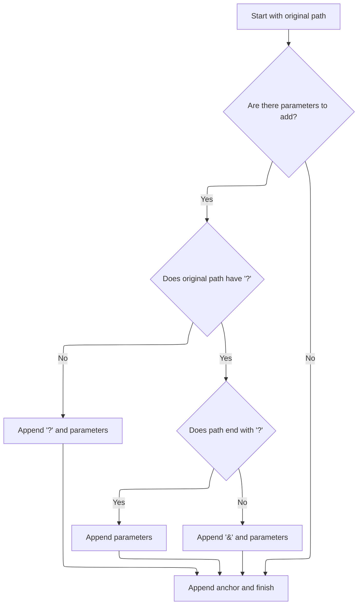

This document explains how a readable summary of a redirect is generated by combining its original path, parameters, and anchor into a single descriptive string. This allows users and developers to quickly understand the redirect's configuration.

# String Representation Construction

<SwmSnippet path="/core/src/main/java/org/apache/struts/action/ActionRedirect.java" line="340">

---

In <SwmToken path="core/src/main/java/org/apache/struts/action/ActionRedirect.java" pos="340:5:5" line-data="    public String toString() {">`toString`</SwmToken>, we're building a summary string for the redirect. We start by appending the original path using <SwmToken path="core/src/main/java/org/apache/struts/action/ActionRedirect.java" pos="344:13:13" line-data="        result.append(&quot;originalPath=&quot;).append(getOriginalPath()).append(&quot;;&quot;);">`getOriginalPath`</SwmToken>, since that's the base URL everything else is built on. This sets up the context for the rest of the string representation.

```java
    public String toString() {
        StringBuffer result = new StringBuffer(DEFAULT_BUFFER_SIZE);

        result.append("ActionRedirect [");
        result.append("originalPath=").append(getOriginalPath()).append(";");
```

---

</SwmSnippet>

## Retrieving the Base Path

<SwmSnippet path="/core/src/main/java/org/apache/struts/action/ActionRedirect.java" line="220">

---

<SwmToken path="core/src/main/java/org/apache/struts/action/ActionRedirect.java" pos="220:5:5" line-data="    public String getOriginalPath() {">`getOriginalPath`</SwmToken> just returns the path from the superclass. This isolates the concept of the 'original' path, making it easier to override if needed. Next, <SwmToken path="core/src/main/java/org/apache/struts/action/ActionRedirect.java" pos="221:5:5" line-data="        return super.getPath();">`getPath`</SwmToken> uses this to build the full redirect URL.

```java
    public String getOriginalPath() {
        return super.getPath();
    }
```

---

</SwmSnippet>

## Building the Full Redirect URL

<SwmSnippet path="/core/src/main/java/org/apache/struts/action/ActionRedirect.java" line="230">

---

In <SwmToken path="core/src/main/java/org/apache/struts/action/ActionRedirect.java" pos="230:5:5" line-data="    public String getPath() {">`getPath`</SwmToken>, we grab the original path first, since that's the base for the redirect. Everything else—parameters and anchor—gets added to this, so we need it up front.

```java
    public String getPath() {
        // get the original path and the parameter string that was formed
        String originalPath = getOriginalPath();
```

---

</SwmSnippet>

<SwmSnippet path="/core/src/main/java/org/apache/struts/action/ActionRedirect.java" line="233">

---

Back in <SwmToken path="core/src/main/java/org/apache/struts/action/ActionRedirect.java" pos="221:5:5" line-data="        return super.getPath();">`getPath`</SwmToken>, after getting the original path, we immediately fetch the parameter string. This is what gets appended as the query part of the URL, so it's needed before we can build the final redirect string.

```java
        String parameterString = getParameterString();
```

---

</SwmSnippet>

### Serializing Parameters for the URL

```mermaid
%%{init: {"flowchart": {"defaultRenderer": "elk"}} }%%
flowchart TD
    subgraph loop1["For each parameter in parameterValues"]
        node2["Check if parameter has single or
multiple values"]
        click node2 openCode "core/src/main/java/org/apache/struts/action/ActionRedirect.java:301:322"
        node2 --> node3{"Single value?"}
        node3 -->|"Yes"| node4["Add parameter and value to query string"]
        click node3 openCode "core/src/main/java/org/apache/struts/action/ActionRedirect.java:308:311"
        click node4 openCode "core/src/main/java/org/apache/struts/action/ActionRedirect.java:310:310"
        node3 -->|"No (Multiple values)"| subgraph loop2["For each value of parameter"]
            node5["Add parameter and value to query string"]
            click node5 openCode "core/src/main/java/org/apache/struts/action/ActionRedirect.java:315:317"
            node5 --> node8{"More values?"}
            click node8 openCode "core/src/main/java/org/apache/struts/action/ActionRedirect.java:318:320"
            node8 -->|"Yes"| node5
            node8 -->|"No"| node6["Continue"]
        end
        node4 --> node7{"More parameters?"}
        node6 --> node7
        click node7 openCode "core/src/main/java/org/apache/struts/action/ActionRedirect.java:324:326"
        node7 -->|"Yes"| node2
        node7 -->|"No"| node9["Return complete query string"]
        click node9 openCode "core/src/main/java/org/apache/struts/action/ActionRedirect.java:329:329"
    end
classDef HeadingStyle fill:#777777,stroke:#333,stroke-width:2px;

%% Swimm:
%% %%{init: {"flowchart": {"defaultRenderer": "elk"}} }%%
%% flowchart TD
%%     subgraph loop1["For each parameter in <SwmToken path="core/src/main/java/org/apache/struts/action/ActionRedirect.java" pos="299:7:7" line-data="        Iterator iterator = parameterValues.keySet().iterator();">`parameterValues`</SwmToken>"]
%%         node2["Check if parameter has single or
%% multiple values"]
%%         click node2 openCode "<SwmPath>[core/…/action/ActionRedirect.java](core/src/main/java/org/apache/struts/action/ActionRedirect.java)</SwmPath>:301:322"
%%         node2 --> node3{"Single value?"}
%%         node3 -->|"Yes"| node4["Add parameter and value to query string"]
%%         click node3 openCode "<SwmPath>[core/…/action/ActionRedirect.java](core/src/main/java/org/apache/struts/action/ActionRedirect.java)</SwmPath>:308:311"
%%         click node4 openCode "<SwmPath>[core/…/action/ActionRedirect.java](core/src/main/java/org/apache/struts/action/ActionRedirect.java)</SwmPath>:310:310"
%%         node3 -->|"No (Multiple values)"| subgraph loop2["For each value of parameter"]
%%             node5["Add parameter and value to query string"]
%%             click node5 openCode "<SwmPath>[core/…/action/ActionRedirect.java](core/src/main/java/org/apache/struts/action/ActionRedirect.java)</SwmPath>:315:317"
%%             node5 --> node8{"More values?"}
%%             click node8 openCode "<SwmPath>[core/…/action/ActionRedirect.java](core/src/main/java/org/apache/struts/action/ActionRedirect.java)</SwmPath>:318:320"
%%             node8 -->|"Yes"| node5
%%             node8 -->|"No"| node6["Continue"]
%%         end
%%         node4 --> node7{"More parameters?"}
%%         node6 --> node7
%%         click node7 openCode "<SwmPath>[core/…/action/ActionRedirect.java](core/src/main/java/org/apache/struts/action/ActionRedirect.java)</SwmPath>:324:326"
%%         node7 -->|"Yes"| node2
%%         node7 -->|"No"| node9["Return complete query string"]
%%         click node9 openCode "<SwmPath>[core/…/action/ActionRedirect.java](core/src/main/java/org/apache/struts/action/ActionRedirect.java)</SwmPath>:329:329"
%%     end
%% classDef HeadingStyle fill:#777777,stroke:#333,stroke-width:2px;
```

<SwmSnippet path="/core/src/main/java/org/apache/struts/action/ActionRedirect.java" line="295">

---

In <SwmToken path="core/src/main/java/org/apache/struts/action/ActionRedirect.java" pos="295:5:5" line-data="    public String getParameterString() {">`getParameterString`</SwmToken>, we loop through all parameters and build up the query string. If a parameter has multiple values, each one gets its own 'name=value' entry, joined by '&'. No encoding or null checks—just straight serialization.

```java
    public String getParameterString() {
        StringBuffer strParam = new StringBuffer(DEFAULT_BUFFER_SIZE);

        // loop through all parameters
        Iterator iterator = parameterValues.keySet().iterator();

        while (iterator.hasNext()) {
            // get the parameter name
            String paramName = (String) iterator.next();

            // get the value for this parameter
            Object value = parameterValues.get(paramName);

            if (value instanceof String) {
                // just one value for this param
                strParam.append(paramName).append("=").append(value);
            } else if (value instanceof String[]) {
                // loop through all values for this param
                String[] values = (String[]) value;

                for (int i = 0; i < values.length; i++) {
                    strParam.append(paramName).append("=").append(values[i]);

                    if (i < (values.length - 1)) {
                        strParam.append("&");
                    }
                }
            }

            if (iterator.hasNext()) {
                strParam.append("&");
            }
        }
```

---

</SwmSnippet>

<SwmSnippet path="/core/src/main/java/org/apache/struts/action/ActionRedirect.java" line="329">

---

Finally, <SwmToken path="core/src/main/java/org/apache/struts/action/ActionRedirect.java" pos="233:7:7" line-data="        String parameterString = getParameterString();">`getParameterString`</SwmToken> returns the serialized parameters. This string is used both for building the actual redirect URL and for showing the state in <SwmToken path="core/src/main/java/org/apache/struts/action/ActionRedirect.java" pos="329:5:5" line-data="        return strParam.toString();">`toString`</SwmToken>, so we call <SwmToken path="core/src/main/java/org/apache/struts/action/ActionRedirect.java" pos="329:5:5" line-data="        return strParam.toString();">`toString`</SwmToken> next to get the full summary.

```java
        return strParam.toString();
    }
```

---

</SwmSnippet>

### Finalizing the Redirect URL



<SwmSnippet path="/core/src/main/java/org/apache/struts/action/ActionRedirect.java" line="234">

---

Back in <SwmToken path="core/src/main/java/org/apache/struts/action/ActionRedirect.java" pos="221:5:5" line-data="        return super.getPath();">`getPath`</SwmToken>, after getting the parameter string, we handle appending it to the base path, picking '?' or '&' as needed, and then tack on the anchor. This gives us the final URL, which is used in the redirect and also shown in <SwmToken path="core/src/main/java/org/apache/struts/action/ActionRedirect.java" pos="269:5:5" line-data="        return result.toString();">`toString`</SwmToken>.

```java
        String anchorString = getAnchorString();

        StringBuffer result = new StringBuffer(originalPath);

        if ((parameterString != null) && (parameterString.length() > 0)) {
            // the parameter separator we're going to use
            String paramSeparator = "?";

            // true if we need to use a parameter separator after originalPath
            boolean needsParamSeparator = true;

            // does the original path already have a "?"?
            int paramStartIndex = originalPath.indexOf("?");

            if (paramStartIndex > 0) {
                // did the path end with "?"?
                needsParamSeparator = (paramStartIndex != (originalPath.length()
                    - 1));

                if (needsParamSeparator) {
                    paramSeparator = "&";
                }
            }

            if (needsParamSeparator) {
                result.append(paramSeparator);
            }

            result.append(parameterString);
        }

        // append anchor string (or blank if none was set)
        result.append(anchorString);


        return result.toString();
    }
```

---

</SwmSnippet>

## Adding Parameters and Anchor to the String Output

<SwmSnippet path="/core/src/main/java/org/apache/struts/action/ActionRedirect.java" line="345">

---

Back in <SwmToken path="core/src/main/java/org/apache/struts/action/ActionRedirect.java" pos="269:5:5" line-data="        return result.toString();">`toString`</SwmToken>, after showing the original path, we add the parameter string. This makes it clear what parameters are part of the redirect, which is useful for anyone reading logs or debugging.

```java
        result.append("parameterString=").append(getParameterString()).append("]");
```

---

</SwmSnippet>

<SwmSnippet path="/core/src/main/java/org/apache/struts/action/ActionRedirect.java" line="346">

---

Finally, in <SwmToken path="core/src/main/java/org/apache/struts/action/ActionRedirect.java" pos="348:5:5" line-data="        return result.toString();">`toString`</SwmToken>, we append the anchor string to complete the summary. This shows the full redirect state, including any fragment identifier at the end of the URL.

```java
        result.append("anchorString=").append(getAnchorString()).append("]");

        return result.toString();
    }
```

---

</SwmSnippet>

&nbsp;

*This is an auto-generated document by Swimm 🌊 and has not yet been verified by a human*

<SwmMeta version="3.0.0" repo-id="Z2l0aHViJTNBJTNBc3RydXRzMSUzQSUzQVN3aW1tLURlbW8=" repo-name="struts1"><sup>Powered by [Swimm](https://app.swimm.io/)</sup></SwmMeta>
