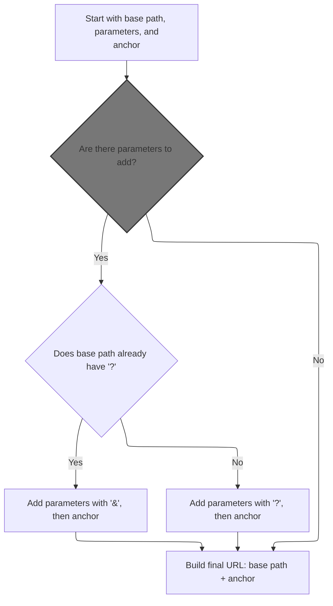
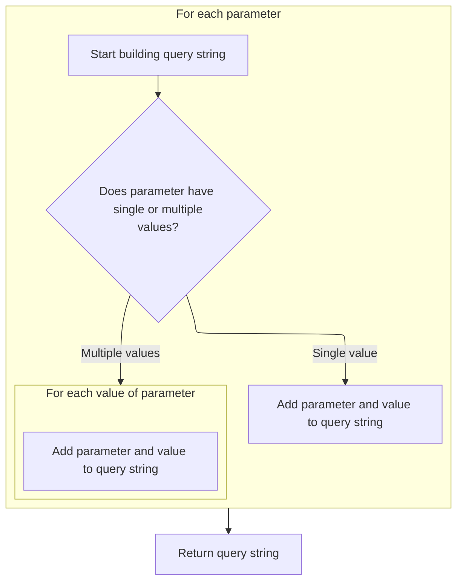
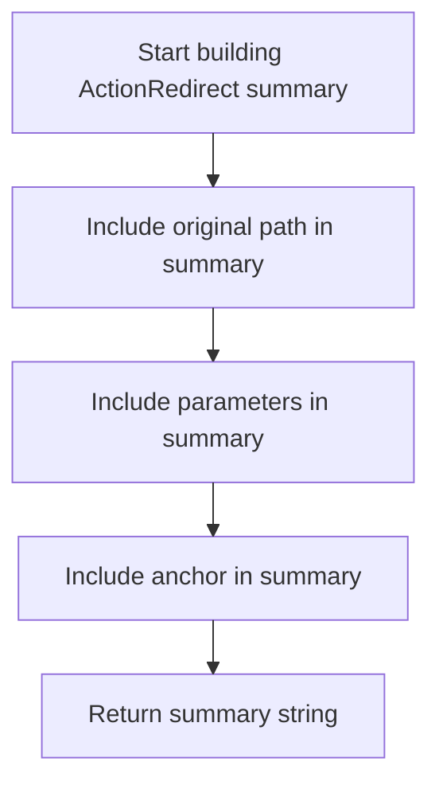
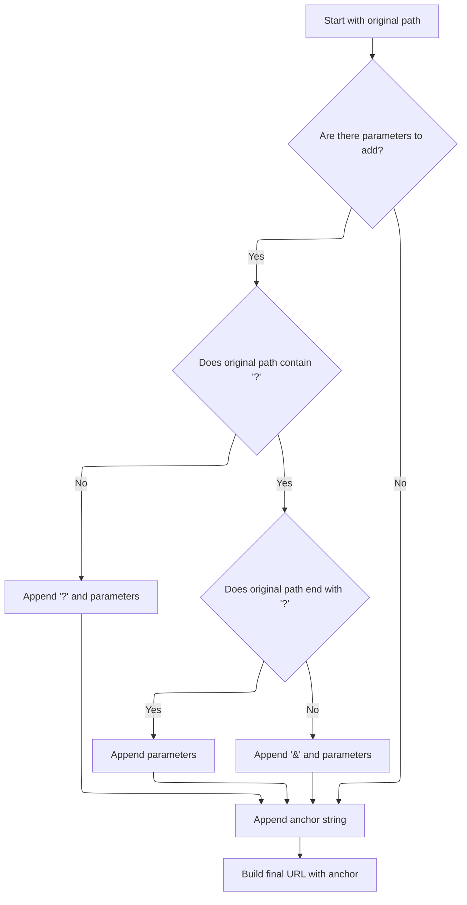

This document explains how redirect <SwmToken path="core/src/main/java/org/apache/struts/action/ActionRedirect.java" pos="276:22:22" line-data="     * @return a string which can be appended to the URLs.  The">`URLs`</SwmToken> are constructed to send users to a new location, including any additional information in query parameters and anchors. The flow receives a base path, parameters, and an anchor, and produces a fully formed URL for redirection.

# Building the Redirect Path



<SwmSnippet path="/core/src/main/java/org/apache/struts/action/ActionRedirect.java" line="230">

---

In <SwmToken path="core/src/main/java/org/apache/struts/action/ActionRedirect.java" pos="230:5:5" line-data="    public String getPath() {">`getPath`</SwmToken>, we grab the base path using <SwmToken path="core/src/main/java/org/apache/struts/action/ActionRedirect.java" pos="232:7:7" line-data="        String originalPath = getOriginalPath();">`getOriginalPath`</SwmToken>. This is needed because the path might already have query parameters, and we need to build on top of whatever is returned. The function assumes <SwmToken path="core/src/main/java/org/apache/struts/action/ActionRedirect.java" pos="232:7:7" line-data="        String originalPath = getOriginalPath();">`getOriginalPath`</SwmToken> gives us a valid path string, so we don't do any format checks here. Next, we need to call <SwmToken path="core/src/main/java/org/apache/struts/action/ActionRedirect.java" pos="233:7:7" line-data="        String parameterString = getParameterString();">`getParameterString`</SwmToken> to see if there are any parameters to append.

```java
    public String getPath() {
        // get the original path and the parameter string that was formed
        String originalPath = getOriginalPath();
```

---

</SwmSnippet>

<SwmSnippet path="/core/src/main/java/org/apache/struts/action/ActionRedirect.java" line="220">

---

<SwmToken path="core/src/main/java/org/apache/struts/action/ActionRedirect.java" pos="220:5:5" line-data="    public String getOriginalPath() {">`getOriginalPath`</SwmToken> just returns the path from the superclass. It's a pass-through, so any logic about the path format or content is handled upstream. After this, <SwmToken path="core/src/main/java/org/apache/struts/action/ActionRedirect.java" pos="221:5:5" line-data="        return super.getPath();">`getPath`</SwmToken> continues building the redirect URL.

```java
    public String getOriginalPath() {
        return super.getPath();
    }
```

---

</SwmSnippet>

<SwmSnippet path="/core/src/main/java/org/apache/struts/action/ActionRedirect.java" line="233">

---

Back in <SwmToken path="core/src/main/java/org/apache/struts/action/ActionRedirect.java" pos="221:5:5" line-data="        return super.getPath();">`getPath`</SwmToken>, after getting the original path, we fetch the parameter string with <SwmToken path="core/src/main/java/org/apache/struts/action/ActionRedirect.java" pos="233:7:7" line-data="        String parameterString = getParameterString();">`getParameterString`</SwmToken>. This tells us if there are any query parameters to add to the path, and how to format them.

```java
        String parameterString = getParameterString();
```

---

</SwmSnippet>

## Formatting Query Parameters



<SwmSnippet path="/core/src/main/java/org/apache/struts/action/ActionRedirect.java" line="295">

---

In <SwmToken path="core/src/main/java/org/apache/struts/action/ActionRedirect.java" pos="295:5:5" line-data="    public String getParameterString() {">`getParameterString`</SwmToken>, we loop through all parameters and build a query string. Each key-value pair is formatted as key=value, and if a key has multiple values, we repeat the key for each value. Everything is joined with '&'.

```java
    public String getParameterString() {
        StringBuffer strParam = new StringBuffer(DEFAULT_BUFFER_SIZE);

        // loop through all parameters
        Iterator iterator = parameterValues.keySet().iterator();

        while (iterator.hasNext()) {
            // get the parameter name
            String paramName = (String) iterator.next();

            // get the value for this parameter
            Object value = parameterValues.get(paramName);

            if (value instanceof String) {
                // just one value for this param
                strParam.append(paramName).append("=").append(value);
            } else if (value instanceof String[]) {
                // loop through all values for this param
                String[] values = (String[]) value;

                for (int i = 0; i < values.length; i++) {
                    strParam.append(paramName).append("=").append(values[i]);

                    if (i < (values.length - 1)) {
                        strParam.append("&");
                    }
                }
            }

            if (iterator.hasNext()) {
                strParam.append("&");
            }
        }
```

---

</SwmSnippet>

<SwmSnippet path="/core/src/main/java/org/apache/struts/action/ActionRedirect.java" line="329">

---

Finally, <SwmToken path="core/src/main/java/org/apache/struts/action/ActionRedirect.java" pos="233:7:7" line-data="        String parameterString = getParameterString();">`getParameterString`</SwmToken> returns the built query string. After this, <SwmToken path="core/src/main/java/org/apache/struts/action/ActionRedirect.java" pos="329:5:5" line-data="        return strParam.toString();">`toString`</SwmToken> is called to get the string representation of the <SwmToken path="core/src/main/java/org/apache/struts/action/ActionRedirect.java" pos="343:6:6" line-data="        result.append(&quot;ActionRedirect [&quot;);">`ActionRedirect`</SwmToken>, which includes the parameter string for debugging or logging.

```java
        return strParam.toString();
    }
```

---

</SwmSnippet>

## Debugging Output Construction



<SwmSnippet path="/core/src/main/java/org/apache/struts/action/ActionRedirect.java" line="340">

---

In <SwmToken path="core/src/main/java/org/apache/struts/action/ActionRedirect.java" pos="340:5:5" line-data="    public String toString() {">`toString`</SwmToken>, we start building a string that shows the internal state of the <SwmToken path="core/src/main/java/org/apache/struts/action/ActionRedirect.java" pos="343:6:6" line-data="        result.append(&quot;ActionRedirect [&quot;);">`ActionRedirect`</SwmToken>. We call <SwmToken path="core/src/main/java/org/apache/struts/action/ActionRedirect.java" pos="344:13:13" line-data="        result.append(&quot;originalPath=&quot;).append(getOriginalPath()).append(&quot;;&quot;);">`getOriginalPath`</SwmToken> to include the base path in the output.

```java
    public String toString() {
        StringBuffer result = new StringBuffer(DEFAULT_BUFFER_SIZE);

        result.append("ActionRedirect [");
        result.append("originalPath=").append(getOriginalPath()).append(";");
```

---

</SwmSnippet>

<SwmSnippet path="/core/src/main/java/org/apache/struts/action/ActionRedirect.java" line="345">

---

Back in <SwmToken path="core/src/main/java/org/apache/struts/action/ActionRedirect.java" pos="269:5:5" line-data="        return result.toString();">`toString`</SwmToken>, after adding the original path, we append the current parameter string by calling <SwmToken path="core/src/main/java/org/apache/struts/action/ActionRedirect.java" pos="345:13:13" line-data="        result.append(&quot;parameterString=&quot;).append(getParameterString()).append(&quot;]&quot;);">`getParameterString`</SwmToken>. This gives a snapshot of all parameters at this moment.

```java
        result.append("parameterString=").append(getParameterString()).append("]");
```

---

</SwmSnippet>

<SwmSnippet path="/core/src/main/java/org/apache/struts/action/ActionRedirect.java" line="346">

---

Finally, <SwmToken path="core/src/main/java/org/apache/struts/action/ActionRedirect.java" pos="348:5:5" line-data="        return result.toString();">`toString`</SwmToken> adds the anchor string to the output, so the debug string shows the full redirect state: path, parameters, and anchor.

```java
        result.append("anchorString=").append(getAnchorString()).append("]");

        return result.toString();
    }
```

---

</SwmSnippet>

## Finalizing the Redirect URL



<SwmSnippet path="/core/src/main/java/org/apache/struts/action/ActionRedirect.java" line="234">

---

Back in <SwmToken path="core/src/main/java/org/apache/struts/action/ActionRedirect.java" pos="221:5:5" line-data="        return super.getPath();">`getPath`</SwmToken>, after getting the parameter string, we figure out if we need to use '?' or '&' to append parameters, depending on whether the original path already has a query section. Then we add the parameters and anchor string to finish the URL. After this, <SwmToken path="core/src/main/java/org/apache/struts/action/ActionRedirect.java" pos="269:5:5" line-data="        return result.toString();">`toString`</SwmToken> can be used to see the full redirect state for debugging.

```java
        String anchorString = getAnchorString();

        StringBuffer result = new StringBuffer(originalPath);

        if ((parameterString != null) && (parameterString.length() > 0)) {
            // the parameter separator we're going to use
            String paramSeparator = "?";

            // true if we need to use a parameter separator after originalPath
            boolean needsParamSeparator = true;

            // does the original path already have a "?"?
            int paramStartIndex = originalPath.indexOf("?");

            if (paramStartIndex > 0) {
                // did the path end with "?"?
                needsParamSeparator = (paramStartIndex != (originalPath.length()
                    - 1));

                if (needsParamSeparator) {
                    paramSeparator = "&";
                }
            }

            if (needsParamSeparator) {
                result.append(paramSeparator);
            }

            result.append(parameterString);
        }

        // append anchor string (or blank if none was set)
        result.append(anchorString);


        return result.toString();
    }
```

---

</SwmSnippet>

&nbsp;

*This is an auto-generated document by Swimm 🌊 and has not yet been verified by a human*

<SwmMeta version="3.0.0" repo-id="Z2l0aHViJTNBJTNBc3RydXRzMSUzQSUzQVN3aW1tLURlbW8=" repo-name="struts1"><sup>Powered by [Swimm](https://app.swimm.io/)</sup></SwmMeta>
