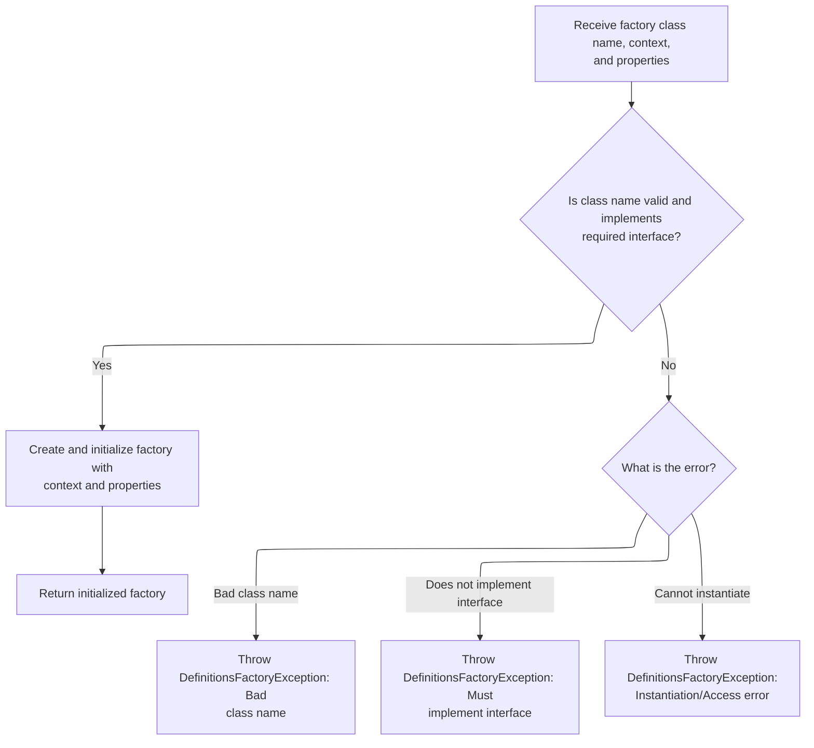

This document explains how the system updates its definitions factory to reflect the latest configuration. The process supports both default and custom implementations, allowing dynamic adaptation to configuration changes. It receives the current context and properties as input and results in an updated factory for future use.

# Reloading the Definitions Factory

<SwmSnippet path="/tiles/src/main/java/org/apache/struts/tiles/definition/ReloadableDefinitionsFactory.java" line="222">

---

In <SwmToken path="tiles/src/main/java/org/apache/struts/tiles/definition/ReloadableDefinitionsFactory.java" pos="222:5:5" line-data="    public void reload(ServletContext servletContext)">`reload`</SwmToken>, we start by creating a new <SwmToken path="tiles/src/main/java/org/apache/struts/tiles/definition/ReloadableDefinitionsFactory.java" pos="225:1:1" line-data="        ComponentDefinitionsFactory newInstance =">`ComponentDefinitionsFactory`</SwmToken> using the current servlet context and properties. This step ensures we get an updated factory, reflecting any changes in configuration. We call <SwmToken path="tiles/src/main/java/org/apache/struts/tiles/definition/ReloadableDefinitionsFactory.java" pos="226:1:1" line-data="            createFactory(servletContext, properties);">`createFactory`</SwmToken> next to actually build this new instance based on the latest settings.

```java
    public void reload(ServletContext servletContext)
        throws DefinitionsFactoryException {

        ComponentDefinitionsFactory newInstance =
            createFactory(servletContext, properties);

```

---

</SwmSnippet>

## Choosing the Factory Implementation

<SwmSnippet path="/tiles/src/main/java/org/apache/struts/tiles/definition/ReloadableDefinitionsFactory.java" line="179">

---

<SwmToken path="tiles/src/main/java/org/apache/struts/tiles/definition/ReloadableDefinitionsFactory.java" pos="179:5:5" line-data="    public ComponentDefinitionsFactory createFactory(">`createFactory`</SwmToken> checks if a custom factory classname is set in the properties. If so, it delegates to <SwmToken path="tiles/src/main/java/org/apache/struts/tiles/definition/ReloadableDefinitionsFactory.java" pos="187:3:3" line-data="            return createFactoryFromClassname(servletContext, properties, classname);">`createFactoryFromClassname`</SwmToken> to instantiate that specific implementation. If not, it falls back to the default factory. This lets the system support both custom and default factories.

```java
    public ComponentDefinitionsFactory createFactory(
        ServletContext servletContext,
        Map properties)
        throws DefinitionsFactoryException {

        String classname = (String) properties.get(DEFINITIONS_FACTORY_CLASSNAME);

        if (classname != null) {
            return createFactoryFromClassname(servletContext, properties, classname);
        }

        return new I18nFactorySet(servletContext, properties);
    }
```

---

</SwmSnippet>

## Instantiating a Custom Factory

<SwmSnippet path="/tiles/src/main/java/org/apache/struts/tiles/definition/ReloadableDefinitionsFactory.java" line="110">

---

In <SwmToken path="tiles/src/main/java/org/apache/struts/tiles/definition/ReloadableDefinitionsFactory.java" pos="110:5:5" line-data="    public ComponentDefinitionsFactory createFactoryFromClassname(">`createFactoryFromClassname`</SwmToken>, we double-check if the classname is null. If it is, we just call back into <SwmToken path="tiles/src/main/java/org/apache/struts/tiles/definition/ReloadableDefinitionsFactory.java" pos="117:3:3" line-data="            return createFactory(servletContext, properties);">`createFactory`</SwmToken> to use the default logic. This covers cases where the method might be called directly with a null value.

```java
    public ComponentDefinitionsFactory createFactoryFromClassname(
        ServletContext servletContext,
        Map properties,
        String classname)
        throws DefinitionsFactoryException {

        if (classname == null) {
            return createFactory(servletContext, properties);
        }

```

---

</SwmSnippet>

<SwmSnippet path="/tiles/src/main/java/org/apache/struts/tiles/definition/ReloadableDefinitionsFactory.java" line="120">

---

Back in <SwmToken path="tiles/src/main/java/org/apache/struts/tiles/definition/ReloadableDefinitionsFactory.java" pos="110:5:5" line-data="    public ComponentDefinitionsFactory createFactoryFromClassname(">`createFactoryFromClassname`</SwmToken>, after handling the null check, we use reflection to load and instantiate the specified factory class. This is where we rely on <SwmToken path="tiles/src/main/java/org/apache/struts/tiles/definition/ReloadableDefinitionsFactory.java" pos="122:7:9" line-data="            Class factoryClass = RequestUtils.applicationClass(classname);">`RequestUtils.applicationClass`</SwmToken> (which internally may use logic from `DynaActionFormClass.newInstance`) to dynamically create the factory, supporting custom implementations.

```java
        // Try to create from classname
        try {
            Class factoryClass = RequestUtils.applicationClass(classname);
            ComponentDefinitionsFactory factory =
                (ComponentDefinitionsFactory) factoryClass.newInstance();
```

---

</SwmSnippet>

### Dynamic Factory Instantiation

See <SwmLink doc-title="Creating and Initializing Dynamic Form Beans">[Creating and Initializing Dynamic Form Beans](/.swm/creating-and-initializing-dynamic-form-beans.foxyxsos.sw.md)</SwmLink>

### Factory Initialization and Error Handling



<SwmSnippet path="/tiles/src/main/java/org/apache/struts/tiles/definition/ReloadableDefinitionsFactory.java" line="125">

---

After returning from `DynaActionFormClass.newInstance`, <SwmToken path="tiles/src/main/java/org/apache/struts/tiles/definition/ReloadableDefinitionsFactory.java" pos="110:5:5" line-data="    public ComponentDefinitionsFactory createFactoryFromClassname(">`createFactoryFromClassname`</SwmToken> initializes the factory with the servlet context and properties, then returns it. If anything goes wrong (bad class, wrong interface, etc.), it throws a clear exception, stopping the reload with an error.

```java
            factory.initFactory(servletContext, properties);
            return factory;

        } catch (ClassCastException ex) { // Bad classname
            throw new DefinitionsFactoryException(
                "Error - createDefinitionsFactory : Factory class '"
                    + classname
                    + " must implements 'ComponentDefinitionsFactory'.",
                ex);

        } catch (ClassNotFoundException ex) { // Bad classname
            throw new DefinitionsFactoryException(
                "Error - createDefinitionsFactory : Bad class name '"
                    + classname
                    + "'.",
                ex);

        } catch (InstantiationException ex) { // Bad constructor or error
            throw new DefinitionsFactoryException(ex);

        } catch (IllegalAccessException ex) {
            throw new DefinitionsFactoryException(ex);
        }

    }
```

---

</SwmSnippet>

## Switching to the New Factory

<SwmSnippet path="/tiles/src/main/java/org/apache/struts/tiles/definition/ReloadableDefinitionsFactory.java" line="228">

---

Finally, back in <SwmToken path="tiles/src/main/java/org/apache/struts/tiles/definition/ReloadableDefinitionsFactory.java" pos="222:5:5" line-data="    public void reload(ServletContext servletContext)">`reload`</SwmToken>, we assign the newly created factory to the main reference. From this point, all lookups and operations use the updated factory instance.

```java
        factory = newInstance;
    }
```

---

</SwmSnippet>

&nbsp;

*This is an auto-generated document by Swimm 🌊 and has not yet been verified by a human*

<SwmMeta version="3.0.0" repo-id="Z2l0aHViJTNBJTNBc3RydXRzMSUzQSUzQVN3aW1tLURlbW8=" repo-name="struts1"><sup>Powered by [Swimm](https://app.swimm.io/)</sup></SwmMeta>
