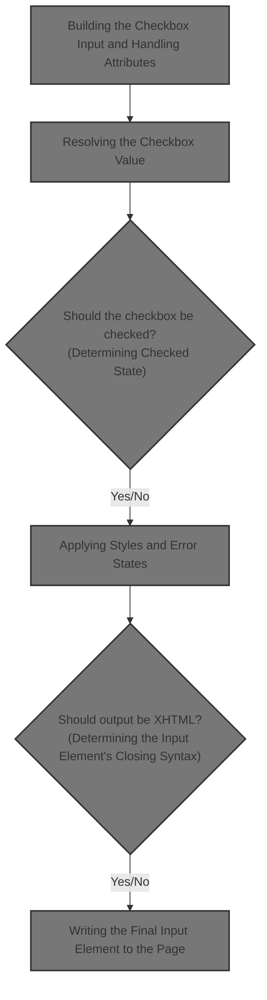
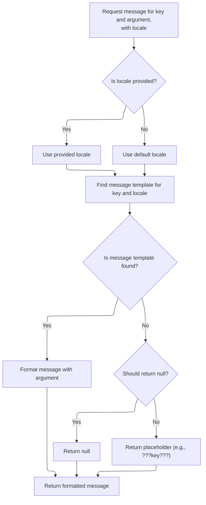
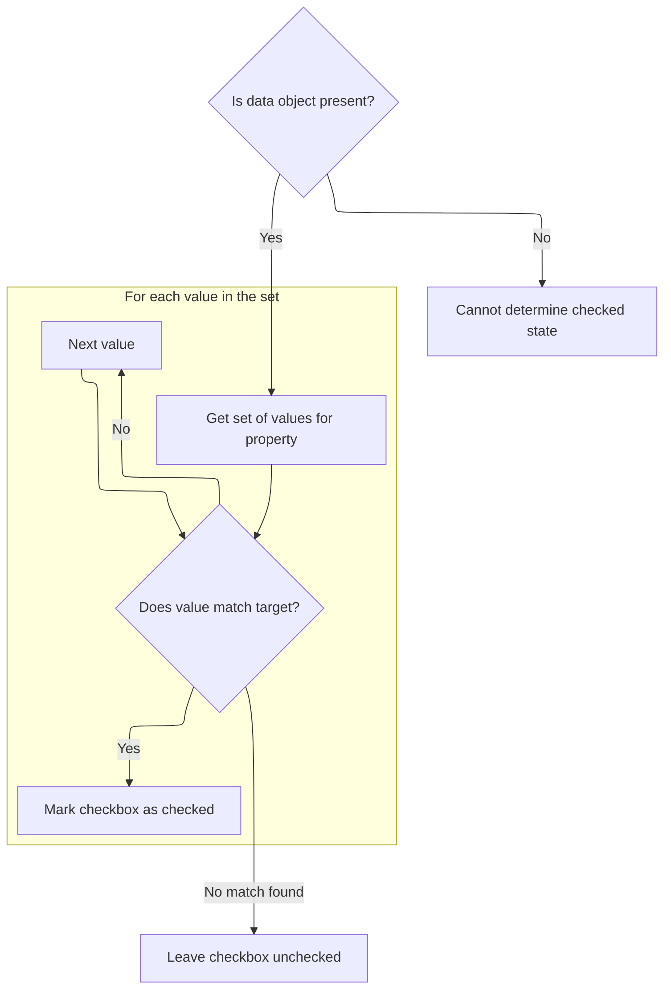
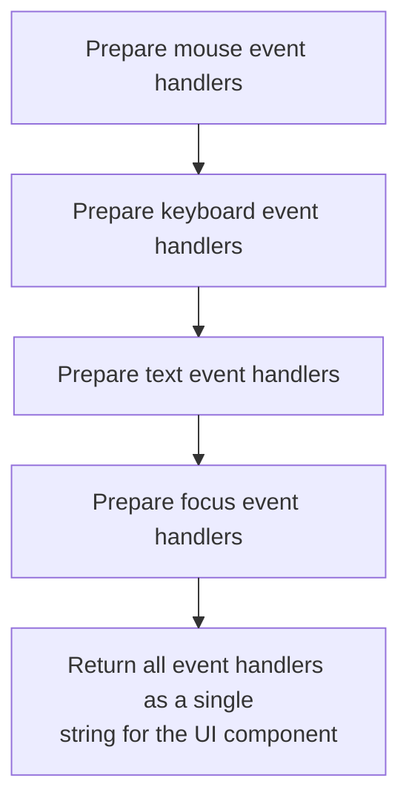
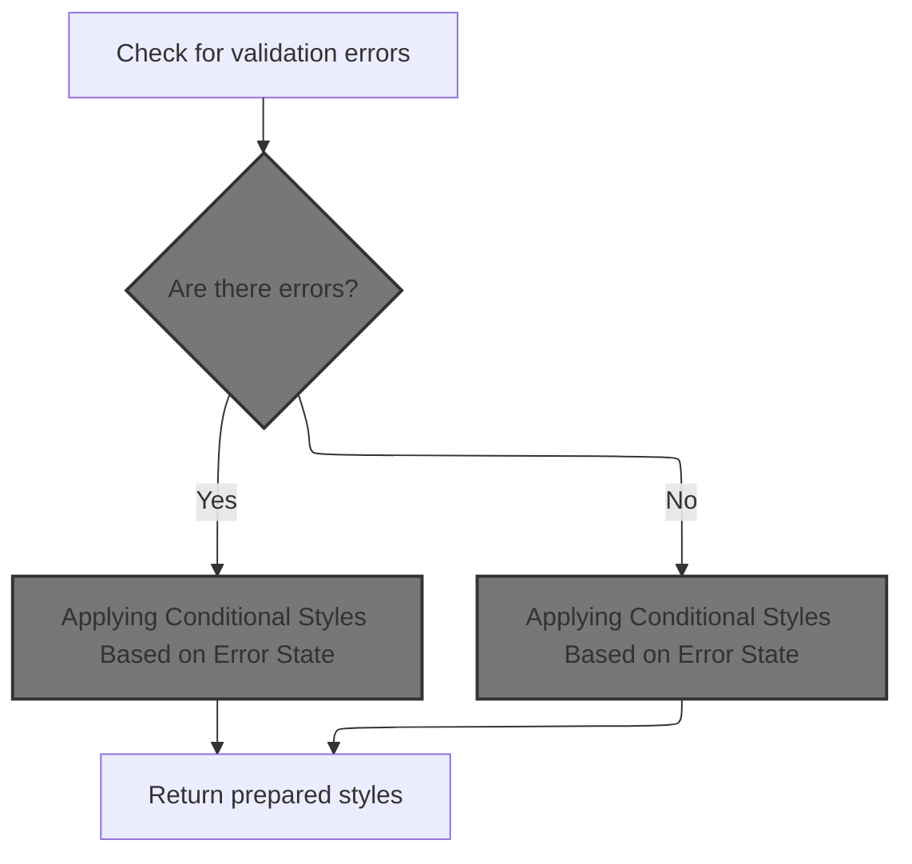
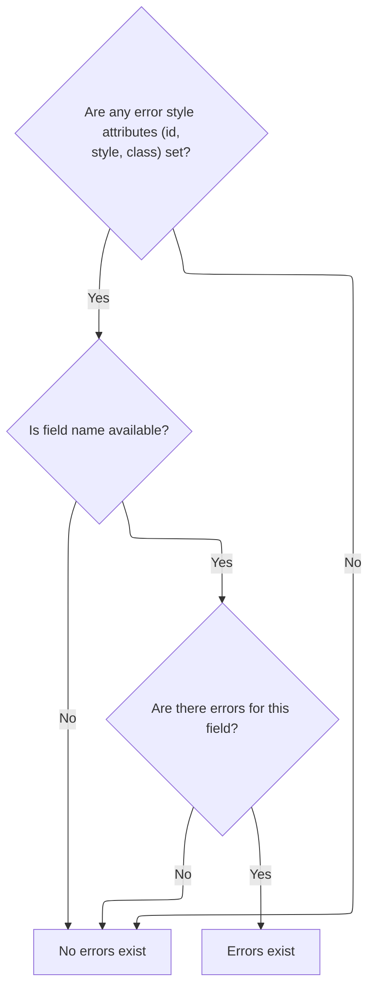
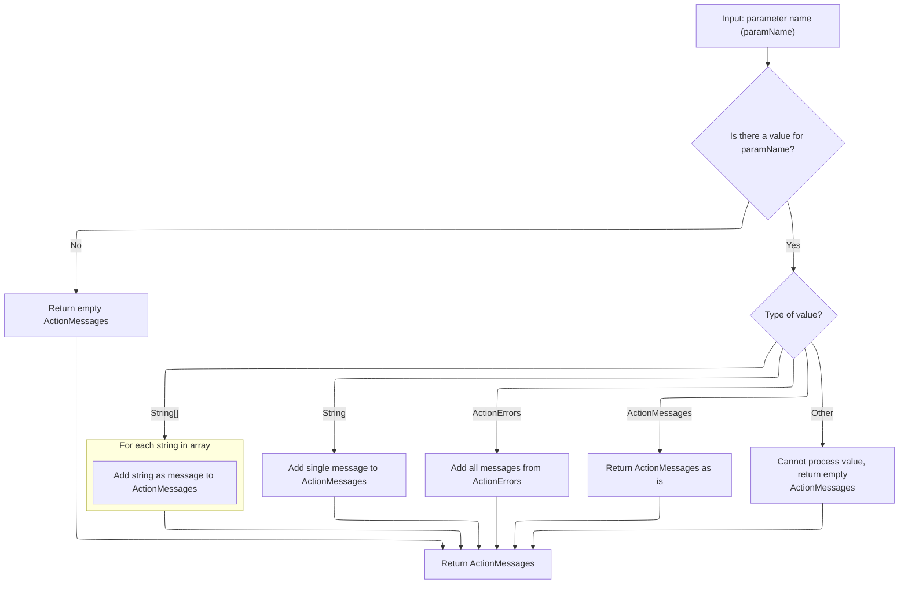
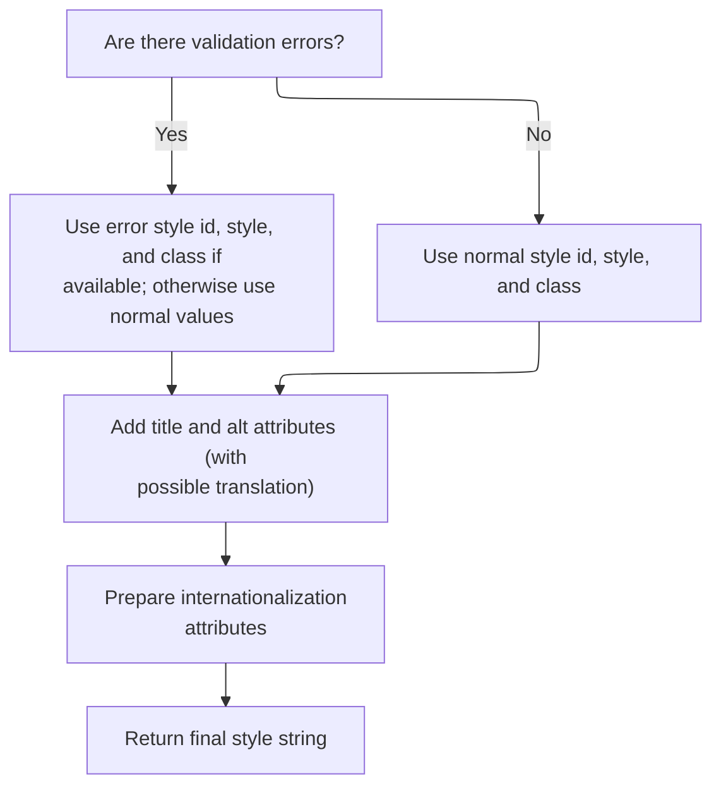

This document outlines how a checkbox input element is rendered as part of the form system. The process takes application data and attributes as input, determines the correct value and checked state, applies event handlers and styles (including error states), and outputs a fully constructed checkbox input element to the page.



# Building the Checkbox Input and Handling Attributes

```mermaid
%%{init: {"flowchart": {"defaultRenderer": "elk"}} }%%
flowchart TD
    node1["Start: Create checkbox input element"]
    click node1 openCode "taglib/src/main/java/org/apache/struts/taglib/html/MultiboxTag.java:154:156"
    node1 --> node2["Resolving the Checkbox Value"]
    
    node2 --> node3{"Should checkbox be checked for user?"}
    click node3 openCode "taglib/src/main/java/org/apache/struts/taglib/html/MultiboxTag.java:164:164"
    node3 -->|"Yes"| node4["Checking Bean Property Values"]
    
    node3 -->|"No"| node5["Leave checkbox unchecked"]
    click node5 openCode "taglib/src/main/java/org/apache/struts/taglib/html/MultiboxTag.java:164:164"
    node4 --> node6["Wiring Up Event and State Attributes"]
    
    node5 --> node6
    node6 --> node7["Composing Style Attributes"]
    
    node7 --> node8["Add any additional attributes"]
    click node8 openCode "taglib/src/main/java/org/apache/struts/taglib/html/MultiboxTag.java:167:168"
    node8 --> node9{"Should output be XHTML?"}
    
    node9 -->|"Yes"| node10["Determining the Input Element's Closing Syntax"]
    
    node9 -->|"No"| node11["Determining the Input Element's Closing Syntax"]
    
    node10 --> node12["Render checkbox to page"]
    click node12 openCode "taglib/src/main/java/org/apache/struts/taglib/html/MultiboxTag.java:170:172"
    node11 --> node12
classDef HeadingStyle fill:#777777,stroke:#333,stroke-width:2px;
click node2 goToHeading "Resolving the Checkbox Value"
node2:::HeadingStyle
click node4 goToHeading "Checking Bean Property Values"
node4:::HeadingStyle
click node6 goToHeading "Wiring Up Event and State Attributes"
node6:::HeadingStyle
click node7 goToHeading "Composing Style Attributes"
node7:::HeadingStyle
click node10 goToHeading "Determining the Input Element's Closing Syntax"
node10:::HeadingStyle
click node11 goToHeading "Determining the Input Element's Closing Syntax"
node11:::HeadingStyle
click node9 goToHeading "Detecting XHTML Mode from the Page Context"
node9:::HeadingStyle

%% Swimm:
%% %%{init: {"flowchart": {"defaultRenderer": "elk"}} }%%
%% flowchart TD
%%     node1["Start: Create checkbox input element"]
%%     click node1 openCode "<SwmPath>[taglib/…/html/MultiboxTag.java](taglib/src/main/java/org/apache/struts/taglib/html/MultiboxTag.java)</SwmPath>:154:156"
%%     node1 --> node2["Resolving the Checkbox Value"]
%%     
%%     node2 --> node3{"Should checkbox be checked for user?"}
%%     click node3 openCode "<SwmPath>[taglib/…/html/MultiboxTag.java](taglib/src/main/java/org/apache/struts/taglib/html/MultiboxTag.java)</SwmPath>:164:164"
%%     node3 -->|"Yes"| node4["Checking Bean Property Values"]
%%     
%%     node3 -->|"No"| node5["Leave checkbox unchecked"]
%%     click node5 openCode "<SwmPath>[taglib/…/html/MultiboxTag.java](taglib/src/main/java/org/apache/struts/taglib/html/MultiboxTag.java)</SwmPath>:164:164"
%%     node4 --> node6["Wiring Up Event and State Attributes"]
%%     
%%     node5 --> node6
%%     node6 --> node7["Composing Style Attributes"]
%%     
%%     node7 --> node8["Add any additional attributes"]
%%     click node8 openCode "<SwmPath>[taglib/…/html/MultiboxTag.java](taglib/src/main/java/org/apache/struts/taglib/html/MultiboxTag.java)</SwmPath>:167:168"
%%     node8 --> node9{"Should output be XHTML?"}
%%     
%%     node9 -->|"Yes"| node10["Determining the Input Element's Closing Syntax"]
%%     
%%     node9 -->|"No"| node11["Determining the Input Element's Closing Syntax"]
%%     
%%     node10 --> node12["Render checkbox to page"]
%%     click node12 openCode "<SwmPath>[taglib/…/html/MultiboxTag.java](taglib/src/main/java/org/apache/struts/taglib/html/MultiboxTag.java)</SwmPath>:170:172"
%%     node11 --> node12
%% classDef HeadingStyle fill:#777777,stroke:#333,stroke-width:2px;
%% click node2 goToHeading "Resolving the Checkbox Value"
%% node2:::HeadingStyle
%% click node4 goToHeading "Checking Bean Property Values"
%% node4:::HeadingStyle
%% click node6 goToHeading "Wiring Up Event and State Attributes"
%% node6:::HeadingStyle
%% click node7 goToHeading "Composing Style Attributes"
%% node7:::HeadingStyle
%% click node10 goToHeading "Determining the Input Element's Closing Syntax"
%% node10:::HeadingStyle
%% click node11 goToHeading "Determining the Input Element's Closing Syntax"
%% node11:::HeadingStyle
%% click node9 goToHeading "Detecting XHTML Mode from the Page Context"
%% node9:::HeadingStyle
```



<SwmSnippet path="/taglib/src/main/java/org/apache/struts/taglib/html/MultiboxTag.java" line="154">

---

In <SwmToken path="taglib/src/main/java/org/apache/struts/taglib/html/MultiboxTag.java" pos="154:5:5" line-data="    public int doEndTag() throws JspException {">`doEndTag`</SwmToken>, we're starting to build the <input type="checkbox"> element and delegating attribute rendering to <SwmToken path="taglib/src/main/java/org/apache/struts/taglib/html/MultiboxTag.java" pos="158:1:1" line-data="        prepareAttribute(results, &quot;name&quot;, prepareName());">`prepareAttribute`</SwmToken> for each relevant attribute. We call into <SwmToken path="taglib/src/main/java/org/apache/struts/taglib/html/LabelTag.java" pos="33:4:4" line-data="public class LabelTag extends BaseInputTag {">`LabelTag`</SwmToken>'s <SwmToken path="taglib/src/main/java/org/apache/struts/taglib/html/MultiboxTag.java" pos="158:1:1" line-data="        prepareAttribute(results, &quot;name&quot;, prepareName());">`prepareAttribute`</SwmToken> next because it handles any special logic for attributes (like CSS class tweaks for required fields)

```java
    public int doEndTag() throws JspException {
        // Create an appropriate "input" element based on our parameters
        StringBuffer results = new StringBuffer("<input type=\"checkbox\"");

        prepareAttribute(results, "name", prepareName());
        prepareAttribute(results, "accesskey", getAccesskey());
        prepareAttribute(results, "tabindex", getTabindex());

```

---

</SwmSnippet>

<SwmSnippet path="/taglib/src/main/java/org/apache/struts/taglib/html/LabelTag.java" line="161">

---

<SwmToken path="taglib/src/main/java/org/apache/struts/taglib/html/LabelTag.java" pos="161:5:5" line-data="    protected void prepareAttribute(StringBuffer handlers, String name,">`prepareAttribute`</SwmToken> in <SwmToken path="taglib/src/main/java/org/apache/struts/taglib/html/LabelTag.java" pos="33:4:4" line-data="public class LabelTag extends BaseInputTag {">`LabelTag`</SwmToken> checks if we're dealing with the 'class' attribute and if the field is required. If so, it appends the required style class. Then it hands off to the superclass to actually render the attribute, so any custom logic is layered on top of the base behavior.

```java
    protected void prepareAttribute(StringBuffer handlers, String name,
            Object value) {

        if ("class".equals(name) && this.required) {
            String requiredStyleClass = getRequiredStyleClass();
            if (requiredStyleClass != null) {
                value = (value != null) ? (value + " " + requiredStyleClass)
                        : requiredStyleClass;
            }
        }
        super.prepareAttribute(handlers, name, value);
    }
```

---

</SwmSnippet>

<SwmSnippet path="/taglib/src/main/java/org/apache/struts/taglib/html/MultiboxTag.java" line="162">

---

Back in `MultiboxTag.doEndTag`, after handling the standard attributes, we call <SwmToken path="taglib/src/main/java/org/apache/struts/taglib/html/MultiboxTag.java" pos="162:7:7" line-data="        String value = prepareValue(results);">`prepareValue`</SwmToken> to figure out what the checkbox's value should be. This is where any validation or message lookup happens before we continue building the input element.

```java
        String value = prepareValue(results);

```

---

</SwmSnippet>

## Resolving the Checkbox Value

<SwmSnippet path="/taglib/src/main/java/org/apache/struts/taglib/html/MultiboxTag.java" line="190">

---

In <SwmToken path="taglib/src/main/java/org/apache/struts/taglib/html/MultiboxTag.java" pos="190:5:5" line-data="    protected String prepareValue(StringBuffer results)">`prepareValue`</SwmToken>, we figure out the value for the checkbox, and if it's missing, we throw a localized exception using <SwmToken path="taglib/src/main/java/org/apache/struts/taglib/html/MultiboxTag.java" pos="196:5:7" line-data="                new JspException(messages.getMessage(&quot;multiboxTag.value&quot;));">`messages.getMessage`</SwmToken>. That's why we need to call into <SwmToken path="taglib/src/main/java/org/apache/struts/taglib/html/MultiboxTag.java" pos="26:10:10" line-data="import org.apache.struts.util.MessageResources;">`MessageResources`</SwmToken> next—to get the right error message string.

```java
    protected String prepareValue(StringBuffer results)
        throws JspException {
        String value = (this.value == null) ? this.constant : this.value;

        if (value == null) {
            JspException e =
                new JspException(messages.getMessage("multiboxTag.value"));

            pageContext.setAttribute(Globals.EXCEPTION_KEY, e,
                PageContext.REQUEST_SCOPE);
            throw e;
        }

```

---

</SwmSnippet>

### Fetching Localized Messages

<SwmSnippet path="/core/src/main/java/org/apache/struts/util/MessageResources.java" line="196">

---

<SwmToken path="core/src/main/java/org/apache/struts/util/MessageResources.java" pos="196:5:10" line-data="    public String getMessage(String key) {">`getMessage(String key)`</SwmToken> just hands off to the more general <SwmToken path="core/src/main/java/org/apache/struts/util/MessageResources.java" pos="196:5:5" line-data="    public String getMessage(String key) {">`getMessage`</SwmToken> method with a null locale and no arguments. It's a shortcut for basic message lookups.

```java
    public String getMessage(String key) {
        return this.getMessage((Locale) null, key, null);
    }
```

---

</SwmSnippet>

### Formatting and Caching Localized Messages



<SwmSnippet path="/core/src/main/java/org/apache/struts/util/MessageResources.java" line="324">

---

<SwmToken path="core/src/main/java/org/apache/struts/util/MessageResources.java" pos="324:5:5" line-data="    public String getMessage(Locale locale, String key, Object arg0) {">`getMessage`</SwmToken>`(`<SwmToken path="core/src/main/java/org/apache/struts/util/MessageResources.java" pos="324:7:7" line-data="    public String getMessage(Locale locale, String key, Object arg0) {">`Locale`</SwmToken>`, `<SwmToken path="core/src/main/java/org/apache/struts/util/MessageResources.java" pos="324:3:3" line-data="    public String getMessage(Locale locale, String key, Object arg0) {">`String`</SwmToken>`, `<SwmToken path="core/src/main/java/org/apache/struts/util/MessageResources.java" pos="324:17:17" line-data="    public String getMessage(Locale locale, String key, Object arg0) {">`Object`</SwmToken>`)` just wraps the argument in an array and calls the main <SwmToken path="core/src/main/java/org/apache/struts/util/MessageResources.java" pos="324:5:5" line-data="    public String getMessage(Locale locale, String key, Object arg0) {">`getMessage`</SwmToken> method. It's just adapting the call signature.

```java
    public String getMessage(Locale locale, String key, Object arg0) {
        return this.getMessage(locale, key, new Object[] { arg0 });
    }
```

---

</SwmSnippet>

<SwmSnippet path="/core/src/main/java/org/apache/struts/util/MessageResources.java" line="286">

---

<SwmToken path="core/src/main/java/org/apache/struts/util/MessageResources.java" pos="286:5:5" line-data="    public String getMessage(Locale locale, String key, Object[] args) {">`getMessage`</SwmToken>`(`<SwmToken path="core/src/main/java/org/apache/struts/util/MessageResources.java" pos="286:7:7" line-data="    public String getMessage(Locale locale, String key, Object[] args) {">`Locale`</SwmToken>`, `<SwmToken path="core/src/main/java/org/apache/struts/util/MessageResources.java" pos="286:3:3" line-data="    public String getMessage(Locale locale, String key, Object[] args) {">`String`</SwmToken>`, `<SwmToken path="core/src/main/java/org/apache/struts/util/MessageResources.java" pos="286:17:17" line-data="    public String getMessage(Locale locale, String key, Object[] args) {">`Object`</SwmToken>`[])` does the heavy lifting: it caches <SwmToken path="core/src/main/java/org/apache/struts/util/MessageResources.java" pos="287:5:5" line-data="        // Cache MessageFormat instances as they are accessed">`MessageFormat`</SwmToken> objects for performance, defaults the locale if needed, escapes the format string, and returns a fallback if the message is missing. This keeps message lookups fast and consistent.

```java
    public String getMessage(Locale locale, String key, Object[] args) {
        // Cache MessageFormat instances as they are accessed
        if (locale == null) {
            locale = defaultLocale;
        }

        MessageFormat format = null;
        String formatKey = messageKey(locale, key);

        synchronized (formats) {
            format = (MessageFormat) formats.get(formatKey);

            if (format == null) {
                String formatString = getMessage(locale, key);

                if (formatString == null) {
                    return returnNull ? null : ("???" + formatKey + "???");
                }

                format = new MessageFormat(escape(formatString));
                format.setLocale(locale);
                formats.put(formatKey, format);
            }
        }

        return format.format(args);
    }
```

---

</SwmSnippet>

### Finalizing the Value Attribute

<SwmSnippet path="/taglib/src/main/java/org/apache/struts/taglib/html/MultiboxTag.java" line="203">

---

Just returned from <SwmToken path="taglib/src/main/java/org/apache/struts/taglib/html/MultiboxTag.java" pos="26:10:10" line-data="import org.apache.struts.util.MessageResources;">`MessageResources`</SwmToken>, and in <SwmToken path="taglib/src/main/java/org/apache/struts/taglib/html/MultiboxTag.java" pos="162:7:7" line-data="        String value = prepareValue(results);">`prepareValue`</SwmToken>, we now add the value attribute to the checkbox using <SwmToken path="taglib/src/main/java/org/apache/struts/taglib/html/MultiboxTag.java" pos="203:1:1" line-data="        prepareAttribute(results, &quot;value&quot;, value);">`prepareAttribute`</SwmToken>. This step finalizes the value before returning it for the rest of the tag rendering.

```java
        prepareAttribute(results, "value", value);

        return value;
    }
```

---

</SwmSnippet>

## Determining Checked State

<SwmSnippet path="/taglib/src/main/java/org/apache/struts/taglib/html/MultiboxTag.java" line="164">

---

Just returned from <SwmToken path="taglib/src/main/java/org/apache/struts/taglib/html/MultiboxTag.java" pos="162:7:7" line-data="        String value = prepareValue(results);">`prepareValue`</SwmToken> in MultiboxTag.doEndTag. Now we call <SwmToken path="taglib/src/main/java/org/apache/struts/taglib/html/MultiboxTag.java" pos="164:1:1" line-data="        prepareChecked(results, value);">`prepareChecked`</SwmToken> to see if the checkbox should be rendered as checked, based on the bean's property values.

```java
        prepareChecked(results, value);
```

---

</SwmSnippet>

## Checking Bean Property Values

<SwmSnippet path="/taglib/src/main/java/org/apache/struts/taglib/html/MultiboxTag.java" line="213">

---

In <SwmToken path="taglib/src/main/java/org/apache/struts/taglib/html/MultiboxTag.java" pos="213:5:5" line-data="    protected void prepareChecked(StringBuffer results, String value)">`prepareChecked`</SwmToken>, we use <SwmToken path="taglib/src/main/java/org/apache/struts/taglib/html/MultiboxTag.java" pos="215:7:7" line-data="        Object bean = TagUtils.getInstance().lookup(pageContext, name, null);">`TagUtils`</SwmToken> to look up the bean by name in the page context. This is how we get the backing data to check if the checkbox should be checked. Next, we need to resolve the scope, so we call TagUtils.getScope.

```java
    protected void prepareChecked(StringBuffer results, String value)
        throws JspException {
        Object bean = TagUtils.getInstance().lookup(pageContext, name, null);
```

---

</SwmSnippet>

### Looking Up Beans in the Page Context

<SwmSnippet path="/taglib/src/main/java/org/apache/struts/taglib/TagUtils.java" line="863">

---

<SwmToken path="taglib/src/main/java/org/apache/struts/taglib/TagUtils.java" pos="863:5:5" line-data="    public Object lookup(PageContext pageContext, String name, String scopeName)">`lookup`</SwmToken> in <SwmToken path="taglib/src/main/java/org/apache/struts/taglib/html/MultiboxTag.java" pos="170:1:1" line-data="        TagUtils.getInstance().write(pageContext, results.toString());">`TagUtils`</SwmToken> checks if a scope is specified and either finds the attribute in all scopes or uses <SwmToken path="taglib/src/main/java/org/apache/struts/taglib/TagUtils.java" pos="870:12:12" line-data="            return pageContext.getAttribute(name, instance.getScope(scopeName));">`getScope`</SwmToken> to resolve the scope and fetch the bean. If the scope name is invalid, it throws an exception with a message from <SwmToken path="taglib/src/main/java/org/apache/struts/taglib/html/MultiboxTag.java" pos="26:10:10" line-data="import org.apache.struts.util.MessageResources;">`MessageResources`</SwmToken>.

```java
    public Object lookup(PageContext pageContext, String name, String scopeName)
        throws JspException {
        if (scopeName == null) {
            return pageContext.findAttribute(name);
        }

        try {
            return pageContext.getAttribute(name, instance.getScope(scopeName));
        } catch (JspException e) {
            saveException(pageContext, e);
            throw e;
        }
    }
```

---

</SwmSnippet>

### Resolving Scope Constants and Error Messages

<SwmSnippet path="/taglib/src/main/java/org/apache/struts/taglib/TagUtils.java" line="809">

---

<SwmToken path="taglib/src/main/java/org/apache/struts/taglib/TagUtils.java" pos="809:5:5" line-data="    public int getScope(String scopeName)">`getScope`</SwmToken> lowercases the <SwmToken path="taglib/src/main/java/org/apache/struts/taglib/TagUtils.java" pos="809:9:9" line-data="    public int getScope(String scopeName)">`scopeName`</SwmToken> and looks it up in the scopes map. If it's not found, it throws a <SwmToken path="taglib/src/main/java/org/apache/struts/taglib/TagUtils.java" pos="810:3:3" line-data="        throws JspException {">`JspException`</SwmToken> with a message from <SwmToken path="taglib/src/main/java/org/apache/struts/taglib/html/MultiboxTag.java" pos="26:10:10" line-data="import org.apache.struts.util.MessageResources;">`MessageResources`</SwmToken>, so we call that next.

```java
    public int getScope(String scopeName)
        throws JspException {
        Integer scope = (Integer) scopes.get(scopeName.toLowerCase());

        if (scope == null) {
            throw new JspException(messages.getMessage("lookup.scope", scope));
        }

        return scope.intValue();
    }
```

---

</SwmSnippet>

<SwmSnippet path="/core/src/main/java/org/apache/struts/util/MessageResources.java" line="218">

---

<SwmToken path="core/src/main/java/org/apache/struts/util/MessageResources.java" pos="218:5:15" line-data="    public String getMessage(String key, Object arg0) {">`getMessage(String key, Object arg0)`</SwmToken> just calls the main <SwmToken path="core/src/main/java/org/apache/struts/util/MessageResources.java" pos="218:5:5" line-data="    public String getMessage(String key, Object arg0) {">`getMessage`</SwmToken> method with the argument, so the error message can include the scope value if needed.

```java
    public String getMessage(String key, Object arg0) {
        return this.getMessage((Locale) null, key, arg0);
    }
```

---

</SwmSnippet>

### Handling Bean Lookup Errors



<SwmSnippet path="/taglib/src/main/java/org/apache/struts/taglib/html/MultiboxTag.java" line="216">

---

Just returned from TagUtils.lookup in <SwmToken path="taglib/src/main/java/org/apache/struts/taglib/html/MultiboxTag.java" pos="164:1:1" line-data="        prepareChecked(results, value);">`prepareChecked`</SwmToken>. If the bean is missing, we throw a <SwmToken path="taglib/src/main/java/org/apache/struts/taglib/html/MultiboxTag.java" pos="219:5:5" line-data="            throw new JspException(messages.getMessage(&quot;getter.bean&quot;, name));">`JspException`</SwmToken> with a localized message from <SwmToken path="taglib/src/main/java/org/apache/struts/taglib/html/MultiboxTag.java" pos="26:10:10" line-data="import org.apache.struts.util.MessageResources;">`MessageResources`</SwmToken>, so we call that next.

```java
        String[] values = null;

        if (bean == null) {
            throw new JspException(messages.getMessage("getter.bean", name));
        }

```

---

</SwmSnippet>

<SwmSnippet path="/taglib/src/main/java/org/apache/struts/taglib/html/MultiboxTag.java" line="222">

---

Just returned from <SwmToken path="taglib/src/main/java/org/apache/struts/taglib/html/MultiboxTag.java" pos="26:10:10" line-data="import org.apache.struts.util.MessageResources;">`MessageResources`</SwmToken> in <SwmToken path="taglib/src/main/java/org/apache/struts/taglib/html/MultiboxTag.java" pos="164:1:1" line-data="        prepareChecked(results, value);">`prepareChecked`</SwmToken>. Now we use <SwmToken path="taglib/src/main/java/org/apache/struts/taglib/html/MultiboxTag.java" pos="223:5:5" line-data="            values = BeanUtils.getArrayProperty(bean, property);">`BeanUtils`</SwmToken> to get the array property from the bean. If anything fails (access, invocation, missing method), we throw a <SwmToken path="taglib/src/main/java/org/apache/struts/taglib/html/MultiboxTag.java" pos="229:5:5" line-data="            throw new JspException(messages.getMessage(&quot;getter.access&quot;,">`JspException`</SwmToken> with a specific localized message for each case.

```java
        try {
            values = BeanUtils.getArrayProperty(bean, property);

            if (values == null) {
                values = new String[0];
            }
        } catch (IllegalAccessException e) {
            throw new JspException(messages.getMessage("getter.access",
                    property, name), e);
        } catch (InvocationTargetException e) {
            Throwable t = e.getTargetException();

            throw new JspException(messages.getMessage("getter.result",
                    property, t.toString()), e);
        } catch (NoSuchMethodException e) {
            throw new JspException(messages.getMessage("getter.method",
                    property, name), e);
        }

```

---

</SwmSnippet>

<SwmSnippet path="/taglib/src/main/java/org/apache/struts/taglib/html/MultiboxTag.java" line="241">

---

Just returned from <SwmToken path="taglib/src/main/java/org/apache/struts/taglib/html/MultiboxTag.java" pos="26:10:10" line-data="import org.apache.struts.util.MessageResources;">`MessageResources`</SwmToken> in <SwmToken path="taglib/src/main/java/org/apache/struts/taglib/html/MultiboxTag.java" pos="164:1:1" line-data="        prepareChecked(results, value);">`prepareChecked`</SwmToken>. Now we loop through the bean's property values, and if any match the checkbox value, we append checked="checked" to the input. This is how the checked state is set based on the data.

```java
        for (int i = 0; i < values.length; i++) {
            if (value.equals(values[i])) {
                results.append(" checked=\"checked\"");

                break;
            }
        }
```

---

</SwmSnippet>

## Adding Event Handlers

<SwmSnippet path="/taglib/src/main/java/org/apache/struts/taglib/html/MultiboxTag.java" line="165">

---

Just returned from <SwmToken path="taglib/src/main/java/org/apache/struts/taglib/html/MultiboxTag.java" pos="164:1:1" line-data="        prepareChecked(results, value);">`prepareChecked`</SwmToken> in MultiboxTag.doEndTag. Now we append event handlers (like mouse, key, focus events) by calling <SwmToken path="taglib/src/main/java/org/apache/struts/taglib/html/MultiboxTag.java" pos="165:5:5" line-data="        results.append(prepareEventHandlers());">`prepareEventHandlers`</SwmToken> from <SwmToken path="taglib/src/main/java/org/apache/struts/taglib/html/MultiboxTag.java" pos="43:8:8" line-data="public class MultiboxTag extends BaseHandlerTag {">`BaseHandlerTag`</SwmToken>. This step wires up any JS or state attributes needed.

```java
        results.append(prepareEventHandlers());
```

---

</SwmSnippet>

## Wiring Up Event and State Attributes



<SwmSnippet path="/taglib/src/main/java/org/apache/struts/taglib/html/BaseHandlerTag.java" line="1039">

---

<SwmToken path="taglib/src/main/java/org/apache/struts/taglib/html/BaseHandlerTag.java" pos="1039:5:5" line-data="    protected String prepareEventHandlers() {">`prepareEventHandlers`</SwmToken> in <SwmToken path="taglib/src/main/java/org/apache/struts/taglib/html/MultiboxTag.java" pos="43:8:8" line-data="public class MultiboxTag extends BaseHandlerTag {">`BaseHandlerTag`</SwmToken> calls out to methods for mouse, key, text, and focus events, then returns the combined string. This keeps event wiring modular and clean.

```java
    protected String prepareEventHandlers() {
        StringBuffer handlers = new StringBuffer();

        prepareMouseEvents(handlers);
        prepareKeyEvents(handlers);
        prepareTextEvents(handlers);
        prepareFocusEvents(handlers);

        return handlers.toString();
    }
```

---

</SwmSnippet>

<SwmSnippet path="/taglib/src/main/java/org/apache/struts/taglib/html/BaseHandlerTag.java" line="1095">

---

<SwmToken path="taglib/src/main/java/org/apache/struts/taglib/html/BaseHandlerTag.java" pos="1095:5:5" line-data="    protected void prepareFocusEvents(StringBuffer handlers) {">`prepareFocusEvents`</SwmToken> adds onblur/onfocus handlers, but also checks if the tag or its parent form is disabled or readonly, and appends those attributes if needed. So it's not just about focus events—it's also about the element's state.

```java
    protected void prepareFocusEvents(StringBuffer handlers) {
        prepareAttribute(handlers, "onblur", getOnblur());
        prepareAttribute(handlers, "onfocus", getOnfocus());

        // Get the parent FormTag (if necessary)
        FormTag formTag = null;

        if ((doDisabled && !getDisabled()) || (doReadonly && !getReadonly())) {
            formTag =
                (FormTag) pageContext.getAttribute(Constants.FORM_KEY,
                    PageContext.REQUEST_SCOPE);
        }

        // Format Disabled
        if (doDisabled) {
            boolean formDisabled =
                (formTag == null) ? false : formTag.isDisabled();

            if (formDisabled || getDisabled()) {
                handlers.append(" disabled=\"disabled\"");
            }
        }

        // Format Read Only
        if (doReadonly) {
            boolean formReadOnly =
                (formTag == null) ? false : formTag.isReadonly();

            if (formReadOnly || getReadonly()) {
                handlers.append(" readonly=\"readonly\"");
            }
        }
    }
```

---

</SwmSnippet>

## Applying Styles and Error States

<SwmSnippet path="/taglib/src/main/java/org/apache/struts/taglib/html/MultiboxTag.java" line="166">

---

Just returned from <SwmToken path="taglib/src/main/java/org/apache/struts/taglib/html/MultiboxTag.java" pos="43:8:8" line-data="public class MultiboxTag extends BaseHandlerTag {">`BaseHandlerTag`</SwmToken> in MultiboxTag.doEndTag. Now we call <SwmToken path="taglib/src/main/java/org/apache/struts/taglib/html/MultiboxTag.java" pos="166:5:5" line-data="        results.append(prepareStyles());">`prepareStyles`</SwmToken> to add any style or error-related attributes to the input element.

```java
        results.append(prepareStyles());
```

---

</SwmSnippet>

## Composing Style Attributes



<SwmSnippet path="/taglib/src/main/java/org/apache/struts/taglib/html/BaseHandlerTag.java" line="967">

---

In <SwmToken path="taglib/src/main/java/org/apache/struts/taglib/html/BaseHandlerTag.java" pos="967:5:5" line-data="    protected String prepareStyles()">`prepareStyles`</SwmToken>, we start by checking if there are any errors for this field. If so, we'll add error-specific styles next. That's why we call <SwmToken path="taglib/src/main/java/org/apache/struts/taglib/html/BaseHandlerTag.java" pos="971:7:7" line-data="        boolean errorsExist = doErrorsExist();">`doErrorsExist`</SwmToken>.

```java
    protected String prepareStyles()
        throws JspException {
        StringBuffer styles = new StringBuffer();

        boolean errorsExist = doErrorsExist();

```

---

</SwmSnippet>

### Checking for Field Errors



<SwmSnippet path="/taglib/src/main/java/org/apache/struts/taglib/html/BaseHandlerTag.java" line="1003">

---

<SwmToken path="taglib/src/main/java/org/apache/struts/taglib/html/BaseHandlerTag.java" pos="1009:7:7" line-data="            String actualName = prepareName();">`prepareName`</SwmToken> here just returns null. It's probably meant to be overridden by subclasses that actually need to provide a field name.

```java
    protected boolean doErrorsExist()
        throws JspException {
        boolean errorsExist = false;

        if ((getErrorStyleId() != null) || (getErrorStyle() != null)
            || (getErrorStyleClass() != null)) {
            String actualName = prepareName();

```

---

</SwmSnippet>

<SwmSnippet path="/taglib/src/main/java/org/apache/struts/taglib/html/BaseHandlerTag.java" line="1029">

---

<SwmToken path="taglib/src/main/java/org/apache/struts/taglib/html/BaseHandlerTag.java" pos="1029:5:5" line-data="    protected String prepareName()">`prepareName`</SwmToken> here just returns null. It's probably meant to be overridden by subclasses that actually need to provide a field name.

```java
    protected String prepareName()
        throws JspException {
        return null;
    }
```

---

</SwmSnippet>

<SwmSnippet path="/taglib/src/main/java/org/apache/struts/taglib/html/BaseHandlerTag.java" line="1011">

---

Just returned from <SwmToken path="taglib/src/main/java/org/apache/struts/taglib/html/MultiboxTag.java" pos="158:11:11" line-data="        prepareAttribute(results, &quot;name&quot;, prepareName());">`prepareName`</SwmToken> in <SwmToken path="taglib/src/main/java/org/apache/struts/taglib/html/BaseHandlerTag.java" pos="971:7:7" line-data="        boolean errorsExist = doErrorsExist();">`doErrorsExist`</SwmToken>. If we have a field name, we use <SwmToken path="taglib/src/main/java/org/apache/struts/taglib/html/BaseHandlerTag.java" pos="1013:1:1" line-data="                    TagUtils.getInstance().getActionMessages(pageContext,">`TagUtils`</SwmToken> to get any error messages for it. If there are errors, we mark <SwmToken path="taglib/src/main/java/org/apache/struts/taglib/html/BaseHandlerTag.java" pos="1016:1:1" line-data="                errorsExist = ((errors != null)">`errorsExist`</SwmToken> as true so styles can be applied.

```java
            if (actualName != null) {
                ActionMessages errors =
                    TagUtils.getInstance().getActionMessages(pageContext,
                        errorKey);

                errorsExist = ((errors != null)
                    && (errors.size(actualName) > 0));
            }
        }

        return errorsExist;
    }
```

---

</SwmSnippet>

### Extracting Error Messages from the Page Context



<SwmSnippet path="/taglib/src/main/java/org/apache/struts/taglib/TagUtils.java" line="727">

---

In <SwmToken path="taglib/src/main/java/org/apache/struts/taglib/TagUtils.java" pos="727:5:5" line-data="    public ActionMessages getActionMessages(PageContext pageContext,">`getActionMessages`</SwmToken>, we're grabbing error messages from the page context for a given <SwmToken path="taglib/src/main/java/org/apache/struts/taglib/TagUtils.java" pos="728:3:3" line-data="        String paramName) throws JspException {">`paramName`</SwmToken>. We handle different types—String, String\[\], <SwmToken path="taglib/src/main/java/org/apache/struts/taglib/TagUtils.java" pos="745:12:12" line-data="                } else if (value instanceof ActionErrors) {">`ActionErrors`</SwmToken>, <SwmToken path="taglib/src/main/java/org/apache/struts/taglib/TagUtils.java" pos="727:3:3" line-data="    public ActionMessages getActionMessages(PageContext pageContext,">`ActionMessages`</SwmToken>—by converting them into <SwmToken path="taglib/src/main/java/org/apache/struts/taglib/TagUtils.java" pos="727:3:3" line-data="    public ActionMessages getActionMessages(PageContext pageContext,">`ActionMessages`</SwmToken>. Anything else triggers an exception, so only these types are valid for error extraction.

```java
    public ActionMessages getActionMessages(PageContext pageContext,
        String paramName) throws JspException {
        ActionMessages am = new ActionMessages();

        Object value = pageContext.findAttribute(paramName);

        if (value != null) {
            try {
                if (value instanceof String) {
                    am.add(ActionMessages.GLOBAL_MESSAGE,
                        new ActionMessage((String) value));
                } else if (value instanceof String[]) {
                    String[] keys = (String[]) value;

                    for (int i = 0; i < keys.length; i++) {
                        am.add(ActionMessages.GLOBAL_MESSAGE,
                            new ActionMessage(keys[i]));
                    }
```

---

</SwmSnippet>

<SwmSnippet path="/taglib/src/main/java/org/apache/struts/taglib/TagUtils.java" line="745">

---

After handling all the expected types, if we hit an unexpected value, we use <SwmToken path="taglib/src/main/java/org/apache/struts/taglib/html/MultiboxTag.java" pos="26:10:10" line-data="import org.apache.struts.util.MessageResources;">`MessageResources`</SwmToken> to fetch a localized error message. This makes sure any error thrown is clear and language-specific.

```java
                } else if (value instanceof ActionErrors) {
                    ActionMessages m = (ActionMessages) value;

                    am.add(m);
                } else if (value instanceof ActionMessages) {
                    am = (ActionMessages) value;
                } else {
                    throw new JspException(messages.getMessage(
                            "actionMessages.errors", value.getClass().getName()));
                }
            } catch (JspException e) {
                throw e;
            } catch (Exception e) {
                log.warn("Unable to retieve ActionMessage for paramName : "
                    + paramName, e);
            }
        }

        return am;
    }
```

---

</SwmSnippet>

### Applying Conditional Styles Based on Error State



<SwmSnippet path="/taglib/src/main/java/org/apache/struts/taglib/html/BaseHandlerTag.java" line="973">

---

After checking for errors in <SwmToken path="taglib/src/main/java/org/apache/struts/taglib/html/MultiboxTag.java" pos="43:8:8" line-data="public class MultiboxTag extends BaseHandlerTag {">`BaseHandlerTag`</SwmToken>, we pick the error-specific id, style, and class if <SwmToken path="taglib/src/main/java/org/apache/struts/taglib/html/BaseHandlerTag.java" pos="973:4:4" line-data="        if (errorsExist &amp;&amp; (getErrorStyleId() != null)) {">`errorsExist`</SwmToken> is true. Otherwise, we use the normal ones. Title and alt are resolved next, so we need to call the message function to handle those.

```java
        if (errorsExist && (getErrorStyleId() != null)) {
            prepareAttribute(styles, "id", getErrorStyleId());
        } else {
            prepareAttribute(styles, "id", getStyleId());
        }

        if (errorsExist && (getErrorStyle() != null)) {
            prepareAttribute(styles, "style", getErrorStyle());
        } else {
            prepareAttribute(styles, "style", getStyle());
        }

        if (errorsExist && (getErrorStyleClass() != null)) {
            prepareAttribute(styles, "class", getErrorStyleClass());
        } else {
            prepareAttribute(styles, "class", getStyleClass());
        }

        prepareAttribute(styles, "title", message(getTitle(), getTitleKey()));
        prepareAttribute(styles, "alt", message(getAlt(), getAltKey()));
```

---

</SwmSnippet>

<SwmSnippet path="/taglib/src/main/java/org/apache/struts/taglib/html/BaseHandlerTag.java" line="830">

---

<SwmToken path="taglib/src/main/java/org/apache/struts/taglib/html/BaseHandlerTag.java" pos="830:5:5" line-data="    protected String message(String literal, String key)">`message`</SwmToken> checks if both literal and key are set—if so, it throws a <SwmToken path="taglib/src/main/java/org/apache/struts/taglib/html/BaseHandlerTag.java" pos="831:3:3" line-data="        throws JspException {">`JspException`</SwmToken> with a localized message. If only literal is set, it returns that. If only key is set, it fetches the localized message using <SwmToken path="taglib/src/main/java/org/apache/struts/taglib/html/BaseHandlerTag.java" pos="837:1:1" line-data="                TagUtils.getInstance().saveException(pageContext, e);">`TagUtils`</SwmToken>. If neither, it returns null. The mutual exclusivity is enforced but not obvious from the signature.

```java
    protected String message(String literal, String key)
        throws JspException {
        if (literal != null) {
            if (key != null) {
                JspException e =
                    new JspException(messages.getMessage("common.both"));

                TagUtils.getInstance().saveException(pageContext, e);
                throw e;
            } else {
                return (literal);
            }
        } else {
            if (key != null) {
                return TagUtils.getInstance().message(pageContext, getBundle(),
                    getLocale(), key);
            } else {
                return null;
            }
        }
    }
```

---

</SwmSnippet>

<SwmSnippet path="/taglib/src/main/java/org/apache/struts/taglib/html/BaseHandlerTag.java" line="993">

---

After resolving styles and messages in <SwmToken path="taglib/src/main/java/org/apache/struts/taglib/html/MultiboxTag.java" pos="43:8:8" line-data="public class MultiboxTag extends BaseHandlerTag {">`BaseHandlerTag`</SwmToken>, we call <SwmToken path="taglib/src/main/java/org/apache/struts/taglib/html/BaseHandlerTag.java" pos="993:1:1" line-data="        prepareInternationalization(styles);">`prepareInternationalization`</SwmToken> to add any i18n attributes. Then we return the full style string for use in the tag rendering.

```java
        prepareInternationalization(styles);

        return styles.toString();
    }
```

---

</SwmSnippet>

## Appending Miscellaneous Attributes and Closing the Input Element

<SwmSnippet path="/taglib/src/main/java/org/apache/struts/taglib/html/MultiboxTag.java" line="167">

---

Back in MultiboxTag.doEndTag, after styles are set, we call <SwmToken path="taglib/src/main/java/org/apache/struts/taglib/html/MultiboxTag.java" pos="167:1:1" line-data="        prepareOtherAttributes(results);">`prepareOtherAttributes`</SwmToken> to add any remaining attributes. Then we append the element close using <SwmToken path="taglib/src/main/java/org/apache/struts/taglib/html/MultiboxTag.java" pos="168:5:5" line-data="        results.append(getElementClose());">`getElementClose`</SwmToken> from <SwmToken path="taglib/src/main/java/org/apache/struts/taglib/html/MultiboxTag.java" pos="43:8:8" line-data="public class MultiboxTag extends BaseHandlerTag {">`BaseHandlerTag`</SwmToken>.

```java
        prepareOtherAttributes(results);
        results.append(getElementClose());

```

---

</SwmSnippet>

## Determining the Input Element's Closing Syntax

<SwmSnippet path="/taglib/src/main/java/org/apache/struts/taglib/html/BaseHandlerTag.java" line="1186">

---

<SwmToken path="taglib/src/main/java/org/apache/struts/taglib/html/BaseHandlerTag.java" pos="1186:5:5" line-data="    protected String getElementClose() {">`getElementClose`</SwmToken> checks <SwmToken path="taglib/src/main/java/org/apache/struts/taglib/html/BaseHandlerTag.java" pos="1187:5:5" line-data="        return this.isXhtml() ? &quot; /&gt;&quot; : &quot;&gt;&quot;;">`isXhtml`</SwmToken> to pick the right closing syntax—' />' for XHTML, '>' for HTML. This keeps the markup consistent with the page's mode.

```java
    protected String getElementClose() {
        return this.isXhtml() ? " />" : ">";
    }
```

---

</SwmSnippet>

## Detecting XHTML Mode from the Page Context

<SwmSnippet path="/taglib/src/main/java/org/apache/struts/taglib/html/BaseHandlerTag.java" line="1174">

---

<SwmToken path="taglib/src/main/java/org/apache/struts/taglib/html/BaseHandlerTag.java" pos="1174:5:5" line-data="    protected boolean isXhtml() {">`isXhtml`</SwmToken> in <SwmToken path="taglib/src/main/java/org/apache/struts/taglib/html/MultiboxTag.java" pos="43:8:8" line-data="public class MultiboxTag extends BaseHandlerTag {">`BaseHandlerTag`</SwmToken> calls TagUtils.isXhtml, which looks up a flag in the page context to decide if XHTML mode is on. If it's set to 'true', we use XHTML syntax.

```java
    protected boolean isXhtml() {
        return TagUtils.getInstance().isXhtml(this.pageContext);
    }
```

---

</SwmSnippet>

<SwmSnippet path="/taglib/src/main/java/org/apache/struts/taglib/TagUtils.java" line="838">

---

<SwmToken path="taglib/src/main/java/org/apache/struts/taglib/TagUtils.java" pos="838:5:5" line-data="    public boolean isXhtml(PageContext pageContext) {">`isXhtml`</SwmToken> in <SwmToken path="taglib/src/main/java/org/apache/struts/taglib/html/MultiboxTag.java" pos="170:1:1" line-data="        TagUtils.getInstance().write(pageContext, results.toString());">`TagUtils`</SwmToken> grabs the XHTML flag from the page context. If it's 'true', we use XHTML. If the lookup fails, we log an error and throw a runtime exception.

```java
    public boolean isXhtml(PageContext pageContext) {
        String xhtml;
        try {
            xhtml = (String) lookup(pageContext, Globals.XHTML_KEY, null);
            return "true".equalsIgnoreCase(xhtml);
        } catch (JspException e) {
            log.error("Failed xhtml lookup", e);
            throw new RuntimeException(e);
        }
    }
```

---

</SwmSnippet>

## Writing the Final Input Element to the Page

<SwmSnippet path="/taglib/src/main/java/org/apache/struts/taglib/html/MultiboxTag.java" line="170">

---

Back in MultiboxTag.doEndTag, after building the input element, we call TagUtils.write to print it to the page. Any IO errors are logged and wrapped in a localized <SwmToken path="taglib/src/main/java/org/apache/struts/taglib/html/MultiboxTag.java" pos="154:11:11" line-data="    public int doEndTag() throws JspException {">`JspException`</SwmToken>.

```java
        TagUtils.getInstance().write(pageContext, results.toString());

        return EVAL_PAGE;
    }
```

---

</SwmSnippet>

<SwmSnippet path="/taglib/src/main/java/org/apache/struts/taglib/TagUtils.java" line="1186">

---

In <SwmToken path="taglib/src/main/java/org/apache/struts/taglib/TagUtils.java" pos="1186:5:5" line-data="    public void write(PageContext pageContext, String text)">`write`</SwmToken>, we print the input element to the page. If there's an IO error, we save the exception and throw a <SwmToken path="taglib/src/main/java/org/apache/struts/taglib/TagUtils.java" pos="1187:3:3" line-data="        throws JspException {">`JspException`</SwmToken> with a localized message from <SwmToken path="taglib/src/main/java/org/apache/struts/taglib/html/MultiboxTag.java" pos="26:10:10" line-data="import org.apache.struts.util.MessageResources;">`MessageResources`</SwmToken>.

```java
    public void write(PageContext pageContext, String text)
        throws JspException {
        JspWriter writer = pageContext.getOut();

        try {
            writer.print(text);
        } catch (IOException e) {
            saveException(pageContext, e);
            throw new JspException(messages.getMessage("write.io", e.toString()), e);
        }
    }
```

---

</SwmSnippet>

&nbsp;

*This is an auto-generated document by Swimm 🌊 and has not yet been verified by a human*

<SwmMeta version="3.0.0" repo-id="Z2l0aHViJTNBJTNBc3RydXRzMSUzQSUzQVN3aW1tLURlbW8=" repo-name="struts1"><sup>Powered by [Swimm](https://app.swimm.io/)</sup></SwmMeta>
