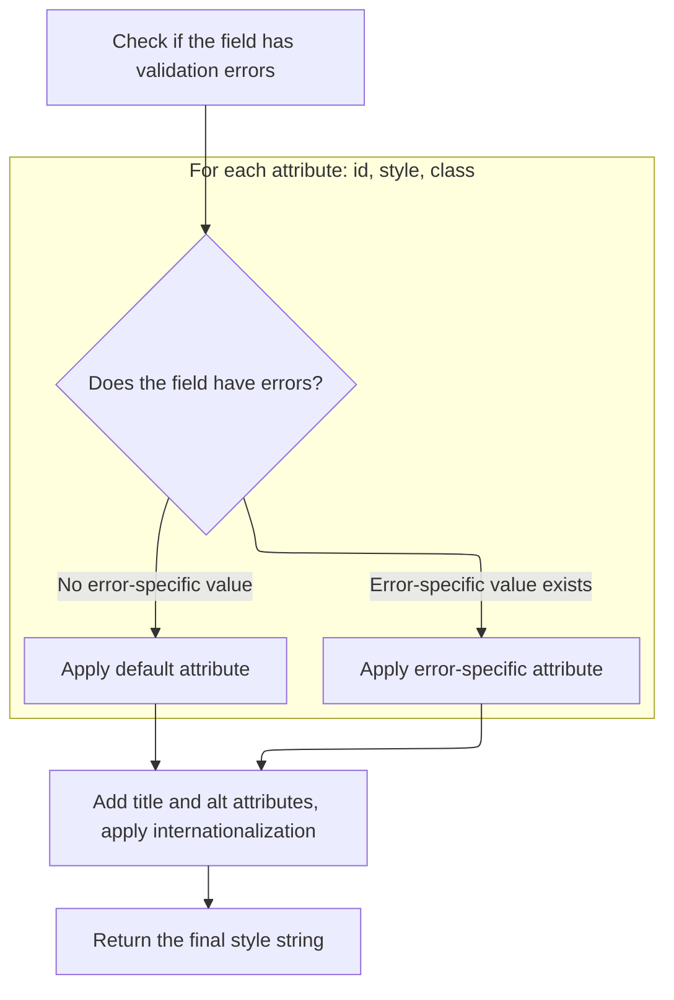

This document explains how a checkbox input is rendered in a web form, including the addition of attributes, event handlers, and conditional styling based on validation errors. The flow ensures that the checkbox is interactive and visually indicates any errors.

# Building Checkbox Input and Wiring Event Handlers

<SwmSnippet path="/taglib/src/main/java/org/apache/struts/taglib/html/CheckboxTag.java" line="114">

---

In <SwmToken path="taglib/src/main/java/org/apache/struts/taglib/html/CheckboxTag.java" pos="114:5:5" line-data="    public int doStartTag() throws JspException {">`doStartTag`</SwmToken>, we're assembling the HTML for a checkbox input by appending attributes like name, accesskey, tabindex, value, and checked status using helper methods. We call <SwmToken path="taglib/src/main/java/org/apache/struts/taglib/html/CheckboxTag.java" pos="128:5:5" line-data="        results.append(prepareEventHandlers());">`prepareEventHandlers`</SwmToken> next to add any <SwmToken path="taglib/src/main/java/org/apache/struts/taglib/html/BaseHandlerTag.java" pos="42:3:3" line-data=" * JavaScript event handlers and/or CSS Style attributes. This class does not">`JavaScript`</SwmToken> event handlers, keeping the logic modular and clean.

```java
    public int doStartTag() throws JspException {
        // Create an appropriate "input" element based on our parameters
        StringBuffer results = new StringBuffer("<input type=\"checkbox\"");

        prepareAttribute(results, "name", prepareName());
        prepareAttribute(results, "accesskey", getAccesskey());
        prepareAttribute(results, "tabindex", getTabindex());

        prepareAttribute(results, "value", getValue());

        if (isChecked()) {
            results.append(" checked=\"checked\"");
        }

        results.append(prepareEventHandlers());
```

---

</SwmSnippet>

<SwmSnippet path="/taglib/src/main/java/org/apache/struts/taglib/html/BaseHandlerTag.java" line="1039">

---

<SwmToken path="taglib/src/main/java/org/apache/struts/taglib/html/BaseHandlerTag.java" pos="1039:5:5" line-data="    protected String prepareEventHandlers() {">`prepareEventHandlers`</SwmToken> builds up all the event handler attributes by calling separate methods for mouse, key, text, and focus events, then returns the combined string. This keeps event logic modular and easy to update.

```java
    protected String prepareEventHandlers() {
        StringBuffer handlers = new StringBuffer();

        prepareMouseEvents(handlers);
        prepareKeyEvents(handlers);
        prepareTextEvents(handlers);
        prepareFocusEvents(handlers);

        return handlers.toString();
    }
```

---

</SwmSnippet>

<SwmSnippet path="/taglib/src/main/java/org/apache/struts/taglib/html/CheckboxTag.java" line="129">

---

Back in `CheckboxTag.doStartTag`, after adding event handlers, we call <SwmToken path="taglib/src/main/java/org/apache/struts/taglib/html/CheckboxTag.java" pos="129:5:5" line-data="        results.append(prepareStyles());">`prepareStyles`</SwmToken> to append style-related attributes. This step ensures the checkbox reflects any error state or custom styling before finishing the HTML element.

```java
        results.append(prepareStyles());
```

---

</SwmSnippet>

## Applying Conditional Styles Based on Error State



<SwmSnippet path="/taglib/src/main/java/org/apache/struts/taglib/html/BaseHandlerTag.java" line="967">

---

In <SwmToken path="taglib/src/main/java/org/apache/struts/taglib/html/BaseHandlerTag.java" pos="967:5:5" line-data="    protected String prepareStyles()">`prepareStyles`</SwmToken>, we check for errors and decide whether to use error-specific or normal style attributes. Next, we call <SwmToken path="taglib/src/main/java/org/apache/struts/taglib/html/BaseHandlerTag.java" pos="971:7:7" line-data="        boolean errorsExist = doErrorsExist();">`doErrorsExist`</SwmToken> to figure out if error styling is needed.

```java
    protected String prepareStyles()
        throws JspException {
        StringBuffer styles = new StringBuffer();

        boolean errorsExist = doErrorsExist();

```

---

</SwmSnippet>

<SwmSnippet path="/taglib/src/main/java/org/apache/struts/taglib/html/BaseHandlerTag.java" line="1003">

---

<SwmToken path="taglib/src/main/java/org/apache/struts/taglib/html/BaseHandlerTag.java" pos="1003:5:5" line-data="    protected boolean doErrorsExist()">`doErrorsExist`</SwmToken> checks if error style attributes are set and then looks up errors for the checkbox's name in the page context. If errors are found, error styling kicks in.

```java
    protected boolean doErrorsExist()
        throws JspException {
        boolean errorsExist = false;

        if ((getErrorStyleId() != null) || (getErrorStyle() != null)
            || (getErrorStyleClass() != null)) {
            String actualName = prepareName();

            if (actualName != null) {
                ActionMessages errors =
                    TagUtils.getInstance().getActionMessages(pageContext,
                        errorKey);

                errorsExist = ((errors != null)
                    && (errors.size(actualName) > 0));
            }
        }

        return errorsExist;
    }
```

---

</SwmSnippet>

<SwmSnippet path="/taglib/src/main/java/org/apache/struts/taglib/html/BaseHandlerTag.java" line="973">

---

After returning from <SwmToken path="taglib/src/main/java/org/apache/struts/taglib/html/BaseHandlerTag.java" pos="971:7:7" line-data="        boolean errorsExist = doErrorsExist();">`doErrorsExist`</SwmToken>, <SwmToken path="taglib/src/main/java/org/apache/struts/taglib/html/CheckboxTag.java" pos="129:5:5" line-data="        results.append(prepareStyles());">`prepareStyles`</SwmToken> appends either error or normal style attributes, plus title and alt with i18n support. This ensures the checkbox visually reflects any error state and is ready for rendering.

```java
        if (errorsExist && (getErrorStyleId() != null)) {
            prepareAttribute(styles, "id", getErrorStyleId());
        } else {
            prepareAttribute(styles, "id", getStyleId());
        }

        if (errorsExist && (getErrorStyle() != null)) {
            prepareAttribute(styles, "style", getErrorStyle());
        } else {
            prepareAttribute(styles, "style", getStyle());
        }

        if (errorsExist && (getErrorStyleClass() != null)) {
            prepareAttribute(styles, "class", getErrorStyleClass());
        } else {
            prepareAttribute(styles, "class", getStyleClass());
        }

        prepareAttribute(styles, "title", message(getTitle(), getTitleKey()));
        prepareAttribute(styles, "alt", message(getAlt(), getAltKey()));
        prepareInternationalization(styles);

        return styles.toString();
    }
```

---

</SwmSnippet>

## Finalizing Checkbox Output and Rendering

<SwmSnippet path="/taglib/src/main/java/org/apache/struts/taglib/html/CheckboxTag.java" line="130">

---

After returning from <SwmToken path="taglib/src/main/java/org/apache/struts/taglib/html/CheckboxTag.java" pos="129:5:5" line-data="        results.append(prepareStyles());">`prepareStyles`</SwmToken>, `CheckboxTag.doStartTag` finishes by adding any remaining attributes, closes the input element, writes the HTML to the page, resets its text state, and tells the JSP engine to process the tag body.

```java
        prepareOtherAttributes(results);
        results.append(getElementClose());

        // Print this field to our output writer
        TagUtils.getInstance().write(pageContext, results.toString());

        // Continue processing this page
        this.text = null;

        return (EVAL_BODY_TAG);
    }
```

---

</SwmSnippet>

&nbsp;

*This is an auto-generated document by Swimm 🌊 and has not yet been verified by a human*

<SwmMeta version="3.0.0" repo-id="Z2l0aHViJTNBJTNBc3RydXRzMSUzQSUzQVN3aW1tLURlbW8=" repo-name="struts1"><sup>Powered by [Swimm](https://app.swimm.io/)</sup></SwmMeta>
