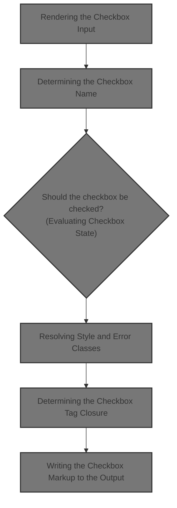
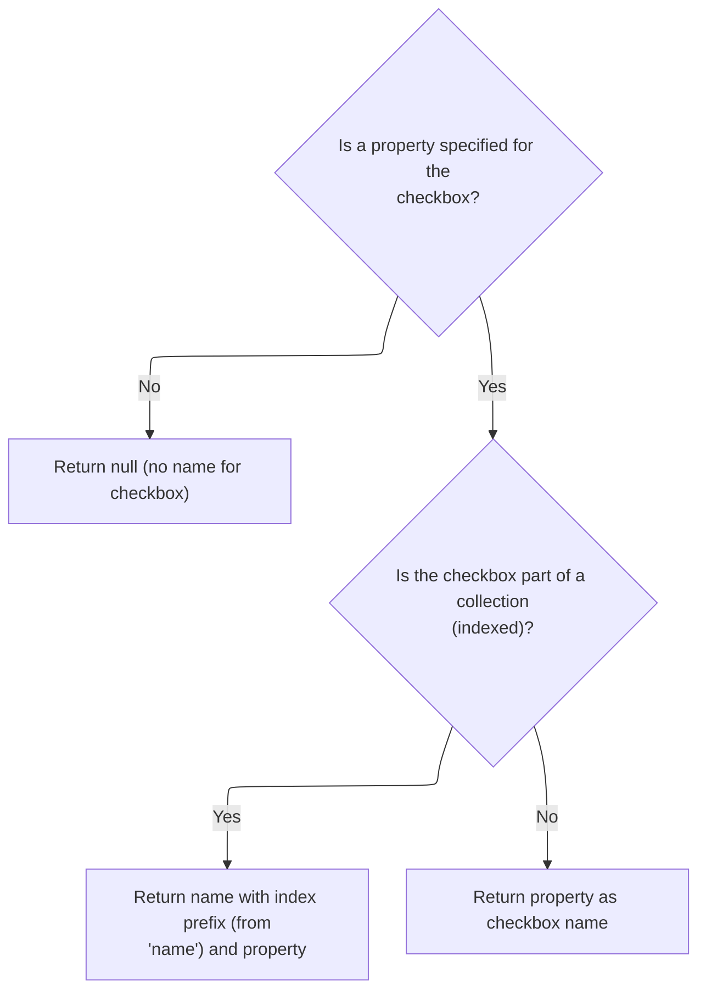
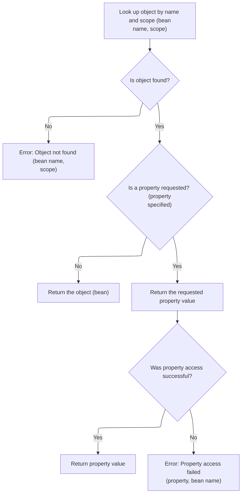
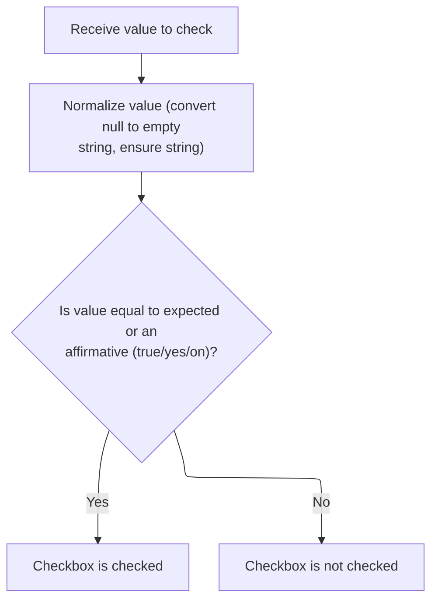
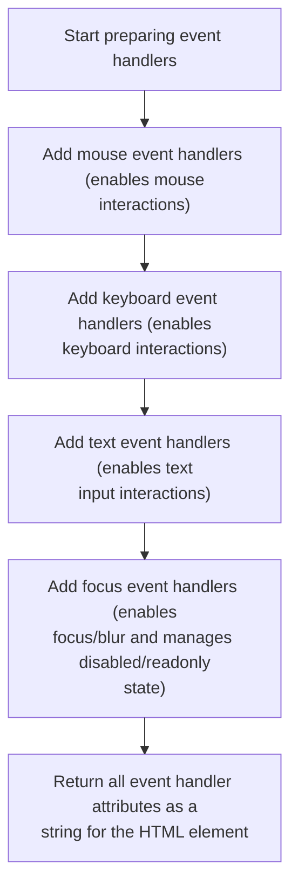
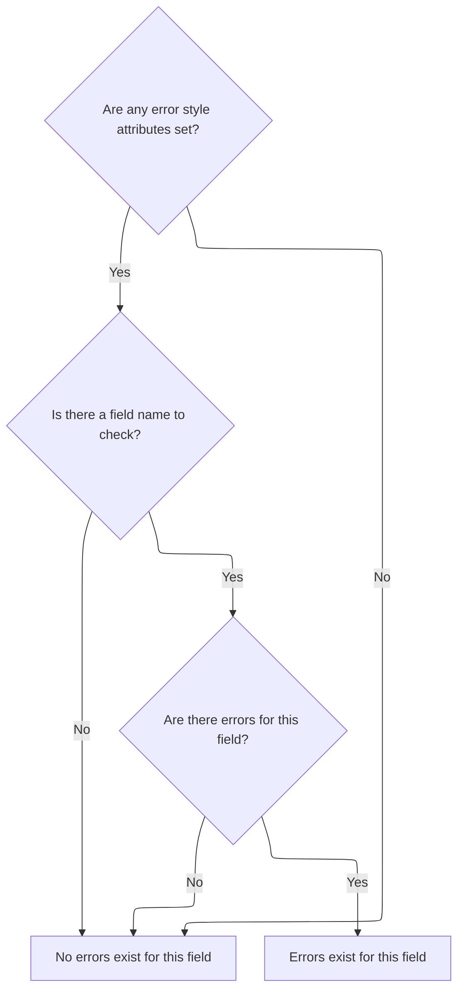
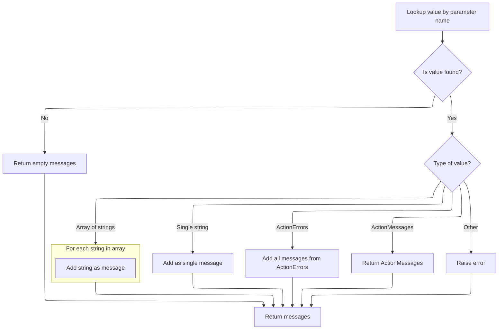

This document explains how a checkbox input is rendered in a web form, ensuring it is correctly named, styled, and reflects the current data and validation state. The flow receives configuration and user or business data as input, and outputs the final checkbox markup, compatible with HTML or XHTML standards.



# Rendering the Checkbox Input

```mermaid
%%{init: {"flowchart": {"defaultRenderer": "elk"}} }%%
flowchart TD
  node1["Start: Begin checkbox creation"]
  click node1 openCode "taglib/src/main/java/org/apache/struts/taglib/html/CheckboxTag.java:114:118"
  node1 --> node2["Determining the Checkbox Name"]
  
  node2 --> node3["Building Indexed Names"]
  
  node3 --> node4["Set accessibility and value attributes"]
  click node4 openCode "taglib/src/main/java/org/apache/struts/taglib/html/CheckboxTag.java:119:124"
  node4 --> node5{"Checkbox checked? (user/business data)"}
  
  node5 -->|"Yes"| node6["Add 'checked' to checkbox"]
  click node6 openCode "taglib/src/main/java/org/apache/struts/taglib/html/CheckboxTag.java:124:126"
  node5 -->|"No"| node7["Skip 'checked' attribute"]
  click node7 openCode "taglib/src/main/java/org/apache/struts/taglib/html/CheckboxTag.java:124:126"
  node6 --> node8["Collecting Event and State Attributes"]
  node7 --> node8
  
  node8 --> node9["Resolving Style and Error Classes"]
  
  node9 --> node10["Add other attributes"]
  click node10 openCode "taglib/src/main/java/org/apache/struts/taglib/html/CheckboxTag.java:130:131"
  node10 --> node11["Determining the Checkbox Tag Closure"]
  
  node11 --> node12{"Output as XHTML? (business
compatibility)"}
  
  node12 -->|"Yes"| node13["Resolving XHTML Flag from Context"]
  
  node12 -->|"No"| node14["Use HTML closing tag"]
  click node14 openCode "taglib/src/main/java/org/apache/struts/taglib/TagUtils.java:863:863"
  node13 --> node15["Fetching Context Attribute for Rendering Mode"]
  
  node14 --> node15
  node15 --> node16["Output checkbox to page (final
rendering)"]
  click node16 openCode "taglib/src/main/java/org/apache/struts/taglib/html/CheckboxTag.java:133:140"
classDef HeadingStyle fill:#777777,stroke:#333,stroke-width:2px;
click node2 goToHeading "Determining the Checkbox Name"
node2:::HeadingStyle
click node3 goToHeading "Building Indexed Names"
node3:::HeadingStyle
click node5 goToHeading "Evaluating Checkbox State"
node5:::HeadingStyle
click node8 goToHeading "Collecting Event and State Attributes"
node8:::HeadingStyle
click node9 goToHeading "Resolving Style and Error Classes"
node9:::HeadingStyle
click node11 goToHeading "Determining the Checkbox Tag Closure"
node11:::HeadingStyle
click node12 goToHeading "Checking for XHTML Mode"
node12:::HeadingStyle
click node13 goToHeading "Resolving XHTML Flag from Context"
node13:::HeadingStyle
click node15 goToHeading "Fetching Context Attribute for Rendering Mode"
node15:::HeadingStyle

%% Swimm:
%% %%{init: {"flowchart": {"defaultRenderer": "elk"}} }%%
%% flowchart TD
%%   node1["Start: Begin checkbox creation"]
%%   click node1 openCode "<SwmPath>[taglib/…/html/CheckboxTag.java](taglib/src/main/java/org/apache/struts/taglib/html/CheckboxTag.java)</SwmPath>:114:118"
%%   node1 --> node2["Determining the Checkbox Name"]
%%   
%%   node2 --> node3["Building Indexed Names"]
%%   
%%   node3 --> node4["Set accessibility and value attributes"]
%%   click node4 openCode "<SwmPath>[taglib/…/html/CheckboxTag.java](taglib/src/main/java/org/apache/struts/taglib/html/CheckboxTag.java)</SwmPath>:119:124"
%%   node4 --> node5{"Checkbox checked? (user/business data)"}
%%   
%%   node5 -->|"Yes"| node6["Add 'checked' to checkbox"]
%%   click node6 openCode "<SwmPath>[taglib/…/html/CheckboxTag.java](taglib/src/main/java/org/apache/struts/taglib/html/CheckboxTag.java)</SwmPath>:124:126"
%%   node5 -->|"No"| node7["Skip 'checked' attribute"]
%%   click node7 openCode "<SwmPath>[taglib/…/html/CheckboxTag.java](taglib/src/main/java/org/apache/struts/taglib/html/CheckboxTag.java)</SwmPath>:124:126"
%%   node6 --> node8["Collecting Event and State Attributes"]
%%   node7 --> node8
%%   
%%   node8 --> node9["Resolving Style and Error Classes"]
%%   
%%   node9 --> node10["Add other attributes"]
%%   click node10 openCode "<SwmPath>[taglib/…/html/CheckboxTag.java](taglib/src/main/java/org/apache/struts/taglib/html/CheckboxTag.java)</SwmPath>:130:131"
%%   node10 --> node11["Determining the Checkbox Tag Closure"]
%%   
%%   node11 --> node12{"Output as XHTML? (business
%% compatibility)"}
%%   
%%   node12 -->|"Yes"| node13["Resolving XHTML Flag from Context"]
%%   
%%   node12 -->|"No"| node14["Use HTML closing tag"]
%%   click node14 openCode "<SwmPath>[taglib/…/taglib/TagUtils.java](taglib/src/main/java/org/apache/struts/taglib/TagUtils.java)</SwmPath>:863:863"
%%   node13 --> node15["Fetching Context Attribute for Rendering Mode"]
%%   
%%   node14 --> node15
%%   node15 --> node16["Output checkbox to page (final
%% rendering)"]
%%   click node16 openCode "<SwmPath>[taglib/…/html/CheckboxTag.java](taglib/src/main/java/org/apache/struts/taglib/html/CheckboxTag.java)</SwmPath>:133:140"
%% classDef HeadingStyle fill:#777777,stroke:#333,stroke-width:2px;
%% click node2 goToHeading "Determining the Checkbox Name"
%% node2:::HeadingStyle
%% click node3 goToHeading "Building Indexed Names"
%% node3:::HeadingStyle
%% click node5 goToHeading "Evaluating Checkbox State"
%% node5:::HeadingStyle
%% click node8 goToHeading "Collecting Event and State Attributes"
%% node8:::HeadingStyle
%% click node9 goToHeading "Resolving Style and Error Classes"
%% node9:::HeadingStyle
%% click node11 goToHeading "Determining the Checkbox Tag Closure"
%% node11:::HeadingStyle
%% click node12 goToHeading "Checking for XHTML Mode"
%% node12:::HeadingStyle
%% click node13 goToHeading "Resolving XHTML Flag from Context"
%% node13:::HeadingStyle
%% click node15 goToHeading "Fetching Context Attribute for Rendering Mode"
%% node15:::HeadingStyle
```



<SwmSnippet path="/taglib/src/main/java/org/apache/struts/taglib/html/CheckboxTag.java" line="114">

---

In <SwmToken path="taglib/src/main/java/org/apache/struts/taglib/html/CheckboxTag.java" pos="114:5:5" line-data="    public int doStartTag() throws JspException {">`doStartTag`</SwmToken>, we're starting to build the checkbox input element and immediately call <SwmToken path="taglib/src/main/java/org/apache/struts/taglib/html/CheckboxTag.java" pos="118:11:11" line-data="        prepareAttribute(results, &quot;name&quot;, prepareName());">`prepareName`</SwmToken> to get the correct name for the input. This ensures the checkbox is tied to the right property for form submission.

```java
    public int doStartTag() throws JspException {
        // Create an appropriate "input" element based on our parameters
        StringBuffer results = new StringBuffer("<input type=\"checkbox\"");

        prepareAttribute(results, "name", prepareName());
```

---

</SwmSnippet>

## Determining the Checkbox Name



<SwmSnippet path="/taglib/src/main/java/org/apache/struts/taglib/html/CheckboxTag.java" line="204">

---

<SwmToken path="taglib/src/main/java/org/apache/struts/taglib/html/CheckboxTag.java" pos="204:5:5" line-data="    protected String prepareName()">`prepareName`</SwmToken> figures out what the checkbox's name should be. If we're dealing with indexed checkboxes, it calls <SwmToken path="taglib/src/main/java/org/apache/struts/taglib/html/CheckboxTag.java" pos="214:1:1" line-data="            prepareIndex(results, name);">`prepareIndex`</SwmToken> to append the index to the name, so each checkbox in a collection is uniquely identified.

```java
    protected String prepareName()
        throws JspException {
        if (property == null) {
            return null;
        }

        // * @since Struts 1.1
        if (indexed) {
            StringBuffer results = new StringBuffer();

            prepareIndex(results, name);
            results.append(property);

            return results.toString();
        }

        return property;
    }
```

---

</SwmSnippet>

## Building Indexed Names

<SwmSnippet path="/taglib/src/main/java/org/apache/struts/taglib/html/BaseHandlerTag.java" line="913">

---

In <SwmToken path="taglib/src/main/java/org/apache/struts/taglib/html/BaseHandlerTag.java" pos="913:5:5" line-data="    protected void prepareIndex(StringBuffer handlers, String name)">`prepareIndex`</SwmToken>, we're building the name for an indexed checkbox by filtering the base name, adding the index in brackets, and prepping for property concatenation. This sets up unique names for each checkbox in a loop.

```java
    protected void prepareIndex(StringBuffer handlers, String name)
        throws JspException {
        if (name != null) {
            handlers.append(TagUtils.getInstance().filter(name));
        }

        handlers.append("[");
        handlers.append(getIndexValue());
```

---

</SwmSnippet>

### Resolving the Current Index

See <SwmLink doc-title="Determining Tag Index in Loop Structures">[Determining Tag Index in Loop Structures](/.swm/determining-tag-index-in-loop-structures.wqll3s5q.sw.md)</SwmLink>

### Finalizing Indexed Name Format

<SwmSnippet path="/taglib/src/main/java/org/apache/struts/taglib/html/BaseHandlerTag.java" line="921">

---

Back in <SwmToken path="taglib/src/main/java/org/apache/struts/taglib/html/CheckboxTag.java" pos="214:1:1" line-data="            prepareIndex(results, name);">`prepareIndex`</SwmToken>, after getting the index, we close the brackets and add a dot if the base name exists. This shapes the name for Struts property mapping.

```java
        handlers.append("]");

        if (name != null) {
            handlers.append(".");
        }
    }
```

---

</SwmSnippet>

## Adding Checkbox Attributes

<SwmSnippet path="/taglib/src/main/java/org/apache/struts/taglib/html/CheckboxTag.java" line="119">

---

Back in <SwmToken path="taglib/src/main/java/org/apache/struts/taglib/html/CheckboxTag.java" pos="114:5:5" line-data="    public int doStartTag() throws JspException {">`doStartTag`</SwmToken>, after getting the name, we add accesskey, tabindex, and value attributes. Next, we call `LabelTag.prepareAttribute` to handle special cases like required fields and CSS classes.

```java
        prepareAttribute(results, "accesskey", getAccesskey());
        prepareAttribute(results, "tabindex", getTabindex());

        prepareAttribute(results, "value", getValue());

```

---

</SwmSnippet>

<SwmSnippet path="/taglib/src/main/java/org/apache/struts/taglib/html/LabelTag.java" line="161">

---

<SwmToken path="taglib/src/main/java/org/apache/struts/taglib/html/LabelTag.java" pos="161:5:5" line-data="    protected void prepareAttribute(StringBuffer handlers, String name,">`prepareAttribute`</SwmToken> in <SwmToken path="taglib/src/main/java/org/apache/struts/taglib/html/LabelTag.java" pos="33:4:4" line-data="public class LabelTag extends BaseInputTag {">`LabelTag`</SwmToken> checks if the attribute is 'class' and required, then adds a required style class. After that, it delegates to the superclass to finish the attribute formatting.

```java
    protected void prepareAttribute(StringBuffer handlers, String name,
            Object value) {

        if ("class".equals(name) && this.required) {
            String requiredStyleClass = getRequiredStyleClass();
            if (requiredStyleClass != null) {
                value = (value != null) ? (value + " " + requiredStyleClass)
                        : requiredStyleClass;
            }
        }
        super.prepareAttribute(handlers, name, value);
    }
```

---

</SwmSnippet>

<SwmSnippet path="/taglib/src/main/java/org/apache/struts/taglib/html/CheckboxTag.java" line="124">

---

Back in <SwmToken path="taglib/src/main/java/org/apache/struts/taglib/html/CheckboxTag.java" pos="114:5:5" line-data="    public int doStartTag() throws JspException {">`doStartTag`</SwmToken>, after handling attributes, we check if the checkbox should be marked as checked. Next, we call <SwmToken path="taglib/src/main/java/org/apache/struts/taglib/html/CheckboxTag.java" pos="124:4:4" line-data="        if (isChecked()) {">`isChecked`</SwmToken> to figure out if the checked attribute needs to be added.

```java
        if (isChecked()) {
            results.append(" checked=\"checked\"");
        }

```

---

</SwmSnippet>

## Evaluating Checkbox State

<SwmSnippet path="/taglib/src/main/java/org/apache/struts/taglib/html/CheckboxTag.java" line="149">

---

In <SwmToken path="taglib/src/main/java/org/apache/struts/taglib/html/CheckboxTag.java" pos="149:5:5" line-data="    protected boolean isChecked()">`isChecked`</SwmToken>, we use TagUtils.lookup to grab the current value for the checkbox from the bean. This lets us compare and decide if the checkbox should be checked.

```java
    protected boolean isChecked()
        throws JspException {
        Object result =
            TagUtils.getInstance().lookup(pageContext, name, property, null);

```

---

</SwmSnippet>

### Retrieving Bean Property Value



<SwmSnippet path="/taglib/src/main/java/org/apache/struts/taglib/TagUtils.java" line="897">

---

<SwmToken path="taglib/src/main/java/org/apache/struts/taglib/TagUtils.java" pos="912:1:1" line-data="            saveException(pageContext, e);">`saveException`</SwmToken> stores the exception in the request scope so it's accessible for error handling or display later.

```java
    public Object lookup(PageContext pageContext, String name, String property,
        String scope) throws JspException {
        // Look up the requested bean, and return if requested
        Object bean = lookup(pageContext, name, scope);

        if (bean == null) {
            JspException e = null;

            if (scope == null) {
                e = new JspException(messages.getMessage("lookup.bean.any", name));
            } else {
                e = new JspException(messages.getMessage("lookup.bean", name,
                            scope));
            }

            saveException(pageContext, e);
            throw e;
        }

        if (property == null) {
            return bean;
        }

        // Locate and return the specified property
        try {
            return PropertyUtils.getProperty(bean, property);
        } catch (IllegalAccessException e) {
            saveException(pageContext, e);
            throw new JspException(messages.getMessage("lookup.access",
                    property, name), e);
        } catch (IllegalArgumentException e) {
            saveException(pageContext, e);
            throw new JspException(messages.getMessage("lookup.argument",
                    property, name), e);
        } catch (InvocationTargetException e) {
            Throwable t = e.getTargetException();

            if (t == null) {
                t = e;
            }

            saveException(pageContext, t);
            throw new JspException(messages.getMessage("lookup.target",
                    property, name), e);
        } catch (NoSuchMethodException e) {
            saveException(pageContext, e);

```

---

</SwmSnippet>

<SwmSnippet path="/taglib/src/main/java/org/apache/struts/taglib/TagUtils.java" line="1170">

---

<SwmToken path="taglib/src/main/java/org/apache/struts/taglib/html/CheckboxTag.java" pos="152:7:7" line-data="            TagUtils.getInstance().lookup(pageContext, name, property, null);">`lookup`</SwmToken> grabs the bean from the page context using the given scope and name, then fetches the property if specified. If anything fails, it logs the exception using <SwmToken path="taglib/src/main/java/org/apache/struts/taglib/TagUtils.java" pos="1170:5:5" line-data="    public void saveException(PageContext pageContext, Throwable exception) {">`saveException`</SwmToken> so error handling can pick it up.

```java
    public void saveException(PageContext pageContext, Throwable exception) {
        pageContext.setAttribute(Globals.EXCEPTION_KEY, exception,
            PageContext.REQUEST_SCOPE);
    }
```

---

</SwmSnippet>

<SwmSnippet path="/taglib/src/main/java/org/apache/struts/taglib/TagUtils.java" line="944">

---

Back in <SwmToken path="taglib/src/main/java/org/apache/struts/taglib/TagUtils.java" pos="947:12:12" line-data="            // an input tag. Thus lookup the bean under the key and use">`lookup`</SwmToken>, after handling exceptions, we tweak the bean name in error messages if it's the default key, so users get clearer info about which bean caused the problem.

```java
            String beanName = name;

            // Name defaults to Contants.BEAN_KEY if no name is specified by
            // an input tag. Thus lookup the bean under the key and use
            // its class name for the exception message.
            if (Constants.BEAN_KEY.equals(name)) {
                Object obj = pageContext.findAttribute(Constants.BEAN_KEY);

                if (obj != null) {
                    beanName = obj.getClass().getName();
                }
            }

            throw new JspException(messages.getMessage("lookup.method",
                    property, beanName), e);
        }
    }
```

---

</SwmSnippet>

### Interpreting the Checked Value



<SwmSnippet path="/taglib/src/main/java/org/apache/struts/taglib/html/CheckboxTag.java" line="154">

---

Back in <SwmToken path="taglib/src/main/java/org/apache/struts/taglib/html/CheckboxTag.java" pos="124:4:4" line-data="        if (isChecked()) {">`isChecked`</SwmToken>, after getting the value, we normalize it to a string and check against several possible values ('true', 'yes', 'on', or the checkbox value) to decide if the checkbox should be checked.

```java
        if (result == null) {
            result = "";
        }

        result = result.toString();

        String checked = (String) result;

        return (checked.equalsIgnoreCase(this.value)
        || checked.equalsIgnoreCase("true") || checked.equalsIgnoreCase("yes")
        || checked.equalsIgnoreCase("on"));
    }
```

---

</SwmSnippet>

## Adding Event Handlers

<SwmSnippet path="/taglib/src/main/java/org/apache/struts/taglib/html/CheckboxTag.java" line="128">

---

Back in <SwmToken path="taglib/src/main/java/org/apache/struts/taglib/html/CheckboxTag.java" pos="114:5:5" line-data="    public int doStartTag() throws JspException {">`doStartTag`</SwmToken>, after handling checked state, we add event handlers to the checkbox. Next, we call <SwmToken path="taglib/src/main/java/org/apache/struts/taglib/html/CheckboxTag.java" pos="128:5:5" line-data="        results.append(prepareEventHandlers());">`prepareEventHandlers`</SwmToken> to build up all the JS event attributes.

```java
        results.append(prepareEventHandlers());
```

---

</SwmSnippet>

## Collecting Event and State Attributes



<SwmSnippet path="/taglib/src/main/java/org/apache/struts/taglib/html/BaseHandlerTag.java" line="1039">

---

<SwmToken path="taglib/src/main/java/org/apache/struts/taglib/html/BaseHandlerTag.java" pos="1039:5:5" line-data="    protected String prepareEventHandlers() {">`prepareEventHandlers`</SwmToken> builds up all event-related attributes for the checkbox, including mouse, key, text, and focus events. Next, we call <SwmToken path="taglib/src/main/java/org/apache/struts/taglib/html/BaseHandlerTag.java" pos="1045:1:1" line-data="        prepareFocusEvents(handlers);">`prepareFocusEvents`</SwmToken> to add focus handlers and check for disabled/readonly states.

```java
    protected String prepareEventHandlers() {
        StringBuffer handlers = new StringBuffer();

        prepareMouseEvents(handlers);
        prepareKeyEvents(handlers);
        prepareTextEvents(handlers);
        prepareFocusEvents(handlers);

        return handlers.toString();
    }
```

---

</SwmSnippet>

<SwmSnippet path="/taglib/src/main/java/org/apache/struts/taglib/html/BaseHandlerTag.java" line="1095">

---

<SwmToken path="taglib/src/main/java/org/apache/struts/taglib/html/BaseHandlerTag.java" pos="1095:5:5" line-data="    protected void prepareFocusEvents(StringBuffer handlers) {">`prepareFocusEvents`</SwmToken> adds onblur/onfocus handlers and checks if the form or field is disabled/readonly. If so, it appends those attributes, which isn't obvious from the function name.

```java
    protected void prepareFocusEvents(StringBuffer handlers) {
        prepareAttribute(handlers, "onblur", getOnblur());
        prepareAttribute(handlers, "onfocus", getOnfocus());

        // Get the parent FormTag (if necessary)
        FormTag formTag = null;

        if ((doDisabled && !getDisabled()) || (doReadonly && !getReadonly())) {
            formTag =
                (FormTag) pageContext.getAttribute(Constants.FORM_KEY,
                    PageContext.REQUEST_SCOPE);
        }

        // Format Disabled
        if (doDisabled) {
            boolean formDisabled =
                (formTag == null) ? false : formTag.isDisabled();

            if (formDisabled || getDisabled()) {
                handlers.append(" disabled=\"disabled\"");
            }
        }

        // Format Read Only
        if (doReadonly) {
            boolean formReadOnly =
                (formTag == null) ? false : formTag.isReadonly();

            if (formReadOnly || getReadonly()) {
                handlers.append(" readonly=\"readonly\"");
            }
        }
    }
```

---

</SwmSnippet>

## Adding Style Attributes

<SwmSnippet path="/taglib/src/main/java/org/apache/struts/taglib/html/CheckboxTag.java" line="129">

---

Back in <SwmToken path="taglib/src/main/java/org/apache/struts/taglib/html/CheckboxTag.java" pos="114:5:5" line-data="    public int doStartTag() throws JspException {">`doStartTag`</SwmToken>, after event handlers, we add style attributes. Next, we call <SwmToken path="taglib/src/main/java/org/apache/struts/taglib/html/CheckboxTag.java" pos="129:5:5" line-data="        results.append(prepareStyles());">`prepareStyles`</SwmToken> to handle normal and error styling.

```java
        results.append(prepareStyles());
```

---

</SwmSnippet>

## Resolving Style and Error Classes

<SwmSnippet path="/taglib/src/main/java/org/apache/struts/taglib/html/BaseHandlerTag.java" line="967">

---

In <SwmToken path="taglib/src/main/java/org/apache/struts/taglib/html/BaseHandlerTag.java" pos="967:5:5" line-data="    protected String prepareStyles()">`prepareStyles`</SwmToken>, we start by checking if there are errors for this field. If so, we use error styles; otherwise, we use normal styles. Next, we call <SwmToken path="taglib/src/main/java/org/apache/struts/taglib/html/BaseHandlerTag.java" pos="971:7:7" line-data="        boolean errorsExist = doErrorsExist();">`doErrorsExist`</SwmToken> to see if error styling is needed.

```java
    protected String prepareStyles()
        throws JspException {
        StringBuffer styles = new StringBuffer();

        boolean errorsExist = doErrorsExist();

```

---

</SwmSnippet>

### Checking for Field Errors



<SwmSnippet path="/taglib/src/main/java/org/apache/struts/taglib/html/BaseHandlerTag.java" line="1003">

---

In <SwmToken path="taglib/src/main/java/org/apache/struts/taglib/html/BaseHandlerTag.java" pos="1003:5:5" line-data="    protected boolean doErrorsExist()">`doErrorsExist`</SwmToken>, we check if error styling is needed by looking for error style attributes and then use <SwmToken path="taglib/src/main/java/org/apache/struts/taglib/html/BaseHandlerTag.java" pos="1009:7:7" line-data="            String actualName = prepareName();">`prepareName`</SwmToken> to get the field name for error lookup.

```java
    protected boolean doErrorsExist()
        throws JspException {
        boolean errorsExist = false;

        if ((getErrorStyleId() != null) || (getErrorStyle() != null)
            || (getErrorStyleClass() != null)) {
            String actualName = prepareName();

```

---

</SwmSnippet>

<SwmSnippet path="/taglib/src/main/java/org/apache/struts/taglib/html/BaseHandlerTag.java" line="1029">

---

<SwmToken path="taglib/src/main/java/org/apache/struts/taglib/html/BaseHandlerTag.java" pos="1029:5:5" line-data="    protected String prepareName()">`prepareName`</SwmToken> here just returns null, so no actual name is prepared. This is likely a placeholder or stub.

```java
    protected String prepareName()
        throws JspException {
        return null;
    }
```

---

</SwmSnippet>

<SwmSnippet path="/taglib/src/main/java/org/apache/struts/taglib/html/BaseHandlerTag.java" line="1011">

---

Back in <SwmToken path="taglib/src/main/java/org/apache/struts/taglib/html/BaseHandlerTag.java" pos="971:7:7" line-data="        boolean errorsExist = doErrorsExist();">`doErrorsExist`</SwmToken>, after getting the actual name, we use TagUtils.getActionMessages to fetch errors for this field. If errors exist, we flag it for error styling.

```java
            if (actualName != null) {
                ActionMessages errors =
                    TagUtils.getInstance().getActionMessages(pageContext,
                        errorKey);

                errorsExist = ((errors != null)
                    && (errors.size(actualName) > 0));
            }
        }

        return errorsExist;
    }
```

---

</SwmSnippet>

### Fetching Validation Messages



<SwmSnippet path="/taglib/src/main/java/org/apache/struts/taglib/TagUtils.java" line="727">

---

<SwmToken path="taglib/src/main/java/org/apache/struts/taglib/TagUtils.java" pos="727:5:5" line-data="    public ActionMessages getActionMessages(PageContext pageContext,">`getActionMessages`</SwmToken> grabs validation messages from the page context. It handles strings, arrays, <SwmToken path="taglib/src/main/java/org/apache/struts/taglib/TagUtils.java" pos="745:12:12" line-data="                } else if (value instanceof ActionErrors) {">`ActionErrors`</SwmToken>, and <SwmToken path="taglib/src/main/java/org/apache/struts/taglib/TagUtils.java" pos="727:3:3" line-data="    public ActionMessages getActionMessages(PageContext pageContext,">`ActionMessages`</SwmToken>, converting them all to <SwmToken path="taglib/src/main/java/org/apache/struts/taglib/TagUtils.java" pos="727:3:3" line-data="    public ActionMessages getActionMessages(PageContext pageContext,">`ActionMessages`</SwmToken> for consistent error handling.

```java
    public ActionMessages getActionMessages(PageContext pageContext,
        String paramName) throws JspException {
        ActionMessages am = new ActionMessages();

        Object value = pageContext.findAttribute(paramName);

        if (value != null) {
            try {
                if (value instanceof String) {
                    am.add(ActionMessages.GLOBAL_MESSAGE,
                        new ActionMessage((String) value));
                } else if (value instanceof String[]) {
                    String[] keys = (String[]) value;

                    for (int i = 0; i < keys.length; i++) {
                        am.add(ActionMessages.GLOBAL_MESSAGE,
                            new ActionMessage(keys[i]));
                    }
```

---

</SwmSnippet>

<SwmSnippet path="/taglib/src/main/java/org/apache/struts/taglib/TagUtils.java" line="745">

---

<SwmToken path="taglib/src/main/java/org/apache/struts/taglib/html/BaseHandlerTag.java" pos="1013:7:7" line-data="                    TagUtils.getInstance().getActionMessages(pageContext,">`getActionMessages`</SwmToken> returns an <SwmToken path="taglib/src/main/java/org/apache/struts/taglib/TagUtils.java" pos="746:1:1" line-data="                    ActionMessages m = (ActionMessages) value;">`ActionMessages`</SwmToken> object, consolidating any errors found for the field, regardless of the original type.

```java
                } else if (value instanceof ActionErrors) {
                    ActionMessages m = (ActionMessages) value;

                    am.add(m);
                } else if (value instanceof ActionMessages) {
                    am = (ActionMessages) value;
                } else {
                    throw new JspException(messages.getMessage(
                            "actionMessages.errors", value.getClass().getName()));
                }
            } catch (JspException e) {
                throw e;
            } catch (Exception e) {
                log.warn("Unable to retieve ActionMessage for paramName : "
                    + paramName, e);
            }
        }

        return am;
    }
```

---

</SwmSnippet>

### Applying Styles Based on Error State

```mermaid
%%{init: {"flowchart": {"defaultRenderer": "elk"}} }%%
flowchart TD
    node1["Start preparing field appearance"] --> node2{"id: Errors exist and error id defined?"}
    click node1 openCode "taglib/src/main/java/org/apache/struts/taglib/html/BaseHandlerTag.java:973:973"
    node2 -->|"Yes"| node3["Apply error-specific id"]
    click node2 openCode "taglib/src/main/java/org/apache/struts/taglib/html/BaseHandlerTag.java:973:975"
    node2 -->|"No"| node4["Apply normal id"]
    click node3 openCode "taglib/src/main/java/org/apache/struts/taglib/html/BaseHandlerTag.java:974:974"
    click node4 openCode "taglib/src/main/java/org/apache/struts/taglib/html/BaseHandlerTag.java:976:976"
    node3 --> node5{"style: Errors exist and error style
defined?"}
    node4 --> node5
    node5 -->|"Yes"| node6["Apply error-specific style"]
    node5 -->|"No"| node7["Apply normal style"]
    click node5 openCode "taglib/src/main/java/org/apache/struts/taglib/html/BaseHandlerTag.java:979:981"
    click node6 openCode "taglib/src/main/java/org/apache/struts/taglib/html/BaseHandlerTag.java:980:980"
    click node7 openCode "taglib/src/main/java/org/apache/struts/taglib/html/BaseHandlerTag.java:982:982"
    node6 --> node8{"class: Errors exist and error class
defined?"}
    node7 --> node8
    node8 -->|"Yes"| node9["Apply error-specific class"]
    node8 -->|"No"| node10["Apply normal class"]
    click node8 openCode "taglib/src/main/java/org/apache/struts/taglib/html/BaseHandlerTag.java:985:987"
    click node9 openCode "taglib/src/main/java/org/apache/struts/taglib/html/BaseHandlerTag.java:986:986"
    click node10 openCode "taglib/src/main/java/org/apache/struts/taglib/html/BaseHandlerTag.java:988:988"
    node9 --> node11["Set title and alt (with
internationalization)"]
    node10 --> node11
    click node11 openCode "taglib/src/main/java/org/apache/struts/taglib/html/BaseHandlerTag.java:991:992"
    node11 --> node12["Add further internationalization
attributes"]
    click node12 openCode "taglib/src/main/java/org/apache/struts/taglib/html/BaseHandlerTag.java:993:993"
    node12 --> node13["Return final styles string"]
    click node13 openCode "taglib/src/main/java/org/apache/struts/taglib/html/BaseHandlerTag.java:995:995"

classDef HeadingStyle fill:#777777,stroke:#333,stroke-width:2px;

%% Swimm:
%% %%{init: {"flowchart": {"defaultRenderer": "elk"}} }%%
%% flowchart TD
%%     node1["Start preparing field appearance"] --> node2{"id: Errors exist and error id defined?"}
%%     click node1 openCode "<SwmPath>[taglib/…/html/BaseHandlerTag.java](taglib/src/main/java/org/apache/struts/taglib/html/BaseHandlerTag.java)</SwmPath>:973:973"
%%     node2 -->|"Yes"| node3["Apply error-specific id"]
%%     click node2 openCode "<SwmPath>[taglib/…/html/BaseHandlerTag.java](taglib/src/main/java/org/apache/struts/taglib/html/BaseHandlerTag.java)</SwmPath>:973:975"
%%     node2 -->|"No"| node4["Apply normal id"]
%%     click node3 openCode "<SwmPath>[taglib/…/html/BaseHandlerTag.java](taglib/src/main/java/org/apache/struts/taglib/html/BaseHandlerTag.java)</SwmPath>:974:974"
%%     click node4 openCode "<SwmPath>[taglib/…/html/BaseHandlerTag.java](taglib/src/main/java/org/apache/struts/taglib/html/BaseHandlerTag.java)</SwmPath>:976:976"
%%     node3 --> node5{"style: Errors exist and error style
%% defined?"}
%%     node4 --> node5
%%     node5 -->|"Yes"| node6["Apply error-specific style"]
%%     node5 -->|"No"| node7["Apply normal style"]
%%     click node5 openCode "<SwmPath>[taglib/…/html/BaseHandlerTag.java](taglib/src/main/java/org/apache/struts/taglib/html/BaseHandlerTag.java)</SwmPath>:979:981"
%%     click node6 openCode "<SwmPath>[taglib/…/html/BaseHandlerTag.java](taglib/src/main/java/org/apache/struts/taglib/html/BaseHandlerTag.java)</SwmPath>:980:980"
%%     click node7 openCode "<SwmPath>[taglib/…/html/BaseHandlerTag.java](taglib/src/main/java/org/apache/struts/taglib/html/BaseHandlerTag.java)</SwmPath>:982:982"
%%     node6 --> node8{"class: Errors exist and error class
%% defined?"}
%%     node7 --> node8
%%     node8 -->|"Yes"| node9["Apply error-specific class"]
%%     node8 -->|"No"| node10["Apply normal class"]
%%     click node8 openCode "<SwmPath>[taglib/…/html/BaseHandlerTag.java](taglib/src/main/java/org/apache/struts/taglib/html/BaseHandlerTag.java)</SwmPath>:985:987"
%%     click node9 openCode "<SwmPath>[taglib/…/html/BaseHandlerTag.java](taglib/src/main/java/org/apache/struts/taglib/html/BaseHandlerTag.java)</SwmPath>:986:986"
%%     click node10 openCode "<SwmPath>[taglib/…/html/BaseHandlerTag.java](taglib/src/main/java/org/apache/struts/taglib/html/BaseHandlerTag.java)</SwmPath>:988:988"
%%     node9 --> node11["Set title and alt (with
%% internationalization)"]
%%     node10 --> node11
%%     click node11 openCode "<SwmPath>[taglib/…/html/BaseHandlerTag.java](taglib/src/main/java/org/apache/struts/taglib/html/BaseHandlerTag.java)</SwmPath>:991:992"
%%     node11 --> node12["Add further internationalization
%% attributes"]
%%     click node12 openCode "<SwmPath>[taglib/…/html/BaseHandlerTag.java](taglib/src/main/java/org/apache/struts/taglib/html/BaseHandlerTag.java)</SwmPath>:993:993"
%%     node12 --> node13["Return final styles string"]
%%     click node13 openCode "<SwmPath>[taglib/…/html/BaseHandlerTag.java](taglib/src/main/java/org/apache/struts/taglib/html/BaseHandlerTag.java)</SwmPath>:995:995"
%% 
%% classDef HeadingStyle fill:#777777,stroke:#333,stroke-width:2px;
```



<SwmSnippet path="/taglib/src/main/java/org/apache/struts/taglib/html/BaseHandlerTag.java" line="973">

---

Back in <SwmToken path="taglib/src/main/java/org/apache/struts/taglib/html/CheckboxTag.java" pos="129:5:5" line-data="        results.append(prepareStyles());">`prepareStyles`</SwmToken>, after checking for errors, we apply error-specific or normal styles, and set title/alt attributes using the message function. Next, we call <SwmToken path="taglib/src/main/java/org/apache/struts/taglib/html/BaseHandlerTag.java" pos="991:11:11" line-data="        prepareAttribute(styles, &quot;title&quot;, message(getTitle(), getTitleKey()));">`message`</SwmToken> to resolve the display text.

```java
        if (errorsExist && (getErrorStyleId() != null)) {
            prepareAttribute(styles, "id", getErrorStyleId());
        } else {
            prepareAttribute(styles, "id", getStyleId());
        }

        if (errorsExist && (getErrorStyle() != null)) {
            prepareAttribute(styles, "style", getErrorStyle());
        } else {
            prepareAttribute(styles, "style", getStyle());
        }

        if (errorsExist && (getErrorStyleClass() != null)) {
            prepareAttribute(styles, "class", getErrorStyleClass());
        } else {
            prepareAttribute(styles, "class", getStyleClass());
        }

        prepareAttribute(styles, "title", message(getTitle(), getTitleKey()));
        prepareAttribute(styles, "alt", message(getAlt(), getAltKey()));
```

---

</SwmSnippet>

<SwmSnippet path="/taglib/src/main/java/org/apache/struts/taglib/html/BaseHandlerTag.java" line="830">

---

<SwmToken path="taglib/src/main/java/org/apache/struts/taglib/html/BaseHandlerTag.java" pos="830:5:5" line-data="    protected String message(String literal, String key)">`message`</SwmToken> checks if both literal and key are set, throws if so, otherwise returns the literal or looks up the key. If neither is set, returns null. Next, we call <SwmToken path="taglib/src/main/java/org/apache/struts/taglib/html/BaseHandlerTag.java" pos="837:1:1" line-data="                TagUtils.getInstance().saveException(pageContext, e);">`TagUtils`</SwmToken> to fetch the localized message if needed.

```java
    protected String message(String literal, String key)
        throws JspException {
        if (literal != null) {
            if (key != null) {
                JspException e =
                    new JspException(messages.getMessage("common.both"));

                TagUtils.getInstance().saveException(pageContext, e);
                throw e;
            } else {
                return (literal);
            }
        } else {
            if (key != null) {
                return TagUtils.getInstance().message(pageContext, getBundle(),
                    getLocale(), key);
            } else {
                return null;
            }
        }
    }
```

---

</SwmSnippet>

<SwmSnippet path="/taglib/src/main/java/org/apache/struts/taglib/html/BaseHandlerTag.java" line="993">

---

Here, after coming back from BaseHandlerTag.prepareStyles, we finalize the style string by running <SwmToken path="taglib/src/main/java/org/apache/struts/taglib/html/BaseHandlerTag.java" pos="993:1:1" line-data="        prepareInternationalization(styles);">`prepareInternationalization`</SwmToken>(styles) and then return the complete style markup. This string is what gets attached to the checkbox element for rendering.

```java
        prepareInternationalization(styles);

        return styles.toString();
    }
```

---

</SwmSnippet>

## Appending Additional Attributes and Closing the Checkbox Tag

<SwmSnippet path="/taglib/src/main/java/org/apache/struts/taglib/html/CheckboxTag.java" line="130">

---

Next, back in CheckboxTag.doStartTag, after getting the styles, we append any extra attributes and then close the checkbox tag using <SwmToken path="taglib/src/main/java/org/apache/struts/taglib/html/CheckboxTag.java" pos="131:5:5" line-data="        results.append(getElementClose());">`getElementClose`</SwmToken>. This ensures the markup is valid for the current HTML or XHTML mode.

```java
        prepareOtherAttributes(results);
        results.append(getElementClose());

```

---

</SwmSnippet>

## Determining the Checkbox Tag Closure

<SwmSnippet path="/taglib/src/main/java/org/apache/struts/taglib/html/BaseHandlerTag.java" line="1186">

---

GetElementClose decides if the checkbox tag should end with ">" or " />" based on whether XHTML mode is active. This keeps the markup compatible with the expected HTML standard.

```java
    protected String getElementClose() {
        return this.isXhtml() ? " />" : ">";
    }
```

---

</SwmSnippet>

## Checking for XHTML Mode

<SwmSnippet path="/taglib/src/main/java/org/apache/struts/taglib/html/BaseHandlerTag.java" line="1174">

---

IsXhtml checks the page context for a flag using <SwmToken path="taglib/src/main/java/org/apache/struts/taglib/html/BaseHandlerTag.java" pos="1175:3:3" line-data="        return TagUtils.getInstance().isXhtml(this.pageContext);">`TagUtils`</SwmToken> to see if XHTML mode is enabled. This decides how the tag will be closed for markup compatibility.

```java
    protected boolean isXhtml() {
        return TagUtils.getInstance().isXhtml(this.pageContext);
    }
```

---

</SwmSnippet>

## Resolving XHTML Flag from Context

<SwmSnippet path="/taglib/src/main/java/org/apache/struts/taglib/TagUtils.java" line="838">

---

IsXhtml in <SwmToken path="taglib/src/main/java/org/apache/struts/taglib/html/CheckboxTag.java" pos="134:1:1" line-data="        TagUtils.getInstance().write(pageContext, results.toString());">`TagUtils`</SwmToken> grabs the XHTML flag from the page context using a lookup. If the flag is set to 'true', we use XHTML-compliant markup. If the lookup fails, it logs and throws an error.

```java
    public boolean isXhtml(PageContext pageContext) {
        String xhtml;
        try {
            xhtml = (String) lookup(pageContext, Globals.XHTML_KEY, null);
            return "true".equalsIgnoreCase(xhtml);
        } catch (JspException e) {
            log.error("Failed xhtml lookup", e);
            throw new RuntimeException(e);
        }
    }
```

---

</SwmSnippet>

## Fetching Context Attribute for Rendering Mode

<SwmSnippet path="/taglib/src/main/java/org/apache/struts/taglib/TagUtils.java" line="863">

---

In lookup, we check if a <SwmToken path="taglib/src/main/java/org/apache/struts/taglib/TagUtils.java" pos="863:19:19" line-data="    public Object lookup(PageContext pageContext, String name, String scopeName)">`scopeName`</SwmToken> is provided. If not, we search all scopes for the attribute. If a scope is specified, we use <SwmToken path="taglib/src/main/java/org/apache/struts/taglib/TagUtils.java" pos="870:12:12" line-data="            return pageContext.getAttribute(name, instance.getScope(scopeName));">`getScope`</SwmToken> to find the right scope and fetch the attribute there. This affects whether we find the XHTML flag for rendering.

```java
    public Object lookup(PageContext pageContext, String name, String scopeName)
        throws JspException {
        if (scopeName == null) {
            return pageContext.findAttribute(name);
        }

        try {
            return pageContext.getAttribute(name, instance.getScope(scopeName));
```

---

</SwmSnippet>

<SwmSnippet path="/taglib/src/main/java/org/apache/struts/taglib/TagUtils.java" line="809">

---

GetScope converts the <SwmToken path="taglib/src/main/java/org/apache/struts/taglib/TagUtils.java" pos="809:9:9" line-data="    public int getScope(String scopeName)">`scopeName`</SwmToken> to lowercase before looking it up, assuming all keys are lowercase. If the scope isn't found, it throws an exception with a message that includes a null scope, which could confuse users reading error logs.

```java
    public int getScope(String scopeName)
        throws JspException {
        Integer scope = (Integer) scopes.get(scopeName.toLowerCase());

        if (scope == null) {
            throw new JspException(messages.getMessage("lookup.scope", scope));
        }

        return scope.intValue();
    }
```

---

</SwmSnippet>

<SwmSnippet path="/taglib/src/main/java/org/apache/struts/taglib/TagUtils.java" line="871">

---

After returning from TagUtils.lookup, if there's an error, we save the exception in the page context and rethrow it. This makes sure any rendering issues are logged and can be shown to the user or admin.

```java
        } catch (JspException e) {
            saveException(pageContext, e);
            throw e;
        }
    }
```

---

</SwmSnippet>

## Writing the Checkbox Markup to the Output

<SwmSnippet path="/taglib/src/main/java/org/apache/struts/taglib/html/CheckboxTag.java" line="133">

---

Back in CheckboxTag.doStartTag, after closing the tag, we use TagUtils.write to send the checkbox markup to the output writer. This is the actual step where the checkbox shows up in the user's browser.

```java
        // Print this field to our output writer
        TagUtils.getInstance().write(pageContext, results.toString());

```

---

</SwmSnippet>

<SwmSnippet path="/taglib/src/main/java/org/apache/struts/taglib/TagUtils.java" line="1186">

---

Write grabs the output writer from the page context and prints the checkbox markup. If there's an error, it logs the exception and throws a <SwmToken path="taglib/src/main/java/org/apache/struts/taglib/TagUtils.java" pos="1187:3:3" line-data="        throws JspException {">`JspException`</SwmToken> so the app can handle it.

```java
    public void write(PageContext pageContext, String text)
        throws JspException {
        JspWriter writer = pageContext.getOut();

        try {
            writer.print(text);
        } catch (IOException e) {
            saveException(pageContext, e);
            throw new JspException(messages.getMessage("write.io", e.toString()), e);
        }
    }
```

---

</SwmSnippet>

<SwmSnippet path="/taglib/src/main/java/org/apache/struts/taglib/html/CheckboxTag.java" line="136">

---

After returning from TagUtils.write, CheckboxTag.doStartTag resets the text field and returns <SwmToken path="taglib/src/main/java/org/apache/struts/taglib/html/CheckboxTag.java" pos="139:4:4" line-data="        return (EVAL_BODY_TAG);">`EVAL_BODY_TAG`</SwmToken>. This lets the JSP engine keep processing any nested content after the checkbox.

```java
        // Continue processing this page
        this.text = null;

        return (EVAL_BODY_TAG);
    }
```

---

</SwmSnippet>

&nbsp;

*This is an auto-generated document by Swimm 🌊 and has not yet been verified by a human*

<SwmMeta version="3.0.0" repo-id="Z2l0aHViJTNBJTNBc3RydXRzMSUzQSUzQVN3aW1tLURlbW8=" repo-name="struts1"><sup>Powered by [Swimm](https://app.swimm.io/)</sup></SwmMeta>
