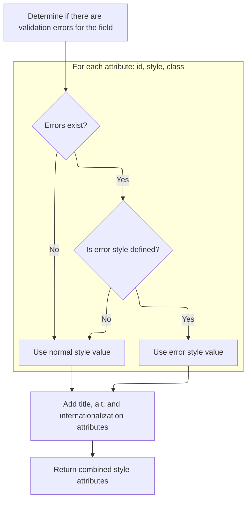

This document outlines how a checkbox input element is rendered with dynamic attributes and styles, adapting its appearance based on validation errors. The process takes checkbox field information and error state as input, and outputs HTML that visually indicates any validation issues to the user.

# Rendering the Checkbox Element

<SwmSnippet path="/taglib/src/main/java/org/apache/struts/taglib/html/MultiboxTag.java" line="154">

---

In <SwmToken path="taglib/src/main/java/org/apache/struts/taglib/html/MultiboxTag.java" pos="154:5:5" line-data="    public int doEndTag() throws JspException {">`doEndTag`</SwmToken>, we're starting to build the checkbox input element and adding all the relevant attributes (name, accesskey, tabindex, value, checked state, event handlers). We call <SwmToken path="taglib/src/main/java/org/apache/struts/taglib/html/MultiboxTag.java" pos="166:5:5" line-data="        results.append(prepareStyles());">`prepareStyles`</SwmToken> next because the style attributes might change based on error state or other conditions, so we need to handle that before finalizing the element.

```java
    public int doEndTag() throws JspException {
        // Create an appropriate "input" element based on our parameters
        StringBuffer results = new StringBuffer("<input type=\"checkbox\"");

        prepareAttribute(results, "name", prepareName());
        prepareAttribute(results, "accesskey", getAccesskey());
        prepareAttribute(results, "tabindex", getTabindex());

        String value = prepareValue(results);

        prepareChecked(results, value);
        results.append(prepareEventHandlers());
        results.append(prepareStyles());
```

---

</SwmSnippet>

## Applying Conditional Styles Based on Errors



<SwmSnippet path="/taglib/src/main/java/org/apache/struts/taglib/html/BaseHandlerTag.java" line="967">

---

In <SwmToken path="taglib/src/main/java/org/apache/struts/taglib/html/BaseHandlerTag.java" pos="967:5:5" line-data="    protected String prepareStyles()">`prepareStyles`</SwmToken>, we're deciding which style attributes to add to the element. We check for errors first because if there are any, and error-specific styles are defined, those should be used instead of the default styles. This is where we branch based on error state.

```java
    protected String prepareStyles()
        throws JspException {
        StringBuffer styles = new StringBuffer();

        boolean errorsExist = doErrorsExist();

```

---

</SwmSnippet>

<SwmSnippet path="/taglib/src/main/java/org/apache/struts/taglib/html/BaseHandlerTag.java" line="1003">

---

<SwmToken path="taglib/src/main/java/org/apache/struts/taglib/html/BaseHandlerTag.java" pos="1003:5:5" line-data="    protected boolean doErrorsExist()">`doErrorsExist`</SwmToken> checks if any error-specific style attributes are set, and only then looks up errors for the prepared name in the page context. If errors are found, it returns true so the caller can apply error styles. This keeps error handling efficient and only triggers visual changes when needed.

```java
    protected boolean doErrorsExist()
        throws JspException {
        boolean errorsExist = false;

        if ((getErrorStyleId() != null) || (getErrorStyle() != null)
            || (getErrorStyleClass() != null)) {
            String actualName = prepareName();

            if (actualName != null) {
                ActionMessages errors =
                    TagUtils.getInstance().getActionMessages(pageContext,
                        errorKey);

                errorsExist = ((errors != null)
                    && (errors.size(actualName) > 0));
            }
        }

        return errorsExist;
    }
```

---

</SwmSnippet>

<SwmSnippet path="/taglib/src/main/java/org/apache/struts/taglib/html/BaseHandlerTag.java" line="973">

---

Back in <SwmToken path="taglib/src/main/java/org/apache/struts/taglib/html/MultiboxTag.java" pos="166:5:5" line-data="        results.append(prepareStyles());">`prepareStyles`</SwmToken>, we use the result from <SwmToken path="taglib/src/main/java/org/apache/struts/taglib/html/BaseHandlerTag.java" pos="971:7:7" line-data="        boolean errorsExist = doErrorsExist();">`doErrorsExist`</SwmToken> to decide whether to apply error-specific or default style attributes. Then we add title, alt, and internationalization attributes before returning the final style string.

```java
        if (errorsExist && (getErrorStyleId() != null)) {
            prepareAttribute(styles, "id", getErrorStyleId());
        } else {
            prepareAttribute(styles, "id", getStyleId());
        }

        if (errorsExist && (getErrorStyle() != null)) {
            prepareAttribute(styles, "style", getErrorStyle());
        } else {
            prepareAttribute(styles, "style", getStyle());
        }

        if (errorsExist && (getErrorStyleClass() != null)) {
            prepareAttribute(styles, "class", getErrorStyleClass());
        } else {
            prepareAttribute(styles, "class", getStyleClass());
        }

        prepareAttribute(styles, "title", message(getTitle(), getTitleKey()));
        prepareAttribute(styles, "alt", message(getAlt(), getAltKey()));
        prepareInternationalization(styles);

        return styles.toString();
    }
```

---

</SwmSnippet>

## Finalizing and Writing the Checkbox Element

<SwmSnippet path="/taglib/src/main/java/org/apache/struts/taglib/html/MultiboxTag.java" line="167">

---

Back in <SwmToken path="taglib/src/main/java/org/apache/struts/taglib/html/MultiboxTag.java" pos="154:5:5" line-data="    public int doEndTag() throws JspException {">`doEndTag`</SwmToken>, after getting the styles from <SwmToken path="taglib/src/main/java/org/apache/struts/taglib/html/MultiboxTag.java" pos="166:5:5" line-data="        results.append(prepareStyles());">`prepareStyles`</SwmToken>, we add any remaining attributes, close the input tag, and write the final HTML to the page. The method returns to let the JSP engine keep processing.

```java
        prepareOtherAttributes(results);
        results.append(getElementClose());

        TagUtils.getInstance().write(pageContext, results.toString());

        return EVAL_PAGE;
    }
```

---

</SwmSnippet>

&nbsp;

*This is an auto-generated document by Swimm 🌊 and has not yet been verified by a human*

<SwmMeta version="3.0.0" repo-id="Z2l0aHViJTNBJTNBc3RydXRzMSUzQSUzQVN3aW1tLURlbW8=" repo-name="struts1"><sup>Powered by [Swimm](https://app.swimm.io/)</sup></SwmMeta>
