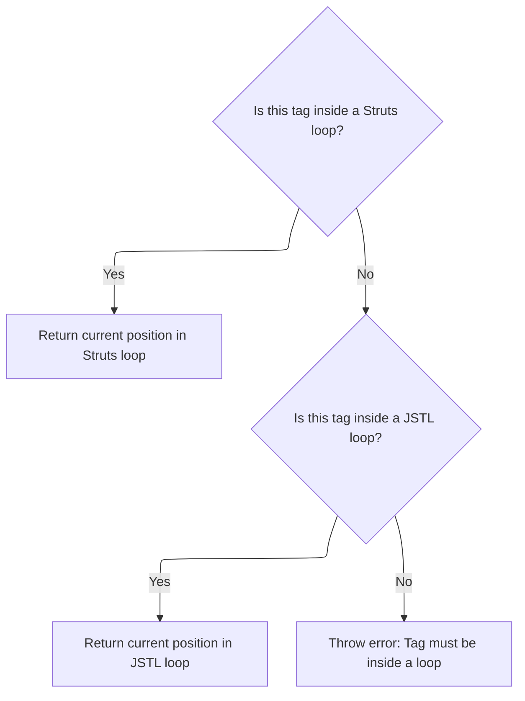
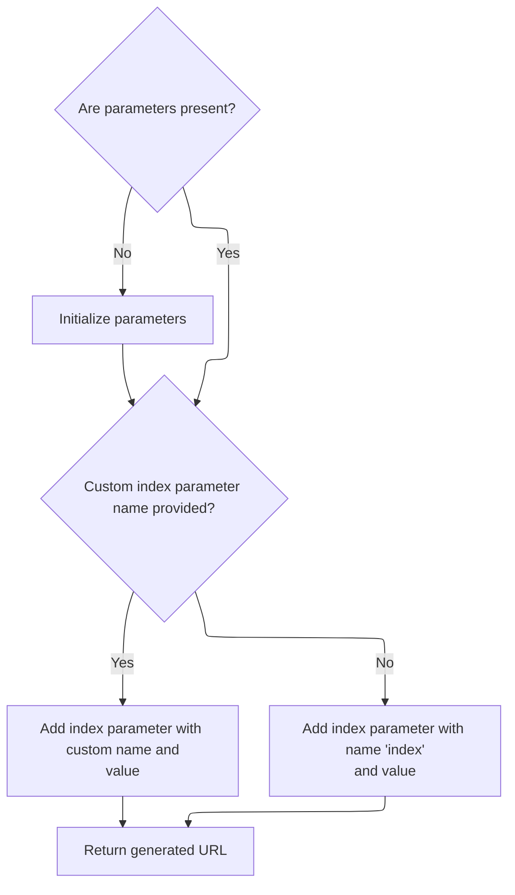
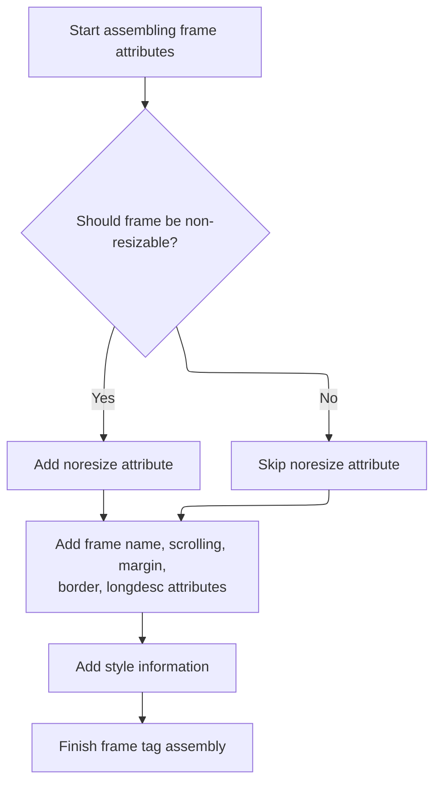
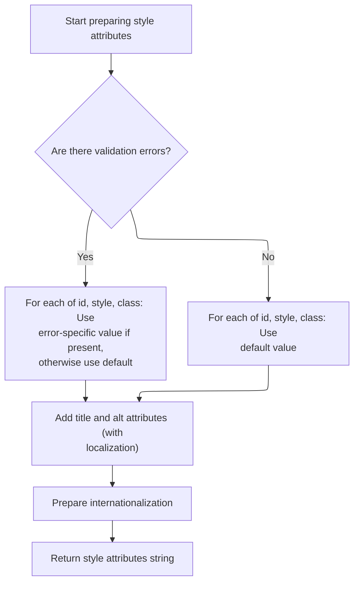
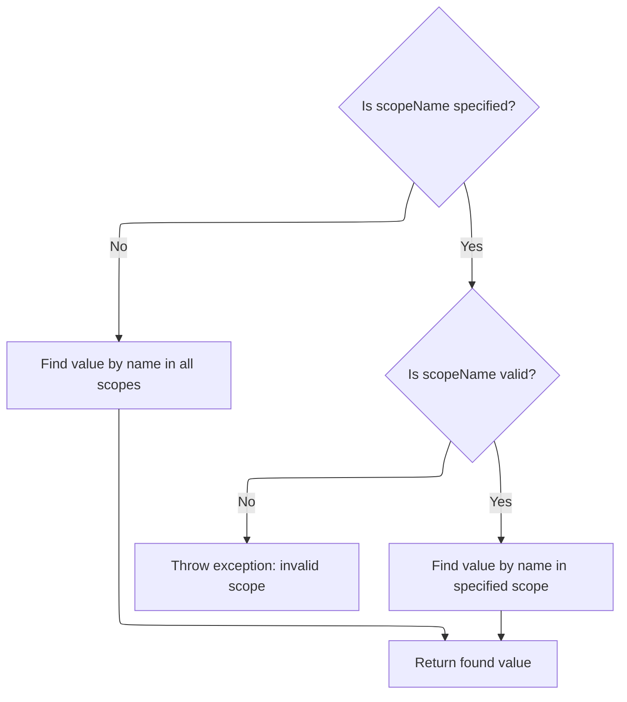

This document explains how a frame element is dynamically rendered in a JSP page. Starting from the tag configuration and page context, the flow builds the frame's source URL, adds all necessary attributes, applies styles and error handling, and writes the final markup to the page, supporting dynamic parameters and internationalization.

# Rendering the frame element

```mermaid
%%{init: {"flowchart": {"defaultRenderer": "elk"}} }%%
flowchart TD
    node1["Start assembling frame tag"]
    click node1 openCode "taglib/src/main/java/org/apache/struts/taglib/html/FrameTag.java:148:152"
    node1 --> node2["Building the frame source URL"]
    
    node2 --> node3["Assemble frame attributes (name,
scrolling, margins, border, longdesc)"]
    click node3 openCode "taglib/src/main/java/org/apache/struts/taglib/html/FrameTag.java:153:164"
    node3 --> node4{"Is 'noresize' true?"}
    click node4 openCode "taglib/src/main/java/org/apache/struts/taglib/html/FrameTag.java:155:157"
    node4 -->|"Yes"| node5["Add 'noresize' attribute"]
    click node5 openCode "taglib/src/main/java/org/apache/struts/taglib/html/FrameTag.java:156:157"
    node4 -->|"No"| node6["Continue"]
    node5 --> node7["Applying styles and handling messages"]
    node6 --> node7
    
    node7 --> node8["Determining element closure"]
    
    node8 --> node9{"Output format: XHTML or HTML?"}
    
    node9 -->|"XHTML"| node10["Use self-closing tag"]
    node9 -->|"HTML"| node10
    click node10 openCode "taglib/src/main/java/org/apache/struts/taglib/html/FrameTag.java:167:169"

classDef HeadingStyle fill:#777777,stroke:#333,stroke-width:2px;
click node2 goToHeading "Building the frame source URL"
node2:::HeadingStyle
click node7 goToHeading "Applying styles and handling messages"
node7:::HeadingStyle
click node8 goToHeading "Determining element closure"
node8:::HeadingStyle
click node9 goToHeading "Checking document type"
node9:::HeadingStyle

%% Swimm:
%% %%{init: {"flowchart": {"defaultRenderer": "elk"}} }%%
%% flowchart TD
%%     node1["Start assembling frame tag"]
%%     click node1 openCode "<SwmPath>[taglib/…/html/FrameTag.java](taglib/src/main/java/org/apache/struts/taglib/html/FrameTag.java)</SwmPath>:148:152"
%%     node1 --> node2["Building the frame source URL"]
%%     
%%     node2 --> node3["Assemble frame attributes (name,
%% scrolling, margins, border, longdesc)"]
%%     click node3 openCode "<SwmPath>[taglib/…/html/FrameTag.java](taglib/src/main/java/org/apache/struts/taglib/html/FrameTag.java)</SwmPath>:153:164"
%%     node3 --> node4{"Is 'noresize' true?"}
%%     click node4 openCode "<SwmPath>[taglib/…/html/FrameTag.java](taglib/src/main/java/org/apache/struts/taglib/html/FrameTag.java)</SwmPath>:155:157"
%%     node4 -->|"Yes"| node5["Add 'noresize' attribute"]
%%     click node5 openCode "<SwmPath>[taglib/…/html/FrameTag.java](taglib/src/main/java/org/apache/struts/taglib/html/FrameTag.java)</SwmPath>:156:157"
%%     node4 -->|"No"| node6["Continue"]
%%     node5 --> node7["Applying styles and handling messages"]
%%     node6 --> node7
%%     
%%     node7 --> node8["Determining element closure"]
%%     
%%     node8 --> node9{"Output format: XHTML or HTML?"}
%%     
%%     node9 -->|"XHTML"| node10["Use self-closing tag"]
%%     node9 -->|"HTML"| node10
%%     click node10 openCode "<SwmPath>[taglib/…/html/FrameTag.java](taglib/src/main/java/org/apache/struts/taglib/html/FrameTag.java)</SwmPath>:167:169"
%% 
%% classDef HeadingStyle fill:#777777,stroke:#333,stroke-width:2px;
%% click node2 goToHeading "Building the frame source URL"
%% node2:::HeadingStyle
%% click node7 goToHeading "Applying styles and handling messages"
%% node7:::HeadingStyle
%% click node8 goToHeading "Determining element closure"
%% node8:::HeadingStyle
%% click node9 goToHeading "Checking document type"
%% node9:::HeadingStyle
```



<SwmSnippet path="/taglib/src/main/java/org/apache/struts/taglib/html/FrameTag.java" line="148">

---

In <SwmToken path="taglib/src/main/java/org/apache/struts/taglib/html/FrameTag.java" pos="148:5:5" line-data="    public int doEndTag() throws JspException {">`doEndTag`</SwmToken>, we start assembling the frame tag markup and immediately prep the src attribute by calling <SwmToken path="taglib/src/main/java/org/apache/struts/taglib/html/FrameTag.java" pos="152:11:11" line-data="        prepareAttribute(results, &quot;src&quot;, calculateURL());">`calculateURL`</SwmToken> from <SwmToken path="taglib/src/main/java/org/apache/struts/taglib/html/FrameTag.java" pos="31:11:11" line-data=" * technique that {@link LinkTag} uses to render the &lt;code&gt;href&lt;/code&gt;">`LinkTag`</SwmToken>. This ensures the frame's source is dynamically built, including any parameters or index values, before moving on to other attributes.

```java
    public int doEndTag() throws JspException {
        // Print this element to our output writer
        StringBuffer results = new StringBuffer("<frame");

        prepareAttribute(results, "src", calculateURL());
```

---

</SwmSnippet>

## Building the frame source URL

<SwmSnippet path="/taglib/src/main/java/org/apache/struts/taglib/html/LinkTag.java" line="409">

---

In <SwmToken path="taglib/src/main/java/org/apache/struts/taglib/html/LinkTag.java" pos="409:5:5" line-data="    protected String calculateURL()">`calculateURL`</SwmToken>, we gather all parameters for the URL, including those from the tag body and indexed logic. If indexed is true, we call BaseHandlerTag.getIndexValue to fetch the current loop index, which is needed for parameterizing the URL.

```java
    protected String calculateURL()
        throws JspException {
        // Identify the parameters we will add to the completed URL
        Map params =
            TagUtils.getInstance().computeParameters(pageContext, paramId,
                paramName, paramProperty, paramScope, name, property, scope,
                transaction);

        // Add parameters collected from the tag's inner body
        if (!this.parameters.isEmpty()) {
            if (params == null) {
                params = new HashMap();
            }
            params.putAll(this.parameters);
        }

        // if "indexed=true", add "index=x" parameter to query string
        // * @since Struts 1.1
        if (indexed) {
            int indexValue = getIndexValue();

```

---

</SwmSnippet>

### Resolving the loop index



<SwmSnippet path="/taglib/src/main/java/org/apache/struts/taglib/html/BaseHandlerTag.java" line="935">

---

In <SwmToken path="taglib/src/main/java/org/apache/struts/taglib/html/BaseHandlerTag.java" pos="935:5:5" line-data="    protected int getIndexValue()">`getIndexValue`</SwmToken>, we check for an <SwmToken path="taglib/src/main/java/org/apache/struts/taglib/html/BaseHandlerTag.java" pos="938:1:1" line-data="        IterateTag iterateTag =">`IterateTag`</SwmToken> ancestor to grab its index. If that's missing, we try to get the index from a JSTL loop. If neither is present, we throw an exception since the tag isn't nested properly for indexing.

```java
    protected int getIndexValue()
        throws JspException {
        // look for outer iterate tag
        IterateTag iterateTag =
            (IterateTag) findAncestorWithClass(this, IterateTag.class);

        if (iterateTag != null) {
            return iterateTag.getIndex();
        }

        // Look for JSTL loops
        Integer i = getJstlLoopIndex();

        if (i != null) {
            return i.intValue();
        }

```

---

</SwmSnippet>

<SwmSnippet path="/taglib/src/main/java/org/apache/struts/taglib/html/BaseHandlerTag.java" line="852">

---

<SwmToken path="taglib/src/main/java/org/apache/struts/taglib/html/BaseHandlerTag.java" pos="852:5:5" line-data="    private Integer getJstlLoopIndex() {">`getJstlLoopIndex`</SwmToken> uses reflection to find and access JSTL loop tags and their status objects. It caches the reflection setup, then looks up the ancestor loop tag and invokes methods to get the current index, if available.

```java
    private Integer getJstlLoopIndex() {
        if (!triedJstlInit) {
            triedJstlInit = true;

            try {
                loopTagClass =
                    RequestUtils.applicationClass(
                        "javax.servlet.jsp.jstl.core.LoopTag");

                loopTagGetStatus =
                    loopTagClass.getDeclaredMethod("getLoopStatus", null);

                loopTagStatusClass =
                    RequestUtils.applicationClass(
                        "javax.servlet.jsp.jstl.core.LoopTagStatus");

                loopTagStatusGetIndex =
                    loopTagStatusClass.getDeclaredMethod("getIndex", null);

                triedJstlSuccess = true;
            } catch (ClassNotFoundException ex) {
                // These just mean that JSTL isn't loaded, so ignore
            } catch (NoSuchMethodException ex) {
            }
        }

        if (triedJstlSuccess) {
            try {
                Object loopTag =
                    findAncestorWithClass(this, loopTagClass);

                if (loopTag == null) {
                    return null;
                }

                Object status = loopTagGetStatus.invoke(loopTag, null);

                return (Integer) loopTagStatusGetIndex.invoke(status, null);
            } catch (IllegalAccessException ex) {
                log.error(ex.getMessage(), ex);
            } catch (IllegalArgumentException ex) {
                log.error(ex.getMessage(), ex);
            } catch (InvocationTargetException ex) {
                log.error(ex.getMessage(), ex);
            } catch (NullPointerException ex) {
                log.error(ex.getMessage(), ex);
            } catch (ExceptionInInitializerError ex) {
                log.error(ex.getMessage(), ex);
            }
        }

        return null;
    }
```

---

</SwmSnippet>

<SwmSnippet path="/taglib/src/main/java/org/apache/struts/taglib/html/BaseHandlerTag.java" line="952">

---

Back in <SwmToken path="taglib/src/main/java/org/apache/struts/taglib/html/LinkTag.java" pos="428:7:7" line-data="            int indexValue = getIndexValue();">`getIndexValue`</SwmToken>, if no <SwmToken path="taglib/src/main/java/org/apache/struts/taglib/html/BaseHandlerTag.java" pos="952:17:17" line-data="        // this tag should be nested in an IterateTag or JSTL loop tag, if it&#39;s not, throw exception">`IterateTag`</SwmToken> or JSTL loop ancestor is found, we throw a <SwmToken path="taglib/src/main/java/org/apache/struts/taglib/html/BaseHandlerTag.java" pos="953:1:1" line-data="        JspException e =">`JspException`</SwmToken> and log it in the page context. This stops the flow since the tag isn't nested properly for indexing.

```java
        // this tag should be nested in an IterateTag or JSTL loop tag, if it's not, throw exception
        JspException e =
            new JspException(messages.getMessage("indexed.noEnclosingIterate"));

        TagUtils.getInstance().saveException(pageContext, e);
        throw e;
    }
```

---

</SwmSnippet>

### Finalizing the URL and handling errors



<SwmSnippet path="/taglib/src/main/java/org/apache/struts/taglib/html/LinkTag.java" line="430">

---

Back in <SwmToken path="taglib/src/main/java/org/apache/struts/taglib/html/FrameTag.java" pos="152:11:11" line-data="        prepareAttribute(results, &quot;src&quot;, calculateURL());">`calculateURL`</SwmToken>, after getting the index from <SwmToken path="taglib/src/main/java/org/apache/struts/taglib/html/LinkTag.java" pos="39:8:8" line-data="public class LinkTag extends BaseHandlerTag {">`BaseHandlerTag`</SwmToken>, we add it to the parameters and build the final URL. If there's a URL error, we catch and log it, then return the computed URL for use in the frame tag.

```java
            //calculate index, and add as a parameter
            if (params == null) {
                params = new HashMap(); //create new HashMap if no other params
            }

            if (indexId != null) {
                params.put(indexId, Integer.toString(indexValue));
            } else {
                params.put("index", Integer.toString(indexValue));
            }
        }

        String url = null;

        try {
            url = TagUtils.getInstance().computeURLWithCharEncoding(pageContext,
                    forward, href, page, action, module, params, anchor, false,
                    useLocalEncoding);
        } catch (MalformedURLException e) {
            TagUtils.getInstance().saveException(pageContext, e);
            throw new JspException(messages.getMessage("rewrite.url",
                    e.toString()), e);
        }

        return (url);
    }
```

---

</SwmSnippet>

## Adding frame attributes



<SwmSnippet path="/taglib/src/main/java/org/apache/struts/taglib/html/FrameTag.java" line="153">

---

Back in <SwmToken path="taglib/src/main/java/org/apache/struts/taglib/html/FrameTag.java" pos="148:5:5" line-data="    public int doEndTag() throws JspException {">`doEndTag`</SwmToken>, after setting the src, we prep other frame attributes like name, scrolling, and borders. Next, we call <SwmToken path="taglib/src/main/java/org/apache/struts/taglib/html/LabelTag.java" pos="33:4:4" line-data="public class LabelTag extends BaseInputTag {">`LabelTag`</SwmToken> to handle any custom logic for attributes, especially for required fields and CSS classes.

```java
        prepareAttribute(results, "name", getFrameName());

        if (noresize) {
            results.append(" noresize=\"noresize\"");
        }

        prepareAttribute(results, "scrolling", getScrolling());
        prepareAttribute(results, "marginheight", getMarginheight());
        prepareAttribute(results, "marginwidth", getMarginwidth());
        prepareAttribute(results, "frameborder", getFrameborder());
        prepareAttribute(results, "longdesc", getLongdesc());
```

---

</SwmSnippet>

<SwmSnippet path="/taglib/src/main/java/org/apache/struts/taglib/html/LabelTag.java" line="161">

---

<SwmToken path="taglib/src/main/java/org/apache/struts/taglib/html/LabelTag.java" pos="161:5:5" line-data="    protected void prepareAttribute(StringBuffer handlers, String name,">`prepareAttribute`</SwmToken> in <SwmToken path="taglib/src/main/java/org/apache/struts/taglib/html/LabelTag.java" pos="33:4:4" line-data="public class LabelTag extends BaseInputTag {">`LabelTag`</SwmToken> checks if the attribute is 'class' and required, then appends a required CSS class if needed. It passes the result to the superclass for actual rendering.

```java
    protected void prepareAttribute(StringBuffer handlers, String name,
            Object value) {

        if ("class".equals(name) && this.required) {
            String requiredStyleClass = getRequiredStyleClass();
            if (requiredStyleClass != null) {
                value = (value != null) ? (value + " " + requiredStyleClass)
                        : requiredStyleClass;
            }
        }
        super.prepareAttribute(handlers, name, value);
    }
```

---

</SwmSnippet>

<SwmSnippet path="/taglib/src/main/java/org/apache/struts/taglib/html/FrameTag.java" line="164">

---

Back in <SwmToken path="taglib/src/main/java/org/apache/struts/taglib/html/FrameTag.java" pos="148:5:5" line-data="    public int doEndTag() throws JspException {">`doEndTag`</SwmToken>, after <SwmToken path="taglib/src/main/java/org/apache/struts/taglib/html/LabelTag.java" pos="33:4:4" line-data="public class LabelTag extends BaseInputTag {">`LabelTag`</SwmToken>, we call <SwmToken path="taglib/src/main/java/org/apache/struts/taglib/html/LinkTag.java" pos="39:8:8" line-data="public class LinkTag extends BaseHandlerTag {">`BaseHandlerTag`</SwmToken> to add style attributes. This covers error styling and i18n, making sure the frame markup is complete.

```java
        results.append(prepareStyles());
```

---

</SwmSnippet>

## Applying styles and handling messages



<SwmSnippet path="/taglib/src/main/java/org/apache/struts/taglib/html/BaseHandlerTag.java" line="967">

---

In <SwmToken path="taglib/src/main/java/org/apache/struts/taglib/html/BaseHandlerTag.java" pos="967:5:5" line-data="    protected String prepareStyles()">`prepareStyles`</SwmToken>, we add style, id, and class attributes, picking error styles if errors exist. For title and alt, we call message to handle localization or literal values.

```java
    protected String prepareStyles()
        throws JspException {
        StringBuffer styles = new StringBuffer();

        boolean errorsExist = doErrorsExist();

        if (errorsExist && (getErrorStyleId() != null)) {
            prepareAttribute(styles, "id", getErrorStyleId());
        } else {
            prepareAttribute(styles, "id", getStyleId());
        }

        if (errorsExist && (getErrorStyle() != null)) {
            prepareAttribute(styles, "style", getErrorStyle());
        } else {
            prepareAttribute(styles, "style", getStyle());
        }

        if (errorsExist && (getErrorStyleClass() != null)) {
            prepareAttribute(styles, "class", getErrorStyleClass());
        } else {
            prepareAttribute(styles, "class", getStyleClass());
        }

        prepareAttribute(styles, "title", message(getTitle(), getTitleKey()));
        prepareAttribute(styles, "alt", message(getAlt(), getAltKey()));
```

---

</SwmSnippet>

<SwmSnippet path="/taglib/src/main/java/org/apache/struts/taglib/html/BaseHandlerTag.java" line="830">

---

<SwmToken path="taglib/src/main/java/org/apache/struts/taglib/html/BaseHandlerTag.java" pos="830:5:5" line-data="    protected String message(String literal, String key)">`message`</SwmToken> checks if both literal and key are set—throws if so. Otherwise, it returns the literal or fetches the message via <SwmToken path="taglib/src/main/java/org/apache/struts/taglib/html/BaseHandlerTag.java" pos="837:1:1" line-data="                TagUtils.getInstance().saveException(pageContext, e);">`TagUtils`</SwmToken>, or null if neither is provided.

```java
    protected String message(String literal, String key)
        throws JspException {
        if (literal != null) {
            if (key != null) {
                JspException e =
                    new JspException(messages.getMessage("common.both"));

                TagUtils.getInstance().saveException(pageContext, e);
                throw e;
            } else {
                return (literal);
            }
        } else {
            if (key != null) {
                return TagUtils.getInstance().message(pageContext, getBundle(),
                    getLocale(), key);
            } else {
                return null;
            }
        }
    }
```

---

</SwmSnippet>

<SwmSnippet path="/taglib/src/main/java/org/apache/struts/taglib/html/BaseHandlerTag.java" line="993">

---

Back in <SwmToken path="taglib/src/main/java/org/apache/struts/taglib/html/FrameTag.java" pos="164:5:5" line-data="        results.append(prepareStyles());">`prepareStyles`</SwmToken>, after handling styles and messages, we call <SwmToken path="taglib/src/main/java/org/apache/struts/taglib/html/BaseHandlerTag.java" pos="993:1:1" line-data="        prepareInternationalization(styles);">`prepareInternationalization`</SwmToken> to add i18n attributes, then return the full styles string for use in the frame markup.

```java
        prepareInternationalization(styles);

        return styles.toString();
    }
```

---

</SwmSnippet>

## Completing frame markup

<SwmSnippet path="/taglib/src/main/java/org/apache/struts/taglib/html/FrameTag.java" line="165">

---

Back in <SwmToken path="taglib/src/main/java/org/apache/struts/taglib/html/FrameTag.java" pos="148:5:5" line-data="    public int doEndTag() throws JspException {">`doEndTag`</SwmToken>, after styles, we prep any remaining attributes and then call <SwmToken path="taglib/src/main/java/org/apache/struts/taglib/html/LinkTag.java" pos="39:8:8" line-data="public class LinkTag extends BaseHandlerTag {">`BaseHandlerTag`</SwmToken> to get the proper element close string, making sure the markup is syntactically correct.

```java
        prepareOtherAttributes(results);
        results.append(getElementClose());
```

---

</SwmSnippet>

## Determining element closure

<SwmSnippet path="/taglib/src/main/java/org/apache/struts/taglib/html/BaseHandlerTag.java" line="1186">

---

<SwmToken path="taglib/src/main/java/org/apache/struts/taglib/html/BaseHandlerTag.java" pos="1186:5:5" line-data="    protected String getElementClose() {">`getElementClose`</SwmToken> checks if XHTML is enabled and returns either '/>' or '>' for the element closure. Next, we call <SwmToken path="taglib/src/main/java/org/apache/struts/taglib/html/BaseHandlerTag.java" pos="1187:5:5" line-data="        return this.isXhtml() ? &quot; /&gt;&quot; : &quot;&gt;&quot;;">`isXhtml`</SwmToken> to figure out which format to use.

```java
    protected String getElementClose() {
        return this.isXhtml() ? " />" : ">";
    }
```

---

</SwmSnippet>

## Checking document type

<SwmSnippet path="/taglib/src/main/java/org/apache/struts/taglib/html/BaseHandlerTag.java" line="1174">

---

<SwmToken path="taglib/src/main/java/org/apache/struts/taglib/html/BaseHandlerTag.java" pos="1174:5:5" line-data="    protected boolean isXhtml() {">`isXhtml`</SwmToken> asks <SwmToken path="taglib/src/main/java/org/apache/struts/taglib/html/BaseHandlerTag.java" pos="1175:3:3" line-data="        return TagUtils.getInstance().isXhtml(this.pageContext);">`TagUtils`</SwmToken> if XHTML mode is set in the page context. We call <SwmToken path="taglib/src/main/java/org/apache/struts/taglib/html/BaseHandlerTag.java" pos="1175:3:3" line-data="        return TagUtils.getInstance().isXhtml(this.pageContext);">`TagUtils`</SwmToken> next to look up the XHTML flag.

```java
    protected boolean isXhtml() {
        return TagUtils.getInstance().isXhtml(this.pageContext);
    }
```

---

</SwmSnippet>

## Looking up XHTML mode

<SwmSnippet path="/taglib/src/main/java/org/apache/struts/taglib/TagUtils.java" line="838">

---

<SwmToken path="taglib/src/main/java/org/apache/struts/taglib/TagUtils.java" pos="838:5:5" line-data="    public boolean isXhtml(PageContext pageContext) {">`isXhtml`</SwmToken> uses lookup to fetch the XHTML flag from the page context. If the flag is 'true', we use XHTML syntax; otherwise, standard HTML. Next, we call lookup to get the actual value.

```java
    public boolean isXhtml(PageContext pageContext) {
        String xhtml;
        try {
            xhtml = (String) lookup(pageContext, Globals.XHTML_KEY, null);
            return "true".equalsIgnoreCase(xhtml);
        } catch (JspException e) {
            log.error("Failed xhtml lookup", e);
            throw new RuntimeException(e);
        }
    }
```

---

</SwmSnippet>

## Fetching context attributes



<SwmSnippet path="/taglib/src/main/java/org/apache/struts/taglib/TagUtils.java" line="863">

---

<SwmToken path="taglib/src/main/java/org/apache/struts/taglib/TagUtils.java" pos="863:5:5" line-data="    public Object lookup(PageContext pageContext, String name, String scopeName)">`lookup`</SwmToken> checks if a scope is specified. If so, it calls <SwmToken path="taglib/src/main/java/org/apache/struts/taglib/TagUtils.java" pos="870:12:12" line-data="            return pageContext.getAttribute(name, instance.getScope(scopeName));">`getScope`</SwmToken> to convert the scope name to an integer, then fetches the attribute from the right context. If not, it just finds the attribute in the page context.

```java
    public Object lookup(PageContext pageContext, String name, String scopeName)
        throws JspException {
        if (scopeName == null) {
            return pageContext.findAttribute(name);
        }

        try {
            return pageContext.getAttribute(name, instance.getScope(scopeName));
        } catch (JspException e) {
            saveException(pageContext, e);
            throw e;
        }
    }
```

---

</SwmSnippet>

<SwmSnippet path="/taglib/src/main/java/org/apache/struts/taglib/TagUtils.java" line="809">

---

<SwmToken path="taglib/src/main/java/org/apache/struts/taglib/TagUtils.java" pos="809:5:5" line-data="    public int getScope(String scopeName)">`getScope`</SwmToken> takes the scope name, converts it to lowercase, and looks it up in the scopes map. If not found, it throws a <SwmToken path="taglib/src/main/java/org/apache/struts/taglib/TagUtils.java" pos="810:3:3" line-data="        throws JspException {">`JspException`</SwmToken>; otherwise, it returns the scope as an int for attribute access.

```java
    public int getScope(String scopeName)
        throws JspException {
        Integer scope = (Integer) scopes.get(scopeName.toLowerCase());

        if (scope == null) {
            throw new JspException(messages.getMessage("lookup.scope", scope));
        }

        return scope.intValue();
    }
```

---

</SwmSnippet>

## Writing the frame markup

<SwmSnippet path="/taglib/src/main/java/org/apache/struts/taglib/html/FrameTag.java" line="167">

---

Back in <SwmToken path="taglib/src/main/java/org/apache/struts/taglib/html/FrameTag.java" pos="148:5:5" line-data="    public int doEndTag() throws JspException {">`doEndTag`</SwmToken>, after getting the element close string, we write the full frame markup to the page context using <SwmToken path="taglib/src/main/java/org/apache/struts/taglib/html/FrameTag.java" pos="167:1:1" line-data="        TagUtils.getInstance().write(pageContext, results.toString());">`TagUtils`</SwmToken>. Then we return <SwmToken path="taglib/src/main/java/org/apache/struts/taglib/html/FrameTag.java" pos="169:4:4" line-data="        return (EVAL_PAGE);">`EVAL_PAGE`</SwmToken> to continue processing the rest of the JSP.

```java
        TagUtils.getInstance().write(pageContext, results.toString());

        return (EVAL_PAGE);
    }
```

---

</SwmSnippet>

&nbsp;

*This is an auto-generated document by Swimm 🌊 and has not yet been verified by a human*

<SwmMeta version="3.0.0" repo-id="Z2l0aHViJTNBJTNBc3RydXRzMSUzQSUzQVN3aW1tLURlbW8=" repo-name="struts1"><sup>Powered by [Swimm](https://app.swimm.io/)</sup></SwmMeta>
