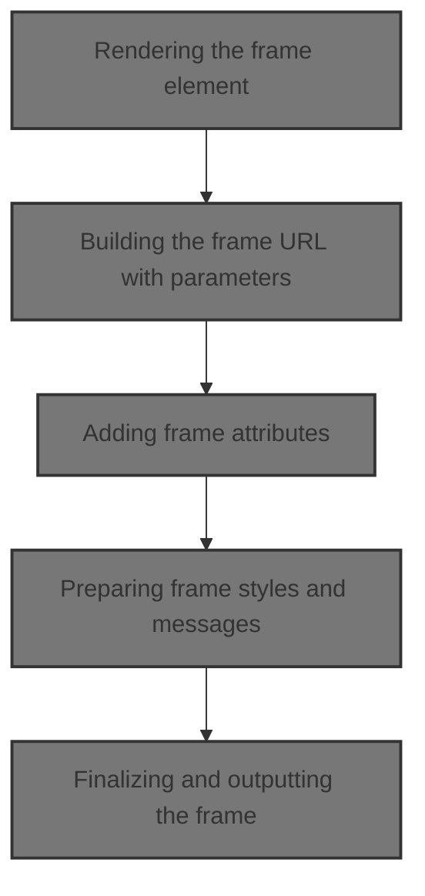
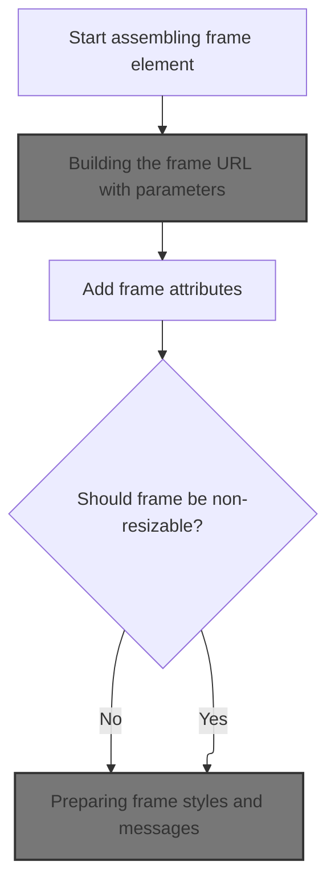
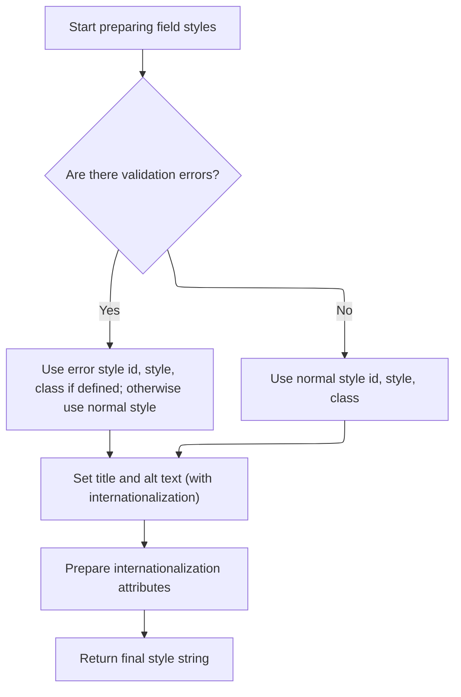

This document describes how a dynamic HTML frame element is rendered on the page. Configuration and parameters are gathered from the current page context, the frame's URL and attributes are assembled, and the completed frame is output with appropriate styles and localization.



# Rendering the frame element



<SwmSnippet path="/taglib/src/main/java/org/apache/struts/taglib/html/FrameTag.java" line="148">

---

In <SwmToken path="taglib/src/main/java/org/apache/struts/taglib/html/FrameTag.java" pos="148:5:5" line-data="    public int doEndTag() throws JspException {">`doEndTag`</SwmToken>, we start building the <frame> tag and immediately prep the 'src' attribute by calling <SwmToken path="taglib/src/main/java/org/apache/struts/taglib/html/FrameTag.java" pos="152:11:11" line-data="        prepareAttribute(results, &quot;src&quot;, calculateURL());">`calculateURL`</SwmToken>. We need to call <SwmToken path="taglib/src/main/java/org/apache/struts/taglib/html/FrameTag.java" pos="31:11:11" line-data=" * technique that {@link LinkTag} uses to render the &lt;code&gt;href&lt;/code&gt;">`LinkTag`</SwmToken> next because the URL is context-sensitive and might include parameters or tokens from the current page state.

```java
    public int doEndTag() throws JspException {
        // Print this element to our output writer
        StringBuffer results = new StringBuffer("<frame");

        prepareAttribute(results, "src", calculateURL());
```

---

</SwmSnippet>

## Building the frame URL with parameters

```mermaid
%%{init: {"flowchart": {"defaultRenderer": "elk"}} }%%
flowchart TD
    node1["Start: Gather all relevant parameters for the link"]
    click node1 openCode "taglib/src/main/java/org/apache/struts/taglib/html/LinkTag.java:409:415"
    node1 --> node2{"Are there extra parameters specified in the tag?"}
    click node2 openCode "taglib/src/main/java/org/apache/struts/taglib/html/LinkTag.java:417:423"
    node2 -->|"Yes"| node3["Add extra parameters to the parameter list"]
    click node3 openCode "taglib/src/main/java/org/apache/struts/taglib/html/LinkTag.java:417:423"
    node2 -->|"No"| node4{"Should an index be added to the link?"}
    node3 --> node4
    node4 -->|"Yes"| node5["Add index parameter (using custom name if provided)"]
    click node4 openCode "taglib/src/main/java/org/apache/struts/taglib/html/LinkTag.java:427:440"
    node4 -->|"No"| node6["Generate the final URL using all parameters"]
    node5 --> node6
    click node5 openCode "taglib/src/main/java/org/apache/struts/taglib/html/LinkTag.java:427:440"
    node6["Generate the final URL using all parameters"]
    click node6 openCode "taglib/src/main/java/org/apache/struts/taglib/html/LinkTag.java:442:454"
    node6 --> node7["Return the generated URL"]
    click node7 openCode "taglib/src/main/java/org/apache/struts/taglib/html/LinkTag.java:454:455"
classDef HeadingStyle fill:#777777,stroke:#333,stroke-width:2px;

%% Swimm:
%% %%{init: {"flowchart": {"defaultRenderer": "elk"}} }%%
%% flowchart TD
%%     node1["Start: Gather all relevant parameters for the link"]
%%     click node1 openCode "<SwmPath>[taglib/…/html/LinkTag.java](taglib/src/main/java/org/apache/struts/taglib/html/LinkTag.java)</SwmPath>:409:415"
%%     node1 --> node2{"Are there extra parameters specified in the tag?"}
%%     click node2 openCode "<SwmPath>[taglib/…/html/LinkTag.java](taglib/src/main/java/org/apache/struts/taglib/html/LinkTag.java)</SwmPath>:417:423"
%%     node2 -->|"Yes"| node3["Add extra parameters to the parameter list"]
%%     click node3 openCode "<SwmPath>[taglib/…/html/LinkTag.java](taglib/src/main/java/org/apache/struts/taglib/html/LinkTag.java)</SwmPath>:417:423"
%%     node2 -->|"No"| node4{"Should an index be added to the link?"}
%%     node3 --> node4
%%     node4 -->|"Yes"| node5["Add index parameter (using custom name if provided)"]
%%     click node4 openCode "<SwmPath>[taglib/…/html/LinkTag.java](taglib/src/main/java/org/apache/struts/taglib/html/LinkTag.java)</SwmPath>:427:440"
%%     node4 -->|"No"| node6["Generate the final URL using all parameters"]
%%     node5 --> node6
%%     click node5 openCode "<SwmPath>[taglib/…/html/LinkTag.java](taglib/src/main/java/org/apache/struts/taglib/html/LinkTag.java)</SwmPath>:427:440"
%%     node6["Generate the final URL using all parameters"]
%%     click node6 openCode "<SwmPath>[taglib/…/html/LinkTag.java](taglib/src/main/java/org/apache/struts/taglib/html/LinkTag.java)</SwmPath>:442:454"
%%     node6 --> node7["Return the generated URL"]
%%     click node7 openCode "<SwmPath>[taglib/…/html/LinkTag.java](taglib/src/main/java/org/apache/struts/taglib/html/LinkTag.java)</SwmPath>:454:455"
%% classDef HeadingStyle fill:#777777,stroke:#333,stroke-width:2px;
```



<SwmSnippet path="/taglib/src/main/java/org/apache/struts/taglib/html/LinkTag.java" line="409">

---

In <SwmToken path="taglib/src/main/java/org/apache/struts/taglib/html/LinkTag.java" pos="409:5:5" line-data="    protected String calculateURL()">`calculateURL`</SwmToken>, we start by gathering parameters from the page context using <SwmToken path="taglib/src/main/java/org/apache/struts/taglib/html/LinkTag.java" pos="413:1:1" line-data="            TagUtils.getInstance().computeParameters(pageContext, paramId,">`TagUtils`</SwmToken>. We need to call <SwmToken path="taglib/src/main/java/org/apache/struts/taglib/html/LinkTag.java" pos="413:1:1" line-data="            TagUtils.getInstance().computeParameters(pageContext, paramId,">`TagUtils`</SwmToken> next because it centralizes parameter extraction, including handling <SwmToken path="taglib/src/main/java/org/apache/struts/taglib/TagUtils.java" pos="199:13:15" line-data="        // Locate the Map containing our multi-value parameters map">`multi-value`</SwmToken> and transaction tokens, so the URL is accurate and complete.

```java
    protected String calculateURL()
        throws JspException {
        // Identify the parameters we will add to the completed URL
        Map params =
            TagUtils.getInstance().computeParameters(pageContext, paramId,
                paramName, paramProperty, paramScope, name, property, scope,
                transaction);

```

---

</SwmSnippet>

<SwmSnippet path="/taglib/src/main/java/org/apache/struts/taglib/TagUtils.java" line="190">

---

<SwmToken path="taglib/src/main/java/org/apache/struts/taglib/TagUtils.java" pos="190:5:5" line-data="    public Map computeParameters(PageContext pageContext, String paramId,">`computeParameters`</SwmToken> grabs parameter maps from the page context, merges in <SwmToken path="taglib/src/main/java/org/apache/struts/taglib/TagUtils.java" pos="227:7:9" line-data="        // Add the single-value parameter (if any)">`single-value`</SwmToken> parameters, and adds a transaction token if needed. It handles <SwmToken path="taglib/src/main/java/org/apache/struts/taglib/TagUtils.java" pos="199:13:15" line-data="        // Locate the Map containing our multi-value parameters map">`multi-value`</SwmToken> keys by appending to arrays, so you can have several values per parameter.

```java
    public Map computeParameters(PageContext pageContext, String paramId,
        String paramName, String paramProperty, String paramScope, String name,
        String property, String scope, boolean transaction)
        throws JspException {
        // Short circuit if no parameters are specified
        if ((paramId == null) && (name == null) && !transaction) {
            return (null);
        }

        // Locate the Map containing our multi-value parameters map
        Map map = null;

        try {
            if (name != null) {
                map = (Map) getInstance().lookup(pageContext, name, property,
                        scope);
            }

            // @TODO - remove this - it is never thrown
            //        } catch (ClassCastException e) {
            //            saveException(pageContext, e);
            //            throw new JspException(
            //                    messages.getMessage("parameters.multi", name, property, scope));
        } catch (JspException e) {
            saveException(pageContext, e);
            throw e;
        }

        // Create a Map to contain our results from the multi-value parameters
        Map results = null;

        if (map != null) {
            results = new HashMap(map);
        } else {
            results = new HashMap();
        }

        // Add the single-value parameter (if any)
        if ((paramId != null) && (paramName != null)) {
            Object paramValue = null;

            try {
                paramValue =
                    TagUtils.getInstance().lookup(pageContext, paramName,
                        paramProperty, paramScope);
            } catch (JspException e) {
                saveException(pageContext, e);
                throw e;
            }

            if (paramValue != null) {
                String paramString = null;

                if (paramValue instanceof String) {
                    paramString = (String) paramValue;
                } else {
                    paramString = paramValue.toString();
                }

                Object mapValue = results.get(paramId);

                if (mapValue == null) {
                    results.put(paramId, paramString);
                } else if (mapValue instanceof String[]) {
                    String[] oldValues = (String[]) mapValue;
                    String[] newValues = new String[oldValues.length + 1];

                    System.arraycopy(oldValues, 0, newValues, 0,
                        oldValues.length);
                    newValues[oldValues.length] = paramString;
                    results.put(paramId, newValues);
                } else {
                    String[] newValues = new String[2];

                    newValues[0] = mapValue.toString();
                    newValues[1] = paramString;
                    results.put(paramId, newValues);
                }
            }
        }

        // Add our transaction control token (if requested)
        if (transaction) {
            HttpSession session = pageContext.getSession();
            String token = null;

            if (session != null) {
                token =
                    (String) session.getAttribute(Globals.TRANSACTION_TOKEN_KEY);
            }

            if (token != null) {
                results.put(Constants.TOKEN_KEY, token);
            }
        }

        // Return the completed Map
        return (results);
    }
```

---

</SwmSnippet>

<SwmSnippet path="/taglib/src/main/java/org/apache/struts/taglib/html/LinkTag.java" line="417">

---

Back in `LinkTag.calculateURL`, after getting parameters from <SwmToken path="taglib/src/main/java/org/apache/struts/taglib/html/FrameTag.java" pos="167:1:1" line-data="        TagUtils.getInstance().write(pageContext, results.toString());">`TagUtils`</SwmToken>, we merge any extra parameters from the tag body. If 'indexed' is set, we call <SwmToken path="taglib/src/main/java/org/apache/struts/taglib/html/LinkTag.java" pos="39:8:8" line-data="public class LinkTag extends BaseHandlerTag {">`BaseHandlerTag`</SwmToken> to get the current loop index, so the URL can include which item we're on.

```java
        // Add parameters collected from the tag's inner body
        if (!this.parameters.isEmpty()) {
            if (params == null) {
                params = new HashMap();
            }
            params.putAll(this.parameters);
        }

        // if "indexed=true", add "index=x" parameter to query string
        // * @since Struts 1.1
        if (indexed) {
            int indexValue = getIndexValue();

```

---

</SwmSnippet>

<SwmSnippet path="/taglib/src/main/java/org/apache/struts/taglib/html/BaseHandlerTag.java" line="935">

---

<SwmToken path="taglib/src/main/java/org/apache/struts/taglib/html/BaseHandlerTag.java" pos="935:5:5" line-data="    protected int getIndexValue()">`getIndexValue`</SwmToken> checks for an <SwmToken path="taglib/src/main/java/org/apache/struts/taglib/html/BaseHandlerTag.java" pos="938:1:1" line-data="        IterateTag iterateTag =">`IterateTag`</SwmToken> or JSTL loop ancestor to grab the current index. If neither is found, it throws an exception, so you can't use 'indexed' outside a loop.

```java
    protected int getIndexValue()
        throws JspException {
        // look for outer iterate tag
        IterateTag iterateTag =
            (IterateTag) findAncestorWithClass(this, IterateTag.class);

        if (iterateTag != null) {
            return iterateTag.getIndex();
        }

        // Look for JSTL loops
        Integer i = getJstlLoopIndex();

        if (i != null) {
            return i.intValue();
        }

        // this tag should be nested in an IterateTag or JSTL loop tag, if it's not, throw exception
        JspException e =
            new JspException(messages.getMessage("indexed.noEnclosingIterate"));

        TagUtils.getInstance().saveException(pageContext, e);
        throw e;
    }
```

---

</SwmSnippet>

<SwmSnippet path="/taglib/src/main/java/org/apache/struts/taglib/html/LinkTag.java" line="430">

---

After returning from <SwmToken path="taglib/src/main/java/org/apache/struts/taglib/html/LinkTag.java" pos="39:8:8" line-data="public class LinkTag extends BaseHandlerTag {">`BaseHandlerTag`</SwmToken>, `LinkTag.calculateURL` adds the index to the params map, builds the final URL with encoding, and handles any exceptions. The index is included so the URL can reference the correct loop item.

```java
            //calculate index, and add as a parameter
            if (params == null) {
                params = new HashMap(); //create new HashMap if no other params
            }

            if (indexId != null) {
                params.put(indexId, Integer.toString(indexValue));
            } else {
                params.put("index", Integer.toString(indexValue));
            }
        }

        String url = null;

        try {
            url = TagUtils.getInstance().computeURLWithCharEncoding(pageContext,
                    forward, href, page, action, module, params, anchor, false,
                    useLocalEncoding);
        } catch (MalformedURLException e) {
            TagUtils.getInstance().saveException(pageContext, e);
            throw new JspException(messages.getMessage("rewrite.url",
                    e.toString()), e);
        }

        return (url);
    }
```

---

</SwmSnippet>

## Adding frame attributes

<SwmSnippet path="/taglib/src/main/java/org/apache/struts/taglib/html/FrameTag.java" line="153">

---

Back in `FrameTag.doEndTag`, after getting the URL, we set up other attributes like name, scrolling, margins, and frameborder. We call <SwmToken path="taglib/src/main/java/org/apache/struts/taglib/html/LinkTag.java" pos="39:8:8" line-data="public class LinkTag extends BaseHandlerTag {">`BaseHandlerTag`</SwmToken> next to handle styles and error-related attributes, so the frame tag is styled correctly.

```java
        prepareAttribute(results, "name", getFrameName());

        if (noresize) {
            results.append(" noresize=\"noresize\"");
        }

        prepareAttribute(results, "scrolling", getScrolling());
        prepareAttribute(results, "marginheight", getMarginheight());
        prepareAttribute(results, "marginwidth", getMarginwidth());
        prepareAttribute(results, "frameborder", getFrameborder());
        prepareAttribute(results, "longdesc", getLongdesc());
        results.append(prepareStyles());
```

---

</SwmSnippet>

## Preparing frame styles and messages



<SwmSnippet path="/taglib/src/main/java/org/apache/struts/taglib/html/BaseHandlerTag.java" line="967">

---

In <SwmToken path="taglib/src/main/java/org/apache/struts/taglib/html/BaseHandlerTag.java" pos="967:5:5" line-data="    protected String prepareStyles()">`prepareStyles`</SwmToken>, we build up style, id, and class attributes, switching to error styles if errors are present. We call message for title and alt to support localization and accessibility.

```java
    protected String prepareStyles()
        throws JspException {
        StringBuffer styles = new StringBuffer();

        boolean errorsExist = doErrorsExist();

        if (errorsExist && (getErrorStyleId() != null)) {
            prepareAttribute(styles, "id", getErrorStyleId());
        } else {
            prepareAttribute(styles, "id", getStyleId());
        }

        if (errorsExist && (getErrorStyle() != null)) {
            prepareAttribute(styles, "style", getErrorStyle());
        } else {
            prepareAttribute(styles, "style", getStyle());
        }

        if (errorsExist && (getErrorStyleClass() != null)) {
            prepareAttribute(styles, "class", getErrorStyleClass());
        } else {
            prepareAttribute(styles, "class", getStyleClass());
        }

        prepareAttribute(styles, "title", message(getTitle(), getTitleKey()));
        prepareAttribute(styles, "alt", message(getAlt(), getAltKey()));
```

---

</SwmSnippet>

<SwmSnippet path="/taglib/src/main/java/org/apache/struts/taglib/html/BaseHandlerTag.java" line="830">

---

<SwmToken path="taglib/src/main/java/org/apache/struts/taglib/html/BaseHandlerTag.java" pos="830:5:5" line-data="    protected String message(String literal, String key)">`message`</SwmToken> enforces you use either a literal or a key, not both. If both are set, it throws. If only literal is set, it returns it. If only key is set, it fetches the localized message. If neither, returns null.

```java
    protected String message(String literal, String key)
        throws JspException {
        if (literal != null) {
            if (key != null) {
                JspException e =
                    new JspException(messages.getMessage("common.both"));

                TagUtils.getInstance().saveException(pageContext, e);
                throw e;
            } else {
                return (literal);
            }
        } else {
            if (key != null) {
                return TagUtils.getInstance().message(pageContext, getBundle(),
                    getLocale(), key);
            } else {
                return null;
            }
        }
    }
```

---

</SwmSnippet>

<SwmSnippet path="/taglib/src/main/java/org/apache/struts/taglib/html/BaseHandlerTag.java" line="993">

---

After returning from <SwmToken path="taglib/src/main/java/org/apache/struts/taglib/html/LinkTag.java" pos="39:8:8" line-data="public class LinkTag extends BaseHandlerTag {">`BaseHandlerTag`</SwmToken>, we append the styles string to the frame tag. Whatever styles and messages were built here show up in the final rendered frame.

```java
        prepareInternationalization(styles);

        return styles.toString();
    }
```

---

</SwmSnippet>

## Finalizing and outputting the frame

<SwmSnippet path="/taglib/src/main/java/org/apache/struts/taglib/html/FrameTag.java" line="165">

---

Back in `FrameTag.doEndTag`, after getting styles from <SwmToken path="taglib/src/main/java/org/apache/struts/taglib/html/LinkTag.java" pos="39:8:8" line-data="public class LinkTag extends BaseHandlerTag {">`BaseHandlerTag`</SwmToken>, we add any remaining attributes, close the tag, and write it out. The frame is now fully rendered with all calculated properties.

```java
        prepareOtherAttributes(results);
        results.append(getElementClose());
        TagUtils.getInstance().write(pageContext, results.toString());

        return (EVAL_PAGE);
    }
```

---

</SwmSnippet>

&nbsp;

*This is an auto-generated document by Swimm 🌊 and has not yet been verified by a human*

<SwmMeta version="3.0.0" repo-id="Z2l0aHViJTNBJTNBc3RydXRzMSUzQSUzQVN3aW1tLURlbW8=" repo-name="struts1"><sup>Powered by [Swimm](https://app.swimm.io/)</sup></SwmMeta>
