This document explains how a complete HTML hyperlink is rendered in a JSP page, starting from tag attributes and optional link text. The flow ensures the link is dynamic, validation-aware, and accessible by assembling all relevant attributes, styles, event handlers, and content based on the tag's configuration and validation state.

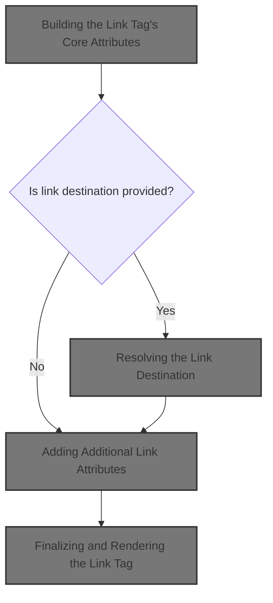

# Building the Link Tag's Core Attributes

```mermaid
%%{init: {"flowchart": {"defaultRenderer": "elk"}} }%%
flowchart TD
    node1["Start building hyperlink"] --> node2{"Should add link destination (href)?"}
    click node1 openCode "taglib/src/main/java/org/apache/struts/taglib/html/LinkTag.java:342:347"
    node2 -->|"Yes"| node3["Resolving the Link Destination"]
    click node2 openCode "taglib/src/main/java/org/apache/struts/taglib/html/LinkTag.java:350:354"
    node2 -->|"No"| node4["Continue without href"]
    
    click node4 openCode "taglib/src/main/java/org/apache/struts/taglib/html/LinkTag.java:347:349"
    node3 --> node5["Add target, access key, tab index"]
    node4 --> node5
    click node5 openCode "taglib/src/main/java/org/apache/struts/taglib/html/LinkTag.java:356:358"
    node5 --> node6["Applying Styles and Error Classes"]
    
    node6 --> node7["Handling Focus Events and Form State"]
    
    node7 --> node8{"Add link text content?"}
    click node8 openCode "taglib/src/main/java/org/apache/struts/taglib/html/LinkTag.java:365:367"
    node8 -->|"Yes"| node9["Add link text content"]
    click node9 openCode "taglib/src/main/java/org/apache/struts/taglib/html/LinkTag.java:365:367"
    node8 -->|"No"| node10["Finish hyperlink"]
    click node10 openCode "taglib/src/main/java/org/apache/struts/taglib/html/LinkTag.java:368:372"
    node9 --> node10
classDef HeadingStyle fill:#777777,stroke:#333,stroke-width:2px;
click node3 goToHeading "Resolving the Link Destination"
node3:::HeadingStyle
click node6 goToHeading "Applying Styles and Error Classes"
node6:::HeadingStyle
click node7 goToHeading "Wiring Up JavaScript Events"
node7:::HeadingStyle
click node7 goToHeading "Handling Focus Events and Form State"
node7:::HeadingStyle

%% Swimm:
%% %%{init: {"flowchart": {"defaultRenderer": "elk"}} }%%
%% flowchart TD
%%     node1["Start building hyperlink"] --> node2{"Should add link destination (href)?"}
%%     click node1 openCode "<SwmPath>[taglib/…/html/LinkTag.java](taglib/src/main/java/org/apache/struts/taglib/html/LinkTag.java)</SwmPath>:342:347"
%%     node2 -->|"Yes"| node3["Resolving the Link Destination"]
%%     click node2 openCode "<SwmPath>[taglib/…/html/LinkTag.java](taglib/src/main/java/org/apache/struts/taglib/html/LinkTag.java)</SwmPath>:350:354"
%%     node2 -->|"No"| node4["Continue without href"]
%%     
%%     click node4 openCode "<SwmPath>[taglib/…/html/LinkTag.java](taglib/src/main/java/org/apache/struts/taglib/html/LinkTag.java)</SwmPath>:347:349"
%%     node3 --> node5["Add target, access key, tab index"]
%%     node4 --> node5
%%     click node5 openCode "<SwmPath>[taglib/…/html/LinkTag.java](taglib/src/main/java/org/apache/struts/taglib/html/LinkTag.java)</SwmPath>:356:358"
%%     node5 --> node6["Applying Styles and Error Classes"]
%%     
%%     node6 --> node7["Handling Focus Events and Form State"]
%%     
%%     node7 --> node8{"Add link text content?"}
%%     click node8 openCode "<SwmPath>[taglib/…/html/LinkTag.java](taglib/src/main/java/org/apache/struts/taglib/html/LinkTag.java)</SwmPath>:365:367"
%%     node8 -->|"Yes"| node9["Add link text content"]
%%     click node9 openCode "<SwmPath>[taglib/…/html/LinkTag.java](taglib/src/main/java/org/apache/struts/taglib/html/LinkTag.java)</SwmPath>:365:367"
%%     node8 -->|"No"| node10["Finish hyperlink"]
%%     click node10 openCode "<SwmPath>[taglib/…/html/LinkTag.java](taglib/src/main/java/org/apache/struts/taglib/html/LinkTag.java)</SwmPath>:368:372"
%%     node9 --> node10
%% classDef HeadingStyle fill:#777777,stroke:#333,stroke-width:2px;
%% click node3 goToHeading "Resolving the Link Destination"
%% node3:::HeadingStyle
%% click node6 goToHeading "Applying Styles and Error Classes"
%% node6:::HeadingStyle
%% click node7 goToHeading "Wiring Up <SwmToken path="taglib/src/main/java/org/apache/struts/taglib/html/BaseHandlerTag.java" pos="42:3:3" line-data=" * JavaScript event handlers and/or CSS Style attributes. This class does not">`JavaScript`</SwmToken> Events"
%% node7:::HeadingStyle
%% click node7 goToHeading "Handling Focus Events and Form State"
%% node7:::HeadingStyle
```

<SwmSnippet path="/taglib/src/main/java/org/apache/struts/taglib/html/LinkTag.java" line="342">

---

In <SwmToken path="taglib/src/main/java/org/apache/struts/taglib/html/LinkTag.java" pos="342:5:5" line-data="    public int doEndTag() throws JspException {">`doEndTag`</SwmToken>, we start building the <a> tag and immediately handle the 'name' attribute. This is where we decide if the link is a named anchor. We call into <SwmToken path="taglib/src/main/java/org/apache/struts/taglib/html/LabelTag.java" pos="33:4:4" line-data="public class LabelTag extends BaseInputTag {">`LabelTag`</SwmToken>'s <SwmToken path="taglib/src/main/java/org/apache/struts/taglib/html/LinkTag.java" pos="347:1:1" line-data="        prepareAttribute(results, &quot;name&quot;, getLinkName());">`prepareAttribute`</SwmToken> next because it has logic for handling special cases like required fields, which can affect how attributes are rendered.

```java
    public int doEndTag() throws JspException {
        // Generate the opening anchor element
        StringBuffer results = new StringBuffer("<a");

        // Special case for name anchors
        prepareAttribute(results, "name", getLinkName());

```

---

</SwmSnippet>

<SwmSnippet path="/taglib/src/main/java/org/apache/struts/taglib/html/LabelTag.java" line="161">

---

<SwmToken path="taglib/src/main/java/org/apache/struts/taglib/html/LabelTag.java" pos="161:5:5" line-data="    protected void prepareAttribute(StringBuffer handlers, String name,">`prepareAttribute`</SwmToken> checks if we're dealing with the 'class' attribute and if the field is required. If so, it adds a required style class to the value. After that, it always calls the superclass to actually append the attribute, so the logic here just extends the base behavior for this special case.

```java
    protected void prepareAttribute(StringBuffer handlers, String name,
            Object value) {

        if ("class".equals(name) && this.required) {
            String requiredStyleClass = getRequiredStyleClass();
            if (requiredStyleClass != null) {
                value = (value != null) ? (value + " " + requiredStyleClass)
                        : requiredStyleClass;
            }
        }
        super.prepareAttribute(handlers, name, value);
    }
```

---

</SwmSnippet>

<SwmSnippet path="/taglib/src/main/java/org/apache/struts/taglib/html/LinkTag.java" line="349">

---

Back in <SwmToken path="taglib/src/main/java/org/apache/struts/taglib/html/LinkTag.java" pos="342:5:5" line-data="    public int doEndTag() throws JspException {">`doEndTag`</SwmToken>, after handling the 'name' attribute, we check if we need to add an 'href'. If any of the link destination properties are set, we call <SwmToken path="taglib/src/main/java/org/apache/struts/taglib/html/LinkTag.java" pos="353:11:11" line-data="            prepareAttribute(results, &quot;href&quot;, calculateURL());">`calculateURL`</SwmToken> to figure out what the actual URL should be. This step is what determines where the link points.

```java
        // * @since Struts 1.1
        if ((getLinkName() == null) || (getForward() != null)
            || (getHref() != null) || (getPage() != null)
            || (getAction() != null)) {
            prepareAttribute(results, "href", calculateURL());
        }

```

---

</SwmSnippet>

## Resolving the Link Destination

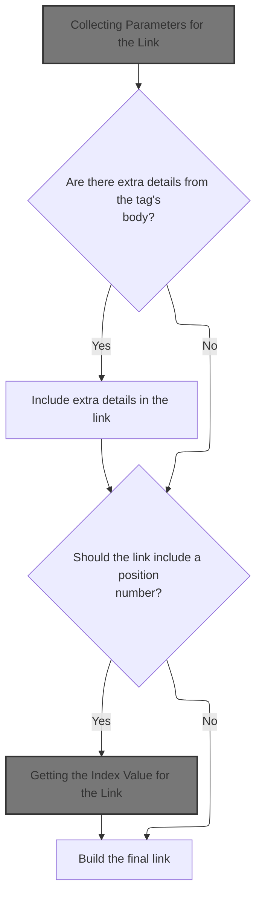

<SwmSnippet path="/taglib/src/main/java/org/apache/struts/taglib/html/LinkTag.java" line="409">

---

In <SwmToken path="taglib/src/main/java/org/apache/struts/taglib/html/LinkTag.java" pos="409:5:5" line-data="    protected String calculateURL()">`calculateURL`</SwmToken>, we start by collecting all possible parameters that might need to go into the URL. We call TagUtils.computeParameters next because it knows how to gather parameters from beans, tag attributes, and other sources.

```java
    protected String calculateURL()
        throws JspException {
        // Identify the parameters we will add to the completed URL
        Map params =
            TagUtils.getInstance().computeParameters(pageContext, paramId,
                paramName, paramProperty, paramScope, name, property, scope,
                transaction);

```

---

</SwmSnippet>

### Collecting Parameters for the Link

```mermaid
%%{init: {"flowchart": {"defaultRenderer": "elk"}} }%%
flowchart TD
    node1["Start: Build parameters for web tag"]
    click node1 openCode "taglib/src/main/java/org/apache/struts/taglib/TagUtils.java:190:195"
    node1 --> node2{"Are any parameters or transaction
requested?"}
    click node2 openCode "taglib/src/main/java/org/apache/struts/taglib/TagUtils.java:195:197"
    node2 -->|"No"| node3["Return null"]
    click node3 openCode "taglib/src/main/java/org/apache/struts/taglib/TagUtils.java:196:197"
    node2 -->|"Yes"| node4{"Is there a named source for multi-value
parameters?"}
    click node4 openCode "taglib/src/main/java/org/apache/struts/taglib/TagUtils.java:203:206"
    node4 -->|"Yes"| node5["Initialize result map from named source"]
    click node5 openCode "taglib/src/main/java/org/apache/struts/taglib/TagUtils.java:221:222"
    node4 -->|"No"| node6["Initialize empty result map"]
    click node6 openCode "taglib/src/main/java/org/apache/struts/taglib/TagUtils.java:223:225"
    node5 --> node7{"Add single-value parameter? (paramId &
paramName provided)"}
    node6 --> node7
    click node7 openCode "taglib/src/main/java/org/apache/struts/taglib/TagUtils.java:228:269"
    node7 -->|"Yes"| node8["Add single-value parameter"]
    click node8 openCode "taglib/src/main/java/org/apache/struts/taglib/TagUtils.java:229:269"
    node7 -->|"No"| node9{"Add transaction token?"}
    node8 --> node9
    click node9 openCode "taglib/src/main/java/org/apache/struts/taglib/TagUtils.java:272:284"
    node9 -->|"Yes"| node10["Add transaction token"]
    click node10 openCode "taglib/src/main/java/org/apache/struts/taglib/TagUtils.java:273:283"
    node9 -->|"No"| node11["Return parameters"]
    node10 --> node11
    click node11 openCode "taglib/src/main/java/org/apache/struts/taglib/TagUtils.java:286:288"

classDef HeadingStyle fill:#777777,stroke:#333,stroke-width:2px;

%% Swimm:
%% %%{init: {"flowchart": {"defaultRenderer": "elk"}} }%%
%% flowchart TD
%%     node1["Start: Build parameters for web tag"]
%%     click node1 openCode "<SwmPath>[taglib/…/taglib/TagUtils.java](taglib/src/main/java/org/apache/struts/taglib/TagUtils.java)</SwmPath>:190:195"
%%     node1 --> node2{"Are any parameters or transaction
%% requested?"}
%%     click node2 openCode "<SwmPath>[taglib/…/taglib/TagUtils.java](taglib/src/main/java/org/apache/struts/taglib/TagUtils.java)</SwmPath>:195:197"
%%     node2 -->|"No"| node3["Return null"]
%%     click node3 openCode "<SwmPath>[taglib/…/taglib/TagUtils.java](taglib/src/main/java/org/apache/struts/taglib/TagUtils.java)</SwmPath>:196:197"
%%     node2 -->|"Yes"| node4{"Is there a named source for <SwmToken path="taglib/src/main/java/org/apache/struts/taglib/TagUtils.java" pos="199:13:15" line-data="        // Locate the Map containing our multi-value parameters map">`multi-value`</SwmToken>
%% parameters?"}
%%     click node4 openCode "<SwmPath>[taglib/…/taglib/TagUtils.java](taglib/src/main/java/org/apache/struts/taglib/TagUtils.java)</SwmPath>:203:206"
%%     node4 -->|"Yes"| node5["Initialize result map from named source"]
%%     click node5 openCode "<SwmPath>[taglib/…/taglib/TagUtils.java](taglib/src/main/java/org/apache/struts/taglib/TagUtils.java)</SwmPath>:221:222"
%%     node4 -->|"No"| node6["Initialize empty result map"]
%%     click node6 openCode "<SwmPath>[taglib/…/taglib/TagUtils.java](taglib/src/main/java/org/apache/struts/taglib/TagUtils.java)</SwmPath>:223:225"
%%     node5 --> node7{"Add <SwmToken path="taglib/src/main/java/org/apache/struts/taglib/TagUtils.java" pos="227:7:9" line-data="        // Add the single-value parameter (if any)">`single-value`</SwmToken> parameter? (<SwmToken path="taglib/src/main/java/org/apache/struts/taglib/html/LinkTag.java" pos="413:12:12" line-data="            TagUtils.getInstance().computeParameters(pageContext, paramId,">`paramId`</SwmToken> &
%% <SwmToken path="taglib/src/main/java/org/apache/struts/taglib/html/LinkTag.java" pos="414:1:1" line-data="                paramName, paramProperty, paramScope, name, property, scope,">`paramName`</SwmToken> provided)"}
%%     node6 --> node7
%%     click node7 openCode "<SwmPath>[taglib/…/taglib/TagUtils.java](taglib/src/main/java/org/apache/struts/taglib/TagUtils.java)</SwmPath>:228:269"
%%     node7 -->|"Yes"| node8["Add <SwmToken path="taglib/src/main/java/org/apache/struts/taglib/TagUtils.java" pos="227:7:9" line-data="        // Add the single-value parameter (if any)">`single-value`</SwmToken> parameter"]
%%     click node8 openCode "<SwmPath>[taglib/…/taglib/TagUtils.java](taglib/src/main/java/org/apache/struts/taglib/TagUtils.java)</SwmPath>:229:269"
%%     node7 -->|"No"| node9{"Add transaction token?"}
%%     node8 --> node9
%%     click node9 openCode "<SwmPath>[taglib/…/taglib/TagUtils.java](taglib/src/main/java/org/apache/struts/taglib/TagUtils.java)</SwmPath>:272:284"
%%     node9 -->|"Yes"| node10["Add transaction token"]
%%     click node10 openCode "<SwmPath>[taglib/…/taglib/TagUtils.java](taglib/src/main/java/org/apache/struts/taglib/TagUtils.java)</SwmPath>:273:283"
%%     node9 -->|"No"| node11["Return parameters"]
%%     node10 --> node11
%%     click node11 openCode "<SwmPath>[taglib/…/taglib/TagUtils.java](taglib/src/main/java/org/apache/struts/taglib/TagUtils.java)</SwmPath>:286:288"
%% 
%% classDef HeadingStyle fill:#777777,stroke:#333,stroke-width:2px;
```

<SwmSnippet path="/taglib/src/main/java/org/apache/struts/taglib/TagUtils.java" line="190">

---

<SwmToken path="taglib/src/main/java/org/apache/struts/taglib/TagUtils.java" pos="190:5:5" line-data="    public Map computeParameters(PageContext pageContext, String paramId,">`computeParameters`</SwmToken> checks if we need to add any parameters at all, then tries to grab a Map from a bean if 'name' is set. It copies that map (if found) or starts a new one. Next, it may add a <SwmToken path="taglib/src/main/java/org/apache/struts/taglib/TagUtils.java" pos="227:7:9" line-data="        // Add the single-value parameter (if any)">`single-value`</SwmToken> parameter, and if the transaction flag is set, it adds a transaction token. The lookup call is needed to fetch parameter values from beans or other scopes.

```java
    public Map computeParameters(PageContext pageContext, String paramId,
        String paramName, String paramProperty, String paramScope, String name,
        String property, String scope, boolean transaction)
        throws JspException {
        // Short circuit if no parameters are specified
        if ((paramId == null) && (name == null) && !transaction) {
            return (null);
        }

        // Locate the Map containing our multi-value parameters map
        Map map = null;

        try {
            if (name != null) {
                map = (Map) getInstance().lookup(pageContext, name, property,
                        scope);
            }

            // @TODO - remove this - it is never thrown
            //        } catch (ClassCastException e) {
            //            saveException(pageContext, e);
            //            throw new JspException(
            //                    messages.getMessage("parameters.multi", name, property, scope));
        } catch (JspException e) {
            saveException(pageContext, e);
            throw e;
        }

        // Create a Map to contain our results from the multi-value parameters
        Map results = null;

        if (map != null) {
            results = new HashMap(map);
        } else {
            results = new HashMap();
        }

        // Add the single-value parameter (if any)
        if ((paramId != null) && (paramName != null)) {
            Object paramValue = null;

            try {
                paramValue =
                    TagUtils.getInstance().lookup(pageContext, paramName,
                        paramProperty, paramScope);
            } catch (JspException e) {
                saveException(pageContext, e);
                throw e;
            }

```

---

</SwmSnippet>

<SwmSnippet path="/taglib/src/main/java/org/apache/struts/taglib/TagUtils.java" line="897">

---

<SwmToken path="taglib/src/main/java/org/apache/struts/taglib/TagUtils.java" pos="897:5:5" line-data="    public Object lookup(PageContext pageContext, String name, String property,">`lookup`</SwmToken> tries to find a bean by name and scope, and optionally a property on that bean. If anything's missing or wrong, it throws a <SwmToken path="taglib/src/main/java/org/apache/struts/taglib/TagUtils.java" pos="898:8:8" line-data="        String scope) throws JspException {">`JspException`</SwmToken> with a detailed message. It also saves exceptions in the <SwmToken path="taglib/src/main/java/org/apache/struts/taglib/TagUtils.java" pos="897:7:7" line-data="    public Object lookup(PageContext pageContext, String name, String property,">`PageContext`</SwmToken> for later retrieval. This is all about making sure the parameters we use actually exist and are accessible.

```java
    public Object lookup(PageContext pageContext, String name, String property,
        String scope) throws JspException {
        // Look up the requested bean, and return if requested
        Object bean = lookup(pageContext, name, scope);

        if (bean == null) {
            JspException e = null;

            if (scope == null) {
                e = new JspException(messages.getMessage("lookup.bean.any", name));
            } else {
                e = new JspException(messages.getMessage("lookup.bean", name,
                            scope));
            }

            saveException(pageContext, e);
            throw e;
        }

        if (property == null) {
            return bean;
        }

        // Locate and return the specified property
        try {
            return PropertyUtils.getProperty(bean, property);
        } catch (IllegalAccessException e) {
            saveException(pageContext, e);
            throw new JspException(messages.getMessage("lookup.access",
                    property, name), e);
        } catch (IllegalArgumentException e) {
            saveException(pageContext, e);
            throw new JspException(messages.getMessage("lookup.argument",
                    property, name), e);
        } catch (InvocationTargetException e) {
            Throwable t = e.getTargetException();

            if (t == null) {
                t = e;
            }

            saveException(pageContext, t);
            throw new JspException(messages.getMessage("lookup.target",
                    property, name), e);
        } catch (NoSuchMethodException e) {
            saveException(pageContext, e);

            String beanName = name;

            // Name defaults to Contants.BEAN_KEY if no name is specified by
            // an input tag. Thus lookup the bean under the key and use
            // its class name for the exception message.
            if (Constants.BEAN_KEY.equals(name)) {
                Object obj = pageContext.findAttribute(Constants.BEAN_KEY);

                if (obj != null) {
                    beanName = obj.getClass().getName();
                }
            }

            throw new JspException(messages.getMessage("lookup.method",
                    property, beanName), e);
        }
    }
```

---

</SwmSnippet>

<SwmSnippet path="/taglib/src/main/java/org/apache/struts/taglib/TagUtils.java" line="240">

---

After coming back from <SwmToken path="taglib/src/main/java/org/apache/struts/taglib/TagUtils.java" pos="204:13:13" line-data="                map = (Map) getInstance().lookup(pageContext, name, property,">`lookup`</SwmToken>, the code checks if the parameter already exists in the results Map. If so, it merges values into arrays to support <SwmToken path="taglib/src/main/java/org/apache/struts/taglib/TagUtils.java" pos="199:13:15" line-data="        // Locate the Map containing our multi-value parameters map">`multi-value`</SwmToken> parameters. It also adds a transaction token if needed. The final Map is ready for building the URL.

```java
            if (paramValue != null) {
                String paramString = null;

                if (paramValue instanceof String) {
                    paramString = (String) paramValue;
                } else {
                    paramString = paramValue.toString();
                }

                Object mapValue = results.get(paramId);

                if (mapValue == null) {
                    results.put(paramId, paramString);
                } else if (mapValue instanceof String[]) {
                    String[] oldValues = (String[]) mapValue;
                    String[] newValues = new String[oldValues.length + 1];

                    System.arraycopy(oldValues, 0, newValues, 0,
                        oldValues.length);
                    newValues[oldValues.length] = paramString;
                    results.put(paramId, newValues);
                } else {
                    String[] newValues = new String[2];

                    newValues[0] = mapValue.toString();
                    newValues[1] = paramString;
                    results.put(paramId, newValues);
                }
            }
        }

        // Add our transaction control token (if requested)
        if (transaction) {
            HttpSession session = pageContext.getSession();
            String token = null;

            if (session != null) {
                token =
                    (String) session.getAttribute(Globals.TRANSACTION_TOKEN_KEY);
            }

            if (token != null) {
                results.put(Constants.TOKEN_KEY, token);
            }
        }

        // Return the completed Map
        return (results);
    }
```

---

</SwmSnippet>

### Merging Tag Parameters and Indexing

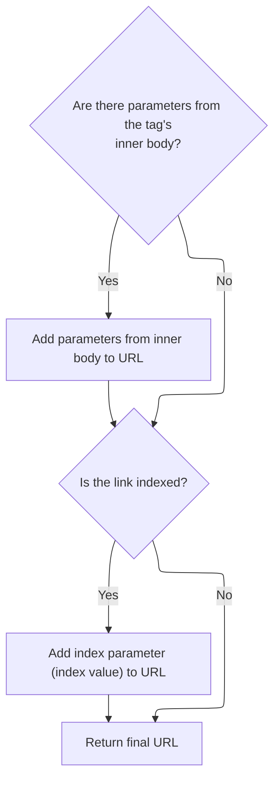

<SwmSnippet path="/taglib/src/main/java/org/apache/struts/taglib/html/LinkTag.java" line="417">

---

Back in <SwmToken path="taglib/src/main/java/org/apache/struts/taglib/html/LinkTag.java" pos="353:11:11" line-data="            prepareAttribute(results, &quot;href&quot;, calculateURL());">`calculateURL`</SwmToken>, after getting parameters from <SwmToken path="taglib/src/main/java/org/apache/struts/taglib/html/LinkTag.java" pos="369:1:1" line-data="        TagUtils.getInstance().write(pageContext, results.toString());">`TagUtils`</SwmToken>, we merge in any parameters defined inside the tag body. If 'indexed' is true, we call <SwmToken path="taglib/src/main/java/org/apache/struts/taglib/html/LinkTag.java" pos="428:7:7" line-data="            int indexValue = getIndexValue();">`getIndexValue`</SwmToken> from <SwmToken path="taglib/src/main/java/org/apache/struts/taglib/html/LinkTag.java" pos="39:8:8" line-data="public class LinkTag extends BaseHandlerTag {">`BaseHandlerTag`</SwmToken> to add an index parameter. This is how indexed collections are handled in URLs.

```java
        // Add parameters collected from the tag's inner body
        if (!this.parameters.isEmpty()) {
            if (params == null) {
                params = new HashMap();
            }
            params.putAll(this.parameters);
        }

        // if "indexed=true", add "index=x" parameter to query string
        // * @since Struts 1.1
        if (indexed) {
            int indexValue = getIndexValue();

```

---

</SwmSnippet>

### Getting the Index Value for the Link

See <SwmLink doc-title="Determining the Loop Index for Tags">[Determining the Loop Index for Tags](/.swm/determining-the-loop-index-for-tags.xm3srv8e.sw.md)</SwmLink>

### Finalizing the URL Construction

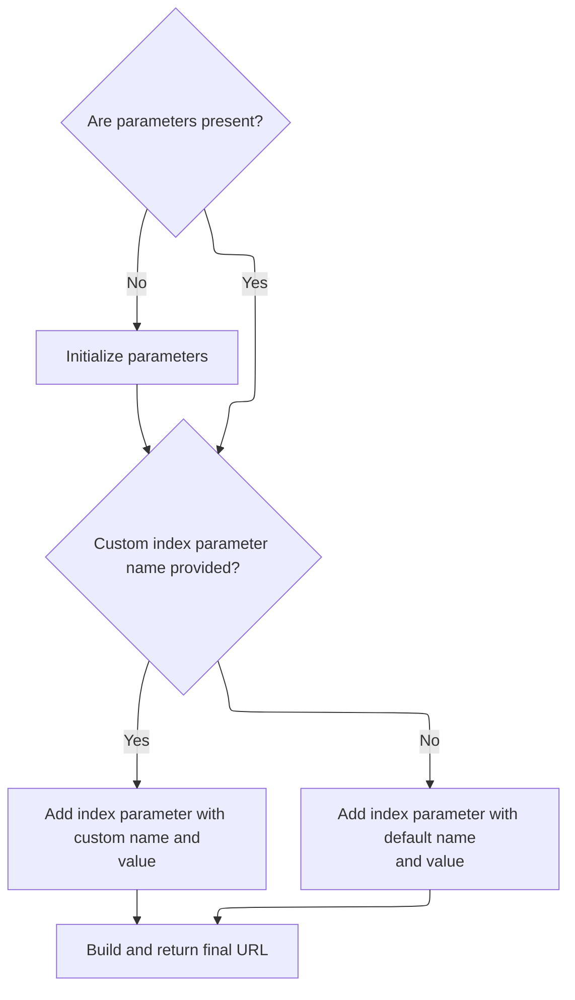

<SwmSnippet path="/taglib/src/main/java/org/apache/struts/taglib/html/LinkTag.java" line="430">

---

After getting the index value from <SwmToken path="taglib/src/main/java/org/apache/struts/taglib/html/LinkTag.java" pos="39:8:8" line-data="public class LinkTag extends BaseHandlerTag {">`BaseHandlerTag`</SwmToken>, we add it to the parameters map (using either <SwmToken path="taglib/src/main/java/org/apache/struts/taglib/html/LinkTag.java" pos="435:4:4" line-data="            if (indexId != null) {">`indexId`</SwmToken> or 'index'). Then we call <SwmToken path="taglib/src/main/java/org/apache/struts/taglib/html/LinkTag.java" pos="445:11:11" line-data="            url = TagUtils.getInstance().computeURLWithCharEncoding(pageContext,">`computeURLWithCharEncoding`</SwmToken> to build the final URL string. If anything goes wrong, we throw a <SwmToken path="taglib/src/main/java/org/apache/struts/taglib/html/LinkTag.java" pos="450:5:5" line-data="            throw new JspException(messages.getMessage(&quot;rewrite.url&quot;,">`JspException`</SwmToken>. The finished URL is returned.

```java
            //calculate index, and add as a parameter
            if (params == null) {
                params = new HashMap(); //create new HashMap if no other params
            }

            if (indexId != null) {
                params.put(indexId, Integer.toString(indexValue));
            } else {
                params.put("index", Integer.toString(indexValue));
            }
        }

        String url = null;

        try {
            url = TagUtils.getInstance().computeURLWithCharEncoding(pageContext,
                    forward, href, page, action, module, params, anchor, false,
                    useLocalEncoding);
        } catch (MalformedURLException e) {
            TagUtils.getInstance().saveException(pageContext, e);
            throw new JspException(messages.getMessage("rewrite.url",
                    e.toString()), e);
        }

        return (url);
    }
```

---

</SwmSnippet>

## Adding Additional Link Attributes

<SwmSnippet path="/taglib/src/main/java/org/apache/struts/taglib/html/LinkTag.java" line="356">

---

After getting the URL, <SwmToken path="taglib/src/main/java/org/apache/struts/taglib/html/LinkTag.java" pos="342:5:5" line-data="    public int doEndTag() throws JspException {">`doEndTag`</SwmToken> adds optional attributes like 'target', 'accesskey', and 'tabindex' using <SwmToken path="taglib/src/main/java/org/apache/struts/taglib/html/LinkTag.java" pos="356:1:1" line-data="        prepareAttribute(results, &quot;target&quot;, getTarget());">`prepareAttribute`</SwmToken>. These are handled by <SwmToken path="taglib/src/main/java/org/apache/struts/taglib/html/LabelTag.java" pos="33:4:4" line-data="public class LabelTag extends BaseInputTag {">`LabelTag`</SwmToken> to keep attribute logic consistent.

```java
        prepareAttribute(results, "target", getTarget());
        prepareAttribute(results, "accesskey", getAccesskey());
        prepareAttribute(results, "tabindex", getTabindex());
```

---

</SwmSnippet>

<SwmSnippet path="/taglib/src/main/java/org/apache/struts/taglib/html/LinkTag.java" line="359">

---

After setting the main attributes, <SwmToken path="taglib/src/main/java/org/apache/struts/taglib/html/LinkTag.java" pos="342:5:5" line-data="    public int doEndTag() throws JspException {">`doEndTag`</SwmToken> calls <SwmToken path="taglib/src/main/java/org/apache/struts/taglib/html/LinkTag.java" pos="359:5:5" line-data="        results.append(prepareStyles());">`prepareStyles`</SwmToken> from <SwmToken path="taglib/src/main/java/org/apache/struts/taglib/html/LinkTag.java" pos="39:8:8" line-data="public class LinkTag extends BaseHandlerTag {">`BaseHandlerTag`</SwmToken>. This step adds CSS classes, inline styles, and handles error styling if needed.

```java
        results.append(prepareStyles());
```

---

</SwmSnippet>

## Applying Styles and Error Classes

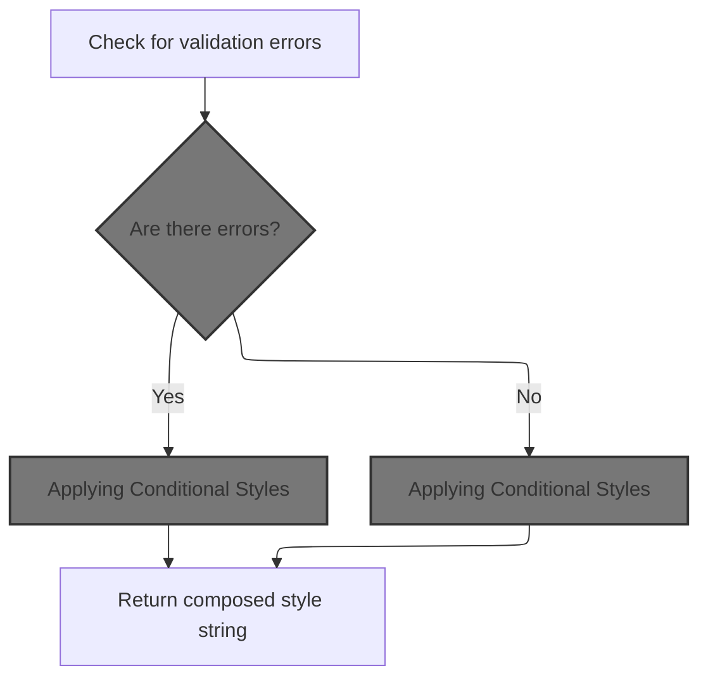

<SwmSnippet path="/taglib/src/main/java/org/apache/struts/taglib/html/BaseHandlerTag.java" line="967">

---

In <SwmToken path="taglib/src/main/java/org/apache/struts/taglib/html/BaseHandlerTag.java" pos="967:5:5" line-data="    protected String prepareStyles()">`prepareStyles`</SwmToken>, we check if there are any errors for this field before deciding which styles to apply. If errors exist, we use error-specific styles; otherwise, we use the normal ones. We call <SwmToken path="taglib/src/main/java/org/apache/struts/taglib/html/BaseHandlerTag.java" pos="971:7:7" line-data="        boolean errorsExist = doErrorsExist();">`doErrorsExist`</SwmToken> next to figure out if we need to switch styling.

```java
    protected String prepareStyles()
        throws JspException {
        StringBuffer styles = new StringBuffer();

        boolean errorsExist = doErrorsExist();

```

---

</SwmSnippet>

### Checking for Field Errors

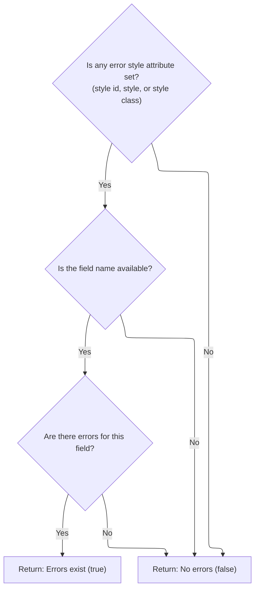

<SwmSnippet path="/taglib/src/main/java/org/apache/struts/taglib/html/BaseHandlerTag.java" line="1003">

---

In <SwmToken path="taglib/src/main/java/org/apache/struts/taglib/html/BaseHandlerTag.java" pos="1003:5:5" line-data="    protected boolean doErrorsExist()">`doErrorsExist`</SwmToken>, we only bother checking for errors if any error style attributes are set. If so, we call <SwmToken path="taglib/src/main/java/org/apache/struts/taglib/html/BaseHandlerTag.java" pos="1009:7:7" line-data="            String actualName = prepareName();">`prepareName`</SwmToken> to get the field name to check for errors on.

```java
    protected boolean doErrorsExist()
        throws JspException {
        boolean errorsExist = false;

        if ((getErrorStyleId() != null) || (getErrorStyle() != null)
            || (getErrorStyleClass() != null)) {
            String actualName = prepareName();

```

---

</SwmSnippet>

<SwmSnippet path="/taglib/src/main/java/org/apache/struts/taglib/html/BaseHandlerTag.java" line="1029">

---

<SwmToken path="taglib/src/main/java/org/apache/struts/taglib/html/BaseHandlerTag.java" pos="1029:5:5" line-data="    protected String prepareName()">`prepareName`</SwmToken> here just returns null. It's basically a no-op, probably meant to be overridden by subclasses that need to provide a real field name.

```java
    protected String prepareName()
        throws JspException {
        return null;
    }
```

---

</SwmSnippet>

<SwmSnippet path="/taglib/src/main/java/org/apache/struts/taglib/html/BaseHandlerTag.java" line="1011">

---

After <SwmToken path="taglib/src/main/java/org/apache/struts/taglib/html/BaseHandlerTag.java" pos="1009:7:7" line-data="            String actualName = prepareName();">`prepareName`</SwmToken>, if we got a field name, we call TagUtils.getActionMessages to see if there are any errors for that field. If there are, we set <SwmToken path="taglib/src/main/java/org/apache/struts/taglib/html/BaseHandlerTag.java" pos="1016:1:1" line-data="                errorsExist = ((errors != null)">`errorsExist`</SwmToken> to true so error styles get applied.

```java
            if (actualName != null) {
                ActionMessages errors =
                    TagUtils.getInstance().getActionMessages(pageContext,
                        errorKey);

                errorsExist = ((errors != null)
                    && (errors.size(actualName) > 0));
            }
        }

        return errorsExist;
    }
```

---

</SwmSnippet>

### Retrieving Validation Messages

```mermaid
%%{init: {"flowchart": {"defaultRenderer": "elk"}} }%%
flowchart TD
    node1["Look up value by paramName in page
context"]
    click node1 openCode "taglib/src/main/java/org/apache/struts/taglib/TagUtils.java:731:731"
    node1 --> node2{"Is value found?"}
    click node2 openCode "taglib/src/main/java/org/apache/struts/taglib/TagUtils.java:733:733"
    node2 -->|"No"| node8["Return empty message collection"]
    click node8 openCode "taglib/src/main/java/org/apache/struts/taglib/TagUtils.java:729:729"
    node2 -->|"Yes"| node3{"Type of value?"}
    click node3 openCode "taglib/src/main/java/org/apache/struts/taglib/TagUtils.java:735:751"
    node3 -->|"String (single message)"| node4["Add message to collection"]
    click node4 openCode "taglib/src/main/java/org/apache/struts/taglib/TagUtils.java:736:737"
    node3 -->|"String[] (multiple messages)"| node5["Add each message to collection"]
    click node5 openCode "taglib/src/main/java/org/apache/struts/taglib/TagUtils.java:739:744"
    node3 -->|"ActionMessages or ActionErrors"| node6["Return existing message collection"]
    click node6 openCode "taglib/src/main/java/org/apache/struts/taglib/TagUtils.java:746:750"
    node3 -->|"Other type"| node7["Raise error"]
    click node7 openCode "taglib/src/main/java/org/apache/struts/taglib/TagUtils.java:752:754"
    node4 --> node9["Return message collection"]
    subgraph loop1[For each message in String[]]
      node5 --> node10["Add message to collection"]
      click node10 openCode "taglib/src/main/java/org/apache/struts/taglib/TagUtils.java:742:743"
      node10 --> node11["All messages processed"]
    end
    node11 --> node9
    node6 --> node9
    node8 --> node9
    click node9 openCode "taglib/src/main/java/org/apache/struts/taglib/TagUtils.java:763:763"

classDef HeadingStyle fill:#777777,stroke:#333,stroke-width:2px;

%% Swimm:
%% %%{init: {"flowchart": {"defaultRenderer": "elk"}} }%%
%% flowchart TD
%%     node1["Look up value by <SwmToken path="taglib/src/main/java/org/apache/struts/taglib/html/LinkTag.java" pos="414:1:1" line-data="                paramName, paramProperty, paramScope, name, property, scope,">`paramName`</SwmToken> in page
%% context"]
%%     click node1 openCode "<SwmPath>[taglib/…/taglib/TagUtils.java](taglib/src/main/java/org/apache/struts/taglib/TagUtils.java)</SwmPath>:731:731"
%%     node1 --> node2{"Is value found?"}
%%     click node2 openCode "<SwmPath>[taglib/…/taglib/TagUtils.java](taglib/src/main/java/org/apache/struts/taglib/TagUtils.java)</SwmPath>:733:733"
%%     node2 -->|"No"| node8["Return empty message collection"]
%%     click node8 openCode "<SwmPath>[taglib/…/taglib/TagUtils.java](taglib/src/main/java/org/apache/struts/taglib/TagUtils.java)</SwmPath>:729:729"
%%     node2 -->|"Yes"| node3{"Type of value?"}
%%     click node3 openCode "<SwmPath>[taglib/…/taglib/TagUtils.java](taglib/src/main/java/org/apache/struts/taglib/TagUtils.java)</SwmPath>:735:751"
%%     node3 -->|"String (single message)"| node4["Add message to collection"]
%%     click node4 openCode "<SwmPath>[taglib/…/taglib/TagUtils.java](taglib/src/main/java/org/apache/struts/taglib/TagUtils.java)</SwmPath>:736:737"
%%     node3 -->|"String[] (multiple messages)"| node5["Add each message to collection"]
%%     click node5 openCode "<SwmPath>[taglib/…/taglib/TagUtils.java](taglib/src/main/java/org/apache/struts/taglib/TagUtils.java)</SwmPath>:739:744"
%%     node3 -->|"<SwmToken path="taglib/src/main/java/org/apache/struts/taglib/TagUtils.java" pos="727:3:3" line-data="    public ActionMessages getActionMessages(PageContext pageContext,">`ActionMessages`</SwmToken> or <SwmToken path="taglib/src/main/java/org/apache/struts/taglib/TagUtils.java" pos="745:12:12" line-data="                } else if (value instanceof ActionErrors) {">`ActionErrors`</SwmToken>"| node6["Return existing message collection"]
%%     click node6 openCode "<SwmPath>[taglib/…/taglib/TagUtils.java](taglib/src/main/java/org/apache/struts/taglib/TagUtils.java)</SwmPath>:746:750"
%%     node3 -->|"Other type"| node7["Raise error"]
%%     click node7 openCode "<SwmPath>[taglib/…/taglib/TagUtils.java](taglib/src/main/java/org/apache/struts/taglib/TagUtils.java)</SwmPath>:752:754"
%%     node4 --> node9["Return message collection"]
%%     subgraph loop1[For each message in String[]]
%%       node5 --> node10["Add message to collection"]
%%       click node10 openCode "<SwmPath>[taglib/…/taglib/TagUtils.java](taglib/src/main/java/org/apache/struts/taglib/TagUtils.java)</SwmPath>:742:743"
%%       node10 --> node11["All messages processed"]
%%     end
%%     node11 --> node9
%%     node6 --> node9
%%     node8 --> node9
%%     click node9 openCode "<SwmPath>[taglib/…/taglib/TagUtils.java](taglib/src/main/java/org/apache/struts/taglib/TagUtils.java)</SwmPath>:763:763"
%% 
%% classDef HeadingStyle fill:#777777,stroke:#333,stroke-width:2px;
```

<SwmSnippet path="/taglib/src/main/java/org/apache/struts/taglib/TagUtils.java" line="727">

---

In <SwmToken path="taglib/src/main/java/org/apache/struts/taglib/TagUtils.java" pos="727:5:5" line-data="    public ActionMessages getActionMessages(PageContext pageContext,">`getActionMessages`</SwmToken>, we grab the attribute from <SwmToken path="taglib/src/main/java/org/apache/struts/taglib/TagUtils.java" pos="727:7:7" line-data="    public ActionMessages getActionMessages(PageContext pageContext,">`PageContext`</SwmToken> and convert it into an <SwmToken path="taglib/src/main/java/org/apache/struts/taglib/TagUtils.java" pos="727:3:3" line-data="    public ActionMessages getActionMessages(PageContext pageContext,">`ActionMessages`</SwmToken> object, no matter if it's a String, array, <SwmToken path="taglib/src/main/java/org/apache/struts/taglib/TagUtils.java" pos="745:12:12" line-data="                } else if (value instanceof ActionErrors) {">`ActionErrors`</SwmToken>, or already an <SwmToken path="taglib/src/main/java/org/apache/struts/taglib/TagUtils.java" pos="727:3:3" line-data="    public ActionMessages getActionMessages(PageContext pageContext,">`ActionMessages`</SwmToken>. If it's something else, we throw an exception. This way, error handling is consistent.

```java
    public ActionMessages getActionMessages(PageContext pageContext,
        String paramName) throws JspException {
        ActionMessages am = new ActionMessages();

        Object value = pageContext.findAttribute(paramName);

        if (value != null) {
            try {
                if (value instanceof String) {
                    am.add(ActionMessages.GLOBAL_MESSAGE,
                        new ActionMessage((String) value));
                } else if (value instanceof String[]) {
                    String[] keys = (String[]) value;

                    for (int i = 0; i < keys.length; i++) {
                        am.add(ActionMessages.GLOBAL_MESSAGE,
                            new ActionMessage(keys[i]));
                    }
```

---

</SwmSnippet>

<SwmSnippet path="/taglib/src/main/java/org/apache/struts/taglib/TagUtils.java" line="745">

---

After all the type checks, <SwmToken path="taglib/src/main/java/org/apache/struts/taglib/TagUtils.java" pos="727:5:5" line-data="    public ActionMessages getActionMessages(PageContext pageContext,">`getActionMessages`</SwmToken> always returns an <SwmToken path="taglib/src/main/java/org/apache/struts/taglib/TagUtils.java" pos="746:1:1" line-data="                    ActionMessages m = (ActionMessages) value;">`ActionMessages`</SwmToken> object—either filled with messages or empty if nothing was found. This keeps error handling predictable.

```java
                } else if (value instanceof ActionErrors) {
                    ActionMessages m = (ActionMessages) value;

                    am.add(m);
                } else if (value instanceof ActionMessages) {
                    am = (ActionMessages) value;
                } else {
                    throw new JspException(messages.getMessage(
                            "actionMessages.errors", value.getClass().getName()));
                }
            } catch (JspException e) {
                throw e;
            } catch (Exception e) {
                log.warn("Unable to retieve ActionMessage for paramName : "
                    + paramName, e);
            }
        }

        return am;
    }
```

---

</SwmSnippet>

### Applying Conditional Styles

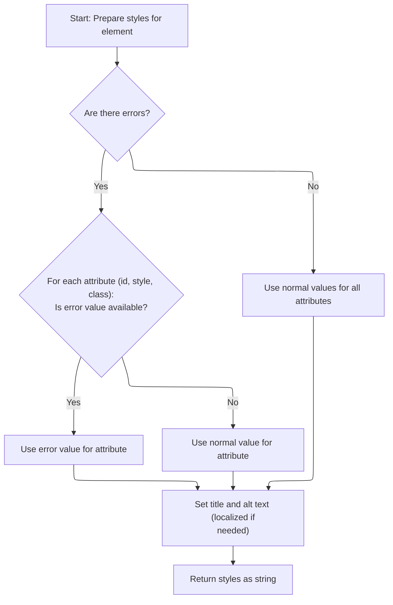

<SwmSnippet path="/taglib/src/main/java/org/apache/struts/taglib/html/BaseHandlerTag.java" line="973">

---

After checking for errors, <SwmToken path="taglib/src/main/java/org/apache/struts/taglib/html/LinkTag.java" pos="359:5:5" line-data="        results.append(prepareStyles());">`prepareStyles`</SwmToken> adds the right style, class, and id attributes—using error versions if needed. It also sets title and alt using the message method, which handles localization and literal values.

```java
        if (errorsExist && (getErrorStyleId() != null)) {
            prepareAttribute(styles, "id", getErrorStyleId());
        } else {
            prepareAttribute(styles, "id", getStyleId());
        }

        if (errorsExist && (getErrorStyle() != null)) {
            prepareAttribute(styles, "style", getErrorStyle());
        } else {
            prepareAttribute(styles, "style", getStyle());
        }

        if (errorsExist && (getErrorStyleClass() != null)) {
            prepareAttribute(styles, "class", getErrorStyleClass());
        } else {
            prepareAttribute(styles, "class", getStyleClass());
        }

        prepareAttribute(styles, "title", message(getTitle(), getTitleKey()));
        prepareAttribute(styles, "alt", message(getAlt(), getAltKey()));
```

---

</SwmSnippet>

<SwmSnippet path="/taglib/src/main/java/org/apache/struts/taglib/html/BaseHandlerTag.java" line="830">

---

<SwmToken path="taglib/src/main/java/org/apache/struts/taglib/html/BaseHandlerTag.java" pos="830:5:5" line-data="    protected String message(String literal, String key)">`message`</SwmToken> enforces that you can't set both a literal and a key. If you do, it throws. If only one is set, it returns the literal or fetches the localized message. If neither is set, it returns null.

```java
    protected String message(String literal, String key)
        throws JspException {
        if (literal != null) {
            if (key != null) {
                JspException e =
                    new JspException(messages.getMessage("common.both"));

                TagUtils.getInstance().saveException(pageContext, e);
                throw e;
            } else {
                return (literal);
            }
        } else {
            if (key != null) {
                return TagUtils.getInstance().message(pageContext, getBundle(),
                    getLocale(), key);
            } else {
                return null;
            }
        }
    }
```

---

</SwmSnippet>

<SwmSnippet path="/taglib/src/main/java/org/apache/struts/taglib/html/BaseHandlerTag.java" line="993">

---

After all the style and message attributes are set, <SwmToken path="taglib/src/main/java/org/apache/struts/taglib/html/LinkTag.java" pos="359:5:5" line-data="        results.append(prepareStyles());">`prepareStyles`</SwmToken> calls <SwmToken path="taglib/src/main/java/org/apache/struts/taglib/html/BaseHandlerTag.java" pos="993:1:1" line-data="        prepareInternationalization(styles);">`prepareInternationalization`</SwmToken> to add any i18n-related attributes. Then it returns the final styles string.

```java
        prepareInternationalization(styles);

        return styles.toString();
    }
```

---

</SwmSnippet>

## Adding Event Handlers to the Link

<SwmSnippet path="/taglib/src/main/java/org/apache/struts/taglib/html/LinkTag.java" line="360">

---

After styles are done, <SwmToken path="taglib/src/main/java/org/apache/struts/taglib/html/LinkTag.java" pos="342:5:5" line-data="    public int doEndTag() throws JspException {">`doEndTag`</SwmToken> calls <SwmToken path="taglib/src/main/java/org/apache/struts/taglib/html/LinkTag.java" pos="360:5:5" line-data="        results.append(prepareEventHandlers());">`prepareEventHandlers`</SwmToken> from <SwmToken path="taglib/src/main/java/org/apache/struts/taglib/html/LinkTag.java" pos="39:8:8" line-data="public class LinkTag extends BaseHandlerTag {">`BaseHandlerTag`</SwmToken>. This step adds <SwmToken path="taglib/src/main/java/org/apache/struts/taglib/html/BaseHandlerTag.java" pos="42:3:3" line-data=" * JavaScript event handlers and/or CSS Style attributes. This class does not">`JavaScript`</SwmToken> event handlers to the tag.

```java
        results.append(prepareEventHandlers());
```

---

</SwmSnippet>

## Wiring Up <SwmToken path="taglib/src/main/java/org/apache/struts/taglib/html/BaseHandlerTag.java" pos="42:3:3" line-data=" * JavaScript event handlers and/or CSS Style attributes. This class does not">`JavaScript`</SwmToken> Events

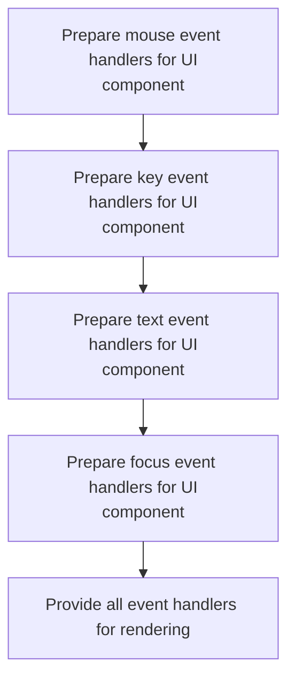

<SwmSnippet path="/taglib/src/main/java/org/apache/struts/taglib/html/BaseHandlerTag.java" line="1039">

---

<SwmToken path="taglib/src/main/java/org/apache/struts/taglib/html/BaseHandlerTag.java" pos="1039:5:5" line-data="    protected String prepareEventHandlers() {">`prepareEventHandlers`</SwmToken> calls out to methods for mouse, key, text, and focus events. Each one appends its own handlers, and focus events are handled last since they might add 'disabled' or 'readonly' attributes.

```java
    protected String prepareEventHandlers() {
        StringBuffer handlers = new StringBuffer();

        prepareMouseEvents(handlers);
        prepareKeyEvents(handlers);
        prepareTextEvents(handlers);
        prepareFocusEvents(handlers);

        return handlers.toString();
    }
```

---

</SwmSnippet>

## Handling Focus Events and Form State

```mermaid
%%{init: {"flowchart": {"defaultRenderer": "elk"}} }%%
flowchart TD
    node1["Set focus event handlers ('onblur',
'onfocus')"]
    click node1 openCode "taglib/src/main/java/org/apache/struts/taglib/html/BaseHandlerTag.java:1096:1097"
    node1 --> node2{"Is disabled relevant? (doDisabled or
parent form)"}
    click node2 openCode "taglib/src/main/java/org/apache/struts/taglib/html/BaseHandlerTag.java:1102:1106"
    node2 -->|"Yes"| node3{"Is element or parent form disabled?"}
    click node3 openCode "taglib/src/main/java/org/apache/struts/taglib/html/BaseHandlerTag.java:1109:1113"
    node3 -->|"Yes"| node4["Mark element as disabled"]
    click node4 openCode "taglib/src/main/java/org/apache/struts/taglib/html/BaseHandlerTag.java:1114:1115"
    node3 -->|"No"| node5
    node2 -->|"No"| node5
    node5{"Is readonly relevant? (doReadonly or
parent form)"}
    click node5 openCode "taglib/src/main/java/org/apache/struts/taglib/html/BaseHandlerTag.java:1119:1122"
    node5 -->|"Yes"| node6{"Is element or parent form readonly?"}
    click node6 openCode "taglib/src/main/java/org/apache/struts/taglib/html/BaseHandlerTag.java:1123:1123"
    node6 -->|"Yes"| node7["Mark element as readonly"]
    click node7 openCode "taglib/src/main/java/org/apache/struts/taglib/html/BaseHandlerTag.java:1124:1125"
    node6 -->|"No"| node8["End"]
    node5 -->|"No"| node8
    node4 --> node5
    node7 --> node8
classDef HeadingStyle fill:#777777,stroke:#333,stroke-width:2px;

%% Swimm:
%% %%{init: {"flowchart": {"defaultRenderer": "elk"}} }%%
%% flowchart TD
%%     node1["Set focus event handlers ('onblur',
%% 'onfocus')"]
%%     click node1 openCode "<SwmPath>[taglib/…/html/BaseHandlerTag.java](taglib/src/main/java/org/apache/struts/taglib/html/BaseHandlerTag.java)</SwmPath>:1096:1097"
%%     node1 --> node2{"Is disabled relevant? (<SwmToken path="taglib/src/main/java/org/apache/struts/taglib/html/BaseHandlerTag.java" pos="1102:5:5" line-data="        if ((doDisabled &amp;&amp; !getDisabled()) || (doReadonly &amp;&amp; !getReadonly())) {">`doDisabled`</SwmToken> or
%% parent form)"}
%%     click node2 openCode "<SwmPath>[taglib/…/html/BaseHandlerTag.java](taglib/src/main/java/org/apache/struts/taglib/html/BaseHandlerTag.java)</SwmPath>:1102:1106"
%%     node2 -->|"Yes"| node3{"Is element or parent form disabled?"}
%%     click node3 openCode "<SwmPath>[taglib/…/html/BaseHandlerTag.java](taglib/src/main/java/org/apache/struts/taglib/html/BaseHandlerTag.java)</SwmPath>:1109:1113"
%%     node3 -->|"Yes"| node4["Mark element as disabled"]
%%     click node4 openCode "<SwmPath>[taglib/…/html/BaseHandlerTag.java](taglib/src/main/java/org/apache/struts/taglib/html/BaseHandlerTag.java)</SwmPath>:1114:1115"
%%     node3 -->|"No"| node5
%%     node2 -->|"No"| node5
%%     node5{"Is readonly relevant? (<SwmToken path="taglib/src/main/java/org/apache/struts/taglib/html/BaseHandlerTag.java" pos="1102:18:18" line-data="        if ((doDisabled &amp;&amp; !getDisabled()) || (doReadonly &amp;&amp; !getReadonly())) {">`doReadonly`</SwmToken> or
%% parent form)"}
%%     click node5 openCode "<SwmPath>[taglib/…/html/BaseHandlerTag.java](taglib/src/main/java/org/apache/struts/taglib/html/BaseHandlerTag.java)</SwmPath>:1119:1122"
%%     node5 -->|"Yes"| node6{"Is element or parent form readonly?"}
%%     click node6 openCode "<SwmPath>[taglib/…/html/BaseHandlerTag.java](taglib/src/main/java/org/apache/struts/taglib/html/BaseHandlerTag.java)</SwmPath>:1123:1123"
%%     node6 -->|"Yes"| node7["Mark element as readonly"]
%%     click node7 openCode "<SwmPath>[taglib/…/html/BaseHandlerTag.java](taglib/src/main/java/org/apache/struts/taglib/html/BaseHandlerTag.java)</SwmPath>:1124:1125"
%%     node6 -->|"No"| node8["End"]
%%     node5 -->|"No"| node8
%%     node4 --> node5
%%     node7 --> node8
%% classDef HeadingStyle fill:#777777,stroke:#333,stroke-width:2px;
```

<SwmSnippet path="/taglib/src/main/java/org/apache/struts/taglib/html/BaseHandlerTag.java" line="1095">

---

In <SwmToken path="taglib/src/main/java/org/apache/struts/taglib/html/BaseHandlerTag.java" pos="1095:5:5" line-data="    protected void prepareFocusEvents(StringBuffer handlers) {">`prepareFocusEvents`</SwmToken>, we add onblur/onfocus handlers, but also check if the tag or its parent form is disabled or readonly. If so, we append the right HTML attributes. We fetch the <SwmToken path="taglib/src/main/java/org/apache/struts/taglib/html/BaseHandlerTag.java" pos="1099:9:9" line-data="        // Get the parent FormTag (if necessary)">`FormTag`</SwmToken> from the page context if needed, which might involve calling into <SwmToken path="tiles/src/main/java/org/apache/struts/tiles/ComponentContext.java" pos="39:4:4" line-data="public class ComponentContext implements Serializable {">`ComponentContext`</SwmToken> to get the attribute.

```java
    protected void prepareFocusEvents(StringBuffer handlers) {
        prepareAttribute(handlers, "onblur", getOnblur());
        prepareAttribute(handlers, "onfocus", getOnfocus());

        // Get the parent FormTag (if necessary)
        FormTag formTag = null;

        if ((doDisabled && !getDisabled()) || (doReadonly && !getReadonly())) {
            formTag =
                (FormTag) pageContext.getAttribute(Constants.FORM_KEY,
                    PageContext.REQUEST_SCOPE);
        }

```

---

</SwmSnippet>

<SwmSnippet path="/tiles/src/main/java/org/apache/struts/tiles/ComponentContext.java" line="169">

---

<SwmToken path="tiles/src/main/java/org/apache/struts/tiles/ComponentContext.java" pos="169:5:5" line-data="    public Object getAttribute(">`getAttribute`</SwmToken> checks if the scope is <SwmToken path="tiles/src/main/java/org/apache/struts/tiles/ComponentContext.java" pos="174:10:10" line-data="        if (scope == ComponentConstants.COMPONENT_SCOPE){">`COMPONENT_SCOPE`</SwmToken>. If so, it fetches the attribute from the component context; otherwise, it uses the standard <SwmToken path="tiles/src/main/java/org/apache/struts/tiles/ComponentContext.java" pos="172:3:3" line-data="        PageContext pageContext) {">`pageContext`</SwmToken>. This lets us support both Tiles and regular JSP scopes.

```java
    public Object getAttribute(
        String beanName,
        int scope,
        PageContext pageContext) {

        if (scope == ComponentConstants.COMPONENT_SCOPE){
            return getAttribute(beanName);
        }

        return pageContext.getAttribute(beanName, scope);
    }
```

---

</SwmSnippet>

<SwmSnippet path="/taglib/src/main/java/org/apache/struts/taglib/html/BaseHandlerTag.java" line="1108">

---

After getting the <SwmToken path="taglib/src/main/java/org/apache/struts/taglib/html/BaseHandlerTag.java" pos="1099:9:9" line-data="        // Get the parent FormTag (if necessary)">`FormTag`</SwmToken> (possibly from Tiles), we check both the tag and the form's disabled/readonly state. If either is set, we append the right attribute to the handlers buffer. This way, the HTML reflects the correct state for both the tag and its parent form.

```java
        // Format Disabled
        if (doDisabled) {
            boolean formDisabled =
                (formTag == null) ? false : formTag.isDisabled();

            if (formDisabled || getDisabled()) {
                handlers.append(" disabled=\"disabled\"");
            }
        }

        // Format Read Only
        if (doReadonly) {
            boolean formReadOnly =
                (formTag == null) ? false : formTag.isReadonly();

            if (formReadOnly || getReadonly()) {
                handlers.append(" readonly=\"readonly\"");
            }
        }
    }
```

---

</SwmSnippet>

## Finalizing and Rendering the Link Tag

<SwmSnippet path="/taglib/src/main/java/org/apache/struts/taglib/html/LinkTag.java" line="361">

---

After coming back from <SwmToken path="taglib/src/main/java/org/apache/struts/taglib/html/LinkTag.java" pos="39:8:8" line-data="public class LinkTag extends BaseHandlerTag {">`BaseHandlerTag`</SwmToken> where all the event handlers and state attributes were added, here we finish up LinkTag.doEndTag by adding any remaining attributes, closing the opening <a> tag, appending the link text if present, and writing the complete tag to the page. This is the last step—nothing gets output until everything is assembled, so the link is always complete and correct when rendered.

```java
        prepareOtherAttributes(results);
        results.append(">");

        // Prepare the textual content and ending element of this hyperlink
        if (text != null) {
            results.append(text);
        }
        results.append("</a>");
        TagUtils.getInstance().write(pageContext, results.toString());

        return (EVAL_PAGE);
    }
```

---

</SwmSnippet>

&nbsp;

*This is an auto-generated document by Swimm 🌊 and has not yet been verified by a human*

<SwmMeta version="3.0.0" repo-id="Z2l0aHViJTNBJTNBc3RydXRzMSUzQSUzQVN3aW1tLURlbW8=" repo-name="struts1"><sup>Powered by [Swimm](https://app.swimm.io/)</sup></SwmMeta>
