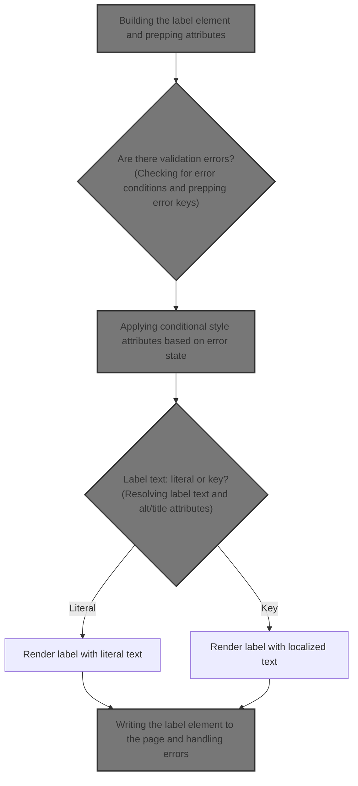
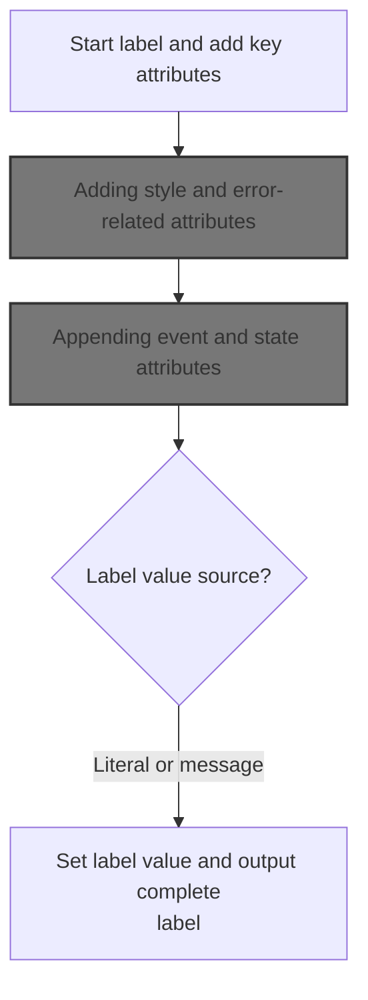
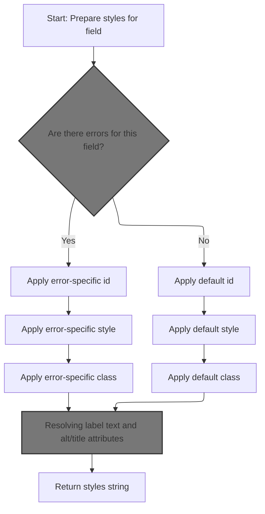
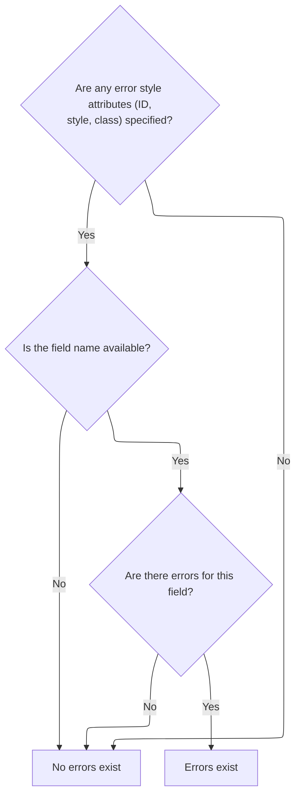
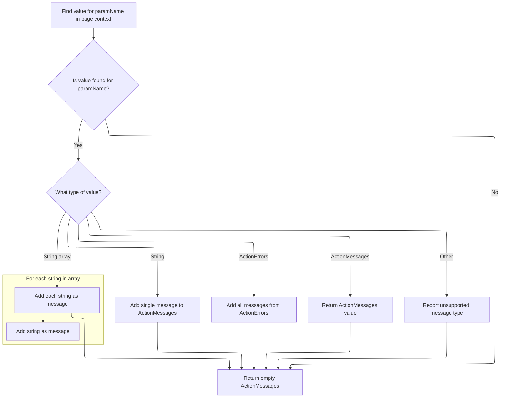
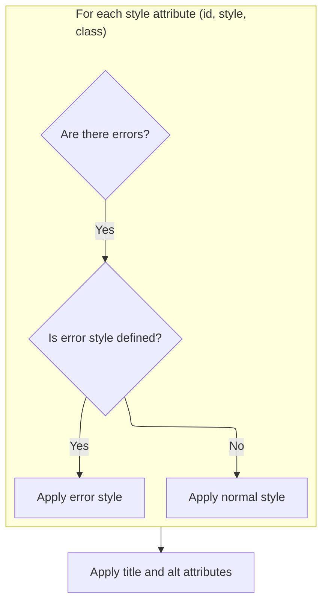
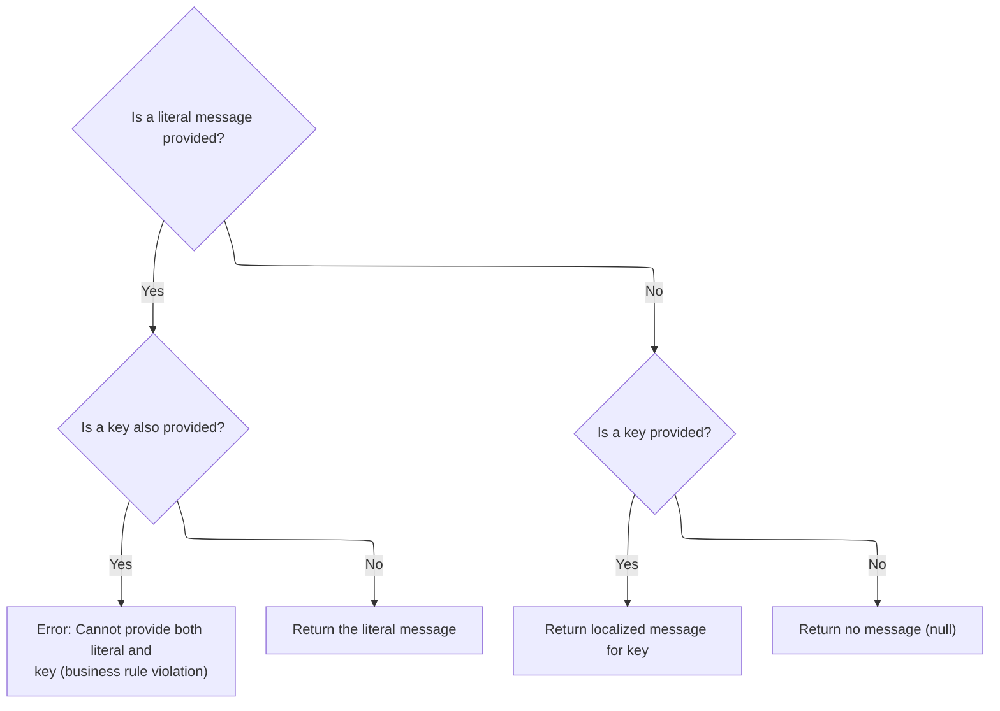
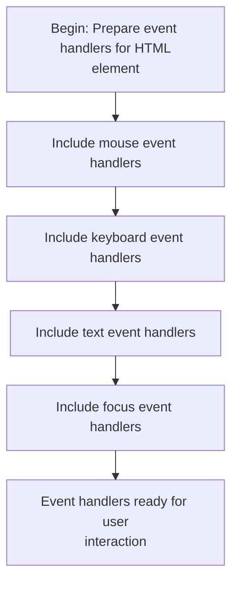
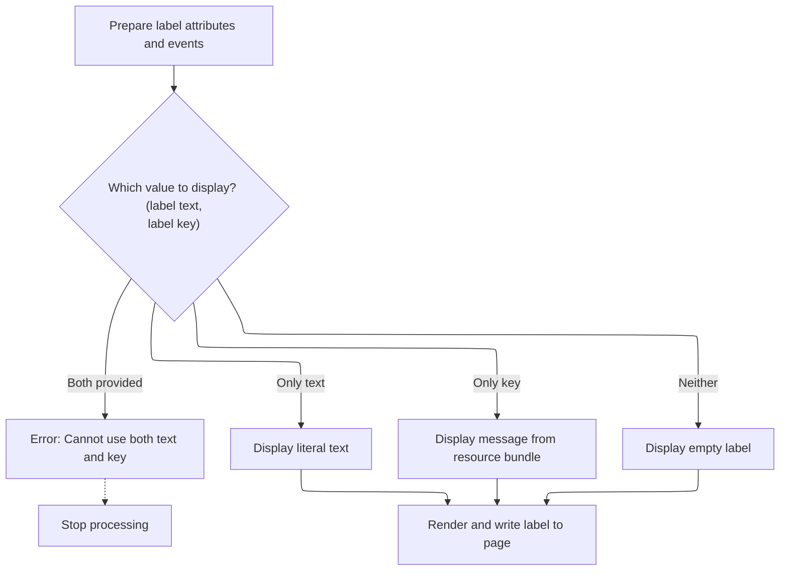
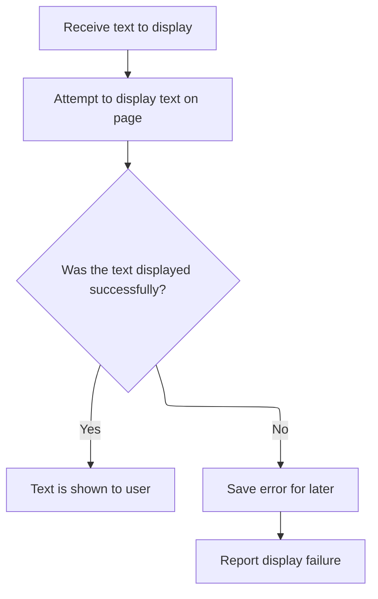

This document outlines how a label for a form field is rendered, adapting its appearance and content based on configuration and validation state. The flow ensures accessibility, localization, and user feedback by applying conditional styles, event handlers, and resolving the label text before outputting the final element.



# Building the label element and prepping attributes



<SwmSnippet path="/taglib/src/main/java/org/apache/struts/taglib/html/LabelTag.java" line="117">

---

In <SwmToken path="taglib/src/main/java/org/apache/struts/taglib/html/LabelTag.java" pos="117:5:5" line-data="    public int doEndTag() throws JspException {">`doEndTag`</SwmToken>, we're starting to build the label element and prepping its attributes. We call <SwmToken path="taglib/src/main/java/org/apache/struts/taglib/html/LabelTag.java" pos="120:1:1" line-data="        prepareAttribute(results, &quot;accesskey&quot;, getAccesskey());">`prepareAttribute`</SwmToken> for each attribute so any custom logic (like required styling or value tweaks) is handled before they're appended. This keeps attribute handling consistent and lets us inject special cases as needed.

```java
    public int doEndTag() throws JspException {
        // Generate the opening element
        StringBuffer results = new StringBuffer("<label");
        prepareAttribute(results, "accesskey", getAccesskey());
        prepareAttribute(results, "for", getForId() != null ? getForId()
                : prepareName());
        prepareAttribute(results, "tabindex", getTabindex());
        prepareAttribute(results, "title", getTitle());
```

---

</SwmSnippet>

<SwmSnippet path="/taglib/src/main/java/org/apache/struts/taglib/html/LabelTag.java" line="161">

---

<SwmToken path="taglib/src/main/java/org/apache/struts/taglib/html/LabelTag.java" pos="161:5:5" line-data="    protected void prepareAttribute(StringBuffer handlers, String name,">`prepareAttribute`</SwmToken> checks if it's handling the 'class' attribute and if the field is required. If so, it appends a required style class to the value. Then it delegates to the superclass to actually append the attribute, so any tweaks are handled before the standard processing.

```java
    protected void prepareAttribute(StringBuffer handlers, String name,
            Object value) {

        if ("class".equals(name) && this.required) {
            String requiredStyleClass = getRequiredStyleClass();
            if (requiredStyleClass != null) {
                value = (value != null) ? (value + " " + requiredStyleClass)
                        : requiredStyleClass;
            }
        }
        super.prepareAttribute(handlers, name, value);
    }
```

---

</SwmSnippet>

<SwmSnippet path="/taglib/src/main/java/org/apache/struts/taglib/html/LabelTag.java" line="125">

---

Back in LabelTag.doEndTag, after prepping the basic attributes, we call <SwmToken path="taglib/src/main/java/org/apache/struts/taglib/html/LabelTag.java" pos="125:5:5" line-data="        results.append(prepareStyles());">`prepareStyles`</SwmToken> to append style-related attributes. This step ensures any error styling or custom classes are included before the label is rendered.

```java
        results.append(prepareStyles());
```

---

</SwmSnippet>

## Adding style and error-related attributes



<SwmSnippet path="/taglib/src/main/java/org/apache/struts/taglib/html/BaseHandlerTag.java" line="967">

---

In <SwmToken path="taglib/src/main/java/org/apache/struts/taglib/html/BaseHandlerTag.java" pos="967:5:5" line-data="    protected String prepareStyles()">`prepareStyles`</SwmToken>, we start by checking if there are any errors. This check decides if error-specific styling needs to be applied, so the label can show up differently when there's a validation issue.

```java
    protected String prepareStyles()
        throws JspException {
        StringBuffer styles = new StringBuffer();

        boolean errorsExist = doErrorsExist();

```

---

</SwmSnippet>

### Checking for error conditions and prepping error keys



<SwmSnippet path="/taglib/src/main/java/org/apache/struts/taglib/html/BaseHandlerTag.java" line="1003">

---

In <SwmToken path="taglib/src/main/java/org/apache/struts/taglib/html/BaseHandlerTag.java" pos="1003:5:5" line-data="    protected boolean doErrorsExist()">`doErrorsExist`</SwmToken>, we only check for errors if any error style attributes are set. If so, we prep a name (usually tied to the field) and fetch error messages for it. If errors exist for that name, we flag it so error styling can be applied.

```java
    protected boolean doErrorsExist()
        throws JspException {
        boolean errorsExist = false;

        if ((getErrorStyleId() != null) || (getErrorStyle() != null)
            || (getErrorStyleClass() != null)) {
            String actualName = prepareName();

```

---

</SwmSnippet>

<SwmSnippet path="/taglib/src/main/java/org/apache/struts/taglib/html/BaseHandlerTag.java" line="1029">

---

<SwmToken path="taglib/src/main/java/org/apache/struts/taglib/html/BaseHandlerTag.java" pos="1029:5:5" line-data="    protected String prepareName()">`prepareName`</SwmToken> just returns null here. Despite the name, there's no actual computation or prep—looks like it's meant to be overridden elsewhere, so nothing happens in this base implementation.

```java
    protected String prepareName()
        throws JspException {
        return null;
    }
```

---

</SwmSnippet>

<SwmSnippet path="/taglib/src/main/java/org/apache/struts/taglib/html/BaseHandlerTag.java" line="1011">

---

After prepping the name, we use TagUtils.getActionMessages to fetch any errors tied to that key. If errors exist for the field, we flag it so error styling can be applied in <SwmToken path="taglib/src/main/java/org/apache/struts/taglib/html/LabelTag.java" pos="125:5:5" line-data="        results.append(prepareStyles());">`prepareStyles`</SwmToken>.

```java
            if (actualName != null) {
                ActionMessages errors =
                    TagUtils.getInstance().getActionMessages(pageContext,
                        errorKey);

                errorsExist = ((errors != null)
                    && (errors.size(actualName) > 0));
            }
        }

        return errorsExist;
    }
```

---

</SwmSnippet>

### Aggregating error messages from the page context



<SwmSnippet path="/taglib/src/main/java/org/apache/struts/taglib/TagUtils.java" line="727">

---

In <SwmToken path="taglib/src/main/java/org/apache/struts/taglib/TagUtils.java" pos="727:5:5" line-data="    public ActionMessages getActionMessages(PageContext pageContext,">`getActionMessages`</SwmToken>, we grab an attribute from the page context and convert it into <SwmToken path="taglib/src/main/java/org/apache/struts/taglib/TagUtils.java" pos="727:3:3" line-data="    public ActionMessages getActionMessages(PageContext pageContext,">`ActionMessages`</SwmToken>. It handles strings, string arrays, <SwmToken path="taglib/src/main/java/org/apache/struts/taglib/TagUtils.java" pos="745:12:12" line-data="                } else if (value instanceof ActionErrors) {">`ActionErrors`</SwmToken>, and <SwmToken path="taglib/src/main/java/org/apache/struts/taglib/TagUtils.java" pos="727:3:3" line-data="    public ActionMessages getActionMessages(PageContext pageContext,">`ActionMessages`</SwmToken>, so whatever format the errors are in, they're normalized for downstream checks.

```java
    public ActionMessages getActionMessages(PageContext pageContext,
        String paramName) throws JspException {
        ActionMessages am = new ActionMessages();

        Object value = pageContext.findAttribute(paramName);

        if (value != null) {
            try {
                if (value instanceof String) {
                    am.add(ActionMessages.GLOBAL_MESSAGE,
                        new ActionMessage((String) value));
                } else if (value instanceof String[]) {
                    String[] keys = (String[]) value;

                    for (int i = 0; i < keys.length; i++) {
                        am.add(ActionMessages.GLOBAL_MESSAGE,
                            new ActionMessage(keys[i]));
                    }
```

---

</SwmSnippet>

<SwmSnippet path="/taglib/src/main/java/org/apache/struts/taglib/TagUtils.java" line="745">

---

After processing, <SwmToken path="taglib/src/main/java/org/apache/struts/taglib/html/BaseHandlerTag.java" pos="1013:7:7" line-data="                    TagUtils.getInstance().getActionMessages(pageContext,">`getActionMessages`</SwmToken> returns an <SwmToken path="taglib/src/main/java/org/apache/struts/taglib/TagUtils.java" pos="746:1:1" line-data="                    ActionMessages m = (ActionMessages) value;">`ActionMessages`</SwmToken> object containing all error messages for the given key, regardless of the original format. This lets us check for errors in a consistent way.

```java
                } else if (value instanceof ActionErrors) {
                    ActionMessages m = (ActionMessages) value;

                    am.add(m);
                } else if (value instanceof ActionMessages) {
                    am = (ActionMessages) value;
                } else {
                    throw new JspException(messages.getMessage(
                            "actionMessages.errors", value.getClass().getName()));
                }
            } catch (JspException e) {
                throw e;
            } catch (Exception e) {
                log.warn("Unable to retieve ActionMessage for paramName : "
                    + paramName, e);
            }
        }

        return am;
    }
```

---

</SwmSnippet>

### Applying conditional style attributes based on error state



<SwmSnippet path="/taglib/src/main/java/org/apache/struts/taglib/html/BaseHandlerTag.java" line="973">

---

After checking for errors, we append style attributes to the label. If errors exist, error-specific styles are used; otherwise, normal styles are applied. This makes the label reflect its validation state.

```java
        if (errorsExist && (getErrorStyleId() != null)) {
            prepareAttribute(styles, "id", getErrorStyleId());
        } else {
            prepareAttribute(styles, "id", getStyleId());
        }

        if (errorsExist && (getErrorStyle() != null)) {
            prepareAttribute(styles, "style", getErrorStyle());
        } else {
            prepareAttribute(styles, "style", getStyle());
        }

        if (errorsExist && (getErrorStyleClass() != null)) {
            prepareAttribute(styles, "class", getErrorStyleClass());
        } else {
            prepareAttribute(styles, "class", getStyleClass());
        }

        prepareAttribute(styles, "title", message(getTitle(), getTitleKey()));
        prepareAttribute(styles, "alt", message(getAlt(), getAltKey()));
```

---

</SwmSnippet>

### Resolving label text and alt/title attributes



<SwmSnippet path="/taglib/src/main/java/org/apache/struts/taglib/html/BaseHandlerTag.java" line="830">

---

<SwmToken path="taglib/src/main/java/org/apache/struts/taglib/html/BaseHandlerTag.java" pos="830:5:5" line-data="    protected String message(String literal, String key)">`message`</SwmToken> resolves the text for alt/title by picking either the literal or fetching a localized string by key. If both are set, it throws an exception and logs it. This ensures only one source is used for the label text.

```java
    protected String message(String literal, String key)
        throws JspException {
        if (literal != null) {
            if (key != null) {
                JspException e =
                    new JspException(messages.getMessage("common.both"));

                TagUtils.getInstance().saveException(pageContext, e);
                throw e;
            } else {
                return (literal);
            }
        } else {
            if (key != null) {
                return TagUtils.getInstance().message(pageContext, getBundle(),
                    getLocale(), key);
            } else {
                return null;
            }
        }
    }
```

---

</SwmSnippet>

### Saving exceptions to the request scope

<SwmSnippet path="/tiles/src/main/java/org/apache/struts/tiles/taglib/util/TagUtils.java" line="301">

---

<SwmToken path="tiles/src/main/java/org/apache/struts/tiles/taglib/util/TagUtils.java" pos="301:7:7" line-data="    public static void saveException(PageContext pageContext, Throwable exception) {">`saveException`</SwmToken> stores the exception in the request scope of the page context. This lets downstream code or error handlers access the exception for reporting or display.

```java
    public static void saveException(PageContext pageContext, Throwable exception) {
        pageContext.setAttribute(Globals.EXCEPTION_KEY, exception, PageContext.REQUEST_SCOPE);
    }
```

---

</SwmSnippet>

<SwmSnippet path="/tiles/src/main/java/org/apache/struts/tiles/taglib/util/TagUtils.java" line="290">

---

<SwmToken path="tiles/src/main/java/org/apache/struts/tiles/taglib/util/TagUtils.java" pos="290:7:7" line-data="    public static void setAttribute(PageContext pageContext, String name, Object beanValue)">`setAttribute`</SwmToken> is just a wrapper for setting an attribute in the request scope. It always uses <SwmToken path="tiles/src/main/java/org/apache/struts/tiles/taglib/util/TagUtils.java" pos="292:13:13" line-data="        pageContext.setAttribute(name, beanValue, PageContext.REQUEST_SCOPE);">`REQUEST_SCOPE`</SwmToken>, so the attribute is only available for the current request.

```java
    public static void setAttribute(PageContext pageContext, String name, Object beanValue)
        throws JspException {
        pageContext.setAttribute(name, beanValue, PageContext.REQUEST_SCOPE);
    }
```

---

</SwmSnippet>

### Finalizing style and i18n attributes

<SwmSnippet path="/taglib/src/main/java/org/apache/struts/taglib/html/BaseHandlerTag.java" line="993">

---

After setting styles and alt/title, we call <SwmToken path="taglib/src/main/java/org/apache/struts/taglib/html/BaseHandlerTag.java" pos="993:1:1" line-data="        prepareInternationalization(styles);">`prepareInternationalization`</SwmToken> to add any i18n attributes. This wraps up the element's attribute prep before returning the final string.

```java
        prepareInternationalization(styles);

        return styles.toString();
    }
```

---

</SwmSnippet>

## Adding event handlers and focus attributes

<SwmSnippet path="/taglib/src/main/java/org/apache/struts/taglib/html/LabelTag.java" line="126">

---

Back in LabelTag.doEndTag, after styles are set, we call <SwmToken path="taglib/src/main/java/org/apache/struts/taglib/html/LabelTag.java" pos="126:5:5" line-data="        results.append(prepareEventHandlers());">`prepareEventHandlers`</SwmToken> to add <SwmToken path="taglib/src/main/java/org/apache/struts/taglib/html/BaseHandlerTag.java" pos="42:3:3" line-data=" * JavaScript event handlers and/or CSS Style attributes. This class does not">`JavaScript`</SwmToken> event attributes. This lets the label respond to user actions like mouse or keyboard events.

```java
        results.append(prepareEventHandlers());
```

---

</SwmSnippet>

## Appending event and state attributes



<SwmSnippet path="/taglib/src/main/java/org/apache/struts/taglib/html/BaseHandlerTag.java" line="1039">

---

In <SwmToken path="taglib/src/main/java/org/apache/struts/taglib/html/BaseHandlerTag.java" pos="1039:5:5" line-data="    protected String prepareEventHandlers() {">`prepareEventHandlers`</SwmToken>, we append mouse, key, text, and focus event handlers. We call <SwmToken path="taglib/src/main/java/org/apache/struts/taglib/html/BaseHandlerTag.java" pos="1045:1:1" line-data="        prepareFocusEvents(handlers);">`prepareFocusEvents`</SwmToken> last to add focus events and handle disabled/readonly attributes, which depend on the parent <SwmToken path="taglib/src/main/java/org/apache/struts/taglib/html/BaseHandlerTag.java" pos="1099:9:9" line-data="        // Get the parent FormTag (if necessary)">`FormTag`</SwmToken>'s state.

```java
    protected String prepareEventHandlers() {
        StringBuffer handlers = new StringBuffer();

        prepareMouseEvents(handlers);
        prepareKeyEvents(handlers);
        prepareTextEvents(handlers);
        prepareFocusEvents(handlers);

        return handlers.toString();
    }
```

---

</SwmSnippet>

<SwmSnippet path="/taglib/src/main/java/org/apache/struts/taglib/html/BaseHandlerTag.java" line="1095">

---

<SwmToken path="taglib/src/main/java/org/apache/struts/taglib/html/BaseHandlerTag.java" pos="1095:5:5" line-data="    protected void prepareFocusEvents(StringBuffer handlers) {">`prepareFocusEvents`</SwmToken> adds onblur/onfocus handlers and checks flags to append 'disabled' or 'readonly' attributes. It pulls the parent <SwmToken path="taglib/src/main/java/org/apache/struts/taglib/html/BaseHandlerTag.java" pos="1099:9:9" line-data="        // Get the parent FormTag (if necessary)">`FormTag`</SwmToken> from the page context to decide if these states should be set, so the label reflects the form's disabled/readonly state.

```java
    protected void prepareFocusEvents(StringBuffer handlers) {
        prepareAttribute(handlers, "onblur", getOnblur());
        prepareAttribute(handlers, "onfocus", getOnfocus());

        // Get the parent FormTag (if necessary)
        FormTag formTag = null;

        if ((doDisabled && !getDisabled()) || (doReadonly && !getReadonly())) {
            formTag =
                (FormTag) pageContext.getAttribute(Constants.FORM_KEY,
                    PageContext.REQUEST_SCOPE);
        }

        // Format Disabled
        if (doDisabled) {
            boolean formDisabled =
                (formTag == null) ? false : formTag.isDisabled();

            if (formDisabled || getDisabled()) {
                handlers.append(" disabled=\"disabled\"");
            }
        }

        // Format Read Only
        if (doReadonly) {
            boolean formReadOnly =
                (formTag == null) ? false : formTag.isReadonly();

            if (formReadOnly || getReadonly()) {
                handlers.append(" readonly=\"readonly\"");
            }
        }
    }
```

---

</SwmSnippet>

## Appending focus and custom attributes



<SwmSnippet path="/taglib/src/main/java/org/apache/struts/taglib/html/LabelTag.java" line="127">

---

Back in LabelTag.doEndTag, after event handlers are set, we call <SwmToken path="taglib/src/main/java/org/apache/struts/taglib/html/LabelTag.java" pos="127:1:1" line-data="        prepareFocusEvents(results);">`prepareFocusEvents`</SwmToken> to add focus-specific handlers and disabled/readonly attributes. This step makes sure the label reflects its interactive state.

```java
        prepareFocusEvents(results);
```

---

</SwmSnippet>

<SwmSnippet path="/taglib/src/main/java/org/apache/struts/taglib/html/LabelTag.java" line="128">

---

Back in LabelTag.doEndTag, after focus and custom attributes are set, we resolve the label value using message. This picks either a literal or a localized string for the label text, so it's ready for display.

```java
        prepareOtherAttributes(results);
        results.append(">");

        // Prepare the label value
        this.value = message(this.text, this.key);
```

---

</SwmSnippet>

<SwmSnippet path="/taglib/src/main/java/org/apache/struts/taglib/html/OptionTag.java" line="446">

---

<SwmToken path="taglib/src/main/java/org/apache/struts/taglib/html/OptionTag.java" pos="446:5:5" line-data="    protected String message(String literal, String key)">`message`</SwmToken> in <SwmToken path="taglib/src/main/java/org/apache/struts/taglib/html/OptionTag.java" pos="38:4:4" line-data="public class OptionTag extends BodyTagSupport {">`OptionTag`</SwmToken> enforces that only one of literal or key is used. If both are set, it throws an exception. Otherwise, it returns the literal or fetches the message by key, so the option text is resolved correctly.

```java
    protected String message(String literal, String key)
        throws JspException {
        if (literal != null) {
            if (key != null) {
                JspException e =
                    new JspException(messages.getMessage("common.both"));

                TagUtils.getInstance().saveException(pageContext, e);
                throw e;
            } else {
                return (literal);
            }
        } else {
            if (key != null) {
                return TagUtils.getInstance().message(pageContext, getBundle(),
                    getLocale(), key);
            } else {
                return null;
            }
        }
    }
```

---

</SwmSnippet>

<SwmSnippet path="/taglib/src/main/java/org/apache/struts/taglib/html/LabelTag.java" line="133">

---

Back in LabelTag.doEndTag, after prepping the value and closing the tag, we call TagUtils.write to output the label element to the JSP page. This is the final step before returning control.

```java
        prepareValue(results);

        // End tag
        results.append("</label>");
        TagUtils.getInstance().write(this.pageContext, results.toString());

        return (EVAL_PAGE);
    }
```

---

</SwmSnippet>

# Writing the label element to the page and handling errors



<SwmSnippet path="/taglib/src/main/java/org/apache/struts/taglib/TagUtils.java" line="1186">

---

<SwmToken path="taglib/src/main/java/org/apache/struts/taglib/TagUtils.java" pos="1186:5:5" line-data="    public void write(PageContext pageContext, String text)">`write`</SwmToken> prints the label element to the JSP output. If there's an <SwmToken path="taglib/src/main/java/org/apache/struts/taglib/TagUtils.java" pos="1192:6:6" line-data="        } catch (IOException e) {">`IOException`</SwmToken>, it logs the exception in the request scope and throws a <SwmToken path="taglib/src/main/java/org/apache/struts/taglib/TagUtils.java" pos="1187:3:3" line-data="        throws JspException {">`JspException`</SwmToken>, so errors can be handled by the framework.

```java
    public void write(PageContext pageContext, String text)
        throws JspException {
        JspWriter writer = pageContext.getOut();

        try {
            writer.print(text);
        } catch (IOException e) {
            saveException(pageContext, e);
            throw new JspException(messages.getMessage("write.io", e.toString()), e);
        }
    }
```

---

</SwmSnippet>

<SwmSnippet path="/taglib/src/main/java/org/apache/struts/taglib/TagUtils.java" line="1170">

---

<SwmToken path="taglib/src/main/java/org/apache/struts/taglib/TagUtils.java" pos="1170:5:5" line-data="    public void saveException(PageContext pageContext, Throwable exception) {">`saveException`</SwmToken> here sets the exception in the request scope, so error handlers or JSP error pages can access it for reporting or display.

```java
    public void saveException(PageContext pageContext, Throwable exception) {
        pageContext.setAttribute(Globals.EXCEPTION_KEY, exception,
            PageContext.REQUEST_SCOPE);
    }
```

---

</SwmSnippet>

&nbsp;

*This is an auto-generated document by Swimm 🌊 and has not yet been verified by a human*

<SwmMeta version="3.0.0" repo-id="Z2l0aHViJTNBJTNBc3RydXRzMSUzQSUzQVN3aW1tLURlbW8=" repo-name="struts1"><sup>Powered by [Swimm](https://app.swimm.io/)</sup></SwmMeta>
