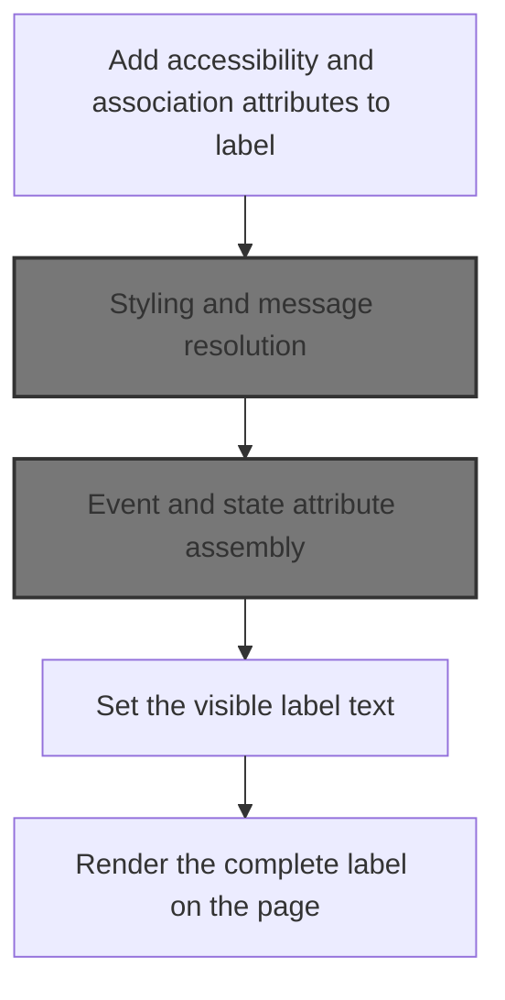
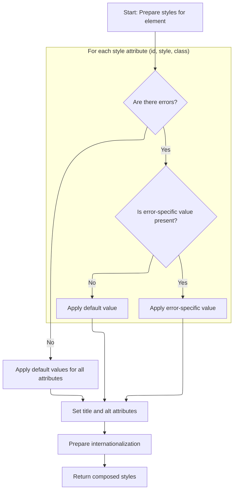
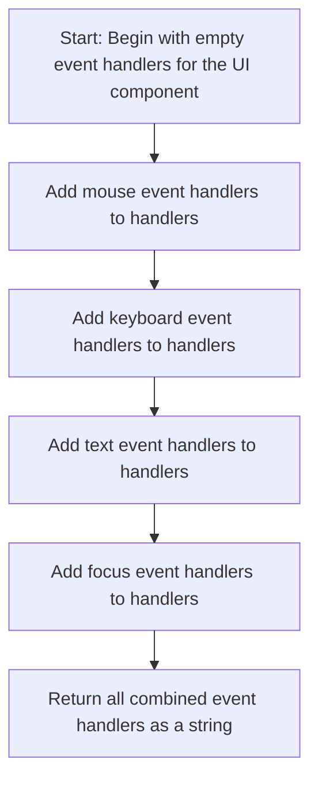

This document explains how a label element is rendered for a form field, ensuring accessibility, styling, and localization. The input is the data and attributes for the label, and the output is a fully rendered label element in the HTML output.

# Building the label element



<SwmSnippet path="/taglib/src/main/java/org/apache/struts/taglib/html/LabelTag.java" line="117">

---

In <SwmToken path="taglib/src/main/java/org/apache/struts/taglib/html/LabelTag.java" pos="117:5:5" line-data="    public int doEndTag() throws JspException {">`doEndTag`</SwmToken>, we start assembling the <label> element and its basic attributes. We call <SwmToken path="taglib/src/main/java/org/apache/struts/taglib/html/BaseHandlerTag.java" pos="48:6:6" line-data="public abstract class BaseHandlerTag extends BodyTagSupport {">`BaseHandlerTag`</SwmToken> next to handle style and error-related attributes, since those aren't managed here.

```java
    public int doEndTag() throws JspException {
        // Generate the opening element
        StringBuffer results = new StringBuffer("<label");
        prepareAttribute(results, "accesskey", getAccesskey());
        prepareAttribute(results, "for", getForId() != null ? getForId()
                : prepareName());
        prepareAttribute(results, "tabindex", getTabindex());
        prepareAttribute(results, "title", getTitle());
        results.append(prepareStyles());
```

---

</SwmSnippet>

## Styling and message resolution



<SwmSnippet path="/taglib/src/main/java/org/apache/struts/taglib/html/BaseHandlerTag.java" line="967">

---

In <SwmToken path="taglib/src/main/java/org/apache/struts/taglib/html/BaseHandlerTag.java" pos="967:5:5" line-data="    protected String prepareStyles()">`prepareStyles`</SwmToken>, we decide which style, id, and class attributes to use based on error state, and resolve title and alt text using the message function for localization. This keeps error handling and localization separate from the tag logic.

```java
    protected String prepareStyles()
        throws JspException {
        StringBuffer styles = new StringBuffer();

        boolean errorsExist = doErrorsExist();

        if (errorsExist && (getErrorStyleId() != null)) {
            prepareAttribute(styles, "id", getErrorStyleId());
        } else {
            prepareAttribute(styles, "id", getStyleId());
        }

        if (errorsExist && (getErrorStyle() != null)) {
            prepareAttribute(styles, "style", getErrorStyle());
        } else {
            prepareAttribute(styles, "style", getStyle());
        }

        if (errorsExist && (getErrorStyleClass() != null)) {
            prepareAttribute(styles, "class", getErrorStyleClass());
        } else {
            prepareAttribute(styles, "class", getStyleClass());
        }

        prepareAttribute(styles, "title", message(getTitle(), getTitleKey()));
        prepareAttribute(styles, "alt", message(getAlt(), getAltKey()));
```

---

</SwmSnippet>

<SwmSnippet path="/taglib/src/main/java/org/apache/struts/taglib/html/BaseHandlerTag.java" line="830">

---

<SwmToken path="taglib/src/main/java/org/apache/struts/taglib/html/BaseHandlerTag.java" pos="830:5:5" line-data="    protected String message(String literal, String key)">`message`</SwmToken> enforces that only one of 'literal' or 'key' is set, retrieves localized text if 'key' is used, returns the literal if provided, or null if neither. This prevents ambiguous message resolution.

```java
    protected String message(String literal, String key)
        throws JspException {
        if (literal != null) {
            if (key != null) {
                JspException e =
                    new JspException(messages.getMessage("common.both"));

                TagUtils.getInstance().saveException(pageContext, e);
                throw e;
            } else {
                return (literal);
            }
        } else {
            if (key != null) {
                return TagUtils.getInstance().message(pageContext, getBundle(),
                    getLocale(), key);
            } else {
                return null;
            }
        }
    }
```

---

</SwmSnippet>

<SwmSnippet path="/taglib/src/main/java/org/apache/struts/taglib/html/BaseHandlerTag.java" line="993">

---

After returning from <SwmToken path="taglib/src/main/java/org/apache/struts/taglib/html/LabelTag.java" pos="125:5:5" line-data="        results.append(prepareStyles());">`prepareStyles`</SwmToken>, we append internationalization attributes and return the full styles string, so the caller gets all style and locale-specific markup.

```java
        prepareInternationalization(styles);

        return styles.toString();
    }
```

---

</SwmSnippet>

## Adding event handlers

<SwmSnippet path="/taglib/src/main/java/org/apache/struts/taglib/html/LabelTag.java" line="126">

---

Back in <SwmToken path="taglib/src/main/java/org/apache/struts/taglib/html/LabelTag.java" pos="117:5:5" line-data="    public int doEndTag() throws JspException {">`doEndTag`</SwmToken>, after getting styles, we append event handlers to the label. We call <SwmToken path="taglib/src/main/java/org/apache/struts/taglib/html/BaseHandlerTag.java" pos="48:6:6" line-data="public abstract class BaseHandlerTag extends BodyTagSupport {">`BaseHandlerTag`</SwmToken> again to centralize event logic and keep the tag code clean.

```java
        results.append(prepareEventHandlers());
```

---

</SwmSnippet>

## Event and state attribute assembly



<SwmSnippet path="/taglib/src/main/java/org/apache/struts/taglib/html/BaseHandlerTag.java" line="1039">

---

<SwmToken path="taglib/src/main/java/org/apache/struts/taglib/html/BaseHandlerTag.java" pos="1039:5:5" line-data="    protected String prepareEventHandlers() {">`prepareEventHandlers`</SwmToken> collects all event attributes and calls <SwmToken path="taglib/src/main/java/org/apache/struts/taglib/html/BaseHandlerTag.java" pos="1045:1:1" line-data="        prepareFocusEvents(handlers);">`prepareFocusEvents`</SwmToken> to add focus events and set disabled/readonly if needed, so the label's markup matches the UI state.

```java
    protected String prepareEventHandlers() {
        StringBuffer handlers = new StringBuffer();

        prepareMouseEvents(handlers);
        prepareKeyEvents(handlers);
        prepareTextEvents(handlers);
        prepareFocusEvents(handlers);

        return handlers.toString();
    }
```

---

</SwmSnippet>

<SwmSnippet path="/taglib/src/main/java/org/apache/struts/taglib/html/BaseHandlerTag.java" line="1095">

---

<SwmToken path="taglib/src/main/java/org/apache/struts/taglib/html/BaseHandlerTag.java" pos="1095:5:5" line-data="    protected void prepareFocusEvents(StringBuffer handlers) {">`prepareFocusEvents`</SwmToken> adds focus event handlers and checks both tag and form state to append disabled/readonly attributes, so the label's markup reflects the form's UI state.

```java
    protected void prepareFocusEvents(StringBuffer handlers) {
        prepareAttribute(handlers, "onblur", getOnblur());
        prepareAttribute(handlers, "onfocus", getOnfocus());

        // Get the parent FormTag (if necessary)
        FormTag formTag = null;

        if ((doDisabled && !getDisabled()) || (doReadonly && !getReadonly())) {
            formTag =
                (FormTag) pageContext.getAttribute(Constants.FORM_KEY,
                    PageContext.REQUEST_SCOPE);
        }

        // Format Disabled
        if (doDisabled) {
            boolean formDisabled =
                (formTag == null) ? false : formTag.isDisabled();

            if (formDisabled || getDisabled()) {
                handlers.append(" disabled=\"disabled\"");
            }
        }

        // Format Read Only
        if (doReadonly) {
            boolean formReadOnly =
                (formTag == null) ? false : formTag.isReadonly();

            if (formReadOnly || getReadonly()) {
                handlers.append(" readonly=\"readonly\"");
            }
        }
    }
```

---

</SwmSnippet>

## Finalizing label markup

<SwmSnippet path="/taglib/src/main/java/org/apache/struts/taglib/html/LabelTag.java" line="127">

---

After returning from <SwmToken path="taglib/src/main/java/org/apache/struts/taglib/html/BaseHandlerTag.java" pos="48:6:6" line-data="public abstract class BaseHandlerTag extends BodyTagSupport {">`BaseHandlerTag`</SwmToken>, <SwmToken path="taglib/src/main/java/org/apache/struts/taglib/html/LabelTag.java" pos="117:5:5" line-data="    public int doEndTag() throws JspException {">`doEndTag`</SwmToken> finishes the label markup by adding focus events, other attributes, resolving the label value, and writing the final HTML to the page.

```java
        prepareFocusEvents(results);
        prepareOtherAttributes(results);
        results.append(">");

        // Prepare the label value
        this.value = message(this.text, this.key);
        prepareValue(results);

        // End tag
        results.append("</label>");
        TagUtils.getInstance().write(this.pageContext, results.toString());

        return (EVAL_PAGE);
    }
```

---

</SwmSnippet>

&nbsp;

*This is an auto-generated document by Swimm 🌊 and has not yet been verified by a human*

<SwmMeta version="3.0.0" repo-id="Z2l0aHViJTNBJTNBc3RydXRzMSUzQSUzQVN3aW1tLURlbW8=" repo-name="struts1"><sup>Powered by [Swimm](https://app.swimm.io/)</sup></SwmMeta>
