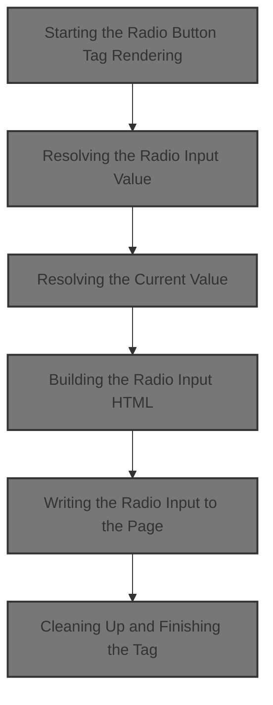
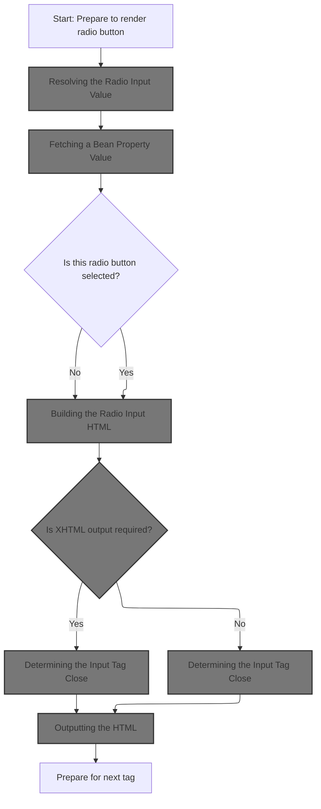
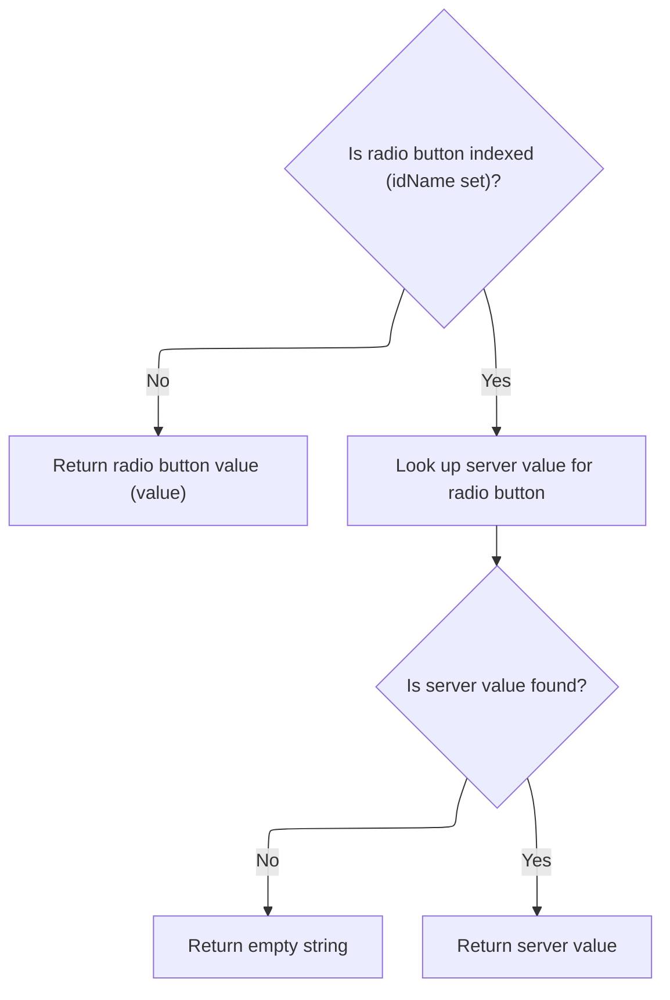
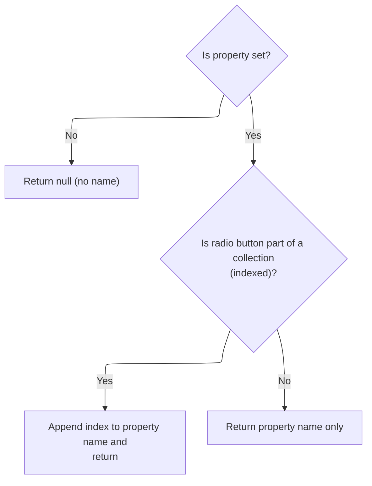
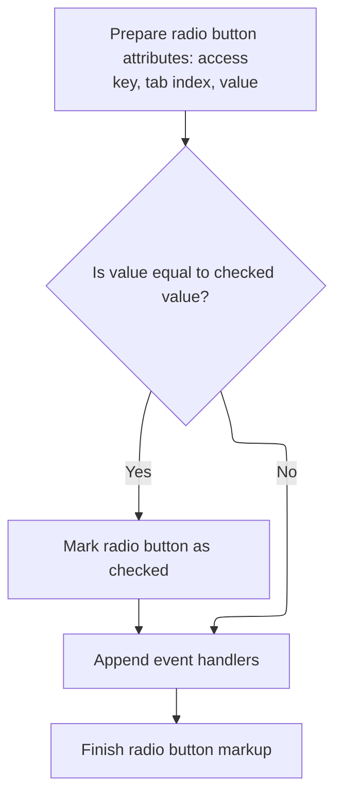
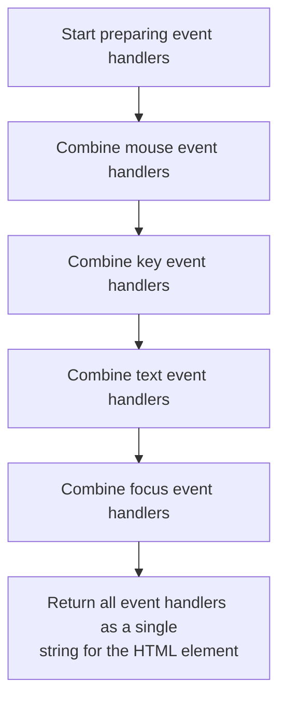
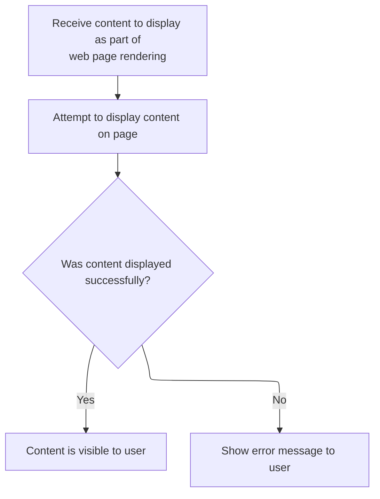

This document describes how a radio button is rendered in a web form, ensuring it appears with the correct value, selection state, and styling based on the current form data. The flow receives radio button data and outputs the corresponding HTML markup to the page.



# Starting the Radio Button Tag Rendering



<SwmSnippet path="/taglib/src/main/java/org/apache/struts/taglib/html/RadioTag.java" line="142">

---

In <SwmToken path="taglib/src/main/java/org/apache/struts/taglib/html/RadioTag.java" pos="142:5:5" line-data="    public int doStartTag() throws JspException {">`doStartTag`</SwmToken>, we kick off the rendering by resolving the value that should be used for the radio input. We call <SwmToken path="taglib/src/main/java/org/apache/struts/taglib/html/RadioTag.java" pos="143:9:9" line-data="        String radioTag = renderRadioElement(serverValue(), currentValue());">`serverValue`</SwmToken> next to get the actual value to use, which might be different from the static value if we're dealing with indexed properties or dynamic data.

```java
    public int doStartTag() throws JspException {
        String radioTag = renderRadioElement(serverValue(), currentValue());
```

---

</SwmSnippet>

## Resolving the Radio Input Value



<SwmSnippet path="/taglib/src/main/java/org/apache/struts/taglib/html/RadioTag.java" line="158">

---

<SwmToken path="taglib/src/main/java/org/apache/struts/taglib/html/RadioTag.java" pos="158:5:5" line-data="    private String serverValue()">`serverValue`</SwmToken> figures out if we need to use a static value or look up a dynamic one from a bean property (for indexed radios). If <SwmToken path="taglib/src/main/java/org/apache/struts/taglib/html/RadioTag.java" pos="161:6:6" line-data="        if (this.idName == null) {">`idName`</SwmToken> is set, we call <SwmToken path="taglib/src/main/java/org/apache/struts/taglib/html/RadioTag.java" pos="165:9:9" line-data="        String serverValue = this.lookupProperty(this.idName, this.value);">`lookupProperty`</SwmToken> in <SwmToken path="taglib/src/main/java/org/apache/struts/taglib/html/RadioTag.java" pos="34:8:8" line-data="public class RadioTag extends BaseHandlerTag {">`BaseHandlerTag`</SwmToken> to fetch the value from the bean.

```java
    private String serverValue()
        throws JspException {
        // Not using indexed radio buttons
        if (this.idName == null) {
            return this.value;
        }

        String serverValue = this.lookupProperty(this.idName, this.value);

        return (serverValue == null) ? "" : serverValue;
    }
```

---

</SwmSnippet>

## Fetching a Bean Property Value

<SwmSnippet path="/taglib/src/main/java/org/apache/struts/taglib/html/BaseHandlerTag.java" line="1200">

---

In <SwmToken path="taglib/src/main/java/org/apache/struts/taglib/html/BaseHandlerTag.java" pos="1200:5:5" line-data="    protected String lookupProperty(String beanName, String property)">`lookupProperty`</SwmToken>, we grab the bean instance using TagUtils.lookup, since the bean could be in any JSP scope. Next, we need to check if the bean exists and handle errors if it doesn't.

```java
    protected String lookupProperty(String beanName, String property)
        throws JspException {
        Object bean =
            TagUtils.getInstance().lookup(this.pageContext, beanName, null);

```

---

</SwmSnippet>

### Locating the Bean in Page Context

See <SwmLink doc-title="Attribute Lookup in JSP Pages">[Attribute Lookup in JSP Pages](/.swm/attribute-lookup-in-jsp-pages.cdhjs46o.sw.md)</SwmLink>

### Handling Missing Beans

<SwmSnippet path="/taglib/src/main/java/org/apache/struts/taglib/html/BaseHandlerTag.java" line="1205">

---

Back in <SwmToken path="taglib/src/main/java/org/apache/struts/taglib/html/RadioTag.java" pos="165:9:9" line-data="        String serverValue = this.lookupProperty(this.idName, this.value);">`lookupProperty`</SwmToken>, after getting the bean, if it's missing, we throw a <SwmToken path="taglib/src/main/java/org/apache/struts/taglib/html/BaseHandlerTag.java" pos="1206:5:5" line-data="            throw new JspException(messages.getMessage(&quot;getter.bean&quot;, beanName));">`JspException`</SwmToken> with a localized error message from <SwmToken path="taglib/src/main/java/org/apache/struts/taglib/html/RadioTag.java" pos="24:10:10" line-data="import org.apache.struts.util.MessageResources;">`MessageResources`</SwmToken>. This makes sure missing beans are reported clearly.

```java
        if (bean == null) {
            throw new JspException(messages.getMessage("getter.bean", beanName));
        }

```

---

</SwmSnippet>

<SwmSnippet path="/taglib/src/main/java/org/apache/struts/taglib/html/BaseHandlerTag.java" line="1209">

---

Back in <SwmToken path="taglib/src/main/java/org/apache/struts/taglib/html/RadioTag.java" pos="165:9:9" line-data="        String serverValue = this.lookupProperty(this.idName, this.value);">`lookupProperty`</SwmToken>, after trying to get the property value with <SwmToken path="taglib/src/main/java/org/apache/struts/taglib/html/BaseHandlerTag.java" pos="1210:3:3" line-data="            return BeanUtils.getProperty(bean, property);">`BeanUtils`</SwmToken>, any access or reflection errors are wrapped in a <SwmToken path="taglib/src/main/java/org/apache/struts/taglib/html/BaseHandlerTag.java" pos="1212:5:5" line-data="            throw new JspException(messages.getMessage(&quot;getter.access&quot;,">`JspException`</SwmToken> with a localized message from <SwmToken path="taglib/src/main/java/org/apache/struts/taglib/html/RadioTag.java" pos="24:10:10" line-data="import org.apache.struts.util.MessageResources;">`MessageResources`</SwmToken>. This keeps error handling consistent and user-friendly.

```java
        try {
            return BeanUtils.getProperty(bean, property);
        } catch (IllegalAccessException e) {
            throw new JspException(messages.getMessage("getter.access",
                    property, beanName), e);
        } catch (InvocationTargetException e) {
            Throwable t = e.getTargetException();

            throw new JspException(messages.getMessage("getter.result",
                    property, t.toString()), e);
        } catch (NoSuchMethodException e) {
            throw new JspException(messages.getMessage("getter.method",
                    property, beanName), e);
        }
    }
```

---

</SwmSnippet>

## Resolving the Current Value

<SwmSnippet path="/taglib/src/main/java/org/apache/struts/taglib/html/RadioTag.java" line="143">

---

Back in <SwmToken path="taglib/src/main/java/org/apache/struts/taglib/html/RadioTag.java" pos="142:5:5" line-data="    public int doStartTag() throws JspException {">`doStartTag`</SwmToken>, after getting the value to use for the radio input, we fetch the current value from the form data by calling <SwmToken path="taglib/src/main/java/org/apache/struts/taglib/html/RadioTag.java" pos="143:14:14" line-data="        String radioTag = renderRadioElement(serverValue(), currentValue());">`currentValue`</SwmToken>. This lets us know if this radio should be checked.

```java
        String radioTag = renderRadioElement(serverValue(), currentValue());
```

---

</SwmSnippet>

<SwmSnippet path="/taglib/src/main/java/org/apache/struts/taglib/html/RadioTag.java" line="178">

---

<SwmToken path="taglib/src/main/java/org/apache/struts/taglib/html/RadioTag.java" pos="178:5:5" line-data="    private String currentValue()">`currentValue`</SwmToken> fetches the current property value from the bean (using <SwmToken path="taglib/src/main/java/org/apache/struts/taglib/html/RadioTag.java" pos="180:9:9" line-data="        String current = this.lookupProperty(this.name, this.property);">`lookupProperty`</SwmToken> in <SwmToken path="taglib/src/main/java/org/apache/struts/taglib/html/RadioTag.java" pos="34:8:8" line-data="public class RadioTag extends BaseHandlerTag {">`BaseHandlerTag`</SwmToken>). If nothing is set, it returns an empty string so later comparisons are safe.

```java
    private String currentValue()
        throws JspException {
        String current = this.lookupProperty(this.name, this.property);

        return (current == null) ? "" : current;
    }
```

---

</SwmSnippet>

<SwmSnippet path="/taglib/src/main/java/org/apache/struts/taglib/html/RadioTag.java" line="143">

---

Back in <SwmToken path="taglib/src/main/java/org/apache/struts/taglib/html/RadioTag.java" pos="142:5:5" line-data="    public int doStartTag() throws JspException {">`doStartTag`</SwmToken>, with both the value to use and the current selection, we call <SwmToken path="taglib/src/main/java/org/apache/struts/taglib/html/RadioTag.java" pos="143:7:7" line-data="        String radioTag = renderRadioElement(serverValue(), currentValue());">`renderRadioElement`</SwmToken> to build the actual HTML for the radio input, including whether it's checked.

```java
        String radioTag = renderRadioElement(serverValue(), currentValue());

```

---

</SwmSnippet>

## Building the Radio Input HTML

```mermaid
%%{init: {"flowchart": {"defaultRenderer": "elk"}} }%%
flowchart TD
    node1["Start radio button creation"]
    click node1 openCode "taglib/src/main/java/org/apache/struts/taglib/html/RadioTag.java:197:201"
    node1 --> node2["Constructing the Input Name"]
    
    node2 --> node3["Appending the Index to the Name"]
    
    node3 --> node4["Add accessibility and value attributes"]
    click node4 openCode "taglib/src/main/java/org/apache/struts/taglib/html/RadioTag.java:202:205"
    node4 --> node5{"Is radio value selected?"}
    click node5 openCode "taglib/src/main/java/org/apache/struts/taglib/html/RadioTag.java:207:209"
    node5 -->|"Yes"| node6["Mark radio as checked"]
    click node6 openCode "taglib/src/main/java/org/apache/struts/taglib/html/RadioTag.java:208:209"
    node5 -->|"No"| node7["Preparing Style Attributes"]
    
    node6 --> node7
    node7 --> node8["Return completed radio button markup"]
    click node8 openCode "taglib/src/main/java/org/apache/struts/taglib/html/RadioTag.java:216:217"

classDef HeadingStyle fill:#777777,stroke:#333,stroke-width:2px;
click node2 goToHeading "Constructing the Input Name"
node2:::HeadingStyle
click node3 goToHeading "Appending the Index to the Name"
node3:::HeadingStyle
click node7 goToHeading "Collecting Event Handlers and State"
node7:::HeadingStyle
click node7 goToHeading "Preparing Style Attributes"
node7:::HeadingStyle

%% Swimm:
%% %%{init: {"flowchart": {"defaultRenderer": "elk"}} }%%
%% flowchart TD
%%     node1["Start radio button creation"]
%%     click node1 openCode "<SwmPath>[taglib/…/html/RadioTag.java](taglib/src/main/java/org/apache/struts/taglib/html/RadioTag.java)</SwmPath>:197:201"
%%     node1 --> node2["Constructing the Input Name"]
%%     
%%     node2 --> node3["Appending the Index to the Name"]
%%     
%%     node3 --> node4["Add accessibility and value attributes"]
%%     click node4 openCode "<SwmPath>[taglib/…/html/RadioTag.java](taglib/src/main/java/org/apache/struts/taglib/html/RadioTag.java)</SwmPath>:202:205"
%%     node4 --> node5{"Is radio value selected?"}
%%     click node5 openCode "<SwmPath>[taglib/…/html/RadioTag.java](taglib/src/main/java/org/apache/struts/taglib/html/RadioTag.java)</SwmPath>:207:209"
%%     node5 -->|"Yes"| node6["Mark radio as checked"]
%%     click node6 openCode "<SwmPath>[taglib/…/html/RadioTag.java](taglib/src/main/java/org/apache/struts/taglib/html/RadioTag.java)</SwmPath>:208:209"
%%     node5 -->|"No"| node7["Preparing Style Attributes"]
%%     
%%     node6 --> node7
%%     node7 --> node8["Return completed radio button markup"]
%%     click node8 openCode "<SwmPath>[taglib/…/html/RadioTag.java](taglib/src/main/java/org/apache/struts/taglib/html/RadioTag.java)</SwmPath>:216:217"
%% 
%% classDef HeadingStyle fill:#777777,stroke:#333,stroke-width:2px;
%% click node2 goToHeading "Constructing the Input Name"
%% node2:::HeadingStyle
%% click node3 goToHeading "Appending the Index to the Name"
%% node3:::HeadingStyle
%% click node7 goToHeading "Collecting Event Handlers and State"
%% node7:::HeadingStyle
%% click node7 goToHeading "Preparing Style Attributes"
%% node7:::HeadingStyle
```



<SwmSnippet path="/taglib/src/main/java/org/apache/struts/taglib/html/RadioTag.java" line="197">

---

In <SwmToken path="taglib/src/main/java/org/apache/struts/taglib/html/RadioTag.java" pos="197:5:5" line-data="    protected String renderRadioElement(String serverValue, String checkedValue)">`renderRadioElement`</SwmToken>, we start building the radio input HTML. We use helpers for each attribute so the logic is modular and easy to override. First up is <SwmToken path="taglib/src/main/java/org/apache/struts/taglib/html/RadioTag.java" pos="201:11:11" line-data="        prepareAttribute(results, &quot;name&quot;, prepareName());">`prepareName`</SwmToken>, which figures out the correct name for the input, especially if we're dealing with indexed properties.

```java
    protected String renderRadioElement(String serverValue, String checkedValue)
        throws JspException {
        StringBuffer results = new StringBuffer("<input type=\"radio\"");

        prepareAttribute(results, "name", prepareName());
```

---

</SwmSnippet>

### Constructing the Input Name



<SwmSnippet path="/taglib/src/main/java/org/apache/struts/taglib/html/RadioTag.java" line="255">

---

<SwmToken path="taglib/src/main/java/org/apache/struts/taglib/html/RadioTag.java" pos="255:5:5" line-data="    protected String prepareName()">`prepareName`</SwmToken> checks if we're using indexed properties. If so, it calls <SwmToken path="taglib/src/main/java/org/apache/struts/taglib/html/RadioTag.java" pos="265:1:1" line-data="            prepareIndex(results, name);">`prepareIndex`</SwmToken> in <SwmToken path="taglib/src/main/java/org/apache/struts/taglib/html/RadioTag.java" pos="34:8:8" line-data="public class RadioTag extends BaseHandlerTag {">`BaseHandlerTag`</SwmToken> to add the right index to the name. Otherwise, it just returns the property name.

```java
    protected String prepareName()
        throws JspException {
        if (property == null) {
            return null;
        }

        // * @since Struts 1.1
        if (indexed) {
            StringBuffer results = new StringBuffer();

            prepareIndex(results, name);
            results.append(property);

            return results.toString();
        }

        return property;
    }
```

---

</SwmSnippet>

### Appending the Index to the Name

See <SwmLink doc-title="Generating Unique Handler Strings for Repeated Form Elements">[Generating Unique Handler Strings for Repeated Form Elements](/.swm/generating-unique-handler-strings-for-repeated-form-elements.qapxc064.sw.md)</SwmLink>

### Adding Attributes to the Radio Input



<SwmSnippet path="/taglib/src/main/java/org/apache/struts/taglib/html/RadioTag.java" line="202">

---

<SwmToken path="taglib/src/main/java/org/apache/struts/taglib/html/RadioTag.java" pos="202:1:1" line-data="        prepareAttribute(results, &quot;accesskey&quot;, getAccesskey());">`prepareAttribute`</SwmToken> in <SwmToken path="taglib/src/main/java/org/apache/struts/taglib/html/LabelTag.java" pos="33:4:4" line-data="public class LabelTag extends BaseInputTag {">`LabelTag`</SwmToken> checks if the attribute is 'class' and the required flag is set. If so, it appends a required CSS class to the value, then calls the superclass method to finish up.

```java
        prepareAttribute(results, "accesskey", getAccesskey());
        prepareAttribute(results, "tabindex", getTabindex());
        prepareAttribute(results, "value",
            TagUtils.getInstance().filter(serverValue));

```

---

</SwmSnippet>

<SwmSnippet path="/taglib/src/main/java/org/apache/struts/taglib/html/LabelTag.java" line="161">

---

<SwmToken path="taglib/src/main/java/org/apache/struts/taglib/html/LabelTag.java" pos="161:5:5" line-data="    protected void prepareAttribute(StringBuffer handlers, String name,">`prepareAttribute`</SwmToken> in <SwmToken path="taglib/src/main/java/org/apache/struts/taglib/html/LabelTag.java" pos="33:4:4" line-data="public class LabelTag extends BaseInputTag {">`LabelTag`</SwmToken> checks if the attribute is 'class' and the required flag is set. If so, it appends a required CSS class to the value, then calls the superclass method to finish up.

```java
    protected void prepareAttribute(StringBuffer handlers, String name,
            Object value) {

        if ("class".equals(name) && this.required) {
            String requiredStyleClass = getRequiredStyleClass();
            if (requiredStyleClass != null) {
                value = (value != null) ? (value + " " + requiredStyleClass)
                        : requiredStyleClass;
            }
        }
        super.prepareAttribute(handlers, name, value);
    }
```

---

</SwmSnippet>

<SwmSnippet path="/taglib/src/main/java/org/apache/struts/taglib/html/RadioTag.java" line="207">

---

Back in <SwmToken path="taglib/src/main/java/org/apache/struts/taglib/html/RadioTag.java" pos="143:7:7" line-data="        String radioTag = renderRadioElement(serverValue(), currentValue());">`renderRadioElement`</SwmToken>, we check if the radio should be marked as checked by comparing <SwmToken path="taglib/src/main/java/org/apache/struts/taglib/html/RadioTag.java" pos="207:4:4" line-data="        if (serverValue.equals(checkedValue)) {">`serverValue`</SwmToken> and <SwmToken path="taglib/src/main/java/org/apache/struts/taglib/html/RadioTag.java" pos="207:8:8" line-data="        if (serverValue.equals(checkedValue)) {">`checkedValue`</SwmToken>. No null checks here, so both values must be <SwmToken path="taglib/src/main/java/org/apache/struts/taglib/html/BaseHandlerTag.java" pos="828:16:18" line-data="     * @throws JspException if both arguments are non-null">`non-null`</SwmToken>. Next, we add event handlers and state attributes.

```java
        if (serverValue.equals(checkedValue)) {
            results.append(" checked=\"checked\"");
        }

        results.append(prepareEventHandlers());
```

---

</SwmSnippet>

### Collecting Event Handlers and State



<SwmSnippet path="/taglib/src/main/java/org/apache/struts/taglib/html/BaseHandlerTag.java" line="1039">

---

<SwmToken path="taglib/src/main/java/org/apache/struts/taglib/html/BaseHandlerTag.java" pos="1039:5:5" line-data="    protected String prepareEventHandlers() {">`prepareEventHandlers`</SwmToken> collects all event handler attributes (mouse, key, text, focus) into a string. Focus events are handled last because they also add disabled/readonly attributes if needed.

```java
    protected String prepareEventHandlers() {
        StringBuffer handlers = new StringBuffer();

        prepareMouseEvents(handlers);
        prepareKeyEvents(handlers);
        prepareTextEvents(handlers);
        prepareFocusEvents(handlers);

        return handlers.toString();
    }
```

---

</SwmSnippet>

<SwmSnippet path="/taglib/src/main/java/org/apache/struts/taglib/html/BaseHandlerTag.java" line="1095">

---

<SwmToken path="taglib/src/main/java/org/apache/struts/taglib/html/BaseHandlerTag.java" pos="1095:5:5" line-data="    protected void prepareFocusEvents(StringBuffer handlers) {">`prepareFocusEvents`</SwmToken> adds onblur/onfocus handlers, then checks if the input or its parent form is disabled or readonly. If so, it appends the corresponding HTML attributes, so the rendered input matches the form's state.

```java
    protected void prepareFocusEvents(StringBuffer handlers) {
        prepareAttribute(handlers, "onblur", getOnblur());
        prepareAttribute(handlers, "onfocus", getOnfocus());

        // Get the parent FormTag (if necessary)
        FormTag formTag = null;

        if ((doDisabled && !getDisabled()) || (doReadonly && !getReadonly())) {
            formTag =
                (FormTag) pageContext.getAttribute(Constants.FORM_KEY,
                    PageContext.REQUEST_SCOPE);
        }

        // Format Disabled
        if (doDisabled) {
            boolean formDisabled =
                (formTag == null) ? false : formTag.isDisabled();

            if (formDisabled || getDisabled()) {
                handlers.append(" disabled=\"disabled\"");
            }
        }

        // Format Read Only
        if (doReadonly) {
            boolean formReadOnly =
                (formTag == null) ? false : formTag.isReadonly();

            if (formReadOnly || getReadonly()) {
                handlers.append(" readonly=\"readonly\"");
            }
        }
    }
```

---

</SwmSnippet>

### Adding Styles to the Radio Input

<SwmSnippet path="/taglib/src/main/java/org/apache/struts/taglib/html/RadioTag.java" line="212">

---

Back in <SwmToken path="taglib/src/main/java/org/apache/struts/taglib/html/RadioTag.java" pos="143:7:7" line-data="        String radioTag = renderRadioElement(serverValue(), currentValue());">`renderRadioElement`</SwmToken>, after event handlers, we add style and class attributes using <SwmToken path="taglib/src/main/java/org/apache/struts/taglib/html/RadioTag.java" pos="212:5:5" line-data="        results.append(prepareStyles());">`prepareStyles`</SwmToken>. This lets the radio input pick up any custom or default styles.

```java
        results.append(prepareStyles());
```

---

</SwmSnippet>

### Preparing Style Attributes

See <SwmLink doc-title="Generating Style Attributes for Form Fields">[Generating Style Attributes for Form Fields](/.swm/generating-style-attributes-for-form-fields.avw0sbto.sw.md)</SwmLink>

### Finalizing the Radio Input HTML

<SwmSnippet path="/taglib/src/main/java/org/apache/struts/taglib/html/RadioTag.java" line="213">

---

Back in <SwmToken path="taglib/src/main/java/org/apache/struts/taglib/html/RadioTag.java" pos="143:7:7" line-data="        String radioTag = renderRadioElement(serverValue(), currentValue());">`renderRadioElement`</SwmToken>, we finish up by adding any extra attributes and closing the input tag. <SwmToken path="taglib/src/main/java/org/apache/struts/taglib/html/RadioTag.java" pos="214:5:5" line-data="        results.append(getElementClose());">`getElementClose`</SwmToken> decides if we use a self-closing tag or not, based on XHTML mode.

```java
        prepareOtherAttributes(results);
        results.append(getElementClose());

        return results.toString();
    }
```

---

</SwmSnippet>

## Determining the Input Tag Close

<SwmSnippet path="/taglib/src/main/java/org/apache/struts/taglib/html/BaseHandlerTag.java" line="1186">

---

<SwmToken path="taglib/src/main/java/org/apache/struts/taglib/html/BaseHandlerTag.java" pos="1186:5:5" line-data="    protected String getElementClose() {">`getElementClose`</SwmToken> checks if XHTML mode is enabled and returns either ' />' or '>' to close the input tag correctly for the output format.

```java
    protected String getElementClose() {
        return this.isXhtml() ? " />" : ">";
    }
```

---

</SwmSnippet>

## Checking XHTML Output Mode

<SwmSnippet path="/taglib/src/main/java/org/apache/struts/taglib/html/BaseHandlerTag.java" line="1174">

---

<SwmToken path="taglib/src/main/java/org/apache/struts/taglib/html/BaseHandlerTag.java" pos="1174:5:5" line-data="    protected boolean isXhtml() {">`isXhtml`</SwmToken> delegates to <SwmToken path="taglib/src/main/java/org/apache/struts/taglib/html/BaseHandlerTag.java" pos="1175:3:3" line-data="        return TagUtils.getInstance().isXhtml(this.pageContext);">`TagUtils`</SwmToken> to check if XHTML mode is enabled for the current page context. This centralizes the logic for XHTML detection.

```java
    protected boolean isXhtml() {
        return TagUtils.getInstance().isXhtml(this.pageContext);
    }
```

---

</SwmSnippet>

<SwmSnippet path="/taglib/src/main/java/org/apache/struts/taglib/TagUtils.java" line="838">

---

<SwmToken path="taglib/src/main/java/org/apache/struts/taglib/TagUtils.java" pos="838:5:5" line-data="    public boolean isXhtml(PageContext pageContext) {">`isXhtml`</SwmToken> in <SwmToken path="taglib/src/main/java/org/apache/struts/taglib/html/RadioTag.java" pos="145:1:1" line-data="        TagUtils.getInstance().write(pageContext, radioTag);">`TagUtils`</SwmToken> looks up a flag in the page context to decide if XHTML output is needed. If the lookup fails, it logs and throws a runtime exception.

```java
    public boolean isXhtml(PageContext pageContext) {
        String xhtml;
        try {
            xhtml = (String) lookup(pageContext, Globals.XHTML_KEY, null);
            return "true".equalsIgnoreCase(xhtml);
        } catch (JspException e) {
            log.error("Failed xhtml lookup", e);
            throw new RuntimeException(e);
        }
    }
```

---

</SwmSnippet>

## Writing the Radio Input to the Page

<SwmSnippet path="/taglib/src/main/java/org/apache/struts/taglib/html/RadioTag.java" line="145">

---

Back in <SwmToken path="taglib/src/main/java/org/apache/struts/taglib/html/RadioTag.java" pos="142:5:5" line-data="    public int doStartTag() throws JspException {">`doStartTag`</SwmToken>, after building the radio input HTML, we call TagUtils.write to output it to the page. This is where the HTML actually gets sent to the browser.

```java
        TagUtils.getInstance().write(pageContext, radioTag);

```

---

</SwmSnippet>

## Outputting the HTML



<SwmSnippet path="/taglib/src/main/java/org/apache/struts/taglib/TagUtils.java" line="1186">

---

In <SwmToken path="taglib/src/main/java/org/apache/struts/taglib/TagUtils.java" pos="1186:5:5" line-data="    public void write(PageContext pageContext, String text)">`write`</SwmToken>, we get the JSP writer and print the HTML string. If there's an error, we save the exception for error handling and throw a <SwmToken path="taglib/src/main/java/org/apache/struts/taglib/TagUtils.java" pos="1187:3:3" line-data="        throws JspException {">`JspException`</SwmToken>.

```java
    public void write(PageContext pageContext, String text)
        throws JspException {
        JspWriter writer = pageContext.getOut();

        try {
            writer.print(text);
        } catch (IOException e) {
            saveException(pageContext, e);
```

---

</SwmSnippet>

<SwmSnippet path="/taglib/src/main/java/org/apache/struts/taglib/TagUtils.java" line="1194">

---

Here, after catching an <SwmToken path="taglib/src/main/java/org/apache/struts/taglib/TagUtils.java" pos="1192:6:6" line-data="        } catch (IOException e) {">`IOException`</SwmToken> in TagUtils.write, we throw a <SwmToken path="taglib/src/main/java/org/apache/struts/taglib/TagUtils.java" pos="1194:5:5" line-data="            throw new JspException(messages.getMessage(&quot;write.io&quot;, e.toString()), e);">`JspException`</SwmToken> with a message fetched from <SwmToken path="taglib/src/main/java/org/apache/struts/taglib/html/RadioTag.java" pos="24:10:10" line-data="import org.apache.struts.util.MessageResources;">`MessageResources`</SwmToken>. This means the error message is localized and more useful for whoever is reading the logs or UI. We need to call <SwmToken path="taglib/src/main/java/org/apache/struts/taglib/html/RadioTag.java" pos="24:10:10" line-data="import org.apache.struts.util.MessageResources;">`MessageResources`</SwmToken> to get the right error string for the current locale.

```java
            throw new JspException(messages.getMessage("write.io", e.toString()), e);
        }
    }
```

---

</SwmSnippet>

## Cleaning Up and Finishing the Tag

<SwmSnippet path="/taglib/src/main/java/org/apache/struts/taglib/html/RadioTag.java" line="147">

---

Back in RadioTag.doStartTag, after writing the HTML with TagUtils.write, we clear the text field to avoid leaking state and return <SwmToken path="taglib/src/main/java/org/apache/struts/taglib/html/RadioTag.java" pos="149:4:4" line-data="        return (EVAL_BODY_TAG);">`EVAL_BODY_TAG`</SwmToken> to signal the JSP engine to process the tag body if present.

```java
        this.text = null;

        return (EVAL_BODY_TAG);
    }
```

---

</SwmSnippet>

&nbsp;

*This is an auto-generated document by Swimm 🌊 and has not yet been verified by a human*

<SwmMeta version="3.0.0" repo-id="Z2l0aHViJTNBJTNBc3RydXRzMSUzQSUzQVN3aW1tLURlbW8=" repo-name="struts1"><sup>Powered by [Swimm](https://app.swimm.io/)</sup></SwmMeta>
