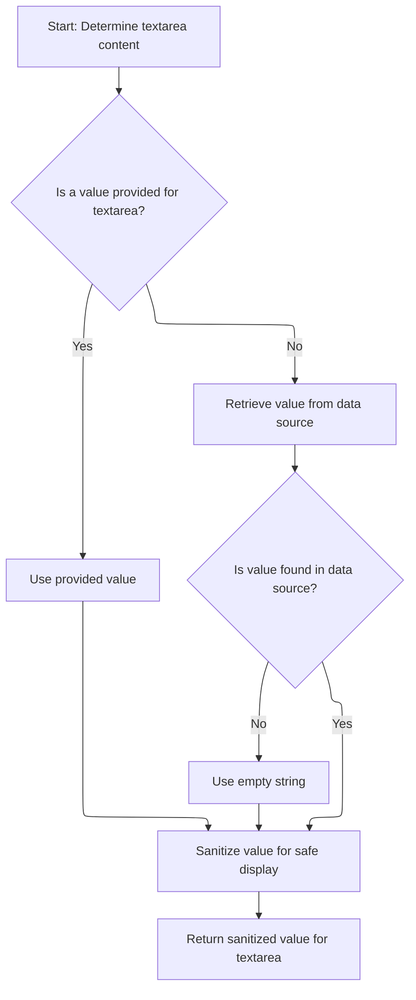

This document outlines how a textarea element is rendered for web forms. The process determines the appropriate attributes and content, then writes the resulting HTML to the page for user interaction.

# Starting the Tag Rendering

<SwmSnippet path="/taglib/src/main/java/org/apache/struts/taglib/html/TextareaTag.java" line="47">

---

<SwmToken path="taglib/src/main/java/org/apache/struts/taglib/html/TextareaTag.java" pos="47:5:5" line-data="    public int doStartTag() throws JspException {">`doStartTag`</SwmToken> kicks off the rendering by writing the textarea HTML (from <SwmToken path="taglib/src/main/java/org/apache/struts/taglib/html/TextareaTag.java" pos="48:14:14" line-data="        TagUtils.getInstance().write(pageContext, this.renderTextareaElement());">`renderTextareaElement`</SwmToken>) to the page using <SwmToken path="taglib/src/main/java/org/apache/struts/taglib/html/TextareaTag.java" pos="48:1:1" line-data="        TagUtils.getInstance().write(pageContext, this.renderTextareaElement());">`TagUtils`</SwmToken>. After that, it returns <SwmToken path="taglib/src/main/java/org/apache/struts/taglib/html/TextareaTag.java" pos="50:4:4" line-data="        return (EVAL_BODY_TAG);">`EVAL_BODY_TAG`</SwmToken> so the JSP engine knows to process the tag body. We call <SwmToken path="taglib/src/main/java/org/apache/struts/taglib/html/TextareaTag.java" pos="48:14:14" line-data="        TagUtils.getInstance().write(pageContext, this.renderTextareaElement());">`renderTextareaElement`</SwmToken> here to generate the actual HTML for the textarea before anything else happens.

```java
    public int doStartTag() throws JspException {
        TagUtils.getInstance().write(pageContext, this.renderTextareaElement());

        return (EVAL_BODY_TAG);
    }
```

---

</SwmSnippet>

# Building the Textarea HTML

<SwmSnippet path="/taglib/src/main/java/org/apache/struts/taglib/html/TextareaTag.java" line="59">

---

In <SwmToken path="taglib/src/main/java/org/apache/struts/taglib/html/TextareaTag.java" pos="59:5:5" line-data="    protected String renderTextareaElement()">`renderTextareaElement`</SwmToken>, we assemble the textarea's HTML by adding attributes and handlers using helpers. After setting up the tag and its attributes, we call <SwmToken path="taglib/src/main/java/org/apache/struts/taglib/html/TextareaTag.java" pos="73:7:7" line-data="        results.append(this.renderData());">`renderData`</SwmToken> to insert the actual content inside the textarea, since that's the last piece before closing the tag.

```java
    protected String renderTextareaElement()
        throws JspException {
        StringBuffer results = new StringBuffer("<textarea");

        prepareAttribute(results, "name", prepareName());
        prepareAttribute(results, "accesskey", getAccesskey());
        prepareAttribute(results, "tabindex", getTabindex());
        prepareAttribute(results, "cols", getCols());
        prepareAttribute(results, "rows", getRows());
        results.append(prepareEventHandlers());
        results.append(prepareStyles());
        prepareOtherAttributes(results);
        results.append(">");

        results.append(this.renderData());

```

---

</SwmSnippet>

## Resolving the Textarea Value



<SwmSnippet path="/taglib/src/main/java/org/apache/struts/taglib/html/TextareaTag.java" line="86">

---

<SwmToken path="taglib/src/main/java/org/apache/struts/taglib/html/TextareaTag.java" pos="86:5:5" line-data="    protected String renderData()">`renderData`</SwmToken> figures out what goes inside the textarea. It uses the 'value' field if set, otherwise it calls <SwmToken path="taglib/src/main/java/org/apache/struts/taglib/html/TextareaTag.java" pos="91:7:7" line-data="            data = this.lookupProperty(this.name, this.property);">`lookupProperty`</SwmToken> to fetch the value from a bean. The result is filtered for safety before returning, or just an empty string if nothing is found.

```java
    protected String renderData()
        throws JspException {
        String data = this.value;

        if (data == null) {
            data = this.lookupProperty(this.name, this.property);
        }

        return (data == null) ? "" : TagUtils.getInstance().filter(data);
    }
```

---

</SwmSnippet>

<SwmSnippet path="/taglib/src/main/java/org/apache/struts/taglib/html/BaseHandlerTag.java" line="1200">

---

<SwmToken path="taglib/src/main/java/org/apache/struts/taglib/html/BaseHandlerTag.java" pos="1200:5:5" line-data="    protected String lookupProperty(String beanName, String property)">`lookupProperty`</SwmToken> fetches the bean from the page context using <SwmToken path="taglib/src/main/java/org/apache/struts/taglib/html/BaseHandlerTag.java" pos="1203:1:1" line-data="            TagUtils.getInstance().lookup(this.pageContext, beanName, null);">`TagUtils`</SwmToken>, then grabs the property value via <SwmToken path="taglib/src/main/java/org/apache/struts/taglib/html/BaseHandlerTag.java" pos="1210:3:3" line-data="            return BeanUtils.getProperty(bean, property);">`BeanUtils`</SwmToken> reflection. If anything's missing or goes wrong, it throws a JSP exception with a clear, localized message.

```java
    protected String lookupProperty(String beanName, String property)
        throws JspException {
        Object bean =
            TagUtils.getInstance().lookup(this.pageContext, beanName, null);

        if (bean == null) {
            throw new JspException(messages.getMessage("getter.bean", beanName));
        }

        try {
            return BeanUtils.getProperty(bean, property);
        } catch (IllegalAccessException e) {
            throw new JspException(messages.getMessage("getter.access",
                    property, beanName), e);
        } catch (InvocationTargetException e) {
            Throwable t = e.getTargetException();

            throw new JspException(messages.getMessage("getter.result",
                    property, t.toString()), e);
        } catch (NoSuchMethodException e) {
            throw new JspException(messages.getMessage("getter.method",
                    property, beanName), e);
        }
    }
```

---

</SwmSnippet>

## Finalizing the Textarea Output

<SwmSnippet path="/taglib/src/main/java/org/apache/struts/taglib/html/TextareaTag.java" line="75">

---

We just got the textarea content from <SwmToken path="taglib/src/main/java/org/apache/struts/taglib/html/TextareaTag.java" pos="73:7:7" line-data="        results.append(this.renderData());">`renderData`</SwmToken>, so now <SwmToken path="taglib/src/main/java/org/apache/struts/taglib/html/TextareaTag.java" pos="48:14:14" line-data="        TagUtils.getInstance().write(pageContext, this.renderTextareaElement());">`renderTextareaElement`</SwmToken> appends the closing </textarea> tag and returns the full HTML string. The <SwmToken path="taglib/src/main/java/org/apache/struts/taglib/html/TextareaTag.java" pos="61:1:1" line-data="        StringBuffer results = new StringBuffer(&quot;&lt;textarea&quot;);">`StringBuffer`</SwmToken> approach keeps the assembly efficient and straightforward.

```java
        results.append("</textarea>");

        return results.toString();
    }
```

---

</SwmSnippet>

&nbsp;

*This is an auto-generated document by Swimm 🌊 and has not yet been verified by a human*

<SwmMeta version="3.0.0" repo-id="Z2l0aHViJTNBJTNBc3RydXRzMSUzQSUzQVN3aW1tLURlbW8=" repo-name="struts1"><sup>Powered by [Swimm](https://app.swimm.io/)</sup></SwmMeta>
