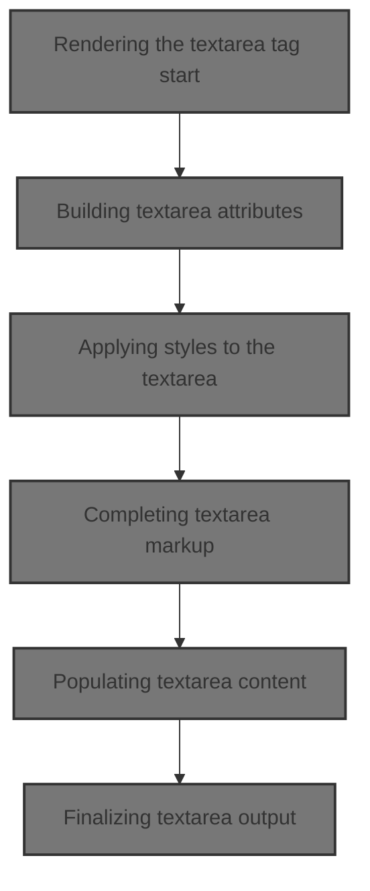
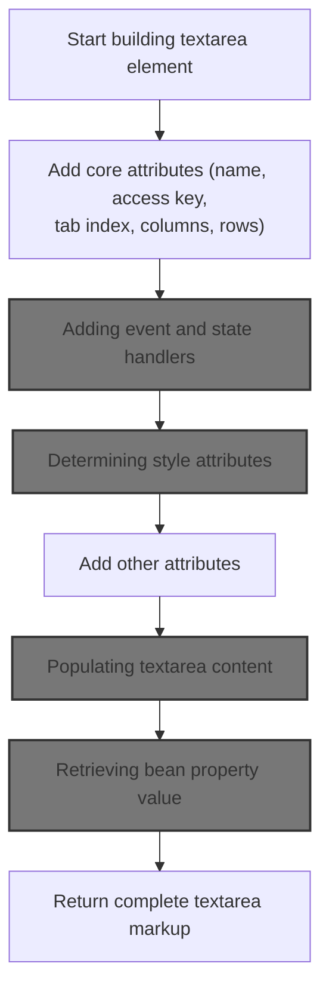
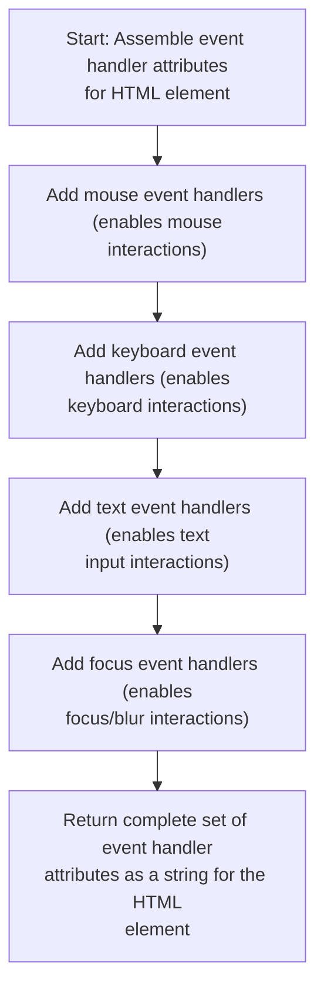
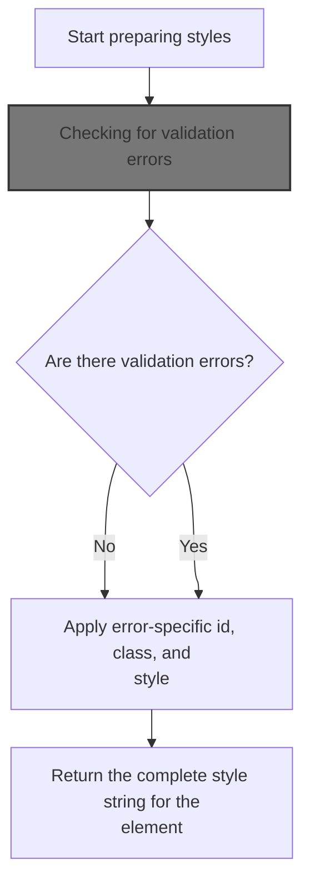
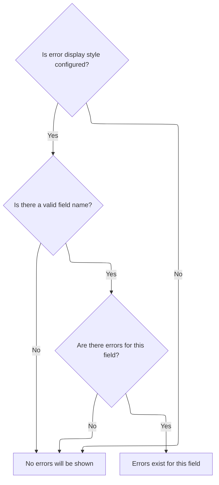
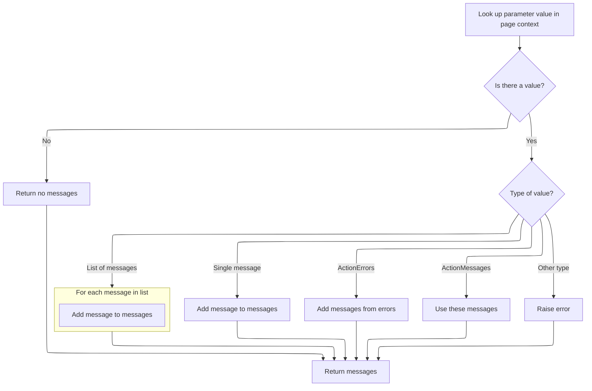
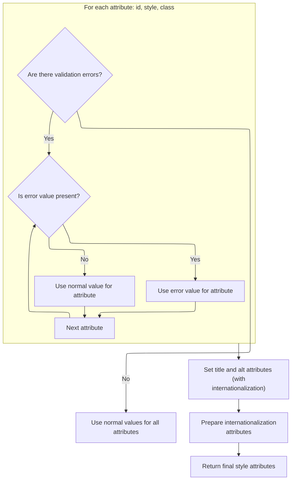
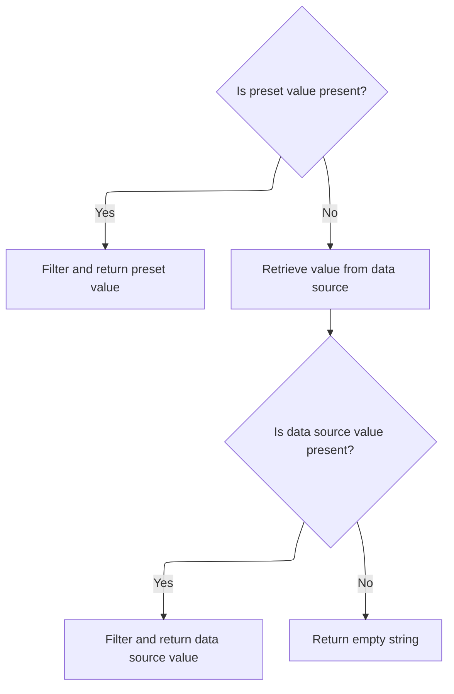
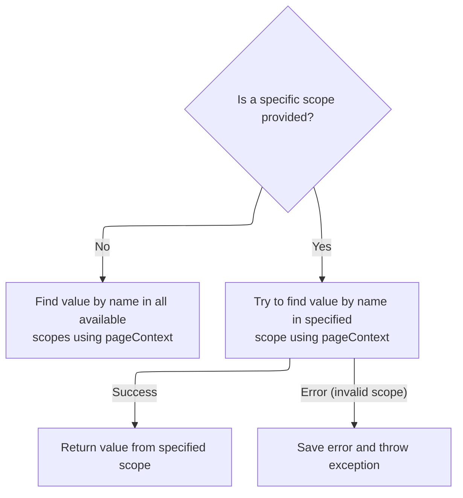
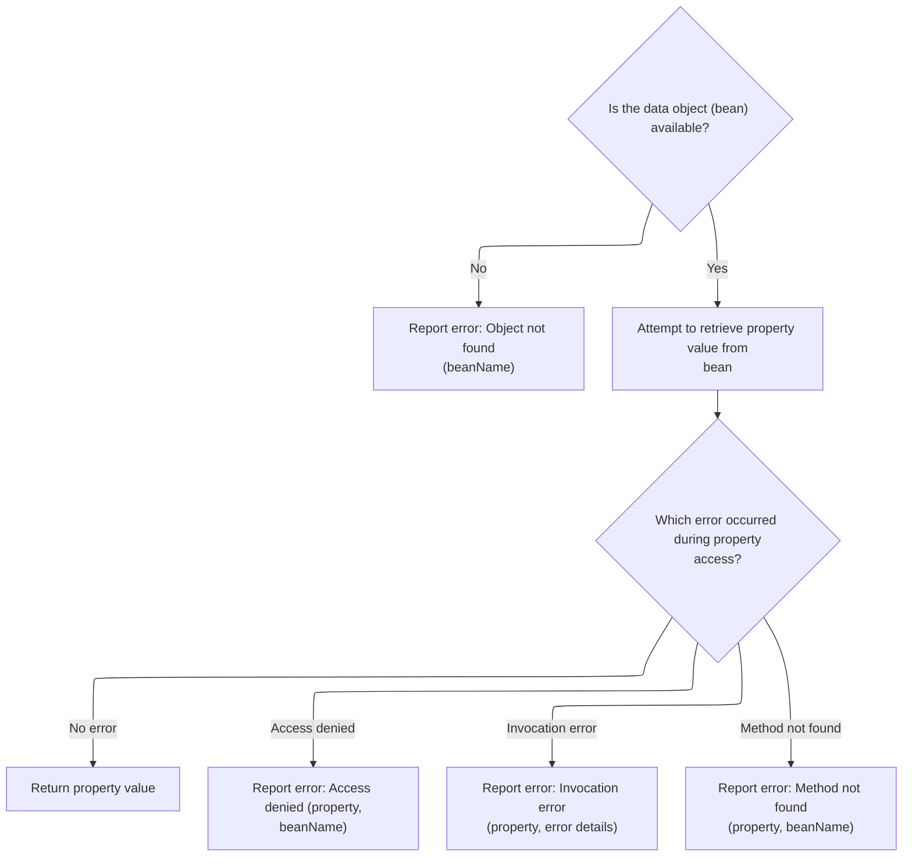

This document explains how a textarea field is generated for a web form, including the assembly of its attributes, styles, and content. The resulting textarea reflects the current data and validation state, providing users with an accurate and interactive input field.



# Rendering the textarea tag start

<SwmSnippet path="/taglib/src/main/java/org/apache/struts/taglib/html/TextareaTag.java" line="47">

---

<SwmToken path="taglib/src/main/java/org/apache/struts/taglib/html/TextareaTag.java" pos="47:5:5" line-data="    public int doStartTag() throws JspException {">`doStartTag`</SwmToken> writes the textarea HTML to the page by calling <SwmToken path="taglib/src/main/java/org/apache/struts/taglib/html/TextareaTag.java" pos="48:14:14" line-data="        TagUtils.getInstance().write(pageContext, this.renderTextareaElement());">`renderTextareaElement`</SwmToken>, then signals to evaluate the tag body. We call <SwmToken path="taglib/src/main/java/org/apache/struts/taglib/html/TextareaTag.java" pos="48:14:14" line-data="        TagUtils.getInstance().write(pageContext, this.renderTextareaElement());">`renderTextareaElement`</SwmToken> to generate the actual markup for the textarea, which is needed for output.

```java
    public int doStartTag() throws JspException {
        TagUtils.getInstance().write(pageContext, this.renderTextareaElement());

        return (EVAL_BODY_TAG);
    }
```

---

</SwmSnippet>

# Building textarea attributes



<SwmSnippet path="/taglib/src/main/java/org/apache/struts/taglib/html/TextareaTag.java" line="59">

---

In <SwmToken path="taglib/src/main/java/org/apache/struts/taglib/html/TextareaTag.java" pos="59:5:5" line-data="    protected String renderTextareaElement()">`renderTextareaElement`</SwmToken>, we start assembling the textarea tag and call <SwmToken path="taglib/src/main/java/org/apache/struts/taglib/html/TextareaTag.java" pos="63:1:1" line-data="        prepareAttribute(results, &quot;name&quot;, prepareName());">`prepareAttribute`</SwmToken> for each attribute. We use LabelTag.prepareAttribute next because it handles special cases like required styling for the 'class' attribute.

```java
    protected String renderTextareaElement()
        throws JspException {
        StringBuffer results = new StringBuffer("<textarea");

        prepareAttribute(results, "name", prepareName());
        prepareAttribute(results, "accesskey", getAccesskey());
        prepareAttribute(results, "tabindex", getTabindex());
        prepareAttribute(results, "cols", getCols());
        prepareAttribute(results, "rows", getRows());
```

---

</SwmSnippet>

<SwmSnippet path="/taglib/src/main/java/org/apache/struts/taglib/html/LabelTag.java" line="161">

---

<SwmToken path="taglib/src/main/java/org/apache/struts/taglib/html/LabelTag.java" pos="161:5:5" line-data="    protected void prepareAttribute(StringBuffer handlers, String name,">`prepareAttribute`</SwmToken> checks if the attribute is 'class' and the field is required, then appends a required style class. After that, it delegates to the superclass to handle the actual attribute formatting.

```java
    protected void prepareAttribute(StringBuffer handlers, String name,
            Object value) {

        if ("class".equals(name) && this.required) {
            String requiredStyleClass = getRequiredStyleClass();
            if (requiredStyleClass != null) {
                value = (value != null) ? (value + " " + requiredStyleClass)
                        : requiredStyleClass;
            }
        }
        super.prepareAttribute(handlers, name, value);
    }
```

---

</SwmSnippet>

<SwmSnippet path="/taglib/src/main/java/org/apache/struts/taglib/html/TextareaTag.java" line="68">

---

Back in <SwmToken path="taglib/src/main/java/org/apache/struts/taglib/html/TextareaTag.java" pos="48:14:14" line-data="        TagUtils.getInstance().write(pageContext, this.renderTextareaElement());">`renderTextareaElement`</SwmToken>, after setting up attributes, we append event handlers by calling <SwmToken path="taglib/src/main/java/org/apache/struts/taglib/html/TextareaTag.java" pos="68:5:5" line-data="        results.append(prepareEventHandlers());">`prepareEventHandlers`</SwmToken> from <SwmToken path="taglib/src/main/java/org/apache/struts/taglib/html/BaseHandlerTag.java" pos="48:6:6" line-data="public abstract class BaseHandlerTag extends BodyTagSupport {">`BaseHandlerTag`</SwmToken>. This adds interaction hooks to the textarea.

```java
        results.append(prepareEventHandlers());
```

---

</SwmSnippet>

## Adding event and state handlers



<SwmSnippet path="/taglib/src/main/java/org/apache/struts/taglib/html/BaseHandlerTag.java" line="1039">

---

<SwmToken path="taglib/src/main/java/org/apache/struts/taglib/html/BaseHandlerTag.java" pos="1039:5:5" line-data="    protected String prepareEventHandlers() {">`prepareEventHandlers`</SwmToken> builds up all event-related attributes for the textarea, including mouse, key, text, and focus events. We call <SwmToken path="taglib/src/main/java/org/apache/struts/taglib/html/BaseHandlerTag.java" pos="1045:1:1" line-data="        prepareFocusEvents(handlers);">`prepareFocusEvents`</SwmToken> next to handle focus-specific logic and state attributes.

```java
    protected String prepareEventHandlers() {
        StringBuffer handlers = new StringBuffer();

        prepareMouseEvents(handlers);
        prepareKeyEvents(handlers);
        prepareTextEvents(handlers);
        prepareFocusEvents(handlers);

        return handlers.toString();
    }
```

---

</SwmSnippet>

<SwmSnippet path="/taglib/src/main/java/org/apache/struts/taglib/html/BaseHandlerTag.java" line="1095">

---

<SwmToken path="taglib/src/main/java/org/apache/struts/taglib/html/BaseHandlerTag.java" pos="1095:5:5" line-data="    protected void prepareFocusEvents(StringBuffer handlers) {">`prepareFocusEvents`</SwmToken> not only sets up onblur and onfocus handlers, but also checks if the textarea or its parent form is disabled or readonly, then adds those attributes if needed.

```java
    protected void prepareFocusEvents(StringBuffer handlers) {
        prepareAttribute(handlers, "onblur", getOnblur());
        prepareAttribute(handlers, "onfocus", getOnfocus());

        // Get the parent FormTag (if necessary)
        FormTag formTag = null;

        if ((doDisabled && !getDisabled()) || (doReadonly && !getReadonly())) {
            formTag =
                (FormTag) pageContext.getAttribute(Constants.FORM_KEY,
                    PageContext.REQUEST_SCOPE);
        }

        // Format Disabled
        if (doDisabled) {
            boolean formDisabled =
                (formTag == null) ? false : formTag.isDisabled();

            if (formDisabled || getDisabled()) {
                handlers.append(" disabled=\"disabled\"");
            }
        }

        // Format Read Only
        if (doReadonly) {
            boolean formReadOnly =
                (formTag == null) ? false : formTag.isReadonly();

            if (formReadOnly || getReadonly()) {
                handlers.append(" readonly=\"readonly\"");
            }
        }
    }
```

---

</SwmSnippet>

## Applying styles to the textarea

<SwmSnippet path="/taglib/src/main/java/org/apache/struts/taglib/html/TextareaTag.java" line="69">

---

Back in <SwmToken path="taglib/src/main/java/org/apache/struts/taglib/html/TextareaTag.java" pos="48:14:14" line-data="        TagUtils.getInstance().write(pageContext, this.renderTextareaElement());">`renderTextareaElement`</SwmToken>, after event handlers, we call <SwmToken path="taglib/src/main/java/org/apache/struts/taglib/html/TextareaTag.java" pos="69:5:5" line-data="        results.append(prepareStyles());">`prepareStyles`</SwmToken> to add style-related attributes. This handles error styling and normal styling for the textarea.

```java
        results.append(prepareStyles());
```

---

</SwmSnippet>

## Determining style attributes



<SwmSnippet path="/taglib/src/main/java/org/apache/struts/taglib/html/BaseHandlerTag.java" line="967">

---

In <SwmToken path="taglib/src/main/java/org/apache/struts/taglib/html/BaseHandlerTag.java" pos="967:5:5" line-data="    protected String prepareStyles()">`prepareStyles`</SwmToken>, we start by checking if there are validation errors using <SwmToken path="taglib/src/main/java/org/apache/struts/taglib/html/BaseHandlerTag.java" pos="971:7:7" line-data="        boolean errorsExist = doErrorsExist();">`doErrorsExist`</SwmToken>. We call <SwmToken path="taglib/src/main/java/org/apache/struts/taglib/html/BaseHandlerTag.java" pos="971:7:7" line-data="        boolean errorsExist = doErrorsExist();">`doErrorsExist`</SwmToken> next to decide if error styles should be applied.

```java
    protected String prepareStyles()
        throws JspException {
        StringBuffer styles = new StringBuffer();

        boolean errorsExist = doErrorsExist();

```

---

</SwmSnippet>

### Checking for validation errors



<SwmSnippet path="/taglib/src/main/java/org/apache/struts/taglib/html/BaseHandlerTag.java" line="1003">

---

<SwmToken path="taglib/src/main/java/org/apache/struts/taglib/html/BaseHandlerTag.java" pos="1003:5:5" line-data="    protected boolean doErrorsExist()">`doErrorsExist`</SwmToken> looks for error style attributes and then calls TagUtils.getActionMessages to check if there are validation messages for this field.

```java
    protected boolean doErrorsExist()
        throws JspException {
        boolean errorsExist = false;

        if ((getErrorStyleId() != null) || (getErrorStyle() != null)
            || (getErrorStyleClass() != null)) {
            String actualName = prepareName();

            if (actualName != null) {
                ActionMessages errors =
                    TagUtils.getInstance().getActionMessages(pageContext,
                        errorKey);

                errorsExist = ((errors != null)
                    && (errors.size(actualName) > 0));
            }
        }

        return errorsExist;
    }
```

---

</SwmSnippet>

### Aggregating error messages



<SwmSnippet path="/taglib/src/main/java/org/apache/struts/taglib/TagUtils.java" line="727">

---

In <SwmToken path="taglib/src/main/java/org/apache/struts/taglib/TagUtils.java" pos="727:5:5" line-data="    public ActionMessages getActionMessages(PageContext pageContext,">`getActionMessages`</SwmToken>, we grab the error attribute from the page context, convert it to <SwmToken path="taglib/src/main/java/org/apache/struts/taglib/TagUtils.java" pos="727:3:3" line-data="    public ActionMessages getActionMessages(PageContext pageContext,">`ActionMessages`</SwmToken> no matter its original type, so error handling is uniform.

```java
    public ActionMessages getActionMessages(PageContext pageContext,
        String paramName) throws JspException {
        ActionMessages am = new ActionMessages();

        Object value = pageContext.findAttribute(paramName);

        if (value != null) {
            try {
                if (value instanceof String) {
                    am.add(ActionMessages.GLOBAL_MESSAGE,
                        new ActionMessage((String) value));
                } else if (value instanceof String[]) {
                    String[] keys = (String[]) value;

                    for (int i = 0; i < keys.length; i++) {
                        am.add(ActionMessages.GLOBAL_MESSAGE,
                            new ActionMessage(keys[i]));
                    }
```

---

</SwmSnippet>

<SwmSnippet path="/taglib/src/main/java/org/apache/struts/taglib/TagUtils.java" line="745">

---

After processing, <SwmToken path="taglib/src/main/java/org/apache/struts/taglib/html/BaseHandlerTag.java" pos="1013:7:7" line-data="                    TagUtils.getInstance().getActionMessages(pageContext,">`getActionMessages`</SwmToken> returns an <SwmToken path="taglib/src/main/java/org/apache/struts/taglib/TagUtils.java" pos="746:1:1" line-data="                    ActionMessages m = (ActionMessages) value;">`ActionMessages`</SwmToken> object with all error messages, regardless of the original attribute type.

```java
                } else if (value instanceof ActionErrors) {
                    ActionMessages m = (ActionMessages) value;

                    am.add(m);
                } else if (value instanceof ActionMessages) {
                    am = (ActionMessages) value;
                } else {
                    throw new JspException(messages.getMessage(
                            "actionMessages.errors", value.getClass().getName()));
                }
            } catch (JspException e) {
                throw e;
            } catch (Exception e) {
                log.warn("Unable to retieve ActionMessage for paramName : "
                    + paramName, e);
            }
        }

        return am;
    }
```

---

</SwmSnippet>

### Finalizing style and accessibility attributes



<SwmSnippet path="/taglib/src/main/java/org/apache/struts/taglib/html/BaseHandlerTag.java" line="973">

---

After error checks in <SwmToken path="taglib/src/main/java/org/apache/struts/taglib/html/TextareaTag.java" pos="69:5:5" line-data="        results.append(prepareStyles());">`prepareStyles`</SwmToken>, we set id, style, and class attributes based on error state, then use message() for localized title and alt values.

```java
        if (errorsExist && (getErrorStyleId() != null)) {
            prepareAttribute(styles, "id", getErrorStyleId());
        } else {
            prepareAttribute(styles, "id", getStyleId());
        }

        if (errorsExist && (getErrorStyle() != null)) {
            prepareAttribute(styles, "style", getErrorStyle());
        } else {
            prepareAttribute(styles, "style", getStyle());
        }

        if (errorsExist && (getErrorStyleClass() != null)) {
            prepareAttribute(styles, "class", getErrorStyleClass());
        } else {
            prepareAttribute(styles, "class", getStyleClass());
        }

        prepareAttribute(styles, "title", message(getTitle(), getTitleKey()));
        prepareAttribute(styles, "alt", message(getAlt(), getAltKey()));
```

---

</SwmSnippet>

<SwmSnippet path="/taglib/src/main/java/org/apache/struts/taglib/html/BaseHandlerTag.java" line="830">

---

<SwmToken path="taglib/src/main/java/org/apache/struts/taglib/html/BaseHandlerTag.java" pos="830:5:5" line-data="    protected String message(String literal, String key)">`message`</SwmToken> checks if both literal and key are set—throws if so. Otherwise, it returns the literal or fetches a localized string by key.

```java
    protected String message(String literal, String key)
        throws JspException {
        if (literal != null) {
            if (key != null) {
                JspException e =
                    new JspException(messages.getMessage("common.both"));

                TagUtils.getInstance().saveException(pageContext, e);
                throw e;
            } else {
                return (literal);
            }
        } else {
            if (key != null) {
                return TagUtils.getInstance().message(pageContext, getBundle(),
                    getLocale(), key);
            } else {
                return null;
            }
        }
    }
```

---

</SwmSnippet>

<SwmSnippet path="/taglib/src/main/java/org/apache/struts/taglib/html/BaseHandlerTag.java" line="993">

---

After setting all style and accessibility attributes in <SwmToken path="taglib/src/main/java/org/apache/struts/taglib/html/TextareaTag.java" pos="69:5:5" line-data="        results.append(prepareStyles());">`prepareStyles`</SwmToken>, we call <SwmToken path="taglib/src/main/java/org/apache/struts/taglib/html/BaseHandlerTag.java" pos="993:1:1" line-data="        prepareInternationalization(styles);">`prepareInternationalization`</SwmToken> to add any i18n-specific attributes before returning the style string.

```java
        prepareInternationalization(styles);

        return styles.toString();
    }
```

---

</SwmSnippet>

## Completing textarea markup

<SwmSnippet path="/taglib/src/main/java/org/apache/struts/taglib/html/TextareaTag.java" line="70">

---

Back in <SwmToken path="taglib/src/main/java/org/apache/struts/taglib/html/TextareaTag.java" pos="48:14:14" line-data="        TagUtils.getInstance().write(pageContext, this.renderTextareaElement());">`renderTextareaElement`</SwmToken>, after all attributes are set, we call <SwmToken path="taglib/src/main/java/org/apache/struts/taglib/html/TextareaTag.java" pos="73:7:7" line-data="        results.append(this.renderData());">`renderData`</SwmToken> to fill the textarea with its value or property lookup.

```java
        prepareOtherAttributes(results);
        results.append(">");

        results.append(this.renderData());

```

---

</SwmSnippet>

## Populating textarea content



<SwmSnippet path="/taglib/src/main/java/org/apache/struts/taglib/html/TextareaTag.java" line="86">

---

<SwmToken path="taglib/src/main/java/org/apache/struts/taglib/html/TextareaTag.java" pos="86:5:5" line-data="    protected String renderData()">`renderData`</SwmToken> uses the value if set, otherwise calls <SwmToken path="taglib/src/main/java/org/apache/struts/taglib/html/TextareaTag.java" pos="91:7:7" line-data="            data = this.lookupProperty(this.name, this.property);">`lookupProperty`</SwmToken> to fetch it from the bean, then filters it for HTML output.

```java
    protected String renderData()
        throws JspException {
        String data = this.value;

        if (data == null) {
            data = this.lookupProperty(this.name, this.property);
        }

        return (data == null) ? "" : TagUtils.getInstance().filter(data);
    }
```

---

</SwmSnippet>

## Retrieving bean property value

<SwmSnippet path="/taglib/src/main/java/org/apache/struts/taglib/html/BaseHandlerTag.java" line="1200">

---

In <SwmToken path="taglib/src/main/java/org/apache/struts/taglib/html/BaseHandlerTag.java" pos="1200:5:5" line-data="    protected String lookupProperty(String beanName, String property)">`lookupProperty`</SwmToken>, we use TagUtils.lookup to fetch the bean from the page context, handling scope resolution before property access.

```java
    protected String lookupProperty(String beanName, String property)
        throws JspException {
        Object bean =
            TagUtils.getInstance().lookup(this.pageContext, beanName, null);

```

---

</SwmSnippet>

### Resolving bean scope



<SwmSnippet path="/taglib/src/main/java/org/apache/struts/taglib/TagUtils.java" line="863">

---

<SwmToken path="taglib/src/main/java/org/apache/struts/taglib/TagUtils.java" pos="863:5:5" line-data="    public Object lookup(PageContext pageContext, String name, String scopeName)">`lookup`</SwmToken> checks if <SwmToken path="taglib/src/main/java/org/apache/struts/taglib/TagUtils.java" pos="863:19:19" line-data="    public Object lookup(PageContext pageContext, String name, String scopeName)">`scopeName`</SwmToken> is null—if so, it searches all scopes for the bean. Otherwise, it converts <SwmToken path="taglib/src/main/java/org/apache/struts/taglib/TagUtils.java" pos="863:19:19" line-data="    public Object lookup(PageContext pageContext, String name, String scopeName)">`scopeName`</SwmToken> to an integer and fetches from the specified scope.

```java
    public Object lookup(PageContext pageContext, String name, String scopeName)
        throws JspException {
        if (scopeName == null) {
            return pageContext.findAttribute(name);
        }

        try {
            return pageContext.getAttribute(name, instance.getScope(scopeName));
        } catch (JspException e) {
            saveException(pageContext, e);
            throw e;
        }
    }
```

---

</SwmSnippet>

<SwmSnippet path="/taglib/src/main/java/org/apache/struts/taglib/TagUtils.java" line="809">

---

<SwmToken path="taglib/src/main/java/org/apache/struts/taglib/TagUtils.java" pos="809:5:5" line-data="    public int getScope(String scopeName)">`getScope`</SwmToken> lowercases <SwmToken path="taglib/src/main/java/org/apache/struts/taglib/TagUtils.java" pos="809:9:9" line-data="    public int getScope(String scopeName)">`scopeName`</SwmToken> before lookup, so all keys match. If the scope isn't found, it throws an exception with a message (even though scope is null in the message).

```java
    public int getScope(String scopeName)
        throws JspException {
        Integer scope = (Integer) scopes.get(scopeName.toLowerCase());

        if (scope == null) {
            throw new JspException(messages.getMessage("lookup.scope", scope));
        }

        return scope.intValue();
    }
```

---

</SwmSnippet>

### Handling property access and errors



<SwmSnippet path="/taglib/src/main/java/org/apache/struts/taglib/html/BaseHandlerTag.java" line="1205">

---

After bean lookup in <SwmToken path="taglib/src/main/java/org/apache/struts/taglib/html/TextareaTag.java" pos="91:7:7" line-data="            data = this.lookupProperty(this.name, this.property);">`lookupProperty`</SwmToken>, if the bean is missing or property access fails, we throw a <SwmToken path="taglib/src/main/java/org/apache/struts/taglib/html/BaseHandlerTag.java" pos="1206:5:5" line-data="            throw new JspException(messages.getMessage(&quot;getter.bean&quot;, beanName));">`JspException`</SwmToken>—so the textarea won't show invalid data.

```java
        if (bean == null) {
            throw new JspException(messages.getMessage("getter.bean", beanName));
        }

        try {
            return BeanUtils.getProperty(bean, property);
        } catch (IllegalAccessException e) {
            throw new JspException(messages.getMessage("getter.access",
                    property, beanName), e);
        } catch (InvocationTargetException e) {
            Throwable t = e.getTargetException();

            throw new JspException(messages.getMessage("getter.result",
                    property, t.toString()), e);
        } catch (NoSuchMethodException e) {
            throw new JspException(messages.getMessage("getter.method",
                    property, beanName), e);
        }
    }
```

---

</SwmSnippet>

## Finalizing textarea output

<SwmSnippet path="/taglib/src/main/java/org/apache/struts/taglib/html/TextareaTag.java" line="75">

---

After getting the textarea content from <SwmToken path="taglib/src/main/java/org/apache/struts/taglib/html/TextareaTag.java" pos="73:7:7" line-data="        results.append(this.renderData());">`renderData`</SwmToken>, we append the closing </textarea> tag and return the full HTML string from <SwmToken path="taglib/src/main/java/org/apache/struts/taglib/html/TextareaTag.java" pos="48:14:14" line-data="        TagUtils.getInstance().write(pageContext, this.renderTextareaElement());">`renderTextareaElement`</SwmToken>.

```java
        results.append("</textarea>");

        return results.toString();
    }
```

---

</SwmSnippet>

&nbsp;

*This is an auto-generated document by Swimm 🌊 and has not yet been verified by a human*

<SwmMeta version="3.0.0" repo-id="Z2l0aHViJTNBJTNBc3RydXRzMSUzQSUzQVN3aW1tLURlbW8=" repo-name="struts1"><sup>Powered by [Swimm](https://app.swimm.io/)</sup></SwmMeta>
