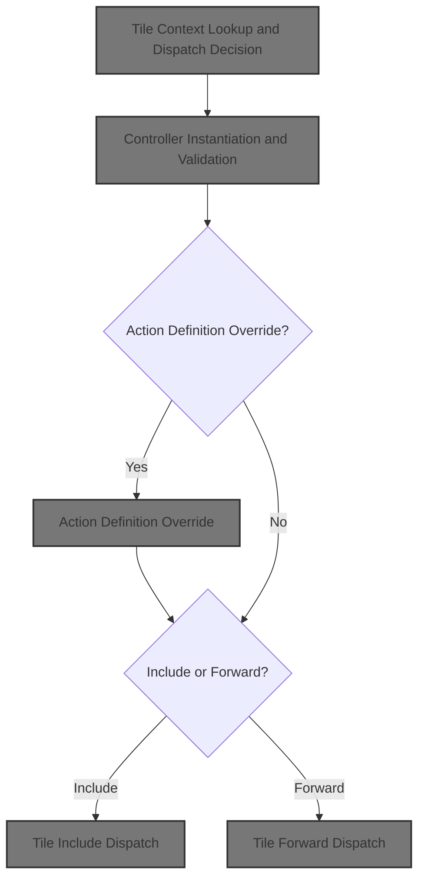
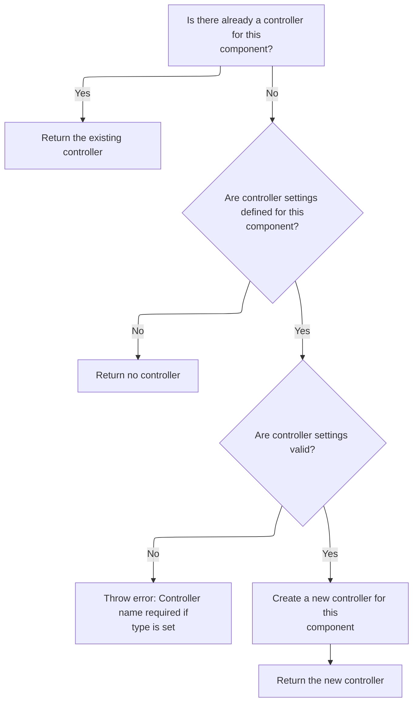
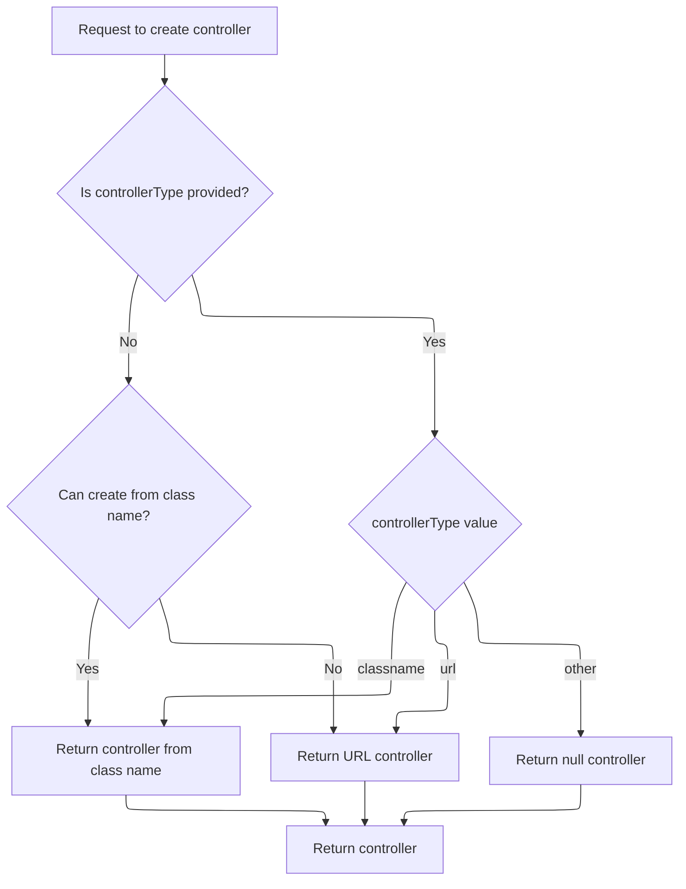
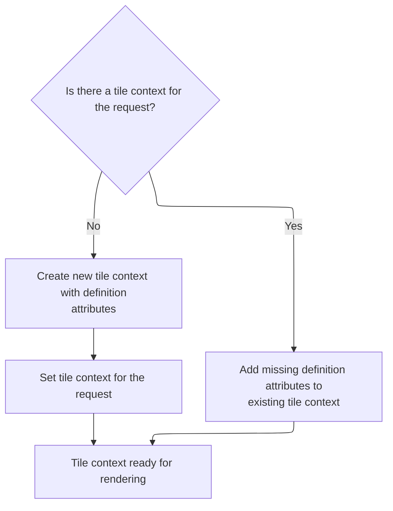
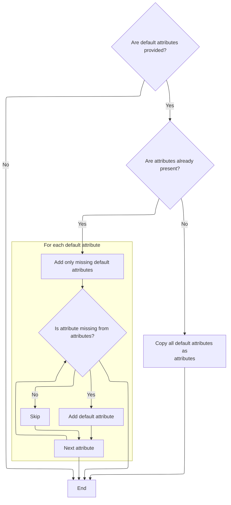

This document describes how a tile is rendered based on a definition name, HTTP request, and response. The flow establishes the correct context and attributes, applies controller logic if defined, and dispatches the request to render the tile using include or forward. This enables dynamic and reusable UI composition.



# Where is this flow used?

This flow is used multiple times in the codebase as represented in the following diagram:

```mermaid
graph TD;
      aae3a15db7d4f0622041e8bd370edfb45fb3c73534bf177c7d86263eea1b3771(tiles/…/tiles/TilesRequestProcessor.java::TilesRequestProcessor.processForwardConfig) --> 5e4d8b9be11f0982d8bc540fbb686f1db6129563a9154020d727982e32572261(tiles/…/tiles/TilesRequestProcessor.java::TilesRequestProcessor.processTilesDefinition)

c7ab44356ea54a6a46a0c087c12921f700ed2724242fce63a68981875e459857(tiles/…/tiles/TilesRequestProcessor.java::TilesRequestProcessor.internalModuleRelativeForward) --> 5e4d8b9be11f0982d8bc540fbb686f1db6129563a9154020d727982e32572261(tiles/…/tiles/TilesRequestProcessor.java::TilesRequestProcessor.processTilesDefinition)

b9062fd92022c5c8c16b61ed36555ccd4d9d154a8f58560bea8e5243334898b5(tiles/…/tiles/TilesRequestProcessor.java::TilesRequestProcessor.internalModuleRelativeInclude) --> 5e4d8b9be11f0982d8bc540fbb686f1db6129563a9154020d727982e32572261(tiles/…/tiles/TilesRequestProcessor.java::TilesRequestProcessor.processTilesDefinition)


classDef mainFlowStyle color:#000000,fill:#7CB9F4
classDef rootsStyle color:#000000,fill:#00FFF4
classDef Style1 color:#000000,fill:#00FFAA
classDef Style2 color:#000000,fill:#FFFF00
classDef Style3 color:#000000,fill:#AA7CB9

%% Swimm:
%% graph TD;
%%       aae3a15db7d4f0622041e8bd370edfb45fb3c73534bf177c7d86263eea1b3771(<SwmPath>[tiles/…/tiles/TilesRequestProcessor.java](tiles/src/main/java/org/apache/struts/tiles/TilesRequestProcessor.java)</SwmPath>::TilesRequestProcessor.processForwardConfig) --> 5e4d8b9be11f0982d8bc540fbb686f1db6129563a9154020d727982e32572261(<SwmPath>[tiles/…/tiles/TilesRequestProcessor.java](tiles/src/main/java/org/apache/struts/tiles/TilesRequestProcessor.java)</SwmPath>::TilesRequestProcessor.processTilesDefinition)
%% 
%% c7ab44356ea54a6a46a0c087c12921f700ed2724242fce63a68981875e459857(<SwmPath>[tiles/…/tiles/TilesRequestProcessor.java](tiles/src/main/java/org/apache/struts/tiles/TilesRequestProcessor.java)</SwmPath>::TilesRequestProcessor.internalModuleRelativeForward) --> 5e4d8b9be11f0982d8bc540fbb686f1db6129563a9154020d727982e32572261(<SwmPath>[tiles/…/tiles/TilesRequestProcessor.java](tiles/src/main/java/org/apache/struts/tiles/TilesRequestProcessor.java)</SwmPath>::TilesRequestProcessor.processTilesDefinition)
%% 
%% b9062fd92022c5c8c16b61ed36555ccd4d9d154a8f58560bea8e5243334898b5(<SwmPath>[tiles/…/tiles/TilesRequestProcessor.java](tiles/src/main/java/org/apache/struts/tiles/TilesRequestProcessor.java)</SwmPath>::TilesRequestProcessor.internalModuleRelativeInclude) --> 5e4d8b9be11f0982d8bc540fbb686f1db6129563a9154020d727982e32572261(<SwmPath>[tiles/…/tiles/TilesRequestProcessor.java](tiles/src/main/java/org/apache/struts/tiles/TilesRequestProcessor.java)</SwmPath>::TilesRequestProcessor.processTilesDefinition)
%% 
%% 
%% classDef mainFlowStyle color:#000000,fill:#7CB9F4
%% classDef rootsStyle color:#000000,fill:#00FFF4
%% classDef Style1 color:#000000,fill:#00FFAA
%% classDef Style2 color:#000000,fill:#FFFF00
%% classDef Style3 color:#000000,fill:#AA7CB9
```



# Tile Context Lookup and Dispatch Decision

```mermaid
%%{init: {"flowchart": {"defaultRenderer": "elk"}} }%%
flowchart TD
  node1["Start processing tile definition"]
  click node1 openCode "tiles/src/main/java/org/apache/struts/tiles/TilesRequestProcessor.java:155:175"
  node1 --> node2{"Is there a tile context?"}
  click node2 openCode "tiles/src/main/java/org/apache/struts/tiles/TilesRequestProcessor.java:175:176"
  node2 -->|"Yes"| node3{"Is definition found?"}
  node2 -->|"No"| node3
  click node3 openCode "tiles/src/main/java/org/apache/struts/tiles/TilesRequestProcessor.java:181:193"
  node3 -->|"No"| node4["Return false"]
  click node4 openCode "tiles/src/main/java/org/apache/struts/tiles/TilesRequestProcessor.java:244:246"
  node3 -->|"Yes"| node5["Tile Context Attribute Augmentation"]
  
  node5 --> node6{"Is action-specific definition present?"}
  
  node6 -->|"Yes"| node7["Action Definition Override"]
  
  node6 -->|"No"| node8{"Is controller present?"}
  
  node7 --> node8
  node8 -->|"Yes"| node9["Execute controller"]
  click node9 openCode "tiles/src/main/java/org/apache/struts/tiles/TilesRequestProcessor.java:249:260"
  node8 -->|"No"| node10{"Include or forward resource?"}
  node9 -->|"After controller execution"| node10
  click node10 openCode "tiles/src/main/java/org/apache/struts/tiles/TilesRequestProcessor.java:268:272"
  node10 -->|"Include"| node11["Tile Include Dispatch"]
  
  node10 -->|"Forward"| node12["Tile Forward Dispatch"]
  
  node11 --> node13["Return true"]
  node12 --> node13
  click node13 openCode "tiles/src/main/java/org/apache/struts/tiles/TilesRequestProcessor.java:274:275"

classDef HeadingStyle fill:#777777,stroke:#333,stroke-width:2px;
click node5 goToHeading "Tile Context Attribute Augmentation"
node5:::HeadingStyle
click node6 goToHeading "Action Definition Override"
node6:::HeadingStyle
click node7 goToHeading "Action Definition Override"
node7:::HeadingStyle
click node8 goToHeading "Action Definition Override"
node8:::HeadingStyle
click node11 goToHeading "Tile Include Dispatch"
node11:::HeadingStyle
click node12 goToHeading "Tile Forward Dispatch"
node12:::HeadingStyle

%% Swimm:
%% %%{init: {"flowchart": {"defaultRenderer": "elk"}} }%%
%% flowchart TD
%%   node1["Start processing tile definition"]
%%   click node1 openCode "<SwmPath>[tiles/…/tiles/TilesRequestProcessor.java](tiles/src/main/java/org/apache/struts/tiles/TilesRequestProcessor.java)</SwmPath>:155:175"
%%   node1 --> node2{"Is there a tile context?"}
%%   click node2 openCode "<SwmPath>[tiles/…/tiles/TilesRequestProcessor.java](tiles/src/main/java/org/apache/struts/tiles/TilesRequestProcessor.java)</SwmPath>:175:176"
%%   node2 -->|"Yes"| node3{"Is definition found?"}
%%   node2 -->|"No"| node3
%%   click node3 openCode "<SwmPath>[tiles/…/tiles/TilesRequestProcessor.java](tiles/src/main/java/org/apache/struts/tiles/TilesRequestProcessor.java)</SwmPath>:181:193"
%%   node3 -->|"No"| node4["Return false"]
%%   click node4 openCode "<SwmPath>[tiles/…/tiles/TilesRequestProcessor.java](tiles/src/main/java/org/apache/struts/tiles/TilesRequestProcessor.java)</SwmPath>:244:246"
%%   node3 -->|"Yes"| node5["Tile Context Attribute Augmentation"]
%%   
%%   node5 --> node6{"Is action-specific definition present?"}
%%   
%%   node6 -->|"Yes"| node7["Action Definition Override"]
%%   
%%   node6 -->|"No"| node8{"Is controller present?"}
%%   
%%   node7 --> node8
%%   node8 -->|"Yes"| node9["Execute controller"]
%%   click node9 openCode "<SwmPath>[tiles/…/tiles/TilesRequestProcessor.java](tiles/src/main/java/org/apache/struts/tiles/TilesRequestProcessor.java)</SwmPath>:249:260"
%%   node8 -->|"No"| node10{"Include or forward resource?"}
%%   node9 -->|"After controller execution"| node10
%%   click node10 openCode "<SwmPath>[tiles/…/tiles/TilesRequestProcessor.java](tiles/src/main/java/org/apache/struts/tiles/TilesRequestProcessor.java)</SwmPath>:268:272"
%%   node10 -->|"Include"| node11["Tile Include Dispatch"]
%%   
%%   node10 -->|"Forward"| node12["Tile Forward Dispatch"]
%%   
%%   node11 --> node13["Return true"]
%%   node12 --> node13
%%   click node13 openCode "<SwmPath>[tiles/…/tiles/TilesRequestProcessor.java](tiles/src/main/java/org/apache/struts/tiles/TilesRequestProcessor.java)</SwmPath>:274:275"
%% 
%% classDef HeadingStyle fill:#777777,stroke:#333,stroke-width:2px;
%% click node5 goToHeading "Tile Context Attribute Augmentation"
%% node5:::HeadingStyle
%% click node6 goToHeading "Action Definition Override"
%% node6:::HeadingStyle
%% click node7 goToHeading "Action Definition Override"
%% node7:::HeadingStyle
%% click node8 goToHeading "Action Definition Override"
%% node8:::HeadingStyle
%% click node11 goToHeading "Tile Include Dispatch"
%% node11:::HeadingStyle
%% click node12 goToHeading "Tile Forward Dispatch"
%% node12:::HeadingStyle
```



<SwmSnippet path="/tiles/src/main/java/org/apache/struts/tiles/TilesRequestProcessor.java" line="155">

---

In <SwmToken path="tiles/src/main/java/org/apache/struts/tiles/TilesRequestProcessor.java" pos="155:5:5" line-data="    protected boolean processTilesDefinition(">`processTilesDefinition`</SwmToken>, we check if there's a <SwmToken path="tiles/src/main/java/org/apache/struts/tiles/TilesRequestProcessor.java" pos="170:1:1" line-data="        ComponentContext tileContext = null;">`ComponentContext`</SwmToken> tied to the request. If it's present, we switch to include mode (<SwmToken path="tiles/src/main/java/org/apache/struts/tiles/TilesRequestProcessor.java" pos="162:3:3" line-data="        boolean doInclude = false;">`doInclude`</SwmToken>=true), which is how Tiles handles nested rendering. We call <SwmToken path="tiles/src/main/java/org/apache/struts/tiles/TilesRequestProcessor.java" pos="175:5:7" line-data="            tileContext = ComponentContext.getContext(request);">`ComponentContext.getContext`</SwmToken> next to see if we're already inside a tile, which determines whether we include or forward the request.

```java
    protected boolean processTilesDefinition(
        String definitionName,
        HttpServletRequest request,
        HttpServletResponse response)
        throws IOException, ServletException {

        // Do we do a forward (original behavior) or an include ?
        boolean doInclude = false;

        // Controller associated to a definition, if any
        Controller controller = null;

        // Computed uri to include
        String uri = null;

        ComponentContext tileContext = null;

        try {
            // Get current tile context if any.
            // If context exist, we will do an include
            tileContext = ComponentContext.getContext(request);
```

---

</SwmSnippet>

<SwmSnippet path="/tiles/src/main/java/org/apache/struts/tiles/ComponentContext.java" line="187">

---

<SwmToken path="tiles/src/main/java/org/apache/struts/tiles/ComponentContext.java" pos="187:7:7" line-data="    static public ComponentContext getContext(ServletRequest request) {">`getContext`</SwmToken> checks for a JSP exception attribute first—if it's there, it returns null, skipping tile context usage. Otherwise, it grabs the <SwmToken path="tiles/src/main/java/org/apache/struts/tiles/ComponentContext.java" pos="191:3:3" line-data="            ComponentConstants.COMPONENT_CONTEXT);">`COMPONENT_CONTEXT`</SwmToken> attribute from the request and casts it to <SwmToken path="tiles/src/main/java/org/apache/struts/tiles/ComponentContext.java" pos="187:5:5" line-data="    static public ComponentContext getContext(ServletRequest request) {">`ComponentContext`</SwmToken>, assuming it's valid.

```java
    static public ComponentContext getContext(ServletRequest request) {
       if (request.getAttribute("javax.servlet.jsp.jspException") != null) {
           return null;
        }        return (ComponentContext) request.getAttribute(
            ComponentConstants.COMPONENT_CONTEXT);
    }
```

---

</SwmSnippet>

<SwmSnippet path="/tiles/src/main/java/org/apache/struts/tiles/TilesRequestProcessor.java" line="176">

---

Back in <SwmToken path="tiles/src/main/java/org/apache/struts/tiles/TilesRequestProcessor.java" pos="155:5:5" line-data="    protected boolean processTilesDefinition(">`processTilesDefinition`</SwmToken>, after checking the tile context, we decide on include/forward. Next, we fetch the <SwmToken path="tiles/src/main/java/org/apache/struts/tiles/TilesRequestProcessor.java" pos="177:1:1" line-data="            ComponentDefinition definition = null;">`ComponentDefinition`</SwmToken> from the factory—this gives us the URI and controller for the tile, and lets us update the context with any missing attributes.

```java
            doInclude = (tileContext != null);
            ComponentDefinition definition = null;

            // Process tiles definition names only if a definition factory exist,
            // and definition is found.
            if (definitionsFactory != null) {
                // Get definition of tiles/component corresponding to uri.
                try {
                    definition =
                        definitionsFactory.getDefinition(
                            definitionName,
                            request,
                            getServletContext());
                } catch (NoSuchDefinitionException ex) {
                    // Ignore not found
                    log.debug("NoSuchDefinitionException " + ex.getMessage());
                }
                if (definition != null) { // We have a definition.
                    // We use it to complete missing attribute in context.
                    // We also get uri, controller.
                    uri = definition.getPath();
                    controller = definition.getOrCreateController();

```

---

</SwmSnippet>

## Controller Instantiation and Validation



<SwmSnippet path="/tiles/src/main/java/org/apache/struts/tiles/ComponentDefinition.java" line="439">

---

<SwmToken path="tiles/src/main/java/org/apache/struts/tiles/ComponentDefinition.java" pos="439:5:5" line-data="    public Controller getOrCreateController() throws InstantiationException {">`getOrCreateController`</SwmToken> checks if the controller instance already exists and returns it if so. If not, it validates that <SwmToken path="tiles/src/main/java/org/apache/struts/tiles/ComponentDefinition.java" pos="446:12:12" line-data="        if (controller == null &amp;&amp; controllerType == null) {">`controllerType`</SwmToken> and controller are both set, throws if not, and then creates the instance using <SwmToken path="tiles/src/main/java/org/apache/struts/tiles/ComponentDefinition.java" pos="455:5:5" line-data="        controllerInstance = createController(controller, controllerType);">`createController`</SwmToken>.

```java
    public Controller getOrCreateController() throws InstantiationException {

        if (controllerInstance != null) {
            return controllerInstance;
        }

        // Do we define a controller ?
        if (controller == null && controllerType == null) {
            return null;
        }

        // check parameters
        if (controllerType != null && controller == null) {
            throw new InstantiationException("Controller name should be defined if controllerType is set");
        }

        controllerInstance = createController(controller, controllerType);

        return controllerInstance;
    }
```

---

</SwmSnippet>

## Controller Creation Logic



<SwmSnippet path="/tiles/src/main/java/org/apache/struts/tiles/ComponentDefinition.java" line="481">

---

<SwmToken path="tiles/src/main/java/org/apache/struts/tiles/ComponentDefinition.java" pos="481:7:7" line-data="    public static Controller createController(String name, String controllerType)">`createController`</SwmToken> tries to instantiate the controller by classname if <SwmToken path="tiles/src/main/java/org/apache/struts/tiles/ComponentDefinition.java" pos="481:16:16" line-data="    public static Controller createController(String name, String controllerType)">`controllerType`</SwmToken> is null, falls back to <SwmToken path="tiles/src/main/java/org/apache/struts/tiles/ComponentDefinition.java" pos="495:7:7" line-data="                controller = new UrlController(name);">`UrlController`</SwmToken> if that fails, and handles explicit types ('url', 'classname') as needed. This lets the definition support both class-based and URL-based controllers.

```java
    public static Controller createController(String name, String controllerType)
        throws InstantiationException {

        if (log.isDebugEnabled()) {
            log.debug("Create controller name=" + name + ", type=" + controllerType);
        }

        Controller controller = null;

        if (controllerType == null) { // first try as a classname
            try {
                return createControllerFromClassname(name);

            } catch (InstantiationException ex) { // ok, try something else
                controller = new UrlController(name);
            }

        } else if ("url".equalsIgnoreCase(controllerType)) {
            controller = new UrlController(name);

        } else if ("classname".equalsIgnoreCase(controllerType)) {
            controller = createControllerFromClassname(name);
        }

        return controller;
    }
```

---

</SwmSnippet>

## Class-Based Controller Instantiation

<SwmSnippet path="/tiles/src/main/java/org/apache/struts/tiles/ComponentDefinition.java" line="516">

---

In <SwmToken path="tiles/src/main/java/org/apache/struts/tiles/ComponentDefinition.java" pos="516:7:7" line-data="    public static Controller createControllerFromClassname(String classname)">`createControllerFromClassname`</SwmToken>, we load the class using <SwmToken path="tiles/src/main/java/org/apache/struts/tiles/ComponentDefinition.java" pos="520:7:7" line-data="            Class requestedClass = RequestUtils.applicationClass(classname);">`RequestUtils`</SwmToken>, instantiate it, and cast it to Controller. If the class isn't found or can't be instantiated, we throw. Next, we rely on DynaActionFormClass for dynamic instantiation logic.

```java
    public static Controller createControllerFromClassname(String classname)
        throws InstantiationException {

        try {
            Class requestedClass = RequestUtils.applicationClass(classname);
            Object instance = requestedClass.newInstance();

            if (log.isDebugEnabled()) {
                log.debug("Controller created : " + instance);
            }
            return (Controller) instance;

```

---

</SwmSnippet>

### Dynamic Form Instantiation

See <SwmLink doc-title="Creating and initializing a dynamic form">[Creating and initializing a dynamic form](/.swm/creating-and-initializing-a-dynamic-form.16e26xkq.sw.md)</SwmLink>

### Controller Instantiation Error Handling

```mermaid
%%{init: {"flowchart": {"defaultRenderer": "elk"}} }%%
flowchart TD
    node1["Try to create controller from class
name"] --> node2{"Is class found?"}
    click node1 openCode "tiles/src/main/java/org/apache/struts/tiles/ComponentDefinition.java:528:551"
    node2 -->|"No"| node3["Fail: Class not found (classname) -
InstantiationException"]
    click node2 openCode "tiles/src/main/java/org/apache/struts/tiles/ComponentDefinition.java:528:533"
    click node3 openCode "tiles/src/main/java/org/apache/struts/tiles/ComponentDefinition.java:528:533"
    node2 -->|"Yes"| node4{"Is class accessible for creation?"}
    click node4 openCode "tiles/src/main/java/org/apache/struts/tiles/ComponentDefinition.java:534:539"
    node4 -->|"No"| node5["Fail: Class access denied (classname) -
InstantiationException"]
    click node5 openCode "tiles/src/main/java/org/apache/struts/tiles/ComponentDefinition.java:534:539"
    node4 -->|"Yes"| node6{"Can instantiate class?"}
    click node6 openCode "tiles/src/main/java/org/apache/struts/tiles/ComponentDefinition.java:540:542"
    node6 -->|"No"| node7["Fail: Cannot instantiate class
(classname) - InstantiationException"]
    click node7 openCode "tiles/src/main/java/org/apache/struts/tiles/ComponentDefinition.java:540:542"
    node6 -->|"Yes"| node8{"Is class a valid controller type?"}
    click node8 openCode "tiles/src/main/java/org/apache/struts/tiles/ComponentDefinition.java:543:550"
    node8 -->|"No"| node9["Fail: Must implement Controller or
extend Action (classname) -
InstantiationException"]
    click node9 openCode "tiles/src/main/java/org/apache/struts/tiles/ComponentDefinition.java:543:550"
    node8 -->|"Yes"| node10["Controller created successfully"]
    click node10 openCode "tiles/src/main/java/org/apache/struts/tiles/ComponentDefinition.java:551:551"

classDef HeadingStyle fill:#777777,stroke:#333,stroke-width:2px;

%% Swimm:
%% %%{init: {"flowchart": {"defaultRenderer": "elk"}} }%%
%% flowchart TD
%%     node1["Try to create controller from class
%% name"] --> node2{"Is class found?"}
%%     click node1 openCode "<SwmPath>[tiles/…/tiles/ComponentDefinition.java](tiles/src/main/java/org/apache/struts/tiles/ComponentDefinition.java)</SwmPath>:528:551"
%%     node2 -->|"No"| node3["Fail: Class not found (classname) -
%% <SwmToken path="tiles/src/main/java/org/apache/struts/tiles/TilesRequestProcessor.java" pos="232:10:10" line-data="        } catch (java.lang.InstantiationException ex) {">`InstantiationException`</SwmToken>"]
%%     click node2 openCode "<SwmPath>[tiles/…/tiles/ComponentDefinition.java](tiles/src/main/java/org/apache/struts/tiles/ComponentDefinition.java)</SwmPath>:528:533"
%%     click node3 openCode "<SwmPath>[tiles/…/tiles/ComponentDefinition.java](tiles/src/main/java/org/apache/struts/tiles/ComponentDefinition.java)</SwmPath>:528:533"
%%     node2 -->|"Yes"| node4{"Is class accessible for creation?"}
%%     click node4 openCode "<SwmPath>[tiles/…/tiles/ComponentDefinition.java](tiles/src/main/java/org/apache/struts/tiles/ComponentDefinition.java)</SwmPath>:534:539"
%%     node4 -->|"No"| node5["Fail: Class access denied (classname) -
%% <SwmToken path="tiles/src/main/java/org/apache/struts/tiles/TilesRequestProcessor.java" pos="232:10:10" line-data="        } catch (java.lang.InstantiationException ex) {">`InstantiationException`</SwmToken>"]
%%     click node5 openCode "<SwmPath>[tiles/…/tiles/ComponentDefinition.java](tiles/src/main/java/org/apache/struts/tiles/ComponentDefinition.java)</SwmPath>:534:539"
%%     node4 -->|"Yes"| node6{"Can instantiate class?"}
%%     click node6 openCode "<SwmPath>[tiles/…/tiles/ComponentDefinition.java](tiles/src/main/java/org/apache/struts/tiles/ComponentDefinition.java)</SwmPath>:540:542"
%%     node6 -->|"No"| node7["Fail: Cannot instantiate class
%% (classname) - <SwmToken path="tiles/src/main/java/org/apache/struts/tiles/TilesRequestProcessor.java" pos="232:10:10" line-data="        } catch (java.lang.InstantiationException ex) {">`InstantiationException`</SwmToken>"]
%%     click node7 openCode "<SwmPath>[tiles/…/tiles/ComponentDefinition.java](tiles/src/main/java/org/apache/struts/tiles/ComponentDefinition.java)</SwmPath>:540:542"
%%     node6 -->|"Yes"| node8{"Is class a valid controller type?"}
%%     click node8 openCode "<SwmPath>[tiles/…/tiles/ComponentDefinition.java](tiles/src/main/java/org/apache/struts/tiles/ComponentDefinition.java)</SwmPath>:543:550"
%%     node8 -->|"No"| node9["Fail: Must implement Controller or
%% extend Action (classname) -
%% <SwmToken path="tiles/src/main/java/org/apache/struts/tiles/TilesRequestProcessor.java" pos="232:10:10" line-data="        } catch (java.lang.InstantiationException ex) {">`InstantiationException`</SwmToken>"]
%%     click node9 openCode "<SwmPath>[tiles/…/tiles/ComponentDefinition.java](tiles/src/main/java/org/apache/struts/tiles/ComponentDefinition.java)</SwmPath>:543:550"
%%     node8 -->|"Yes"| node10["Controller created successfully"]
%%     click node10 openCode "<SwmPath>[tiles/…/tiles/ComponentDefinition.java](tiles/src/main/java/org/apache/struts/tiles/ComponentDefinition.java)</SwmPath>:551:551"
%% 
%% classDef HeadingStyle fill:#777777,stroke:#333,stroke-width:2px;
```



<SwmSnippet path="/tiles/src/main/java/org/apache/struts/tiles/ComponentDefinition.java" line="528">

---

Back in <SwmToken path="tiles/src/main/java/org/apache/struts/tiles/ComponentDefinition.java" pos="492:3:3" line-data="                return createControllerFromClassname(name);">`createControllerFromClassname`</SwmToken>, if instantiation fails (class not found, illegal access, not a Controller), we wrap the error in <SwmToken path="tiles/src/main/java/org/apache/struts/tiles/ComponentDefinition.java" pos="529:1:1" line-data="        	InstantiationException e2 = new InstantiationException(">`InstantiationException`</SwmToken> and throw it. This ensures the caller gets a clear error about what went wrong.

```java
        } catch (java.lang.ClassNotFoundException ex) {
        	InstantiationException e2 = new InstantiationException(
                "Error - Class not found :" + classname);
        	e2.initCause(ex);
        	throw e2;

        } catch (java.lang.IllegalAccessException ex) {
        	InstantiationException e2 = new InstantiationException(
                "Error - Illegal class access :" + classname);
        	e2.initCause(ex);
        	throw e2;

        } catch (java.lang.InstantiationException ex) {
            throw ex;

        } catch (java.lang.ClassCastException ex) {
        	InstantiationException e2 = new InstantiationException(
                "Controller of class '"
                    + classname
                    + "' should implements 'Controller' or extends 'Action'");
        	e2.initCause(ex);
        	throw e2;
        }
    }
```

---

</SwmSnippet>

## Tile Context Attribute Augmentation



<SwmSnippet path="/tiles/src/main/java/org/apache/struts/tiles/TilesRequestProcessor.java" line="199">

---

Back in <SwmToken path="tiles/src/main/java/org/apache/struts/tiles/TilesRequestProcessor.java" pos="155:5:5" line-data="    protected boolean processTilesDefinition(">`processTilesDefinition`</SwmToken>, after getting the definition and controller, we either create a new <SwmToken path="tiles/src/main/java/org/apache/struts/tiles/TilesRequestProcessor.java" pos="201:3:3" line-data="                            new ComponentContext(definition.getAttributes());">`ComponentContext`</SwmToken> with the definition's attributes or add missing attributes to the existing context. This ensures the context is complete for tile rendering.

```java
                    if (tileContext == null) {
                        tileContext =
                            new ComponentContext(definition.getAttributes());
                        ComponentContext.setContext(tileContext, request);

                    } else {
                        tileContext.addMissing(definition.getAttributes());
                    }
                }
            }

```

---

</SwmSnippet>

## Context Attribute Completion



<SwmSnippet path="/tiles/src/main/java/org/apache/struts/tiles/ComponentContext.java" line="87">

---

In <SwmToken path="tiles/src/main/java/org/apache/struts/tiles/ComponentContext.java" pos="87:5:5" line-data="    public void addMissing(Map defaultAttributes) {">`addMissing`</SwmToken>, we copy attributes from <SwmToken path="tiles/src/main/java/org/apache/struts/tiles/ComponentContext.java" pos="87:9:9" line-data="    public void addMissing(Map defaultAttributes) {">`defaultAttributes`</SwmToken> into the context if they're missing. If attributes is null, we clone the defaults. Otherwise, we iterate using <SwmToken path="tiles/src/main/java/org/apache/struts/tiles/ComponentContext.java" pos="97:9:9" line-data="        Set entries = defaultAttributes.entrySet();">`entrySet`</SwmToken>, which may not be supported by all map types, so we need to handle exceptions.

```java
    public void addMissing(Map defaultAttributes) {
        if (defaultAttributes == null) {
            return;
        }

        if (attributes == null) {
            attributes = new HashMap(defaultAttributes);
            return;
        }

        Set entries = defaultAttributes.entrySet();
```

---

</SwmSnippet>

<SwmSnippet path="/faces/src/main/java/org/apache/struts/faces/util/MessagesMap.java" line="133">

---

<SwmToken path="faces/src/main/java/org/apache/struts/faces/util/MessagesMap.java" pos="133:5:5" line-data="    public Set entrySet() {">`entrySet`</SwmToken> in <SwmToken path="faces/src/main/java/org/apache/struts/faces/util/MessagesMap.java" pos="41:4:4" line-data="public class MessagesMap implements Map {">`MessagesMap`</SwmToken> just throws <SwmToken path="faces/src/main/java/org/apache/struts/faces/util/MessagesMap.java" pos="135:5:5" line-data="        throw new UnsupportedOperationException();">`UnsupportedOperationException`</SwmToken>. If you try to iterate entries, you'll get an exception—so any code using <SwmToken path="faces/src/main/java/org/apache/struts/faces/util/MessagesMap.java" pos="133:5:5" line-data="    public Set entrySet() {">`entrySet`</SwmToken> needs to handle this or avoid using <SwmToken path="faces/src/main/java/org/apache/struts/faces/util/MessagesMap.java" pos="41:4:4" line-data="public class MessagesMap implements Map {">`MessagesMap`</SwmToken> for entry iteration.

```java
    public Set entrySet() {

        throw new UnsupportedOperationException();

    }
```

---

</SwmSnippet>

<SwmSnippet path="/tiles/src/main/java/org/apache/struts/tiles/ComponentContext.java" line="98">

---

Back in <SwmToken path="tiles/src/main/java/org/apache/struts/tiles/TilesRequestProcessor.java" pos="205:3:3" line-data="                        tileContext.addMissing(definition.getAttributes());">`addMissing`</SwmToken>, after <SwmToken path="tiles/src/main/java/org/apache/struts/tiles/ComponentContext.java" pos="97:9:9" line-data="        Set entries = defaultAttributes.entrySet();">`entrySet`</SwmToken> (which may throw), we iterate entries and add any missing keys to the context. If <SwmToken path="tiles/src/main/java/org/apache/struts/tiles/ComponentContext.java" pos="97:9:9" line-data="        Set entries = defaultAttributes.entrySet();">`entrySet`</SwmToken> isn't supported, the context won't be updated, which can affect rendering.

```java
        Iterator iterator = entries.iterator();
        while (iterator.hasNext()) {
            Map.Entry entry = (Map.Entry) iterator.next();
            if (!attributes.containsKey(entry.getKey())) {
                attributes.put(entry.getKey(), entry.getValue());
            }
        }
    }
```

---

</SwmSnippet>

## Localized Key Presence Check

<SwmSnippet path="/faces/src/main/java/org/apache/struts/faces/util/MessagesMap.java" line="107">

---

<SwmToken path="faces/src/main/java/org/apache/struts/faces/util/MessagesMap.java" pos="107:5:5" line-data="    public boolean containsKey(Object key) {">`containsKey`</SwmToken> checks for null, then converts the key to a string and asks <SwmToken path="faces/src/main/java/org/apache/struts/faces/util/MessagesMap.java" pos="112:4:6" line-data="            return (messages.isPresent(locale, key.toString()));">`messages.isPresent`</SwmToken> with the locale. This is needed because the messages collection only works with string keys.

```java
    public boolean containsKey(Object key) {

        if (key == null) {
            return (false);
        } else {
            return (messages.isPresent(locale, key.toString()));
        }

    }
```

---

</SwmSnippet>

<SwmSnippet path="/core/src/main/java/org/apache/struts/util/MessageResources.java" line="397">

---

<SwmToken path="core/src/main/java/org/apache/struts/util/MessageResources.java" pos="397:5:5" line-data="    public boolean isPresent(Locale locale, String key) {">`isPresent`</SwmToken> checks if the message exists for the locale and key. If it's null or wrapped in '???', it's treated as missing. This is a workaround for missing messages, not a standard approach.

```java
    public boolean isPresent(Locale locale, String key) {
        String message = getMessage(locale, key);

        if (message == null) {
            return false;
        } else if (message.startsWith("???") && message.endsWith("???")) {
            return false; // FIXME - Only valid for default implementation
        } else {
            return true;
        }
    }
```

---

</SwmSnippet>

## Action Definition Override

```mermaid
%%{init: {"flowchart": {"defaultRenderer": "elk"}} }%%
flowchart TD
  node1["Get Tiles definition from action"]
  click node1 openCode "tiles/src/main/java/org/apache/struts/tiles/TilesRequestProcessor.java:211:211"
  node1 --> node2{"Is definition present?"}
  click node2 openCode "tiles/src/main/java/org/apache/struts/tiles/TilesRequestProcessor.java:212:212"
  node2 -->|"No"| node8["Return false"]
  click node8 openCode "tiles/src/main/java/org/apache/struts/tiles/TilesRequestProcessor.java:245:246"
  node2 -->|"Yes"| node3["Update context, override URI/controller
if specified"]
  click node3 openCode "tiles/src/main/java/org/apache/struts/tiles/TilesRequestProcessor.java:215:229"
  node3 --> node4{"Is URI set?"}
  click node4 openCode "tiles/src/main/java/org/apache/struts/tiles/TilesRequestProcessor.java:244:244"
  node4 -->|"No"| node8
  node4 -->|"Yes"| node5{"Is controller present?"}
  click node5 openCode "tiles/src/main/java/org/apache/struts/tiles/TilesRequestProcessor.java:249:260"
  node5 -->|"Yes"| node6["Execute controller"]
  click node6 openCode "tiles/src/main/java/org/apache/struts/tiles/TilesRequestProcessor.java:251:255"
  node5 -->|"No"| node7{"Should include resource?"}
  node6 --> node7
  click node7 openCode "tiles/src/main/java/org/apache/struts/tiles/TilesRequestProcessor.java:268:270"
  node7 -->|"Yes"| node9["Include resource"]
  click node9 openCode "tiles/src/main/java/org/apache/struts/tiles/TilesRequestProcessor.java:269:269"
  node7 -->|"No"| node10["End"]
  click node10 openCode "tiles/src/main/java/org/apache/struts/tiles/TilesRequestProcessor.java:270:270"
classDef HeadingStyle fill:#777777,stroke:#333,stroke-width:2px;

%% Swimm:
%% %%{init: {"flowchart": {"defaultRenderer": "elk"}} }%%
%% flowchart TD
%%   node1["Get Tiles definition from action"]
%%   click node1 openCode "<SwmPath>[tiles/…/tiles/TilesRequestProcessor.java](tiles/src/main/java/org/apache/struts/tiles/TilesRequestProcessor.java)</SwmPath>:211:211"
%%   node1 --> node2{"Is definition present?"}
%%   click node2 openCode "<SwmPath>[tiles/…/tiles/TilesRequestProcessor.java](tiles/src/main/java/org/apache/struts/tiles/TilesRequestProcessor.java)</SwmPath>:212:212"
%%   node2 -->|"No"| node8["Return false"]
%%   click node8 openCode "<SwmPath>[tiles/…/tiles/TilesRequestProcessor.java](tiles/src/main/java/org/apache/struts/tiles/TilesRequestProcessor.java)</SwmPath>:245:246"
%%   node2 -->|"Yes"| node3["Update context, override URI/controller
%% if specified"]
%%   click node3 openCode "<SwmPath>[tiles/…/tiles/TilesRequestProcessor.java](tiles/src/main/java/org/apache/struts/tiles/TilesRequestProcessor.java)</SwmPath>:215:229"
%%   node3 --> node4{"Is URI set?"}
%%   click node4 openCode "<SwmPath>[tiles/…/tiles/TilesRequestProcessor.java](tiles/src/main/java/org/apache/struts/tiles/TilesRequestProcessor.java)</SwmPath>:244:244"
%%   node4 -->|"No"| node8
%%   node4 -->|"Yes"| node5{"Is controller present?"}
%%   click node5 openCode "<SwmPath>[tiles/…/tiles/TilesRequestProcessor.java](tiles/src/main/java/org/apache/struts/tiles/TilesRequestProcessor.java)</SwmPath>:249:260"
%%   node5 -->|"Yes"| node6["Execute controller"]
%%   click node6 openCode "<SwmPath>[tiles/…/tiles/TilesRequestProcessor.java](tiles/src/main/java/org/apache/struts/tiles/TilesRequestProcessor.java)</SwmPath>:251:255"
%%   node5 -->|"No"| node7{"Should include resource?"}
%%   node6 --> node7
%%   click node7 openCode "<SwmPath>[tiles/…/tiles/TilesRequestProcessor.java](tiles/src/main/java/org/apache/struts/tiles/TilesRequestProcessor.java)</SwmPath>:268:270"
%%   node7 -->|"Yes"| node9["Include resource"]
%%   click node9 openCode "<SwmPath>[tiles/…/tiles/TilesRequestProcessor.java](tiles/src/main/java/org/apache/struts/tiles/TilesRequestProcessor.java)</SwmPath>:269:269"
%%   node7 -->|"No"| node10["End"]
%%   click node10 openCode "<SwmPath>[tiles/…/tiles/TilesRequestProcessor.java](tiles/src/main/java/org/apache/struts/tiles/TilesRequestProcessor.java)</SwmPath>:270:270"
%% classDef HeadingStyle fill:#777777,stroke:#333,stroke-width:2px;
```



<SwmSnippet path="/tiles/src/main/java/org/apache/struts/tiles/TilesRequestProcessor.java" line="210">

---

Back in <SwmToken path="tiles/src/main/java/org/apache/struts/tiles/TilesRequestProcessor.java" pos="155:5:5" line-data="    protected boolean processTilesDefinition(">`processTilesDefinition`</SwmToken>, after updating the context, we check for an Action definition. If present, it can override the URI and controller, and we add any missing attributes from this definition to the context.

```java
            // Process definition set in Action, if any.
            definition = DefinitionsUtil.getActionDefinition(request);
            if (definition != null) { // We have a definition.
                // We use it to complete missing attribute in context.
                // We also overload uri and controller if set in definition.
                if (definition.getPath() != null) {
                    uri = definition.getPath();
                }

                if (definition.getOrCreateController() != null) {
                    controller = definition.getOrCreateController();
                }

```

---

</SwmSnippet>

<SwmSnippet path="/tiles/src/main/java/org/apache/struts/tiles/TilesRequestProcessor.java" line="223">

---

Back in <SwmToken path="tiles/src/main/java/org/apache/struts/tiles/TilesRequestProcessor.java" pos="155:5:5" line-data="    protected boolean processTilesDefinition(">`processTilesDefinition`</SwmToken>, after handling the Action definition, we either create a new <SwmToken path="tiles/src/main/java/org/apache/struts/tiles/TilesRequestProcessor.java" pos="225:3:3" line-data="                        new ComponentContext(definition.getAttributes());">`ComponentContext`</SwmToken> with its attributes or add missing attributes to the existing context. This ensures the context is up-to-date with any dynamic Action-specific data.

```java
                if (tileContext == null) {
                    tileContext =
                        new ComponentContext(definition.getAttributes());
                    ComponentContext.setContext(tileContext, request);
                } else {
                    tileContext.addMissing(definition.getAttributes());
                }
            }

```

---

</SwmSnippet>

<SwmSnippet path="/tiles/src/main/java/org/apache/struts/tiles/TilesRequestProcessor.java" line="232">

---

Back in <SwmToken path="tiles/src/main/java/org/apache/struts/tiles/TilesRequestProcessor.java" pos="155:5:5" line-data="    protected boolean processTilesDefinition(">`processTilesDefinition`</SwmToken>, after updating the context, we execute the controller if present, then dispatch to the URI using include or forward based on <SwmToken path="tiles/src/main/java/org/apache/struts/tiles/TilesRequestProcessor.java" pos="265:18:18" line-data="            log.debug(&quot;uri=&quot; + uri + &quot; doInclude=&quot; + doInclude);">`doInclude`</SwmToken>. This lets the controller prep the context before rendering.

```java
        } catch (java.lang.InstantiationException ex) {

            log.error("Can't create associated controller", ex);

            throw new ServletException(
                "Can't create associated controller",
                ex);
        } catch (DefinitionsFactoryException ex) {
            throw new ServletException(ex);
        }

        // Have we found a definition ?
        if (uri == null) {
            return false;
        }

        // Execute controller associated to definition, if any.
        if (controller != null) {
            try {
                controller.execute(
                    tileContext,
                    request,
                    response,
                    getServletContext());

            } catch (Exception e) {
                throw new ServletException(e);
            }
        }

        // If request comes from a previous Tile, do an include.
        // This allows to insert an action in a Tile.
        if (log.isDebugEnabled()) {
            log.debug("uri=" + uri + " doInclude=" + doInclude);
        }

        if (doInclude) {
            doInclude(uri, request, response);
        } else {
```

---

</SwmSnippet>

## Tile Include Dispatch

<SwmSnippet path="/tiles/src/main/java/org/apache/struts/tiles/TilesUtil.java" line="150">

---

<SwmToken path="tiles/src/main/java/org/apache/struts/tiles/TilesUtil.java" pos="150:7:7" line-data="    public static void doInclude(String uri, PageContext pageContext, boolean flush)">`doInclude`</SwmToken> delegates to <SwmToken path="tiles/src/main/java/org/apache/struts/tiles/TilesUtil.java" pos="152:1:1" line-data="        tilesUtilImpl.doInclude(uri, pageContext, flush);">`tilesUtilImpl`</SwmToken> for the actual include logic, passing the URI, <SwmToken path="tiles/src/main/java/org/apache/struts/tiles/TilesUtil.java" pos="150:16:16" line-data="    public static void doInclude(String uri, PageContext pageContext, boolean flush)">`pageContext`</SwmToken>, and flush flag. This lets Tiles handle include with or without buffer flushing, depending on JSP version support.

```java
    public static void doInclude(String uri, PageContext pageContext, boolean flush)
        throws IOException, ServletException {
        tilesUtilImpl.doInclude(uri, pageContext, flush);
    }
```

---

</SwmSnippet>

## JSP Include with Reflection and Fallback

<SwmSnippet path="/tiles/src/main/java/org/apache/struts/tiles/TilesUtilImpl.java" line="124">

---

In <SwmToken path="tiles/src/main/java/org/apache/struts/tiles/TilesUtilImpl.java" pos="124:5:5" line-data="    public void doInclude(String uri, PageContext pageContext, boolean flush)">`doInclude`</SwmToken>, we try to invoke the JSP <SwmToken path="tiles/src/main/java/org/apache/struts/tiles/TilesUtilImpl.java" pos="127:13:15" line-data="            // perform include with new JSP 2.0 method that supports flushing">`2.0`</SwmToken> include method with flush using reflection. If it's not available, we fall back to the old include method. This keeps Tiles compatible with both new and old JSP containers.

```java
    public void doInclude(String uri, PageContext pageContext, boolean flush)
        throws IOException, ServletException {
        try {
            // perform include with new JSP 2.0 method that supports flushing
            if (include != null) {
                include.invoke(pageContext, new Object[]{uri, Boolean.valueOf(flush)});
                return;
            }
        } catch (IllegalAccessException e) {
            log.debug("Could not find JSP 2.0 include method.  Using old one.", e);
```

---

</SwmSnippet>

<SwmSnippet path="/faces/src/main/java/org/apache/struts/faces/taglib/CommandLinkTag.java" line="356">

---

<SwmToken path="faces/src/main/java/org/apache/struts/faces/taglib/CommandLinkTag.java" pos="356:5:5" line-data="    public Object invoke(FacesContext context, Object params[]) {">`invoke`</SwmToken> just returns the instance variable 'outcome', ignoring the context and params. The value depends on how 'outcome' is set elsewhere, so this is repository-specific and not a standard pattern for invoke methods.

```java
    public Object invoke(FacesContext context, Object params[]) {
        return (this.outcome);
    }
```

---

</SwmSnippet>

<SwmSnippet path="/tiles/src/main/java/org/apache/struts/tiles/TilesUtilImpl.java" line="134">

---

Back in <SwmToken path="tiles/src/main/java/org/apache/struts/tiles/TilesRequestProcessor.java" pos="162:3:3" line-data="        boolean doInclude = false;">`doInclude`</SwmToken>, if the reflection-based JSP <SwmToken path="tiles/src/main/java/org/apache/struts/tiles/TilesUtilImpl.java" pos="127:13:15" line-data="            // perform include with new JSP 2.0 method that supports flushing">`2.0`</SwmToken> include fails, we catch the exception and use the old <SwmToken path="tiles/src/main/java/org/apache/struts/tiles/TilesUtilImpl.java" pos="144:1:3" line-data="        pageContext.include(uri);">`pageContext.include`</SwmToken>(uri) method. This fallback doesn't support flush, so output buffering may differ from the newer method.

```java
        } catch (InvocationTargetException e) {
            if (e.getCause() instanceof ServletException){
               throw ((ServletException)e.getCause());
            } else if (e.getCause() instanceof IOException){
               throw ((IOException)e.getCause());
            } else {
               throw new ServletException(e);
            }
        }

        pageContext.include(uri);
    }
```

---

</SwmSnippet>

## Tile Forward Dispatch

<SwmSnippet path="/tiles/src/main/java/org/apache/struts/tiles/TilesRequestProcessor.java" line="271">

---

Back in <SwmToken path="tiles/src/main/java/org/apache/struts/tiles/TilesRequestProcessor.java" pos="155:5:5" line-data="    protected boolean processTilesDefinition(">`processTilesDefinition`</SwmToken>, if <SwmToken path="tiles/src/main/java/org/apache/struts/tiles/TilesRequestProcessor.java" pos="162:3:3" line-data="        boolean doInclude = false;">`doInclude`</SwmToken> is false, we call <SwmToken path="tiles/src/main/java/org/apache/struts/tiles/TilesRequestProcessor.java" pos="271:1:1" line-data="            doForward(uri, request, response); // original behavior">`doForward`</SwmToken> to transfer the request to the URI. This is the original Tiles behavior for non-nested rendering.

```java
            doForward(uri, request, response); // original behavior
        }

        return true;
    }
```

---

</SwmSnippet>

# Conditional Forward or Include

<SwmSnippet path="/tiles/src/main/java/org/apache/struts/tiles/TilesRequestProcessor.java" line="285">

---

In <SwmToken path="tiles/src/main/java/org/apache/struts/tiles/TilesRequestProcessor.java" pos="285:5:5" line-data="    protected void doForward(">`doForward`</SwmToken>, we check if the response is committed. If so, we use <SwmToken path="tiles/src/main/java/org/apache/struts/tiles/TilesRequestProcessor.java" pos="292:1:3" line-data="            this.doInclude(uri, request, response);">`this.doInclude`</SwmToken> to include the resource, since forwarding isn't allowed after the response is committed. Otherwise, we call the superclass's <SwmToken path="tiles/src/main/java/org/apache/struts/tiles/TilesRequestProcessor.java" pos="285:5:5" line-data="    protected void doForward(">`doForward`</SwmToken>.

```java
    protected void doForward(
        String uri,
        HttpServletRequest request,
        HttpServletResponse response)
        throws IOException, ServletException {

        if (response.isCommitted()) {
            this.doInclude(uri, request, response);

        } else {
```

---

</SwmSnippet>

## Servlet Include and Error Handling

<SwmSnippet path="/core/src/main/java/org/apache/struts/action/RequestProcessor.java" line="1098">

---

In <SwmToken path="core/src/main/java/org/apache/struts/action/RequestProcessor.java" pos="1098:5:5" line-data="    protected void doInclude(String uri, HttpServletRequest request,">`doInclude`</SwmToken>, we get the <SwmToken path="core/src/main/java/org/apache/struts/action/RequestProcessor.java" pos="1101:1:1" line-data="        RequestDispatcher rd = getServletContext().getRequestDispatcher(uri);">`RequestDispatcher`</SwmToken> for the URI. If it's null, we send an internal server error using a message from <SwmToken path="core/src/main/java/org/apache/struts/util/PropertyMessageResources.java" pos="82:8:8" line-data=" * Configure &lt;code&gt;PropertyMessageResources&lt;/code&gt; to operate in this mode by">`PropertyMessageResources`</SwmToken>. This ensures users get a clear error if the dispatcher can't be found.

```java
    protected void doInclude(String uri, HttpServletRequest request,
        HttpServletResponse response)
        throws IOException, ServletException {
        RequestDispatcher rd = getServletContext().getRequestDispatcher(uri);

        if (rd == null) {
            response.sendError(HttpServletResponse.SC_INTERNAL_SERVER_ERROR,
                getInternal().getMessage("requestDispatcher", uri));

            return;
        }

```

---

</SwmSnippet>

<SwmSnippet path="/core/src/main/java/org/apache/struts/util/PropertyMessageResources.java" line="227">

---

<SwmToken path="core/src/main/java/org/apache/struts/util/PropertyMessageResources.java" pos="227:5:5" line-data="    public String getMessage(Locale locale, String key) {">`getMessage`</SwmToken> uses the mode variable to decide how to fallback when a message isn't found. Depending on the mode, it may skip default locale fallback, search the hierarchy, or just use the default locale. If nothing is found, it returns null or a formatted error string.

```java
    public String getMessage(Locale locale, String key) {
        if (log.isDebugEnabled()) {
            log.debug("getMessage(" + locale + "," + key + ")");
        }

        // Initialize variables we will require
        String localeKey = localeKey(locale);
        String originalKey = messageKey(localeKey, key);
        String message = null;

        // Search the specified Locale
        message = findMessage(locale, key, originalKey);
        if (message != null) {
            return message;
        }

        // JSTL Compatibility - JSTL doesn't use the default locale
        if (mode == MODE_JSTL) {

           // do nothing (i.e. don't use default Locale)

        // PropertyResourcesBundle - searches through the hierarchy
        // for the default Locale (e.g. first en_US then en)
        } else if (mode == MODE_RESOURCE_BUNDLE) {

            if (!defaultLocale.equals(locale)) {
                message = findMessage(defaultLocale, key, originalKey);
            }

        // Default (backwards) Compatibility - just searches the
        // specified Locale (e.g. just en_US)
        } else {

            if (!defaultLocale.equals(locale)) {
                localeKey = localeKey(defaultLocale);
                message = findMessage(localeKey, key, originalKey);
            }

        }
        if (message != null) {
            return message;
        }

        // Find the message in the default properties file
        message = findMessage("", key, originalKey);
        if (message != null) {
            return message;
        }

        // Return an appropriate error indication
        if (returnNull) {
            return (null);
        } else {
            return ("???" + messageKey(locale, key) + "???");
        }
    }
```

---

</SwmSnippet>

<SwmSnippet path="/core/src/main/java/org/apache/struts/action/RequestProcessor.java" line="1110">

---

Back in <SwmToken path="tiles/src/main/java/org/apache/struts/tiles/TilesRequestProcessor.java" pos="162:3:3" line-data="        boolean doInclude = false;">`doInclude`</SwmToken>, after error handling, if the dispatcher is valid, we call <SwmToken path="core/src/main/java/org/apache/struts/action/RequestProcessor.java" pos="1110:1:3" line-data="        rd.include(request, response);">`rd.include`</SwmToken> to include the resource in the response. This is standard servlet include logic.

```java
        rd.include(request, response);
    }
```

---

</SwmSnippet>

## Delegating Forwarding to Superclass

<SwmSnippet path="/tiles/src/main/java/org/apache/struts/tiles/TilesRequestProcessor.java" line="295">

---

Here, after coming back from RequestProcessor.doInclude, TilesRequestProcessor.doForward checks if the response is committed. If not, it calls <SwmToken path="tiles/src/main/java/org/apache/struts/tiles/TilesRequestProcessor.java" pos="295:1:3" line-data="            super.doForward(uri, request, response);">`super.doForward`</SwmToken> to handle standard forwarding. If the response is already committed, it switches to include mode to avoid servlet errors. This is why we need to call TilesRequestProcessor.doForward in <SwmToken path="tiles2/src/main/java/org/apache/struts/tiles2/TilesRequestProcessor.java" pos="22:8:8" line-data="package org.apache.struts.tiles2;">`tiles2`</SwmToken> next—to apply the same conditional logic for newer Tiles versions.

```java
            super.doForward(uri, request, response);
        }
    }
```

---

</SwmSnippet>

<SwmSnippet path="/tiles2/src/main/java/org/apache/struts/tiles2/TilesRequestProcessor.java" line="148">

---

Tiles2RequestProcessor.doForward does the same conditional check as Tiles1: if the response is committed, it calls <SwmToken path="tiles2/src/main/java/org/apache/struts/tiles2/TilesRequestProcessor.java" pos="155:3:3" line-data="            this.doInclude(uri, request, response);">`doInclude`</SwmToken>; otherwise, it delegates to <SwmToken path="tiles2/src/main/java/org/apache/struts/tiles2/TilesRequestProcessor.java" pos="158:1:3" line-data="            super.doForward(uri, request, response);">`super.doForward`</SwmToken> for standard forwarding. We call <SwmToken path="tiles/src/main/java/org/apache/struts/tiles/TilesRequestProcessor.java" pos="33:10:10" line-data="import org.apache.struts.action.RequestProcessor;">`RequestProcessor`</SwmToken> next because that's where the actual forwarding logic lives, so we don't duplicate it here.

```java
    protected void doForward(
        String uri,
        HttpServletRequest request,
        HttpServletResponse response)
        throws IOException, ServletException {

        if (response.isCommitted()) {
            this.doInclude(uri, request, response);

        } else {
            super.doForward(uri, request, response);
        }
    }
```

---

</SwmSnippet>

&nbsp;

*This is an auto-generated document by Swimm 🌊 and has not yet been verified by a human*

<SwmMeta version="3.0.0" repo-id="Z2l0aHViJTNBJTNBc3RydXRzMSUzQSUzQVN3aW1tLURlbW8=" repo-name="struts1"><sup>Powered by [Swimm](https://app.swimm.io/)</sup></SwmMeta>
