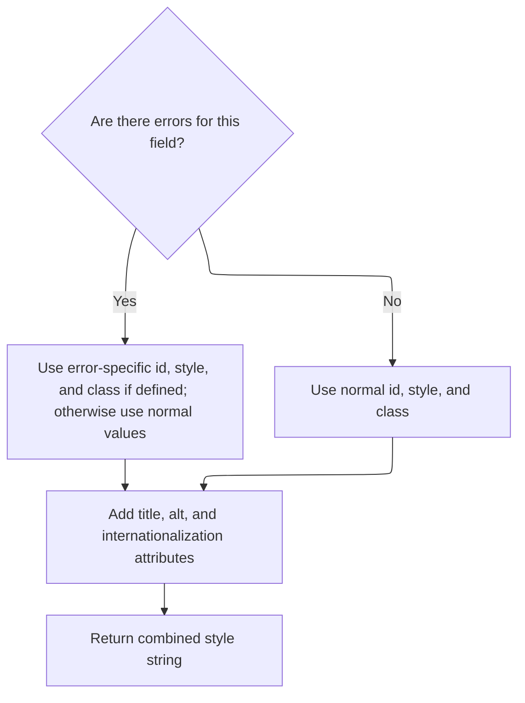

This document outlines how an HTML form element is constructed for display, including the addition of event handlers and conditional styling. The process adapts the element's appearance if validation errors are present, ensuring users receive appropriate feedback. The input is the tag configuration and context, and the output is a fully rendered HTML element written to the page.

# Building the HTML Element and Handling Events

<SwmSnippet path="/taglib/src/main/java/org/apache/struts/taglib/html/SubmitTag.java" line="130">

---

In <SwmToken path="taglib/src/main/java/org/apache/struts/taglib/html/SubmitTag.java" pos="130:5:5" line-data="    public int doEndTag() throws JspException {">`doEndTag`</SwmToken>, we're starting to assemble the HTML element by appending the opening tag, name, and button-specific attributes. Next, we call <SwmToken path="taglib/src/main/java/org/apache/struts/taglib/html/SubmitTag.java" pos="137:5:5" line-data="        results.append(prepareEventHandlers());">`prepareEventHandlers`</SwmToken> from <SwmToken path="taglib/src/main/java/org/apache/struts/taglib/html/SubmitTag.java" pos="34:8:8" line-data="public class SubmitTag extends BaseHandlerTag {">`BaseHandlerTag`</SwmToken> to add any <SwmToken path="taglib/src/main/java/org/apache/struts/taglib/html/BaseHandlerTag.java" pos="42:3:3" line-data=" * JavaScript event handlers and/or CSS Style attributes. This class does not">`JavaScript`</SwmToken> event handlers right after the basic attributes, keeping the tag structure clean and modular.

```java
    public int doEndTag() throws JspException {
        // Generate an HTML element
        StringBuffer results = new StringBuffer();

        results.append(getElementOpen());
        prepareAttribute(results, "name", prepareName());
        prepareButtonAttributes(results);
        results.append(prepareEventHandlers());
```

---

</SwmSnippet>

<SwmSnippet path="/taglib/src/main/java/org/apache/struts/taglib/html/BaseHandlerTag.java" line="1039">

---

<SwmToken path="taglib/src/main/java/org/apache/struts/taglib/html/BaseHandlerTag.java" pos="1039:5:5" line-data="    protected String prepareEventHandlers() {">`prepareEventHandlers`</SwmToken> just collects all the event handler attributes (mouse, key, text, focus) into a single string. Each group is handled by its own method, so the output is a concatenation of whatever handlers are set up for this tag.

```java
    protected String prepareEventHandlers() {
        StringBuffer handlers = new StringBuffer();

        prepareMouseEvents(handlers);
        prepareKeyEvents(handlers);
        prepareTextEvents(handlers);
        prepareFocusEvents(handlers);

        return handlers.toString();
    }
```

---

</SwmSnippet>

<SwmSnippet path="/taglib/src/main/java/org/apache/struts/taglib/html/SubmitTag.java" line="138">

---

Back in `SubmitTag.doEndTag`, after adding event handlers, we immediately pull in the style attributes by calling <SwmToken path="taglib/src/main/java/org/apache/struts/taglib/html/SubmitTag.java" pos="138:5:5" line-data="        results.append(prepareStyles());">`prepareStyles`</SwmToken> from <SwmToken path="taglib/src/main/java/org/apache/struts/taglib/html/SubmitTag.java" pos="34:8:8" line-data="public class SubmitTag extends BaseHandlerTag {">`BaseHandlerTag`</SwmToken>. This keeps all the style-related HTML attributes together, right after the event handlers.

```java
        results.append(prepareStyles());
```

---

</SwmSnippet>

## Applying Conditional Styles Based on Errors



<SwmSnippet path="/taglib/src/main/java/org/apache/struts/taglib/html/BaseHandlerTag.java" line="967">

---

In <SwmToken path="taglib/src/main/java/org/apache/struts/taglib/html/BaseHandlerTag.java" pos="967:5:5" line-data="    protected String prepareStyles()">`prepareStyles`</SwmToken>, we check if there are any errors for this tag using <SwmToken path="taglib/src/main/java/org/apache/struts/taglib/html/BaseHandlerTag.java" pos="971:7:7" line-data="        boolean errorsExist = doErrorsExist();">`doErrorsExist`</SwmToken>. This decides whether to use the normal style attributes or switch to the error-specific ones for the HTML output.

```java
    protected String prepareStyles()
        throws JspException {
        StringBuffer styles = new StringBuffer();

        boolean errorsExist = doErrorsExist();

```

---

</SwmSnippet>

<SwmSnippet path="/taglib/src/main/java/org/apache/struts/taglib/html/BaseHandlerTag.java" line="1003">

---

<SwmToken path="taglib/src/main/java/org/apache/struts/taglib/html/BaseHandlerTag.java" pos="1003:5:5" line-data="    protected boolean doErrorsExist()">`doErrorsExist`</SwmToken> checks if any error style attributes are set and then looks up error messages for this tag's name in the page context. If there are errors, it returns true so the style logic can switch to error-specific attributes.

```java
    protected boolean doErrorsExist()
        throws JspException {
        boolean errorsExist = false;

        if ((getErrorStyleId() != null) || (getErrorStyle() != null)
            || (getErrorStyleClass() != null)) {
            String actualName = prepareName();

            if (actualName != null) {
                ActionMessages errors =
                    TagUtils.getInstance().getActionMessages(pageContext,
                        errorKey);

                errorsExist = ((errors != null)
                    && (errors.size(actualName) > 0));
            }
        }

        return errorsExist;
    }
```

---

</SwmSnippet>

<SwmSnippet path="/taglib/src/main/java/org/apache/struts/taglib/html/BaseHandlerTag.java" line="973">

---

After coming back from <SwmToken path="taglib/src/main/java/org/apache/struts/taglib/html/BaseHandlerTag.java" pos="971:7:7" line-data="        boolean errorsExist = doErrorsExist();">`doErrorsExist`</SwmToken>, <SwmToken path="taglib/src/main/java/org/apache/struts/taglib/html/SubmitTag.java" pos="138:5:5" line-data="        results.append(prepareStyles());">`prepareStyles`</SwmToken> picks either the error or normal style attributes and appends them. It also adds localized title and alt attributes, and calls <SwmToken path="taglib/src/main/java/org/apache/struts/taglib/html/BaseHandlerTag.java" pos="993:1:1" line-data="        prepareInternationalization(styles);">`prepareInternationalization`</SwmToken> to handle any extra i18n attributes before returning the final style string.

```java
        if (errorsExist && (getErrorStyleId() != null)) {
            prepareAttribute(styles, "id", getErrorStyleId());
        } else {
            prepareAttribute(styles, "id", getStyleId());
        }

        if (errorsExist && (getErrorStyle() != null)) {
            prepareAttribute(styles, "style", getErrorStyle());
        } else {
            prepareAttribute(styles, "style", getStyle());
        }

        if (errorsExist && (getErrorStyleClass() != null)) {
            prepareAttribute(styles, "class", getErrorStyleClass());
        } else {
            prepareAttribute(styles, "class", getStyleClass());
        }

        prepareAttribute(styles, "title", message(getTitle(), getTitleKey()));
        prepareAttribute(styles, "alt", message(getAlt(), getAltKey()));
        prepareInternationalization(styles);

        return styles.toString();
    }
```

---

</SwmSnippet>

## Finalizing and Outputting the HTML Element

<SwmSnippet path="/taglib/src/main/java/org/apache/struts/taglib/html/SubmitTag.java" line="139">

---

After getting the styles from <SwmToken path="taglib/src/main/java/org/apache/struts/taglib/html/SubmitTag.java" pos="34:8:8" line-data="public class SubmitTag extends BaseHandlerTag {">`BaseHandlerTag`</SwmToken>, `SubmitTag.doEndTag` finishes up by adding any remaining attributes, closing the tag, and writing the complete HTML to the page. Returning <SwmToken path="taglib/src/main/java/org/apache/struts/taglib/html/SubmitTag.java" pos="144:4:4" line-data="        return (EVAL_PAGE);">`EVAL_PAGE`</SwmToken> just tells JSP to keep processing the rest of the page.

```java
        prepareOtherAttributes(results);
        results.append(getElementClose());

        TagUtils.getInstance().write(pageContext, results.toString());

        return (EVAL_PAGE);
    }
```

---

</SwmSnippet>

&nbsp;

*This is an auto-generated document by Swimm 🌊 and has not yet been verified by a human*

<SwmMeta version="3.0.0" repo-id="Z2l0aHViJTNBJTNBc3RydXRzMSUzQSUzQVN3aW1tLURlbW8=" repo-name="struts1"><sup>Powered by [Swimm](https://app.swimm.io/)</sup></SwmMeta>
