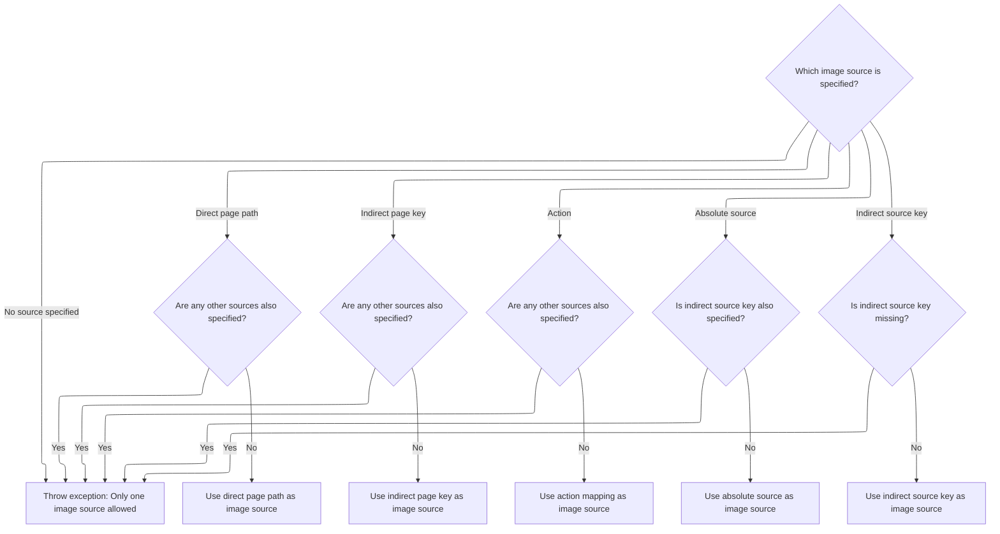
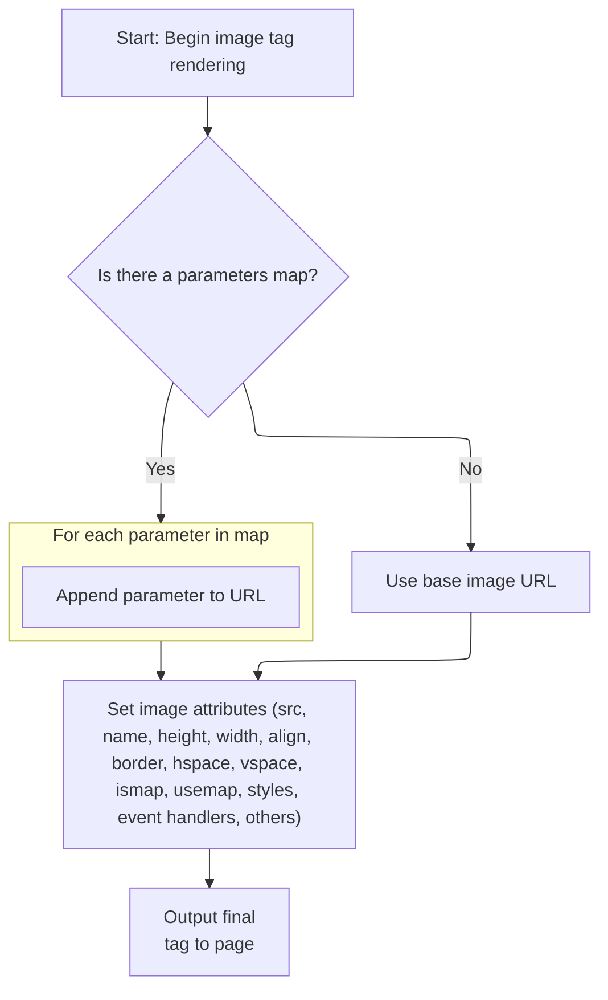

This document describes the process of rendering an HTML image tag as part of web page generation. The flow takes image tag parameters and context, determines the correct image source URL, builds the final URL with any query parameters, and outputs the  tag with all specified attributes to the page.

# Rendering the image tag output

<SwmSnippet path="/taglib/src/main/java/org/apache/struts/taglib/html/ImgTag.java" line="385">

---

In <SwmToken path="taglib/src/main/java/org/apache/struts/taglib/html/ImgTag.java" pos="385:5:5" line-data="    public int doEndTag() throws JspException {">`doEndTag`</SwmToken>, we start by grabbing the response and prepping the  tag markup. The next step is to call src(), since we need the image source URL before adding any other attributes. Without a valid src, the tag doesn't make sense.

```java
    public int doEndTag() throws JspException {
        // Generate the name definition or image element
        HttpServletResponse response =
            (HttpServletResponse) pageContext.getResponse();
        StringBuffer results = new StringBuffer("

## Resolving the image source URL



<SwmSnippet path="/taglib/src/main/java/org/apache/struts/taglib/html/ImgTag.java" line="476">

---

In <SwmToken path="taglib/src/main/java/org/apache/struts/taglib/html/ImgTag.java" pos="476:5:5" line-data="    protected String src() throws JspException {">`src`</SwmToken>, we check which instance variable is set (page, <SwmToken path="taglib/src/main/java/org/apache/struts/taglib/html/ImgTag.java" pos="486:6:6" line-data="                || (this.pageKey != null)) {">`pageKey`</SwmToken>, action, src, <SwmToken path="taglib/src/main/java/org/apache/struts/taglib/html/ImgTag.java" pos="485:19:19" line-data="            if ((this.src != null) || (this.srcKey != null)">`srcKey`</SwmToken>) and throw if more than one is set. Depending on which is present, we resolve the image URL using Struts utilities. If action is set, we call TagUtils.getActionMappingURL next to build the action-based URL.

```java
    protected String src() throws JspException {
        ModuleConfig moduleConfig =
            ModuleUtils.getInstance().getModuleConfig(this.module,
                (HttpServletRequest) pageContext.getRequest(),
                pageContext.getServletContext());


        // Deal with a direct context-relative page that has been specified
        if (this.page != null) {
            if ((this.src != null) || (this.srcKey != null)
                || (this.pageKey != null)) {
                throwImgTagSrcException();
            }

            HttpServletRequest request =
                (HttpServletRequest) pageContext.getRequest();
            String pageValue = this.page;

            if (!srcDefaultReference(moduleConfig)) {
                pageValue =
                    TagUtils.getInstance().pageURL(request, this.page, moduleConfig);
            }

            return (request.getContextPath() + pageValue);
        }

        // Deal with an indirect context-relative page that has been specified
        if (this.pageKey != null) {
            if ((this.src != null) || (this.srcKey != null)) {
                throwImgTagSrcException();
            }

            HttpServletRequest request =
                (HttpServletRequest) pageContext.getRequest();
            String pageValue =
                TagUtils.getInstance().message(pageContext, getBundle(),
                    getLocale(), this.pageKey);

            if (!srcDefaultReference(moduleConfig)) {
                pageValue =
                    TagUtils.getInstance().pageURL(request, pageValue, moduleConfig);
            }

            return (request.getContextPath() + pageValue);
        }

        if (this.action != null) {
            if ((this.src != null) || (this.srcKey != null)) {
                throwImgTagSrcException();
            }

            // Translate the action if it is an actionId
            ActionConfig actionConfig = moduleConfig.findActionConfigId(this.action);
            if (actionConfig != null) {
                action = actionConfig.getPath();
            }

            return TagUtils.getInstance().getActionMappingURL(action, module,
                pageContext, false);
        }

```

---

</SwmSnippet>

<SwmSnippet path="/taglib/src/main/java/org/apache/struts/taglib/TagUtils.java" line="654">

---

<SwmToken path="taglib/src/main/java/org/apache/struts/taglib/TagUtils.java" pos="654:5:5" line-data="    public String getActionMappingURL(String action, String module,">`getActionMappingURL`</SwmToken> builds the action URL based on servlet mapping patterns (extension, prefix, default), handles query strings, and adds module prefixes if needed. This lets Struts generate URLs that match the app's routing setup.

```java
    public String getActionMappingURL(String action, String module,
        PageContext pageContext, boolean contextRelative) {
        HttpServletRequest request =
            (HttpServletRequest) pageContext.getRequest();

        String contextPath = request.getContextPath();
        StringBuffer value = new StringBuffer();

        // Avoid setting two slashes at the beginning of an action:
        //  the length of contextPath should be more than 1
        //  in case of non-root context, otherwise length==1 (the slash)
        if (contextPath.length() > 1) {
            value.append(contextPath);
        }

        ModuleConfig moduleConfig = getModuleConfig(module, pageContext);

        if ((moduleConfig != null) && (!contextRelative)) {
            value.append(moduleConfig.getPrefix());
        }

        // Use our servlet mapping, if one is specified
        String servletMapping =
            (String) pageContext.getAttribute(Globals.SERVLET_KEY,
                PageContext.APPLICATION_SCOPE);

        if (servletMapping != null) {
            String queryString = null;
            int question = action.indexOf("?");

            if (question >= 0) {
                queryString = action.substring(question);
            }

            String actionMapping = getActionMappingName(action);

            if (servletMapping.startsWith("*.")) {
                value.append(actionMapping);
                value.append(servletMapping.substring(1));
            } else if (servletMapping.endsWith("/*")) {
                value.append(servletMapping.substring(0,
                        servletMapping.length() - 2));
                value.append(actionMapping);
            } else if (servletMapping.equals("/")) {
                value.append(actionMapping);
            }

            if (queryString != null) {
                value.append(queryString);
            }
        }
        // Otherwise, assume extension mapping is in use and extension is
        // already included in the action property
        else {
            if (!action.startsWith("/")) {
                value.append("/");
            }

            value.append(action);
        }

        return value.toString();
    }
```

---

</SwmSnippet>

<SwmSnippet path="/taglib/src/main/java/org/apache/struts/taglib/html/ImgTag.java" line="537">

---

Back in <SwmToken path="taglib/src/main/java/org/apache/struts/taglib/html/ImgTag.java" pos="538:6:6" line-data="        if (this.src != null) {">`src`</SwmToken>, after getting the URL from <SwmToken path="taglib/src/main/java/org/apache/struts/taglib/html/ImgTag.java" pos="551:3:3" line-data="        return TagUtils.getInstance().message(pageContext, getBundle(),">`TagUtils`</SwmToken>, we handle absolute and indirect sources. Only one variable should be set, and if not, we throw. The returned value is either the direct src, a resolved message, or the URL built by <SwmToken path="taglib/src/main/java/org/apache/struts/taglib/html/ImgTag.java" pos="551:3:3" line-data="        return TagUtils.getInstance().message(pageContext, getBundle(),">`TagUtils`</SwmToken>.

```java
        // Deal with an absolute source that has been specified
        if (this.src != null) {
            if (this.srcKey != null) {
                throwImgTagSrcException();
            }

            return (this.src);
        }

        // Deal with an indirect source that has been specified
        if (this.srcKey == null) {
            throwImgTagSrcException();
        }

        return TagUtils.getInstance().message(pageContext, getBundle(),
            getLocale(), this.srcKey);
    }
```

---

</SwmSnippet>

## Building the final image URL



<SwmSnippet path="/taglib/src/main/java/org/apache/struts/taglib/html/ImgTag.java" line="391">

---

In <SwmToken path="taglib/src/main/java/org/apache/struts/taglib/html/ImgTag.java" pos="385:5:5" line-data="    public int doEndTag() throws JspException {">`doEndTag`</SwmToken>, after getting the base image URL from src(), we call url() to handle any extra query parameters or encoding. This step ensures the image source is fully constructed before rendering.

```java
        String srcurl = url(tmp);

```

---

</SwmSnippet>

<SwmSnippet path="/taglib/src/main/java/org/apache/struts/taglib/html/ImgTag.java" line="563">

---

<SwmToken path="taglib/src/main/java/org/apache/struts/taglib/html/ImgTag.java" pos="563:5:5" line-data="    protected String url(String url)">`url`</SwmToken> takes the base URL and appends query parameters if paramId/paramName are set or if there's a map in the page context. It handles encoding and separators, so the final URL is ready for use in the tag.

```java
    protected String url(String url)
        throws JspException {
        if (url == null) {
            return (url);
        }

        String charEncoding = "UTF-8";

        if (useLocalEncoding) {
            charEncoding = pageContext.getResponse().getCharacterEncoding();
        }

        // Start with an unadorned URL as specified
        StringBuffer src = new StringBuffer(url);

        // Append a single-parameter name and value, if requested
        if ((paramId != null) && (paramName != null)) {
            if (src.toString().indexOf('?') < 0) {
                src.append('?');
            } else {
                src.append("&amp;");
            }

            src.append(paramId);
            src.append('=');

            Object value =
                TagUtils.getInstance().lookup(pageContext, paramName,
                    paramProperty, paramScope);

            if (value != null) {
                src.append(TagUtils.getInstance().encodeURL(value.toString(),
                        charEncoding));
            }
        }

        // Just return the URL if there is no bean to look up
        if ((property != null) && (name == null)) {
            JspException e =
                new JspException(messages.getMessage("getter.name"));

            TagUtils.getInstance().saveException(pageContext, e);
            throw e;
        }

        if (name == null) {
            return (src.toString());
        }

        // Look up the map we will be using
        Object mapObject =
            TagUtils.getInstance().lookup(pageContext, name, property, scope);
        Map map = null;

        try {
            map = (Map) mapObject;
        } catch (ClassCastException e) {
            TagUtils.getInstance().saveException(pageContext, e);
            throw new JspException(messages.getMessage("imgTag.type"), e);
        }

        // Append the required query parameters
        boolean question = (src.toString().indexOf("?") >= 0);
        Iterator keys = map.keySet().iterator();

        while (keys.hasNext()) {
            String key = (String) keys.next();
            Object value = map.get(key);

            if (value == null) {
                if (question) {
                    src.append("&amp;");
                } else {
                    src.append('?');
                    question = true;
                }

                src.append(key);
                src.append('=');

                // Interpret null as "no value specified"
            } else if (value instanceof String[]) {
                String[] values = (String[]) value;

                for (int i = 0; i < values.length; i++) {
                    if (question) {
                        src.append("&amp;");
                    } else {
                        src.append('?');
                        question = true;
                    }

                    src.append(key);
                    src.append('=');
                    src.append(TagUtils.getInstance().encodeURL(values[i],
                            charEncoding));
                }
            } else {
                if (question) {
                    src.append("&amp;");
                } else {
                    src.append('?');
                    question = true;
                }

                src.append(key);
                src.append('=');
                src.append(TagUtils.getInstance().encodeURL(value.toString(),
                        charEncoding));
            }
        }
```

---

</SwmSnippet>

<SwmSnippet path="/taglib/src/main/java/org/apache/struts/taglib/html/ImgTag.java" line="393">

---

Back in <SwmToken path="taglib/src/main/java/org/apache/struts/taglib/html/ImgTag.java" pos="385:5:5" line-data="    public int doEndTag() throws JspException {">`doEndTag`</SwmToken>, after url() returns, we set the src attribute if srcurl is valid, then add all other attributes and write the tag to the page. If srcurl is null, the src attribute is skipped.

```java
        if (srcurl != null) {
            prepareAttribute(results, "src", response.encodeURL(srcurl));
        }

        prepareAttribute(results, "name", getImageName());
        prepareAttribute(results, "height", getHeight());
        prepareAttribute(results, "width", getWidth());
        prepareAttribute(results, "align", getAlign());
        prepareAttribute(results, "border", getBorder());
        prepareAttribute(results, "hspace", getHspace());
        prepareAttribute(results, "vspace", getVspace());
        prepareAttribute(results, "ismap", getIsmap());
        prepareAttribute(results, "usemap", getUsemap());
        results.append(prepareStyles());
        results.append(prepareEventHandlers());
        prepareOtherAttributes(results);
        results.append(getElementClose());

        TagUtils.getInstance().write(pageContext, results.toString());

        return (EVAL_PAGE);
    }
```

---

</SwmSnippet>

&nbsp;

*This is an auto-generated document by Swimm 🌊 and has not yet been verified by a human*

<SwmMeta version="3.0.0" repo-id="Z2l0aHViJTNBJTNBc3RydXRzMSUzQSUzQVN3aW1tLURlbW8=" repo-name="struts1"><sup>Powered by [Swimm](https://app.swimm.io/)</sup></SwmMeta>
