This document explains how an image tag is rendered on a web page. The flow receives information about the desired image and its attributes, and produces a fully constructed image tag that is compatible with the current module, localization, and rendering mode. Styles, event handlers, and accessibility features are included to ensure a complete and user-friendly result.

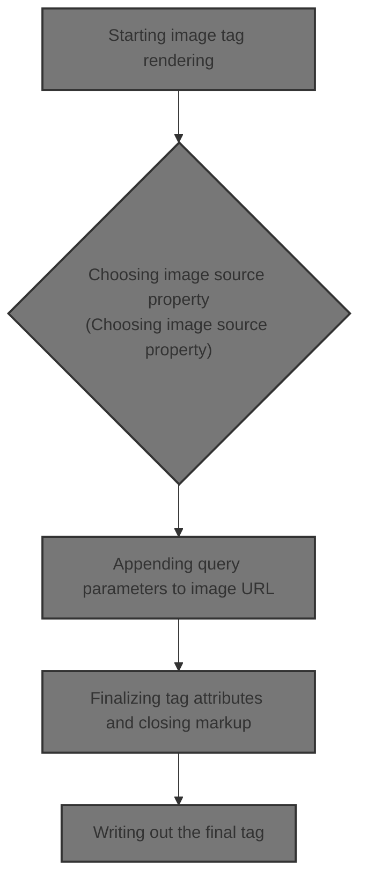

# Starting image tag rendering

```mermaid
%%{init: {"flowchart": {"defaultRenderer": "elk"}} }%%
flowchart TD
  node1["Start building image tag"] --> node2["Retrieving servlet response context"]
  click node1 openCode "taglib/src/main/java/org/apache/struts/taglib/html/ImgTag.java:385:388"
  
  node2 --> node3["Start <img> tag"]
  click node3 openCode "taglib/src/main/java/org/apache/struts/taglib/html/ImgTag.java:389:390"
  node3 --> node4["Resolving image source URL"]
  
  node4 --> node5["Appending query parameters to image URL"]
  
  node5 --> node6{"Is image URL present?"}
  click node6 openCode "taglib/src/main/java/org/apache/struts/taglib/html/ImgTag.java:393:395"
  node6 -->|"Yes"| node7["Add src attribute to <img>"]
  click node7 openCode "taglib/src/main/java/org/apache/struts/taglib/html/ImgTag.java:394:395"
  node6 -->|"No"| node8["Continue without src attribute"]
  click node8 openCode "taglib/src/main/java/org/apache/struts/taglib/html/ImgTag.java:395:397"
  node7 --> node9["Add image attributes: name, height,
width, align, border, hspace, vspace,
ismap, usemap"]
  click node9 openCode "taglib/src/main/java/org/apache/struts/taglib/html/ImgTag.java:397:405"
  node8 --> node9
  node9 --> node10["Assembling style attributes"]
  
  node10 --> node11["Wiring up event and state attributes"]
  
  node11 --> node12["Add other custom attributes"]
  click node12 openCode "taglib/src/main/java/org/apache/struts/taglib/html/ImgTag.java:408:408"
  node12 --> node13["Detecting XHTML rendering mode"]
  
  node13 --> node14["Looking up XHTML mode flag"]
  
  node14 --> node15{"Is XHTML required?"}
  node15 -->|"Yes"| node16["Choosing tag close style"]
  
  node15 -->|"No"| node17["Choosing tag close style"]
  
  node16 --> node18["Writing out the final tag"]
  
  node17 --> node18

classDef HeadingStyle fill:#777777,stroke:#333,stroke-width:2px;
click node2 goToHeading "Retrieving servlet response context"
node2:::HeadingStyle
click node4 goToHeading "Resolving image source URL"
node4:::HeadingStyle
click node5 goToHeading "Appending query parameters to image URL"
node5:::HeadingStyle
click node10 goToHeading "Assembling style attributes"
node10:::HeadingStyle
click node11 goToHeading "Wiring up event and state attributes"
node11:::HeadingStyle
click node13 goToHeading "Detecting XHTML rendering mode"
node13:::HeadingStyle
click node14 goToHeading "Looking up XHTML mode flag"
node14:::HeadingStyle
click node16 goToHeading "Choosing tag close style"
node16:::HeadingStyle
click node17 goToHeading "Choosing tag close style"
node17:::HeadingStyle
click node18 goToHeading "Writing out the final tag"
node18:::HeadingStyle

%% Swimm:
%% %%{init: {"flowchart": {"defaultRenderer": "elk"}} }%%
%% flowchart TD
%%   node1["Start building image tag"] --> node2["Retrieving servlet response context"]
%%   click node1 openCode "<SwmPath>[taglib/…/html/ImgTag.java](taglib/src/main/java/org/apache/struts/taglib/html/ImgTag.java)</SwmPath>:385:388"
%%   
%%   node2 --> node3["Start <img> tag"]
%%   click node3 openCode "<SwmPath>[taglib/…/html/ImgTag.java](taglib/src/main/java/org/apache/struts/taglib/html/ImgTag.java)</SwmPath>:389:390"
%%   node3 --> node4["Resolving image source URL"]
%%   
%%   node4 --> node5["Appending query parameters to image URL"]
%%   
%%   node5 --> node6{"Is image URL present?"}
%%   click node6 openCode "<SwmPath>[taglib/…/html/ImgTag.java](taglib/src/main/java/org/apache/struts/taglib/html/ImgTag.java)</SwmPath>:393:395"
%%   node6 -->|"Yes"| node7["Add src attribute to <img>"]
%%   click node7 openCode "<SwmPath>[taglib/…/html/ImgTag.java](taglib/src/main/java/org/apache/struts/taglib/html/ImgTag.java)</SwmPath>:394:395"
%%   node6 -->|"No"| node8["Continue without src attribute"]
%%   click node8 openCode "<SwmPath>[taglib/…/html/ImgTag.java](taglib/src/main/java/org/apache/struts/taglib/html/ImgTag.java)</SwmPath>:395:397"
%%   node7 --> node9["Add image attributes: name, height,
%% width, align, border, hspace, vspace,
%% ismap, usemap"]
%%   click node9 openCode "<SwmPath>[taglib/…/html/ImgTag.java](taglib/src/main/java/org/apache/struts/taglib/html/ImgTag.java)</SwmPath>:397:405"
%%   node8 --> node9
%%   node9 --> node10["Assembling style attributes"]
%%   
%%   node10 --> node11["Wiring up event and state attributes"]
%%   
%%   node11 --> node12["Add other custom attributes"]
%%   click node12 openCode "<SwmPath>[taglib/…/html/ImgTag.java](taglib/src/main/java/org/apache/struts/taglib/html/ImgTag.java)</SwmPath>:408:408"
%%   node12 --> node13["Detecting XHTML rendering mode"]
%%   
%%   node13 --> node14["Looking up XHTML mode flag"]
%%   
%%   node14 --> node15{"Is XHTML required?"}
%%   node15 -->|"Yes"| node16["Choosing tag close style"]
%%   
%%   node15 -->|"No"| node17["Choosing tag close style"]
%%   
%%   node16 --> node18["Writing out the final tag"]
%%   
%%   node17 --> node18
%% 
%% classDef HeadingStyle fill:#777777,stroke:#333,stroke-width:2px;
%% click node2 goToHeading "Retrieving servlet response context"
%% node2:::HeadingStyle
%% click node4 goToHeading "Resolving image source URL"
%% node4:::HeadingStyle
%% click node5 goToHeading "Appending query parameters to image URL"
%% node5:::HeadingStyle
%% click node10 goToHeading "Assembling style attributes"
%% node10:::HeadingStyle
%% click node11 goToHeading "Wiring up event and state attributes"
%% node11:::HeadingStyle
%% click node13 goToHeading "Detecting XHTML rendering mode"
%% node13:::HeadingStyle
%% click node14 goToHeading "Looking up XHTML mode flag"
%% node14:::HeadingStyle
%% click node16 goToHeading "Choosing tag close style"
%% node16:::HeadingStyle
%% click node17 goToHeading "Choosing tag close style"
%% node17:::HeadingStyle
%% click node18 goToHeading "Writing out the final tag"
%% node18:::HeadingStyle
```

<SwmSnippet path="/taglib/src/main/java/org/apache/struts/taglib/html/ImgTag.java" line="385">

---

In <SwmToken path="taglib/src/main/java/org/apache/struts/taglib/html/ImgTag.java" pos="385:5:5" line-data="    public int doEndTag() throws JspException {">`doEndTag`</SwmToken>, we grab the <SwmToken path="taglib/src/main/java/org/apache/struts/taglib/html/ImgTag.java" pos="387:1:1" line-data="        HttpServletResponse response =">`HttpServletResponse`</SwmToken> from the page context. This lets us encode URLs later, which is why we need to call <SwmToken path="core/src/main/java/org/apache/struts/chain/contexts/ServletActionContext.java" pos="39:4:4" line-data="public class ServletActionContext extends WebActionContext {">`ServletActionContext`</SwmToken> next—to get access to servlet-specific context for URL handling.

```java
    public int doEndTag() throws JspException {
        // Generate the name definition or image element
        HttpServletResponse response =
            (HttpServletResponse) pageContext.getResponse();
```

---

</SwmSnippet>

## Retrieving servlet response context

<SwmSnippet path="/core/src/main/java/org/apache/struts/chain/contexts/ServletActionContext.java" line="103">

---

<SwmToken path="core/src/main/java/org/apache/struts/chain/contexts/ServletActionContext.java" pos="103:5:5" line-data="    public HttpServletResponse getResponse() {">`getResponse`</SwmToken> just delegates to <SwmToken path="core/src/main/java/org/apache/struts/chain/contexts/ServletActionContext.java" pos="104:3:5" line-data="        return servletWebContext().getResponse();">`servletWebContext()`</SwmToken><SwmToken path="core/src/main/java/org/apache/struts/chain/contexts/ServletActionContext.java" pos="104:6:9" line-data="        return servletWebContext().getResponse();">`.getResponse()`</SwmToken>, so we rely on the base context being a <SwmToken path="core/src/main/java/org/apache/struts/chain/contexts/ServletActionContext.java" pos="67:3:3" line-data="    protected ServletWebContext servletWebContext() {">`ServletWebContext`</SwmToken>. This is needed to access servlet-specific response methods.

```java
    public HttpServletResponse getResponse() {
        return servletWebContext().getResponse();
    }
```

---

</SwmSnippet>

<SwmSnippet path="/core/src/main/java/org/apache/struts/chain/contexts/ServletActionContext.java" line="67">

---

<SwmToken path="core/src/main/java/org/apache/struts/chain/contexts/ServletActionContext.java" pos="67:5:5" line-data="    protected ServletWebContext servletWebContext() {">`servletWebContext`</SwmToken> just casts <SwmToken path="core/src/main/java/org/apache/struts/chain/contexts/ServletActionContext.java" pos="68:9:11" line-data="        return (ServletWebContext) this.getBaseContext();">`getBaseContext()`</SwmToken> to <SwmToken path="core/src/main/java/org/apache/struts/chain/contexts/ServletActionContext.java" pos="67:3:3" line-data="    protected ServletWebContext servletWebContext() {">`ServletWebContext`</SwmToken> and returns it. No checks, so it assumes the base context is always the right type. Standard pattern, but risky if the context changes.

```java
    protected ServletWebContext servletWebContext() {
        return (ServletWebContext) this.getBaseContext();
    }
```

---

</SwmSnippet>

## Building image tag markup

<SwmSnippet path="/taglib/src/main/java/org/apache/struts/taglib/html/ImgTag.java" line="389">

---

Back in ImgTag.doEndTag, after getting the response, we start building the  tag markup and call src() to resolve the image URL. This lets us handle dynamic paths and module-specific images.

```java
        StringBuffer results = new StringBuffer("

## Resolving image source URL

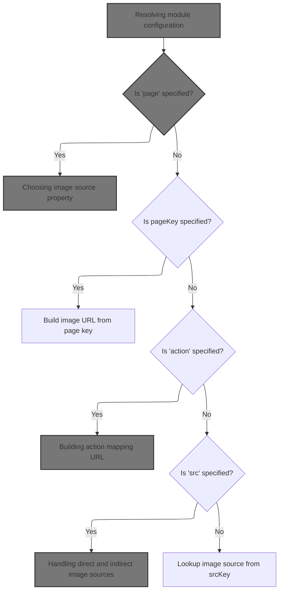

<SwmSnippet path="/taglib/src/main/java/org/apache/struts/taglib/html/ImgTag.java" line="476">

---

In <SwmToken path="taglib/src/main/java/org/apache/struts/taglib/html/ImgTag.java" pos="476:5:5" line-data="    protected String src() throws JspException {">`src`</SwmToken>, we grab the module config using <SwmToken path="taglib/src/main/java/org/apache/struts/taglib/html/ImgTag.java" pos="478:1:1" line-data="            ModuleUtils.getInstance().getModuleConfig(this.module,">`ModuleUtils`</SwmToken>. This is needed to resolve URLs relative to the current module, so we call <SwmToken path="taglib/src/main/java/org/apache/struts/taglib/html/ImgTag.java" pos="478:1:1" line-data="            ModuleUtils.getInstance().getModuleConfig(this.module,">`ModuleUtils`</SwmToken> next to get the right config for the request.

```java
    protected String src() throws JspException {
        ModuleConfig moduleConfig =
            ModuleUtils.getInstance().getModuleConfig(this.module,
                (HttpServletRequest) pageContext.getRequest(),
                pageContext.getServletContext());


```

---

</SwmSnippet>

### Resolving module configuration

<SwmSnippet path="/core/src/main/java/org/apache/struts/util/ModuleUtils.java" line="108">

---

<SwmToken path="core/src/main/java/org/apache/struts/util/ModuleUtils.java" pos="108:5:5" line-data="    public ModuleConfig getModuleConfig(String prefix,">`getModuleConfig`</SwmToken> checks if a prefix is given; if not, it uses the request/context to find the current module config. This ensures we get the right config for the current request.

```java
    public ModuleConfig getModuleConfig(String prefix,
        HttpServletRequest request, ServletContext context) {
        ModuleConfig moduleConfig = null;

        if (prefix != null) {
            //lookup module stored with the given prefix.
            moduleConfig = this.getModuleConfig(prefix, context);
        } else {
            //return the current module if no prefix was supplied.
            moduleConfig = this.getModuleConfig(request, context);
        }

        return moduleConfig;
    }
```

---

</SwmSnippet>

<SwmSnippet path="/core/src/main/java/org/apache/struts/util/ModuleUtils.java" line="130">

---

<SwmToken path="core/src/main/java/org/apache/struts/util/ModuleUtils.java" pos="117:7:13" line-data="            moduleConfig = this.getModuleConfig(request, context);">`getModuleConfig(request, context)`</SwmToken> first tries to get the config from the request. If that's null, it falls back to the default module using an empty string and sets it in the request attributes. This fallback isn't obvious from the signature.

```java
    public ModuleConfig getModuleConfig(HttpServletRequest request,
        ServletContext context) {
        ModuleConfig moduleConfig = this.getModuleConfig(request);

        if (moduleConfig == null) {
            moduleConfig = this.getModuleConfig("", context);
            request.setAttribute(Globals.MODULE_KEY, moduleConfig);
        }

        return moduleConfig;
    }
```

---

</SwmSnippet>

### Choosing image source property

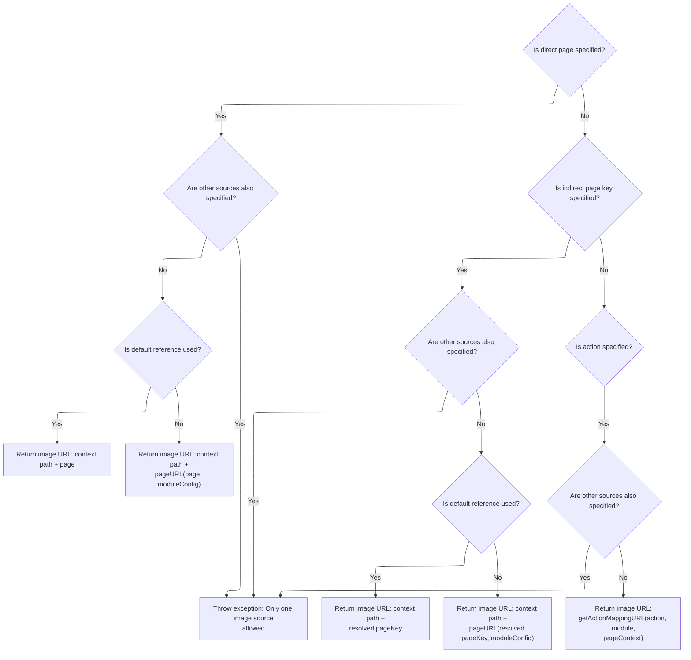

<SwmSnippet path="/taglib/src/main/java/org/apache/struts/taglib/html/ImgTag.java" line="483">

---

Back in ImgTag.src, after getting the module config, we check which property (page, <SwmToken path="taglib/src/main/java/org/apache/struts/taglib/html/ImgTag.java" pos="486:6:6" line-data="                || (this.pageKey != null)) {">`pageKey`</SwmToken>, action, src, <SwmToken path="taglib/src/main/java/org/apache/struts/taglib/html/ImgTag.java" pos="485:19:19" line-data="            if ((this.src != null) || (this.srcKey != null)">`srcKey`</SwmToken>) is set. Only one can be used, so we throw if there's a conflict. Next, we grab the request object to build the URL.

```java
        // Deal with a direct context-relative page that has been specified
        if (this.page != null) {
            if ((this.src != null) || (this.srcKey != null)
                || (this.pageKey != null)) {
                throwImgTagSrcException();
            }

            HttpServletRequest request =
                (HttpServletRequest) pageContext.getRequest();
```

---

</SwmSnippet>

<SwmSnippet path="/core/src/main/java/org/apache/struts/chain/contexts/ServletActionContext.java" line="94">

---

<SwmToken path="core/src/main/java/org/apache/struts/chain/contexts/ServletActionContext.java" pos="94:5:5" line-data="    public HttpServletRequest getRequest() {">`getRequest`</SwmToken> just delegates to <SwmToken path="core/src/main/java/org/apache/struts/chain/contexts/ServletActionContext.java" pos="95:3:5" line-data="        return servletWebContext().getRequest();">`servletWebContext()`</SwmToken><SwmToken path="core/src/main/java/org/apache/struts/chain/contexts/ServletActionContext.java" pos="95:6:9" line-data="        return servletWebContext().getRequest();">`.getRequest()`</SwmToken>, so we rely on the base context being a <SwmToken path="core/src/main/java/org/apache/struts/chain/contexts/ServletActionContext.java" pos="67:3:3" line-data="    protected ServletWebContext servletWebContext() {">`ServletWebContext`</SwmToken>. This is needed to access servlet-specific request methods.

```java
    public HttpServletRequest getRequest() {
        return servletWebContext().getRequest();
    }
```

---

</SwmSnippet>

<SwmSnippet path="/taglib/src/main/java/org/apache/struts/taglib/html/ImgTag.java" line="492">

---

Back in ImgTag.src, after getting the request, we check if <SwmToken path="taglib/src/main/java/org/apache/struts/taglib/html/ImgTag.java" pos="494:5:5" line-data="            if (!srcDefaultReference(moduleConfig)) {">`srcDefaultReference`</SwmToken> is false. If so, we use TagUtils.pageURL to build the <SwmToken path="taglib/src/main/java/org/apache/struts/taglib/html/ImgTag.java" pos="96:5:7" line-data="     * The module-relative path, starting with a slash character, of the image">`module-relative`</SwmToken> URL for the image. This handles patterns and prefixes.

```java
            String pageValue = this.page;

            if (!srcDefaultReference(moduleConfig)) {
                pageValue =
                    TagUtils.getInstance().pageURL(request, this.page, moduleConfig);
            }

            return (request.getContextPath() + pageValue);
        }

```

---

</SwmSnippet>

<SwmSnippet path="/taglib/src/main/java/org/apache/struts/taglib/TagUtils.java" line="1031">

---

<SwmToken path="taglib/src/main/java/org/apache/struts/taglib/TagUtils.java" pos="1031:5:5" line-data="    public String pageURL(HttpServletRequest request, String page,">`pageURL`</SwmToken> parses the page pattern and replaces placeholders like $M (module prefix), $P (page), and $$ (literal $). If no pattern, it just concatenates prefix and page. This lets us build URLs based on module config.

```java
    public String pageURL(HttpServletRequest request, String page,
        ModuleConfig moduleConfig) {
        StringBuffer sb = new StringBuffer();
        String pagePattern =
            moduleConfig.getControllerConfig().getPagePattern();

        if (pagePattern == null) {
            sb.append(moduleConfig.getPrefix());
            sb.append(page);
        } else {
            boolean dollar = false;

            for (int i = 0; i < pagePattern.length(); i++) {
                char ch = pagePattern.charAt(i);

                if (dollar) {
                    switch (ch) {
                    case 'M':
                        sb.append(moduleConfig.getPrefix());

                        break;

                    case 'P':
                        sb.append(page);

                        break;

                    case '$':
                        sb.append('$');

                        break;

                    default:
                        ; // Silently swallow
                    }

                    dollar = false;

                    continue;
                } else if (ch == '$') {
                    dollar = true;
                } else {
                    sb.append(ch);
                }
            }
```

---

</SwmSnippet>

<SwmSnippet path="/taglib/src/main/java/org/apache/struts/taglib/html/ImgTag.java" line="502">

---

Back in ImgTag.src, after resolving <SwmToken path="taglib/src/main/java/org/apache/struts/taglib/html/ImgTag.java" pos="503:6:6" line-data="        if (this.pageKey != null) {">`pageKey`</SwmToken> to a message, we use TagUtils.pageURL again to build the <SwmToken path="taglib/src/main/java/org/apache/struts/taglib/html/ImgTag.java" pos="96:5:7" line-data="     * The module-relative path, starting with a slash character, of the image">`module-relative`</SwmToken> URL. This handles localization and dynamic paths.

```java
        // Deal with an indirect context-relative page that has been specified
        if (this.pageKey != null) {
            if ((this.src != null) || (this.srcKey != null)) {
                throwImgTagSrcException();
            }

            HttpServletRequest request =
                (HttpServletRequest) pageContext.getRequest();
```

---

</SwmSnippet>

<SwmSnippet path="/taglib/src/main/java/org/apache/struts/taglib/html/ImgTag.java" line="510">

---

Back in ImgTag.src, after resolving <SwmToken path="taglib/src/main/java/org/apache/struts/taglib/html/ImgTag.java" pos="512:8:8" line-data="                    getLocale(), this.pageKey);">`pageKey`</SwmToken> to a message, we use TagUtils.pageURL again to build the <SwmToken path="taglib/src/main/java/org/apache/struts/taglib/html/ImgTag.java" pos="96:5:7" line-data="     * The module-relative path, starting with a slash character, of the image">`module-relative`</SwmToken> URL. This handles localization and dynamic paths.

```java
            String pageValue =
                TagUtils.getInstance().message(pageContext, getBundle(),
                    getLocale(), this.pageKey);

            if (!srcDefaultReference(moduleConfig)) {
                pageValue =
                    TagUtils.getInstance().pageURL(request, pageValue, moduleConfig);
            }

            return (request.getContextPath() + pageValue);
        }

```

---

</SwmSnippet>

<SwmSnippet path="/taglib/src/main/java/org/apache/struts/taglib/html/ImgTag.java" line="522">

---

Back in ImgTag.src, if action is set, we resolve the action path using <SwmToken path="taglib/src/main/java/org/apache/struts/taglib/html/ImgTag.java" pos="528:7:7" line-data="            ActionConfig actionConfig = moduleConfig.findActionConfigId(this.action);">`moduleConfig`</SwmToken> and then use TagUtils.getActionMappingURL to build the URL. This handles routing for images tied to actions.

```java
        if (this.action != null) {
            if ((this.src != null) || (this.srcKey != null)) {
                throwImgTagSrcException();
            }

            // Translate the action if it is an actionId
            ActionConfig actionConfig = moduleConfig.findActionConfigId(this.action);
            if (actionConfig != null) {
                action = actionConfig.getPath();
            }

            return TagUtils.getInstance().getActionMappingURL(action, module,
                pageContext, false);
        }

```

---

</SwmSnippet>

### Building action mapping URL

See <SwmLink doc-title="Constructing Action URLs for Module Routing">[Constructing Action URLs for Module Routing](/.swm/constructing-action-urls-for-module-routing.swcsyxv1.sw.md)</SwmLink>

### Handling direct and indirect image sources

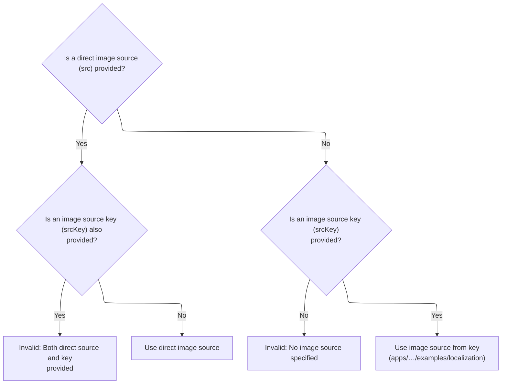

<SwmSnippet path="/taglib/src/main/java/org/apache/struts/taglib/html/ImgTag.java" line="537">

---

Back in ImgTag.src, after handling action, we check for src and <SwmToken path="taglib/src/main/java/org/apache/struts/taglib/html/ImgTag.java" pos="539:6:6" line-data="            if (this.srcKey != null) {">`srcKey`</SwmToken>. Only one can be set, otherwise we throw. If src is set, we return it directly; if <SwmToken path="taglib/src/main/java/org/apache/struts/taglib/html/ImgTag.java" pos="539:6:6" line-data="            if (this.srcKey != null) {">`srcKey`</SwmToken> is set, we resolve it to a message. This enforces mutual exclusivity for image sources.

```java
        // Deal with an absolute source that has been specified
        if (this.src != null) {
            if (this.srcKey != null) {
                throwImgTagSrcException();
            }

            return (this.src);
        }

        // Deal with an indirect source that has been specified
        if (this.srcKey == null) {
            throwImgTagSrcException();
        }

        return TagUtils.getInstance().message(pageContext, getBundle(),
            getLocale(), this.srcKey);
    }
```

---

</SwmSnippet>

## Encoding and finalizing image tag

<SwmSnippet path="/taglib/src/main/java/org/apache/struts/taglib/html/ImgTag.java" line="391">

---

Back in ImgTag.doEndTag, after getting the image source from src(), we call url() to append query parameters and encode the URL. This makes sure the image source is browser-ready.

```java
        String srcurl = url(tmp);

```

---

</SwmSnippet>

## Appending query parameters to image URL

<SwmSnippet path="/taglib/src/main/java/org/apache/struts/taglib/html/ImgTag.java" line="563">

---

In <SwmToken path="taglib/src/main/java/org/apache/struts/taglib/html/ImgTag.java" pos="563:5:5" line-data="    protected String url(String url)">`url`</SwmToken>, we decide which character encoding to use for URL parameters. If <SwmToken path="taglib/src/main/java/org/apache/struts/taglib/html/ImgTag.java" pos="571:4:4" line-data="        if (useLocalEncoding) {">`useLocalEncoding`</SwmToken> is set, we grab the encoding from the response. This affects how query parameters are encoded.

```java
    protected String url(String url)
        throws JspException {
        if (url == null) {
            return (url);
        }

        String charEncoding = "UTF-8";

        if (useLocalEncoding) {
            charEncoding = pageContext.getResponse().getCharacterEncoding();
        }

```

---

</SwmSnippet>

<SwmSnippet path="/taglib/src/main/java/org/apache/struts/taglib/html/ImgTag.java" line="575">

---

Back in ImgTag.url, after deciding the encoding, we check if <SwmToken path="taglib/src/main/java/org/apache/struts/taglib/html/ImgTag.java" pos="579:5:5" line-data="        if ((paramId != null) &amp;&amp; (paramName != null)) {">`paramId`</SwmToken> and <SwmToken path="taglib/src/main/java/org/apache/struts/taglib/html/ImgTag.java" pos="579:15:15" line-data="        if ((paramId != null) &amp;&amp; (paramName != null)) {">`paramName`</SwmToken> are set. If so, we look up the value using <SwmToken path="taglib/src/main/java/org/apache/struts/taglib/html/ImgTag.java" pos="590:1:1" line-data="                TagUtils.getInstance().lookup(pageContext, paramName,">`TagUtils`</SwmToken> and append it as a query parameter, encoding it properly.

```java
        // Start with an unadorned URL as specified
        StringBuffer src = new StringBuffer(url);

        // Append a single-parameter name and value, if requested
        if ((paramId != null) && (paramName != null)) {
            if (src.toString().indexOf('?') < 0) {
                src.append('?');
            } else {
                src.append("&amp;");
            }

            src.append(paramId);
            src.append('=');

            Object value =
                TagUtils.getInstance().lookup(pageContext, paramName,
                    paramProperty, paramScope);

```

---

</SwmSnippet>

<SwmSnippet path="/taglib/src/main/java/org/apache/struts/taglib/TagUtils.java" line="897">

---

<SwmToken path="taglib/src/main/java/org/apache/struts/taglib/TagUtils.java" pos="897:5:5" line-data="    public Object lookup(PageContext pageContext, String name, String property,">`lookup`</SwmToken> checks for a bean in the page context by name and scope. If not found, it throws. If property is set, it uses reflection to get the property value. Special handling if name is <SwmToken path="taglib/src/main/java/org/apache/struts/taglib/TagUtils.java" pos="949:4:6" line-data="            if (Constants.BEAN_KEY.equals(name)) {">`Constants.BEAN_KEY`</SwmToken>.

```java
    public Object lookup(PageContext pageContext, String name, String property,
        String scope) throws JspException {
        // Look up the requested bean, and return if requested
        Object bean = lookup(pageContext, name, scope);

        if (bean == null) {
            JspException e = null;

            if (scope == null) {
                e = new JspException(messages.getMessage("lookup.bean.any", name));
            } else {
                e = new JspException(messages.getMessage("lookup.bean", name,
                            scope));
            }

            saveException(pageContext, e);
            throw e;
        }

        if (property == null) {
            return bean;
        }

        // Locate and return the specified property
        try {
            return PropertyUtils.getProperty(bean, property);
        } catch (IllegalAccessException e) {
            saveException(pageContext, e);
            throw new JspException(messages.getMessage("lookup.access",
                    property, name), e);
        } catch (IllegalArgumentException e) {
            saveException(pageContext, e);
            throw new JspException(messages.getMessage("lookup.argument",
                    property, name), e);
        } catch (InvocationTargetException e) {
            Throwable t = e.getTargetException();

            if (t == null) {
                t = e;
            }

            saveException(pageContext, t);
            throw new JspException(messages.getMessage("lookup.target",
                    property, name), e);
        } catch (NoSuchMethodException e) {
            saveException(pageContext, e);

            String beanName = name;

            // Name defaults to Contants.BEAN_KEY if no name is specified by
            // an input tag. Thus lookup the bean under the key and use
            // its class name for the exception message.
            if (Constants.BEAN_KEY.equals(name)) {
                Object obj = pageContext.findAttribute(Constants.BEAN_KEY);

                if (obj != null) {
                    beanName = obj.getClass().getName();
                }
            }

            throw new JspException(messages.getMessage("lookup.method",
                    property, beanName), e);
        }
    }
```

---

</SwmSnippet>

<SwmSnippet path="/taglib/src/main/java/org/apache/struts/taglib/html/ImgTag.java" line="593">

---

Back in ImgTag.url, after looking up the value, we encode it using TagUtils.encodeURL before appending. This makes sure special characters are handled for browser compatibility.

```java
            if (value != null) {
                src.append(TagUtils.getInstance().encodeURL(value.toString(),
                        charEncoding));
            }
        }

```

---

</SwmSnippet>

### Encoding URL parameters

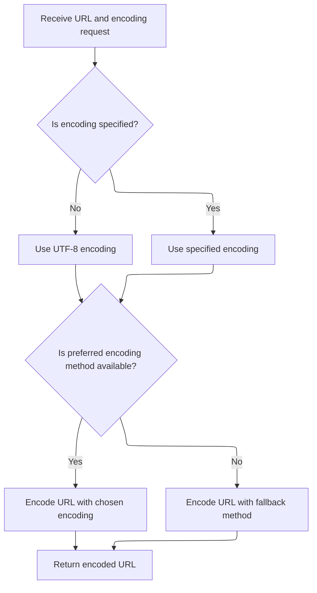

<SwmSnippet path="/taglib/src/main/java/org/apache/struts/taglib/TagUtils.java" line="590">

---

<SwmToken path="taglib/src/main/java/org/apache/struts/taglib/TagUtils.java" pos="590:5:5" line-data="    public String encodeURL(String url, String enc) {">`encodeURL`</SwmToken> just delegates to <SwmToken path="taglib/src/main/java/org/apache/struts/taglib/TagUtils.java" pos="591:3:5" line-data="        return ResponseUtils.encodeURL(url, enc);">`ResponseUtils.encodeURL`</SwmToken>, which handles encoding for different Java versions. This keeps URLs compatible regardless of the runtime.

```java
    public String encodeURL(String url, String enc) {
        return ResponseUtils.encodeURL(url, enc);
    }
```

---

</SwmSnippet>

<SwmSnippet path="/core/src/main/java/org/apache/struts/util/ResponseUtils.java" line="163">

---

<SwmToken path="core/src/main/java/org/apache/struts/util/ResponseUtils.java" pos="163:7:7" line-data="    public static String encodeURL(String url, String enc) {">`encodeURL`</SwmToken> tries to use Java <SwmToken path="core/src/main/java/org/apache/struts/util/ResponseUtils.java" pos="169:11:13" line-data="            // encode url with new 1.4 method and UTF-8 encoding">`1.4`</SwmToken>'s encoding method via reflection. If that fails, it falls back to the old <SwmToken path="core/src/main/java/org/apache/struts/util/ResponseUtils.java" pos="181:3:5" line-data="        return URLEncoder.encode(url);">`URLEncoder.encode`</SwmToken>. Defaults to <SwmToken path="core/src/main/java/org/apache/struts/util/ResponseUtils.java" pos="166:6:8" line-data="                enc = &quot;UTF-8&quot;;">`UTF-8`</SwmToken> if no encoding is given.

```java
    public static String encodeURL(String url, String enc) {
        try {
            if ((enc == null) || (enc.length() == 0)) {
                enc = "UTF-8";
            }

            // encode url with new 1.4 method and UTF-8 encoding
            if (encode != null) {
                return (String) encode.invoke(null, new Object[] { url, enc });
            }
        } catch (IllegalAccessException e) {
            log.debug("Could not find Java 1.4 encode method.  Using deprecated version.",
                e);
        } catch (InvocationTargetException e) {
            log.debug("Could not find Java 1.4 encode method. Using deprecated version.",
                e);
        }

        return URLEncoder.encode(url);
    }
```

---

</SwmSnippet>

### Handling map-based query parameters

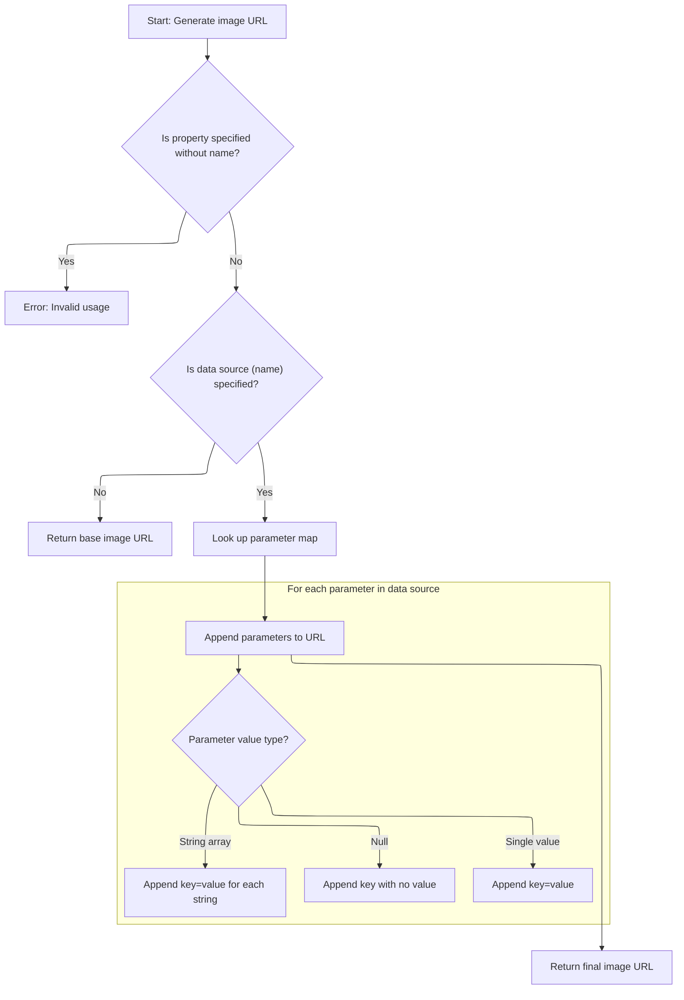

<SwmSnippet path="/taglib/src/main/java/org/apache/struts/taglib/html/ImgTag.java" line="599">

---

Back in ImgTag.url, after encoding the single parameter, we check if name is set. If so, we look up a Map using <SwmToken path="taglib/src/main/java/org/apache/struts/taglib/html/ImgTag.java" pos="604:1:1" line-data="            TagUtils.getInstance().saveException(pageContext, e);">`TagUtils`</SwmToken> and prepare to append all its entries as query parameters.

```java
        // Just return the URL if there is no bean to look up
        if ((property != null) && (name == null)) {
            JspException e =
                new JspException(messages.getMessage("getter.name"));

            TagUtils.getInstance().saveException(pageContext, e);
            throw e;
        }

        if (name == null) {
            return (src.toString());
        }

        // Look up the map we will be using
        Object mapObject =
            TagUtils.getInstance().lookup(pageContext, name, property, scope);
```

---

</SwmSnippet>

<SwmSnippet path="/taglib/src/main/java/org/apache/struts/taglib/html/ImgTag.java" line="615">

---

Back in ImgTag.url, after looking up the map, we cast it and prepare to iterate its keys. If it's not a Map, we throw. Next, we need the <SwmToken path="taglib/src/main/java/org/apache/struts/taglib/html/ImgTag.java" pos="626:9:9" line-data="        Iterator keys = map.keySet().iterator();">`keySet`</SwmToken> to start appending parameters.

```java
        Map map = null;

        try {
            map = (Map) mapObject;
        } catch (ClassCastException e) {
            TagUtils.getInstance().saveException(pageContext, e);
            throw new JspException(messages.getMessage("imgTag.type"), e);
        }

        // Append the required query parameters
        boolean question = (src.toString().indexOf("?") >= 0);
        Iterator keys = map.keySet().iterator();

```

---

</SwmSnippet>

<SwmSnippet path="/faces/src/main/java/org/apache/struts/faces/util/MessagesMap.java" line="211">

---

<SwmToken path="faces/src/main/java/org/apache/struts/faces/util/MessagesMap.java" pos="211:5:5" line-data="    public Set keySet() {">`keySet`</SwmToken> in <SwmToken path="faces/src/main/java/org/apache/struts/faces/util/MessagesMap.java" pos="41:4:4" line-data="public class MessagesMap implements Map {">`MessagesMap`</SwmToken> throws <SwmToken path="faces/src/main/java/org/apache/struts/faces/util/MessagesMap.java" pos="213:5:5" line-data="        throw new UnsupportedOperationException();">`UnsupportedOperationException`</SwmToken>. This signals that key iteration isn't supported for this map, so don't rely on it for query parameter construction.

```java
    public Set keySet() {

        throw new UnsupportedOperationException();

    }
```

---

</SwmSnippet>

<SwmSnippet path="/taglib/src/main/java/org/apache/struts/taglib/html/ImgTag.java" line="628">

---

Back in ImgTag.url, after getting the <SwmToken path="taglib/src/main/java/org/apache/struts/taglib/html/ImgTag.java" pos="626:9:9" line-data="        Iterator keys = map.keySet().iterator();">`keySet`</SwmToken>, we iterate keys and append each as a query parameter. Handles nulls, arrays, and single values, encoding everything with TagUtils.encodeURL. Returns the final URL string.

```java
        while (keys.hasNext()) {
            String key = (String) keys.next();
            Object value = map.get(key);

            if (value == null) {
                if (question) {
                    src.append("&amp;");
                } else {
                    src.append('?');
                    question = true;
                }

                src.append(key);
                src.append('=');

                // Interpret null as "no value specified"
            } else if (value instanceof String[]) {
                String[] values = (String[]) value;

                for (int i = 0; i < values.length; i++) {
                    if (question) {
                        src.append("&amp;");
                    } else {
                        src.append('?');
                        question = true;
                    }

                    src.append(key);
                    src.append('=');
                    src.append(TagUtils.getInstance().encodeURL(values[i],
                            charEncoding));
                }
            } else {
                if (question) {
                    src.append("&amp;");
                } else {
                    src.append('?');
                    question = true;
                }

                src.append(key);
                src.append('=');
                src.append(TagUtils.getInstance().encodeURL(value.toString(),
                        charEncoding));
            }
        }

        // Return the final result
        return (src.toString());
    }
```

---

</SwmSnippet>

## Finalizing image tag attributes

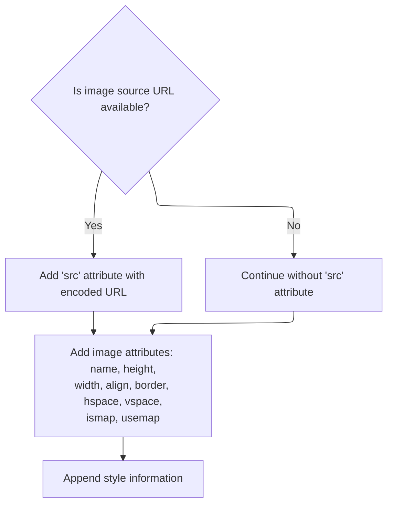

<SwmSnippet path="/taglib/src/main/java/org/apache/struts/taglib/html/ImgTag.java" line="393">

---

Back in ImgTag.doEndTag, after getting the final src URL, we call <SwmToken path="taglib/src/main/java/org/apache/struts/taglib/html/ImgTag.java" pos="394:1:1" line-data="            prepareAttribute(results, &quot;src&quot;, response.encodeURL(srcurl));">`prepareAttribute`</SwmToken> for each attribute (src, name, height, etc.). <SwmToken path="taglib/src/main/java/org/apache/struts/taglib/html/ImgTag.java" pos="394:11:13" line-data="            prepareAttribute(results, &quot;src&quot;, response.encodeURL(srcurl));">`response.encodeURL`</SwmToken> is used for src to handle session rewriting. This sets up the image tag for rendering.

```java
        if (srcurl != null) {
            prepareAttribute(results, "src", response.encodeURL(srcurl));
        }

        prepareAttribute(results, "name", getImageName());
        prepareAttribute(results, "height", getHeight());
        prepareAttribute(results, "width", getWidth());
        prepareAttribute(results, "align", getAlign());
        prepareAttribute(results, "border", getBorder());
        prepareAttribute(results, "hspace", getHspace());
        prepareAttribute(results, "vspace", getVspace());
        prepareAttribute(results, "ismap", getIsmap());
        prepareAttribute(results, "usemap", getUsemap());
```

---

</SwmSnippet>

<SwmSnippet path="/taglib/src/main/java/org/apache/struts/taglib/html/LabelTag.java" line="161">

---

In <SwmToken path="taglib/src/main/java/org/apache/struts/taglib/html/LabelTag.java" pos="161:5:5" line-data="    protected void prepareAttribute(StringBuffer handlers, String name,">`prepareAttribute`</SwmToken>, if the attribute name is "class" and the label is required, we append a required style class to the value before delegating to the superclass. This is how required fields get their special CSS class in the markup. The rest of the attributes are handled normally by the superclass.

```java
    protected void prepareAttribute(StringBuffer handlers, String name,
            Object value) {

        if ("class".equals(name) && this.required) {
            String requiredStyleClass = getRequiredStyleClass();
            if (requiredStyleClass != null) {
                value = (value != null) ? (value + " " + requiredStyleClass)
                        : requiredStyleClass;
            }
        }
        super.prepareAttribute(handlers, name, value);
    }
```

---

</SwmSnippet>

<SwmSnippet path="/taglib/src/main/java/org/apache/struts/taglib/html/ImgTag.java" line="406">

---

We just finished the label-specific attribute logic and now, back in ImgTag.doEndTag, we call <SwmToken path="taglib/src/main/java/org/apache/struts/taglib/html/ImgTag.java" pos="406:5:5" line-data="        results.append(prepareStyles());">`prepareStyles`</SwmToken> to add all the style and error-related attributes to the image tag markup. This step pulls in any error or custom styles before the tag is rendered.

```java
        results.append(prepareStyles());
```

---

</SwmSnippet>

## Assembling style attributes

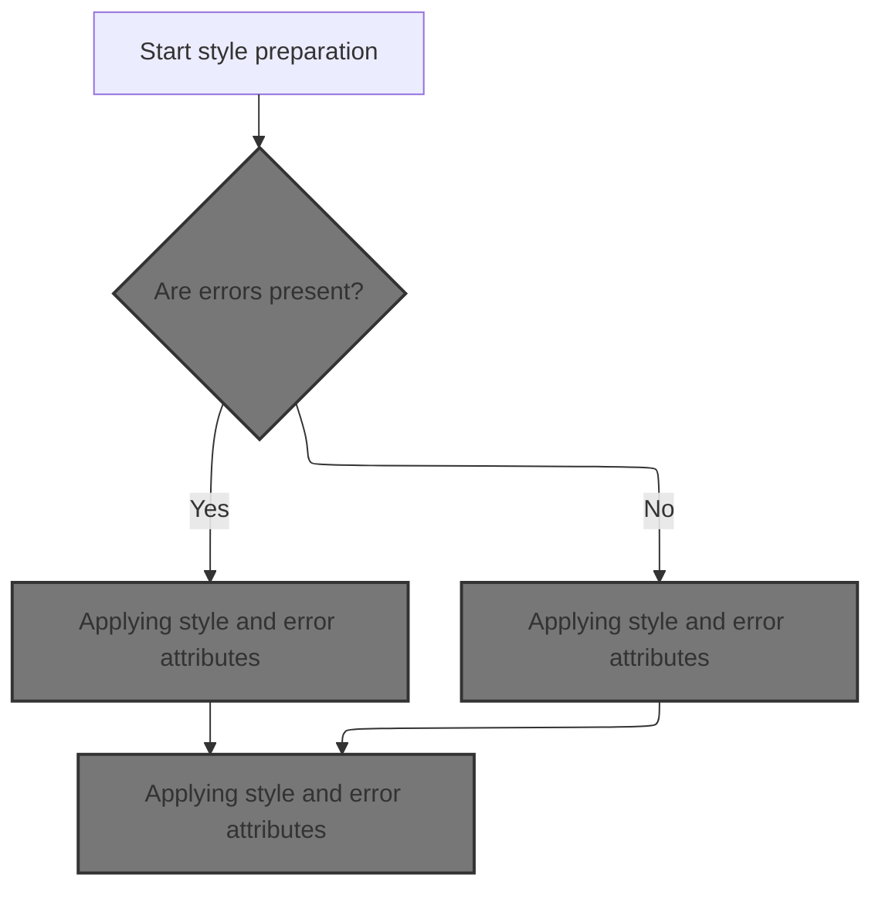

<SwmSnippet path="/taglib/src/main/java/org/apache/struts/taglib/html/BaseHandlerTag.java" line="967">

---

In <SwmToken path="taglib/src/main/java/org/apache/struts/taglib/html/BaseHandlerTag.java" pos="967:5:5" line-data="    protected String prepareStyles()">`prepareStyles`</SwmToken>, we start building up the style-related attributes for the tag. The first thing is to check if there are any errors for this field, since that changes which style attributes we use. That's why we call <SwmToken path="taglib/src/main/java/org/apache/struts/taglib/html/BaseHandlerTag.java" pos="971:7:7" line-data="        boolean errorsExist = doErrorsExist();">`doErrorsExist`</SwmToken> next.

```java
    protected String prepareStyles()
        throws JspException {
        StringBuffer styles = new StringBuffer();

        boolean errorsExist = doErrorsExist();

```

---

</SwmSnippet>

### Checking for field errors

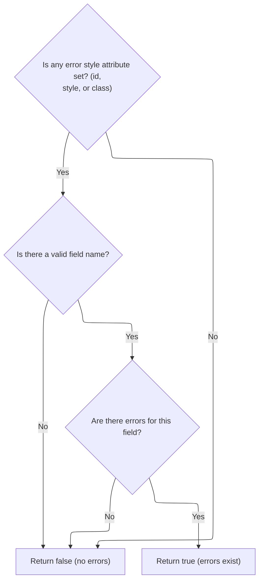

<SwmSnippet path="/taglib/src/main/java/org/apache/struts/taglib/html/BaseHandlerTag.java" line="1003">

---

<SwmToken path="taglib/src/main/java/org/apache/struts/taglib/html/BaseHandlerTag.java" pos="1003:5:5" line-data="    protected boolean doErrorsExist()">`doErrorsExist`</SwmToken> checks if any error style properties are set, figures out the field name, and then uses TagUtils.getActionMessages to see if there are any error messages for this field. If there are, we know to use error styles.

```java
    protected boolean doErrorsExist()
        throws JspException {
        boolean errorsExist = false;

        if ((getErrorStyleId() != null) || (getErrorStyle() != null)
            || (getErrorStyleClass() != null)) {
            String actualName = prepareName();

            if (actualName != null) {
                ActionMessages errors =
                    TagUtils.getInstance().getActionMessages(pageContext,
                        errorKey);

                errorsExist = ((errors != null)
                    && (errors.size(actualName) > 0));
            }
        }

        return errorsExist;
    }
```

---

</SwmSnippet>

### Fetching error messages

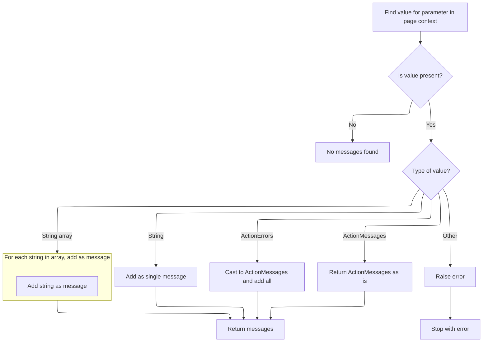

<SwmSnippet path="/taglib/src/main/java/org/apache/struts/taglib/TagUtils.java" line="727">

---

In <SwmToken path="taglib/src/main/java/org/apache/struts/taglib/TagUtils.java" pos="727:5:5" line-data="    public ActionMessages getActionMessages(PageContext pageContext,">`getActionMessages`</SwmToken>, we grab an attribute from the <SwmToken path="taglib/src/main/java/org/apache/struts/taglib/TagUtils.java" pos="727:7:7" line-data="    public ActionMessages getActionMessages(PageContext pageContext,">`PageContext`</SwmToken> by name and convert it into an <SwmToken path="taglib/src/main/java/org/apache/struts/taglib/TagUtils.java" pos="727:3:3" line-data="    public ActionMessages getActionMessages(PageContext pageContext,">`ActionMessages`</SwmToken> object. It handles Strings, arrays, <SwmToken path="taglib/src/main/java/org/apache/struts/taglib/TagUtils.java" pos="745:12:12" line-data="                } else if (value instanceof ActionErrors) {">`ActionErrors`</SwmToken>, and <SwmToken path="taglib/src/main/java/org/apache/struts/taglib/TagUtils.java" pos="727:3:3" line-data="    public ActionMessages getActionMessages(PageContext pageContext,">`ActionMessages`</SwmToken>, so it can work with whatever type was set by the framework or user code. If it's not one of those, it throws.

```java
    public ActionMessages getActionMessages(PageContext pageContext,
        String paramName) throws JspException {
        ActionMessages am = new ActionMessages();

        Object value = pageContext.findAttribute(paramName);

        if (value != null) {
            try {
                if (value instanceof String) {
                    am.add(ActionMessages.GLOBAL_MESSAGE,
                        new ActionMessage((String) value));
                } else if (value instanceof String[]) {
                    String[] keys = (String[]) value;

                    for (int i = 0; i < keys.length; i++) {
                        am.add(ActionMessages.GLOBAL_MESSAGE,
                            new ActionMessage(keys[i]));
                    }
```

---

</SwmSnippet>

<SwmSnippet path="/taglib/src/main/java/org/apache/struts/taglib/TagUtils.java" line="745">

---

After all the type checks and conversions, <SwmToken path="taglib/src/main/java/org/apache/struts/taglib/TagUtils.java" pos="727:5:5" line-data="    public ActionMessages getActionMessages(PageContext pageContext,">`getActionMessages`</SwmToken> returns an <SwmToken path="taglib/src/main/java/org/apache/struts/taglib/TagUtils.java" pos="746:1:1" line-data="                    ActionMessages m = (ActionMessages) value;">`ActionMessages`</SwmToken> object with all the messages found for the given attribute. If the attribute was an <SwmToken path="taglib/src/main/java/org/apache/struts/taglib/TagUtils.java" pos="745:12:12" line-data="                } else if (value instanceof ActionErrors) {">`ActionErrors`</SwmToken>, it's just cast and merged in. If it's not a supported type, it throws.

```java
                } else if (value instanceof ActionErrors) {
                    ActionMessages m = (ActionMessages) value;

                    am.add(m);
                } else if (value instanceof ActionMessages) {
                    am = (ActionMessages) value;
                } else {
                    throw new JspException(messages.getMessage(
                            "actionMessages.errors", value.getClass().getName()));
                }
            } catch (JspException e) {
                throw e;
            } catch (Exception e) {
                log.warn("Unable to retieve ActionMessage for paramName : "
                    + paramName, e);
            }
        }

        return am;
    }
```

---

</SwmSnippet>

### Applying style and error attributes

```mermaid
%%{init: {"flowchart": {"defaultRenderer": "elk"}} }%%
flowchart TD
    node1{"Errors exist?"}
    click node1 openCode "taglib/src/main/java/org/apache/struts/taglib/html/BaseHandlerTag.java:973:989"
    node1 -->|"Yes"| node2{"Error style id present?"}
    node2 -->|"Yes"| node3["Apply error style id"]
    click node2 openCode "taglib/src/main/java/org/apache/struts/taglib/html/BaseHandlerTag.java:973:975"
    click node3 openCode "taglib/src/main/java/org/apache/struts/taglib/html/BaseHandlerTag.java:974:974"
    node2 -->|"No"| node4["Apply normal style id"]
    click node4 openCode "taglib/src/main/java/org/apache/struts/taglib/html/BaseHandlerTag.java:976:976"
    node3 --> node5
    node4 --> node5
    node1 -->|"No"| node4
    node5{"Error style present?"}
    click node5 openCode "taglib/src/main/java/org/apache/struts/taglib/html/BaseHandlerTag.java:979:983"
    node5 -->|"Yes"| node6["Apply error style"]
    click node6 openCode "taglib/src/main/java/org/apache/struts/taglib/html/BaseHandlerTag.java:980:980"
    node5 -->|"No"| node7["Apply normal style"]
    click node7 openCode "taglib/src/main/java/org/apache/struts/taglib/html/BaseHandlerTag.java:982:982"
    node6 --> node8
    node7 --> node8
    node8{"Error style class present?"}
    click node8 openCode "taglib/src/main/java/org/apache/struts/taglib/html/BaseHandlerTag.java:985:989"
    node8 -->|"Yes"| node9["Apply error style class"]
    click node9 openCode "taglib/src/main/java/org/apache/struts/taglib/html/BaseHandlerTag.java:986:986"
    node8 -->|"No"| node10["Apply normal style class"]
    click node10 openCode "taglib/src/main/java/org/apache/struts/taglib/html/BaseHandlerTag.java:988:988"
    node9 --> node11["Set title and alt text (with
internationalization)"]
    node10 --> node11
    click node11 openCode "taglib/src/main/java/org/apache/struts/taglib/html/BaseHandlerTag.java:991:992"
    node11 --> node12["Prepare internationalization"]
    click node12 openCode "taglib/src/main/java/org/apache/struts/taglib/html/BaseHandlerTag.java:993:993"
    node12 --> node13["Return combined styles"]
    click node13 openCode "taglib/src/main/java/org/apache/struts/taglib/html/BaseHandlerTag.java:995:995"

classDef HeadingStyle fill:#777777,stroke:#333,stroke-width:2px;

%% Swimm:
%% %%{init: {"flowchart": {"defaultRenderer": "elk"}} }%%
%% flowchart TD
%%     node1{"Errors exist?"}
%%     click node1 openCode "<SwmPath>[taglib/…/html/BaseHandlerTag.java](taglib/src/main/java/org/apache/struts/taglib/html/BaseHandlerTag.java)</SwmPath>:973:989"
%%     node1 -->|"Yes"| node2{"Error style id present?"}
%%     node2 -->|"Yes"| node3["Apply error style id"]
%%     click node2 openCode "<SwmPath>[taglib/…/html/BaseHandlerTag.java](taglib/src/main/java/org/apache/struts/taglib/html/BaseHandlerTag.java)</SwmPath>:973:975"
%%     click node3 openCode "<SwmPath>[taglib/…/html/BaseHandlerTag.java](taglib/src/main/java/org/apache/struts/taglib/html/BaseHandlerTag.java)</SwmPath>:974:974"
%%     node2 -->|"No"| node4["Apply normal style id"]
%%     click node4 openCode "<SwmPath>[taglib/…/html/BaseHandlerTag.java](taglib/src/main/java/org/apache/struts/taglib/html/BaseHandlerTag.java)</SwmPath>:976:976"
%%     node3 --> node5
%%     node4 --> node5
%%     node1 -->|"No"| node4
%%     node5{"Error style present?"}
%%     click node5 openCode "<SwmPath>[taglib/…/html/BaseHandlerTag.java](taglib/src/main/java/org/apache/struts/taglib/html/BaseHandlerTag.java)</SwmPath>:979:983"
%%     node5 -->|"Yes"| node6["Apply error style"]
%%     click node6 openCode "<SwmPath>[taglib/…/html/BaseHandlerTag.java](taglib/src/main/java/org/apache/struts/taglib/html/BaseHandlerTag.java)</SwmPath>:980:980"
%%     node5 -->|"No"| node7["Apply normal style"]
%%     click node7 openCode "<SwmPath>[taglib/…/html/BaseHandlerTag.java](taglib/src/main/java/org/apache/struts/taglib/html/BaseHandlerTag.java)</SwmPath>:982:982"
%%     node6 --> node8
%%     node7 --> node8
%%     node8{"Error style class present?"}
%%     click node8 openCode "<SwmPath>[taglib/…/html/BaseHandlerTag.java](taglib/src/main/java/org/apache/struts/taglib/html/BaseHandlerTag.java)</SwmPath>:985:989"
%%     node8 -->|"Yes"| node9["Apply error style class"]
%%     click node9 openCode "<SwmPath>[taglib/…/html/BaseHandlerTag.java](taglib/src/main/java/org/apache/struts/taglib/html/BaseHandlerTag.java)</SwmPath>:986:986"
%%     node8 -->|"No"| node10["Apply normal style class"]
%%     click node10 openCode "<SwmPath>[taglib/…/html/BaseHandlerTag.java](taglib/src/main/java/org/apache/struts/taglib/html/BaseHandlerTag.java)</SwmPath>:988:988"
%%     node9 --> node11["Set title and alt text (with
%% internationalization)"]
%%     node10 --> node11
%%     click node11 openCode "<SwmPath>[taglib/…/html/BaseHandlerTag.java](taglib/src/main/java/org/apache/struts/taglib/html/BaseHandlerTag.java)</SwmPath>:991:992"
%%     node11 --> node12["Prepare internationalization"]
%%     click node12 openCode "<SwmPath>[taglib/…/html/BaseHandlerTag.java](taglib/src/main/java/org/apache/struts/taglib/html/BaseHandlerTag.java)</SwmPath>:993:993"
%%     node12 --> node13["Return combined styles"]
%%     click node13 openCode "<SwmPath>[taglib/…/html/BaseHandlerTag.java](taglib/src/main/java/org/apache/struts/taglib/html/BaseHandlerTag.java)</SwmPath>:995:995"
%% 
%% classDef HeadingStyle fill:#777777,stroke:#333,stroke-width:2px;
```

<SwmSnippet path="/taglib/src/main/java/org/apache/struts/taglib/html/BaseHandlerTag.java" line="973">

---

After checking for errors, <SwmToken path="taglib/src/main/java/org/apache/struts/taglib/html/ImgTag.java" pos="406:5:5" line-data="        results.append(prepareStyles());">`prepareStyles`</SwmToken> adds the id, style, and class attributes to the tag, picking the error versions if <SwmToken path="taglib/src/main/java/org/apache/struts/taglib/html/BaseHandlerTag.java" pos="973:4:4" line-data="        if (errorsExist &amp;&amp; (getErrorStyleId() != null)) {">`errorsExist`</SwmToken> is true. It also sets up the title and alt attributes, resolving them with the message helper. This is where all the style and accessibility attributes get finalized.

```java
        if (errorsExist && (getErrorStyleId() != null)) {
            prepareAttribute(styles, "id", getErrorStyleId());
        } else {
            prepareAttribute(styles, "id", getStyleId());
        }

        if (errorsExist && (getErrorStyle() != null)) {
            prepareAttribute(styles, "style", getErrorStyle());
        } else {
            prepareAttribute(styles, "style", getStyle());
        }

        if (errorsExist && (getErrorStyleClass() != null)) {
            prepareAttribute(styles, "class", getErrorStyleClass());
        } else {
            prepareAttribute(styles, "class", getStyleClass());
        }

        prepareAttribute(styles, "title", message(getTitle(), getTitleKey()));
        prepareAttribute(styles, "alt", message(getAlt(), getAltKey()));
```

---

</SwmSnippet>

<SwmSnippet path="/taglib/src/main/java/org/apache/struts/taglib/html/BaseHandlerTag.java" line="830">

---

<SwmToken path="taglib/src/main/java/org/apache/struts/taglib/html/BaseHandlerTag.java" pos="830:5:5" line-data="    protected String message(String literal, String key)">`message`</SwmToken> checks if both literal and key are set—if so, it throws. If only literal is set, it returns that. If only key is set, it does a message lookup for localization. If neither, it returns null. Only one input is allowed at a time.

```java
    protected String message(String literal, String key)
        throws JspException {
        if (literal != null) {
            if (key != null) {
                JspException e =
                    new JspException(messages.getMessage("common.both"));

                TagUtils.getInstance().saveException(pageContext, e);
                throw e;
            } else {
                return (literal);
            }
        } else {
            if (key != null) {
                return TagUtils.getInstance().message(pageContext, getBundle(),
                    getLocale(), key);
            } else {
                return null;
            }
        }
    }
```

---

</SwmSnippet>

<SwmSnippet path="/taglib/src/main/java/org/apache/struts/taglib/html/BaseHandlerTag.java" line="993">

---

After finalizing all style and accessibility attributes in <SwmToken path="taglib/src/main/java/org/apache/struts/taglib/html/ImgTag.java" pos="406:5:5" line-data="        results.append(prepareStyles());">`prepareStyles`</SwmToken>, we call <SwmToken path="taglib/src/main/java/org/apache/struts/taglib/html/BaseHandlerTag.java" pos="993:1:1" line-data="        prepareInternationalization(styles);">`prepareInternationalization`</SwmToken> to add any i18n-related attributes. Then we return the full string of assembled attributes.

```java
        prepareInternationalization(styles);

        return styles.toString();
    }
```

---

</SwmSnippet>

## Adding event handlers and finishing markup

<SwmSnippet path="/taglib/src/main/java/org/apache/struts/taglib/html/ImgTag.java" line="407">

---

After styles are set up, ImgTag.doEndTag calls <SwmToken path="taglib/src/main/java/org/apache/struts/taglib/html/ImgTag.java" pos="407:5:5" line-data="        results.append(prepareEventHandlers());">`prepareEventHandlers`</SwmToken> to add all the <SwmToken path="taglib/src/main/java/org/apache/struts/taglib/html/BaseHandlerTag.java" pos="42:3:3" line-data=" * JavaScript event handlers and/or CSS Style attributes. This class does not">`JavaScript`</SwmToken> event handler attributes to the markup. This step is about wiring up client-side behavior.

```java
        results.append(prepareEventHandlers());
```

---

</SwmSnippet>

## Wiring up event and state attributes

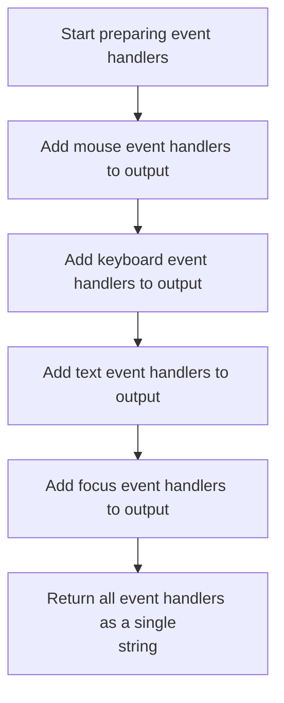

<SwmSnippet path="/taglib/src/main/java/org/apache/struts/taglib/html/BaseHandlerTag.java" line="1039">

---

<SwmToken path="taglib/src/main/java/org/apache/struts/taglib/html/BaseHandlerTag.java" pos="1039:5:5" line-data="    protected String prepareEventHandlers() {">`prepareEventHandlers`</SwmToken> adds all the <SwmToken path="taglib/src/main/java/org/apache/struts/taglib/html/BaseHandlerTag.java" pos="42:3:3" line-data=" * JavaScript event handlers and/or CSS Style attributes. This class does not">`JavaScript`</SwmToken> event handler attributes (mouse, key, text, focus) to the tag. The last call, <SwmToken path="taglib/src/main/java/org/apache/struts/taglib/html/BaseHandlerTag.java" pos="1045:1:1" line-data="        prepareFocusEvents(handlers);">`prepareFocusEvents`</SwmToken>, also handles disabled and readonly attributes if needed, so it's not just about events.

```java
    protected String prepareEventHandlers() {
        StringBuffer handlers = new StringBuffer();

        prepareMouseEvents(handlers);
        prepareKeyEvents(handlers);
        prepareTextEvents(handlers);
        prepareFocusEvents(handlers);

        return handlers.toString();
    }
```

---

</SwmSnippet>

<SwmSnippet path="/taglib/src/main/java/org/apache/struts/taglib/html/BaseHandlerTag.java" line="1095">

---

<SwmToken path="taglib/src/main/java/org/apache/struts/taglib/html/BaseHandlerTag.java" pos="1095:5:5" line-data="    protected void prepareFocusEvents(StringBuffer handlers) {">`prepareFocusEvents`</SwmToken> adds onblur and onfocus handlers, but also checks if the tag or its parent form should be disabled or readonly. If so, it appends those attributes to the markup. This is how the tag ends up reflecting both its own and the form's state.

```java
    protected void prepareFocusEvents(StringBuffer handlers) {
        prepareAttribute(handlers, "onblur", getOnblur());
        prepareAttribute(handlers, "onfocus", getOnfocus());

        // Get the parent FormTag (if necessary)
        FormTag formTag = null;

        if ((doDisabled && !getDisabled()) || (doReadonly && !getReadonly())) {
            formTag =
                (FormTag) pageContext.getAttribute(Constants.FORM_KEY,
                    PageContext.REQUEST_SCOPE);
        }

        // Format Disabled
        if (doDisabled) {
            boolean formDisabled =
                (formTag == null) ? false : formTag.isDisabled();

            if (formDisabled || getDisabled()) {
                handlers.append(" disabled=\"disabled\"");
            }
        }

        // Format Read Only
        if (doReadonly) {
            boolean formReadOnly =
                (formTag == null) ? false : formTag.isReadonly();

            if (formReadOnly || getReadonly()) {
                handlers.append(" readonly=\"readonly\"");
            }
        }
    }
```

---

</SwmSnippet>

## Finalizing tag attributes and closing markup

<SwmSnippet path="/taglib/src/main/java/org/apache/struts/taglib/html/ImgTag.java" line="408">

---

After event handlers, ImgTag.doEndTag calls <SwmToken path="taglib/src/main/java/org/apache/struts/taglib/html/ImgTag.java" pos="408:1:1" line-data="        prepareOtherAttributes(results);">`prepareOtherAttributes`</SwmToken> to add any remaining attributes, then appends the tag close string from <SwmToken path="taglib/src/main/java/org/apache/struts/taglib/html/ImgTag.java" pos="409:5:5" line-data="        results.append(getElementClose());">`getElementClose`</SwmToken>. This is where the markup is finished off, either as ">" or " />" depending on XHTML mode.

```java
        prepareOtherAttributes(results);
        results.append(getElementClose());

```

---

</SwmSnippet>

## Choosing tag close style

<SwmSnippet path="/taglib/src/main/java/org/apache/struts/taglib/html/BaseHandlerTag.java" line="1186">

---

<SwmToken path="taglib/src/main/java/org/apache/struts/taglib/html/BaseHandlerTag.java" pos="1186:5:5" line-data="    protected String getElementClose() {">`getElementClose`</SwmToken> checks if XHTML mode is on and returns either " />" or ">" for the tag ending. This keeps the markup valid for the current document type.

```java
    protected String getElementClose() {
        return this.isXhtml() ? " />" : ">";
    }
```

---

</SwmSnippet>

## Detecting XHTML rendering mode

<SwmSnippet path="/taglib/src/main/java/org/apache/struts/taglib/html/BaseHandlerTag.java" line="1174">

---

<SwmToken path="taglib/src/main/java/org/apache/struts/taglib/html/BaseHandlerTag.java" pos="1174:5:5" line-data="    protected boolean isXhtml() {">`isXhtml`</SwmToken> just calls <SwmToken path="taglib/src/main/java/org/apache/struts/taglib/html/BaseHandlerTag.java" pos="1175:3:3" line-data="        return TagUtils.getInstance().isXhtml(this.pageContext);">`TagUtils`</SwmToken> to check a special key in the page context. If it's set to "true", we know to use XHTML-style tag endings.

```java
    protected boolean isXhtml() {
        return TagUtils.getInstance().isXhtml(this.pageContext);
    }
```

---

</SwmSnippet>

## Looking up XHTML mode flag

<SwmSnippet path="/taglib/src/main/java/org/apache/struts/taglib/TagUtils.java" line="838">

---

<SwmToken path="taglib/src/main/java/org/apache/struts/taglib/TagUtils.java" pos="838:5:5" line-data="    public boolean isXhtml(PageContext pageContext) {">`isXhtml`</SwmToken> uses the lookup helper to grab the XHTML flag from the page context. If it's "true", we use XHTML rendering. If the lookup fails, it throws.

```java
    public boolean isXhtml(PageContext pageContext) {
        String xhtml;
        try {
            xhtml = (String) lookup(pageContext, Globals.XHTML_KEY, null);
            return "true".equalsIgnoreCase(xhtml);
        } catch (JspException e) {
            log.error("Failed xhtml lookup", e);
            throw new RuntimeException(e);
        }
    }
```

---

</SwmSnippet>

## Resolving attribute scope and value

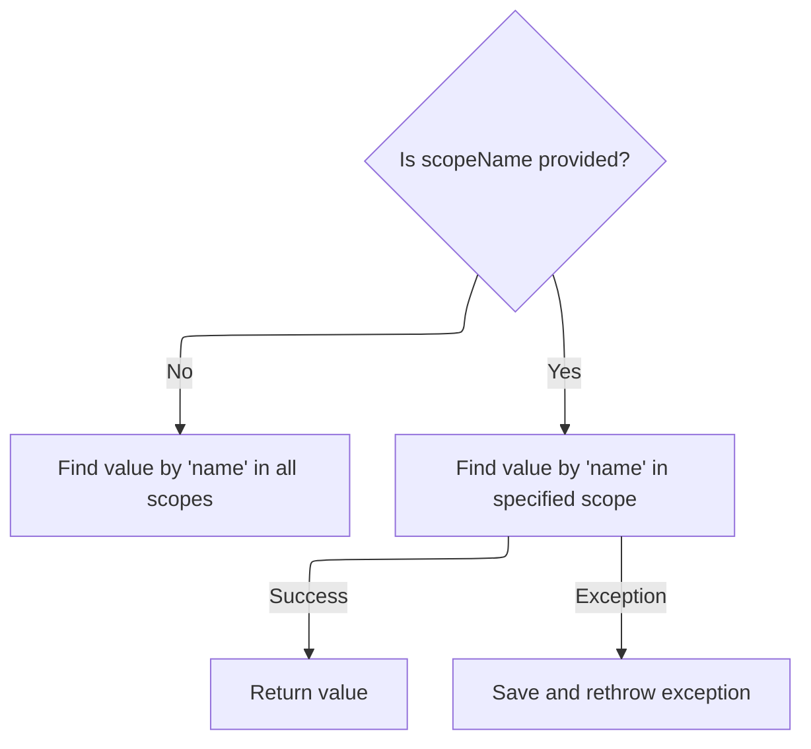

<SwmSnippet path="/taglib/src/main/java/org/apache/struts/taglib/TagUtils.java" line="863">

---

<SwmToken path="taglib/src/main/java/org/apache/struts/taglib/TagUtils.java" pos="863:5:5" line-data="    public Object lookup(PageContext pageContext, String name, String scopeName)">`lookup`</SwmToken> checks if a scope name is given. If not, it searches all scopes for the attribute. If a scope is specified, it uses <SwmToken path="taglib/src/main/java/org/apache/struts/taglib/TagUtils.java" pos="870:12:12" line-data="            return pageContext.getAttribute(name, instance.getScope(scopeName));">`getScope`</SwmToken> to get the right constant and looks only in that scope. If the scope name is wrong, it throws.

```java
    public Object lookup(PageContext pageContext, String name, String scopeName)
        throws JspException {
        if (scopeName == null) {
            return pageContext.findAttribute(name);
        }

        try {
            return pageContext.getAttribute(name, instance.getScope(scopeName));
        } catch (JspException e) {
            saveException(pageContext, e);
            throw e;
        }
    }
```

---

</SwmSnippet>

<SwmSnippet path="/taglib/src/main/java/org/apache/struts/taglib/TagUtils.java" line="809">

---

<SwmToken path="taglib/src/main/java/org/apache/struts/taglib/TagUtils.java" pos="809:5:5" line-data="    public int getScope(String scopeName)">`getScope`</SwmToken> lowercases the scope name to match keys in the scopes map, so it's case-insensitive. If the scope isn't found, it throws. If found, it returns the int value for that scope.

```java
    public int getScope(String scopeName)
        throws JspException {
        Integer scope = (Integer) scopes.get(scopeName.toLowerCase());

        if (scope == null) {
            throw new JspException(messages.getMessage("lookup.scope", scope));
        }

        return scope.intValue();
    }
```

---

</SwmSnippet>

## Writing out the final tag

<SwmSnippet path="/taglib/src/main/java/org/apache/struts/taglib/html/ImgTag.java" line="411">

---

After all the markup is built, ImgTag.doEndTag calls TagUtils.write to output the tag to the page. Then it returns <SwmToken path="taglib/src/main/java/org/apache/struts/taglib/html/ImgTag.java" pos="413:4:4" line-data="        return (EVAL_PAGE);">`EVAL_PAGE`</SwmToken> so the JSP keeps going.

```java
        TagUtils.getInstance().write(pageContext, results.toString());

        return (EVAL_PAGE);
    }
```

---

</SwmSnippet>

&nbsp;

*This is an auto-generated document by Swimm 🌊 and has not yet been verified by a human*

<SwmMeta version="3.0.0" repo-id="Z2l0aHViJTNBJTNBc3RydXRzMSUzQSUzQVN3aW1tLURlbW8=" repo-name="struts1"><sup>Powered by [Swimm](https://app.swimm.io/)</sup></SwmMeta>
