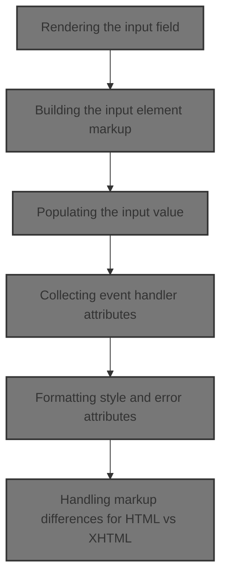
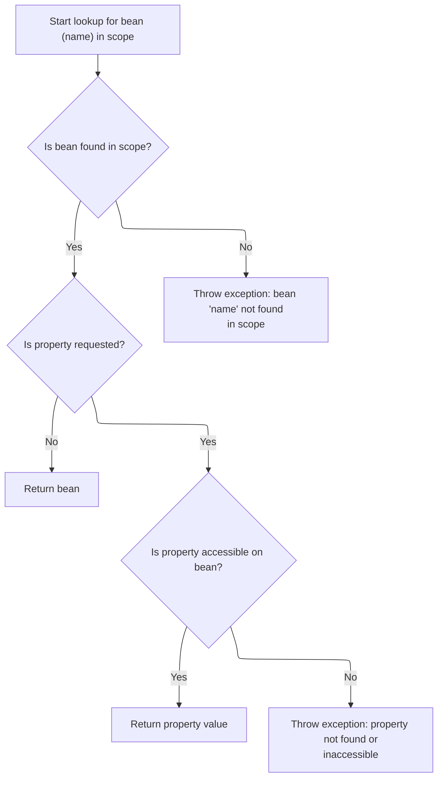
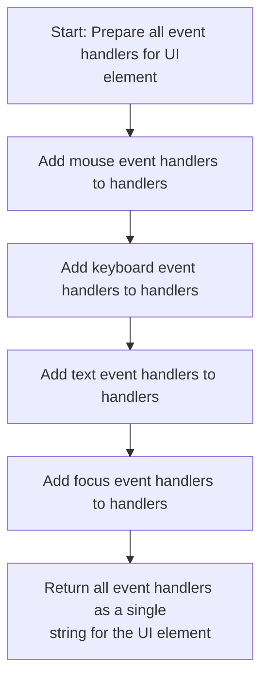
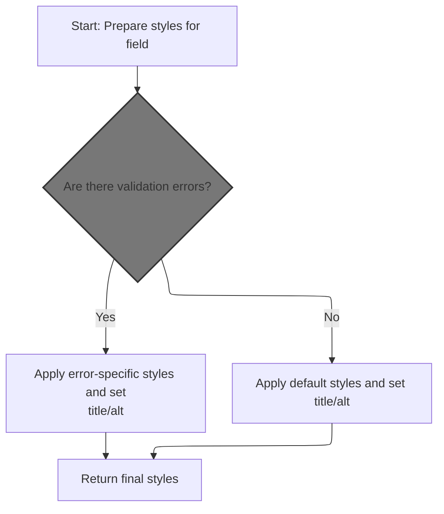
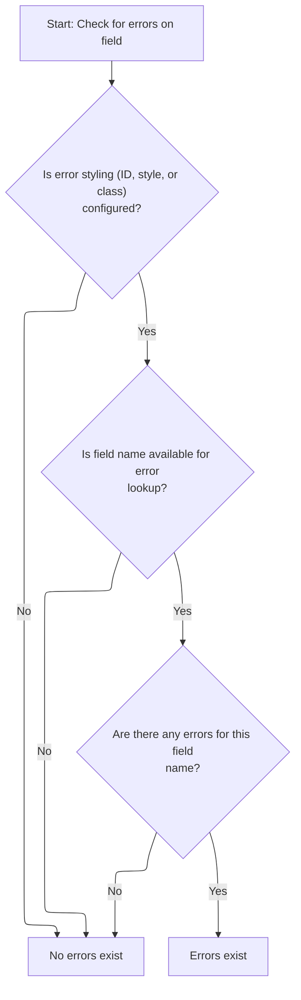
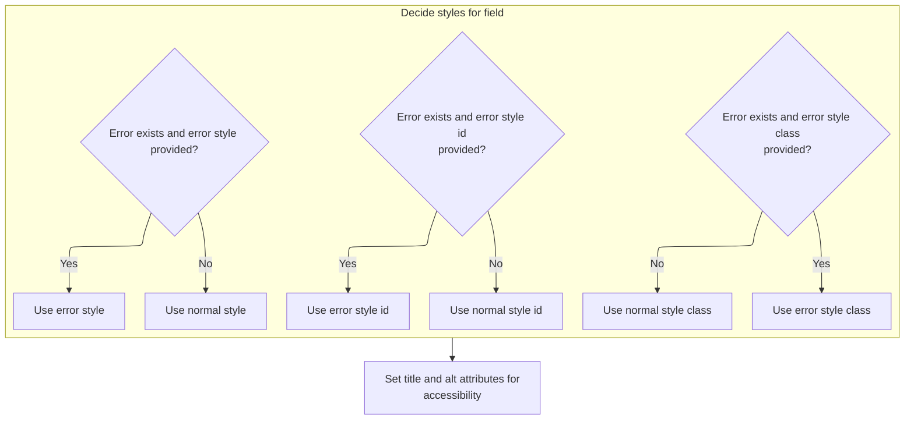
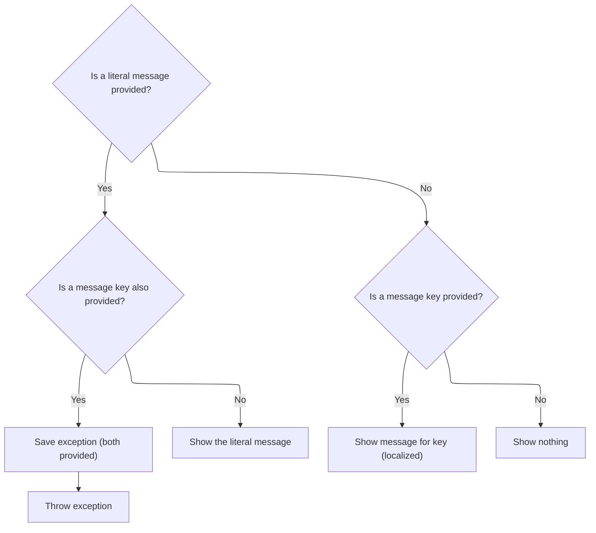
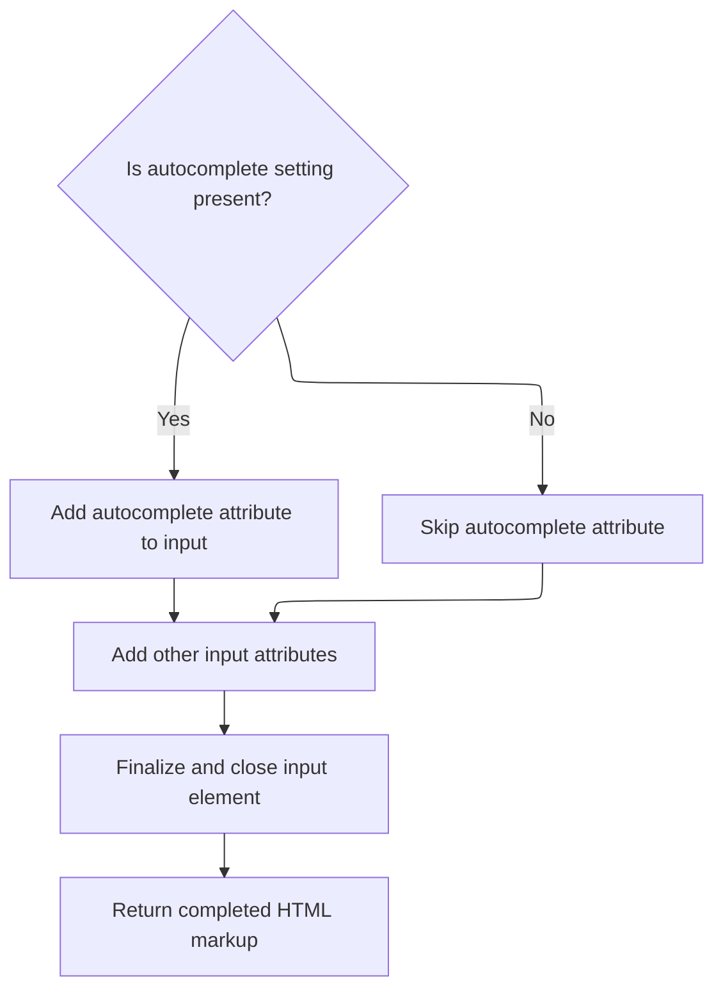

This document describes how an input field is rendered in a JSP page, with attributes, value, event handlers, and styles determined by the form state and validation results. The completed HTML markup is written to the JSP output, ensuring the field is dynamic, accessible, and reflects validation feedback.



# Rendering the input field

<SwmSnippet path="/taglib/src/main/java/org/apache/struts/taglib/html/BaseFieldTag.java" line="79">

---

In <SwmToken path="taglib/src/main/java/org/apache/struts/taglib/html/BaseFieldTag.java" pos="79:5:5" line-data="    public int doStartTag() throws JspException {">`doStartTag`</SwmToken>, we hand off the actual writing of the input element markup to <SwmToken path="taglib/src/main/java/org/apache/struts/taglib/html/BaseFieldTag.java" pos="80:1:1" line-data="        TagUtils.getInstance().write(this.pageContext, this.renderInputElement());">`TagUtils`</SwmToken>, which handles output to the JSP. This keeps output logic consistent and reusable across tags.

```java
    public int doStartTag() throws JspException {
        TagUtils.getInstance().write(this.pageContext, this.renderInputElement());
```

---

</SwmSnippet>

## Writing markup to the JSP

<SwmSnippet path="/taglib/src/main/java/org/apache/struts/taglib/TagUtils.java" line="1186">

---

<SwmToken path="taglib/src/main/java/org/apache/struts/taglib/TagUtils.java" pos="1186:5:5" line-data="    public void write(PageContext pageContext, String text)">`write`</SwmToken> sends the generated markup to the JSP output stream and handles any IO errors by saving the exception and throwing a <SwmToken path="taglib/src/main/java/org/apache/struts/taglib/TagUtils.java" pos="1187:3:3" line-data="        throws JspException {">`JspException`</SwmToken>.

```java
    public void write(PageContext pageContext, String text)
        throws JspException {
        JspWriter writer = pageContext.getOut();

        try {
            writer.print(text);
        } catch (IOException e) {
            saveException(pageContext, e);
            throw new JspException(messages.getMessage("write.io", e.toString()), e);
        }
    }
```

---

</SwmSnippet>

## Storing exceptions in the request scope

<SwmSnippet path="/taglib/src/main/java/org/apache/struts/taglib/TagUtils.java" line="1170">

---

<SwmToken path="taglib/src/main/java/org/apache/struts/taglib/TagUtils.java" pos="1170:5:5" line-data="    public void saveException(PageContext pageContext, Throwable exception) {">`saveException`</SwmToken> puts the exception into the request scope of the page context, making it available for error handling in the current request.

```java
    public void saveException(PageContext pageContext, Throwable exception) {
        pageContext.setAttribute(Globals.EXCEPTION_KEY, exception,
            PageContext.REQUEST_SCOPE);
    }
```

---

</SwmSnippet>

<SwmSnippet path="/tiles/src/main/java/org/apache/struts/tiles/taglib/util/TagUtils.java" line="290">

---

<SwmToken path="tiles/src/main/java/org/apache/struts/tiles/taglib/util/TagUtils.java" pos="290:7:7" line-data="    public static void setAttribute(PageContext pageContext, String name, Object beanValue)">`setAttribute`</SwmToken> wraps <SwmToken path="tiles/src/main/java/org/apache/struts/tiles/taglib/util/TagUtils.java" pos="292:1:3" line-data="        pageContext.setAttribute(name, beanValue, PageContext.REQUEST_SCOPE);">`pageContext.setAttribute`</SwmToken>, always using <SwmToken path="tiles/src/main/java/org/apache/struts/tiles/taglib/util/TagUtils.java" pos="292:13:13" line-data="        pageContext.setAttribute(name, beanValue, PageContext.REQUEST_SCOPE);">`REQUEST_SCOPE`</SwmToken>. This keeps attribute storage consistent and avoids scope mistakes.

```java
    public static void setAttribute(PageContext pageContext, String name, Object beanValue)
        throws JspException {
        pageContext.setAttribute(name, beanValue, PageContext.REQUEST_SCOPE);
    }
```

---

</SwmSnippet>

## Completing tag processing

<SwmSnippet path="/taglib/src/main/java/org/apache/struts/taglib/html/BaseFieldTag.java" line="80">

---

Back in BaseFieldTag.doStartTag, after writing the input markup, we return <SwmToken path="taglib/src/main/java/org/apache/struts/taglib/html/BaseFieldTag.java" pos="82:4:4" line-data="        return (EVAL_BODY_TAG);">`EVAL_BODY_TAG`</SwmToken> to let the JSP process the tag body if present.

```java
        TagUtils.getInstance().write(this.pageContext, this.renderInputElement());

        return (EVAL_BODY_TAG);
    }
```

---

</SwmSnippet>

# Building the input element markup

```mermaid
%%{init: {"flowchart": {"defaultRenderer": "elk"}} }%%
flowchart TD
  node1["Begin input field assembly"]
  click node1 openCode "taglib/src/main/java/org/apache/struts/taglib/html/BaseFieldTag.java:91:112"
  node1 --> node2["Set core attributes (type, name, access
key, accept, max length, size, tab
index)"]
  click node2 openCode "taglib/src/main/java/org/apache/struts/taglib/html/BaseFieldTag.java:95:101"
  node2 --> node3["Populating the input value"]
  
  node3 --> node4["Collecting event handler attributes"]
  
  node4 --> node5["Handling focus and form state"]
  
  node5 --> node6["Formatting style and error attributes"]
  
  node6 --> node7{"Is XHTML mode enabled?"}
  
  node7 -->|"No"| node8["Add autocomplete attribute"]
  click node8 openCode "taglib/src/main/java/org/apache/struts/taglib/html/BaseFieldTag.java:106:107"
  node7 -->|"Yes"| node9["Skip autocomplete attribute"]
  click node9 openCode "taglib/src/main/java/org/apache/struts/taglib/html/BaseFieldTag.java:107:107"
  node8 --> node10["Resolving attribute values and scope"]
  node9 --> node10
  
  node10 --> node11["Finalize input element"]
  click node11 openCode "taglib/src/main/java/org/apache/struts/taglib/html/BaseFieldTag.java:109:109"
  node11 --> node12["Return complete input HTML"]
  click node12 openCode "taglib/src/main/java/org/apache/struts/taglib/html/BaseFieldTag.java:111:111"
classDef HeadingStyle fill:#777777,stroke:#333,stroke-width:2px;
click node3 goToHeading "Populating the input value"
node3:::HeadingStyle
click node4 goToHeading "Collecting event handler attributes"
node4:::HeadingStyle
click node5 goToHeading "Handling focus and form state"
node5:::HeadingStyle
click node6 goToHeading "Formatting style and error attributes"
node6:::HeadingStyle
click node7 goToHeading "Determining XHTML output mode"
node7:::HeadingStyle
click node10 goToHeading "Resolving attribute values and scope"
node10:::HeadingStyle

%% Swimm:
%% %%{init: {"flowchart": {"defaultRenderer": "elk"}} }%%
%% flowchart TD
%%   node1["Begin input field assembly"]
%%   click node1 openCode "<SwmPath>[taglib/…/html/BaseFieldTag.java](taglib/src/main/java/org/apache/struts/taglib/html/BaseFieldTag.java)</SwmPath>:91:112"
%%   node1 --> node2["Set core attributes (type, name, access
%% key, accept, max length, size, tab
%% index)"]
%%   click node2 openCode "<SwmPath>[taglib/…/html/BaseFieldTag.java](taglib/src/main/java/org/apache/struts/taglib/html/BaseFieldTag.java)</SwmPath>:95:101"
%%   node2 --> node3["Populating the input value"]
%%   
%%   node3 --> node4["Collecting event handler attributes"]
%%   
%%   node4 --> node5["Handling focus and form state"]
%%   
%%   node5 --> node6["Formatting style and error attributes"]
%%   
%%   node6 --> node7{"Is XHTML mode enabled?"}
%%   
%%   node7 -->|"No"| node8["Add autocomplete attribute"]
%%   click node8 openCode "<SwmPath>[taglib/…/html/BaseFieldTag.java](taglib/src/main/java/org/apache/struts/taglib/html/BaseFieldTag.java)</SwmPath>:106:107"
%%   node7 -->|"Yes"| node9["Skip autocomplete attribute"]
%%   click node9 openCode "<SwmPath>[taglib/…/html/BaseFieldTag.java](taglib/src/main/java/org/apache/struts/taglib/html/BaseFieldTag.java)</SwmPath>:107:107"
%%   node8 --> node10["Resolving attribute values and scope"]
%%   node9 --> node10
%%   
%%   node10 --> node11["Finalize input element"]
%%   click node11 openCode "<SwmPath>[taglib/…/html/BaseFieldTag.java](taglib/src/main/java/org/apache/struts/taglib/html/BaseFieldTag.java)</SwmPath>:109:109"
%%   node11 --> node12["Return complete input HTML"]
%%   click node12 openCode "<SwmPath>[taglib/…/html/BaseFieldTag.java](taglib/src/main/java/org/apache/struts/taglib/html/BaseFieldTag.java)</SwmPath>:111:111"
%% classDef HeadingStyle fill:#777777,stroke:#333,stroke-width:2px;
%% click node3 goToHeading "Populating the input value"
%% node3:::HeadingStyle
%% click node4 goToHeading "Collecting event handler attributes"
%% node4:::HeadingStyle
%% click node5 goToHeading "Handling focus and form state"
%% node5:::HeadingStyle
%% click node6 goToHeading "Formatting style and error attributes"
%% node6:::HeadingStyle
%% click node7 goToHeading "Determining XHTML output mode"
%% node7:::HeadingStyle
%% click node10 goToHeading "Resolving attribute values and scope"
%% node10:::HeadingStyle
```



<SwmSnippet path="/taglib/src/main/java/org/apache/struts/taglib/html/BaseFieldTag.java" line="91">

---

In <SwmToken path="taglib/src/main/java/org/apache/struts/taglib/html/BaseFieldTag.java" pos="91:5:5" line-data="    protected String renderInputElement()">`renderInputElement`</SwmToken>, we start assembling the input tag and call <SwmToken path="taglib/src/main/java/org/apache/struts/taglib/html/BaseFieldTag.java" pos="95:1:1" line-data="        prepareAttribute(results, &quot;type&quot;, this.type);">`prepareAttribute`</SwmToken> for each attribute, delegating to <SwmToken path="taglib/src/main/java/org/apache/struts/taglib/html/LabelTag.java" pos="33:4:4" line-data="public class LabelTag extends BaseInputTag {">`LabelTag`</SwmToken> for special handling like required fields.

```java
    protected String renderInputElement()
        throws JspException {
        StringBuffer results = new StringBuffer("<input");

        prepareAttribute(results, "type", this.type);
        prepareAttribute(results, "name", prepareName());
        prepareAttribute(results, "accesskey", getAccesskey());
        prepareAttribute(results, "accept", getAccept());
        prepareAttribute(results, "maxlength", getMaxlength());
        prepareAttribute(results, "size", getCols());
        prepareAttribute(results, "tabindex", getTabindex());
```

---

</SwmSnippet>

<SwmSnippet path="/taglib/src/main/java/org/apache/struts/taglib/html/LabelTag.java" line="161">

---

<SwmToken path="taglib/src/main/java/org/apache/struts/taglib/html/LabelTag.java" pos="161:5:5" line-data="    protected void prepareAttribute(StringBuffer handlers, String name,">`prepareAttribute`</SwmToken> in <SwmToken path="taglib/src/main/java/org/apache/struts/taglib/html/LabelTag.java" pos="33:4:4" line-data="public class LabelTag extends BaseInputTag {">`LabelTag`</SwmToken> checks for 'class' and required, appending a required style class if needed, then delegates to the superclass for standard attribute formatting.

```java
    protected void prepareAttribute(StringBuffer handlers, String name,
            Object value) {

        if ("class".equals(name) && this.required) {
            String requiredStyleClass = getRequiredStyleClass();
            if (requiredStyleClass != null) {
                value = (value != null) ? (value + " " + requiredStyleClass)
                        : requiredStyleClass;
            }
        }
        super.prepareAttribute(handlers, name, value);
    }
```

---

</SwmSnippet>

<SwmSnippet path="/taglib/src/main/java/org/apache/struts/taglib/html/BaseFieldTag.java" line="102">

---

Back in BaseFieldTag.renderInputElement, after setting attributes, we call <SwmToken path="taglib/src/main/java/org/apache/struts/taglib/html/BaseFieldTag.java" pos="102:1:1" line-data="        prepareValue(results);">`prepareValue`</SwmToken> to append the value attribute, handling explicit values and bean lookups.

```java
        prepareValue(results);
```

---

</SwmSnippet>

## Populating the input value

<SwmSnippet path="/taglib/src/main/java/org/apache/struts/taglib/html/BaseFieldTag.java" line="119">

---

In <SwmToken path="taglib/src/main/java/org/apache/struts/taglib/html/BaseFieldTag.java" pos="119:5:5" line-data="    protected void prepareValue(StringBuffer results)">`prepareValue`</SwmToken>, we append the value attribute, using an explicit value if present or falling back to a bean property via TagUtils.lookup.

```java
    protected void prepareValue(StringBuffer results)
        throws JspException {
        results.append(" value=\"");

        if (value != null) {
            results.append(this.formatValue(value));
        } else if (redisplay || !"password".equals(type)) {
            Object value =
                TagUtils.getInstance().lookup(pageContext, name, property, null);

            results.append(this.formatValue(value));
        }

```

---

</SwmSnippet>

### Retrieving bean properties



<SwmSnippet path="/taglib/src/main/java/org/apache/struts/taglib/TagUtils.java" line="897">

---

<SwmToken path="taglib/src/main/java/org/apache/struts/taglib/TagUtils.java" pos="897:5:5" line-data="    public Object lookup(PageContext pageContext, String name, String property,">`lookup`</SwmToken> fetches the bean and property from the page context, saving and throwing exceptions if anything is missing or inaccessible.

```java
    public Object lookup(PageContext pageContext, String name, String property,
        String scope) throws JspException {
        // Look up the requested bean, and return if requested
        Object bean = lookup(pageContext, name, scope);

        if (bean == null) {
            JspException e = null;

            if (scope == null) {
                e = new JspException(messages.getMessage("lookup.bean.any", name));
            } else {
                e = new JspException(messages.getMessage("lookup.bean", name,
                            scope));
            }

            saveException(pageContext, e);
            throw e;
        }

        if (property == null) {
            return bean;
        }

        // Locate and return the specified property
        try {
            return PropertyUtils.getProperty(bean, property);
        } catch (IllegalAccessException e) {
            saveException(pageContext, e);
            throw new JspException(messages.getMessage("lookup.access",
                    property, name), e);
        } catch (IllegalArgumentException e) {
            saveException(pageContext, e);
            throw new JspException(messages.getMessage("lookup.argument",
                    property, name), e);
        } catch (InvocationTargetException e) {
            Throwable t = e.getTargetException();

            if (t == null) {
                t = e;
            }

            saveException(pageContext, t);
            throw new JspException(messages.getMessage("lookup.target",
                    property, name), e);
        } catch (NoSuchMethodException e) {
            saveException(pageContext, e);

```

---

</SwmSnippet>

<SwmSnippet path="/taglib/src/main/java/org/apache/struts/taglib/TagUtils.java" line="944">

---

Back in TagUtils.lookup, if the bean or property is missing, we throw a <SwmToken path="taglib/src/main/java/org/apache/struts/taglib/TagUtils.java" pos="957:5:5" line-data="            throw new JspException(messages.getMessage(&quot;lookup.method&quot;,">`JspException`</SwmToken> with a detailed message, sometimes using the bean's class name for clarity.

```java
            String beanName = name;

            // Name defaults to Contants.BEAN_KEY if no name is specified by
            // an input tag. Thus lookup the bean under the key and use
            // its class name for the exception message.
            if (Constants.BEAN_KEY.equals(name)) {
                Object obj = pageContext.findAttribute(Constants.BEAN_KEY);

                if (obj != null) {
                    beanName = obj.getClass().getName();
                }
            }

            throw new JspException(messages.getMessage("lookup.method",
                    property, beanName), e);
        }
    }
```

---

</SwmSnippet>

### Finalizing the value attribute

<SwmSnippet path="/taglib/src/main/java/org/apache/struts/taglib/html/BaseFieldTag.java" line="132">

---

Back in BaseFieldTag.prepareValue, after retrieving the value, we finish the value attribute by closing the quotes

```java
        results.append('"');
    }
```

---

</SwmSnippet>

## Adding event handlers to the input

<SwmSnippet path="/taglib/src/main/java/org/apache/struts/taglib/html/BaseFieldTag.java" line="103">

---

Back in BaseFieldTag.renderInputElement, after setting the value, we append event handlers to the input markup, prepping it for user interaction.

```java
        results.append(this.prepareEventHandlers());
```

---

</SwmSnippet>

## Collecting event handler attributes



<SwmSnippet path="/taglib/src/main/java/org/apache/struts/taglib/html/BaseHandlerTag.java" line="1039">

---

<SwmToken path="taglib/src/main/java/org/apache/struts/taglib/html/BaseHandlerTag.java" pos="1039:5:5" line-data="    protected String prepareEventHandlers() {">`prepareEventHandlers`</SwmToken> builds up all event handler attributes by calling methods for mouse, key, text, and focus events, then returns the combined string.

```java
    protected String prepareEventHandlers() {
        StringBuffer handlers = new StringBuffer();

        prepareMouseEvents(handlers);
        prepareKeyEvents(handlers);
        prepareTextEvents(handlers);
        prepareFocusEvents(handlers);

        return handlers.toString();
    }
```

---

</SwmSnippet>

## Handling focus and form state

```mermaid
%%{init: {"flowchart": {"defaultRenderer": "elk"}} }%%
flowchart TD
    node1["Prepare onblur/onfocus event handlers"]
    click node1 openCode "taglib/src/main/java/org/apache/struts/taglib/html/BaseHandlerTag.java:1096:1097"
    node1 --> node2{"doDisabled = true and (form or field
disabled)?"}
    click node2 openCode "taglib/src/main/java/org/apache/struts/taglib/html/BaseHandlerTag.java:1108:1113"
    node2 -->|"Yes"| node3["Add disabled attribute"]
    click node3 openCode "taglib/src/main/java/org/apache/struts/taglib/html/BaseHandlerTag.java:1114:1115"
    node2 -->|"No"| node4{"doReadonly = true and (form or field
read-only)?"}
    node3 --> node4
    click node4 openCode "taglib/src/main/java/org/apache/struts/taglib/html/BaseHandlerTag.java:1119:1123"
    node4 -->|"Yes"| node5["Add readonly attribute"]
    click node5 openCode "taglib/src/main/java/org/apache/struts/taglib/html/BaseHandlerTag.java:1124:1125"
    node4 -->|"No"| node6["Finish"]
    node5 --> node6
    click node6 openCode "taglib/src/main/java/org/apache/struts/taglib/html/BaseHandlerTag.java:1126:1127"

classDef HeadingStyle fill:#777777,stroke:#333,stroke-width:2px;

%% Swimm:
%% %%{init: {"flowchart": {"defaultRenderer": "elk"}} }%%
%% flowchart TD
%%     node1["Prepare onblur/onfocus event handlers"]
%%     click node1 openCode "<SwmPath>[taglib/…/html/BaseHandlerTag.java](taglib/src/main/java/org/apache/struts/taglib/html/BaseHandlerTag.java)</SwmPath>:1096:1097"
%%     node1 --> node2{"<SwmToken path="taglib/src/main/java/org/apache/struts/taglib/html/BaseHandlerTag.java" pos="1102:5:5" line-data="        if ((doDisabled &amp;&amp; !getDisabled()) || (doReadonly &amp;&amp; !getReadonly())) {">`doDisabled`</SwmToken> = true and (form or field
%% disabled)?"}
%%     click node2 openCode "<SwmPath>[taglib/…/html/BaseHandlerTag.java](taglib/src/main/java/org/apache/struts/taglib/html/BaseHandlerTag.java)</SwmPath>:1108:1113"
%%     node2 -->|"Yes"| node3["Add disabled attribute"]
%%     click node3 openCode "<SwmPath>[taglib/…/html/BaseHandlerTag.java](taglib/src/main/java/org/apache/struts/taglib/html/BaseHandlerTag.java)</SwmPath>:1114:1115"
%%     node2 -->|"No"| node4{"<SwmToken path="taglib/src/main/java/org/apache/struts/taglib/html/BaseHandlerTag.java" pos="1102:18:18" line-data="        if ((doDisabled &amp;&amp; !getDisabled()) || (doReadonly &amp;&amp; !getReadonly())) {">`doReadonly`</SwmToken> = true and (form or field
%% read-only)?"}
%%     node3 --> node4
%%     click node4 openCode "<SwmPath>[taglib/…/html/BaseHandlerTag.java](taglib/src/main/java/org/apache/struts/taglib/html/BaseHandlerTag.java)</SwmPath>:1119:1123"
%%     node4 -->|"Yes"| node5["Add readonly attribute"]
%%     click node5 openCode "<SwmPath>[taglib/…/html/BaseHandlerTag.java](taglib/src/main/java/org/apache/struts/taglib/html/BaseHandlerTag.java)</SwmPath>:1124:1125"
%%     node4 -->|"No"| node6["Finish"]
%%     node5 --> node6
%%     click node6 openCode "<SwmPath>[taglib/…/html/BaseHandlerTag.java](taglib/src/main/java/org/apache/struts/taglib/html/BaseHandlerTag.java)</SwmPath>:1126:1127"
%% 
%% classDef HeadingStyle fill:#777777,stroke:#333,stroke-width:2px;
```



<SwmSnippet path="/taglib/src/main/java/org/apache/struts/taglib/html/BaseHandlerTag.java" line="1095">

---

In <SwmToken path="taglib/src/main/java/org/apache/struts/taglib/html/BaseHandlerTag.java" pos="1095:5:5" line-data="    protected void prepareFocusEvents(StringBuffer handlers) {">`prepareFocusEvents`</SwmToken>, we add focus event handlers and check form and tag state to append 'disabled' and 'readonly' attributes if needed.

```java
    protected void prepareFocusEvents(StringBuffer handlers) {
        prepareAttribute(handlers, "onblur", getOnblur());
        prepareAttribute(handlers, "onfocus", getOnfocus());

        // Get the parent FormTag (if necessary)
        FormTag formTag = null;

        if ((doDisabled && !getDisabled()) || (doReadonly && !getReadonly())) {
            formTag =
                (FormTag) pageContext.getAttribute(Constants.FORM_KEY,
                    PageContext.REQUEST_SCOPE);
        }

```

---

</SwmSnippet>

<SwmSnippet path="/tiles/src/main/java/org/apache/struts/tiles/ComponentContext.java" line="169">

---

<SwmToken path="tiles/src/main/java/org/apache/struts/tiles/ComponentContext.java" pos="169:5:5" line-data="    public Object getAttribute(">`getAttribute`</SwmToken> checks if the scope is <SwmToken path="tiles/src/main/java/org/apache/struts/tiles/ComponentContext.java" pos="174:10:10" line-data="        if (scope == ComponentConstants.COMPONENT_SCOPE){">`COMPONENT_SCOPE`</SwmToken> and switches retrieval logic, either calling another method or using <SwmToken path="tiles/src/main/java/org/apache/struts/tiles/ComponentContext.java" pos="178:3:5" line-data="        return pageContext.getAttribute(beanName, scope);">`pageContext.getAttribute`</SwmToken>.

```java
    public Object getAttribute(
        String beanName,
        int scope,
        PageContext pageContext) {

        if (scope == ComponentConstants.COMPONENT_SCOPE){
            return getAttribute(beanName);
        }

        return pageContext.getAttribute(beanName, scope);
    }
```

---

</SwmSnippet>

<SwmSnippet path="/taglib/src/main/java/org/apache/struts/taglib/html/BaseHandlerTag.java" line="1108">

---

Back in BaseHandlerTag.prepareFocusEvents, after checking form and tag state, we append 'disabled' and 'readonly' attributes if needed, making the input reflect usability constraints.

```java
        // Format Disabled
        if (doDisabled) {
            boolean formDisabled =
                (formTag == null) ? false : formTag.isDisabled();

            if (formDisabled || getDisabled()) {
                handlers.append(" disabled=\"disabled\"");
            }
        }

        // Format Read Only
        if (doReadonly) {
            boolean formReadOnly =
                (formTag == null) ? false : formTag.isReadonly();

            if (formReadOnly || getReadonly()) {
                handlers.append(" readonly=\"readonly\"");
            }
        }
    }
```

---

</SwmSnippet>

## Adding style attributes to the input

<SwmSnippet path="/taglib/src/main/java/org/apache/struts/taglib/html/BaseFieldTag.java" line="104">

---

Back in BaseFieldTag.renderInputElement, after event handlers, we append style attributes, picking error or normal styles based on validation state.

```java
        results.append(this.prepareStyles());
```

---

</SwmSnippet>

## Formatting style and error attributes



<SwmSnippet path="/taglib/src/main/java/org/apache/struts/taglib/html/BaseHandlerTag.java" line="967">

---

In <SwmToken path="taglib/src/main/java/org/apache/struts/taglib/html/BaseHandlerTag.java" pos="967:5:5" line-data="    protected String prepareStyles()">`prepareStyles`</SwmToken>, we start by checking for errors, then build up style attributes, picking error or normal styles as needed.

```java
    protected String prepareStyles()
        throws JspException {
        StringBuffer styles = new StringBuffer();

        boolean errorsExist = doErrorsExist();

```

---

</SwmSnippet>

### Checking for validation errors



<SwmSnippet path="/taglib/src/main/java/org/apache/struts/taglib/html/BaseHandlerTag.java" line="1003">

---

In <SwmToken path="taglib/src/main/java/org/apache/struts/taglib/html/BaseHandlerTag.java" pos="1003:5:5" line-data="    protected boolean doErrorsExist()">`doErrorsExist`</SwmToken>, we check for error style attributes and use <SwmToken path="taglib/src/main/java/org/apache/struts/taglib/html/BaseHandlerTag.java" pos="1009:7:7" line-data="            String actualName = prepareName();">`prepareName`</SwmToken> to find the field name, then look up errors for that field.

```java
    protected boolean doErrorsExist()
        throws JspException {
        boolean errorsExist = false;

        if ((getErrorStyleId() != null) || (getErrorStyle() != null)
            || (getErrorStyleClass() != null)) {
            String actualName = prepareName();

```

---

</SwmSnippet>

<SwmSnippet path="/taglib/src/main/java/org/apache/struts/taglib/html/BaseHandlerTag.java" line="1029">

---

<SwmToken path="taglib/src/main/java/org/apache/struts/taglib/html/BaseHandlerTag.java" pos="1029:5:5" line-data="    protected String prepareName()">`prepareName`</SwmToken> just returns null, so unless overridden, error checking won't find a field name, making <SwmToken path="taglib/src/main/java/org/apache/struts/taglib/html/BaseHandlerTag.java" pos="971:3:3" line-data="        boolean errorsExist = doErrorsExist();">`errorsExist`</SwmToken> always false.

```java
    protected String prepareName()
        throws JspException {
        return null;
    }
```

---

</SwmSnippet>

<SwmSnippet path="/taglib/src/main/java/org/apache/struts/taglib/html/BaseHandlerTag.java" line="1011">

---

Back in BaseHandlerTag.doErrorsExist, if <SwmToken path="taglib/src/main/java/org/apache/struts/taglib/html/BaseFieldTag.java" pos="96:11:11" line-data="        prepareAttribute(results, &quot;name&quot;, prepareName());">`prepareName`</SwmToken> returns null, we skip error lookup and <SwmToken path="taglib/src/main/java/org/apache/struts/taglib/html/BaseHandlerTag.java" pos="1016:1:1" line-data="                errorsExist = ((errors != null)">`errorsExist`</SwmToken> stays false, so no error styles are applied.

```java
            if (actualName != null) {
                ActionMessages errors =
                    TagUtils.getInstance().getActionMessages(pageContext,
                        errorKey);

                errorsExist = ((errors != null)
                    && (errors.size(actualName) > 0));
            }
        }

        return errorsExist;
    }
```

---

</SwmSnippet>

### Applying style and alt/title attributes



<SwmSnippet path="/taglib/src/main/java/org/apache/struts/taglib/html/BaseHandlerTag.java" line="973">

---

Back in BaseHandlerTag.prepareStyles, after picking style attributes, we set alt and title using message keys for localization if needed.

```java
        if (errorsExist && (getErrorStyleId() != null)) {
            prepareAttribute(styles, "id", getErrorStyleId());
        } else {
            prepareAttribute(styles, "id", getStyleId());
        }

        if (errorsExist && (getErrorStyle() != null)) {
            prepareAttribute(styles, "style", getErrorStyle());
        } else {
            prepareAttribute(styles, "style", getStyle());
        }

        if (errorsExist && (getErrorStyleClass() != null)) {
            prepareAttribute(styles, "class", getErrorStyleClass());
        } else {
            prepareAttribute(styles, "class", getStyleClass());
        }

        prepareAttribute(styles, "title", message(getTitle(), getTitleKey()));
        prepareAttribute(styles, "alt", message(getAlt(), getAltKey()));
```

---

</SwmSnippet>

### Resolving alt/title text and handling errors



<SwmSnippet path="/taglib/src/main/java/org/apache/struts/taglib/html/BaseHandlerTag.java" line="830">

---

<SwmToken path="taglib/src/main/java/org/apache/struts/taglib/html/BaseHandlerTag.java" pos="830:5:5" line-data="    protected String message(String literal, String key)">`message`</SwmToken> enforces that only one of literal or key is set, throwing if both are present. If key is used, it fetches a localized string via <SwmToken path="taglib/src/main/java/org/apache/struts/taglib/html/BaseHandlerTag.java" pos="837:1:1" line-data="                TagUtils.getInstance().saveException(pageContext, e);">`TagUtils`</SwmToken>.

```java
    protected String message(String literal, String key)
        throws JspException {
        if (literal != null) {
            if (key != null) {
                JspException e =
                    new JspException(messages.getMessage("common.both"));

                TagUtils.getInstance().saveException(pageContext, e);
                throw e;
            } else {
                return (literal);
            }
        } else {
            if (key != null) {
                return TagUtils.getInstance().message(pageContext, getBundle(),
                    getLocale(), key);
            } else {
                return null;
            }
        }
    }
```

---

</SwmSnippet>

<SwmSnippet path="/tiles/src/main/java/org/apache/struts/tiles/taglib/util/TagUtils.java" line="301">

---

<SwmToken path="tiles/src/main/java/org/apache/struts/tiles/taglib/util/TagUtils.java" pos="301:7:7" line-data="    public static void saveException(PageContext pageContext, Throwable exception) {">`saveException`</SwmToken> puts the exception into the request scope so that error handlers or error pages can access it later. This is needed right after a failure, so the rest of the framework can pick up the error and react accordingly.

```java
    public static void saveException(PageContext pageContext, Throwable exception) {
        pageContext.setAttribute(Globals.EXCEPTION_KEY, exception, PageContext.REQUEST_SCOPE);
    }
```

---

</SwmSnippet>

### Finalizing style attributes and localization

<SwmSnippet path="/taglib/src/main/java/org/apache/struts/taglib/html/BaseHandlerTag.java" line="993">

---

We just returned from BaseHandlerTag.message, and now BaseHandlerTag.prepareStyles calls <SwmToken path="taglib/src/main/java/org/apache/struts/taglib/html/BaseHandlerTag.java" pos="993:1:1" line-data="        prepareInternationalization(styles);">`prepareInternationalization`</SwmToken> to add any locale-specific tweaks before returning the final style string. This wraps up all style and localization logic for the input element.

```java
        prepareInternationalization(styles);

        return styles.toString();
    }
```

---

</SwmSnippet>

## Handling markup differences for HTML vs XHTML

<SwmSnippet path="/taglib/src/main/java/org/apache/struts/taglib/html/BaseFieldTag.java" line="105">

---

We just returned from BaseHandlerTag.prepareStyles in BaseFieldTag.renderInputElement. Now we check if the output should be XHTML or regular HTML, since the tag closing differs. This means we need to ask <SwmToken path="taglib/src/main/java/org/apache/struts/taglib/html/BaseHandlerTag.java" pos="1099:9:9" line-data="        // Get the parent FormTag (if necessary)">`FormTag`</SwmToken> if XHTML is enabled.

```java
        if (!isXhtml()) {
```

---

</SwmSnippet>

## Determining XHTML output mode

<SwmSnippet path="/taglib/src/main/java/org/apache/struts/taglib/html/FormTag.java" line="898">

---

<SwmToken path="taglib/src/main/java/org/apache/struts/taglib/html/FormTag.java" pos="898:5:5" line-data="    private boolean isXhtml() {">`isXhtml`</SwmToken> in <SwmToken path="taglib/src/main/java/org/apache/struts/taglib/html/BaseHandlerTag.java" pos="1099:9:9" line-data="        // Get the parent FormTag (if necessary)">`FormTag`</SwmToken> just calls TagUtils.isXhtml with the current page context. This keeps XHTML detection consistent across all tags. Next, we need <SwmToken path="taglib/src/main/java/org/apache/struts/taglib/html/FormTag.java" pos="899:3:3" line-data="        return TagUtils.getInstance().isXhtml(this.pageContext);">`TagUtils`</SwmToken> to actually look up the XHTML flag.

```java
    private boolean isXhtml() {
        return TagUtils.getInstance().isXhtml(this.pageContext);
    }
```

---

</SwmSnippet>

## Looking up XHTML mode in the page context

<SwmSnippet path="/taglib/src/main/java/org/apache/struts/taglib/TagUtils.java" line="838">

---

<SwmToken path="taglib/src/main/java/org/apache/struts/taglib/TagUtils.java" pos="838:5:5" line-data="    public boolean isXhtml(PageContext pageContext) {">`isXhtml`</SwmToken> in <SwmToken path="taglib/src/main/java/org/apache/struts/taglib/html/BaseFieldTag.java" pos="80:1:1" line-data="        TagUtils.getInstance().write(this.pageContext, this.renderInputElement());">`TagUtils`</SwmToken> looks up the XHTML flag in the page context using the standard key. If it's set to 'true', we use XHTML markup. If not, we stick to HTML. We need to call lookup to actually fetch the attribute, since it might be in any scope.

```java
    public boolean isXhtml(PageContext pageContext) {
        String xhtml;
        try {
            xhtml = (String) lookup(pageContext, Globals.XHTML_KEY, null);
            return "true".equalsIgnoreCase(xhtml);
        } catch (JspException e) {
            log.error("Failed xhtml lookup", e);
            throw new RuntimeException(e);
        }
    }
```

---

</SwmSnippet>

## Resolving attribute values and scope

<SwmSnippet path="/taglib/src/main/java/org/apache/struts/taglib/TagUtils.java" line="863">

---

In <SwmToken path="taglib/src/main/java/org/apache/struts/taglib/TagUtils.java" pos="863:5:5" line-data="    public Object lookup(PageContext pageContext, String name, String scopeName)">`lookup`</SwmToken>, if <SwmToken path="taglib/src/main/java/org/apache/struts/taglib/TagUtils.java" pos="863:19:19" line-data="    public Object lookup(PageContext pageContext, String name, String scopeName)">`scopeName`</SwmToken> is null, we search all scopes for the attribute. If it's set, we convert it to a scope constant and only check that scope. This lets us control exactly where we pull values from, and next we need <SwmToken path="taglib/src/main/java/org/apache/struts/taglib/TagUtils.java" pos="870:12:12" line-data="            return pageContext.getAttribute(name, instance.getScope(scopeName));">`getScope`</SwmToken> to resolve the scope name.

```java
    public Object lookup(PageContext pageContext, String name, String scopeName)
        throws JspException {
        if (scopeName == null) {
            return pageContext.findAttribute(name);
        }

        try {
            return pageContext.getAttribute(name, instance.getScope(scopeName));
```

---

</SwmSnippet>

<SwmSnippet path="/taglib/src/main/java/org/apache/struts/taglib/TagUtils.java" line="809">

---

<SwmToken path="taglib/src/main/java/org/apache/struts/taglib/TagUtils.java" pos="809:5:5" line-data="    public int getScope(String scopeName)">`getScope`</SwmToken> lowercases the <SwmToken path="taglib/src/main/java/org/apache/struts/taglib/TagUtils.java" pos="809:9:9" line-data="    public int getScope(String scopeName)">`scopeName`</SwmToken> and looks it up in a map, so 'request', 'REQUEST', and 'Request' all work. If the name isn't found, we throw a <SwmToken path="taglib/src/main/java/org/apache/struts/taglib/TagUtils.java" pos="810:3:3" line-data="        throws JspException {">`JspException`</SwmToken>. This keeps scope handling predictable. Next, we use the int value to fetch the attribute from the right scope.

```java
    public int getScope(String scopeName)
        throws JspException {
        Integer scope = (Integer) scopes.get(scopeName.toLowerCase());

        if (scope == null) {
            throw new JspException(messages.getMessage("lookup.scope", scope));
        }

        return scope.intValue();
    }
```

---

</SwmSnippet>

<SwmSnippet path="/taglib/src/main/java/org/apache/struts/taglib/TagUtils.java" line="870">

---

We just got the scope int from <SwmToken path="taglib/src/main/java/org/apache/struts/taglib/TagUtils.java" pos="870:12:12" line-data="            return pageContext.getAttribute(name, instance.getScope(scopeName));">`getScope`</SwmToken> in TagUtils.lookup. If the scope is <SwmToken path="tiles/src/main/java/org/apache/struts/tiles/ComponentContext.java" pos="174:10:10" line-data="        if (scope == ComponentConstants.COMPONENT_SCOPE){">`COMPONENT_SCOPE`</SwmToken>, we need to call into Tiles' <SwmToken path="tiles/src/main/java/org/apache/struts/tiles/taglib/util/TagUtils.java" pos="34:10:10" line-data="import org.apache.struts.tiles.ComponentContext;">`ComponentContext`</SwmToken> to fetch the attribute, since it's not in the regular JSP scopes. This keeps Tiles and Struts attribute handling in sync.

```java
            return pageContext.getAttribute(name, instance.getScope(scopeName));
```

---

</SwmSnippet>

<SwmSnippet path="/taglib/src/main/java/org/apache/struts/taglib/TagUtils.java" line="871">

---

We just got back from Tiles' <SwmToken path="tiles/src/main/java/org/apache/struts/tiles/taglib/util/TagUtils.java" pos="34:10:10" line-data="import org.apache.struts.tiles.ComponentContext;">`ComponentContext`</SwmToken> in TagUtils.lookup. If an exception happened, we save it in the request scope before rethrowing, so error handlers can access it later. After this, we return the <SwmToken path="taglib/src/main/java/org/apache/struts/taglib/TagUtils.java" pos="187:24:26" line-data="     * @throws JspException if a class cast exception occurs on a looked-up">`looked-up`</SwmToken> value or propagate the error.

```java
        } catch (JspException e) {
            saveException(pageContext, e);
            throw e;
        }
    }
```

---

</SwmSnippet>

## Adding autocomplete and other attributes



<SwmSnippet path="/taglib/src/main/java/org/apache/struts/taglib/html/BaseFieldTag.java" line="106">

---

We just returned from FormTag.isXhtml in BaseFieldTag.renderInputElement. Now we add the autocomplete attribute if needed, before moving on to any other custom attributes. This keeps the markup order predictable.

```java
            prepareAttribute(results, "autocomplete", getAutocomplete());
        }
```

---

</SwmSnippet>

<SwmSnippet path="/taglib/src/main/java/org/apache/struts/taglib/html/BaseFieldTag.java" line="108">

---

We just returned from LabelTag.prepareAttribute in BaseFieldTag.renderInputElement. Now we add any other custom attributes, close the input tag, and return the final markup string. Next, we need <SwmToken path="taglib/src/main/java/org/apache/struts/taglib/html/BaseFieldTag.java" pos="109:7:7" line-data="        results.append(this.getElementClose());">`getElementClose`</SwmToken> from <SwmToken path="taglib/src/main/java/org/apache/struts/taglib/html/BaseHandlerTag.java" pos="48:6:6" line-data="public abstract class BaseHandlerTag extends BodyTagSupport {">`BaseHandlerTag`</SwmToken> to decide how to close the tag.

```java
        prepareOtherAttributes(results);
        results.append(this.getElementClose());

        return results.toString();
    }
```

---

</SwmSnippet>

# Choosing the correct tag closing syntax

<SwmSnippet path="/taglib/src/main/java/org/apache/struts/taglib/html/BaseHandlerTag.java" line="1186">

---

<SwmToken path="taglib/src/main/java/org/apache/struts/taglib/html/BaseHandlerTag.java" pos="1186:5:5" line-data="    protected String getElementClose() {">`getElementClose`</SwmToken> in <SwmToken path="taglib/src/main/java/org/apache/struts/taglib/html/BaseHandlerTag.java" pos="48:6:6" line-data="public abstract class BaseHandlerTag extends BodyTagSupport {">`BaseHandlerTag`</SwmToken> returns either ' />' for XHTML or '>' for HTML, based on <SwmToken path="taglib/src/main/java/org/apache/struts/taglib/html/BaseHandlerTag.java" pos="1187:5:5" line-data="        return this.isXhtml() ? &quot; /&gt;&quot; : &quot;&gt;&quot;;">`isXhtml`</SwmToken>. This keeps the markup valid for the current output mode. Next, we call <SwmToken path="taglib/src/main/java/org/apache/struts/taglib/html/BaseHandlerTag.java" pos="1187:5:5" line-data="        return this.isXhtml() ? &quot; /&gt;&quot; : &quot;&gt;&quot;;">`isXhtml`</SwmToken> to check which mode we're in.

```java
    protected String getElementClose() {
        return this.isXhtml() ? " />" : ">";
    }
```

---

</SwmSnippet>

<SwmSnippet path="/taglib/src/main/java/org/apache/struts/taglib/html/BaseHandlerTag.java" line="1174">

---

<SwmToken path="taglib/src/main/java/org/apache/struts/taglib/html/BaseHandlerTag.java" pos="1174:5:5" line-data="    protected boolean isXhtml() {">`isXhtml`</SwmToken> in <SwmToken path="taglib/src/main/java/org/apache/struts/taglib/html/BaseHandlerTag.java" pos="48:6:6" line-data="public abstract class BaseHandlerTag extends BodyTagSupport {">`BaseHandlerTag`</SwmToken> just calls TagUtils.isXhtml with the current page context. This way, every tag checks the same flag and stays in sync with the rest of the framework.

```java
    protected boolean isXhtml() {
        return TagUtils.getInstance().isXhtml(this.pageContext);
    }
```

---

</SwmSnippet>

&nbsp;

*This is an auto-generated document by Swimm 🌊 and has not yet been verified by a human*

<SwmMeta version="3.0.0" repo-id="Z2l0aHViJTNBJTNBc3RydXRzMSUzQSUzQVN3aW1tLURlbW8=" repo-name="struts1"><sup>Powered by [Swimm](https://app.swimm.io/)</sup></SwmMeta>
