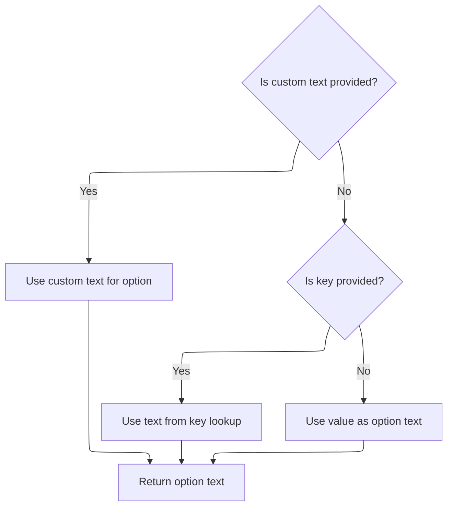

This document describes how an HTML option element is generated and rendered as part of a dropdown menu. The process assembles the option's attributes and determines the display text, which may come from custom text, a localization key, or the value itself.

# Writing the option element to the page

<SwmSnippet path="/taglib/src/main/java/org/apache/struts/taglib/html/OptionTag.java" line="319">

---

DoEndTag kicks off the flow by writing the option element HTML to the page using <SwmToken path="taglib/src/main/java/org/apache/struts/taglib/html/OptionTag.java" pos="320:14:14" line-data="        TagUtils.getInstance().write(pageContext, this.renderOptionElement());">`renderOptionElement`</SwmToken>. We call <SwmToken path="taglib/src/main/java/org/apache/struts/taglib/html/OptionTag.java" pos="320:14:14" line-data="        TagUtils.getInstance().write(pageContext, this.renderOptionElement());">`renderOptionElement`</SwmToken> here to generate the actual markup for the option, which is then output via <SwmToken path="taglib/src/main/java/org/apache/struts/taglib/html/OptionTag.java" pos="320:1:1" line-data="        TagUtils.getInstance().write(pageContext, this.renderOptionElement());">`TagUtils`</SwmToken>. This keeps the tag lifecycle and rendering logic separate.

```java
    public int doEndTag() throws JspException {
        TagUtils.getInstance().write(pageContext, this.renderOptionElement());

        return (EVAL_PAGE);
    }
```

---

</SwmSnippet>

# Building the option element markup

<SwmSnippet path="/taglib/src/main/java/org/apache/struts/taglib/html/OptionTag.java" line="331">

---

In <SwmToken path="taglib/src/main/java/org/apache/struts/taglib/html/OptionTag.java" pos="331:5:5" line-data="    protected String renderOptionElement()">`renderOptionElement`</SwmToken>, we build up the option tag markup, adding attributes like value, disabled, selected, style, id, class, dir, lang, and title. We call message next to resolve the title attribute, since it could be a literal or a localization key.

```java
    protected String renderOptionElement()
        throws JspException {
        StringBuffer results = new StringBuffer("<option value=\"");

        if (filter) {
            results.append(TagUtils.getInstance().filter(this.value));
        }
        else {
            results.append(this.value);
        }
        results.append("\"");

        if (disabled) {
            results.append(" disabled=\"disabled\"");
        }

        if (this.selectTag().isMatched(this.value)) {
            results.append(" selected=\"selected\"");
        }

        if (style != null) {
            results.append(" style=\"");
            results.append(TagUtils.getInstance().filter(style));
            results.append("\"");
        }

        if (styleId != null) {
            results.append(" id=\"");
            results.append(TagUtils.getInstance().filter(styleId));
            results.append("\"");
        }

        if (styleClass != null) {
            results.append(" class=\"");
            results.append(TagUtils.getInstance().filter(styleClass));
            results.append("\"");
        }

        if (dir != null) {
            results.append(" dir=\"");
            results.append(TagUtils.getInstance().filter(dir));
            results.append("\"");
        }

        if (lang != null) {
            results.append(" lang=\"");
            results.append(TagUtils.getInstance().filter(lang));
            results.append("\"");
        }

        if (title != null || titleKey != null) {
            results.append(" title=\"");
            results.append(message(title, titleKey));
            results.append("\"");
        }
        
```

---

</SwmSnippet>

<SwmSnippet path="/taglib/src/main/java/org/apache/struts/taglib/html/OptionTag.java" line="446">

---

Message enforces that only one of literal or key can be used. If both are set, it throws an exception with a localized error message. Otherwise, it returns the literal, a localized string, or null, depending on what's provided.

```java
    protected String message(String literal, String key)
        throws JspException {
        if (literal != null) {
            if (key != null) {
                JspException e =
                    new JspException(messages.getMessage("common.both"));

                TagUtils.getInstance().saveException(pageContext, e);
                throw e;
            } else {
                return (literal);
            }
        } else {
            if (key != null) {
                return TagUtils.getInstance().message(pageContext, getBundle(),
                    getLocale(), key);
            } else {
                return null;
            }
        }
    }
```

---

</SwmSnippet>

<SwmSnippet path="/taglib/src/main/java/org/apache/struts/taglib/html/OptionTag.java" line="387">

---

Back in <SwmToken path="taglib/src/main/java/org/apache/struts/taglib/html/OptionTag.java" pos="320:14:14" line-data="        TagUtils.getInstance().write(pageContext, this.renderOptionElement());">`renderOptionElement`</SwmToken>, after resolving the title, we call text to figure out what goes inside the option tag. This ensures the visible text is set, using localization or fallback if needed.

```java
        results.append(">");

        results.append(text());

```

---

</SwmSnippet>

## Resolving the option display text



<SwmSnippet path="/taglib/src/main/java/org/apache/struts/taglib/html/OptionTag.java" line="473">

---

In text, we check if there's a literal text. If not and there's a key, we call message to get a localized string for the option display.

```java
    protected String text() throws JspException {
        String optionText = this.text;

        if ((optionText == null) && (this.key != null)) {
            optionText =
                TagUtils.getInstance().message(pageContext, bundle, locale, key);
        }

```

---

</SwmSnippet>

<SwmSnippet path="/taglib/src/main/java/org/apache/struts/taglib/html/OptionTag.java" line="481">

---

After message returns, if we still don't have text, text just uses the value as a fallback. This guarantees the option tag always has something to show.

```java
        // no body text and no key to lookup so display the value
        if (optionText == null) {
            optionText = this.value;
        }

        return optionText;
    }
```

---

</SwmSnippet>

## Finalizing the option element markup

<SwmSnippet path="/taglib/src/main/java/org/apache/struts/taglib/html/OptionTag.java" line="391">

---

After text returns, <SwmToken path="taglib/src/main/java/org/apache/struts/taglib/html/OptionTag.java" pos="320:14:14" line-data="        TagUtils.getInstance().write(pageContext, this.renderOptionElement());">`renderOptionElement`</SwmToken> closes the option tag and returns the full markup string, which is then written out in <SwmToken path="taglib/src/main/java/org/apache/struts/taglib/html/OptionTag.java" pos="319:5:5" line-data="    public int doEndTag() throws JspException {">`doEndTag`</SwmToken>.

```java
        results.append("</option>");

        return results.toString();
    }
```

---

</SwmSnippet>

&nbsp;

*This is an auto-generated document by Swimm 🌊 and has not yet been verified by a human*

<SwmMeta version="3.0.0" repo-id="Z2l0aHViJTNBJTNBc3RydXRzMSUzQSUzQVN3aW1tLURlbW8=" repo-name="struts1"><sup>Powered by [Swimm](https://app.swimm.io/)</sup></SwmMeta>
