This document describes how the system prepares and renders the start of a form for user interaction on a web page. The process involves resolving the form's configuration, generating the opening markup with required attributes and security tokens, and preparing the form bean for data binding.

# Starting Form Processing

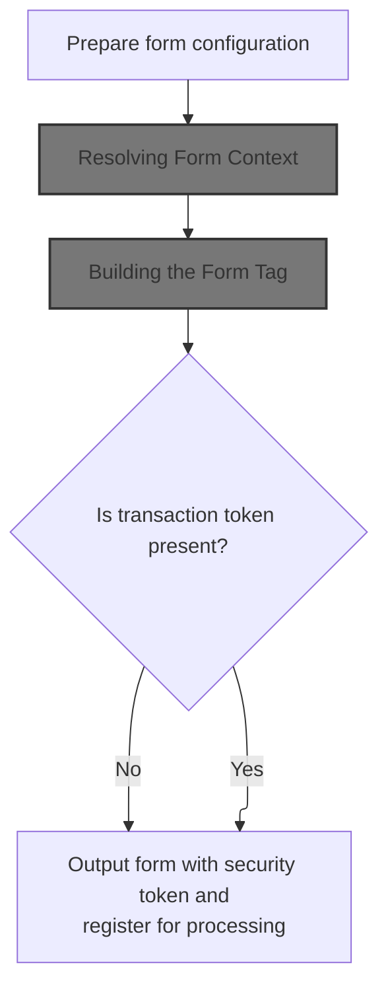

<SwmSnippet path="/taglib/src/main/java/org/apache/struts/taglib/html/FormTag.java" line="483">

---

In <SwmToken path="taglib/src/main/java/org/apache/struts/taglib/html/FormTag.java" pos="483:5:5" line-data="    public int doStartTag() throws JspException {">`doStartTag`</SwmToken>, we kick things off by clearing any previous <SwmToken path="taglib/src/main/java/org/apache/struts/taglib/html/FormTag.java" pos="485:1:1" line-data="        postbackAction = null;">`postbackAction`</SwmToken> and immediately call lookup() to resolve all the config and context needed for the form tag. Without this, we wouldn't know which form bean or action mapping to use.

```java
    public int doStartTag() throws JspException {

        postbackAction = null;

        // Look up the form bean name, scope, and type if necessary
        this.lookup();

```

---

</SwmSnippet>

## Resolving Form Context

```mermaid
%%{init: {"flowchart": {"defaultRenderer": "elk"}} }%%
flowchart TD
  node1["Start form setup"]
  click node1 openCode "taglib/src/main/java/org/apache/struts/taglib/html/FormTag.java:814:818"
  node1 --> node2{"Is module configuration present?"}
  click node2 openCode "taglib/src/main/java/org/apache/struts/taglib/html/FormTag.java:819:826"
  node2 -->|"No"| node3["Fetching Localized Error Message"]
  
  node2 -->|"Yes"| node4{"Is form action provided?"}
  click node4 openCode "taglib/src/main/java/org/apache/struts/taglib/html/FormTag.java:828:833"
  node4 -->|"No"| node5["Accessing the HTTP Request"]
  
  node4 -->|"Yes"| node6["Use specified form action"]
  click node6 openCode "taglib/src/main/java/org/apache/struts/taglib/html/FormTag.java:834:849"
  node5 --> node7{"Is action mapping found?"}
  node6 --> node7
  
  node7 -->|"No"| node8["Wildcard Action Mapping"]
  
  node8 --> node9{"Is mapping found after match?"}
  
  node9 -->|"No"| node10["Delegating Message Lookup"]
  
  node9 -->|"Yes"| node11{"Is form bean configuration found?"}
  click node11 openCode "taglib/src/main/java/org/apache/struts/taglib/html/FormTag.java:871:873"
  node7 -->|"Yes"| node11
  node11 -->|"No"| node12["User sees error: No form bean
configuration"]
  click node12 openCode "core/src/main/java/org/apache/struts/util/MessageResources.java:218:218"
  node11 -->|"Yes"| node13["Form is ready for submission"]
  click node13 openCode "taglib/src/main/java/org/apache/struts/taglib/html/FormTag.java:889:893"
classDef HeadingStyle fill:#777777,stroke:#333,stroke-width:2px;
click node3 goToHeading "Fetching Localized Error Message"
node3:::HeadingStyle
click node5 goToHeading "Accessing the HTTP Request"
node5:::HeadingStyle
click node7 goToHeading "Finding Action Mapping"
node7:::HeadingStyle
click node8 goToHeading "Wildcard Action Mapping"
node8:::HeadingStyle
click node9 goToHeading "Adapting ActionConfig for Wildcards"
node9:::HeadingStyle
click node10 goToHeading "Delegating Message Lookup"
node10:::HeadingStyle

%% Swimm:
%% %%{init: {"flowchart": {"defaultRenderer": "elk"}} }%%
%% flowchart TD
%%   node1["Start form setup"]
%%   click node1 openCode "<SwmPath>[taglib/…/html/FormTag.java](taglib/src/main/java/org/apache/struts/taglib/html/FormTag.java)</SwmPath>:814:818"
%%   node1 --> node2{"Is module configuration present?"}
%%   click node2 openCode "<SwmPath>[taglib/…/html/FormTag.java](taglib/src/main/java/org/apache/struts/taglib/html/FormTag.java)</SwmPath>:819:826"
%%   node2 -->|"No"| node3["Fetching Localized Error Message"]
%%   
%%   node2 -->|"Yes"| node4{"Is form action provided?"}
%%   click node4 openCode "<SwmPath>[taglib/…/html/FormTag.java](taglib/src/main/java/org/apache/struts/taglib/html/FormTag.java)</SwmPath>:828:833"
%%   node4 -->|"No"| node5["Accessing the HTTP Request"]
%%   
%%   node4 -->|"Yes"| node6["Use specified form action"]
%%   click node6 openCode "<SwmPath>[taglib/…/html/FormTag.java](taglib/src/main/java/org/apache/struts/taglib/html/FormTag.java)</SwmPath>:834:849"
%%   node5 --> node7{"Is action mapping found?"}
%%   node6 --> node7
%%   
%%   node7 -->|"No"| node8["Wildcard Action Mapping"]
%%   
%%   node8 --> node9{"Is mapping found after match?"}
%%   
%%   node9 -->|"No"| node10["Delegating Message Lookup"]
%%   
%%   node9 -->|"Yes"| node11{"Is form bean configuration found?"}
%%   click node11 openCode "<SwmPath>[taglib/…/html/FormTag.java](taglib/src/main/java/org/apache/struts/taglib/html/FormTag.java)</SwmPath>:871:873"
%%   node7 -->|"Yes"| node11
%%   node11 -->|"No"| node12["User sees error: No form bean
%% configuration"]
%%   click node12 openCode "<SwmPath>[core/…/util/MessageResources.java](core/src/main/java/org/apache/struts/util/MessageResources.java)</SwmPath>:218:218"
%%   node11 -->|"Yes"| node13["Form is ready for submission"]
%%   click node13 openCode "<SwmPath>[taglib/…/html/FormTag.java](taglib/src/main/java/org/apache/struts/taglib/html/FormTag.java)</SwmPath>:889:893"
%% classDef HeadingStyle fill:#777777,stroke:#333,stroke-width:2px;
%% click node3 goToHeading "Fetching Localized Error Message"
%% node3:::HeadingStyle
%% click node5 goToHeading "Accessing the HTTP Request"
%% node5:::HeadingStyle
%% click node7 goToHeading "Finding Action Mapping"
%% node7:::HeadingStyle
%% click node8 goToHeading "Wildcard Action Mapping"
%% node8:::HeadingStyle
%% click node9 goToHeading "Adapting <SwmToken path="taglib/src/main/java/org/apache/struts/taglib/html/FormTag.java" pos="844:1:1" line-data="            ActionConfig actionConfig = moduleConfig.findActionConfigId(this.action);">`ActionConfig`</SwmToken> for Wildcards"
%% node9:::HeadingStyle
%% click node10 goToHeading "Delegating Message Lookup"
%% node10:::HeadingStyle
```

<SwmSnippet path="/taglib/src/main/java/org/apache/struts/taglib/html/FormTag.java" line="814">

---

In <SwmToken path="taglib/src/main/java/org/apache/struts/taglib/html/FormTag.java" pos="814:5:5" line-data="    protected void lookup() throws JspException {">`lookup`</SwmToken>, we grab the module configuration for the current page context. If it's missing, we use <SwmToken path="taglib/src/main/java/org/apache/struts/taglib/html/FormTag.java" pos="31:10:10" line-data="import org.apache.struts.util.MessageResources;">`MessageResources`</SwmToken> to get a localized error message and throw a <SwmToken path="taglib/src/main/java/org/apache/struts/taglib/html/FormTag.java" pos="814:11:11" line-data="    protected void lookup() throws JspException {">`JspException`</SwmToken>, making sure the error is visible and understandable.

```java
    protected void lookup() throws JspException {

        // Look up the module configuration information we need
        moduleConfig = TagUtils.getInstance().getModuleConfig(pageContext);

        if (moduleConfig == null) {
            JspException e =
                new JspException(messages.getMessage("formTag.collections"));

            pageContext.setAttribute(Globals.EXCEPTION_KEY, e,
                PageContext.REQUEST_SCOPE);
            throw e;
        }

```

---

</SwmSnippet>

### Fetching Localized Error Message

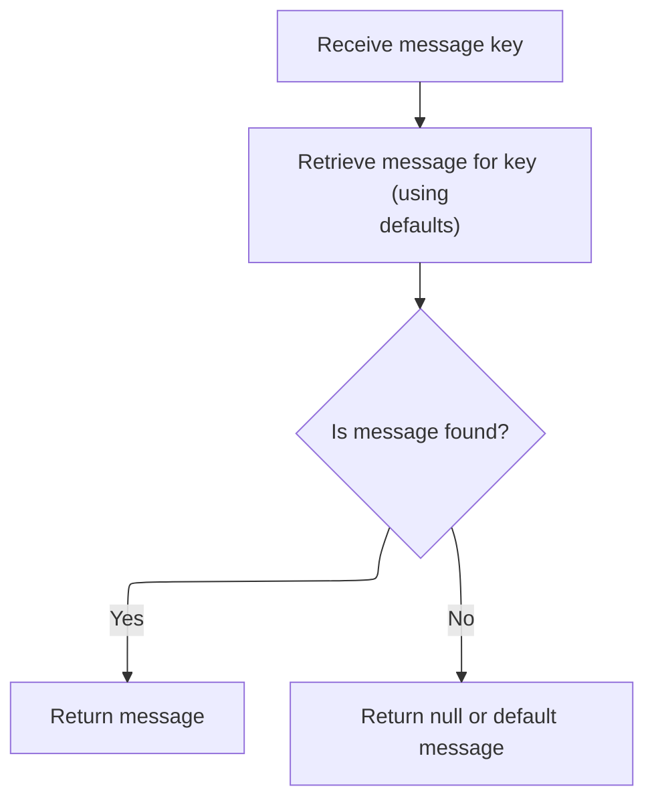

<SwmSnippet path="/core/src/main/java/org/apache/struts/util/MessageResources.java" line="196">

---

<SwmToken path="core/src/main/java/org/apache/struts/util/MessageResources.java" pos="196:5:10" line-data="    public String getMessage(String key) {">`getMessage(String key)`</SwmToken> just delegates to the more general <SwmToken path="core/src/main/java/org/apache/struts/util/MessageResources.java" pos="196:5:5" line-data="    public String getMessage(String key) {">`getMessage`</SwmToken> method, passing null for locale and arguments. It's a shortcut for fetching a plain message string.

```java
    public String getMessage(String key) {
        return this.getMessage((Locale) null, key, null);
    }
```

---

</SwmSnippet>

### Delegating Message Lookup

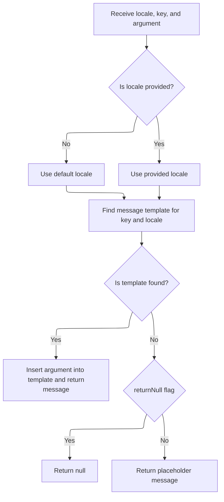

<SwmSnippet path="/core/src/main/java/org/apache/struts/util/MessageResources.java" line="324">

---

<SwmToken path="core/src/main/java/org/apache/struts/util/MessageResources.java" pos="324:5:5" line-data="    public String getMessage(Locale locale, String key, Object arg0) {">`getMessage`</SwmToken>`(`<SwmToken path="core/src/main/java/org/apache/struts/util/MessageResources.java" pos="324:7:7" line-data="    public String getMessage(Locale locale, String key, Object arg0) {">`Locale`</SwmToken>`, `<SwmToken path="core/src/main/java/org/apache/struts/util/MessageResources.java" pos="324:3:3" line-data="    public String getMessage(Locale locale, String key, Object arg0) {">`String`</SwmToken>`, `<SwmToken path="core/src/main/java/org/apache/struts/util/MessageResources.java" pos="324:17:17" line-data="    public String getMessage(Locale locale, String key, Object arg0) {">`Object`</SwmToken>`)` adapts the call to the main message formatting method by wrapping the argument in an array.

```java
    public String getMessage(Locale locale, String key, Object arg0) {
        return this.getMessage(locale, key, new Object[] { arg0 });
    }
```

---

</SwmSnippet>

<SwmSnippet path="/core/src/main/java/org/apache/struts/util/MessageResources.java" line="286">

---

<SwmToken path="core/src/main/java/org/apache/struts/util/MessageResources.java" pos="286:5:5" line-data="    public String getMessage(Locale locale, String key, Object[] args) {">`getMessage`</SwmToken>`(`<SwmToken path="core/src/main/java/org/apache/struts/util/MessageResources.java" pos="286:7:7" line-data="    public String getMessage(Locale locale, String key, Object[] args) {">`Locale`</SwmToken>`, `<SwmToken path="core/src/main/java/org/apache/struts/util/MessageResources.java" pos="286:3:3" line-data="    public String getMessage(Locale locale, String key, Object[] args) {">`String`</SwmToken>`, `<SwmToken path="core/src/main/java/org/apache/struts/util/MessageResources.java" pos="286:17:17" line-data="    public String getMessage(Locale locale, String key, Object[] args) {">`Object`</SwmToken>`[])` does the heavy lifting: it ensures a valid locale, caches <SwmToken path="core/src/main/java/org/apache/struts/util/MessageResources.java" pos="287:5:5" line-data="        // Cache MessageFormat instances as they are accessed">`MessageFormat`</SwmToken> objects for performance, handles missing messages with a visible placeholder, and formats the message with any arguments.

```java
    public String getMessage(Locale locale, String key, Object[] args) {
        // Cache MessageFormat instances as they are accessed
        if (locale == null) {
            locale = defaultLocale;
        }

        MessageFormat format = null;
        String formatKey = messageKey(locale, key);

        synchronized (formats) {
            format = (MessageFormat) formats.get(formatKey);

            if (format == null) {
                String formatString = getMessage(locale, key);

                if (formatString == null) {
                    return returnNull ? null : ("???" + formatKey + "???");
                }

                format = new MessageFormat(escape(formatString));
                format.setLocale(locale);
                formats.put(formatKey, format);
            }
        }

        return format.format(args);
    }
```

---

</SwmSnippet>

### Determining Action Path

<SwmSnippet path="/taglib/src/main/java/org/apache/struts/taglib/html/FormTag.java" line="828">

---

Back in <SwmToken path="taglib/src/main/java/org/apache/struts/taglib/html/FormTag.java" pos="488:3:3" line-data="        this.lookup();">`lookup`</SwmToken>, after getting the error message, we check if the action is set. If not, we grab the original request URI from the request, so the form knows where to post back.

```java
        String calcAction = this.action;

        // If the action is not specified, use the original request uri
        if (this.action == null) {
            HttpServletRequest request =
                (HttpServletRequest) pageContext.getRequest();
```

---

</SwmSnippet>

### Accessing the HTTP Request

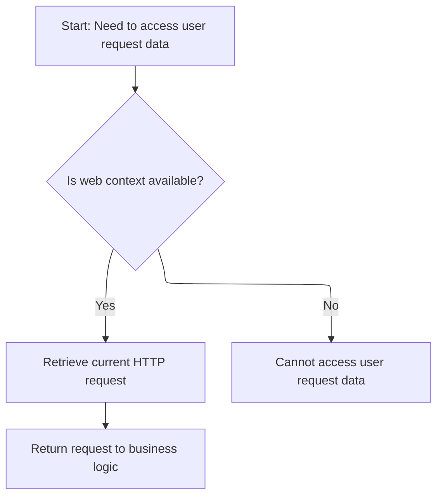

<SwmSnippet path="/core/src/main/java/org/apache/struts/chain/contexts/ServletActionContext.java" line="94">

---

<SwmToken path="core/src/main/java/org/apache/struts/chain/contexts/ServletActionContext.java" pos="94:5:7" line-data="    public HttpServletRequest getRequest() {">`getRequest()`</SwmToken> just fetches the <SwmToken path="core/src/main/java/org/apache/struts/chain/contexts/ServletActionContext.java" pos="94:3:3" line-data="    public HttpServletRequest getRequest() {">`HttpServletRequest`</SwmToken> from the current servlet context, so we can access request attributes like the original URI.

```java
    public HttpServletRequest getRequest() {
        return servletWebContext().getRequest();
    }
```

---

</SwmSnippet>

<SwmSnippet path="/core/src/main/java/org/apache/struts/chain/contexts/ServletActionContext.java" line="67">

---

<SwmToken path="core/src/main/java/org/apache/struts/chain/contexts/ServletActionContext.java" pos="67:5:7" line-data="    protected ServletWebContext servletWebContext() {">`servletWebContext()`</SwmToken> casts the base context to <SwmToken path="core/src/main/java/org/apache/struts/chain/contexts/ServletActionContext.java" pos="67:3:3" line-data="    protected ServletWebContext servletWebContext() {">`ServletWebContext`</SwmToken>, assuming that's always safe. If it's not, things will break, but that's the contract here.

```java
    protected ServletWebContext servletWebContext() {
        return (ServletWebContext) this.getBaseContext();
    }
```

---

</SwmSnippet>

### Normalizing Action Path

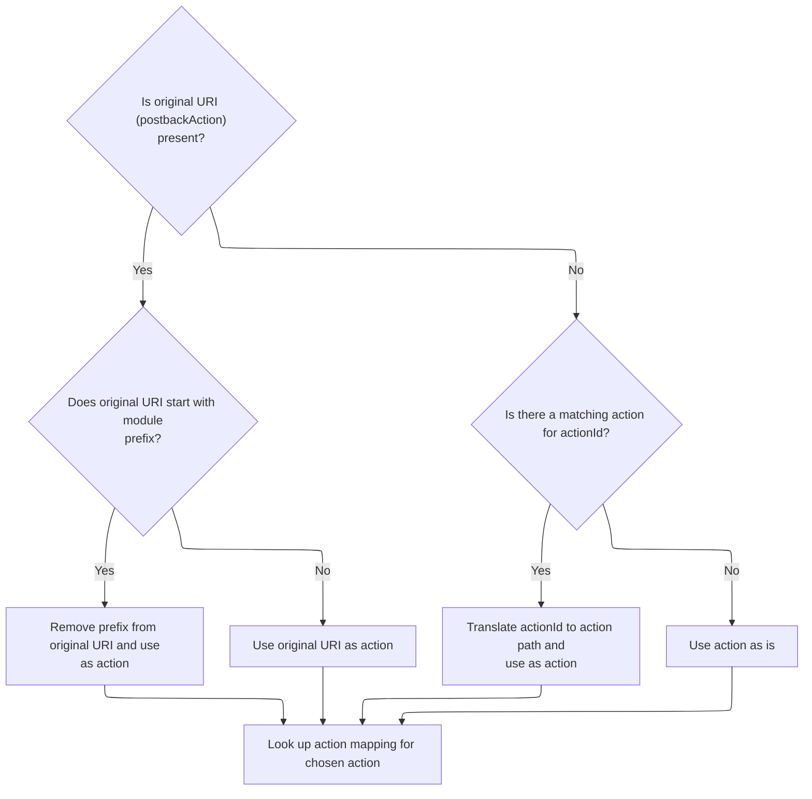

<SwmSnippet path="/taglib/src/main/java/org/apache/struts/taglib/html/FormTag.java" line="834">

---

Back in <SwmToken path="taglib/src/main/java/org/apache/struts/taglib/html/FormTag.java" pos="488:3:3" line-data="        this.lookup();">`lookup`</SwmToken>, after getting the request, we strip module prefixes and extensions from the action path, then call TagUtils.getActionMappingName to normalize it for mapping lookup.

```java
            postbackAction =
                (String) request.getAttribute(Globals.ORIGINAL_URI_KEY);

            String prefix = moduleConfig.getPrefix();
            if (postbackAction != null && prefix.length() > 0 && postbackAction.startsWith(prefix)) {
                postbackAction = postbackAction.substring(prefix.length());
            }
            calcAction = postbackAction;
        } else {
            // Translate the action if it is an actionId
            ActionConfig actionConfig = moduleConfig.findActionConfigId(this.action);
            if (actionConfig != null) {
                this.action = actionConfig.getPath();
                calcAction = this.action;
            }
        }

        servlet =
            (ActionServlet) pageContext.getServletContext().getAttribute(Globals.ACTION_SERVLET_KEY);

        // Look up the action mapping we will be submitting to
        String mappingName =
            TagUtils.getInstance().getActionMappingName(calcAction);

```

---

</SwmSnippet>

<SwmSnippet path="/taglib/src/main/java/org/apache/struts/taglib/TagUtils.java" line="620">

---

<SwmToken path="taglib/src/main/java/org/apache/struts/taglib/TagUtils.java" pos="620:5:5" line-data="    public String getActionMappingName(String action) {">`getActionMappingName`</SwmToken> strips query parameters, fragments, and file extensions from the action string, then ensures it starts with a slash. This is all about getting a clean path for action mapping.

```java
    public String getActionMappingName(String action) {
        String value = action;
        int question = action.indexOf("?");

        if (question >= 0) {
            value = value.substring(0, question);
        }

        int pound = value.indexOf("#");

        if (pound >= 0) {
            value = value.substring(0, pound);
        }

        int slash = value.lastIndexOf("/");
        int period = value.lastIndexOf(".");

        if ((period >= 0) && (period > slash)) {
            value = value.substring(0, period);
        }

        return value.startsWith("/") ? value : ("/" + value);
    }
```

---

</SwmSnippet>

<SwmSnippet path="/taglib/src/main/java/org/apache/struts/taglib/html/FormTag.java" line="858">

---

Back in <SwmToken path="taglib/src/main/java/org/apache/struts/taglib/html/FormTag.java" pos="488:3:3" line-data="        this.lookup();">`lookup`</SwmToken>, after normalizing the action path, we look up the <SwmToken path="taglib/src/main/java/org/apache/struts/taglib/html/FormTag.java" pos="858:6:6" line-data="        mapping = (ActionMapping) moduleConfig.findActionConfig(mappingName);">`ActionMapping`</SwmToken> using the cleaned-up name. This ties the form to the right action handler.

```java
        mapping = (ActionMapping) moduleConfig.findActionConfig(mappingName);

```

---

</SwmSnippet>

### Finding Action Mapping

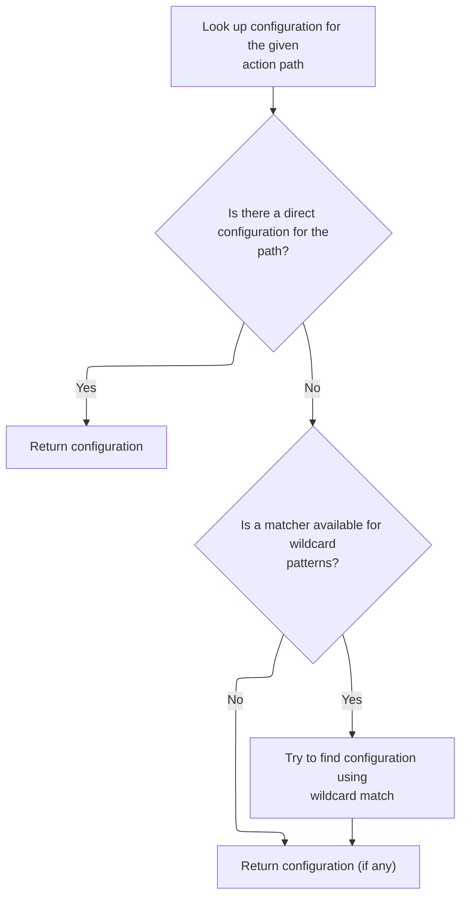

<SwmSnippet path="/core/src/main/java/org/apache/struts/config/impl/ModuleConfigImpl.java" line="436">

---

<SwmToken path="core/src/main/java/org/apache/struts/config/impl/ModuleConfigImpl.java" pos="436:5:5" line-data="    public ActionConfig findActionConfig(String path) {">`findActionConfig`</SwmToken> first tries a direct lookup for the action mapping. If that fails and a matcher is available, it tries wildcard matching for more flexible config.

```java
    public ActionConfig findActionConfig(String path) {
        ActionConfig config = (ActionConfig) actionConfigs.get(path);

        // If a direct match cannot be found, try to match action configs
        // containing wildcard patterns only if a matcher exists.
        if ((config == null) && (matcher != null)) {
            config = matcher.match(path);
        }

        return config;
    }
```

---

</SwmSnippet>

### Wildcard Action Mapping

See <SwmLink doc-title="Matching Paths to Wildcard Patterns">[Matching Paths to Wildcard Patterns](/.swm/matching-paths-to-wildcard-patterns.x4ijscmy.sw.md)</SwmLink>

### Adapting <SwmToken path="taglib/src/main/java/org/apache/struts/taglib/html/FormTag.java" pos="844:1:1" line-data="            ActionConfig actionConfig = moduleConfig.findActionConfigId(this.action);">`ActionConfig`</SwmToken> for Wildcards

See <SwmLink doc-title="Dynamic Action Configuration Creation">[Dynamic Action Configuration Creation](/.swm/dynamic-action-configuration-creation.48jsx9r2.sw.md)</SwmLink>

### Validating Form Bean Config

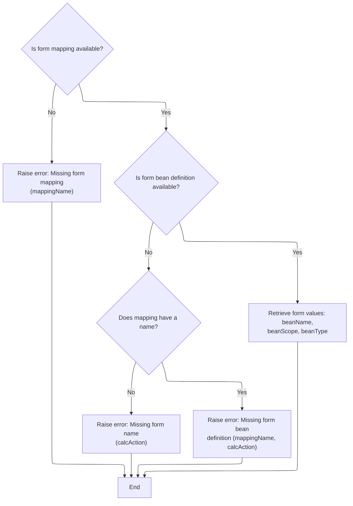

<SwmSnippet path="/taglib/src/main/java/org/apache/struts/taglib/html/FormTag.java" line="860">

---

Back in <SwmToken path="taglib/src/main/java/org/apache/struts/taglib/html/FormTag.java" pos="488:3:3" line-data="        this.lookup();">`lookup`</SwmToken>, if the mapping isn't found, we fetch a localized error message and throw a <SwmToken path="taglib/src/main/java/org/apache/struts/taglib/html/FormTag.java" pos="861:1:1" line-data="            JspException e =">`JspException`</SwmToken>, making the problem clear to whoever is using the tag.

```java
        if (mapping == null) {
            JspException e =
                new JspException(messages.getMessage("formTag.mapping",
                        mappingName));

            pageContext.setAttribute(Globals.EXCEPTION_KEY, e,
                PageContext.REQUEST_SCOPE);
            throw e;
        }

        // Look up the form bean definition
        FormBeanConfig formBeanConfig =
            moduleConfig.findFormBeanConfig(mapping.getName());

        if (formBeanConfig == null) {
            JspException e = null;

            if (mapping.getName() == null) {
                e = new JspException(messages.getMessage("formTag.name", calcAction));
            } else {
```

---

</SwmSnippet>

<SwmSnippet path="/core/src/main/java/org/apache/struts/util/MessageResources.java" line="218">

---

<SwmToken path="core/src/main/java/org/apache/struts/util/MessageResources.java" pos="218:5:15" line-data="    public String getMessage(String key, Object arg0) {">`getMessage(String key, Object arg0)`</SwmToken> fetches a message and plugs in the mapping name, so the error message is specific to what failed.

```java
    public String getMessage(String key, Object arg0) {
        return this.getMessage((Locale) null, key, arg0);
    }
```

---

</SwmSnippet>

<SwmSnippet path="/taglib/src/main/java/org/apache/struts/taglib/html/FormTag.java" line="880">

---

Back in <SwmToken path="taglib/src/main/java/org/apache/struts/taglib/html/FormTag.java" pos="488:3:3" line-data="        this.lookup();">`lookup`</SwmToken>, if the form bean config is missing, we check if the mapping name is null and fetch a different error message depending on what's missing, then throw a <SwmToken path="taglib/src/main/java/org/apache/struts/taglib/html/FormTag.java" pos="880:7:7" line-data="                e = new JspException(messages.getMessage(&quot;formTag.formBean&quot;,">`JspException`</SwmToken>.

```java
                e = new JspException(messages.getMessage("formTag.formBean",
                            mapping.getName(), calcAction));
            }

            pageContext.setAttribute(Globals.EXCEPTION_KEY, e,
                PageContext.REQUEST_SCOPE);
            throw e;
        }

```

---

</SwmSnippet>

<SwmSnippet path="/taglib/src/main/java/org/apache/struts/taglib/html/FormTag.java" line="889">

---

Back in <SwmToken path="taglib/src/main/java/org/apache/struts/taglib/html/FormTag.java" pos="488:3:3" line-data="        this.lookup();">`lookup`</SwmToken>, after all the error handling, we set up <SwmToken path="taglib/src/main/java/org/apache/struts/taglib/html/FormTag.java" pos="890:1:1" line-data="        beanName = mapping.getAttribute();">`beanName`</SwmToken>, <SwmToken path="taglib/src/main/java/org/apache/struts/taglib/html/FormTag.java" pos="891:1:1" line-data="        beanScope = mapping.getScope();">`beanScope`</SwmToken>, and <SwmToken path="taglib/src/main/java/org/apache/struts/taglib/html/FormTag.java" pos="892:1:1" line-data="        beanType = formBeanConfig.getType();">`beanType`</SwmToken> from the mapping and form bean config, so the tag has everything it needs for rendering and binding.

```java
        // Calculate the required values
        beanName = mapping.getAttribute();
        beanScope = mapping.getScope();
        beanType = formBeanConfig.getType();
    }
```

---

</SwmSnippet>

## Rendering the Form Start

<SwmSnippet path="/taglib/src/main/java/org/apache/struts/taglib/html/FormTag.java" line="490">

---

Back in <SwmToken path="taglib/src/main/java/org/apache/struts/taglib/html/FormTag.java" pos="483:5:5" line-data="    public int doStartTag() throws JspException {">`doStartTag`</SwmToken>, after lookup, we start building the form tag by calling <SwmToken path="taglib/src/main/java/org/apache/struts/taglib/html/FormTag.java" pos="493:7:7" line-data="        results.append(this.renderFormStartElement());">`renderFormStartElement`</SwmToken>, which generates the opening <form> element with all the right attributes.

```java
        // Create an appropriate "form" element based on our parameters
        StringBuffer results = new StringBuffer();

        results.append(this.renderFormStartElement());

```

---

</SwmSnippet>

## Building the Form Tag

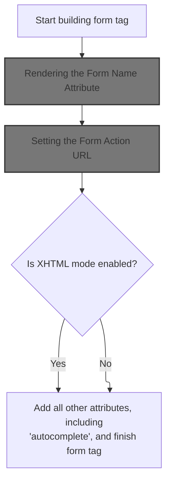

<SwmSnippet path="/taglib/src/main/java/org/apache/struts/taglib/html/FormTag.java" line="553">

---

In <SwmToken path="taglib/src/main/java/org/apache/struts/taglib/html/FormTag.java" pos="553:5:5" line-data="    protected String renderFormStartElement()">`renderFormStartElement`</SwmToken>, we start building the <form> tag using a <SwmToken path="taglib/src/main/java/org/apache/struts/taglib/html/FormTag.java" pos="555:1:1" line-data="        StringBuffer results = new StringBuffer(&quot;&lt;form&quot;);">`StringBuffer`</SwmToken> and immediately call <SwmToken path="taglib/src/main/java/org/apache/struts/taglib/html/FormTag.java" pos="558:1:1" line-data="        renderName(results);">`renderName`</SwmToken> to add the name attribute before anything else.

```java
    protected String renderFormStartElement()
        throws JspException {
        StringBuffer results = new StringBuffer("<form");

        // render attributes
        renderName(results);

```

---

</SwmSnippet>

### Rendering the Form Name Attribute

See <SwmLink doc-title="Rendering Form Attributes Based on Output Format">[Rendering Form Attributes Based on Output Format](/.swm/rendering-form-attributes-based-on-output-format.p9kb7mao.sw.md)</SwmLink>

### Adding Form Attributes

<SwmSnippet path="/taglib/src/main/java/org/apache/struts/taglib/html/FormTag.java" line="560">

---

Back in <SwmToken path="taglib/src/main/java/org/apache/struts/taglib/html/FormTag.java" pos="493:7:7" line-data="        results.append(this.renderFormStartElement());">`renderFormStartElement`</SwmToken>, after adding the name and method attributes, we call <SwmToken path="taglib/src/main/java/org/apache/struts/taglib/html/FormTag.java" pos="562:1:1" line-data="        renderAction(results);">`renderAction`</SwmToken> to set up where the form will submit.

```java
        renderAttribute(results, "method",
            (getMethod() == null) ? "post" : getMethod());
        renderAction(results);
```

---

</SwmSnippet>

### Setting the Form Action URL

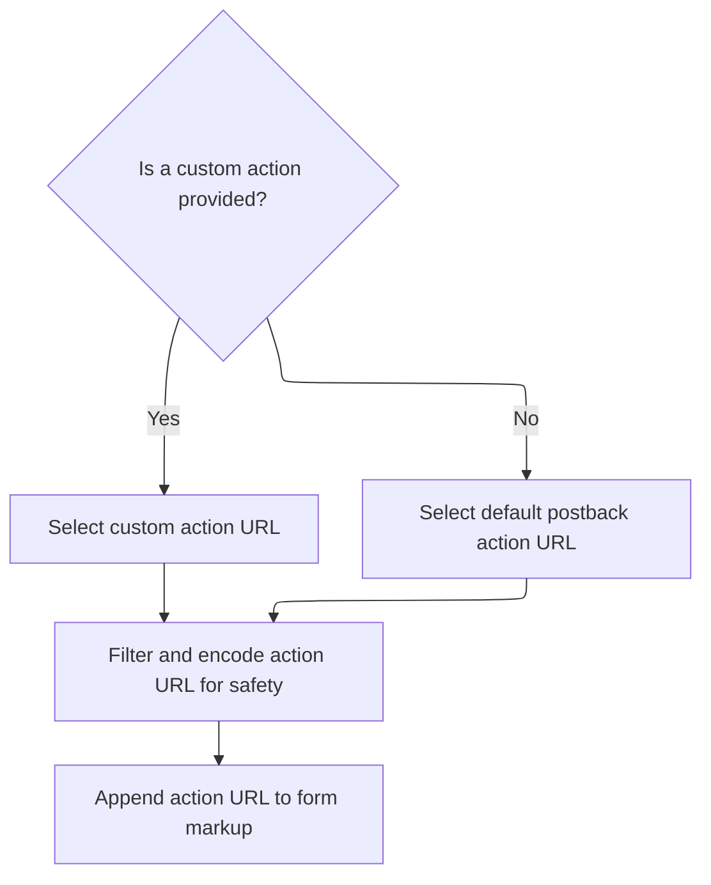

<SwmSnippet path="/taglib/src/main/java/org/apache/struts/taglib/html/FormTag.java" line="605">

---

In <SwmToken path="taglib/src/main/java/org/apache/struts/taglib/html/FormTag.java" pos="605:5:5" line-data="    protected void renderAction(StringBuffer results) {">`renderAction`</SwmToken>, we figure out which action URL to use and grab the <SwmToken path="taglib/src/main/java/org/apache/struts/taglib/html/FormTag.java" pos="607:1:1" line-data="        HttpServletResponse response =">`HttpServletResponse`</SwmToken> so we can encode the URL properly before putting it in the form tag.

```java
    protected void renderAction(StringBuffer results) {
        String calcAction = (this.action == null ? postbackAction : this.action);
        HttpServletResponse response =
            (HttpServletResponse) this.pageContext.getResponse();

```

---

</SwmSnippet>

<SwmSnippet path="/core/src/main/java/org/apache/struts/chain/contexts/ServletActionContext.java" line="103">

---

<SwmToken path="core/src/main/java/org/apache/struts/chain/contexts/ServletActionContext.java" pos="103:5:7" line-data="    public HttpServletResponse getResponse() {">`getResponse()`</SwmToken> fetches the <SwmToken path="core/src/main/java/org/apache/struts/chain/contexts/ServletActionContext.java" pos="103:3:3" line-data="    public HttpServletResponse getResponse() {">`HttpServletResponse`</SwmToken> from the servlet context, so we can encode <SwmToken path="core/src/main/java/org/apache/struts/util/RequestUtils.java" pos="677:9:9" line-data="     * the case for URLs that were originally created from relative or">`URLs`</SwmToken> for the form action.

```java
    public HttpServletResponse getResponse() {
        return servletWebContext().getResponse();
    }
```

---

</SwmSnippet>

<SwmSnippet path="/taglib/src/main/java/org/apache/struts/taglib/html/FormTag.java" line="610">

---

Back in <SwmToken path="taglib/src/main/java/org/apache/struts/taglib/html/FormTag.java" pos="562:1:1" line-data="        renderAction(results);">`renderAction`</SwmToken>, after getting the response, we encode and filter the action URL before appending it to the form tag, making sure it's safe and correct for the browser.

```java
        results.append(" action=\"");
        results.append(TagUtils.getInstance().filter(
            response.encodeURL(
                TagUtils.getInstance().getActionMappingURL(calcAction,
                    this.pageContext))));

        results.append("\"");
    }
```

---

</SwmSnippet>

### Finalizing the Form Tag

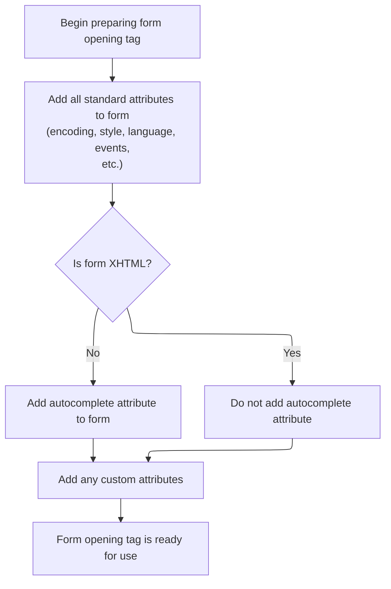

<SwmSnippet path="/taglib/src/main/java/org/apache/struts/taglib/html/FormTag.java" line="563">

---

Back in <SwmToken path="taglib/src/main/java/org/apache/struts/taglib/html/FormTag.java" pos="493:7:7" line-data="        results.append(this.renderFormStartElement());">`renderFormStartElement`</SwmToken>, after adding the main attributes, we check <SwmToken path="taglib/src/main/java/org/apache/struts/taglib/html/FormTag.java" pos="572:5:5" line-data="        if (!isXhtml()) {">`isXhtml`</SwmToken>. If not XHTML, we add the autocomplete attribute; otherwise, we skip it for compliance.

```java
        renderAttribute(results, "accept-charset", getAcceptCharset());
        renderAttribute(results, "class", getStyleClass());
        renderAttribute(results, "dir", getDir());
        renderAttribute(results, "enctype", getEnctype());
        renderAttribute(results, "lang", getLang());
        renderAttribute(results, "onreset", getOnreset());
        renderAttribute(results, "onsubmit", getOnsubmit());
        renderAttribute(results, "style", getStyle());
        renderAttribute(results, "target", getTarget());
        if (!isXhtml()) {
            renderAttribute(results, "autocomplete", getAutocomplete());
        }

```

---

</SwmSnippet>

<SwmSnippet path="/taglib/src/main/java/org/apache/struts/taglib/html/FormTag.java" line="576">

---

Here, after checking <SwmToken path="taglib/src/main/java/org/apache/struts/taglib/html/FormTag.java" pos="572:5:5" line-data="        if (!isXhtml()) {">`isXhtml`</SwmToken>, FormTag.renderFormStartElement calls <SwmToken path="taglib/src/main/java/org/apache/struts/taglib/html/FormTag.java" pos="577:1:1" line-data="        renderOtherAttributes(results);">`renderOtherAttributes`</SwmToken>(results) as a hook for subclasses to add custom attributes to the form tag. This is how Struts lets you extend the tag without touching the core logic. Then we close the opening tag and return the string.

```java
        // Hook for additional attributes
        renderOtherAttributes(results);

        results.append(">");

        return results.toString();
    }
```

---

</SwmSnippet>

## Appending Security Token

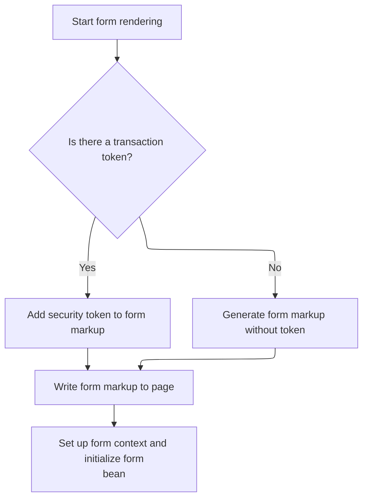

<SwmSnippet path="/taglib/src/main/java/org/apache/struts/taglib/html/FormTag.java" line="495">

---

Next in FormTag.doStartTag, after building the form tag, we call <SwmToken path="taglib/src/main/java/org/apache/struts/taglib/html/FormTag.java" pos="495:7:7" line-data="        results.append(this.renderToken());">`renderToken`</SwmToken> to append a hidden input for the CSRF token if it's available. This ties the form to the user's session for security.

```java
        results.append(this.renderToken());

```

---

</SwmSnippet>

<SwmSnippet path="/taglib/src/main/java/org/apache/struts/taglib/html/FormTag.java" line="633">

---

FormTag.renderToken builds the hidden token input if a session token exists, wrapping it in a div. It checks <SwmToken path="taglib/src/main/java/org/apache/struts/taglib/html/FormTag.java" pos="647:6:6" line-data="                if (this.isXhtml()) {">`isXhtml`</SwmToken> to decide how to close the input tag, so the markup matches the page's HTML standard.

```java
    protected String renderToken() {
        StringBuffer results = new StringBuffer();
        HttpSession session = pageContext.getSession();

        if (session != null) {
            String token =
                (String) session.getAttribute(Globals.TRANSACTION_TOKEN_KEY);

            if (token != null) {
                results.append("<div><input type=\"hidden\" name=\"");
                results.append(Constants.TOKEN_KEY);
                results.append("\" value=\"");
                results.append(TagUtils.getInstance().filter(token));

                if (this.isXhtml()) {
                    results.append("\" />");
                } else {
                    results.append("\">");
                }

                results.append("</div>");
            }
        }

        return results.toString();
    }
```

---

</SwmSnippet>

<SwmSnippet path="/taglib/src/main/java/org/apache/struts/taglib/html/FormTag.java" line="497">

---

Back in FormTag.doStartTag, after rendering the token, we use TagUtils.write to push the form markup to the page. This handles exceptions and ensures errors are logged and surfaced properly.

```java
        TagUtils.getInstance().write(pageContext, results.toString());

```

---

</SwmSnippet>

<SwmSnippet path="/taglib/src/main/java/org/apache/struts/taglib/TagUtils.java" line="1186">

---

TagUtils.write prints the markup to the page and catches IOExceptions. If there's an error, it uses <SwmToken path="taglib/src/main/java/org/apache/struts/taglib/html/FormTag.java" pos="31:10:10" line-data="import org.apache.struts.util.MessageResources;">`MessageResources`</SwmToken> to get a localized error message and throws a <SwmToken path="taglib/src/main/java/org/apache/struts/taglib/TagUtils.java" pos="1187:3:3" line-data="        throws JspException {">`JspException`</SwmToken>, so errors are visible and understandable.

```java
    public void write(PageContext pageContext, String text)
        throws JspException {
        JspWriter writer = pageContext.getOut();

        try {
            writer.print(text);
        } catch (IOException e) {
            saveException(pageContext, e);
            throw new JspException(messages.getMessage("write.io", e.toString()), e);
        }
    }
```

---

</SwmSnippet>

<SwmSnippet path="/taglib/src/main/java/org/apache/struts/taglib/html/FormTag.java" line="499">

---

Finally in FormTag.doStartTag, after writing the markup, we store the tag instance in the page context and call <SwmToken path="taglib/src/main/java/org/apache/struts/taglib/html/FormTag.java" pos="503:3:3" line-data="        this.initFormBean();">`initFormBean`</SwmToken> to set up the form bean for the rest of the page. Then we return <SwmToken path="taglib/src/main/java/org/apache/struts/taglib/html/FormTag.java" pos="505:4:4" line-data="        return (EVAL_BODY_INCLUDE);">`EVAL_BODY_INCLUDE`</SwmToken> to process the body.

```java
        // Store this tag itself as a page attribute
        pageContext.setAttribute(Constants.FORM_KEY, this,
            PageContext.REQUEST_SCOPE);

        this.initFormBean();

        return (EVAL_BODY_INCLUDE);
    }
```

---

</SwmSnippet>

# Setting Up the Form Bean

<SwmSnippet path="/taglib/src/main/java/org/apache/struts/taglib/html/FormTag.java" line="514">

---

In <SwmToken path="taglib/src/main/java/org/apache/struts/taglib/html/FormTag.java" pos="514:5:5" line-data="    protected void initFormBean()">`initFormBean`</SwmToken>, we figure out which scope to use for the form bean and try to fetch it from the page context. If it's not there, we need to create a new one using the mapping and config.

```java
    protected void initFormBean()
        throws JspException {
        int scope = PageContext.SESSION_SCOPE;

        if ("request".equalsIgnoreCase(beanScope)) {
            scope = PageContext.REQUEST_SCOPE;
        }

        Object bean = pageContext.getAttribute(beanName, scope);

```

---

</SwmSnippet>

<SwmSnippet path="/taglib/src/main/java/org/apache/struts/taglib/html/FormTag.java" line="524">

---

Back in FormTag.initFormBean, if the bean isn't found, we call <SwmToken path="taglib/src/main/java/org/apache/struts/taglib/html/FormTag.java" pos="527:1:3" line-data="                RequestUtils.createActionForm((HttpServletRequest) pageContext">`RequestUtils.createActionForm`</SwmToken> with the request, mapping, module config, and servlet to create the right form bean for this action.

```java
        if (bean == null) {
            // New and improved - use the values from the action mapping
            bean =
                RequestUtils.createActionForm((HttpServletRequest) pageContext
                    .getRequest(), mapping, moduleConfig, servlet);
```

---

</SwmSnippet>

<SwmSnippet path="/taglib/src/main/java/org/apache/struts/taglib/html/FormTag.java" line="527">

---

FormTag.initFormBean calls <SwmToken path="taglib/src/main/java/org/apache/struts/taglib/html/FormTag.java" pos="527:1:3" line-data="                RequestUtils.createActionForm((HttpServletRequest) pageContext">`RequestUtils.createActionForm`</SwmToken> with all the context it needs—request, mapping, module config, and servlet—so it can create the right form bean for this form.

```java
                RequestUtils.createActionForm((HttpServletRequest) pageContext
                    .getRequest(), mapping, moduleConfig, servlet);

```

---

</SwmSnippet>

## Creating or Reusing Form Bean

```mermaid
%%{init: {"flowchart": {"defaultRenderer": "elk"}} }%%
flowchart TD
  node1["Is there a form bean associated with
this mapping?"] --> node2{"Form bean associated?"}
  click node1 openCode "core/src/main/java/org/apache/struts/util/RequestUtils.java:190:192"
  node2 -->|"No"| node3["Return null"]
  click node2 openCode "core/src/main/java/org/apache/struts/util/RequestUtils.java:192:194"
  click node3 openCode "core/src/main/java/org/apache/struts/util/RequestUtils.java:193:194"
  node2 -->|"Yes"| node4["Look up form bean configuration"]
  click node4 openCode "core/src/main/java/org/apache/struts/util/RequestUtils.java:197:198"
  node4 --> node5{"Form bean configuration exists?"}
  click node5 openCode "core/src/main/java/org/apache/struts/util/RequestUtils.java:200:204"
  node5 -->|"No"| node6["Return null"]
  click node6 openCode "core/src/main/java/org/apache/struts/util/RequestUtils.java:203:204"
  node5 -->|"Yes"| node7["Retrieve existing form bean instance"]
  click node7 openCode "core/src/main/java/org/apache/struts/util/RequestUtils.java:206:207"
  node7 --> node8{"Can reuse existing instance?"}
  click node8 openCode "core/src/main/java/org/apache/struts/util/RequestUtils.java:210:212"
  node8 -->|"Yes"| node9["Return existing instance"]
  click node9 openCode "core/src/main/java/org/apache/struts/util/RequestUtils.java:211:212"
  node8 -->|"No"| node10["Create and return new form bean instance"]
  click node10 openCode "core/src/main/java/org/apache/struts/util/RequestUtils.java:214:215"
classDef HeadingStyle fill:#777777,stroke:#333,stroke-width:2px;

%% Swimm:
%% %%{init: {"flowchart": {"defaultRenderer": "elk"}} }%%
%% flowchart TD
%%   node1["Is there a form bean associated with
%% this mapping?"] --> node2{"Form bean associated?"}
%%   click node1 openCode "<SwmPath>[core/…/util/RequestUtils.java](core/src/main/java/org/apache/struts/util/RequestUtils.java)</SwmPath>:190:192"
%%   node2 -->|"No"| node3["Return null"]
%%   click node2 openCode "<SwmPath>[core/…/util/RequestUtils.java](core/src/main/java/org/apache/struts/util/RequestUtils.java)</SwmPath>:192:194"
%%   click node3 openCode "<SwmPath>[core/…/util/RequestUtils.java](core/src/main/java/org/apache/struts/util/RequestUtils.java)</SwmPath>:193:194"
%%   node2 -->|"Yes"| node4["Look up form bean configuration"]
%%   click node4 openCode "<SwmPath>[core/…/util/RequestUtils.java](core/src/main/java/org/apache/struts/util/RequestUtils.java)</SwmPath>:197:198"
%%   node4 --> node5{"Form bean configuration exists?"}
%%   click node5 openCode "<SwmPath>[core/…/util/RequestUtils.java](core/src/main/java/org/apache/struts/util/RequestUtils.java)</SwmPath>:200:204"
%%   node5 -->|"No"| node6["Return null"]
%%   click node6 openCode "<SwmPath>[core/…/util/RequestUtils.java](core/src/main/java/org/apache/struts/util/RequestUtils.java)</SwmPath>:203:204"
%%   node5 -->|"Yes"| node7["Retrieve existing form bean instance"]
%%   click node7 openCode "<SwmPath>[core/…/util/RequestUtils.java](core/src/main/java/org/apache/struts/util/RequestUtils.java)</SwmPath>:206:207"
%%   node7 --> node8{"Can reuse existing instance?"}
%%   click node8 openCode "<SwmPath>[core/…/util/RequestUtils.java](core/src/main/java/org/apache/struts/util/RequestUtils.java)</SwmPath>:210:212"
%%   node8 -->|"Yes"| node9["Return existing instance"]
%%   click node9 openCode "<SwmPath>[core/…/util/RequestUtils.java](core/src/main/java/org/apache/struts/util/RequestUtils.java)</SwmPath>:211:212"
%%   node8 -->|"No"| node10["Create and return new form bean instance"]
%%   click node10 openCode "<SwmPath>[core/…/util/RequestUtils.java](core/src/main/java/org/apache/struts/util/RequestUtils.java)</SwmPath>:214:215"
%% classDef HeadingStyle fill:#777777,stroke:#333,stroke-width:2px;
```

<SwmSnippet path="/core/src/main/java/org/apache/struts/util/RequestUtils.java" line="187">

---

<SwmToken path="taglib/src/main/java/org/apache/struts/taglib/html/FormTag.java" pos="527:1:3" line-data="                RequestUtils.createActionForm((HttpServletRequest) pageContext">`RequestUtils.createActionForm`</SwmToken> checks if there's already a form bean for this action and whether it can be reused using FormBeanConfig.canReuse. If not, it creates a new one based on the config.

```java
    public static ActionForm createActionForm(HttpServletRequest request,
        ActionMapping mapping, ModuleConfig moduleConfig, ActionServlet servlet) {
        // Is there a form bean associated with this mapping?
        String attribute = mapping.getAttribute();

        if (attribute == null) {
            return (null);
        }

        // Look up the form bean configuration information to use
        String name = mapping.getName();
        FormBeanConfig config = moduleConfig.findFormBeanConfig(name);

        if (config == null) {
            log.warn("No FormBeanConfig found under '" + name + "'");

            return (null);
        }

        ActionForm instance =
            lookupActionForm(request, attribute, mapping.getScope());

        // Can we recycle the existing form bean instance (if there is one)?
        if ((instance != null) && config.canReuse(instance)) {
            return (instance);
        }

        return createActionForm(config, servlet);
    }
```

---

</SwmSnippet>

<SwmSnippet path="/core/src/main/java/org/apache/struts/config/FormBeanConfig.java" line="369">

---

FormBeanConfig.canReuse checks if the form bean is dynamic (<SwmToken path="core/src/main/java/org/apache/struts/config/FormBeanConfig.java" pos="372:9:9" line-data="                String className = ((DynaBean) form).getDynaClass().getName();">`DynaBean`</SwmToken>) and matches the config name, or if it's a <SwmToken path="core/src/main/java/org/apache/struts/config/FormBeanConfig.java" pos="385:8:8" line-data="                    if (form instanceof BeanValidatorForm) {">`BeanValidatorForm`</SwmToken> wrapping a <SwmToken path="core/src/main/java/org/apache/struts/config/FormBeanConfig.java" pos="372:9:9" line-data="                String className = ((DynaBean) form).getDynaClass().getName();">`DynaBean`</SwmToken>. Otherwise, it checks class compatibility. This is how Struts decides if it can reuse the bean for the current action.

```java
    public boolean canReuse(ActionForm form) {
        if (form != null) {
            if (this.getDynamic()) {
                String className = ((DynaBean) form).getDynaClass().getName();

                if (className.equals(this.getName())) {
                    log.debug("Can reuse existing instance (dynamic)");

                    return (true);
                }
            } else {
                try {
                    // check if the form's class is compatible with the class
                    //      we're configured for
                    Class formClass = form.getClass();

                    if (form instanceof BeanValidatorForm) {
                        BeanValidatorForm beanValidatorForm =
                            (BeanValidatorForm) form;

                        if (beanValidatorForm.getInstance() instanceof DynaBean) {
                            String formName = beanValidatorForm.getStrutsConfigFormName();
                            if (getName().equals(formName)) {
                                log.debug("Can reuse existing instance (BeanValidatorForm)");
                                return true;
                            } else {
                                return false;
                            }
                        }
                        formClass = beanValidatorForm.getInstance().getClass();
                    }

                    Class configClass =
                        ClassUtils.getApplicationClass(this.getType());

                    if (configClass.isAssignableFrom(formClass)) {
                        log.debug("Can reuse existing instance (non-dynamic)");

                        return (true);
                    }
                } catch (Exception e) {
                    log.debug("Error testing existing instance for reusability; just create a new instance",
                        e);
                }
            }
        }

        return false;
    }
```

---

</SwmSnippet>

## Resetting and Storing Form Bean

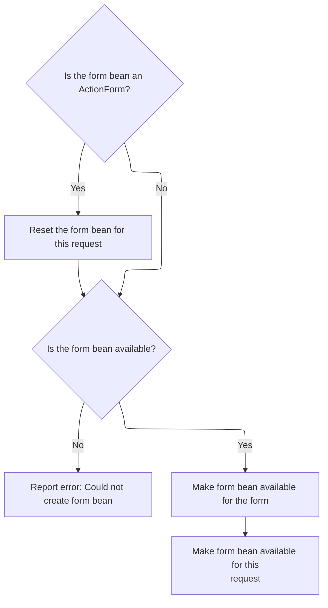

<SwmSnippet path="/taglib/src/main/java/org/apache/struts/taglib/html/FormTag.java" line="530">

---

Back in FormTag.initFormBean, if the bean is an <SwmToken path="taglib/src/main/java/org/apache/struts/taglib/html/FormTag.java" pos="530:8:8" line-data="            if (bean instanceof ActionForm) {">`ActionForm`</SwmToken>, we call reset to clear any previous state and prep it for the current request.

```java
            if (bean instanceof ActionForm) {
                ((ActionForm) bean).reset(mapping,
                    (HttpServletRequest) pageContext.getRequest());
            }

```

---

</SwmSnippet>

<SwmSnippet path="/taglib/src/main/java/org/apache/struts/taglib/html/FormTag.java" line="535">

---

Still in FormTag.initFormBean, if the bean couldn't be created, we throw a <SwmToken path="taglib/src/main/java/org/apache/struts/taglib/html/FormTag.java" pos="536:5:5" line-data="                throw new JspException(messages.getMessage(&quot;formTag.create&quot;,">`JspException`</SwmToken> with a localized error message that includes the bean type and name. This makes it obvious what failed.

```java
            if (bean == null) {
                throw new JspException(messages.getMessage("formTag.create",
                        beanType, beanName));
            }

            pageContext.setAttribute(beanName, bean, scope);
        }

```

---

</SwmSnippet>

<SwmSnippet path="/taglib/src/main/java/org/apache/struts/taglib/html/FormTag.java" line="543">

---

At the end of FormTag.initFormBean, we store the bean in the page context under both the configured name and <SwmToken path="taglib/src/main/java/org/apache/struts/taglib/html/FormTag.java" pos="543:5:7" line-data="        pageContext.setAttribute(Constants.BEAN_KEY, bean,">`Constants.BEAN_KEY`</SwmToken> in request scope. This makes it accessible for other tags and logic in the page.

```java
        pageContext.setAttribute(Constants.BEAN_KEY, bean,
            PageContext.REQUEST_SCOPE);
    }
```

---

</SwmSnippet>

&nbsp;

*This is an auto-generated document by Swimm 🌊 and has not yet been verified by a human*

<SwmMeta version="3.0.0" repo-id="Z2l0aHViJTNBJTNBc3RydXRzMSUzQSUzQVN3aW1tLURlbW8=" repo-name="struts1"><sup>Powered by [Swimm](https://app.swimm.io/)</sup></SwmMeta>
