This document describes how the system renders and prepares a form for user submission. The flow ensures forms are configured with the necessary attributes, include hidden fields for tracking submission and security, and are ready for user input. Transaction tokens are added when available to support secure submissions.

# Rendering and Preparing the Form for Submission

```mermaid
%%{init: {"flowchart": {"defaultRenderer": "elk"}} }%%
flowchart TD
    node1["Start form rendering"]
    click node1 openCode "faces/src/main/java/org/apache/struts/faces/renderer/FormRenderer.java:107:110"
    node1 --> node2{"Is action configuration found?"}
    click node2 openCode "faces/src/main/java/org/apache/struts/faces/renderer/FormRenderer.java:118:122"
    node2 -->|"No"| node3["Stop: Cannot render form"]
    click node3 openCode "faces/src/main/java/org/apache/struts/faces/renderer/FormRenderer.java:120:122"
    node2 -->|"Yes"| node4["Prepare form attributes (bean name, style class, method)"]
    click node4 openCode "faces/src/main/java/org/apache/struts/faces/renderer/FormRenderer.java:123:149"
    node4 --> node5["Render form start with attributes"]
    click node5 openCode "faces/src/main/java/org/apache/struts/faces/renderer/FormRenderer.java:137:151"
    node5 --> node6["Add hidden marker for form submission"]
    click node6 openCode "faces/src/main/java/org/apache/struts/faces/renderer/FormRenderer.java:154:159"
    node6 --> node7{"Is transaction token present?"}
    click node7 openCode "faces/src/main/java/org/apache/struts/faces/renderer/FormRenderer.java:164:175"
    node7 -->|"Yes"| node8["Add transaction token field"]
    click node8 openCode "faces/src/main/java/org/apache/struts/faces/renderer/FormRenderer.java:168:174"
    node7 -->|"No"| node9["Continue"]
    click node9 openCode "faces/src/main/java/org/apache/struts/faces/renderer/FormRenderer.java:176:178"
    node8 --> node10{"Is component a FormComponent?"}
    node9 --> node10
    click node10 openCode "faces/src/main/java/org/apache/struts/faces/renderer/FormRenderer.java:179:181"
    node10 -->|"Yes"| node11["Create form bean"]
    click node11 openCode "faces/src/main/java/org/apache/struts/faces/renderer/FormRenderer.java:180:181"
    node10 -->|"No"| node12["Finish form rendering"]
    click node12 openCode "faces/src/main/java/org/apache/struts/faces/renderer/FormRenderer.java:182:183"
    node11 --> node12
classDef HeadingStyle fill:#777777,stroke:#333,stroke-width:2px;

%% Swimm:
%% %%{init: {"flowchart": {"defaultRenderer": "elk"}} }%%
%% flowchart TD
%%     node1["Start form rendering"]
%%     click node1 openCode "<SwmPath>[faces/…/renderer/FormRenderer.java](faces/src/main/java/org/apache/struts/faces/renderer/FormRenderer.java)</SwmPath>:107:110"
%%     node1 --> node2{"Is action configuration found?"}
%%     click node2 openCode "<SwmPath>[faces/…/renderer/FormRenderer.java](faces/src/main/java/org/apache/struts/faces/renderer/FormRenderer.java)</SwmPath>:118:122"
%%     node2 -->|"No"| node3["Stop: Cannot render form"]
%%     click node3 openCode "<SwmPath>[faces/…/renderer/FormRenderer.java](faces/src/main/java/org/apache/struts/faces/renderer/FormRenderer.java)</SwmPath>:120:122"
%%     node2 -->|"Yes"| node4["Prepare form attributes (bean name, style class, method)"]
%%     click node4 openCode "<SwmPath>[faces/…/renderer/FormRenderer.java](faces/src/main/java/org/apache/struts/faces/renderer/FormRenderer.java)</SwmPath>:123:149"
%%     node4 --> node5["Render form start with attributes"]
%%     click node5 openCode "<SwmPath>[faces/…/renderer/FormRenderer.java](faces/src/main/java/org/apache/struts/faces/renderer/FormRenderer.java)</SwmPath>:137:151"
%%     node5 --> node6["Add hidden marker for form submission"]
%%     click node6 openCode "<SwmPath>[faces/…/renderer/FormRenderer.java](faces/src/main/java/org/apache/struts/faces/renderer/FormRenderer.java)</SwmPath>:154:159"
%%     node6 --> node7{"Is transaction token present?"}
%%     click node7 openCode "<SwmPath>[faces/…/renderer/FormRenderer.java](faces/src/main/java/org/apache/struts/faces/renderer/FormRenderer.java)</SwmPath>:164:175"
%%     node7 -->|"Yes"| node8["Add transaction token field"]
%%     click node8 openCode "<SwmPath>[faces/…/renderer/FormRenderer.java](faces/src/main/java/org/apache/struts/faces/renderer/FormRenderer.java)</SwmPath>:168:174"
%%     node7 -->|"No"| node9["Continue"]
%%     click node9 openCode "<SwmPath>[faces/…/renderer/FormRenderer.java](faces/src/main/java/org/apache/struts/faces/renderer/FormRenderer.java)</SwmPath>:176:178"
%%     node8 --> node10{"Is component a <SwmToken path="faces/src/main/java/org/apache/struts/faces/renderer/FormRenderer.java" pos="115:1:1" line-data="        FormComponent form = (FormComponent) component;">`FormComponent`</SwmToken>?"}
%%     node9 --> node10
%%     click node10 openCode "<SwmPath>[faces/…/renderer/FormRenderer.java](faces/src/main/java/org/apache/struts/faces/renderer/FormRenderer.java)</SwmPath>:179:181"
%%     node10 -->|"Yes"| node11["Create form bean"]
%%     click node11 openCode "<SwmPath>[faces/…/renderer/FormRenderer.java](faces/src/main/java/org/apache/struts/faces/renderer/FormRenderer.java)</SwmPath>:180:181"
%%     node10 -->|"No"| node12["Finish form rendering"]
%%     click node12 openCode "<SwmPath>[faces/…/renderer/FormRenderer.java](faces/src/main/java/org/apache/struts/faces/renderer/FormRenderer.java)</SwmPath>:182:183"
%%     node11 --> node12
%% classDef HeadingStyle fill:#777777,stroke:#333,stroke-width:2px;
```



<SwmSnippet path="/faces/src/main/java/org/apache/struts/faces/renderer/FormRenderer.java" line="107">

---

EncodeBegin starts the flow by grabbing Struts1 config objects, pulling out the bean name, and writing the opening <form> tag with all the attributes. It drops in hidden inputs for tracking submission and CSRF token, and spins up the form bean if needed. It assumes the component is a <SwmToken path="faces/src/main/java/org/apache/struts/faces/renderer/FormRenderer.java" pos="115:1:1" line-data="        FormComponent form = (FormComponent) component;">`FormComponent`</SwmToken> and the action is valid, so if either isn't, you'll get an exception.

```java
    public void encodeBegin(FacesContext context, UIComponent component)
        throws IOException {

        if ((context == null) || (component == null)) {
            throw new NullPointerException();
        }

        // Calculate and cache the form name
        FormComponent form = (FormComponent) component;
        String action = form.getAction();
        ModuleConfig moduleConfig = form.lookupModuleConfig(context);
        ActionConfig actionConfig = moduleConfig.findActionConfig(action);
        if (actionConfig == null) {
            throw new IllegalArgumentException("Cannot find action '" +
                                               action + "' configuration");
        }
        String beanName = actionConfig.getAttribute();
        if (beanName != null) {
            form.getAttributes().put("beanName", beanName);
        }

        // Look up attribute values we need
        String clientId = component.getClientId(context);
        if (log.isDebugEnabled()) {
            log.debug("encodeBegin(" + clientId + ")");
        }
        String styleClass =
            (String) component.getAttributes().get("styleClass");

        // Render the beginning of this form
        ResponseWriter writer = context.getResponseWriter();
        writer.startElement("form", form);
        writer.writeAttribute("id", clientId, "clientId");
        if (beanName != null) {
            writer.writeAttribute("name", beanName, null);
        }
        writer.writeAttribute("action", action(context, component), "action");
        if (styleClass != null) {
            writer.writeAttribute("class", styleClass, "styleClass");
        }
        if (component.getAttributes().get("method") == null) {
            writer.writeAttribute("method", "post", null);
        }
        renderPassThrough(context, component, writer, passThrough);
        writer.writeText("\n", null);

        // Add a marker used by our decode() method to note this form is submitted
        writer.startElement("input", form);
        writer.writeAttribute("type", "hidden", null);
        writer.writeAttribute("name", clientId, null);
        writer.writeAttribute("value", clientId, null);
        writer.endElement("input");
        writer.writeText("\n", null);

        // Add a transaction token if necessary
        HttpSession session = (HttpSession)
            context.getExternalContext().getSession(false);
        if (session != null) {
            String token = (String)
                session.getAttribute(Globals.TRANSACTION_TOKEN_KEY);
            if (token != null) {
                writer.startElement("input", form);
                writer.writeAttribute("type", "hidden", null);
                writer.writeAttribute
                    ("name", "org.apache.struts.taglib.html.TOKEN", null);
                writer.writeAttribute("value", token, null);
                writer.endElement("input");
                writer.writeText("\n", null);
            }
        }

        // Create an instance of the form bean if necessary
        if (component instanceof FormComponent) {
            ((FormComponent) component).createActionForm(context);
        }

    }
```

---

</SwmSnippet>

&nbsp;

*This is an auto-generated document by Swimm 🌊 and has not yet been verified by a human*

<SwmMeta version="3.0.0" repo-id="Z2l0aHViJTNBJTNBc3RydXRzMSUzQSUzQVN3aW1tLURlbW8=" repo-name="struts1"><sup>Powered by [Swimm](https://app.swimm.io/)</sup></SwmMeta>
