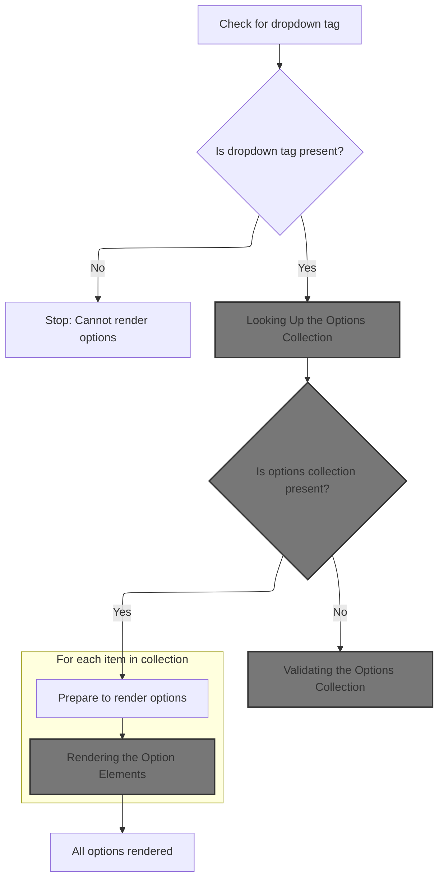
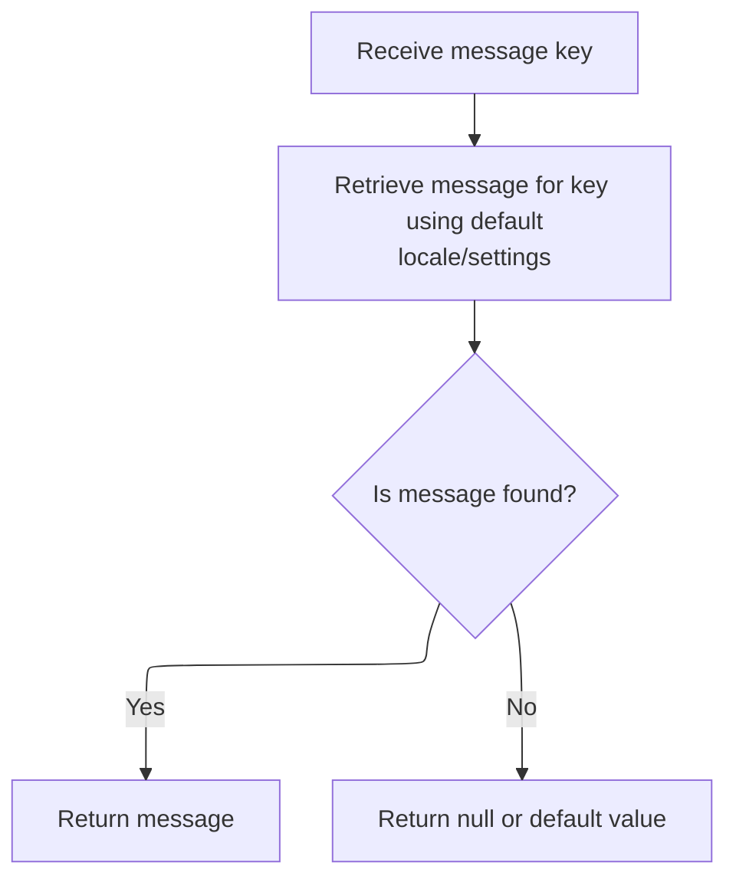
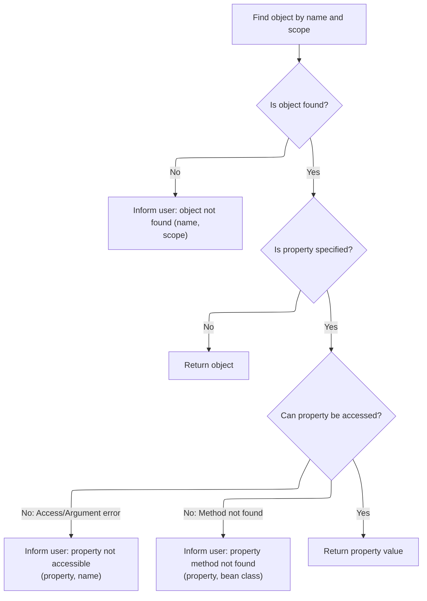
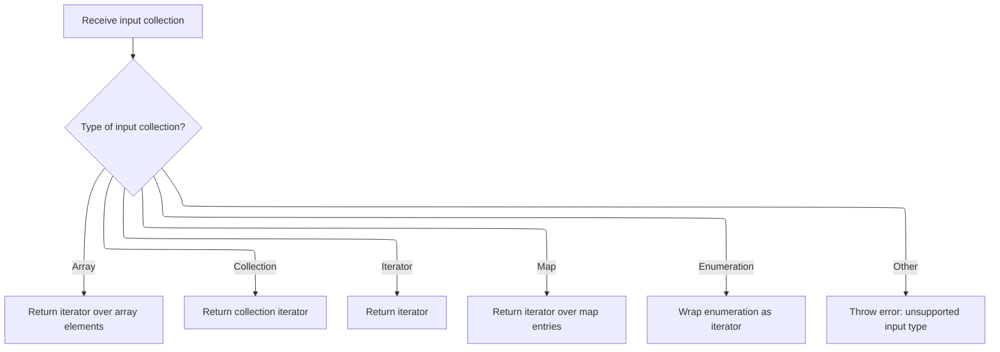

This document outlines the flow for dynamically rendering dropdown options in web forms. It covers checking for a dropdown context, retrieving and validating the data collection, and generating option elements with correct labels, values, and selection state, resulting in a populated dropdown menu for user selection.

# Acquiring the Select Context



<SwmSnippet path="/taglib/src/main/java/org/apache/struts/taglib/html/OptionsCollectionTag.java" line="162">

---

In <SwmToken path="taglib/src/main/java/org/apache/struts/taglib/html/OptionsCollectionTag.java" pos="162:5:5" line-data="    public int doStartTag() throws JspException {">`doStartTag`</SwmToken>, we grab the <SwmToken path="taglib/src/main/java/org/apache/struts/taglib/html/OptionsCollectionTag.java" pos="164:1:1" line-data="        SelectTag selectTag =">`SelectTag`</SwmToken> from the page context using a fixed key. If it's missing, we bail out with an exception, pulling the error message from <SwmToken path="taglib/src/main/java/org/apache/struts/taglib/html/OptionsCollectionTag.java" pos="26:10:10" line-data="import org.apache.struts.util.MessageResources;">`MessageResources`</SwmToken>. This check ensures we don't try to render options without a select context, and the next step is to fetch the error message for the exception.

```java
    public int doStartTag() throws JspException {
        // Acquire the select tag we are associated with
        SelectTag selectTag =
            (SelectTag) pageContext.getAttribute(Constants.SELECT_KEY);

        if (selectTag == null) {
            JspException e =
                new JspException(messages.getMessage(
                        "optionsCollectionTag.select"));

            TagUtils.getInstance().saveException(pageContext, e);
            throw e;
        }

```

---

</SwmSnippet>

## Fetching Error Messages



<SwmSnippet path="/core/src/main/java/org/apache/struts/util/MessageResources.java" line="196">

---

<SwmToken path="core/src/main/java/org/apache/struts/util/MessageResources.java" pos="196:5:10" line-data="    public String getMessage(String key) {">`getMessage(String key)`</SwmToken> just hands off to the main <SwmToken path="core/src/main/java/org/apache/struts/util/MessageResources.java" pos="196:5:5" line-data="    public String getMessage(String key) {">`getMessage`</SwmToken> logic with nulls for locale and arguments. It's a shortcut for when you just want a plain message string, which is what the exception code needs.

```java
    public String getMessage(String key) {
        return this.getMessage((Locale) null, key, null);
    }
```

---

</SwmSnippet>

## Resolving and Formatting Messages

```mermaid
%%{init: {"flowchart": {"defaultRenderer": "elk"}} }%%
flowchart TD
    node1["Receive locale, key, and argument"]
    click node1 openCode "core/src/main/java/org/apache/struts/util/MessageResources.java:324:326"
    node1 --> node2{"Is locale provided?"}
    click node2 openCode "core/src/main/java/org/apache/struts/util/MessageResources.java:288:290"
    node2 -->|"Yes"| node3["Use provided locale"]
    click node3 openCode "core/src/main/java/org/apache/struts/util/MessageResources.java:288:290"
    node2 -->|"No"| node4["Use default locale"]
    click node4 openCode "core/src/main/java/org/apache/struts/util/MessageResources.java:289:290"
    node3 --> node5["Retrieve or create message format
(escape template, cache)"]
    click node5 openCode "core/src/main/java/org/apache/struts/util/MessageResources.java:292:309"
    node4 --> node5
    node5 --> node6{"Is message template found?"}
    click node6 openCode "core/src/main/java/org/apache/struts/util/MessageResources.java:301:303"
    node6 -->|"Yes"| node7["Format message with argument"]
    click node7 openCode "core/src/main/java/org/apache/struts/util/MessageResources.java:311:312"
    node6 -->|"No"| node8{"Should missing message return null?"}
    click node8 openCode "core/src/main/java/org/apache/struts/util/MessageResources.java:302:303"
    node8 -->|"returnNull = true"| node9["Return null"]
    click node9 openCode "core/src/main/java/org/apache/struts/util/MessageResources.java:302:303"
    node8 -->|"returnNull = false"| node10["Return placeholder message"]
    click node10 openCode "core/src/main/java/org/apache/struts/util/MessageResources.java:302:303"
    node7 --> node11["Return formatted message"]
    click node11 openCode "core/src/main/java/org/apache/struts/util/MessageResources.java:311:312"
classDef HeadingStyle fill:#777777,stroke:#333,stroke-width:2px;

%% Swimm:
%% %%{init: {"flowchart": {"defaultRenderer": "elk"}} }%%
%% flowchart TD
%%     node1["Receive locale, key, and argument"]
%%     click node1 openCode "<SwmPath>[core/…/util/MessageResources.java](core/src/main/java/org/apache/struts/util/MessageResources.java)</SwmPath>:324:326"
%%     node1 --> node2{"Is locale provided?"}
%%     click node2 openCode "<SwmPath>[core/…/util/MessageResources.java](core/src/main/java/org/apache/struts/util/MessageResources.java)</SwmPath>:288:290"
%%     node2 -->|"Yes"| node3["Use provided locale"]
%%     click node3 openCode "<SwmPath>[core/…/util/MessageResources.java](core/src/main/java/org/apache/struts/util/MessageResources.java)</SwmPath>:288:290"
%%     node2 -->|"No"| node4["Use default locale"]
%%     click node4 openCode "<SwmPath>[core/…/util/MessageResources.java](core/src/main/java/org/apache/struts/util/MessageResources.java)</SwmPath>:289:290"
%%     node3 --> node5["Retrieve or create message format
%% (escape template, cache)"]
%%     click node5 openCode "<SwmPath>[core/…/util/MessageResources.java](core/src/main/java/org/apache/struts/util/MessageResources.java)</SwmPath>:292:309"
%%     node4 --> node5
%%     node5 --> node6{"Is message template found?"}
%%     click node6 openCode "<SwmPath>[core/…/util/MessageResources.java](core/src/main/java/org/apache/struts/util/MessageResources.java)</SwmPath>:301:303"
%%     node6 -->|"Yes"| node7["Format message with argument"]
%%     click node7 openCode "<SwmPath>[core/…/util/MessageResources.java](core/src/main/java/org/apache/struts/util/MessageResources.java)</SwmPath>:311:312"
%%     node6 -->|"No"| node8{"Should missing message return null?"}
%%     click node8 openCode "<SwmPath>[core/…/util/MessageResources.java](core/src/main/java/org/apache/struts/util/MessageResources.java)</SwmPath>:302:303"
%%     node8 -->|"<SwmToken path="core/src/main/java/org/apache/struts/util/MessageResources.java" pos="302:3:3" line-data="                    return returnNull ? null : (&quot;???&quot; + formatKey + &quot;???&quot;);">`returnNull`</SwmToken> = true"| node9["Return null"]
%%     click node9 openCode "<SwmPath>[core/…/util/MessageResources.java](core/src/main/java/org/apache/struts/util/MessageResources.java)</SwmPath>:302:303"
%%     node8 -->|"<SwmToken path="core/src/main/java/org/apache/struts/util/MessageResources.java" pos="302:3:3" line-data="                    return returnNull ? null : (&quot;???&quot; + formatKey + &quot;???&quot;);">`returnNull`</SwmToken> = false"| node10["Return placeholder message"]
%%     click node10 openCode "<SwmPath>[core/…/util/MessageResources.java](core/src/main/java/org/apache/struts/util/MessageResources.java)</SwmPath>:302:303"
%%     node7 --> node11["Return formatted message"]
%%     click node11 openCode "<SwmPath>[core/…/util/MessageResources.java](core/src/main/java/org/apache/struts/util/MessageResources.java)</SwmPath>:311:312"
%% classDef HeadingStyle fill:#777777,stroke:#333,stroke-width:2px;
```



<SwmSnippet path="/core/src/main/java/org/apache/struts/util/MessageResources.java" line="324">

---

<SwmToken path="core/src/main/java/org/apache/struts/util/MessageResources.java" pos="324:5:5" line-data="    public String getMessage(Locale locale, String key, Object arg0) {">`getMessage`</SwmToken>`(`<SwmToken path="core/src/main/java/org/apache/struts/util/MessageResources.java" pos="324:7:7" line-data="    public String getMessage(Locale locale, String key, Object arg0) {">`Locale`</SwmToken>`, `<SwmToken path="core/src/main/java/org/apache/struts/util/MessageResources.java" pos="324:3:3" line-data="    public String getMessage(Locale locale, String key, Object arg0) {">`String`</SwmToken>`, `<SwmToken path="core/src/main/java/org/apache/struts/util/MessageResources.java" pos="324:17:17" line-data="    public String getMessage(Locale locale, String key, Object arg0) {">`Object`</SwmToken>`)` just wraps the argument in an array and calls the main message formatting logic. It's a convenience for messages with a single placeholder.

```java
    public String getMessage(Locale locale, String key, Object arg0) {
        return this.getMessage(locale, key, new Object[] { arg0 });
    }
```

---

</SwmSnippet>

<SwmSnippet path="/core/src/main/java/org/apache/struts/util/MessageResources.java" line="286">

---

<SwmToken path="core/src/main/java/org/apache/struts/util/MessageResources.java" pos="286:5:5" line-data="    public String getMessage(Locale locale, String key, Object[] args) {">`getMessage`</SwmToken>`(`<SwmToken path="core/src/main/java/org/apache/struts/util/MessageResources.java" pos="286:7:7" line-data="    public String getMessage(Locale locale, String key, Object[] args) {">`Locale`</SwmToken>`, `<SwmToken path="core/src/main/java/org/apache/struts/util/MessageResources.java" pos="286:3:3" line-data="    public String getMessage(Locale locale, String key, Object[] args) {">`String`</SwmToken>`, `<SwmToken path="core/src/main/java/org/apache/struts/util/MessageResources.java" pos="286:17:17" line-data="    public String getMessage(Locale locale, String key, Object[] args) {">`Object`</SwmToken>`[])` does the heavy lifting: it checks the cache for a <SwmToken path="core/src/main/java/org/apache/struts/util/MessageResources.java" pos="287:5:5" line-data="        // Cache MessageFormat instances as they are accessed">`MessageFormat`</SwmToken>, creates and stores one if missing, and formats the message. If the key isn't found, it returns a '???key???' string so missing messages are obvious. Locale defaults if not set, and the escape method tweaks the format string before use.

```java
    public String getMessage(Locale locale, String key, Object[] args) {
        // Cache MessageFormat instances as they are accessed
        if (locale == null) {
            locale = defaultLocale;
        }

        MessageFormat format = null;
        String formatKey = messageKey(locale, key);

        synchronized (formats) {
            format = (MessageFormat) formats.get(formatKey);

            if (format == null) {
                String formatString = getMessage(locale, key);

                if (formatString == null) {
                    return returnNull ? null : ("???" + formatKey + "???");
                }

                format = new MessageFormat(escape(formatString));
                format.setLocale(locale);
                formats.put(formatKey, format);
            }
        }

        return format.format(args);
    }
```

---

</SwmSnippet>

## Looking Up the Options Collection

<SwmSnippet path="/taglib/src/main/java/org/apache/struts/taglib/html/OptionsCollectionTag.java" line="176">

---

Back in <SwmToken path="taglib/src/main/java/org/apache/struts/taglib/html/OptionsCollectionTag.java" pos="162:5:5" line-data="    public int doStartTag() throws JspException {">`doStartTag`</SwmToken>, after getting the error message, we use TagUtils.lookup to fetch the collection of beans for the options. This uses the 'name' and 'property' fields to find the right data. If the collection isn't found, we throw an exception.

```java
        // Acquire the collection containing our options
        Object collection =
            TagUtils.getInstance().lookup(pageContext, name, property, null);

```

---

</SwmSnippet>

## Resolving the Bean or Property



<SwmSnippet path="/taglib/src/main/java/org/apache/struts/taglib/TagUtils.java" line="897">

---

In <SwmToken path="taglib/src/main/java/org/apache/struts/taglib/TagUtils.java" pos="897:5:5" line-data="    public Object lookup(PageContext pageContext, String name, String property,">`lookup`</SwmToken>, we try to find the bean by name and scope. If it's missing, we prep an exception with a message from <SwmToken path="taglib/src/main/java/org/apache/struts/taglib/html/OptionsCollectionTag.java" pos="26:10:10" line-data="import org.apache.struts.util.MessageResources;">`MessageResources`</SwmToken>. The next step is to fetch the right error message for the exception.

```java
    public Object lookup(PageContext pageContext, String name, String property,
        String scope) throws JspException {
        // Look up the requested bean, and return if requested
        Object bean = lookup(pageContext, name, scope);

        if (bean == null) {
            JspException e = null;

            if (scope == null) {
                e = new JspException(messages.getMessage("lookup.bean.any", name));
            } else {
```

---

</SwmSnippet>

<SwmSnippet path="/core/src/main/java/org/apache/struts/util/MessageResources.java" line="218">

---

<SwmToken path="core/src/main/java/org/apache/struts/util/MessageResources.java" pos="218:5:15" line-data="    public String getMessage(String key, Object arg0) {">`getMessage(String key, Object arg0)`</SwmToken> just calls the main message formatter with the argument, so the error message can include details like the bean name.

```java
    public String getMessage(String key, Object arg0) {
        return this.getMessage((Locale) null, key, arg0);
    }
```

---

</SwmSnippet>

<SwmSnippet path="/taglib/src/main/java/org/apache/struts/taglib/TagUtils.java" line="908">

---

After getting the error message, <SwmToken path="taglib/src/main/java/org/apache/struts/taglib/TagUtils.java" pos="908:14:14" line-data="                e = new JspException(messages.getMessage(&quot;lookup.bean&quot;, name,">`lookup`</SwmToken> tries to access the property on the bean. If anything goes wrong (like missing property, access issues, etc.), it throws a <SwmToken path="taglib/src/main/java/org/apache/struts/taglib/TagUtils.java" pos="908:7:7" line-data="                e = new JspException(messages.getMessage(&quot;lookup.bean&quot;, name,">`JspException`</SwmToken> with a message from <SwmToken path="taglib/src/main/java/org/apache/struts/taglib/html/OptionsCollectionTag.java" pos="26:10:10" line-data="import org.apache.struts.util.MessageResources;">`MessageResources`</SwmToken>. This keeps error handling consistent and visible.

```java
                e = new JspException(messages.getMessage("lookup.bean", name,
                            scope));
            }

            saveException(pageContext, e);
            throw e;
        }

        if (property == null) {
            return bean;
        }

        // Locate and return the specified property
        try {
            return PropertyUtils.getProperty(bean, property);
        } catch (IllegalAccessException e) {
            saveException(pageContext, e);
            throw new JspException(messages.getMessage("lookup.access",
                    property, name), e);
        } catch (IllegalArgumentException e) {
            saveException(pageContext, e);
            throw new JspException(messages.getMessage("lookup.argument",
                    property, name), e);
        } catch (InvocationTargetException e) {
            Throwable t = e.getTargetException();

            if (t == null) {
                t = e;
            }

            saveException(pageContext, t);
            throw new JspException(messages.getMessage("lookup.target",
                    property, name), e);
        } catch (NoSuchMethodException e) {
            saveException(pageContext, e);

            String beanName = name;

            // Name defaults to Contants.BEAN_KEY if no name is specified by
            // an input tag. Thus lookup the bean under the key and use
            // its class name for the exception message.
            if (Constants.BEAN_KEY.equals(name)) {
                Object obj = pageContext.findAttribute(Constants.BEAN_KEY);

                if (obj != null) {
                    beanName = obj.getClass().getName();
                }
            }

            throw new JspException(messages.getMessage("lookup.method",
                    property, beanName), e);
        }
    }
```

---

</SwmSnippet>

## Validating the Options Collection

<SwmSnippet path="/taglib/src/main/java/org/apache/struts/taglib/html/OptionsCollectionTag.java" line="180">

---

Just back from `TagUtils.lookup`, in <SwmToken path="taglib/src/main/java/org/apache/struts/taglib/html/OptionsCollectionTag.java" pos="162:5:5" line-data="    public int doStartTag() throws JspException {">`doStartTag`</SwmToken> we check if the collection is null. If it is, we throw a <SwmToken path="taglib/src/main/java/org/apache/struts/taglib/html/OptionsCollectionTag.java" pos="181:1:1" line-data="            JspException e =">`JspException`</SwmToken> with a message from <SwmToken path="taglib/src/main/java/org/apache/struts/taglib/html/OptionsCollectionTag.java" pos="26:10:10" line-data="import org.apache.struts.util.MessageResources;">`MessageResources`</SwmToken>. This stops the tag from rendering when there's no data.

```java
        if (collection == null) {
            JspException e =
                new JspException(messages.getMessage(
                        "optionsCollectionTag.collection"));

            TagUtils.getInstance().saveException(pageContext, e);
            throw e;
        }

```

---

</SwmSnippet>

<SwmSnippet path="/taglib/src/main/java/org/apache/struts/taglib/html/OptionsCollectionTag.java" line="189">

---

After the null check, <SwmToken path="taglib/src/main/java/org/apache/struts/taglib/html/OptionsCollectionTag.java" pos="162:5:5" line-data="    public int doStartTag() throws JspException {">`doStartTag`</SwmToken> calls <SwmToken path="taglib/src/main/java/org/apache/struts/taglib/html/OptionsCollectionTag.java" pos="190:7:7" line-data="        Iterator iter = getIterator(collection);">`getIterator`</SwmToken> to get something we can loop over, no matter if the collection is a List, array, Map, or Enumeration. This keeps the tag generic.

```java
        // Acquire an iterator over the options collection
        Iterator iter = getIterator(collection);

```

---

</SwmSnippet>

## Normalizing the Collection to an Iterator



<SwmSnippet path="/taglib/src/main/java/org/apache/struts/taglib/html/OptionsCollectionTag.java" line="353">

---

In <SwmToken path="taglib/src/main/java/org/apache/struts/taglib/html/OptionsCollectionTag.java" pos="353:5:5" line-data="    protected Iterator getIterator(Object collection)">`getIterator`</SwmToken>, we check the type of the collection: arrays get wrapped as Lists, Collections get their iterator, Iterators are returned as-is, and Maps use <SwmToken path="taglib/src/main/java/org/apache/struts/taglib/html/OptionsCollectionTag.java" pos="364:12:14" line-data="            return (((Map) collection).entrySet().iterator());">`entrySet()`</SwmToken>.iterator(). If it's a primitive array, this will blow up, so only object arrays are safe. Next, if it's a Map, we call <SwmToken path="taglib/src/main/java/org/apache/struts/taglib/html/OptionsCollectionTag.java" pos="364:12:12" line-data="            return (((Map) collection).entrySet().iterator());">`entrySet`</SwmToken>, which leads to the <SwmToken path="faces/src/main/java/org/apache/struts/faces/util/MessagesMap.java" pos="41:4:4" line-data="public class MessagesMap implements Map {">`MessagesMap`</SwmToken> logic.

```java
    protected Iterator getIterator(Object collection)
        throws JspException {
        if (collection.getClass().isArray()) {
            collection = Arrays.asList((Object[]) collection);
        }

        if (collection instanceof Collection) {
            return (((Collection) collection).iterator());
        } else if (collection instanceof Iterator) {
            return ((Iterator) collection);
        } else if (collection instanceof Map) {
            return (((Map) collection).entrySet().iterator());
```

---

</SwmSnippet>

<SwmSnippet path="/faces/src/main/java/org/apache/struts/faces/util/MessagesMap.java" line="133">

---

<SwmToken path="faces/src/main/java/org/apache/struts/faces/util/MessagesMap.java" pos="133:5:5" line-data="    public Set entrySet() {">`entrySet`</SwmToken> in <SwmToken path="faces/src/main/java/org/apache/struts/faces/util/MessagesMap.java" pos="41:4:4" line-data="public class MessagesMap implements Map {">`MessagesMap`</SwmToken> just throws <SwmToken path="faces/src/main/java/org/apache/struts/faces/util/MessagesMap.java" pos="135:5:5" line-data="        throw new UnsupportedOperationException();">`UnsupportedOperationException`</SwmToken>. This map isn't meant to be used like a normal Map, so trying to iterate its entries will fail fast.

```java
    public Set entrySet() {

        throw new UnsupportedOperationException();

    }
```

---

</SwmSnippet>

<SwmSnippet path="/taglib/src/main/java/org/apache/struts/taglib/html/OptionsCollectionTag.java" line="365">

---

After coming back from <SwmToken path="faces/src/main/java/org/apache/struts/faces/util/MessagesMap.java" pos="41:4:4" line-data="public class MessagesMap implements Map {">`MessagesMap`</SwmToken>, <SwmToken path="taglib/src/main/java/org/apache/struts/taglib/html/OptionsCollectionTag.java" pos="190:7:7" line-data="        Iterator iter = getIterator(collection);">`getIterator`</SwmToken> checks for Enumeration and adapts it, or throws a <SwmToken path="taglib/src/main/java/org/apache/struts/taglib/html/OptionsCollectionTag.java" pos="368:5:5" line-data="            throw new JspException(messages.getMessage(">`JspException`</SwmToken> with a message from <SwmToken path="taglib/src/main/java/org/apache/struts/taglib/html/OptionsCollectionTag.java" pos="26:10:10" line-data="import org.apache.struts.util.MessageResources;">`MessageResources`</SwmToken> if the type isn't supported. This keeps error handling consistent and clear.

```java
        } else if (collection instanceof Enumeration) {
            return new IteratorAdapter((Enumeration) collection);
        } else {
            throw new JspException(messages.getMessage(
                    "optionsCollectionTag.iterator", collection.toString()));
        }
    }
```

---

</SwmSnippet>

## Rendering the Option Elements

```mermaid
%%{init: {"flowchart": {"defaultRenderer": "elk"}} }%%
flowchart TD
    node1["Start: Prepare to render dropdown
options"]
    click node1 openCode "taglib/src/main/java/org/apache/struts/taglib/html/OptionsCollectionTag.java:192:194"
    
    subgraph loop1["For each data object in the collection"]
        node2["Extract label from data object"]
        click node2 openCode "taglib/src/main/java/org/apache/struts/taglib/html/OptionsCollectionTag.java:201:207"
        node3{"Is label missing?"}
        click node3 openCode "taglib/src/main/java/org/apache/struts/taglib/html/OptionsCollectionTag.java:204:206"
        node2 --> node3
        node3 -->|"Yes"| node4["Use empty string as label"]
        click node4 openCode "taglib/src/main/java/org/apache/struts/taglib/html/OptionsCollectionTag.java:205:206"
        node3 -->|"No"| node5["Use extracted label"]
        click node5 openCode "taglib/src/main/java/org/apache/struts/taglib/html/OptionsCollectionTag.java:202:203"
        node4 --> node6["Extract value from data object"]
        node5 --> node6
        click node6 openCode "taglib/src/main/java/org/apache/struts/taglib/html/OptionsCollectionTag.java:232:237"
        node7{"Is value missing?"}
        click node7 openCode "taglib/src/main/java/org/apache/struts/taglib/html/OptionsCollectionTag.java:235:237"
        node6 --> node7
        node7 -->|"Yes"| node8["Use empty string as value"]
        click node8 openCode "taglib/src/main/java/org/apache/struts/taglib/html/OptionsCollectionTag.java:236:237"
        node7 -->|"No"| node9["Use extracted value"]
        click node9 openCode "taglib/src/main/java/org/apache/struts/taglib/html/OptionsCollectionTag.java:233:234"
        node8 --> node10{"Is this option selected?"}
        node9 --> node10
        click node10 openCode "taglib/src/main/java/org/apache/struts/taglib/html/OptionsCollectionTag.java:266:267"
        node10 -->|"Yes"| node11["Render option as selected"]
        node10 -->|"No"| node12["Render option as not selected"]
        click node11 openCode "taglib/src/main/java/org/apache/struts/taglib/html/OptionsCollectionTag.java:266:267"
        click node12 openCode "taglib/src/main/java/org/apache/struts/taglib/html/OptionsCollectionTag.java:266:267"
        node11 --> node2
        node12 --> node2
    end
    loop1 --> node13["Write all options to page"]
    click node13 openCode "taglib/src/main/java/org/apache/struts/taglib/html/OptionsCollectionTag.java:270:271"
classDef HeadingStyle fill:#777777,stroke:#333,stroke-width:2px;

%% Swimm:
%% %%{init: {"flowchart": {"defaultRenderer": "elk"}} }%%
%% flowchart TD
%%     node1["Start: Prepare to render dropdown
%% options"]
%%     click node1 openCode "<SwmPath>[taglib/…/html/OptionsCollectionTag.java](taglib/src/main/java/org/apache/struts/taglib/html/OptionsCollectionTag.java)</SwmPath>:192:194"
%%     
%%     subgraph loop1["For each data object in the collection"]
%%         node2["Extract label from data object"]
%%         click node2 openCode "<SwmPath>[taglib/…/html/OptionsCollectionTag.java](taglib/src/main/java/org/apache/struts/taglib/html/OptionsCollectionTag.java)</SwmPath>:201:207"
%%         node3{"Is label missing?"}
%%         click node3 openCode "<SwmPath>[taglib/…/html/OptionsCollectionTag.java](taglib/src/main/java/org/apache/struts/taglib/html/OptionsCollectionTag.java)</SwmPath>:204:206"
%%         node2 --> node3
%%         node3 -->|"Yes"| node4["Use empty string as label"]
%%         click node4 openCode "<SwmPath>[taglib/…/html/OptionsCollectionTag.java](taglib/src/main/java/org/apache/struts/taglib/html/OptionsCollectionTag.java)</SwmPath>:205:206"
%%         node3 -->|"No"| node5["Use extracted label"]
%%         click node5 openCode "<SwmPath>[taglib/…/html/OptionsCollectionTag.java](taglib/src/main/java/org/apache/struts/taglib/html/OptionsCollectionTag.java)</SwmPath>:202:203"
%%         node4 --> node6["Extract value from data object"]
%%         node5 --> node6
%%         click node6 openCode "<SwmPath>[taglib/…/html/OptionsCollectionTag.java](taglib/src/main/java/org/apache/struts/taglib/html/OptionsCollectionTag.java)</SwmPath>:232:237"
%%         node7{"Is value missing?"}
%%         click node7 openCode "<SwmPath>[taglib/…/html/OptionsCollectionTag.java](taglib/src/main/java/org/apache/struts/taglib/html/OptionsCollectionTag.java)</SwmPath>:235:237"
%%         node6 --> node7
%%         node7 -->|"Yes"| node8["Use empty string as value"]
%%         click node8 openCode "<SwmPath>[taglib/…/html/OptionsCollectionTag.java](taglib/src/main/java/org/apache/struts/taglib/html/OptionsCollectionTag.java)</SwmPath>:236:237"
%%         node7 -->|"No"| node9["Use extracted value"]
%%         click node9 openCode "<SwmPath>[taglib/…/html/OptionsCollectionTag.java](taglib/src/main/java/org/apache/struts/taglib/html/OptionsCollectionTag.java)</SwmPath>:233:234"
%%         node8 --> node10{"Is this option selected?"}
%%         node9 --> node10
%%         click node10 openCode "<SwmPath>[taglib/…/html/OptionsCollectionTag.java](taglib/src/main/java/org/apache/struts/taglib/html/OptionsCollectionTag.java)</SwmPath>:266:267"
%%         node10 -->|"Yes"| node11["Render option as selected"]
%%         node10 -->|"No"| node12["Render option as not selected"]
%%         click node11 openCode "<SwmPath>[taglib/…/html/OptionsCollectionTag.java](taglib/src/main/java/org/apache/struts/taglib/html/OptionsCollectionTag.java)</SwmPath>:266:267"
%%         click node12 openCode "<SwmPath>[taglib/…/html/OptionsCollectionTag.java](taglib/src/main/java/org/apache/struts/taglib/html/OptionsCollectionTag.java)</SwmPath>:266:267"
%%         node11 --> node2
%%         node12 --> node2
%%     end
%%     loop1 --> node13["Write all options to page"]
%%     click node13 openCode "<SwmPath>[taglib/…/html/OptionsCollectionTag.java](taglib/src/main/java/org/apache/struts/taglib/html/OptionsCollectionTag.java)</SwmPath>:270:271"
%% classDef HeadingStyle fill:#777777,stroke:#333,stroke-width:2px;
```



<SwmSnippet path="/taglib/src/main/java/org/apache/struts/taglib/html/OptionsCollectionTag.java" line="192">

---

Just back from <SwmToken path="taglib/src/main/java/org/apache/struts/taglib/html/OptionsCollectionTag.java" pos="190:7:7" line-data="        Iterator iter = getIterator(collection);">`getIterator`</SwmToken>, in <SwmToken path="taglib/src/main/java/org/apache/struts/taglib/html/OptionsCollectionTag.java" pos="162:5:5" line-data="    public int doStartTag() throws JspException {">`doStartTag`</SwmToken> we loop over the collection, using reflection to get the label and value for each option. If anything goes wrong (like missing property), we throw a <SwmToken path="taglib/src/main/java/org/apache/struts/taglib/html/OptionsCollectionTag.java" pos="208:1:1" line-data="                JspException jspe =">`JspException`</SwmToken> with a message from <SwmToken path="taglib/src/main/java/org/apache/struts/taglib/html/OptionsCollectionTag.java" pos="26:10:10" line-data="import org.apache.struts.util.MessageResources;">`MessageResources`</SwmToken>. This keeps errors visible and the output correct.

```java
        StringBuffer sb = new StringBuffer();

        // Render the options
        while (iter.hasNext()) {
            Object bean = iter.next();
            Object beanLabel = null;
            Object beanValue = null;

            // Get the label for this option
            try {
                beanLabel = PropertyUtils.getProperty(bean, label);

                if (beanLabel == null) {
                    beanLabel = "";
                }
            } catch (IllegalAccessException e) {
                JspException jspe =
                    new JspException(messages.getMessage("getter.access",
                            label, bean), e);

                TagUtils.getInstance().saveException(pageContext, jspe);
                throw jspe;
            } catch (InvocationTargetException e) {
                Throwable t = e.getTargetException();
                JspException jspe =
                    new JspException(messages.getMessage("getter.result",
                            label, t.toString()), e);

                TagUtils.getInstance().saveException(pageContext, jspe);
                throw jspe;
            } catch (NoSuchMethodException e) {
                JspException jspe =
                    new JspException(messages.getMessage("getter.method",
                            label, bean), e);

                TagUtils.getInstance().saveException(pageContext, jspe);
                throw jspe;
            }

            // Get the value for this option
            try {
                beanValue = PropertyUtils.getProperty(bean, value);

                if (beanValue == null) {
                    beanValue = "";
                }
            } catch (IllegalAccessException e) {
                JspException jspe =
                    new JspException(messages.getMessage("getter.access",
                            value, bean), e);

                TagUtils.getInstance().saveException(pageContext, jspe);
                throw jspe;
            } catch (InvocationTargetException e) {
                Throwable t = e.getTargetException();
                JspException jspe =
                    new JspException(messages.getMessage("getter.result",
                            value, t.toString()), e);

                TagUtils.getInstance().saveException(pageContext, jspe);
                throw jspe;
            } catch (NoSuchMethodException e) {
                JspException jspe =
                    new JspException(messages.getMessage("getter.method",
                            value, bean), e);

                TagUtils.getInstance().saveException(pageContext, jspe);
                throw jspe;
            }

```

---

</SwmSnippet>

<SwmSnippet path="/taglib/src/main/java/org/apache/struts/taglib/html/OptionsCollectionTag.java" line="262">

---

After all the label/value extraction and error handling, <SwmToken path="taglib/src/main/java/org/apache/struts/taglib/html/OptionsCollectionTag.java" pos="162:5:5" line-data="    public int doStartTag() throws JspException {">`doStartTag`</SwmToken> uses <SwmToken path="taglib/src/main/java/org/apache/struts/taglib/html/OptionsCollectionTag.java" pos="267:1:3" line-data="                selectTag.isMatched(stringValue));">`selectTag.isMatched`</SwmToken> to see if each option should be selected, adds the option to the buffer, and finally writes the output using <SwmToken path="taglib/src/main/java/org/apache/struts/taglib/html/OptionsCollectionTag.java" pos="270:1:1" line-data="        TagUtils.getInstance().write(pageContext, sb.toString());">`TagUtils`</SwmToken>. This ties the rendered options to the current selection state.

```java
            String stringLabel = beanLabel.toString();
            String stringValue = beanValue.toString();

            // Render this option
            addOption(sb, stringLabel, stringValue,
                selectTag.isMatched(stringValue));
        }

        TagUtils.getInstance().write(pageContext, sb.toString());

        return SKIP_BODY;
    }
```

---

</SwmSnippet>

<SwmSnippet path="/taglib/src/main/java/org/apache/struts/taglib/TagUtils.java" line="1186">

---

<SwmToken path="taglib/src/main/java/org/apache/struts/taglib/TagUtils.java" pos="1186:5:5" line-data="    public void write(PageContext pageContext, String text)">`write`</SwmToken> just prints the generated HTML to the page output. If there's an <SwmToken path="taglib/src/main/java/org/apache/struts/taglib/TagUtils.java" pos="1192:6:6" line-data="        } catch (IOException e) {">`IOException`</SwmToken>, it wraps it in a <SwmToken path="taglib/src/main/java/org/apache/struts/taglib/TagUtils.java" pos="1187:3:3" line-data="        throws JspException {">`JspException`</SwmToken> with a message from <SwmToken path="taglib/src/main/java/org/apache/struts/taglib/html/OptionsCollectionTag.java" pos="26:10:10" line-data="import org.apache.struts.util.MessageResources;">`MessageResources`</SwmToken> and saves the exception for later reporting.

```java
    public void write(PageContext pageContext, String text)
        throws JspException {
        JspWriter writer = pageContext.getOut();

        try {
            writer.print(text);
        } catch (IOException e) {
            saveException(pageContext, e);
            throw new JspException(messages.getMessage("write.io", e.toString()), e);
        }
    }
```

---

</SwmSnippet>

&nbsp;

*This is an auto-generated document by Swimm 🌊 and has not yet been verified by a human*

<SwmMeta version="3.0.0" repo-id="Z2l0aHViJTNBJTNBc3RydXRzMSUzQSUzQVN3aW1tLURlbW8=" repo-name="struts1"><sup>Powered by [Swimm](https://app.swimm.io/)</sup></SwmMeta>
