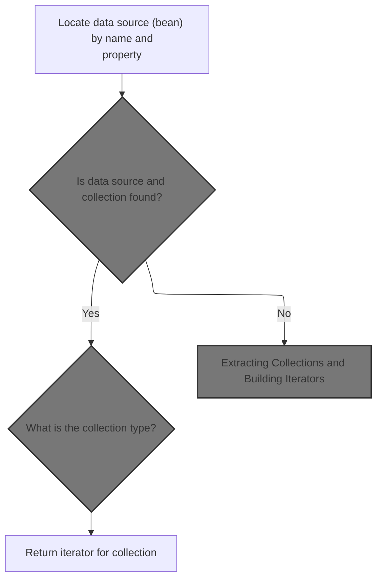
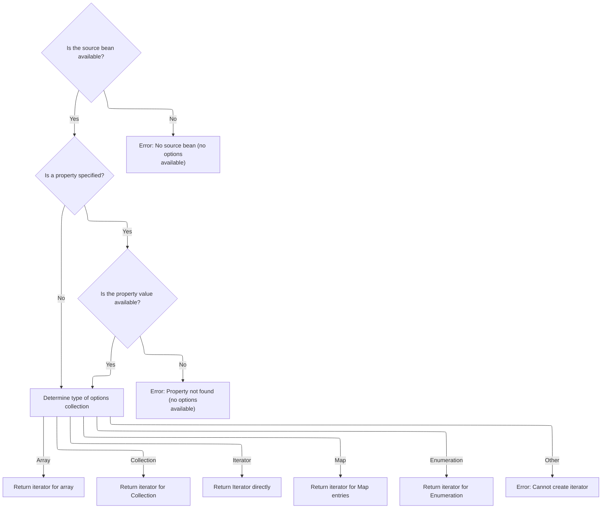
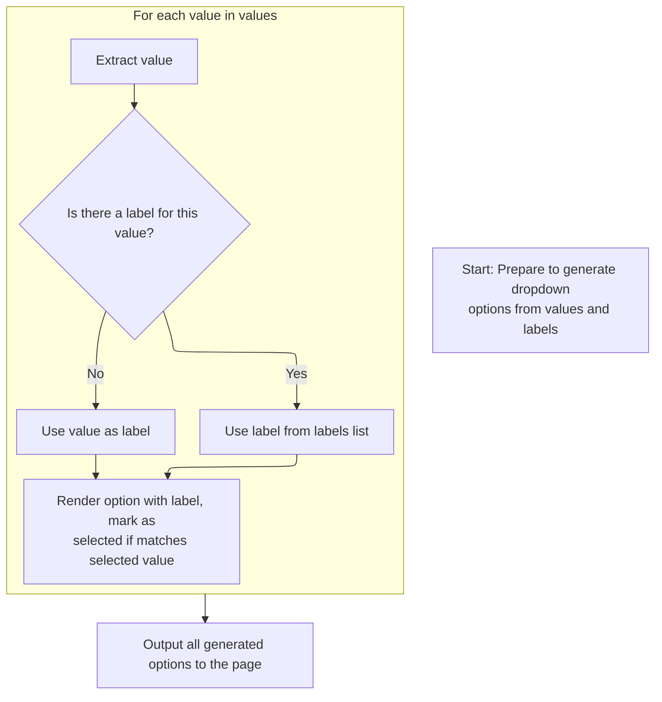

This document explains how dropdown options are generated for select menus. The flow retrieves option data, pairs values and labels, and outputs HTML option elements, ensuring the correct selection is reflected in the dropdown.

# Rendering Option Elements for Select Tags

<SwmSnippet path="/taglib/src/main/java/org/apache/struts/taglib/html/OptionsTag.java" line="175">

---

In <SwmToken path="taglib/src/main/java/org/apache/struts/taglib/html/OptionsTag.java" pos="175:5:5" line-data="    public int doEndTag() throws JspException {">`doEndTag`</SwmToken>, we grab the <SwmToken path="taglib/src/main/java/org/apache/struts/taglib/html/OptionsTag.java" pos="177:1:1" line-data="        SelectTag selectTag =">`SelectTag`</SwmToken> from the page context, check it's there, and then iterate over the provided collection (if any), extracting values and labels from each bean using <SwmToken path="taglib/src/main/java/org/apache/struts/taglib/html/OptionsTag.java" pos="196:5:5" line-data="                    value = PropertyUtils.getProperty(bean, property);">`PropertyUtils`</SwmToken>. For each item, we call <SwmToken path="taglib/src/main/java/org/apache/struts/taglib/html/OptionsTag.java" pos="239:1:1" line-data="                addOption(sb, stringValue, label.toString(),">`addOption`</SwmToken> to build the option tag, checking if it matches the current selection.

```java
    public int doEndTag() throws JspException {
        // Acquire the select tag we are associated with
        SelectTag selectTag =
            (SelectTag) pageContext.getAttribute(Constants.SELECT_KEY);

        if (selectTag == null) {
            throw new JspException(messages.getMessage("optionsTag.select"));
        }

        StringBuffer sb = new StringBuffer();

        // If a collection was specified, use that mode to render options
        if (collection != null) {
            Iterator collIterator = getIterator(collection, null);

            while (collIterator.hasNext()) {
                Object bean = collIterator.next();
                Object value = null;
                Object label = null;

                try {
                    value = PropertyUtils.getProperty(bean, property);

                    if (value == null) {
                        value = "";
                    }
                } catch (IllegalAccessException e) {
                    throw new JspException(messages.getMessage(
                            "getter.access", property, collection), e);
                } catch (InvocationTargetException e) {
                    Throwable t = e.getTargetException();

                    throw new JspException(messages.getMessage(
                            "getter.result", property, t.toString()), e);
                } catch (NoSuchMethodException e) {
                    throw new JspException(messages.getMessage(
                            "getter.method", property, collection), e);
                }

                try {
                    if (labelProperty != null) {
                        label = PropertyUtils.getProperty(bean, labelProperty);
                    } else {
                        label = value;
                    }

                    if (label == null) {
                        label = "";
                    }
                } catch (IllegalAccessException e) {
                    throw new JspException(messages.getMessage(
                            "getter.access", labelProperty, collection), e);
                } catch (InvocationTargetException e) {
                    Throwable t = e.getTargetException();

                    throw new JspException(messages.getMessage(
                            "getter.result", labelProperty, t.toString()), e);
                } catch (NoSuchMethodException e) {
                    throw new JspException(messages.getMessage(
                            "getter.method", labelProperty, collection), e);
                }

                String stringValue = value.toString();

                addOption(sb, stringValue, label.toString(),
                    selectTag.isMatched(stringValue));
            }
```

---

</SwmSnippet>

<SwmSnippet path="/taglib/src/main/java/org/apache/struts/taglib/html/OptionsTag.java" line="243">

---

Here we handle the case where values and labels are provided as separate collections. We call <SwmToken path="taglib/src/main/java/org/apache/struts/taglib/html/OptionsTag.java" pos="246:7:7" line-data="            Iterator valuesIterator = getIterator(name, property);">`getIterator`</SwmToken> to get iterators for both, so we can loop through and pair up values and labels for each option.

```java
        // Otherwise, use the separate iterators mode to render options
        else {
            // Construct iterators for the values and labels collections
            Iterator valuesIterator = getIterator(name, property);
            Iterator labelsIterator = null;

            if ((labelName != null) || (labelProperty != null)) {
                labelsIterator = getIterator(labelName, labelProperty);
            }

```

---

</SwmSnippet>

## Resolving Collections for Option Rendering



<SwmSnippet path="/taglib/src/main/java/org/apache/struts/taglib/html/OptionsTag.java" line="364">

---

In <SwmToken path="taglib/src/main/java/org/apache/struts/taglib/html/OptionsTag.java" pos="364:5:5" line-data="    protected Iterator getIterator(String name, String property)">`getIterator`</SwmToken>, we figure out which bean holds the collection, defaulting to <SwmToken path="taglib/src/main/java/org/apache/struts/taglib/html/OptionsTag.java" pos="370:5:7" line-data="            beanName = Constants.BEAN_KEY;">`Constants.BEAN_KEY`</SwmToken> if none is specified. We then use TagUtils.lookup to fetch it from the page context, handling scope if provided.

```java
    protected Iterator getIterator(String name, String property)
        throws JspException {
        // Identify the bean containing our collection
        String beanName = name;

        if (beanName == null) {
            beanName = Constants.BEAN_KEY;
        }

        Object bean =
            TagUtils.getInstance().lookup(pageContext, beanName, null);

```

---

</SwmSnippet>

### Fetching Beans from JSP Context

<SwmSnippet path="/taglib/src/main/java/org/apache/struts/taglib/TagUtils.java" line="863">

---

In <SwmToken path="taglib/src/main/java/org/apache/struts/taglib/TagUtils.java" pos="863:5:5" line-data="    public Object lookup(PageContext pageContext, String name, String scopeName)">`lookup`</SwmToken>, if a scope is specified, we convert it to an integer using <SwmToken path="taglib/src/main/java/org/apache/struts/taglib/TagUtils.java" pos="870:12:12" line-data="            return pageContext.getAttribute(name, instance.getScope(scopeName));">`getScope`</SwmToken> and fetch the bean from that scope in the page context. If not, we just use <SwmToken path="taglib/src/main/java/org/apache/struts/taglib/TagUtils.java" pos="866:5:5" line-data="            return pageContext.findAttribute(name);">`findAttribute`</SwmToken> to search all scopes.

```java
    public Object lookup(PageContext pageContext, String name, String scopeName)
        throws JspException {
        if (scopeName == null) {
            return pageContext.findAttribute(name);
        }

        try {
            return pageContext.getAttribute(name, instance.getScope(scopeName));
```

---

</SwmSnippet>

<SwmSnippet path="/taglib/src/main/java/org/apache/struts/taglib/TagUtils.java" line="809">

---

<SwmToken path="taglib/src/main/java/org/apache/struts/taglib/TagUtils.java" pos="809:5:5" line-data="    public int getScope(String scopeName)">`getScope`</SwmToken> converts the scope name to lowercase and looks it up in the scopes map. If it's not found, we throw a localized error using the messages object.

```java
    public int getScope(String scopeName)
        throws JspException {
        Integer scope = (Integer) scopes.get(scopeName.toLowerCase());

        if (scope == null) {
            throw new JspException(messages.getMessage("lookup.scope", scope));
        }

        return scope.intValue();
    }
```

---

</SwmSnippet>

<SwmSnippet path="/taglib/src/main/java/org/apache/struts/taglib/TagUtils.java" line="871">

---

Back in <SwmToken path="taglib/src/main/java/org/apache/struts/taglib/html/OptionsTag.java" pos="374:7:7" line-data="            TagUtils.getInstance().lookup(pageContext, beanName, null);">`lookup`</SwmToken>, after converting <SwmToken path="taglib/src/main/java/org/apache/struts/taglib/TagUtils.java" pos="809:9:9" line-data="    public int getScope(String scopeName)">`scopeName`</SwmToken> and fetching the attribute, we catch any <SwmToken path="taglib/src/main/java/org/apache/struts/taglib/TagUtils.java" pos="871:6:6" line-data="        } catch (JspException e) {">`JspException`</SwmToken>, save it in the page context, and rethrow it so the error can be handled upstream.

```java
        } catch (JspException e) {
            saveException(pageContext, e);
            throw e;
        }
    }
```

---

</SwmSnippet>

### Storing Exceptions in Request Scope

<SwmSnippet path="/taglib/src/main/java/org/apache/struts/taglib/TagUtils.java" line="1170">

---

<SwmToken path="taglib/src/main/java/org/apache/struts/taglib/TagUtils.java" pos="1170:5:5" line-data="    public void saveException(PageContext pageContext, Throwable exception) {">`saveException`</SwmToken> puts the exception in the page context under <SwmToken path="taglib/src/main/java/org/apache/struts/taglib/TagUtils.java" pos="1171:5:7" line-data="        pageContext.setAttribute(Globals.EXCEPTION_KEY, exception,">`Globals.EXCEPTION_KEY`</SwmToken>, always in <SwmToken path="taglib/src/main/java/org/apache/struts/taglib/TagUtils.java" pos="1172:3:3" line-data="            PageContext.REQUEST_SCOPE);">`REQUEST_SCOPE`</SwmToken>, so it's accessible for error handling during the request.

```java
    public void saveException(PageContext pageContext, Throwable exception) {
        pageContext.setAttribute(Globals.EXCEPTION_KEY, exception,
            PageContext.REQUEST_SCOPE);
    }
```

---

</SwmSnippet>

<SwmSnippet path="/tiles/src/main/java/org/apache/struts/tiles/taglib/util/TagUtils.java" line="290">

---

<SwmToken path="tiles/src/main/java/org/apache/struts/tiles/taglib/util/TagUtils.java" pos="290:7:7" line-data="    public static void setAttribute(PageContext pageContext, String name, Object beanValue)">`setAttribute`</SwmToken> is just a wrapper for <SwmToken path="tiles/src/main/java/org/apache/struts/tiles/taglib/util/TagUtils.java" pos="292:1:3" line-data="        pageContext.setAttribute(name, beanValue, PageContext.REQUEST_SCOPE);">`pageContext.setAttribute`</SwmToken>, always using <SwmToken path="tiles/src/main/java/org/apache/struts/tiles/taglib/util/TagUtils.java" pos="292:13:13" line-data="        pageContext.setAttribute(name, beanValue, PageContext.REQUEST_SCOPE);">`REQUEST_SCOPE`</SwmToken>. No extra logic, just makes sure the attribute is tied to the request.

```java
    public static void setAttribute(PageContext pageContext, String name, Object beanValue)
        throws JspException {
        pageContext.setAttribute(name, beanValue, PageContext.REQUEST_SCOPE);
    }
```

---

</SwmSnippet>

### Extracting Collections and Building Iterators



<SwmSnippet path="/taglib/src/main/java/org/apache/struts/taglib/html/OptionsTag.java" line="376">

---

Back in <SwmToken path="taglib/src/main/java/org/apache/struts/taglib/html/OptionsTag.java" pos="188:7:7" line-data="            Iterator collIterator = getIterator(collection, null);">`getIterator`</SwmToken>, after fetching the bean, we extract the collection, handle property access, and convert it to an iterator, supporting arrays, collections, maps, and enumerations. If the collection type isn't supported, we throw an exception using messages from <SwmToken path="faces/src/main/java/org/apache/struts/faces/util/MessagesMap.java" pos="41:4:4" line-data="public class MessagesMap implements Map {">`MessagesMap`</SwmToken>.

```java
        if (bean == null) {
            throw new JspException(messages.getMessage("getter.bean", beanName));
        }

        // Identify the collection itself
        Object collection = bean;

        if (property != null) {
            try {
                collection = PropertyUtils.getProperty(bean, property);

                if (collection == null) {
                    throw new JspException(messages.getMessage(
                            "getter.property", property));
                }
            } catch (IllegalAccessException e) {
                throw new JspException(messages.getMessage("getter.access",
                        property, name), e);
            } catch (InvocationTargetException e) {
                Throwable t = e.getTargetException();

                throw new JspException(messages.getMessage("getter.result",
                        property, t.toString()), e);
            } catch (NoSuchMethodException e) {
                throw new JspException(messages.getMessage("getter.method",
                        property, name), e);
            }
        }

        // Construct and return an appropriate iterator
        if (collection.getClass().isArray()) {
            collection = Arrays.asList((Object[]) collection);
        }

        if (collection instanceof Collection) {
            return (((Collection) collection).iterator());
        } else if (collection instanceof Iterator) {
            return ((Iterator) collection);
        } else if (collection instanceof Map) {
            return (((Map) collection).entrySet().iterator());
        } else if (collection instanceof Enumeration) {
            return new IteratorAdapter((Enumeration) collection);
        } else {
            throw new JspException(messages.getMessage("optionsTag.iterator",
                    collection.toString()));
        }
    }
```

---

</SwmSnippet>

<SwmSnippet path="/faces/src/main/java/org/apache/struts/faces/util/MessagesMap.java" line="133">

---

<SwmToken path="faces/src/main/java/org/apache/struts/faces/util/MessagesMap.java" pos="133:5:5" line-data="    public Set entrySet() {">`entrySet`</SwmToken> in <SwmToken path="faces/src/main/java/org/apache/struts/faces/util/MessagesMap.java" pos="41:4:4" line-data="public class MessagesMap implements Map {">`MessagesMap`</SwmToken> just throws <SwmToken path="faces/src/main/java/org/apache/struts/faces/util/MessagesMap.java" pos="135:5:5" line-data="        throw new UnsupportedOperationException();">`UnsupportedOperationException`</SwmToken>, so you can't use it to get entries. It's a standard Java pattern for unsupported operations.

```java
    public Set entrySet() {

        throw new UnsupportedOperationException();

    }
```

---

</SwmSnippet>

## Pairing Values and Labels for Option Tags



<SwmSnippet path="/taglib/src/main/java/org/apache/struts/taglib/html/OptionsTag.java" line="253">

---

After getting iterators from <SwmToken path="taglib/src/main/java/org/apache/struts/taglib/html/OptionsTag.java" pos="188:7:7" line-data="            Iterator collIterator = getIterator(collection, null);">`getIterator`</SwmToken>, we loop through values, pairing each with a label from <SwmToken path="taglib/src/main/java/org/apache/struts/taglib/html/OptionsTag.java" pos="264:5:5" line-data="                if ((labelsIterator != null) &amp;&amp; labelsIterator.hasNext()) {">`labelsIterator`</SwmToken> if available, and call <SwmToken path="taglib/src/main/java/org/apache/struts/taglib/html/OptionsTag.java" pos="274:1:1" line-data="                addOption(sb, value, label, selectTag.isMatched(value));">`addOption`</SwmToken> to build the option tag for each pair in <SwmToken path="taglib/src/main/java/org/apache/struts/taglib/html/OptionsTag.java" pos="175:5:5" line-data="    public int doEndTag() throws JspException {">`doEndTag`</SwmToken>.

```java
            // Render the options tags for each element of the values coll.
            while (valuesIterator.hasNext()) {
                Object valueObject = valuesIterator.next();

                if (valueObject == null) {
                    valueObject = "";
                }

                String value = valueObject.toString();
                String label = value;

                if ((labelsIterator != null) && labelsIterator.hasNext()) {
                    Object labelObject = labelsIterator.next();

                    if (labelObject == null) {
                        labelObject = "";
                    }

                    label = labelObject.toString();
                }

                addOption(sb, value, label, selectTag.isMatched(value));
            }
```

---

</SwmSnippet>

<SwmSnippet path="/taglib/src/main/java/org/apache/struts/taglib/html/OptionsTag.java" line="278">

---

Once we've built all the option tags, we use TagUtils.write to send the result to the JSP output stream, then return <SwmToken path="taglib/src/main/java/org/apache/struts/taglib/html/OptionsTag.java" pos="280:3:3" line-data="        return EVAL_PAGE;">`EVAL_PAGE`</SwmToken> to continue processing the page.

```java
        TagUtils.getInstance().write(pageContext, sb.toString());

        return EVAL_PAGE;
    }
```

---

</SwmSnippet>

<SwmSnippet path="/taglib/src/main/java/org/apache/struts/taglib/TagUtils.java" line="1186">

---

<SwmToken path="taglib/src/main/java/org/apache/struts/taglib/TagUtils.java" pos="1186:5:5" line-data="    public void write(PageContext pageContext, String text)">`write`</SwmToken> grabs the JSP writer and prints the text. If there's an <SwmToken path="taglib/src/main/java/org/apache/struts/taglib/TagUtils.java" pos="1192:6:6" line-data="        } catch (IOException e) {">`IOException`</SwmToken>, it saves the exception in the page context and throws a <SwmToken path="taglib/src/main/java/org/apache/struts/taglib/TagUtils.java" pos="1187:3:3" line-data="        throws JspException {">`JspException`</SwmToken> so the error can be handled properly.

```java
    public void write(PageContext pageContext, String text)
        throws JspException {
        JspWriter writer = pageContext.getOut();

        try {
            writer.print(text);
        } catch (IOException e) {
            saveException(pageContext, e);
            throw new JspException(messages.getMessage("write.io", e.toString()), e);
        }
    }
```

---

</SwmSnippet>

&nbsp;

*This is an auto-generated document by Swimm 🌊 and has not yet been verified by a human*

<SwmMeta version="3.0.0" repo-id="Z2l0aHViJTNBJTNBc3RydXRzMSUzQSUzQVN3aW1tLURlbW8=" repo-name="struts1"><sup>Powered by [Swimm](https://app.swimm.io/)</sup></SwmMeta>
