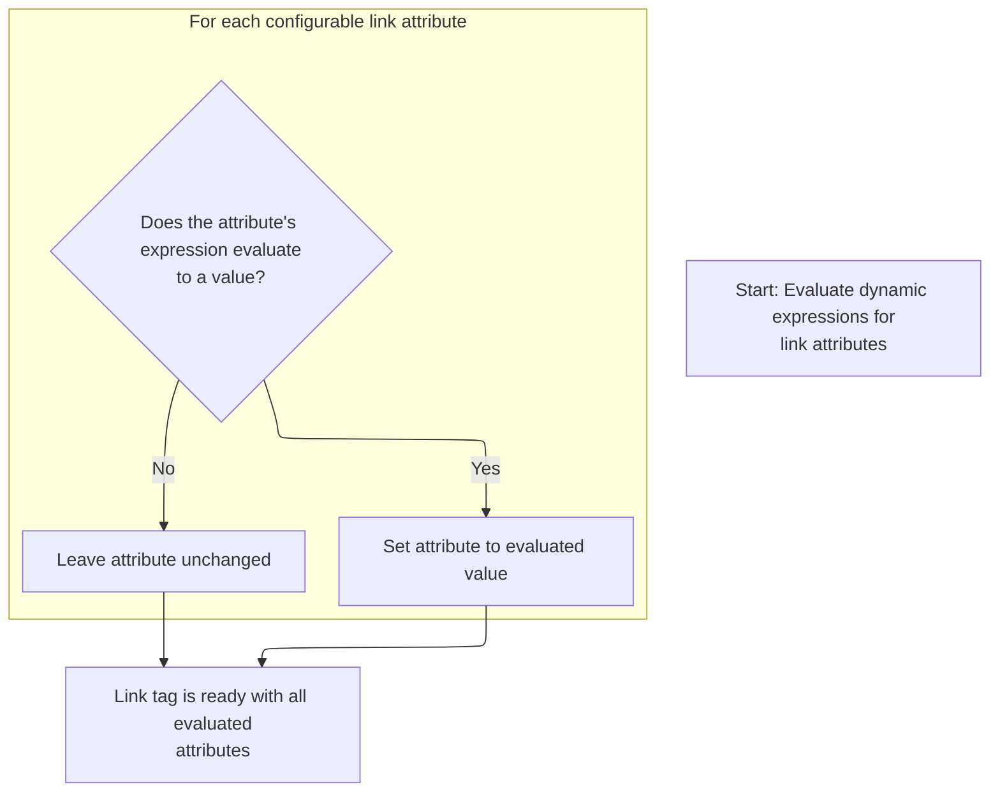

This document describes how link and resource tags are rendered with attributes dynamically evaluated from the page context. The flow sets tag properties based on the current context and updates configurations if allowed, resulting in a tag ready for use in the web page.

# Starting the link tag processing

<SwmSnippet path="/el/src/main/java/org/apache/strutsel/taglib/html/ELLinkTag.java" line="993">

---

In <SwmToken path="el/src/main/java/org/apache/strutsel/taglib/html/ELLinkTag.java" pos="993:5:5" line-data="    public int doStartTag() throws JspException {">`doStartTag`</SwmToken>, we kick things off by resolving all tag attribute expressions with <SwmToken path="el/src/main/java/org/apache/strutsel/taglib/html/ELLinkTag.java" pos="994:1:1" line-data="        evaluateExpressions();">`evaluateExpressions`</SwmToken>. This ensures the tag's properties are set based on the current page context before any further processing.

```java
    public int doStartTag() throws JspException {
        evaluateExpressions();

```

---

</SwmSnippet>

## Evaluating link tag expressions and updating configs



<SwmSnippet path="/el/src/main/java/org/apache/strutsel/taglib/html/ELLinkTag.java" line="1005">

---

In <SwmToken path="el/src/main/java/org/apache/strutsel/taglib/html/ELLinkTag.java" pos="1005:5:5" line-data="    private void evaluateExpressions()">`evaluateExpressions`</SwmToken>, we loop through each tag attribute, resolve its expression, and update the property if a value is found. After evaluating the module expression, we call <SwmToken path="el/src/main/java/org/apache/strutsel/taglib/html/ELLinkTag.java" pos="1025:1:1" line-data="            setModule(string);">`setModule`</SwmToken> to update the module context for the tag.

```java
    private void evaluateExpressions()
        throws JspException {
        String string = null;
        Boolean bool = null;

        if ((string =
                EvalHelper.evalString("accessKey", getAccesskeyExpr(), this,
                    pageContext)) != null) {
            setAccesskey(string);
        }

        if ((string =
                EvalHelper.evalString("action", getActionExpr(), this,
                    pageContext)) != null) {
            setAction(string);
        }

        if ((string =
                EvalHelper.evalString("module", getModuleExpr(), this,
                    pageContext)) != null) {
            setModule(string);
        }

```

---

</SwmSnippet>

<SwmSnippet path="/core/src/main/java/org/apache/struts/config/ForwardConfig.java" line="210">

---

<SwmToken path="core/src/main/java/org/apache/struts/config/ForwardConfig.java" pos="210:5:5" line-data="    public void setModule(String module) {">`setModule`</SwmToken> checks if the config is frozen using the 'configured' flag. If it's frozen, it throws an exception, so the module can't be changed after initialization. This keeps the config immutable once it's set.

```java
    public void setModule(String module) {
        if (configured) {
            throw new IllegalStateException("Configuration is frozen");
        }

        this.module = module;
    }
```

---

</SwmSnippet>

<SwmSnippet path="/el/src/main/java/org/apache/strutsel/taglib/html/ELLinkTag.java" line="1028">

---

Back in `ELLinkTag.evaluateExpressions`, after updating the module, we move on to evaluating and setting the anchor and bundle properties. Calling <SwmToken path="el/src/main/java/org/apache/strutsel/taglib/html/ELLinkTag.java" pos="1037:1:1" line-data="            setBundle(string);">`setBundle`</SwmToken> next lets us update the resource bundle for localization.

```java
        if ((string =
                EvalHelper.evalString("anchor", getAnchorExpr(), this,
                    pageContext)) != null) {
            setAnchor(string);
        }

        if ((string =
                EvalHelper.evalString("bundle", getBundleExpr(), this,
                    pageContext)) != null) {
            setBundle(string);
        }

```

---

</SwmSnippet>

<SwmSnippet path="/core/src/main/java/org/apache/struts/config/ExceptionConfig.java" line="89">

---

<SwmToken path="core/src/main/java/org/apache/struts/config/ExceptionConfig.java" pos="89:5:5" line-data="    public void setBundle(String bundle) {">`setBundle`</SwmToken> checks if the config is frozen before updating the bundle. If it's frozen, it throws an exception, so the bundle can't be changed after setup. This keeps resource resolution consistent.

```java
    public void setBundle(String bundle) {
        if (configured) {
            throw new IllegalStateException("Configuration is frozen");
        }

        this.bundle = bundle;
    }
```

---

</SwmSnippet>

<SwmSnippet path="/el/src/main/java/org/apache/strutsel/taglib/html/ELLinkTag.java" line="1040">

---

After returning from <SwmToken path="core/src/main/java/org/apache/struts/config/ExceptionConfig.java" pos="34:4:4" line-data="public class ExceptionConfig extends BaseConfig {">`ExceptionConfig`</SwmToken>, `ELLinkTag.evaluateExpressions` keeps evaluating more tag attributes. We call <SwmToken path="el/src/main/java/org/apache/strutsel/taglib/html/ELLinkTag.java" pos="1195:1:1" line-data="            setScope(string);">`setScope`</SwmToken> next to update the scope, which controls how the tag's data is managed in the page context.

```java
        if ((string =
        		EvalHelper.evalString("dir", getDirExpr(), this,
        			pageContext)) != null) {
        	setDir(string);
        }
        
        if ((string =
                EvalHelper.evalString("forward", getForwardExpr(), this,
                    pageContext)) != null) {
            setForward(string);
        }

        if ((string =
                EvalHelper.evalString("href", getHrefExpr(), this, pageContext)) != null) {
            setHref(string);
        }

        if ((bool =
                EvalHelper.evalBoolean("indexed", getIndexedExpr(), this,
                    pageContext)) != null) {
            setIndexed(bool.booleanValue());
        }

        if ((string =
                EvalHelper.evalString("indexId", getIndexIdExpr(), this,
                    pageContext)) != null) {
            setIndexId(string);
        }

        if ((string =
            	EvalHelper.evalString("lang", getLangExpr(), this,
            		pageContext)) != null) {
        	setLang(string);
        }

        if ((string =
                EvalHelper.evalString("linkName", getLinkNameExpr(), this,
                    pageContext)) != null) {
            setLinkName(string);
        }

        if ((string =
                EvalHelper.evalString("name", getNameExpr(), this, pageContext)) != null) {
            setName(string);
        }

        if ((string =
                EvalHelper.evalString("onblur", getOnblurExpr(), this,
                    pageContext)) != null) {
            setOnblur(string);
        }

        if ((string =
                EvalHelper.evalString("onclick", getOnclickExpr(), this,
                    pageContext)) != null) {
            setOnclick(string);
        }

        if ((string =
                EvalHelper.evalString("ondblclick", getOndblclickExpr(), this,
                    pageContext)) != null) {
            setOndblclick(string);
        }

        if ((string =
                EvalHelper.evalString("onfocus", getOnfocusExpr(), this,
                    pageContext)) != null) {
            setOnfocus(string);
        }

        if ((string =
                EvalHelper.evalString("onkeydown", getOnkeydownExpr(), this,
                    pageContext)) != null) {
            setOnkeydown(string);
        }

        if ((string =
                EvalHelper.evalString("onkeypress", getOnkeypressExpr(), this,
                    pageContext)) != null) {
            setOnkeypress(string);
        }

        if ((string =
                EvalHelper.evalString("onkeyup", getOnkeyupExpr(), this,
                    pageContext)) != null) {
            setOnkeyup(string);
        }

        if ((string =
                EvalHelper.evalString("onmousedown", getOnmousedownExpr(),
                    this, pageContext)) != null) {
            setOnmousedown(string);
        }

        if ((string =
                EvalHelper.evalString("onmousemove", getOnmousemoveExpr(),
                    this, pageContext)) != null) {
            setOnmousemove(string);
        }

        if ((string =
                EvalHelper.evalString("onmouseout", getOnmouseoutExpr(), this,
                    pageContext)) != null) {
            setOnmouseout(string);
        }

        if ((string =
                EvalHelper.evalString("onmouseover", getOnmouseoverExpr(),
                    this, pageContext)) != null) {
            setOnmouseover(string);
        }

        if ((string =
                EvalHelper.evalString("onmouseup", getOnmouseupExpr(), this,
                    pageContext)) != null) {
            setOnmouseup(string);
        }

        if ((string =
                EvalHelper.evalString("page", getPageExpr(), this, pageContext)) != null) {
            setPage(string);
        }

        if ((string =
                EvalHelper.evalString("paramId", getParamIdExpr(), this,
                    pageContext)) != null) {
            setParamId(string);
        }

        if ((string =
                EvalHelper.evalString("paramName", getParamNameExpr(), this,
                    pageContext)) != null) {
            setParamName(string);
        }

        if ((string =
                EvalHelper.evalString("paramProperty", getParamPropertyExpr(),
                    this, pageContext)) != null) {
            setParamProperty(string);
        }

        if ((string =
                EvalHelper.evalString("paramScope", getParamScopeExpr(), this,
                    pageContext)) != null) {
            setParamScope(string);
        }

        if ((string =
                EvalHelper.evalString("property", getPropertyExpr(), this,
                    pageContext)) != null) {
            setProperty(string);
        }

        if ((string =
                EvalHelper.evalString("scope", getScopeExpr(), this, pageContext)) != null) {
            setScope(string);
        }

```

---

</SwmSnippet>

<SwmSnippet path="/core/src/main/java/org/apache/struts/config/ActionConfig.java" line="652">

---

<SwmToken path="core/src/main/java/org/apache/struts/config/ActionConfig.java" pos="652:5:5" line-data="    public void setScope(String scope) {">`setScope`</SwmToken> checks if the config is frozen before updating the scope. If it's frozen, it throws an exception, so the scope can't be changed after setup. This keeps the tag's data handling predictable.

```java
    public void setScope(String scope) {
        if (configured) {
            throw new IllegalStateException("Configuration is frozen");
        }

        this.scope = scope;
    }
```

---

</SwmSnippet>

<SwmSnippet path="/el/src/main/java/org/apache/strutsel/taglib/html/ELLinkTag.java" line="1198">

---

After returning from <SwmToken path="core/src/main/java/org/apache/struts/config/ForwardConfig.java" pos="261:14:14" line-data="     * @param actionConfig The {@link ActionConfig} that this config is from,">`ActionConfig`</SwmToken>, `ELLinkTag.evaluateExpressions` finishes up by evaluating and setting the rest of the tag's properties. These control the link's styling and behavior, so their values impact the final output.

```java
        if ((string =
                EvalHelper.evalString("style", getStyleExpr(), this, pageContext)) != null) {
            setStyle(string);
        }

        if ((string =
                EvalHelper.evalString("styleClass", getStyleClassExpr(), this,
                    pageContext)) != null) {
            setStyleClass(string);
        }

        if ((string =
                EvalHelper.evalString("styleId", getStyleIdExpr(), this,
                    pageContext)) != null) {
            setStyleId(string);
        }

        if ((string =
                EvalHelper.evalString("tabindex", getTabindexExpr(), this,
                    pageContext)) != null) {
            setTabindex(string);
        }

        if ((string =
                EvalHelper.evalString("target", getTargetExpr(), this,
                    pageContext)) != null) {
            setTarget(string);
        }

        if ((string =
                EvalHelper.evalString("title", getTitleExpr(), this, pageContext)) != null) {
            setTitle(string);
        }

        if ((string =
                EvalHelper.evalString("titleKey", getTitleKeyExpr(), this,
                    pageContext)) != null) {
            setTitleKey(string);
        }

        if ((bool =
                EvalHelper.evalBoolean("transaction", getTransactionExpr(),
                    this, pageContext)) != null) {
            setTransaction(bool.booleanValue());
        }

        if ((bool =
                EvalHelper.evalBoolean("useLocalEncoding",
                    getUseLocalEncodingExpr(), this, pageContext)) != null) {
            setUseLocalEncoding(bool.booleanValue());
        }
    }
```

---

</SwmSnippet>

## Delegating link tag rendering

<SwmSnippet path="/el/src/main/java/org/apache/strutsel/taglib/html/ELLinkTag.java" line="996">

---

After finishing up in `ELLinkTag.evaluateExpressions`, <SwmToken path="el/src/main/java/org/apache/strutsel/taglib/html/ELLinkTag.java" pos="996:6:6" line-data="        return (super.doStartTag());">`doStartTag`</SwmToken> hands off to the superclass to handle rendering. Next, we call <SwmToken path="el/src/main/java/org/apache/strutsel/taglib/bean/ELResourceTag.java" pos="38:4:4" line-data="public class ELResourceTag extends ResourceTag {">`ELResourceTag`</SwmToken> to process any resource-related logic for the tag.

```java
        return (super.doStartTag());
    }
```

---

</SwmSnippet>

# Starting resource tag processing

<SwmSnippet path="/el/src/main/java/org/apache/strutsel/taglib/bean/ELResourceTag.java" line="120">

---

<SwmToken path="el/src/main/java/org/apache/strutsel/taglib/bean/ELResourceTag.java" pos="120:5:5" line-data="    public int doStartTag() throws JspException {">`doStartTag`</SwmToken> in <SwmToken path="el/src/main/java/org/apache/strutsel/taglib/bean/ELResourceTag.java" pos="38:4:4" line-data="public class ELResourceTag extends ResourceTag {">`ELResourceTag`</SwmToken> starts by resolving tag attribute expressions, then delegates to the superclass for rendering. This ensures the tag uses the right values from the page context.

```java
    public int doStartTag() throws JspException {
        evaluateExpressions();

        return (super.doStartTag());
    }
```

---

</SwmSnippet>

# Evaluating resource tag expressions and updating configs

```mermaid
%%{init: {"flowchart": {"defaultRenderer": "elk"}} }%%
flowchart TD
    node1["Evaluate expressions for resource
attributes"] --> node2{"Evaluate 'id' expression: Value
present?"}
    click node1 openCode "el/src/main/java/org/apache/strutsel/taglib/bean/ELResourceTag.java:132:136"
    node2 -->|"Yes"| node3["Update resource id"]
    click node2 openCode "el/src/main/java/org/apache/strutsel/taglib/bean/ELResourceTag.java:136:139"
    click node3 openCode "el/src/main/java/org/apache/strutsel/taglib/bean/ELResourceTag.java:138:139"
    node2 -->|"No"| node4{"Evaluate 'input' expression: Value
present?"}
    node3 --> node4
    click node4 openCode "el/src/main/java/org/apache/strutsel/taglib/bean/ELResourceTag.java:141:144"
    node4 -->|"Yes"| node5["Update resource input"]
    click node5 openCode "el/src/main/java/org/apache/strutsel/taglib/bean/ELResourceTag.java:143:144"
    node4 -->|"No"| node6{"Evaluate 'name' expression: Value
present?"}
    node5 --> node6
    click node6 openCode "el/src/main/java/org/apache/strutsel/taglib/bean/ELResourceTag.java:146:149"
    node6 -->|"Yes"| node7["Update resource name"]
    click node7 openCode "el/src/main/java/org/apache/strutsel/taglib/bean/ELResourceTag.java:148:149"
    node6 -->|"No"| node8["End of evaluation"]
classDef HeadingStyle fill:#777777,stroke:#333,stroke-width:2px;

%% Swimm:
%% %%{init: {"flowchart": {"defaultRenderer": "elk"}} }%%
%% flowchart TD
%%     node1["Evaluate expressions for resource
%% attributes"] --> node2{"Evaluate 'id' expression: Value
%% present?"}
%%     click node1 openCode "<SwmPath>[el/…/bean/ELResourceTag.java](el/src/main/java/org/apache/strutsel/taglib/bean/ELResourceTag.java)</SwmPath>:132:136"
%%     node2 -->|"Yes"| node3["Update resource id"]
%%     click node2 openCode "<SwmPath>[el/…/bean/ELResourceTag.java](el/src/main/java/org/apache/strutsel/taglib/bean/ELResourceTag.java)</SwmPath>:136:139"
%%     click node3 openCode "<SwmPath>[el/…/bean/ELResourceTag.java](el/src/main/java/org/apache/strutsel/taglib/bean/ELResourceTag.java)</SwmPath>:138:139"
%%     node2 -->|"No"| node4{"Evaluate 'input' expression: Value
%% present?"}
%%     node3 --> node4
%%     click node4 openCode "<SwmPath>[el/…/bean/ELResourceTag.java](el/src/main/java/org/apache/strutsel/taglib/bean/ELResourceTag.java)</SwmPath>:141:144"
%%     node4 -->|"Yes"| node5["Update resource input"]
%%     click node5 openCode "<SwmPath>[el/…/bean/ELResourceTag.java](el/src/main/java/org/apache/strutsel/taglib/bean/ELResourceTag.java)</SwmPath>:143:144"
%%     node4 -->|"No"| node6{"Evaluate 'name' expression: Value
%% present?"}
%%     node5 --> node6
%%     click node6 openCode "<SwmPath>[el/…/bean/ELResourceTag.java](el/src/main/java/org/apache/strutsel/taglib/bean/ELResourceTag.java)</SwmPath>:146:149"
%%     node6 -->|"Yes"| node7["Update resource name"]
%%     click node7 openCode "<SwmPath>[el/…/bean/ELResourceTag.java](el/src/main/java/org/apache/strutsel/taglib/bean/ELResourceTag.java)</SwmPath>:148:149"
%%     node6 -->|"No"| node8["End of evaluation"]
%% classDef HeadingStyle fill:#777777,stroke:#333,stroke-width:2px;
```



<SwmSnippet path="/el/src/main/java/org/apache/strutsel/taglib/bean/ELResourceTag.java" line="132">

---

In <SwmToken path="el/src/main/java/org/apache/strutsel/taglib/bean/ELResourceTag.java" pos="132:5:5" line-data="    private void evaluateExpressions()">`evaluateExpressions`</SwmToken>, we resolve each tag attribute and update the property if a value is found. After evaluating the input expression, we call <SwmToken path="el/src/main/java/org/apache/strutsel/taglib/bean/ELResourceTag.java" pos="143:1:1" line-data="            setInput(string);">`setInput`</SwmToken> to update how the tag handles input data.

```java
    private void evaluateExpressions()
        throws JspException {
        String string = null;

        if ((string =
                EvalHelper.evalString("id", getIdExpr(), this, pageContext)) != null) {
            setId(string);
        }

        if ((string =
                EvalHelper.evalString("input", getInputExpr(), this, pageContext)) != null) {
            setInput(string);
        }

```

---

</SwmSnippet>

<SwmSnippet path="/core/src/main/java/org/apache/struts/config/ActionConfig.java" line="473">

---

<SwmToken path="core/src/main/java/org/apache/struts/config/ActionConfig.java" pos="473:5:5" line-data="    public void setInput(String input) {">`setInput`</SwmToken> checks if the config is frozen before updating the input. If it's frozen, it throws an exception, so input can't be changed after setup. This keeps input handling consistent.

```java
    public void setInput(String input) {
        if (configured) {
            throw new IllegalStateException("Configuration is frozen");
        }

        this.input = input;
    }
```

---

</SwmSnippet>

<SwmSnippet path="/el/src/main/java/org/apache/strutsel/taglib/bean/ELResourceTag.java" line="146">

---

After returning from <SwmToken path="core/src/main/java/org/apache/struts/config/ForwardConfig.java" pos="261:14:14" line-data="     * @param actionConfig The {@link ActionConfig} that this config is from,">`ActionConfig`</SwmToken>, `ELResourceTag.evaluateExpressions` finishes up by evaluating and setting the name property. This affects how the resource tag is identified and used in the page context.

```java
        if ((string =
                EvalHelper.evalString("name", getNameExpr(), this, pageContext)) != null) {
            setName(string);
        }
    }
```

---

</SwmSnippet>

&nbsp;

*This is an auto-generated document by Swimm 🌊 and has not yet been verified by a human*

<SwmMeta version="3.0.0" repo-id="Z2l0aHViJTNBJTNBc3RydXRzMSUzQSUzQVN3aW1tLURlbW8=" repo-name="struts1"><sup>Powered by [Swimm](https://app.swimm.io/)</sup></SwmMeta>
