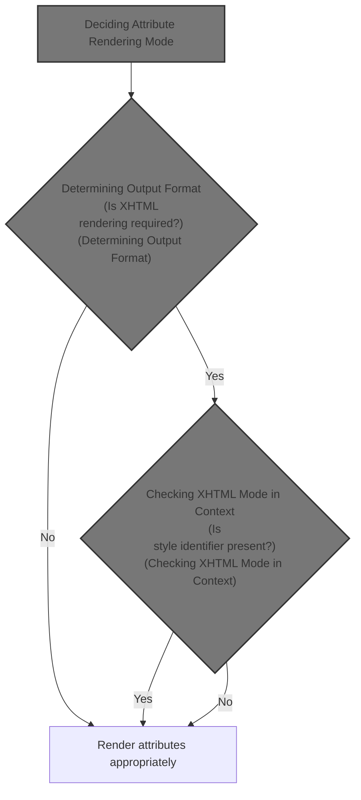
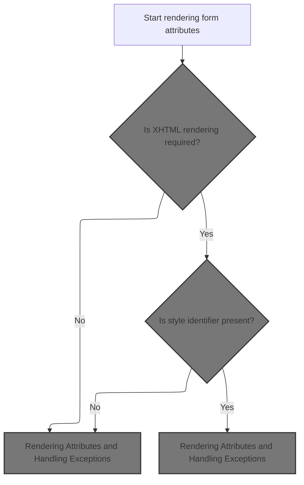
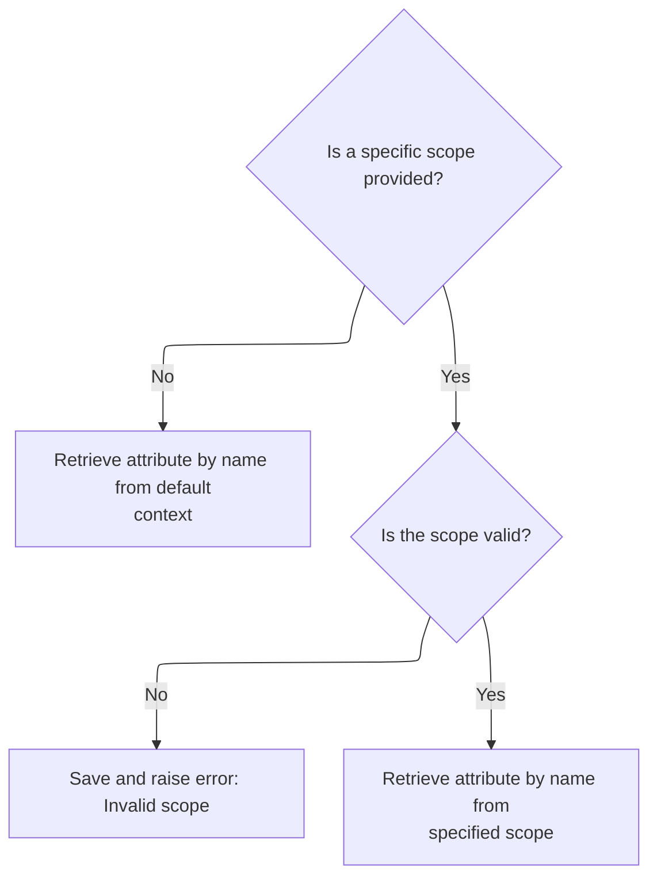

This document explains how the system determines the correct way to render form element attributes based on the required output format and context. The flow ensures that form elements are rendered with the appropriate attributes for compatibility and correctness.



# Deciding Attribute Rendering Mode



<SwmSnippet path="/taglib/src/main/java/org/apache/struts/taglib/html/FormTag.java" line="588">

---

In <SwmToken path="taglib/src/main/java/org/apache/struts/taglib/html/FormTag.java" pos="588:5:5" line-data="    protected void renderName(StringBuffer results)">`renderName`</SwmToken>, we start by checking if XHTML output is needed using <SwmToken path="taglib/src/main/java/org/apache/struts/taglib/html/FormTag.java" pos="590:6:8" line-data="        if (this.isXhtml()) {">`isXhtml()`</SwmToken>. This determines whether we render just the 'id' or both 'name' and 'id' attributes, and sets up the conditional logic for handling style id exceptions and attribute rendering.

```java
    protected void renderName(StringBuffer results)
        throws JspException {
        if (this.isXhtml()) {
```

---

</SwmSnippet>

## Determining Output Format

<SwmSnippet path="/taglib/src/main/java/org/apache/struts/taglib/html/FormTag.java" line="898">

---

<SwmToken path="taglib/src/main/java/org/apache/struts/taglib/html/FormTag.java" pos="898:5:5" line-data="    private boolean isXhtml() {">`isXhtml`</SwmToken> just calls <SwmToken path="taglib/src/main/java/org/apache/struts/taglib/html/FormTag.java" pos="899:3:3" line-data="        return TagUtils.getInstance().isXhtml(this.pageContext);">`TagUtils`</SwmToken> to check if XHTML mode is set in the page context. This lets the tag know how to render attributes based on the current output format.

```java
    private boolean isXhtml() {
        return TagUtils.getInstance().isXhtml(this.pageContext);
    }
```

---

</SwmSnippet>

## Checking XHTML Mode in Context

<SwmSnippet path="/taglib/src/main/java/org/apache/struts/taglib/TagUtils.java" line="838">

---

<SwmToken path="taglib/src/main/java/org/apache/struts/taglib/TagUtils.java" pos="838:5:5" line-data="    public boolean isXhtml(PageContext pageContext) {">`isXhtml`</SwmToken> in <SwmToken path="taglib/src/main/java/org/apache/struts/taglib/html/FormTag.java" pos="899:3:3" line-data="        return TagUtils.getInstance().isXhtml(this.pageContext);">`TagUtils`</SwmToken> checks the page context for a flag (<SwmToken path="taglib/src/main/java/org/apache/struts/taglib/TagUtils.java" pos="841:16:16" line-data="            xhtml = (String) lookup(pageContext, Globals.XHTML_KEY, null);">`XHTML_KEY`</SwmToken>) to see if XHTML mode is enabled. If the lookup fails, it logs the error and throws a runtime exception.

```java
    public boolean isXhtml(PageContext pageContext) {
        String xhtml;
        try {
            xhtml = (String) lookup(pageContext, Globals.XHTML_KEY, null);
            return "true".equalsIgnoreCase(xhtml);
        } catch (JspException e) {
            log.error("Failed xhtml lookup", e);
            throw new RuntimeException(e);
        }
    }
```

---

</SwmSnippet>

## Resolving Attribute Scope



<SwmSnippet path="/taglib/src/main/java/org/apache/struts/taglib/TagUtils.java" line="863">

---

In <SwmToken path="taglib/src/main/java/org/apache/struts/taglib/TagUtils.java" pos="863:5:5" line-data="    public Object lookup(PageContext pageContext, String name, String scopeName)">`lookup`</SwmToken>, we decide whether to search all scopes or a specific one for the attribute. If a scope name is given, we resolve it and fetch the attribute from that scope; otherwise, we search everywhere.

```java
    public Object lookup(PageContext pageContext, String name, String scopeName)
        throws JspException {
        if (scopeName == null) {
            return pageContext.findAttribute(name);
        }

        try {
            return pageContext.getAttribute(name, instance.getScope(scopeName));
```

---

</SwmSnippet>

<SwmSnippet path="/taglib/src/main/java/org/apache/struts/taglib/TagUtils.java" line="809">

---

<SwmToken path="taglib/src/main/java/org/apache/struts/taglib/TagUtils.java" pos="809:5:5" line-data="    public int getScope(String scopeName)">`getScope`</SwmToken> converts the scope name to an integer for use in attribute retrieval. If the scope name isn't valid, it throws a localized exception to flag the error.

```java
    public int getScope(String scopeName)
        throws JspException {
        Integer scope = (Integer) scopes.get(scopeName.toLowerCase());

        if (scope == null) {
            throw new JspException(messages.getMessage("lookup.scope", scope));
        }

        return scope.intValue();
    }
```

---

</SwmSnippet>

<SwmSnippet path="/taglib/src/main/java/org/apache/struts/taglib/TagUtils.java" line="870">

---

Back in TagUtils.lookup, after resolving the scope, we either fetch the attribute from the page context or, if it's a special component scope, delegate to <SwmToken path="tiles/src/main/java/org/apache/struts/tiles/ComponentContext.java" pos="39:4:4" line-data="public class ComponentContext implements Serializable {">`ComponentContext`</SwmToken>. Exceptions are caught and saved before being rethrown.

```java
            return pageContext.getAttribute(name, instance.getScope(scopeName));
        } catch (JspException e) {
            saveException(pageContext, e);
            throw e;
        }
    }
```

---

</SwmSnippet>

<SwmSnippet path="/tiles/src/main/java/org/apache/struts/tiles/ComponentContext.java" line="169">

---

<SwmToken path="tiles/src/main/java/org/apache/struts/tiles/ComponentContext.java" pos="169:5:5" line-data="    public Object getAttribute(">`getAttribute`</SwmToken> checks if the scope is <SwmToken path="tiles/src/main/java/org/apache/struts/tiles/ComponentContext.java" pos="174:10:10" line-data="        if (scope == ComponentConstants.COMPONENT_SCOPE){">`COMPONENT_SCOPE`</SwmToken>. If so, it grabs the attribute from the component context; otherwise, it pulls it from the page context, letting the framework handle both component and page-level attributes.

```java
    public Object getAttribute(
        String beanName,
        int scope,
        PageContext pageContext) {

        if (scope == ComponentConstants.COMPONENT_SCOPE){
            return getAttribute(beanName);
        }

        return pageContext.getAttribute(beanName, scope);
    }
```

---

</SwmSnippet>

## Rendering Attributes and Handling Exceptions

<SwmSnippet path="/taglib/src/main/java/org/apache/struts/taglib/html/FormTag.java" line="591">

---

Back in <SwmToken path="taglib/src/main/java/org/apache/struts/taglib/html/FormTag.java" pos="588:5:5" line-data="    protected void renderName(StringBuffer results)">`renderName`</SwmToken>, after checking XHTML mode, we either render just the 'id' or both 'name' and 'id' attributes. If a style id is set in XHTML mode, we throw a localized exception to prevent invalid markup.

```java
            if (getStyleId() == null) {
                renderAttribute(results, "id", beanName);
            } else {
                throw new JspException(messages.getMessage("formTag.ignoredId"));
            }
        } else {
            renderAttribute(results, "name", beanName);
            renderAttribute(results, "id", getStyleId());
        }
    }
```

---

</SwmSnippet>

&nbsp;

*This is an auto-generated document by Swimm 🌊 and has not yet been verified by a human*

<SwmMeta version="3.0.0" repo-id="Z2l0aHViJTNBJTNBc3RydXRzMSUzQSUzQVN3aW1tLURlbW8=" repo-name="struts1"><sup>Powered by [Swimm](https://app.swimm.io/)</sup></SwmMeta>
