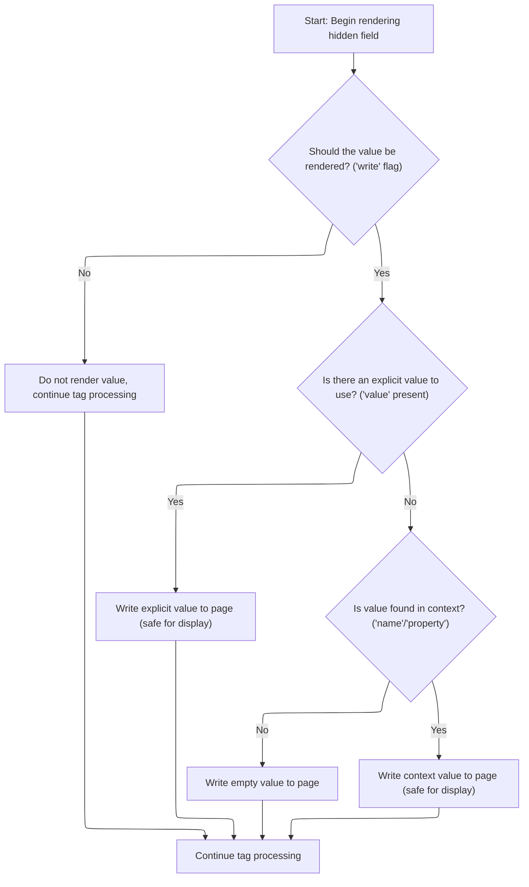

This document describes how hidden fields are rendered as part of form generation. The flow determines whether to output a value and selects the appropriate value—explicit, context-derived, or empty—ensuring the hidden field is rendered correctly on the page.

# Controlling Hidden Field Rendering



<SwmSnippet path="/taglib/src/main/java/org/apache/struts/taglib/html/HiddenTag.java" line="67">

---

<SwmToken path="taglib/src/main/java/org/apache/struts/taglib/html/HiddenTag.java" pos="67:5:5" line-data="    public int doStartTag() throws JspException {">`doStartTag`</SwmToken> kicks off the rendering logic for the hidden field. It checks the 'write' flag—if it's off, it skips outputting the value and just evaluates the tag body. If 'write' is on, it figures out what value to render: either the explicit 'value' (filtered for safety), or it looks up a value using <SwmToken path="taglib/src/main/java/org/apache/struts/taglib/html/HiddenTag.java" pos="81:5:5" line-data="            results = TagUtils.getInstance().filter(value);">`TagUtils`</SwmToken>. If nothing is found, it outputs an empty string. <SwmToken path="taglib/src/main/java/org/apache/struts/taglib/html/HiddenTag.java" pos="81:5:5" line-data="            results = TagUtils.getInstance().filter(value);">`TagUtils`</SwmToken> handles filtering and writing to the page, so the output is always sanitized. This is where the tag decides what gets rendered and how.

```java
    public int doStartTag() throws JspException {
        // Render the <html:input type="hidden"> tag as before
        super.doStartTag();

        // Is rendering the value separately requested?
        if (!write) {
            return (EVAL_BODY_TAG);
        }

        // Calculate the value to be rendered separately
        // * @since Struts 1.1
        String results = null;

        if (value != null) {
            results = TagUtils.getInstance().filter(value);
        } else {
            Object value =
                TagUtils.getInstance().lookup(pageContext, name, property, null);

            if (value == null) {
                results = "";
            } else {
                results = TagUtils.getInstance().filter(value.toString());
            }
        }

        TagUtils.getInstance().write(pageContext, results);

        return (EVAL_BODY_TAG);
    }
```

---

</SwmSnippet>

&nbsp;

*This is an auto-generated document by Swimm 🌊 and has not yet been verified by a human*

<SwmMeta version="3.0.0" repo-id="Z2l0aHViJTNBJTNBc3RydXRzMSUzQSUzQVN3aW1tLURlbW8=" repo-name="struts1"><sup>Powered by [Swimm](https://app.swimm.io/)</sup></SwmMeta>
