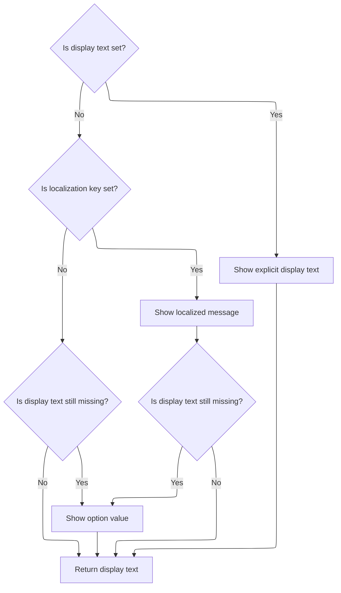

This document describes how option data is transformed into an HTML option element for a select dropdown. The process determines the display text and applies attributes to produce the final markup for use in forms.

# Writing the option element to the page

<SwmSnippet path="/taglib/src/main/java/org/apache/struts/taglib/html/OptionTag.java" line="319">

---

<SwmToken path="taglib/src/main/java/org/apache/struts/taglib/html/OptionTag.java" pos="319:5:5" line-data="    public int doEndTag() throws JspException {">`doEndTag`</SwmToken> handles writing the generated option HTML to the page using <SwmToken path="taglib/src/main/java/org/apache/struts/taglib/html/OptionTag.java" pos="320:1:1" line-data="        TagUtils.getInstance().write(pageContext, this.renderOptionElement());">`TagUtils`</SwmToken>, and relies on <SwmToken path="taglib/src/main/java/org/apache/struts/taglib/html/OptionTag.java" pos="320:14:14" line-data="        TagUtils.getInstance().write(pageContext, this.renderOptionElement());">`renderOptionElement`</SwmToken> to build the actual markup. This keeps output and markup generation separate.

```java
    public int doEndTag() throws JspException {
        TagUtils.getInstance().write(pageContext, this.renderOptionElement());

        return (EVAL_PAGE);
    }
```

---

</SwmSnippet>

# Building the option markup and handling selection

<SwmSnippet path="/taglib/src/main/java/org/apache/struts/taglib/html/OptionTag.java" line="331">

---

In <SwmToken path="taglib/src/main/java/org/apache/struts/taglib/html/OptionTag.java" pos="331:5:5" line-data="    protected String renderOptionElement()">`renderOptionElement`</SwmToken>, we start building the option tag, filter the value if needed, and check if the option should be disabled. Next, we call <SwmToken path="taglib/src/main/java/org/apache/struts/taglib/html/OptionTag.java" pos="347:6:6" line-data="        if (this.selectTag().isMatched(this.value)) {">`selectTag`</SwmToken> to see if the current value matches the selected value, so we can mark it as selected.

```java
    protected String renderOptionElement()
        throws JspException {
        StringBuffer results = new StringBuffer("<option value=\"");

        if (filter) {
            results.append(TagUtils.getInstance().filter(this.value));
        }
        else {
            results.append(this.value);
        }
        results.append("\"");

        if (disabled) {
            results.append(" disabled=\"disabled\"");
        }

        if (this.selectTag().isMatched(this.value)) {
            results.append(" selected=\"selected\"");
        }

```

---

</SwmSnippet>

<SwmSnippet path="/taglib/src/main/java/org/apache/struts/taglib/html/OptionTag.java" line="401">

---

<SwmToken path="taglib/src/main/java/org/apache/struts/taglib/html/OptionTag.java" pos="401:5:5" line-data="    private SelectTag selectTag()">`selectTag`</SwmToken> grabs the <SwmToken path="taglib/src/main/java/org/apache/struts/taglib/html/OptionTag.java" pos="401:3:3" line-data="    private SelectTag selectTag()">`SelectTag`</SwmToken> instance from the page context using a repository-specific key. If it's missing, it throws a <SwmToken path="taglib/src/main/java/org/apache/struts/taglib/html/OptionTag.java" pos="402:3:3" line-data="        throws JspException {">`JspException`</SwmToken> and logs the error in the context, so issues are caught and tracked.

```java
    private SelectTag selectTag()
        throws JspException {
        SelectTag selectTag =
            (SelectTag) pageContext.getAttribute(Constants.SELECT_KEY);

        if (selectTag == null) {
            JspException e =
                new JspException(messages.getMessage("optionTag.select"));

            TagUtils.getInstance().saveException(pageContext, e);
            throw e;
        }

        return selectTag;
    }
```

---

</SwmSnippet>

<SwmSnippet path="/taglib/src/main/java/org/apache/struts/taglib/html/OptionTag.java" line="351">

---

Back in <SwmToken path="taglib/src/main/java/org/apache/struts/taglib/html/OptionTag.java" pos="320:14:14" line-data="        TagUtils.getInstance().write(pageContext, this.renderOptionElement());">`renderOptionElement`</SwmToken>, after checking selection, we add style, id, class, dir, lang, and title attributes if they're set. For the title, we call <SwmToken path="taglib/src/main/java/org/apache/struts/taglib/html/OptionTag.java" pos="383:5:5" line-data="            results.append(message(title, titleKey));">`message`</SwmToken> to handle localization or literal values.

```java
        if (style != null) {
            results.append(" style=\"");
            results.append(TagUtils.getInstance().filter(style));
            results.append("\"");
        }

        if (styleId != null) {
            results.append(" id=\"");
            results.append(TagUtils.getInstance().filter(styleId));
            results.append("\"");
        }

        if (styleClass != null) {
            results.append(" class=\"");
            results.append(TagUtils.getInstance().filter(styleClass));
            results.append("\"");
        }

        if (dir != null) {
            results.append(" dir=\"");
            results.append(TagUtils.getInstance().filter(dir));
            results.append("\"");
        }

        if (lang != null) {
            results.append(" lang=\"");
            results.append(TagUtils.getInstance().filter(lang));
            results.append("\"");
        }

        if (title != null || titleKey != null) {
            results.append(" title=\"");
            results.append(message(title, titleKey));
            results.append("\"");
        }
        
```

---

</SwmSnippet>

<SwmSnippet path="/taglib/src/main/java/org/apache/struts/taglib/html/OptionTag.java" line="446">

---

<SwmToken path="taglib/src/main/java/org/apache/struts/taglib/html/OptionTag.java" pos="446:5:5" line-data="    protected String message(String literal, String key)">`message`</SwmToken> checks if both literal and key are set—throws if so. Otherwise, it returns the literal or fetches a localized string using the key. If neither is set, it returns null.

```java
    protected String message(String literal, String key)
        throws JspException {
        if (literal != null) {
            if (key != null) {
                JspException e =
                    new JspException(messages.getMessage("common.both"));

                TagUtils.getInstance().saveException(pageContext, e);
                throw e;
            } else {
                return (literal);
            }
        } else {
            if (key != null) {
                return TagUtils.getInstance().message(pageContext, getBundle(),
                    getLocale(), key);
            } else {
                return null;
            }
        }
    }
```

---

</SwmSnippet>

<SwmSnippet path="/taglib/src/main/java/org/apache/struts/taglib/html/OptionTag.java" line="387">

---

After finishing up the attributes in <SwmToken path="taglib/src/main/java/org/apache/struts/taglib/html/OptionTag.java" pos="320:14:14" line-data="        TagUtils.getInstance().write(pageContext, this.renderOptionElement());">`renderOptionElement`</SwmToken>, we call <SwmToken path="taglib/src/main/java/org/apache/struts/taglib/html/OptionTag.java" pos="389:5:7" line-data="        results.append(text());">`text()`</SwmToken> to set the visible content for the option. This handles localization and fallback logic for the display text.

```java
        results.append(">");

        results.append(text());

```

---

</SwmSnippet>

## Resolving the option display text



<SwmSnippet path="/taglib/src/main/java/org/apache/struts/taglib/html/OptionTag.java" line="473">

---

In <SwmToken path="taglib/src/main/java/org/apache/struts/taglib/html/OptionTag.java" pos="473:5:5" line-data="    protected String text() throws JspException {">`text`</SwmToken>, we first try to use the text field. If it's missing, we call <SwmToken path="taglib/src/main/java/org/apache/struts/taglib/html/OptionTag.java" pos="478:7:7" line-data="                TagUtils.getInstance().message(pageContext, bundle, locale, key);">`message`</SwmToken> to get a localized string using the key. If that doesn't work, we use the value as a last resort.

```java
    protected String text() throws JspException {
        String optionText = this.text;

        if ((optionText == null) && (this.key != null)) {
            optionText =
                TagUtils.getInstance().message(pageContext, bundle, locale, key);
        }

```

---

</SwmSnippet>

<SwmSnippet path="/taglib/src/main/java/org/apache/struts/taglib/html/OptionTag.java" line="481">

---

After trying <SwmToken path="taglib/src/main/java/org/apache/struts/taglib/html/OptionTag.java" pos="383:5:5" line-data="            results.append(message(title, titleKey));">`message`</SwmToken> in <SwmToken path="taglib/src/main/java/org/apache/struts/taglib/html/OptionTag.java" pos="481:7:7" line-data="        // no body text and no key to lookup so display the value">`text`</SwmToken>, if nothing is found, we use the value field. This guarantees the option always has display text, even if localization fails.

```java
        // no body text and no key to lookup so display the value
        if (optionText == null) {
            optionText = this.value;
        }

        return optionText;
    }
```

---

</SwmSnippet>

## Completing the option markup

<SwmSnippet path="/taglib/src/main/java/org/apache/struts/taglib/html/OptionTag.java" line="391">

---

After getting the display text from <SwmToken path="taglib/src/main/java/org/apache/struts/taglib/html/OptionTag.java" pos="389:5:5" line-data="        results.append(text());">`text`</SwmToken>, <SwmToken path="taglib/src/main/java/org/apache/struts/taglib/html/OptionTag.java" pos="320:14:14" line-data="        TagUtils.getInstance().write(pageContext, this.renderOptionElement());">`renderOptionElement`</SwmToken> closes the option tag and returns the complete markup as a string. This is what gets written out in <SwmToken path="taglib/src/main/java/org/apache/struts/taglib/html/OptionTag.java" pos="319:5:5" line-data="    public int doEndTag() throws JspException {">`doEndTag`</SwmToken>.

```java
        results.append("</option>");

        return results.toString();
    }
```

---

</SwmSnippet>

&nbsp;

*This is an auto-generated document by Swimm 🌊 and has not yet been verified by a human*

<SwmMeta version="3.0.0" repo-id="Z2l0aHViJTNBJTNBc3RydXRzMSUzQSUzQVN3aW1tLURlbW8=" repo-name="struts1"><sup>Powered by [Swimm](https://app.swimm.io/)</sup></SwmMeta>
