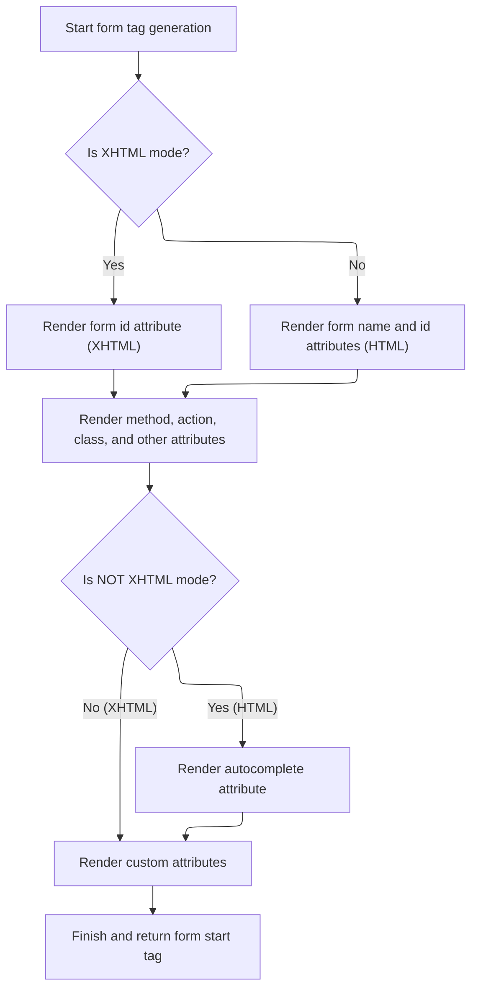
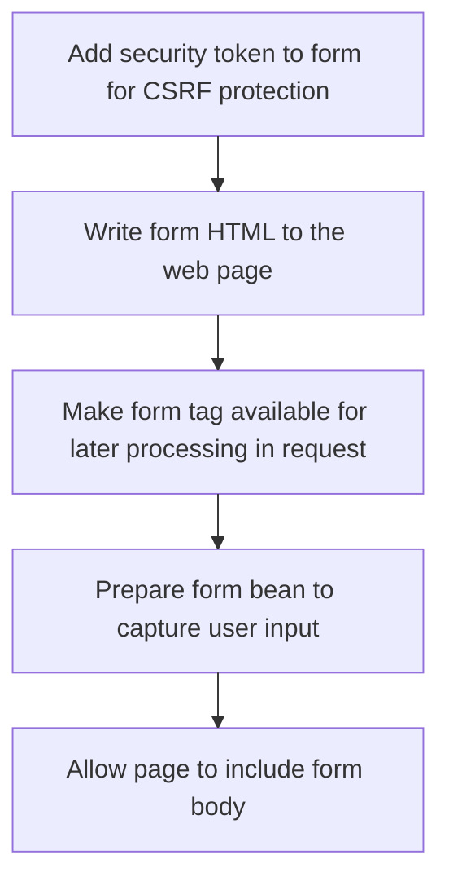

This document outlines how the application renders the opening HTML form tag, sets up required attributes, and ensures security with a CSRF token. The process prepares the form to capture user input and makes it available for further processing.

# Starting the form rendering

<SwmSnippet path="/taglib/src/main/java/org/apache/struts/taglib/html/FormTag.java" line="483">

---

In <SwmToken path="taglib/src/main/java/org/apache/struts/taglib/html/FormTag.java" pos="483:5:5" line-data="    public int doStartTag() throws JspException {">`doStartTag`</SwmToken>, we start by resolving the form bean and prepping the buffer for the HTML form. Calling <SwmToken path="taglib/src/main/java/org/apache/struts/taglib/html/FormTag.java" pos="493:7:7" line-data="        results.append(this.renderFormStartElement());">`renderFormStartElement`</SwmToken> right after sets up the actual form tag, which is needed before anything else gets rendered.

```java
    public int doStartTag() throws JspException {

        postbackAction = null;

        // Look up the form bean name, scope, and type if necessary
        this.lookup();

        // Create an appropriate "form" element based on our parameters
        StringBuffer results = new StringBuffer();

        results.append(this.renderFormStartElement());

```

---

</SwmSnippet>

## Building the form tag and attributes



<SwmSnippet path="/taglib/src/main/java/org/apache/struts/taglib/html/FormTag.java" line="553">

---

In <SwmToken path="taglib/src/main/java/org/apache/struts/taglib/html/FormTag.java" pos="553:5:5" line-data="    protected String renderFormStartElement()">`renderFormStartElement`</SwmToken>, we start building the form tag and immediately call <SwmToken path="taglib/src/main/java/org/apache/struts/taglib/html/FormTag.java" pos="558:1:1" line-data="        renderName(results);">`renderName`</SwmToken> to add the main identifiers. This sets up the tag for the rest of the attributes to be added cleanly.

```java
    protected String renderFormStartElement()
        throws JspException {
        StringBuffer results = new StringBuffer("<form");

        // render attributes
        renderName(results);

```

---

</SwmSnippet>

<SwmSnippet path="/taglib/src/main/java/org/apache/struts/taglib/html/FormTag.java" line="588">

---

RenderName handles adding 'name' and 'id' attributes, but applies strict rules for XHTML output—throwing an exception if a <SwmToken path="taglib/src/main/java/org/apache/struts/taglib/html/FormTag.java" pos="154:5:5" line-data="    protected String styleId = null;">`styleId`</SwmToken> is set, to make sure developers don't misuse the tag. It uses internal helpers for format checks and localization.

```java
    protected void renderName(StringBuffer results)
        throws JspException {
        if (this.isXhtml()) {
            if (getStyleId() == null) {
                renderAttribute(results, "id", beanName);
            } else {
                throw new JspException(messages.getMessage("formTag.ignoredId"));
            }
        } else {
            renderAttribute(results, "name", beanName);
            renderAttribute(results, "id", getStyleId());
        }
    }
```

---

</SwmSnippet>

<SwmSnippet path="/taglib/src/main/java/org/apache/struts/taglib/html/FormTag.java" line="560">

---

Back in <SwmToken path="taglib/src/main/java/org/apache/struts/taglib/html/FormTag.java" pos="493:7:7" line-data="        results.append(this.renderFormStartElement());">`renderFormStartElement`</SwmToken>, after <SwmToken path="taglib/src/main/java/org/apache/struts/taglib/html/FormTag.java" pos="558:1:1" line-data="        renderName(results);">`renderName`</SwmToken> sets up the identifiers, we add all the other form attributes, including method, action, and styling. The tag is finalized and returned as a string.

```java
        renderAttribute(results, "method",
            (getMethod() == null) ? "post" : getMethod());
        renderAction(results);
        renderAttribute(results, "accept-charset", getAcceptCharset());
        renderAttribute(results, "class", getStyleClass());
        renderAttribute(results, "dir", getDir());
        renderAttribute(results, "enctype", getEnctype());
        renderAttribute(results, "lang", getLang());
        renderAttribute(results, "onreset", getOnreset());
        renderAttribute(results, "onsubmit", getOnsubmit());
        renderAttribute(results, "style", getStyle());
        renderAttribute(results, "target", getTarget());
        if (!isXhtml()) {
            renderAttribute(results, "autocomplete", getAutocomplete());
        }

        // Hook for additional attributes
        renderOtherAttributes(results);

        results.append(">");

        return results.toString();
    }
```

---

</SwmSnippet>

## Completing form setup and output



<SwmSnippet path="/taglib/src/main/java/org/apache/struts/taglib/html/FormTag.java" line="495">

---

Back in <SwmToken path="taglib/src/main/java/org/apache/struts/taglib/html/FormTag.java" pos="483:5:5" line-data="    public int doStartTag() throws JspException {">`doStartTag`</SwmToken>, after getting the form tag from <SwmToken path="taglib/src/main/java/org/apache/struts/taglib/html/FormTag.java" pos="493:7:7" line-data="        results.append(this.renderFormStartElement());">`renderFormStartElement`</SwmToken>, we append a token, write the form to the page, store the tag for later use, and initialize the form bean. The flow ends by including the body.

```java
        results.append(this.renderToken());

        TagUtils.getInstance().write(pageContext, results.toString());

        // Store this tag itself as a page attribute
        pageContext.setAttribute(Constants.FORM_KEY, this,
            PageContext.REQUEST_SCOPE);

        this.initFormBean();

        return (EVAL_BODY_INCLUDE);
    }
```

---

</SwmSnippet>

&nbsp;

*This is an auto-generated document by Swimm 🌊 and has not yet been verified by a human*

<SwmMeta version="3.0.0" repo-id="Z2l0aHViJTNBJTNBc3RydXRzMSUzQSUzQVN3aW1tLURlbW8=" repo-name="struts1"><sup>Powered by [Swimm](https://app.swimm.io/)</sup></SwmMeta>
