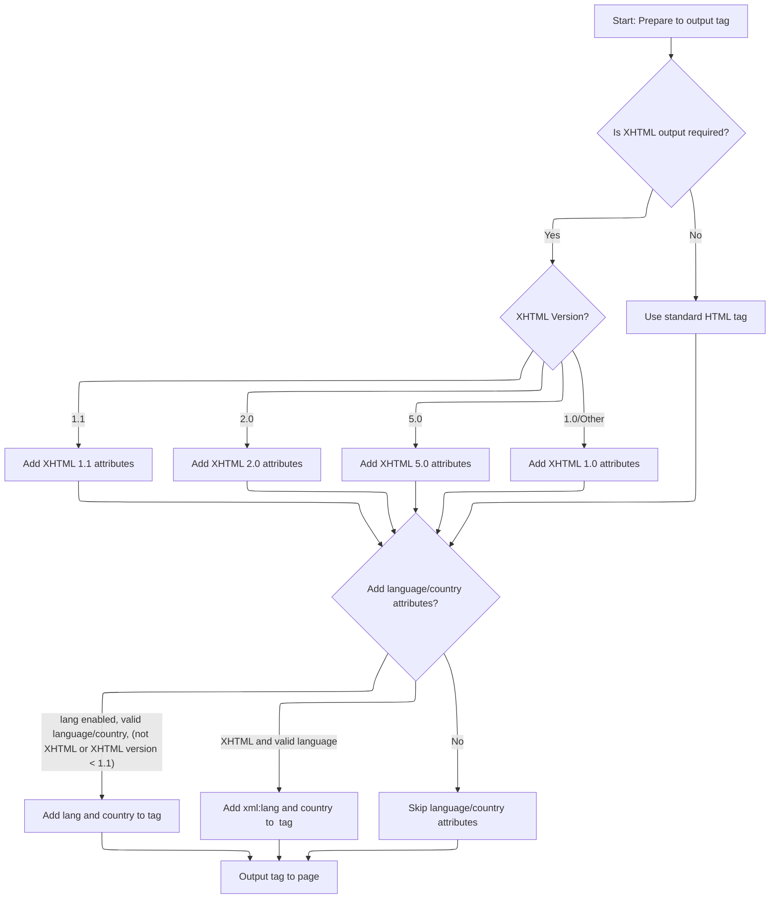

This document describes how the system renders the opening <html> tag for each page, ensuring that the tag includes the correct language, country, and XHTML attributes. The flow adapts the tag to match the user's locale and markup standard, so that the page is compliant and accessible.

# Rendering the opening <html> tag with locale and XHTML compliance



<SwmSnippet path="/taglib/src/main/java/org/apache/struts/taglib/html/HtmlTag.java" line="120">

---

DoStartTag kicks off the tag rendering by writing the opening <html> tag to the page output. It calls <SwmToken path="taglib/src/main/java/org/apache/struts/taglib/html/HtmlTag.java" pos="122:3:3" line-data="            this.renderHtmlStartElement());">`renderHtmlStartElement`</SwmToken> to handle all the logic for building the tag string, then signals to include the body content. This separation keeps the tag generation logic clean and maintainable.

```java
    public int doStartTag() throws JspException {
        TagUtils.getInstance().write(this.pageContext,
            this.renderHtmlStartElement());

        return EVAL_BODY_INCLUDE;
    }
```

---

</SwmSnippet>

<SwmSnippet path="/taglib/src/main/java/org/apache/struts/taglib/html/HtmlTag.java" line="132">

---

RenderHtmlStartElement builds the <html> tag string, adding locale-based language and country attributes, and setting XHTML-specific xmlns/schemaLocation attributes depending on the version. It pulls locale info from the page context, validates it, and applies lang/xml:lang as needed. It also sets <SwmToken path="taglib/src/main/java/org/apache/struts/taglib/html/HtmlTag.java" pos="139:9:9" line-data="            TagUtils.getInstance().getUserLocale(pageContext, Globals.LOCALE_KEY);">`pageContext`</SwmToken> flags for XHTML compliance and handles unknown XHTML versions by defaulting to <SwmToken path="taglib/src/main/java/org/apache/struts/taglib/html/HtmlTag.java" pos="170:3:5" line-data="        	// 1.0/Default">`1.0`</SwmToken>.

```java
    protected String renderHtmlStartElement() {
        StringBuffer sb = new StringBuffer("<html");

        String language = null;
        String country = "";

        Locale currentLocale =
            TagUtils.getInstance().getUserLocale(pageContext, Globals.LOCALE_KEY);

        language = currentLocale.getLanguage();
        country = currentLocale.getCountry();

        boolean validLanguage = isValidRfc2616(language);
        boolean validCountry  = isValidRfc2616(country);

        // XHTML document conformance
        if (this.xhtml) {
            this.pageContext.setAttribute(Globals.XHTML_KEY, "true",
                PageContext.PAGE_SCOPE);
            this.pageContext.setAttribute(Globals.XHTML_VERSION_KEY, 
            		xhtmlVersion, PageContext.REQUEST_SCOPE);

        	// 1.1 
            if (xhtmlVersion.equals(TagUtils.XHTML_1_1)) {
                sb.append(" xmlns=\"http://www.w3.org/1999/xhtml\"");
        		sb.append(" xmlns:xsi=\"http://www.w3.org/2001/XMLSchema-instance\"");
        		sb.append(" xsi:schemaLocation=\"http://www.w3.org/MarkUp/SCHEMA/xhtml11.xsd\"");
        	}
            // 2.0
        	else if (xhtmlVersion.equals(TagUtils.XHTML_2_0)) {
        		sb.append(" xmlns=\"http://www.w3.org/2002/06/xhtml2/\"");
        		sb.append(" xmlns:xsi=\"http://www.w3.org/2001/XMLSchema-instance\"");
        		sb.append(" xsi:schemaLocation=\"http://www.w3.org/2002/06/xhtml2/ http://www.w3.org/MarkUp/SCHEMA/xhtml2.xsd\"");
        	}
            // 5.0
        	else if (xhtmlVersion.equals(TagUtils.XHTML_5_0)) {
                sb.append(" xmlns=\"http://www.w3.org/1999/xhtml\"");
        	}
        	// 1.0/Default
        	else {
            	if (!xhtmlVersion.equals(TagUtils.XHTML_1_0)) {
            		log.warn("Defaulting to XHTML 1.0. Unknown version: " + xhtmlVersion);
            		xhtmlVersion = TagUtils.XHTML_1_0;
            	}
                sb.append(" xmlns=\"http://www.w3.org/1999/xhtml\"");
        	}
        }

        // If language is specified, output the attribute
        // unless XHTML is version >= 1.1
        if (this.lang && validLanguage) {
        	if (!this.xhtml || (xhtmlVersion.compareTo(TagUtils.XHTML_1_1) < 0)) {
            	sb.append(" lang=\"");
                sb.append(language);

                if (validCountry) {
                    sb.append("-");
                    sb.append(country);
                }

                sb.append("\"");
        	}
        }

        if (this.xhtml && validLanguage) {
            sb.append(" xml:lang=\"");
            sb.append(language);

            if (validCountry) {
                sb.append("-");
                sb.append(country);
            }

            sb.append("\"");
        }

        sb.append(">");

        return sb.toString();
    }
```

---

</SwmSnippet>

&nbsp;

*This is an auto-generated document by Swimm 🌊 and has not yet been verified by a human*

<SwmMeta version="3.0.0" repo-id="Z2l0aHViJTNBJTNBc3RydXRzMSUzQSUzQVN3aW1tLURlbW8=" repo-name="struts1"><sup>Powered by [Swimm](https://app.swimm.io/)</sup></SwmMeta>
