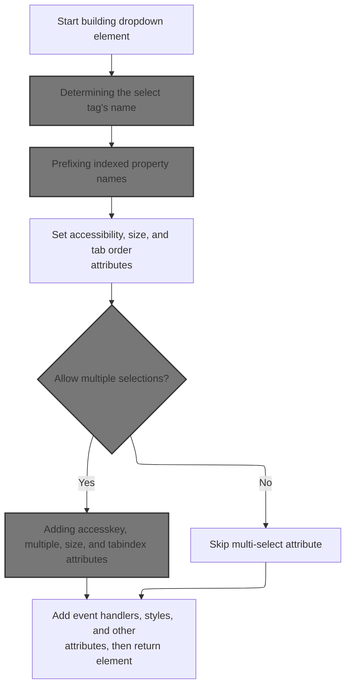
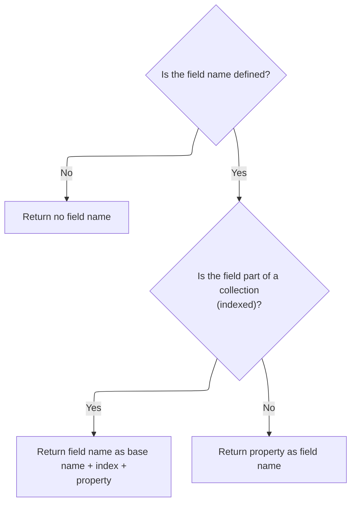
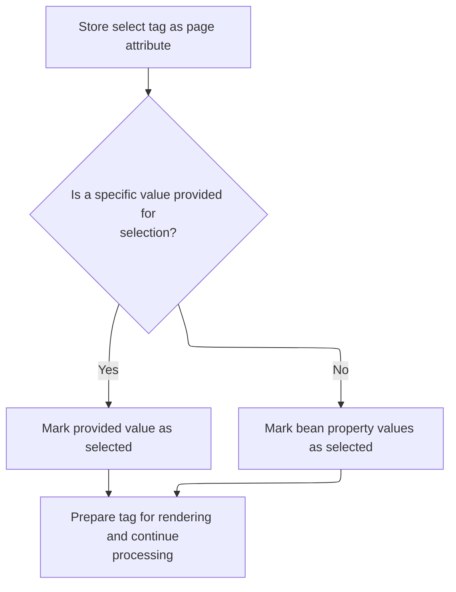

This document describes how the system generates the opening tag for a dropdown element in a web form. It outlines the steps for assembling the tag's attributes and determining which values should be marked as selected, ensuring the dropdown accurately reflects the form's state.

```mermaid
flowchart TD
  node1["Writing the opening <select> tag to the page"]:::HeadingStyle
  click node1 goToHeading "Writing the opening <select> tag to the page"
  node1 --> node2["Building the select tag's attributes"]:::HeadingStyle
  click node2 goToHeading "Building the select tag's attributes"
  node2 --> node3{"Setting up tag state and matching
values
(Setting up tag state and matching values)"}:::HeadingStyle
  click node3 goToHeading "Setting up tag state and matching values"
  node3 -->|"Specific value provided"| node4["Mark provided value as selected"]
  node3 -->|"No specific value"| node5["Mark form data values as selected"]
classDef HeadingStyle fill:#777777,stroke:#333,stroke-width:2px;
```



# Writing the opening <select> tag to the page

<SwmSnippet path="/taglib/src/main/java/org/apache/struts/taglib/html/SelectTag.java" line="171">

---

In <SwmToken path="taglib/src/main/java/org/apache/struts/taglib/html/SelectTag.java" pos="171:5:5" line-data="    public int doStartTag() throws JspException {">`doStartTag`</SwmToken>, we write the opening <select> tag to the page by calling <SwmToken path="taglib/src/main/java/org/apache/struts/taglib/html/SelectTag.java" pos="172:12:12" line-data="        TagUtils.getInstance().write(pageContext, renderSelectStartElement());">`renderSelectStartElement`</SwmToken>. This sets up the tag structure so any nested content (like options) can be added inside. We call <SwmToken path="taglib/src/main/java/org/apache/struts/taglib/html/SelectTag.java" pos="172:12:12" line-data="        TagUtils.getInstance().write(pageContext, renderSelectStartElement());">`renderSelectStartElement`</SwmToken> next because it builds the actual HTML for the select start tag, which needs to be output before anything else.

```java
    public int doStartTag() throws JspException {
        TagUtils.getInstance().write(pageContext, renderSelectStartElement());

```

---

</SwmSnippet>

## Building the select tag's attributes



<SwmSnippet path="/taglib/src/main/java/org/apache/struts/taglib/html/SelectTag.java" line="188">

---

In <SwmToken path="taglib/src/main/java/org/apache/struts/taglib/html/SelectTag.java" pos="188:5:5" line-data="    protected String renderSelectStartElement()">`renderSelectStartElement`</SwmToken>, we start assembling the select tag by appending attributes using helper methods. The first step is to set the 'name' attribute, which is handled by <SwmToken path="taglib/src/main/java/org/apache/struts/taglib/html/SelectTag.java" pos="192:11:11" line-data="        prepareAttribute(results, &quot;name&quot;, prepareName());">`prepareName`</SwmToken>. This modular approach keeps the tag construction clean and lets us easily manage each attribute.

```java
    protected String renderSelectStartElement()
        throws JspException {
        StringBuffer results = new StringBuffer("<select");

        prepareAttribute(results, "name", prepareName());
```

---

</SwmSnippet>

### Determining the select tag's name



<SwmSnippet path="/taglib/src/main/java/org/apache/struts/taglib/html/SelectTag.java" line="304">

---

<SwmToken path="taglib/src/main/java/org/apache/struts/taglib/html/SelectTag.java" pos="304:5:5" line-data="    protected String prepareName()">`prepareName`</SwmToken> figures out what the 'name' attribute should be for the select tag. If indexed is true, it uses <SwmToken path="taglib/src/main/java/org/apache/struts/taglib/html/SelectTag.java" pos="314:1:1" line-data="            prepareIndex(results, name);">`prepareIndex`</SwmToken> from <SwmToken path="taglib/src/main/java/org/apache/struts/taglib/html/SelectTag.java" pos="39:8:8" line-data="public class SelectTag extends BaseHandlerTag {">`BaseHandlerTag`</SwmToken> to add the index prefix, then appends the property. Otherwise, it just returns the property. This sets up the tag for proper form data mapping.

```java
    protected String prepareName()
        throws JspException {
        if (property == null) {
            return null;
        }

        // * @since Struts 1.1
        if (indexed) {
            StringBuffer results = new StringBuffer();

            prepareIndex(results, name);
            results.append(property);

            return results.toString();
        }

        return property;
    }
```

---

</SwmSnippet>

### Prefixing indexed property names

See <SwmLink doc-title="Generating Indexed Property Strings for Form Fields">[Generating Indexed Property Strings for Form Fields](/.swm/generating-indexed-property-strings-for-form-fields.3pvuzjw6.sw.md)</SwmLink>

### Adding accesskey, multiple, size, and tabindex attributes

```mermaid
%%{init: {"flowchart": {"defaultRenderer": "elk"}} }%%
flowchart TD
    node1["Start rendering <select> element"]
    click node1 openCode "taglib/src/main/java/org/apache/struts/taglib/html/SelectTag.java:193:193"
    node1 --> node2["Add accesskey, size, and tabindex
attributes"]
    click node2 openCode "taglib/src/main/java/org/apache/struts/taglib/html/SelectTag.java:193:200"
    node2 --> node3{"Is multi-selection enabled? (multiple ≠
null and ≠ 'false')"}
    click node3 openCode "taglib/src/main/java/org/apache/struts/taglib/html/SelectTag.java:195:197"
    node3 -->|"Yes"| node4["Add 'multiple' attribute"]
    click node4 openCode "taglib/src/main/java/org/apache/struts/taglib/html/SelectTag.java:196:197"
    node4 --> node5["Add event handlers"]
    node3 -->|"No"| node5["Add event handlers"]
    click node5 openCode "taglib/src/main/java/org/apache/struts/taglib/html/SelectTag.java:201:201"
    node5 --> node6["Finish opening <select> tag"]
    click node6 openCode "taglib/src/main/java/org/apache/struts/taglib/html/SelectTag.java:201:201"

classDef HeadingStyle fill:#777777,stroke:#333,stroke-width:2px;

%% Swimm:
%% %%{init: {"flowchart": {"defaultRenderer": "elk"}} }%%
%% flowchart TD
%%     node1["Start rendering <select> element"]
%%     click node1 openCode "<SwmPath>[taglib/…/html/SelectTag.java](taglib/src/main/java/org/apache/struts/taglib/html/SelectTag.java)</SwmPath>:193:193"
%%     node1 --> node2["Add accesskey, size, and tabindex
%% attributes"]
%%     click node2 openCode "<SwmPath>[taglib/…/html/SelectTag.java](taglib/src/main/java/org/apache/struts/taglib/html/SelectTag.java)</SwmPath>:193:200"
%%     node2 --> node3{"Is multi-selection enabled? (multiple ≠
%% null and ≠ 'false')"}
%%     click node3 openCode "<SwmPath>[taglib/…/html/SelectTag.java](taglib/src/main/java/org/apache/struts/taglib/html/SelectTag.java)</SwmPath>:195:197"
%%     node3 -->|"Yes"| node4["Add 'multiple' attribute"]
%%     click node4 openCode "<SwmPath>[taglib/…/html/SelectTag.java](taglib/src/main/java/org/apache/struts/taglib/html/SelectTag.java)</SwmPath>:196:197"
%%     node4 --> node5["Add event handlers"]
%%     node3 -->|"No"| node5["Add event handlers"]
%%     click node5 openCode "<SwmPath>[taglib/…/html/SelectTag.java](taglib/src/main/java/org/apache/struts/taglib/html/SelectTag.java)</SwmPath>:201:201"
%%     node5 --> node6["Finish opening <select> tag"]
%%     click node6 openCode "<SwmPath>[taglib/…/html/SelectTag.java](taglib/src/main/java/org/apache/struts/taglib/html/SelectTag.java)</SwmPath>:201:201"
%% 
%% classDef HeadingStyle fill:#777777,stroke:#333,stroke-width:2px;
```



<SwmSnippet path="/taglib/src/main/java/org/apache/struts/taglib/html/SelectTag.java" line="193">

---

Just back from <SwmToken path="taglib/src/main/java/org/apache/struts/taglib/html/SelectTag.java" pos="192:11:11" line-data="        prepareAttribute(results, &quot;name&quot;, prepareName());">`prepareName`</SwmToken>, <SwmToken path="taglib/src/main/java/org/apache/struts/taglib/html/SelectTag.java" pos="172:12:12" line-data="        TagUtils.getInstance().write(pageContext, renderSelectStartElement());">`renderSelectStartElement`</SwmToken> adds accesskey, checks if 'multiple' is set and not 'false' (then adds the multiple attribute), and appends size and tabindex. The 'multiple' logic is a repository-specific quirk—it's only added if the string isn't 'false'. Next, we call <SwmToken path="taglib/src/main/java/org/apache/struts/taglib/html/LabelTag.java" pos="33:4:4" line-data="public class LabelTag extends BaseInputTag {">`LabelTag`</SwmToken>'s <SwmToken path="taglib/src/main/java/org/apache/struts/taglib/html/SelectTag.java" pos="193:1:1" line-data="        prepareAttribute(results, &quot;accesskey&quot;, getAccesskey());">`prepareAttribute`</SwmToken> to handle class and required styling.

```java
        prepareAttribute(results, "accesskey", getAccesskey());

        if (multiple != null && !multiple.equals("false")) {
            results.append(" multiple=\"multiple\"");
        }

        prepareAttribute(results, "size", getSize());
        prepareAttribute(results, "tabindex", getTabindex());
```

---

</SwmSnippet>

<SwmSnippet path="/taglib/src/main/java/org/apache/struts/taglib/html/LabelTag.java" line="161">

---

<SwmToken path="taglib/src/main/java/org/apache/struts/taglib/html/LabelTag.java" pos="161:5:5" line-data="    protected void prepareAttribute(StringBuffer handlers, String name,">`prepareAttribute`</SwmToken> in <SwmToken path="taglib/src/main/java/org/apache/struts/taglib/html/LabelTag.java" pos="33:4:4" line-data="public class LabelTag extends BaseInputTag {">`LabelTag`</SwmToken> checks if the attribute is 'class' and required is true. If so, it appends a required style class to the value. After that, it delegates to the superclass to handle the actual attribute writing. This lets required fields get special styling without changing the base logic.

```java
    protected void prepareAttribute(StringBuffer handlers, String name,
            Object value) {

        if ("class".equals(name) && this.required) {
            String requiredStyleClass = getRequiredStyleClass();
            if (requiredStyleClass != null) {
                value = (value != null) ? (value + " " + requiredStyleClass)
                        : requiredStyleClass;
            }
        }
        super.prepareAttribute(handlers, name, value);
    }
```

---

</SwmSnippet>

<SwmSnippet path="/taglib/src/main/java/org/apache/struts/taglib/html/SelectTag.java" line="201">

---

Just back from <SwmToken path="taglib/src/main/java/org/apache/struts/taglib/html/LabelTag.java" pos="33:4:4" line-data="public class LabelTag extends BaseInputTag {">`LabelTag`</SwmToken>, <SwmToken path="taglib/src/main/java/org/apache/struts/taglib/html/SelectTag.java" pos="172:12:12" line-data="        TagUtils.getInstance().write(pageContext, renderSelectStartElement());">`renderSelectStartElement`</SwmToken> now appends event handlers by calling <SwmToken path="taglib/src/main/java/org/apache/struts/taglib/html/SelectTag.java" pos="39:8:8" line-data="public class SelectTag extends BaseHandlerTag {">`BaseHandlerTag`</SwmToken>'s <SwmToken path="taglib/src/main/java/org/apache/struts/taglib/html/SelectTag.java" pos="201:5:5" line-data="        results.append(prepareEventHandlers());">`prepareEventHandlers`</SwmToken>. This step adds interactivity (like mouse and keyboard events) to the select tag, using shared logic for consistency.

```java
        results.append(prepareEventHandlers());
```

---

</SwmSnippet>

### Assembling event and state attributes

<SwmSnippet path="/taglib/src/main/java/org/apache/struts/taglib/html/BaseHandlerTag.java" line="1039">

---

<SwmToken path="taglib/src/main/java/org/apache/struts/taglib/html/BaseHandlerTag.java" pos="1039:5:5" line-data="    protected String prepareEventHandlers() {">`prepareEventHandlers`</SwmToken> in <SwmToken path="taglib/src/main/java/org/apache/struts/taglib/html/SelectTag.java" pos="39:8:8" line-data="public class SelectTag extends BaseHandlerTag {">`BaseHandlerTag`</SwmToken> builds up event handler attributes for mouse, key, text, and focus events. Each type is handled by its own helper, and focus events are added last. Next, we call <SwmToken path="taglib/src/main/java/org/apache/struts/taglib/html/BaseHandlerTag.java" pos="1045:1:1" line-data="        prepareFocusEvents(handlers);">`prepareFocusEvents`</SwmToken> to handle focus-specific logic and state.

```java
    protected String prepareEventHandlers() {
        StringBuffer handlers = new StringBuffer();

        prepareMouseEvents(handlers);
        prepareKeyEvents(handlers);
        prepareTextEvents(handlers);
        prepareFocusEvents(handlers);

        return handlers.toString();
    }
```

---

</SwmSnippet>

<SwmSnippet path="/taglib/src/main/java/org/apache/struts/taglib/html/BaseHandlerTag.java" line="1095">

---

<SwmToken path="taglib/src/main/java/org/apache/struts/taglib/html/BaseHandlerTag.java" pos="1095:5:5" line-data="    protected void prepareFocusEvents(StringBuffer handlers) {">`prepareFocusEvents`</SwmToken> not only adds onblur and onfocus handlers, but also checks if the tag or its parent form is disabled or readonly. If so, it appends the corresponding HTML attributes. This ties the select tag's state to the form's state, which is a repository-specific detail.

```java
    protected void prepareFocusEvents(StringBuffer handlers) {
        prepareAttribute(handlers, "onblur", getOnblur());
        prepareAttribute(handlers, "onfocus", getOnfocus());

        // Get the parent FormTag (if necessary)
        FormTag formTag = null;

        if ((doDisabled && !getDisabled()) || (doReadonly && !getReadonly())) {
            formTag =
                (FormTag) pageContext.getAttribute(Constants.FORM_KEY,
                    PageContext.REQUEST_SCOPE);
        }

        // Format Disabled
        if (doDisabled) {
            boolean formDisabled =
                (formTag == null) ? false : formTag.isDisabled();

            if (formDisabled || getDisabled()) {
                handlers.append(" disabled=\"disabled\"");
            }
        }

        // Format Read Only
        if (doReadonly) {
            boolean formReadOnly =
                (formTag == null) ? false : formTag.isReadonly();

            if (formReadOnly || getReadonly()) {
                handlers.append(" readonly=\"readonly\"");
            }
        }
    }
```

---

</SwmSnippet>

### Appending style attributes

<SwmSnippet path="/taglib/src/main/java/org/apache/struts/taglib/html/SelectTag.java" line="202">

---

Just back from <SwmToken path="taglib/src/main/java/org/apache/struts/taglib/html/SelectTag.java" pos="39:8:8" line-data="public class SelectTag extends BaseHandlerTag {">`BaseHandlerTag`</SwmToken>, <SwmToken path="taglib/src/main/java/org/apache/struts/taglib/html/SelectTag.java" pos="172:12:12" line-data="        TagUtils.getInstance().write(pageContext, renderSelectStartElement());">`renderSelectStartElement`</SwmToken> now appends styles by calling <SwmToken path="taglib/src/main/java/org/apache/struts/taglib/html/SelectTag.java" pos="39:8:8" line-data="public class SelectTag extends BaseHandlerTag {">`BaseHandlerTag`</SwmToken>'s <SwmToken path="taglib/src/main/java/org/apache/struts/taglib/html/SelectTag.java" pos="202:5:5" line-data="        results.append(prepareStyles());">`prepareStyles`</SwmToken>. This step adds CSS and inline styles to the select tag, using shared logic for consistency.

```java
        results.append(prepareStyles());
```

---

</SwmSnippet>

### Building style attribute string

See <SwmLink doc-title="Generating Style Attributes for Form Elements">[Generating Style Attributes for Form Elements](/.swm/generating-style-attributes-for-form-elements.vxq3aiby.sw.md)</SwmLink>

### Finalizing the select tag element

<SwmSnippet path="/taglib/src/main/java/org/apache/struts/taglib/html/SelectTag.java" line="203">

---

Just back from <SwmToken path="taglib/src/main/java/org/apache/struts/taglib/html/SelectTag.java" pos="39:8:8" line-data="public class SelectTag extends BaseHandlerTag {">`BaseHandlerTag`</SwmToken>, <SwmToken path="taglib/src/main/java/org/apache/struts/taglib/html/SelectTag.java" pos="172:12:12" line-data="        TagUtils.getInstance().write(pageContext, renderSelectStartElement());">`renderSelectStartElement`</SwmToken> finishes up by appending any remaining attributes and then closes the tag with '>'. All the helper methods (attribute, event handlers, styles, other attributes) modularize the process, making the tag assembly clean and easy to extend.

```java
        prepareOtherAttributes(results);
        results.append(">");

        return results.toString();
    }
```

---

</SwmSnippet>

## Setting up tag state and matching values



<SwmSnippet path="/taglib/src/main/java/org/apache/struts/taglib/html/SelectTag.java" line="174">

---

Just back from <SwmToken path="taglib/src/main/java/org/apache/struts/taglib/html/SelectTag.java" pos="172:12:12" line-data="        TagUtils.getInstance().write(pageContext, renderSelectStartElement());">`renderSelectStartElement`</SwmToken>, <SwmToken path="taglib/src/main/java/org/apache/struts/taglib/html/SelectTag.java" pos="171:5:5" line-data="    public int doStartTag() throws JspException {">`doStartTag`</SwmToken> stores the tag instance in the page context and calls <SwmToken path="taglib/src/main/java/org/apache/struts/taglib/html/SelectTag.java" pos="177:3:3" line-data="        this.calculateMatchValues();">`calculateMatchValues`</SwmToken>. This sets up which values will be matched as selected in the option tags, prepping the tag for body evaluation.

```java
        // Store this tag itself as a page attribute
        pageContext.setAttribute(Constants.SELECT_KEY, this);

        this.calculateMatchValues();

        return (EVAL_BODY_TAG);
    }
```

---

</SwmSnippet>

<SwmSnippet path="/taglib/src/main/java/org/apache/struts/taglib/html/SelectTag.java" line="214">

---

<SwmToken path="taglib/src/main/java/org/apache/struts/taglib/html/SelectTag.java" pos="214:5:5" line-data="    private void calculateMatchValues()">`calculateMatchValues`</SwmToken> checks if there's a direct value set—if so, it uses that as the selected value. If not, it looks up a bean and grabs an array property for matching. If nothing is found, match is empty. This sets up which options will be marked as selected in the rendered tag.

```java
    private void calculateMatchValues()
        throws JspException {
        if (this.value != null) {
            this.match = new String[1];
            this.match[0] = this.value;
        } else {
            Object bean =
                TagUtils.getInstance().lookup(pageContext, name, null);

            if (bean == null) {
                JspException e =
                    new JspException(messages.getMessage("getter.bean", name));

                TagUtils.getInstance().saveException(pageContext, e);
                throw e;
            }

            try {
                this.match = BeanUtils.getArrayProperty(bean, property);

                if (this.match == null) {
                    this.match = new String[0];
                }
            } catch (IllegalAccessException e) {
                TagUtils.getInstance().saveException(pageContext, e);
                throw new JspException(messages.getMessage("getter.access",
                        property, name), e);
            } catch (InvocationTargetException e) {
                Throwable t = e.getTargetException();

                TagUtils.getInstance().saveException(pageContext, t);
                throw new JspException(messages.getMessage("getter.result",
                        property, t.toString()), e);
            } catch (NoSuchMethodException e) {
                TagUtils.getInstance().saveException(pageContext, e);
                throw new JspException(messages.getMessage("getter.method",
                        property, name), e);
            }
        }
    }
```

---

</SwmSnippet>

&nbsp;

*This is an auto-generated document by Swimm 🌊 and has not yet been verified by a human*

<SwmMeta version="3.0.0" repo-id="Z2l0aHViJTNBJTNBc3RydXRzMSUzQSUzQVN3aW1tLURlbW8=" repo-name="struts1"><sup>Powered by [Swimm](https://app.swimm.io/)</sup></SwmMeta>
