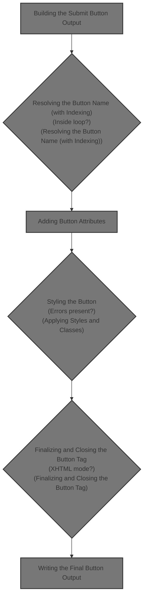
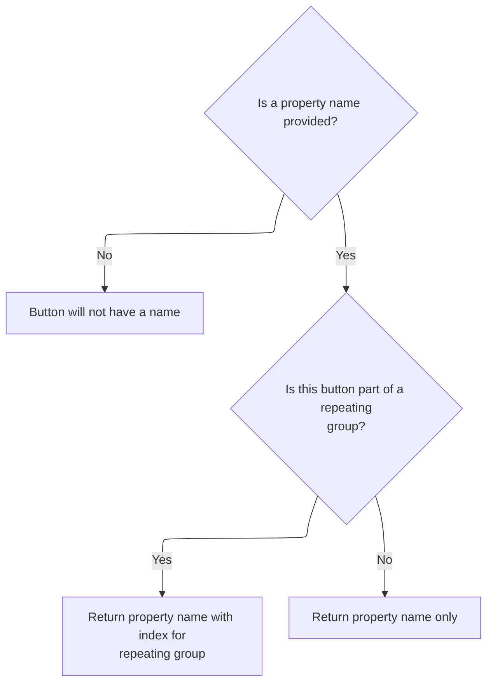
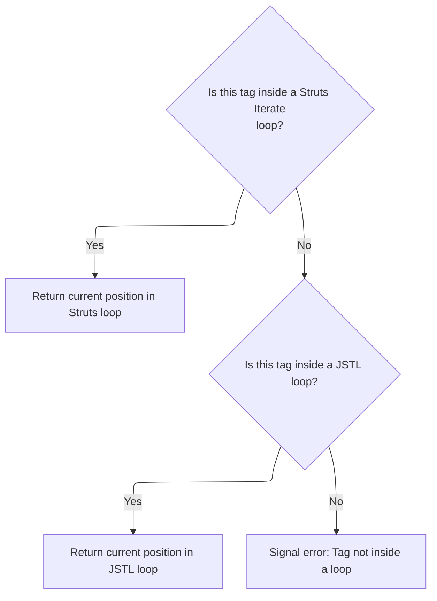
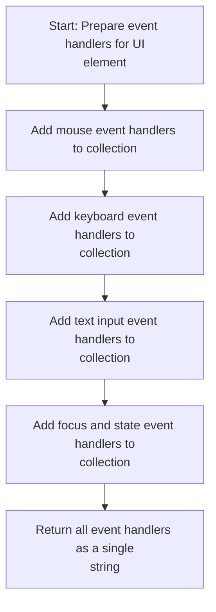
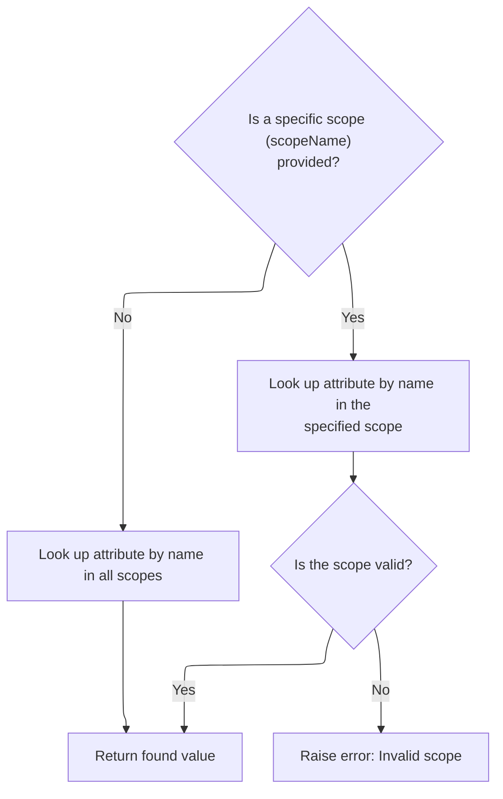

This document outlines how the system generates the HTML for a submit button in a web form, ensuring it is uniquely named, styled, and accessible. The result is a complete button element rendered on the page.



# Building the Submit Button Output

```mermaid
%%{init: {"flowchart": {"defaultRenderer": "elk"}} }%%
flowchart TD
    node1["Start building submit button"]
    click node1 openCode "taglib/src/main/java/org/apache/struts/taglib/html/SubmitTag.java:130:133"
    node1 --> node2["Resolving the Button Name (with Indexing)"]
    
    node2 --> node3["Appending Index Information to the Name"]
    
    node3 --> node4["Add name attribute to button"]
    click node4 openCode "taglib/src/main/java/org/apache/struts/taglib/html/SubmitTag.java:135:135"
    node4 --> node5["Setting Button-Specific Attributes"]
    
    node5 --> node6["Wiring Up Event and Focus Handlers"]
    
    node6 --> node7["Building Style, Class, and Title Attributes"]
    
    node7 --> node8["Add other attributes"]
    click node8 openCode "taglib/src/main/java/org/apache/struts/taglib/html/SubmitTag.java:139:139"
    node8 --> node9["Choosing the Tag Closing Format"]
    
    node9 --> node10{"Is XHTML mode?"}
    
    node10 -->|"Yes"| node11["Looking Up XHTML Mode in the Page Context"]
    
    node10 -->|"No"| node12["Looking Up XHTML Mode in the Page Context"]
    
    node11 --> node13["Looking Up Attributes in the Page Context"]
    
    node12 --> node13
    node13 --> node14["Write button HTML to page"]
    click node14 openCode "taglib/src/main/java/org/apache/struts/taglib/html/SubmitTag.java:142:142"
    node14 --> node15["End"]
    click node15 openCode "taglib/src/main/java/org/apache/struts/taglib/html/SubmitTag.java:144:145"

classDef HeadingStyle fill:#777777,stroke:#333,stroke-width:2px;
click node2 goToHeading "Resolving the Button Name (with Indexing)"
node2:::HeadingStyle
click node3 goToHeading "Appending Index Information to the Name"
node3:::HeadingStyle
click node5 goToHeading "Setting Button-Specific Attributes"
node5:::HeadingStyle
click node6 goToHeading "Wiring Up Event and Focus Handlers"
node6:::HeadingStyle
click node7 goToHeading "Building Style, Class, and Title Attributes"
node7:::HeadingStyle
click node9 goToHeading "Choosing the Tag Closing Format"
node9:::HeadingStyle
click node10 goToHeading "Detecting XHTML Output Mode"
node10:::HeadingStyle
click node11 goToHeading "Looking Up XHTML Mode in the Page Context"
node11:::HeadingStyle
click node12 goToHeading "Looking Up XHTML Mode in the Page Context"
node12:::HeadingStyle
click node13 goToHeading "Looking Up Attributes in the Page Context"
node13:::HeadingStyle

%% Swimm:
%% %%{init: {"flowchart": {"defaultRenderer": "elk"}} }%%
%% flowchart TD
%%     node1["Start building submit button"]
%%     click node1 openCode "<SwmPath>[taglib/…/html/SubmitTag.java](taglib/src/main/java/org/apache/struts/taglib/html/SubmitTag.java)</SwmPath>:130:133"
%%     node1 --> node2["Resolving the Button Name (with Indexing)"]
%%     
%%     node2 --> node3["Appending Index Information to the Name"]
%%     
%%     node3 --> node4["Add name attribute to button"]
%%     click node4 openCode "<SwmPath>[taglib/…/html/SubmitTag.java](taglib/src/main/java/org/apache/struts/taglib/html/SubmitTag.java)</SwmPath>:135:135"
%%     node4 --> node5["Setting Button-Specific Attributes"]
%%     
%%     node5 --> node6["Wiring Up Event and Focus Handlers"]
%%     
%%     node6 --> node7["Building Style, Class, and Title Attributes"]
%%     
%%     node7 --> node8["Add other attributes"]
%%     click node8 openCode "<SwmPath>[taglib/…/html/SubmitTag.java](taglib/src/main/java/org/apache/struts/taglib/html/SubmitTag.java)</SwmPath>:139:139"
%%     node8 --> node9["Choosing the Tag Closing Format"]
%%     
%%     node9 --> node10{"Is XHTML mode?"}
%%     
%%     node10 -->|"Yes"| node11["Looking Up XHTML Mode in the Page Context"]
%%     
%%     node10 -->|"No"| node12["Looking Up XHTML Mode in the Page Context"]
%%     
%%     node11 --> node13["Looking Up Attributes in the Page Context"]
%%     
%%     node12 --> node13
%%     node13 --> node14["Write button HTML to page"]
%%     click node14 openCode "<SwmPath>[taglib/…/html/SubmitTag.java](taglib/src/main/java/org/apache/struts/taglib/html/SubmitTag.java)</SwmPath>:142:142"
%%     node14 --> node15["End"]
%%     click node15 openCode "<SwmPath>[taglib/…/html/SubmitTag.java](taglib/src/main/java/org/apache/struts/taglib/html/SubmitTag.java)</SwmPath>:144:145"
%% 
%% classDef HeadingStyle fill:#777777,stroke:#333,stroke-width:2px;
%% click node2 goToHeading "Resolving the Button Name (with Indexing)"
%% node2:::HeadingStyle
%% click node3 goToHeading "Appending Index Information to the Name"
%% node3:::HeadingStyle
%% click node5 goToHeading "Setting Button-Specific Attributes"
%% node5:::HeadingStyle
%% click node6 goToHeading "Wiring Up Event and Focus Handlers"
%% node6:::HeadingStyle
%% click node7 goToHeading "Building Style, Class, and Title Attributes"
%% node7:::HeadingStyle
%% click node9 goToHeading "Choosing the Tag Closing Format"
%% node9:::HeadingStyle
%% click node10 goToHeading "Detecting XHTML Output Mode"
%% node10:::HeadingStyle
%% click node11 goToHeading "Looking Up XHTML Mode in the Page Context"
%% node11:::HeadingStyle
%% click node12 goToHeading "Looking Up XHTML Mode in the Page Context"
%% node12:::HeadingStyle
%% click node13 goToHeading "Looking Up Attributes in the Page Context"
%% node13:::HeadingStyle
```



<SwmSnippet path="/taglib/src/main/java/org/apache/struts/taglib/html/SubmitTag.java" line="130">

---

In <SwmToken path="taglib/src/main/java/org/apache/struts/taglib/html/SubmitTag.java" pos="130:5:5" line-data="    public int doEndTag() throws JspException {">`doEndTag`</SwmToken>, we're starting to build the HTML for the submit button. We append the opening tag and immediately call <SwmToken path="taglib/src/main/java/org/apache/struts/taglib/html/SubmitTag.java" pos="135:11:11" line-data="        prepareAttribute(results, &quot;name&quot;, prepareName());">`prepareName`</SwmToken> to get the correct 'name' attribute, which might include index info if we're inside a loop. This ensures the button's name is unique and can be processed correctly on submit.

```java
    public int doEndTag() throws JspException {
        // Generate an HTML element
        StringBuffer results = new StringBuffer();

        results.append(getElementOpen());
        prepareAttribute(results, "name", prepareName());
```

---

</SwmSnippet>

## Resolving the Button Name (with Indexing)



<SwmSnippet path="/taglib/src/main/java/org/apache/struts/taglib/html/SubmitTag.java" line="161">

---

<SwmToken path="taglib/src/main/java/org/apache/struts/taglib/html/SubmitTag.java" pos="161:5:5" line-data="    protected String prepareName()">`prepareName`</SwmToken> figures out what the 'name' attribute should be. If we're in an indexed context (like inside a loop), it appends the index to the property name using <SwmToken path="taglib/src/main/java/org/apache/struts/taglib/html/SubmitTag.java" pos="172:1:1" line-data="            prepareIndex(results, null);">`prepareIndex`</SwmToken> from <SwmToken path="taglib/src/main/java/org/apache/struts/taglib/html/SubmitTag.java" pos="34:8:8" line-data="public class SubmitTag extends BaseHandlerTag {">`BaseHandlerTag`</SwmToken>. This makes sure each button gets a unique name tied to its position.

```java
    protected String prepareName()
        throws JspException {
        if (property == null) {
            return null;
        }

        // * @since Struts 1.1
        if (indexed) {
            StringBuffer results = new StringBuffer();

            results.append(property);
            prepareIndex(results, null);

            return results.toString();
        }

        return property;
    }
```

---

</SwmSnippet>

## Appending Index Information to the Name

<SwmSnippet path="/taglib/src/main/java/org/apache/struts/taglib/html/BaseHandlerTag.java" line="913">

---

In <SwmToken path="taglib/src/main/java/org/apache/struts/taglib/html/BaseHandlerTag.java" pos="913:5:5" line-data="    protected void prepareIndex(StringBuffer handlers, String name)">`prepareIndex`</SwmToken>, we append the index (in brackets) to the name, so the form field looks like property\[2\] or similar. We call <SwmToken path="taglib/src/main/java/org/apache/struts/taglib/html/BaseHandlerTag.java" pos="920:5:5" line-data="        handlers.append(getIndexValue());">`getIndexValue`</SwmToken> next to figure out the actual index, which depends on where this tag is used (like inside a loop or not).

```java
    protected void prepareIndex(StringBuffer handlers, String name)
        throws JspException {
        if (name != null) {
            handlers.append(TagUtils.getInstance().filter(name));
        }

        handlers.append("[");
        handlers.append(getIndexValue());
```

---

</SwmSnippet>

### Determining the Current Loop Index



<SwmSnippet path="/taglib/src/main/java/org/apache/struts/taglib/html/BaseHandlerTag.java" line="935">

---

<SwmToken path="taglib/src/main/java/org/apache/struts/taglib/html/BaseHandlerTag.java" pos="935:5:5" line-data="    protected int getIndexValue()">`getIndexValue`</SwmToken> checks if we're inside a Struts <SwmToken path="taglib/src/main/java/org/apache/struts/taglib/html/BaseHandlerTag.java" pos="938:1:1" line-data="        IterateTag iterateTag =">`IterateTag`</SwmToken> or a JSTL loop. It grabs the current index from whichever is found. If neither is present, it fails with an exception, so indexed names only work when used in a loop.

```java
    protected int getIndexValue()
        throws JspException {
        // look for outer iterate tag
        IterateTag iterateTag =
            (IterateTag) findAncestorWithClass(this, IterateTag.class);

        if (iterateTag != null) {
            return iterateTag.getIndex();
        }

        // Look for JSTL loops
        Integer i = getJstlLoopIndex();

        if (i != null) {
            return i.intValue();
        }

```

---

</SwmSnippet>

<SwmSnippet path="/taglib/src/main/java/org/apache/struts/taglib/html/BaseHandlerTag.java" line="852">

---

<SwmToken path="taglib/src/main/java/org/apache/struts/taglib/html/BaseHandlerTag.java" pos="852:5:5" line-data="    private Integer getJstlLoopIndex() {">`getJstlLoopIndex`</SwmToken> uses reflection to access JSTL loop info only if JSTL is available. It finds the ancestor JSTL loop, gets its status, and pulls the index. If JSTL isn't present, it just returns null, so we don't break if JSTL isn't on the classpath.

```java
    private Integer getJstlLoopIndex() {
        if (!triedJstlInit) {
            triedJstlInit = true;

            try {
                loopTagClass =
                    RequestUtils.applicationClass(
                        "javax.servlet.jsp.jstl.core.LoopTag");

                loopTagGetStatus =
                    loopTagClass.getDeclaredMethod("getLoopStatus", null);

                loopTagStatusClass =
                    RequestUtils.applicationClass(
                        "javax.servlet.jsp.jstl.core.LoopTagStatus");

                loopTagStatusGetIndex =
                    loopTagStatusClass.getDeclaredMethod("getIndex", null);

                triedJstlSuccess = true;
            } catch (ClassNotFoundException ex) {
                // These just mean that JSTL isn't loaded, so ignore
            } catch (NoSuchMethodException ex) {
            }
        }

        if (triedJstlSuccess) {
            try {
                Object loopTag =
                    findAncestorWithClass(this, loopTagClass);

                if (loopTag == null) {
                    return null;
                }

                Object status = loopTagGetStatus.invoke(loopTag, null);

                return (Integer) loopTagStatusGetIndex.invoke(status, null);
            } catch (IllegalAccessException ex) {
                log.error(ex.getMessage(), ex);
            } catch (IllegalArgumentException ex) {
                log.error(ex.getMessage(), ex);
            } catch (InvocationTargetException ex) {
                log.error(ex.getMessage(), ex);
            } catch (NullPointerException ex) {
                log.error(ex.getMessage(), ex);
            } catch (ExceptionInInitializerError ex) {
                log.error(ex.getMessage(), ex);
            }
        }

        return null;
    }
```

---

</SwmSnippet>

<SwmSnippet path="/taglib/src/main/java/org/apache/struts/taglib/html/BaseHandlerTag.java" line="952">

---

Back in <SwmToken path="taglib/src/main/java/org/apache/struts/taglib/html/BaseHandlerTag.java" pos="920:5:5" line-data="        handlers.append(getIndexValue());">`getIndexValue`</SwmToken>, if we couldn't find a valid loop context, we throw a localized exception and save it in the page context. This makes sure errors are clear and show up in the JSP error handling.

```java
        // this tag should be nested in an IterateTag or JSTL loop tag, if it's not, throw exception
        JspException e =
            new JspException(messages.getMessage("indexed.noEnclosingIterate"));

        TagUtils.getInstance().saveException(pageContext, e);
        throw e;
    }
```

---

</SwmSnippet>

### Finalizing the Indexed Name Format

<SwmSnippet path="/taglib/src/main/java/org/apache/struts/taglib/html/BaseHandlerTag.java" line="921">

---

After returning from <SwmToken path="taglib/src/main/java/org/apache/struts/taglib/html/BaseHandlerTag.java" pos="920:5:5" line-data="        handlers.append(getIndexValue());">`getIndexValue`</SwmToken> in <SwmToken path="taglib/src/main/java/org/apache/struts/taglib/html/SubmitTag.java" pos="172:1:1" line-data="            prepareIndex(results, null);">`prepareIndex`</SwmToken>, we close the bracket and, if a name was provided, add a dot for nested property support. This keeps the naming consistent for backend binding.

```java
        handlers.append("]");

        if (name != null) {
            handlers.append(".");
        }
    }
```

---

</SwmSnippet>

## Adding Button Attributes

<SwmSnippet path="/taglib/src/main/java/org/apache/struts/taglib/html/SubmitTag.java" line="135">

---

Back in <SwmToken path="taglib/src/main/java/org/apache/struts/taglib/html/SubmitTag.java" pos="130:5:5" line-data="    public int doEndTag() throws JspException {">`doEndTag`</SwmToken>, after getting the name, we call <SwmToken path="taglib/src/main/java/org/apache/struts/taglib/html/SubmitTag.java" pos="135:1:1" line-data="        prepareAttribute(results, &quot;name&quot;, prepareName());">`prepareAttribute`</SwmToken> to handle any special logic for the 'name' attribute. This might include things like required styling, handled in <SwmToken path="taglib/src/main/java/org/apache/struts/taglib/html/LabelTag.java" pos="33:4:4" line-data="public class LabelTag extends BaseInputTag {">`LabelTag`</SwmToken>.

```java
        prepareAttribute(results, "name", prepareName());
```

---

</SwmSnippet>

<SwmSnippet path="/taglib/src/main/java/org/apache/struts/taglib/html/LabelTag.java" line="161">

---

<SwmToken path="taglib/src/main/java/org/apache/struts/taglib/html/LabelTag.java" pos="161:5:5" line-data="    protected void prepareAttribute(StringBuffer handlers, String name,">`prepareAttribute`</SwmToken> in <SwmToken path="taglib/src/main/java/org/apache/struts/taglib/html/LabelTag.java" pos="33:4:4" line-data="public class LabelTag extends BaseInputTag {">`LabelTag`</SwmToken> checks if the attribute is 'class' and if the field is required. If so, it adds a required style class before passing everything up to the superclass for normal attribute handling.

```java
    protected void prepareAttribute(StringBuffer handlers, String name,
            Object value) {

        if ("class".equals(name) && this.required) {
            String requiredStyleClass = getRequiredStyleClass();
            if (requiredStyleClass != null) {
                value = (value != null) ? (value + " " + requiredStyleClass)
                        : requiredStyleClass;
            }
        }
        super.prepareAttribute(handlers, name, value);
    }
```

---

</SwmSnippet>

<SwmSnippet path="/taglib/src/main/java/org/apache/struts/taglib/html/SubmitTag.java" line="136">

---

Back in <SwmToken path="taglib/src/main/java/org/apache/struts/taglib/html/SubmitTag.java" pos="130:5:5" line-data="    public int doEndTag() throws JspException {">`doEndTag`</SwmToken>, after handling the name and any special attribute logic, we call <SwmToken path="taglib/src/main/java/org/apache/struts/taglib/html/SubmitTag.java" pos="136:1:1" line-data="        prepareButtonAttributes(results);">`prepareButtonAttributes`</SwmToken> to add button-specific stuff like access keys and values.

```java
        prepareButtonAttributes(results);
```

---

</SwmSnippet>

## Setting Button-Specific Attributes

<SwmSnippet path="/taglib/src/main/java/org/apache/struts/taglib/html/SubmitTag.java" line="185">

---

In <SwmToken path="taglib/src/main/java/org/apache/struts/taglib/html/SubmitTag.java" pos="185:5:5" line-data="    protected void prepareButtonAttributes(StringBuffer results)">`prepareButtonAttributes`</SwmToken>, we add accesskey and tabindex attributes using <SwmToken path="taglib/src/main/java/org/apache/struts/taglib/html/SubmitTag.java" pos="187:1:1" line-data="        prepareAttribute(results, &quot;accesskey&quot;, getAccesskey());">`prepareAttribute`</SwmToken> (which might have extra logic in <SwmToken path="taglib/src/main/java/org/apache/struts/taglib/html/LabelTag.java" pos="33:4:4" line-data="public class LabelTag extends BaseInputTag {">`LabelTag`</SwmToken>). This makes the button more accessible if those values are set.

```java
    protected void prepareButtonAttributes(StringBuffer results)
        throws JspException {
        prepareAttribute(results, "accesskey", getAccesskey());
        prepareAttribute(results, "tabindex", getTabindex());
```

---

</SwmSnippet>

<SwmSnippet path="/taglib/src/main/java/org/apache/struts/taglib/html/SubmitTag.java" line="189">

---

After setting accesskey and tabindex in <SwmToken path="taglib/src/main/java/org/apache/struts/taglib/html/SubmitTag.java" pos="136:1:1" line-data="        prepareButtonAttributes(results);">`prepareButtonAttributes`</SwmToken>, we call <SwmToken path="taglib/src/main/java/org/apache/struts/taglib/html/SubmitTag.java" pos="189:1:1" line-data="        prepareValue(results);">`prepareValue`</SwmToken> to figure out what label/value the button should actually show and submit.

```java
        prepareValue(results);
    }
```

---

</SwmSnippet>

<SwmSnippet path="/taglib/src/main/java/org/apache/struts/taglib/html/SubmitTag.java" line="197">

---

<SwmToken path="taglib/src/main/java/org/apache/struts/taglib/html/SubmitTag.java" pos="197:5:5" line-data="    protected void prepareValue(StringBuffer results) {">`prepareValue`</SwmToken> picks what the button should display: it uses the value field, falls back to text, and finally to a default if both are missing. It then calls <SwmToken path="taglib/src/main/java/org/apache/struts/taglib/html/SubmitTag.java" pos="209:1:1" line-data="        prepareAttribute(results, &quot;value&quot;, label);">`prepareAttribute`</SwmToken> to add this as the 'value' attribute.

```java
    protected void prepareValue(StringBuffer results) {
        // Acquire the label value we will be generating
        String label = value;

        if ((label == null) && (text != null)) {
            label = text;
        }

        if ((label == null) || (label.length() < 1)) {
            label = getDefaultValue();
        }

        prepareAttribute(results, "value", label);
    }
```

---

</SwmSnippet>

## Adding Event Handlers

<SwmSnippet path="/taglib/src/main/java/org/apache/struts/taglib/html/SubmitTag.java" line="137">

---

Back in <SwmToken path="taglib/src/main/java/org/apache/struts/taglib/html/SubmitTag.java" pos="130:5:5" line-data="    public int doEndTag() throws JspException {">`doEndTag`</SwmToken>, after button attributes, we append event handlers (like mouse, key, and focus events) using <SwmToken path="taglib/src/main/java/org/apache/struts/taglib/html/SubmitTag.java" pos="137:5:5" line-data="        results.append(prepareEventHandlers());">`prepareEventHandlers`</SwmToken> from <SwmToken path="taglib/src/main/java/org/apache/struts/taglib/html/SubmitTag.java" pos="34:8:8" line-data="public class SubmitTag extends BaseHandlerTag {">`BaseHandlerTag`</SwmToken>. This wires up any JS or UI logic needed.

```java
        results.append(prepareEventHandlers());
```

---

</SwmSnippet>

## Wiring Up Event and Focus Handlers



<SwmSnippet path="/taglib/src/main/java/org/apache/struts/taglib/html/BaseHandlerTag.java" line="1039">

---

<SwmToken path="taglib/src/main/java/org/apache/struts/taglib/html/BaseHandlerTag.java" pos="1039:5:5" line-data="    protected String prepareEventHandlers() {">`prepareEventHandlers`</SwmToken> collects all event handler attributes (mouse, key, text, focus) and appends them to the output. We call <SwmToken path="taglib/src/main/java/org/apache/struts/taglib/html/BaseHandlerTag.java" pos="1045:1:1" line-data="        prepareFocusEvents(handlers);">`prepareFocusEvents`</SwmToken> next to handle focus-specific stuff, including disabled/readonly logic.

```java
    protected String prepareEventHandlers() {
        StringBuffer handlers = new StringBuffer();

        prepareMouseEvents(handlers);
        prepareKeyEvents(handlers);
        prepareTextEvents(handlers);
        prepareFocusEvents(handlers);

        return handlers.toString();
    }
```

---

</SwmSnippet>

<SwmSnippet path="/taglib/src/main/java/org/apache/struts/taglib/html/BaseHandlerTag.java" line="1095">

---

<SwmToken path="taglib/src/main/java/org/apache/struts/taglib/html/BaseHandlerTag.java" pos="1095:5:5" line-data="    protected void prepareFocusEvents(StringBuffer handlers) {">`prepareFocusEvents`</SwmToken> adds onblur/onfocus handlers, then checks if the button or its parent form is disabled or readonly. If so, it appends the right HTML attributes so the button can't be used.

```java
    protected void prepareFocusEvents(StringBuffer handlers) {
        prepareAttribute(handlers, "onblur", getOnblur());
        prepareAttribute(handlers, "onfocus", getOnfocus());

        // Get the parent FormTag (if necessary)
        FormTag formTag = null;

        if ((doDisabled && !getDisabled()) || (doReadonly && !getReadonly())) {
            formTag =
                (FormTag) pageContext.getAttribute(Constants.FORM_KEY,
                    PageContext.REQUEST_SCOPE);
        }

        // Format Disabled
        if (doDisabled) {
            boolean formDisabled =
                (formTag == null) ? false : formTag.isDisabled();

            if (formDisabled || getDisabled()) {
                handlers.append(" disabled=\"disabled\"");
            }
        }

        // Format Read Only
        if (doReadonly) {
            boolean formReadOnly =
                (formTag == null) ? false : formTag.isReadonly();

            if (formReadOnly || getReadonly()) {
                handlers.append(" readonly=\"readonly\"");
            }
        }
    }
```

---

</SwmSnippet>

## Applying Styles and Classes

<SwmSnippet path="/taglib/src/main/java/org/apache/struts/taglib/html/SubmitTag.java" line="138">

---

Back in <SwmToken path="taglib/src/main/java/org/apache/struts/taglib/html/SubmitTag.java" pos="130:5:5" line-data="    public int doEndTag() throws JspException {">`doEndTag`</SwmToken>, after event handlers, we call <SwmToken path="taglib/src/main/java/org/apache/struts/taglib/html/SubmitTag.java" pos="138:5:5" line-data="        results.append(prepareStyles());">`prepareStyles`</SwmToken> to add any style, class, or id attributes, including error-specific ones if needed.

```java
        results.append(prepareStyles());
```

---

</SwmSnippet>

## Building Style, Class, and Title Attributes

```mermaid
%%{init: {"flowchart": {"defaultRenderer": "elk"}} }%%
flowchart TD
    node1["Check if errors exist"]
    click node1 openCode "taglib/src/main/java/org/apache/struts/taglib/html/BaseHandlerTag.java:971:971"
    node1 --> node2{"Errors present?"}
    click node2 openCode "taglib/src/main/java/org/apache/struts/taglib/html/BaseHandlerTag.java:973:973"
    node2 -->|"Yes"| node3{"Error style id provided?"}
    click node3 openCode "taglib/src/main/java/org/apache/struts/taglib/html/BaseHandlerTag.java:973:973"
    node2 -->|"No"| node4["Set id to default style id"]
    click node4 openCode "taglib/src/main/java/org/apache/struts/taglib/html/BaseHandlerTag.java:976:976"
    node3 -->|"Yes"| node5["Set id to error style id"]
    click node5 openCode "taglib/src/main/java/org/apache/struts/taglib/html/BaseHandlerTag.java:974:974"
    node3 -->|"No"| node4
    node5 --> node6{"Error style provided?"}
    click node6 openCode "taglib/src/main/java/org/apache/struts/taglib/html/BaseHandlerTag.java:979:979"
    node4 --> node6
    node6 -->|"Yes"| node7["Set style to error style"]
    click node7 openCode "taglib/src/main/java/org/apache/struts/taglib/html/BaseHandlerTag.java:980:980"
    node6 -->|"No"| node8["Set style to default style"]
    click node8 openCode "taglib/src/main/java/org/apache/struts/taglib/html/BaseHandlerTag.java:982:982"
    node7 --> node9{"Error style class provided?"}
    click node9 openCode "taglib/src/main/java/org/apache/struts/taglib/html/BaseHandlerTag.java:985:985"
    node8 --> node9
    node9 -->|"Yes"| node10["Set class to error style class"]
    click node10 openCode "taglib/src/main/java/org/apache/struts/taglib/html/BaseHandlerTag.java:986:986"
    node9 -->|"No"| node11["Set class to default style class"]
    click node11 openCode "taglib/src/main/java/org/apache/struts/taglib/html/BaseHandlerTag.java:988:988"
    node10 --> node12["Add title and alt text"]
    click node12 openCode "taglib/src/main/java/org/apache/struts/taglib/html/BaseHandlerTag.java:991:992"
    node11 --> node12
    node12 --> node13["Apply internationalization and return
styles"]
    click node13 openCode "taglib/src/main/java/org/apache/struts/taglib/html/BaseHandlerTag.java:993:995"
classDef HeadingStyle fill:#777777,stroke:#333,stroke-width:2px;

%% Swimm:
%% %%{init: {"flowchart": {"defaultRenderer": "elk"}} }%%
%% flowchart TD
%%     node1["Check if errors exist"]
%%     click node1 openCode "<SwmPath>[taglib/…/html/BaseHandlerTag.java](taglib/src/main/java/org/apache/struts/taglib/html/BaseHandlerTag.java)</SwmPath>:971:971"
%%     node1 --> node2{"Errors present?"}
%%     click node2 openCode "<SwmPath>[taglib/…/html/BaseHandlerTag.java](taglib/src/main/java/org/apache/struts/taglib/html/BaseHandlerTag.java)</SwmPath>:973:973"
%%     node2 -->|"Yes"| node3{"Error style id provided?"}
%%     click node3 openCode "<SwmPath>[taglib/…/html/BaseHandlerTag.java](taglib/src/main/java/org/apache/struts/taglib/html/BaseHandlerTag.java)</SwmPath>:973:973"
%%     node2 -->|"No"| node4["Set id to default style id"]
%%     click node4 openCode "<SwmPath>[taglib/…/html/BaseHandlerTag.java](taglib/src/main/java/org/apache/struts/taglib/html/BaseHandlerTag.java)</SwmPath>:976:976"
%%     node3 -->|"Yes"| node5["Set id to error style id"]
%%     click node5 openCode "<SwmPath>[taglib/…/html/BaseHandlerTag.java](taglib/src/main/java/org/apache/struts/taglib/html/BaseHandlerTag.java)</SwmPath>:974:974"
%%     node3 -->|"No"| node4
%%     node5 --> node6{"Error style provided?"}
%%     click node6 openCode "<SwmPath>[taglib/…/html/BaseHandlerTag.java](taglib/src/main/java/org/apache/struts/taglib/html/BaseHandlerTag.java)</SwmPath>:979:979"
%%     node4 --> node6
%%     node6 -->|"Yes"| node7["Set style to error style"]
%%     click node7 openCode "<SwmPath>[taglib/…/html/BaseHandlerTag.java](taglib/src/main/java/org/apache/struts/taglib/html/BaseHandlerTag.java)</SwmPath>:980:980"
%%     node6 -->|"No"| node8["Set style to default style"]
%%     click node8 openCode "<SwmPath>[taglib/…/html/BaseHandlerTag.java](taglib/src/main/java/org/apache/struts/taglib/html/BaseHandlerTag.java)</SwmPath>:982:982"
%%     node7 --> node9{"Error style class provided?"}
%%     click node9 openCode "<SwmPath>[taglib/…/html/BaseHandlerTag.java](taglib/src/main/java/org/apache/struts/taglib/html/BaseHandlerTag.java)</SwmPath>:985:985"
%%     node8 --> node9
%%     node9 -->|"Yes"| node10["Set class to error style class"]
%%     click node10 openCode "<SwmPath>[taglib/…/html/BaseHandlerTag.java](taglib/src/main/java/org/apache/struts/taglib/html/BaseHandlerTag.java)</SwmPath>:986:986"
%%     node9 -->|"No"| node11["Set class to default style class"]
%%     click node11 openCode "<SwmPath>[taglib/…/html/BaseHandlerTag.java](taglib/src/main/java/org/apache/struts/taglib/html/BaseHandlerTag.java)</SwmPath>:988:988"
%%     node10 --> node12["Add title and alt text"]
%%     click node12 openCode "<SwmPath>[taglib/…/html/BaseHandlerTag.java](taglib/src/main/java/org/apache/struts/taglib/html/BaseHandlerTag.java)</SwmPath>:991:992"
%%     node11 --> node12
%%     node12 --> node13["Apply internationalization and return
%% styles"]
%%     click node13 openCode "<SwmPath>[taglib/…/html/BaseHandlerTag.java](taglib/src/main/java/org/apache/struts/taglib/html/BaseHandlerTag.java)</SwmPath>:993:995"
%% classDef HeadingStyle fill:#777777,stroke:#333,stroke-width:2px;
```



<SwmSnippet path="/taglib/src/main/java/org/apache/struts/taglib/html/BaseHandlerTag.java" line="967">

---

In <SwmToken path="taglib/src/main/java/org/apache/struts/taglib/html/BaseHandlerTag.java" pos="967:5:5" line-data="    protected String prepareStyles()">`prepareStyles`</SwmToken>, we add id, style, and class attributes, picking error-specific ones if errors exist. We also set title and alt using the <SwmToken path="taglib/src/main/java/org/apache/struts/taglib/html/BaseHandlerTag.java" pos="991:11:11" line-data="        prepareAttribute(styles, &quot;title&quot;, message(getTitle(), getTitleKey()));">`message`</SwmToken> method for localization.

```java
    protected String prepareStyles()
        throws JspException {
        StringBuffer styles = new StringBuffer();

        boolean errorsExist = doErrorsExist();

        if (errorsExist && (getErrorStyleId() != null)) {
            prepareAttribute(styles, "id", getErrorStyleId());
        } else {
            prepareAttribute(styles, "id", getStyleId());
        }

        if (errorsExist && (getErrorStyle() != null)) {
            prepareAttribute(styles, "style", getErrorStyle());
        } else {
            prepareAttribute(styles, "style", getStyle());
        }

        if (errorsExist && (getErrorStyleClass() != null)) {
            prepareAttribute(styles, "class", getErrorStyleClass());
        } else {
            prepareAttribute(styles, "class", getStyleClass());
        }

        prepareAttribute(styles, "title", message(getTitle(), getTitleKey()));
        prepareAttribute(styles, "alt", message(getAlt(), getAltKey()));
```

---

</SwmSnippet>

<SwmSnippet path="/taglib/src/main/java/org/apache/struts/taglib/html/BaseHandlerTag.java" line="830">

---

<SwmToken path="taglib/src/main/java/org/apache/struts/taglib/html/BaseHandlerTag.java" pos="830:5:5" line-data="    protected String message(String literal, String key)">`message`</SwmToken> enforces that you can't set both a literal and a key for title/alt. If both are set, it throws an error. Otherwise, it returns the literal or looks up the localized message.

```java
    protected String message(String literal, String key)
        throws JspException {
        if (literal != null) {
            if (key != null) {
                JspException e =
                    new JspException(messages.getMessage("common.both"));

                TagUtils.getInstance().saveException(pageContext, e);
                throw e;
            } else {
                return (literal);
            }
        } else {
            if (key != null) {
                return TagUtils.getInstance().message(pageContext, getBundle(),
                    getLocale(), key);
            } else {
                return null;
            }
        }
    }
```

---

</SwmSnippet>

<SwmSnippet path="/taglib/src/main/java/org/apache/struts/taglib/html/BaseHandlerTag.java" line="993">

---

Back in <SwmToken path="taglib/src/main/java/org/apache/struts/taglib/html/SubmitTag.java" pos="138:5:5" line-data="        results.append(prepareStyles());">`prepareStyles`</SwmToken>, after setting all style-related attributes, we call <SwmToken path="taglib/src/main/java/org/apache/struts/taglib/html/BaseHandlerTag.java" pos="993:1:1" line-data="        prepareInternationalization(styles);">`prepareInternationalization`</SwmToken> for any extra i18n tweaks, then return the full style string.

```java
        prepareInternationalization(styles);

        return styles.toString();
    }
```

---

</SwmSnippet>

## Finalizing and Closing the Button Tag

<SwmSnippet path="/taglib/src/main/java/org/apache/struts/taglib/html/SubmitTag.java" line="139">

---

Back in <SwmToken path="taglib/src/main/java/org/apache/struts/taglib/html/SubmitTag.java" pos="130:5:5" line-data="    public int doEndTag() throws JspException {">`doEndTag`</SwmToken>, after styles, we add any other attributes and then close the tag using <SwmToken path="taglib/src/main/java/org/apache/struts/taglib/html/SubmitTag.java" pos="140:5:5" line-data="        results.append(getElementClose());">`getElementClose`</SwmToken>, which picks the right closing based on XHTML mode.

```java
        prepareOtherAttributes(results);
        results.append(getElementClose());

```

---

</SwmSnippet>

## Choosing the Tag Closing Format

<SwmSnippet path="/taglib/src/main/java/org/apache/struts/taglib/html/BaseHandlerTag.java" line="1186">

---

<SwmToken path="taglib/src/main/java/org/apache/struts/taglib/html/BaseHandlerTag.java" pos="1186:5:5" line-data="    protected String getElementClose() {">`getElementClose`</SwmToken> checks if we're in XHTML mode and returns either ' />' or '>' so the tag closes correctly for the page type. We call <SwmToken path="taglib/src/main/java/org/apache/struts/taglib/html/BaseHandlerTag.java" pos="1187:5:5" line-data="        return this.isXhtml() ? &quot; /&gt;&quot; : &quot;&gt;&quot;;">`isXhtml`</SwmToken> next to check the mode.

```java
    protected String getElementClose() {
        return this.isXhtml() ? " />" : ">";
    }
```

---

</SwmSnippet>

## Detecting XHTML Output Mode

<SwmSnippet path="/taglib/src/main/java/org/apache/struts/taglib/html/BaseHandlerTag.java" line="1174">

---

<SwmToken path="taglib/src/main/java/org/apache/struts/taglib/html/BaseHandlerTag.java" pos="1174:5:5" line-data="    protected boolean isXhtml() {">`isXhtml`</SwmToken> just calls <SwmToken path="taglib/src/main/java/org/apache/struts/taglib/html/BaseHandlerTag.java" pos="1175:3:3" line-data="        return TagUtils.getInstance().isXhtml(this.pageContext);">`TagUtils`</SwmToken> to check if XHTML mode is set in the page context. This tells us how to close the tag.

```java
    protected boolean isXhtml() {
        return TagUtils.getInstance().isXhtml(this.pageContext);
    }
```

---

</SwmSnippet>

## Looking Up XHTML Mode in the Page Context

<SwmSnippet path="/taglib/src/main/java/org/apache/struts/taglib/TagUtils.java" line="838">

---

<SwmToken path="taglib/src/main/java/org/apache/struts/taglib/TagUtils.java" pos="838:5:5" line-data="    public boolean isXhtml(PageContext pageContext) {">`isXhtml`</SwmToken> in <SwmToken path="taglib/src/main/java/org/apache/struts/taglib/html/SubmitTag.java" pos="142:1:1" line-data="        TagUtils.getInstance().write(pageContext, results.toString());">`TagUtils`</SwmToken> looks up a flag in the page context to see if XHTML is enabled. If the lookup fails, it logs an error and throws, so we know something's wrong with the page setup.

```java
    public boolean isXhtml(PageContext pageContext) {
        String xhtml;
        try {
            xhtml = (String) lookup(pageContext, Globals.XHTML_KEY, null);
            return "true".equalsIgnoreCase(xhtml);
        } catch (JspException e) {
            log.error("Failed xhtml lookup", e);
            throw new RuntimeException(e);
        }
    }
```

---

</SwmSnippet>

## Looking Up Attributes in the Page Context



<SwmSnippet path="/taglib/src/main/java/org/apache/struts/taglib/TagUtils.java" line="863">

---

<SwmToken path="taglib/src/main/java/org/apache/struts/taglib/TagUtils.java" pos="863:5:5" line-data="    public Object lookup(PageContext pageContext, String name, String scopeName)">`lookup`</SwmToken> checks for an attribute in the page context, either across all scopes or in a specific one if provided. If a scope is given, it uses <SwmToken path="taglib/src/main/java/org/apache/struts/taglib/TagUtils.java" pos="870:12:12" line-data="            return pageContext.getAttribute(name, instance.getScope(scopeName));">`getScope`</SwmToken> to resolve the scope constant and fetches the attribute directly. This lets tags pull the right config or data from the page context, depending on how they're used in the JSP.

```java
    public Object lookup(PageContext pageContext, String name, String scopeName)
        throws JspException {
        if (scopeName == null) {
            return pageContext.findAttribute(name);
        }

        try {
            return pageContext.getAttribute(name, instance.getScope(scopeName));
        } catch (JspException e) {
            saveException(pageContext, e);
            throw e;
        }
    }
```

---

</SwmSnippet>

<SwmSnippet path="/taglib/src/main/java/org/apache/struts/taglib/TagUtils.java" line="809">

---

<SwmToken path="taglib/src/main/java/org/apache/struts/taglib/TagUtils.java" pos="809:5:5" line-data="    public int getScope(String scopeName)">`getScope`</SwmToken> converts the scope name to lowercase and looks it up in a map of known scopes. If the name isn't found, it throws a <SwmToken path="taglib/src/main/java/org/apache/struts/taglib/TagUtils.java" pos="810:3:3" line-data="        throws JspException {">`JspException`</SwmToken> with a message. This keeps scope handling strict and avoids silent errors from typos or unknown scopes.

```java
    public int getScope(String scopeName)
        throws JspException {
        Integer scope = (Integer) scopes.get(scopeName.toLowerCase());

        if (scope == null) {
            throw new JspException(messages.getMessage("lookup.scope", scope));
        }

        return scope.intValue();
    }
```

---

</SwmSnippet>

## Writing the Final Button Output

<SwmSnippet path="/taglib/src/main/java/org/apache/struts/taglib/html/SubmitTag.java" line="142">

---

Back in `SubmitTag.doEndTag`, after building the full button HTML (including the closing tag from <SwmToken path="taglib/src/main/java/org/apache/struts/taglib/html/SubmitTag.java" pos="34:8:8" line-data="public class SubmitTag extends BaseHandlerTag {">`BaseHandlerTag`</SwmToken>), we write the result to the page context. This is the last step—nothing is output until everything is assembled, so the button renders correctly in the JSP.

```java
        TagUtils.getInstance().write(pageContext, results.toString());

        return (EVAL_PAGE);
    }
```

---

</SwmSnippet>

&nbsp;

*This is an auto-generated document by Swimm 🌊 and has not yet been verified by a human*

<SwmMeta version="3.0.0" repo-id="Z2l0aHViJTNBJTNBc3RydXRzMSUzQSUzQVN3aW1tLURlbW8=" repo-name="struts1"><sup>Powered by [Swimm](https://app.swimm.io/)</sup></SwmMeta>
