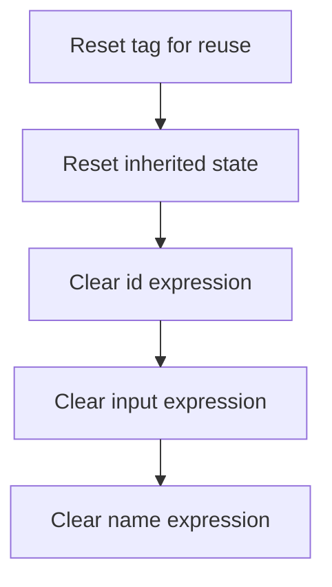

This document describes how a button tag is reset for reuse by clearing all dynamic attributes. Both inherited and button-specific expressions are removed, ensuring the tag does not retain data from previous uses and supporting reliable UI rendering.

# Resetting Button Tag State

<SwmSnippet path="/el/src/main/java/org/apache/strutsel/taglib/html/ELButtonTag.java" line="679">

---

In <SwmToken path="el/src/main/java/org/apache/strutsel/taglib/html/ELButtonTag.java" pos="679:5:5" line-data="    public void release() {">`release`</SwmToken>, we start by calling <SwmToken path="el/src/main/java/org/apache/strutsel/taglib/html/ELButtonTag.java" pos="680:1:5" line-data="        super.release();">`super.release()`</SwmToken> to make sure any cleanup from the parent class happens first. Then we move on to ELResourceTag.release to handle cleanup for expression-related fields inherited or used by this tag.

```java
    public void release() {
        super.release();
```

---

</SwmSnippet>

## Clearing Resource Tag Expressions



<SwmSnippet path="/el/src/main/java/org/apache/strutsel/taglib/bean/ELResourceTag.java" line="108">

---

In <SwmToken path="el/src/main/java/org/apache/strutsel/taglib/bean/ELResourceTag.java" pos="108:5:5" line-data="    public void release() {">`release`</SwmToken>, we call <SwmToken path="el/src/main/java/org/apache/strutsel/taglib/bean/ELResourceTag.java" pos="109:1:5" line-data="        super.release();">`super.release()`</SwmToken> and then start clearing out expression fields like <SwmToken path="el/src/main/java/org/apache/strutsel/taglib/bean/ELResourceTag.java" pos="85:9:9" line-data="    public void setIdExpr(String idExpr) {">`idExpr`</SwmToken>. This is to make sure any references are dropped and the tag is ready for reuse or cleanup.

```java
    public void release() {
        super.release();
        setIdExpr(null);
```

---

</SwmSnippet>

<SwmSnippet path="/el/src/main/java/org/apache/strutsel/taglib/bean/ELResourceTag.java" line="85">

---

<SwmToken path="el/src/main/java/org/apache/strutsel/taglib/bean/ELResourceTag.java" pos="85:5:5" line-data="    public void setIdExpr(String idExpr) {">`setIdExpr`</SwmToken> just assigns the input string to the <SwmToken path="el/src/main/java/org/apache/strutsel/taglib/bean/ELResourceTag.java" pos="85:9:9" line-data="    public void setIdExpr(String idExpr) {">`idExpr`</SwmToken> field. No extra logic, just a plain setter.

```java
    public void setIdExpr(String idExpr) {
        this.idExpr = idExpr;
    }
```

---

</SwmSnippet>

<SwmSnippet path="/el/src/main/java/org/apache/strutsel/taglib/bean/ELResourceTag.java" line="111">

---

We just returned from ELResourceTag.setIdExpr, and now we call ELResourceTag.setInputExpr to clear another expression property. This keeps the tag's state clean.

```java
        setInputExpr(null);
```

---

</SwmSnippet>

<SwmSnippet path="/el/src/main/java/org/apache/strutsel/taglib/bean/ELResourceTag.java" line="93">

---

<SwmToken path="el/src/main/java/org/apache/strutsel/taglib/bean/ELResourceTag.java" pos="93:5:5" line-data="    public void setInputExpr(String inputExpr) {">`setInputExpr`</SwmToken> just assigns the input string to <SwmToken path="el/src/main/java/org/apache/strutsel/taglib/bean/ELResourceTag.java" pos="93:9:9" line-data="    public void setInputExpr(String inputExpr) {">`inputExpr`</SwmToken>. No checks, just a direct setter.

```java
    public void setInputExpr(String inputExpr) {
        this.inputExpr = inputExpr;
    }
```

---

</SwmSnippet>

<SwmSnippet path="/el/src/main/java/org/apache/strutsel/taglib/bean/ELResourceTag.java" line="112">

---

We just returned from ELResourceTag.setInputExpr, and now we finish up by calling ELResourceTag.setNameExpr to clear the last expression property. This wraps up the tag's cleanup.

```java
        setNameExpr(null);
    }
```

---

</SwmSnippet>

<SwmSnippet path="/el/src/main/java/org/apache/strutsel/taglib/bean/ELResourceTag.java" line="101">

---

<SwmToken path="el/src/main/java/org/apache/strutsel/taglib/bean/ELResourceTag.java" pos="101:5:5" line-data="    public void setNameExpr(String nameExpr) {">`setNameExpr`</SwmToken> just assigns the input string to <SwmToken path="el/src/main/java/org/apache/strutsel/taglib/bean/ELResourceTag.java" pos="101:9:9" line-data="    public void setNameExpr(String nameExpr) {">`nameExpr`</SwmToken>. No extra logic, just a plain setter.

```java
    public void setNameExpr(String nameExpr) {
        this.nameExpr = nameExpr;
    }
```

---

</SwmSnippet>

## Nullifying Button Expressions

<SwmSnippet path="/el/src/main/java/org/apache/strutsel/taglib/html/ELButtonTag.java" line="681">

---

We just returned from ELResourceTag.release, and now ELButtonTag.release starts clearing its own expression fields, beginning with accesskeyExpr.

```java
        setAccesskeyExpr(null);
```

---

</SwmSnippet>

<SwmSnippet path="/el/src/main/java/org/apache/strutsel/taglib/html/ELButtonTag.java" line="448">

---

<SwmToken path="el/src/main/java/org/apache/strutsel/taglib/html/ELButtonTag.java" pos="448:5:5" line-data="    public void setAccesskeyExpr(String accessKeyExpr) {">`setAccesskeyExpr`</SwmToken> just assigns the input string to <SwmToken path="el/src/main/java/org/apache/strutsel/taglib/html/ELButtonTag.java" pos="448:9:9" line-data="    public void setAccesskeyExpr(String accessKeyExpr) {">`accessKeyExpr`</SwmToken>. No extra logic, just a plain setter.

```java
    public void setAccesskeyExpr(String accessKeyExpr) {
        this.accessKeyExpr = accessKeyExpr;
    }
```

---

</SwmSnippet>

<SwmSnippet path="/el/src/main/java/org/apache/strutsel/taglib/html/ELButtonTag.java" line="682">

---

We just returned from ELButtonTag.setAccesskeyExpr, and now ELButtonTag.release moves on to clear <SwmToken path="el/src/main/java/org/apache/strutsel/taglib/html/ELButtonTag.java" pos="456:9:9" line-data="    public void setAltExpr(String altExpr) {">`altExpr`</SwmToken>.

```java
        setAltExpr(null);
```

---

</SwmSnippet>

<SwmSnippet path="/el/src/main/java/org/apache/strutsel/taglib/html/ELButtonTag.java" line="456">

---

<SwmToken path="el/src/main/java/org/apache/strutsel/taglib/html/ELButtonTag.java" pos="456:5:5" line-data="    public void setAltExpr(String altExpr) {">`setAltExpr`</SwmToken> just assigns the input string to <SwmToken path="el/src/main/java/org/apache/strutsel/taglib/html/ELButtonTag.java" pos="456:9:9" line-data="    public void setAltExpr(String altExpr) {">`altExpr`</SwmToken>. No extra logic, just a plain setter.

```java
    public void setAltExpr(String altExpr) {
        this.altExpr = altExpr;
    }
```

---

</SwmSnippet>

<SwmSnippet path="/el/src/main/java/org/apache/strutsel/taglib/html/ELButtonTag.java" line="683">

---

We just returned from ELButtonTag.setAltExpr, and now ELButtonTag.release moves on to clear <SwmToken path="el/src/main/java/org/apache/strutsel/taglib/html/ELButtonTag.java" pos="464:9:9" line-data="    public void setAltKeyExpr(String altKeyExpr) {">`altKeyExpr`</SwmToken>.

```java
        setAltKeyExpr(null);
```

---

</SwmSnippet>

<SwmSnippet path="/el/src/main/java/org/apache/strutsel/taglib/html/ELButtonTag.java" line="464">

---

<SwmToken path="el/src/main/java/org/apache/strutsel/taglib/html/ELButtonTag.java" pos="464:5:5" line-data="    public void setAltKeyExpr(String altKeyExpr) {">`setAltKeyExpr`</SwmToken> just assigns the input string to <SwmToken path="el/src/main/java/org/apache/strutsel/taglib/html/ELButtonTag.java" pos="464:9:9" line-data="    public void setAltKeyExpr(String altKeyExpr) {">`altKeyExpr`</SwmToken>. No extra logic, just a plain setter.

```java
    public void setAltKeyExpr(String altKeyExpr) {
        this.altKeyExpr = altKeyExpr;
    }
```

---

</SwmSnippet>

<SwmSnippet path="/el/src/main/java/org/apache/strutsel/taglib/html/ELButtonTag.java" line="684">

---

We just returned from ELButtonTag.setAltKeyExpr, and now ELButtonTag.release moves on to clear <SwmToken path="el/src/main/java/org/apache/strutsel/taglib/html/ELButtonTag.java" pos="472:9:9" line-data="    public void setBundleExpr(String bundleExpr) {">`bundleExpr`</SwmToken>.

```java
        setBundleExpr(null);
```

---

</SwmSnippet>

<SwmSnippet path="/el/src/main/java/org/apache/strutsel/taglib/html/ELButtonTag.java" line="472">

---

<SwmToken path="el/src/main/java/org/apache/strutsel/taglib/html/ELButtonTag.java" pos="472:5:5" line-data="    public void setBundleExpr(String bundleExpr) {">`setBundleExpr`</SwmToken> just assigns the input string to <SwmToken path="el/src/main/java/org/apache/strutsel/taglib/html/ELButtonTag.java" pos="472:9:9" line-data="    public void setBundleExpr(String bundleExpr) {">`bundleExpr`</SwmToken>. No extra logic, just a plain setter.

```java
    public void setBundleExpr(String bundleExpr) {
        this.bundleExpr = bundleExpr;
    }
```

---

</SwmSnippet>

<SwmSnippet path="/el/src/main/java/org/apache/strutsel/taglib/html/ELButtonTag.java" line="685">

---

We just returned from ELButtonTag.setBundleExpr, and now ELButtonTag.release moves on to clear <SwmToken path="el/src/main/java/org/apache/strutsel/taglib/html/ELButtonTag.java" pos="480:9:9" line-data="    public void setDirExpr(String dirExpr) {">`dirExpr`</SwmToken>.

```java
        setDirExpr(null);
```

---

</SwmSnippet>

<SwmSnippet path="/el/src/main/java/org/apache/strutsel/taglib/html/ELButtonTag.java" line="480">

---

<SwmToken path="el/src/main/java/org/apache/strutsel/taglib/html/ELButtonTag.java" pos="480:5:5" line-data="    public void setDirExpr(String dirExpr) {">`setDirExpr`</SwmToken> just assigns the input string to <SwmToken path="el/src/main/java/org/apache/strutsel/taglib/html/ELButtonTag.java" pos="480:9:9" line-data="    public void setDirExpr(String dirExpr) {">`dirExpr`</SwmToken>. No extra logic, just a plain setter.

```java
    public void setDirExpr(String dirExpr) {
        this.dirExpr = dirExpr;
    }
```

---

</SwmSnippet>

<SwmSnippet path="/el/src/main/java/org/apache/strutsel/taglib/html/ELButtonTag.java" line="686">

---

We just returned from ELButtonTag.setDirExpr, and now ELButtonTag.release moves on to clear <SwmToken path="el/src/main/java/org/apache/strutsel/taglib/html/ELButtonTag.java" pos="488:9:9" line-data="    public void setDisabledExpr(String disabledExpr) {">`disabledExpr`</SwmToken>.

```java
        setDisabledExpr(null);
```

---

</SwmSnippet>

<SwmSnippet path="/el/src/main/java/org/apache/strutsel/taglib/html/ELButtonTag.java" line="488">

---

<SwmToken path="el/src/main/java/org/apache/strutsel/taglib/html/ELButtonTag.java" pos="488:5:5" line-data="    public void setDisabledExpr(String disabledExpr) {">`setDisabledExpr`</SwmToken> just assigns the input string to <SwmToken path="el/src/main/java/org/apache/strutsel/taglib/html/ELButtonTag.java" pos="488:9:9" line-data="    public void setDisabledExpr(String disabledExpr) {">`disabledExpr`</SwmToken>. No extra logic, just a plain setter.

```java
    public void setDisabledExpr(String disabledExpr) {
        this.disabledExpr = disabledExpr;
    }
```

---

</SwmSnippet>

<SwmSnippet path="/el/src/main/java/org/apache/strutsel/taglib/html/ELButtonTag.java" line="687">

---

We just returned from ELButtonTag.setDisabledExpr, and now ELButtonTag.release moves on to clear <SwmToken path="el/src/main/java/org/apache/strutsel/taglib/html/ELButtonTag.java" pos="496:9:9" line-data="    public void setIndexedExpr(String indexedExpr) {">`indexedExpr`</SwmToken>.

```java
        setIndexedExpr(null);
```

---

</SwmSnippet>

<SwmSnippet path="/el/src/main/java/org/apache/strutsel/taglib/html/ELButtonTag.java" line="496">

---

<SwmToken path="el/src/main/java/org/apache/strutsel/taglib/html/ELButtonTag.java" pos="496:5:5" line-data="    public void setIndexedExpr(String indexedExpr) {">`setIndexedExpr`</SwmToken> just assigns the input string to <SwmToken path="el/src/main/java/org/apache/strutsel/taglib/html/ELButtonTag.java" pos="496:9:9" line-data="    public void setIndexedExpr(String indexedExpr) {">`indexedExpr`</SwmToken>. No extra logic, just a plain setter.

```java
    public void setIndexedExpr(String indexedExpr) {
        this.indexedExpr = indexedExpr;
    }
```

---

</SwmSnippet>

<SwmSnippet path="/el/src/main/java/org/apache/strutsel/taglib/html/ELButtonTag.java" line="688">

---

We just returned from ELButtonTag.setIndexedExpr, and now ELButtonTag.release moves on to clear <SwmToken path="el/src/main/java/org/apache/strutsel/taglib/html/ELButtonTag.java" pos="504:9:9" line-data="    public void setLangExpr(String langExpr) {">`langExpr`</SwmToken>.

```java
        setLangExpr(null);
```

---

</SwmSnippet>

<SwmSnippet path="/el/src/main/java/org/apache/strutsel/taglib/html/ELButtonTag.java" line="504">

---

<SwmToken path="el/src/main/java/org/apache/strutsel/taglib/html/ELButtonTag.java" pos="504:5:5" line-data="    public void setLangExpr(String langExpr) {">`setLangExpr`</SwmToken> just assigns the input string to <SwmToken path="el/src/main/java/org/apache/strutsel/taglib/html/ELButtonTag.java" pos="504:9:9" line-data="    public void setLangExpr(String langExpr) {">`langExpr`</SwmToken>. No extra logic, just a plain setter.

```java
    public void setLangExpr(String langExpr) {
        this.langExpr = langExpr;
    }
```

---

</SwmSnippet>

<SwmSnippet path="/el/src/main/java/org/apache/strutsel/taglib/html/ELButtonTag.java" line="689">

---

We just returned from ELButtonTag.setLangExpr, and now ELButtonTag.release moves on to clear <SwmToken path="el/src/main/java/org/apache/strutsel/taglib/html/ELButtonTag.java" pos="512:9:9" line-data="    public void setOnblurExpr(String onblurExpr) {">`onblurExpr`</SwmToken>.

```java
        setOnblurExpr(null);
```

---

</SwmSnippet>

<SwmSnippet path="/el/src/main/java/org/apache/strutsel/taglib/html/ELButtonTag.java" line="512">

---

<SwmToken path="el/src/main/java/org/apache/strutsel/taglib/html/ELButtonTag.java" pos="512:5:5" line-data="    public void setOnblurExpr(String onblurExpr) {">`setOnblurExpr`</SwmToken> just assigns the input string to <SwmToken path="el/src/main/java/org/apache/strutsel/taglib/html/ELButtonTag.java" pos="512:9:9" line-data="    public void setOnblurExpr(String onblurExpr) {">`onblurExpr`</SwmToken>. No extra logic, just a plain setter.

```java
    public void setOnblurExpr(String onblurExpr) {
        this.onblurExpr = onblurExpr;
    }
```

---

</SwmSnippet>

<SwmSnippet path="/el/src/main/java/org/apache/strutsel/taglib/html/ELButtonTag.java" line="690">

---

We just returned from ELButtonTag.setOnblurExpr, and now ELButtonTag.release moves on to clear <SwmToken path="el/src/main/java/org/apache/strutsel/taglib/html/ELButtonTag.java" pos="520:9:9" line-data="    public void setOnchangeExpr(String onchangeExpr) {">`onchangeExpr`</SwmToken>.

```java
        setOnchangeExpr(null);
```

---

</SwmSnippet>

<SwmSnippet path="/el/src/main/java/org/apache/strutsel/taglib/html/ELButtonTag.java" line="520">

---

<SwmToken path="el/src/main/java/org/apache/strutsel/taglib/html/ELButtonTag.java" pos="520:5:5" line-data="    public void setOnchangeExpr(String onchangeExpr) {">`setOnchangeExpr`</SwmToken> just assigns the input string to <SwmToken path="el/src/main/java/org/apache/strutsel/taglib/html/ELButtonTag.java" pos="520:9:9" line-data="    public void setOnchangeExpr(String onchangeExpr) {">`onchangeExpr`</SwmToken>. No extra logic, just a plain setter.

```java
    public void setOnchangeExpr(String onchangeExpr) {
        this.onchangeExpr = onchangeExpr;
    }
```

---

</SwmSnippet>

<SwmSnippet path="/el/src/main/java/org/apache/strutsel/taglib/html/ELButtonTag.java" line="691">

---

We just returned from ELButtonTag.setOnchangeExpr, and now ELButtonTag.release moves on to clear <SwmToken path="el/src/main/java/org/apache/strutsel/taglib/html/ELButtonTag.java" pos="528:9:9" line-data="    public void setOnclickExpr(String onclickExpr) {">`onclickExpr`</SwmToken>.

```java
        setOnclickExpr(null);
```

---

</SwmSnippet>

<SwmSnippet path="/el/src/main/java/org/apache/strutsel/taglib/html/ELButtonTag.java" line="528">

---

<SwmToken path="el/src/main/java/org/apache/strutsel/taglib/html/ELButtonTag.java" pos="528:5:5" line-data="    public void setOnclickExpr(String onclickExpr) {">`setOnclickExpr`</SwmToken> just assigns the input string to <SwmToken path="el/src/main/java/org/apache/strutsel/taglib/html/ELButtonTag.java" pos="528:9:9" line-data="    public void setOnclickExpr(String onclickExpr) {">`onclickExpr`</SwmToken>. No extra logic, just a plain setter.

```java
    public void setOnclickExpr(String onclickExpr) {
        this.onclickExpr = onclickExpr;
    }
```

---

</SwmSnippet>

<SwmSnippet path="/el/src/main/java/org/apache/strutsel/taglib/html/ELButtonTag.java" line="692">

---

We just returned from ELButtonTag.setOnclickExpr, and now ELButtonTag.release moves on to clear <SwmToken path="el/src/main/java/org/apache/strutsel/taglib/html/ELButtonTag.java" pos="536:9:9" line-data="    public void setOndblclickExpr(String ondblclickExpr) {">`ondblclickExpr`</SwmToken>.

```java
        setOndblclickExpr(null);
```

---

</SwmSnippet>

<SwmSnippet path="/el/src/main/java/org/apache/strutsel/taglib/html/ELButtonTag.java" line="536">

---

<SwmToken path="el/src/main/java/org/apache/strutsel/taglib/html/ELButtonTag.java" pos="536:5:5" line-data="    public void setOndblclickExpr(String ondblclickExpr) {">`setOndblclickExpr`</SwmToken> just assigns the input string to <SwmToken path="el/src/main/java/org/apache/strutsel/taglib/html/ELButtonTag.java" pos="536:9:9" line-data="    public void setOndblclickExpr(String ondblclickExpr) {">`ondblclickExpr`</SwmToken>. No extra logic, just a plain setter.

```java
    public void setOndblclickExpr(String ondblclickExpr) {
        this.ondblclickExpr = ondblclickExpr;
    }
```

---

</SwmSnippet>

<SwmSnippet path="/el/src/main/java/org/apache/strutsel/taglib/html/ELButtonTag.java" line="693">

---

We just returned from ELButtonTag.setOndblclickExpr, and now ELButtonTag.release moves on to clear <SwmToken path="el/src/main/java/org/apache/strutsel/taglib/html/ELButtonTag.java" pos="544:9:9" line-data="    public void setOnfocusExpr(String onfocusExpr) {">`onfocusExpr`</SwmToken>.

```java
        setOnfocusExpr(null);
```

---

</SwmSnippet>

<SwmSnippet path="/el/src/main/java/org/apache/strutsel/taglib/html/ELButtonTag.java" line="544">

---

<SwmToken path="el/src/main/java/org/apache/strutsel/taglib/html/ELButtonTag.java" pos="544:5:5" line-data="    public void setOnfocusExpr(String onfocusExpr) {">`setOnfocusExpr`</SwmToken> just assigns the input string to <SwmToken path="el/src/main/java/org/apache/strutsel/taglib/html/ELButtonTag.java" pos="544:9:9" line-data="    public void setOnfocusExpr(String onfocusExpr) {">`onfocusExpr`</SwmToken>. No extra logic, just a plain setter.

```java
    public void setOnfocusExpr(String onfocusExpr) {
        this.onfocusExpr = onfocusExpr;
    }
```

---

</SwmSnippet>

<SwmSnippet path="/el/src/main/java/org/apache/strutsel/taglib/html/ELButtonTag.java" line="694">

---

We just returned from ELButtonTag.setOnfocusExpr, and now ELButtonTag.release moves on to clear <SwmToken path="el/src/main/java/org/apache/strutsel/taglib/html/ELButtonTag.java" pos="552:9:9" line-data="    public void setOnkeydownExpr(String onkeydownExpr) {">`onkeydownExpr`</SwmToken>.

```java
        setOnkeydownExpr(null);
```

---

</SwmSnippet>

<SwmSnippet path="/el/src/main/java/org/apache/strutsel/taglib/html/ELButtonTag.java" line="552">

---

<SwmToken path="el/src/main/java/org/apache/strutsel/taglib/html/ELButtonTag.java" pos="552:5:5" line-data="    public void setOnkeydownExpr(String onkeydownExpr) {">`setOnkeydownExpr`</SwmToken> just assigns the input string to <SwmToken path="el/src/main/java/org/apache/strutsel/taglib/html/ELButtonTag.java" pos="552:9:9" line-data="    public void setOnkeydownExpr(String onkeydownExpr) {">`onkeydownExpr`</SwmToken>. No extra logic, just a plain setter.

```java
    public void setOnkeydownExpr(String onkeydownExpr) {
        this.onkeydownExpr = onkeydownExpr;
    }
```

---

</SwmSnippet>

<SwmSnippet path="/el/src/main/java/org/apache/strutsel/taglib/html/ELButtonTag.java" line="695">

---

We just returned from ELButtonTag.setOnkeydownExpr, and now ELButtonTag.release moves on to clear <SwmToken path="el/src/main/java/org/apache/strutsel/taglib/html/ELButtonTag.java" pos="560:9:9" line-data="    public void setOnkeypressExpr(String onkeypressExpr) {">`onkeypressExpr`</SwmToken>.

```java
        setOnkeypressExpr(null);
```

---

</SwmSnippet>

<SwmSnippet path="/el/src/main/java/org/apache/strutsel/taglib/html/ELButtonTag.java" line="560">

---

<SwmToken path="el/src/main/java/org/apache/strutsel/taglib/html/ELButtonTag.java" pos="560:5:5" line-data="    public void setOnkeypressExpr(String onkeypressExpr) {">`setOnkeypressExpr`</SwmToken> just assigns the input string to <SwmToken path="el/src/main/java/org/apache/strutsel/taglib/html/ELButtonTag.java" pos="560:9:9" line-data="    public void setOnkeypressExpr(String onkeypressExpr) {">`onkeypressExpr`</SwmToken>. No extra logic, just a plain setter.

```java
    public void setOnkeypressExpr(String onkeypressExpr) {
        this.onkeypressExpr = onkeypressExpr;
    }
```

---

</SwmSnippet>

<SwmSnippet path="/el/src/main/java/org/apache/strutsel/taglib/html/ELButtonTag.java" line="696">

---

We just returned from ELButtonTag.setOnkeypressExpr, and now ELButtonTag.release calls <SwmToken path="el/src/main/java/org/apache/strutsel/taglib/html/ELButtonTag.java" pos="696:1:1" line-data="        setOnkeyupExpr(null);">`setOnkeyupExpr`</SwmToken>(null) to make sure any previous onkeyup expression is cleared out. This keeps the tag from holding onto old event handler expressions between uses.

```java
        setOnkeyupExpr(null);
```

---

</SwmSnippet>

<SwmSnippet path="/el/src/main/java/org/apache/strutsel/taglib/html/ELButtonTag.java" line="568">

---

SetOnkeyupExpr just assigns the input string to the <SwmToken path="el/src/main/java/org/apache/strutsel/taglib/html/ELButtonTag.java" pos="568:9:9" line-data="    public void setOnkeyupExpr(String onkeyupExpr) {">`onkeyupExpr`</SwmToken> field. No checks, no extra logic—just a plain setter.

```java
    public void setOnkeyupExpr(String onkeyupExpr) {
        this.onkeyupExpr = onkeyupExpr;
    }
```

---

</SwmSnippet>

<SwmSnippet path="/el/src/main/java/org/apache/strutsel/taglib/html/ELButtonTag.java" line="697">

---

We just returned from ELButtonTag.setOnkeyupExpr, and now ELButtonTag.release calls <SwmToken path="el/src/main/java/org/apache/strutsel/taglib/html/ELButtonTag.java" pos="697:1:1" line-data="        setOnmousedownExpr(null);">`setOnmousedownExpr`</SwmToken>(null) to drop any lingering mouse down expression. This prevents old event handlers from sticking around when the tag is reused.

```java
        setOnmousedownExpr(null);
```

---

</SwmSnippet>

<SwmSnippet path="/el/src/main/java/org/apache/strutsel/taglib/html/ELButtonTag.java" line="576">

---

SetOnmousedownExpr just assigns the input string to the <SwmToken path="el/src/main/java/org/apache/strutsel/taglib/html/ELButtonTag.java" pos="576:9:9" line-data="    public void setOnmousedownExpr(String onmousedownExpr) {">`onmousedownExpr`</SwmToken> field. No checks, no extra logic—just a plain setter.

```java
    public void setOnmousedownExpr(String onmousedownExpr) {
        this.onmousedownExpr = onmousedownExpr;
    }
```

---

</SwmSnippet>

<SwmSnippet path="/el/src/main/java/org/apache/strutsel/taglib/html/ELButtonTag.java" line="698">

---

We just returned from ELButtonTag.setOnmousedownExpr, and now ELButtonTag.release calls <SwmToken path="el/src/main/java/org/apache/strutsel/taglib/html/ELButtonTag.java" pos="698:1:1" line-data="        setOnmousemoveExpr(null);">`setOnmousemoveExpr`</SwmToken>(null) to make sure any previous mouse move expression is wiped out. This avoids leftover event handlers when the tag is reused.

```java
        setOnmousemoveExpr(null);
```

---

</SwmSnippet>

<SwmSnippet path="/el/src/main/java/org/apache/strutsel/taglib/html/ELButtonTag.java" line="584">

---

SetOnmousemoveExpr just assigns the input string to the <SwmToken path="el/src/main/java/org/apache/strutsel/taglib/html/ELButtonTag.java" pos="584:9:9" line-data="    public void setOnmousemoveExpr(String onmousemoveExpr) {">`onmousemoveExpr`</SwmToken> field. No checks, no extra logic—just a plain setter.

```java
    public void setOnmousemoveExpr(String onmousemoveExpr) {
        this.onmousemoveExpr = onmousemoveExpr;
    }
```

---

</SwmSnippet>

<SwmSnippet path="/el/src/main/java/org/apache/strutsel/taglib/html/ELButtonTag.java" line="699">

---

We just returned from ELButtonTag.setOnmousemoveExpr, and now ELButtonTag.release calls <SwmToken path="el/src/main/java/org/apache/strutsel/taglib/html/ELButtonTag.java" pos="699:1:1" line-data="        setOnmouseoutExpr(null);">`setOnmouseoutExpr`</SwmToken>(null) to clear any old mouse out expression. This prevents stale event handlers from sticking around.

```java
        setOnmouseoutExpr(null);
```

---

</SwmSnippet>

<SwmSnippet path="/el/src/main/java/org/apache/strutsel/taglib/html/ELButtonTag.java" line="592">

---

SetOnmouseoutExpr just assigns the input string to the <SwmToken path="el/src/main/java/org/apache/strutsel/taglib/html/ELButtonTag.java" pos="592:9:9" line-data="    public void setOnmouseoutExpr(String onmouseoutExpr) {">`onmouseoutExpr`</SwmToken> field. No checks, no extra logic—just a plain setter.

```java
    public void setOnmouseoutExpr(String onmouseoutExpr) {
        this.onmouseoutExpr = onmouseoutExpr;
    }
```

---

</SwmSnippet>

<SwmSnippet path="/el/src/main/java/org/apache/strutsel/taglib/html/ELButtonTag.java" line="700">

---

We just returned from ELButtonTag.setOnmouseoutExpr, and now ELButtonTag.release calls <SwmToken path="el/src/main/java/org/apache/strutsel/taglib/html/ELButtonTag.java" pos="700:1:1" line-data="        setOnmouseoverExpr(null);">`setOnmouseoverExpr`</SwmToken>(null) to clear any old mouse over expression. This keeps the tag from holding onto stale event handlers.

```java
        setOnmouseoverExpr(null);
```

---

</SwmSnippet>

<SwmSnippet path="/el/src/main/java/org/apache/strutsel/taglib/html/ELButtonTag.java" line="600">

---

SetOnmouseoverExpr just assigns the input string to the <SwmToken path="el/src/main/java/org/apache/strutsel/taglib/html/ELButtonTag.java" pos="600:9:9" line-data="    public void setOnmouseoverExpr(String onmouseoverExpr) {">`onmouseoverExpr`</SwmToken> field. No checks, no extra logic—just a plain setter.

```java
    public void setOnmouseoverExpr(String onmouseoverExpr) {
        this.onmouseoverExpr = onmouseoverExpr;
    }
```

---

</SwmSnippet>

<SwmSnippet path="/el/src/main/java/org/apache/strutsel/taglib/html/ELButtonTag.java" line="701">

---

We just returned from ELButtonTag.setOnmouseoverExpr, and now ELButtonTag.release calls <SwmToken path="el/src/main/java/org/apache/strutsel/taglib/html/ELButtonTag.java" pos="701:1:1" line-data="        setOnmouseupExpr(null);">`setOnmouseupExpr`</SwmToken>(null) to clear any old mouse up expression. This avoids leftover event handlers when the tag is reused.

```java
        setOnmouseupExpr(null);
```

---

</SwmSnippet>

<SwmSnippet path="/el/src/main/java/org/apache/strutsel/taglib/html/ELButtonTag.java" line="608">

---

SetOnmouseupExpr just assigns the input string to the <SwmToken path="el/src/main/java/org/apache/strutsel/taglib/html/ELButtonTag.java" pos="608:9:9" line-data="    public void setOnmouseupExpr(String onmouseupExpr) {">`onmouseupExpr`</SwmToken> field. No checks, no extra logic—just a plain setter.

```java
    public void setOnmouseupExpr(String onmouseupExpr) {
        this.onmouseupExpr = onmouseupExpr;
    }
```

---

</SwmSnippet>

<SwmSnippet path="/el/src/main/java/org/apache/strutsel/taglib/html/ELButtonTag.java" line="702">

---

We just returned from ELButtonTag.setOnmouseupExpr, and now ELButtonTag.release calls <SwmToken path="el/src/main/java/org/apache/strutsel/taglib/html/ELButtonTag.java" pos="702:1:1" line-data="        setPropertyExpr(null);">`setPropertyExpr`</SwmToken>(null) to clear any old property expression. This keeps the tag's state clean for the next use.

```java
        setPropertyExpr(null);
```

---

</SwmSnippet>

<SwmSnippet path="/el/src/main/java/org/apache/strutsel/taglib/html/ELButtonTag.java" line="616">

---

SetPropertyExpr just assigns the input string to the <SwmToken path="el/src/main/java/org/apache/strutsel/taglib/html/ELButtonTag.java" pos="616:9:9" line-data="    public void setPropertyExpr(String propertyExpr) {">`propertyExpr`</SwmToken> field. No checks, no extra logic—just a plain setter.

```java
    public void setPropertyExpr(String propertyExpr) {
        this.propertyExpr = propertyExpr;
    }
```

---

</SwmSnippet>

<SwmSnippet path="/el/src/main/java/org/apache/strutsel/taglib/html/ELButtonTag.java" line="703">

---

We just returned from ELButtonTag.setPropertyExpr, and now ELButtonTag.release calls <SwmToken path="el/src/main/java/org/apache/strutsel/taglib/html/ELButtonTag.java" pos="703:1:1" line-data="        setStyleExpr(null);">`setStyleExpr`</SwmToken>(null) to clear any old style expression. This avoids leftover styling from previous uses.

```java
        setStyleExpr(null);
```

---

</SwmSnippet>

<SwmSnippet path="/el/src/main/java/org/apache/strutsel/taglib/html/ELButtonTag.java" line="624">

---

SetStyleExpr just assigns the input string to the <SwmToken path="el/src/main/java/org/apache/strutsel/taglib/html/ELButtonTag.java" pos="624:9:9" line-data="    public void setStyleExpr(String styleExpr) {">`styleExpr`</SwmToken> field. No checks, no extra logic—just a plain setter.

```java
    public void setStyleExpr(String styleExpr) {
        this.styleExpr = styleExpr;
    }
```

---

</SwmSnippet>

<SwmSnippet path="/el/src/main/java/org/apache/strutsel/taglib/html/ELButtonTag.java" line="704">

---

We just returned from ELButtonTag.setStyleExpr, and now ELButtonTag.release calls <SwmToken path="el/src/main/java/org/apache/strutsel/taglib/html/ELButtonTag.java" pos="704:1:1" line-data="        setStyleClassExpr(null);">`setStyleClassExpr`</SwmToken>(null) to clear any old style class expression. This keeps the tag from holding onto previous style class settings.

```java
        setStyleClassExpr(null);
```

---

</SwmSnippet>

<SwmSnippet path="/el/src/main/java/org/apache/strutsel/taglib/html/ELButtonTag.java" line="632">

---

SetStyleClassExpr just assigns the input string to the <SwmToken path="el/src/main/java/org/apache/strutsel/taglib/html/ELButtonTag.java" pos="632:9:9" line-data="    public void setStyleClassExpr(String styleClassExpr) {">`styleClassExpr`</SwmToken> field. No checks, no extra logic—just a plain setter.

```java
    public void setStyleClassExpr(String styleClassExpr) {
        this.styleClassExpr = styleClassExpr;
    }
```

---

</SwmSnippet>

<SwmSnippet path="/el/src/main/java/org/apache/strutsel/taglib/html/ELButtonTag.java" line="705">

---

We just returned from ELButtonTag.setStyleClassExpr, and now ELButtonTag.release calls <SwmToken path="el/src/main/java/org/apache/strutsel/taglib/html/ELButtonTag.java" pos="705:1:1" line-data="        setStyleIdExpr(null);">`setStyleIdExpr`</SwmToken>(null) to clear any old style ID expression. This avoids leftover style IDs from previous uses.

```java
        setStyleIdExpr(null);
```

---

</SwmSnippet>

<SwmSnippet path="/el/src/main/java/org/apache/strutsel/taglib/html/ELButtonTag.java" line="640">

---

SetStyleIdExpr just assigns the input string to the <SwmToken path="el/src/main/java/org/apache/strutsel/taglib/html/ELButtonTag.java" pos="640:9:9" line-data="    public void setStyleIdExpr(String styleIdExpr) {">`styleIdExpr`</SwmToken> field. No checks, no extra logic—just a plain setter.

```java
    public void setStyleIdExpr(String styleIdExpr) {
        this.styleIdExpr = styleIdExpr;
    }
```

---

</SwmSnippet>

<SwmSnippet path="/el/src/main/java/org/apache/strutsel/taglib/html/ELButtonTag.java" line="706">

---

We just returned from ELButtonTag.setStyleIdExpr, and now ELButtonTag.release calls <SwmToken path="el/src/main/java/org/apache/strutsel/taglib/html/ELButtonTag.java" pos="706:1:1" line-data="        setTabindexExpr(null);">`setTabindexExpr`</SwmToken>(null) to clear any old tabindex expression. This keeps the tag from holding onto previous tabindex settings.

```java
        setTabindexExpr(null);
```

---

</SwmSnippet>

<SwmSnippet path="/el/src/main/java/org/apache/strutsel/taglib/html/ELButtonTag.java" line="648">

---

SetTabindexExpr just assigns the input string to the <SwmToken path="el/src/main/java/org/apache/strutsel/taglib/html/ELButtonTag.java" pos="648:9:9" line-data="    public void setTabindexExpr(String tabindexExpr) {">`tabindexExpr`</SwmToken> field. No checks, no extra logic—just a plain setter.

```java
    public void setTabindexExpr(String tabindexExpr) {
        this.tabindexExpr = tabindexExpr;
    }
```

---

</SwmSnippet>

<SwmSnippet path="/el/src/main/java/org/apache/strutsel/taglib/html/ELButtonTag.java" line="707">

---

We just returned from ELButtonTag.setTabindexExpr, and now ELButtonTag.release calls <SwmToken path="el/src/main/java/org/apache/strutsel/taglib/html/ELButtonTag.java" pos="707:1:1" line-data="        setTitleExpr(null);">`setTitleExpr`</SwmToken>(null) to clear any old title expression. This avoids leftover title values from previous uses.

```java
        setTitleExpr(null);
```

---

</SwmSnippet>

<SwmSnippet path="/el/src/main/java/org/apache/strutsel/taglib/html/ELButtonTag.java" line="656">

---

SetTitleExpr just assigns the input string to the <SwmToken path="el/src/main/java/org/apache/strutsel/taglib/html/ELButtonTag.java" pos="656:9:9" line-data="    public void setTitleExpr(String titleExpr) {">`titleExpr`</SwmToken> field. No checks, no extra logic—just a plain setter.

```java
    public void setTitleExpr(String titleExpr) {
        this.titleExpr = titleExpr;
    }
```

---

</SwmSnippet>

<SwmSnippet path="/el/src/main/java/org/apache/strutsel/taglib/html/ELButtonTag.java" line="708">

---

We just returned from ELButtonTag.setTitleExpr, and now ELButtonTag.release calls <SwmToken path="el/src/main/java/org/apache/strutsel/taglib/html/ELButtonTag.java" pos="708:1:1" line-data="        setTitleKeyExpr(null);">`setTitleKeyExpr`</SwmToken>(null) to clear any old title key expression. This keeps the tag from holding onto previous title key settings.

```java
        setTitleKeyExpr(null);
```

---

</SwmSnippet>

<SwmSnippet path="/el/src/main/java/org/apache/strutsel/taglib/html/ELButtonTag.java" line="664">

---

SetTitleKeyExpr just assigns the input string to the <SwmToken path="el/src/main/java/org/apache/strutsel/taglib/html/ELButtonTag.java" pos="664:9:9" line-data="    public void setTitleKeyExpr(String titleKeyExpr) {">`titleKeyExpr`</SwmToken> field. No checks, no extra logic—just a plain setter.

```java
    public void setTitleKeyExpr(String titleKeyExpr) {
        this.titleKeyExpr = titleKeyExpr;
    }
```

---

</SwmSnippet>

<SwmSnippet path="/el/src/main/java/org/apache/strutsel/taglib/html/ELButtonTag.java" line="709">

---

We just returned from ELButtonTag.setTitleKeyExpr, and ELButtonTag.release finishes up by calling <SwmToken path="el/src/main/java/org/apache/strutsel/taglib/html/ELButtonTag.java" pos="709:1:1" line-data="        setValueExpr(null);">`setValueExpr`</SwmToken>(null). This is the last expression field to clear, making sure the tag doesn't hold onto any old value expressions before it's reused or garbage collected.

```java
        setValueExpr(null);
    }
```

---

</SwmSnippet>

<SwmSnippet path="/el/src/main/java/org/apache/strutsel/taglib/html/ELButtonTag.java" line="672">

---

SetValueExpr just assigns the input string to the <SwmToken path="el/src/main/java/org/apache/strutsel/taglib/html/ELButtonTag.java" pos="672:9:9" line-data="    public void setValueExpr(String valueExpr) {">`valueExpr`</SwmToken> field. No checks, no extra logic—just a plain setter.

```java
    public void setValueExpr(String valueExpr) {
        this.valueExpr = valueExpr;
    }
```

---

</SwmSnippet>

&nbsp;

*This is an auto-generated document by Swimm 🌊 and has not yet been verified by a human*

<SwmMeta version="3.0.0" repo-id="Z2l0aHViJTNBJTNBc3RydXRzMSUzQSUzQVN3aW1tLURlbW8=" repo-name="struts1"><sup>Powered by [Swimm](https://app.swimm.io/)</sup></SwmMeta>
