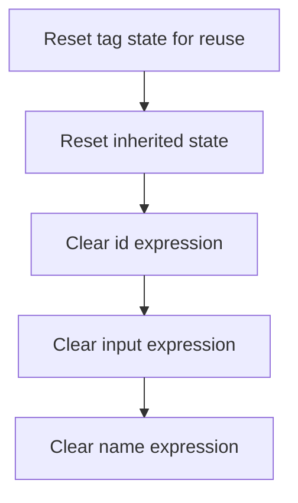

This document describes how an <SwmToken path="el/src/main/java/org/apache/strutsel/taglib/html/ELTextTag.java" pos="37:4:4" line-data="public class ELTextTag extends TextTag {">`ELTextTag`</SwmToken> is reset for reuse in JSP applications. All resource, UI, and event-related expressions are cleared so the tag does not retain any old state. The input is a tag instance with possible previous values, and the output is a clean, reusable tag.

# Resetting <SwmToken path="el/src/main/java/org/apache/strutsel/taglib/html/ELTextTag.java" pos="37:4:4" line-data="public class ELTextTag extends TextTag {">`ELTextTag`</SwmToken> State

<SwmSnippet path="/el/src/main/java/org/apache/strutsel/taglib/html/ELTextTag.java" line="877">

---

In <SwmToken path="el/src/main/java/org/apache/strutsel/taglib/html/ELTextTag.java" pos="877:5:5" line-data="    public void release() {">`release`</SwmToken>, we start by calling <SwmToken path="el/src/main/java/org/apache/strutsel/taglib/html/ELTextTag.java" pos="878:1:5" line-data="        super.release();">`super.release()`</SwmToken> to make sure any cleanup from the parent class happens first. This sets up the tag for a full reset, so we can safely clear out our own properties next. We need to call ELResourceTag.release right after to handle cleanup for any resource-related fields inherited or used by this tag.

```java
    public void release() {
        super.release();
```

---

</SwmSnippet>

## Clearing Resource Expressions



<SwmSnippet path="/el/src/main/java/org/apache/strutsel/taglib/bean/ELResourceTag.java" line="108">

---

In <SwmToken path="el/src/main/java/org/apache/strutsel/taglib/bean/ELResourceTag.java" pos="108:5:5" line-data="    public void release() {">`release`</SwmToken>, we call <SwmToken path="el/src/main/java/org/apache/strutsel/taglib/bean/ELResourceTag.java" pos="109:1:5" line-data="        super.release();">`super.release()`</SwmToken> and then start clearing out the expression fields like <SwmToken path="el/src/main/java/org/apache/strutsel/taglib/bean/ELResourceTag.java" pos="85:9:9" line-data="    public void setIdExpr(String idExpr) {">`idExpr`</SwmToken>. This drops any references so the tag doesn't hold onto old values. Next up is <SwmToken path="el/src/main/java/org/apache/strutsel/taglib/bean/ELResourceTag.java" pos="93:5:5" line-data="    public void setInputExpr(String inputExpr) {">`setInputExpr`</SwmToken> to keep clearing out more fields.

```java
    public void release() {
        super.release();
        setIdExpr(null);
```

---

</SwmSnippet>

<SwmSnippet path="/el/src/main/java/org/apache/strutsel/taglib/bean/ELResourceTag.java" line="85">

---

<SwmToken path="el/src/main/java/org/apache/strutsel/taglib/bean/ELResourceTag.java" pos="85:5:5" line-data="    public void setIdExpr(String idExpr) {">`setIdExpr`</SwmToken> just assigns the input to the <SwmToken path="el/src/main/java/org/apache/strutsel/taglib/bean/ELResourceTag.java" pos="85:9:9" line-data="    public void setIdExpr(String idExpr) {">`idExpr`</SwmToken> field. It's a plain setter, so setting it to null wipes out any previous value.

```java
    public void setIdExpr(String idExpr) {
        this.idExpr = idExpr;
    }
```

---

</SwmSnippet>

<SwmSnippet path="/el/src/main/java/org/apache/strutsel/taglib/bean/ELResourceTag.java" line="111">

---

We just finished clearing <SwmToken path="el/src/main/java/org/apache/strutsel/taglib/bean/ELResourceTag.java" pos="85:9:9" line-data="    public void setIdExpr(String idExpr) {">`idExpr`</SwmToken> in <SwmToken path="el/src/main/java/org/apache/strutsel/taglib/bean/ELResourceTag.java" pos="38:4:4" line-data="public class ELResourceTag extends ResourceTag {">`ELResourceTag`</SwmToken>. Now we call <SwmToken path="el/src/main/java/org/apache/strutsel/taglib/bean/ELResourceTag.java" pos="111:1:1" line-data="        setInputExpr(null);">`setInputExpr`</SwmToken> to make sure <SwmToken path="el/src/main/java/org/apache/strutsel/taglib/bean/ELResourceTag.java" pos="93:9:9" line-data="    public void setInputExpr(String inputExpr) {">`inputExpr`</SwmToken> is also reset, so nothing sticks around from earlier usage.

```java
        setInputExpr(null);
```

---

</SwmSnippet>

<SwmSnippet path="/el/src/main/java/org/apache/strutsel/taglib/bean/ELResourceTag.java" line="93">

---

<SwmToken path="el/src/main/java/org/apache/strutsel/taglib/bean/ELResourceTag.java" pos="93:5:5" line-data="    public void setInputExpr(String inputExpr) {">`setInputExpr`</SwmToken> just assigns the input to the <SwmToken path="el/src/main/java/org/apache/strutsel/taglib/bean/ELResourceTag.java" pos="93:9:9" line-data="    public void setInputExpr(String inputExpr) {">`inputExpr`</SwmToken> field. Setting it to null wipes out any previous value, no extra logic involved.

```java
    public void setInputExpr(String inputExpr) {
        this.inputExpr = inputExpr;
    }
```

---

</SwmSnippet>

<SwmSnippet path="/el/src/main/java/org/apache/strutsel/taglib/bean/ELResourceTag.java" line="112">

---

We just finished clearing <SwmToken path="el/src/main/java/org/apache/strutsel/taglib/bean/ELResourceTag.java" pos="93:9:9" line-data="    public void setInputExpr(String inputExpr) {">`inputExpr`</SwmToken>. Now we call <SwmToken path="el/src/main/java/org/apache/strutsel/taglib/bean/ELResourceTag.java" pos="112:1:1" line-data="        setNameExpr(null);">`setNameExpr`</SwmToken> to drop any reference to the name expression, finishing the cleanup for <SwmToken path="el/src/main/java/org/apache/strutsel/taglib/bean/ELResourceTag.java" pos="38:4:4" line-data="public class ELResourceTag extends ResourceTag {">`ELResourceTag`</SwmToken>.

```java
        setNameExpr(null);
    }
```

---

</SwmSnippet>

<SwmSnippet path="/el/src/main/java/org/apache/strutsel/taglib/bean/ELResourceTag.java" line="101">

---

<SwmToken path="el/src/main/java/org/apache/strutsel/taglib/bean/ELResourceTag.java" pos="101:5:5" line-data="    public void setNameExpr(String nameExpr) {">`setNameExpr`</SwmToken> just assigns the input to the <SwmToken path="el/src/main/java/org/apache/strutsel/taglib/bean/ELResourceTag.java" pos="101:9:9" line-data="    public void setNameExpr(String nameExpr) {">`nameExpr`</SwmToken> field. Setting it to null wipes out any previous value, nothing fancy.

```java
    public void setNameExpr(String nameExpr) {
        this.nameExpr = nameExpr;
    }
```

---

</SwmSnippet>

## Resetting <SwmToken path="el/src/main/java/org/apache/strutsel/taglib/html/ELTextTag.java" pos="23:12:12" line-data="import org.apache.struts.taglib.html.TextTag;">`TextTag`</SwmToken> Expressions

<SwmSnippet path="/el/src/main/java/org/apache/strutsel/taglib/html/ELTextTag.java" line="879">

---

We just finished with <SwmToken path="el/src/main/java/org/apache/strutsel/taglib/bean/ELResourceTag.java" pos="38:4:4" line-data="public class ELResourceTag extends ResourceTag {">`ELResourceTag`</SwmToken> cleanup. Now, in ELTextTag.release, we start clearing UI-related fields like <SwmToken path="el/src/main/java/org/apache/strutsel/taglib/html/ELTextTag.java" pos="574:9:9" line-data="    public void setAccesskeyExpr(String accesskeyExpr) {">`accesskeyExpr`</SwmToken> to make sure nothing from previous usage sticks around.

```java
        setAccesskeyExpr(null);
```

---

</SwmSnippet>

<SwmSnippet path="/el/src/main/java/org/apache/strutsel/taglib/html/ELTextTag.java" line="574">

---

<SwmToken path="el/src/main/java/org/apache/strutsel/taglib/html/ELTextTag.java" pos="574:5:5" line-data="    public void setAccesskeyExpr(String accesskeyExpr) {">`setAccesskeyExpr`</SwmToken> just assigns the input to the <SwmToken path="el/src/main/java/org/apache/strutsel/taglib/html/ELTextTag.java" pos="574:9:9" line-data="    public void setAccesskeyExpr(String accesskeyExpr) {">`accesskeyExpr`</SwmToken> field. Setting it to null wipes out any previous value, no extra logic.

```java
    public void setAccesskeyExpr(String accesskeyExpr) {
        this.accesskeyExpr = accesskeyExpr;
    }
```

---

</SwmSnippet>

<SwmSnippet path="/el/src/main/java/org/apache/strutsel/taglib/html/ELTextTag.java" line="880">

---

We just finished clearing <SwmToken path="el/src/main/java/org/apache/strutsel/taglib/html/ELTextTag.java" pos="574:9:9" line-data="    public void setAccesskeyExpr(String accesskeyExpr) {">`accesskeyExpr`</SwmToken>. Next up in ELTextTag.release is <SwmToken path="el/src/main/java/org/apache/strutsel/taglib/html/ELTextTag.java" pos="880:1:1" line-data="        setAltExpr(null);">`setAltExpr`</SwmToken>, so any old alt text gets wiped out too.

```java
        setAltExpr(null);
```

---

</SwmSnippet>

<SwmSnippet path="/el/src/main/java/org/apache/strutsel/taglib/html/ELTextTag.java" line="582">

---

<SwmToken path="el/src/main/java/org/apache/strutsel/taglib/html/ELTextTag.java" pos="582:5:5" line-data="    public void setAltExpr(String altExpr) {">`setAltExpr`</SwmToken> just assigns the input to the <SwmToken path="el/src/main/java/org/apache/strutsel/taglib/html/ELTextTag.java" pos="582:9:9" line-data="    public void setAltExpr(String altExpr) {">`altExpr`</SwmToken> field. Setting it to null wipes out any previous value, nothing else happens.

```java
    public void setAltExpr(String altExpr) {
        this.altExpr = altExpr;
    }
```

---

</SwmSnippet>

<SwmSnippet path="/el/src/main/java/org/apache/strutsel/taglib/html/ELTextTag.java" line="881">

---

We just finished clearing <SwmToken path="el/src/main/java/org/apache/strutsel/taglib/html/ELTextTag.java" pos="582:9:9" line-data="    public void setAltExpr(String altExpr) {">`altExpr`</SwmToken>. Next in ELTextTag.release is <SwmToken path="el/src/main/java/org/apache/strutsel/taglib/html/ELTextTag.java" pos="881:1:1" line-data="        setAltKeyExpr(null);">`setAltKeyExpr`</SwmToken>, so any old localization key gets wiped out.

```java
        setAltKeyExpr(null);
```

---

</SwmSnippet>

<SwmSnippet path="/el/src/main/java/org/apache/strutsel/taglib/html/ELTextTag.java" line="590">

---

<SwmToken path="el/src/main/java/org/apache/strutsel/taglib/html/ELTextTag.java" pos="590:5:5" line-data="    public void setAltKeyExpr(String altKeyExpr) {">`setAltKeyExpr`</SwmToken> just assigns the input to the <SwmToken path="el/src/main/java/org/apache/strutsel/taglib/html/ELTextTag.java" pos="590:9:9" line-data="    public void setAltKeyExpr(String altKeyExpr) {">`altKeyExpr`</SwmToken> field. Setting it to null wipes out any previous value, nothing else happens.

```java
    public void setAltKeyExpr(String altKeyExpr) {
        this.altKeyExpr = altKeyExpr;
    }
```

---

</SwmSnippet>

<SwmSnippet path="/el/src/main/java/org/apache/strutsel/taglib/html/ELTextTag.java" line="882">

---

We just finished clearing <SwmToken path="el/src/main/java/org/apache/strutsel/taglib/html/ELTextTag.java" pos="590:9:9" line-data="    public void setAltKeyExpr(String altKeyExpr) {">`altKeyExpr`</SwmToken>. Next in ELTextTag.release is <SwmToken path="el/src/main/java/org/apache/strutsel/taglib/html/ELTextTag.java" pos="882:1:1" line-data="        setBundleExpr(null);">`setBundleExpr`</SwmToken>, so any old resource bundle reference gets wiped out.

```java
        setBundleExpr(null);
```

---

</SwmSnippet>

<SwmSnippet path="/el/src/main/java/org/apache/strutsel/taglib/html/ELTextTag.java" line="598">

---

<SwmToken path="el/src/main/java/org/apache/strutsel/taglib/html/ELTextTag.java" pos="598:5:5" line-data="    public void setBundleExpr(String bundleExpr) {">`setBundleExpr`</SwmToken> just assigns the input to the <SwmToken path="el/src/main/java/org/apache/strutsel/taglib/html/ELTextTag.java" pos="598:9:9" line-data="    public void setBundleExpr(String bundleExpr) {">`bundleExpr`</SwmToken> field. Setting it to null wipes out any previous value, nothing else happens.

```java
    public void setBundleExpr(String bundleExpr) {
        this.bundleExpr = bundleExpr;
    }
```

---

</SwmSnippet>

<SwmSnippet path="/el/src/main/java/org/apache/strutsel/taglib/html/ELTextTag.java" line="883">

---

We just finished clearing <SwmToken path="el/src/main/java/org/apache/strutsel/taglib/html/ELTextTag.java" pos="598:9:9" line-data="    public void setBundleExpr(String bundleExpr) {">`bundleExpr`</SwmToken>. Next in ELTextTag.release is <SwmToken path="el/src/main/java/org/apache/strutsel/taglib/html/ELTextTag.java" pos="883:1:1" line-data="        setDirExpr(null);">`setDirExpr`</SwmToken>, so any old text direction gets wiped out.

```java
        setDirExpr(null);
```

---

</SwmSnippet>

<SwmSnippet path="/el/src/main/java/org/apache/strutsel/taglib/html/ELTextTag.java" line="606">

---

<SwmToken path="el/src/main/java/org/apache/strutsel/taglib/html/ELTextTag.java" pos="606:5:5" line-data="    public void setDirExpr(String dirExpr) {">`setDirExpr`</SwmToken> just assigns the input to the <SwmToken path="el/src/main/java/org/apache/strutsel/taglib/html/ELTextTag.java" pos="606:9:9" line-data="    public void setDirExpr(String dirExpr) {">`dirExpr`</SwmToken> field. Setting it to null wipes out any previous value, nothing else happens.

```java
    public void setDirExpr(String dirExpr) {
        this.dirExpr = dirExpr;
    }
```

---

</SwmSnippet>

<SwmSnippet path="/el/src/main/java/org/apache/strutsel/taglib/html/ELTextTag.java" line="884">

---

We just finished clearing <SwmToken path="el/src/main/java/org/apache/strutsel/taglib/html/ELTextTag.java" pos="606:9:9" line-data="    public void setDirExpr(String dirExpr) {">`dirExpr`</SwmToken>. Next in ELTextTag.release is <SwmToken path="el/src/main/java/org/apache/strutsel/taglib/html/ELTextTag.java" pos="884:1:1" line-data="        setDisabledExpr(null);">`setDisabledExpr`</SwmToken>, so any old disabled state gets wiped out.

```java
        setDisabledExpr(null);
```

---

</SwmSnippet>

<SwmSnippet path="/el/src/main/java/org/apache/strutsel/taglib/html/ELTextTag.java" line="614">

---

<SwmToken path="el/src/main/java/org/apache/strutsel/taglib/html/ELTextTag.java" pos="614:5:5" line-data="    public void setDisabledExpr(String disabledExpr) {">`setDisabledExpr`</SwmToken> just assigns the input to the <SwmToken path="el/src/main/java/org/apache/strutsel/taglib/html/ELTextTag.java" pos="614:9:9" line-data="    public void setDisabledExpr(String disabledExpr) {">`disabledExpr`</SwmToken> field. Setting it to null wipes out any previous value, nothing else happens.

```java
    public void setDisabledExpr(String disabledExpr) {
        this.disabledExpr = disabledExpr;
    }
```

---

</SwmSnippet>

<SwmSnippet path="/el/src/main/java/org/apache/strutsel/taglib/html/ELTextTag.java" line="885">

---

We just finished clearing <SwmToken path="el/src/main/java/org/apache/strutsel/taglib/html/ELTextTag.java" pos="614:9:9" line-data="    public void setDisabledExpr(String disabledExpr) {">`disabledExpr`</SwmToken>. Next in ELTextTag.release is <SwmToken path="el/src/main/java/org/apache/strutsel/taglib/html/ELTextTag.java" pos="885:1:1" line-data="        setErrorKeyExpr(null);">`setErrorKeyExpr`</SwmToken>, so any old error key gets wiped out.

```java
        setErrorKeyExpr(null);
```

---

</SwmSnippet>

<SwmSnippet path="/el/src/main/java/org/apache/strutsel/taglib/html/ELTextTag.java" line="622">

---

<SwmToken path="el/src/main/java/org/apache/strutsel/taglib/html/ELTextTag.java" pos="622:5:5" line-data="    public void setErrorKeyExpr(String errorKeyExpr) {">`setErrorKeyExpr`</SwmToken> just assigns the input to the <SwmToken path="el/src/main/java/org/apache/strutsel/taglib/html/ELTextTag.java" pos="622:9:9" line-data="    public void setErrorKeyExpr(String errorKeyExpr) {">`errorKeyExpr`</SwmToken> field. Setting it to null wipes out any previous value, nothing else happens.

```java
    public void setErrorKeyExpr(String errorKeyExpr) {
        this.errorKeyExpr = errorKeyExpr;
    }
```

---

</SwmSnippet>

<SwmSnippet path="/el/src/main/java/org/apache/strutsel/taglib/html/ELTextTag.java" line="886">

---

We just finished clearing <SwmToken path="el/src/main/java/org/apache/strutsel/taglib/html/ELTextTag.java" pos="622:9:9" line-data="    public void setErrorKeyExpr(String errorKeyExpr) {">`errorKeyExpr`</SwmToken>. Next in ELTextTag.release is <SwmToken path="el/src/main/java/org/apache/strutsel/taglib/html/ELTextTag.java" pos="886:1:1" line-data="        setErrorStyleExpr(null);">`setErrorStyleExpr`</SwmToken>, so any old error styling gets wiped out.

```java
        setErrorStyleExpr(null);
```

---

</SwmSnippet>

<SwmSnippet path="/el/src/main/java/org/apache/strutsel/taglib/html/ELTextTag.java" line="630">

---

<SwmToken path="el/src/main/java/org/apache/strutsel/taglib/html/ELTextTag.java" pos="630:5:5" line-data="    public void setErrorStyleExpr(String errorStyleExpr) {">`setErrorStyleExpr`</SwmToken> just assigns the input to the <SwmToken path="el/src/main/java/org/apache/strutsel/taglib/html/ELTextTag.java" pos="630:9:9" line-data="    public void setErrorStyleExpr(String errorStyleExpr) {">`errorStyleExpr`</SwmToken> field. Setting it to null wipes out any previous value, nothing else happens.

```java
    public void setErrorStyleExpr(String errorStyleExpr) {
        this.errorStyleExpr = errorStyleExpr;
    }
```

---

</SwmSnippet>

<SwmSnippet path="/el/src/main/java/org/apache/strutsel/taglib/html/ELTextTag.java" line="887">

---

We just finished clearing <SwmToken path="el/src/main/java/org/apache/strutsel/taglib/html/ELTextTag.java" pos="630:9:9" line-data="    public void setErrorStyleExpr(String errorStyleExpr) {">`errorStyleExpr`</SwmToken>. Next in ELTextTag.release is <SwmToken path="el/src/main/java/org/apache/strutsel/taglib/html/ELTextTag.java" pos="887:1:1" line-data="        setErrorStyleClassExpr(null);">`setErrorStyleClassExpr`</SwmToken>, so any old error style class gets wiped out.

```java
        setErrorStyleClassExpr(null);
```

---

</SwmSnippet>

<SwmSnippet path="/el/src/main/java/org/apache/strutsel/taglib/html/ELTextTag.java" line="638">

---

<SwmToken path="el/src/main/java/org/apache/strutsel/taglib/html/ELTextTag.java" pos="638:5:5" line-data="    public void setErrorStyleClassExpr(String errorStyleClassExpr) {">`setErrorStyleClassExpr`</SwmToken> just assigns the input to the <SwmToken path="el/src/main/java/org/apache/strutsel/taglib/html/ELTextTag.java" pos="638:9:9" line-data="    public void setErrorStyleClassExpr(String errorStyleClassExpr) {">`errorStyleClassExpr`</SwmToken> field. Setting it to null wipes out any previous value, nothing else happens.

```java
    public void setErrorStyleClassExpr(String errorStyleClassExpr) {
        this.errorStyleClassExpr = errorStyleClassExpr;
    }
```

---

</SwmSnippet>

<SwmSnippet path="/el/src/main/java/org/apache/strutsel/taglib/html/ELTextTag.java" line="888">

---

We just finished clearing <SwmToken path="el/src/main/java/org/apache/strutsel/taglib/html/ELTextTag.java" pos="638:9:9" line-data="    public void setErrorStyleClassExpr(String errorStyleClassExpr) {">`errorStyleClassExpr`</SwmToken>. Next in ELTextTag.release is <SwmToken path="el/src/main/java/org/apache/strutsel/taglib/html/ELTextTag.java" pos="888:1:1" line-data="        setErrorStyleIdExpr(null);">`setErrorStyleIdExpr`</SwmToken>, so any old error style ID gets wiped out.

```java
        setErrorStyleIdExpr(null);
```

---

</SwmSnippet>

<SwmSnippet path="/el/src/main/java/org/apache/strutsel/taglib/html/ELTextTag.java" line="646">

---

<SwmToken path="el/src/main/java/org/apache/strutsel/taglib/html/ELTextTag.java" pos="646:5:5" line-data="    public void setErrorStyleIdExpr(String errorStyleIdExpr) {">`setErrorStyleIdExpr`</SwmToken> just assigns the input to the <SwmToken path="el/src/main/java/org/apache/strutsel/taglib/html/ELTextTag.java" pos="646:9:9" line-data="    public void setErrorStyleIdExpr(String errorStyleIdExpr) {">`errorStyleIdExpr`</SwmToken> field. Setting it to null wipes out any previous value, nothing else happens.

```java
    public void setErrorStyleIdExpr(String errorStyleIdExpr) {
        this.errorStyleIdExpr = errorStyleIdExpr;
    }
```

---

</SwmSnippet>

<SwmSnippet path="/el/src/main/java/org/apache/strutsel/taglib/html/ELTextTag.java" line="889">

---

We just finished clearing <SwmToken path="el/src/main/java/org/apache/strutsel/taglib/html/ELTextTag.java" pos="646:9:9" line-data="    public void setErrorStyleIdExpr(String errorStyleIdExpr) {">`errorStyleIdExpr`</SwmToken>. Next in ELTextTag.release is <SwmToken path="el/src/main/java/org/apache/strutsel/taglib/html/ELTextTag.java" pos="889:1:1" line-data="        setIndexedExpr(null);">`setIndexedExpr`</SwmToken>, so any old index gets wiped out.

```java
        setIndexedExpr(null);
```

---

</SwmSnippet>

<SwmSnippet path="/el/src/main/java/org/apache/strutsel/taglib/html/ELTextTag.java" line="654">

---

<SwmToken path="el/src/main/java/org/apache/strutsel/taglib/html/ELTextTag.java" pos="654:5:5" line-data="    public void setIndexedExpr(String indexedExpr) {">`setIndexedExpr`</SwmToken> just assigns the input to the <SwmToken path="el/src/main/java/org/apache/strutsel/taglib/html/ELTextTag.java" pos="654:9:9" line-data="    public void setIndexedExpr(String indexedExpr) {">`indexedExpr`</SwmToken> field. Setting it to null wipes out any previous value, nothing else happens.

```java
    public void setIndexedExpr(String indexedExpr) {
        this.indexedExpr = indexedExpr;
    }
```

---

</SwmSnippet>

<SwmSnippet path="/el/src/main/java/org/apache/strutsel/taglib/html/ELTextTag.java" line="890">

---

We just finished clearing <SwmToken path="el/src/main/java/org/apache/strutsel/taglib/html/ELTextTag.java" pos="654:9:9" line-data="    public void setIndexedExpr(String indexedExpr) {">`indexedExpr`</SwmToken>. Next in ELTextTag.release is <SwmToken path="el/src/main/java/org/apache/strutsel/taglib/html/ELTextTag.java" pos="890:1:1" line-data="        setLangExpr(null);">`setLangExpr`</SwmToken>, so any old language setting gets wiped out.

```java
        setLangExpr(null);
```

---

</SwmSnippet>

<SwmSnippet path="/el/src/main/java/org/apache/strutsel/taglib/html/ELTextTag.java" line="662">

---

<SwmToken path="el/src/main/java/org/apache/strutsel/taglib/html/ELTextTag.java" pos="662:5:5" line-data="    public void setLangExpr(String langExpr) {">`setLangExpr`</SwmToken> just assigns the input to the <SwmToken path="el/src/main/java/org/apache/strutsel/taglib/html/ELTextTag.java" pos="662:9:9" line-data="    public void setLangExpr(String langExpr) {">`langExpr`</SwmToken> field. Setting it to null wipes out any previous value, nothing else happens.

```java
    public void setLangExpr(String langExpr) {
        this.langExpr = langExpr;
    }
```

---

</SwmSnippet>

<SwmSnippet path="/el/src/main/java/org/apache/strutsel/taglib/html/ELTextTag.java" line="891">

---

We just finished clearing <SwmToken path="el/src/main/java/org/apache/strutsel/taglib/html/ELTextTag.java" pos="662:9:9" line-data="    public void setLangExpr(String langExpr) {">`langExpr`</SwmToken>. Next in ELTextTag.release is <SwmToken path="el/src/main/java/org/apache/strutsel/taglib/html/ELTextTag.java" pos="891:1:1" line-data="        setMaxlengthExpr(null);">`setMaxlengthExpr`</SwmToken>, so any old max length gets wiped out.

```java
        setMaxlengthExpr(null);
```

---

</SwmSnippet>

<SwmSnippet path="/el/src/main/java/org/apache/strutsel/taglib/html/ELTextTag.java" line="670">

---

<SwmToken path="el/src/main/java/org/apache/strutsel/taglib/html/ELTextTag.java" pos="670:5:5" line-data="    public void setMaxlengthExpr(String maxlengthExpr) {">`setMaxlengthExpr`</SwmToken> just assigns the input to the <SwmToken path="el/src/main/java/org/apache/strutsel/taglib/html/ELTextTag.java" pos="670:9:9" line-data="    public void setMaxlengthExpr(String maxlengthExpr) {">`maxlengthExpr`</SwmToken> field. Setting it to null wipes out any previous value, nothing else happens.

```java
    public void setMaxlengthExpr(String maxlengthExpr) {
        this.maxlengthExpr = maxlengthExpr;
    }
```

---

</SwmSnippet>

<SwmSnippet path="/el/src/main/java/org/apache/strutsel/taglib/html/ELTextTag.java" line="892">

---

We just finished clearing <SwmToken path="el/src/main/java/org/apache/strutsel/taglib/html/ELTextTag.java" pos="670:9:9" line-data="    public void setMaxlengthExpr(String maxlengthExpr) {">`maxlengthExpr`</SwmToken>. Next in ELTextTag.release is <SwmToken path="el/src/main/java/org/apache/strutsel/taglib/html/ELTextTag.java" pos="892:1:1" line-data="        setNameExpr(null);">`setNameExpr`</SwmToken>, so any old input name gets wiped out.

```java
        setNameExpr(null);
```

---

</SwmSnippet>

<SwmSnippet path="/el/src/main/java/org/apache/strutsel/taglib/html/ELTextTag.java" line="678">

---

<SwmToken path="el/src/main/java/org/apache/strutsel/taglib/html/ELTextTag.java" pos="678:5:5" line-data="    public void setNameExpr(String nameExpr) {">`setNameExpr`</SwmToken> just assigns the input to the <SwmToken path="el/src/main/java/org/apache/strutsel/taglib/html/ELTextTag.java" pos="678:9:9" line-data="    public void setNameExpr(String nameExpr) {">`nameExpr`</SwmToken> field. Setting it to null wipes out any previous value, nothing else happens.

```java
    public void setNameExpr(String nameExpr) {
        this.nameExpr = nameExpr;
    }
```

---

</SwmSnippet>

<SwmSnippet path="/el/src/main/java/org/apache/strutsel/taglib/html/ELTextTag.java" line="893">

---

We just finished clearing <SwmToken path="el/src/main/java/org/apache/strutsel/taglib/html/ELTextTag.java" pos="678:9:9" line-data="    public void setNameExpr(String nameExpr) {">`nameExpr`</SwmToken>. Next in ELTextTag.release is <SwmToken path="el/src/main/java/org/apache/strutsel/taglib/html/ELTextTag.java" pos="893:1:1" line-data="        setOnblurExpr(null);">`setOnblurExpr`</SwmToken>, so any old onblur handler gets wiped out.

```java
        setOnblurExpr(null);
```

---

</SwmSnippet>

<SwmSnippet path="/el/src/main/java/org/apache/strutsel/taglib/html/ELTextTag.java" line="686">

---

<SwmToken path="el/src/main/java/org/apache/strutsel/taglib/html/ELTextTag.java" pos="686:5:5" line-data="    public void setOnblurExpr(String onblurExpr) {">`setOnblurExpr`</SwmToken> just assigns the input to the <SwmToken path="el/src/main/java/org/apache/strutsel/taglib/html/ELTextTag.java" pos="686:9:9" line-data="    public void setOnblurExpr(String onblurExpr) {">`onblurExpr`</SwmToken> field. Setting it to null wipes out any previous value, nothing else happens.

```java
    public void setOnblurExpr(String onblurExpr) {
        this.onblurExpr = onblurExpr;
    }
```

---

</SwmSnippet>

<SwmSnippet path="/el/src/main/java/org/apache/strutsel/taglib/html/ELTextTag.java" line="894">

---

We just returned from ELTextTag.setOnblurExpr. Now, ELTextTag.release calls <SwmToken path="el/src/main/java/org/apache/strutsel/taglib/html/ELTextTag.java" pos="894:1:1" line-data="        setOnchangeExpr(null);">`setOnchangeExpr`</SwmToken>(null) to make sure any onchange handler from a previous tag usage is wiped out. This keeps the tag clean for the next time it's used.

```java
        setOnchangeExpr(null);
```

---

</SwmSnippet>

<SwmSnippet path="/el/src/main/java/org/apache/strutsel/taglib/html/ELTextTag.java" line="694">

---

SetOnchangeExpr just sets the <SwmToken path="el/src/main/java/org/apache/strutsel/taglib/html/ELTextTag.java" pos="694:9:9" line-data="    public void setOnchangeExpr(String onchangeExpr) {">`onchangeExpr`</SwmToken> field to whatever string you pass in. No checks, no extra logic—just a plain setter.

```java
    public void setOnchangeExpr(String onchangeExpr) {
        this.onchangeExpr = onchangeExpr;
    }
```

---

</SwmSnippet>

<SwmSnippet path="/el/src/main/java/org/apache/strutsel/taglib/html/ELTextTag.java" line="895">

---

After ELTextTag.setOnchangeExpr, ELTextTag.release immediately calls <SwmToken path="el/src/main/java/org/apache/strutsel/taglib/html/ELTextTag.java" pos="895:1:1" line-data="        setOnclickExpr(null);">`setOnclickExpr`</SwmToken>(null) to clear out any old click handler. This keeps the tag from carrying over stale event logic.

```java
        setOnclickExpr(null);
```

---

</SwmSnippet>

<SwmSnippet path="/el/src/main/java/org/apache/strutsel/taglib/html/ELTextTag.java" line="702">

---

SetOnclickExpr just sets the <SwmToken path="el/src/main/java/org/apache/strutsel/taglib/html/ELTextTag.java" pos="702:9:9" line-data="    public void setOnclickExpr(String onclickExpr) {">`onclickExpr`</SwmToken> field to whatever string you give it. No extra logic—just a direct assignment.

```java
    public void setOnclickExpr(String onclickExpr) {
        this.onclickExpr = onclickExpr;
    }
```

---

</SwmSnippet>

<SwmSnippet path="/el/src/main/java/org/apache/strutsel/taglib/html/ELTextTag.java" line="896">

---

After ELTextTag.setOnclickExpr, ELTextTag.release calls <SwmToken path="el/src/main/java/org/apache/strutsel/taglib/html/ELTextTag.java" pos="896:1:1" line-data="        setOndblclickExpr(null);">`setOndblclickExpr`</SwmToken>(null) to clear out any double-click handler from a previous usage. This keeps the tag clean for the next round.

```java
        setOndblclickExpr(null);
```

---

</SwmSnippet>

<SwmSnippet path="/el/src/main/java/org/apache/strutsel/taglib/html/ELTextTag.java" line="710">

---

SetOndblclickExpr just sets the <SwmToken path="el/src/main/java/org/apache/strutsel/taglib/html/ELTextTag.java" pos="710:9:9" line-data="    public void setOndblclickExpr(String ondblclickExpr) {">`ondblclickExpr`</SwmToken> field to whatever string you pass in. No extra logic—just a direct assignment.

```java
    public void setOndblclickExpr(String ondblclickExpr) {
        this.ondblclickExpr = ondblclickExpr;
    }
```

---

</SwmSnippet>

<SwmSnippet path="/el/src/main/java/org/apache/strutsel/taglib/html/ELTextTag.java" line="897">

---

After ELTextTag.setOndblclickExpr, ELTextTag.release calls <SwmToken path="el/src/main/java/org/apache/strutsel/taglib/html/ELTextTag.java" pos="897:1:1" line-data="        setOnfocusExpr(null);">`setOnfocusExpr`</SwmToken>(null) to clear out any focus handler from a previous usage. This keeps the tag from leaking old event logic.

```java
        setOnfocusExpr(null);
```

---

</SwmSnippet>

<SwmSnippet path="/el/src/main/java/org/apache/strutsel/taglib/html/ELTextTag.java" line="718">

---

SetOnfocusExpr just sets the <SwmToken path="el/src/main/java/org/apache/strutsel/taglib/html/ELTextTag.java" pos="718:9:9" line-data="    public void setOnfocusExpr(String onfocusExpr) {">`onfocusExpr`</SwmToken> field to whatever string you pass in. No extra logic—just a direct assignment.

```java
    public void setOnfocusExpr(String onfocusExpr) {
        this.onfocusExpr = onfocusExpr;
    }
```

---

</SwmSnippet>

<SwmSnippet path="/el/src/main/java/org/apache/strutsel/taglib/html/ELTextTag.java" line="898">

---

After ELTextTag.setOnfocusExpr, ELTextTag.release calls <SwmToken path="el/src/main/java/org/apache/strutsel/taglib/html/ELTextTag.java" pos="898:1:1" line-data="        setOnkeydownExpr(null);">`setOnkeydownExpr`</SwmToken>(null) to clear out any keydown handler from a previous usage. This keeps the tag from leaking old event logic.

```java
        setOnkeydownExpr(null);
```

---

</SwmSnippet>

<SwmSnippet path="/el/src/main/java/org/apache/strutsel/taglib/html/ELTextTag.java" line="726">

---

SetOnkeydownExpr just sets the <SwmToken path="el/src/main/java/org/apache/strutsel/taglib/html/ELTextTag.java" pos="726:9:9" line-data="    public void setOnkeydownExpr(String onkeydownExpr) {">`onkeydownExpr`</SwmToken> field to whatever string you pass in. No extra logic—just a direct assignment.

```java
    public void setOnkeydownExpr(String onkeydownExpr) {
        this.onkeydownExpr = onkeydownExpr;
    }
```

---

</SwmSnippet>

<SwmSnippet path="/el/src/main/java/org/apache/strutsel/taglib/html/ELTextTag.java" line="899">

---

After ELTextTag.setOnkeydownExpr, ELTextTag.release calls <SwmToken path="el/src/main/java/org/apache/strutsel/taglib/html/ELTextTag.java" pos="899:1:1" line-data="        setOnkeypressExpr(null);">`setOnkeypressExpr`</SwmToken>(null) to clear out any keypress handler from a previous usage. This keeps the tag from leaking old event logic.

```java
        setOnkeypressExpr(null);
```

---

</SwmSnippet>

<SwmSnippet path="/el/src/main/java/org/apache/strutsel/taglib/html/ELTextTag.java" line="734">

---

SetOnkeypressExpr just sets the <SwmToken path="el/src/main/java/org/apache/strutsel/taglib/html/ELTextTag.java" pos="734:9:9" line-data="    public void setOnkeypressExpr(String onkeypressExpr) {">`onkeypressExpr`</SwmToken> field to whatever string you pass in. No extra logic—just a direct assignment.

```java
    public void setOnkeypressExpr(String onkeypressExpr) {
        this.onkeypressExpr = onkeypressExpr;
    }
```

---

</SwmSnippet>

<SwmSnippet path="/el/src/main/java/org/apache/strutsel/taglib/html/ELTextTag.java" line="900">

---

After ELTextTag.setOnkeypressExpr, ELTextTag.release calls <SwmToken path="el/src/main/java/org/apache/strutsel/taglib/html/ELTextTag.java" pos="900:1:1" line-data="        setOnkeyupExpr(null);">`setOnkeyupExpr`</SwmToken>(null) to clear out any keyup handler from a previous usage. This keeps the tag from leaking old event logic.

```java
        setOnkeyupExpr(null);
```

---

</SwmSnippet>

<SwmSnippet path="/el/src/main/java/org/apache/strutsel/taglib/html/ELTextTag.java" line="742">

---

SetOnkeyupExpr just sets the <SwmToken path="el/src/main/java/org/apache/strutsel/taglib/html/ELTextTag.java" pos="742:9:9" line-data="    public void setOnkeyupExpr(String onkeyupExpr) {">`onkeyupExpr`</SwmToken> field to whatever string you pass in. No extra logic—just a direct assignment.

```java
    public void setOnkeyupExpr(String onkeyupExpr) {
        this.onkeyupExpr = onkeyupExpr;
    }
```

---

</SwmSnippet>

<SwmSnippet path="/el/src/main/java/org/apache/strutsel/taglib/html/ELTextTag.java" line="901">

---

After ELTextTag.setOnkeyupExpr, ELTextTag.release calls <SwmToken path="el/src/main/java/org/apache/strutsel/taglib/html/ELTextTag.java" pos="901:1:1" line-data="        setOnmousedownExpr(null);">`setOnmousedownExpr`</SwmToken>(null) to clear out any mousedown handler from a previous usage. This keeps the tag from leaking old event logic.

```java
        setOnmousedownExpr(null);
```

---

</SwmSnippet>

<SwmSnippet path="/el/src/main/java/org/apache/strutsel/taglib/html/ELTextTag.java" line="750">

---

SetOnmousedownExpr just sets the <SwmToken path="el/src/main/java/org/apache/strutsel/taglib/html/ELTextTag.java" pos="750:9:9" line-data="    public void setOnmousedownExpr(String onmousedownExpr) {">`onmousedownExpr`</SwmToken> field to whatever string you pass in. No extra logic—just a direct assignment.

```java
    public void setOnmousedownExpr(String onmousedownExpr) {
        this.onmousedownExpr = onmousedownExpr;
    }
```

---

</SwmSnippet>

<SwmSnippet path="/el/src/main/java/org/apache/strutsel/taglib/html/ELTextTag.java" line="902">

---

After ELTextTag.setOnmousedownExpr, ELTextTag.release calls <SwmToken path="el/src/main/java/org/apache/strutsel/taglib/html/ELTextTag.java" pos="902:1:1" line-data="        setOnmousemoveExpr(null);">`setOnmousemoveExpr`</SwmToken>(null) to clear out any mousemove handler from a previous usage. This keeps the tag from leaking old event logic.

```java
        setOnmousemoveExpr(null);
```

---

</SwmSnippet>

<SwmSnippet path="/el/src/main/java/org/apache/strutsel/taglib/html/ELTextTag.java" line="758">

---

SetOnmousemoveExpr just sets the <SwmToken path="el/src/main/java/org/apache/strutsel/taglib/html/ELTextTag.java" pos="758:9:9" line-data="    public void setOnmousemoveExpr(String onmousemoveExpr) {">`onmousemoveExpr`</SwmToken> field to whatever string you pass in. No extra logic—just a direct assignment.

```java
    public void setOnmousemoveExpr(String onmousemoveExpr) {
        this.onmousemoveExpr = onmousemoveExpr;
    }
```

---

</SwmSnippet>

<SwmSnippet path="/el/src/main/java/org/apache/strutsel/taglib/html/ELTextTag.java" line="903">

---

After ELTextTag.setOnmousemoveExpr, ELTextTag.release calls <SwmToken path="el/src/main/java/org/apache/strutsel/taglib/html/ELTextTag.java" pos="903:1:1" line-data="        setOnmouseoutExpr(null);">`setOnmouseoutExpr`</SwmToken>(null) to clear out any mouseout handler from a previous usage. This keeps the tag from leaking old event logic.

```java
        setOnmouseoutExpr(null);
```

---

</SwmSnippet>

<SwmSnippet path="/el/src/main/java/org/apache/strutsel/taglib/html/ELTextTag.java" line="766">

---

SetOnmouseoutExpr just sets the <SwmToken path="el/src/main/java/org/apache/strutsel/taglib/html/ELTextTag.java" pos="766:9:9" line-data="    public void setOnmouseoutExpr(String onmouseoutExpr) {">`onmouseoutExpr`</SwmToken> field to whatever string you pass in. No extra logic—just a direct assignment.

```java
    public void setOnmouseoutExpr(String onmouseoutExpr) {
        this.onmouseoutExpr = onmouseoutExpr;
    }
```

---

</SwmSnippet>

<SwmSnippet path="/el/src/main/java/org/apache/strutsel/taglib/html/ELTextTag.java" line="904">

---

After ELTextTag.setOnmouseoutExpr, ELTextTag.release calls <SwmToken path="el/src/main/java/org/apache/strutsel/taglib/html/ELTextTag.java" pos="904:1:1" line-data="        setOnmouseoverExpr(null);">`setOnmouseoverExpr`</SwmToken>(null) to clear out any mouseover handler from a previous usage. This keeps the tag from leaking old event logic.

```java
        setOnmouseoverExpr(null);
```

---

</SwmSnippet>

<SwmSnippet path="/el/src/main/java/org/apache/strutsel/taglib/html/ELTextTag.java" line="774">

---

SetOnmouseoverExpr just sets the <SwmToken path="el/src/main/java/org/apache/strutsel/taglib/html/ELTextTag.java" pos="774:9:9" line-data="    public void setOnmouseoverExpr(String onmouseoverExpr) {">`onmouseoverExpr`</SwmToken> field to whatever string you pass in. No extra logic—just a direct assignment.

```java
    public void setOnmouseoverExpr(String onmouseoverExpr) {
        this.onmouseoverExpr = onmouseoverExpr;
    }
```

---

</SwmSnippet>

<SwmSnippet path="/el/src/main/java/org/apache/strutsel/taglib/html/ELTextTag.java" line="905">

---

After ELTextTag.setOnmouseoverExpr, ELTextTag.release calls <SwmToken path="el/src/main/java/org/apache/strutsel/taglib/html/ELTextTag.java" pos="905:1:1" line-data="        setOnmouseupExpr(null);">`setOnmouseupExpr`</SwmToken>(null) to clear out any mouseup handler from a previous usage. This keeps the tag from leaking old event logic.

```java
        setOnmouseupExpr(null);
```

---

</SwmSnippet>

<SwmSnippet path="/el/src/main/java/org/apache/strutsel/taglib/html/ELTextTag.java" line="782">

---

SetOnmouseupExpr just sets the <SwmToken path="el/src/main/java/org/apache/strutsel/taglib/html/ELTextTag.java" pos="782:9:9" line-data="    public void setOnmouseupExpr(String onmouseupExpr) {">`onmouseupExpr`</SwmToken> field to whatever string you pass in. No extra logic—just a direct assignment.

```java
    public void setOnmouseupExpr(String onmouseupExpr) {
        this.onmouseupExpr = onmouseupExpr;
    }
```

---

</SwmSnippet>

<SwmSnippet path="/el/src/main/java/org/apache/strutsel/taglib/html/ELTextTag.java" line="906">

---

After ELTextTag.setOnmouseupExpr, ELTextTag.release calls <SwmToken path="el/src/main/java/org/apache/strutsel/taglib/html/ELTextTag.java" pos="906:1:1" line-data="        setOnselectExpr(null);">`setOnselectExpr`</SwmToken>(null) to clear out any select handler from a previous usage. This keeps the tag from leaking old event logic.

```java
        setOnselectExpr(null);
```

---

</SwmSnippet>

<SwmSnippet path="/el/src/main/java/org/apache/strutsel/taglib/html/ELTextTag.java" line="790">

---

SetOnselectExpr just sets the <SwmToken path="el/src/main/java/org/apache/strutsel/taglib/html/ELTextTag.java" pos="790:9:9" line-data="    public void setOnselectExpr(String onselectExpr) {">`onselectExpr`</SwmToken> field to whatever string you pass in. No extra logic—just a direct assignment.

```java
    public void setOnselectExpr(String onselectExpr) {
        this.onselectExpr = onselectExpr;
    }
```

---

</SwmSnippet>

<SwmSnippet path="/el/src/main/java/org/apache/strutsel/taglib/html/ELTextTag.java" line="907">

---

After ELTextTag.setOnselectExpr, ELTextTag.release calls <SwmToken path="el/src/main/java/org/apache/strutsel/taglib/html/ELTextTag.java" pos="907:1:1" line-data="        setPropertyExpr(null);">`setPropertyExpr`</SwmToken>(null) to clear out any property expression from a previous usage. This keeps the tag from leaking old property data.

```java
        setPropertyExpr(null);
```

---

</SwmSnippet>

<SwmSnippet path="/el/src/main/java/org/apache/strutsel/taglib/html/ELTextTag.java" line="798">

---

SetPropertyExpr just sets the <SwmToken path="el/src/main/java/org/apache/strutsel/taglib/html/ELTextTag.java" pos="798:9:9" line-data="    public void setPropertyExpr(String propertyExpr) {">`propertyExpr`</SwmToken> field to whatever string you pass in. No extra logic—just a direct assignment.

```java
    public void setPropertyExpr(String propertyExpr) {
        this.propertyExpr = propertyExpr;
    }
```

---

</SwmSnippet>

<SwmSnippet path="/el/src/main/java/org/apache/strutsel/taglib/html/ELTextTag.java" line="908">

---

After ELTextTag.setPropertyExpr, ELTextTag.release calls <SwmToken path="el/src/main/java/org/apache/strutsel/taglib/html/ELTextTag.java" pos="908:1:1" line-data="        setReadonlyExpr(null);">`setReadonlyExpr`</SwmToken>(null) to clear out any readonly state from a previous usage. This keeps the tag from leaking old readonly data.

```java
        setReadonlyExpr(null);
```

---

</SwmSnippet>

<SwmSnippet path="/el/src/main/java/org/apache/strutsel/taglib/html/ELTextTag.java" line="806">

---

SetReadonlyExpr just sets the <SwmToken path="el/src/main/java/org/apache/strutsel/taglib/html/ELTextTag.java" pos="806:9:9" line-data="    public void setReadonlyExpr(String readonlyExpr) {">`readonlyExpr`</SwmToken> field to whatever string you pass in. No extra logic—just a direct assignment.

```java
    public void setReadonlyExpr(String readonlyExpr) {
        this.readonlyExpr = readonlyExpr;
    }
```

---

</SwmSnippet>

<SwmSnippet path="/el/src/main/java/org/apache/strutsel/taglib/html/ELTextTag.java" line="909">

---

After ELTextTag.setReadonlyExpr, ELTextTag.release calls <SwmToken path="el/src/main/java/org/apache/strutsel/taglib/html/ELTextTag.java" pos="909:1:1" line-data="        setStyleExpr(null);">`setStyleExpr`</SwmToken>(null) to clear out any style value from a previous usage. This keeps the tag from leaking old style data.

```java
        setStyleExpr(null);
```

---

</SwmSnippet>

<SwmSnippet path="/el/src/main/java/org/apache/strutsel/taglib/html/ELTextTag.java" line="814">

---

SetStyleExpr just sets the <SwmToken path="el/src/main/java/org/apache/strutsel/taglib/html/ELTextTag.java" pos="814:9:9" line-data="    public void setStyleExpr(String styleExpr) {">`styleExpr`</SwmToken> field to whatever string you pass in. No extra logic—just a direct assignment.

```java
    public void setStyleExpr(String styleExpr) {
        this.styleExpr = styleExpr;
    }
```

---

</SwmSnippet>

<SwmSnippet path="/el/src/main/java/org/apache/strutsel/taglib/html/ELTextTag.java" line="910">

---

After ELTextTag.setStyleExpr, ELTextTag.release calls <SwmToken path="el/src/main/java/org/apache/strutsel/taglib/html/ELTextTag.java" pos="910:1:1" line-data="        setSizeExpr(null);">`setSizeExpr`</SwmToken>(null) to clear out any size value from a previous usage. This keeps the tag from leaking old size data.

```java
        setSizeExpr(null);
```

---

</SwmSnippet>

<SwmSnippet path="/el/src/main/java/org/apache/strutsel/taglib/html/ELTextTag.java" line="822">

---

SetSizeExpr just sets the <SwmToken path="el/src/main/java/org/apache/strutsel/taglib/html/ELTextTag.java" pos="822:9:9" line-data="    public void setSizeExpr(String sizeExpr) {">`sizeExpr`</SwmToken> field to whatever string you pass in. No extra logic—just a direct assignment.

```java
    public void setSizeExpr(String sizeExpr) {
        this.sizeExpr = sizeExpr;
    }
```

---

</SwmSnippet>

<SwmSnippet path="/el/src/main/java/org/apache/strutsel/taglib/html/ELTextTag.java" line="911">

---

After ELTextTag.setSizeExpr, ELTextTag.release calls <SwmToken path="el/src/main/java/org/apache/strutsel/taglib/html/ELTextTag.java" pos="911:1:1" line-data="        setStyleClassExpr(null);">`setStyleClassExpr`</SwmToken>(null) to clear out any style class value from a previous usage. This keeps the tag from leaking old style class data.

```java
        setStyleClassExpr(null);
```

---

</SwmSnippet>

<SwmSnippet path="/el/src/main/java/org/apache/strutsel/taglib/html/ELTextTag.java" line="830">

---

SetStyleClassExpr just sets the <SwmToken path="el/src/main/java/org/apache/strutsel/taglib/html/ELTextTag.java" pos="830:9:9" line-data="    public void setStyleClassExpr(String styleClassExpr) {">`styleClassExpr`</SwmToken> field to whatever string you pass in. No extra logic—just a direct assignment.

```java
    public void setStyleClassExpr(String styleClassExpr) {
        this.styleClassExpr = styleClassExpr;
    }
```

---

</SwmSnippet>

<SwmSnippet path="/el/src/main/java/org/apache/strutsel/taglib/html/ELTextTag.java" line="912">

---

After ELTextTag.setStyleClassExpr, ELTextTag.release calls <SwmToken path="el/src/main/java/org/apache/strutsel/taglib/html/ELTextTag.java" pos="912:1:1" line-data="        setStyleIdExpr(null);">`setStyleIdExpr`</SwmToken>(null) to clear out any style ID value from a previous usage. This keeps the tag from leaking old style ID data.

```java
        setStyleIdExpr(null);
```

---

</SwmSnippet>

<SwmSnippet path="/el/src/main/java/org/apache/strutsel/taglib/html/ELTextTag.java" line="838">

---

SetStyleIdExpr just sets the <SwmToken path="el/src/main/java/org/apache/strutsel/taglib/html/ELTextTag.java" pos="838:9:9" line-data="    public void setStyleIdExpr(String styleIdExpr) {">`styleIdExpr`</SwmToken> field to whatever string you pass in. No extra logic—just a direct assignment.

```java
    public void setStyleIdExpr(String styleIdExpr) {
        this.styleIdExpr = styleIdExpr;
    }
```

---

</SwmSnippet>

<SwmSnippet path="/el/src/main/java/org/apache/strutsel/taglib/html/ELTextTag.java" line="913">

---

After ELTextTag.setStyleIdExpr, ELTextTag.release calls <SwmToken path="el/src/main/java/org/apache/strutsel/taglib/html/ELTextTag.java" pos="913:1:1" line-data="        setTabindexExpr(null);">`setTabindexExpr`</SwmToken>(null) to clear out any tabindex value from a previous usage. This keeps the tag from leaking old tabindex data.

```java
        setTabindexExpr(null);
```

---

</SwmSnippet>

<SwmSnippet path="/el/src/main/java/org/apache/strutsel/taglib/html/ELTextTag.java" line="846">

---

SetTabindexExpr just sets the <SwmToken path="el/src/main/java/org/apache/strutsel/taglib/html/ELTextTag.java" pos="846:9:9" line-data="    public void setTabindexExpr(String tabindexExpr) {">`tabindexExpr`</SwmToken> field to whatever string you pass in. No extra logic—just a direct assignment.

```java
    public void setTabindexExpr(String tabindexExpr) {
        this.tabindexExpr = tabindexExpr;
    }
```

---

</SwmSnippet>

<SwmSnippet path="/el/src/main/java/org/apache/strutsel/taglib/html/ELTextTag.java" line="914">

---

We just returned from ELTextTag.setTabindexExpr in ELTextTag.release. Now we call <SwmToken path="el/src/main/java/org/apache/strutsel/taglib/html/ELTextTag.java" pos="914:1:1" line-data="        setTitleExpr(null);">`setTitleExpr`</SwmToken>(null) to clear out any leftover title attribute, so the tag doesn't carry over old values when reused.

```java
        setTitleExpr(null);
```

---

</SwmSnippet>

<SwmSnippet path="/el/src/main/java/org/apache/strutsel/taglib/html/ELTextTag.java" line="854">

---

SetTitleExpr just assigns the input string to the <SwmToken path="el/src/main/java/org/apache/strutsel/taglib/html/ELTextTag.java" pos="854:9:9" line-data="    public void setTitleExpr(String titleExpr) {">`titleExpr`</SwmToken> field. No checks, no extra logic—just a plain setter.

```java
    public void setTitleExpr(String titleExpr) {
        this.titleExpr = titleExpr;
    }
```

---

</SwmSnippet>

<SwmSnippet path="/el/src/main/java/org/apache/strutsel/taglib/html/ELTextTag.java" line="915">

---

We just returned from ELTextTag.setTitleExpr in ELTextTag.release. Next up is <SwmToken path="el/src/main/java/org/apache/strutsel/taglib/html/ELTextTag.java" pos="915:1:1" line-data="        setTitleKeyExpr(null);">`setTitleKeyExpr`</SwmToken>(null), which clears out any leftover localization key for the title, so nothing sticks around between tag usages.

```java
        setTitleKeyExpr(null);
```

---

</SwmSnippet>

<SwmSnippet path="/el/src/main/java/org/apache/strutsel/taglib/html/ELTextTag.java" line="862">

---

SetTitleKeyExpr just assigns the input string to the <SwmToken path="el/src/main/java/org/apache/strutsel/taglib/html/ELTextTag.java" pos="862:9:9" line-data="    public void setTitleKeyExpr(String titleKeyExpr) {">`titleKeyExpr`</SwmToken> field. No extra logic—just a direct assignment.

```java
    public void setTitleKeyExpr(String titleKeyExpr) {
        this.titleKeyExpr = titleKeyExpr;
    }
```

---

</SwmSnippet>

<SwmSnippet path="/el/src/main/java/org/apache/strutsel/taglib/html/ELTextTag.java" line="916">

---

We just returned from ELTextTag.setTitleKeyExpr in ELTextTag.release. Now we call <SwmToken path="el/src/main/java/org/apache/strutsel/taglib/html/ELTextTag.java" pos="916:1:1" line-data="        setValueExpr(null);">`setValueExpr`</SwmToken>(null) to clear out any value expression, wrapping up the reset so the tag doesn't leak old data.

```java
        setValueExpr(null);
    }
```

---

</SwmSnippet>

<SwmSnippet path="/el/src/main/java/org/apache/strutsel/taglib/html/ELTextTag.java" line="870">

---

SetValueExpr just assigns the input string to the <SwmToken path="el/src/main/java/org/apache/strutsel/taglib/html/ELTextTag.java" pos="870:9:9" line-data="    public void setValueExpr(String valueExpr) {">`valueExpr`</SwmToken> field. No extra logic—just a direct assignment.

```java
    public void setValueExpr(String valueExpr) {
        this.valueExpr = valueExpr;
    }
```

---

</SwmSnippet>

&nbsp;

*This is an auto-generated document by Swimm 🌊 and has not yet been verified by a human*

<SwmMeta version="3.0.0" repo-id="Z2l0aHViJTNBJTNBc3RydXRzMSUzQSUzQVN3aW1tLURlbW8=" repo-name="struts1"><sup>Powered by [Swimm](https://app.swimm.io/)</sup></SwmMeta>
