This document describes how form properties are reset to their initial values based on configuration and HTTP method. The flow supports dynamic forms with various property types and ensures each property is set to its configured initial value when a form is reused or created.

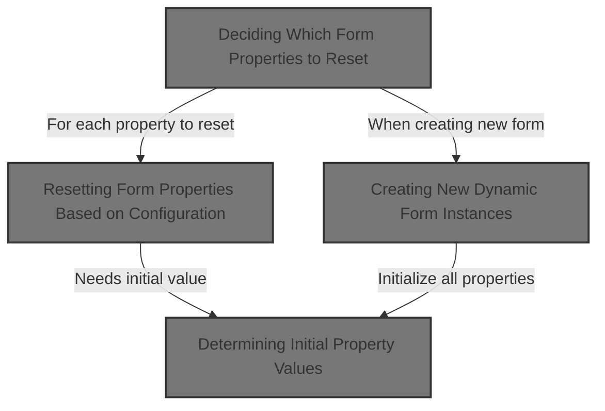
```mermaid
flowchart TD
  node1["Deciding Which Form Properties to Reset"]:::HeadingStyle
  click node1 goToHeading "Deciding Which Form Properties to Reset"
  node1 -->|"For each property to reset"| node2["Resetting Form Properties Based on Configuration"]:::HeadingStyle
  click node2 goToHeading "Resetting Form Properties Based on Configuration"
  node2 -->|"Needs initial value"| node3["Determining Initial Property Values"]:::HeadingStyle
  click node3 goToHeading "Determining Initial Property Values"
  node1 -->|"When creating new form"| node4["Creating New Dynamic Form Instances"]:::HeadingStyle
  click node4 goToHeading "Creating New Dynamic Form Instances"
  node4 -->|"Initialize all properties"| node3
classDef HeadingStyle fill:#777777,stroke:#333,stroke-width:2px;
```

# Deciding Which Form Properties to Reset

<SwmSnippet path="/core/src/main/java/org/apache/struts/action/DynaActionForm.java" line="137">

---

In <SwmToken path="core/src/main/java/org/apache/struts/action/DynaActionForm.java" pos="137:5:5" line-data="    public void reset(ActionMapping mapping, HttpServletRequest request) {">`reset`</SwmToken>, we're figuring out which form properties need to be reset based on the configuration. For each property, we check if the 'reset' attribute is set and whether it matches the current HTTP method or is just 'true'. Only then do we reset the property. This setup lets us control resets per HTTP method, so forms can behave differently on GET vs POST, for example. After this, we need to tokenize and parse the reset attribute, which is why the lexer comes into play next.

```java
    public void reset(ActionMapping mapping, HttpServletRequest request) {
        String name = getDynaClass().getName();

        if (name == null) {
            return;
        }

        FormBeanConfig config =
            mapping.getModuleConfig().findFormBeanConfig(name);

        if (config == null) {
            return;
        }

        // look for properties we should reset
        FormPropertyConfig[] props = config.findFormPropertyConfigs();

        for (int i = 0; i < props.length; i++) {
            String resetValue = props[i].getReset();

            // skip this property if there's no reset value
            if ((resetValue == null) || (resetValue.length() <= 0)) {
                continue;
            }

            boolean reset = Boolean.valueOf(resetValue).booleanValue();

            if (!reset) {
                // check for the request method
                // use a StringTokenizer with the default delimiters + a comma
                StringTokenizer st =
                    new StringTokenizer(resetValue, ", \t\n\r\f");

                while (st.hasMoreTokens()) {
                    String token = st.nextToken();

                    if (token.equalsIgnoreCase(request.getMethod())) {
                        reset = true;

                        break;
                    }
                }
            }

```

---

</SwmSnippet>

## Tokenizing the Next Input Segment

```mermaid
%%{init: {"flowchart": {"defaultRenderer": "elk"}} }%%
flowchart TD
    node1["Start tokenization"]
    click node1 openCode "core/src/main/java/org/apache/struts/validator/validwhen/ValidWhenLexer.java:75:78"
    subgraph loop1["Tokenization loop"]
        node1 --> node2{"What is the next input character?"}
        click node2 openCode "core/src/main/java/org/apache/struts/validator/validwhen/ValidWhenLexer.java:84:159"
        node2 -->|"Whitespace"| node3["Consuming Whitespace"]
        
        node3 --> node4["Set whitespace token"]
        click node4 openCode "core/src/main/java/org/apache/struts/validator/validwhen/ValidWhenLexer.java:88:89"
        node4 --> node5["Break to return token"]
        click node5 openCode "core/src/main/java/org/apache/struts/validator/validwhen/ValidWhenLexer.java:89:90"
        node2 -->|"Digit or '-'"| node6["Parsing Numeric Literals"]
        
        node6 --> node7["Set number token"]
        click node7 openCode "core/src/main/java/org/apache/struts/validator/validwhen/ValidWhenLexer.java:96:97"
        node7 --> node8["Break to return token"]
        click node8 openCode "core/src/main/java/org/apache/struts/validator/validwhen/ValidWhenLexer.java:97:98"
        node2 -->|"Quote"| node9["Parsing String Literals"]
        
        node9 --> node10["Set string token"]
        click node10 openCode "core/src/main/java/org/apache/struts/validator/validwhen/ValidWhenLexer.java:102:103"
        node10 --> node11["Break to return token"]
        click node11 openCode "core/src/main/java/org/apache/struts/validator/validwhen/ValidWhenLexer.java:103:104"
        node2 -->|"'['"| node12["Parsing Left Bracket"]
        
        node12 --> node13["Set left bracket token"]
        click node13 openCode "core/src/main/java/org/apache/struts/validator/validwhen/ValidWhenLexer.java:108:109"
        node13 --> node14["Break to return token"]
        click node14 openCode "core/src/main/java/org/apache/struts/validator/validwhen/ValidWhenLexer.java:109:110"
        node2 -->|"']'"| node15["Parsing Right Bracket"]
        
        node15 --> node16["Set right bracket token"]
        click node16 openCode "core/src/main/java/org/apache/struts/validator/validwhen/ValidWhenLexer.java:114:115"
        node16 --> node17["Break to return token"]
        click node17 openCode "core/src/main/java/org/apache/struts/validator/validwhen/ValidWhenLexer.java:115:116"
        node2 -->|"'('"| node18["Parsing Left Parenthesis"]
        
        node18 --> node19["Set left parenthesis token"]
        click node19 openCode "core/src/main/java/org/apache/struts/validator/validwhen/ValidWhenLexer.java:120:121"
        node19 --> node20["Break to return token"]
        click node20 openCode "core/src/main/java/org/apache/struts/validator/validwhen/ValidWhenLexer.java:121:122"
        node2 -->|"')'"| node21["Parsing Right Parenthesis"]
        
        node21 --> node22["Set right parenthesis token"]
        click node22 openCode "core/src/main/java/org/apache/struts/validator/validwhen/ValidWhenLexer.java:126:127"
        node22 --> node23["Break to return token"]
        click node23 openCode "core/src/main/java/org/apache/struts/validator/validwhen/ValidWhenLexer.java:127:128"
        node2 -->|"'*'"| node24["Parsing Wildcard 'this' Token"]
        
        node24 --> node25["Set special keyword token"]
        click node25 openCode "core/src/main/java/org/apache/struts/validator/validwhen/ValidWhenLexer.java:132:133"
        node25 --> node26["Break to return token"]
        click node26 openCode "core/src/main/java/org/apache/struts/validator/validwhen/ValidWhenLexer.java:133:134"
        node2 -->|"Letter or '_'"| node27["Parsing Identifiers"]
        
        node27 --> node28["Set identifier token"]
        click node28 openCode "core/src/main/java/org/apache/struts/validator/validwhen/ValidWhenLexer.java:144:145"
        node28 --> node29["Break to return token"]
        click node29 openCode "core/src/main/java/org/apache/struts/validator/validwhen/ValidWhenLexer.java:145:146"
        node2 -->|"'='"| node30["Parsing Equality Operator"]
        
        node30 --> node31["Set equals token"]
        click node31 openCode "core/src/main/java/org/apache/struts/validator/validwhen/ValidWhenLexer.java:150:151"
        node31 --> node32["Break to return token"]
        click node32 openCode "core/src/main/java/org/apache/struts/validator/validwhen/ValidWhenLexer.java:151:152"
        node2 -->|"'!'"| node33["Parsing Not-Equal Operator"]
        
        node33 --> node34["Set not equals token"]
        click node34 openCode "core/src/main/java/org/apache/struts/validator/validwhen/ValidWhenLexer.java:156:157"
        node34 --> node35["Break to return token"]
        click node35 openCode "core/src/main/java/org/apache/struts/validator/validwhen/ValidWhenLexer.java:157:158"
        node2 -->|"'<='"| node36["Parsing Less-Than-Or-Equal Operator"]
        
        node36 --> node37["Set less or equal token"]
        click node37 openCode "core/src/main/java/org/apache/struts/validator/validwhen/ValidWhenLexer.java:162:163"
        node37 --> node38["Break to return token"]
        click node38 openCode "core/src/main/java/org/apache/struts/validator/validwhen/ValidWhenLexer.java:163:164"
        node2 -->|"'>='"| node39["Parsing Greater-Than-Or-Equal Operator"]
        
        node39 --> node40["Set greater or equal token"]
        click node40 openCode "core/src/main/java/org/apache/struts/validator/validwhen/ValidWhenLexer.java:166:167"
        node40 --> node41["Break to return token"]
        click node41 openCode "core/src/main/java/org/apache/struts/validator/validwhen/ValidWhenLexer.java:167:168"
        node2 -->|"'<'"| node42["Parsing Less-Than Operator"]
        
        node42 --> node43["Set less than token"]
        click node43 openCode "core/src/main/java/org/apache/struts/validator/validwhen/ValidWhenLexer.java:170:171"
        node43 --> node44["Break to return token"]
        click node44 openCode "core/src/main/java/org/apache/struts/validator/validwhen/ValidWhenLexer.java:171:172"
        node2 -->|"'>'"| node45["Tokenizing the Greater-Than Operator"]
        
        node45 --> node46["Set greater than token"]
        click node46 openCode "core/src/main/java/org/apache/struts/validator/validwhen/ValidWhenLexer.java:174:175"
        node46 --> node47["Break to return token"]
        click node47 openCode "core/src/main/java/org/apache/struts/validator/validwhen/ValidWhenLexer.java:175:176"
        node2 -->|"Other"| node48{"Is end of input?"}
        click node48 openCode "core/src/main/java/org/apache/struts/validator/validwhen/ValidWhenLexer.java:177:178"
        node48 -->|"Yes"| node49["Return end-of-input token"]
        click node49 openCode "core/src/main/java/org/apache/struts/validator/validwhen/ValidWhenLexer.java:177:178"
        node48 -->|"No"| node50["Unrecognized input"]
        click node50 openCode "core/src/main/java/org/apache/struts/validator/validwhen/ValidWhenLexer.java:178:179"
    end
    node5 --> node51["Finalize and return token"]
    click node51 openCode "core/src/main/java/org/apache/struts/validator/validwhen/ValidWhenLexer.java:181:185"
    node8 --> node51
    node11 --> node51
    node14 --> node51
    node17 --> node51
    node20 --> node51
    node23 --> node51
    node26 --> node51
    node29 --> node51
    node32 --> node51
    node35 --> node51
    node38 --> node51
    node41 --> node51
    node44 --> node51
    node47 --> node51
    node49 --> node51
    node50 --> node51

classDef HeadingStyle fill:#777777,stroke:#333,stroke-width:2px;
click node3 goToHeading "Consuming Whitespace"
node3:::HeadingStyle
click node6 goToHeading "Parsing Numeric Literals"
node6:::HeadingStyle
click node9 goToHeading "Parsing String Literals"
node9:::HeadingStyle
click node12 goToHeading "Parsing Left Bracket"
node12:::HeadingStyle
click node15 goToHeading "Parsing Right Bracket"
node15:::HeadingStyle
click node18 goToHeading "Parsing Left Parenthesis"
node18:::HeadingStyle
click node21 goToHeading "Parsing Right Parenthesis"
node21:::HeadingStyle
click node24 goToHeading "Parsing Wildcard 'this' Token"
node24:::HeadingStyle
click node27 goToHeading "Parsing Identifiers"
node27:::HeadingStyle
click node30 goToHeading "Parsing Equality Operator"
node30:::HeadingStyle
click node33 goToHeading "Parsing Not-Equal Operator"
node33:::HeadingStyle
click node36 goToHeading "Parsing Less-Than-Or-Equal Operator"
node36:::HeadingStyle
click node39 goToHeading "Parsing Greater-Than-Or-Equal Operator"
node39:::HeadingStyle
click node42 goToHeading "Parsing Less-Than Operator"
node42:::HeadingStyle
click node45 goToHeading "Tokenizing the Greater-Than Operator"
node45:::HeadingStyle

%% Swimm:
%% %%{init: {"flowchart": {"defaultRenderer": "elk"}} }%%
%% flowchart TD
%%     node1["Start tokenization"]
%%     click node1 openCode "<SwmPath>[core/…/validwhen/ValidWhenLexer.java](core/src/main/java/org/apache/struts/validator/validwhen/ValidWhenLexer.java)</SwmPath>:75:78"
%%     subgraph loop1["Tokenization loop"]
%%         node1 --> node2{"What is the next input character?"}
%%         click node2 openCode "<SwmPath>[core/…/validwhen/ValidWhenLexer.java](core/src/main/java/org/apache/struts/validator/validwhen/ValidWhenLexer.java)</SwmPath>:84:159"
%%         node2 -->|"Whitespace"| node3["Consuming Whitespace"]
%%         
%%         node3 --> node4["Set whitespace token"]
%%         click node4 openCode "<SwmPath>[core/…/validwhen/ValidWhenLexer.java](core/src/main/java/org/apache/struts/validator/validwhen/ValidWhenLexer.java)</SwmPath>:88:89"
%%         node4 --> node5["Break to return token"]
%%         click node5 openCode "<SwmPath>[core/…/validwhen/ValidWhenLexer.java](core/src/main/java/org/apache/struts/validator/validwhen/ValidWhenLexer.java)</SwmPath>:89:90"
%%         node2 -->|"Digit or '-'"| node6["Parsing Numeric Literals"]
%%         
%%         node6 --> node7["Set number token"]
%%         click node7 openCode "<SwmPath>[core/…/validwhen/ValidWhenLexer.java](core/src/main/java/org/apache/struts/validator/validwhen/ValidWhenLexer.java)</SwmPath>:96:97"
%%         node7 --> node8["Break to return token"]
%%         click node8 openCode "<SwmPath>[core/…/validwhen/ValidWhenLexer.java](core/src/main/java/org/apache/struts/validator/validwhen/ValidWhenLexer.java)</SwmPath>:97:98"
%%         node2 -->|"Quote"| node9["Parsing String Literals"]
%%         
%%         node9 --> node10["Set string token"]
%%         click node10 openCode "<SwmPath>[core/…/validwhen/ValidWhenLexer.java](core/src/main/java/org/apache/struts/validator/validwhen/ValidWhenLexer.java)</SwmPath>:102:103"
%%         node10 --> node11["Break to return token"]
%%         click node11 openCode "<SwmPath>[core/…/validwhen/ValidWhenLexer.java](core/src/main/java/org/apache/struts/validator/validwhen/ValidWhenLexer.java)</SwmPath>:103:104"
%%         node2 -->|"'['"| node12["Parsing Left Bracket"]
%%         
%%         node12 --> node13["Set left bracket token"]
%%         click node13 openCode "<SwmPath>[core/…/validwhen/ValidWhenLexer.java](core/src/main/java/org/apache/struts/validator/validwhen/ValidWhenLexer.java)</SwmPath>:108:109"
%%         node13 --> node14["Break to return token"]
%%         click node14 openCode "<SwmPath>[core/…/validwhen/ValidWhenLexer.java](core/src/main/java/org/apache/struts/validator/validwhen/ValidWhenLexer.java)</SwmPath>:109:110"
%%         node2 -->|"']'"| node15["Parsing Right Bracket"]
%%         
%%         node15 --> node16["Set right bracket token"]
%%         click node16 openCode "<SwmPath>[core/…/validwhen/ValidWhenLexer.java](core/src/main/java/org/apache/struts/validator/validwhen/ValidWhenLexer.java)</SwmPath>:114:115"
%%         node16 --> node17["Break to return token"]
%%         click node17 openCode "<SwmPath>[core/…/validwhen/ValidWhenLexer.java](core/src/main/java/org/apache/struts/validator/validwhen/ValidWhenLexer.java)</SwmPath>:115:116"
%%         node2 -->|"'('"| node18["Parsing Left Parenthesis"]
%%         
%%         node18 --> node19["Set left parenthesis token"]
%%         click node19 openCode "<SwmPath>[core/…/validwhen/ValidWhenLexer.java](core/src/main/java/org/apache/struts/validator/validwhen/ValidWhenLexer.java)</SwmPath>:120:121"
%%         node19 --> node20["Break to return token"]
%%         click node20 openCode "<SwmPath>[core/…/validwhen/ValidWhenLexer.java](core/src/main/java/org/apache/struts/validator/validwhen/ValidWhenLexer.java)</SwmPath>:121:122"
%%         node2 -->|"')'"| node21["Parsing Right Parenthesis"]
%%         
%%         node21 --> node22["Set right parenthesis token"]
%%         click node22 openCode "<SwmPath>[core/…/validwhen/ValidWhenLexer.java](core/src/main/java/org/apache/struts/validator/validwhen/ValidWhenLexer.java)</SwmPath>:126:127"
%%         node22 --> node23["Break to return token"]
%%         click node23 openCode "<SwmPath>[core/…/validwhen/ValidWhenLexer.java](core/src/main/java/org/apache/struts/validator/validwhen/ValidWhenLexer.java)</SwmPath>:127:128"
%%         node2 -->|"'*'"| node24["Parsing Wildcard 'this' Token"]
%%         
%%         node24 --> node25["Set special keyword token"]
%%         click node25 openCode "<SwmPath>[core/…/validwhen/ValidWhenLexer.java](core/src/main/java/org/apache/struts/validator/validwhen/ValidWhenLexer.java)</SwmPath>:132:133"
%%         node25 --> node26["Break to return token"]
%%         click node26 openCode "<SwmPath>[core/…/validwhen/ValidWhenLexer.java](core/src/main/java/org/apache/struts/validator/validwhen/ValidWhenLexer.java)</SwmPath>:133:134"
%%         node2 -->|"Letter or '_'"| node27["Parsing Identifiers"]
%%         
%%         node27 --> node28["Set identifier token"]
%%         click node28 openCode "<SwmPath>[core/…/validwhen/ValidWhenLexer.java](core/src/main/java/org/apache/struts/validator/validwhen/ValidWhenLexer.java)</SwmPath>:144:145"
%%         node28 --> node29["Break to return token"]
%%         click node29 openCode "<SwmPath>[core/…/validwhen/ValidWhenLexer.java](core/src/main/java/org/apache/struts/validator/validwhen/ValidWhenLexer.java)</SwmPath>:145:146"
%%         node2 -->|"'='"| node30["Parsing Equality Operator"]
%%         
%%         node30 --> node31["Set equals token"]
%%         click node31 openCode "<SwmPath>[core/…/validwhen/ValidWhenLexer.java](core/src/main/java/org/apache/struts/validator/validwhen/ValidWhenLexer.java)</SwmPath>:150:151"
%%         node31 --> node32["Break to return token"]
%%         click node32 openCode "<SwmPath>[core/…/validwhen/ValidWhenLexer.java](core/src/main/java/org/apache/struts/validator/validwhen/ValidWhenLexer.java)</SwmPath>:151:152"
%%         node2 -->|"'!'"| node33["Parsing Not-Equal Operator"]
%%         
%%         node33 --> node34["Set not equals token"]
%%         click node34 openCode "<SwmPath>[core/…/validwhen/ValidWhenLexer.java](core/src/main/java/org/apache/struts/validator/validwhen/ValidWhenLexer.java)</SwmPath>:156:157"
%%         node34 --> node35["Break to return token"]
%%         click node35 openCode "<SwmPath>[core/…/validwhen/ValidWhenLexer.java](core/src/main/java/org/apache/struts/validator/validwhen/ValidWhenLexer.java)</SwmPath>:157:158"
%%         node2 -->|"'<='"| node36["Parsing Less-Than-Or-Equal Operator"]
%%         
%%         node36 --> node37["Set less or equal token"]
%%         click node37 openCode "<SwmPath>[core/…/validwhen/ValidWhenLexer.java](core/src/main/java/org/apache/struts/validator/validwhen/ValidWhenLexer.java)</SwmPath>:162:163"
%%         node37 --> node38["Break to return token"]
%%         click node38 openCode "<SwmPath>[core/…/validwhen/ValidWhenLexer.java](core/src/main/java/org/apache/struts/validator/validwhen/ValidWhenLexer.java)</SwmPath>:163:164"
%%         node2 -->|"'>='"| node39["Parsing Greater-Than-Or-Equal Operator"]
%%         
%%         node39 --> node40["Set greater or equal token"]
%%         click node40 openCode "<SwmPath>[core/…/validwhen/ValidWhenLexer.java](core/src/main/java/org/apache/struts/validator/validwhen/ValidWhenLexer.java)</SwmPath>:166:167"
%%         node40 --> node41["Break to return token"]
%%         click node41 openCode "<SwmPath>[core/…/validwhen/ValidWhenLexer.java](core/src/main/java/org/apache/struts/validator/validwhen/ValidWhenLexer.java)</SwmPath>:167:168"
%%         node2 -->|"'<'"| node42["Parsing Less-Than Operator"]
%%         
%%         node42 --> node43["Set less than token"]
%%         click node43 openCode "<SwmPath>[core/…/validwhen/ValidWhenLexer.java](core/src/main/java/org/apache/struts/validator/validwhen/ValidWhenLexer.java)</SwmPath>:170:171"
%%         node43 --> node44["Break to return token"]
%%         click node44 openCode "<SwmPath>[core/…/validwhen/ValidWhenLexer.java](core/src/main/java/org/apache/struts/validator/validwhen/ValidWhenLexer.java)</SwmPath>:171:172"
%%         node2 -->|"'>'"| node45["Tokenizing the Greater-Than Operator"]
%%         
%%         node45 --> node46["Set greater than token"]
%%         click node46 openCode "<SwmPath>[core/…/validwhen/ValidWhenLexer.java](core/src/main/java/org/apache/struts/validator/validwhen/ValidWhenLexer.java)</SwmPath>:174:175"
%%         node46 --> node47["Break to return token"]
%%         click node47 openCode "<SwmPath>[core/…/validwhen/ValidWhenLexer.java](core/src/main/java/org/apache/struts/validator/validwhen/ValidWhenLexer.java)</SwmPath>:175:176"
%%         node2 -->|"Other"| node48{"Is end of input?"}
%%         click node48 openCode "<SwmPath>[core/…/validwhen/ValidWhenLexer.java](core/src/main/java/org/apache/struts/validator/validwhen/ValidWhenLexer.java)</SwmPath>:177:178"
%%         node48 -->|"Yes"| node49["Return end-of-input token"]
%%         click node49 openCode "<SwmPath>[core/…/validwhen/ValidWhenLexer.java](core/src/main/java/org/apache/struts/validator/validwhen/ValidWhenLexer.java)</SwmPath>:177:178"
%%         node48 -->|"No"| node50["Unrecognized input"]
%%         click node50 openCode "<SwmPath>[core/…/validwhen/ValidWhenLexer.java](core/src/main/java/org/apache/struts/validator/validwhen/ValidWhenLexer.java)</SwmPath>:178:179"
%%     end
%%     node5 --> node51["Finalize and return token"]
%%     click node51 openCode "<SwmPath>[core/…/validwhen/ValidWhenLexer.java](core/src/main/java/org/apache/struts/validator/validwhen/ValidWhenLexer.java)</SwmPath>:181:185"
%%     node8 --> node51
%%     node11 --> node51
%%     node14 --> node51
%%     node17 --> node51
%%     node20 --> node51
%%     node23 --> node51
%%     node26 --> node51
%%     node29 --> node51
%%     node32 --> node51
%%     node35 --> node51
%%     node38 --> node51
%%     node41 --> node51
%%     node44 --> node51
%%     node47 --> node51
%%     node49 --> node51
%%     node50 --> node51
%% 
%% classDef HeadingStyle fill:#777777,stroke:#333,stroke-width:2px;
%% click node3 goToHeading "Consuming Whitespace"
%% node3:::HeadingStyle
%% click node6 goToHeading "Parsing Numeric Literals"
%% node6:::HeadingStyle
%% click node9 goToHeading "Parsing String Literals"
%% node9:::HeadingStyle
%% click node12 goToHeading "Parsing Left Bracket"
%% node12:::HeadingStyle
%% click node15 goToHeading "Parsing Right Bracket"
%% node15:::HeadingStyle
%% click node18 goToHeading "Parsing Left Parenthesis"
%% node18:::HeadingStyle
%% click node21 goToHeading "Parsing Right Parenthesis"
%% node21:::HeadingStyle
%% click node24 goToHeading "Parsing Wildcard 'this' Token"
%% node24:::HeadingStyle
%% click node27 goToHeading "Parsing Identifiers"
%% node27:::HeadingStyle
%% click node30 goToHeading "Parsing Equality Operator"
%% node30:::HeadingStyle
%% click node33 goToHeading "Parsing Not-Equal Operator"
%% node33:::HeadingStyle
%% click node36 goToHeading "Parsing Less-Than-Or-Equal Operator"
%% node36:::HeadingStyle
%% click node39 goToHeading "Parsing Greater-Than-Or-Equal Operator"
%% node39:::HeadingStyle
%% click node42 goToHeading "Parsing Less-Than Operator"
%% node42:::HeadingStyle
%% click node45 goToHeading "Tokenizing the Greater-Than Operator"
%% node45:::HeadingStyle
```

<SwmSnippet path="/core/src/main/java/org/apache/struts/validator/validwhen/ValidWhenLexer.java" line="75">

---

In <SwmToken path="core/src/main/java/org/apache/struts/validator/validwhen/ValidWhenLexer.java" pos="75:4:4" line-data="public Token nextToken() throws TokenStreamException {">`nextToken`</SwmToken>, we're scanning the input to find out what kind of token comes next. If it's whitespace, we call <SwmToken path="core/src/main/java/org/apache/struts/validator/validwhen/ValidWhenLexer.java" pos="87:1:1" line-data="					mWS(true);">`mWS`</SwmToken> to process or skip it. This step is needed so the lexer can cleanly separate meaningful tokens for the parser. After whitespace, we move on to check for numbers and other token types.

```java
public Token nextToken() throws TokenStreamException {
	Token theRetToken=null;
tryAgain:
	for (;;) {
		Token _token = null;
		int _ttype = Token.INVALID_TYPE;
		resetText();
		try {   // for char stream error handling
			try {   // for lexical error handling
				switch ( LA(1)) {
				case '\t':  case '\n':  case '\r':  case ' ':
				{
					mWS(true);
					theRetToken=_returnToken;
					break;
				}
				case '-':  case '0':  case '1':  case '2':
				case '3':  case '4':  case '5':  case '6':
```

---

</SwmSnippet>

### Consuming Whitespace

See <SwmLink doc-title="Whitespace Tokenization in Validation Expressions">[Whitespace Tokenization in Validation Expressions](/.swm/whitespace-tokenization-in-validation-expressions.hdwjqgsz.sw.md)</SwmLink>

### Handling Numeric Input

<SwmSnippet path="/core/src/main/java/org/apache/struts/validator/validwhen/ValidWhenLexer.java" line="93">

---

Right after handling whitespace in `ValidWhenLexer.nextToken`, we check if the next character is a digit. If so, we call <SwmToken path="core/src/main/java/org/apache/struts/validator/validwhen/ValidWhenLexer.java" pos="95:1:1" line-data="					mDECIMAL_LITERAL(true);">`mDECIMAL_LITERAL`</SwmToken> to process the number. This is where the lexer starts to figure out what kind of numeric literal it's dealing with

```java
				case '7':  case '8':  case '9':
				{
					mDECIMAL_LITERAL(true);
					theRetToken=_returnToken;
					break;
				}
```

---

</SwmSnippet>

### Parsing Numeric Literals

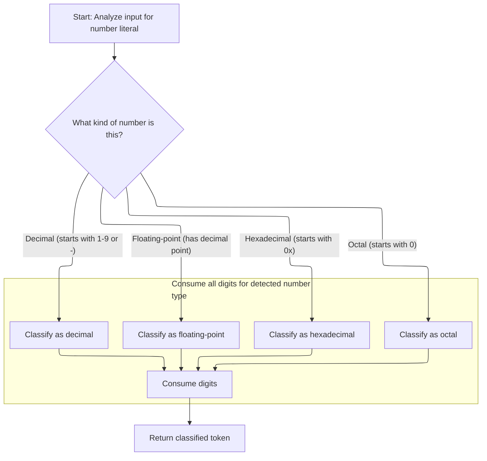
```mermaid
%%{init: {"flowchart": {"defaultRenderer": "elk"}} }%%
flowchart TD
    node1["Start: Analyze input for number literal"]
    click node1 openCode "core/src/main/java/org/apache/struts/validator/validwhen/ValidWhenLexer.java:250:251"
    node1 --> node2{"What kind of number is this?"}
    click node2 openCode "core/src/main/java/org/apache/struts/validator/validwhen/ValidWhenLexer.java:256:306"
    node2 -->|"Floating-point (has decimal point)"| node3["Classify as floating-point"]
    click node3 openCode "core/src/main/java/org/apache/struts/validator/validwhen/ValidWhenLexer.java:306:356"
    node2 -->|"Hexadecimal (starts with 0x)"| node4["Classify as hexadecimal"]
    click node4 openCode "core/src/main/java/org/apache/struts/validator/validwhen/ValidWhenLexer.java:361:412"
    node2 -->|"Octal (starts with 0)"| node5["Classify as octal"]
    click node5 openCode "core/src/main/java/org/apache/struts/validator/validwhen/ValidWhenLexer.java:413:449"
    node2 -->|"Decimal (starts with 1-9 or -)"| node6["Classify as decimal"]
    click node6 openCode "core/src/main/java/org/apache/struts/validator/validwhen/ValidWhenLexer.java:450:490"
    
    subgraph loop1["Consume all digits for detected number
type"]
        node3 --> node7["Consume digits"]
        node4 --> node7
        node5 --> node7
        node6 --> node7
        click node7 openCode "core/src/main/java/org/apache/struts/validator/validwhen/ValidWhenLexer.java:284:484"
    end
    node7 --> node8["Return classified token"]
    click node8 openCode "core/src/main/java/org/apache/struts/validator/validwhen/ValidWhenLexer.java:495:500"

classDef HeadingStyle fill:#777777,stroke:#333,stroke-width:2px;

%% Swimm:
%% %%{init: {"flowchart": {"defaultRenderer": "elk"}} }%%
%% flowchart TD
%%     node1["Start: Analyze input for number literal"]
%%     click node1 openCode "<SwmPath>[core/…/validwhen/ValidWhenLexer.java](core/src/main/java/org/apache/struts/validator/validwhen/ValidWhenLexer.java)</SwmPath>:250:251"
%%     node1 --> node2{"What kind of number is this?"}
%%     click node2 openCode "<SwmPath>[core/…/validwhen/ValidWhenLexer.java](core/src/main/java/org/apache/struts/validator/validwhen/ValidWhenLexer.java)</SwmPath>:256:306"
%%     node2 -->|"Floating-point (has decimal point)"| node3["Classify as floating-point"]
%%     click node3 openCode "<SwmPath>[core/…/validwhen/ValidWhenLexer.java](core/src/main/java/org/apache/struts/validator/validwhen/ValidWhenLexer.java)</SwmPath>:306:356"
%%     node2 -->|"Hexadecimal (starts with 0x)"| node4["Classify as hexadecimal"]
%%     click node4 openCode "<SwmPath>[core/…/validwhen/ValidWhenLexer.java](core/src/main/java/org/apache/struts/validator/validwhen/ValidWhenLexer.java)</SwmPath>:361:412"
%%     node2 -->|"Octal (starts with 0)"| node5["Classify as octal"]
%%     click node5 openCode "<SwmPath>[core/…/validwhen/ValidWhenLexer.java](core/src/main/java/org/apache/struts/validator/validwhen/ValidWhenLexer.java)</SwmPath>:413:449"
%%     node2 -->|"Decimal (starts with 1-9 or -)"| node6["Classify as decimal"]
%%     click node6 openCode "<SwmPath>[core/…/validwhen/ValidWhenLexer.java](core/src/main/java/org/apache/struts/validator/validwhen/ValidWhenLexer.java)</SwmPath>:450:490"
%%     
%%     subgraph loop1["Consume all digits for detected number
%% type"]
%%         node3 --> node7["Consume digits"]
%%         node4 --> node7
%%         node5 --> node7
%%         node6 --> node7
%%         click node7 openCode "<SwmPath>[core/…/validwhen/ValidWhenLexer.java](core/src/main/java/org/apache/struts/validator/validwhen/ValidWhenLexer.java)</SwmPath>:284:484"
%%     end
%%     node7 --> node8["Return classified token"]
%%     click node8 openCode "<SwmPath>[core/…/validwhen/ValidWhenLexer.java](core/src/main/java/org/apache/struts/validator/validwhen/ValidWhenLexer.java)</SwmPath>:495:500"
%% 
%% classDef HeadingStyle fill:#777777,stroke:#333,stroke-width:2px;
```

<SwmSnippet path="/core/src/main/java/org/apache/struts/validator/validwhen/ValidWhenLexer.java" line="250">

---

In <SwmToken path="core/src/main/java/org/apache/struts/validator/validwhen/ValidWhenLexer.java" pos="250:7:7" line-data="	public final void mDECIMAL_LITERAL(boolean _createToken) throws RecognitionException, CharStreamException, TokenStreamException {">`mDECIMAL_LITERAL`</SwmToken>, we're using lookahead and syntactic predicates to figure out if the number is a float, hex, octal, or decimal. The function checks the input pattern before actually matching, so we don't accidentally consume the wrong characters. Token sets and guessing are used to manage this logic cleanly.

```java
	public final void mDECIMAL_LITERAL(boolean _createToken) throws RecognitionException, CharStreamException, TokenStreamException {
		int _ttype; Token _token=null; int _begin=text.length();
		_ttype = DECIMAL_LITERAL;
		int _saveIndex;
		
		boolean synPredMatched24 = false;
		if (((_tokenSet_0.member(LA(1))) && (_tokenSet_1.member(LA(2))))) {
			int _m24 = mark();
			synPredMatched24 = true;
			inputState.guessing++;
			try {
				{
				{
				switch ( LA(1)) {
				case '-':
				{
					match('-');
					break;
				}
				case '0':  case '1':  case '2':  case '3':
				case '4':  case '5':  case '6':  case '7':
				case '8':  case '9':
				{
					break;
				}
				default:
				{
					throw new NoViableAltForCharException((char)LA(1), getFilename(), getLine(), getColumn());
				}
				}
				}
				{
				int _cnt22=0;
				_loop22:
				do {
					if (((LA(1) >= '0' && LA(1) <= '9'))) {
						matchRange('0','9');
					}
					else {
						if ( _cnt22>=1 ) { break _loop22; } else {throw new NoViableAltForCharException((char)LA(1), getFilename(), getLine(), getColumn());}
					}
					
					_cnt22++;
				} while (true);
```

---

</SwmSnippet>

<SwmSnippet path="/core/src/main/java/org/apache/struts/validator/validwhen/ValidWhenLexer.java" line="296">

---

Here we're finalizing the match for a floating-point number if the lookahead confirmed it. We match the digits, the decimal point, and more digits. This continues the numeric literal parsing, and what happens next depends on whether the input matches a hex, octal, or plain decimal format.

```java
				match('.');
				}
				}
			}
			catch (RecognitionException pe) {
				synPredMatched24 = false;
			}
			rewind(_m24);
inputState.guessing--;
		}
		if ( synPredMatched24 ) {
			{
			{
			switch ( LA(1)) {
			case '-':
			{
				match('-');
				break;
			}
			case '0':  case '1':  case '2':  case '3':
			case '4':  case '5':  case '6':  case '7':
			case '8':  case '9':
			{
				break;
			}
			default:
			{
				throw new NoViableAltForCharException((char)LA(1), getFilename(), getLine(), getColumn());
			}
			}
			}
			{
			int _cnt28=0;
			_loop28:
			do {
				if (((LA(1) >= '0' && LA(1) <= '9'))) {
					matchRange('0','9');
				}
				else {
					if ( _cnt28>=1 ) { break _loop28; } else {throw new NoViableAltForCharException((char)LA(1), getFilename(), getLine(), getColumn());}
				}
				
				_cnt28++;
			} while (true);
```

---

</SwmSnippet>

<SwmSnippet path="/core/src/main/java/org/apache/struts/validator/validwhen/ValidWhenLexer.java" line="342">

---

Now we're matching the fractional part of a floating-point number—more digits after the decimal point. This is still part of the floating-point parsing branch. After this, the code checks for other numeric formats like hex or octal if the float pattern didn't match.

```java
			match('.');
			}
			{
			int _cnt31=0;
			_loop31:
			do {
				if (((LA(1) >= '0' && LA(1) <= '9'))) {
					matchRange('0','9');
				}
				else {
					if ( _cnt31>=1 ) { break _loop31; } else {throw new NoViableAltForCharException((char)LA(1), getFilename(), getLine(), getColumn());}
				}
				
				_cnt31++;
			} while (true);
```

---

</SwmSnippet>

<SwmSnippet path="/core/src/main/java/org/apache/struts/validator/validwhen/ValidWhenLexer.java" line="361">

---

After handling floats, the code uses another lookahead (<SwmToken path="core/src/main/java/org/apache/struts/validator/validwhen/ValidWhenLexer.java" pos="361:3:3" line-data="			boolean synPredMatched38 = false;">`synPredMatched38`</SwmToken>) to check for a hex literal (0x prefix). If matched, it processes the hex digits. If not, it checks for octal or decimal formats next. The use of token sets and guessing here is what lets the lexer branch cleanly between these cases.

```java
			boolean synPredMatched38 = false;
			if (((LA(1)=='0') && (LA(2)=='x'))) {
				int _m38 = mark();
				synPredMatched38 = true;
				inputState.guessing++;
				try {
					{
					match('0');
					match('x');
					}
				}
				catch (RecognitionException pe) {
					synPredMatched38 = false;
				}
				rewind(_m38);
inputState.guessing--;
			}
			if ( synPredMatched38 ) {
				{
				match('0');
				match('x');
				{
				int _cnt41=0;
				_loop41:
				do {
					switch ( LA(1)) {
					case '0':  case '1':  case '2':  case '3':
					case '4':  case '5':  case '6':  case '7':
					case '8':  case '9':
					{
						matchRange('0','9');
						break;
					}
					case 'a':  case 'b':  case 'c':  case 'd':
					case 'e':  case 'f':
					{
						matchRange('a','f');
						break;
					}
					default:
					{
						if ( _cnt41>=1 ) { break _loop41; } else {throw new NoViableAltForCharException((char)LA(1), getFilename(), getLine(), getColumn());}
					}
					}
					_cnt41++;
				} while (true);
```

---

</SwmSnippet>

<SwmSnippet path="/core/src/main/java/org/apache/struts/validator/validwhen/ValidWhenLexer.java" line="409">

---

After matching a hex or octal literal, the code sets the token type accordingly (<SwmToken path="core/src/main/java/org/apache/struts/validator/validwhen/ValidWhenLexer.java" pos="410:5:5" line-data="					_ttype = HEX_INT_LITERAL;">`HEX_INT_LITERAL`</SwmToken> or <SwmToken path="core/src/main/java/org/apache/struts/validator/validwhen/ValidWhenLexer.java" pos="447:5:5" line-data="						_ttype = OCTAL_INT_LITERAL;">`OCTAL_INT_LITERAL`</SwmToken>). If neither, it checks for a regular decimal integer. This assignment is what tells the parser what kind of number it got.

```java
				if ( inputState.guessing==0 ) {
					_ttype = HEX_INT_LITERAL;
				}
			}
			else {
				boolean synPredMatched33 = false;
				if (((LA(1)=='0') && (true))) {
					int _m33 = mark();
					synPredMatched33 = true;
					inputState.guessing++;
					try {
						{
						match('0');
						}
					}
					catch (RecognitionException pe) {
						synPredMatched33 = false;
					}
					rewind(_m33);
inputState.guessing--;
				}
				if ( synPredMatched33 ) {
					{
					match('0');
					{
					_loop36:
					do {
						if (((LA(1) >= '0' && LA(1) <= '7'))) {
							matchRange('0','7');
						}
						else {
							break _loop36;
						}
						
					} while (true);
```

---

</SwmSnippet>

<SwmSnippet path="/core/src/main/java/org/apache/struts/validator/validwhen/ValidWhenLexer.java" line="446">

---

Here we're handling the case where the input is a regular decimal integer (not float, hex, or octal). We match the digits and set the token type. After this, the lexer is ready to return the token, and the parser can move on to matching other input, which may involve action config matching in the next phase.

```java
					if ( inputState.guessing==0 ) {
						_ttype = OCTAL_INT_LITERAL;
					}
				}
				else if ((_tokenSet_2.member(LA(1))) && (true)) {
					{
					{
					switch ( LA(1)) {
					case '-':
					{
						match('-');
						break;
					}
					case '1':  case '2':  case '3':  case '4':
					case '5':  case '6':  case '7':  case '8':
					case '9':
					{
						break;
					}
```

---

</SwmSnippet>

<SwmSnippet path="/core/src/main/java/org/apache/struts/validator/validwhen/ValidWhenLexer.java" line="465">

---

Now that we're back from `ActionConfigMatcher`, the lexer finalizes the decimal integer token in `ValidWhenLexer.mDECIMAL_LITERAL`. This means the parser can now use this token to interpret the next part of the input, continuing the parsing flow.

```java
					default:
					{
						throw new NoViableAltForCharException((char)LA(1), getFilename(), getLine(), getColumn());
					}
					}
					}
					{
					matchRange('1','9');
					}
					{
					_loop46:
					do {
						if (((LA(1) >= '0' && LA(1) <= '9'))) {
							matchRange('0','9');
						}
						else {
							break _loop46;
						}
						
					} while (true);
```

---

</SwmSnippet>

<SwmSnippet path="/core/src/main/java/org/apache/struts/validator/validwhen/ValidWhenLexer.java" line="487">

---

At the end of <SwmToken path="core/src/main/java/org/apache/struts/validator/validwhen/ValidWhenLexer.java" pos="95:1:1" line-data="					mDECIMAL_LITERAL(true);">`mDECIMAL_LITERAL`</SwmToken>, the lexer creates and returns a token for whatever numeric format it matched—float, hex, octal, or decimal. The token type is set based on what was found, so the parser knows exactly what kind of number it's dealing with.

```java
					if ( inputState.guessing==0 ) {
						_ttype = DEC_INT_LITERAL;
					}
				}
				else {
					throw new NoViableAltForCharException((char)LA(1), getFilename(), getLine(), getColumn());
				}
				}}
				if ( _createToken && _token==null && _ttype!=Token.SKIP ) {
					_token = makeToken(_ttype);
					_token.setText(new String(text.getBuffer(), _begin, text.length()-_begin));
				}
				_returnToken = _token;
			}
```

---

</SwmSnippet>

### Handling String Input

<SwmSnippet path="/core/src/main/java/org/apache/struts/validator/validwhen/ValidWhenLexer.java" line="99">

---

After returning from `ValidWhenLexer.mDECIMAL_LITERAL`, the lexer checks if the next input is a string literal (single or double quote). If so, it calls <SwmToken path="core/src/main/java/org/apache/struts/validator/validwhen/ValidWhenLexer.java" pos="101:1:1" line-data="					mSTRING_LITERAL(true);">`mSTRING_LITERAL`</SwmToken> to process it. This keeps the tokenization moving forward, handling all the main input types.

```java
				case '"':  case '\'':
				{
					mSTRING_LITERAL(true);
					theRetToken=_returnToken;
					break;
				}
```

---

</SwmSnippet>

### Parsing String Literals

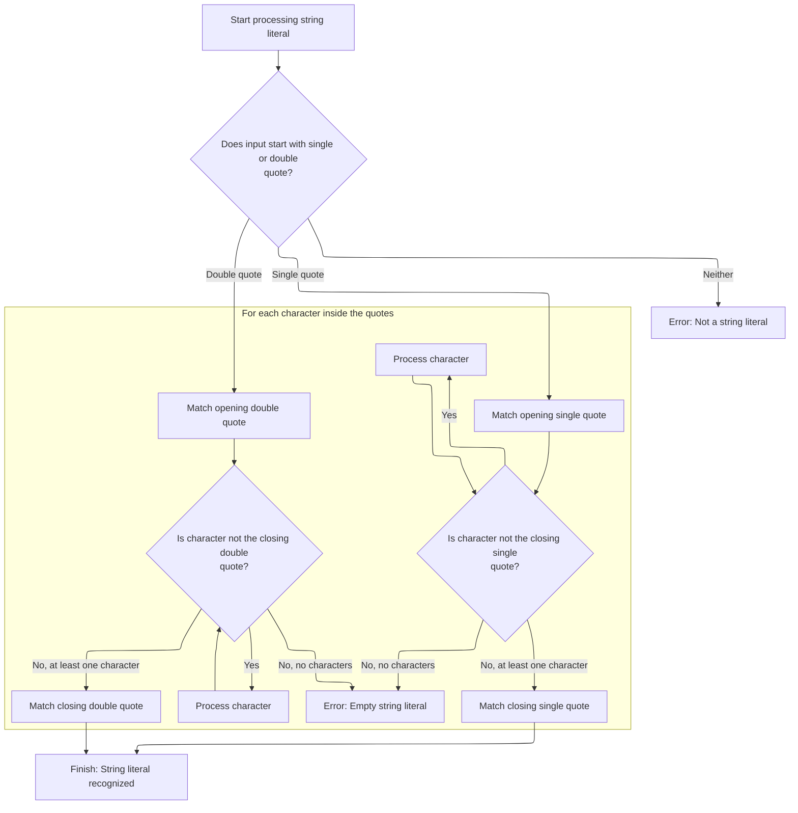
```mermaid
%%{init: {"flowchart": {"defaultRenderer": "elk"}} }%%
flowchart TD
  node1["Start processing string literal"] --> node2{"Does input start with single or double
quote?"}
  click node1 openCode "core/src/main/java/org/apache/struts/validator/validwhen/ValidWhenLexer.java:502:507"
  node2 -->|"Single quote"| node3["Match opening single quote"]
  node2 -->|"Double quote"| node4["Match opening double quote"]
  node2 -->|"Neither"| node12["Error: Not a string literal"]
  click node2 openCode "core/src/main/java/org/apache/struts/validator/validwhen/ValidWhenLexer.java:507:508"
  
  subgraph loop1["For each character inside the quotes"]
    node3 --> node5{"Is character not the closing single
quote?"}
    node4 --> node6{"Is character not the closing double
quote?"}
    node5 -->|"Yes"| node7["Process character"]
    node6 -->|"Yes"| node8["Process character"]
    node7 --> node5
    node8 --> node6
    node5 -->|"No, at least one character"| node9["Match closing single quote"]
    node6 -->|"No, at least one character"| node10["Match closing double quote"]
    node5 -->|"No, no characters"| node13["Error: Empty string literal"]
    node6 -->|"No, no characters"| node13
  end
  node9 --> node11["Create string token"]
  node10 --> node11
  node11["Finish: String literal recognized"]
  click node3 openCode "core/src/main/java/org/apache/struts/validator/validwhen/ValidWhenLexer.java:511:512"
  click node4 openCode "core/src/main/java/org/apache/struts/validator/validwhen/ValidWhenLexer.java:533:534"
  click node5 openCode "core/src/main/java/org/apache/struts/validator/validwhen/ValidWhenLexer.java:516:517"
  click node6 openCode "core/src/main/java/org/apache/struts/validator/validwhen/ValidWhenLexer.java:539:540"
  click node7 openCode "core/src/main/java/org/apache/struts/validator/validwhen/ValidWhenLexer.java:517:518"
  click node8 openCode "core/src/main/java/org/apache/struts/validator/validwhen/ValidWhenLexer.java:540:541"
  click node9 openCode "core/src/main/java/org/apache/struts/validator/validwhen/ValidWhenLexer.java:526:527"
  click node10 openCode "core/src/main/java/org/apache/struts/validator/validwhen/ValidWhenLexer.java:548:549"
  click node11 openCode "core/src/main/java/org/apache/struts/validator/validwhen/ValidWhenLexer.java:557:562"
  click node12 openCode "core/src/main/java/org/apache/struts/validator/validwhen/ValidWhenLexer.java:552:555"
  click node13 openCode "core/src/main/java/org/apache/struts/validator/validwhen/ValidWhenLexer.java:520:521"
classDef HeadingStyle fill:#777777,stroke:#333,stroke-width:2px;

%% Swimm:
%% %%{init: {"flowchart": {"defaultRenderer": "elk"}} }%%
%% flowchart TD
%%   node1["Start processing string literal"] --> node2{"Does input start with single or double
%% quote?"}
%%   click node1 openCode "<SwmPath>[core/…/validwhen/ValidWhenLexer.java](core/src/main/java/org/apache/struts/validator/validwhen/ValidWhenLexer.java)</SwmPath>:502:507"
%%   node2 -->|"Single quote"| node3["Match opening single quote"]
%%   node2 -->|"Double quote"| node4["Match opening double quote"]
%%   node2 -->|"Neither"| node12["Error: Not a string literal"]
%%   click node2 openCode "<SwmPath>[core/…/validwhen/ValidWhenLexer.java](core/src/main/java/org/apache/struts/validator/validwhen/ValidWhenLexer.java)</SwmPath>:507:508"
%%   
%%   subgraph loop1["For each character inside the quotes"]
%%     node3 --> node5{"Is character not the closing single
%% quote?"}
%%     node4 --> node6{"Is character not the closing double
%% quote?"}
%%     node5 -->|"Yes"| node7["Process character"]
%%     node6 -->|"Yes"| node8["Process character"]
%%     node7 --> node5
%%     node8 --> node6
%%     node5 -->|"No, at least one character"| node9["Match closing single quote"]
%%     node6 -->|"No, at least one character"| node10["Match closing double quote"]
%%     node5 -->|"No, no characters"| node13["Error: Empty string literal"]
%%     node6 -->|"No, no characters"| node13
%%   end
%%   node9 --> node11["Create string token"]
%%   node10 --> node11
%%   node11["Finish: String literal recognized"]
%%   click node3 openCode "<SwmPath>[core/…/validwhen/ValidWhenLexer.java](core/src/main/java/org/apache/struts/validator/validwhen/ValidWhenLexer.java)</SwmPath>:511:512"
%%   click node4 openCode "<SwmPath>[core/…/validwhen/ValidWhenLexer.java](core/src/main/java/org/apache/struts/validator/validwhen/ValidWhenLexer.java)</SwmPath>:533:534"
%%   click node5 openCode "<SwmPath>[core/…/validwhen/ValidWhenLexer.java](core/src/main/java/org/apache/struts/validator/validwhen/ValidWhenLexer.java)</SwmPath>:516:517"
%%   click node6 openCode "<SwmPath>[core/…/validwhen/ValidWhenLexer.java](core/src/main/java/org/apache/struts/validator/validwhen/ValidWhenLexer.java)</SwmPath>:539:540"
%%   click node7 openCode "<SwmPath>[core/…/validwhen/ValidWhenLexer.java](core/src/main/java/org/apache/struts/validator/validwhen/ValidWhenLexer.java)</SwmPath>:517:518"
%%   click node8 openCode "<SwmPath>[core/…/validwhen/ValidWhenLexer.java](core/src/main/java/org/apache/struts/validator/validwhen/ValidWhenLexer.java)</SwmPath>:540:541"
%%   click node9 openCode "<SwmPath>[core/…/validwhen/ValidWhenLexer.java](core/src/main/java/org/apache/struts/validator/validwhen/ValidWhenLexer.java)</SwmPath>:526:527"
%%   click node10 openCode "<SwmPath>[core/…/validwhen/ValidWhenLexer.java](core/src/main/java/org/apache/struts/validator/validwhen/ValidWhenLexer.java)</SwmPath>:548:549"
%%   click node11 openCode "<SwmPath>[core/…/validwhen/ValidWhenLexer.java](core/src/main/java/org/apache/struts/validator/validwhen/ValidWhenLexer.java)</SwmPath>:557:562"
%%   click node12 openCode "<SwmPath>[core/…/validwhen/ValidWhenLexer.java](core/src/main/java/org/apache/struts/validator/validwhen/ValidWhenLexer.java)</SwmPath>:552:555"
%%   click node13 openCode "<SwmPath>[core/…/validwhen/ValidWhenLexer.java](core/src/main/java/org/apache/struts/validator/validwhen/ValidWhenLexer.java)</SwmPath>:520:521"
%% classDef HeadingStyle fill:#777777,stroke:#333,stroke-width:2px;
```

<SwmSnippet path="/core/src/main/java/org/apache/struts/validator/validwhen/ValidWhenLexer.java" line="502">

---

In <SwmToken path="core/src/main/java/org/apache/struts/validator/validwhen/ValidWhenLexer.java" pos="502:7:7" line-data="	public final void mSTRING_LITERAL(boolean _createToken) throws RecognitionException, CharStreamException, TokenStreamException {">`mSTRING_LITERAL`</SwmToken>, we check if the string starts with a single or double quote, then match all valid characters inside (using the right token set) until we hit the closing quote. This makes sure only valid string literals are tokenized, and errors are thrown if the string isn't closed.

```java
	public final void mSTRING_LITERAL(boolean _createToken) throws RecognitionException, CharStreamException, TokenStreamException {
		int _ttype; Token _token=null; int _begin=text.length();
		_ttype = STRING_LITERAL;
		int _saveIndex;
		
		switch ( LA(1)) {
		case '\'':
		{
			{
			match('\'');
			{
			int _cnt50=0;
			_loop50:
			do {
				if ((_tokenSet_3.member(LA(1)))) {
					matchNot('\'');
				}
				else {
					if ( _cnt50>=1 ) { break _loop50; } else {throw new NoViableAltForCharException((char)LA(1), getFilename(), getLine(), getColumn());}
				}
				
				_cnt50++;
			} while (true);
```

---

</SwmSnippet>

<SwmSnippet path="/core/src/main/java/org/apache/struts/validator/validwhen/ValidWhenLexer.java" line="526">

---

After handling single-quoted strings, the code does the same for double-quoted strings—matching the opening quote, looping through valid characters (using <SwmToken path="core/src/main/java/org/apache/struts/validator/validwhen/ValidWhenLexer.java" pos="538:5:5" line-data="				if ((_tokenSet_4.member(LA(1)))) {">`_tokenSet_4`</SwmToken>), and matching the closing quote. This keeps the string literal parsing logic consistent for both quote types.

```java
			match('\'');
			}
			break;
		}
		case '"':
		{
			{
			match('\"');
			{
			int _cnt53=0;
			_loop53:
			do {
				if ((_tokenSet_4.member(LA(1)))) {
					matchNot('\"');
				}
				else {
					if ( _cnt53>=1 ) { break _loop53; } else {throw new NoViableAltForCharException((char)LA(1), getFilename(), getLine(), getColumn());}
				}
				
				_cnt53++;
			} while (true);
```

---

</SwmSnippet>

<SwmSnippet path="/core/src/main/java/org/apache/struts/validator/validwhen/ValidWhenLexer.java" line="548">

---

Here we're finishing up the double-quoted string literal. If the string isn't properly closed, we throw an error. After this, the lexer is ready to return the token, and the parser can move on to the next input, which might involve action config matching.

```java
			match('\"');
			}
			break;
		}
		default:
		{
			throw new NoViableAltForCharException((char)LA(1), getFilename(), getLine(), getColumn());
		}
		}
```

---

</SwmSnippet>

<SwmSnippet path="/core/src/main/java/org/apache/struts/validator/validwhen/ValidWhenLexer.java" line="557">

---

After coming back from `ActionConfigMatcher`, the lexer in `ValidWhenLexer.mSTRING_LITERAL` finalizes the string token and returns it. The parser can now use this token for further processing, knowing it's a valid string literal.

```java
		if ( _createToken && _token==null && _ttype!=Token.SKIP ) {
			_token = makeToken(_ttype);
			_token.setText(new String(text.getBuffer(), _begin, text.length()-_begin));
		}
		_returnToken = _token;
	}
```

---

</SwmSnippet>

### Handling Bracket Input

<SwmSnippet path="/core/src/main/java/org/apache/struts/validator/validwhen/ValidWhenLexer.java" line="105">

---

After returning from `ValidWhenLexer.mSTRING_LITERAL`, the lexer checks if the next character is a left bracket. If so, it calls <SwmToken path="core/src/main/java/org/apache/struts/validator/validwhen/ValidWhenLexer.java" pos="107:1:1" line-data="					mLBRACKET(true);">`mLBRACKET`</SwmToken> to process it. This keeps the tokenization sequence moving, handling all structural characters in the input.

```java
				case '[':
				{
					mLBRACKET(true);
					theRetToken=_returnToken;
					break;
				}
```

---

</SwmSnippet>

### Parsing Left Bracket

```mermaid
%%{init: {"flowchart": {"defaultRenderer": "elk"}} }%%
flowchart TD
    node1[Recognize left bracket '[' in input]
    click node1 openCode "core/src/main/java/org/apache/struts/validator/validwhen/ValidWhenLexer.java:569:569"
    node1 --> node2{"Should a token be created?
(_createToken is true, no token exists,
and token type is not SKIP)"}
    click node2 openCode "core/src/main/java/org/apache/struts/validator/validwhen/ValidWhenLexer.java:570:570"
    node2 -->|"Yes"| node3["Create token for left bracket"]
    click node3 openCode "core/src/main/java/org/apache/struts/validator/validwhen/ValidWhenLexer.java:571:572"
    node2 -->|"No"| node4["Do not create token"]
    click node4 openCode "core/src/main/java/org/apache/struts/validator/validwhen/ValidWhenLexer.java:573:573"
    node3 --> node5["Function completes (returns token or
null)"]
    node4 --> node5
    click node5 openCode "core/src/main/java/org/apache/struts/validator/validwhen/ValidWhenLexer.java:574:575"
classDef HeadingStyle fill:#777777,stroke:#333,stroke-width:2px;

%% Swimm:
%% %%{init: {"flowchart": {"defaultRenderer": "elk"}} }%%
%% flowchart TD
%%     node1[Recognize left bracket '[' in input]
%%     click node1 openCode "<SwmPath>[core/…/validwhen/ValidWhenLexer.java](core/src/main/java/org/apache/struts/validator/validwhen/ValidWhenLexer.java)</SwmPath>:569:569"
%%     node1 --> node2{"Should a token be created?
%% (<SwmToken path="core/src/main/java/org/apache/struts/validator/validwhen/ValidWhenLexer.java" pos="250:11:11" line-data="	public final void mDECIMAL_LITERAL(boolean _createToken) throws RecognitionException, CharStreamException, TokenStreamException {">`_createToken`</SwmToken> is true, no token exists,
%% and token type is not SKIP)"}
%%     click node2 openCode "<SwmPath>[core/…/validwhen/ValidWhenLexer.java](core/src/main/java/org/apache/struts/validator/validwhen/ValidWhenLexer.java)</SwmPath>:570:570"
%%     node2 -->|"Yes"| node3["Create token for left bracket"]
%%     click node3 openCode "<SwmPath>[core/…/validwhen/ValidWhenLexer.java](core/src/main/java/org/apache/struts/validator/validwhen/ValidWhenLexer.java)</SwmPath>:571:572"
%%     node2 -->|"No"| node4["Do not create token"]
%%     click node4 openCode "<SwmPath>[core/…/validwhen/ValidWhenLexer.java](core/src/main/java/org/apache/struts/validator/validwhen/ValidWhenLexer.java)</SwmPath>:573:573"
%%     node3 --> node5["Function completes (returns token or
%% null)"]
%%     node4 --> node5
%%     click node5 openCode "<SwmPath>[core/…/validwhen/ValidWhenLexer.java](core/src/main/java/org/apache/struts/validator/validwhen/ValidWhenLexer.java)</SwmPath>:574:575"
%% classDef HeadingStyle fill:#777777,stroke:#333,stroke-width:2px;
```

<SwmSnippet path="/core/src/main/java/org/apache/struts/validator/validwhen/ValidWhenLexer.java" line="564">

---

In <SwmToken path="core/src/main/java/org/apache/struts/validator/validwhen/ValidWhenLexer.java" pos="564:7:7" line-data="	public final void mLBRACKET(boolean _createToken) throws RecognitionException, CharStreamException, TokenStreamException {">`mLBRACKET`</SwmToken>, we match the '\[' character and set up the token. After this, the lexer is ready to return the token, and the parser can move on to the next input, which may involve action config matching.

```java
	public final void mLBRACKET(boolean _createToken) throws RecognitionException, CharStreamException, TokenStreamException {
		int _ttype; Token _token=null; int _begin=text.length();
		_ttype = LBRACKET;
		int _saveIndex;
		
		match('[');
```

---

</SwmSnippet>

<SwmSnippet path="/core/src/main/java/org/apache/struts/validator/validwhen/ValidWhenLexer.java" line="570">

---

After coming back from `ActionConfigMatcher`, the lexer in `ValidWhenLexer.mLBRACKET` finalizes the left bracket token and returns it. The parser can now use this token to handle bracketed expressions.

```java
		if ( _createToken && _token==null && _ttype!=Token.SKIP ) {
			_token = makeToken(_ttype);
			_token.setText(new String(text.getBuffer(), _begin, text.length()-_begin));
		}
		_returnToken = _token;
	}
```

---

</SwmSnippet>

### Handling Right Bracket Input

<SwmSnippet path="/core/src/main/java/org/apache/struts/validator/validwhen/ValidWhenLexer.java" line="111">

---

After returning from `ValidWhenLexer.mLBRACKET`, the lexer checks if the next character is a right bracket. If so, it calls <SwmToken path="core/src/main/java/org/apache/struts/validator/validwhen/ValidWhenLexer.java" pos="113:1:1" line-data="					mRBRACKET(true);">`mRBRACKET`</SwmToken> to process it. This keeps the tokenization sequence moving for bracketed expressions.

```java
				case ']':
				{
					mRBRACKET(true);
					theRetToken=_returnToken;
					break;
				}
```

---

</SwmSnippet>

### Parsing Right Bracket

<SwmSnippet path="/core/src/main/java/org/apache/struts/validator/validwhen/ValidWhenLexer.java" line="577">

---

In <SwmToken path="core/src/main/java/org/apache/struts/validator/validwhen/ValidWhenLexer.java" pos="577:7:7" line-data="	public final void mRBRACKET(boolean _createToken) throws RecognitionException, CharStreamException, TokenStreamException {">`mRBRACKET`</SwmToken>, we match the '\]' character and set up the token. After this, the lexer is ready to return the token, and the parser can move on to the next input, which may involve action config matching.

```java
	public final void mRBRACKET(boolean _createToken) throws RecognitionException, CharStreamException, TokenStreamException {
		int _ttype; Token _token=null; int _begin=text.length();
		_ttype = RBRACKET;
		int _saveIndex;
		
		match(']');
```

---

</SwmSnippet>

<SwmSnippet path="/core/src/main/java/org/apache/struts/validator/validwhen/ValidWhenLexer.java" line="583">

---

After coming back from `ActionConfigMatcher`, the lexer in `ValidWhenLexer.mRBRACKET` finalizes the right bracket token and returns it. The parser can now use this token to handle bracketed expressions.

```java
		if ( _createToken && _token==null && _ttype!=Token.SKIP ) {
			_token = makeToken(_ttype);
			_token.setText(new String(text.getBuffer(), _begin, text.length()-_begin));
		}
		_returnToken = _token;
	}
```

---

</SwmSnippet>

### Handling Parenthesis Input

<SwmSnippet path="/core/src/main/java/org/apache/struts/validator/validwhen/ValidWhenLexer.java" line="117">

---

After returning from `ValidWhenLexer.mRBRACKET`, the lexer checks if the next character is a left parenthesis. If so, it calls <SwmToken path="core/src/main/java/org/apache/struts/validator/validwhen/ValidWhenLexer.java" pos="119:1:1" line-data="					mLPAREN(true);">`mLPAREN`</SwmToken> to process it. This keeps the tokenization sequence moving for parenthesized expressions.

```java
				case '(':
				{
					mLPAREN(true);
					theRetToken=_returnToken;
					break;
				}
```

---

</SwmSnippet>

### Parsing Left Parenthesis

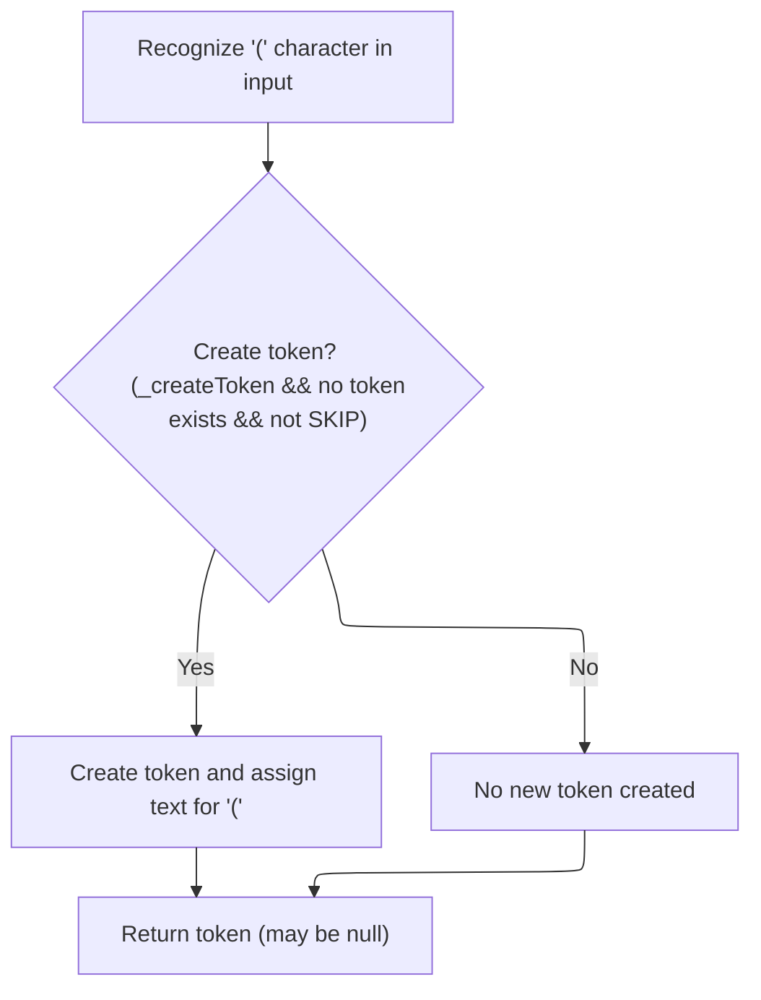
```mermaid
%%{init: {"flowchart": {"defaultRenderer": "elk"}} }%%
flowchart TD
    node1["Recognize '(' character in input"]
    click node1 openCode "core/src/main/java/org/apache/struts/validator/validwhen/ValidWhenLexer.java:595:595"
    node1 --> node2{"Create token? (_createToken && no token
exists && not SKIP)"}
    click node2 openCode "core/src/main/java/org/apache/struts/validator/validwhen/ValidWhenLexer.java:596:599"
    node2 -->|"Yes"| node3["Create token and assign text for '('"]
    click node3 openCode "core/src/main/java/org/apache/struts/validator/validwhen/ValidWhenLexer.java:597:598"
    node2 -->|"No"| node4["No new token created"]
    click node4 openCode "core/src/main/java/org/apache/struts/validator/validwhen/ValidWhenLexer.java:599:599"
    node3 --> node5["Return token (may be null)"]
    click node5 openCode "core/src/main/java/org/apache/struts/validator/validwhen/ValidWhenLexer.java:600:601"
    node4 --> node5

classDef HeadingStyle fill:#777777,stroke:#333,stroke-width:2px;

%% Swimm:
%% %%{init: {"flowchart": {"defaultRenderer": "elk"}} }%%
%% flowchart TD
%%     node1["Recognize '(' character in input"]
%%     click node1 openCode "<SwmPath>[core/…/validwhen/ValidWhenLexer.java](core/src/main/java/org/apache/struts/validator/validwhen/ValidWhenLexer.java)</SwmPath>:595:595"
%%     node1 --> node2{"Create token? (<SwmToken path="core/src/main/java/org/apache/struts/validator/validwhen/ValidWhenLexer.java" pos="250:11:11" line-data="	public final void mDECIMAL_LITERAL(boolean _createToken) throws RecognitionException, CharStreamException, TokenStreamException {">`_createToken`</SwmToken> && no token
%% exists && not SKIP)"}
%%     click node2 openCode "<SwmPath>[core/…/validwhen/ValidWhenLexer.java](core/src/main/java/org/apache/struts/validator/validwhen/ValidWhenLexer.java)</SwmPath>:596:599"
%%     node2 -->|"Yes"| node3["Create token and assign text for '('"]
%%     click node3 openCode "<SwmPath>[core/…/validwhen/ValidWhenLexer.java](core/src/main/java/org/apache/struts/validator/validwhen/ValidWhenLexer.java)</SwmPath>:597:598"
%%     node2 -->|"No"| node4["No new token created"]
%%     click node4 openCode "<SwmPath>[core/…/validwhen/ValidWhenLexer.java](core/src/main/java/org/apache/struts/validator/validwhen/ValidWhenLexer.java)</SwmPath>:599:599"
%%     node3 --> node5["Return token (may be null)"]
%%     click node5 openCode "<SwmPath>[core/…/validwhen/ValidWhenLexer.java](core/src/main/java/org/apache/struts/validator/validwhen/ValidWhenLexer.java)</SwmPath>:600:601"
%%     node4 --> node5
%% 
%% classDef HeadingStyle fill:#777777,stroke:#333,stroke-width:2px;
```

<SwmSnippet path="/core/src/main/java/org/apache/struts/validator/validwhen/ValidWhenLexer.java" line="590">

---

In <SwmToken path="core/src/main/java/org/apache/struts/validator/validwhen/ValidWhenLexer.java" pos="590:7:7" line-data="	public final void mLPAREN(boolean _createToken) throws RecognitionException, CharStreamException, TokenStreamException {">`mLPAREN`</SwmToken>, we match the '(' character and set up the token. After this, the lexer is ready to return the token, and the parser can move on to the next input, which may involve action config matching.

```java
	public final void mLPAREN(boolean _createToken) throws RecognitionException, CharStreamException, TokenStreamException {
		int _ttype; Token _token=null; int _begin=text.length();
		_ttype = LPAREN;
		int _saveIndex;
		
		match('(');
```

---

</SwmSnippet>

<SwmSnippet path="/core/src/main/java/org/apache/struts/validator/validwhen/ValidWhenLexer.java" line="596">

---

After coming back from `ActionConfigMatcher`, the lexer in `ValidWhenLexer.mLPAREN` finalizes the left parenthesis token and returns it. The parser can now use this token to handle parenthesized expressions.

```java
		if ( _createToken && _token==null && _ttype!=Token.SKIP ) {
			_token = makeToken(_ttype);
			_token.setText(new String(text.getBuffer(), _begin, text.length()-_begin));
		}
		_returnToken = _token;
	}
```

---

</SwmSnippet>

### Handling Right Parenthesis Input

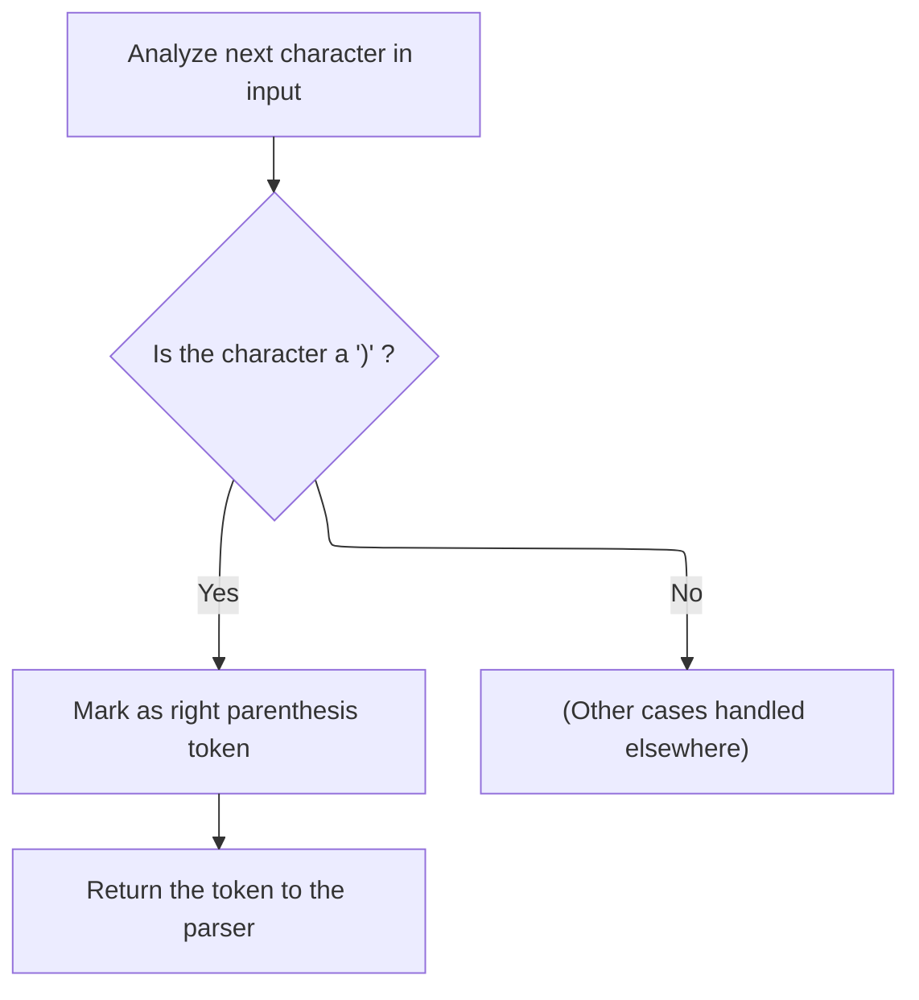
```mermaid
%%{init: {"flowchart": {"defaultRenderer": "elk"}} }%%
flowchart TD
    node0["Analyze next character in input"]
    click node0 openCode "core/src/main/java/org/apache/struts/validator/validwhen/ValidWhenLexer.java:123:128"
    node0 --> node1{"Is the character a ')' ?"}
    click node1 openCode "core/src/main/java/org/apache/struts/validator/validwhen/ValidWhenLexer.java:123:128"
    node1 -->|"Yes"| node2["Mark as right parenthesis token"]
    click node2 openCode "core/src/main/java/org/apache/struts/validator/validwhen/ValidWhenLexer.java:125:127"
    node2 --> node3["Return the token to the parser"]
    click node3 openCode "core/src/main/java/org/apache/struts/validator/validwhen/ValidWhenLexer.java:126:127"
    node1 -->|"No"| node4["(Other cases handled elsewhere)"]
    click node4 openCode "core/src/main/java/org/apache/struts/validator/validwhen/ValidWhenLexer.java:123:128"

classDef HeadingStyle fill:#777777,stroke:#333,stroke-width:2px;

%% Swimm:
%% %%{init: {"flowchart": {"defaultRenderer": "elk"}} }%%
%% flowchart TD
%%     node0["Analyze next character in input"]
%%     click node0 openCode "<SwmPath>[core/…/validwhen/ValidWhenLexer.java](core/src/main/java/org/apache/struts/validator/validwhen/ValidWhenLexer.java)</SwmPath>:123:128"
%%     node0 --> node1{"Is the character a ')' ?"}
%%     click node1 openCode "<SwmPath>[core/…/validwhen/ValidWhenLexer.java](core/src/main/java/org/apache/struts/validator/validwhen/ValidWhenLexer.java)</SwmPath>:123:128"
%%     node1 -->|"Yes"| node2["Mark as right parenthesis token"]
%%     click node2 openCode "<SwmPath>[core/…/validwhen/ValidWhenLexer.java](core/src/main/java/org/apache/struts/validator/validwhen/ValidWhenLexer.java)</SwmPath>:125:127"
%%     node2 --> node3["Return the token to the parser"]
%%     click node3 openCode "<SwmPath>[core/…/validwhen/ValidWhenLexer.java](core/src/main/java/org/apache/struts/validator/validwhen/ValidWhenLexer.java)</SwmPath>:126:127"
%%     node1 -->|"No"| node4["(Other cases handled elsewhere)"]
%%     click node4 openCode "<SwmPath>[core/…/validwhen/ValidWhenLexer.java](core/src/main/java/org/apache/struts/validator/validwhen/ValidWhenLexer.java)</SwmPath>:123:128"
%% 
%% classDef HeadingStyle fill:#777777,stroke:#333,stroke-width:2px;
```

<SwmSnippet path="/core/src/main/java/org/apache/struts/validator/validwhen/ValidWhenLexer.java" line="123">

---

After returning from `ValidWhenLexer.mLPAREN`, the lexer checks if the next character is a right parenthesis. If so, it calls <SwmToken path="core/src/main/java/org/apache/struts/validator/validwhen/ValidWhenLexer.java" pos="125:1:1" line-data="					mRPAREN(true);">`mRPAREN`</SwmToken> to process it. This keeps the tokenization sequence moving for parenthesized expressions.

```java
				case ')':
				{
					mRPAREN(true);
					theRetToken=_returnToken;
					break;
				}
```

---

</SwmSnippet>

### Parsing Right Parenthesis

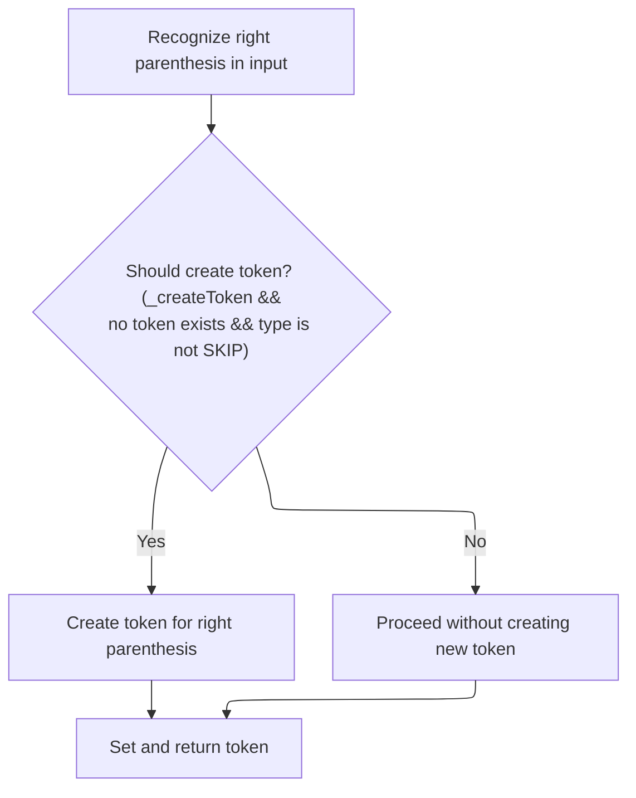
```mermaid
%%{init: {"flowchart": {"defaultRenderer": "elk"}} }%%
flowchart TD
  node1["Recognize right parenthesis in input"]
  click node1 openCode "core/src/main/java/org/apache/struts/validator/validwhen/ValidWhenLexer.java:608:608"
  node1 --> node2{"Should create token? (_createToken &&
no token exists && type is not SKIP)"}
  click node2 openCode "core/src/main/java/org/apache/struts/validator/validwhen/ValidWhenLexer.java:609:609"
  node2 -->|"Yes"| node3["Create token for right parenthesis"]
  click node3 openCode "core/src/main/java/org/apache/struts/validator/validwhen/ValidWhenLexer.java:610:611"
  node2 -->|"No"| node4["Proceed without creating new token"]
  click node4 openCode "core/src/main/java/org/apache/struts/validator/validwhen/ValidWhenLexer.java:612:612"
  node3 --> node5["Set and return token"]
  click node5 openCode "core/src/main/java/org/apache/struts/validator/validwhen/ValidWhenLexer.java:613:614"
  node4 --> node5
classDef HeadingStyle fill:#777777,stroke:#333,stroke-width:2px;

%% Swimm:
%% %%{init: {"flowchart": {"defaultRenderer": "elk"}} }%%
%% flowchart TD
%%   node1["Recognize right parenthesis in input"]
%%   click node1 openCode "<SwmPath>[core/…/validwhen/ValidWhenLexer.java](core/src/main/java/org/apache/struts/validator/validwhen/ValidWhenLexer.java)</SwmPath>:608:608"
%%   node1 --> node2{"Should create token? (<SwmToken path="core/src/main/java/org/apache/struts/validator/validwhen/ValidWhenLexer.java" pos="250:11:11" line-data="	public final void mDECIMAL_LITERAL(boolean _createToken) throws RecognitionException, CharStreamException, TokenStreamException {">`_createToken`</SwmToken> &&
%% no token exists && type is not SKIP)"}
%%   click node2 openCode "<SwmPath>[core/…/validwhen/ValidWhenLexer.java](core/src/main/java/org/apache/struts/validator/validwhen/ValidWhenLexer.java)</SwmPath>:609:609"
%%   node2 -->|"Yes"| node3["Create token for right parenthesis"]
%%   click node3 openCode "<SwmPath>[core/…/validwhen/ValidWhenLexer.java](core/src/main/java/org/apache/struts/validator/validwhen/ValidWhenLexer.java)</SwmPath>:610:611"
%%   node2 -->|"No"| node4["Proceed without creating new token"]
%%   click node4 openCode "<SwmPath>[core/…/validwhen/ValidWhenLexer.java](core/src/main/java/org/apache/struts/validator/validwhen/ValidWhenLexer.java)</SwmPath>:612:612"
%%   node3 --> node5["Set and return token"]
%%   click node5 openCode "<SwmPath>[core/…/validwhen/ValidWhenLexer.java](core/src/main/java/org/apache/struts/validator/validwhen/ValidWhenLexer.java)</SwmPath>:613:614"
%%   node4 --> node5
%% classDef HeadingStyle fill:#777777,stroke:#333,stroke-width:2px;
```

<SwmSnippet path="/core/src/main/java/org/apache/struts/validator/validwhen/ValidWhenLexer.java" line="603">

---

In <SwmToken path="core/src/main/java/org/apache/struts/validator/validwhen/ValidWhenLexer.java" pos="603:7:7" line-data="	public final void mRPAREN(boolean _createToken) throws RecognitionException, CharStreamException, TokenStreamException {">`mRPAREN`</SwmToken>, we're matching the ')' character and setting up the token type for a right parenthesis. After this, we need to call ActionConfigMatcher so the parser can handle the next part of the input, which might involve matching action configuration patterns.

```java
	public final void mRPAREN(boolean _createToken) throws RecognitionException, CharStreamException, TokenStreamException {
		int _ttype; Token _token=null; int _begin=text.length();
		_ttype = RPAREN;
		int _saveIndex;
		
		match(')');
```

---

</SwmSnippet>

<SwmSnippet path="/core/src/main/java/org/apache/struts/validator/validwhen/ValidWhenLexer.java" line="609">

---

Back in `ValidWhenLexer.mRPAREN`, after returning from ActionConfigMatcher, we finalize the right parenthesis token and return it. This lets the parser move on to the next input segment, knowing the parenthesis was handled.

```java
		if ( _createToken && _token==null && _ttype!=Token.SKIP ) {
			_token = makeToken(_ttype);
			_token.setText(new String(text.getBuffer(), _begin, text.length()-_begin));
		}
		_returnToken = _token;
	}
```

---

</SwmSnippet>

### Handling Wildcard and Identifier Input

<SwmSnippet path="/core/src/main/java/org/apache/struts/validator/validwhen/ValidWhenLexer.java" line="129">

---

After returning from `ValidWhenLexer.mRPAREN`, the lexer checks if the next character is a wildcard ('\*') or an identifier start. Depending on what it finds, it calls <SwmToken path="core/src/main/java/org/apache/struts/validator/validwhen/ValidWhenLexer.java" pos="131:1:1" line-data="					mTHIS(true);">`mTHIS`</SwmToken> or <SwmToken path="core/src/main/java/org/apache/struts/validator/validwhen/ValidWhenLexer.java" pos="143:1:1" line-data="					mIDENTIFIER(true);">`mIDENTIFIER`</SwmToken> to tokenize the next input. This keeps the token stream accurate for the parser.

```java
				case '*':
				{
					mTHIS(true);
					theRetToken=_returnToken;
					break;
				}
				case '.':  case '_':  case 'a':  case 'b':
				case 'c':  case 'd':  case 'e':  case 'f':
				case 'g':  case 'h':  case 'i':  case 'j':
				case 'k':  case 'l':  case 'm':  case 'n':
				case 'o':  case 'p':  case 'q':  case 'r':
				case 's':  case 't':  case 'u':  case 'v':
```

---

</SwmSnippet>

### Parsing Wildcard 'this' Token

<SwmSnippet path="/core/src/main/java/org/apache/struts/validator/validwhen/ValidWhenLexer.java" line="616">

---

In <SwmToken path="core/src/main/java/org/apache/struts/validator/validwhen/ValidWhenLexer.java" pos="616:7:7" line-data="	public final void mTHIS(boolean _createToken) throws RecognitionException, CharStreamException, TokenStreamException {">`mTHIS`</SwmToken>, we're matching the literal '*this*' and creating a token for it. After this, we call ActionConfigMatcher so the parser can handle any action config patterns that might follow or be affected by this special token.

```java
	public final void mTHIS(boolean _createToken) throws RecognitionException, CharStreamException, TokenStreamException {
		int _ttype; Token _token=null; int _begin=text.length();
		_ttype = THIS;
		int _saveIndex;
		
		match("*this*");
```

---

</SwmSnippet>

<SwmSnippet path="/core/src/main/java/org/apache/struts/validator/validwhen/ValidWhenLexer.java" line="622">

---

Back in `ValidWhenLexer.mTHIS`, after returning from ActionConfigMatcher, we finalize the '*this*' token and return it. This lets the parser know that the wildcard was handled and it can continue parsing.

```java
		if ( _createToken && _token==null && _ttype!=Token.SKIP ) {
			_token = makeToken(_ttype);
			_token.setText(new String(text.getBuffer(), _begin, text.length()-_begin));
		}
		_returnToken = _token;
	}
```

---

</SwmSnippet>

### Handling Identifiers

<SwmSnippet path="/core/src/main/java/org/apache/struts/validator/validwhen/ValidWhenLexer.java" line="141">

---

After returning from `ValidWhenLexer.mTHIS`, the lexer checks if the next character starts an identifier. If so, it calls <SwmToken path="core/src/main/java/org/apache/struts/validator/validwhen/ValidWhenLexer.java" pos="143:1:1" line-data="					mIDENTIFIER(true);">`mIDENTIFIER`</SwmToken> to tokenize it. This is how field names and variables get recognized in the input.

```java
				case 'w':  case 'x':  case 'y':  case 'z':
				{
					mIDENTIFIER(true);
					theRetToken=_returnToken;
					break;
				}
```

---

</SwmSnippet>

### Parsing Identifiers

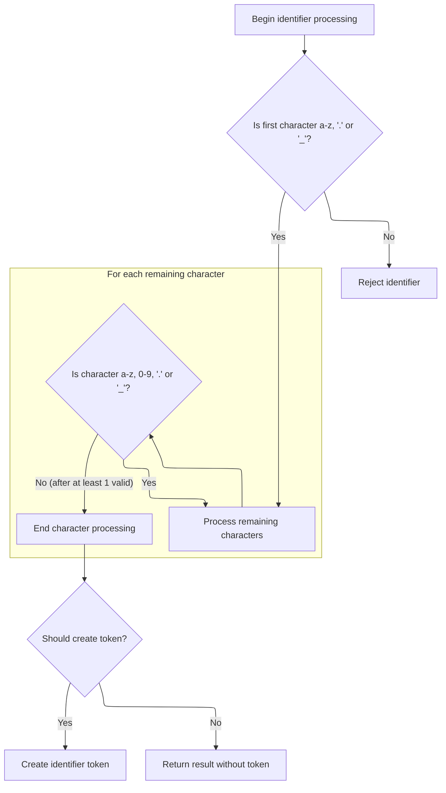
```mermaid
%%{init: {"flowchart": {"defaultRenderer": "elk"}} }%%
flowchart TD
    node1["Begin identifier processing"] --> node2{"Is first character a-z, '.' or '_'?"}
    click node1 openCode "core/src/main/java/org/apache/struts/validator/validwhen/ValidWhenLexer.java:629:634"
    node2 -->|"Yes"| node3["Process remaining characters"]
    click node2 openCode "core/src/main/java/org/apache/struts/validator/validwhen/ValidWhenLexer.java:635:646"
    node2 -->|"No"| node4["Reject identifier"]
    click node4 openCode "core/src/main/java/org/apache/struts/validator/validwhen/ValidWhenLexer.java:657:660"
    
    subgraph loop1["For each remaining character"]
        node3 --> node5{"Is character a-z, 0-9, '.' or '_'?"}
        click node5 openCode "core/src/main/java/org/apache/struts/validator/validwhen/ValidWhenLexer.java:667:695"
        node5 -->|"Yes"| node3
        node5 -->|"No (after at least 1 valid)"| node6["End character processing"]
        click node6 openCode "core/src/main/java/org/apache/struts/validator/validwhen/ValidWhenLexer.java:698:702"
    end
    node6 --> node7{"Should create token?"}
    click node7 openCode "core/src/main/java/org/apache/struts/validator/validwhen/ValidWhenLexer.java:704:707"
    node7 -->|"Yes"| node8["Create identifier token"]
    click node8 openCode "core/src/main/java/org/apache/struts/validator/validwhen/ValidWhenLexer.java:705:706"
    node7 -->|"No"| node9["Return result without token"]
    click node9 openCode "core/src/main/java/org/apache/struts/validator/validwhen/ValidWhenLexer.java:708:709"

classDef HeadingStyle fill:#777777,stroke:#333,stroke-width:2px;

%% Swimm:
%% %%{init: {"flowchart": {"defaultRenderer": "elk"}} }%%
%% flowchart TD
%%     node1["Begin identifier processing"] --> node2{"Is first character a-z, '.' or '_'?"}
%%     click node1 openCode "<SwmPath>[core/…/validwhen/ValidWhenLexer.java](core/src/main/java/org/apache/struts/validator/validwhen/ValidWhenLexer.java)</SwmPath>:629:634"
%%     node2 -->|"Yes"| node3["Process remaining characters"]
%%     click node2 openCode "<SwmPath>[core/…/validwhen/ValidWhenLexer.java](core/src/main/java/org/apache/struts/validator/validwhen/ValidWhenLexer.java)</SwmPath>:635:646"
%%     node2 -->|"No"| node4["Reject identifier"]
%%     click node4 openCode "<SwmPath>[core/…/validwhen/ValidWhenLexer.java](core/src/main/java/org/apache/struts/validator/validwhen/ValidWhenLexer.java)</SwmPath>:657:660"
%%     
%%     subgraph loop1["For each remaining character"]
%%         node3 --> node5{"Is character a-z, 0-9, '.' or '_'?"}
%%         click node5 openCode "<SwmPath>[core/…/validwhen/ValidWhenLexer.java](core/src/main/java/org/apache/struts/validator/validwhen/ValidWhenLexer.java)</SwmPath>:667:695"
%%         node5 -->|"Yes"| node3
%%         node5 -->|"No (after at least 1 valid)"| node6["End character processing"]
%%         click node6 openCode "<SwmPath>[core/…/validwhen/ValidWhenLexer.java](core/src/main/java/org/apache/struts/validator/validwhen/ValidWhenLexer.java)</SwmPath>:698:702"
%%     end
%%     node6 --> node7{"Should create token?"}
%%     click node7 openCode "<SwmPath>[core/…/validwhen/ValidWhenLexer.java](core/src/main/java/org/apache/struts/validator/validwhen/ValidWhenLexer.java)</SwmPath>:704:707"
%%     node7 -->|"Yes"| node8["Create identifier token"]
%%     click node8 openCode "<SwmPath>[core/…/validwhen/ValidWhenLexer.java](core/src/main/java/org/apache/struts/validator/validwhen/ValidWhenLexer.java)</SwmPath>:705:706"
%%     node7 -->|"No"| node9["Return result without token"]
%%     click node9 openCode "<SwmPath>[core/…/validwhen/ValidWhenLexer.java](core/src/main/java/org/apache/struts/validator/validwhen/ValidWhenLexer.java)</SwmPath>:708:709"
%% 
%% classDef HeadingStyle fill:#777777,stroke:#333,stroke-width:2px;
```

<SwmSnippet path="/core/src/main/java/org/apache/struts/validator/validwhen/ValidWhenLexer.java" line="629">

---

In <SwmToken path="core/src/main/java/org/apache/struts/validator/validwhen/ValidWhenLexer.java" pos="629:7:7" line-data="	public final void mIDENTIFIER(boolean _createToken) throws RecognitionException, CharStreamException, TokenStreamException {">`mIDENTIFIER`</SwmToken>, we're matching field names or variable names. Identifiers can start with a lowercase letter, dot, or underscore, and can include digits, dots, or underscores after that. This is less restrictive than most languages because dots are allowed, which supports referencing nested properties. After matching, we call ActionConfigMatcher so the parser can handle any config patterns that might relate to the identifier.

```java
	public final void mIDENTIFIER(boolean _createToken) throws RecognitionException, CharStreamException, TokenStreamException {
		int _ttype; Token _token=null; int _begin=text.length();
		_ttype = IDENTIFIER;
		int _saveIndex;
		
		{
		switch ( LA(1)) {
		case 'a':  case 'b':  case 'c':  case 'd':
		case 'e':  case 'f':  case 'g':  case 'h':
		case 'i':  case 'j':  case 'k':  case 'l':
		case 'm':  case 'n':  case 'o':  case 'p':
		case 'q':  case 'r':  case 's':  case 't':
		case 'u':  case 'v':  case 'w':  case 'x':
		case 'y':  case 'z':
		{
			matchRange('a','z');
			break;
		}
		case '.':
		{
			match('.');
			break;
		}
		case '_':
		{
			match('_');
			break;
		}
		default:
		{
			throw new NoViableAltForCharException((char)LA(1), getFilename(), getLine(), getColumn());
		}
		}
		}
		{
		int _cnt62=0;
		_loop62:
		do {
			switch ( LA(1)) {
			case 'a':  case 'b':  case 'c':  case 'd':
			case 'e':  case 'f':  case 'g':  case 'h':
			case 'i':  case 'j':  case 'k':  case 'l':
			case 'm':  case 'n':  case 'o':  case 'p':
			case 'q':  case 'r':  case 's':  case 't':
			case 'u':  case 'v':  case 'w':  case 'x':
			case 'y':  case 'z':
			{
				matchRange('a','z');
				break;
			}
			case '0':  case '1':  case '2':  case '3':
			case '4':  case '5':  case '6':  case '7':
			case '8':  case '9':
			{
				matchRange('0','9');
				break;
			}
			case '.':
			{
				match('.');
				break;
			}
			case '_':
			{
				match('_');
				break;
			}
			default:
			{
				if ( _cnt62>=1 ) { break _loop62; } else {throw new NoViableAltForCharException((char)LA(1), getFilename(), getLine(), getColumn());}
			}
			}
			_cnt62++;
		} while (true);
		}
```

---

</SwmSnippet>

<SwmSnippet path="/core/src/main/java/org/apache/struts/validator/validwhen/ValidWhenLexer.java" line="704">

---

Back in `ValidWhenLexer.mIDENTIFIER`, after returning from ActionConfigMatcher, we finalize the identifier token and return it. If the identifier was malformed, an exception would have already been thrown, so only valid identifiers get tokenized.

```java
		if ( _createToken && _token==null && _ttype!=Token.SKIP ) {
			_token = makeToken(_ttype);
			_token.setText(new String(text.getBuffer(), _begin, text.length()-_begin));
		}
		_returnToken = _token;
	}
```

---

</SwmSnippet>

### Handling Equality Operator

<SwmSnippet path="/core/src/main/java/org/apache/struts/validator/validwhen/ValidWhenLexer.java" line="147">

---

After returning from `ValidWhenLexer.mIDENTIFIER`, the lexer checks if the next input is '=='. If so, it calls <SwmToken path="core/src/main/java/org/apache/struts/validator/validwhen/ValidWhenLexer.java" pos="149:1:1" line-data="					mEQUALSIGN(true);">`mEQUALSIGN`</SwmToken> to tokenize the equality operator, which is needed for comparison expressions.

```java
				case '=':
				{
					mEQUALSIGN(true);
					theRetToken=_returnToken;
					break;
				}
```

---

</SwmSnippet>

### Parsing Equality Operator

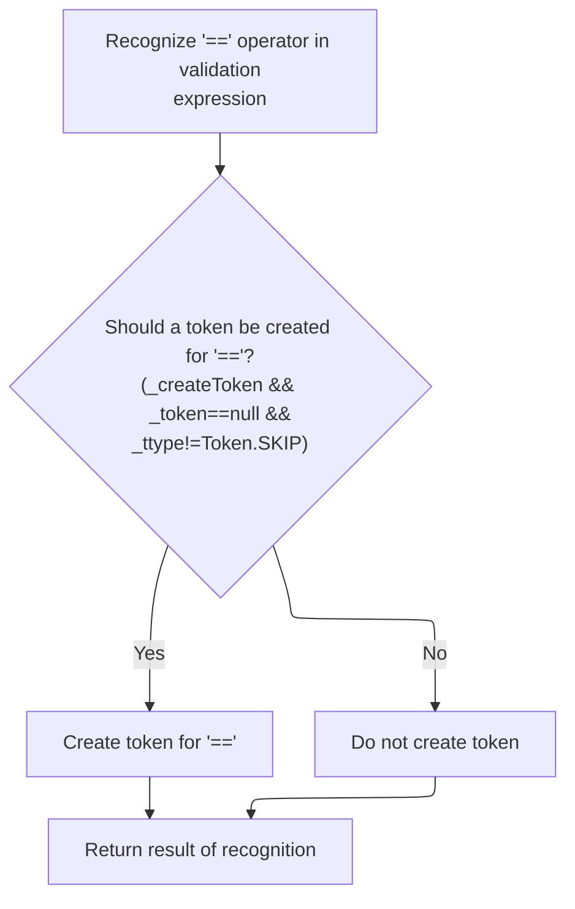
```mermaid
%%{init: {"flowchart": {"defaultRenderer": "elk"}} }%%
flowchart TD
    node1["Recognize '==' operator in validation
expression"]
    click node1 openCode "core/src/main/java/org/apache/struts/validator/validwhen/ValidWhenLexer.java:711:717"
    node1 --> node2{"Should a token be created for '=='?
(_createToken && _token==null &&
_ttype!=Token.SKIP)"}
    click node2 openCode "core/src/main/java/org/apache/struts/validator/validwhen/ValidWhenLexer.java:718:721"
    node2 -->|"Yes"| node3["Create token for '=='"]
    click node3 openCode "core/src/main/java/org/apache/struts/validator/validwhen/ValidWhenLexer.java:719:720"
    node2 -->|"No"| node4["Do not create token"]
    click node4 openCode "core/src/main/java/org/apache/struts/validator/validwhen/ValidWhenLexer.java:721:721"
    node3 --> node5["Return result of recognition"]
    click node5 openCode "core/src/main/java/org/apache/struts/validator/validwhen/ValidWhenLexer.java:722:723"
    node4 --> node5
classDef HeadingStyle fill:#777777,stroke:#333,stroke-width:2px;

%% Swimm:
%% %%{init: {"flowchart": {"defaultRenderer": "elk"}} }%%
%% flowchart TD
%%     node1["Recognize '==' operator in validation
%% expression"]
%%     click node1 openCode "<SwmPath>[core/…/validwhen/ValidWhenLexer.java](core/src/main/java/org/apache/struts/validator/validwhen/ValidWhenLexer.java)</SwmPath>:711:717"
%%     node1 --> node2{"Should a token be created for '=='?
%% (<SwmToken path="core/src/main/java/org/apache/struts/validator/validwhen/ValidWhenLexer.java" pos="250:11:11" line-data="	public final void mDECIMAL_LITERAL(boolean _createToken) throws RecognitionException, CharStreamException, TokenStreamException {">`_createToken`</SwmToken> && _token==null &&
%% _ttype!=<SwmToken path="core/src/main/java/org/apache/struts/validator/validwhen/ValidWhenLexer.java" pos="495:17:19" line-data="				if ( _createToken &amp;&amp; _token==null &amp;&amp; _ttype!=Token.SKIP ) {">`Token.SKIP`</SwmToken>)"}
%%     click node2 openCode "<SwmPath>[core/…/validwhen/ValidWhenLexer.java](core/src/main/java/org/apache/struts/validator/validwhen/ValidWhenLexer.java)</SwmPath>:718:721"
%%     node2 -->|"Yes"| node3["Create token for '=='"]
%%     click node3 openCode "<SwmPath>[core/…/validwhen/ValidWhenLexer.java](core/src/main/java/org/apache/struts/validator/validwhen/ValidWhenLexer.java)</SwmPath>:719:720"
%%     node2 -->|"No"| node4["Do not create token"]
%%     click node4 openCode "<SwmPath>[core/…/validwhen/ValidWhenLexer.java](core/src/main/java/org/apache/struts/validator/validwhen/ValidWhenLexer.java)</SwmPath>:721:721"
%%     node3 --> node5["Return result of recognition"]
%%     click node5 openCode "<SwmPath>[core/…/validwhen/ValidWhenLexer.java](core/src/main/java/org/apache/struts/validator/validwhen/ValidWhenLexer.java)</SwmPath>:722:723"
%%     node4 --> node5
%% classDef HeadingStyle fill:#777777,stroke:#333,stroke-width:2px;
```

<SwmSnippet path="/core/src/main/java/org/apache/struts/validator/validwhen/ValidWhenLexer.java" line="711">

---

In <SwmToken path="core/src/main/java/org/apache/struts/validator/validwhen/ValidWhenLexer.java" pos="711:7:7" line-data="	public final void mEQUALSIGN(boolean _createToken) throws RecognitionException, CharStreamException, TokenStreamException {">`mEQUALSIGN`</SwmToken>, we're matching two '=' characters to recognize the equality operator. After this, we call ActionConfigMatcher so the parser can handle any config patterns that might be affected by this operator.

```java
	public final void mEQUALSIGN(boolean _createToken) throws RecognitionException, CharStreamException, TokenStreamException {
		int _ttype; Token _token=null; int _begin=text.length();
		_ttype = EQUALSIGN;
		int _saveIndex;
		
		match('=');
		match('=');
```

---

</SwmSnippet>

<SwmSnippet path="/core/src/main/java/org/apache/struts/validator/validwhen/ValidWhenLexer.java" line="718">

---

Back in `ValidWhenLexer.mEQUALSIGN`, after returning from ActionConfigMatcher, we finalize the equality operator token and return it. This lets the parser know the comparison operator was handled.

```java
		if ( _createToken && _token==null && _ttype!=Token.SKIP ) {
			_token = makeToken(_ttype);
			_token.setText(new String(text.getBuffer(), _begin, text.length()-_begin));
		}
		_returnToken = _token;
	}
```

---

</SwmSnippet>

### Handling Not-Equal Operator

<SwmSnippet path="/core/src/main/java/org/apache/struts/validator/validwhen/ValidWhenLexer.java" line="153">

---

After returning from `ValidWhenLexer.mEQUALSIGN`, the lexer checks if the next input is '!='. If so, it calls <SwmToken path="core/src/main/java/org/apache/struts/validator/validwhen/ValidWhenLexer.java" pos="155:1:1" line-data="					mNOTEQUALSIGN(true);">`mNOTEQUALSIGN`</SwmToken> to tokenize the not-equal operator, which is needed for inequality checks.

```java
				case '!':
				{
					mNOTEQUALSIGN(true);
					theRetToken=_returnToken;
					break;
				}
```

---

</SwmSnippet>

### Parsing Not-Equal Operator

<SwmSnippet path="/core/src/main/java/org/apache/struts/validator/validwhen/ValidWhenLexer.java" line="725">

---

In <SwmToken path="core/src/main/java/org/apache/struts/validator/validwhen/ValidWhenLexer.java" pos="725:7:7" line-data="	public final void mNOTEQUALSIGN(boolean _createToken) throws RecognitionException, CharStreamException, TokenStreamException {">`mNOTEQUALSIGN`</SwmToken>, we're matching '!' followed by '=' to recognize the not-equal operator. After this, we call ActionConfigMatcher so the parser can handle any config patterns that might be affected by this operator.

```java
	public final void mNOTEQUALSIGN(boolean _createToken) throws RecognitionException, CharStreamException, TokenStreamException {
		int _ttype; Token _token=null; int _begin=text.length();
		_ttype = NOTEQUALSIGN;
		int _saveIndex;
		
		match('!');
		match('=');
```

---

</SwmSnippet>

<SwmSnippet path="/core/src/main/java/org/apache/struts/validator/validwhen/ValidWhenLexer.java" line="732">

---

Back in `ValidWhenLexer.mNOTEQUALSIGN`, after returning from ActionConfigMatcher, we finalize the not-equal operator token and return it. This lets the parser know the inequality operator was handled.

```java
		if ( _createToken && _token==null && _ttype!=Token.SKIP ) {
			_token = makeToken(_ttype);
			_token.setText(new String(text.getBuffer(), _begin, text.length()-_begin));
		}
		_returnToken = _token;
	}
```

---

</SwmSnippet>

### Handling Less-Than and Greater-Than Operators

<SwmSnippet path="/core/src/main/java/org/apache/struts/validator/validwhen/ValidWhenLexer.java" line="159">

---

After returning from `ValidWhenLexer.mNOTEQUALSIGN`, the lexer checks if the next input is '<=' or '>='. If so, it calls <SwmToken path="core/src/main/java/org/apache/struts/validator/validwhen/ValidWhenLexer.java" pos="161:1:1" line-data="						mLESSEQUALSIGN(true);">`mLESSEQUALSIGN`</SwmToken> or <SwmToken path="core/src/main/java/org/apache/struts/validator/validwhen/ValidWhenLexer.java" pos="165:1:1" line-data="						mGREATEREQUALSIGN(true);">`mGREATEREQUALSIGN`</SwmToken> to tokenize the correct comparison operator. This is how the lexer handles both single and double character operators.

```java
				default:
					if ((LA(1)=='<') && (LA(2)=='=')) {
						mLESSEQUALSIGN(true);
```

---

</SwmSnippet>

### Parsing Less-Than-Or-Equal Operator

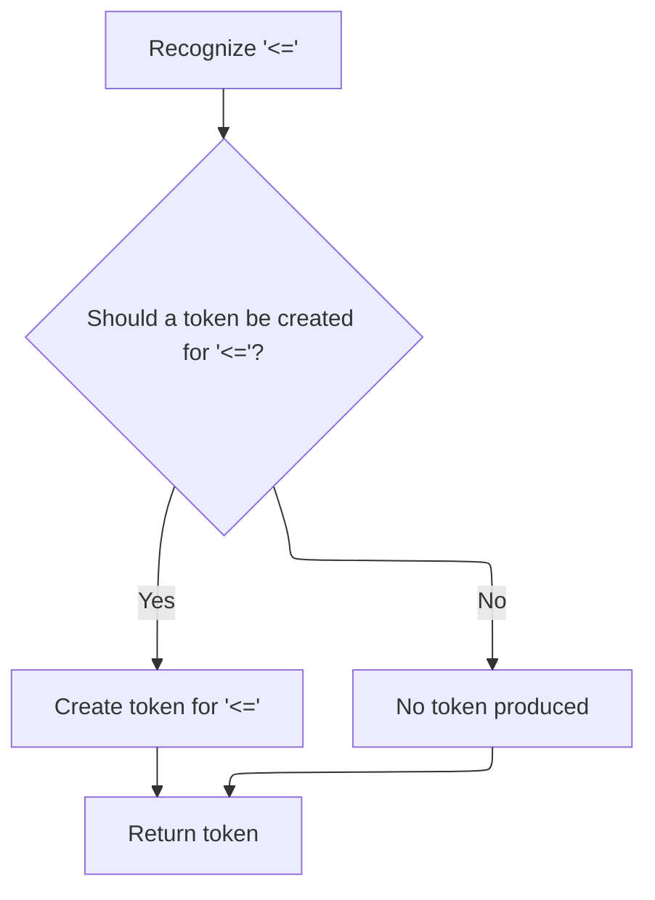
```mermaid
%%{init: {"flowchart": {"defaultRenderer": "elk"}} }%%
flowchart TD
  node1["Recognize '<='"] --> node2{"Should a token be created for '<='?"}
  click node1 openCode "core/src/main/java/org/apache/struts/validator/validwhen/ValidWhenLexer.java:770:771"
  node2 -->|"Yes"| node3["Create token for '<='"]
  click node2 openCode "core/src/main/java/org/apache/struts/validator/validwhen/ValidWhenLexer.java:772:775"
  node2 -->|"No"| node4["No token produced"]
  click node3 openCode "core/src/main/java/org/apache/struts/validator/validwhen/ValidWhenLexer.java:773:774"
  click node4 openCode "core/src/main/java/org/apache/struts/validator/validwhen/ValidWhenLexer.java:772:775"
  node3 --> node5["Return token"]
  node4 --> node5["Return token"]
  click node5 openCode "core/src/main/java/org/apache/struts/validator/validwhen/ValidWhenLexer.java:776:777"

classDef HeadingStyle fill:#777777,stroke:#333,stroke-width:2px;

%% Swimm:
%% %%{init: {"flowchart": {"defaultRenderer": "elk"}} }%%
%% flowchart TD
%%   node1["Recognize '<='"] --> node2{"Should a token be created for '<='?"}
%%   click node1 openCode "<SwmPath>[core/…/validwhen/ValidWhenLexer.java](core/src/main/java/org/apache/struts/validator/validwhen/ValidWhenLexer.java)</SwmPath>:770:771"
%%   node2 -->|"Yes"| node3["Create token for '<='"]
%%   click node2 openCode "<SwmPath>[core/…/validwhen/ValidWhenLexer.java](core/src/main/java/org/apache/struts/validator/validwhen/ValidWhenLexer.java)</SwmPath>:772:775"
%%   node2 -->|"No"| node4["No token produced"]
%%   click node3 openCode "<SwmPath>[core/…/validwhen/ValidWhenLexer.java](core/src/main/java/org/apache/struts/validator/validwhen/ValidWhenLexer.java)</SwmPath>:773:774"
%%   click node4 openCode "<SwmPath>[core/…/validwhen/ValidWhenLexer.java](core/src/main/java/org/apache/struts/validator/validwhen/ValidWhenLexer.java)</SwmPath>:772:775"
%%   node3 --> node5["Return token"]
%%   node4 --> node5["Return token"]
%%   click node5 openCode "<SwmPath>[core/…/validwhen/ValidWhenLexer.java](core/src/main/java/org/apache/struts/validator/validwhen/ValidWhenLexer.java)</SwmPath>:776:777"
%% 
%% classDef HeadingStyle fill:#777777,stroke:#333,stroke-width:2px;
```

<SwmSnippet path="/core/src/main/java/org/apache/struts/validator/validwhen/ValidWhenLexer.java" line="765">

---

In <SwmToken path="core/src/main/java/org/apache/struts/validator/validwhen/ValidWhenLexer.java" pos="765:7:7" line-data="	public final void mLESSEQUALSIGN(boolean _createToken) throws RecognitionException, CharStreamException, TokenStreamException {">`mLESSEQUALSIGN`</SwmToken>, we're matching '<' followed by '=' to recognize the less-than-or-equal operator. After this, we call ActionConfigMatcher so the parser can handle any config patterns that might be affected by this operator.

```java
	public final void mLESSEQUALSIGN(boolean _createToken) throws RecognitionException, CharStreamException, TokenStreamException {
		int _ttype; Token _token=null; int _begin=text.length();
		_ttype = LESSEQUALSIGN;
		int _saveIndex;
		
		match('<');
		match('=');
```

---

</SwmSnippet>

<SwmSnippet path="/core/src/main/java/org/apache/struts/validator/validwhen/ValidWhenLexer.java" line="772">

---

Back in `ValidWhenLexer.mLESSEQUALSIGN`, after returning from ActionConfigMatcher, we finalize the less-than-or-equal operator token and return it. This lets the parser know the comparison operator was handled.

```java
		if ( _createToken && _token==null && _ttype!=Token.SKIP ) {
			_token = makeToken(_ttype);
			_token.setText(new String(text.getBuffer(), _begin, text.length()-_begin));
		}
		_returnToken = _token;
	}
```

---

</SwmSnippet>

### Handling Remaining Comparison Operators

<SwmSnippet path="/core/src/main/java/org/apache/struts/validator/validwhen/ValidWhenLexer.java" line="162">

---

After returning from `ValidWhenLexer.mLESSEQUALSIGN`, the lexer checks if the next input is '>' or '<'. If so, it calls <SwmToken path="core/src/main/java/org/apache/struts/validator/validwhen/ValidWhenLexer.java" pos="165:1:1" line-data="						mGREATEREQUALSIGN(true);">`mGREATEREQUALSIGN`</SwmToken> or <SwmToken path="core/src/main/java/org/apache/struts/validator/validwhen/ValidWhenLexer.java" pos="169:1:1" line-data="						mLESSTHANSIGN(true);">`mLESSTHANSIGN`</SwmToken> as needed. This covers all remaining comparison operators in the input.

```java
						theRetToken=_returnToken;
					}
					else if ((LA(1)=='>') && (LA(2)=='=')) {
						mGREATEREQUALSIGN(true);
```

---

</SwmSnippet>

### Parsing Greater-Than-Or-Equal Operator

<SwmSnippet path="/core/src/main/java/org/apache/struts/validator/validwhen/ValidWhenLexer.java" line="779">

---

In <SwmToken path="core/src/main/java/org/apache/struts/validator/validwhen/ValidWhenLexer.java" pos="779:7:7" line-data="	public final void mGREATEREQUALSIGN(boolean _createToken) throws RecognitionException, CharStreamException, TokenStreamException {">`mGREATEREQUALSIGN`</SwmToken>, we're matching '>' followed by '=' to recognize the greater-than-or-equal operator. After this, we call ActionConfigMatcher so the parser can handle any config patterns that might be affected by this operator.

```java
	public final void mGREATEREQUALSIGN(boolean _createToken) throws RecognitionException, CharStreamException, TokenStreamException {
		int _ttype; Token _token=null; int _begin=text.length();
		_ttype = GREATEREQUALSIGN;
		int _saveIndex;
		
		match('>');
		match('=');
```

---

</SwmSnippet>

<SwmSnippet path="/core/src/main/java/org/apache/struts/validator/validwhen/ValidWhenLexer.java" line="786">

---

Back in `ValidWhenLexer.mGREATEREQUALSIGN`, after returning from ActionConfigMatcher, we finalize the greater-than-or-equal operator token and return it. This lets the parser know the comparison operator was handled.

```java
		if ( _createToken && _token==null && _ttype!=Token.SKIP ) {
			_token = makeToken(_ttype);
			_token.setText(new String(text.getBuffer(), _begin, text.length()-_begin));
		}
		_returnToken = _token;
	}
```

---

</SwmSnippet>

### Handling Single-Character Comparison Operators

<SwmSnippet path="/core/src/main/java/org/apache/struts/validator/validwhen/ValidWhenLexer.java" line="166">

---

After returning from `ValidWhenLexer.mGREATEREQUALSIGN`, the lexer checks if the next input is a single '<' or '>'. If so, it calls <SwmToken path="core/src/main/java/org/apache/struts/validator/validwhen/ValidWhenLexer.java" pos="169:1:1" line-data="						mLESSTHANSIGN(true);">`mLESSTHANSIGN`</SwmToken> or <SwmToken path="core/src/main/java/org/apache/struts/validator/validwhen/ValidWhenLexer.java" pos="173:1:1" line-data="						mGREATERTHANSIGN(true);">`mGREATERTHANSIGN`</SwmToken> to tokenize the operator. If the input is EOF, it creates an EOF token; otherwise, it throws an exception for unknown input.

```java
						theRetToken=_returnToken;
					}
					else if ((LA(1)=='<') && (true)) {
						mLESSTHANSIGN(true);
```

---

</SwmSnippet>

### Parsing Less-Than Operator

<SwmSnippet path="/core/src/main/java/org/apache/struts/validator/validwhen/ValidWhenLexer.java" line="739">

---

In <SwmToken path="core/src/main/java/org/apache/struts/validator/validwhen/ValidWhenLexer.java" pos="739:7:7" line-data="	public final void mLESSTHANSIGN(boolean _createToken) throws RecognitionException, CharStreamException, TokenStreamException {">`mLESSTHANSIGN`</SwmToken>, we're matching a single '<' character to recognize the less-than operator. After this, we call ActionConfigMatcher so the parser can handle any config patterns that might be affected by this operator.

```java
	public final void mLESSTHANSIGN(boolean _createToken) throws RecognitionException, CharStreamException, TokenStreamException {
		int _ttype; Token _token=null; int _begin=text.length();
		_ttype = LESSTHANSIGN;
		int _saveIndex;
		
		match('<');
```

---

</SwmSnippet>

<SwmSnippet path="/core/src/main/java/org/apache/struts/validator/validwhen/ValidWhenLexer.java" line="745">

---

Back in `ValidWhenLexer.mLESSTHANSIGN`, after returning from ActionConfigMatcher, we finalize the less-than operator token and return it. This lets the parser know the comparison operator was handled.

```java
		if ( _createToken && _token==null && _ttype!=Token.SKIP ) {
			_token = makeToken(_ttype);
			_token.setText(new String(text.getBuffer(), _begin, text.length()-_begin));
		}
		_returnToken = _token;
	}
```

---

</SwmSnippet>

### Finishing Tokenization

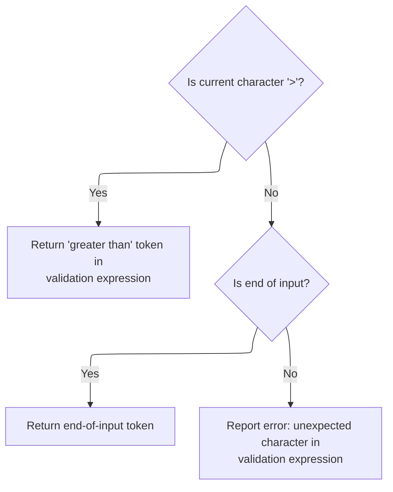
```mermaid
%%{init: {"flowchart": {"defaultRenderer": "elk"}} }%%
flowchart TD
  node1{"Is current character '>'?"}
  click node1 openCode "core/src/main/java/org/apache/struts/validator/validwhen/ValidWhenLexer.java:172:175"
  node1 -->|"Yes"| node2["Return 'greater than' token in
validation expression"]
  click node2 openCode "core/src/main/java/org/apache/struts/validator/validwhen/ValidWhenLexer.java:173:174"
  node1 -->|"No"| node3{"Is end of input?"}
  click node3 openCode "core/src/main/java/org/apache/struts/validator/validwhen/ValidWhenLexer.java:176:179"
  node3 -->|"Yes"| node4["Return end-of-input token"]
  click node4 openCode "core/src/main/java/org/apache/struts/validator/validwhen/ValidWhenLexer.java:177:177"
  node3 -->|"No"| node5["Report error: unexpected character in
validation expression"]
  click node5 openCode "core/src/main/java/org/apache/struts/validator/validwhen/ValidWhenLexer.java:178:178"

classDef HeadingStyle fill:#777777,stroke:#333,stroke-width:2px;

%% Swimm:
%% %%{init: {"flowchart": {"defaultRenderer": "elk"}} }%%
%% flowchart TD
%%   node1{"Is current character '>'?"}
%%   click node1 openCode "<SwmPath>[core/…/validwhen/ValidWhenLexer.java](core/src/main/java/org/apache/struts/validator/validwhen/ValidWhenLexer.java)</SwmPath>:172:175"
%%   node1 -->|"Yes"| node2["Return 'greater than' token in
%% validation expression"]
%%   click node2 openCode "<SwmPath>[core/…/validwhen/ValidWhenLexer.java](core/src/main/java/org/apache/struts/validator/validwhen/ValidWhenLexer.java)</SwmPath>:173:174"
%%   node1 -->|"No"| node3{"Is end of input?"}
%%   click node3 openCode "<SwmPath>[core/…/validwhen/ValidWhenLexer.java](core/src/main/java/org/apache/struts/validator/validwhen/ValidWhenLexer.java)</SwmPath>:176:179"
%%   node3 -->|"Yes"| node4["Return end-of-input token"]
%%   click node4 openCode "<SwmPath>[core/…/validwhen/ValidWhenLexer.java](core/src/main/java/org/apache/struts/validator/validwhen/ValidWhenLexer.java)</SwmPath>:177:177"
%%   node3 -->|"No"| node5["Report error: unexpected character in
%% validation expression"]
%%   click node5 openCode "<SwmPath>[core/…/validwhen/ValidWhenLexer.java](core/src/main/java/org/apache/struts/validator/validwhen/ValidWhenLexer.java)</SwmPath>:178:178"
%% 
%% classDef HeadingStyle fill:#777777,stroke:#333,stroke-width:2px;
```

<SwmSnippet path="/core/src/main/java/org/apache/struts/validator/validwhen/ValidWhenLexer.java" line="170">

---

After returning from `ValidWhenLexer.mLESSTHANSIGN`, the lexer checks if the next input is a single '>' or if it's the end of input. If it's '>', it calls <SwmToken path="core/src/main/java/org/apache/struts/validator/validwhen/ValidWhenLexer.java" pos="173:1:1" line-data="						mGREATERTHANSIGN(true);">`mGREATERTHANSIGN`</SwmToken> to tokenize it. If it's EOF, it creates an EOF token; otherwise, it throws an exception for unknown input.

```java
						theRetToken=_returnToken;
					}
					else if ((LA(1)=='>') && (true)) {
						mGREATERTHANSIGN(true);
						theRetToken=_returnToken;
					}
				else {
					if (LA(1)==EOF_CHAR) {uponEOF(); _returnToken = makeToken(Token.EOF_TYPE);}
				else {throw new NoViableAltForCharException((char)LA(1), getFilename(), getLine(), getColumn());}
				}
				}
```

---

</SwmSnippet>

### Tokenizing the Greater-Than Operator

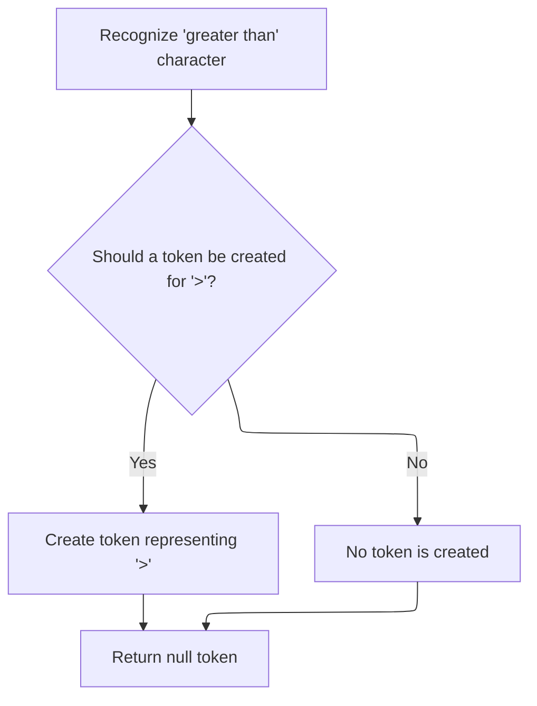
```mermaid
%%{init: {"flowchart": {"defaultRenderer": "elk"}} }%%
flowchart TD
    node1["Recognize 'greater than' character"] --> node2{"Should a token be created for '>'?"}
    click node1 openCode "core/src/main/java/org/apache/struts/validator/validwhen/ValidWhenLexer.java:757:757"
    node2 -->|"Yes"| node3["Create token representing '>'"]
    click node2 openCode "core/src/main/java/org/apache/struts/validator/validwhen/ValidWhenLexer.java:758:761"
    node2 -->|"No"| node4["No token is created"]
    node3 --> node5["Return token (for '>')"]
    click node3 openCode "core/src/main/java/org/apache/struts/validator/validwhen/ValidWhenLexer.java:759:760"
    node4 --> node5["Return null token"]
    click node4 openCode "core/src/main/java/org/apache/struts/validator/validwhen/ValidWhenLexer.java:758:761"
    click node5 openCode "core/src/main/java/org/apache/struts/validator/validwhen/ValidWhenLexer.java:762:763"
classDef HeadingStyle fill:#777777,stroke:#333,stroke-width:2px;

%% Swimm:
%% %%{init: {"flowchart": {"defaultRenderer": "elk"}} }%%
%% flowchart TD
%%     node1["Recognize 'greater than' character"] --> node2{"Should a token be created for '>'?"}
%%     click node1 openCode "<SwmPath>[core/…/validwhen/ValidWhenLexer.java](core/src/main/java/org/apache/struts/validator/validwhen/ValidWhenLexer.java)</SwmPath>:757:757"
%%     node2 -->|"Yes"| node3["Create token representing '>'"]
%%     click node2 openCode "<SwmPath>[core/…/validwhen/ValidWhenLexer.java](core/src/main/java/org/apache/struts/validator/validwhen/ValidWhenLexer.java)</SwmPath>:758:761"
%%     node2 -->|"No"| node4["No token is created"]
%%     node3 --> node5["Return token (for '>')"]
%%     click node3 openCode "<SwmPath>[core/…/validwhen/ValidWhenLexer.java](core/src/main/java/org/apache/struts/validator/validwhen/ValidWhenLexer.java)</SwmPath>:759:760"
%%     node4 --> node5["Return null token"]
%%     click node4 openCode "<SwmPath>[core/…/validwhen/ValidWhenLexer.java](core/src/main/java/org/apache/struts/validator/validwhen/ValidWhenLexer.java)</SwmPath>:758:761"
%%     click node5 openCode "<SwmPath>[core/…/validwhen/ValidWhenLexer.java](core/src/main/java/org/apache/struts/validator/validwhen/ValidWhenLexer.java)</SwmPath>:762:763"
%% classDef HeadingStyle fill:#777777,stroke:#333,stroke-width:2px;
```

<SwmSnippet path="/core/src/main/java/org/apache/struts/validator/validwhen/ValidWhenLexer.java" line="752">

---

In <SwmToken path="core/src/main/java/org/apache/struts/validator/validwhen/ValidWhenLexer.java" pos="752:7:7" line-data="	public final void mGREATERTHANSIGN(boolean _createToken) throws RecognitionException, CharStreamException, TokenStreamException {">`mGREATERTHANSIGN`</SwmToken>, we're matching the '>' character and setting up the token type for the greater-than operator. After this, we need to call ActionConfigMatcher so the parser can handle any action config patterns that might be triggered by this operator.

```java
	public final void mGREATERTHANSIGN(boolean _createToken) throws RecognitionException, CharStreamException, TokenStreamException {
		int _ttype; Token _token=null; int _begin=text.length();
		_ttype = GREATERTHANSIGN;
		int _saveIndex;
		
		match('>');
```

---

</SwmSnippet>

<SwmSnippet path="/core/src/main/java/org/apache/struts/validator/validwhen/ValidWhenLexer.java" line="758">

---

Back in `ValidWhenLexer.mGREATERTHANSIGN`, after returning from ActionConfigMatcher, we finalize the greater-than operator token and return it. If the token type is SKIP, we don't create a token, so only valid tokens get passed to the parser.

```java
		if ( _createToken && _token==null && _ttype!=Token.SKIP ) {
			_token = makeToken(_ttype);
			_token.setText(new String(text.getBuffer(), _begin, text.length()-_begin));
		}
		_returnToken = _token;
	}
```

---

</SwmSnippet>

### Finalizing Token and Returning to the Parser

<SwmSnippet path="/core/src/main/java/org/apache/struts/validator/validwhen/ValidWhenLexer.java" line="181">

---

After returning from `ValidWhenLexer.mGREATERTHANSIGN`, the <SwmToken path="core/src/main/java/org/apache/struts/action/DynaActionForm.java" pos="171:9:9" line-data="                    String token = st.nextToken();">`nextToken`</SwmToken> function checks for SKIP tokens, updates the token type using <SwmToken path="core/src/main/java/org/apache/struts/validator/validwhen/ValidWhenLexer.java" pos="183:5:5" line-data="				_ttype = testLiteralsTable(_ttype);">`testLiteralsTable`</SwmToken>, and returns the finalized token to the parser. If an exception occurs, it's wrapped and thrown as a token stream exception.

```java
				if ( _returnToken==null ) continue tryAgain; // found SKIP token
				_ttype = _returnToken.getType();
				_ttype = testLiteralsTable(_ttype);
				_returnToken.setType(_ttype);
				return _returnToken;
			}
			catch (RecognitionException e) {
				throw new TokenStreamRecognitionException(e);
			}
		}
		catch (CharStreamException cse) {
			if ( cse instanceof CharStreamIOException ) {
				throw new TokenStreamIOException(((CharStreamIOException)cse).io);
			}
			else {
				throw new TokenStreamException(cse.getMessage());
			}
		}
	}
}
```

---

</SwmSnippet>

## Resetting Form Properties Based on Configuration

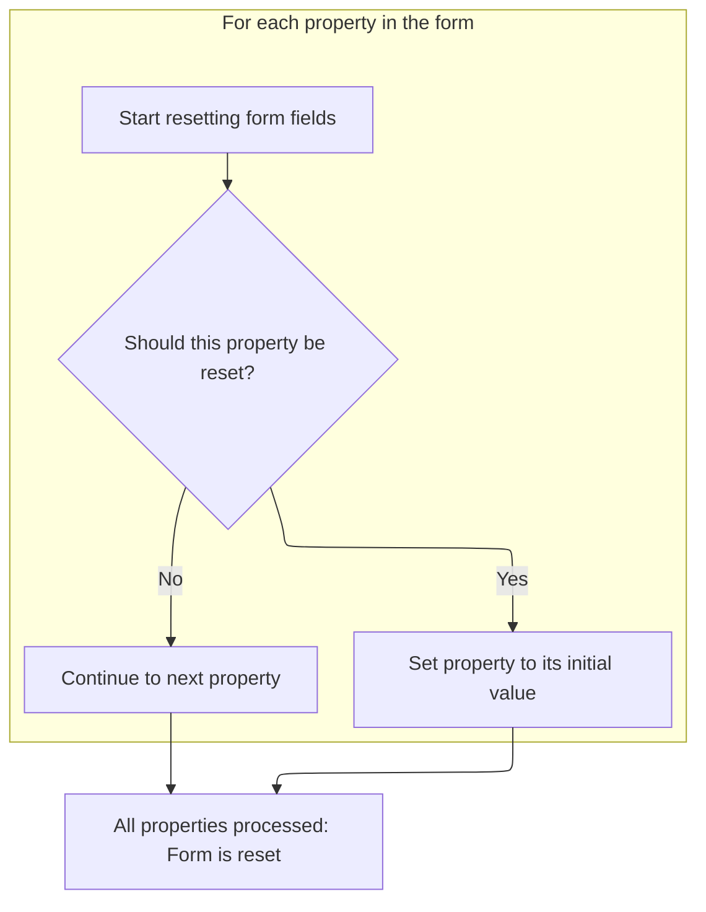
```mermaid
%%{init: {"flowchart": {"defaultRenderer": "elk"}} }%%
flowchart TD
    node1["Start resetting form fields"]
    click node1 openCode "core/src/main/java/org/apache/struts/action/DynaActionForm.java:181:185"
    subgraph loop1["For each property in the form"]
      node1 --> node2{"Should this property be reset?"}
      click node2 openCode "core/src/main/java/org/apache/struts/action/DynaActionForm.java:181:185"
      node2 -->|"Yes"| node3["Set property to its initial value"]
      click node3 openCode "core/src/main/java/org/apache/struts/action/DynaActionForm.java:182:182"
      node2 -->|"No"| node4["Continue to next property"]
      click node4 openCode "core/src/main/java/org/apache/struts/action/DynaActionForm.java:181:185"
    end
    node3 --> node5["All properties processed: Form is reset"]
    node4 --> node5
    click node5 openCode "core/src/main/java/org/apache/struts/action/DynaActionForm.java:185:185"

classDef HeadingStyle fill:#777777,stroke:#333,stroke-width:2px;

%% Swimm:
%% %%{init: {"flowchart": {"defaultRenderer": "elk"}} }%%
%% flowchart TD
%%     node1["Start resetting form fields"]
%%     click node1 openCode "<SwmPath>[core/…/action/DynaActionForm.java](core/src/main/java/org/apache/struts/action/DynaActionForm.java)</SwmPath>:181:185"
%%     subgraph loop1["For each property in the form"]
%%       node1 --> node2{"Should this property be reset?"}
%%       click node2 openCode "<SwmPath>[core/…/action/DynaActionForm.java](core/src/main/java/org/apache/struts/action/DynaActionForm.java)</SwmPath>:181:185"
%%       node2 -->|"Yes"| node3["Set property to its initial value"]
%%       click node3 openCode "<SwmPath>[core/…/action/DynaActionForm.java](core/src/main/java/org/apache/struts/action/DynaActionForm.java)</SwmPath>:182:182"
%%       node2 -->|"No"| node4["Continue to next property"]
%%       click node4 openCode "<SwmPath>[core/…/action/DynaActionForm.java](core/src/main/java/org/apache/struts/action/DynaActionForm.java)</SwmPath>:181:185"
%%     end
%%     node3 --> node5["All properties processed: Form is reset"]
%%     node4 --> node5
%%     click node5 openCode "<SwmPath>[core/…/action/DynaActionForm.java](core/src/main/java/org/apache/struts/action/DynaActionForm.java)</SwmPath>:185:185"
%% 
%% classDef HeadingStyle fill:#777777,stroke:#333,stroke-width:2px;
```

<SwmSnippet path="/core/src/main/java/org/apache/struts/action/DynaActionForm.java" line="181">

---

After returning from `ValidWhenLexer.nextToken`, `DynaActionForm.reset` loops through each property config and checks the reset attribute. If the reset logic says to reset, it sets the property to its initial value using FormPropertyConfig.initial. This is where we need to call <SwmToken path="core/src/main/java/org/apache/struts/action/DynaActionForm.java" pos="152:1:1" line-data="        FormPropertyConfig[] props = config.findFormPropertyConfigs();">`FormPropertyConfig`</SwmToken> to get the initial value for each property.

```java
            if (reset) {
                set(props[i].getName(), props[i].initial());
            }
        }
    }
```

---

</SwmSnippet>

# Determining Initial Property Values

<SwmSnippet path="/core/src/main/java/org/apache/struts/config/FormPropertyConfig.java" line="318">

---

In <SwmToken path="core/src/main/java/org/apache/struts/config/FormPropertyConfig.java" pos="318:5:5" line-data="    public Object initial() {">`initial`</SwmToken>, we're figuring out the initial value for a property. We call <SwmToken path="core/src/main/java/org/apache/struts/config/FormPropertyConfig.java" pos="322:7:7" line-data="            Class clazz = getTypeClass();">`getTypeClass`</SwmToken> first to get the actual Java class, so we know what kind of object or primitive to create for the initial value.

```java
    public Object initial() {
        Object initialValue = null;

        try {
            Class clazz = getTypeClass();

```

---

</SwmSnippet>

## Resolving Property Type Classes


```mermaid
%%{init: {"flowchart": {"defaultRenderer": "elk"}} }%%
flowchart TD
  node1["Check property type (e.g., 'int', 'MyClass', 'int[]')"] --> node2{"Is property defined as an array? (ends
with '[]')"}
  click node1 openCode "core/src/main/java/org/apache/struts/config/FormPropertyConfig.java:223:225"
  node2 -->|"Yes"| node3["Remove '[]', mark as array"]
  click node2 openCode "core/src/main/java/org/apache/struts/config/FormPropertyConfig.java:226:229"
  node2 -->|"No"| node4["Use type as is"]
  click node4 openCode "core/src/main/java/org/apache/struts/config/FormPropertyConfig.java:223:225"
  node3 --> node5{"Is property a standard Java type?
(primitive)"}
  node4 --> node5
  click node5 openCode "core/src/main/java/org/apache/struts/config/FormPropertyConfig.java:234:250"
  node5 -->|"Yes"| node6["Get Java primitive class"]
  click node6 openCode "core/src/main/java/org/apache/struts/config/FormPropertyConfig.java:235:250"
  node5 -->|"No"| node7["Load custom class by name"]
  click node7 openCode "core/src/main/java/org/apache/struts/config/FormPropertyConfig.java:251:264"
  node6 --> node8{"Is property an array?"}
  node7 --> node8
  click node8 openCode "core/src/main/java/org/apache/struts/config/FormPropertyConfig.java:268:272"
  node8 -->|"Yes"| node9["Return array class"]
  click node9 openCode "core/src/main/java/org/apache/struts/config/FormPropertyConfig.java:269:270"
  node8 -->|"No"| node10["Return class"]
  click node10 openCode "core/src/main/java/org/apache/struts/config/FormPropertyConfig.java:271:272"
classDef HeadingStyle fill:#777777,stroke:#333,stroke-width:2px;

%% Swimm:
%% %%{init: {"flowchart": {"defaultRenderer": "elk"}} }%%
%% flowchart TD
%%   node1["Check property type (e.g., 'int', 'MyClass', 'int[]')"] --> node2{"Is property defined as an array? (ends
%% with '[]')"}
%%   click node1 openCode "<SwmPath>[core/…/config/FormPropertyConfig.java](core/src/main/java/org/apache/struts/config/FormPropertyConfig.java)</SwmPath>:223:225"
%%   node2 -->|"Yes"| node3["Remove '[]', mark as array"]
%%   click node2 openCode "<SwmPath>[core/…/config/FormPropertyConfig.java](core/src/main/java/org/apache/struts/config/FormPropertyConfig.java)</SwmPath>:226:229"
%%   node2 -->|"No"| node4["Use type as is"]
%%   click node4 openCode "<SwmPath>[core/…/config/FormPropertyConfig.java](core/src/main/java/org/apache/struts/config/FormPropertyConfig.java)</SwmPath>:223:225"
%%   node3 --> node5{"Is property a standard Java type?
%% (primitive)"}
%%   node4 --> node5
%%   click node5 openCode "<SwmPath>[core/…/config/FormPropertyConfig.java](core/src/main/java/org/apache/struts/config/FormPropertyConfig.java)</SwmPath>:234:250"
%%   node5 -->|"Yes"| node6["Get Java primitive class"]
%%   click node6 openCode "<SwmPath>[core/…/config/FormPropertyConfig.java](core/src/main/java/org/apache/struts/config/FormPropertyConfig.java)</SwmPath>:235:250"
%%   node5 -->|"No"| node7["Load custom class by name"]
%%   click node7 openCode "<SwmPath>[core/…/config/FormPropertyConfig.java](core/src/main/java/org/apache/struts/config/FormPropertyConfig.java)</SwmPath>:251:264"
%%   node6 --> node8{"Is property an array?"}
%%   node7 --> node8
%%   click node8 openCode "<SwmPath>[core/…/config/FormPropertyConfig.java](core/src/main/java/org/apache/struts/config/FormPropertyConfig.java)</SwmPath>:268:272"
%%   node8 -->|"Yes"| node9["Return array class"]
%%   click node9 openCode "<SwmPath>[core/…/config/FormPropertyConfig.java](core/src/main/java/org/apache/struts/config/FormPropertyConfig.java)</SwmPath>:269:270"
%%   node8 -->|"No"| node10["Return class"]
%%   click node10 openCode "<SwmPath>[core/…/config/FormPropertyConfig.java](core/src/main/java/org/apache/struts/config/FormPropertyConfig.java)</SwmPath>:271:272"
%% classDef HeadingStyle fill:#777777,stroke:#333,stroke-width:2px;
```

<SwmSnippet path="/core/src/main/java/org/apache/struts/config/FormPropertyConfig.java" line="221">

---

<SwmToken path="core/src/main/java/org/apache/struts/config/FormPropertyConfig.java" pos="221:5:5" line-data="    public Class getTypeClass() {">`getTypeClass`</SwmToken> checks if the property type is an array, maps primitive types to their TYPE fields, and loads <SwmToken path="core/src/main/java/org/apache/struts/action/DynaActionForm.java" pos="235:15:17" line-data="        // Return a null value for a non-primitive property">`non-primitive`</SwmToken> classes using the context <SwmToken path="core/src/main/java/org/apache/struts/config/FormPropertyConfig.java" pos="251:1:1" line-data="            ClassLoader classLoader =">`ClassLoader`</SwmToken>. If it's an array, it creates an array Class object. This sets up the right type info for dynamic form properties, so we can create and initialize them later.

```java
    public Class getTypeClass() {
        // Identify the base class (in case an array was specified)
        String baseType = getType();
        boolean indexed = false;

        if (baseType.endsWith("[]")) {
            baseType = baseType.substring(0, baseType.length() - 2);
            indexed = true;
        }

        // Construct an appropriate Class instance for the base class
        Class baseClass = null;

        if ("boolean".equals(baseType)) {
            baseClass = Boolean.TYPE;
        } else if ("byte".equals(baseType)) {
            baseClass = Byte.TYPE;
        } else if ("char".equals(baseType)) {
            baseClass = Character.TYPE;
        } else if ("double".equals(baseType)) {
            baseClass = Double.TYPE;
        } else if ("float".equals(baseType)) {
            baseClass = Float.TYPE;
        } else if ("int".equals(baseType)) {
            baseClass = Integer.TYPE;
        } else if ("long".equals(baseType)) {
            baseClass = Long.TYPE;
        } else if ("short".equals(baseType)) {
            baseClass = Short.TYPE;
        } else {
            ClassLoader classLoader =
                Thread.currentThread().getContextClassLoader();

            if (classLoader == null) {
                classLoader = this.getClass().getClassLoader();
            }

            try {
                baseClass = classLoader.loadClass(baseType);
            } catch (ClassNotFoundException ex) {
                log.error("Class '" + baseType +
                          "' not found for property '" + name + "'");
                baseClass = null;
            }
        }

        // Return the base class or an array appropriately
        if (indexed) {
            return (Array.newInstance(baseClass, 0).getClass());
        } else {
            return (baseClass);
        }
    }
```

---

</SwmSnippet>

## Creating New Dynamic Form Instances

<SwmSnippet path="/core/src/main/java/org/apache/struts/action/DynaActionFormClass.java" line="158">

---

In <SwmToken path="core/src/main/java/org/apache/struts/action/DynaActionFormClass.java" pos="158:5:5" line-data="    public DynaBean newInstance()">`newInstance`</SwmToken>, we're creating a new <SwmToken path="core/src/main/java/org/apache/struts/action/DynaActionFormClass.java" pos="160:1:1" line-data="        DynaActionForm dynaBean = (DynaActionForm) getBeanClass().newInstance();">`DynaActionForm`</SwmToken> (or subclass) and linking it to its <SwmToken path="core/src/main/java/org/apache/struts/action/DynaActionForm.java" pos="61:11:11" line-data="     * &lt;p&gt;The &lt;code&gt;DynaActionFormClass&lt;/code&gt; with which we are associated.">`DynaActionFormClass`</SwmToken> instance. This sets up the bean so it knows its own config and property definitions, which is needed for dynamic form handling.

```java
    public DynaBean newInstance()
        throws IllegalAccessException, InstantiationException {
        DynaActionForm dynaBean = (DynaActionForm) getBeanClass().newInstance();

```

---

</SwmSnippet>

### Initializing Bean Class and Dynamic Properties

<SwmSnippet path="/core/src/main/java/org/apache/struts/action/DynaActionFormClass.java" line="227">

---

<SwmToken path="core/src/main/java/org/apache/struts/action/DynaActionFormClass.java" pos="227:5:5" line-data="    protected Class getBeanClass() {">`getBeanClass`</SwmToken> checks if <SwmToken path="core/src/main/java/org/apache/struts/action/DynaActionFormClass.java" pos="228:4:4" line-data="        if (beanClass == null) {">`beanClass`</SwmToken> is null and calls introspect(config) to set it up if needed. Introspect loads the class, validates it's a <SwmToken path="core/src/main/java/org/apache/struts/action/DynaActionFormClass.java" pos="160:1:1" line-data="        DynaActionForm dynaBean = (DynaActionForm) getBeanClass().newInstance();">`DynaActionForm`</SwmToken> subclass, and builds the dynamic property definitions from the config. This only happens when the bean class is first accessed.

```java
    protected Class getBeanClass() {
        if (beanClass == null) {
            introspect(config);
        }

        return (beanClass);
    }
```

---

</SwmSnippet>

<SwmSnippet path="/core/src/main/java/org/apache/struts/action/DynaActionFormClass.java" line="246">

---

<SwmToken path="core/src/main/java/org/apache/struts/action/DynaActionFormClass.java" pos="246:5:5" line-data="    protected void introspect(FormBeanConfig config) {">`introspect`</SwmToken> loads the bean class, checks it's a <SwmToken path="core/src/main/java/org/apache/struts/action/DynaActionFormClass.java" pos="260:5:5" line-data="        if (!DynaActionForm.class.isAssignableFrom(beanClass)) {">`DynaActionForm`</SwmToken> subclass, and builds dynamic property definitions from <SwmToken path="core/src/main/java/org/apache/struts/action/DynaActionFormClass.java" pos="270:1:1" line-data="        FormPropertyConfig[] descriptors = config.findFormPropertyConfigs();">`FormPropertyConfig`</SwmToken>. For each property config, it creates a <SwmToken path="core/src/main/java/org/apache/struts/action/DynaActionFormClass.java" pos="277:7:7" line-data="        properties = new DynaProperty[descriptors.length];">`DynaProperty`</SwmToken> and adds it to a map. This sets up the dynamic fields for the form bean.

```java
    protected void introspect(FormBeanConfig config) {
        this.config = config;

        // Validate the ActionFormBean implementation class
        try {
            beanClass = RequestUtils.applicationClass(config.getType());
        } catch (Throwable t) {
        	IllegalArgumentException t2 = new IllegalArgumentException(
                "Cannot instantiate ActionFormBean class '" + config.getType()
                + "'");
        	t2.initCause(t);
        	throw t2;
        }

        if (!DynaActionForm.class.isAssignableFrom(beanClass)) {
            throw new IllegalArgumentException("Class '" + config.getType()
                + "' is not a subclass of "
                + "'org.apache.struts.action.DynaActionForm'");
        }

        // Set the name we will know ourselves by from the form bean name
        this.name = config.getName();

        // Look up the property descriptors for this bean class
        FormPropertyConfig[] descriptors = config.findFormPropertyConfigs();

        if (descriptors == null) {
            descriptors = new FormPropertyConfig[0];
        }

        // Create corresponding dynamic property definitions
        properties = new DynaProperty[descriptors.length];

        for (int i = 0; i < descriptors.length; i++) {
            properties[i] =
                new DynaProperty(descriptors[i].getName(),
                    descriptors[i].getTypeClass());
            propertiesMap.put(properties[i].getName(), properties[i]);
        }
    }
```

---

</SwmSnippet>

### Initializing Property Values on New Form Beans

<SwmSnippet path="/core/src/main/java/org/apache/struts/action/DynaActionFormClass.java" line="162">

---

After returning from <SwmToken path="core/src/main/java/org/apache/struts/action/DynaActionForm.java" pos="61:11:11" line-data="     * &lt;p&gt;The &lt;code&gt;DynaActionFormClass&lt;/code&gt; with which we are associated.">`DynaActionFormClass`</SwmToken>, we finish initializing the new <SwmToken path="core/src/main/java/org/apache/struts/action/DynaActionFormClass.java" pos="160:1:1" line-data="        DynaActionForm dynaBean = (DynaActionForm) getBeanClass().newInstance();">`DynaActionForm`</SwmToken> instance by setting each property to its initial value from <SwmToken path="core/src/main/java/org/apache/struts/action/DynaActionFormClass.java" pos="164:1:1" line-data="        FormPropertyConfig[] props = config.findFormPropertyConfigs();">`FormPropertyConfig`</SwmToken>. This makes sure the bean starts with the right state for each property.

```java
        dynaBean.setDynaActionFormClass(this);

        FormPropertyConfig[] props = config.findFormPropertyConfigs();

        for (int i = 0; i < props.length; i++) {
            dynaBean.set(props[i].getName(), props[i].initial());
        }

        return (dynaBean);
    }
```

---

</SwmSnippet>

## Building Initial Values for Properties

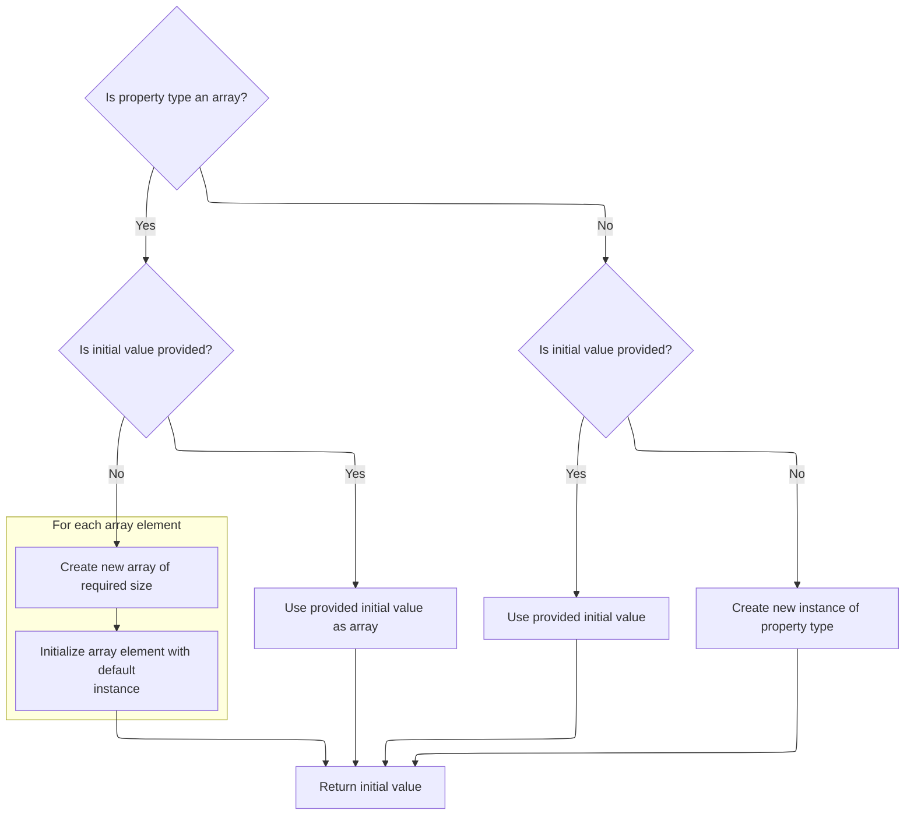
```mermaid
%%{init: {"flowchart": {"defaultRenderer": "elk"}} }%%
flowchart TD
  node2{"Is property type an array?"}
  click node2 openCode "core/src/main/java/org/apache/struts/config/FormPropertyConfig.java:324:324"
  node2 -->|"Yes"| node3{"Is initial value provided?"}
  click node3 openCode "core/src/main/java/org/apache/struts/config/FormPropertyConfig.java:325:326"
  node3 -->|"Yes"| node4["Use provided initial value as array"]
  click node4 openCode "core/src/main/java/org/apache/struts/config/FormPropertyConfig.java:326:326"
  node3 -->|"No"| node5["Create new array of required size"]
  click node5 openCode "core/src/main/java/org/apache/struts/config/FormPropertyConfig.java:328:329"
  
  subgraph loop1["For each array element"]
    node5 --> node6["Initialize array element with default
instance"]
    click node6 openCode "core/src/main/java/org/apache/struts/config/FormPropertyConfig.java:332:335"
  end
  node6 --> node10["Return initial value"]
  
  node2 -->|"No"| node7{"Is initial value provided?"}
  click node7 openCode "core/src/main/java/org/apache/struts/config/FormPropertyConfig.java:348:349"
  node7 -->|"Yes"| node8["Use provided initial value"]
  click node8 openCode "core/src/main/java/org/apache/struts/config/FormPropertyConfig.java:349:349"
  node7 -->|"No"| node9["Create new instance of property type"]
  click node9 openCode "core/src/main/java/org/apache/struts/config/FormPropertyConfig.java:351:351"
  node4 --> node10["Return initial value"]
  node8 --> node10
  node9 --> node10
  node10["Return initial value"]
  click node10 openCode "core/src/main/java/org/apache/struts/config/FormPropertyConfig.java:358:359"

classDef HeadingStyle fill:#777777,stroke:#333,stroke-width:2px;

%% Swimm:
%% %%{init: {"flowchart": {"defaultRenderer": "elk"}} }%%
%% flowchart TD
%%   node2{"Is property type an array?"}
%%   click node2 openCode "<SwmPath>[core/…/config/FormPropertyConfig.java](core/src/main/java/org/apache/struts/config/FormPropertyConfig.java)</SwmPath>:324:324"
%%   node2 -->|"Yes"| node3{"Is initial value provided?"}
%%   click node3 openCode "<SwmPath>[core/…/config/FormPropertyConfig.java](core/src/main/java/org/apache/struts/config/FormPropertyConfig.java)</SwmPath>:325:326"
%%   node3 -->|"Yes"| node4["Use provided initial value as array"]
%%   click node4 openCode "<SwmPath>[core/…/config/FormPropertyConfig.java](core/src/main/java/org/apache/struts/config/FormPropertyConfig.java)</SwmPath>:326:326"
%%   node3 -->|"No"| node5["Create new array of required size"]
%%   click node5 openCode "<SwmPath>[core/…/config/FormPropertyConfig.java](core/src/main/java/org/apache/struts/config/FormPropertyConfig.java)</SwmPath>:328:329"
%%   
%%   subgraph loop1["For each array element"]
%%     node5 --> node6["Initialize array element with default
%% instance"]
%%     click node6 openCode "<SwmPath>[core/…/config/FormPropertyConfig.java](core/src/main/java/org/apache/struts/config/FormPropertyConfig.java)</SwmPath>:332:335"
%%   end
%%   node6 --> node10["Return initial value"]
%%   
%%   node2 -->|"No"| node7{"Is initial value provided?"}
%%   click node7 openCode "<SwmPath>[core/…/config/FormPropertyConfig.java](core/src/main/java/org/apache/struts/config/FormPropertyConfig.java)</SwmPath>:348:349"
%%   node7 -->|"Yes"| node8["Use provided initial value"]
%%   click node8 openCode "<SwmPath>[core/…/config/FormPropertyConfig.java](core/src/main/java/org/apache/struts/config/FormPropertyConfig.java)</SwmPath>:349:349"
%%   node7 -->|"No"| node9["Create new instance of property type"]
%%   click node9 openCode "<SwmPath>[core/…/config/FormPropertyConfig.java](core/src/main/java/org/apache/struts/config/FormPropertyConfig.java)</SwmPath>:351:351"
%%   node4 --> node10["Return initial value"]
%%   node8 --> node10
%%   node9 --> node10
%%   node10["Return initial value"]
%%   click node10 openCode "<SwmPath>[core/…/config/FormPropertyConfig.java](core/src/main/java/org/apache/struts/config/FormPropertyConfig.java)</SwmPath>:358:359"
%% 
%% classDef HeadingStyle fill:#777777,stroke:#333,stroke-width:2px;
```

<SwmSnippet path="/core/src/main/java/org/apache/struts/config/FormPropertyConfig.java" line="324">

---

Back in `FormPropertyConfig.initial`, if the property type is an array, we create a new array instance and initialize each element if it's not primitive. If there's an initial value, we convert it; otherwise, we build the array from scratch.

```java
            if (clazz.isArray()) {
                if (initial != null) {
                    initialValue = ConvertUtils.convert(initial, clazz);
                } else {
                    initialValue =
                        Array.newInstance(clazz.getComponentType(), size);

                    if (!(clazz.getComponentType().isPrimitive())) {
                        for (int i = 0; i < size; i++) {
                            try {
                                Array.set(initialValue, i,
                                    clazz.getComponentType().newInstance());
                            } catch (Throwable t) {
                                log.error("Unable to create instance of "
                                    + clazz.getName() + " for property=" + name
                                    + ", type=" + type + ", initial=" + initial
                                    + ", size=" + size + ".");

                                //FIXME: Should we just dump the entire application/module ?
                            }
                        }
```

---

</SwmSnippet>

<SwmSnippet path="/core/src/main/java/org/apache/struts/config/FormPropertyConfig.java" line="348">

---

Finishing up `FormPropertyConfig.initial`, we return the initial value for the property—either converted, a new instance, or null if something failed. This value is then used by <SwmToken path="core/src/main/java/org/apache/struts/action/DynaActionForm.java" pos="61:11:11" line-data="     * &lt;p&gt;The &lt;code&gt;DynaActionFormClass&lt;/code&gt; with which we are associated.">`DynaActionFormClass`</SwmToken> to set up the property on the new bean.

```java
                if (initial != null) {
                    initialValue = ConvertUtils.convert(initial, clazz);
                } else {
                    initialValue = clazz.newInstance();
                }
            }
        } catch (Throwable t) {
            initialValue = null;
        }

        return (initialValue);
    }
```

---

</SwmSnippet>

&nbsp;

*This is an auto-generated document by Swimm 🌊 and has not yet been verified by a human*

<SwmMeta version="3.0.0" repo-id="Z2l0aHViJTNBJTNBc3RydXRzMSUzQSUzQVN3aW1tLURlbW8=" repo-name="struts1"><sup>Powered by [Swimm](https://app.swimm.io/)</sup></SwmMeta>
