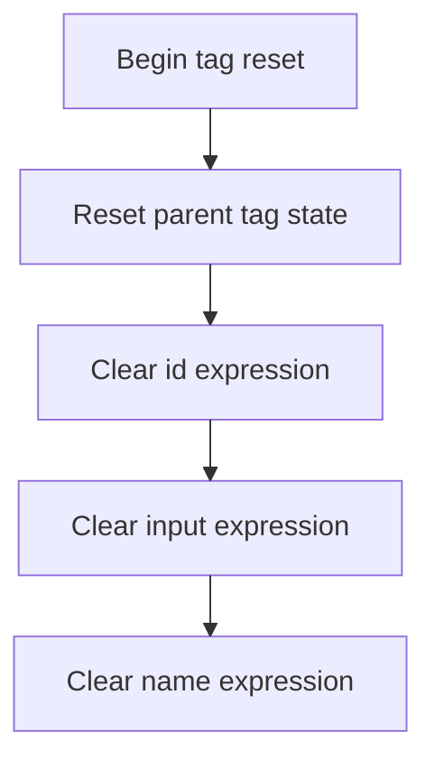

This document explains how the state of an HTML file tag is reset before reuse. All expression fields, including inherited ones, are cleared to ensure the tag does not retain data between uses. The flow receives a tag instance as input and produces a reset tag ready for the next rendering cycle.

# Resetting HTML File Tag State

<SwmSnippet path="/el/src/main/java/org/apache/strutsel/taglib/html/ELFileTag.java" line="855">

---

In <SwmToken path="el/src/main/java/org/apache/strutsel/taglib/html/ELFileTag.java" pos="855:5:5" line-data="    public void release() {">`release`</SwmToken>, we start by calling <SwmToken path="el/src/main/java/org/apache/strutsel/taglib/html/ELFileTag.java" pos="856:1:5" line-data="        super.release();">`super.release()`</SwmToken> to make sure any cleanup logic from the parent class is executed. This sets up a clean base before we reset fields specific to this class. Next, we delegate to ELResourceTag.release to clear out additional state inherited from the resource tag logic.

```java
    public void release() {
        super.release();
```

---

</SwmSnippet>

## Clearing Resource Tag Expressions



<SwmSnippet path="/el/src/main/java/org/apache/strutsel/taglib/bean/ELResourceTag.java" line="108">

---

In <SwmToken path="el/src/main/java/org/apache/strutsel/taglib/bean/ELResourceTag.java" pos="108:5:5" line-data="    public void release() {">`release`</SwmToken>, we call the superclass's release method, then start clearing out expression fields like <SwmToken path="el/src/main/java/org/apache/strutsel/taglib/bean/ELResourceTag.java" pos="85:9:9" line-data="    public void setIdExpr(String idExpr) {">`idExpr`</SwmToken> by calling <SwmToken path="el/src/main/java/org/apache/strutsel/taglib/bean/ELResourceTag.java" pos="110:1:1" line-data="        setIdExpr(null);">`setIdExpr`</SwmToken>(null). This ensures any references to previous state are dropped, prepping the tag for reuse or garbage collection.

```java
    public void release() {
        super.release();
        setIdExpr(null);
```

---

</SwmSnippet>

<SwmSnippet path="/el/src/main/java/org/apache/strutsel/taglib/bean/ELResourceTag.java" line="85">

---

<SwmToken path="el/src/main/java/org/apache/strutsel/taglib/bean/ELResourceTag.java" pos="85:5:5" line-data="    public void setIdExpr(String idExpr) {">`setIdExpr`</SwmToken> just assigns the given value to the <SwmToken path="el/src/main/java/org/apache/strutsel/taglib/bean/ELResourceTag.java" pos="85:9:9" line-data="    public void setIdExpr(String idExpr) {">`idExpr`</SwmToken> field. No checks, no side effects—just a standard setter.

```java
    public void setIdExpr(String idExpr) {
        this.idExpr = idExpr;
    }
```

---

</SwmSnippet>

<SwmSnippet path="/el/src/main/java/org/apache/strutsel/taglib/bean/ELResourceTag.java" line="111">

---

Back in <SwmToken path="el/src/main/java/org/apache/strutsel/taglib/html/ELFileTag.java" pos="855:5:5" line-data="    public void release() {">`release`</SwmToken>, after clearing <SwmToken path="el/src/main/java/org/apache/strutsel/taglib/bean/ELResourceTag.java" pos="85:9:9" line-data="    public void setIdExpr(String idExpr) {">`idExpr`</SwmToken>, we immediately call <SwmToken path="el/src/main/java/org/apache/strutsel/taglib/bean/ELResourceTag.java" pos="111:1:1" line-data="        setInputExpr(null);">`setInputExpr`</SwmToken>(null) to drop any reference held in <SwmToken path="el/src/main/java/org/apache/strutsel/taglib/bean/ELResourceTag.java" pos="93:9:9" line-data="    public void setInputExpr(String inputExpr) {">`inputExpr`</SwmToken>. This continues the cleanup sequence for all expression fields.

```java
        setInputExpr(null);
```

---

</SwmSnippet>

<SwmSnippet path="/el/src/main/java/org/apache/strutsel/taglib/bean/ELResourceTag.java" line="93">

---

<SwmToken path="el/src/main/java/org/apache/strutsel/taglib/bean/ELResourceTag.java" pos="93:5:5" line-data="    public void setInputExpr(String inputExpr) {">`setInputExpr`</SwmToken> assigns the input string to the <SwmToken path="el/src/main/java/org/apache/strutsel/taglib/bean/ELResourceTag.java" pos="93:9:9" line-data="    public void setInputExpr(String inputExpr) {">`inputExpr`</SwmToken> field. No logic, just a direct assignment.

```java
    public void setInputExpr(String inputExpr) {
        this.inputExpr = inputExpr;
    }
```

---

</SwmSnippet>

<SwmSnippet path="/el/src/main/java/org/apache/strutsel/taglib/bean/ELResourceTag.java" line="112">

---

Back in <SwmToken path="el/src/main/java/org/apache/strutsel/taglib/html/ELFileTag.java" pos="855:5:5" line-data="    public void release() {">`release`</SwmToken>, after clearing <SwmToken path="el/src/main/java/org/apache/strutsel/taglib/bean/ELResourceTag.java" pos="93:9:9" line-data="    public void setInputExpr(String inputExpr) {">`inputExpr`</SwmToken>, we call <SwmToken path="el/src/main/java/org/apache/strutsel/taglib/bean/ELResourceTag.java" pos="112:1:1" line-data="        setNameExpr(null);">`setNameExpr`</SwmToken>(null) to finish dropping all expression references. This completes the cleanup for the resource tag fields.

```java
        setNameExpr(null);
    }
```

---

</SwmSnippet>

<SwmSnippet path="/el/src/main/java/org/apache/strutsel/taglib/bean/ELResourceTag.java" line="101">

---

<SwmToken path="el/src/main/java/org/apache/strutsel/taglib/bean/ELResourceTag.java" pos="101:5:5" line-data="    public void setNameExpr(String nameExpr) {">`setNameExpr`</SwmToken> just assigns the input string to the <SwmToken path="el/src/main/java/org/apache/strutsel/taglib/bean/ELResourceTag.java" pos="101:9:9" line-data="    public void setNameExpr(String nameExpr) {">`nameExpr`</SwmToken> field. No extra logic, just a direct setter.

```java
    public void setNameExpr(String nameExpr) {
        this.nameExpr = nameExpr;
    }
```

---

</SwmSnippet>

## Resetting HTML File Tag Expressions

<SwmSnippet path="/el/src/main/java/org/apache/strutsel/taglib/html/ELFileTag.java" line="857">

---

Back in `ELFileTag.release`, after clearing the resource tag fields, we start nulling out all HTML file tag expression fields, beginning with <SwmToken path="el/src/main/java/org/apache/strutsel/taglib/html/ELFileTag.java" pos="857:1:1" line-data="        setAccesskeyExpr(null);">`setAccesskeyExpr`</SwmToken>(null). This wipes any leftover state for access key expressions.

```java
        setAccesskeyExpr(null);
```

---

</SwmSnippet>

<SwmSnippet path="/el/src/main/java/org/apache/strutsel/taglib/html/ELFileTag.java" line="560">

---

<SwmToken path="el/src/main/java/org/apache/strutsel/taglib/html/ELFileTag.java" pos="560:5:5" line-data="    public void setAccesskeyExpr(String accesskeyExpr) {">`setAccesskeyExpr`</SwmToken> assigns the input string to the <SwmToken path="el/src/main/java/org/apache/strutsel/taglib/html/ELFileTag.java" pos="560:9:9" line-data="    public void setAccesskeyExpr(String accesskeyExpr) {">`accesskeyExpr`</SwmToken> field. No logic, just a direct setter.

```java
    public void setAccesskeyExpr(String accesskeyExpr) {
        this.accesskeyExpr = accesskeyExpr;
    }
```

---

</SwmSnippet>

<SwmSnippet path="/el/src/main/java/org/apache/strutsel/taglib/html/ELFileTag.java" line="858">

---

Back in `ELFileTag.release`, after clearing <SwmToken path="el/src/main/java/org/apache/strutsel/taglib/html/ELFileTag.java" pos="560:9:9" line-data="    public void setAccesskeyExpr(String accesskeyExpr) {">`accesskeyExpr`</SwmToken>, we call <SwmToken path="el/src/main/java/org/apache/strutsel/taglib/html/ELFileTag.java" pos="858:1:1" line-data="        setAcceptExpr(null);">`setAcceptExpr`</SwmToken>(null) to drop any reference held in <SwmToken path="el/src/main/java/org/apache/strutsel/taglib/html/ELFileTag.java" pos="568:9:9" line-data="    public void setAcceptExpr(String acceptExpr) {">`acceptExpr`</SwmToken>. This continues the cleanup for all expression fields.

```java
        setAcceptExpr(null);
```

---

</SwmSnippet>

<SwmSnippet path="/el/src/main/java/org/apache/strutsel/taglib/html/ELFileTag.java" line="568">

---

<SwmToken path="el/src/main/java/org/apache/strutsel/taglib/html/ELFileTag.java" pos="568:5:5" line-data="    public void setAcceptExpr(String acceptExpr) {">`setAcceptExpr`</SwmToken> assigns the input string to the <SwmToken path="el/src/main/java/org/apache/strutsel/taglib/html/ELFileTag.java" pos="568:9:9" line-data="    public void setAcceptExpr(String acceptExpr) {">`acceptExpr`</SwmToken> field. No extra logic, just a direct setter.

```java
    public void setAcceptExpr(String acceptExpr) {
        this.acceptExpr = acceptExpr;
    }
```

---

</SwmSnippet>

<SwmSnippet path="/el/src/main/java/org/apache/strutsel/taglib/html/ELFileTag.java" line="859">

---

Back in `ELFileTag.release`, after clearing <SwmToken path="el/src/main/java/org/apache/strutsel/taglib/html/ELFileTag.java" pos="568:9:9" line-data="    public void setAcceptExpr(String acceptExpr) {">`acceptExpr`</SwmToken>, we call <SwmToken path="el/src/main/java/org/apache/strutsel/taglib/html/ELFileTag.java" pos="859:1:1" line-data="        setAltExpr(null);">`setAltExpr`</SwmToken>(null) to clear any alt expression state. This is part of the full cleanup.

```java
        setAltExpr(null);
```

---

</SwmSnippet>

<SwmSnippet path="/el/src/main/java/org/apache/strutsel/taglib/html/ELFileTag.java" line="576">

---

<SwmToken path="el/src/main/java/org/apache/strutsel/taglib/html/ELFileTag.java" pos="576:5:5" line-data="    public void setAltExpr(String altExpr) {">`setAltExpr`</SwmToken> assigns the input string to the <SwmToken path="el/src/main/java/org/apache/strutsel/taglib/html/ELFileTag.java" pos="576:9:9" line-data="    public void setAltExpr(String altExpr) {">`altExpr`</SwmToken> field. No logic, just a direct setter.

```java
    public void setAltExpr(String altExpr) {
        this.altExpr = altExpr;
    }
```

---

</SwmSnippet>

<SwmSnippet path="/el/src/main/java/org/apache/strutsel/taglib/html/ELFileTag.java" line="860">

---

Back in `ELFileTag.release`, after clearing <SwmToken path="el/src/main/java/org/apache/strutsel/taglib/html/ELFileTag.java" pos="576:9:9" line-data="    public void setAltExpr(String altExpr) {">`altExpr`</SwmToken>, we call <SwmToken path="el/src/main/java/org/apache/strutsel/taglib/html/ELFileTag.java" pos="860:1:1" line-data="        setAltKeyExpr(null);">`setAltKeyExpr`</SwmToken>(null) to clear any alt key expression state. This is part of the full cleanup.

```java
        setAltKeyExpr(null);
```

---

</SwmSnippet>

<SwmSnippet path="/el/src/main/java/org/apache/strutsel/taglib/html/ELFileTag.java" line="584">

---

<SwmToken path="el/src/main/java/org/apache/strutsel/taglib/html/ELFileTag.java" pos="584:5:5" line-data="    public void setAltKeyExpr(String altKeyExpr) {">`setAltKeyExpr`</SwmToken> assigns the input string to the <SwmToken path="el/src/main/java/org/apache/strutsel/taglib/html/ELFileTag.java" pos="584:9:9" line-data="    public void setAltKeyExpr(String altKeyExpr) {">`altKeyExpr`</SwmToken> field. No logic, just a direct setter.

```java
    public void setAltKeyExpr(String altKeyExpr) {
        this.altKeyExpr = altKeyExpr;
    }
```

---

</SwmSnippet>

<SwmSnippet path="/el/src/main/java/org/apache/strutsel/taglib/html/ELFileTag.java" line="861">

---

Back in `ELFileTag.release`, after clearing <SwmToken path="el/src/main/java/org/apache/strutsel/taglib/html/ELFileTag.java" pos="584:9:9" line-data="    public void setAltKeyExpr(String altKeyExpr) {">`altKeyExpr`</SwmToken>, we call <SwmToken path="el/src/main/java/org/apache/strutsel/taglib/html/ELFileTag.java" pos="861:1:1" line-data="        setBundleExpr(null);">`setBundleExpr`</SwmToken>(null) to clear any bundle expression state. This is part of the full cleanup.

```java
        setBundleExpr(null);
```

---

</SwmSnippet>

<SwmSnippet path="/el/src/main/java/org/apache/strutsel/taglib/html/ELFileTag.java" line="592">

---

<SwmToken path="el/src/main/java/org/apache/strutsel/taglib/html/ELFileTag.java" pos="592:5:5" line-data="    public void setBundleExpr(String bundleExpr) {">`setBundleExpr`</SwmToken> assigns the input string to the <SwmToken path="el/src/main/java/org/apache/strutsel/taglib/html/ELFileTag.java" pos="592:9:9" line-data="    public void setBundleExpr(String bundleExpr) {">`bundleExpr`</SwmToken> field. No logic, just a direct setter.

```java
    public void setBundleExpr(String bundleExpr) {
        this.bundleExpr = bundleExpr;
    }
```

---

</SwmSnippet>

<SwmSnippet path="/el/src/main/java/org/apache/strutsel/taglib/html/ELFileTag.java" line="862">

---

Back in `ELFileTag.release`, after clearing <SwmToken path="el/src/main/java/org/apache/strutsel/taglib/html/ELFileTag.java" pos="592:9:9" line-data="    public void setBundleExpr(String bundleExpr) {">`bundleExpr`</SwmToken>, we call <SwmToken path="el/src/main/java/org/apache/strutsel/taglib/html/ELFileTag.java" pos="862:1:1" line-data="        setDirExpr(null);">`setDirExpr`</SwmToken>(null) to clear any dir expression state. This is part of the full cleanup.

```java
        setDirExpr(null);
```

---

</SwmSnippet>

<SwmSnippet path="/el/src/main/java/org/apache/strutsel/taglib/html/ELFileTag.java" line="600">

---

<SwmToken path="el/src/main/java/org/apache/strutsel/taglib/html/ELFileTag.java" pos="600:5:5" line-data="    public void setDirExpr(String dirExpr) {">`setDirExpr`</SwmToken> assigns the input string to the <SwmToken path="el/src/main/java/org/apache/strutsel/taglib/html/ELFileTag.java" pos="600:9:9" line-data="    public void setDirExpr(String dirExpr) {">`dirExpr`</SwmToken> field. No logic, just a direct setter.

```java
    public void setDirExpr(String dirExpr) {
        this.dirExpr = dirExpr;
    }
```

---

</SwmSnippet>

<SwmSnippet path="/el/src/main/java/org/apache/strutsel/taglib/html/ELFileTag.java" line="863">

---

Back in `ELFileTag.release`, after clearing <SwmToken path="el/src/main/java/org/apache/strutsel/taglib/html/ELFileTag.java" pos="600:9:9" line-data="    public void setDirExpr(String dirExpr) {">`dirExpr`</SwmToken>, we call <SwmToken path="el/src/main/java/org/apache/strutsel/taglib/html/ELFileTag.java" pos="863:1:1" line-data="        setDisabledExpr(null);">`setDisabledExpr`</SwmToken>(null) to clear any disabled expression state. This is part of the full cleanup.

```java
        setDisabledExpr(null);
```

---

</SwmSnippet>

<SwmSnippet path="/el/src/main/java/org/apache/strutsel/taglib/html/ELFileTag.java" line="608">

---

<SwmToken path="el/src/main/java/org/apache/strutsel/taglib/html/ELFileTag.java" pos="608:5:5" line-data="    public void setDisabledExpr(String disabledExpr) {">`setDisabledExpr`</SwmToken> assigns the input string to the <SwmToken path="el/src/main/java/org/apache/strutsel/taglib/html/ELFileTag.java" pos="608:9:9" line-data="    public void setDisabledExpr(String disabledExpr) {">`disabledExpr`</SwmToken> field. No logic, just a direct setter.

```java
    public void setDisabledExpr(String disabledExpr) {
        this.disabledExpr = disabledExpr;
    }
```

---

</SwmSnippet>

<SwmSnippet path="/el/src/main/java/org/apache/strutsel/taglib/html/ELFileTag.java" line="864">

---

Back in `ELFileTag.release`, after clearing <SwmToken path="el/src/main/java/org/apache/strutsel/taglib/html/ELFileTag.java" pos="608:9:9" line-data="    public void setDisabledExpr(String disabledExpr) {">`disabledExpr`</SwmToken>, we call <SwmToken path="el/src/main/java/org/apache/strutsel/taglib/html/ELFileTag.java" pos="864:1:1" line-data="        setErrorKeyExpr(null);">`setErrorKeyExpr`</SwmToken>(null) to clear any error key expression state. This is part of the full cleanup.

```java
        setErrorKeyExpr(null);
```

---

</SwmSnippet>

<SwmSnippet path="/el/src/main/java/org/apache/strutsel/taglib/html/ELFileTag.java" line="616">

---

<SwmToken path="el/src/main/java/org/apache/strutsel/taglib/html/ELFileTag.java" pos="616:5:5" line-data="    public void setErrorKeyExpr(String errorKeyExpr) {">`setErrorKeyExpr`</SwmToken> assigns the input string to the <SwmToken path="el/src/main/java/org/apache/strutsel/taglib/html/ELFileTag.java" pos="616:9:9" line-data="    public void setErrorKeyExpr(String errorKeyExpr) {">`errorKeyExpr`</SwmToken> field. No logic, just a direct setter.

```java
    public void setErrorKeyExpr(String errorKeyExpr) {
        this.errorKeyExpr = errorKeyExpr;
    }
```

---

</SwmSnippet>

<SwmSnippet path="/el/src/main/java/org/apache/strutsel/taglib/html/ELFileTag.java" line="865">

---

Back in `ELFileTag.release`, after clearing <SwmToken path="el/src/main/java/org/apache/strutsel/taglib/html/ELFileTag.java" pos="616:9:9" line-data="    public void setErrorKeyExpr(String errorKeyExpr) {">`errorKeyExpr`</SwmToken>, we call <SwmToken path="el/src/main/java/org/apache/strutsel/taglib/html/ELFileTag.java" pos="865:1:1" line-data="        setErrorStyleExpr(null);">`setErrorStyleExpr`</SwmToken>(null) to clear any error style expression state. This is part of the full cleanup.

```java
        setErrorStyleExpr(null);
```

---

</SwmSnippet>

<SwmSnippet path="/el/src/main/java/org/apache/strutsel/taglib/html/ELFileTag.java" line="624">

---

<SwmToken path="el/src/main/java/org/apache/strutsel/taglib/html/ELFileTag.java" pos="624:5:5" line-data="    public void setErrorStyleExpr(String errorStyleExpr) {">`setErrorStyleExpr`</SwmToken> assigns the input string to the <SwmToken path="el/src/main/java/org/apache/strutsel/taglib/html/ELFileTag.java" pos="624:9:9" line-data="    public void setErrorStyleExpr(String errorStyleExpr) {">`errorStyleExpr`</SwmToken> field. No logic, just a direct setter.

```java
    public void setErrorStyleExpr(String errorStyleExpr) {
        this.errorStyleExpr = errorStyleExpr;
    }
```

---

</SwmSnippet>

<SwmSnippet path="/el/src/main/java/org/apache/strutsel/taglib/html/ELFileTag.java" line="866">

---

Back in `ELFileTag.release`, after clearing <SwmToken path="el/src/main/java/org/apache/strutsel/taglib/html/ELFileTag.java" pos="624:9:9" line-data="    public void setErrorStyleExpr(String errorStyleExpr) {">`errorStyleExpr`</SwmToken>, we call <SwmToken path="el/src/main/java/org/apache/strutsel/taglib/html/ELFileTag.java" pos="866:1:1" line-data="        setErrorStyleClassExpr(null);">`setErrorStyleClassExpr`</SwmToken>(null) to clear any error style class expression state. This is part of the full cleanup.

```java
        setErrorStyleClassExpr(null);
```

---

</SwmSnippet>

<SwmSnippet path="/el/src/main/java/org/apache/strutsel/taglib/html/ELFileTag.java" line="632">

---

<SwmToken path="el/src/main/java/org/apache/strutsel/taglib/html/ELFileTag.java" pos="632:5:5" line-data="    public void setErrorStyleClassExpr(String errorStyleClassExpr) {">`setErrorStyleClassExpr`</SwmToken> assigns the input string to the <SwmToken path="el/src/main/java/org/apache/strutsel/taglib/html/ELFileTag.java" pos="632:9:9" line-data="    public void setErrorStyleClassExpr(String errorStyleClassExpr) {">`errorStyleClassExpr`</SwmToken> field. No logic, just a direct setter.

```java
    public void setErrorStyleClassExpr(String errorStyleClassExpr) {
        this.errorStyleClassExpr = errorStyleClassExpr;
    }
```

---

</SwmSnippet>

<SwmSnippet path="/el/src/main/java/org/apache/strutsel/taglib/html/ELFileTag.java" line="867">

---

Back in `ELFileTag.release`, after clearing <SwmToken path="el/src/main/java/org/apache/strutsel/taglib/html/ELFileTag.java" pos="632:9:9" line-data="    public void setErrorStyleClassExpr(String errorStyleClassExpr) {">`errorStyleClassExpr`</SwmToken>, we call <SwmToken path="el/src/main/java/org/apache/strutsel/taglib/html/ELFileTag.java" pos="867:1:1" line-data="        setErrorStyleIdExpr(null);">`setErrorStyleIdExpr`</SwmToken>(null) to clear any error style id expression state. This is part of the full cleanup.

```java
        setErrorStyleIdExpr(null);
```

---

</SwmSnippet>

<SwmSnippet path="/el/src/main/java/org/apache/strutsel/taglib/html/ELFileTag.java" line="640">

---

<SwmToken path="el/src/main/java/org/apache/strutsel/taglib/html/ELFileTag.java" pos="640:5:5" line-data="    public void setErrorStyleIdExpr(String errorStyleIdExpr) {">`setErrorStyleIdExpr`</SwmToken> assigns the input string to the <SwmToken path="el/src/main/java/org/apache/strutsel/taglib/html/ELFileTag.java" pos="640:9:9" line-data="    public void setErrorStyleIdExpr(String errorStyleIdExpr) {">`errorStyleIdExpr`</SwmToken> field. No logic, just a direct setter.

```java
    public void setErrorStyleIdExpr(String errorStyleIdExpr) {
        this.errorStyleIdExpr = errorStyleIdExpr;
    }
```

---

</SwmSnippet>

<SwmSnippet path="/el/src/main/java/org/apache/strutsel/taglib/html/ELFileTag.java" line="868">

---

Back in `ELFileTag.release`, after clearing <SwmToken path="el/src/main/java/org/apache/strutsel/taglib/html/ELFileTag.java" pos="640:9:9" line-data="    public void setErrorStyleIdExpr(String errorStyleIdExpr) {">`errorStyleIdExpr`</SwmToken>, we call <SwmToken path="el/src/main/java/org/apache/strutsel/taglib/html/ELFileTag.java" pos="868:1:1" line-data="        setIndexedExpr(null);">`setIndexedExpr`</SwmToken>(null) to clear any indexed expression state. This is part of the full cleanup.

```java
        setIndexedExpr(null);
```

---

</SwmSnippet>

<SwmSnippet path="/el/src/main/java/org/apache/strutsel/taglib/html/ELFileTag.java" line="648">

---

<SwmToken path="el/src/main/java/org/apache/strutsel/taglib/html/ELFileTag.java" pos="648:5:5" line-data="    public void setIndexedExpr(String indexedExpr) {">`setIndexedExpr`</SwmToken> assigns the input string to the <SwmToken path="el/src/main/java/org/apache/strutsel/taglib/html/ELFileTag.java" pos="648:9:9" line-data="    public void setIndexedExpr(String indexedExpr) {">`indexedExpr`</SwmToken> field. No logic, just a direct setter.

```java
    public void setIndexedExpr(String indexedExpr) {
        this.indexedExpr = indexedExpr;
    }
```

---

</SwmSnippet>

<SwmSnippet path="/el/src/main/java/org/apache/strutsel/taglib/html/ELFileTag.java" line="869">

---

Back in `ELFileTag.release`, after clearing <SwmToken path="el/src/main/java/org/apache/strutsel/taglib/html/ELFileTag.java" pos="648:9:9" line-data="    public void setIndexedExpr(String indexedExpr) {">`indexedExpr`</SwmToken>, we call <SwmToken path="el/src/main/java/org/apache/strutsel/taglib/html/ELFileTag.java" pos="869:1:1" line-data="        setLangExpr(null);">`setLangExpr`</SwmToken>(null) to clear any lang expression state. This is part of the full cleanup.

```java
        setLangExpr(null);
```

---

</SwmSnippet>

<SwmSnippet path="/el/src/main/java/org/apache/strutsel/taglib/html/ELFileTag.java" line="656">

---

<SwmToken path="el/src/main/java/org/apache/strutsel/taglib/html/ELFileTag.java" pos="656:5:5" line-data="    public void setLangExpr(String langExpr) {">`setLangExpr`</SwmToken> assigns the input string to the <SwmToken path="el/src/main/java/org/apache/strutsel/taglib/html/ELFileTag.java" pos="656:9:9" line-data="    public void setLangExpr(String langExpr) {">`langExpr`</SwmToken> field. No logic, just a direct setter.

```java
    public void setLangExpr(String langExpr) {
        this.langExpr = langExpr;
    }
```

---

</SwmSnippet>

<SwmSnippet path="/el/src/main/java/org/apache/strutsel/taglib/html/ELFileTag.java" line="870">

---

Back in `ELFileTag.release`, after clearing <SwmToken path="el/src/main/java/org/apache/strutsel/taglib/html/ELFileTag.java" pos="656:9:9" line-data="    public void setLangExpr(String langExpr) {">`langExpr`</SwmToken>, we call <SwmToken path="el/src/main/java/org/apache/strutsel/taglib/html/ELFileTag.java" pos="870:1:1" line-data="        setMaxlengthExpr(null);">`setMaxlengthExpr`</SwmToken>(null) to clear any maxlength expression state. This is part of the full cleanup.

```java
        setMaxlengthExpr(null);
```

---

</SwmSnippet>

<SwmSnippet path="/el/src/main/java/org/apache/strutsel/taglib/html/ELFileTag.java" line="664">

---

<SwmToken path="el/src/main/java/org/apache/strutsel/taglib/html/ELFileTag.java" pos="664:5:5" line-data="    public void setMaxlengthExpr(String maxlengthExpr) {">`setMaxlengthExpr`</SwmToken> assigns the input string to the <SwmToken path="el/src/main/java/org/apache/strutsel/taglib/html/ELFileTag.java" pos="664:9:9" line-data="    public void setMaxlengthExpr(String maxlengthExpr) {">`maxlengthExpr`</SwmToken> field. No logic, just a direct setter.

```java
    public void setMaxlengthExpr(String maxlengthExpr) {
        this.maxlengthExpr = maxlengthExpr;
    }
```

---

</SwmSnippet>

<SwmSnippet path="/el/src/main/java/org/apache/strutsel/taglib/html/ELFileTag.java" line="871">

---

Back in `ELFileTag.release`, after clearing <SwmToken path="el/src/main/java/org/apache/strutsel/taglib/html/ELFileTag.java" pos="664:9:9" line-data="    public void setMaxlengthExpr(String maxlengthExpr) {">`maxlengthExpr`</SwmToken>, we call <SwmToken path="el/src/main/java/org/apache/strutsel/taglib/html/ELFileTag.java" pos="871:1:1" line-data="        setNameExpr(null);">`setNameExpr`</SwmToken>(null) to clear any name expression state. This is part of the full cleanup.

```java
        setNameExpr(null);
```

---

</SwmSnippet>

<SwmSnippet path="/el/src/main/java/org/apache/strutsel/taglib/html/ELFileTag.java" line="672">

---

<SwmToken path="el/src/main/java/org/apache/strutsel/taglib/html/ELFileTag.java" pos="672:5:5" line-data="    public void setNameExpr(String nameExpr) {">`setNameExpr`</SwmToken> assigns the input string to the <SwmToken path="el/src/main/java/org/apache/strutsel/taglib/html/ELFileTag.java" pos="672:9:9" line-data="    public void setNameExpr(String nameExpr) {">`nameExpr`</SwmToken> field. No logic, just a direct setter.

```java
    public void setNameExpr(String nameExpr) {
        this.nameExpr = nameExpr;
    }
```

---

</SwmSnippet>

<SwmSnippet path="/el/src/main/java/org/apache/strutsel/taglib/html/ELFileTag.java" line="872">

---

Back in ELFileTag.release, after clearing <SwmToken path="el/src/main/java/org/apache/strutsel/taglib/html/ELFileTag.java" pos="672:9:9" line-data="    public void setNameExpr(String nameExpr) {">`nameExpr`</SwmToken>, we call <SwmToken path="el/src/main/java/org/apache/strutsel/taglib/html/ELFileTag.java" pos="872:1:1" line-data="        setOnblurExpr(null);">`setOnblurExpr`</SwmToken>(null) to make sure any leftover onblur event handler is wiped. This keeps the tag from reusing stale JavaScript handlers when it's recycled.

```java
        setOnblurExpr(null);
```

---

</SwmSnippet>

<SwmSnippet path="/el/src/main/java/org/apache/strutsel/taglib/html/ELFileTag.java" line="680">

---

<SwmToken path="el/src/main/java/org/apache/strutsel/taglib/html/ELFileTag.java" pos="680:5:5" line-data="    public void setOnblurExpr(String onblurExpr) {">`setOnblurExpr`</SwmToken> just sets the <SwmToken path="el/src/main/java/org/apache/strutsel/taglib/html/ELFileTag.java" pos="680:9:9" line-data="    public void setOnblurExpr(String onblurExpr) {">`onblurExpr`</SwmToken> field to the provided value—no checks, no side effects, just a plain setter. It's used here to clear any leftover onblur JavaScript handler from previous tag usage.

```java
    public void setOnblurExpr(String onblurExpr) {
        this.onblurExpr = onblurExpr;
    }
```

---

</SwmSnippet>

<SwmSnippet path="/el/src/main/java/org/apache/strutsel/taglib/html/ELFileTag.java" line="873">

---

Just returned from ELFileTag.setOnblurExpr in ELFileTag.release, and now we call <SwmToken path="el/src/main/java/org/apache/strutsel/taglib/html/ELFileTag.java" pos="873:1:1" line-data="        setOnchangeExpr(null);">`setOnchangeExpr`</SwmToken>(null) to clear any onchange handler. This prevents old onchange logic from sticking around in the tag instance.

```java
        setOnchangeExpr(null);
```

---

</SwmSnippet>

<SwmSnippet path="/el/src/main/java/org/apache/strutsel/taglib/html/ELFileTag.java" line="688">

---

<SwmToken path="el/src/main/java/org/apache/strutsel/taglib/html/ELFileTag.java" pos="688:5:5" line-data="    public void setOnchangeExpr(String onchangeExpr) {">`setOnchangeExpr`</SwmToken> just assigns the input to the <SwmToken path="el/src/main/java/org/apache/strutsel/taglib/html/ELFileTag.java" pos="688:9:9" line-data="    public void setOnchangeExpr(String onchangeExpr) {">`onchangeExpr`</SwmToken> field—no logic, no validation, just a plain setter. It's called here to make sure any old onchange handler is wiped out.

```java
    public void setOnchangeExpr(String onchangeExpr) {
        this.onchangeExpr = onchangeExpr;
    }
```

---

</SwmSnippet>

<SwmSnippet path="/el/src/main/java/org/apache/strutsel/taglib/html/ELFileTag.java" line="874">

---

After ELFileTag.setOnchangeExpr, ELFileTag.release calls <SwmToken path="el/src/main/java/org/apache/strutsel/taglib/html/ELFileTag.java" pos="874:1:1" line-data="        setOnclickExpr(null);">`setOnclickExpr`</SwmToken>(null) to drop any lingering onclick handler. This avoids accidental reuse of old click logic in recycled tags.

```java
        setOnclickExpr(null);
```

---

</SwmSnippet>

<SwmSnippet path="/el/src/main/java/org/apache/strutsel/taglib/html/ELFileTag.java" line="696">

---

<SwmToken path="el/src/main/java/org/apache/strutsel/taglib/html/ELFileTag.java" pos="696:5:5" line-data="    public void setOnclickExpr(String onclickExpr) {">`setOnclickExpr`</SwmToken> just sets the <SwmToken path="el/src/main/java/org/apache/strutsel/taglib/html/ELFileTag.java" pos="696:9:9" line-data="    public void setOnclickExpr(String onclickExpr) {">`onclickExpr`</SwmToken> field to whatever you pass in—no checks, no side effects, just a plain setter. It's called here to clear out any old onclick handler.

```java
    public void setOnclickExpr(String onclickExpr) {
        this.onclickExpr = onclickExpr;
    }
```

---

</SwmSnippet>

<SwmSnippet path="/el/src/main/java/org/apache/strutsel/taglib/html/ELFileTag.java" line="875">

---

After ELFileTag.setOnclickExpr, ELFileTag.release calls <SwmToken path="el/src/main/java/org/apache/strutsel/taglib/html/ELFileTag.java" pos="875:1:1" line-data="        setOndblclickExpr(null);">`setOndblclickExpr`</SwmToken>(null) to clear any double-click handler. This keeps the tag instance from holding onto old ondblclick logic.

```java
        setOndblclickExpr(null);
```

---

</SwmSnippet>

<SwmSnippet path="/el/src/main/java/org/apache/strutsel/taglib/html/ELFileTag.java" line="704">

---

<SwmToken path="el/src/main/java/org/apache/strutsel/taglib/html/ELFileTag.java" pos="704:5:5" line-data="    public void setOndblclickExpr(String ondblclickExpr) {">`setOndblclickExpr`</SwmToken> just sets the <SwmToken path="el/src/main/java/org/apache/strutsel/taglib/html/ELFileTag.java" pos="704:9:9" line-data="    public void setOndblclickExpr(String ondblclickExpr) {">`ondblclickExpr`</SwmToken> field to the given value—no checks, no side effects, just a plain setter. It's called here to clear out any old ondblclick handler.

```java
    public void setOndblclickExpr(String ondblclickExpr) {
        this.ondblclickExpr = ondblclickExpr;
    }
```

---

</SwmSnippet>

<SwmSnippet path="/el/src/main/java/org/apache/strutsel/taglib/html/ELFileTag.java" line="876">

---

After ELFileTag.setOndblclickExpr, ELFileTag.release calls <SwmToken path="el/src/main/java/org/apache/strutsel/taglib/html/ELFileTag.java" pos="876:1:1" line-data="        setOnfocusExpr(null);">`setOnfocusExpr`</SwmToken>(null) to clear any onfocus handler. This ensures the tag doesn't reuse old focus logic when recycled.

```java
        setOnfocusExpr(null);
```

---

</SwmSnippet>

<SwmSnippet path="/el/src/main/java/org/apache/strutsel/taglib/html/ELFileTag.java" line="712">

---

<SwmToken path="el/src/main/java/org/apache/strutsel/taglib/html/ELFileTag.java" pos="712:5:5" line-data="    public void setOnfocusExpr(String onfocusExpr) {">`setOnfocusExpr`</SwmToken> just sets the <SwmToken path="el/src/main/java/org/apache/strutsel/taglib/html/ELFileTag.java" pos="712:9:9" line-data="    public void setOnfocusExpr(String onfocusExpr) {">`onfocusExpr`</SwmToken> field to the given value—no checks, no side effects, just a plain setter. It's called here to clear out any old onfocus handler.

```java
    public void setOnfocusExpr(String onfocusExpr) {
        this.onfocusExpr = onfocusExpr;
    }
```

---

</SwmSnippet>

<SwmSnippet path="/el/src/main/java/org/apache/strutsel/taglib/html/ELFileTag.java" line="877">

---

After ELFileTag.setOnfocusExpr, ELFileTag.release calls <SwmToken path="el/src/main/java/org/apache/strutsel/taglib/html/ELFileTag.java" pos="877:1:1" line-data="        setOnkeydownExpr(null);">`setOnkeydownExpr`</SwmToken>(null) to clear any onkeydown handler. This prevents leftover keydown logic from sticking to the tag instance.

```java
        setOnkeydownExpr(null);
```

---

</SwmSnippet>

<SwmSnippet path="/el/src/main/java/org/apache/strutsel/taglib/html/ELFileTag.java" line="720">

---

<SwmToken path="el/src/main/java/org/apache/strutsel/taglib/html/ELFileTag.java" pos="720:5:5" line-data="    public void setOnkeydownExpr(String onkeydownExpr) {">`setOnkeydownExpr`</SwmToken> just sets the <SwmToken path="el/src/main/java/org/apache/strutsel/taglib/html/ELFileTag.java" pos="720:9:9" line-data="    public void setOnkeydownExpr(String onkeydownExpr) {">`onkeydownExpr`</SwmToken> field to the given value—no checks, no side effects, just a plain setter. It's called here to clear out any old onkeydown handler.

```java
    public void setOnkeydownExpr(String onkeydownExpr) {
        this.onkeydownExpr = onkeydownExpr;
    }
```

---

</SwmSnippet>

<SwmSnippet path="/el/src/main/java/org/apache/strutsel/taglib/html/ELFileTag.java" line="878">

---

After ELFileTag.setOnkeydownExpr, ELFileTag.release calls <SwmToken path="el/src/main/java/org/apache/strutsel/taglib/html/ELFileTag.java" pos="878:1:1" line-data="        setOnkeypressExpr(null);">`setOnkeypressExpr`</SwmToken>(null) to clear any onkeypress handler. This keeps the tag from reusing old keypress logic.

```java
        setOnkeypressExpr(null);
```

---

</SwmSnippet>

<SwmSnippet path="/el/src/main/java/org/apache/strutsel/taglib/html/ELFileTag.java" line="728">

---

<SwmToken path="el/src/main/java/org/apache/strutsel/taglib/html/ELFileTag.java" pos="728:5:5" line-data="    public void setOnkeypressExpr(String onkeypressExpr) {">`setOnkeypressExpr`</SwmToken> just sets the <SwmToken path="el/src/main/java/org/apache/strutsel/taglib/html/ELFileTag.java" pos="728:9:9" line-data="    public void setOnkeypressExpr(String onkeypressExpr) {">`onkeypressExpr`</SwmToken> field to the given value—no checks, no side effects, just a plain setter. It's called here to clear out any old onkeypress handler.

```java
    public void setOnkeypressExpr(String onkeypressExpr) {
        this.onkeypressExpr = onkeypressExpr;
    }
```

---

</SwmSnippet>

<SwmSnippet path="/el/src/main/java/org/apache/strutsel/taglib/html/ELFileTag.java" line="879">

---

After ELFileTag.setOnkeypressExpr, ELFileTag.release calls <SwmToken path="el/src/main/java/org/apache/strutsel/taglib/html/ELFileTag.java" pos="879:1:1" line-data="        setOnkeyupExpr(null);">`setOnkeyupExpr`</SwmToken>(null) to clear any onkeyup handler. This avoids accidental reuse of old keyup logic in recycled tags.

```java
        setOnkeyupExpr(null);
```

---

</SwmSnippet>

<SwmSnippet path="/el/src/main/java/org/apache/strutsel/taglib/html/ELFileTag.java" line="736">

---

<SwmToken path="el/src/main/java/org/apache/strutsel/taglib/html/ELFileTag.java" pos="736:5:5" line-data="    public void setOnkeyupExpr(String onkeyupExpr) {">`setOnkeyupExpr`</SwmToken> just sets the <SwmToken path="el/src/main/java/org/apache/strutsel/taglib/html/ELFileTag.java" pos="736:9:9" line-data="    public void setOnkeyupExpr(String onkeyupExpr) {">`onkeyupExpr`</SwmToken> field to the given value—no checks, no side effects, just a plain setter. It's called here to clear out any old onkeyup handler.

```java
    public void setOnkeyupExpr(String onkeyupExpr) {
        this.onkeyupExpr = onkeyupExpr;
    }
```

---

</SwmSnippet>

<SwmSnippet path="/el/src/main/java/org/apache/strutsel/taglib/html/ELFileTag.java" line="880">

---

After ELFileTag.setOnkeyupExpr, ELFileTag.release calls <SwmToken path="el/src/main/java/org/apache/strutsel/taglib/html/ELFileTag.java" pos="880:1:1" line-data="        setOnmousedownExpr(null);">`setOnmousedownExpr`</SwmToken>(null) to clear any onmousedown handler. This keeps the tag instance from holding onto old mousedown logic.

```java
        setOnmousedownExpr(null);
```

---

</SwmSnippet>

<SwmSnippet path="/el/src/main/java/org/apache/strutsel/taglib/html/ELFileTag.java" line="744">

---

<SwmToken path="el/src/main/java/org/apache/strutsel/taglib/html/ELFileTag.java" pos="744:5:5" line-data="    public void setOnmousedownExpr(String onmousedownExpr) {">`setOnmousedownExpr`</SwmToken> just sets the <SwmToken path="el/src/main/java/org/apache/strutsel/taglib/html/ELFileTag.java" pos="744:9:9" line-data="    public void setOnmousedownExpr(String onmousedownExpr) {">`onmousedownExpr`</SwmToken> field to the given value—no checks, no side effects, just a plain setter. It's called here to clear out any old onmousedown handler.

```java
    public void setOnmousedownExpr(String onmousedownExpr) {
        this.onmousedownExpr = onmousedownExpr;
    }
```

---

</SwmSnippet>

<SwmSnippet path="/el/src/main/java/org/apache/strutsel/taglib/html/ELFileTag.java" line="881">

---

After ELFileTag.setOnmousedownExpr, ELFileTag.release calls <SwmToken path="el/src/main/java/org/apache/strutsel/taglib/html/ELFileTag.java" pos="881:1:1" line-data="        setOnmousemoveExpr(null);">`setOnmousemoveExpr`</SwmToken>(null) to clear any onmousemove handler. This prevents leftover mousemove logic from sticking to the tag instance.

```java
        setOnmousemoveExpr(null);
```

---

</SwmSnippet>

<SwmSnippet path="/el/src/main/java/org/apache/strutsel/taglib/html/ELFileTag.java" line="752">

---

<SwmToken path="el/src/main/java/org/apache/strutsel/taglib/html/ELFileTag.java" pos="752:5:5" line-data="    public void setOnmousemoveExpr(String onmousemoveExpr) {">`setOnmousemoveExpr`</SwmToken> just sets the <SwmToken path="el/src/main/java/org/apache/strutsel/taglib/html/ELFileTag.java" pos="752:9:9" line-data="    public void setOnmousemoveExpr(String onmousemoveExpr) {">`onmousemoveExpr`</SwmToken> field to the given value—no checks, no side effects, just a plain setter. It's called here to clear out any old onmousemove handler.

```java
    public void setOnmousemoveExpr(String onmousemoveExpr) {
        this.onmousemoveExpr = onmousemoveExpr;
    }
```

---

</SwmSnippet>

<SwmSnippet path="/el/src/main/java/org/apache/strutsel/taglib/html/ELFileTag.java" line="882">

---

After ELFileTag.setOnmousemoveExpr, ELFileTag.release calls <SwmToken path="el/src/main/java/org/apache/strutsel/taglib/html/ELFileTag.java" pos="882:1:1" line-data="        setOnmouseoutExpr(null);">`setOnmouseoutExpr`</SwmToken>(null) to clear any onmouseout handler. This avoids accidental reuse of old mouseout logic in recycled tags.

```java
        setOnmouseoutExpr(null);
```

---

</SwmSnippet>

<SwmSnippet path="/el/src/main/java/org/apache/strutsel/taglib/html/ELFileTag.java" line="760">

---

<SwmToken path="el/src/main/java/org/apache/strutsel/taglib/html/ELFileTag.java" pos="760:5:5" line-data="    public void setOnmouseoutExpr(String onmouseoutExpr) {">`setOnmouseoutExpr`</SwmToken> just sets the <SwmToken path="el/src/main/java/org/apache/strutsel/taglib/html/ELFileTag.java" pos="760:9:9" line-data="    public void setOnmouseoutExpr(String onmouseoutExpr) {">`onmouseoutExpr`</SwmToken> field to the given value—no checks, no side effects, just a plain setter. It's called here to clear out any old onmouseout handler.

```java
    public void setOnmouseoutExpr(String onmouseoutExpr) {
        this.onmouseoutExpr = onmouseoutExpr;
    }
```

---

</SwmSnippet>

<SwmSnippet path="/el/src/main/java/org/apache/strutsel/taglib/html/ELFileTag.java" line="883">

---

After ELFileTag.setOnmouseoutExpr, ELFileTag.release calls <SwmToken path="el/src/main/java/org/apache/strutsel/taglib/html/ELFileTag.java" pos="883:1:1" line-data="        setOnmouseoverExpr(null);">`setOnmouseoverExpr`</SwmToken>(null) to clear any onmouseover handler. This keeps the tag instance from holding onto old mouseover logic.

```java
        setOnmouseoverExpr(null);
```

---

</SwmSnippet>

<SwmSnippet path="/el/src/main/java/org/apache/strutsel/taglib/html/ELFileTag.java" line="768">

---

<SwmToken path="el/src/main/java/org/apache/strutsel/taglib/html/ELFileTag.java" pos="768:5:5" line-data="    public void setOnmouseoverExpr(String onmouseoverExpr) {">`setOnmouseoverExpr`</SwmToken> just sets the <SwmToken path="el/src/main/java/org/apache/strutsel/taglib/html/ELFileTag.java" pos="768:9:9" line-data="    public void setOnmouseoverExpr(String onmouseoverExpr) {">`onmouseoverExpr`</SwmToken> field to the given value—no checks, no side effects, just a plain setter. It's called here to clear out any old onmouseover handler.

```java
    public void setOnmouseoverExpr(String onmouseoverExpr) {
        this.onmouseoverExpr = onmouseoverExpr;
    }
```

---

</SwmSnippet>

<SwmSnippet path="/el/src/main/java/org/apache/strutsel/taglib/html/ELFileTag.java" line="884">

---

After ELFileTag.setOnmouseoverExpr, ELFileTag.release calls <SwmToken path="el/src/main/java/org/apache/strutsel/taglib/html/ELFileTag.java" pos="884:1:1" line-data="        setOnmouseupExpr(null);">`setOnmouseupExpr`</SwmToken>(null) to clear any onmouseup handler. This prevents leftover mouseup logic from sticking to the tag instance.

```java
        setOnmouseupExpr(null);
```

---

</SwmSnippet>

<SwmSnippet path="/el/src/main/java/org/apache/strutsel/taglib/html/ELFileTag.java" line="776">

---

<SwmToken path="el/src/main/java/org/apache/strutsel/taglib/html/ELFileTag.java" pos="776:5:5" line-data="    public void setOnmouseupExpr(String onmouseupExpr) {">`setOnmouseupExpr`</SwmToken> just sets the <SwmToken path="el/src/main/java/org/apache/strutsel/taglib/html/ELFileTag.java" pos="776:9:9" line-data="    public void setOnmouseupExpr(String onmouseupExpr) {">`onmouseupExpr`</SwmToken> field to the given value—no checks, no side effects, just a plain setter. It's called here to clear out any old onmouseup handler.

```java
    public void setOnmouseupExpr(String onmouseupExpr) {
        this.onmouseupExpr = onmouseupExpr;
    }
```

---

</SwmSnippet>

<SwmSnippet path="/el/src/main/java/org/apache/strutsel/taglib/html/ELFileTag.java" line="885">

---

After ELFileTag.setOnmouseupExpr, ELFileTag.release calls <SwmToken path="el/src/main/java/org/apache/strutsel/taglib/html/ELFileTag.java" pos="885:1:1" line-data="        setPropertyExpr(null);">`setPropertyExpr`</SwmToken>(null) to clear any property expression. This avoids accidental reuse of old property values in recycled tags.

```java
        setPropertyExpr(null);
```

---

</SwmSnippet>

<SwmSnippet path="/el/src/main/java/org/apache/strutsel/taglib/html/ELFileTag.java" line="784">

---

<SwmToken path="el/src/main/java/org/apache/strutsel/taglib/html/ELFileTag.java" pos="784:5:5" line-data="    public void setPropertyExpr(String propertyExpr) {">`setPropertyExpr`</SwmToken> just sets the <SwmToken path="el/src/main/java/org/apache/strutsel/taglib/html/ELFileTag.java" pos="784:9:9" line-data="    public void setPropertyExpr(String propertyExpr) {">`propertyExpr`</SwmToken> field to the given value—no checks, no side effects, just a plain setter. It's called here to clear out any old property expression.

```java
    public void setPropertyExpr(String propertyExpr) {
        this.propertyExpr = propertyExpr;
    }
```

---

</SwmSnippet>

<SwmSnippet path="/el/src/main/java/org/apache/strutsel/taglib/html/ELFileTag.java" line="886">

---

After ELFileTag.setPropertyExpr, ELFileTag.release calls <SwmToken path="el/src/main/java/org/apache/strutsel/taglib/html/ELFileTag.java" pos="886:1:1" line-data="        setSizeExpr(null);">`setSizeExpr`</SwmToken>(null) to clear any size expression. This keeps the tag instance from holding onto old size values.

```java
        setSizeExpr(null);
```

---

</SwmSnippet>

<SwmSnippet path="/el/src/main/java/org/apache/strutsel/taglib/html/ELFileTag.java" line="792">

---

<SwmToken path="el/src/main/java/org/apache/strutsel/taglib/html/ELFileTag.java" pos="792:5:5" line-data="    public void setSizeExpr(String sizeExpr) {">`setSizeExpr`</SwmToken> just sets the <SwmToken path="el/src/main/java/org/apache/strutsel/taglib/html/ELFileTag.java" pos="792:9:9" line-data="    public void setSizeExpr(String sizeExpr) {">`sizeExpr`</SwmToken> field to the given value—no checks, no side effects, just a plain setter. It's called here to clear out any old size expression.

```java
    public void setSizeExpr(String sizeExpr) {
        this.sizeExpr = sizeExpr;
    }
```

---

</SwmSnippet>

<SwmSnippet path="/el/src/main/java/org/apache/strutsel/taglib/html/ELFileTag.java" line="887">

---

After ELFileTag.setSizeExpr, ELFileTag.release calls <SwmToken path="el/src/main/java/org/apache/strutsel/taglib/html/ELFileTag.java" pos="887:1:1" line-data="        setStyleExpr(null);">`setStyleExpr`</SwmToken>(null) to clear any style expression. This avoids accidental reuse of old style values in recycled tags.

```java
        setStyleExpr(null);
```

---

</SwmSnippet>

<SwmSnippet path="/el/src/main/java/org/apache/strutsel/taglib/html/ELFileTag.java" line="800">

---

<SwmToken path="el/src/main/java/org/apache/strutsel/taglib/html/ELFileTag.java" pos="800:5:5" line-data="    public void setStyleExpr(String styleExpr) {">`setStyleExpr`</SwmToken> just sets the <SwmToken path="el/src/main/java/org/apache/strutsel/taglib/html/ELFileTag.java" pos="800:9:9" line-data="    public void setStyleExpr(String styleExpr) {">`styleExpr`</SwmToken> field to the given value—no checks, no side effects, just a plain setter. It's called here to clear out any old style expression.

```java
    public void setStyleExpr(String styleExpr) {
        this.styleExpr = styleExpr;
    }
```

---

</SwmSnippet>

<SwmSnippet path="/el/src/main/java/org/apache/strutsel/taglib/html/ELFileTag.java" line="888">

---

After ELFileTag.setStyleExpr, ELFileTag.release calls <SwmToken path="el/src/main/java/org/apache/strutsel/taglib/html/ELFileTag.java" pos="888:1:1" line-data="        setStyleClassExpr(null);">`setStyleClassExpr`</SwmToken>(null) to clear any style class expression. This keeps the tag instance from holding onto old style class values.

```java
        setStyleClassExpr(null);
```

---

</SwmSnippet>

<SwmSnippet path="/el/src/main/java/org/apache/strutsel/taglib/html/ELFileTag.java" line="808">

---

<SwmToken path="el/src/main/java/org/apache/strutsel/taglib/html/ELFileTag.java" pos="808:5:5" line-data="    public void setStyleClassExpr(String styleClassExpr) {">`setStyleClassExpr`</SwmToken> just sets the <SwmToken path="el/src/main/java/org/apache/strutsel/taglib/html/ELFileTag.java" pos="808:9:9" line-data="    public void setStyleClassExpr(String styleClassExpr) {">`styleClassExpr`</SwmToken> field to the given value—no checks, no side effects, just a plain setter. It's called here to clear out any old style class expression.

```java
    public void setStyleClassExpr(String styleClassExpr) {
        this.styleClassExpr = styleClassExpr;
    }
```

---

</SwmSnippet>

<SwmSnippet path="/el/src/main/java/org/apache/strutsel/taglib/html/ELFileTag.java" line="889">

---

After ELFileTag.setStyleClassExpr, ELFileTag.release calls <SwmToken path="el/src/main/java/org/apache/strutsel/taglib/html/ELFileTag.java" pos="889:1:1" line-data="        setStyleIdExpr(null);">`setStyleIdExpr`</SwmToken>(null) to clear any style ID expression. This avoids accidental reuse of old style ID values in recycled tags.

```java
        setStyleIdExpr(null);
```

---

</SwmSnippet>

<SwmSnippet path="/el/src/main/java/org/apache/strutsel/taglib/html/ELFileTag.java" line="816">

---

<SwmToken path="el/src/main/java/org/apache/strutsel/taglib/html/ELFileTag.java" pos="816:5:5" line-data="    public void setStyleIdExpr(String styleIdExpr) {">`setStyleIdExpr`</SwmToken> just sets the <SwmToken path="el/src/main/java/org/apache/strutsel/taglib/html/ELFileTag.java" pos="816:9:9" line-data="    public void setStyleIdExpr(String styleIdExpr) {">`styleIdExpr`</SwmToken> field to the given value—no checks, no side effects, just a plain setter. It's called here to clear out any old style ID expression.

```java
    public void setStyleIdExpr(String styleIdExpr) {
        this.styleIdExpr = styleIdExpr;
    }
```

---

</SwmSnippet>

<SwmSnippet path="/el/src/main/java/org/apache/strutsel/taglib/html/ELFileTag.java" line="890">

---

After ELFileTag.setStyleIdExpr, ELFileTag.release calls <SwmToken path="el/src/main/java/org/apache/strutsel/taglib/html/ELFileTag.java" pos="890:1:1" line-data="        setTabindexExpr(null);">`setTabindexExpr`</SwmToken>(null) to clear any tabindex expression. This keeps the tag instance from holding onto old tabindex values.

```java
        setTabindexExpr(null);
```

---

</SwmSnippet>

<SwmSnippet path="/el/src/main/java/org/apache/strutsel/taglib/html/ELFileTag.java" line="824">

---

<SwmToken path="el/src/main/java/org/apache/strutsel/taglib/html/ELFileTag.java" pos="824:5:5" line-data="    public void setTabindexExpr(String tabindexExpr) {">`setTabindexExpr`</SwmToken> just sets the <SwmToken path="el/src/main/java/org/apache/strutsel/taglib/html/ELFileTag.java" pos="824:9:9" line-data="    public void setTabindexExpr(String tabindexExpr) {">`tabindexExpr`</SwmToken> field to the given value—no checks, no side effects, just a plain setter. It's called here to clear out any old tabindex expression.

```java
    public void setTabindexExpr(String tabindexExpr) {
        this.tabindexExpr = tabindexExpr;
    }
```

---

</SwmSnippet>

<SwmSnippet path="/el/src/main/java/org/apache/strutsel/taglib/html/ELFileTag.java" line="891">

---

After ELFileTag.setTabindexExpr, ELFileTag.release calls <SwmToken path="el/src/main/java/org/apache/strutsel/taglib/html/ELFileTag.java" pos="891:1:1" line-data="        setTitleExpr(null);">`setTitleExpr`</SwmToken>(null) to clear any title expression. This avoids accidental reuse of old title values in recycled tags.

```java
        setTitleExpr(null);
```

---

</SwmSnippet>

<SwmSnippet path="/el/src/main/java/org/apache/strutsel/taglib/html/ELFileTag.java" line="832">

---

<SwmToken path="el/src/main/java/org/apache/strutsel/taglib/html/ELFileTag.java" pos="832:5:5" line-data="    public void setTitleExpr(String titleExpr) {">`setTitleExpr`</SwmToken> just sets the <SwmToken path="el/src/main/java/org/apache/strutsel/taglib/html/ELFileTag.java" pos="832:9:9" line-data="    public void setTitleExpr(String titleExpr) {">`titleExpr`</SwmToken> field to the given value—no checks, no side effects, just a plain setter. It's called here to clear out any old title expression.

```java
    public void setTitleExpr(String titleExpr) {
        this.titleExpr = titleExpr;
    }
```

---

</SwmSnippet>

<SwmSnippet path="/el/src/main/java/org/apache/strutsel/taglib/html/ELFileTag.java" line="892">

---

We just got back from ELFileTag.setTitleExpr in ELFileTag.release. Now we call <SwmToken path="el/src/main/java/org/apache/strutsel/taglib/html/ELFileTag.java" pos="892:1:1" line-data="        setTitleKeyExpr(null);">`setTitleKeyExpr`</SwmToken>(null) to make sure any leftover title key expression is wiped. This keeps the tag from holding onto old title key values, which could mess up rendering if the tag gets reused.

```java
        setTitleKeyExpr(null);
```

---

</SwmSnippet>

<SwmSnippet path="/el/src/main/java/org/apache/strutsel/taglib/html/ELFileTag.java" line="840">

---

SetTitleKeyExpr just assigns the input string to the <SwmToken path="el/src/main/java/org/apache/strutsel/taglib/html/ELFileTag.java" pos="840:9:9" line-data="    public void setTitleKeyExpr(String titleKeyExpr) {">`titleKeyExpr`</SwmToken> field. No checks, no extra logic—it's a standard Java setter.

```java
    public void setTitleKeyExpr(String titleKeyExpr) {
        this.titleKeyExpr = titleKeyExpr;
    }
```

---

</SwmSnippet>

<SwmSnippet path="/el/src/main/java/org/apache/strutsel/taglib/html/ELFileTag.java" line="893">

---

After returning from ELFileTag.setTitleKeyExpr, ELFileTag.release finishes up by calling <SwmToken path="el/src/main/java/org/apache/strutsel/taglib/html/ELFileTag.java" pos="893:1:1" line-data="        setValueExpr(null);">`setValueExpr`</SwmToken>(null). This drops any lingering value expression, making sure the tag doesn't reuse stale value data.

```java
        setValueExpr(null);
    }
```

---

</SwmSnippet>

<SwmSnippet path="/el/src/main/java/org/apache/strutsel/taglib/html/ELFileTag.java" line="848">

---

SetValueExpr just assigns the input string to the <SwmToken path="el/src/main/java/org/apache/strutsel/taglib/html/ELFileTag.java" pos="848:9:9" line-data="    public void setValueExpr(String valueExpr) {">`valueExpr`</SwmToken> field. No checks, no extra logic—it's a standard Java setter.

```java
    public void setValueExpr(String valueExpr) {
        this.valueExpr = valueExpr;
    }
```

---

</SwmSnippet>

&nbsp;

*This is an auto-generated document by Swimm 🌊 and has not yet been verified by a human*

<SwmMeta version="3.0.0" repo-id="Z2l0aHViJTNBJTNBc3RydXRzMSUzQSUzQVN3aW1tLURlbW8=" repo-name="struts1"><sup>Powered by [Swimm](https://app.swimm.io/)</sup></SwmMeta>
