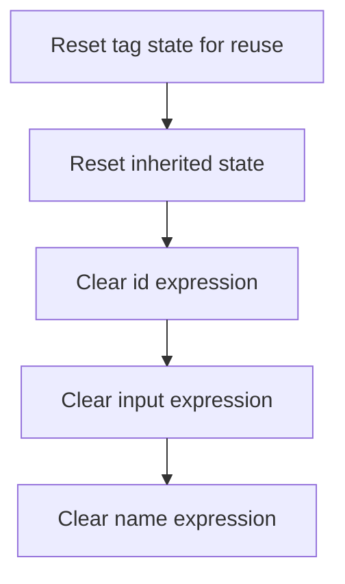

This document describes how an HTML hidden tag instance is prepared for reuse by clearing all expression fields. The process ensures that both inherited and tag-specific expressions are reset, so the tag does not retain data from previous uses.

# Resetting HTML Hidden Tag State

<SwmSnippet path="/el/src/main/java/org/apache/strutsel/taglib/html/ELHiddenTag.java" line="701">

---

In <SwmToken path="el/src/main/java/org/apache/strutsel/taglib/html/ELHiddenTag.java" pos="701:5:5" line-data="    public void release() {">`release`</SwmToken>, we start by calling <SwmToken path="el/src/main/java/org/apache/strutsel/taglib/html/ELHiddenTag.java" pos="702:1:5" line-data="        super.release();">`super.release()`</SwmToken> to make sure any cleanup from the parent class is handled before we reset our own fields. Next, we need to call ELResourceTag.release to clear out expression-related properties inherited from the bean tag, so we don't leave any stale references hanging around.

```java
    public void release() {
        super.release();
```

---

</SwmSnippet>

## Clearing Resource Tag Expressions



<SwmSnippet path="/el/src/main/java/org/apache/strutsel/taglib/bean/ELResourceTag.java" line="108">

---

In <SwmToken path="el/src/main/java/org/apache/strutsel/taglib/bean/ELResourceTag.java" pos="108:5:5" line-data="    public void release() {">`release`</SwmToken>, we call <SwmToken path="el/src/main/java/org/apache/strutsel/taglib/bean/ELResourceTag.java" pos="109:1:5" line-data="        super.release();">`super.release()`</SwmToken> first, then use the setters to clear <SwmToken path="el/src/main/java/org/apache/strutsel/taglib/bean/ELResourceTag.java" pos="85:9:9" line-data="    public void setIdExpr(String idExpr) {">`idExpr`</SwmToken>, <SwmToken path="el/src/main/java/org/apache/strutsel/taglib/bean/ELResourceTag.java" pos="93:9:9" line-data="    public void setInputExpr(String inputExpr) {">`inputExpr`</SwmToken>, and <SwmToken path="el/src/main/java/org/apache/strutsel/taglib/html/ELHiddenTag.java" pos="526:9:9" line-data="    public void setNameExpr(String nameExpr) {">`nameExpr`</SwmToken>. This wipes out any expression references, so the tag doesn't keep old data around.

```java
    public void release() {
        super.release();
        setIdExpr(null);
```

---

</SwmSnippet>

<SwmSnippet path="/el/src/main/java/org/apache/strutsel/taglib/bean/ELResourceTag.java" line="85">

---

<SwmToken path="el/src/main/java/org/apache/strutsel/taglib/bean/ELResourceTag.java" pos="85:5:5" line-data="    public void setIdExpr(String idExpr) {">`setIdExpr`</SwmToken> just assigns the input string to the <SwmToken path="el/src/main/java/org/apache/strutsel/taglib/bean/ELResourceTag.java" pos="85:9:9" line-data="    public void setIdExpr(String idExpr) {">`idExpr`</SwmToken> field. Nothing fancy—standard setter, no extra logic.

```java
    public void setIdExpr(String idExpr) {
        this.idExpr = idExpr;
    }
```

---

</SwmSnippet>

<SwmSnippet path="/el/src/main/java/org/apache/strutsel/taglib/bean/ELResourceTag.java" line="111">

---

We just returned from ELResourceTag.setIdExpr, and now we're calling ELResourceTag.setInputExpr to clear the input expression field. This keeps the tag from holding onto any previous input values.

```java
        setInputExpr(null);
```

---

</SwmSnippet>

<SwmSnippet path="/el/src/main/java/org/apache/strutsel/taglib/bean/ELResourceTag.java" line="93">

---

<SwmToken path="el/src/main/java/org/apache/strutsel/taglib/bean/ELResourceTag.java" pos="93:5:5" line-data="    public void setInputExpr(String inputExpr) {">`setInputExpr`</SwmToken> just assigns the input string to <SwmToken path="el/src/main/java/org/apache/strutsel/taglib/bean/ELResourceTag.java" pos="93:9:9" line-data="    public void setInputExpr(String inputExpr) {">`inputExpr`</SwmToken>. It's a plain setter, no extra logic or checks.

```java
    public void setInputExpr(String inputExpr) {
        this.inputExpr = inputExpr;
    }
```

---

</SwmSnippet>

<SwmSnippet path="/el/src/main/java/org/apache/strutsel/taglib/bean/ELResourceTag.java" line="112">

---

We just returned from ELResourceTag.setInputExpr, and now we're calling ELResourceTag.setNameExpr to clear the name expression. This finishes the cleanup for all expression fields in the resource tag.

```java
        setNameExpr(null);
    }
```

---

</SwmSnippet>

<SwmSnippet path="/el/src/main/java/org/apache/strutsel/taglib/bean/ELResourceTag.java" line="101">

---

<SwmToken path="el/src/main/java/org/apache/strutsel/taglib/bean/ELResourceTag.java" pos="101:5:5" line-data="    public void setNameExpr(String nameExpr) {">`setNameExpr`</SwmToken> just assigns the input string to <SwmToken path="el/src/main/java/org/apache/strutsel/taglib/bean/ELResourceTag.java" pos="101:9:9" line-data="    public void setNameExpr(String nameExpr) {">`nameExpr`</SwmToken>. It's a standard setter, nothing else going on.

```java
    public void setNameExpr(String nameExpr) {
        this.nameExpr = nameExpr;
    }
```

---

</SwmSnippet>

## Resetting HTML Tag Expression Fields

<SwmSnippet path="/el/src/main/java/org/apache/strutsel/taglib/html/ELHiddenTag.java" line="703">

---

We just returned from ELResourceTag.release, and now ELHiddenTag.release is calling <SwmToken path="el/src/main/java/org/apache/strutsel/taglib/html/ELHiddenTag.java" pos="703:1:1" line-data="        setAccesskeyExpr(null);">`setAccesskeyExpr`</SwmToken>(null) to clear the access key expression. This keeps the tag from holding onto any previous access key values.

```java
        setAccesskeyExpr(null);
```

---

</SwmSnippet>

<SwmSnippet path="/el/src/main/java/org/apache/strutsel/taglib/html/ELHiddenTag.java" line="462">

---

<SwmToken path="el/src/main/java/org/apache/strutsel/taglib/html/ELHiddenTag.java" pos="462:5:5" line-data="    public void setAccesskeyExpr(String accesskeyExpr) {">`setAccesskeyExpr`</SwmToken> just assigns the input string to <SwmToken path="el/src/main/java/org/apache/strutsel/taglib/html/ELHiddenTag.java" pos="462:9:9" line-data="    public void setAccesskeyExpr(String accesskeyExpr) {">`accesskeyExpr`</SwmToken>. It's a plain setter, no extra logic.

```java
    public void setAccesskeyExpr(String accesskeyExpr) {
        this.accesskeyExpr = accesskeyExpr;
    }
```

---

</SwmSnippet>

<SwmSnippet path="/el/src/main/java/org/apache/strutsel/taglib/html/ELHiddenTag.java" line="704">

---

We just returned from ELHiddenTag.setAccesskeyExpr, and ELHiddenTag.release is now calling <SwmToken path="el/src/main/java/org/apache/strutsel/taglib/html/ELHiddenTag.java" pos="704:1:1" line-data="        setAltExpr(null);">`setAltExpr`</SwmToken>(null) to clear the alt expression. This prevents the tag from keeping any old alt values.

```java
        setAltExpr(null);
```

---

</SwmSnippet>

<SwmSnippet path="/el/src/main/java/org/apache/strutsel/taglib/html/ELHiddenTag.java" line="470">

---

<SwmToken path="el/src/main/java/org/apache/strutsel/taglib/html/ELHiddenTag.java" pos="470:5:5" line-data="    public void setAltExpr(String altExpr) {">`setAltExpr`</SwmToken> just assigns the input string to <SwmToken path="el/src/main/java/org/apache/strutsel/taglib/html/ELHiddenTag.java" pos="470:9:9" line-data="    public void setAltExpr(String altExpr) {">`altExpr`</SwmToken>. It's a standard setter, nothing else.

```java
    public void setAltExpr(String altExpr) {
        this.altExpr = altExpr;
    }
```

---

</SwmSnippet>

<SwmSnippet path="/el/src/main/java/org/apache/strutsel/taglib/html/ELHiddenTag.java" line="705">

---

We just returned from ELHiddenTag.setAltExpr, and ELHiddenTag.release is now calling <SwmToken path="el/src/main/java/org/apache/strutsel/taglib/html/ELHiddenTag.java" pos="705:1:1" line-data="        setAltKeyExpr(null);">`setAltKeyExpr`</SwmToken>(null) to clear the alt key expression. This keeps the tag from holding onto any previous alt key values.

```java
        setAltKeyExpr(null);
```

---

</SwmSnippet>

<SwmSnippet path="/el/src/main/java/org/apache/strutsel/taglib/html/ELHiddenTag.java" line="478">

---

<SwmToken path="el/src/main/java/org/apache/strutsel/taglib/html/ELHiddenTag.java" pos="478:5:5" line-data="    public void setAltKeyExpr(String altKeyExpr) {">`setAltKeyExpr`</SwmToken> just assigns the input string to <SwmToken path="el/src/main/java/org/apache/strutsel/taglib/html/ELHiddenTag.java" pos="478:9:9" line-data="    public void setAltKeyExpr(String altKeyExpr) {">`altKeyExpr`</SwmToken>. It's a plain setter, nothing special.

```java
    public void setAltKeyExpr(String altKeyExpr) {
        this.altKeyExpr = altKeyExpr;
    }
```

---

</SwmSnippet>

<SwmSnippet path="/el/src/main/java/org/apache/strutsel/taglib/html/ELHiddenTag.java" line="706">

---

We just returned from ELHiddenTag.setAltKeyExpr, and ELHiddenTag.release is now calling <SwmToken path="el/src/main/java/org/apache/strutsel/taglib/html/ELHiddenTag.java" pos="706:1:1" line-data="        setBundleExpr(null);">`setBundleExpr`</SwmToken>(null) to clear the bundle expression. This avoids keeping any old bundle values.

```java
        setBundleExpr(null);
```

---

</SwmSnippet>

<SwmSnippet path="/el/src/main/java/org/apache/strutsel/taglib/html/ELHiddenTag.java" line="486">

---

<SwmToken path="el/src/main/java/org/apache/strutsel/taglib/html/ELHiddenTag.java" pos="486:5:5" line-data="    public void setBundleExpr(String bundleExpr) {">`setBundleExpr`</SwmToken> just assigns the input string to <SwmToken path="el/src/main/java/org/apache/strutsel/taglib/html/ELHiddenTag.java" pos="486:9:9" line-data="    public void setBundleExpr(String bundleExpr) {">`bundleExpr`</SwmToken>. It's a standard setter, nothing else.

```java
    public void setBundleExpr(String bundleExpr) {
        this.bundleExpr = bundleExpr;
    }
```

---

</SwmSnippet>

<SwmSnippet path="/el/src/main/java/org/apache/strutsel/taglib/html/ELHiddenTag.java" line="707">

---

We just returned from ELHiddenTag.setBundleExpr, and ELHiddenTag.release is now calling <SwmToken path="el/src/main/java/org/apache/strutsel/taglib/html/ELHiddenTag.java" pos="707:1:1" line-data="        setDirExpr(null);">`setDirExpr`</SwmToken>(null) to clear the dir expression. This keeps the tag from holding onto any previous dir values.

```java
        setDirExpr(null);
```

---

</SwmSnippet>

<SwmSnippet path="/el/src/main/java/org/apache/strutsel/taglib/html/ELHiddenTag.java" line="494">

---

<SwmToken path="el/src/main/java/org/apache/strutsel/taglib/html/ELHiddenTag.java" pos="494:5:5" line-data="    public void setDirExpr(String dirExpr) {">`setDirExpr`</SwmToken> just assigns the input string to <SwmToken path="el/src/main/java/org/apache/strutsel/taglib/html/ELHiddenTag.java" pos="494:9:9" line-data="    public void setDirExpr(String dirExpr) {">`dirExpr`</SwmToken>. It's a plain setter, nothing special.

```java
    public void setDirExpr(String dirExpr) {
        this.dirExpr = dirExpr;
    }
```

---

</SwmSnippet>

<SwmSnippet path="/el/src/main/java/org/apache/strutsel/taglib/html/ELHiddenTag.java" line="708">

---

We just returned from ELHiddenTag.setDirExpr, and ELHiddenTag.release is now calling <SwmToken path="el/src/main/java/org/apache/strutsel/taglib/html/ELHiddenTag.java" pos="708:1:1" line-data="        setDisabledExpr(null);">`setDisabledExpr`</SwmToken>(null) to clear the disabled expression. This avoids keeping any old disabled values.

```java
        setDisabledExpr(null);
```

---

</SwmSnippet>

<SwmSnippet path="/el/src/main/java/org/apache/strutsel/taglib/html/ELHiddenTag.java" line="502">

---

<SwmToken path="el/src/main/java/org/apache/strutsel/taglib/html/ELHiddenTag.java" pos="502:5:5" line-data="    public void setDisabledExpr(String disabledExpr) {">`setDisabledExpr`</SwmToken> just assigns the input string to <SwmToken path="el/src/main/java/org/apache/strutsel/taglib/html/ELHiddenTag.java" pos="502:9:9" line-data="    public void setDisabledExpr(String disabledExpr) {">`disabledExpr`</SwmToken>. It's a standard setter, nothing else.

```java
    public void setDisabledExpr(String disabledExpr) {
        this.disabledExpr = disabledExpr;
    }
```

---

</SwmSnippet>

<SwmSnippet path="/el/src/main/java/org/apache/strutsel/taglib/html/ELHiddenTag.java" line="709">

---

We just returned from ELHiddenTag.setDisabledExpr, and ELHiddenTag.release is now calling <SwmToken path="el/src/main/java/org/apache/strutsel/taglib/html/ELHiddenTag.java" pos="709:1:1" line-data="        setIndexedExpr(null);">`setIndexedExpr`</SwmToken>(null) to clear the indexed expression. This keeps the tag from holding onto any previous indexed values.

```java
        setIndexedExpr(null);
```

---

</SwmSnippet>

<SwmSnippet path="/el/src/main/java/org/apache/strutsel/taglib/html/ELHiddenTag.java" line="510">

---

<SwmToken path="el/src/main/java/org/apache/strutsel/taglib/html/ELHiddenTag.java" pos="510:5:5" line-data="    public void setIndexedExpr(String indexedExpr) {">`setIndexedExpr`</SwmToken> just assigns the input string to <SwmToken path="el/src/main/java/org/apache/strutsel/taglib/html/ELHiddenTag.java" pos="510:9:9" line-data="    public void setIndexedExpr(String indexedExpr) {">`indexedExpr`</SwmToken>. It's a plain setter, nothing special.

```java
    public void setIndexedExpr(String indexedExpr) {
        this.indexedExpr = indexedExpr;
    }
```

---

</SwmSnippet>

<SwmSnippet path="/el/src/main/java/org/apache/strutsel/taglib/html/ELHiddenTag.java" line="710">

---

We just returned from ELHiddenTag.setIndexedExpr, and ELHiddenTag.release is now calling <SwmToken path="el/src/main/java/org/apache/strutsel/taglib/html/ELHiddenTag.java" pos="710:1:1" line-data="        setLangExpr(null);">`setLangExpr`</SwmToken>(null) to clear the lang expression. This avoids keeping any old lang values.

```java
        setLangExpr(null);
```

---

</SwmSnippet>

<SwmSnippet path="/el/src/main/java/org/apache/strutsel/taglib/html/ELHiddenTag.java" line="518">

---

<SwmToken path="el/src/main/java/org/apache/strutsel/taglib/html/ELHiddenTag.java" pos="518:5:5" line-data="    public void setLangExpr(String langExpr) {">`setLangExpr`</SwmToken> just assigns the input string to <SwmToken path="el/src/main/java/org/apache/strutsel/taglib/html/ELHiddenTag.java" pos="518:9:9" line-data="    public void setLangExpr(String langExpr) {">`langExpr`</SwmToken>. It's a standard setter, nothing else.

```java
    public void setLangExpr(String langExpr) {
        this.langExpr = langExpr;
    }
```

---

</SwmSnippet>

<SwmSnippet path="/el/src/main/java/org/apache/strutsel/taglib/html/ELHiddenTag.java" line="711">

---

We just returned from ELHiddenTag.setLangExpr, and ELHiddenTag.release is now calling <SwmToken path="el/src/main/java/org/apache/strutsel/taglib/html/ELHiddenTag.java" pos="711:1:1" line-data="        setNameExpr(null);">`setNameExpr`</SwmToken>(null) to clear the name expression. This keeps the tag from holding onto any previous name values.

```java
        setNameExpr(null);
```

---

</SwmSnippet>

<SwmSnippet path="/el/src/main/java/org/apache/strutsel/taglib/html/ELHiddenTag.java" line="526">

---

<SwmToken path="el/src/main/java/org/apache/strutsel/taglib/html/ELHiddenTag.java" pos="526:5:5" line-data="    public void setNameExpr(String nameExpr) {">`setNameExpr`</SwmToken> just assigns the input string to <SwmToken path="el/src/main/java/org/apache/strutsel/taglib/html/ELHiddenTag.java" pos="526:9:9" line-data="    public void setNameExpr(String nameExpr) {">`nameExpr`</SwmToken>. It's a standard setter, nothing else.

```java
    public void setNameExpr(String nameExpr) {
        this.nameExpr = nameExpr;
    }
```

---

</SwmSnippet>

<SwmSnippet path="/el/src/main/java/org/apache/strutsel/taglib/html/ELHiddenTag.java" line="712">

---

We just returned from ELHiddenTag.setNameExpr, and ELHiddenTag.release is now calling <SwmToken path="el/src/main/java/org/apache/strutsel/taglib/html/ELHiddenTag.java" pos="712:1:1" line-data="        setOnblurExpr(null);">`setOnblurExpr`</SwmToken>(null) to clear the onblur expression. This avoids keeping any old onblur values.

```java
        setOnblurExpr(null);
```

---

</SwmSnippet>

<SwmSnippet path="/el/src/main/java/org/apache/strutsel/taglib/html/ELHiddenTag.java" line="534">

---

<SwmToken path="el/src/main/java/org/apache/strutsel/taglib/html/ELHiddenTag.java" pos="534:5:5" line-data="    public void setOnblurExpr(String onblurExpr) {">`setOnblurExpr`</SwmToken> just assigns the input string to <SwmToken path="el/src/main/java/org/apache/strutsel/taglib/html/ELHiddenTag.java" pos="534:9:9" line-data="    public void setOnblurExpr(String onblurExpr) {">`onblurExpr`</SwmToken>. It's a plain setter, nothing special.

```java
    public void setOnblurExpr(String onblurExpr) {
        this.onblurExpr = onblurExpr;
    }
```

---

</SwmSnippet>

<SwmSnippet path="/el/src/main/java/org/apache/strutsel/taglib/html/ELHiddenTag.java" line="713">

---

We just returned from ELHiddenTag.setOnblurExpr, and ELHiddenTag.release is now calling <SwmToken path="el/src/main/java/org/apache/strutsel/taglib/html/ELHiddenTag.java" pos="713:1:1" line-data="        setOnchangeExpr(null);">`setOnchangeExpr`</SwmToken>(null) to clear the onchange expression. This keeps the tag from holding onto any previous onchange values.

```java
        setOnchangeExpr(null);
```

---

</SwmSnippet>

<SwmSnippet path="/el/src/main/java/org/apache/strutsel/taglib/html/ELHiddenTag.java" line="542">

---

<SwmToken path="el/src/main/java/org/apache/strutsel/taglib/html/ELHiddenTag.java" pos="542:5:5" line-data="    public void setOnchangeExpr(String onchangeExpr) {">`setOnchangeExpr`</SwmToken> just assigns the input string to <SwmToken path="el/src/main/java/org/apache/strutsel/taglib/html/ELHiddenTag.java" pos="542:9:9" line-data="    public void setOnchangeExpr(String onchangeExpr) {">`onchangeExpr`</SwmToken>. It's a standard setter, nothing else.

```java
    public void setOnchangeExpr(String onchangeExpr) {
        this.onchangeExpr = onchangeExpr;
    }
```

---

</SwmSnippet>

<SwmSnippet path="/el/src/main/java/org/apache/strutsel/taglib/html/ELHiddenTag.java" line="714">

---

We just returned from ELHiddenTag.setOnchangeExpr, and ELHiddenTag.release is now calling <SwmToken path="el/src/main/java/org/apache/strutsel/taglib/html/ELHiddenTag.java" pos="714:1:1" line-data="        setOnclickExpr(null);">`setOnclickExpr`</SwmToken>(null) to clear the onclick expression. This avoids keeping any old onclick values.

```java
        setOnclickExpr(null);
```

---

</SwmSnippet>

<SwmSnippet path="/el/src/main/java/org/apache/strutsel/taglib/html/ELHiddenTag.java" line="550">

---

<SwmToken path="el/src/main/java/org/apache/strutsel/taglib/html/ELHiddenTag.java" pos="550:5:5" line-data="    public void setOnclickExpr(String onclickExpr) {">`setOnclickExpr`</SwmToken> just assigns the input string to <SwmToken path="el/src/main/java/org/apache/strutsel/taglib/html/ELHiddenTag.java" pos="550:9:9" line-data="    public void setOnclickExpr(String onclickExpr) {">`onclickExpr`</SwmToken>. It's a plain setter, nothing special.

```java
    public void setOnclickExpr(String onclickExpr) {
        this.onclickExpr = onclickExpr;
    }
```

---

</SwmSnippet>

<SwmSnippet path="/el/src/main/java/org/apache/strutsel/taglib/html/ELHiddenTag.java" line="715">

---

We just returned from ELHiddenTag.setOnclickExpr, and ELHiddenTag.release is now calling <SwmToken path="el/src/main/java/org/apache/strutsel/taglib/html/ELHiddenTag.java" pos="715:1:1" line-data="        setOndblclickExpr(null);">`setOndblclickExpr`</SwmToken>(null) to clear the ondblclick expression. This keeps the tag from holding onto any previous ondblclick values.

```java
        setOndblclickExpr(null);
```

---

</SwmSnippet>

<SwmSnippet path="/el/src/main/java/org/apache/strutsel/taglib/html/ELHiddenTag.java" line="558">

---

<SwmToken path="el/src/main/java/org/apache/strutsel/taglib/html/ELHiddenTag.java" pos="558:5:5" line-data="    public void setOndblclickExpr(String ondblclickExpr) {">`setOndblclickExpr`</SwmToken> just assigns the input string to <SwmToken path="el/src/main/java/org/apache/strutsel/taglib/html/ELHiddenTag.java" pos="558:9:9" line-data="    public void setOndblclickExpr(String ondblclickExpr) {">`ondblclickExpr`</SwmToken>. It's a standard setter, nothing else.

```java
    public void setOndblclickExpr(String ondblclickExpr) {
        this.ondblclickExpr = ondblclickExpr;
    }
```

---

</SwmSnippet>

<SwmSnippet path="/el/src/main/java/org/apache/strutsel/taglib/html/ELHiddenTag.java" line="716">

---

We just returned from ELHiddenTag.setOndblclickExpr, and ELHiddenTag.release is now calling <SwmToken path="el/src/main/java/org/apache/strutsel/taglib/html/ELHiddenTag.java" pos="716:1:1" line-data="        setOnfocusExpr(null);">`setOnfocusExpr`</SwmToken>(null) to clear the onfocus expression. This avoids keeping any old onfocus values.

```java
        setOnfocusExpr(null);
```

---

</SwmSnippet>

<SwmSnippet path="/el/src/main/java/org/apache/strutsel/taglib/html/ELHiddenTag.java" line="566">

---

<SwmToken path="el/src/main/java/org/apache/strutsel/taglib/html/ELHiddenTag.java" pos="566:5:5" line-data="    public void setOnfocusExpr(String onfocusExpr) {">`setOnfocusExpr`</SwmToken> just assigns the input string to <SwmToken path="el/src/main/java/org/apache/strutsel/taglib/html/ELHiddenTag.java" pos="566:9:9" line-data="    public void setOnfocusExpr(String onfocusExpr) {">`onfocusExpr`</SwmToken>. It's a standard setter, nothing else.

```java
    public void setOnfocusExpr(String onfocusExpr) {
        this.onfocusExpr = onfocusExpr;
    }
```

---

</SwmSnippet>

<SwmSnippet path="/el/src/main/java/org/apache/strutsel/taglib/html/ELHiddenTag.java" line="717">

---

We just returned from ELHiddenTag.setOnfocusExpr, and ELHiddenTag.release is now calling <SwmToken path="el/src/main/java/org/apache/strutsel/taglib/html/ELHiddenTag.java" pos="717:1:1" line-data="        setOnkeydownExpr(null);">`setOnkeydownExpr`</SwmToken>(null) to clear the onkeydown expression. This keeps the tag from holding onto any previous onkeydown values.

```java
        setOnkeydownExpr(null);
```

---

</SwmSnippet>

<SwmSnippet path="/el/src/main/java/org/apache/strutsel/taglib/html/ELHiddenTag.java" line="574">

---

<SwmToken path="el/src/main/java/org/apache/strutsel/taglib/html/ELHiddenTag.java" pos="574:5:5" line-data="    public void setOnkeydownExpr(String onkeydownExpr) {">`setOnkeydownExpr`</SwmToken> just assigns the input string to <SwmToken path="el/src/main/java/org/apache/strutsel/taglib/html/ELHiddenTag.java" pos="574:9:9" line-data="    public void setOnkeydownExpr(String onkeydownExpr) {">`onkeydownExpr`</SwmToken>. It's a plain setter, nothing special.

```java
    public void setOnkeydownExpr(String onkeydownExpr) {
        this.onkeydownExpr = onkeydownExpr;
    }
```

---

</SwmSnippet>

<SwmSnippet path="/el/src/main/java/org/apache/strutsel/taglib/html/ELHiddenTag.java" line="718">

---

We just returned from ELHiddenTag.setOnkeydownExpr, and now ELHiddenTag.release is calling <SwmToken path="el/src/main/java/org/apache/strutsel/taglib/html/ELHiddenTag.java" pos="718:1:1" line-data="        setOnkeypressExpr(null);">`setOnkeypressExpr`</SwmToken>(null) to clear out any previous onkeypress expression. This keeps the tag from leaking old event handler values between uses.

```java
        setOnkeypressExpr(null);
```

---

</SwmSnippet>

<SwmSnippet path="/el/src/main/java/org/apache/strutsel/taglib/html/ELHiddenTag.java" line="582">

---

SetOnkeypressExpr just assigns the given string to <SwmToken path="el/src/main/java/org/apache/strutsel/taglib/html/ELHiddenTag.java" pos="582:9:9" line-data="    public void setOnkeypressExpr(String onkeypressExpr) {">`onkeypressExpr`</SwmToken>. No checks, no extra logic—just a plain setter.

```java
    public void setOnkeypressExpr(String onkeypressExpr) {
        this.onkeypressExpr = onkeypressExpr;
    }
```

---

</SwmSnippet>

<SwmSnippet path="/el/src/main/java/org/apache/strutsel/taglib/html/ELHiddenTag.java" line="719">

---

We just returned from ELHiddenTag.setOnkeypressExpr, and now ELHiddenTag.release is calling <SwmToken path="el/src/main/java/org/apache/strutsel/taglib/html/ELHiddenTag.java" pos="719:1:1" line-data="        setOnkeyupExpr(null);">`setOnkeyupExpr`</SwmToken>(null) to make sure any previous onkeyup expression is cleared. This prevents old event handler values from sticking around.

```java
        setOnkeyupExpr(null);
```

---

</SwmSnippet>

<SwmSnippet path="/el/src/main/java/org/apache/strutsel/taglib/html/ELHiddenTag.java" line="590">

---

SetOnkeyupExpr just sets the <SwmToken path="el/src/main/java/org/apache/strutsel/taglib/html/ELHiddenTag.java" pos="590:9:9" line-data="    public void setOnkeyupExpr(String onkeyupExpr) {">`onkeyupExpr`</SwmToken> field to the given string. No extra logic—just a direct assignment.

```java
    public void setOnkeyupExpr(String onkeyupExpr) {
        this.onkeyupExpr = onkeyupExpr;
    }
```

---

</SwmSnippet>

<SwmSnippet path="/el/src/main/java/org/apache/strutsel/taglib/html/ELHiddenTag.java" line="720">

---

We just returned from ELHiddenTag.setOnkeyupExpr, and now ELHiddenTag.release is calling <SwmToken path="el/src/main/java/org/apache/strutsel/taglib/html/ELHiddenTag.java" pos="720:1:1" line-data="        setOnmousedownExpr(null);">`setOnmousedownExpr`</SwmToken>(null) to clear any previous onmousedown expression. This avoids leaking old mouse event handlers.

```java
        setOnmousedownExpr(null);
```

---

</SwmSnippet>

<SwmSnippet path="/el/src/main/java/org/apache/strutsel/taglib/html/ELHiddenTag.java" line="598">

---

SetOnmousedownExpr just sets the <SwmToken path="el/src/main/java/org/apache/strutsel/taglib/html/ELHiddenTag.java" pos="598:9:9" line-data="    public void setOnmousedownExpr(String onmousedownExpr) {">`onmousedownExpr`</SwmToken> field to the given string. No extra logic—just a direct assignment.

```java
    public void setOnmousedownExpr(String onmousedownExpr) {
        this.onmousedownExpr = onmousedownExpr;
    }
```

---

</SwmSnippet>

<SwmSnippet path="/el/src/main/java/org/apache/strutsel/taglib/html/ELHiddenTag.java" line="721">

---

We just returned from ELHiddenTag.setOnmousedownExpr, and now ELHiddenTag.release is calling <SwmToken path="el/src/main/java/org/apache/strutsel/taglib/html/ELHiddenTag.java" pos="721:1:1" line-data="        setOnmousemoveExpr(null);">`setOnmousemoveExpr`</SwmToken>(null) to clear any previous onmousemove expression. This prevents old mousemove handlers from sticking around.

```java
        setOnmousemoveExpr(null);
```

---

</SwmSnippet>

<SwmSnippet path="/el/src/main/java/org/apache/strutsel/taglib/html/ELHiddenTag.java" line="606">

---

SetOnmousemoveExpr just sets the <SwmToken path="el/src/main/java/org/apache/strutsel/taglib/html/ELHiddenTag.java" pos="606:9:9" line-data="    public void setOnmousemoveExpr(String onmousemoveExpr) {">`onmousemoveExpr`</SwmToken> field to the given string. No extra logic—just a direct assignment.

```java
    public void setOnmousemoveExpr(String onmousemoveExpr) {
        this.onmousemoveExpr = onmousemoveExpr;
    }
```

---

</SwmSnippet>

<SwmSnippet path="/el/src/main/java/org/apache/strutsel/taglib/html/ELHiddenTag.java" line="722">

---

We just returned from ELHiddenTag.setOnmousemoveExpr, and now ELHiddenTag.release is calling <SwmToken path="el/src/main/java/org/apache/strutsel/taglib/html/ELHiddenTag.java" pos="722:1:1" line-data="        setOnmouseoutExpr(null);">`setOnmouseoutExpr`</SwmToken>(null) to clear any previous onmouseout expression. This avoids leaking old mouseout handlers.

```java
        setOnmouseoutExpr(null);
```

---

</SwmSnippet>

<SwmSnippet path="/el/src/main/java/org/apache/strutsel/taglib/html/ELHiddenTag.java" line="614">

---

SetOnmouseoutExpr just sets the <SwmToken path="el/src/main/java/org/apache/strutsel/taglib/html/ELHiddenTag.java" pos="614:9:9" line-data="    public void setOnmouseoutExpr(String onmouseoutExpr) {">`onmouseoutExpr`</SwmToken> field to the given string. No extra logic—just a direct assignment.

```java
    public void setOnmouseoutExpr(String onmouseoutExpr) {
        this.onmouseoutExpr = onmouseoutExpr;
    }
```

---

</SwmSnippet>

<SwmSnippet path="/el/src/main/java/org/apache/strutsel/taglib/html/ELHiddenTag.java" line="723">

---

We just returned from ELHiddenTag.setOnmouseoutExpr, and now ELHiddenTag.release is calling <SwmToken path="el/src/main/java/org/apache/strutsel/taglib/html/ELHiddenTag.java" pos="723:1:1" line-data="        setOnmouseoverExpr(null);">`setOnmouseoverExpr`</SwmToken>(null) to clear any previous onmouseover expression. This prevents old mouseover handlers from sticking around.

```java
        setOnmouseoverExpr(null);
```

---

</SwmSnippet>

<SwmSnippet path="/el/src/main/java/org/apache/strutsel/taglib/html/ELHiddenTag.java" line="622">

---

SetOnmouseoverExpr just sets the <SwmToken path="el/src/main/java/org/apache/strutsel/taglib/html/ELHiddenTag.java" pos="622:9:9" line-data="    public void setOnmouseoverExpr(String onmouseoverExpr) {">`onmouseoverExpr`</SwmToken> field to the given string. No extra logic—just a direct assignment.

```java
    public void setOnmouseoverExpr(String onmouseoverExpr) {
        this.onmouseoverExpr = onmouseoverExpr;
    }
```

---

</SwmSnippet>

<SwmSnippet path="/el/src/main/java/org/apache/strutsel/taglib/html/ELHiddenTag.java" line="724">

---

We just returned from ELHiddenTag.setOnmouseoverExpr, and now ELHiddenTag.release is calling <SwmToken path="el/src/main/java/org/apache/strutsel/taglib/html/ELHiddenTag.java" pos="724:1:1" line-data="        setOnmouseupExpr(null);">`setOnmouseupExpr`</SwmToken>(null) to clear any previous onmouseup expression. This avoids leaking old mouseup handlers.

```java
        setOnmouseupExpr(null);
```

---

</SwmSnippet>

<SwmSnippet path="/el/src/main/java/org/apache/strutsel/taglib/html/ELHiddenTag.java" line="630">

---

SetOnmouseupExpr just sets the <SwmToken path="el/src/main/java/org/apache/strutsel/taglib/html/ELHiddenTag.java" pos="630:9:9" line-data="    public void setOnmouseupExpr(String onmouseupExpr) {">`onmouseupExpr`</SwmToken> field to the given string. No extra logic—just a direct assignment.

```java
    public void setOnmouseupExpr(String onmouseupExpr) {
        this.onmouseupExpr = onmouseupExpr;
    }
```

---

</SwmSnippet>

<SwmSnippet path="/el/src/main/java/org/apache/strutsel/taglib/html/ELHiddenTag.java" line="725">

---

We just returned from ELHiddenTag.setOnmouseupExpr, and now ELHiddenTag.release is calling <SwmToken path="el/src/main/java/org/apache/strutsel/taglib/html/ELHiddenTag.java" pos="725:1:1" line-data="        setPropertyExpr(null);">`setPropertyExpr`</SwmToken>(null) to clear any previous property expression. This avoids leaking old property values.

```java
        setPropertyExpr(null);
```

---

</SwmSnippet>

<SwmSnippet path="/el/src/main/java/org/apache/strutsel/taglib/html/ELHiddenTag.java" line="638">

---

SetPropertyExpr just sets the <SwmToken path="el/src/main/java/org/apache/strutsel/taglib/html/ELHiddenTag.java" pos="638:9:9" line-data="    public void setPropertyExpr(String propertyExpr) {">`propertyExpr`</SwmToken> field to the given string. No extra logic—just a direct assignment.

```java
    public void setPropertyExpr(String propertyExpr) {
        this.propertyExpr = propertyExpr;
    }
```

---

</SwmSnippet>

<SwmSnippet path="/el/src/main/java/org/apache/strutsel/taglib/html/ELHiddenTag.java" line="726">

---

We just returned from ELHiddenTag.setPropertyExpr, and now ELHiddenTag.release is calling <SwmToken path="el/src/main/java/org/apache/strutsel/taglib/html/ELHiddenTag.java" pos="726:1:1" line-data="        setStyleExpr(null);">`setStyleExpr`</SwmToken>(null) to clear any previous style expression. This avoids leaking old style values.

```java
        setStyleExpr(null);
```

---

</SwmSnippet>

<SwmSnippet path="/el/src/main/java/org/apache/strutsel/taglib/html/ELHiddenTag.java" line="646">

---

SetStyleExpr just sets the <SwmToken path="el/src/main/java/org/apache/strutsel/taglib/html/ELHiddenTag.java" pos="646:9:9" line-data="    public void setStyleExpr(String styleExpr) {">`styleExpr`</SwmToken> field to the given string. No extra logic—just a direct assignment.

```java
    public void setStyleExpr(String styleExpr) {
        this.styleExpr = styleExpr;
    }
```

---

</SwmSnippet>

<SwmSnippet path="/el/src/main/java/org/apache/strutsel/taglib/html/ELHiddenTag.java" line="727">

---

We just returned from ELHiddenTag.setStyleExpr, and now ELHiddenTag.release is calling <SwmToken path="el/src/main/java/org/apache/strutsel/taglib/html/ELHiddenTag.java" pos="727:1:1" line-data="        setStyleClassExpr(null);">`setStyleClassExpr`</SwmToken>(null) to clear any previous <SwmToken path="el/src/main/java/org/apache/strutsel/taglib/html/ELHiddenTag.java" pos="183:12:12" line-data="     * Instance variable mapped to &quot;styleClass&quot; tag attribute. (Mapping set in">`styleClass`</SwmToken> expression. This avoids leaking old CSS class values.

```java
        setStyleClassExpr(null);
```

---

</SwmSnippet>

<SwmSnippet path="/el/src/main/java/org/apache/strutsel/taglib/html/ELHiddenTag.java" line="654">

---

SetStyleClassExpr just sets the <SwmToken path="el/src/main/java/org/apache/strutsel/taglib/html/ELHiddenTag.java" pos="654:9:9" line-data="    public void setStyleClassExpr(String styleClassExpr) {">`styleClassExpr`</SwmToken> field to the given string. No extra logic—just a direct assignment.

```java
    public void setStyleClassExpr(String styleClassExpr) {
        this.styleClassExpr = styleClassExpr;
    }
```

---

</SwmSnippet>

<SwmSnippet path="/el/src/main/java/org/apache/strutsel/taglib/html/ELHiddenTag.java" line="728">

---

We just returned from ELHiddenTag.setStyleClassExpr, and now ELHiddenTag.release is calling <SwmToken path="el/src/main/java/org/apache/strutsel/taglib/html/ELHiddenTag.java" pos="728:1:1" line-data="        setStyleIdExpr(null);">`setStyleIdExpr`</SwmToken>(null) to clear any previous <SwmToken path="el/src/main/java/org/apache/strutsel/taglib/html/ELHiddenTag.java" pos="189:12:12" line-data="     * Instance variable mapped to &quot;styleId&quot; tag attribute. (Mapping set in">`styleId`</SwmToken> expression. This avoids leaking old CSS id values.

```java
        setStyleIdExpr(null);
```

---

</SwmSnippet>

<SwmSnippet path="/el/src/main/java/org/apache/strutsel/taglib/html/ELHiddenTag.java" line="662">

---

SetStyleIdExpr just sets the <SwmToken path="el/src/main/java/org/apache/strutsel/taglib/html/ELHiddenTag.java" pos="662:9:9" line-data="    public void setStyleIdExpr(String styleIdExpr) {">`styleIdExpr`</SwmToken> field to the given string. No extra logic—just a direct assignment.

```java
    public void setStyleIdExpr(String styleIdExpr) {
        this.styleIdExpr = styleIdExpr;
    }
```

---

</SwmSnippet>

<SwmSnippet path="/el/src/main/java/org/apache/strutsel/taglib/html/ELHiddenTag.java" line="729">

---

We just returned from ELHiddenTag.setStyleIdExpr, and now ELHiddenTag.release is calling <SwmToken path="el/src/main/java/org/apache/strutsel/taglib/html/ELHiddenTag.java" pos="729:1:1" line-data="        setTitleExpr(null);">`setTitleExpr`</SwmToken>(null) to clear any previous title expression. This avoids leaking old title values.

```java
        setTitleExpr(null);
```

---

</SwmSnippet>

<SwmSnippet path="/el/src/main/java/org/apache/strutsel/taglib/html/ELHiddenTag.java" line="670">

---

SetTitleExpr just sets the <SwmToken path="el/src/main/java/org/apache/strutsel/taglib/html/ELHiddenTag.java" pos="670:9:9" line-data="    public void setTitleExpr(String titleExpr) {">`titleExpr`</SwmToken> field to the given string. No extra logic—just a direct assignment.

```java
    public void setTitleExpr(String titleExpr) {
        this.titleExpr = titleExpr;
    }
```

---

</SwmSnippet>

<SwmSnippet path="/el/src/main/java/org/apache/strutsel/taglib/html/ELHiddenTag.java" line="730">

---

We just returned from ELHiddenTag.setTitleExpr, and now ELHiddenTag.release is calling <SwmToken path="el/src/main/java/org/apache/strutsel/taglib/html/ELHiddenTag.java" pos="730:1:1" line-data="        setTitleKeyExpr(null);">`setTitleKeyExpr`</SwmToken>(null) to clear any previous <SwmToken path="el/src/main/java/org/apache/strutsel/taglib/html/ELHiddenTag.java" pos="201:12:12" line-data="     * Instance variable mapped to &quot;titleKey&quot; tag attribute. (Mapping set in">`titleKey`</SwmToken> expression. This avoids leaking old title key values.

```java
        setTitleKeyExpr(null);
```

---

</SwmSnippet>

<SwmSnippet path="/el/src/main/java/org/apache/strutsel/taglib/html/ELHiddenTag.java" line="678">

---

SetTitleKeyExpr just sets the <SwmToken path="el/src/main/java/org/apache/strutsel/taglib/html/ELHiddenTag.java" pos="678:9:9" line-data="    public void setTitleKeyExpr(String titleKeyExpr) {">`titleKeyExpr`</SwmToken> field to the given string. No extra logic—just a direct assignment.

```java
    public void setTitleKeyExpr(String titleKeyExpr) {
        this.titleKeyExpr = titleKeyExpr;
    }
```

---

</SwmSnippet>

<SwmSnippet path="/el/src/main/java/org/apache/strutsel/taglib/html/ELHiddenTag.java" line="731">

---

We just returned from ELHiddenTag.setTitleKeyExpr, and now ELHiddenTag.release is calling <SwmToken path="el/src/main/java/org/apache/strutsel/taglib/html/ELHiddenTag.java" pos="731:1:1" line-data="        setValueExpr(null);">`setValueExpr`</SwmToken>(null) to clear any previous value expression. This avoids leaking old value data.

```java
        setValueExpr(null);
```

---

</SwmSnippet>

<SwmSnippet path="/el/src/main/java/org/apache/strutsel/taglib/html/ELHiddenTag.java" line="686">

---

SetValueExpr just sets the <SwmToken path="el/src/main/java/org/apache/strutsel/taglib/html/ELHiddenTag.java" pos="686:9:9" line-data="    public void setValueExpr(String valueExpr) {">`valueExpr`</SwmToken> field to the given string. No extra logic—just a direct assignment.

```java
    public void setValueExpr(String valueExpr) {
        this.valueExpr = valueExpr;
    }
```

---

</SwmSnippet>

<SwmSnippet path="/el/src/main/java/org/apache/strutsel/taglib/html/ELHiddenTag.java" line="732">

---

We just returned from ELHiddenTag.setValueExpr, and finally ELHiddenTag.release calls <SwmToken path="el/src/main/java/org/apache/strutsel/taglib/html/ELHiddenTag.java" pos="732:1:1" line-data="        setWriteExpr(null);">`setWriteExpr`</SwmToken>(null) to clear any previous write expression. This is the last cleanup step to make sure no old values are left behind.

```java
        setWriteExpr(null);
    }
```

---

</SwmSnippet>

<SwmSnippet path="/el/src/main/java/org/apache/strutsel/taglib/html/ELHiddenTag.java" line="694">

---

SetWriteExpr just sets the <SwmToken path="el/src/main/java/org/apache/strutsel/taglib/html/ELHiddenTag.java" pos="694:9:9" line-data="    public void setWriteExpr(String writeExpr) {">`writeExpr`</SwmToken> field to the given string. No extra logic—just a direct assignment.

```java
    public void setWriteExpr(String writeExpr) {
        this.writeExpr = writeExpr;
    }
```

---

</SwmSnippet>

&nbsp;

*This is an auto-generated document by Swimm 🌊 and has not yet been verified by a human*

<SwmMeta version="3.0.0" repo-id="Z2l0aHViJTNBJTNBc3RydXRzMSUzQSUzQVN3aW1tLURlbW8=" repo-name="struts1"><sup>Powered by [Swimm](https://app.swimm.io/)</sup></SwmMeta>
