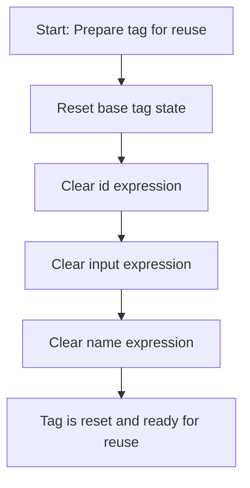

This document describes how an HTML textarea tag handler is reset for reuse. All expression bindings and resource references are cleared so that no previous state affects future uses. The flow receives a tag handler as input and outputs a fully reset handler.

# Resetting HTML Textarea Tag State

<SwmSnippet path="/el/src/main/java/org/apache/strutsel/taglib/html/ELTextareaTag.java" line="900">

---

In <SwmToken path="el/src/main/java/org/apache/strutsel/taglib/html/ELTextareaTag.java" pos="900:5:5" line-data="    public void release() {">`release`</SwmToken>, we start by calling the superclass's release method to handle any cleanup defined higher up the inheritance chain. Next, we need to call <SwmToken path="el/src/main/java/org/apache/strutsel/taglib/bean/ELResourceTag.java" pos="38:4:4" line-data="public class ELResourceTag extends ResourceTag {">`ELResourceTag`</SwmToken>'s release logic to clear out expression-related fields specific to resource handling, making sure no old references stick around.

```java
    public void release() {
        super.release();
```

---

</SwmSnippet>

## Clearing Resource Tag Expressions



<SwmSnippet path="/el/src/main/java/org/apache/strutsel/taglib/bean/ELResourceTag.java" line="108">

---

In <SwmToken path="el/src/main/java/org/apache/strutsel/taglib/bean/ELResourceTag.java" pos="108:5:5" line-data="    public void release() {">`release`</SwmToken>, after the superclass cleanup, we start clearing out the resource-specific expression fields. This step is needed to make sure the tag handler doesn't keep references to any previous state, so the next use starts clean. Next, we call <SwmToken path="el/src/main/java/org/apache/strutsel/taglib/bean/ELResourceTag.java" pos="110:1:1" line-data="        setIdExpr(null);">`setIdExpr`</SwmToken>(null) to clear the id expression.

```java
    public void release() {
        super.release();
        setIdExpr(null);
```

---

</SwmSnippet>

<SwmSnippet path="/el/src/main/java/org/apache/strutsel/taglib/bean/ELResourceTag.java" line="85">

---

<SwmToken path="el/src/main/java/org/apache/strutsel/taglib/bean/ELResourceTag.java" pos="85:5:5" line-data="    public void setIdExpr(String idExpr) {">`setIdExpr`</SwmToken> just assigns the given value to the <SwmToken path="el/src/main/java/org/apache/strutsel/taglib/bean/ELResourceTag.java" pos="85:9:9" line-data="    public void setIdExpr(String idExpr) {">`idExpr`</SwmToken> field. Here, it's used to clear out any previous id expression reference. Next, we call <SwmToken path="el/src/main/java/org/apache/strutsel/taglib/bean/ELResourceTag.java" pos="93:5:5" line-data="    public void setInputExpr(String inputExpr) {">`setInputExpr`</SwmToken>(null) to do the same for the input expression.

```java
    public void setIdExpr(String idExpr) {
        this.idExpr = idExpr;
    }
```

---

</SwmSnippet>

<SwmSnippet path="/el/src/main/java/org/apache/strutsel/taglib/bean/ELResourceTag.java" line="111">

---

Back in ELResourceTag.release, after clearing <SwmToken path="el/src/main/java/org/apache/strutsel/taglib/bean/ELResourceTag.java" pos="85:9:9" line-data="    public void setIdExpr(String idExpr) {">`idExpr`</SwmToken>, we immediately clear <SwmToken path="el/src/main/java/org/apache/strutsel/taglib/bean/ELResourceTag.java" pos="93:9:9" line-data="    public void setInputExpr(String inputExpr) {">`inputExpr`</SwmToken> by calling <SwmToken path="el/src/main/java/org/apache/strutsel/taglib/bean/ELResourceTag.java" pos="111:1:1" line-data="        setInputExpr(null);">`setInputExpr`</SwmToken>(null). This keeps all expression fields reset before the tag handler is reused. Next, <SwmToken path="el/src/main/java/org/apache/strutsel/taglib/html/ELTextareaTag.java" pos="693:5:5" line-data="    public void setNameExpr(String nameExpr) {">`setNameExpr`</SwmToken>(null) is called to finish clearing out the resource-related expressions.

```java
        setInputExpr(null);
```

---

</SwmSnippet>

<SwmSnippet path="/el/src/main/java/org/apache/strutsel/taglib/bean/ELResourceTag.java" line="93">

---

<SwmToken path="el/src/main/java/org/apache/strutsel/taglib/bean/ELResourceTag.java" pos="93:5:5" line-data="    public void setInputExpr(String inputExpr) {">`setInputExpr`</SwmToken> just sets the <SwmToken path="el/src/main/java/org/apache/strutsel/taglib/bean/ELResourceTag.java" pos="93:9:9" line-data="    public void setInputExpr(String inputExpr) {">`inputExpr`</SwmToken> field. Here, it's used to clear any previous input expression reference. Next, <SwmToken path="el/src/main/java/org/apache/strutsel/taglib/html/ELTextareaTag.java" pos="693:5:5" line-data="    public void setNameExpr(String nameExpr) {">`setNameExpr`</SwmToken>(null) is called to clear the name expression.

```java
    public void setInputExpr(String inputExpr) {
        this.inputExpr = inputExpr;
    }
```

---

</SwmSnippet>

<SwmSnippet path="/el/src/main/java/org/apache/strutsel/taglib/bean/ELResourceTag.java" line="112">

---

Back in ELResourceTag.release, after clearing <SwmToken path="el/src/main/java/org/apache/strutsel/taglib/bean/ELResourceTag.java" pos="93:9:9" line-data="    public void setInputExpr(String inputExpr) {">`inputExpr`</SwmToken>, we finish by clearing <SwmToken path="el/src/main/java/org/apache/strutsel/taglib/html/ELTextareaTag.java" pos="693:9:9" line-data="    public void setNameExpr(String nameExpr) {">`nameExpr`</SwmToken> with <SwmToken path="el/src/main/java/org/apache/strutsel/taglib/bean/ELResourceTag.java" pos="112:1:1" line-data="        setNameExpr(null);">`setNameExpr`</SwmToken>(null). This completes the cleanup of all resource-related expression fields.

```java
        setNameExpr(null);
    }
```

---

</SwmSnippet>

<SwmSnippet path="/el/src/main/java/org/apache/strutsel/taglib/bean/ELResourceTag.java" line="101">

---

<SwmToken path="el/src/main/java/org/apache/strutsel/taglib/bean/ELResourceTag.java" pos="101:5:5" line-data="    public void setNameExpr(String nameExpr) {">`setNameExpr`</SwmToken> just sets the <SwmToken path="el/src/main/java/org/apache/strutsel/taglib/bean/ELResourceTag.java" pos="101:9:9" line-data="    public void setNameExpr(String nameExpr) {">`nameExpr`</SwmToken> field. Here, it's used to clear any previous name expression reference as part of the cleanup.

```java
    public void setNameExpr(String nameExpr) {
        this.nameExpr = nameExpr;
    }
```

---

</SwmSnippet>

## Resetting Textarea Expression Bindings

<SwmSnippet path="/el/src/main/java/org/apache/strutsel/taglib/html/ELTextareaTag.java" line="902">

---

Back in ELTextareaTag.release, after cleaning up resource expressions, we start clearing all textarea-specific expression fields. First up is <SwmToken path="el/src/main/java/org/apache/strutsel/taglib/html/ELTextareaTag.java" pos="902:1:1" line-data="        setAccesskeyExpr(null);">`setAccesskeyExpr`</SwmToken>(null), which removes any lingering access key binding.

```java
        setAccesskeyExpr(null);
```

---

</SwmSnippet>

<SwmSnippet path="/el/src/main/java/org/apache/strutsel/taglib/html/ELTextareaTag.java" line="589">

---

<SwmToken path="el/src/main/java/org/apache/strutsel/taglib/html/ELTextareaTag.java" pos="589:5:5" line-data="    public void setAccesskeyExpr(String accessKeyExpr) {">`setAccesskeyExpr`</SwmToken> just sets the <SwmToken path="el/src/main/java/org/apache/strutsel/taglib/html/ELTextareaTag.java" pos="589:9:9" line-data="    public void setAccesskeyExpr(String accessKeyExpr) {">`accessKeyExpr`</SwmToken> field. Here, it's used to clear any previous access key expression reference.

```java
    public void setAccesskeyExpr(String accessKeyExpr) {
        this.accessKeyExpr = accessKeyExpr;
    }
```

---

</SwmSnippet>

<SwmSnippet path="/el/src/main/java/org/apache/strutsel/taglib/html/ELTextareaTag.java" line="903">

---

Back in ELTextareaTag.release, after clearing <SwmToken path="el/src/main/java/org/apache/strutsel/taglib/html/ELTextareaTag.java" pos="589:9:9" line-data="    public void setAccesskeyExpr(String accessKeyExpr) {">`accessKeyExpr`</SwmToken>, we move on to <SwmToken path="el/src/main/java/org/apache/strutsel/taglib/html/ELTextareaTag.java" pos="903:1:1" line-data="        setAltExpr(null);">`setAltExpr`</SwmToken>(null) to clear any lingering alt text expression.

```java
        setAltExpr(null);
```

---

</SwmSnippet>

<SwmSnippet path="/el/src/main/java/org/apache/strutsel/taglib/html/ELTextareaTag.java" line="597">

---

<SwmToken path="el/src/main/java/org/apache/strutsel/taglib/html/ELTextareaTag.java" pos="597:5:5" line-data="    public void setAltExpr(String altExpr) {">`setAltExpr`</SwmToken> just sets the <SwmToken path="el/src/main/java/org/apache/strutsel/taglib/html/ELTextareaTag.java" pos="597:9:9" line-data="    public void setAltExpr(String altExpr) {">`altExpr`</SwmToken> field. Here, it's used to clear any previous alt text expression reference.

```java
    public void setAltExpr(String altExpr) {
        this.altExpr = altExpr;
    }
```

---

</SwmSnippet>

<SwmSnippet path="/el/src/main/java/org/apache/strutsel/taglib/html/ELTextareaTag.java" line="904">

---

Back in ELTextareaTag.release, after clearing <SwmToken path="el/src/main/java/org/apache/strutsel/taglib/html/ELTextareaTag.java" pos="597:9:9" line-data="    public void setAltExpr(String altExpr) {">`altExpr`</SwmToken>, we call <SwmToken path="el/src/main/java/org/apache/strutsel/taglib/html/ELTextareaTag.java" pos="904:1:1" line-data="        setAltKeyExpr(null);">`setAltKeyExpr`</SwmToken>(null) to remove any previous alt key expression reference.

```java
        setAltKeyExpr(null);
```

---

</SwmSnippet>

<SwmSnippet path="/el/src/main/java/org/apache/strutsel/taglib/html/ELTextareaTag.java" line="605">

---

<SwmToken path="el/src/main/java/org/apache/strutsel/taglib/html/ELTextareaTag.java" pos="605:5:5" line-data="    public void setAltKeyExpr(String altKeyExpr) {">`setAltKeyExpr`</SwmToken> just sets the <SwmToken path="el/src/main/java/org/apache/strutsel/taglib/html/ELTextareaTag.java" pos="605:9:9" line-data="    public void setAltKeyExpr(String altKeyExpr) {">`altKeyExpr`</SwmToken> field. Here, it's used to clear any previous alt key expression reference.

```java
    public void setAltKeyExpr(String altKeyExpr) {
        this.altKeyExpr = altKeyExpr;
    }
```

---

</SwmSnippet>

<SwmSnippet path="/el/src/main/java/org/apache/strutsel/taglib/html/ELTextareaTag.java" line="905">

---

Back in ELTextareaTag.release, after clearing <SwmToken path="el/src/main/java/org/apache/strutsel/taglib/html/ELTextareaTag.java" pos="605:9:9" line-data="    public void setAltKeyExpr(String altKeyExpr) {">`altKeyExpr`</SwmToken>, we call <SwmToken path="el/src/main/java/org/apache/strutsel/taglib/html/ELTextareaTag.java" pos="905:1:1" line-data="        setBundleExpr(null);">`setBundleExpr`</SwmToken>(null) to clear any previous bundle expression reference.

```java
        setBundleExpr(null);
```

---

</SwmSnippet>

<SwmSnippet path="/el/src/main/java/org/apache/strutsel/taglib/html/ELTextareaTag.java" line="613">

---

<SwmToken path="el/src/main/java/org/apache/strutsel/taglib/html/ELTextareaTag.java" pos="613:5:5" line-data="    public void setBundleExpr(String bundleExpr) {">`setBundleExpr`</SwmToken> just sets the <SwmToken path="el/src/main/java/org/apache/strutsel/taglib/html/ELTextareaTag.java" pos="613:9:9" line-data="    public void setBundleExpr(String bundleExpr) {">`bundleExpr`</SwmToken> field. Here, it's used to clear any previous bundle expression reference.

```java
    public void setBundleExpr(String bundleExpr) {
        this.bundleExpr = bundleExpr;
    }
```

---

</SwmSnippet>

<SwmSnippet path="/el/src/main/java/org/apache/strutsel/taglib/html/ELTextareaTag.java" line="906">

---

Back in ELTextareaTag.release, after clearing <SwmToken path="el/src/main/java/org/apache/strutsel/taglib/html/ELTextareaTag.java" pos="613:9:9" line-data="    public void setBundleExpr(String bundleExpr) {">`bundleExpr`</SwmToken>, we call <SwmToken path="el/src/main/java/org/apache/strutsel/taglib/html/ELTextareaTag.java" pos="906:1:1" line-data="        setColsExpr(null);">`setColsExpr`</SwmToken>(null) to clear any previous column expression reference.

```java
        setColsExpr(null);
```

---

</SwmSnippet>

<SwmSnippet path="/el/src/main/java/org/apache/strutsel/taglib/html/ELTextareaTag.java" line="621">

---

<SwmToken path="el/src/main/java/org/apache/strutsel/taglib/html/ELTextareaTag.java" pos="621:5:5" line-data="    public void setColsExpr(String colsExpr) {">`setColsExpr`</SwmToken> just sets the <SwmToken path="el/src/main/java/org/apache/strutsel/taglib/html/ELTextareaTag.java" pos="621:9:9" line-data="    public void setColsExpr(String colsExpr) {">`colsExpr`</SwmToken> field. Here, it's used to clear any previous column expression reference.

```java
    public void setColsExpr(String colsExpr) {
        this.colsExpr = colsExpr;
    }
```

---

</SwmSnippet>

<SwmSnippet path="/el/src/main/java/org/apache/strutsel/taglib/html/ELTextareaTag.java" line="907">

---

Back in ELTextareaTag.release, after clearing <SwmToken path="el/src/main/java/org/apache/strutsel/taglib/html/ELTextareaTag.java" pos="621:9:9" line-data="    public void setColsExpr(String colsExpr) {">`colsExpr`</SwmToken>, we call <SwmToken path="el/src/main/java/org/apache/strutsel/taglib/html/ELTextareaTag.java" pos="907:1:1" line-data="        setDirExpr(null);">`setDirExpr`</SwmToken>(null) to clear any previous direction expression reference.

```java
        setDirExpr(null);
```

---

</SwmSnippet>

<SwmSnippet path="/el/src/main/java/org/apache/strutsel/taglib/html/ELTextareaTag.java" line="629">

---

<SwmToken path="el/src/main/java/org/apache/strutsel/taglib/html/ELTextareaTag.java" pos="629:5:5" line-data="    public void setDirExpr(String dirExpr) {">`setDirExpr`</SwmToken> just sets the <SwmToken path="el/src/main/java/org/apache/strutsel/taglib/html/ELTextareaTag.java" pos="629:9:9" line-data="    public void setDirExpr(String dirExpr) {">`dirExpr`</SwmToken> field. Here, it's used to clear any previous direction expression reference.

```java
    public void setDirExpr(String dirExpr) {
        this.dirExpr = dirExpr;
    }
```

---

</SwmSnippet>

<SwmSnippet path="/el/src/main/java/org/apache/strutsel/taglib/html/ELTextareaTag.java" line="908">

---

Back in ELTextareaTag.release, after clearing <SwmToken path="el/src/main/java/org/apache/strutsel/taglib/html/ELTextareaTag.java" pos="629:9:9" line-data="    public void setDirExpr(String dirExpr) {">`dirExpr`</SwmToken>, we call <SwmToken path="el/src/main/java/org/apache/strutsel/taglib/html/ELTextareaTag.java" pos="908:1:1" line-data="        setDisabledExpr(null);">`setDisabledExpr`</SwmToken>(null) to clear any previous disabled expression reference.

```java
        setDisabledExpr(null);
```

---

</SwmSnippet>

<SwmSnippet path="/el/src/main/java/org/apache/strutsel/taglib/html/ELTextareaTag.java" line="637">

---

<SwmToken path="el/src/main/java/org/apache/strutsel/taglib/html/ELTextareaTag.java" pos="637:5:5" line-data="    public void setDisabledExpr(String disabledExpr) {">`setDisabledExpr`</SwmToken> just sets the <SwmToken path="el/src/main/java/org/apache/strutsel/taglib/html/ELTextareaTag.java" pos="637:9:9" line-data="    public void setDisabledExpr(String disabledExpr) {">`disabledExpr`</SwmToken> field. Here, it's used to clear any previous disabled expression reference.

```java
    public void setDisabledExpr(String disabledExpr) {
        this.disabledExpr = disabledExpr;
    }
```

---

</SwmSnippet>

<SwmSnippet path="/el/src/main/java/org/apache/strutsel/taglib/html/ELTextareaTag.java" line="909">

---

Back in ELTextareaTag.release, after clearing <SwmToken path="el/src/main/java/org/apache/strutsel/taglib/html/ELTextareaTag.java" pos="637:9:9" line-data="    public void setDisabledExpr(String disabledExpr) {">`disabledExpr`</SwmToken>, we call <SwmToken path="el/src/main/java/org/apache/strutsel/taglib/html/ELTextareaTag.java" pos="909:1:1" line-data="        setErrorKeyExpr(null);">`setErrorKeyExpr`</SwmToken>(null) to clear any previous error key expression reference.

```java
        setErrorKeyExpr(null);
```

---

</SwmSnippet>

<SwmSnippet path="/el/src/main/java/org/apache/strutsel/taglib/html/ELTextareaTag.java" line="645">

---

<SwmToken path="el/src/main/java/org/apache/strutsel/taglib/html/ELTextareaTag.java" pos="645:5:5" line-data="    public void setErrorKeyExpr(String errorKeyExpr) {">`setErrorKeyExpr`</SwmToken> just sets the <SwmToken path="el/src/main/java/org/apache/strutsel/taglib/html/ELTextareaTag.java" pos="645:9:9" line-data="    public void setErrorKeyExpr(String errorKeyExpr) {">`errorKeyExpr`</SwmToken> field. Here, it's used to clear any previous error key expression reference.

```java
    public void setErrorKeyExpr(String errorKeyExpr) {
        this.errorKeyExpr = errorKeyExpr;
    }
```

---

</SwmSnippet>

<SwmSnippet path="/el/src/main/java/org/apache/strutsel/taglib/html/ELTextareaTag.java" line="910">

---

Back in ELTextareaTag.release, after clearing <SwmToken path="el/src/main/java/org/apache/strutsel/taglib/html/ELTextareaTag.java" pos="645:9:9" line-data="    public void setErrorKeyExpr(String errorKeyExpr) {">`errorKeyExpr`</SwmToken>, we call <SwmToken path="el/src/main/java/org/apache/strutsel/taglib/html/ELTextareaTag.java" pos="910:1:1" line-data="        setErrorStyleExpr(null);">`setErrorStyleExpr`</SwmToken>(null) to clear any previous error style expression reference.

```java
        setErrorStyleExpr(null);
```

---

</SwmSnippet>

<SwmSnippet path="/el/src/main/java/org/apache/strutsel/taglib/html/ELTextareaTag.java" line="653">

---

<SwmToken path="el/src/main/java/org/apache/strutsel/taglib/html/ELTextareaTag.java" pos="653:5:5" line-data="    public void setErrorStyleExpr(String errorStyleExpr) {">`setErrorStyleExpr`</SwmToken> just sets the <SwmToken path="el/src/main/java/org/apache/strutsel/taglib/html/ELTextareaTag.java" pos="653:9:9" line-data="    public void setErrorStyleExpr(String errorStyleExpr) {">`errorStyleExpr`</SwmToken> field. Here, it's used to clear any previous error style expression reference.

```java
    public void setErrorStyleExpr(String errorStyleExpr) {
        this.errorStyleExpr = errorStyleExpr;
    }
```

---

</SwmSnippet>

<SwmSnippet path="/el/src/main/java/org/apache/strutsel/taglib/html/ELTextareaTag.java" line="911">

---

Back in ELTextareaTag.release, after clearing <SwmToken path="el/src/main/java/org/apache/strutsel/taglib/html/ELTextareaTag.java" pos="653:9:9" line-data="    public void setErrorStyleExpr(String errorStyleExpr) {">`errorStyleExpr`</SwmToken>, we call <SwmToken path="el/src/main/java/org/apache/strutsel/taglib/html/ELTextareaTag.java" pos="911:1:1" line-data="        setErrorStyleClassExpr(null);">`setErrorStyleClassExpr`</SwmToken>(null) to clear any previous error style class expression reference.

```java
        setErrorStyleClassExpr(null);
```

---

</SwmSnippet>

<SwmSnippet path="/el/src/main/java/org/apache/strutsel/taglib/html/ELTextareaTag.java" line="661">

---

<SwmToken path="el/src/main/java/org/apache/strutsel/taglib/html/ELTextareaTag.java" pos="661:5:5" line-data="    public void setErrorStyleClassExpr(String errorStyleClassExpr) {">`setErrorStyleClassExpr`</SwmToken> just sets the <SwmToken path="el/src/main/java/org/apache/strutsel/taglib/html/ELTextareaTag.java" pos="661:9:9" line-data="    public void setErrorStyleClassExpr(String errorStyleClassExpr) {">`errorStyleClassExpr`</SwmToken> field. Here, it's used to clear any previous error style class expression reference.

```java
    public void setErrorStyleClassExpr(String errorStyleClassExpr) {
        this.errorStyleClassExpr = errorStyleClassExpr;
    }
```

---

</SwmSnippet>

<SwmSnippet path="/el/src/main/java/org/apache/strutsel/taglib/html/ELTextareaTag.java" line="912">

---

Back in ELTextareaTag.release, after clearing <SwmToken path="el/src/main/java/org/apache/strutsel/taglib/html/ELTextareaTag.java" pos="661:9:9" line-data="    public void setErrorStyleClassExpr(String errorStyleClassExpr) {">`errorStyleClassExpr`</SwmToken>, we call <SwmToken path="el/src/main/java/org/apache/strutsel/taglib/html/ELTextareaTag.java" pos="912:1:1" line-data="        setErrorStyleIdExpr(null);">`setErrorStyleIdExpr`</SwmToken>(null) to clear any previous error style id expression reference.

```java
        setErrorStyleIdExpr(null);
```

---

</SwmSnippet>

<SwmSnippet path="/el/src/main/java/org/apache/strutsel/taglib/html/ELTextareaTag.java" line="669">

---

<SwmToken path="el/src/main/java/org/apache/strutsel/taglib/html/ELTextareaTag.java" pos="669:5:5" line-data="    public void setErrorStyleIdExpr(String errorStyleIdExpr) {">`setErrorStyleIdExpr`</SwmToken> just sets the <SwmToken path="el/src/main/java/org/apache/strutsel/taglib/html/ELTextareaTag.java" pos="669:9:9" line-data="    public void setErrorStyleIdExpr(String errorStyleIdExpr) {">`errorStyleIdExpr`</SwmToken> field. Here, it's used to clear any previous error style id expression reference.

```java
    public void setErrorStyleIdExpr(String errorStyleIdExpr) {
        this.errorStyleIdExpr = errorStyleIdExpr;
    }
```

---

</SwmSnippet>

<SwmSnippet path="/el/src/main/java/org/apache/strutsel/taglib/html/ELTextareaTag.java" line="913">

---

Back in ELTextareaTag.release, after clearing <SwmToken path="el/src/main/java/org/apache/strutsel/taglib/html/ELTextareaTag.java" pos="669:9:9" line-data="    public void setErrorStyleIdExpr(String errorStyleIdExpr) {">`errorStyleIdExpr`</SwmToken>, we call <SwmToken path="el/src/main/java/org/apache/strutsel/taglib/html/ELTextareaTag.java" pos="913:1:1" line-data="        setIndexedExpr(null);">`setIndexedExpr`</SwmToken>(null) to clear any previous indexed expression reference.

```java
        setIndexedExpr(null);
```

---

</SwmSnippet>

<SwmSnippet path="/el/src/main/java/org/apache/strutsel/taglib/html/ELTextareaTag.java" line="677">

---

<SwmToken path="el/src/main/java/org/apache/strutsel/taglib/html/ELTextareaTag.java" pos="677:5:5" line-data="    public void setIndexedExpr(String indexedExpr) {">`setIndexedExpr`</SwmToken> just sets the <SwmToken path="el/src/main/java/org/apache/strutsel/taglib/html/ELTextareaTag.java" pos="677:9:9" line-data="    public void setIndexedExpr(String indexedExpr) {">`indexedExpr`</SwmToken> field. Here, it's used to clear any previous indexed expression reference.

```java
    public void setIndexedExpr(String indexedExpr) {
        this.indexedExpr = indexedExpr;
    }
```

---

</SwmSnippet>

<SwmSnippet path="/el/src/main/java/org/apache/strutsel/taglib/html/ELTextareaTag.java" line="914">

---

Back in ELTextareaTag.release, after clearing <SwmToken path="el/src/main/java/org/apache/strutsel/taglib/html/ELTextareaTag.java" pos="677:9:9" line-data="    public void setIndexedExpr(String indexedExpr) {">`indexedExpr`</SwmToken>, we call <SwmToken path="el/src/main/java/org/apache/strutsel/taglib/html/ELTextareaTag.java" pos="914:1:1" line-data="        setLangExpr(null);">`setLangExpr`</SwmToken>(null) to clear any previous language expression reference.

```java
        setLangExpr(null);
```

---

</SwmSnippet>

<SwmSnippet path="/el/src/main/java/org/apache/strutsel/taglib/html/ELTextareaTag.java" line="685">

---

<SwmToken path="el/src/main/java/org/apache/strutsel/taglib/html/ELTextareaTag.java" pos="685:5:5" line-data="    public void setLangExpr(String langExpr) {">`setLangExpr`</SwmToken> just sets the <SwmToken path="el/src/main/java/org/apache/strutsel/taglib/html/ELTextareaTag.java" pos="685:9:9" line-data="    public void setLangExpr(String langExpr) {">`langExpr`</SwmToken> field. Here, it's used to clear any previous language expression reference.

```java
    public void setLangExpr(String langExpr) {
        this.langExpr = langExpr;
    }
```

---

</SwmSnippet>

<SwmSnippet path="/el/src/main/java/org/apache/strutsel/taglib/html/ELTextareaTag.java" line="915">

---

Back in ELTextareaTag.release, after clearing <SwmToken path="el/src/main/java/org/apache/strutsel/taglib/html/ELTextareaTag.java" pos="685:9:9" line-data="    public void setLangExpr(String langExpr) {">`langExpr`</SwmToken>, we call <SwmToken path="el/src/main/java/org/apache/strutsel/taglib/html/ELTextareaTag.java" pos="915:1:1" line-data="        setNameExpr(null);">`setNameExpr`</SwmToken>(null) to clear any previous name expression reference.

```java
        setNameExpr(null);
```

---

</SwmSnippet>

<SwmSnippet path="/el/src/main/java/org/apache/strutsel/taglib/html/ELTextareaTag.java" line="693">

---

<SwmToken path="el/src/main/java/org/apache/strutsel/taglib/html/ELTextareaTag.java" pos="693:5:5" line-data="    public void setNameExpr(String nameExpr) {">`setNameExpr`</SwmToken> just sets the <SwmToken path="el/src/main/java/org/apache/strutsel/taglib/html/ELTextareaTag.java" pos="693:9:9" line-data="    public void setNameExpr(String nameExpr) {">`nameExpr`</SwmToken> field. Here, it's used to clear any previous name expression reference.

```java
    public void setNameExpr(String nameExpr) {
        this.nameExpr = nameExpr;
    }
```

---

</SwmSnippet>

<SwmSnippet path="/el/src/main/java/org/apache/strutsel/taglib/html/ELTextareaTag.java" line="916">

---

Back in ELTextareaTag.release, after clearing <SwmToken path="el/src/main/java/org/apache/strutsel/taglib/html/ELTextareaTag.java" pos="693:9:9" line-data="    public void setNameExpr(String nameExpr) {">`nameExpr`</SwmToken>, we call <SwmToken path="el/src/main/java/org/apache/strutsel/taglib/html/ELTextareaTag.java" pos="916:1:1" line-data="        setOnblurExpr(null);">`setOnblurExpr`</SwmToken>(null) to clear any previous onblur expression reference.

```java
        setOnblurExpr(null);
```

---

</SwmSnippet>

<SwmSnippet path="/el/src/main/java/org/apache/strutsel/taglib/html/ELTextareaTag.java" line="701">

---

<SwmToken path="el/src/main/java/org/apache/strutsel/taglib/html/ELTextareaTag.java" pos="701:5:5" line-data="    public void setOnblurExpr(String onblurExpr) {">`setOnblurExpr`</SwmToken> just sets the <SwmToken path="el/src/main/java/org/apache/strutsel/taglib/html/ELTextareaTag.java" pos="701:9:9" line-data="    public void setOnblurExpr(String onblurExpr) {">`onblurExpr`</SwmToken> field. Here, it's used to clear any previous onblur expression reference.

```java
    public void setOnblurExpr(String onblurExpr) {
        this.onblurExpr = onblurExpr;
    }
```

---

</SwmSnippet>

<SwmSnippet path="/el/src/main/java/org/apache/strutsel/taglib/html/ELTextareaTag.java" line="917">

---

Back in ELTextareaTag.release, after clearing <SwmToken path="el/src/main/java/org/apache/strutsel/taglib/html/ELTextareaTag.java" pos="701:9:9" line-data="    public void setOnblurExpr(String onblurExpr) {">`onblurExpr`</SwmToken>, we call <SwmToken path="el/src/main/java/org/apache/strutsel/taglib/html/ELTextareaTag.java" pos="917:1:1" line-data="        setOnchangeExpr(null);">`setOnchangeExpr`</SwmToken>(null) to wipe any leftover onchange binding. This keeps the tag handler from carrying old onchange logic into the next usage.

```java
        setOnchangeExpr(null);
```

---

</SwmSnippet>

<SwmSnippet path="/el/src/main/java/org/apache/strutsel/taglib/html/ELTextareaTag.java" line="709">

---

SetOnchangeExpr just assigns the provided string to the <SwmToken path="el/src/main/java/org/apache/strutsel/taglib/html/ELTextareaTag.java" pos="709:9:9" line-data="    public void setOnchangeExpr(String onchangeExpr) {">`onchangeExpr`</SwmToken> field. It's a plain setter, no extra logic, just resets the binding for the next tag instance.

```java
    public void setOnchangeExpr(String onchangeExpr) {
        this.onchangeExpr = onchangeExpr;
    }
```

---

</SwmSnippet>

<SwmSnippet path="/el/src/main/java/org/apache/strutsel/taglib/html/ELTextareaTag.java" line="918">

---

After ELTextareaTag.setOnchangeExpr returns, ELTextareaTag.release calls <SwmToken path="el/src/main/java/org/apache/strutsel/taglib/html/ELTextareaTag.java" pos="918:1:1" line-data="        setOnclickExpr(null);">`setOnclickExpr`</SwmToken>(null) to clear any previous click event binding. This prevents stale click handlers from sticking around when the tag is reused.

```java
        setOnclickExpr(null);
```

---

</SwmSnippet>

<SwmSnippet path="/el/src/main/java/org/apache/strutsel/taglib/html/ELTextareaTag.java" line="717">

---

SetOnclickExpr just sets the <SwmToken path="el/src/main/java/org/apache/strutsel/taglib/html/ELTextareaTag.java" pos="717:9:9" line-data="    public void setOnclickExpr(String onclickExpr) {">`onclickExpr`</SwmToken> field to whatever string you pass in. It's a basic setter, used here to clear out any previous click event binding.

```java
    public void setOnclickExpr(String onclickExpr) {
        this.onclickExpr = onclickExpr;
    }
```

---

</SwmSnippet>

<SwmSnippet path="/el/src/main/java/org/apache/strutsel/taglib/html/ELTextareaTag.java" line="919">

---

After ELTextareaTag.setOnclickExpr finishes, ELTextareaTag.release moves on to <SwmToken path="el/src/main/java/org/apache/strutsel/taglib/html/ELTextareaTag.java" pos="919:1:1" line-data="        setOndblclickExpr(null);">`setOndblclickExpr`</SwmToken>(null) to clear any double-click event binding. This ensures the tag handler doesn't keep old double-click logic.

```java
        setOndblclickExpr(null);
```

---

</SwmSnippet>

<SwmSnippet path="/el/src/main/java/org/apache/strutsel/taglib/html/ELTextareaTag.java" line="725">

---

SetOndblclickExpr just assigns the given string to the <SwmToken path="el/src/main/java/org/apache/strutsel/taglib/html/ELTextareaTag.java" pos="725:9:9" line-data="    public void setOndblclickExpr(String ondblclickExpr) {">`ondblclickExpr`</SwmToken> field. It's a plain setter, used here to clear out any double-click event binding.

```java
    public void setOndblclickExpr(String ondblclickExpr) {
        this.ondblclickExpr = ondblclickExpr;
    }
```

---

</SwmSnippet>

<SwmSnippet path="/el/src/main/java/org/apache/strutsel/taglib/html/ELTextareaTag.java" line="920">

---

After ELTextareaTag.setOndblclickExpr returns, ELTextareaTag.release calls <SwmToken path="el/src/main/java/org/apache/strutsel/taglib/html/ELTextareaTag.java" pos="920:1:1" line-data="        setOnfocusExpr(null);">`setOnfocusExpr`</SwmToken>(null) to clear any focus event binding. This keeps the tag handler from holding onto old focus logic.

```java
        setOnfocusExpr(null);
```

---

</SwmSnippet>

<SwmSnippet path="/el/src/main/java/org/apache/strutsel/taglib/html/ELTextareaTag.java" line="733">

---

SetOnfocusExpr just sets the <SwmToken path="el/src/main/java/org/apache/strutsel/taglib/html/ELTextareaTag.java" pos="733:9:9" line-data="    public void setOnfocusExpr(String onfocusExpr) {">`onfocusExpr`</SwmToken> field to the provided string. It's a basic setter, used here to clear any focus event binding.

```java
    public void setOnfocusExpr(String onfocusExpr) {
        this.onfocusExpr = onfocusExpr;
    }
```

---

</SwmSnippet>

<SwmSnippet path="/el/src/main/java/org/apache/strutsel/taglib/html/ELTextareaTag.java" line="921">

---

After ELTextareaTag.setOnfocusExpr, ELTextareaTag.release calls <SwmToken path="el/src/main/java/org/apache/strutsel/taglib/html/ELTextareaTag.java" pos="921:1:1" line-data="        setOnkeydownExpr(null);">`setOnkeydownExpr`</SwmToken>(null) to clear any keydown event binding. This prevents old keydown handlers from sticking around.

```java
        setOnkeydownExpr(null);
```

---

</SwmSnippet>

<SwmSnippet path="/el/src/main/java/org/apache/strutsel/taglib/html/ELTextareaTag.java" line="741">

---

SetOnkeydownExpr just assigns the input string to the <SwmToken path="el/src/main/java/org/apache/strutsel/taglib/html/ELTextareaTag.java" pos="741:9:9" line-data="    public void setOnkeydownExpr(String onkeydownExpr) {">`onkeydownExpr`</SwmToken> field. It's a standard setter, used here to clear any keydown event binding.

```java
    public void setOnkeydownExpr(String onkeydownExpr) {
        this.onkeydownExpr = onkeydownExpr;
    }
```

---

</SwmSnippet>

<SwmSnippet path="/el/src/main/java/org/apache/strutsel/taglib/html/ELTextareaTag.java" line="922">

---

After ELTextareaTag.setOnkeydownExpr, ELTextareaTag.release calls <SwmToken path="el/src/main/java/org/apache/strutsel/taglib/html/ELTextareaTag.java" pos="922:1:1" line-data="        setOnkeypressExpr(null);">`setOnkeypressExpr`</SwmToken>(null) to clear any keypress event binding. This keeps the tag handler from carrying over old keypress logic.

```java
        setOnkeypressExpr(null);
```

---

</SwmSnippet>

<SwmSnippet path="/el/src/main/java/org/apache/strutsel/taglib/html/ELTextareaTag.java" line="749">

---

SetOnkeypressExpr just sets the <SwmToken path="el/src/main/java/org/apache/strutsel/taglib/html/ELTextareaTag.java" pos="749:9:9" line-data="    public void setOnkeypressExpr(String onkeypressExpr) {">`onkeypressExpr`</SwmToken> field to the input string. It's a plain setter, used here to clear any keypress event binding.

```java
    public void setOnkeypressExpr(String onkeypressExpr) {
        this.onkeypressExpr = onkeypressExpr;
    }
```

---

</SwmSnippet>

<SwmSnippet path="/el/src/main/java/org/apache/strutsel/taglib/html/ELTextareaTag.java" line="923">

---

After ELTextareaTag.setOnkeypressExpr, ELTextareaTag.release calls <SwmToken path="el/src/main/java/org/apache/strutsel/taglib/html/ELTextareaTag.java" pos="923:1:1" line-data="        setOnkeyupExpr(null);">`setOnkeyupExpr`</SwmToken>(null) to clear any keyup event binding. This prevents stale keyup handlers from sticking around.

```java
        setOnkeyupExpr(null);
```

---

</SwmSnippet>

<SwmSnippet path="/el/src/main/java/org/apache/strutsel/taglib/html/ELTextareaTag.java" line="757">

---

SetOnkeyupExpr just sets the <SwmToken path="el/src/main/java/org/apache/strutsel/taglib/html/ELTextareaTag.java" pos="757:9:9" line-data="    public void setOnkeyupExpr(String onkeyupExpr) {">`onkeyupExpr`</SwmToken> field to the input string. It's a basic setter, used here to clear any keyup event binding.

```java
    public void setOnkeyupExpr(String onkeyupExpr) {
        this.onkeyupExpr = onkeyupExpr;
    }
```

---

</SwmSnippet>

<SwmSnippet path="/el/src/main/java/org/apache/strutsel/taglib/html/ELTextareaTag.java" line="924">

---

After ELTextareaTag.setOnkeyupExpr, ELTextareaTag.release calls <SwmToken path="el/src/main/java/org/apache/strutsel/taglib/html/ELTextareaTag.java" pos="924:1:1" line-data="        setOnmousedownExpr(null);">`setOnmousedownExpr`</SwmToken>(null) to clear any mousedown event binding. This keeps the tag handler from holding onto old mousedown logic.

```java
        setOnmousedownExpr(null);
```

---

</SwmSnippet>

<SwmSnippet path="/el/src/main/java/org/apache/strutsel/taglib/html/ELTextareaTag.java" line="765">

---

SetOnmousedownExpr just sets the <SwmToken path="el/src/main/java/org/apache/strutsel/taglib/html/ELTextareaTag.java" pos="765:9:9" line-data="    public void setOnmousedownExpr(String onmousedownExpr) {">`onmousedownExpr`</SwmToken> field to the input string. It's a basic setter, used here to clear any mousedown event binding.

```java
    public void setOnmousedownExpr(String onmousedownExpr) {
        this.onmousedownExpr = onmousedownExpr;
    }
```

---

</SwmSnippet>

<SwmSnippet path="/el/src/main/java/org/apache/strutsel/taglib/html/ELTextareaTag.java" line="925">

---

After ELTextareaTag.setOnmousedownExpr, ELTextareaTag.release calls <SwmToken path="el/src/main/java/org/apache/strutsel/taglib/html/ELTextareaTag.java" pos="925:1:1" line-data="        setOnmousemoveExpr(null);">`setOnmousemoveExpr`</SwmToken>(null) to clear any mousemove event binding. This prevents old mousemove handlers from sticking around.

```java
        setOnmousemoveExpr(null);
```

---

</SwmSnippet>

<SwmSnippet path="/el/src/main/java/org/apache/strutsel/taglib/html/ELTextareaTag.java" line="773">

---

SetOnmousemoveExpr just sets the <SwmToken path="el/src/main/java/org/apache/strutsel/taglib/html/ELTextareaTag.java" pos="773:9:9" line-data="    public void setOnmousemoveExpr(String onmousemoveExpr) {">`onmousemoveExpr`</SwmToken> field to the input string. It's a basic setter, used here to clear any mousemove event binding.

```java
    public void setOnmousemoveExpr(String onmousemoveExpr) {
        this.onmousemoveExpr = onmousemoveExpr;
    }
```

---

</SwmSnippet>

<SwmSnippet path="/el/src/main/java/org/apache/strutsel/taglib/html/ELTextareaTag.java" line="926">

---

After ELTextareaTag.setOnmousemoveExpr, ELTextareaTag.release calls <SwmToken path="el/src/main/java/org/apache/strutsel/taglib/html/ELTextareaTag.java" pos="926:1:1" line-data="        setOnmouseoutExpr(null);">`setOnmouseoutExpr`</SwmToken>(null) to clear any mouseout event binding. This keeps the tag handler from holding onto old mouseout logic.

```java
        setOnmouseoutExpr(null);
```

---

</SwmSnippet>

<SwmSnippet path="/el/src/main/java/org/apache/strutsel/taglib/html/ELTextareaTag.java" line="781">

---

SetOnmouseoutExpr just sets the <SwmToken path="el/src/main/java/org/apache/strutsel/taglib/html/ELTextareaTag.java" pos="781:9:9" line-data="    public void setOnmouseoutExpr(String onmouseoutExpr) {">`onmouseoutExpr`</SwmToken> field to the input string. It's a basic setter, used here to clear any mouseout event binding.

```java
    public void setOnmouseoutExpr(String onmouseoutExpr) {
        this.onmouseoutExpr = onmouseoutExpr;
    }
```

---

</SwmSnippet>

<SwmSnippet path="/el/src/main/java/org/apache/strutsel/taglib/html/ELTextareaTag.java" line="927">

---

After ELTextareaTag.setOnmouseoutExpr, ELTextareaTag.release calls <SwmToken path="el/src/main/java/org/apache/strutsel/taglib/html/ELTextareaTag.java" pos="927:1:1" line-data="        setOnmouseoverExpr(null);">`setOnmouseoverExpr`</SwmToken>(null) to clear any mouseover event binding. This prevents stale mouseover handlers from sticking around.

```java
        setOnmouseoverExpr(null);
```

---

</SwmSnippet>

<SwmSnippet path="/el/src/main/java/org/apache/strutsel/taglib/html/ELTextareaTag.java" line="789">

---

SetOnmouseoverExpr just sets the <SwmToken path="el/src/main/java/org/apache/strutsel/taglib/html/ELTextareaTag.java" pos="789:9:9" line-data="    public void setOnmouseoverExpr(String onmouseoverExpr) {">`onmouseoverExpr`</SwmToken> field to the input string. It's a basic setter, used here to clear any mouseover event binding.

```java
    public void setOnmouseoverExpr(String onmouseoverExpr) {
        this.onmouseoverExpr = onmouseoverExpr;
    }
```

---

</SwmSnippet>

<SwmSnippet path="/el/src/main/java/org/apache/strutsel/taglib/html/ELTextareaTag.java" line="928">

---

After ELTextareaTag.setOnmouseoverExpr, ELTextareaTag.release calls <SwmToken path="el/src/main/java/org/apache/strutsel/taglib/html/ELTextareaTag.java" pos="928:1:1" line-data="        setOnmouseupExpr(null);">`setOnmouseupExpr`</SwmToken>(null) to clear any mouseup event binding. This keeps the tag handler from holding onto old mouseup logic.

```java
        setOnmouseupExpr(null);
```

---

</SwmSnippet>

<SwmSnippet path="/el/src/main/java/org/apache/strutsel/taglib/html/ELTextareaTag.java" line="797">

---

SetOnmouseupExpr just sets the <SwmToken path="el/src/main/java/org/apache/strutsel/taglib/html/ELTextareaTag.java" pos="797:9:9" line-data="    public void setOnmouseupExpr(String onmouseupExpr) {">`onmouseupExpr`</SwmToken> field to the input string. It's a basic setter, used here to clear any mouseup event binding.

```java
    public void setOnmouseupExpr(String onmouseupExpr) {
        this.onmouseupExpr = onmouseupExpr;
    }
```

---

</SwmSnippet>

<SwmSnippet path="/el/src/main/java/org/apache/strutsel/taglib/html/ELTextareaTag.java" line="929">

---

After ELTextareaTag.setOnmouseupExpr, ELTextareaTag.release calls <SwmToken path="el/src/main/java/org/apache/strutsel/taglib/html/ELTextareaTag.java" pos="929:1:1" line-data="        setOnselectExpr(null);">`setOnselectExpr`</SwmToken>(null) to clear any select event binding. This prevents old select handlers from sticking around.

```java
        setOnselectExpr(null);
```

---

</SwmSnippet>

<SwmSnippet path="/el/src/main/java/org/apache/strutsel/taglib/html/ELTextareaTag.java" line="805">

---

SetOnselectExpr just sets the <SwmToken path="el/src/main/java/org/apache/strutsel/taglib/html/ELTextareaTag.java" pos="805:9:9" line-data="    public void setOnselectExpr(String onselectExpr) {">`onselectExpr`</SwmToken> field to the input string. It's a basic setter, used here to clear any select event binding.

```java
    public void setOnselectExpr(String onselectExpr) {
        this.onselectExpr = onselectExpr;
    }
```

---

</SwmSnippet>

<SwmSnippet path="/el/src/main/java/org/apache/strutsel/taglib/html/ELTextareaTag.java" line="930">

---

After ELTextareaTag.setOnselectExpr, ELTextareaTag.release calls <SwmToken path="el/src/main/java/org/apache/strutsel/taglib/html/ELTextareaTag.java" pos="930:1:1" line-data="        setPropertyExpr(null);">`setPropertyExpr`</SwmToken>(null) to clear any property binding. This keeps the tag handler from holding onto old property logic.

```java
        setPropertyExpr(null);
```

---

</SwmSnippet>

<SwmSnippet path="/el/src/main/java/org/apache/strutsel/taglib/html/ELTextareaTag.java" line="813">

---

SetPropertyExpr just sets the <SwmToken path="el/src/main/java/org/apache/strutsel/taglib/html/ELTextareaTag.java" pos="813:9:9" line-data="    public void setPropertyExpr(String propertyExpr) {">`propertyExpr`</SwmToken> field to the input string. It's a basic setter, used here to clear any property binding.

```java
    public void setPropertyExpr(String propertyExpr) {
        this.propertyExpr = propertyExpr;
    }
```

---

</SwmSnippet>

<SwmSnippet path="/el/src/main/java/org/apache/strutsel/taglib/html/ELTextareaTag.java" line="931">

---

After ELTextareaTag.setPropertyExpr, ELTextareaTag.release calls <SwmToken path="el/src/main/java/org/apache/strutsel/taglib/html/ELTextareaTag.java" pos="931:1:1" line-data="        setReadonlyExpr(null);">`setReadonlyExpr`</SwmToken>(null) to clear any readonly binding. This prevents stale readonly logic from sticking around.

```java
        setReadonlyExpr(null);
```

---

</SwmSnippet>

<SwmSnippet path="/el/src/main/java/org/apache/strutsel/taglib/html/ELTextareaTag.java" line="821">

---

SetReadonlyExpr just sets the <SwmToken path="el/src/main/java/org/apache/strutsel/taglib/html/ELTextareaTag.java" pos="821:9:9" line-data="    public void setReadonlyExpr(String readonlyExpr) {">`readonlyExpr`</SwmToken> field to the input string. It's a basic setter, used here to clear any readonly binding.

```java
    public void setReadonlyExpr(String readonlyExpr) {
        this.readonlyExpr = readonlyExpr;
    }
```

---

</SwmSnippet>

<SwmSnippet path="/el/src/main/java/org/apache/strutsel/taglib/html/ELTextareaTag.java" line="932">

---

After ELTextareaTag.setReadonlyExpr, ELTextareaTag.release calls <SwmToken path="el/src/main/java/org/apache/strutsel/taglib/html/ELTextareaTag.java" pos="932:1:1" line-data="        setRowsExpr(null);">`setRowsExpr`</SwmToken>(null) to clear any rows binding. This keeps the tag handler from holding onto old rows logic.

```java
        setRowsExpr(null);
```

---

</SwmSnippet>

<SwmSnippet path="/el/src/main/java/org/apache/strutsel/taglib/html/ELTextareaTag.java" line="829">

---

SetRowsExpr just sets the <SwmToken path="el/src/main/java/org/apache/strutsel/taglib/html/ELTextareaTag.java" pos="829:9:9" line-data="    public void setRowsExpr(String rowsExpr) {">`rowsExpr`</SwmToken> field to the input string. It's a basic setter, used here to clear any rows binding.

```java
    public void setRowsExpr(String rowsExpr) {
        this.rowsExpr = rowsExpr;
    }
```

---

</SwmSnippet>

<SwmSnippet path="/el/src/main/java/org/apache/strutsel/taglib/html/ELTextareaTag.java" line="933">

---

After ELTextareaTag.setRowsExpr, ELTextareaTag.release calls <SwmToken path="el/src/main/java/org/apache/strutsel/taglib/html/ELTextareaTag.java" pos="933:1:1" line-data="        setStyleExpr(null);">`setStyleExpr`</SwmToken>(null) to clear any style binding. This prevents stale style logic from sticking around.

```java
        setStyleExpr(null);
```

---

</SwmSnippet>

<SwmSnippet path="/el/src/main/java/org/apache/strutsel/taglib/html/ELTextareaTag.java" line="837">

---

SetStyleExpr just sets the <SwmToken path="el/src/main/java/org/apache/strutsel/taglib/html/ELTextareaTag.java" pos="837:9:9" line-data="    public void setStyleExpr(String styleExpr) {">`styleExpr`</SwmToken> field to the input string. It's a basic setter, used here to clear any style binding.

```java
    public void setStyleExpr(String styleExpr) {
        this.styleExpr = styleExpr;
    }
```

---

</SwmSnippet>

<SwmSnippet path="/el/src/main/java/org/apache/strutsel/taglib/html/ELTextareaTag.java" line="934">

---

After ELTextareaTag.setStyleExpr, ELTextareaTag.release calls <SwmToken path="el/src/main/java/org/apache/strutsel/taglib/html/ELTextareaTag.java" pos="934:1:1" line-data="        setSizeExpr(null);">`setSizeExpr`</SwmToken>(null) to clear any size binding. This keeps the tag handler from holding onto old size logic.

```java
        setSizeExpr(null);
```

---

</SwmSnippet>

<SwmSnippet path="/el/src/main/java/org/apache/strutsel/taglib/html/ELTextareaTag.java" line="845">

---

SetSizeExpr just sets the <SwmToken path="el/src/main/java/org/apache/strutsel/taglib/html/ELTextareaTag.java" pos="845:9:9" line-data="    public void setSizeExpr(String sizeExpr) {">`sizeExpr`</SwmToken> field to the input string. It's a basic setter, used here to clear any size binding.

```java
    public void setSizeExpr(String sizeExpr) {
        this.sizeExpr = sizeExpr;
    }
```

---

</SwmSnippet>

<SwmSnippet path="/el/src/main/java/org/apache/strutsel/taglib/html/ELTextareaTag.java" line="935">

---

After ELTextareaTag.setSizeExpr, ELTextareaTag.release calls <SwmToken path="el/src/main/java/org/apache/strutsel/taglib/html/ELTextareaTag.java" pos="935:1:1" line-data="        setStyleClassExpr(null);">`setStyleClassExpr`</SwmToken>(null) to clear any style class binding. This prevents stale style class logic from sticking around.

```java
        setStyleClassExpr(null);
```

---

</SwmSnippet>

<SwmSnippet path="/el/src/main/java/org/apache/strutsel/taglib/html/ELTextareaTag.java" line="853">

---

SetStyleClassExpr just sets the <SwmToken path="el/src/main/java/org/apache/strutsel/taglib/html/ELTextareaTag.java" pos="853:9:9" line-data="    public void setStyleClassExpr(String styleClassExpr) {">`styleClassExpr`</SwmToken> field to the input string. It's a basic setter, used here to clear any style class binding.

```java
    public void setStyleClassExpr(String styleClassExpr) {
        this.styleClassExpr = styleClassExpr;
    }
```

---

</SwmSnippet>

<SwmSnippet path="/el/src/main/java/org/apache/strutsel/taglib/html/ELTextareaTag.java" line="936">

---

After ELTextareaTag.setStyleClassExpr, ELTextareaTag.release calls <SwmToken path="el/src/main/java/org/apache/strutsel/taglib/html/ELTextareaTag.java" pos="936:1:1" line-data="        setStyleIdExpr(null);">`setStyleIdExpr`</SwmToken>(null) to clear any style ID binding. This keeps the tag handler from holding onto old style ID logic.

```java
        setStyleIdExpr(null);
```

---

</SwmSnippet>

<SwmSnippet path="/el/src/main/java/org/apache/strutsel/taglib/html/ELTextareaTag.java" line="861">

---

SetStyleIdExpr just sets the <SwmToken path="el/src/main/java/org/apache/strutsel/taglib/html/ELTextareaTag.java" pos="861:9:9" line-data="    public void setStyleIdExpr(String styleIdExpr) {">`styleIdExpr`</SwmToken> field to the input string. It's a basic setter, used here to clear any style ID binding.

```java
    public void setStyleIdExpr(String styleIdExpr) {
        this.styleIdExpr = styleIdExpr;
    }
```

---

</SwmSnippet>

<SwmSnippet path="/el/src/main/java/org/apache/strutsel/taglib/html/ELTextareaTag.java" line="937">

---

After returning from ELTextareaTag.setStyleIdExpr, ELTextareaTag.release immediately calls <SwmToken path="el/src/main/java/org/apache/strutsel/taglib/html/ELTextareaTag.java" pos="937:1:1" line-data="        setTabindexExpr(null);">`setTabindexExpr`</SwmToken>(null). This step clears any previous tabindex binding, making sure the tag handler doesn't keep old tabindex values when reused.

```java
        setTabindexExpr(null);
```

---

</SwmSnippet>

<SwmSnippet path="/el/src/main/java/org/apache/strutsel/taglib/html/ELTextareaTag.java" line="869">

---

SetTabindexExpr just assigns the input string to the <SwmToken path="el/src/main/java/org/apache/strutsel/taglib/html/ELTextareaTag.java" pos="869:9:9" line-data="    public void setTabindexExpr(String tabindexExpr) {">`tabindexExpr`</SwmToken> field. It's a plain setter, used here in ELTextareaTag.release to clear any previous tabindex binding.

```java
    public void setTabindexExpr(String tabindexExpr) {
        this.tabindexExpr = tabindexExpr;
    }
```

---

</SwmSnippet>

<SwmSnippet path="/el/src/main/java/org/apache/strutsel/taglib/html/ELTextareaTag.java" line="938">

---

After returning from ELTextareaTag.setTabindexExpr, ELTextareaTag.release calls <SwmToken path="el/src/main/java/org/apache/strutsel/taglib/html/ELTextareaTag.java" pos="938:1:1" line-data="        setTitleExpr(null);">`setTitleExpr`</SwmToken>(null) to clear any previous title binding. This keeps the tag handler from holding onto old title values across usages.

```java
        setTitleExpr(null);
```

---

</SwmSnippet>

<SwmSnippet path="/el/src/main/java/org/apache/strutsel/taglib/html/ELTextareaTag.java" line="877">

---

SetTitleExpr just assigns the input string to the <SwmToken path="el/src/main/java/org/apache/strutsel/taglib/html/ELTextareaTag.java" pos="877:9:9" line-data="    public void setTitleExpr(String titleExpr) {">`titleExpr`</SwmToken> field. It's a basic setter, used here in ELTextareaTag.release to clear any previous title binding.

```java
    public void setTitleExpr(String titleExpr) {
        this.titleExpr = titleExpr;
    }
```

---

</SwmSnippet>

<SwmSnippet path="/el/src/main/java/org/apache/strutsel/taglib/html/ELTextareaTag.java" line="939">

---

After returning from ELTextareaTag.setTitleExpr, ELTextareaTag.release calls <SwmToken path="el/src/main/java/org/apache/strutsel/taglib/html/ELTextareaTag.java" pos="939:1:1" line-data="        setTitleKeyExpr(null);">`setTitleKeyExpr`</SwmToken>(null) to clear any previous title key binding. This step ensures no leftover title key expressions are kept when the tag handler is reused.

```java
        setTitleKeyExpr(null);
```

---

</SwmSnippet>

<SwmSnippet path="/el/src/main/java/org/apache/strutsel/taglib/html/ELTextareaTag.java" line="885">

---

SetTitleKeyExpr just assigns the input string to the <SwmToken path="el/src/main/java/org/apache/strutsel/taglib/html/ELTextareaTag.java" pos="885:9:9" line-data="    public void setTitleKeyExpr(String titleKeyExpr) {">`titleKeyExpr`</SwmToken> field. It's a plain setter, used here in ELTextareaTag.release to clear any previous title key binding.

```java
    public void setTitleKeyExpr(String titleKeyExpr) {
        this.titleKeyExpr = titleKeyExpr;
    }
```

---

</SwmSnippet>

<SwmSnippet path="/el/src/main/java/org/apache/strutsel/taglib/html/ELTextareaTag.java" line="940">

---

After returning from ELTextareaTag.setTitleKeyExpr, ELTextareaTag.release finishes up by calling <SwmToken path="el/src/main/java/org/apache/strutsel/taglib/html/ELTextareaTag.java" pos="940:1:1" line-data="        setValueExpr(null);">`setValueExpr`</SwmToken>(null). This clears any value expression binding, making sure the tag handler is fully reset and doesn't leak state between uses.

```java
        setValueExpr(null);
    }
```

---

</SwmSnippet>

<SwmSnippet path="/el/src/main/java/org/apache/strutsel/taglib/html/ELTextareaTag.java" line="893">

---

SetValueExpr just assigns the input string to the <SwmToken path="el/src/main/java/org/apache/strutsel/taglib/html/ELTextareaTag.java" pos="893:9:9" line-data="    public void setValueExpr(String valueExpr) {">`valueExpr`</SwmToken> field. It's a plain setter, used here in ELTextareaTag.release to clear any previous value binding.

```java
    public void setValueExpr(String valueExpr) {
        this.valueExpr = valueExpr;
    }
```

---

</SwmSnippet>

&nbsp;

*This is an auto-generated document by Swimm 🌊 and has not yet been verified by a human*

<SwmMeta version="3.0.0" repo-id="Z2l0aHViJTNBJTNBc3RydXRzMSUzQSUzQVN3aW1tLURlbW8=" repo-name="struts1"><sup>Powered by [Swimm](https://app.swimm.io/)</sup></SwmMeta>
